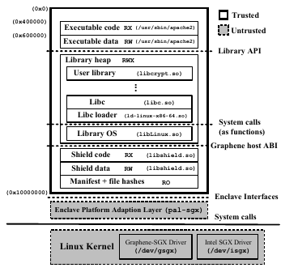

# LURK-T TLS 1.3 client


## Architecture Overview

`pytls13` is a proof of concept of TLS 1.3  designed with Limited Use of Remote Keys with Added Trust (LURK-T).
The ultimate goal of LURK-T is to leverage Trusted Execution Environment (TEE) to ensure **Trustworthy TLS authentication credentials**.

Unlike standard TLS 1.3 libraries, `pytls13` splits the library into two sub modules as depicted below:

* a Cryptographic Service (CS) responsible to host the authentication credentials (secret key, PSK, ...) and perform all associated cryptographic operations.
* a TLS Engine (E) responsible to interact with the CS to handle the TLS 1.3 Handshake

The communication between E and CS is defined in the TLS 1.3 extension of the general LURK framework design to provide various types of cryptographic -based micro-services.

```
+----------------------------+
|       TLS Engine (E)       |
+------------^---------------+
             | (LURK/TLS 1.3)
+------------v---------------+
| Cryptographic Service (CS) |
| private_keys               |
+----------------------------+
```

When the CS runs into a Trusted Execution Environment (TEE), `pytls13` enables __a trustworthy deployment of TLS in untrusted environment__.
More specifically, LURK-T secures the cryptographic credentials and prevent their leaks against vulnerabilities either of the upper layer application or the infrastructure.

The figure below compares the deployment of TLS using a LURK-T versus the deployment of a standard TLS deployment.
In a standard deployment, the TLS library completely runs in an untrusted environment which opens the TLS library to:
* Lateral Attacks (A): Lateral attacks are performed by any __other__ applications than the TLS library, which includes any application the cloud provider may be hosting but also the legitimate application for which the TLS library is expected to provide a protection.
* Cloud Provider (B): The cloud provider can access any hosting resources such as the RAM in which the TLS private key is stored.

With LURK-T, the CS hosts the private keys and other authentication credentials.
Having the CS running in to a TEE considerably limit the exposure of the credentials to interface provided by LURK.
The TEE enclave enforces an isolation that is likely to be the most secure isolation that can be performed today.
More precisely, this isolation is enforced by the CPU.
Note that other isolation mechanisms may also be used including running the E and CS in different processes. At that point isolation is guaranteed by the OS as opposed to the CPU.


```
     LURK-T           Standard TLS
                      Library
 +-------------+  +--------------+
 | Upper Layer |  | Upper Layer  |   <#######
 | Application |  | Application  |    Lateral
 +-------------+  +--------------+    Attacks
 |       E     |  | Standard TLS |     (A)
 +------ ^-----+  |  Library     |   <#######
         |        +--------------+
---------|-----------------^------
 +=======v=====+           #
 |   CS (TEE)  |           #
 +=============+  Cloud Provider (B)

```

LURK-T does not protects the TLS session keys and limits its scope to the keeping authentication credentials trustworthy.
This provides for example the following operational and concrete advantages.

## LURK-T Use Cases

Use Case 1: Upon suspected attacks or any disclosed vulnerabilities, upper layer application MUST be patched.
In the case of a standard TLS Library,  and authentication credential MUST be re-issued, there are no guarantee authentication credentials  have not been leaked and as such ALL authentication credentials MUST be re-issued.
This is not the case with LURK-T.

Use Case 2: Upon changing Cloud provider, deployment that considered a Standard TLS library MUST be re-issued as these have been shared with the former Cloud provider.
With LURK-T the deployment can change cloud providers and benefit from elastic resources from any Cloud provider without impacting the trustworthiness of the credentials.

## Why only protecting authentication credentials ?

One can reasonably wonder why limiting the protection provided by TEE to only the authentication credential as opposed to the full TLS library, for example  which would include  some protection of the session keys.

The short answer is that the additional security provided is very limited with a huge cost associated.
The cost can be easily understood by considering that any interaction with an enclave requires a very heavy context switching. In particular, for SGX enclaves, the interaction between TEE and REE results in 8,200 - 17,000 cycles overhead, as opposed to 150 cycles for a standard system call.
With such paradigm, network application like TLS undergo a huge penalty as incoming always come from outside the enclave.
Respectively outgoing packets are going outside the enclave as well.


On the other hand, that overhead needs to be balanced with the security advantages, it could provide.
Securing the TLS session keys, and the encryption process provides little advantages unless the application itself is trusted.
As a result, the Upper Layer Application is also expected to be in the enclave.
However, depending on the complexity of the application, the application MAY likely contain a bunch of potential vulnerabilities and as such expose the TLS sessions keys and authentication credentials to a large surface of attack.

As a result, one MUST not forget that one reason LURK-T provides the expected security is that in addition to isolating the authentication credential, it provides a very limited ways to interact with these authentication credentials, implemented in a relatively few Line of Codes to limit the probabilities to introduce some vulnerabilities.

We cannot undermine that technology will evolve and that at some points, the overhead associated to context switching might become acceptable in term of performance.
In that case, isolating the CS within the TEE via some hypervisor, nested enclaves would remain areas to investigate.

## Remote Attestation and RA-TLS Overview

While the architecture of the LURK-T TLS remains pretty simple, it remains challenging to set up the CS in a remote data center provisioned with the private key that we do not share with the data center.
This is done in two steps:

1. Ensuring the *expected* CS has been loaded into the TEE (of a remote Cloud provider)
2. Provisioning the private key via a TLS channel that is terminated into this *attested* Enclave.


Defining the Certificate based identity enclave by the *Software Vendor*
with an enclave building tool chain.
```
+--------------------+  +------------+ +-----------------+
| Enclave            |  | Software   | | Software vendor |
+--------------------+  +------------+ +-----------------+
| ATTRIBUTES: DEBUG, |  | ISVPROID   | | K_vendor (RSA)  |
|   XFRM, MODE64BIT  |  | ISVSVN     | | VENDOR          |
+--------------------+  +------------+ +-----------------+

+--------------------------------------------------------+
|            Enclave building tool chain                 |
+--------------------------------------------------------+
                             |
                             v
      +------------------------------------------+
      | SIGSTRUCT:                               |
      +------------------------------------------+
      |   MRMEASUREMENT                          |
      |   MRSIGNER (SHA256( K_vendor module)))   |
      |   ATTRIBUTES                             |
      |   VENDOR                                 |
      |   ISVPRODID                              |
      |   ISVSVN                                 |
      |   DATE                                   |
      |   MODULE   ---- K_vendor                 |
      |   EXPONENT                               |
      |   SIGNATURE                              |
      |   Q1, Q2                                 |
      +------------------------------------------+
```

Initialization and Attestation of the Enclave by the *Cloud Provider*

```
Software               SIGSTRUCT --------------+
   |                       |                   |
   v                       |                   v
+------------------------+ |         +-------------------------+
| ECREATE                | |         | Launch Enclave (LE)     |
+------------------------+ |         +-------------------------+
| Computes SECS          | |         |  Creates/MAC EINITTOKEN |
|   MRENCLAVE            | |         |    MRSIGNER,            |
|   BASEADDR             | |         |    MRENCLAVE,           |
|   SIZE                 | |         |    ISVPRODID,           |
|   SSAFRAMESIZE         | |         |    ISVSVN,    # Key accessed only
|   ATTRIBUTES           | | +-------|    MAC( Key ) # by SGX and ENCLAVE
+------------------------+ | |       +-------------------------+
   |          +------------+ |
+--v----------|--------------|----+  +-------------+
| ENCLAVE     |              |    |  | APPLICATION |
| +-----------v--------------v--+ |  |             |
| | EINIT SIGSTRUCT, EINITTOKEN | |  |             |
| +-----------------------------+ |  |             |
| | Checks:                     | |  |             |
| |   EINITTOKEN.SIGNATURE      | |  |             |
| |   SECS.MRENCLAVE =          | |  |             |
| |     EINITTOKEN.MRENCLAVE    | |  |             |
| |   SECS.ATTRIBUTES =         | |  |             |
| |     EINITTOKEN.ATTRIBUTES   | |  |             |
| +-----------------------------+ |  |             |
| | Complete SECS               | |  |             |
| |   MRENCLAVE                 | |  |             |
| |   BASEADDR                  | |  |             |
| |   SIZE                      | |  |             |
| |   SSAFRAMESIZE              | |  |             |
| |   ATTRIBUTES                | |  |             |
| |   ISVPRODID                 | |  |             |
| |   ISVSVN                    | |  |             |
| |   MRSIGNER                  | |  |             |
| +-----------------------------+ |  |             |
|                                 |  |             |
| +--------------------------+    |  | REPORTDATA  |
| | EREPORT REPORTDATA       |<-------------       |
| +--------------------------+    |  |             |
| | SGX creates/MAC REPORT:  |    |  |             |
| |   MRSIGNER,              |    |  |             |
| |   MRENCLAVE,             |    |  |             |
| |   ISVPRODID,             |    |  |             |
| |   ISVSVN,                |    |  |             |
| |   REPORTDATA=Challenge,  |    |  |             |
| |   CPUSVN,                |    |  | REPORT      |
| |   MAC( Key )*            |----|--|-->          | *Key only accessed
| +--------------------------+    |  |             |  by SGX and QE
+---------------------------------+  |             |
+--------------------------+         | REPORT      |
| Quoting Enclave (QE)     |<----------            |
+--------------------------+         |             |
| K_attestation (EPID)     | (proviosioned and     |
+--------------------------+  certirfied by Intel) |
| Check MAC                |         |             |
| Quote:                   |         |             |
|   REPORT                 |         | QUOTE       |
|   SIGNATURE              |---------------->      |
+--------------------------+         |             |
                                     +-------------+

```
### RA-TLS

Thanks to the attestation response, one knows the appropriated software is running, but we need a bit more to be able to provision some secrets, i.e. we need to set an encrypted channel and use the attestation to authenticate the terminating end point as being  the expected software.

<font size=3>

```
+-----------------------+ +-------------+
| ENCLAVE               | | Application |
| Generates             | |             |
|   Public (K) /        | |             |
|   Private Key (k)     | |             |
| CERTIFICATE:          | |             |
|   K                   | |             |          SIGSTRUCT
|   Attribute:          | |             |              |
|     REPORT            | |             |              v
|       REPORTDATA=H(K) | |             |        +-------------+  +-------------+
|     Intel cert.chain  | |             |        | Verifier    |  | Intel       |
|   Signature( k )      | |             |        |             |  |             |
| TLS server            | |             |   ClientHello        |  | Attestation |
|   <----------------------------------------------------      |  | Service     |
|   ServerHello         | |             |        |             |  | (IAS)       |
|   EncryptedExtensions,| |             |        |             |  |             |
|   Certificate,        | |             |        |             |  |             |
|   CertificateVerify   | |             |        |             |  |             |
|   ServerFinished      | |             |        |             |  |             |
|   ---------------------------------------------------->      |  |             |
|                       | |             |        |     REPORT, SIG(EPID)        |
|                       | |             |        |     ----------------->       |
|                       | |             |        |      Attestation Result      |
|                       | |             |        |     <----------------        |
|                       | |             |        | Validates   |  |             |
|                       | |             |        | Result      |  |             |
|                       | |             |        |   MRENCLAVE |  |             |
|                       | |             |        |   ...       |  |             |
|                       | |             |    ClientFinished    |  |             |
|   <----------------------------------------------------      |  |             |
|                       | |             |        |             |  |             |
+-----------------------+ +-------------+        +-------------+  +-------------+
```
</font>

Note that this only works because:
1. we know the code is generating a fresh pair of keys, and REPORTS tells us this is the code running in the enclave.
2. the key involved is the correct key we are setting the TLS session as that key is bound to the REPORT


Thanks to RA-TLS we have been able to establish a **trustworthy TLS session with the TEE** and we can trustworthy
provision the Enclave with secrets.

Note that in this scheme the ENCLAVE does not authenticate the Verifier, so if secrets are expected by the ENCLAVE, it might be reasonable to use a mutually authenticated TLS.

### Secret provisioning

Secret provisioning heavily relies on RA-TLS, but instead of being initiated by the Verifier, it is initiated by the ENCLAVE.
The Verifier, implements a TLS server and after the authentication of the TLS client (using attestation), the TLS server provides the different secrets.

<font size=3>
```
+-----------------------+ +-------------+
| ENCLAVE               | | Application |
| Generates             | |             |
|   Public (K) /        | |             |
|   Private Key (k)     | |             |
| CERTIFICATE:          | |             |
|   K                   | |             |          SIGSTRUCT
|   Attribute:          | |             |              |
|     REPORT            | |             |              v
|       REPORTDATA=H(K) | |             |        +-------------+  +-------------+
|     Intel cert.chain  | |             |        | Secret Prov |  | Intel       |
|   Signature( k )      | |             |        |             |  | Attestation |
| CA (TLS server)       | |             |        |             |  | Service     |
|    ClientHello        | |             |        |             |  | (IAS)       |
|   ---------------------------------------------------->      |  |             |
|                                   ServerHello                |  |             |
|                                   EncryptedExtensions,       |  |             |
|                                   Certificate,               |  |             |
|                                   CertificateRequest,        |  |             |
|                                   CertificateVerify,         |  |             |
|                                   ServerFinished             |  |             |
|   <----------------------------------------------------      |  |             |
| server Authentication | |             |        |             |  |             |
| (CeritifcateVerify)   | |             |        |             |  |             |
|                       | |             |        |             |  |             |
| Certificate           | |             |        |             |  |             |
| CertificateVerify     | |             |        |             |  |             |
| clientFinished        | |             |        |             |  |             |
|   ---------------------------------------------------->      |  |             |
|                       | |             |        |     REPORT, SIG(EPID)        |
|                       | |             |        |     ----------------->       |
|                       | |             |        |      Attestation Result      |
|                       | |             |        |     <----------------        |
|                       | |             |        | Validates   |  |             |
|                       | |             |        | Result      |  |             |
|                       | |             |        |   MRENCLAVE |  |             |
|                       | |             |        |   ...       |  |             |
|                       | |           Secrets Provisionning    |  |             |
|   <----------------------------------------------------      |  |             |
|                       | |             |        |             |  |             |
+-----------------------+ +-------------+        +-------------+  +-------------+

```
</font>

## LURK-T TLS 1.3 Conclusion

This results in the following high level architecture:

```
+---------------------------------------+          +-----------------+
|        Software Vendor                |          |     (Intel)     |
|                        +------------+ |          | +-------------+ |      
| Crypto Service Code -->| building   | |          | | Attestation | |
| Service Provider ID -->| tool chain | |          | | Service     | |        
|                        +------------+ |          | +-------------+ |
+----------------------------|----------+          +-----------------+ 
                             | CS lib + SIGSTRUCT            ^     
                             +--------------------------+    |     
                             v                          v    |     
                       +--------------------+     +------------------+ 
                       |  Cloud Provider    |     | Service  |       |
 (Web Server)          |                    |     | Provider |       |
+------------+         | +----------------+ |     |          |       |           
| TLS Server |         | |    TLS Client  | |     |          |       |
+------------+         | +----------------+ |     |          |       |
|            <-----------> TLS Engine     | |     |          v       |
|            |         | +- - - - - - - - + |     | +--------------+ |
|            |         | | SGX Enclave    | |     | | Secret       | |
|            |         | | Crypto Service <-------->  Provisioning | |
+------------+         | +----------------+ |     | +--------------+ |
                       +--------------------+     +------------------+
```


LURK-T provides a __trustworthy infrastructure__ that is:
* prevents identity hijacking - thus making vulnerabilities very localized
* ensures patches are sufficient to return into a trustworthy state

LURK-T overhead associated to TEE is minimal as it only happens during the TLS handshake.

TLS 1.3 with LURK-T does prevent an __ongoing TLS session__ against a rogue application or cloud provider performing a man-in-the-middle attack.
TLS sessions secrets are not protected and requires the system to be trustworthy at the time the session is established.

## LURK-T TLS client with  `pytls13` and `pylurk` modules

* `pytls13` is a python3 module that implements the TLS engine (E)
* `pylurk` is a python3 module that implements the TLS Crypto Service (CS) 
* We use the libOS [Gramine](https://gramine.readthedocs.io/) to run the CS in a SGX TEE


The shield library (provided by Gramine) is __responsible__ for loading all the necessary components into the enclave. It includes.
* The Linux librairy OS (`libLinux.so`), the standard C librairues (`ld-linux-x86-64.so` and `libc.so`) __emulates__ the host. These are librarires provided by Gramine.
* Application specific files described in the `manifest`.
Before being loaded each file is checked against its hash contained in the `manifest`.


## Starting the Web Server

In this example, the web server will require the TLS client to authenticate.
```
cd pytls13/tests/openssl
## Starting OpenSSL TLS server (client authentication):
cd  pytls13/tests/openssl/openssl
openssl s_server -cert server.crt -key server.key -www -port 8403 -CAfile client.crt  -debug -keylogfile key.txt -msg -state -tlsextdebug -Verify 1

## note 1: that -verify error validates the certificates up 
## to the CA which needs to be trusted and raises an error. 
## This is why we do not have this option here.
## note 2: that with Verify 1 the signature generated by 
## the client is checked
## note 3: -www indicate sthe Web server returns a Web page
## that contains all connection information. The point here 
## is to receive a response upon sending HTTP GET. 
verify depth is 1, must return a certificate
Using default temp DH parameters
ACCEPT
```

## 1. Service Provider generates a Service Provider ID (SPID)

When EPID is used for attestation, the Service Provider MUST Register to Intel to get a Service Provider ID (SPID) and provide it to the Software Vendor. 
The SPID is part of the Quote and the Quote is used by the Service Provider to attest (via the IAS) the software (in our case the CS). 
As a result, the Quote be generated prior to contact the Service Provider. 

SPID is retrieved by subscribing to [Intel® SGX Attestation Service Utilizing Enhanced Privacy ID (EPID)](https://api.portal.trustedservices.intel.com/EPID-attestation).
The service provides two type of subscriptions:
1. unlinkable service that prevents to even determine if attestation occurs on the same CPU
2. linkable service.

The considered values for the unlinkable service are as mentioned below:
* SPID: 3A2053D125F7AB3642C3FAC6A22BABFD
* primary key: 646457af6dea4427a2aae2e78a7b6ecf
* secondary key: 1dc980e2ada84af1a78383f65557f546

## 2. Software Vendor builds the CS

To enable EPID remote attestation, the Software Vendor MUST build the enclave by specifying the `--ra_type`, `--ra_spid`, `--ra_linkable` to charasterise th eremote attestation as well as `--gramine_dir` to specify the the necessary libraries shipped that implement the ra_tls client.

Note that these arguments are only used by Gramine and as such are only stored in the `python.manifest`.
 
```
cd pylurk.git/example/cli
pylurk.git/example/cli$ ./crypto_service --gramine_build  --ra_type 'epid' --ra_spid 3A2053D125F7AB3642C3FAC6A22BABFD --ra_linkable 0 
 --- Executing: /home/mglt/gitlab/pylurk.git/example/cli/./crypto_service with Namespace(connectivity="'tcp'", host="'127.0.0.1'", port=9400, sig_scheme="'ed25519'", key=None, cert=None, debug=False, test_vector_mode=None, test_vector_file=None, gramine_sgx=False, gramine_direct=False, gramine_build=True, secret_provisioning=False, ra_type="'epid'", ra_spid="'3A2053D125F7AB3642C3FAC6A22BABFD'", ra_linkable="'0'", gramine_dir="'None'")
key file not provided. New key will be generated in /home/mglt/gitlab/pylurk.git/example/cli/sig_key_dir
certificate file not provided. New certificate will be stored in /home/mglt/gitlab/pylurk.git/example/cli/sig_key_dir
Buildinging: make -f Makefile_server_prov clean && make -f Makefile_server_prov app epid GRAMINEDIR=/home/mglt/gramine
Building: make -f Makefile_server_prov clean && make -f Makefile_server_prov app epid GRAMINEDIR=/home/mglt/gramine
rm -f *.manifest *.manifest.sgx *.token *.sig OUTPUT* *.PID TEST_STDOUT TEST_STDERR
rm -f OUTPUT
mglt@nuc:~/gitlab/pylurk.git/example/cli$ cd secret_prov;         rm -f client server_* *.token *.sig *.manifest.sgx *.manifest
rm -f -r scripts/__pycache__
cd secret_prov && \
gramine-manifest \
        -Dlog_level=error \
        -Darch_libdir=/lib/x86_64-linux-gnu \
        -Dra_type=none \
        -Dra_client_spid= \
        -Dra_client_linkable=0 \
        client.manifest.template > client.manifest
gramine-manifest \
        -Dlog_level=error \
        -Darch_libdir=/lib/x86_64-linux-gnu \
        -Dentrypoint=/usr/bin/python3.10 \
        -Dra_type=epid \
        -Dra_client_spid=3A2053D125F7AB3642C3FAC6A22BABFD \
        -Dra_client_linkable=0 \
        python.manifest.template >python.manifest
cc secret_prov/client.c -O2 -fPIE -Wall -std=c11 -I/home/mglt/gramine/tools/sgx/ra-tls -pie -Wl,--enable-new-dtags -lsgx_util -Wl,-rpath,/usr/lib/x86_64-linux-gnu -lsecret_prov_attest -o secret_prov/client
gramine-sgx-sign \
        --manifest python.manifest \
        --output python.manifest.sgx
cd secret_prov && \
gramine-sgx-sign \
        --manifest client.manifest \
        --output client.manifest.sgx
Attributes:
    size:        0x20000000
    thread_num:  4
    isv_prod_id: 0
    isv_svn:     0
    attr.flags:  0x6
    attr.xfrm:   0x3
    misc_select: 0x0
SGX remote attestation:
    None
Memory:
    000000003fd18000-0000000040000000 [REG:R--] (manifest) measured
    000000003fcf8000-000000003fd18000 [REG:RW-] (ssa) measured
    000000003fcf4000-000000003fcf8000 [TCS:---] (tcs) measured
    000000003fcf0000-000000003fcf4000 [REG:RW-] (tls) measured
    000000003fcb0000-000000003fcf0000 [REG:RW-] (stack) measured
    000000003fc70000-000000003fcb0000 [REG:RW-] (stack) measured
    000000003fc30000-000000003fc70000 [REG:RW-] (stack) measured
    000000003fbf0000-000000003fc30000 [REG:RW-] (stack) measured
    000000003fbe0000-000000003fbf0000 [REG:RW-] (sig_stack) measured
    000000003fbd0000-000000003fbe0000 [REG:RW-] (sig_stack) measured
    000000003fbc0000-000000003fbd0000 [REG:RW-] (sig_stack) measured
    000000003fbb0000-000000003fbc0000 [REG:RW-] (sig_stack) measured
    000000003f793000-000000003f7d7000 [REG:R-X] (code) measured
    000000003f7d8000-000000003fbb0000 [REG:RW-] (data) measured
    0000000020000000-000000003f793000 [REG:RWX] (free)
Measurement:
    b88865b1741bf87a7f3c6aaae173ce0e9d7884d1a4e9ed4abdf4473c18f1ca19
gramine-sgx-get-token --output secret_prov/client.token --sig secret_prov/client.sig
Attributes:
    mr_enclave:  b88865b1741bf87a7f3c6aaae173ce0e9d7884d1a4e9ed4abdf4473c18f1ca19
    mr_signer:   e725999b742f47419e5a074b32d8c869711d68d20d059dc987e5c87424cb37a9
    isv_prod_id: 0
    isv_svn:     0
    attr.flags:  0000000000000006
    attr.xfrm:   0000000000000003
    mask.flags:  ffffffffffffffff
    mask.xfrm:   fffffffffff9ff1b
    misc_select: 00000000
    misc_mask:   ffffffff
    modulus:     f19f15a643fbadc6714cbe9e8d670a8a...
    exponent:    3
    signature:   f676be580b9824c423934016f0f82631...
    date:        2023-04-04
cc secret_prov/server.c -O2 -fPIE -Wall -std=c11 -I/home/mglt/gramine/tools/sgx/ra-tls -pie -Wl,--enable-new-dtags -lsgx_util -Wl,-rpath,/usr/lib/x86_64-linux-gnu -lsecret_prov_verify_epid -pthread -o secret_prov/server_epid
Attributes:
    size:        0x20000000
    thread_num:  32
    isv_prod_id: 29539
    isv_svn:     0
    attr.flags:  0x4
    attr.xfrm:   0x3
    misc_select: 0x0
SGX remote attestation:
    EPID (spid = `3A2053D125F7AB3642C3FAC6A22BABFD`, linkable = False)
Memory:
    000000001f929000-0000000020000000 [REG:R--] (manifest) measured
    000000001f829000-000000001f929000 [REG:RW-] (ssa) measured
    000000001f809000-000000001f829000 [TCS:---] (tcs) measured
    000000001f7e9000-000000001f809000 [REG:RW-] (tls) measured
    000000001f7a9000-000000001f7e9000 [REG:RW-] (stack) measured
    000000001f769000-000000001f7a9000 [REG:RW-] (stack) measured
    000000001f729000-000000001f769000 [REG:RW-] (stack) measured
    000000001f6e9000-000000001f729000 [REG:RW-] (stack) measured
    000000001f6a9000-000000001f6e9000 [REG:RW-] (stack) measured
    000000001f669000-000000001f6a9000 [REG:RW-] (stack) measured
    000000001f629000-000000001f669000 [REG:RW-] (stack) measured
    000000001f5e9000-000000001f629000 [REG:RW-] (stack) measured
    000000001f5a9000-000000001f5e9000 [REG:RW-] (stack) measured
    000000001f569000-000000001f5a9000 [REG:RW-] (stack) measured
    000000001f529000-000000001f569000 [REG:RW-] (stack) measured
    000000001f4e9000-000000001f529000 [REG:RW-] (stack) measured
    000000001f4a9000-000000001f4e9000 [REG:RW-] (stack) measured
    000000001f469000-000000001f4a9000 [REG:RW-] (stack) measured
    000000001f429000-000000001f469000 [REG:RW-] (stack) measured
    000000001f3e9000-000000001f429000 [REG:RW-] (stack) measured
    000000001f3a9000-000000001f3e9000 [REG:RW-] (stack) measured
    000000001f369000-000000001f3a9000 [REG:RW-] (stack) measured
    000000001f329000-000000001f369000 [REG:RW-] (stack) measured
    000000001f2e9000-000000001f329000 [REG:RW-] (stack) measured
    000000001f2a9000-000000001f2e9000 [REG:RW-] (stack) measured
    000000001f269000-000000001f2a9000 [REG:RW-] (stack) measured
    000000001f229000-000000001f269000 [REG:RW-] (stack) measured
    000000001f1e9000-000000001f229000 [REG:RW-] (stack) measured
    000000001f1a9000-000000001f1e9000 [REG:RW-] (stack) measured
    000000001f169000-000000001f1a9000 [REG:RW-] (stack) measured
    000000001f129000-000000001f169000 [REG:RW-] (stack) measured
    000000001f0e9000-000000001f129000 [REG:RW-] (stack) measured
    000000001f0a9000-000000001f0e9000 [REG:RW-] (stack) measured
    000000001f069000-000000001f0a9000 [REG:RW-] (stack) measured
    000000001f029000-000000001f069000 [REG:RW-] (stack) measured
    000000001efe9000-000000001f029000 [REG:RW-] (stack) measured
    000000001efd9000-000000001efe9000 [REG:RW-] (sig_stack) measured
    000000001efc9000-000000001efd9000 [REG:RW-] (sig_stack) measured
    000000001efb9000-000000001efc9000 [REG:RW-] (sig_stack) measured
    000000001efa9000-000000001efb9000 [REG:RW-] (sig_stack) measured
    000000001ef99000-000000001efa9000 [REG:RW-] (sig_stack) measured
    000000001ef89000-000000001ef99000 [REG:RW-] (sig_stack) measured
    000000001ef79000-000000001ef89000 [REG:RW-] (sig_stack) measured
    000000001ef69000-000000001ef79000 [REG:RW-] (sig_stack) measured
    000000001ef59000-000000001ef69000 [REG:RW-] (sig_stack) measured
    000000001ef49000-000000001ef59000 [REG:RW-] (sig_stack) measured
    000000001ef39000-000000001ef49000 [REG:RW-] (sig_stack) measured
    000000001ef29000-000000001ef39000 [REG:RW-] (sig_stack) measured
    000000001ef19000-000000001ef29000 [REG:RW-] (sig_stack) measured
    000000001ef09000-000000001ef19000 [REG:RW-] (sig_stack) measured
    000000001eef9000-000000001ef09000 [REG:RW-] (sig_stack) measured
    000000001eee9000-000000001eef9000 [REG:RW-] (sig_stack) measured
    000000001eed9000-000000001eee9000 [REG:RW-] (sig_stack) measured
    000000001eec9000-000000001eed9000 [REG:RW-] (sig_stack) measured
    000000001eeb9000-000000001eec9000 [REG:RW-] (sig_stack) measured
    000000001eea9000-000000001eeb9000 [REG:RW-] (sig_stack) measured
    000000001ee99000-000000001eea9000 [REG:RW-] (sig_stack) measured
    000000001ee89000-000000001ee99000 [REG:RW-] (sig_stack) measured
    000000001ee79000-000000001ee89000 [REG:RW-] (sig_stack) measured
    000000001ee69000-000000001ee79000 [REG:RW-] (sig_stack) measured
    000000001ee59000-000000001ee69000 [REG:RW-] (sig_stack) measured
    000000001ee49000-000000001ee59000 [REG:RW-] (sig_stack) measured
    000000001ee39000-000000001ee49000 [REG:RW-] (sig_stack) measured
    000000001ee29000-000000001ee39000 [REG:RW-] (sig_stack) measured
    000000001ee19000-000000001ee29000 [REG:RW-] (sig_stack) measured
    000000001ee09000-000000001ee19000 [REG:RW-] (sig_stack) measured
    000000001edf9000-000000001ee09000 [REG:RW-] (sig_stack) measured
    000000001ede9000-000000001edf9000 [REG:RW-] (sig_stack) measured
    000000001e9cc000-000000001ea10000 [REG:R-X] (code) measured
    000000001ea11000-000000001ede9000 [REG:RW-] (data) measured
    0000000000010000-000000001e9cc000 [REG:RWX] (free)
Measurement:
    7eddfc41ba3a4f1bc4c5fbfbd85b53eee48ab65430b3bd7d259eb29b33ef2d33
gramine-sgx-get-token --output python.token --sig python.sig
Attributes:
    mr_enclave:  7eddfc41ba3a4f1bc4c5fbfbd85b53eee48ab65430b3bd7d259eb29b33ef2d33
    mr_signer:   e725999b742f47419e5a074b32d8c869711d68d20d059dc987e5c87424cb37a9
    isv_prod_id: 29539
    isv_svn:     0
    attr.flags:  0000000000000004
    attr.xfrm:   0000000000000003
    mask.flags:  ffffffffffffffff
    mask.xfrm:   fffffffffff9ff1b
    misc_select: 00000000
    misc_mask:   ffffffff
    modulus:     f19f15a643fbadc6714cbe9e8d670a8a...
    exponent:    3
    signature:   6ea4c330222c453171282aa8f44a884a...
    date:        2023-04-04

```

The CS is composed of the following files:
* `python.manifest.template`: which contains the main configuration parameters for Gramine to run the CS in the SGX enclave
* `python.manifest`: contains the exhaustive configuration parameters for Gramine.
* `python.manifest.sgx`: contains an exhaustive list of files and their associated hash that are included in the SGX enclave by Gramine 
* `python.sig`: defines the SIGSTRUCT
* `python.token` : contains the EINITTOKEN (or SIGSTRUCT)

## 3. The Service Provider starts the Service Provisioning

Eventually you may build (aka compile the service Provisioning Service). 
In our case, this is not useful as the building phase has been performed while building the CS.

```
$ cd ~/gitlab/pylurk.git/example/cli
$ ./secret_prov_service --build
```

The Secret Provisioning Service takes as argument:
* `secret`: the secret to be provisioned. In our case, this is the private key.
* `sig_file`: the file containing the SIGSTRUCTURE
* `epid_api_key`:the key to be authenticated by the IAS (RA_TLS_EPID_API_KEY).
* `key`, `cert`: TLS key and certificate (stored in the pylurk.git/example/cli/tls_secret_prov directory

```
$ cd ~/gitlab/pylurk.git/example/cli
./secret_prov_service --secret ~/gitlab/pylurk.git/example/cli/sig_key_dir/_Ed25519PrivateKey-ed25519-pkcs8.der --sig_file ~/gitlab/pylurk.git/example/cli/python.sig --epid_api_key 646457af6dea4427a2aae2e78a7b6ecf
Starting Secret Provision Service:
(Reading attributes from /home/mglt/gitlab/pylurk.git/example/cli/python.sig)
    - mrenclave: 7eddfc41ba3a4f1bc4c5fbfbd85b53eee48ab65430b3bd7d259eb29b33ef2d33
    - mrsigner: e725999b742f47419e5a074b32d8c869711d68d20d059dc987e5c87424cb37a9
    - isv_prod_id: 29539
    - isv_svn: 0 
    - secret: /home/mglt/gitlab/pylurk.git/example/cli/sig_key_dir/_Ed25519PrivateKey-ed25519-pkcs8.der

secret_key [48 bytes]:
30 2E 2 1 0 30 5 6 3 2B 65 70 4 22 4 20 12 F 12 D8 DB 8F ED B0 15 49 EC 5C 63 6D DB 55 D9 7A 66 BE A7 17 6A 2C 96 47 BD A5 12 82 23 9A 
--- Starting the Secret Provisioning server on port 4433 ---
```

This results in the Secret Provisioning Service Listening on port 4433. 
The port can be configured, but it is currently hard coded in the client. 

## 4. The Service Provider starts the CS in the Cloud Provider


At first the Service Provider checks the Cloud Provider supports attestation and Gramine.

Documentation of the API can be found [here](https://api.trustedservices.intel.com/documents/sgx-attestation-api-spec.pdf)

[Intel® SGX Software Installation Guide](https://download.01.org/intel-sgx/latest/linux-latest/docs/Intel_SGX_SW_Installation_Guide_for_Linux.pdf) provides installation of the SGX SDK and the Platform Software (PSW), which is detailed below for Linux 2022.


```
$ uname -a
Linux nuc 5.15.0-67-generic #74-Ubuntu SMP Wed Feb 22 14:14:39 UTC 2023 x86_64 x86_64 x86_64 GNU/Linux
$ echo 'deb [signed-by=/etc/apt/keyrings/intel-sgx-keyring.asc

$ wget https://download.01.org/intel-sgx/sgx_repo/ubuntu/intel-sgx-deb.key
cat intel-sgx-deb.key | sudo tee /etc/apt/keyrings/intel-sgx-keyring.asc > /dev/null
$ sudo apt-get update
$ sudo apt-get install libsgx-epid libsgx-quote-ex libsgx-dcap-ql
Reading package lists... Done
Building dependency tree... Done
Reading state information... Done
The following additional packages will be installed:
  libsgx-ae-epid libsgx-ae-id-enclave libsgx-ae-pce libsgx-ae-qe3
  libsgx-ae-qve libsgx-aesm-ecdsa-plugin libsgx-aesm-epid-plugin
  libsgx-aesm-pce-plugin libsgx-aesm-quote-ex-plugin
  libsgx-dcap-quote-verify libsgx-pce-logic libsgx-qe3-logic
  sgx-aesm-service
The following NEW packages will be installed:
  libsgx-ae-epid libsgx-ae-id-enclave libsgx-ae-pce libsgx-ae-qe3
  libsgx-aesm-ecdsa-plugin libsgx-aesm-epid-plugin
  libsgx-aesm-pce-plugin libsgx-aesm-quote-ex-plugin
  libsgx-dcap-ql libsgx-epid libsgx-pce-logic libsgx-qe3-logic
  libsgx-quote-ex sgx-aesm-service
The following packages will be upgraded:
  libsgx-ae-qve libsgx-dcap-quote-verify
2 upgraded, 14 newly installed, 0 to remove and 8 not upgraded.
Need to get 4,127 kB of archives.
After this operation, 9,907 kB of additional disk space will be used.
Do you want to continue? [Y/n] Y
$ sudo apt-get install libsgx-urts-dbgsym libsgx-enclave-common-dbgsym libsgx-dcap-ql-dbgsym libsgx-dcap-default-qpl-dbgsym
Reading package lists... Done
Building dependency tree... Done
Reading state information... Done
The following additional packages will be installed:
  libsgx-dcap-default-qpl libsgx-enclave-common libsgx-urts
Recommended packages:
  libsgx-launch
The following NEW packages will be installed:
  libsgx-dcap-default-qpl libsgx-dcap-default-qpl-dbgsym
  libsgx-dcap-ql-dbgsym libsgx-enclave-common-dbgsym
  libsgx-urts-dbgsym
The following packages will be upgraded:
  libsgx-enclave-common libsgx-urts
2 upgraded, 5 newly installed, 0 to remove and 6 not upgraded.
Need to get 2,529 kB of archives.
After this operation, 3,976 kB of additional disk space will be used.
Do you want to continue? [Y/n] Y
```

The results shows that AESMD and SGX PSW has been successfully installed.

```
$ is-sgx-available
SGX supported by CPU: true
SGX1 (ECREATE, EENTER, ...): true
SGX2 (EAUG, EACCEPT, EMODPR, ...): true
Flexible Launch Control (IA32_SGXPUBKEYHASH{0..3} MSRs): true
SGX extensions for virtualizers (EINCVIRTCHILD, EDECVIRTCHILD, ESETCONTEXT): false
Extensions for concurrent memory management (ETRACKC, ELDBC, ELDUC, ERDINFO): false
CET enclave attributes support (See Table 37-5 in the SDM): false
Key separation and sharing (KSS) support (CONFIGID, CONFIGSVN, ISVEXTPRODID, ISVFAMILYID report fields): false
Max enclave size (32-bit): 0x80000000
Max enclave size (64-bit): 0x1000000000
EPC size: 0x5e00000
SGX driver loaded: true
AESMD installed: true
SGX PSW/libsgx installed: true
```


Once the Secret Provisioning Service has been started, the Service Provider starts the CS in the Cloud Provider infrastructure. 
The CS will be a TCP server running in a SGX enclave and provisioned upon being attested listening on port 9401.
   
```
$ cd ~/gitlab/pylurk.git/example/cli
$ ./crypto_service --connectivity tcp --port 9401 --cert sig_key_dir/_Ed25519PublicKey-ed25519-X509.der --gramine_sgx --secret_provisioning 
 --- Executing: /home/mglt/gitlab/pylurk.git/example/cli/./crypto_service with Namespace(connectivity="'tcp'", host="'127.0.0.1'", port=9401, sig_scheme="'ed25519'", key=None, cert=PosixPath('sig_key_dir/_Ed25519PublicKey-ed25519-X509.der'), debug=False, test_vector_mode=None, test_vector_file=None, gramine_sgx=True, gramine_direct=False, gramine_build=False, secret_provisioning=True, ra_type="'None'", ra_spid="'None'", ra_linkable="'None'", gramine_dir="'None'")
key file not provided. New key will be generated in /home/mglt/gitlab/pylurk.git/example/cli/sig_key_dir
cmd: ./start_cs.py --connectivity tcp --host 127.0.0.1 --port 9401 --sig_scheme ed25519 --key sig_key_dir --cert ./sig_key_dir/_Ed25519PublicKey-ed25519-X509.der --secret_provisioning
Gramine is starting. Parsing TOML manifest file, this may take some time...
mglt@nuc:~/gitlab/pylurk.git/example/cli$ Detected a huge manifest, preallocating 64MB of internal memory.
-----------------------------------------------------------------------------------------------------------------------
Gramine detected the following insecure configurations:

  - loader.insecure__use_cmdline_argv = true   (forwarding command-line args from untrusted host to the app)
  - sgx.allowed_files = [ ... ]                (some files are passed through from untrusted host without verification)

Gramine will continue application execution, but this configuration must not be used in production!
-----------------------------------------------------------------------------------------------------------------------

Detected a huge manifest, preallocating 64MB of internal memory.
secret_received [48]:
30 2E 2 1 0 30 5 6 3 2B 65 70 4 22 4 20 12 F 12 D8 DB 8F ED B0 15 49 EC 5C 63 6D DB 55 D9 7A 66 BE A7 17 6A 2C 96 47 BD A5 12 82 23 9A 0 
--- secret successfully stored
 --- Executing: //./start_cs.py with Namespace(connectivity="'tcp'", host="'127.0.0.1'", port=9401, sig_scheme="'ed25519'", key=PosixPath('sig_key_dir'), cert=PosixPath('sig_key_dir/_Ed25519PublicKey-ed25519-X509.der'), debug=False, test_vector_mode=None, test_vector_file=None, gramine_sgx=False, gramine_direct=False, gramine_build=False, secret_provisioning=True, ra_type="'None'", ra_spid="'None'", ra_linkable="'None'", gramine_dir="'None'")
Provisionning the secret key (and overwritting existing value if present)
cs_template_conf: {'log': None, 'connectivity': {'type': 'tcp', 'ip': '127.0.0.1', 'port': 9401}, ('tls13', 'v1'): {'sig_scheme': ['ed25519'], 'public_key': [PosixPath('sig_key_dir/_Ed25519PublicKey-ed25519-X509.der')], 'private_key': 'secret_prov/secret.bin', 'debug': {'trace': False}}}
Configuration Template (from end user arguments ):

{'log': None,
 'connectivity': {'type': 'tcp',
                  'ip': '127.0.0.1',
                  'port': 9401},
 ('tls13', 'v1'): {'sig_scheme': ['ed25519'],
                   'public_key': [PosixPath('sig_key_dir/_Ed25519PublicKey-ed25519-X509.der')],
                   'private_key': 'secret_prov/secret.bin',
                   'debug': {'trace': False}}}
Full configuration:

{'profile': 'explicit configuration',
 'description': 'LURK Cryptographic Service configuration '
                'template',
 'connectivity': {'type': 'tcp',
                  'ip': '127.0.0.1',
                  'port': 9401},
 'enabled_extensions': [('lurk', 'v1'), ('tls13', 'v1')],
 ('lurk', 'v1'): {'type_authorized': ['ping', 'capabilities']},
 ('tls13', 'v1'): {'debug': {'trace': False},
                   'role': 'client',
                   'type_authorized': ['c_init_client_finished',
                                       'c_post_hand_auth',
                                       'c_init_client_hello',
                                       'c_server_hello',
                                       'c_client_finished',
                                       'c_register_tickets'],
                   'ephemeral_method_list': ['no_secret',
                                             'cs_generated',
                                             'e_generated'],
                   'authorized_ecdhe_group': ['secp256r1',
                                              'secp384r1',
                                              'secp521r1',
                                              'x25519',
                                              'x448'],
                   'sig_scheme': ['ed25519'],
                   'client_early_secret_authorized': True,
                   'early_exporter_secret_authorized': True,
                   'exporter_secret_authorized': True,
                   'app_secret_authorized': True,
                   'resumption_secret_authorized': True,
                   's_init_early_secret_session_id': True,
                   'last_exchange': {'s_init_cert_verify': False,
                                     's_hand_and_app_secret': False,
                                     'c_init_client_finished': False,
                                     'c_init_post_auth': False,
                                     'c_client_finished': False},
                   'max_tickets': 6,
                   'ticket_life_time': 172800,
                   'ticket_nonce_len': 20,
                   'ticket_generation_method': 'ticket',
                   'ticket_len': 4,
                   'post_handshake_authentication': True,
                   'max_post_handshake_authentication': 1,
                   'public_key': [PosixPath('sig_key_dir/_Ed25519PublicKey-ed25519-X509.der')],
                   'private_key': 'secret_prov/secret.bin',
                   '_private_key': <cryptography.hazmat.backends.openssl.ed25519._Ed25519PrivateKey object at 0x9588310>,
                   '_public_key': <cryptography.hazmat.backends.openssl.ed25519._Ed25519PublicKey object at 0x95890c0>,
                   '_cert_type': 'X509',
                   '_cert_entry_list': [{'cert': b'0\x82\x01.'
                                                 b'0\x81\xe1\xa0'
                                                 b'\x03\x02\x01\x02'
                                                 b'\x02\x14&?'
                                                 b'V\xc5s\xf6'
                                                 b'k6\xd8\x9a'
                                                 b'\x0f\xc7\xdb\xaf'
                                                 b'J\xcf\xf7\xa3'
                                                 b'r\x0f0\x05'
                                                 b'\x06\x03+e'
                                                 b'p0\x1a1'
                                                 b'\x180\x16\x06'
                                                 b'\x03U\x04\x03'
                                                 b'\x0c\x0fcr'
                                                 b'yptography.i'
                                                 b'o0\x1e\x17'
                                                 b'\r23032320151'
                                                 b'4Z\x17\r2304'
                                                 b'23201514'
                                                 b'Z0\x1a1'
                                                 b'\x180\x16\x06'
                                                 b'\x03U\x04\x03'
                                                 b'\x0c\x0fcr'
                                                 b'yptography.i'
                                                 b'o0*0'
                                                 b'\x05\x06\x03+'
                                                 b'ep\x03!'
                                                 b'\x00o~\xb8'
                                                 b'\xf5\xa3(\xa4'
                                                 b'\xb9\xc5V\xfc'
                                                 b'3\x88\x94\x96'
                                                 b'QK\xa3\x14'
                                                 b'\xa6\xcc\xaf\x86'
                                                 b'tX|$'
                                                 b'\x93\xad\\\xa6'
                                                 b'\xd8\xa390'
                                                 b'70\x1a\x06'
                                                 b'\x03U\x1d\x11'
                                                 b'\x04\x130\x11'
                                                 b'\x82\x0fcr'
                                                 b'yptography.i'
                                                 b'o0\x0b\x06'
                                                 b'\x03U\x1d\x0f'
                                                 b'\x04\x04\x03\x02'
                                                 b'\x02\xd40\x0c'
                                                 b'\x06\x03U\x1d'
                                                 b'\x13\x01\x01\xff'
                                                 b'\x04\x020\x00'
                                                 b'0\x05\x06\x03'
                                                 b'+ep\x03'
                                                 b'A\x00I\xd2'
                                                 b'L\x07\\\x93'
                                                 b'\xae\xaa\x98\x03'
                                                 b'j\xd6\xe4%'
                                                 b'etE\xbd'
                                                 b'N\x15\xfb\x14'
                                                 b'\xfd\x8dW\x9b'
                                                 b'\x80\xc5\xf5\x81'
                                                 b'\x95\x9f\xa0\xaa'
                                                 b'u\x04\xf1\xf8'
                                                 b'l\xfa\xfc\x0e'
                                                 b'\xbd\xee:\xf7'
                                                 b'\xfa\xec\xd3d'
                                                 b"\xff\x86'\xa6"

```

Once can see that the secret has been received by the CS.

Looking at the Secret Provisioning Service one can see the information provided by the QUOTE matches those expected - that is read from the SIGSTRUCT in `python.sig`.

```
IAS report: signature verified correctly
IAS report: allowing quote status GROUP_OUT_OF_DATE
            [ advisory URL: https://security-center.intel.com ]
            [ advisory IDs: ["INTEL-SA-00381", "INTEL-SA-00389", "INTEL-SA-00465", "INTEL-SA-00477", "INTEL-SA-00528", "INTEL-SA-00617", "INTEL-SA-00657", "INTEL-SA-00767"] ]
Received the following measurements from the client:
  - MRENCLAVE:   7eddfc41ba3a4f1bc4c5fbfbd85b53eee48ab65430b3bd7d259eb29b33ef2d33
  - MRSIGNER:    e725999b742f47419e5a074b32d8c869711d68d20d059dc987e5c87424cb37a9
  - ISV_PROD_ID: 29539
  - ISV_SVN:     0
Comparing with provided values:
```
Note that Comparing with provided values is only followed by unexpected values, so here it means everything works as expected.

## 5. Testing CS connectivity

The Service Provider may be willing to check the connectivity of the CS before starting the TLS E. 

```
pylurk.git/example/cli$ ./lurk_ping --con tcp --port 9401
 --- Executing: /home/mglt/gitlab/pylurk.git/example/cli/./lurk_ping with Namespace(connectivity="'tcp'", host="'127.0.0.1'", port=9401)
--- E -> CS: Sending ping Request:
--- E <- CS: Receiving ping Response:
LURK PING (127.0.0.1:9401): time 0.0029506683349609375 ms.
```

## 6. The Service Provider starts the E in the Cloud Provider

The `tls_client` performs an HTTP GET to the web server (127.0.0.1:8403), via the CS (tcp, 127.0.0.1:9401). 

The `reconnect` option indicates that a first session is established using certificate authentication followed by PSK authentication.

The `debug` indicate sthat all messages are provided as well as internal variable used by TLS to establish a secure session.


```
cd pytls13/example/cli
./tls_client https://127.0.0.1:8403 --cert ~/gitlab/pylurk.git/example/cli/sig_key_dir/_Ed25519PublicKey-ed25519-X509.der --connectivity tcp --host 127.0.0.1 --port 9401 --reconnect --debug > log.log

 --- Executing: /home/mglt/gitlab/pytls13/example/cli/./tls_client with Namespace(connectivity="'tcp'", host="'127.0.0.1'", port=9401, sig_scheme="'ed25519'", key=None, cert=PosixPath('/home/mglt/gitlab/pylurk.git/example/cli/sig_key_dir/_Ed25519PublicKey-ed25519-X509.der'), debug=True, test_vector_mode=None, test_vector_file=None, gramine_sgx=False, gramine_direct=False, gramine_build=False, secret_provisioning=False, ra_type="'None'", ra_spid="'None'", ra_linkable="'None'", gramine_dir="'None'", url="'https://127.0.0.1:8403'", no_session_resumption=False, freshness="'sha256'", ephemeral_method="'cs_generated'", supported_ecdhe_groups="'x25519'", reconnect=True, cs_auto_start=False, cs_gramine_sgx=False, cs_gramine_direct=False, cs_gramine_build=False)
args.key: None
args.cert: /home/mglt/gitlab/pylurk.git/example/cli/sig_key_dir/_Ed25519PublicKey-ed25519-X509.der
cmd: ./start_e.py --freshness 'sha256' --ephemeral_method cs_generated --supported_ecdhe_groups 'x25519'  --reconnect   --debug --connectivity tcp --host 127.0.0.1 --port 9401 --sig_scheme ed25519 --key None --cert /home/mglt/gitlab/pylurk.git/example/cli/sig_key_dir/_Ed25519PublicKey-ed25519-X509.der  'https://127.0.0.1:8403'
 --- Executing: /home/mglt/gitlab/pytls13/example/cli/./start_e.py with Namespace(connectivity="'tcp'", host="'127.0.0.1'", port=9401, sig_scheme="'ed25519'", key=PosixPath('None'), cert=PosixPath('/home/mglt/gitlab/pylurk.git/example/cli/sig_key_dir/_Ed25519PublicKey-ed25519-X509.der'), debug=True, test_vector_mode=None, test_vector_file=None, gramine_sgx=False, gramine_direct=False, gramine_build=False, secret_provisioning=False, ra_type="'None'", ra_spid="'None'", ra_linkable="'None'", gramine_dir="'None'", url="'https://127.0.0.1:8403'", no_session_resumption=False, freshness="'sha256'", ephemeral_method="'cs_generated'", supported_ecdhe_groups="'x25519'", reconnect=True, cs_auto_start=False, cs_gramine_sgx=False, cs_gramine_direct=False, cs_gramine_build=False)

Configuration Template (from end user arguments ):

{'destination': {'ip': '127.0.0.1', 'port': 8403},
 'sent_data': b'GET / HTTP/1.1\r\nHost: 127.0.0.1\r\nuser-agent:'
              b' pytls13/0.1\r\naccept: */*\r\n\r\n',
 'debug': {'trace': True},
 'lurk_client': {'connectivity': {'type': 'tcp',
                                  'ip': '127.0.0.1',
                                  'port': 9401},
                 'freshness': 'sha256'},
 'tls13': {'ephemeral_method': 'cs_generated',
           'supported_ecdhe_groups': ['x25519'],
           'session_resumption': True},
 'cs': {'log': None,
        'connectivity': {'type': 'tcp',
                         'ip': '127.0.0.1',
                         'port': 9401},
        ('tls13', 'v1'): {'sig_scheme': ['ed25519'],
                          'public_key': [PosixPath('/home/mglt/gitlab/pylurk.git/example/cli/sig_key_dir/_Ed25519PublicKey-ed25519-X509.der')],
                          'debug': {'trace': True}}}}

Full configuration:

{'role': 'client',
 'description': 'TLS 1.3 Client configuration template',
 'debug': {'trace': True},
 'lurk_client': {'freshness': 'sha256',
                 'connectivity': {'type': 'tcp',
                                  'ip': '127.0.0.1',
                                  'port': 9401}},
 'tls13': {'ke_modes': ['psk_dhe_ke'],
           'session_resumption': True,
           'post_handshake_authentication': False,
           'signature_algorithms': ['rsa_pkcs1_sha256',
                                    'rsa_pkcs1_sha384',
                                    'rsa_pkcs1_sha512',
                                    'ecdsa_secp256r1_sha256',
                                    'ecdsa_secp384r1_sha384',
                                    'ecdsa_secp521r1_sha512',
                                    'rsa_pss_rsae_sha256',
                                    'rsa_pss_rsae_sha384',
                                    'rsa_pss_pss_sha256',
                                    'rsa_pss_pss_sha384',
                                    'rsa_pss_pss_sha256',
                                    'ed25519',
                                    'ed448',
                                    'rsa_pkcs1_sha1'],
           'ephemeral_method': 'cs_generated',
           'supported_ecdhe_groups': ['x25519']},
 'cs': {('tls13', 'v1'): {'public_key': [PosixPath('/home/mglt/gitlab/pylurk.git/example/cli/sig_key_dir/_Ed25519PublicKey-ed25519-X509.der')],
                          'sig_scheme': ['ed25519'],
                          '_public_key': <cryptography.hazmat.backends.openssl.ed25519._Ed25519PublicKey object at 0x7f1553229cc0>,
                          '_cert_type': 'X509',
                          '_cert_entry_list': [{'cert': b'0\x82\x01.'
                                                        b'0\x81\xe1\xa0'
                                                        b'\x03\x02\x01\x02'
                                                        b'\x02\x14&?'
                                                        b'V\xc5s\xf6'
                                                        b'k6\xd8\x9a'
                                                        b'\x0f\xc7\xdb\xaf'
                                                        b'J\xcf\xf7\xa3'
                                                        b'r\x0f0\x05'
                                                        b'\x06\x03+e'
                                                        b'p0\x1a1'
                                                        b'\x180\x16\x06'
                                                        b'\x03U\x04\x03'
                                                        b'\x0c\x0fcr'
                                                        b'ypto'
                                                        b'grap'
                                                        b'hy.i'
                                                        b'o0\x1e\x17'
                                                        b'\r230'
                                                        b'3232'
                                                        b'0151'
                                                        b'4Z\x17\r'
                                                        b'2304'
                                                        b'2320'
                                                        b'1514'
                                                        b'Z0\x1a1'
                                                        b'\x180\x16\x06'
                                                        b'\x03U\x04\x03'
                                                        b'\x0c\x0fcr'
                                                        b'ypto'
                                                        b'grap'
                                                        b'hy.i'
                                                        b'o0*0'
                                                        b'\x05\x06\x03+'
                                                        b'ep\x03!'
                                                        b'\x00o~\xb8'
                                                        b'\xf5\xa3(\xa4'
                                                        b'\xb9\xc5V\xfc'
                                                        b'3\x88\x94\x96'
                                                        b'QK\xa3\x14'
                                                        b'\xa6\xcc\xaf\x86'
                                                        b'tX|$'
                                                        b'\x93\xad\\\xa6'
                                                        b'\xd8\xa390'
                                                        b'70\x1a\x06'
                                                        b'\x03U\x1d\x11'
                                                        b'\x04\x130\x11'
                                                        b'\x82\x0fcr'
                                                        b'ypto'
                                                        b'grap'
                                                        b'hy.i'
                                                        b'o0\x0b\x06'
                                                        b'\x03U\x1d\x0f'
                                                        b'\x04\x04\x03\x02'
                                                        b'\x02\xd40\x0c'
                                                        b'\x06\x03U\x1d'
                                                        b'\x13\x01\x01\xff'
                                                        b'\x04\x020\x00'
                                                        b'0\x05\x06\x03'
                                                        b'+ep\x03'
                                                        b'A\x00I\xd2'
                                                        b'L\x07\\\x93'
                                                        b'\xae\xaa\x98\x03'
                                                        b'j\xd6\xe4%'
                                                        b'etE\xbd'
                                                        b'N\x15\xfb\x14'
                                                        b'\xfd\x8dW\x9b'
                                                        b'\x80\xc5\xf5\x81'
                                                        b'\x95\x9f\xa0\xaa'
                                                        b'u\x04\xf1\xf8'
                                                        b'l\xfa\xfc\x0e'
                                                        b'\xbd\xee:\xf7'
                                                        b'\xfa\xec\xd3d'
                                                        b"\xff\x86'\xa6"
                                                        b'\rH\xdd|'
                                                        b'\xc5rkd'
                                                        b'\x8f\t',
                                                'extensions': []}],
                          '_finger_print_entry_list': [{'finger_print': b'Y3{\xe1',
                                                        'extensions': []}],
                          '_finger_print_dict': {b'Y3{\xe1': b'0\x82\x01.'
                                                             b'0\x81\xe1\xa0'
                                                             b'\x03\x02\x01\x02'
                                                             b'\x02\x14&?'
                                                             b'V\xc5s\xf6'
                                                             b'k6\xd8\x9a'
                                                             b'\x0f\xc7\xdb\xaf'
                                                             b'J\xcf\xf7\xa3'
                                                             b'r\x0f0\x05'
                                                             b'\x06\x03+e'
                                                             b'p0\x1a1'
                                                             b'\x180\x16\x06'
                                                             b'\x03U\x04\x03'
                                                             b'\x0c\x0fcr'
                                                             b'ypto'
                                                             b'grap'
                                                             b'hy.i'
                                                             b'o0\x1e\x17'
                                                             b'\r230'
                                                             b'3232'
                                                             b'0151'
                                                             b'4Z\x17\r'
                                                             b'2304'
                                                             b'2320'
                                                             b'1514'
                                                             b'Z0\x1a1'
                                                             b'\x180\x16\x06'
                                                             b'\x03U\x04\x03'
                                                             b'\x0c\x0fcr'
                                                             b'ypto'
                                                             b'grap'
                                                             b'hy.i'
                                                             b'o0*0'
                                                             b'\x05\x06\x03+'
                                                             b'ep\x03!'
                                                             b'\x00o~\xb8'
                                                             b'\xf5\xa3(\xa4'
                                                             b'\xb9\xc5V\xfc'
                                                             b'3\x88\x94\x96'
                                                             b'QK\xa3\x14'
                                                             b'\xa6\xcc\xaf\x86'
                                                             b'tX|$'
                                                             b'\x93\xad\\\xa6'
                                                             b'\xd8\xa390'
                                                             b'70\x1a\x06'
                                                             b'\x03U\x1d\x11'
                                                             b'\x04\x130\x11'
                                                             b'\x82\x0fcr'
                                                             b'ypto'
                                                             b'grap'
                                                             b'hy.i'
                                                             b'o0\x0b\x06'
                                                             b'\x03U\x1d\x0f'
                                                             b'\x04\x04\x03\x02'
                                                             b'\x02\xd40\x0c'
                                                             b'\x06\x03U\x1d'
                                                             b'\x13\x01\x01\xff'
                                                             b'\x04\x020\x00'
                                                             b'0\x05\x06\x03'
                                                             b'+ep\x03'
                                                             b'A\x00I\xd2'
                                                             b'L\x07\\\x93'
                                                             b'\xae\xaa\x98\x03'
                                                             b'j\xd6\xe4%'
                                                             b'etE\xbd'
                                                             b'N\x15\xfb\x14'
                                                             b'\xfd\x8dW\x9b'
                                                             b'\x80\xc5\xf5\x81'
                                                             b'\x95\x9f\xa0\xaa'
                                                             b'u\x04\xf1\xf8'
                                                             b'l\xfa\xfc\x0e'
                                                             b'\xbd\xee:\xf7'
                                                             b'\xfa\xec\xd3d'
                                                             b"\xff\x86'\xa6"
                                                             b'\rH\xdd|'
                                                             b'\xc5rkd'
                                                             b'\x8f\t'}}},
 'destination': {'ip': '127.0.0.1', 'port': 8403},
 'sent_data': b'GET / HTTP/1.1\r\nHost: 127.0.0.1\r\nuser-agent:'
              b' pytls13/0.1\r\naccept: */*\r\n\r\n'}
======================================================
========= TLS with certificate authentication ========
======================================================

::Instantiating the Lurk client
--- E -> CS: Sending ping Request:
--- E <- CS: Receiving ping Response:
::TCP session with the TLS server
--- E -> CS: Sending c_init_client_hello Request:
--- E <- CS: Receiving c_init_client_hello Response:
:: 
Sending client_hello
  - TLS record 1 client_client_hello [177 bytes]:
16 03 03 00 ac 01 00 00 a8 03 03 70 1b 1d 81 2e
12 4c 9e ba 0b df f6 62 3a 2d 73 ce 00 6d 9a 0f
a2 c7 c3 3f 98 d3 98 4b 26 0f f3 20 85 2d 0c 1b
00 8d c9 af d1 8d ca de f9 88 8d c0 43 64 72 dc
94 5d d7 b9 ad 60 36 6b 3c 62 6f 9c 00 04 13 01
13 03 01 00 00 5b 00 2b 00 03 02 03 04 00 0d 00
1e 00 1c 04 01 05 01 06 01 04 03 05 03 06 03 08
04 08 05 08 09 08 0a 08 09 08 07 08 08 02 01 00
0a 00 04 00 02 00 1d 00 33 00 26 00 24 00 1d 00
20 41 07 b7 9a ba 03 ef f4 45 72 dd 3f 2f 8a b5
ad d6 5f 66 dd e3 f6 64 d0 7e e8 0e ce d1 42 02
54
  - TLS record 1 client_client_hello: Container: 
    type = (enum) handshake 22
    legacy_record_version = b'\x03\x03' (total 2)
    fragment = Container: 
        msg_type = (enum) client_hello 1
        data = Container: 
            legacy_version = b'\x03\x03' (total 2)
            random = b'p\x1b\x1d\x81.\x12L\x9e\xba\x0b\xdf\xf6b:-s'... (truncated, total 32)
            legacy_session_id = b'\x85-\x0c\x1b\x00\x8d\xc9\xaf\xd1\x8d\xca\xde\xf9\x88\x8d\xc0'... (truncated, total 32)
            cipher_suites = ListContainer: 
                TLS_AES_128_GCM_SHA256
                TLS_CHACHA20_POLY1305_SHA256
            legacy_compression_methods = b'\x00' (total 1)
            extensions = ListContainer: 
                Container: 
                    extension_type = (enum) supported_versions 43
                    extension_data = Container: 
                        versions = ListContainer: 
                            b'\x03\x04'
                Container: 
                    extension_type = (enum) signature_algorithms 13
                    extension_data = Container: 
                        supported_signature_algorithms = ListContainer: 
                            rsa_pkcs1_sha256
                            rsa_pkcs1_sha384
                            rsa_pkcs1_sha512
                            ecdsa_secp256r1_sha256
                            ecdsa_secp384r1_sha384
                            ecdsa_secp521r1_sha512
                            rsa_pss_rsae_sha256
                            rsa_pss_rsae_sha384
                            rsa_pss_pss_sha256
                            rsa_pss_pss_sha384
                            rsa_pss_pss_sha256
                            ed25519
                            ed448
                            rsa_pkcs1_sha1
                Container: 
                    extension_type = (enum) supported_groups 10
                    extension_data = Container: 
                        named_group_list = ListContainer: 
                            x25519
                Container: 
                    extension_type = (enum) key_share 51
                    extension_data = Container: 
                        client_shares = ListContainer: 
                            Container: 
                                group = (enum) x25519 b'\x00\x1d'
                                key_exchange = b'A\x07\xb7\x9a\xba\x03\xef\xf4Er\xdd?/\x8a\xb5\xad'... (truncated, total 32)

:: Receiving new plain text fragment
  - TLS record 1 server_fragment_bytes [127 bytes]:
16 03 03 00 7a 02 00 00 76 03 03 8e 43 52 f1 cc
6d 75 9d c0 36 37 17 d6 ac b8 f9 4e 8f f1 3a 6f
49 e3 80 06 d1 3c b0 83 14 c8 0f 20 85 2d 0c 1b
00 8d c9 af d1 8d ca de f9 88 8d c0 43 64 72 dc
94 5d d7 b9 ad 60 36 6b 3c 62 6f 9c 13 01 00 00
2e 00 2b 00 02 03 04 00 33 00 24 00 1d 00 20 ac
9f e5 17 02 db 80 d1 fe d7 86 11 80 96 7f 0a 89
60 91 bf 8b 4e 80 66 0b ea b1 f5 61 cc 96 0e
  - TLS record 1 server_fragment_bytes: Container: 
    type = (enum) handshake 22
    legacy_record_version = b'\x03\x03' (total 2)
    fragment = b'\x02\x00\x00v\x03\x03\x8eCR\xf1\xccmu\x9d\xc06'... (truncated, total 122)
  - handshake_message: [122 bytes]:
02 00 00 76 03 03 8e 43 52 f1 cc 6d 75 9d c0 36
37 17 d6 ac b8 f9 4e 8f f1 3a 6f 49 e3 80 06 d1
3c b0 83 14 c8 0f 20 85 2d 0c 1b 00 8d c9 af d1
8d ca de f9 88 8d c0 43 64 72 dc 94 5d d7 b9 ad
60 36 6b 3c 62 6f 9c 13 01 00 00 2e 00 2b 00 02
03 04 00 33 00 24 00 1d 00 20 ac 9f e5 17 02 db
80 d1 fe d7 86 11 80 96 7f 0a 89 60 91 bf 8b 4e
80 66 0b ea b1 f5 61 cc 96 0e
handshake_message: Container: 
    msg_type = (enum) server_hello 2
    data = Container: 
        legacy_version = b'\x03\x03' (total 2)
        random = b'\x8eCR\xf1\xccmu\x9d\xc067\x17\xd6\xac\xb8\xf9'... (truncated, total 32)
        legacy_session_id_echo = b'\x85-\x0c\x1b\x00\x8d\xc9\xaf\xd1\x8d\xca\xde\xf9\x88\x8d\xc0'... (truncated, total 32)
        cipher_suite = (enum) TLS_AES_128_GCM_SHA256 b'\x13\x01'
        legacy_compression_method = b'\x00' (total 1)
        extensions = ListContainer: 
            Container: 
                extension_type = (enum) supported_versions 43
                extension_data = Container: 
                    selected_version = b'\x03\x04' (total 2)
            Container: 
                extension_type = (enum) key_share 51
                extension_data = Container: 
                    server_share = Container: 
                        group = (enum) x25519 b'\x00\x1d'
                        key_exchange = b'\xac\x9f\xe5\x17\x02\xdb\x80\xd1\xfe\xd7\x86\x11\x80\x96\x7f\n'... (truncated, total 32)
:: server_hello received

  - TLS message 1 server_server_hello [122 bytes]:
02 00 00 76 03 03 8e 43 52 f1 cc 6d 75 9d c0 36
37 17 d6 ac b8 f9 4e 8f f1 3a 6f 49 e3 80 06 d1
3c b0 83 14 c8 0f 20 85 2d 0c 1b 00 8d c9 af d1
8d ca de f9 88 8d c0 43 64 72 dc 94 5d d7 b9 ad
60 36 6b 3c 62 6f 9c 13 01 00 00 2e 00 2b 00 02
03 04 00 33 00 24 00 1d 00 20 ac 9f e5 17 02 db
80 d1 fe d7 86 11 80 96 7f 0a 89 60 91 bf 8b 4e
80 66 0b ea b1 f5 61 cc 96 0e
  - TLS message 1 server_server_hello: Container: 
    msg_type = (enum) server_hello 2
    data = Container: 
        legacy_version = b'\x03\x03' (total 2)
        random = b'\x8eCR\xf1\xccmu\x9d\xc067\x17\xd6\xac\xb8\xf9'... (truncated, total 32)
        legacy_session_id_echo = b'\x85-\x0c\x1b\x00\x8d\xc9\xaf\xd1\x8d\xca\xde\xf9\x88\x8d\xc0'... (truncated, total 32)
        cipher_suite = (enum) TLS_AES_128_GCM_SHA256 b'\x13\x01'
        legacy_compression_method = b'\x00' (total 1)
        extensions = ListContainer: 
            Container: 
                extension_type = (enum) supported_versions 43
                extension_data = Container: 
                    selected_version = b'\x03\x04' (total 2)
            Container: 
                extension_type = (enum) key_share 51
                extension_data = Container: 
                    server_share = Container: 
                        group = (enum) x25519 b'\x00\x1d'
                        key_exchange = b'\xac\x9f\xe5\x17\x02\xdb\x80\xd1\xfe\xd7\x86\x11\x80\x96\x7f\n'... (truncated, total 32)
:: server_hello received

--- E -> CS: Sending c_server_hello Request:
--- E <- CS: Receiving c_server_hello Response:
  - Transcript Hash [mode h] [32 bytes]:
06 3a af da 4b 5a 91 de 5f 7f 23 d7 c0 4f a8 38
12 00 95 8a 98 a7 12 a1 47 9d a7 b1 52 e3 c7 b6
  - server_handshake_write_key [16 bytes]:
44 e3 a3 98 ab 68 21 0e 59 fb 8e e9 22 c1 dd 81
  - server_handshake_write_iv [12 bytes]:
b6 89 f2 c6 5e 6e a1 f4 15 bd c1 d8
  - client_handshake_write_key [16 bytes]:
80 b3 6a 77 f8 f0 a7 25 d4 70 e9 b4 77 ed 89 ef
  - client_handshake_write_iv [12 bytes]:
27 d3 d1 1f 83 46 71 f4 75 2a 0d ff

:: Receiving new plain text fragment
  - TLS record 2 server_change_cipher_spec [6 bytes]:
14 03 03 00 01 01
  - TLS record 2 server_change_cipher_spec: Container: 
    type = (enum) change_cipher_spec 20
    legacy_record_version = b'\x03\x03' (total 2)
    fragment = Container: 
        type = (enum) change_cipher_spec 1
  - TLS message 2 server_change_cipher_spec [1 bytes]:
01
  - TLS message 2 server_change_cipher_spec: Container: 
    type = (enum) change_cipher_spec 1
:: change_cipher_spec received


:: Receiving new plain text fragment
  - TLS record 3 server_application_data [28 bytes]:
17 03 03 00 17 2f 40 64 27 d4 fc 28 28 ae 2e bc
36 a1 36 54 76 ba f5 b2 53 8d 7f 8b
  - TLS record 3 server_application_data: Container: 
    type = (enum) application_data 23
    legacy_record_version = b'\x03\x03' (total 2)
    fragment = b"/@d'\xd4\xfc((\xae.\xbc6\xa16Tv"... (truncated, total 23)
  - fragment (encrypted) [23 bytes]:
2f 40 64 27 d4 fc 28 28 ae 2e bc 36 a1 36 54 76
ba f5 b2 53 8d 7f 8b
  - write_key [16 bytes]:
44 e3 a3 98 ab 68 21 0e 59 fb 8e e9 22 c1 dd 81
  - write_iv [12 bytes]:
b6 89 f2 c6 5e 6e a1 f4 15 bd c1 d8
  - nonce [12 bytes]:
b6 89 f2 c6 5e 6e a1 f4 15 bd c1 d8
  - additional_data [5 bytes]:
17 03 03 00 17
'  - sequence_number: 0'
  - Inner TLS message 3 server_fragment_bytes_(decrypted) [7 bytes]:
08 00 00 02 00 00 16
  - Inner TLS message 3 server_fragment_bytes_(decrypted): Container: 
    content = b'\x08\x00\x00\x02\x00\x00' (total 6)
    type = (enum) handshake 22
    zeros = None
  - handshake_message: [6 bytes]:
08 00 00 02 00 00
handshake_message: Container: 
    msg_type = (enum) encrypted_extensions 8
    data = Container: 
        extensions = ListContainer: 
:: encrypted_extensions received

  - TLS message 3 server_encrypted_extensions [6 bytes]:
08 00 00 02 00 00
  - TLS message 3 server_encrypted_extensions: Container: 
    msg_type = (enum) encrypted_extensions 8
    data = Container: 
        extensions = ListContainer: 
:: encrypted_extensions received


:: Receiving new plain text fragment
  - TLS record 4 server_application_data [172 bytes]:
17 03 03 00 a7 d1 40 bc f3 bc 4a b7 cd 80 12 9a
75 3e 59 d8 5e 34 f0 eb fe 07 1f 0a c7 2a f9 2e
1c 30 a4 25 8c 33 9e 01 29 f2 ae e2 dd 69 b3 6c
55 b1 04 00 93 49 1f 91 72 f3 95 99 3b 34 c4 68
60 9d 67 4d 2c a1 a9 3a 00 de f6 f7 06 da 92 22
1c 2b 34 a7 1c c0 4c f4 dc 8b 94 fc 3a f5 31 2d
28 6e 3e 94 90 91 55 1b ed be 52 31 ee 29 6e db
54 95 33 fa 96 3a 8c cf 9a 47 24 dc a8 b4 ec a8
54 41 a7 87 60 d6 36 31 44 d9 f5 7d da 6e fb 77
80 ca 32 53 51 b9 8d 24 e8 59 1e fb 16 54 ca 41
7c f6 e5 54 09 40 54 4f e4 6d 18 23
  - TLS record 4 server_application_data: Container: 
    type = (enum) application_data 23
    legacy_record_version = b'\x03\x03' (total 2)
    fragment = b'\xd1@\xbc\xf3\xbcJ\xb7\xcd\x80\x12\x9au>Y\xd8^'... (truncated, total 167)
  - fragment (encrypted) [167 bytes]:
d1 40 bc f3 bc 4a b7 cd 80 12 9a 75 3e 59 d8 5e
34 f0 eb fe 07 1f 0a c7 2a f9 2e 1c 30 a4 25 8c
33 9e 01 29 f2 ae e2 dd 69 b3 6c 55 b1 04 00 93
49 1f 91 72 f3 95 99 3b 34 c4 68 60 9d 67 4d 2c
a1 a9 3a 00 de f6 f7 06 da 92 22 1c 2b 34 a7 1c
c0 4c f4 dc 8b 94 fc 3a f5 31 2d 28 6e 3e 94 90
91 55 1b ed be 52 31 ee 29 6e db 54 95 33 fa 96
3a 8c cf 9a 47 24 dc a8 b4 ec a8 54 41 a7 87 60
d6 36 31 44 d9 f5 7d da 6e fb 77 80 ca 32 53 51
b9 8d 24 e8 59 1e fb 16 54 ca 41 7c f6 e5 54 09
40 54 4f e4 6d 18 23
  - write_key [16 bytes]:
44 e3 a3 98 ab 68 21 0e 59 fb 8e e9 22 c1 dd 81
  - write_iv [12 bytes]:
b6 89 f2 c6 5e 6e a1 f4 15 bd c1 d8
  - nonce [12 bytes]:
b6 89 f2 c6 5e 6e a1 f4 15 bd c1 d9
  - additional_data [5 bytes]:
17 03 03 00 a7
'  - sequence_number: 1'
  - Inner TLS message 4 server_fragment_bytes_(decrypted) [151 bytes]:
0d 00 00 92 00 00 8f 00 0d 00 22 00 20 04 03 05
03 06 03 08 07 08 08 08 09 08 0a 08 0b 08 04 08
05 08 06 04 01 05 01 06 01 03 03 03 01 00 2f 00
65 00 63 00 61 30 5f 31 0b 30 09 06 03 55 04 06
13 02 43 41 31 0f 30 0d 06 03 55 04 08 0c 06 51
75 65 62 65 63 31 11 30 0f 06 03 55 04 07 0c 08
4d 6f 6e 74 72 65 61 6c 31 0f 30 0d 06 03 55 04
0a 0c 06 43 6c 69 65 6e 74 31 1b 30 19 06 03 55
04 03 0c 12 63 6c 69 65 6e 74 2e 65 78 61 6d 70
6c 65 2e 63 6f 6d 16
  - Inner TLS message 4 server_fragment_bytes_(decrypted): Container: 
    content = b'\r\x00\x00\x92\x00\x00\x8f\x00\r\x00"\x00 \x04\x03\x05'... (truncated, total 150)
    type = (enum) handshake 22
    zeros = None
  - handshake_message: [150 bytes]:
0d 00 00 92 00 00 8f 00 0d 00 22 00 20 04 03 05
03 06 03 08 07 08 08 08 09 08 0a 08 0b 08 04 08
05 08 06 04 01 05 01 06 01 03 03 03 01 00 2f 00
65 00 63 00 61 30 5f 31 0b 30 09 06 03 55 04 06
13 02 43 41 31 0f 30 0d 06 03 55 04 08 0c 06 51
75 65 62 65 63 31 11 30 0f 06 03 55 04 07 0c 08
4d 6f 6e 74 72 65 61 6c 31 0f 30 0d 06 03 55 04
0a 0c 06 43 6c 69 65 6e 74 31 1b 30 19 06 03 55
04 03 0c 12 63 6c 69 65 6e 74 2e 65 78 61 6d 70
6c 65 2e 63 6f 6d
handshake_message: Container: 
    msg_type = (enum) certificate_request 13
    data = Container: 
        certificate_request_context = b'' (total 0)
        extensions = ListContainer: 
            Container: 
                extension_type = (enum) signature_algorithms 13
                extension_data = Container: 
                    supported_signature_algorithms = ListContainer: 
                        ecdsa_secp256r1_sha256
                        ecdsa_secp384r1_sha384
                        ecdsa_secp521r1_sha512
                        ed25519
                        ed448
                        rsa_pss_pss_sha256
                        rsa_pss_pss_sha384
                        rsa_pss_pss_sha512
                        rsa_pss_rsae_sha256
                        rsa_pss_rsae_sha384
                        rsa_pss_rsae_sha512
                        rsa_pkcs1_sha256
                        rsa_pkcs1_sha384
                        rsa_pkcs1_sha512
                        backward_compatibility_sha224_ecdsa
                        backward_compatibility_sha224_rsa
            Container: 
                extension_type = (enum) certificate_authorities 47
                extension_data = b'\x00a0_1\x0b0\t\x06\x03U\x04\x06\x13\x02C'... (truncated, total 99)
:: certificate_request received

  - TLS message 4 server_certificate_request [150 bytes]:
0d 00 00 92 00 00 8f 00 0d 00 22 00 20 04 03 05
03 06 03 08 07 08 08 08 09 08 0a 08 0b 08 04 08
05 08 06 04 01 05 01 06 01 03 03 03 01 00 2f 00
65 00 63 00 61 30 5f 31 0b 30 09 06 03 55 04 06
13 02 43 41 31 0f 30 0d 06 03 55 04 08 0c 06 51
75 65 62 65 63 31 11 30 0f 06 03 55 04 07 0c 08
4d 6f 6e 74 72 65 61 6c 31 0f 30 0d 06 03 55 04
0a 0c 06 43 6c 69 65 6e 74 31 1b 30 19 06 03 55
04 03 0c 12 63 6c 69 65 6e 74 2e 65 78 61 6d 70
6c 65 2e 63 6f 6d
  - TLS message 4 server_certificate_request: Container: 
    msg_type = (enum) certificate_request 13
    data = Container: 
        certificate_request_context = b'' (total 0)
        extensions = ListContainer: 
            Container: 
                extension_type = (enum) signature_algorithms 13
                extension_data = Container: 
                    supported_signature_algorithms = ListContainer: 
                        ecdsa_secp256r1_sha256
                        ecdsa_secp384r1_sha384
                        ecdsa_secp521r1_sha512
                        ed25519
                        ed448
                        rsa_pss_pss_sha256
                        rsa_pss_pss_sha384
                        rsa_pss_pss_sha512
                        rsa_pss_rsae_sha256
                        rsa_pss_rsae_sha384
                        rsa_pss_rsae_sha512
                        rsa_pkcs1_sha256
                        rsa_pkcs1_sha384
                        rsa_pkcs1_sha512
                        backward_compatibility_sha224_ecdsa
                        backward_compatibility_sha224_rsa
            Container: 
                extension_type = (enum) certificate_authorities 47
                extension_data = b'\x00a0_1\x0b0\t\x06\x03U\x04\x06\x13\x02C'... (truncated, total 99)
:: certificate_request received

  - built certificate_request [150 bytes]:
0d 00 00 92 00 00 8f 00 0d 00 22 00 20 04 03 05
03 06 03 08 07 08 08 08 09 08 0a 08 0b 08 04 08
05 08 06 04 01 05 01 06 01 03 03 03 01 00 2f 00
65 00 63 00 61 30 5f 31 0b 30 09 06 03 55 04 06
13 02 43 41 31 0f 30 0d 06 03 55 04 08 0c 06 51
75 65 62 65 63 31 11 30 0f 06 03 55 04 07 0c 08
4d 6f 6e 74 72 65 61 6c 31 0f 30 0d 06 03 55 04
0a 0c 06 43 6c 69 65 6e 74 31 1b 30 19 06 03 55
04 03 0c 12 63 6c 69 65 6e 74 2e 65 78 61 6d 70
6c 65 2e 63 6f 6d

:: Receiving new plain text fragment
  - TLS record 5 server_application_data [862 bytes]:
17 03 03 03 59 70 4d d1 07 d1 12 36 26 5f 53 70
ee 63 eb 80 36 2d 79 d7 0e c7 ad 1c 75 cb 9f 08
40 f9 53 b1 71 c5 f7 44 a8 a6 83 15 d0 58 65 eb
6f ff 03 f7 f1 0a 14 5f a0 52 a1 1f 41 17 b5 87
f4 5d a2 48 ab 66 fa fa ff 9c 72 8d e2 44 fd 12
72 57 1f e8 d1 91 6b 9d df eb 17 59 b6 51 0a ce
19 01 c6 d2 b8 bf 65 8d 97 59 d0 7c c5 23 3d 6a
54 a4 a0 ec 07 85 5b f0 56 fc 41 09 b9 9a 09 f4
73 1c 69 26 59 10 b2 ab a6 e4 c4 73 68 fa 6f 1a
4d e0 1c 6a 53 3b 89 54 98 cb d3 19 39 5c 36 bb
93 e2 59 11 7b 88 3c 8f ba a5 f3 47 6c a6 95 e7
7c 84 84 3e 7e a2 99 18 60 99 b2 b2 df 15 cf 50
a2 4f c2 a9 45 81 b1 e9 09 fc 95 3c 6f 2c 06 62
8a 18 10 c8 a3 2d 64 9d 14 45 a1 14 7a ef 96 40
3f c5 19 26 b5 a5 a5 f6 4d 16 99 0b 6a 4f 58 31
f8 d0 b4 b0 ec 6b d2 a0 71 10 bd 31 50 bc 11 d1
c1 d6 8b 99 c6 f6 de 28 69 14 23 e3 0d 96 ae ce
d3 77 38 5e 3a 42 30 f4 aa a5 cc ea fb 36 2d 68
16 b1 05 c6 97 d1 4f 3c 32 ff b0 38 6b 6d 2c e1
fa 54 de 8b 92 64 3f 8c 1a b2 db d1 b7 26 d7 04
d3 b7 45 0f ff 96 78 96 19 d2 50 70 d4 b9 6c a9
a9 23 06 d1 bd 41 74 b1 ad 78 ae e7 b5 4d 78 7a
0b 76 1a b5 d7 ba 77 0c 1e 87 83 6d e4 5b 79 5d
a0 a5 3f ad 31 8c 02 be dd c0 1f a5 8f 9b 97 dc
f7 e9 12 78 74 61 39 bd 32 c1 a9 11 d6 82 5c 4d
34 a9 2e a0 42 d6 bb c5 b1 da 3e 9b d8 ab 99 54
ad bb bb 8c a2 d5 13 ce fe 8c 50 f6 8c 40 9d a5
f4 69 c9 46 09 da f4 b8 58 a8 83 9a 5b 26 3e 52
92 e2 f3 f6 60 a5 4b ff 6a af 0e 12 1c 3c 88 87
b8 48 6a 07 ba fe 8d b3 1f 04 df 70 85 6d 31 b3
65 25 43 6f 4a 03 ba be 1b 70 b1 dd 1c 16 71 dd
16 8e 7f ff 56 e7 e0 77 5b 7a d6 00 00 48 5f af
08 4b 05 39 1b 48 0b c7 e1 1f 9e da 75 fd 0a 22
8a 7c 07 41 5b 7b e7 25 5a 08 48 38 21 89 08 28
ec ad 36 ad 0a 51 b9 7e 6e 98 9f 17 08 cd b5 aa
71 2a a8 1f c4 0d 60 33 59 ed 8b 54 17 bc 56 db
62 7e 84 bb 3b d8 bb db 98 08 44 72 62 29 23 67
84 d7 46 9e e4 4d aa cb 21 40 56 88 a7 e8 de 89
9c 70 38 33 8a 29 01 a0 02 be ff ea 69 97 43 4d
bb a8 eb 91 36 45 09 ea 49 63 67 b8 9e 43 4e 97
39 15 1f 15 53 ec 31 25 11 ae 58 14 39 75 f4 9a
d6 1b 53 c1 bd e1 13 5d 15 90 61 43 06 47 3f c0
f2 f8 82 db 45 6f c2 e4 31 e7 53 70 6b 0e bb c4
5f 8c 14 54 ef 14 67 18 0f 8c 96 89 1b 87 d2 c1
bd 6a 04 dd 84 d9 89 61 04 72 a2 9d fc 69 11 45
22 a7 db 0f 31 f9 29 b4 21 66 e2 43 b4 b1 d8 86
e5 c5 46 0e a5 99 ec ce 9b 3e 2c cc 93 cc b0 1d
1a db 39 ad 77 83 00 15 d5 be 5a c4 73 59 b8 88
1c 2e 1d 9e f5 57 de 8c 56 e8 94 74 f7 49 db 2a
dc 2e eb c9 ce 92 1d 43 17 de 70 9c 19 2d 6d 89
e1 da 75 64 8b b7 4c db f2 f2 51 70 1f 60 5e 31
66 a9 89 b1 af 30 4c 97 7f 93 46 6f b4 7a 68 c1
3d fe 13 4f 27 23 2a 09 7d ac 8d 36 e5 ce c9 81
79 25 3e 59 78 ff cf 3a 3c d8 67 59 54 23
  - TLS record 5 server_application_data: Container: 
    type = (enum) application_data 23
    legacy_record_version = b'\x03\x03' (total 2)
    fragment = b'pM\xd1\x07\xd1\x126&_Sp\xeec\xeb\x806'... (truncated, total 857)
  - fragment (encrypted) [857 bytes]:
70 4d d1 07 d1 12 36 26 5f 53 70 ee 63 eb 80 36
2d 79 d7 0e c7 ad 1c 75 cb 9f 08 40 f9 53 b1 71
c5 f7 44 a8 a6 83 15 d0 58 65 eb 6f ff 03 f7 f1
0a 14 5f a0 52 a1 1f 41 17 b5 87 f4 5d a2 48 ab
66 fa fa ff 9c 72 8d e2 44 fd 12 72 57 1f e8 d1
91 6b 9d df eb 17 59 b6 51 0a ce 19 01 c6 d2 b8
bf 65 8d 97 59 d0 7c c5 23 3d 6a 54 a4 a0 ec 07
85 5b f0 56 fc 41 09 b9 9a 09 f4 73 1c 69 26 59
10 b2 ab a6 e4 c4 73 68 fa 6f 1a 4d e0 1c 6a 53
3b 89 54 98 cb d3 19 39 5c 36 bb 93 e2 59 11 7b
88 3c 8f ba a5 f3 47 6c a6 95 e7 7c 84 84 3e 7e
a2 99 18 60 99 b2 b2 df 15 cf 50 a2 4f c2 a9 45
81 b1 e9 09 fc 95 3c 6f 2c 06 62 8a 18 10 c8 a3
2d 64 9d 14 45 a1 14 7a ef 96 40 3f c5 19 26 b5
a5 a5 f6 4d 16 99 0b 6a 4f 58 31 f8 d0 b4 b0 ec
6b d2 a0 71 10 bd 31 50 bc 11 d1 c1 d6 8b 99 c6
f6 de 28 69 14 23 e3 0d 96 ae ce d3 77 38 5e 3a
42 30 f4 aa a5 cc ea fb 36 2d 68 16 b1 05 c6 97
d1 4f 3c 32 ff b0 38 6b 6d 2c e1 fa 54 de 8b 92
64 3f 8c 1a b2 db d1 b7 26 d7 04 d3 b7 45 0f ff
96 78 96 19 d2 50 70 d4 b9 6c a9 a9 23 06 d1 bd
41 74 b1 ad 78 ae e7 b5 4d 78 7a 0b 76 1a b5 d7
ba 77 0c 1e 87 83 6d e4 5b 79 5d a0 a5 3f ad 31
8c 02 be dd c0 1f a5 8f 9b 97 dc f7 e9 12 78 74
61 39 bd 32 c1 a9 11 d6 82 5c 4d 34 a9 2e a0 42
d6 bb c5 b1 da 3e 9b d8 ab 99 54 ad bb bb 8c a2
d5 13 ce fe 8c 50 f6 8c 40 9d a5 f4 69 c9 46 09
da f4 b8 58 a8 83 9a 5b 26 3e 52 92 e2 f3 f6 60
a5 4b ff 6a af 0e 12 1c 3c 88 87 b8 48 6a 07 ba
fe 8d b3 1f 04 df 70 85 6d 31 b3 65 25 43 6f 4a
03 ba be 1b 70 b1 dd 1c 16 71 dd 16 8e 7f ff 56
e7 e0 77 5b 7a d6 00 00 48 5f af 08 4b 05 39 1b
48 0b c7 e1 1f 9e da 75 fd 0a 22 8a 7c 07 41 5b
7b e7 25 5a 08 48 38 21 89 08 28 ec ad 36 ad 0a
51 b9 7e 6e 98 9f 17 08 cd b5 aa 71 2a a8 1f c4
0d 60 33 59 ed 8b 54 17 bc 56 db 62 7e 84 bb 3b
d8 bb db 98 08 44 72 62 29 23 67 84 d7 46 9e e4
4d aa cb 21 40 56 88 a7 e8 de 89 9c 70 38 33 8a
29 01 a0 02 be ff ea 69 97 43 4d bb a8 eb 91 36
45 09 ea 49 63 67 b8 9e 43 4e 97 39 15 1f 15 53
ec 31 25 11 ae 58 14 39 75 f4 9a d6 1b 53 c1 bd
e1 13 5d 15 90 61 43 06 47 3f c0 f2 f8 82 db 45
6f c2 e4 31 e7 53 70 6b 0e bb c4 5f 8c 14 54 ef
14 67 18 0f 8c 96 89 1b 87 d2 c1 bd 6a 04 dd 84
d9 89 61 04 72 a2 9d fc 69 11 45 22 a7 db 0f 31
f9 29 b4 21 66 e2 43 b4 b1 d8 86 e5 c5 46 0e a5
99 ec ce 9b 3e 2c cc 93 cc b0 1d 1a db 39 ad 77
83 00 15 d5 be 5a c4 73 59 b8 88 1c 2e 1d 9e f5
57 de 8c 56 e8 94 74 f7 49 db 2a dc 2e eb c9 ce
92 1d 43 17 de 70 9c 19 2d 6d 89 e1 da 75 64 8b
b7 4c db f2 f2 51 70 1f 60 5e 31 66 a9 89 b1 af
30 4c 97 7f 93 46 6f b4 7a 68 c1 3d fe 13 4f 27
23 2a 09 7d ac 8d 36 e5 ce c9 81 79 25 3e 59 78
ff cf 3a 3c d8 67 59 54 23
  - write_key [16 bytes]:
44 e3 a3 98 ab 68 21 0e 59 fb 8e e9 22 c1 dd 81
  - write_iv [12 bytes]:
b6 89 f2 c6 5e 6e a1 f4 15 bd c1 d8
  - nonce [12 bytes]:
b6 89 f2 c6 5e 6e a1 f4 15 bd c1 da
  - additional_data [5 bytes]:
17 03 03 03 59
'  - sequence_number: 2'
  - Inner TLS message 5 server_fragment_bytes_(decrypted) [841 bytes]:
0b 00 03 44 00 00 03 40 00 03 3b 30 82 03 37 30
82 02 1f 02 14 07 c8 5c f3 c2 19 85 9a 8c 62 12
94 38 23 64 87 82 a3 4c aa 30 0d 06 09 2a 86 48
86 f7 0d 01 01 0b 05 00 30 57 31 0b 30 09 06 03
55 04 06 13 02 43 41 31 0f 30 0d 06 03 55 04 08
0c 06 51 75 65 62 65 63 31 11 30 0f 06 03 55 04
07 0c 08 4d 6f 6e 74 72 65 61 6c 31 0b 30 09 06
03 55 04 0a 0c 02 43 41 31 17 30 15 06 03 55 04
03 0c 0e 63 61 2e 65 78 61 6d 70 6c 65 2e 63 6f
6d 30 1e 17 0d 32 32 30 35 30 36 31 37 32 31 33
39 5a 17 0d 33 32 30 35 30 33 31 37 32 31 33 39
5a 30 59 31 0b 30 09 06 03 55 04 06 13 02 43 41
31 0f 30 0d 06 03 55 04 08 0c 06 51 75 65 62 65
63 31 11 30 0f 06 03 55 04 07 0c 08 4d 6f 6e 74
72 65 61 6c 31 10 30 0e 06 03 55 04 0a 0c 07 45
78 61 6d 70 6c 65 31 14 30 12 06 03 55 04 03 0c
0b 65 78 61 6d 70 6c 65 2e 63 6f 6d 30 82 01 22
30 0d 06 09 2a 86 48 86 f7 0d 01 01 01 05 00 03
82 01 0f 00 30 82 01 0a 02 82 01 01 00 c7 2b c8
3c f4 ba bf 78 47 a2 26 85 71 b3 fb 4a ea 4e 3d
d0 5a 48 a2 54 ec c5 b5 be 8f 08 01 d8 f3 10 50
80 57 62 44 55 57 f5 49 bd f7 2b 49 13 6f 9f f1
da 99 aa bc 12 bb 56 f7 c4 10 01 ca 35 50 ae a1
67 c5 3d 89 8d d6 32 19 55 0c 75 f1 45 ef 1a 38
8d 96 0c 5d 89 c4 28 dd d9 20 a7 6f ae fa ba 36
2d 52 16 a0 97 be 08 2d 7c b5 f4 4e 20 59 94 e3
6e ba 55 a9 01 ba 4d f8 6d 36 d2 71 61 90 6a ef
92 a3 06 67 81 91 d6 ba 02 fd b6 ae d9 a0 2e 38
31 fe 56 1a 6d ab 67 fb 7d da 86 83 aa 1a d5 26
f3 41 85 07 96 ac 86 d5 b4 89 d6 55 74 e4 0c f7
d1 d5 74 34 63 9e a2 3c f6 3a 54 f6 cb 5c df 2c
bc a0 81 81 28 0a bd f6 ec e6 aa 2d 2e ff 19 a0
3b 68 fc bd 48 58 59 d1 b2 8f 5d fd ec 82 3b cb
e8 40 f0 55 b8 4b 27 88 76 1c f4 d4 54 53 ae ba
ac e1 71 09 d3 7b 56 29 3e 0e 69 1e f1 02 03 01
00 01 30 0d 06 09 2a 86 48 86 f7 0d 01 01 0b 05
00 03 82 01 01 00 23 d2 a6 93 26 67 a4 63 11 42
93 c3 40 ef b8 98 0c dc 7b 4a 67 86 31 dd 3d 17
a5 b2 eb b7 a6 42 01 bf cf 01 d1 f1 d6 f0 e6 d9
df 59 aa e6 7d 96 8b 9b 5b 15 19 b7 64 8d 06 1d
e0 71 e5 b1 b4 6c bc 82 db 2e 08 79 a4 c8 15 41
dd 21 dd fa 31 f4 ba c4 d9 c0 2d 00 f8 48 37 2a
a7 3e 70 8b c5 8c 44 37 5c 03 ea 14 f5 ee 94 f8
82 27 0d d9 d6 39 5c f9 0d a8 ff 19 cc 64 d7 81
fa b7 2e 2f 01 a2 56 cc ce cc 66 68 e6 e5 c4 1a
e4 83 8d e5 a6 09 d8 b9 17 dc 3a 85 2e 2d c6 38
ce 73 da ee fa ad eb 8a 17 74 9e bc 48 ab 9c c0
0b 86 97 ed 6a b6 09 49 f2 0a 6f 63 a5 f9 22 8d
97 25 e1 6a c4 0b 0c e1 dd d5 a0 d1 aa a3 ef 63
8f 69 38 c6 60 d0 ec 01 1c 00 10 01 f8 7c 00 78
af 47 02 92 ab d8 3d 6c 18 df 3b ed 15 5c af 0b
3d 40 bf 76 92 57 3b 17 6d 7b 0a b8 83 fe 52 c6
50 56 e6 15 51 5c 00 00 16
  - Inner TLS message 5 server_fragment_bytes_(decrypted): Container: 
    content = b'\x0b\x00\x03D\x00\x00\x03@\x00\x03;0\x82\x0370'... (truncated, total 840)
    type = (enum) handshake 22
    zeros = None
  - handshake_message: [840 bytes]:
0b 00 03 44 00 00 03 40 00 03 3b 30 82 03 37 30
82 02 1f 02 14 07 c8 5c f3 c2 19 85 9a 8c 62 12
94 38 23 64 87 82 a3 4c aa 30 0d 06 09 2a 86 48
86 f7 0d 01 01 0b 05 00 30 57 31 0b 30 09 06 03
55 04 06 13 02 43 41 31 0f 30 0d 06 03 55 04 08
0c 06 51 75 65 62 65 63 31 11 30 0f 06 03 55 04
07 0c 08 4d 6f 6e 74 72 65 61 6c 31 0b 30 09 06
03 55 04 0a 0c 02 43 41 31 17 30 15 06 03 55 04
03 0c 0e 63 61 2e 65 78 61 6d 70 6c 65 2e 63 6f
6d 30 1e 17 0d 32 32 30 35 30 36 31 37 32 31 33
39 5a 17 0d 33 32 30 35 30 33 31 37 32 31 33 39
5a 30 59 31 0b 30 09 06 03 55 04 06 13 02 43 41
31 0f 30 0d 06 03 55 04 08 0c 06 51 75 65 62 65
63 31 11 30 0f 06 03 55 04 07 0c 08 4d 6f 6e 74
72 65 61 6c 31 10 30 0e 06 03 55 04 0a 0c 07 45
78 61 6d 70 6c 65 31 14 30 12 06 03 55 04 03 0c
0b 65 78 61 6d 70 6c 65 2e 63 6f 6d 30 82 01 22
30 0d 06 09 2a 86 48 86 f7 0d 01 01 01 05 00 03
82 01 0f 00 30 82 01 0a 02 82 01 01 00 c7 2b c8
3c f4 ba bf 78 47 a2 26 85 71 b3 fb 4a ea 4e 3d
d0 5a 48 a2 54 ec c5 b5 be 8f 08 01 d8 f3 10 50
80 57 62 44 55 57 f5 49 bd f7 2b 49 13 6f 9f f1
da 99 aa bc 12 bb 56 f7 c4 10 01 ca 35 50 ae a1
67 c5 3d 89 8d d6 32 19 55 0c 75 f1 45 ef 1a 38
8d 96 0c 5d 89 c4 28 dd d9 20 a7 6f ae fa ba 36
2d 52 16 a0 97 be 08 2d 7c b5 f4 4e 20 59 94 e3
6e ba 55 a9 01 ba 4d f8 6d 36 d2 71 61 90 6a ef
92 a3 06 67 81 91 d6 ba 02 fd b6 ae d9 a0 2e 38
31 fe 56 1a 6d ab 67 fb 7d da 86 83 aa 1a d5 26
f3 41 85 07 96 ac 86 d5 b4 89 d6 55 74 e4 0c f7
d1 d5 74 34 63 9e a2 3c f6 3a 54 f6 cb 5c df 2c
bc a0 81 81 28 0a bd f6 ec e6 aa 2d 2e ff 19 a0
3b 68 fc bd 48 58 59 d1 b2 8f 5d fd ec 82 3b cb
e8 40 f0 55 b8 4b 27 88 76 1c f4 d4 54 53 ae ba
ac e1 71 09 d3 7b 56 29 3e 0e 69 1e f1 02 03 01
00 01 30 0d 06 09 2a 86 48 86 f7 0d 01 01 0b 05
00 03 82 01 01 00 23 d2 a6 93 26 67 a4 63 11 42
93 c3 40 ef b8 98 0c dc 7b 4a 67 86 31 dd 3d 17
a5 b2 eb b7 a6 42 01 bf cf 01 d1 f1 d6 f0 e6 d9
df 59 aa e6 7d 96 8b 9b 5b 15 19 b7 64 8d 06 1d
e0 71 e5 b1 b4 6c bc 82 db 2e 08 79 a4 c8 15 41
dd 21 dd fa 31 f4 ba c4 d9 c0 2d 00 f8 48 37 2a
a7 3e 70 8b c5 8c 44 37 5c 03 ea 14 f5 ee 94 f8
82 27 0d d9 d6 39 5c f9 0d a8 ff 19 cc 64 d7 81
fa b7 2e 2f 01 a2 56 cc ce cc 66 68 e6 e5 c4 1a
e4 83 8d e5 a6 09 d8 b9 17 dc 3a 85 2e 2d c6 38
ce 73 da ee fa ad eb 8a 17 74 9e bc 48 ab 9c c0
0b 86 97 ed 6a b6 09 49 f2 0a 6f 63 a5 f9 22 8d
97 25 e1 6a c4 0b 0c e1 dd d5 a0 d1 aa a3 ef 63
8f 69 38 c6 60 d0 ec 01 1c 00 10 01 f8 7c 00 78
af 47 02 92 ab d8 3d 6c 18 df 3b ed 15 5c af 0b
3d 40 bf 76 92 57 3b 17 6d 7b 0a b8 83 fe 52 c6
50 56 e6 15 51 5c 00 00
handshake_message: Container: 
    msg_type = (enum) certificate 11
    data = Container: 
        certificate_request_context = b'' (total 0)
        certificate_list = ListContainer: 
            Container: 
                cert = b'0\x82\x0370\x82\x02\x1f\x02\x14\x07\xc8\\\xf3\xc2\x19'... (truncated, total 827)
                extensions = ListContainer: 
:: certificate received

  - TLS message 5 server_certificate [840 bytes]:
0b 00 03 44 00 00 03 40 00 03 3b 30 82 03 37 30
82 02 1f 02 14 07 c8 5c f3 c2 19 85 9a 8c 62 12
94 38 23 64 87 82 a3 4c aa 30 0d 06 09 2a 86 48
86 f7 0d 01 01 0b 05 00 30 57 31 0b 30 09 06 03
55 04 06 13 02 43 41 31 0f 30 0d 06 03 55 04 08
0c 06 51 75 65 62 65 63 31 11 30 0f 06 03 55 04
07 0c 08 4d 6f 6e 74 72 65 61 6c 31 0b 30 09 06
03 55 04 0a 0c 02 43 41 31 17 30 15 06 03 55 04
03 0c 0e 63 61 2e 65 78 61 6d 70 6c 65 2e 63 6f
6d 30 1e 17 0d 32 32 30 35 30 36 31 37 32 31 33
39 5a 17 0d 33 32 30 35 30 33 31 37 32 31 33 39
5a 30 59 31 0b 30 09 06 03 55 04 06 13 02 43 41
31 0f 30 0d 06 03 55 04 08 0c 06 51 75 65 62 65
63 31 11 30 0f 06 03 55 04 07 0c 08 4d 6f 6e 74
72 65 61 6c 31 10 30 0e 06 03 55 04 0a 0c 07 45
78 61 6d 70 6c 65 31 14 30 12 06 03 55 04 03 0c
0b 65 78 61 6d 70 6c 65 2e 63 6f 6d 30 82 01 22
30 0d 06 09 2a 86 48 86 f7 0d 01 01 01 05 00 03
82 01 0f 00 30 82 01 0a 02 82 01 01 00 c7 2b c8
3c f4 ba bf 78 47 a2 26 85 71 b3 fb 4a ea 4e 3d
d0 5a 48 a2 54 ec c5 b5 be 8f 08 01 d8 f3 10 50
80 57 62 44 55 57 f5 49 bd f7 2b 49 13 6f 9f f1
da 99 aa bc 12 bb 56 f7 c4 10 01 ca 35 50 ae a1
67 c5 3d 89 8d d6 32 19 55 0c 75 f1 45 ef 1a 38
8d 96 0c 5d 89 c4 28 dd d9 20 a7 6f ae fa ba 36
2d 52 16 a0 97 be 08 2d 7c b5 f4 4e 20 59 94 e3
6e ba 55 a9 01 ba 4d f8 6d 36 d2 71 61 90 6a ef
92 a3 06 67 81 91 d6 ba 02 fd b6 ae d9 a0 2e 38
31 fe 56 1a 6d ab 67 fb 7d da 86 83 aa 1a d5 26
f3 41 85 07 96 ac 86 d5 b4 89 d6 55 74 e4 0c f7
d1 d5 74 34 63 9e a2 3c f6 3a 54 f6 cb 5c df 2c
bc a0 81 81 28 0a bd f6 ec e6 aa 2d 2e ff 19 a0
3b 68 fc bd 48 58 59 d1 b2 8f 5d fd ec 82 3b cb
e8 40 f0 55 b8 4b 27 88 76 1c f4 d4 54 53 ae ba
ac e1 71 09 d3 7b 56 29 3e 0e 69 1e f1 02 03 01
00 01 30 0d 06 09 2a 86 48 86 f7 0d 01 01 0b 05
00 03 82 01 01 00 23 d2 a6 93 26 67 a4 63 11 42
93 c3 40 ef b8 98 0c dc 7b 4a 67 86 31 dd 3d 17
a5 b2 eb b7 a6 42 01 bf cf 01 d1 f1 d6 f0 e6 d9
df 59 aa e6 7d 96 8b 9b 5b 15 19 b7 64 8d 06 1d
e0 71 e5 b1 b4 6c bc 82 db 2e 08 79 a4 c8 15 41
dd 21 dd fa 31 f4 ba c4 d9 c0 2d 00 f8 48 37 2a
a7 3e 70 8b c5 8c 44 37 5c 03 ea 14 f5 ee 94 f8
82 27 0d d9 d6 39 5c f9 0d a8 ff 19 cc 64 d7 81
fa b7 2e 2f 01 a2 56 cc ce cc 66 68 e6 e5 c4 1a
e4 83 8d e5 a6 09 d8 b9 17 dc 3a 85 2e 2d c6 38
ce 73 da ee fa ad eb 8a 17 74 9e bc 48 ab 9c c0
0b 86 97 ed 6a b6 09 49 f2 0a 6f 63 a5 f9 22 8d
97 25 e1 6a c4 0b 0c e1 dd d5 a0 d1 aa a3 ef 63
8f 69 38 c6 60 d0 ec 01 1c 00 10 01 f8 7c 00 78
af 47 02 92 ab d8 3d 6c 18 df 3b ed 15 5c af 0b
3d 40 bf 76 92 57 3b 17 6d 7b 0a b8 83 fe 52 c6
50 56 e6 15 51 5c 00 00
  - TLS message 5 server_certificate: Container: 
    msg_type = (enum) certificate 11
    data = Container: 
        certificate_request_context = b'' (total 0)
        certificate_list = ListContainer: 
            Container: 
                cert = b'0\x82\x0370\x82\x02\x1f\x02\x14\x07\xc8\\\xf3\xc2\x19'... (truncated, total 827)
                extensions = ListContainer: 
:: certificate received


:: Receiving new plain text fragment
  - TLS record 6 server_application_data [286 bytes]:
17 03 03 01 19 95 a6 03 1c 9c dd fc fe e1 89 77
97 57 72 9e 35 eb a7 3b dd bd f7 83 58 f4 4b da
6f d7 09 84 6c d2 c2 13 62 72 b2 77 a5 ab f6 88
2c d3 03 cf 0f 87 e3 2c 97 07 5e c7 87 ca af 1c
0f 1d 4f 01 57 60 08 a7 34 d4 3c 9e bd 54 7b 3a
1f a9 9c ca 0c aa 7e 55 dc 51 42 62 bb e5 38 1f
5e 11 ec 04 4d 4e 01 1b e5 e1 fa 49 25 dc 4d 70
c2 a5 85 81 aa 72 69 dc cc 81 6d f0 7e 79 01 18
87 eb 1f 9c b8 5c f0 b5 d1 f3 91 73 8a d0 b3 44
f5 3a 3b f4 e3 44 72 27 95 89 00 fb 31 a5 51 60
d0 34 8d 6f 56 30 89 66 70 fa 9c cc e8 dd 64 64
55 c7 fb 16 db 5b 94 38 89 a8 ee ed bf eb 34 32
cc 0f ed f8 c7 e4 bf d0 56 db bb cb ec 6a cf c8
83 ed fc 7c d0 17 85 db af 3c fe 7c 97 46 e3 3a
07 1b b4 34 9f 81 ca d6 3e fe 4b b6 9d a8 09 51
96 2f bb 70 a2 83 67 8e d9 be 8f 42 bf 59 e3 ba
ea 80 5c 5e 71 2b 43 01 3a 0e d5 fd 6e fd c8 dc
1b 13 5f b4 e9 30 fb 9d 19 86 d1 f3 e7 31
  - TLS record 6 server_application_data: Container: 
    type = (enum) application_data 23
    legacy_record_version = b'\x03\x03' (total 2)
    fragment = b'\x95\xa6\x03\x1c\x9c\xdd\xfc\xfe\xe1\x89w\x97Wr\x9e5'... (truncated, total 281)
  - fragment (encrypted) [281 bytes]:
95 a6 03 1c 9c dd fc fe e1 89 77 97 57 72 9e 35
eb a7 3b dd bd f7 83 58 f4 4b da 6f d7 09 84 6c
d2 c2 13 62 72 b2 77 a5 ab f6 88 2c d3 03 cf 0f
87 e3 2c 97 07 5e c7 87 ca af 1c 0f 1d 4f 01 57
60 08 a7 34 d4 3c 9e bd 54 7b 3a 1f a9 9c ca 0c
aa 7e 55 dc 51 42 62 bb e5 38 1f 5e 11 ec 04 4d
4e 01 1b e5 e1 fa 49 25 dc 4d 70 c2 a5 85 81 aa
72 69 dc cc 81 6d f0 7e 79 01 18 87 eb 1f 9c b8
5c f0 b5 d1 f3 91 73 8a d0 b3 44 f5 3a 3b f4 e3
44 72 27 95 89 00 fb 31 a5 51 60 d0 34 8d 6f 56
30 89 66 70 fa 9c cc e8 dd 64 64 55 c7 fb 16 db
5b 94 38 89 a8 ee ed bf eb 34 32 cc 0f ed f8 c7
e4 bf d0 56 db bb cb ec 6a cf c8 83 ed fc 7c d0
17 85 db af 3c fe 7c 97 46 e3 3a 07 1b b4 34 9f
81 ca d6 3e fe 4b b6 9d a8 09 51 96 2f bb 70 a2
83 67 8e d9 be 8f 42 bf 59 e3 ba ea 80 5c 5e 71
2b 43 01 3a 0e d5 fd 6e fd c8 dc 1b 13 5f b4 e9
30 fb 9d 19 86 d1 f3 e7 31
  - write_key [16 bytes]:
44 e3 a3 98 ab 68 21 0e 59 fb 8e e9 22 c1 dd 81
  - write_iv [12 bytes]:
b6 89 f2 c6 5e 6e a1 f4 15 bd c1 d8
  - nonce [12 bytes]:
b6 89 f2 c6 5e 6e a1 f4 15 bd c1 db
  - additional_data [5 bytes]:
17 03 03 01 19
'  - sequence_number: 3'
  - Inner TLS message 6 server_fragment_bytes_(decrypted) [265 bytes]:
0f 00 01 04 08 04 01 00 67 ca 9f f5 b9 e5 e6 56
65 40 76 5d bd 1c 25 f6 9e 4f db b6 91 96 92 86
16 13 b4 11 2f 20 ec 1f 67 2e 69 7c 73 9f 1f 7d
7c eb 5b a6 41 e4 7b c9 67 8d 15 79 3e 8d b4 f4
6d db b2 af 9b a5 4b c9 2d 54 2a 38 89 e6 ec 6b
26 be d3 6f 8c ba 32 71 89 7f 43 09 14 05 a0 03
a5 49 07 83 f2 6d d6 60 27 bd 88 7d b0 ee 07 be
13 c0 a1 36 d1 26 33 fb 99 1a 13 dd 4b 06 44 cc
0b 46 1a 87 dc de 24 b1 08 c4 0b 47 68 18 d2 a6
d1 8b 1c 9f 75 90 d0 94 c6 10 2f 1c af 2f cc 5e
12 fe a3 52 cc 1f 41 85 d5 30 c8 86 24 42 3c 1c
00 a4 33 19 84 cd 05 45 10 fc 7c f6 23 8a 64 1e
3e ff f2 9c b9 b7 00 93 0c ac 0f 51 bb a9 04 b3
bd 81 d0 ca 87 84 af b6 45 da 30 51 c1 d5 46 0c
c1 df b2 60 ab 05 0e ad 83 f6 35 f1 e2 34 88 ee
c4 78 45 3c 02 34 49 ec c4 91 1c 9c dc 38 dc f9
84 fd cc b1 07 95 b6 02 16
  - Inner TLS message 6 server_fragment_bytes_(decrypted): Container: 
    content = b'\x0f\x00\x01\x04\x08\x04\x01\x00g\xca\x9f\xf5\xb9\xe5\xe6V'... (truncated, total 264)
    type = (enum) handshake 22
    zeros = None
  - handshake_message: [264 bytes]:
0f 00 01 04 08 04 01 00 67 ca 9f f5 b9 e5 e6 56
65 40 76 5d bd 1c 25 f6 9e 4f db b6 91 96 92 86
16 13 b4 11 2f 20 ec 1f 67 2e 69 7c 73 9f 1f 7d
7c eb 5b a6 41 e4 7b c9 67 8d 15 79 3e 8d b4 f4
6d db b2 af 9b a5 4b c9 2d 54 2a 38 89 e6 ec 6b
26 be d3 6f 8c ba 32 71 89 7f 43 09 14 05 a0 03
a5 49 07 83 f2 6d d6 60 27 bd 88 7d b0 ee 07 be
13 c0 a1 36 d1 26 33 fb 99 1a 13 dd 4b 06 44 cc
0b 46 1a 87 dc de 24 b1 08 c4 0b 47 68 18 d2 a6
d1 8b 1c 9f 75 90 d0 94 c6 10 2f 1c af 2f cc 5e
12 fe a3 52 cc 1f 41 85 d5 30 c8 86 24 42 3c 1c
00 a4 33 19 84 cd 05 45 10 fc 7c f6 23 8a 64 1e
3e ff f2 9c b9 b7 00 93 0c ac 0f 51 bb a9 04 b3
bd 81 d0 ca 87 84 af b6 45 da 30 51 c1 d5 46 0c
c1 df b2 60 ab 05 0e ad 83 f6 35 f1 e2 34 88 ee
c4 78 45 3c 02 34 49 ec c4 91 1c 9c dc 38 dc f9
84 fd cc b1 07 95 b6 02
handshake_message: Container: 
    msg_type = (enum) certificate_verify 15
    data = Container: 
        algorithm = (enum) rsa_pss_rsae_sha256 b'\x08\x04'
        signature = b'g\xca\x9f\xf5\xb9\xe5\xe6Ve@v]\xbd\x1c%\xf6'... (truncated, total 256)
:: certificate_verify received

  - TLS message 6 server_certificate_verify [264 bytes]:
0f 00 01 04 08 04 01 00 67 ca 9f f5 b9 e5 e6 56
65 40 76 5d bd 1c 25 f6 9e 4f db b6 91 96 92 86
16 13 b4 11 2f 20 ec 1f 67 2e 69 7c 73 9f 1f 7d
7c eb 5b a6 41 e4 7b c9 67 8d 15 79 3e 8d b4 f4
6d db b2 af 9b a5 4b c9 2d 54 2a 38 89 e6 ec 6b
26 be d3 6f 8c ba 32 71 89 7f 43 09 14 05 a0 03
a5 49 07 83 f2 6d d6 60 27 bd 88 7d b0 ee 07 be
13 c0 a1 36 d1 26 33 fb 99 1a 13 dd 4b 06 44 cc
0b 46 1a 87 dc de 24 b1 08 c4 0b 47 68 18 d2 a6
d1 8b 1c 9f 75 90 d0 94 c6 10 2f 1c af 2f cc 5e
12 fe a3 52 cc 1f 41 85 d5 30 c8 86 24 42 3c 1c
00 a4 33 19 84 cd 05 45 10 fc 7c f6 23 8a 64 1e
3e ff f2 9c b9 b7 00 93 0c ac 0f 51 bb a9 04 b3
bd 81 d0 ca 87 84 af b6 45 da 30 51 c1 d5 46 0c
c1 df b2 60 ab 05 0e ad 83 f6 35 f1 e2 34 88 ee
c4 78 45 3c 02 34 49 ec c4 91 1c 9c dc 38 dc f9
84 fd cc b1 07 95 b6 02
  - TLS message 6 server_certificate_verify: Container: 
    msg_type = (enum) certificate_verify 15
    data = Container: 
        algorithm = (enum) rsa_pss_rsae_sha256 b'\x08\x04'
        signature = b'g\xca\x9f\xf5\xb9\xe5\xe6Ve@v]\xbd\x1c%\xf6'... (truncated, total 256)
:: certificate_verify received

  - Transcript Hash [mode sig] [32 bytes]:
43 85 8d a2 f7 50 64 e1 cb 77 5d e1 f9 95 b1 f9
e2 78 b0 7b cf 12 40 b3 a6 6c d8 a7 09 09 31 7d
  - ctx_string [33 bytes]: b'TLS 1.3, server CertificateVerify'
  - ctx_string [33 bytes]:
54 4c 53 20 31 2e 33 2c 20 73 65 72 76 65 72 20
43 65 72 74 69 66 69 63 61 74 65 56 65 72 69 66
79
  - content to be signed [130 bytes]:
20 20 20 20 20 20 20 20 20 20 20 20 20 20 20 20
20 20 20 20 20 20 20 20 20 20 20 20 20 20 20 20
20 20 20 20 20 20 20 20 20 20 20 20 20 20 20 20
20 20 20 20 20 20 20 20 20 20 20 20 20 20 20 20
54 4c 53 20 31 2e 33 2c 20 73 65 72 76 65 72 20
43 65 72 74 69 66 69 63 61 74 65 56 65 72 69 66
79 00 43 85 8d a2 f7 50 64 e1 cb 77 5d e1 f9 95
b1 f9 e2 78 b0 7b cf 12 40 b3 a6 6c d8 a7 09 09
31 7d

:: Receiving new plain text fragment
  - TLS record 7 server_application_data [58 bytes]:
17 03 03 00 35 90 b0 a9 bd 7e c6 57 c8 6b db 3a
13 ae 16 f3 d9 6b 6a a4 ac 07 f3 6f 7e 3a 32 23
60 b1 0f 39 40 d9 13 c3 b7 ea 0e b6 c4 b2 ca a2
35 cf 95 4a de de 75 34 6d 98
  - TLS record 7 server_application_data: Container: 
    type = (enum) application_data 23
    legacy_record_version = b'\x03\x03' (total 2)
    fragment = b'\x90\xb0\xa9\xbd~\xc6W\xc8k\xdb:\x13\xae\x16\xf3\xd9'... (truncated, total 53)
  - fragment (encrypted) [53 bytes]:
90 b0 a9 bd 7e c6 57 c8 6b db 3a 13 ae 16 f3 d9
6b 6a a4 ac 07 f3 6f 7e 3a 32 23 60 b1 0f 39 40
d9 13 c3 b7 ea 0e b6 c4 b2 ca a2 35 cf 95 4a de
de 75 34 6d 98
  - write_key [16 bytes]:
44 e3 a3 98 ab 68 21 0e 59 fb 8e e9 22 c1 dd 81
  - write_iv [12 bytes]:
b6 89 f2 c6 5e 6e a1 f4 15 bd c1 d8
  - nonce [12 bytes]:
b6 89 f2 c6 5e 6e a1 f4 15 bd c1 dc
  - additional_data [5 bytes]:
17 03 03 00 35
'  - sequence_number: 4'
  - Inner TLS message 7 server_fragment_bytes_(decrypted) [37 bytes]:
14 00 00 20 0e b6 a5 a9 b2 9d ef 67 29 e7 a8 bc
3e 5d 23 f5 35 39 16 0c fe 4e 32 7a 7f f3 3b 5c
29 74 a4 97 16
  - Inner TLS message 7 server_fragment_bytes_(decrypted): Container: 
    content = b'\x14\x00\x00 \x0e\xb6\xa5\xa9\xb2\x9d\xefg)\xe7\xa8\xbc'... (truncated, total 36)
    type = (enum) handshake 22
    zeros = None
  - handshake_message: [36 bytes]:
14 00 00 20 0e b6 a5 a9 b2 9d ef 67 29 e7 a8 bc
3e 5d 23 f5 35 39 16 0c fe 4e 32 7a 7f f3 3b 5c
29 74 a4 97
handshake_message: Container: 
    msg_type = (enum) finished 20
    data = Container: 
        verify_data = b'\x0e\xb6\xa5\xa9\xb2\x9d\xefg)\xe7\xa8\xbc>]#\xf5'... (truncated, total 32)
:: finished received

  - TLS message 7 server_finished [36 bytes]:
14 00 00 20 0e b6 a5 a9 b2 9d ef 67 29 e7 a8 bc
3e 5d 23 f5 35 39 16 0c fe 4e 32 7a 7f f3 3b 5c
29 74 a4 97
  - TLS message 7 server_finished: Container: 
    msg_type = (enum) finished 20
    data = Container: 
        verify_data = b'\x0e\xb6\xa5\xa9\xb2\x9d\xefg)\xe7\xa8\xbc>]#\xf5'... (truncated, total 32)
:: finished received

  - Transcript Hash [mode server finished] [32 bytes]:
86 53 59 e6 8e a6 70 80 a4 f4 3e 38 11 90 52 22
c6 88 3b ea b6 60 79 b8 6a 91 dd c6 3e 6b 58 a1
  - client computed verify_data [32 bytes]:
0e b6 a5 a9 b2 9d ef 67 29 e7 a8 bc 3e 5d 23 f5
35 39 16 0c fe 4e 32 7a 7f f3 3b 5c 29 74 a4 97
  - server provided verify_data [32 bytes]:
0e b6 a5 a9 b2 9d ef 67 29 e7 a8 bc 3e 5d 23 f5
35 39 16 0c fe 4e 32 7a 7f f3 3b 5c 29 74 a4 97
:: Sending certificate

  - Inner TLS message 9 client_certificate [320 bytes]:
0b 00 01 3b 00 00 01 37 00 01 32 30 82 01 2e 30
81 e1 a0 03 02 01 02 02 14 26 3f 56 c5 73 f6 6b
36 d8 9a 0f c7 db af 4a cf f7 a3 72 0f 30 05 06
03 2b 65 70 30 1a 31 18 30 16 06 03 55 04 03 0c
0f 63 72 79 70 74 6f 67 72 61 70 68 79 2e 69 6f
30 1e 17 0d 32 33 30 33 32 33 32 30 31 35 31 34
5a 17 0d 32 33 30 34 32 33 32 30 31 35 31 34 5a
30 1a 31 18 30 16 06 03 55 04 03 0c 0f 63 72 79
70 74 6f 67 72 61 70 68 79 2e 69 6f 30 2a 30 05
06 03 2b 65 70 03 21 00 6f 7e b8 f5 a3 28 a4 b9
c5 56 fc 33 88 94 96 51 4b a3 14 a6 cc af 86 74
58 7c 24 93 ad 5c a6 d8 a3 39 30 37 30 1a 06 03
55 1d 11 04 13 30 11 82 0f 63 72 79 70 74 6f 67
72 61 70 68 79 2e 69 6f 30 0b 06 03 55 1d 0f 04
04 03 02 02 d4 30 0c 06 03 55 1d 13 01 01 ff 04
02 30 00 30 05 06 03 2b 65 70 03 41 00 49 d2 4c
07 5c 93 ae aa 98 03 6a d6 e4 25 65 74 45 bd 4e
15 fb 14 fd 8d 57 9b 80 c5 f5 81 95 9f a0 aa 75
04 f1 f8 6c fa fc 0e bd ee 3a f7 fa ec d3 64 ff
86 27 a6 0d 48 dd 7c c5 72 6b 64 8f 09 00 00 16
  - Inner TLS message 9 client_certificate: Container: 
    content = Container: 
        msg_type = (enum) certificate 11
        data = Container: 
            certificate_request_context = b'' (total 0)
            certificate_list = ListContainer: 
                Container: 
                    cert = b'0\x82\x01.0\x81\xe1\xa0\x03\x02\x01\x02\x02\x14&?'... (truncated, total 306)
                    extensions = ListContainer: 
    type = (enum) handshake 22
    zeros = None
  - TLS record 9 client_application_data [341 bytes]:
17 03 03 01 50 0c 19 d5 fc 55 e0 de aa ad df 5c
9a df 8e 57 0a e0 46 1c 60 0c 57 3d c9 c8 2c 8e
78 6e d7 83 37 f3 25 d4 ba be 26 ae cc f8 18 c9
5f 8a 42 cc 56 04 74 e8 ea 90 57 2e ef 6d 6c ae
98 bc 6b 9b 5a bc 92 31 bc 11 40 17 db ac 63 5b
36 b3 2a 31 9a 67 90 70 cd 4a 43 28 53 5b 5d dc
9d f5 12 fb e7 9c 60 47 4a 44 d3 0d 65 73 49 61
ed c2 c8 23 7d b9 e3 fb a9 a7 19 be 32 a0 49 bd
36 61 28 1a 4b 72 81 c5 1f 2c 12 cf 57 aa 02 ed
10 1a 03 55 fa 7b 5b c0 e2 6c f0 86 d8 26 f4 a2
e3 89 b8 6e 38 7b ac eb e0 07 b3 f0 c0 25 12 65
f7 0c fc 0a 19 ca 0e e4 d4 ac 08 0e aa 17 c3 04
c4 3d dc 60 08 1f 55 57 92 83 ab 29 4d 11 65 51
08 25 04 bf ed 7b 8e d8 b7 3f c3 3c 68 e7 7d 98
4d 96 52 21 4e 15 ce f5 2f 9b 58 11 7a 09 c2 47
57 2b d2 16 0e 7e 50 49 df 95 6f 45 85 99 2e 16
81 8d 09 75 f3 bb 63 25 0e 49 04 dd 57 63 90 8e
ab 87 15 eb 5a 4d 41 f2 b8 f7 d0 20 56 36 2d f8
4a 12 89 27 a7 a4 fb bb 87 f3 a9 79 17 b5 db 48
82 f6 50 b5 08 40 96 56 68 f5 bc 16 cc d0 e3 d6
e1 61 cb f6 04 d6 40 e5 c5 a8 3d be f7 3b d2 d7
43 eb 17 f4 00
  - TLS record 9 client_application_data: Container: 
    type = (enum) application_data 23
    legacy_record_version = b'\x03\x03' (total 2)
    fragment = b'\x0c\x19\xd5\xfcU\xe0\xde\xaa\xad\xdf\\\x9a\xdf\x8eW\n'... (truncated, total 336)
--- E -> CS: Sending c_client_finished Request:
--- E <- CS: Receiving c_client_finished Response:
:: Sending certificate_verify

  - Inner TLS message 11 client_certificate_verify [73 bytes]:
0f 00 00 44 08 07 00 40 83 5c b2 f9 5a de be 9d
6d 13 8a 7b df ea 42 bc 08 1e 09 44 1b a7 e1 a1
60 d5 2a c2 55 52 ba c2 a6 4f 05 47 d1 a1 ce 39
63 f8 a9 f9 7c 78 e3 bf 9a 2b c0 2c a3 19 a6 99
79 13 1d cc 00 f7 d1 0c 16
  - Inner TLS message 11 client_certificate_verify: Container: 
    content = Container: 
        msg_type = (enum) certificate_verify 15
        data = Container: 
            algorithm = (enum) ed25519 b'\x08\x07'
            signature = b'\x83\\\xb2\xf9Z\xde\xbe\x9dm\x13\x8a{\xdf\xeaB\xbc'... (truncated, total 64)
    type = (enum) handshake 22
    zeros = None
  - TLS record 11 client_application_data [94 bytes]:
17 03 03 00 59 fc 92 98 91 10 91 82 6b 9f 6f 26
0d 06 41 0a 6e 70 89 ac fc 4d f4 9e 66 64 52 dd
7d ed cb 26 22 f1 a9 3d 8d 29 eb a2 1a 5c 35 80
25 42 84 50 db ec 9d d6 f2 6d 9b f7 d4 af 75 9e
1e 19 c6 e4 3a 0c 44 77 1d 8d 0f e4 85 cd d4 cd
4d 84 fc c0 5e ed 35 62 33 09 5f 7c 31 7a
  - TLS record 11 client_application_data: Container: 
    type = (enum) application_data 23
    legacy_record_version = b'\x03\x03' (total 2)
    fragment = b'\xfc\x92\x98\x91\x10\x91\x82k\x9fo&\r\x06A\nn'... (truncated, total 89)
  - Transcript Hash [mode client finished] [32 bytes]:
3f 75 e8 a9 5e 9f 25 78 5c 15 8e 72 69 f2 c6 66
a7 53 91 29 0e 8d 14 8c 00 32 73 f5 a1 42 b3 4b
:: Sending finished

  - Inner TLS message 13 client_finished [37 bytes]:
14 00 00 20 28 8d ed 2c 4b 4a f1 d8 d4 fa 6f 53
cb b9 97 02 3a ea 7f 7d 45 b4 30 9c 1c 3f c6 9c
ea 9c 23 c9 16
  - Inner TLS message 13 client_finished: Container: 
    content = Container: 
        msg_type = (enum) finished 20
        data = Container: 
            verify_data = b'(\x8d\xed,KJ\xf1\xd8\xd4\xfaoS\xcb\xb9\x97\x02'... (truncated, total 32)
    type = (enum) handshake 22
    zeros = None
  - TLS record 13 client_application_data [58 bytes]:
17 03 03 00 35 08 3f c2 58 1f cd 5c e2 aa 69 5d
d0 f0 45 05 e1 68 b4 18 09 9e c4 e1 64 c4 89 4b
11 61 81 fa d6 66 2e 08 e0 dd 18 c3 1f e6 84 15
b1 58 c4 cf b4 cc 72 25 bd f4
  - TLS record 13 client_application_data: Container: 
    type = (enum) application_data 23
    legacy_record_version = b'\x03\x03' (total 2)
    fragment = b'\x08?\xc2X\x1f\xcd\\\xe2\xaai]\xd0\xf0E\x05\xe1'... (truncated, total 53)
  - server_application_write_key [16 bytes]:
a5 d5 ff 5a 5b 0b df aa fb d6 fe 66 00 6c 67 4c
  - server_application_write_iv [12 bytes]:
4f de 75 81 10 cb c4 7c 0d 68 d0 f6
  - client_application_write_key [16 bytes]:
b5 7a 57 3b 52 3b 5b c7 bd 26 8b 26 8e 7b e7 ad
  - client_application_write_iv [12 bytes]:
12 f0 92 d5 10 ad bc 2d bc f3 eb 9a
:: Sending application_data

  - Inner TLS message 15 client_application_data [74 bytes]:
47 45 54 20 2f 20 48 54 54 50 2f 31 2e 31 0d 0a
48 6f 73 74 3a 20 31 32 37 2e 30 2e 30 2e 31 0d
0a 75 73 65 72 2d 61 67 65 6e 74 3a 20 70 79 74
6c 73 31 33 2f 30 2e 31 0d 0a 61 63 63 65 70 74
3a 20 2a 2f 2a 0d 0a 0d 0a 17
  - Inner TLS message 15 client_application_data: Container: 
    content = b'GET / HTTP/1.1\r\n'... (truncated, total 73)
    type = (enum) application_data 23
    zeros = None
  - TLS record 15 client_application_data [95 bytes]:
17 03 03 00 5a 00 a8 6f 80 d7 c6 4e 2e 17 24 31
39 e0 b7 d1 1b f4 33 b6 60 87 3f 3f e3 31 85 18
2e cc 22 88 5e ec 64 cf c1 c0 32 01 31 49 4d 34
fc ba 2b 24 83 b6 e3 86 fb 44 dd 93 d1 17 00 e7
15 f0 41 22 03 cb e1 10 23 82 98 e6 d8 a9 fa a8
ab 79 4a c3 60 22 65 40 35 1a a5 46 eb 1c ce
  - TLS record 15 client_application_data: Container: 
    type = (enum) application_data 23
    legacy_record_version = b'\x03\x03' (total 2)
    fragment = b'\x00\xa8o\x80\xd7\xc6N.\x17$19\xe0\xb7\xd1\x1b'... (truncated, total 90)

:: Receiving new plain text fragment
  - TLS record 8 server_application_data [559 bytes]:
17 03 03 02 2a 3b ab ab 8d 85 ea 57 07 95 7d 84
24 4e bf c5 f6 8b 4f da 0d 08 33 c8 5c 09 c8 0f
25 60 0a 40 c2 17 2e 61 28 84 03 74 dd 91 c3 31
18 48 5c 4e 58 d0 52 de 15 40 94 ef 78 2b e6 10
1e bb b9 58 1a 75 bc 75 04 b1 7e b7 32 9e a9 11
bc f7 68 7a 47 79 c2 2d 85 f2 ca 61 6b 6a f1 99
31 75 3d 8b a4 c1 62 ac 90 af b0 e3 7d 26 2e 34
12 7f ec 02 82 14 08 9a 16 a4 b4 d4 23 ab d3 1b
38 8b 01 e1 0e 39 b8 9d 2a 20 6c f5 1a d3 3e c1
c9 90 57 8c a2 b8 07 51 92 b8 5b ac 8a ec ed fd
6f b6 06 f7 60 b9 7b 3f e9 6a ff 22 bd 7d 02 b7
e4 e9 60 37 30 ce f1 ab 19 cd 64 54 b9 2a b3 56
91 c0 80 d8 b3 b6 cd 47 0c 83 21 5b d8 80 6e ea
9b 8e 6c eb 87 ce e0 58 f9 de e2 ec 75 0b 50 02
0c 67 2b 82 cb 14 4a 8d a2 40 c2 f5 e8 bf 51 7c
1d 1f 62 18 f2 b9 79 f0 2b 5b 00 a8 ba e1 d2 24
7c 67 18 b8 c0 46 b4 9b e2 a7 3b 35 a5 27 17 50
4a e4 97 6a c7 1e 00 96 dc 8f 80 9d 82 74 a0 bd
b0 ad f6 6e c8 04 39 a2 b1 ca b8 a7 78 23 60 71
cf 8e e7 38 db 9a a7 a9 d2 b9 6c 81 fc c3 40 39
cd 08 f5 62 58 9f 87 85 45 a4 0d d3 a3 48 d9 9b
02 5a bf 41 6a b8 21 3e e9 9a e4 87 4d fe a2 50
c3 c8 03 1f 02 08 aa 13 01 83 23 44 88 92 85 07
1a 6f 61 9d 03 70 03 72 e6 80 9c 45 0d 4c 0d 60
17 74 9b 4e 19 84 13 67 00 ef 10 07 7a d3 83 f9
3d d8 e1 89 07 17 85 fc 08 39 0d 62 d6 90 05 81
a8 66 58 ff 2e 0a 2b a2 f5 88 a0 43 b3 bd e4 c6
94 d6 ae e0 0a 3e 84 5b d1 28 3a f3 4f ff 91 69
61 62 b9 e1 8f 2f 70 64 a3 cd 39 6d 56 4f 01 8b
07 c1 2b 8d 10 4f 50 15 fc d1 1d 87 0c 66 89 9e
7f 87 46 3b 06 e6 92 e8 8a bd ce 82 db 6b d9 07
f2 9e dc a0 89 32 a7 32 ef dd 4b b8 c8 92 1c ba
39 e0 de f8 68 d0 c9 b5 96 be f2 70 ab 95 79 e5
e2 4e d3 92 61 3e 58 35 85 5e d7 bb df b9 c2 23
a4 ea de d0 e4 88 46 09 de fd 3c 43 6e 34 e6
  - TLS record 8 server_application_data: Container: 
    type = (enum) application_data 23
    legacy_record_version = b'\x03\x03' (total 2)
    fragment = b';\xab\xab\x8d\x85\xeaW\x07\x95}\x84$N\xbf\xc5\xf6'... (truncated, total 554)
  - fragment (encrypted) [554 bytes]:
3b ab ab 8d 85 ea 57 07 95 7d 84 24 4e bf c5 f6
8b 4f da 0d 08 33 c8 5c 09 c8 0f 25 60 0a 40 c2
17 2e 61 28 84 03 74 dd 91 c3 31 18 48 5c 4e 58
d0 52 de 15 40 94 ef 78 2b e6 10 1e bb b9 58 1a
75 bc 75 04 b1 7e b7 32 9e a9 11 bc f7 68 7a 47
79 c2 2d 85 f2 ca 61 6b 6a f1 99 31 75 3d 8b a4
c1 62 ac 90 af b0 e3 7d 26 2e 34 12 7f ec 02 82
14 08 9a 16 a4 b4 d4 23 ab d3 1b 38 8b 01 e1 0e
39 b8 9d 2a 20 6c f5 1a d3 3e c1 c9 90 57 8c a2
b8 07 51 92 b8 5b ac 8a ec ed fd 6f b6 06 f7 60
b9 7b 3f e9 6a ff 22 bd 7d 02 b7 e4 e9 60 37 30
ce f1 ab 19 cd 64 54 b9 2a b3 56 91 c0 80 d8 b3
b6 cd 47 0c 83 21 5b d8 80 6e ea 9b 8e 6c eb 87
ce e0 58 f9 de e2 ec 75 0b 50 02 0c 67 2b 82 cb
14 4a 8d a2 40 c2 f5 e8 bf 51 7c 1d 1f 62 18 f2
b9 79 f0 2b 5b 00 a8 ba e1 d2 24 7c 67 18 b8 c0
46 b4 9b e2 a7 3b 35 a5 27 17 50 4a e4 97 6a c7
1e 00 96 dc 8f 80 9d 82 74 a0 bd b0 ad f6 6e c8
04 39 a2 b1 ca b8 a7 78 23 60 71 cf 8e e7 38 db
9a a7 a9 d2 b9 6c 81 fc c3 40 39 cd 08 f5 62 58
9f 87 85 45 a4 0d d3 a3 48 d9 9b 02 5a bf 41 6a
b8 21 3e e9 9a e4 87 4d fe a2 50 c3 c8 03 1f 02
08 aa 13 01 83 23 44 88 92 85 07 1a 6f 61 9d 03
70 03 72 e6 80 9c 45 0d 4c 0d 60 17 74 9b 4e 19
84 13 67 00 ef 10 07 7a d3 83 f9 3d d8 e1 89 07
17 85 fc 08 39 0d 62 d6 90 05 81 a8 66 58 ff 2e
0a 2b a2 f5 88 a0 43 b3 bd e4 c6 94 d6 ae e0 0a
3e 84 5b d1 28 3a f3 4f ff 91 69 61 62 b9 e1 8f
2f 70 64 a3 cd 39 6d 56 4f 01 8b 07 c1 2b 8d 10
4f 50 15 fc d1 1d 87 0c 66 89 9e 7f 87 46 3b 06
e6 92 e8 8a bd ce 82 db 6b d9 07 f2 9e dc a0 89
32 a7 32 ef dd 4b b8 c8 92 1c ba 39 e0 de f8 68
d0 c9 b5 96 be f2 70 ab 95 79 e5 e2 4e d3 92 61
3e 58 35 85 5e d7 bb df b9 c2 23 a4 ea de d0 e4
88 46 09 de fd 3c 43 6e 34 e6
  - write_key [16 bytes]:
a5 d5 ff 5a 5b 0b df aa fb d6 fe 66 00 6c 67 4c
  - write_iv [12 bytes]:
4f de 75 81 10 cb c4 7c 0d 68 d0 f6
  - nonce [12 bytes]:
4f de 75 81 10 cb c4 7c 0d 68 d0 f6
  - additional_data [5 bytes]:
17 03 03 02 2a
'  - sequence_number: 0'
  - Inner TLS message 8 server_fragment_bytes_(decrypted) [538 bytes]:
04 00 02 15 00 00 1c 20 35 08 0f f4 08 00 00 00
00 00 00 00 00 02 00 43 08 3d ec 3a 25 bf 2d 1a
a5 0b f9 6b 6e 5a 89 5d aa ba 94 60 d2 b3 1d 3c
36 77 3c bb 18 c2 ad 07 90 84 cd 03 02 91 e2 d5
6f 63 b5 fa 74 e0 65 d2 81 c9 f2 24 c8 e2 9a fe
47 2a ed f2 6b 21 ac ad 7c 7c b5 22 0a 67 6a ac
04 b7 51 5b 22 be aa b0 c6 d0 77 c8 98 03 ca 00
ce 0f f1 f1 bf e4 c6 50 67 f2 3d 31 c1 ae bd 84
0f 26 a1 4e 61 58 a5 db 2c 0f 29 54 5e 0a 23 e8
5f e7 fd 67 2c 50 a7 7d b1 a4 37 56 36 6a 90 b9
83 ef 10 0b de 0c b4 51 13 bf 31 27 21 e8 8d c4
5e 06 70 fe 13 49 a6 9d 99 21 11 1d 52 ea 1a 31
d2 ff a6 43 92 ee 1b 6d 8f af 20 e8 31 9a 97 95
67 4b a3 d1 67 3e 7e 57 21 ee 44 b8 6a a6 9a 85
5c 2e 39 4e ec e9 ac 57 58 99 e3 71 dc dc 90 94
dd 73 fd 8f d8 63 27 bc d4 c2 39 00 02 a4 34 e8
c1 1d 64 e5 73 b5 bc be 69 1c 28 3a 84 04 04 cb
08 f1 0e fa 00 7d 6b a8 97 2c c2 d2 5c 76 23 4d
ab 8d 9f 79 e1 05 65 be 31 8d 42 56 ae 36 5a a8
e1 03 0f 27 28 6c 51 16 d0 c9 92 08 b2 97 64 d9
58 4a 73 22 93 79 1c d1 36 07 5c ad b4 60 49 a2
33 6f d2 ac fe e5 78 59 e7 f6 86 83 cf f4 cd c7
44 2d 47 2e 4f fc 69 a4 78 9c ea 67 55 0d 9f a2
e4 2d 55 1d fd 12 2a 2d a7 94 71 29 82 53 42 a9
c4 f4 9f ac 8c 21 af 28 2a 8d 48 09 e6 db 44 59
52 af bf e5 fe 4a f3 c4 87 b3 75 2e a2 0c 9d e4
2f d9 89 f1 39 56 f1 33 11 35 27 ae 43 f0 7d c3
8a 0b 7d f0 5c 18 36 ef b4 e4 c0 27 0a 23 b7 33
0a af 4b 23 7c cf 40 e9 f4 3b 0c ce 73 ff 1e 84
a0 93 27 a3 de ff d4 59 63 24 ee 8c f6 28 54 d5
f0 65 a5 75 96 7b b8 97 6b b4 15 06 b7 d6 a6 ef
74 4a ef 64 71 5a 57 0b c6 f3 94 56 4e 19 8c a3
18 91 e3 14 86 a3 ca ab f3 d2 c8 dc 56 66 7b 6a
a5 70 39 cb 31 2e 60 00 00 16
  - Inner TLS message 8 server_fragment_bytes_(decrypted): Container: 
    content = b'\x04\x00\x02\x15\x00\x00\x1c 5\x08\x0f\xf4\x08\x00\x00\x00'... (truncated, total 537)
    type = (enum) handshake 22
    zeros = None
  - handshake_message: [537 bytes]:
04 00 02 15 00 00 1c 20 35 08 0f f4 08 00 00 00
00 00 00 00 00 02 00 43 08 3d ec 3a 25 bf 2d 1a
a5 0b f9 6b 6e 5a 89 5d aa ba 94 60 d2 b3 1d 3c
36 77 3c bb 18 c2 ad 07 90 84 cd 03 02 91 e2 d5
6f 63 b5 fa 74 e0 65 d2 81 c9 f2 24 c8 e2 9a fe
47 2a ed f2 6b 21 ac ad 7c 7c b5 22 0a 67 6a ac
04 b7 51 5b 22 be aa b0 c6 d0 77 c8 98 03 ca 00
ce 0f f1 f1 bf e4 c6 50 67 f2 3d 31 c1 ae bd 84
0f 26 a1 4e 61 58 a5 db 2c 0f 29 54 5e 0a 23 e8
5f e7 fd 67 2c 50 a7 7d b1 a4 37 56 36 6a 90 b9
83 ef 10 0b de 0c b4 51 13 bf 31 27 21 e8 8d c4
5e 06 70 fe 13 49 a6 9d 99 21 11 1d 52 ea 1a 31
d2 ff a6 43 92 ee 1b 6d 8f af 20 e8 31 9a 97 95
67 4b a3 d1 67 3e 7e 57 21 ee 44 b8 6a a6 9a 85
5c 2e 39 4e ec e9 ac 57 58 99 e3 71 dc dc 90 94
dd 73 fd 8f d8 63 27 bc d4 c2 39 00 02 a4 34 e8
c1 1d 64 e5 73 b5 bc be 69 1c 28 3a 84 04 04 cb
08 f1 0e fa 00 7d 6b a8 97 2c c2 d2 5c 76 23 4d
ab 8d 9f 79 e1 05 65 be 31 8d 42 56 ae 36 5a a8
e1 03 0f 27 28 6c 51 16 d0 c9 92 08 b2 97 64 d9
58 4a 73 22 93 79 1c d1 36 07 5c ad b4 60 49 a2
33 6f d2 ac fe e5 78 59 e7 f6 86 83 cf f4 cd c7
44 2d 47 2e 4f fc 69 a4 78 9c ea 67 55 0d 9f a2
e4 2d 55 1d fd 12 2a 2d a7 94 71 29 82 53 42 a9
c4 f4 9f ac 8c 21 af 28 2a 8d 48 09 e6 db 44 59
52 af bf e5 fe 4a f3 c4 87 b3 75 2e a2 0c 9d e4
2f d9 89 f1 39 56 f1 33 11 35 27 ae 43 f0 7d c3
8a 0b 7d f0 5c 18 36 ef b4 e4 c0 27 0a 23 b7 33
0a af 4b 23 7c cf 40 e9 f4 3b 0c ce 73 ff 1e 84
a0 93 27 a3 de ff d4 59 63 24 ee 8c f6 28 54 d5
f0 65 a5 75 96 7b b8 97 6b b4 15 06 b7 d6 a6 ef
74 4a ef 64 71 5a 57 0b c6 f3 94 56 4e 19 8c a3
18 91 e3 14 86 a3 ca ab f3 d2 c8 dc 56 66 7b 6a
a5 70 39 cb 31 2e 60 00 00
handshake_message: Container: 
    msg_type = (enum) new_session_ticket 4
    data = Container: 
        ticket_lifetime = 7200
        ticket_age_add = 889720820
        ticket_nonce = b'\x00\x00\x00\x00\x00\x00\x00\x00' (total 8)
        ticket = b'C\x08=\xec:%\xbf-\x1a\xa5\x0b\xf9knZ\x89'... (truncated, total 512)
        extensions = ListContainer: 
:: new_session_ticket received

  - TLS message 8 server_new_session_ticket [537 bytes]:
04 00 02 15 00 00 1c 20 35 08 0f f4 08 00 00 00
00 00 00 00 00 02 00 43 08 3d ec 3a 25 bf 2d 1a
a5 0b f9 6b 6e 5a 89 5d aa ba 94 60 d2 b3 1d 3c
36 77 3c bb 18 c2 ad 07 90 84 cd 03 02 91 e2 d5
6f 63 b5 fa 74 e0 65 d2 81 c9 f2 24 c8 e2 9a fe
47 2a ed f2 6b 21 ac ad 7c 7c b5 22 0a 67 6a ac
04 b7 51 5b 22 be aa b0 c6 d0 77 c8 98 03 ca 00
ce 0f f1 f1 bf e4 c6 50 67 f2 3d 31 c1 ae bd 84
0f 26 a1 4e 61 58 a5 db 2c 0f 29 54 5e 0a 23 e8
5f e7 fd 67 2c 50 a7 7d b1 a4 37 56 36 6a 90 b9
83 ef 10 0b de 0c b4 51 13 bf 31 27 21 e8 8d c4
5e 06 70 fe 13 49 a6 9d 99 21 11 1d 52 ea 1a 31
d2 ff a6 43 92 ee 1b 6d 8f af 20 e8 31 9a 97 95
67 4b a3 d1 67 3e 7e 57 21 ee 44 b8 6a a6 9a 85
5c 2e 39 4e ec e9 ac 57 58 99 e3 71 dc dc 90 94
dd 73 fd 8f d8 63 27 bc d4 c2 39 00 02 a4 34 e8
c1 1d 64 e5 73 b5 bc be 69 1c 28 3a 84 04 04 cb
08 f1 0e fa 00 7d 6b a8 97 2c c2 d2 5c 76 23 4d
ab 8d 9f 79 e1 05 65 be 31 8d 42 56 ae 36 5a a8
e1 03 0f 27 28 6c 51 16 d0 c9 92 08 b2 97 64 d9
58 4a 73 22 93 79 1c d1 36 07 5c ad b4 60 49 a2
33 6f d2 ac fe e5 78 59 e7 f6 86 83 cf f4 cd c7
44 2d 47 2e 4f fc 69 a4 78 9c ea 67 55 0d 9f a2
e4 2d 55 1d fd 12 2a 2d a7 94 71 29 82 53 42 a9
c4 f4 9f ac 8c 21 af 28 2a 8d 48 09 e6 db 44 59
52 af bf e5 fe 4a f3 c4 87 b3 75 2e a2 0c 9d e4
2f d9 89 f1 39 56 f1 33 11 35 27 ae 43 f0 7d c3
8a 0b 7d f0 5c 18 36 ef b4 e4 c0 27 0a 23 b7 33
0a af 4b 23 7c cf 40 e9 f4 3b 0c ce 73 ff 1e 84
a0 93 27 a3 de ff d4 59 63 24 ee 8c f6 28 54 d5
f0 65 a5 75 96 7b b8 97 6b b4 15 06 b7 d6 a6 ef
74 4a ef 64 71 5a 57 0b c6 f3 94 56 4e 19 8c a3
18 91 e3 14 86 a3 ca ab f3 d2 c8 dc 56 66 7b 6a
a5 70 39 cb 31 2e 60 00 00
  - TLS message 8 server_new_session_ticket: Container: 
    msg_type = (enum) new_session_ticket 4
    data = Container: 
        ticket_lifetime = 7200
        ticket_age_add = 889720820
        ticket_nonce = b'\x00\x00\x00\x00\x00\x00\x00\x00' (total 8)
        ticket = b'C\x08=\xec:%\xbf-\x1a\xa5\x0b\xf9knZ\x89'... (truncated, total 512)
        extensions = ListContainer: 
:: new_session_ticket received

--- E -> CS: Sending c_register_tickets Request:
--- E <- CS: Receiving c_register_tickets Response:

:: Receiving new plain text fragment
  - TLS record 9 server_application_data [559 bytes]:
17 03 03 02 2a 71 d9 40 82 0b 77 8f 67 c1 af 7d
bc 6d b2 ff f2 e5 2a 11 2d d5 7f e5 f0 0f b6 5f
74 cd a6 48 8d 53 55 5a e9 5d 4b 81 e4 ff 38 ff
d0 c2 56 df 29 0e 08 16 1f 9d 05 b9 66 ea 92 3f
72 79 a6 85 5c 18 d1 bc c7 a3 3b 6c 8d 99 32 46
1d 99 ae 37 2e 29 51 39 4c fa eb 46 11 48 88 da
d6 f2 05 a2 b4 3f 51 ba ce 45 bc 38 7f 40 39 75
d7 55 2c 75 c6 92 a1 14 26 b8 ed 9e 07 5b 28 5a
a2 ab a3 03 88 95 b7 80 a1 7c 6d 80 53 f9 30 33
c6 80 58 3f 83 a1 ae 22 ee 7c fa f3 d0 44 36 ba
19 df 79 41 a1 6b c7 35 21 5b b5 30 d8 23 85 dc
cf c7 55 c0 81 89 6e 0a 50 13 3c 0c 77 16 ac c0
6f e7 06 91 94 bd 51 03 73 ad b6 a5 7d 6b 56 11
21 09 05 5e f4 cf 12 f5 88 b2 43 a7 1a 5f 84 ad
f4 2c 45 ce eb 8a b6 e6 a5 02 30 2a 50 8c 9a c8
0f b7 05 02 81 3a 78 3c 06 65 67 a6 5a 27 15 ca
98 99 27 76 d7 0c a2 53 9c 76 aa 09 38 03 63 ba
f2 99 57 ec df 1c 2f bb da 20 60 bb cc dc fb 2b
5d 14 2a b4 db be 43 2c 89 93 19 2b 4f a7 e0 22
0e ce 51 ad f9 b2 9b 25 f0 21 07 e1 1d 63 6b 13
f4 39 19 33 36 48 46 62 3d ba 4a 3a a3 a7 27 9b
80 c8 cc 23 00 5a b7 93 56 08 2d 8b c2 e7 5f 7b
c6 49 2f 53 25 05 e6 00 73 e2 99 0c e4 59 a8 9c
77 32 0f 5e 5d 63 4f 2b 85 7d 8f de 73 b4 d8 0c
7d 84 72 31 d3 a0 56 34 ff dd 6a 2e 64 55 cb 83
87 98 cc 1c 21 5c 4b 3b fc c3 7a 8c 44 1d 88 eb
74 58 36 b2 7e 6c b9 4a 76 88 4f 75 14 e7 b9 90
52 9a b6 f2 22 61 c4 25 9f 67 72 f4 5f aa 65 d5
38 7c da 3d 58 4f d8 b7 55 61 1d aa 05 16 44 f5
62 69 6c 98 9a d4 8f 36 63 9a 98 e3 59 f2 76 b1
be da 23 d8 29 9c 06 a2 bf 33 dd a0 56 3c f4 14
85 07 e5 52 19 bb 0b 51 3a 60 2b f3 2f cd f7 c6
1e 50 fb 9d e2 0f dc de b0 74 ae 49 a4 09 e4 d1
09 04 de 22 68 34 0a 4e d6 32 09 50 2e 77 90 91
c3 5b 29 99 36 b7 1b 79 53 67 ab 18 b3 92 47
  - TLS record 9 server_application_data: Container: 
    type = (enum) application_data 23
    legacy_record_version = b'\x03\x03' (total 2)
    fragment = b'q\xd9@\x82\x0bw\x8fg\xc1\xaf}\xbcm\xb2\xff\xf2'... (truncated, total 554)
  - fragment (encrypted) [554 bytes]:
71 d9 40 82 0b 77 8f 67 c1 af 7d bc 6d b2 ff f2
e5 2a 11 2d d5 7f e5 f0 0f b6 5f 74 cd a6 48 8d
53 55 5a e9 5d 4b 81 e4 ff 38 ff d0 c2 56 df 29
0e 08 16 1f 9d 05 b9 66 ea 92 3f 72 79 a6 85 5c
18 d1 bc c7 a3 3b 6c 8d 99 32 46 1d 99 ae 37 2e
29 51 39 4c fa eb 46 11 48 88 da d6 f2 05 a2 b4
3f 51 ba ce 45 bc 38 7f 40 39 75 d7 55 2c 75 c6
92 a1 14 26 b8 ed 9e 07 5b 28 5a a2 ab a3 03 88
95 b7 80 a1 7c 6d 80 53 f9 30 33 c6 80 58 3f 83
a1 ae 22 ee 7c fa f3 d0 44 36 ba 19 df 79 41 a1
6b c7 35 21 5b b5 30 d8 23 85 dc cf c7 55 c0 81
89 6e 0a 50 13 3c 0c 77 16 ac c0 6f e7 06 91 94
bd 51 03 73 ad b6 a5 7d 6b 56 11 21 09 05 5e f4
cf 12 f5 88 b2 43 a7 1a 5f 84 ad f4 2c 45 ce eb
8a b6 e6 a5 02 30 2a 50 8c 9a c8 0f b7 05 02 81
3a 78 3c 06 65 67 a6 5a 27 15 ca 98 99 27 76 d7
0c a2 53 9c 76 aa 09 38 03 63 ba f2 99 57 ec df
1c 2f bb da 20 60 bb cc dc fb 2b 5d 14 2a b4 db
be 43 2c 89 93 19 2b 4f a7 e0 22 0e ce 51 ad f9
b2 9b 25 f0 21 07 e1 1d 63 6b 13 f4 39 19 33 36
48 46 62 3d ba 4a 3a a3 a7 27 9b 80 c8 cc 23 00
5a b7 93 56 08 2d 8b c2 e7 5f 7b c6 49 2f 53 25
05 e6 00 73 e2 99 0c e4 59 a8 9c 77 32 0f 5e 5d
63 4f 2b 85 7d 8f de 73 b4 d8 0c 7d 84 72 31 d3
a0 56 34 ff dd 6a 2e 64 55 cb 83 87 98 cc 1c 21
5c 4b 3b fc c3 7a 8c 44 1d 88 eb 74 58 36 b2 7e
6c b9 4a 76 88 4f 75 14 e7 b9 90 52 9a b6 f2 22
61 c4 25 9f 67 72 f4 5f aa 65 d5 38 7c da 3d 58
4f d8 b7 55 61 1d aa 05 16 44 f5 62 69 6c 98 9a
d4 8f 36 63 9a 98 e3 59 f2 76 b1 be da 23 d8 29
9c 06 a2 bf 33 dd a0 56 3c f4 14 85 07 e5 52 19
bb 0b 51 3a 60 2b f3 2f cd f7 c6 1e 50 fb 9d e2
0f dc de b0 74 ae 49 a4 09 e4 d1 09 04 de 22 68
34 0a 4e d6 32 09 50 2e 77 90 91 c3 5b 29 99 36
b7 1b 79 53 67 ab 18 b3 92 47
  - write_key [16 bytes]:
a5 d5 ff 5a 5b 0b df aa fb d6 fe 66 00 6c 67 4c
  - write_iv [12 bytes]:
4f de 75 81 10 cb c4 7c 0d 68 d0 f6
  - nonce [12 bytes]:
4f de 75 81 10 cb c4 7c 0d 68 d0 f7
  - additional_data [5 bytes]:
17 03 03 02 2a
'  - sequence_number: 1'
  - Inner TLS message 9 server_fragment_bytes_(decrypted) [538 bytes]:
04 00 02 15 00 00 1c 20 15 fc 54 53 08 00 00 00
00 00 00 00 01 02 00 43 08 3d ec 3a 25 bf 2d 1a
a5 0b f9 6b 6e 5a 89 ca 62 30 97 3c ff a2 bc ca
44 73 ff 08 94 7a c0 40 27 f8 f6 02 f9 e1 5a 5f
11 33 00 cf 6e 84 e6 7f a2 03 76 eb d3 dd 63 7f
63 0a bb 24 8d 4f 20 31 2f f0 1b 63 45 85 e7 14
b7 77 ac c9 2e 20 bc 75 ad 06 13 aa 4c b2 cd 19
b3 93 7c bd 8c 1c 0e 26 33 6a a1 36 da d7 8b 60
a3 0e a2 93 47 d4 28 b6 f0 c8 3c c4 d8 31 b2 3a
a7 65 75 ff f1 26 b2 50 12 47 8c df 5d 6c 68 51
d9 c1 57 32 7c 78 c8 07 a7 a2 46 26 1e 3c a1 4e
4e 34 fb 24 d4 ac 56 7e 0b 65 c6 f6 58 99 70 70
76 64 67 04 3c a8 36 ab 5b ba e7 3b 56 18 e0 3e
bb 2a c1 a5 8f ce 19 b0 15 56 7b 12 db 61 1f f9
7a e7 46 e3 40 6f ed 02 b7 4a c3 58 d6 7b 0f b7
ea 2b 74 36 5f 80 64 34 e4 02 19 74 41 7d 57 5f
c0 81 c3 0b 78 8c b3 02 43 e8 7a a5 2e 48 07 76
e4 77 bc 6d 58 1a 4e cb 02 e0 5b 5d 98 55 ea bf
33 e0 61 83 12 28 d9 eb 29 72 da 60 b2 ce d2 61
17 2a 91 8d 88 b1 63 86 a5 67 65 64 50 9f 39 ee
47 03 1a 3d 54 c3 76 f3 e0 8c a2 f9 85 85 b1 7a
0b e7 31 63 48 a1 5f fa fd 71 41 52 82 44 04 ab
4f a0 cf cb 35 0f 7d 4d 1b 7e a5 80 47 04 d4 b5
8c 3d 71 79 bc ac d1 d4 9c c7 ec 00 8a 84 b5 2e
55 7e 89 5b 65 18 6e df bb 0f 5c 67 34 a2 e6 b9
8b 4e e8 71 d3 e4 eb 20 a7 ce 15 61 68 56 0e 9e
b4 db d6 c4 29 62 2c 21 47 37 02 61 d8 cf 47 71
d7 bc ee ad 0c 06 92 a1 ea f4 3d 21 fd 15 1d 68
a9 57 f5 9a 4b 52 9a 8a 7e 17 06 13 c2 11 94 d3
0a ad 1f 90 81 db 7e 41 a1 8d b8 83 f7 35 fb 2b
bb 25 b0 09 89 b4 5d 94 3f 28 db 9f d4 93 f3 c0
f8 bd 65 99 2f 0b c1 dd 98 ff ef 37 26 eb 62 43
97 84 23 e8 63 ff 80 36 0d 9e 0f 32 1b e0 97 7c
b4 5d d4 3e 99 f5 a2 00 00 16
  - Inner TLS message 9 server_fragment_bytes_(decrypted): Container: 
    content = b'\x04\x00\x02\x15\x00\x00\x1c \x15\xfcTS\x08\x00\x00\x00'... (truncated, total 537)
    type = (enum) handshake 22
    zeros = None
  - handshake_message: [537 bytes]:
04 00 02 15 00 00 1c 20 15 fc 54 53 08 00 00 00
00 00 00 00 01 02 00 43 08 3d ec 3a 25 bf 2d 1a
a5 0b f9 6b 6e 5a 89 ca 62 30 97 3c ff a2 bc ca
44 73 ff 08 94 7a c0 40 27 f8 f6 02 f9 e1 5a 5f
11 33 00 cf 6e 84 e6 7f a2 03 76 eb d3 dd 63 7f
63 0a bb 24 8d 4f 20 31 2f f0 1b 63 45 85 e7 14
b7 77 ac c9 2e 20 bc 75 ad 06 13 aa 4c b2 cd 19
b3 93 7c bd 8c 1c 0e 26 33 6a a1 36 da d7 8b 60
a3 0e a2 93 47 d4 28 b6 f0 c8 3c c4 d8 31 b2 3a
a7 65 75 ff f1 26 b2 50 12 47 8c df 5d 6c 68 51
d9 c1 57 32 7c 78 c8 07 a7 a2 46 26 1e 3c a1 4e
4e 34 fb 24 d4 ac 56 7e 0b 65 c6 f6 58 99 70 70
76 64 67 04 3c a8 36 ab 5b ba e7 3b 56 18 e0 3e
bb 2a c1 a5 8f ce 19 b0 15 56 7b 12 db 61 1f f9
7a e7 46 e3 40 6f ed 02 b7 4a c3 58 d6 7b 0f b7
ea 2b 74 36 5f 80 64 34 e4 02 19 74 41 7d 57 5f
c0 81 c3 0b 78 8c b3 02 43 e8 7a a5 2e 48 07 76
e4 77 bc 6d 58 1a 4e cb 02 e0 5b 5d 98 55 ea bf
33 e0 61 83 12 28 d9 eb 29 72 da 60 b2 ce d2 61
17 2a 91 8d 88 b1 63 86 a5 67 65 64 50 9f 39 ee
47 03 1a 3d 54 c3 76 f3 e0 8c a2 f9 85 85 b1 7a
0b e7 31 63 48 a1 5f fa fd 71 41 52 82 44 04 ab
4f a0 cf cb 35 0f 7d 4d 1b 7e a5 80 47 04 d4 b5
8c 3d 71 79 bc ac d1 d4 9c c7 ec 00 8a 84 b5 2e
55 7e 89 5b 65 18 6e df bb 0f 5c 67 34 a2 e6 b9
8b 4e e8 71 d3 e4 eb 20 a7 ce 15 61 68 56 0e 9e
b4 db d6 c4 29 62 2c 21 47 37 02 61 d8 cf 47 71
d7 bc ee ad 0c 06 92 a1 ea f4 3d 21 fd 15 1d 68
a9 57 f5 9a 4b 52 9a 8a 7e 17 06 13 c2 11 94 d3
0a ad 1f 90 81 db 7e 41 a1 8d b8 83 f7 35 fb 2b
bb 25 b0 09 89 b4 5d 94 3f 28 db 9f d4 93 f3 c0
f8 bd 65 99 2f 0b c1 dd 98 ff ef 37 26 eb 62 43
97 84 23 e8 63 ff 80 36 0d 9e 0f 32 1b e0 97 7c
b4 5d d4 3e 99 f5 a2 00 00
handshake_message: Container: 
    msg_type = (enum) new_session_ticket 4
    data = Container: 
        ticket_lifetime = 7200
        ticket_age_add = 368858195
        ticket_nonce = b'\x00\x00\x00\x00\x00\x00\x00\x01' (total 8)
        ticket = b'C\x08=\xec:%\xbf-\x1a\xa5\x0b\xf9knZ\x89'... (truncated, total 512)
        extensions = ListContainer: 
:: new_session_ticket received

  - TLS message 9 server_new_session_ticket [537 bytes]:
04 00 02 15 00 00 1c 20 15 fc 54 53 08 00 00 00
00 00 00 00 01 02 00 43 08 3d ec 3a 25 bf 2d 1a
a5 0b f9 6b 6e 5a 89 ca 62 30 97 3c ff a2 bc ca
44 73 ff 08 94 7a c0 40 27 f8 f6 02 f9 e1 5a 5f
11 33 00 cf 6e 84 e6 7f a2 03 76 eb d3 dd 63 7f
63 0a bb 24 8d 4f 20 31 2f f0 1b 63 45 85 e7 14
b7 77 ac c9 2e 20 bc 75 ad 06 13 aa 4c b2 cd 19
b3 93 7c bd 8c 1c 0e 26 33 6a a1 36 da d7 8b 60
a3 0e a2 93 47 d4 28 b6 f0 c8 3c c4 d8 31 b2 3a
a7 65 75 ff f1 26 b2 50 12 47 8c df 5d 6c 68 51
d9 c1 57 32 7c 78 c8 07 a7 a2 46 26 1e 3c a1 4e
4e 34 fb 24 d4 ac 56 7e 0b 65 c6 f6 58 99 70 70
76 64 67 04 3c a8 36 ab 5b ba e7 3b 56 18 e0 3e
bb 2a c1 a5 8f ce 19 b0 15 56 7b 12 db 61 1f f9
7a e7 46 e3 40 6f ed 02 b7 4a c3 58 d6 7b 0f b7
ea 2b 74 36 5f 80 64 34 e4 02 19 74 41 7d 57 5f
c0 81 c3 0b 78 8c b3 02 43 e8 7a a5 2e 48 07 76
e4 77 bc 6d 58 1a 4e cb 02 e0 5b 5d 98 55 ea bf
33 e0 61 83 12 28 d9 eb 29 72 da 60 b2 ce d2 61
17 2a 91 8d 88 b1 63 86 a5 67 65 64 50 9f 39 ee
47 03 1a 3d 54 c3 76 f3 e0 8c a2 f9 85 85 b1 7a
0b e7 31 63 48 a1 5f fa fd 71 41 52 82 44 04 ab
4f a0 cf cb 35 0f 7d 4d 1b 7e a5 80 47 04 d4 b5
8c 3d 71 79 bc ac d1 d4 9c c7 ec 00 8a 84 b5 2e
55 7e 89 5b 65 18 6e df bb 0f 5c 67 34 a2 e6 b9
8b 4e e8 71 d3 e4 eb 20 a7 ce 15 61 68 56 0e 9e
b4 db d6 c4 29 62 2c 21 47 37 02 61 d8 cf 47 71
d7 bc ee ad 0c 06 92 a1 ea f4 3d 21 fd 15 1d 68
a9 57 f5 9a 4b 52 9a 8a 7e 17 06 13 c2 11 94 d3
0a ad 1f 90 81 db 7e 41 a1 8d b8 83 f7 35 fb 2b
bb 25 b0 09 89 b4 5d 94 3f 28 db 9f d4 93 f3 c0
f8 bd 65 99 2f 0b c1 dd 98 ff ef 37 26 eb 62 43
97 84 23 e8 63 ff 80 36 0d 9e 0f 32 1b e0 97 7c
b4 5d d4 3e 99 f5 a2 00 00
  - TLS message 9 server_new_session_ticket: Container: 
    msg_type = (enum) new_session_ticket 4
    data = Container: 
        ticket_lifetime = 7200
        ticket_age_add = 368858195
        ticket_nonce = b'\x00\x00\x00\x00\x00\x00\x00\x01' (total 8)
        ticket = b'C\x08=\xec:%\xbf-\x1a\xa5\x0b\xf9knZ\x89'... (truncated, total 512)
        extensions = ListContainer: 
:: new_session_ticket received

--- E -> CS: Sending c_register_tickets Request:
--- E <- CS: Receiving c_register_tickets Response:

:: Receiving new plain text fragment
  - TLS record 10 server_application_data [5928 bytes]:
17 03 03 17 23 73 33 46 8c 44 f1 bb f3 7d 11 98
7f ad 74 8d a6 a6 08 3a fe f4 c7 d7 3d 0c d8 4a
b1 a6 3a 1e 7d f3 1f 46 7a 34 8f 33 42 95 16 39
c5 c7 2a 2d 37 71 7a ac 46 af 13 da c8 51 a4 3f
0e ad c4 b4 ad fe 37 22 6f 93 02 1f 09 2a 20 d9
ce b8 64 d8 9b 7e c8 d4 40 fc 5a ea 7e 43 52 ed
6f 75 80 8b 7d bc b5 7b 8f 19 84 45 d4 cd a0 36
21 b4 eb d0 68 91 62 9c be 08 3e 1e f8 61 47 eb
c7 6b f3 9f b7 5b 81 58 da 97 ac 01 1e 8a 92 74
4d 84 f2 47 f7 26 eb 87 77 2e 5d ff 08 6e a9 67
13 8b 17 2e af 6c 72 e3 7f 85 21 d5 c6 cd 6f d3
61 07 52 bb 83 c5 44 42 be 53 3d 88 31 36 c1 65
5a b3 70 41 7b d9 28 aa 98 00 b9 b7 e4 41 be 6d
7d 36 a2 31 c7 26 45 8b d5 3d 1a ba d4 49 3a 6e
00 87 c4 db e8 e9 2b 2a 90 d5 64 30 33 3a 03 eb
fc 9b d1 e1 1b 7e 9f 13 85 a1 97 a2 4d 58 32 3a
9b a8 56 f0 b1 d9 13 71 d3 67 95 c1 10 0e 7d e9
5a 6b 5b 7b 52 57 ef a9 69 29 70 89 34 93 9f 9d
06 f6 a1 e6 ea dd 2b 98 cb 02 64 75 55 09 5d 51
1e b3 d7 28 e3 e2 cc 3b 26 19 cf c5 a5 63 27 21
90 9a b3 25 a9 26 65 c3 70 d5 ff f7 28 c6 9c ad
bc ed 17 f0 68 ae aa 09 2f 00 53 51 8b 2c cb a8
8b c1 56 1a 58 82 f8 bb 9a 69 fb 47 ad 64 94 9c
e6 41 6d 6e 54 87 1c ff 85 31 c0 fa 6a 77 83 68
ce 4b 80 8f 6f f7 21 fe 75 a9 20 d3 bd d5 07 b4
59 3e ee 1a a7 0f 90 f8 6f af 48 bb 76 66 bc 40
56 a9 39 79 90 25 6e 24 3a 1d 64 25 35 ef a7 b7
4e 4b 4f 90 d6 5e 61 06 7f b6 82 4b 1e a1 d0 7b
bf d1 6d 65 75 6a 94 b2 42 34 df 00 54 a7 ea ba
dd fd d6 f3 f7 41 8d 78 0e 70 a4 df 84 a3 eb 7b
40 c1 f2 8b 75 41 39 a3 7f a7 0c b4 92 f8 a7 fb
bd 2a 34 c8 d9 75 80 44 1b 74 8f 5f 81 d5 fe b3
7f f9 eb 5f a0 cd 47 d0 f2 26 ff 98 74 13 f6 e8
02 8d 82 dd eb c3 a4 e3 af 67 e6 a9 c0 2e 5c d4
23 a1 52 db c1 ed b3 e1 bb 48 03 0b 9a 25 c4 2c
8f 86 37 13 33 fb 4b 6d b2 d1 16 a5 a3 91 56 cc
8b 80 8c d2 75 7d 45 93 05 41 72 c2 31 e3 23 2a
d2 00 09 00 f8 07 98 b4 41 ec 1f e4 dd ab b0 89
ec a8 50 de ae cc e4 6f b8 28 94 b9 8f 64 9f 30
db ff 0c 9a 9c 91 37 ea 6c 2d 46 6a 29 5d 4f 50
40 02 94 f3 4c 85 16 fc d4 3f 3b e5 be 2f f1 a8
0d ba ab fe 2d 5b 95 a3 69 09 3a e8 86 44 6e 23
1a 63 b3 e2 fb 98 d5 21 36 38 4d d6 96 1b f3 42
b4 01 ee e5 cb 76 b6 fb 5f 1a ff 89 a2 21 3c b2
33 c8 2d cb eb a2 b6 ec d3 d2 33 c1 ce 88 0d 9c
07 fc eb 21 7b 50 38 6b b3 e8 18 94 79 3d 6e 14
cf 87 fe 2a d7 64 62 2d 89 ee 38 b6 27 03 f8 fb
4d bd f3 b0 7a 22 8b dc ef 5f 46 b0 55 4b 7a 28
48 bd 8c 25 96 c1 4e ad 92 59 84 35 40 71 e3 2d
f0 5d 40 db f5 48 af de 31 be c9 e8 39 ff 2d 13
15 5f 07 4b 7d b3 f3 8f 36 55 b6 2e 2c 32 30 37
8e 5b 60 26 10 16 78 c2 1d 9c 66 1c a9 66 ea d2
69 25 85 72 12 c9 df 3f ad ef 3e 81 4d 09 41 94
98 35 3d e2 0c 0f 42 97 3a dc 10 6d ac 04 22 9c
06 c0 d2 3c 4f 65 43 d2 06 33 d8 41 bd 36 98 9d
b4 30 3f 8d 67 13 94 5e 00 d1 ca 25 4d 0f a7 c5
47 10 de eb cb 80 4f 16 a0 d6 87 61 f9 02 93 47
d2 ae 4c af 5d 83 ff b4 3b e3 ff 65 31 6d 63 b1
83 9a da 37 aa 81 b6 30 ac 27 8b ac 7a f4 e5 63
21 fd 8a ad 1e 65 4f 80 d7 b4 39 d4 ec 52 b8 7e
ca 70 62 29 fc e5 b6 03 25 68 a9 9d f5 54 1c 1d
7b e5 27 65 eb 1e 3a 94 58 58 10 af 09 84 2e 29
ba e3 d4 9f 56 e8 a6 68 7c 7a 5a 9d 94 b7 49 a0
77 58 8e 39 48 aa 62 e6 56 2e bc 61 50 62 0a 21
c3 f3 91 cd f6 9e ae e6 5a 0d a5 f2 41 37 aa 71
eb 6d 11 49 1a ad 7e f4 d3 4e f7 0c da 7a 42 8e
0b 14 ef 2e a9 f8 84 cb b7 70 64 13 64 31 09 d9
1e 2d 1f 75 18 4f 66 f8 31 b4 bb 9a 2c 65 de 22
9a 50 c0 52 5a c5 04 f1 9b 34 3f ae 2f 25 81 ed
89 3f 7c c3 92 cf 7a ea 6f bd 9e e3 c9 39 b3 de
27 36 ac de d2 9c 81 30 21 fb 5b 9d 78 d0 a1 46
f7 73 87 dd dc b9 c3 ec ad 82 f1 51 f2 fe 5f 6d
7a e2 bb a9 33 92 3e 1e 4f 0c ea c4 b2 94 96 62
44 b5 5e ff 0b bf 94 a6 9a d7 9a 58 a6 5c b3 eb
38 3d a0 8a 63 ba b5 bc 6a 8d 93 7c 87 aa 82 41
ee 03 27 78 a3 18 5f c3 d3 3d 8d 42 ce c1 8e 3f
13 5a f5 10 19 29 16 0c f2 c8 62 58 28 37 39 75
1b 82 65 ce 92 1e 8b 5d 88 b8 a5 4c d8 65 ef a6
17 81 63 9f 76 07 cf 86 26 dd 72 7c 62 bc 7d ab
76 b5 5c 5c ca 7c 27 d1 27 63 42 41 ee 54 30 b3
c3 83 83 be 25 2d 49 48 ae de f7 2d ee 13 4c 0a
16 47 1c bf d5 33 63 66 93 fa d6 e0 ac c9 7e a8
1d d2 7a 56 5b 3c 4e f5 c7 92 19 e4 f2 94 e6 1f
71 53 d2 4a 40 db 6f 11 f9 bf a5 d9 dd cf 80 56
48 51 c0 10 9a b3 b8 39 ef f5 bd ca 67 36 ef 90
5a 51 bd 73 b5 4c de d5 40 ca 8b 79 7e 0d 04 e4
2f b0 08 65 e4 2e 09 08 e9 3b 10 dc 24 97 69 b1
a3 71 b1 fb 88 f8 7d ce 8d 7e 3b c3 30 7f 50 38
c9 75 36 a3 dd ce 71 60 7f a3 cf 2d 7b 43 33 0e
d1 98 02 78 e0 2c 30 7f 8c 85 d7 2b 4d f4 22 e6
1b 7d b7 78 8e 40 15 10 5c aa 66 7b 70 5a a2 8a
b3 27 45 38 b9 52 8f 22 6c d7 4c 7a d0 a2 6d d7
5f f4 ad be cf 6c 18 90 8c 7f e0 b8 2c 69 54 90
60 ff 56 43 1e 7a 51 67 20 2c 2f e1 62 ac 20 d6
85 8c 96 58 aa 26 68 74 ac 05 c7 ff 77 e4 72 67
dd 21 d1 fd 2a bd 7b 30 c5 df d2 40 5a c1 e0 a9
c8 18 64 ef 98 09 49 fd 6d f1 08 a2 16 c0 f0 32
0e 5c 55 ec 31 d2 e1 d3 bd 2f 1f 01 39 79 f0 8b
0c e2 c7 d1 d8 c6 5a c9 32 37 50 68 fb d5 84 2b
cc 25 c9 5f c3 34 cb 20 7d c1 52 b6 1c ad 18 51
40 c4 84 c6 e2 66 7b 50 4b 15 12 ab db 2f 32 9f
0b 17 c9 3e ce 0d 1d b8 7d 63 e7 0e ff ea 89 e6
da a3 77 c2 3f 66 a7 68 cd 05 95 24 89 e9 44 af
3f eb 2a 88 9d 1d 5e 50 f3 00 de 38 73 63 d8 f2
df 11 55 ce c1 8f 61 15 c5 a1 4a 84 fb 4b e3 24
6c 4f 46 a0 70 53 23 f0 03 38 4a 96 0e 27 ea f2
b8 50 c9 d2 c1 64 67 ea d5 db b9 62 5a c1 79 e5
c9 fe 82 32 dd a2 dd 73 17 a9 8c 6b ae d7 2e 53
c2 71 8d 98 74 7f 64 73 b6 d2 25 8b 5a e2 b1 a1
de 67 68 72 a4 26 43 61 a2 67 0e a6 95 53 10 a0
5e 91 e7 12 c7 e1 cd 0b 87 1a af d5 1a 5f 00 24
0a 61 d3 b7 4d c5 fc f6 ad 67 f7 a6 2e 02 54 bb
59 35 a7 74 a3 e9 d5 b9 5a dd b4 85 78 41 ec 5d
67 db bf e3 70 37 29 0c 63 86 9c 23 b9 bb 36 fc
49 c0 e1 90 f6 48 5c a0 e1 88 ed 2b f9 3a c6 db
70 97 eb 1b 83 c1 99 69 37 36 e0 50 60 b9 3c 77
8c 18 e2 9f cf 16 d9 4f 39 f7 56 41 bb 68 a1 ff
f7 eb 0c 91 59 58 cb 7e a7 93 3a 22 9a 31 97 73
f6 cf 87 0f 68 91 35 61 8d bc b2 81 f3 09 2b ee
1b 14 65 97 31 2b ce 06 bb fb aa 09 98 b8 81 00
c4 1e 25 a8 02 dc 72 a5 86 f9 d4 55 f6 c5 5e 7a
80 b6 09 ea 90 4f 82 71 fb 12 f4 5a c2 53 3a 64
ef b8 3b 1b 1a 45 eb 1b 2f 00 f1 03 f7 62 f5 3d
c4 53 2e d7 8d 32 2c e2 f3 ea 2e 8d 2a 56 13 b7
6f 59 a5 8f 4f 50 50 ed dc 7b 9e 90 32 75 83 a3
09 cc 3f df 2c 3e 87 a3 a9 0e 09 2a ab c4 3d 56
8f 18 da 79 af 2a 2b 89 bb 0f e0 01 4f a6 86 48
8b c9 12 fc c2 53 d5 0e 54 76 2e 19 42 92 8a ff
6d c8 29 4e c9 ca 8c be 93 ca dd a4 a1 9f d4 fb
2c a1 a5 25 2b 02 88 9b c5 2b a1 57 8d e6 78 f0
0f ff 34 84 d8 04 84 f9 d4 ab 56 a2 9b 78 6e b9
8e 23 80 65 2b 56 12 3a 74 14 e5 cc cf 73 84 43
1f 35 e0 ae 01 35 f4 24 54 0e ba a9 00 59 f7 ad
6a 2a 70 6c ca 48 62 5f 4f 17 d1 84 50 d6 ec f7
96 e5 55 62 5d 01 c5 51 c1 21 15 fb 9f 87 9e c9
a8 ce 9e 89 53 dd f8 76 89 50 8c 74 7a 04 78 18
9e d9 cf c7 a3 e9 b7 79 24 6b 87 8d 05 87 5a a0
c9 e7 d7 e6 7b 6b 1c 54 5a 2d ce 02 d4 fb b4 48
ab 64 b6 1a 03 ae bc 10 62 ad 19 f3 39 c4 5e a4
ba d3 2b 93 11 fc bd f4 31 56 ef 76 1b 59 2c 93
c5 6c de 8b 82 bc 97 bb 77 a6 2e e8 95 aa 02 19
93 98 eb bc b1 76 24 da a4 92 76 bb 62 4e e9 38
02 ce 27 63 5e a3 9b 36 ae 86 92 c7 63 fe 6d 8f
f4 35 a0 3c e5 f4 db 2a f1 86 3a 60 51 a2 84 61
80 0f a8 64 b3 f9 15 2e 67 b0 c1 49 c7 64 b1 0b
38 e0 28 dc b5 1a 3f f4 5e 88 a0 fc 8a 74 92 40
c9 fe 16 e1 37 2e 75 a4 63 0e bd 07 f3 35 d1 69
45 57 dd c3 0b 15 a3 c2 ea 8e 04 ac 8d 51 d8 e4
b0 3e 88 eb b6 a8 88 e2 59 1f 9d c4 a6 90 b2 54
ab d6 5a 9f 25 33 d3 f1 c8 8c 1b c3 cd 7a d2 ad
00 1f d9 0a 3b f5 83 98 29 9f dd aa 1c ae b0 60
10 70 09 f1 3e 8a 89 9c 03 09 1e ae f4 3b b8 eb
e5 70 d8 a3 86 54 4c ef 6c ba 03 0a 54 70 4d ca
31 89 e5 33 e6 de 0b 7e 28 8d 9f ad ed 98 d8 9f
24 2c 64 a9 bc 5e ec 52 cf c1 1d c8 ef 3f 19 97
8e 40 d9 3f 23 ff 72 dd 9a 55 f9 e4 40 ce 8e ce
88 e7 71 16 28 87 5a 42 77 b5 a0 ab 3b 95 8c 9c
75 1e bf 07 b5 8f 56 dc 77 bd c2 33 df bb 87 d9
d4 e2 60 03 2c 2a af d8 c2 3b 4f f2 b2 87 73 81
10 a5 97 8b ef 6f d4 82 8a 11 be c0 76 39 cd 70
60 28 1e 91 71 34 7e 25 5e 4b 69 7d 3f 4e 5e db
12 cc 7c 31 8f d4 28 9d 01 61 de 80 b7 b1 b8 10
a0 00 a5 1d 54 1d 2c ce 05 5b e4 81 59 d0 86 76
50 b1 d6 1b 71 22 9c 30 95 98 63 7c cb a3 1c 1a
9f cb 2a a8 8c c1 a2 42 e7 f9 83 eb 80 90 79 19
91 f6 da 16 6e d9 3c 36 d7 c6 8f 54 fc ad a7 4d
52 41 28 f8 fc e0 fc b7 eb a6 aa 64 82 e4 a6 41
82 8b df 01 e4 eb de 6e 75 25 58 e5 40 73 24 f5
6a e9 5f 23 36 c6 5d ee 90 92 49 20 f3 d5 ac 64
b2 f5 ce fd 4b 9c 2d 8f d8 f9 ef d6 5b c3 7f 53
fd 06 36 10 49 92 88 a7 eb f0 b8 41 68 cd 5b 82
85 34 0b 89 2a 9d d5 3b 6a 08 41 c4 21 64 ed 2d
49 f0 a8 c9 4b 99 c3 2f 0d 8f d7 a7 01 c8 c4 54
bf 26 56 41 12 1a d6 c9 04 fb 8b 62 92 46 8d bc
11 15 4f f6 d0 8c c4 ff 25 03 1f 40 d7 9d 81 c2
40 b3 d9 f9 73 20 90 7d d7 a4 c6 10 03 40 71 bc
24 d6 fe 3e d3 bb ff 46 34 16 e6 95 22 05 f1 04
2e 6d a0 b3 61 34 48 35 66 a7 35 6b 37 39 c2 37
ec 3c b9 2e 36 fe b0 c5 e6 88 6d ff 24 37 76 cc
f0 2a e7 3e cc 30 cd 38 ae d2 9c af 49 91 b8 b6
af af 1f be ec 87 c5 95 ac a3 75 6b c3 5d 27 dc
71 10 f3 2c 9d ca fc c3 3b 90 2c cf b6 c6 e6 d9
4b dd a6 b6 04 48 35 4a a1 4d da bc 04 e0 4c c5
a9 94 f2 0f 3e b7 ec 83 56 89 e9 61 3b 1b a7 c0
d2 1a 1d 4a 4d f0 1e 06 72 12 c4 06 7a fb ba 6f
e4 a2 bb 01 ef 04 97 37 be 04 79 3f ea b2 cf 79
81 0c 38 bd 75 ed 5c 12 a5 5d a3 4b 01 74 c9 64
d7 d7 f0 91 2f 0c 89 40 fc af 32 78 e8 b5 1d 0d
64 ce 34 58 01 46 de 1d a0 d2 f2 48 a6 03 d1 ec
75 bb 79 e1 a7 5c 08 18 dd 79 19 08 c2 41 7a 84
7a fe b8 36 36 04 a7 3e 3c 71 6c ee fb 93 fe a5
11 83 44 2b 55 1d 36 f4 77 89 38 83 dc 4f 11 67
35 24 ef 16 02 2b 83 e7 aa ac c6 0c 36 a0 87 7e
71 85 99 c7 ce e4 cb 72 df 0a f7 63 72 d4 7b 32
ea 4b 0b c5 6a aa fb 6d 3f 5b 59 58 2a 0a 98 03
5b 4b 11 6d 49 3a 2e 37 83 4c c2 2e 5f 9f 22 cc
39 e5 f4 91 24 1e 77 35 23 16 1d eb 8e e3 45 be
e7 d7 e0 53 7a 99 5d db 42 1c a4 1d f2 f5 f2 ca
58 07 a6 4f a9 df 62 98 99 bc 82 3e 8b f2 8d 0b
e2 12 07 c6 6f 96 f8 ec 72 00 b2 4e 21 22 9b da
f5 f2 70 85 47 03 5c d9 8b f6 8f 2c c9 b5 fc 18
a9 3e 9f c5 a7 99 76 a4 4c 88 76 a0 7b 27 bf 40
cd c0 30 7a 46 06 9d 74 6f 93 98 04 68 d2 28 9a
40 2e 26 b6 f4 d1 19 c1 55 01 ba 7a 6f 0c c0 90
a7 b1 e9 b1 4b 83 fe 8f 45 b1 01 d0 f9 8b 3d da
fa b2 08 a4 4d 85 82 d4 d0 89 bd 3d 8b 99 46 9f
3e 34 92 ce 29 5e fd 3a ac af 7f b6 45 f3 ae e2
64 9f df d3 c2 86 0d af 75 3b 29 96 2a 04 05 dd
d5 25 63 63 2a 45 a7 c8 8e 72 fd b5 f5 04 d3 74
8d 72 57 b7 19 89 4c b0 15 78 cd c8 f6 05 8e b1
5a 8a 2a 96 0a e4 e5 3f e1 da 21 63 28 8e 2a 21
61 98 a6 56 50 de 39 63 e0 80 cd 9d 52 34 5e ff
b3 d9 44 f1 45 10 d7 26 8e fe fb 3b 1d 3f a2 b2
46 2b ce 50 08 2b 49 fa 0e 19 1f 8e 3b b9 fb 6a
17 a7 29 fc 06 ce 72 48 5c 71 56 f8 8f d0 46 1b
95 6b 78 ed ac ed 99 12 6c 64 d8 5f 1b 46 3f 44
f7 6b 18 f1 af f8 23 92 2b fb 6c 70 6f 37 ee b3
c3 1c 73 78 9b b8 0a ab 92 5d 40 a3 1a 00 0f d3
9b 86 3a e1 7c 70 eb 68 88 ec d5 a0 f9 50 40 ba
c3 67 5d 84 80 aa a2 ea f4 50 6b 88 69 b8 79 1f
42 23 f7 97 ee 9e 74 95 23 e9 26 dc 38 d4 7a 05
5e 5a 9d 63 fd 79 a2 f1 9f f8 d6 28 d5 9a ec 4e
ec dc 57 56 1c b1 30 76 e8 ac 3f eb 19 bd 36 45
e0 00 ab 99 68 4b da d5 2d 00 76 49 ab 79 c0 11
8f 1f f0 47 a5 8f c2 d7 51 e7 9f 66 d6 d0 cf f2
11 f4 0a 27 7f f0 36 1a 5f 2d 93 2b 89 39 0b 01
48 9d 12 ff 67 db db 21 bd 5e a6 1f a0 91 74 27
d4 be cd be eb 41 ea 83 60 aa 4e 66 55 6c 5a 54
1c df e2 67 73 b4 ea 3a 73 9c 32 fb 6c 2f 46 b2
9e cf 1b 58 2a 91 8c 97 e7 e4 c7 4b 6a 92 be 9b
e5 ec 02 c2 89 72 1c 82 cf 74 4c f4 b2 d8 fb 4d
21 24 27 1a 7e 41 2a 96 5d 65 26 79 c6 ac 80 04
ff 51 57 ec 44 25 02 9a 83 9a 64 cb df 6b a0 2d
48 d2 bd 29 db f8 dd bd 5a 35 70 dd 59 1c 57 de
a4 eb 15 26 61 74 06 6c c9 9d 80 84 8f 38 ec 74
2b b1 77 e2 9c 32 b0 ca 73 47 7b 93 76 d1 b0 73
f3 fa d3 b8 f3 73 2e e5 30 52 fd 9a 35 42 67 05
86 02 8e 5f bc 4e aa ea 49 43 88 4e 50 43 69 c8
12 7d b7 43 d4 c8 f5 bd 08 cf 58 d2 95 50 a3 cb
51 7c 06 0d 0e 82 7e 6b f7 f5 28 fb 5d fb ab c5
9d 69 2f 26 b5 6d 53 e1 3a 9d 07 7e ef 28 cd 77
42 f5 f4 fb b2 b4 69 c2 f4 b8 eb 11 82 9e 7b ab
06 e2 d7 eb ef ba 58 7c 9c de 98 78 f3 b9 9e eb
c4 f8 97 fd 85 a8 de a4 4a 6f 0b 8d 4d f0 11 e7
8f 61 ce e3 d0 31 77 97 83 34 5e 85 c6 19 9b 28
b9 7e f1 01 a7 9d 0c 0c 2b a4 95 8b 1a e5 e1 d6
2a a9 f6 7d 68 fd 0f a7 70 d9 0c 6f 54 f4 0b 5b
b4 e2 b7 0b 99 5a c4 ee 69 77 62 c5 05 24 b5 e1
f2 ed 4c 20 98 e5 73 b7 08 76 11 a9 af e2 71 50
4f 41 63 62 4c 1e db e5 55 00 c7 70 c7 89 1f 63
5e 94 39 8a f0 3b 47 e0 c3 ee c7 24 49 1c 9e 24
99 13 91 04 a8 c0 c5 86 c2 68 ec 87 70 80 b4 45
28 ca e0 79 ac 65 a0 af fc 21 1b f8 1d 37 87 4d
ec 11 49 f6 f3 3f 75 6b 26 a1 26 4e 1e 85 6a 10
17 37 0a e1 fa 13 44 c9 e4 02 a3 06 fd 10 b9 95
69 d5 80 78 bc 2b 8d aa e6 21 c0 f2 c6 17 a6 cf
7c 99 c8 93 47 31 20 d5 c2 55 4a 1a 86 3e 6d 17
03 d3 9d ec f1 a3 6d 13 63 e6 b0 9e 43 65 12 30
7a 3e 30 92 b2 a1 4f be 62 18 5d 8a 86 5a 35 5e
e1 41 36 d1 30 86 04 3e 57 d9 b7 cb e0 e7 e4 ff
e3 56 fb 39 cb ca 07 35 92 18 38 da 01 4b 4e ee
6f 53 11 77 7b 78 b5 3d 69 d7 a7 89 73 24 b6 6e
3e 62 77 90 98 db d6 2a 0a 80 3f ff 7c 27 be bb
87 5d 36 f5 8c 42 c4 7f b3 20 1b 47 9b 3d e5 c6
1e 43 6d e8 31 e7 f5 f9 e9 1a 76 39 8e 28 9f 73
36 0c 30 ab 33 75 12 3b 59 5c c9 9a ef 62 f4 a3
70 5b 53 89 60 31 d2 8b 65 9d 21 68 f9 89 93 d5
ab 22 4b 39 1b 6e 71 7b 92 71 bf f9 7e 22 1d 8f
aa 0e 01 43 a1 71 8a ba 1c cb 0b 1f d1 4a 6a 10
fd 28 18 a9 d5 40 1c a4 8d 52 f9 94 ac 8a 5f 13
48 e9 a9 4e 5e 9e ae e0 41 9f 81 d1 e9 89 61 ca
e8 5f 25 df df 9a ad e3 f7 d0 82 08 9e c5 6d 5c
b0 53 d8 90 74 88 3f 6c 2c a7 d8 c7 00 b2 30 f8
6b 5e 2f c2 84 f0 67 66 b5 ec cc 1a 82 65 7e 05
4e 99 1a f0 75 5f 57 c2 cf c2 9d f6 3c 80 d9 31
8d 1b 76 e8 b7 f8 2f 54 50 d9 f6 f9 dc 7a 16 9e
3b 8b 60 6a dd a9 82 38 58 50 1b 30 a8 42 33 05
94 da a4 29 11 cf 11 5b a1 86 66 69 f9 cb 70 be
77 a3 2b f5 89 d3 e0 0c 58 e8 ba e9 80 f3 bf 7a
55 06 b4 da 31 1e 6a d5 14 1e 14 ef ea 06 02 5d
10 fb 30 5a 21 e6 db c1 a9 a6 54 52 06 4b cb a3
0d 65 26 2e 5a a8 df 9f 04 25 b2 8b 2f 35 0e 73
d8 08 e3 3b 4d 03 44 4b 96 97 cb 85 51 af cb af
63 2a 54 31 fe 1b ad 6f bb 2d c9 0b 4d d4 ef b4
f4 53 a6 60 b1 ab d7 81 39 04 62 10 a5 9e ec 57
21 9d 86 5a a0 b3 60 5f 4b 32 2b 5f 39 8e 76 6f
c6 9b e4 01 a1 70 0d 9c 64 39 a9 02 e0 2b 9c ff
1e 2e 89 a3 45 4a dc c0 ec 9c b1 40 09 25 14 12
b0 4c 1a c4 27 92 e9 af da 94 ff d8 4e 03 51 37
60 0f c0 d0 fc 05 38 40 0d ea 5a f6 f5 b8 15 2a
62 cb 21 37 24 6b a9 cf 0b 38 51 34 36 86 42 ab
ca 96 15 2d 83 5a 3b bd 58 27 b7 ed d5 d0 c2 36
78 20 3d 14 82 2e d0 db a3 09 6f 1c 0c 2a fe 92
63 86 60 20 c4 55 7f 1c 95 ae b0 b6 11 85 b2 d1
6d 1a 2e c1 82 86 b5 5b d6 1d b0 09 92 aa 1b b0
94 93 37 20 9b 8a f1 96 6c 87 6c 4c 22 70 bf e1
1d 48 4c 53 f5 27 85 6d f4 2a 0d 79 49 b3 e9 ad
1e d4 83 db e8 65 15 53 dd bf 0a 26 29 b5 7f 12
cd 61 d0 13 2f 2a 5e ee d2 b0 aa 64 8b 09 c6 66
ba 09 0b 87 e7 0a e1 80 3c 3e ab 90 93 95 b4 4a
54 b9 35 56 23 a7 f0 f5 20 c8 40 2e 2f b0 c1 c3
77 c5 ee c9 9e 1e fb 2a 5d c3 f3 7e 18 0e 0a 94
47 ed 54 9b 1b c1 60 f6 a4 f5 05 bc 3a 69 9d ac
13 d5 09 e9 1f a3 82 33 b2 35 6f 34 9b 5e cf 17
16 51 cb 53 97 03 63 1f 14 da 45 5c b0 64 36 ce
b8 6e 84 f4 1d f3 86 2c b1 f4 9d 12 53 5f d2 68
71 f6 9b e4 48 86 d2 2e e8 4f 58 06 6d 40 a0 0d
f6 0f 08 52 ef 42 93 b6 ee a7 ed 7a 0e e6 c4 72
67 76 a7 82 77 a7 09 54 3f d4 3c fd 82 f8 81 b3
97 81 fa 83 41 27 d8 c4 7b 82 7e 01 1e 24 f4 c6
ba e0 33 a6 e5 4b 85 01 b0 30 fe d1 2b 0c 58 47
35 a5 7b 80 9c 4a c8 87 15 bb d4 f6 04 01 3b e5
0e 16 4f e0 cf ff c4 3d 71 3c c7 32 e8 e4 af ec
6a 75 e2 56 21 d5 97 63 c2 5d d6 5c 24 4d 6f bf
6b b6 88 d7 0e 27 70 fe b8 59 2b e0 a1 d9 cd ed
95 5c 71 cb 4c a7 c9 7c e5 fe cb 4f 8e 10 f9 7a
6e ec 39 f9 c4 1e 6d b9 31 71 17 f8 f4 dd 43 ee
1e e1 80 34 8e fd e9 cf d8 73 5c e2 9d 13 22 5e
2a b5 2f fd 4b 47 61 98 5c 4e 4e b9 70 92 47 d6
fe 6a aa 15 1f 42 20 75 79 72 c9 2a 7f 8b b1 79
38 ff e7 a5 56 2d 2d 99 fa 9c 46 4c 12 b6 46 4a
d4 39 8e 68 2a c7 91 56 20 85 26 d9 02 f8 47 56
bd 06 c2 15 6f 5b 20 2a 31 cf ec 12 29 db 49 d5
63 6f ac 28 67 01 71 ff eb 08 ce 37 bc 29 c1 96
41 67 86 52 a5 86 97 e0 eb 2d 44 80 63 74 5c 64
76 3d c8 a3 e4 c1 b5 71 c7 7a 0a 2b 72 66 07 44
4a 30 1b d5 5d c4 ff 39 bc 06 59 db 98 68 9c 28
25 e7 f3 d9 ba db 34 62 f2 3d 56 e4 34 6b 25 33
d2 2e 49 ed 18 42 e4 6d 25 c7 e7 b8 3f 15 bd d6
12 e1 e1 d5 70 e9 e6 62 02 d4 19 f1 f9 67 33 d2
67 16 ef fa f1 36 eb c6 5e 25 a5 ce 53 6e f7 c1
bb 00 c0 13 68 88 c0 b9 aa a7 29 0a 6e 21 e3 ab
ed b9 d4 cb 2d 8c 0d 78 4a bc 0f b0 5d 38 2b 71
07 1d e0 95 ed aa 62 ab 4b 61 9d bc d1 e5 d2 65
aa 16 a6 13 cd 99 92 be 40 14 ad 90 e7 c9 f1 21
d2 f3 e5 85 17 f5 1f d9 86 99 36 2c df d0 df 45
ee 71 7e 52 77 02 dd 5c 22 81 12 ac a2 25 ee 1e
f4 45 f5 f3 c5 58 fb b1 30 c2 db 54 68 2c a8 8c
c1 0a 1a 0f 8f 32 90 ca 35 46 5c 00 9d 4c a4 2f
5e d6 c9 cd 43 bd 92 46 c3 2e 6b ca 11 45 d3 88
1f 3f b1 50 85 48 63 b2 e2 3d 2d 03 f8 18 5b 5f
5a 2d 01 88 4f 31 4e 41 aa 26 85 fc 47 0d ee 07
f6 59 b8 fb 69 36 a5 41 28 63 44 61 1d c3 22 9b
4e 08 51 8e e4 5e 51 77 96 8c 0d 40 d8 d8 2c 1c
8f 4a 43 1e a2 c9 e0 86 40 b4 31 b9 f5 20 8f 3f
aa 5e 16 cb 6f ec 3c af d9 cd 6d 6a 5c 1a 4e 56
81 67 fa 76 dc 0b 47 3b 2f bd cf 73 4f 18 28 56
11 8a fe f8 53 60 0d 12 21 7c 37 45 2b 03 f0 27
fb 78 7c 05 8d ca 2f aa 0d 87 f0 f9 22 69 a8 6f
cc ae db c8 2f 58 eb af 0e 6a 7e 31 65 f1 03 27
97 2c 19 bf 71 f3 3e 6a ad 66 fc 42 91 36 c7 82
f6 da 9a af 3c ff d1 14 95 a7 c2 96 a1 0e 72 a5
e3 ad 4b 16 af a2 c5 4a 74 27 78 fe ba ff be 2c
ca 44 b2 e9 f1 af f1 d3 b7 94 95 6a 22 81 36 ce
32 95 73 f8 1f a5 c7 d8 ce 55 f2 32 23 d2 21 c0
d2 dc 4b a4 7b 4e 5e 3d d8 22 d4 75 93 fc 94 c6
4f e5 64 6d 36 6b 32 47 d0 39 6d 8e e6 3c ab 20
da d4 f6 bf c6 f6 da 8e 72 f7 cb da 13 c2 37 b9
ed 0e 1c 0b a2 fe b8 82 ba be b0 04 eb 9d 94 74
78 00 6d 97 fb b1 c4 9d 40 69 90 76 1b af 18 ad
fd c6 57 21 43 eb 94 42 08 04 5d 46 c0 f6 8b c2
92 4a 21 20 0d 9c 93 0a dd 0e 87 26 73 92 a0 d0
d2 80 ff 5f b7 26 1d b9 27 28 5c 37 82 2f a3 7c
5f 85 f2 60 97 f6 89 de ca 45 db ec a3 d7 f9 12
f4 1d 85 07 65 b5 43 80 b1 7b d0 8c 49 d2 e4 95
8c 11 49 8d 66 02 37 9e 64 a6 66 86 17 f9 86 f0
ea 25 bf b3 16 38 5d 96 a7 5a 0c 7b 4b a3 9d 37
3f 03 b6 33 26 31 5d 6d 7e 23 74 53 9d 44 70 c3
40 90 46 c7 49 53 e4 57 75 d5 fb 80 1a cf 3e aa
4f 82 c9 56 6a 47 cf 52 51 02 72 8e 40 be 6f 43
13 2e e0 2c d5 1a a1 a1
  - TLS record 10 server_application_data: Container: 
    type = (enum) application_data 23
    legacy_record_version = b'\x03\x03' (total 2)
    fragment = b's3F\x8cD\xf1\xbb\xf3}\x11\x98\x7f\xadt\x8d\xa6'... (truncated, total 5923)
  - fragment (encrypted) [5923 bytes]:
73 33 46 8c 44 f1 bb f3 7d 11 98 7f ad 74 8d a6
a6 08 3a fe f4 c7 d7 3d 0c d8 4a b1 a6 3a 1e 7d
f3 1f 46 7a 34 8f 33 42 95 16 39 c5 c7 2a 2d 37
71 7a ac 46 af 13 da c8 51 a4 3f 0e ad c4 b4 ad
fe 37 22 6f 93 02 1f 09 2a 20 d9 ce b8 64 d8 9b
7e c8 d4 40 fc 5a ea 7e 43 52 ed 6f 75 80 8b 7d
bc b5 7b 8f 19 84 45 d4 cd a0 36 21 b4 eb d0 68
91 62 9c be 08 3e 1e f8 61 47 eb c7 6b f3 9f b7
5b 81 58 da 97 ac 01 1e 8a 92 74 4d 84 f2 47 f7
26 eb 87 77 2e 5d ff 08 6e a9 67 13 8b 17 2e af
6c 72 e3 7f 85 21 d5 c6 cd 6f d3 61 07 52 bb 83
c5 44 42 be 53 3d 88 31 36 c1 65 5a b3 70 41 7b
d9 28 aa 98 00 b9 b7 e4 41 be 6d 7d 36 a2 31 c7
26 45 8b d5 3d 1a ba d4 49 3a 6e 00 87 c4 db e8
e9 2b 2a 90 d5 64 30 33 3a 03 eb fc 9b d1 e1 1b
7e 9f 13 85 a1 97 a2 4d 58 32 3a 9b a8 56 f0 b1
d9 13 71 d3 67 95 c1 10 0e 7d e9 5a 6b 5b 7b 52
57 ef a9 69 29 70 89 34 93 9f 9d 06 f6 a1 e6 ea
dd 2b 98 cb 02 64 75 55 09 5d 51 1e b3 d7 28 e3
e2 cc 3b 26 19 cf c5 a5 63 27 21 90 9a b3 25 a9
26 65 c3 70 d5 ff f7 28 c6 9c ad bc ed 17 f0 68
ae aa 09 2f 00 53 51 8b 2c cb a8 8b c1 56 1a 58
82 f8 bb 9a 69 fb 47 ad 64 94 9c e6 41 6d 6e 54
87 1c ff 85 31 c0 fa 6a 77 83 68 ce 4b 80 8f 6f
f7 21 fe 75 a9 20 d3 bd d5 07 b4 59 3e ee 1a a7
0f 90 f8 6f af 48 bb 76 66 bc 40 56 a9 39 79 90
25 6e 24 3a 1d 64 25 35 ef a7 b7 4e 4b 4f 90 d6
5e 61 06 7f b6 82 4b 1e a1 d0 7b bf d1 6d 65 75
6a 94 b2 42 34 df 00 54 a7 ea ba dd fd d6 f3 f7
41 8d 78 0e 70 a4 df 84 a3 eb 7b 40 c1 f2 8b 75
41 39 a3 7f a7 0c b4 92 f8 a7 fb bd 2a 34 c8 d9
75 80 44 1b 74 8f 5f 81 d5 fe b3 7f f9 eb 5f a0
cd 47 d0 f2 26 ff 98 74 13 f6 e8 02 8d 82 dd eb
c3 a4 e3 af 67 e6 a9 c0 2e 5c d4 23 a1 52 db c1
ed b3 e1 bb 48 03 0b 9a 25 c4 2c 8f 86 37 13 33
fb 4b 6d b2 d1 16 a5 a3 91 56 cc 8b 80 8c d2 75
7d 45 93 05 41 72 c2 31 e3 23 2a d2 00 09 00 f8
07 98 b4 41 ec 1f e4 dd ab b0 89 ec a8 50 de ae
cc e4 6f b8 28 94 b9 8f 64 9f 30 db ff 0c 9a 9c
91 37 ea 6c 2d 46 6a 29 5d 4f 50 40 02 94 f3 4c
85 16 fc d4 3f 3b e5 be 2f f1 a8 0d ba ab fe 2d
5b 95 a3 69 09 3a e8 86 44 6e 23 1a 63 b3 e2 fb
98 d5 21 36 38 4d d6 96 1b f3 42 b4 01 ee e5 cb
76 b6 fb 5f 1a ff 89 a2 21 3c b2 33 c8 2d cb eb
a2 b6 ec d3 d2 33 c1 ce 88 0d 9c 07 fc eb 21 7b
50 38 6b b3 e8 18 94 79 3d 6e 14 cf 87 fe 2a d7
64 62 2d 89 ee 38 b6 27 03 f8 fb 4d bd f3 b0 7a
22 8b dc ef 5f 46 b0 55 4b 7a 28 48 bd 8c 25 96
c1 4e ad 92 59 84 35 40 71 e3 2d f0 5d 40 db f5
48 af de 31 be c9 e8 39 ff 2d 13 15 5f 07 4b 7d
b3 f3 8f 36 55 b6 2e 2c 32 30 37 8e 5b 60 26 10
16 78 c2 1d 9c 66 1c a9 66 ea d2 69 25 85 72 12
c9 df 3f ad ef 3e 81 4d 09 41 94 98 35 3d e2 0c
0f 42 97 3a dc 10 6d ac 04 22 9c 06 c0 d2 3c 4f
65 43 d2 06 33 d8 41 bd 36 98 9d b4 30 3f 8d 67
13 94 5e 00 d1 ca 25 4d 0f a7 c5 47 10 de eb cb
80 4f 16 a0 d6 87 61 f9 02 93 47 d2 ae 4c af 5d
83 ff b4 3b e3 ff 65 31 6d 63 b1 83 9a da 37 aa
81 b6 30 ac 27 8b ac 7a f4 e5 63 21 fd 8a ad 1e
65 4f 80 d7 b4 39 d4 ec 52 b8 7e ca 70 62 29 fc
e5 b6 03 25 68 a9 9d f5 54 1c 1d 7b e5 27 65 eb
1e 3a 94 58 58 10 af 09 84 2e 29 ba e3 d4 9f 56
e8 a6 68 7c 7a 5a 9d 94 b7 49 a0 77 58 8e 39 48
aa 62 e6 56 2e bc 61 50 62 0a 21 c3 f3 91 cd f6
9e ae e6 5a 0d a5 f2 41 37 aa 71 eb 6d 11 49 1a
ad 7e f4 d3 4e f7 0c da 7a 42 8e 0b 14 ef 2e a9
f8 84 cb b7 70 64 13 64 31 09 d9 1e 2d 1f 75 18
4f 66 f8 31 b4 bb 9a 2c 65 de 22 9a 50 c0 52 5a
c5 04 f1 9b 34 3f ae 2f 25 81 ed 89 3f 7c c3 92
cf 7a ea 6f bd 9e e3 c9 39 b3 de 27 36 ac de d2
9c 81 30 21 fb 5b 9d 78 d0 a1 46 f7 73 87 dd dc
b9 c3 ec ad 82 f1 51 f2 fe 5f 6d 7a e2 bb a9 33
92 3e 1e 4f 0c ea c4 b2 94 96 62 44 b5 5e ff 0b
bf 94 a6 9a d7 9a 58 a6 5c b3 eb 38 3d a0 8a 63
ba b5 bc 6a 8d 93 7c 87 aa 82 41 ee 03 27 78 a3
18 5f c3 d3 3d 8d 42 ce c1 8e 3f 13 5a f5 10 19
29 16 0c f2 c8 62 58 28 37 39 75 1b 82 65 ce 92
1e 8b 5d 88 b8 a5 4c d8 65 ef a6 17 81 63 9f 76
07 cf 86 26 dd 72 7c 62 bc 7d ab 76 b5 5c 5c ca
7c 27 d1 27 63 42 41 ee 54 30 b3 c3 83 83 be 25
2d 49 48 ae de f7 2d ee 13 4c 0a 16 47 1c bf d5
33 63 66 93 fa d6 e0 ac c9 7e a8 1d d2 7a 56 5b
3c 4e f5 c7 92 19 e4 f2 94 e6 1f 71 53 d2 4a 40
db 6f 11 f9 bf a5 d9 dd cf 80 56 48 51 c0 10 9a
b3 b8 39 ef f5 bd ca 67 36 ef 90 5a 51 bd 73 b5
4c de d5 40 ca 8b 79 7e 0d 04 e4 2f b0 08 65 e4
2e 09 08 e9 3b 10 dc 24 97 69 b1 a3 71 b1 fb 88
f8 7d ce 8d 7e 3b c3 30 7f 50 38 c9 75 36 a3 dd
ce 71 60 7f a3 cf 2d 7b 43 33 0e d1 98 02 78 e0
2c 30 7f 8c 85 d7 2b 4d f4 22 e6 1b 7d b7 78 8e
40 15 10 5c aa 66 7b 70 5a a2 8a b3 27 45 38 b9
52 8f 22 6c d7 4c 7a d0 a2 6d d7 5f f4 ad be cf
6c 18 90 8c 7f e0 b8 2c 69 54 90 60 ff 56 43 1e
7a 51 67 20 2c 2f e1 62 ac 20 d6 85 8c 96 58 aa
26 68 74 ac 05 c7 ff 77 e4 72 67 dd 21 d1 fd 2a
bd 7b 30 c5 df d2 40 5a c1 e0 a9 c8 18 64 ef 98
09 49 fd 6d f1 08 a2 16 c0 f0 32 0e 5c 55 ec 31
d2 e1 d3 bd 2f 1f 01 39 79 f0 8b 0c e2 c7 d1 d8
c6 5a c9 32 37 50 68 fb d5 84 2b cc 25 c9 5f c3
34 cb 20 7d c1 52 b6 1c ad 18 51 40 c4 84 c6 e2
66 7b 50 4b 15 12 ab db 2f 32 9f 0b 17 c9 3e ce
0d 1d b8 7d 63 e7 0e ff ea 89 e6 da a3 77 c2 3f
66 a7 68 cd 05 95 24 89 e9 44 af 3f eb 2a 88 9d
1d 5e 50 f3 00 de 38 73 63 d8 f2 df 11 55 ce c1
8f 61 15 c5 a1 4a 84 fb 4b e3 24 6c 4f 46 a0 70
53 23 f0 03 38 4a 96 0e 27 ea f2 b8 50 c9 d2 c1
64 67 ea d5 db b9 62 5a c1 79 e5 c9 fe 82 32 dd
a2 dd 73 17 a9 8c 6b ae d7 2e 53 c2 71 8d 98 74
7f 64 73 b6 d2 25 8b 5a e2 b1 a1 de 67 68 72 a4
26 43 61 a2 67 0e a6 95 53 10 a0 5e 91 e7 12 c7
e1 cd 0b 87 1a af d5 1a 5f 00 24 0a 61 d3 b7 4d
c5 fc f6 ad 67 f7 a6 2e 02 54 bb 59 35 a7 74 a3
e9 d5 b9 5a dd b4 85 78 41 ec 5d 67 db bf e3 70
37 29 0c 63 86 9c 23 b9 bb 36 fc 49 c0 e1 90 f6
48 5c a0 e1 88 ed 2b f9 3a c6 db 70 97 eb 1b 83
c1 99 69 37 36 e0 50 60 b9 3c 77 8c 18 e2 9f cf
16 d9 4f 39 f7 56 41 bb 68 a1 ff f7 eb 0c 91 59
58 cb 7e a7 93 3a 22 9a 31 97 73 f6 cf 87 0f 68
91 35 61 8d bc b2 81 f3 09 2b ee 1b 14 65 97 31
2b ce 06 bb fb aa 09 98 b8 81 00 c4 1e 25 a8 02
dc 72 a5 86 f9 d4 55 f6 c5 5e 7a 80 b6 09 ea 90
4f 82 71 fb 12 f4 5a c2 53 3a 64 ef b8 3b 1b 1a
45 eb 1b 2f 00 f1 03 f7 62 f5 3d c4 53 2e d7 8d
32 2c e2 f3 ea 2e 8d 2a 56 13 b7 6f 59 a5 8f 4f
50 50 ed dc 7b 9e 90 32 75 83 a3 09 cc 3f df 2c
3e 87 a3 a9 0e 09 2a ab c4 3d 56 8f 18 da 79 af
2a 2b 89 bb 0f e0 01 4f a6 86 48 8b c9 12 fc c2
53 d5 0e 54 76 2e 19 42 92 8a ff 6d c8 29 4e c9
ca 8c be 93 ca dd a4 a1 9f d4 fb 2c a1 a5 25 2b
02 88 9b c5 2b a1 57 8d e6 78 f0 0f ff 34 84 d8
04 84 f9 d4 ab 56 a2 9b 78 6e b9 8e 23 80 65 2b
56 12 3a 74 14 e5 cc cf 73 84 43 1f 35 e0 ae 01
35 f4 24 54 0e ba a9 00 59 f7 ad 6a 2a 70 6c ca
48 62 5f 4f 17 d1 84 50 d6 ec f7 96 e5 55 62 5d
01 c5 51 c1 21 15 fb 9f 87 9e c9 a8 ce 9e 89 53
dd f8 76 89 50 8c 74 7a 04 78 18 9e d9 cf c7 a3
e9 b7 79 24 6b 87 8d 05 87 5a a0 c9 e7 d7 e6 7b
6b 1c 54 5a 2d ce 02 d4 fb b4 48 ab 64 b6 1a 03
ae bc 10 62 ad 19 f3 39 c4 5e a4 ba d3 2b 93 11
fc bd f4 31 56 ef 76 1b 59 2c 93 c5 6c de 8b 82
bc 97 bb 77 a6 2e e8 95 aa 02 19 93 98 eb bc b1
76 24 da a4 92 76 bb 62 4e e9 38 02 ce 27 63 5e
a3 9b 36 ae 86 92 c7 63 fe 6d 8f f4 35 a0 3c e5
f4 db 2a f1 86 3a 60 51 a2 84 61 80 0f a8 64 b3
f9 15 2e 67 b0 c1 49 c7 64 b1 0b 38 e0 28 dc b5
1a 3f f4 5e 88 a0 fc 8a 74 92 40 c9 fe 16 e1 37
2e 75 a4 63 0e bd 07 f3 35 d1 69 45 57 dd c3 0b
15 a3 c2 ea 8e 04 ac 8d 51 d8 e4 b0 3e 88 eb b6
a8 88 e2 59 1f 9d c4 a6 90 b2 54 ab d6 5a 9f 25
33 d3 f1 c8 8c 1b c3 cd 7a d2 ad 00 1f d9 0a 3b
f5 83 98 29 9f dd aa 1c ae b0 60 10 70 09 f1 3e
8a 89 9c 03 09 1e ae f4 3b b8 eb e5 70 d8 a3 86
54 4c ef 6c ba 03 0a 54 70 4d ca 31 89 e5 33 e6
de 0b 7e 28 8d 9f ad ed 98 d8 9f 24 2c 64 a9 bc
5e ec 52 cf c1 1d c8 ef 3f 19 97 8e 40 d9 3f 23
ff 72 dd 9a 55 f9 e4 40 ce 8e ce 88 e7 71 16 28
87 5a 42 77 b5 a0 ab 3b 95 8c 9c 75 1e bf 07 b5
8f 56 dc 77 bd c2 33 df bb 87 d9 d4 e2 60 03 2c
2a af d8 c2 3b 4f f2 b2 87 73 81 10 a5 97 8b ef
6f d4 82 8a 11 be c0 76 39 cd 70 60 28 1e 91 71
34 7e 25 5e 4b 69 7d 3f 4e 5e db 12 cc 7c 31 8f
d4 28 9d 01 61 de 80 b7 b1 b8 10 a0 00 a5 1d 54
1d 2c ce 05 5b e4 81 59 d0 86 76 50 b1 d6 1b 71
22 9c 30 95 98 63 7c cb a3 1c 1a 9f cb 2a a8 8c
c1 a2 42 e7 f9 83 eb 80 90 79 19 91 f6 da 16 6e
d9 3c 36 d7 c6 8f 54 fc ad a7 4d 52 41 28 f8 fc
e0 fc b7 eb a6 aa 64 82 e4 a6 41 82 8b df 01 e4
eb de 6e 75 25 58 e5 40 73 24 f5 6a e9 5f 23 36
c6 5d ee 90 92 49 20 f3 d5 ac 64 b2 f5 ce fd 4b
9c 2d 8f d8 f9 ef d6 5b c3 7f 53 fd 06 36 10 49
92 88 a7 eb f0 b8 41 68 cd 5b 82 85 34 0b 89 2a
9d d5 3b 6a 08 41 c4 21 64 ed 2d 49 f0 a8 c9 4b
99 c3 2f 0d 8f d7 a7 01 c8 c4 54 bf 26 56 41 12
1a d6 c9 04 fb 8b 62 92 46 8d bc 11 15 4f f6 d0
8c c4 ff 25 03 1f 40 d7 9d 81 c2 40 b3 d9 f9 73
20 90 7d d7 a4 c6 10 03 40 71 bc 24 d6 fe 3e d3
bb ff 46 34 16 e6 95 22 05 f1 04 2e 6d a0 b3 61
34 48 35 66 a7 35 6b 37 39 c2 37 ec 3c b9 2e 36
fe b0 c5 e6 88 6d ff 24 37 76 cc f0 2a e7 3e cc
30 cd 38 ae d2 9c af 49 91 b8 b6 af af 1f be ec
87 c5 95 ac a3 75 6b c3 5d 27 dc 71 10 f3 2c 9d
ca fc c3 3b 90 2c cf b6 c6 e6 d9 4b dd a6 b6 04
48 35 4a a1 4d da bc 04 e0 4c c5 a9 94 f2 0f 3e
b7 ec 83 56 89 e9 61 3b 1b a7 c0 d2 1a 1d 4a 4d
f0 1e 06 72 12 c4 06 7a fb ba 6f e4 a2 bb 01 ef
04 97 37 be 04 79 3f ea b2 cf 79 81 0c 38 bd 75
ed 5c 12 a5 5d a3 4b 01 74 c9 64 d7 d7 f0 91 2f
0c 89 40 fc af 32 78 e8 b5 1d 0d 64 ce 34 58 01
46 de 1d a0 d2 f2 48 a6 03 d1 ec 75 bb 79 e1 a7
5c 08 18 dd 79 19 08 c2 41 7a 84 7a fe b8 36 36
04 a7 3e 3c 71 6c ee fb 93 fe a5 11 83 44 2b 55
1d 36 f4 77 89 38 83 dc 4f 11 67 35 24 ef 16 02
2b 83 e7 aa ac c6 0c 36 a0 87 7e 71 85 99 c7 ce
e4 cb 72 df 0a f7 63 72 d4 7b 32 ea 4b 0b c5 6a
aa fb 6d 3f 5b 59 58 2a 0a 98 03 5b 4b 11 6d 49
3a 2e 37 83 4c c2 2e 5f 9f 22 cc 39 e5 f4 91 24
1e 77 35 23 16 1d eb 8e e3 45 be e7 d7 e0 53 7a
99 5d db 42 1c a4 1d f2 f5 f2 ca 58 07 a6 4f a9
df 62 98 99 bc 82 3e 8b f2 8d 0b e2 12 07 c6 6f
96 f8 ec 72 00 b2 4e 21 22 9b da f5 f2 70 85 47
03 5c d9 8b f6 8f 2c c9 b5 fc 18 a9 3e 9f c5 a7
99 76 a4 4c 88 76 a0 7b 27 bf 40 cd c0 30 7a 46
06 9d 74 6f 93 98 04 68 d2 28 9a 40 2e 26 b6 f4
d1 19 c1 55 01 ba 7a 6f 0c c0 90 a7 b1 e9 b1 4b
83 fe 8f 45 b1 01 d0 f9 8b 3d da fa b2 08 a4 4d
85 82 d4 d0 89 bd 3d 8b 99 46 9f 3e 34 92 ce 29
5e fd 3a ac af 7f b6 45 f3 ae e2 64 9f df d3 c2
86 0d af 75 3b 29 96 2a 04 05 dd d5 25 63 63 2a
45 a7 c8 8e 72 fd b5 f5 04 d3 74 8d 72 57 b7 19
89 4c b0 15 78 cd c8 f6 05 8e b1 5a 8a 2a 96 0a
e4 e5 3f e1 da 21 63 28 8e 2a 21 61 98 a6 56 50
de 39 63 e0 80 cd 9d 52 34 5e ff b3 d9 44 f1 45
10 d7 26 8e fe fb 3b 1d 3f a2 b2 46 2b ce 50 08
2b 49 fa 0e 19 1f 8e 3b b9 fb 6a 17 a7 29 fc 06
ce 72 48 5c 71 56 f8 8f d0 46 1b 95 6b 78 ed ac
ed 99 12 6c 64 d8 5f 1b 46 3f 44 f7 6b 18 f1 af
f8 23 92 2b fb 6c 70 6f 37 ee b3 c3 1c 73 78 9b
b8 0a ab 92 5d 40 a3 1a 00 0f d3 9b 86 3a e1 7c
70 eb 68 88 ec d5 a0 f9 50 40 ba c3 67 5d 84 80
aa a2 ea f4 50 6b 88 69 b8 79 1f 42 23 f7 97 ee
9e 74 95 23 e9 26 dc 38 d4 7a 05 5e 5a 9d 63 fd
79 a2 f1 9f f8 d6 28 d5 9a ec 4e ec dc 57 56 1c
b1 30 76 e8 ac 3f eb 19 bd 36 45 e0 00 ab 99 68
4b da d5 2d 00 76 49 ab 79 c0 11 8f 1f f0 47 a5
8f c2 d7 51 e7 9f 66 d6 d0 cf f2 11 f4 0a 27 7f
f0 36 1a 5f 2d 93 2b 89 39 0b 01 48 9d 12 ff 67
db db 21 bd 5e a6 1f a0 91 74 27 d4 be cd be eb
41 ea 83 60 aa 4e 66 55 6c 5a 54 1c df e2 67 73
b4 ea 3a 73 9c 32 fb 6c 2f 46 b2 9e cf 1b 58 2a
91 8c 97 e7 e4 c7 4b 6a 92 be 9b e5 ec 02 c2 89
72 1c 82 cf 74 4c f4 b2 d8 fb 4d 21 24 27 1a 7e
41 2a 96 5d 65 26 79 c6 ac 80 04 ff 51 57 ec 44
25 02 9a 83 9a 64 cb df 6b a0 2d 48 d2 bd 29 db
f8 dd bd 5a 35 70 dd 59 1c 57 de a4 eb 15 26 61
74 06 6c c9 9d 80 84 8f 38 ec 74 2b b1 77 e2 9c
32 b0 ca 73 47 7b 93 76 d1 b0 73 f3 fa d3 b8 f3
73 2e e5 30 52 fd 9a 35 42 67 05 86 02 8e 5f bc
4e aa ea 49 43 88 4e 50 43 69 c8 12 7d b7 43 d4
c8 f5 bd 08 cf 58 d2 95 50 a3 cb 51 7c 06 0d 0e
82 7e 6b f7 f5 28 fb 5d fb ab c5 9d 69 2f 26 b5
6d 53 e1 3a 9d 07 7e ef 28 cd 77 42 f5 f4 fb b2
b4 69 c2 f4 b8 eb 11 82 9e 7b ab 06 e2 d7 eb ef
ba 58 7c 9c de 98 78 f3 b9 9e eb c4 f8 97 fd 85
a8 de a4 4a 6f 0b 8d 4d f0 11 e7 8f 61 ce e3 d0
31 77 97 83 34 5e 85 c6 19 9b 28 b9 7e f1 01 a7
9d 0c 0c 2b a4 95 8b 1a e5 e1 d6 2a a9 f6 7d 68
fd 0f a7 70 d9 0c 6f 54 f4 0b 5b b4 e2 b7 0b 99
5a c4 ee 69 77 62 c5 05 24 b5 e1 f2 ed 4c 20 98
e5 73 b7 08 76 11 a9 af e2 71 50 4f 41 63 62 4c
1e db e5 55 00 c7 70 c7 89 1f 63 5e 94 39 8a f0
3b 47 e0 c3 ee c7 24 49 1c 9e 24 99 13 91 04 a8
c0 c5 86 c2 68 ec 87 70 80 b4 45 28 ca e0 79 ac
65 a0 af fc 21 1b f8 1d 37 87 4d ec 11 49 f6 f3
3f 75 6b 26 a1 26 4e 1e 85 6a 10 17 37 0a e1 fa
13 44 c9 e4 02 a3 06 fd 10 b9 95 69 d5 80 78 bc
2b 8d aa e6 21 c0 f2 c6 17 a6 cf 7c 99 c8 93 47
31 20 d5 c2 55 4a 1a 86 3e 6d 17 03 d3 9d ec f1
a3 6d 13 63 e6 b0 9e 43 65 12 30 7a 3e 30 92 b2
a1 4f be 62 18 5d 8a 86 5a 35 5e e1 41 36 d1 30
86 04 3e 57 d9 b7 cb e0 e7 e4 ff e3 56 fb 39 cb
ca 07 35 92 18 38 da 01 4b 4e ee 6f 53 11 77 7b
78 b5 3d 69 d7 a7 89 73 24 b6 6e 3e 62 77 90 98
db d6 2a 0a 80 3f ff 7c 27 be bb 87 5d 36 f5 8c
42 c4 7f b3 20 1b 47 9b 3d e5 c6 1e 43 6d e8 31
e7 f5 f9 e9 1a 76 39 8e 28 9f 73 36 0c 30 ab 33
75 12 3b 59 5c c9 9a ef 62 f4 a3 70 5b 53 89 60
31 d2 8b 65 9d 21 68 f9 89 93 d5 ab 22 4b 39 1b
6e 71 7b 92 71 bf f9 7e 22 1d 8f aa 0e 01 43 a1
71 8a ba 1c cb 0b 1f d1 4a 6a 10 fd 28 18 a9 d5
40 1c a4 8d 52 f9 94 ac 8a 5f 13 48 e9 a9 4e 5e
9e ae e0 41 9f 81 d1 e9 89 61 ca e8 5f 25 df df
9a ad e3 f7 d0 82 08 9e c5 6d 5c b0 53 d8 90 74
88 3f 6c 2c a7 d8 c7 00 b2 30 f8 6b 5e 2f c2 84
f0 67 66 b5 ec cc 1a 82 65 7e 05 4e 99 1a f0 75
5f 57 c2 cf c2 9d f6 3c 80 d9 31 8d 1b 76 e8 b7
f8 2f 54 50 d9 f6 f9 dc 7a 16 9e 3b 8b 60 6a dd
a9 82 38 58 50 1b 30 a8 42 33 05 94 da a4 29 11
cf 11 5b a1 86 66 69 f9 cb 70 be 77 a3 2b f5 89
d3 e0 0c 58 e8 ba e9 80 f3 bf 7a 55 06 b4 da 31
1e 6a d5 14 1e 14 ef ea 06 02 5d 10 fb 30 5a 21
e6 db c1 a9 a6 54 52 06 4b cb a3 0d 65 26 2e 5a
a8 df 9f 04 25 b2 8b 2f 35 0e 73 d8 08 e3 3b 4d
03 44 4b 96 97 cb 85 51 af cb af 63 2a 54 31 fe
1b ad 6f bb 2d c9 0b 4d d4 ef b4 f4 53 a6 60 b1
ab d7 81 39 04 62 10 a5 9e ec 57 21 9d 86 5a a0
b3 60 5f 4b 32 2b 5f 39 8e 76 6f c6 9b e4 01 a1
70 0d 9c 64 39 a9 02 e0 2b 9c ff 1e 2e 89 a3 45
4a dc c0 ec 9c b1 40 09 25 14 12 b0 4c 1a c4 27
92 e9 af da 94 ff d8 4e 03 51 37 60 0f c0 d0 fc
05 38 40 0d ea 5a f6 f5 b8 15 2a 62 cb 21 37 24
6b a9 cf 0b 38 51 34 36 86 42 ab ca 96 15 2d 83
5a 3b bd 58 27 b7 ed d5 d0 c2 36 78 20 3d 14 82
2e d0 db a3 09 6f 1c 0c 2a fe 92 63 86 60 20 c4
55 7f 1c 95 ae b0 b6 11 85 b2 d1 6d 1a 2e c1 82
86 b5 5b d6 1d b0 09 92 aa 1b b0 94 93 37 20 9b
8a f1 96 6c 87 6c 4c 22 70 bf e1 1d 48 4c 53 f5
27 85 6d f4 2a 0d 79 49 b3 e9 ad 1e d4 83 db e8
65 15 53 dd bf 0a 26 29 b5 7f 12 cd 61 d0 13 2f
2a 5e ee d2 b0 aa 64 8b 09 c6 66 ba 09 0b 87 e7
0a e1 80 3c 3e ab 90 93 95 b4 4a 54 b9 35 56 23
a7 f0 f5 20 c8 40 2e 2f b0 c1 c3 77 c5 ee c9 9e
1e fb 2a 5d c3 f3 7e 18 0e 0a 94 47 ed 54 9b 1b
c1 60 f6 a4 f5 05 bc 3a 69 9d ac 13 d5 09 e9 1f
a3 82 33 b2 35 6f 34 9b 5e cf 17 16 51 cb 53 97
03 63 1f 14 da 45 5c b0 64 36 ce b8 6e 84 f4 1d
f3 86 2c b1 f4 9d 12 53 5f d2 68 71 f6 9b e4 48
86 d2 2e e8 4f 58 06 6d 40 a0 0d f6 0f 08 52 ef
42 93 b6 ee a7 ed 7a 0e e6 c4 72 67 76 a7 82 77
a7 09 54 3f d4 3c fd 82 f8 81 b3 97 81 fa 83 41
27 d8 c4 7b 82 7e 01 1e 24 f4 c6 ba e0 33 a6 e5
4b 85 01 b0 30 fe d1 2b 0c 58 47 35 a5 7b 80 9c
4a c8 87 15 bb d4 f6 04 01 3b e5 0e 16 4f e0 cf
ff c4 3d 71 3c c7 32 e8 e4 af ec 6a 75 e2 56 21
d5 97 63 c2 5d d6 5c 24 4d 6f bf 6b b6 88 d7 0e
27 70 fe b8 59 2b e0 a1 d9 cd ed 95 5c 71 cb 4c
a7 c9 7c e5 fe cb 4f 8e 10 f9 7a 6e ec 39 f9 c4
1e 6d b9 31 71 17 f8 f4 dd 43 ee 1e e1 80 34 8e
fd e9 cf d8 73 5c e2 9d 13 22 5e 2a b5 2f fd 4b
47 61 98 5c 4e 4e b9 70 92 47 d6 fe 6a aa 15 1f
42 20 75 79 72 c9 2a 7f 8b b1 79 38 ff e7 a5 56
2d 2d 99 fa 9c 46 4c 12 b6 46 4a d4 39 8e 68 2a
c7 91 56 20 85 26 d9 02 f8 47 56 bd 06 c2 15 6f
5b 20 2a 31 cf ec 12 29 db 49 d5 63 6f ac 28 67
01 71 ff eb 08 ce 37 bc 29 c1 96 41 67 86 52 a5
86 97 e0 eb 2d 44 80 63 74 5c 64 76 3d c8 a3 e4
c1 b5 71 c7 7a 0a 2b 72 66 07 44 4a 30 1b d5 5d
c4 ff 39 bc 06 59 db 98 68 9c 28 25 e7 f3 d9 ba
db 34 62 f2 3d 56 e4 34 6b 25 33 d2 2e 49 ed 18
42 e4 6d 25 c7 e7 b8 3f 15 bd d6 12 e1 e1 d5 70
e9 e6 62 02 d4 19 f1 f9 67 33 d2 67 16 ef fa f1
36 eb c6 5e 25 a5 ce 53 6e f7 c1 bb 00 c0 13 68
88 c0 b9 aa a7 29 0a 6e 21 e3 ab ed b9 d4 cb 2d
8c 0d 78 4a bc 0f b0 5d 38 2b 71 07 1d e0 95 ed
aa 62 ab 4b 61 9d bc d1 e5 d2 65 aa 16 a6 13 cd
99 92 be 40 14 ad 90 e7 c9 f1 21 d2 f3 e5 85 17
f5 1f d9 86 99 36 2c df d0 df 45 ee 71 7e 52 77
02 dd 5c 22 81 12 ac a2 25 ee 1e f4 45 f5 f3 c5
58 fb b1 30 c2 db 54 68 2c a8 8c c1 0a 1a 0f 8f
32 90 ca 35 46 5c 00 9d 4c a4 2f 5e d6 c9 cd 43
bd 92 46 c3 2e 6b ca 11 45 d3 88 1f 3f b1 50 85
48 63 b2 e2 3d 2d 03 f8 18 5b 5f 5a 2d 01 88 4f
31 4e 41 aa 26 85 fc 47 0d ee 07 f6 59 b8 fb 69
36 a5 41 28 63 44 61 1d c3 22 9b 4e 08 51 8e e4
5e 51 77 96 8c 0d 40 d8 d8 2c 1c 8f 4a 43 1e a2
c9 e0 86 40 b4 31 b9 f5 20 8f 3f aa 5e 16 cb 6f
ec 3c af d9 cd 6d 6a 5c 1a 4e 56 81 67 fa 76 dc
0b 47 3b 2f bd cf 73 4f 18 28 56 11 8a fe f8 53
60 0d 12 21 7c 37 45 2b 03 f0 27 fb 78 7c 05 8d
ca 2f aa 0d 87 f0 f9 22 69 a8 6f cc ae db c8 2f
58 eb af 0e 6a 7e 31 65 f1 03 27 97 2c 19 bf 71
f3 3e 6a ad 66 fc 42 91 36 c7 82 f6 da 9a af 3c
ff d1 14 95 a7 c2 96 a1 0e 72 a5 e3 ad 4b 16 af
a2 c5 4a 74 27 78 fe ba ff be 2c ca 44 b2 e9 f1
af f1 d3 b7 94 95 6a 22 81 36 ce 32 95 73 f8 1f
a5 c7 d8 ce 55 f2 32 23 d2 21 c0 d2 dc 4b a4 7b
4e 5e 3d d8 22 d4 75 93 fc 94 c6 4f e5 64 6d 36
6b 32 47 d0 39 6d 8e e6 3c ab 20 da d4 f6 bf c6
f6 da 8e 72 f7 cb da 13 c2 37 b9 ed 0e 1c 0b a2
fe b8 82 ba be b0 04 eb 9d 94 74 78 00 6d 97 fb
b1 c4 9d 40 69 90 76 1b af 18 ad fd c6 57 21 43
eb 94 42 08 04 5d 46 c0 f6 8b c2 92 4a 21 20 0d
9c 93 0a dd 0e 87 26 73 92 a0 d0 d2 80 ff 5f b7
26 1d b9 27 28 5c 37 82 2f a3 7c 5f 85 f2 60 97
f6 89 de ca 45 db ec a3 d7 f9 12 f4 1d 85 07 65
b5 43 80 b1 7b d0 8c 49 d2 e4 95 8c 11 49 8d 66
02 37 9e 64 a6 66 86 17 f9 86 f0 ea 25 bf b3 16
38 5d 96 a7 5a 0c 7b 4b a3 9d 37 3f 03 b6 33 26
31 5d 6d 7e 23 74 53 9d 44 70 c3 40 90 46 c7 49
53 e4 57 75 d5 fb 80 1a cf 3e aa 4f 82 c9 56 6a
47 cf 52 51 02 72 8e 40 be 6f 43 13 2e e0 2c d5
1a a1 a1
  - write_key [16 bytes]:
a5 d5 ff 5a 5b 0b df aa fb d6 fe 66 00 6c 67 4c
  - write_iv [12 bytes]:
4f de 75 81 10 cb c4 7c 0d 68 d0 f6
  - nonce [12 bytes]:
4f de 75 81 10 cb c4 7c 0d 68 d0 f4
  - additional_data [5 bytes]:
17 03 03 17 23
'  - sequence_number: 2'
  - Inner TLS message 10 server_application_data_(decrypted) [5907 bytes]:
48 54 54 50 2f 31 2e 30 20 32 30 30 20 6f 6b 0d
0a 43 6f 6e 74 65 6e 74 2d 74 79 70 65 3a 20 74
65 78 74 2f 68 74 6d 6c 0d 0a 0d 0a 3c 48 54 4d
4c 3e 3c 42 4f 44 59 20 42 47 43 4f 4c 4f 52 3d
22 23 66 66 66 66 66 66 22 3e 0a 3c 70 72 65 3e
0a 0a 73 5f 73 65 72 76 65 72 20 2d 63 65 72 74
20 73 65 72 76 65 72 2e 63 72 74 20 2d 6b 65 79
20 73 65 72 76 65 72 2e 6b 65 79 20 2d 77 77 77
20 2d 70 6f 72 74 20 38 34 30 33 20 2d 43 41 66
69 6c 65 20 63 6c 69 65 6e 74 2e 63 72 74 20 2d
64 65 62 75 67 20 2d 6b 65 79 6c 6f 67 66 69 6c
65 20 6b 65 79 2e 74 78 74 20 2d 6d 73 67 20 2d
73 74 61 74 65 20 2d 74 6c 73 65 78 74 64 65 62
75 67 20 2d 56 65 72 69 66 79 20 31 20 0a 53 65
63 75 72 65 20 52 65 6e 65 67 6f 74 69 61 74 69
6f 6e 20 49 53 20 4e 4f 54 20 73 75 70 70 6f 72
74 65 64 0a 43 69 70 68 65 72 73 20 73 75 70 70
6f 72 74 65 64 20 69 6e 20 73 5f 73 65 72 76 65
72 20 62 69 6e 61 72 79 0a 54 4c 53 76 31 2e 33
20 20 20 20 3a 54 4c 53 5f 41 45 53 5f 32 35 36
5f 47 43 4d 5f 53 48 41 33 38 34 20 20 20 20 54
4c 53 76 31 2e 33 20 20 20 20 3a 54 4c 53 5f 43
48 41 43 48 41 32 30 5f 50 4f 4c 59 31 33 30 35
5f 53 48 41 32 35 36 20 0a 54 4c 53 76 31 2e 33
20 20 20 20 3a 54 4c 53 5f 41 45 53 5f 31 32 38
5f 47 43 4d 5f 53 48 41 32 35 36 20 20 20 20 54
4c 53 76 31 2e 32 20 20 20 20 3a 45 43 44 48 45
2d 45 43 44 53 41 2d 41 45 53 32 35 36 2d 47 43
4d 2d 53 48 41 33 38 34 20 0a 54 4c 53 76 31 2e
32 20 20 20 20 3a 45 43 44 48 45 2d 52 53 41 2d
41 45 53 32 35 36 2d 47 43 4d 2d 53 48 41 33 38
34 20 54 4c 53 76 31 2e 32 20 20 20 20 3a 44 48
45 2d 52 53 41 2d 41 45 53 32 35 36 2d 47 43 4d
2d 53 48 41 33 38 34 20 0a 54 4c 53 76 31 2e 32
20 20 20 20 3a 45 43 44 48 45 2d 45 43 44 53 41
2d 43 48 41 43 48 41 32 30 2d 50 4f 4c 59 31 33
30 35 20 54 4c 53 76 31 2e 32 20 20 20 20 3a 45
43 44 48 45 2d 52 53 41 2d 43 48 41 43 48 41 32
30 2d 50 4f 4c 59 31 33 30 35 20 0a 54 4c 53 76
31 2e 32 20 20 20 20 3a 44 48 45 2d 52 53 41 2d
43 48 41 43 48 41 32 30 2d 50 4f 4c 59 31 33 30
35 20 54 4c 53 76 31 2e 32 20 20 20 20 3a 45 43
44 48 45 2d 45 43 44 53 41 2d 41 45 53 31 32 38
2d 47 43 4d 2d 53 48 41 32 35 36 20 0a 54 4c 53
76 31 2e 32 20 20 20 20 3a 45 43 44 48 45 2d 52
53 41 2d 41 45 53 31 32 38 2d 47 43 4d 2d 53 48
41 32 35 36 20 54 4c 53 76 31 2e 32 20 20 20 20
3a 44 48 45 2d 52 53 41 2d 41 45 53 31 32 38 2d
47 43 4d 2d 53 48 41 32 35 36 20 0a 54 4c 53 76
31 2e 32 20 20 20 20 3a 45 43 44 48 45 2d 45 43
44 53 41 2d 41 45 53 32 35 36 2d 53 48 41 33 38
34 20 54 4c 53 76 31 2e 32 20 20 20 20 3a 45 43
44 48 45 2d 52 53 41 2d 41 45 53 32 35 36 2d 53
48 41 33 38 34 20 20 20 0a 54 4c 53 76 31 2e 32
20 20 20 20 3a 44 48 45 2d 52 53 41 2d 41 45 53
32 35 36 2d 53 48 41 32 35 36 20 20 20 20 20 54
4c 53 76 31 2e 32 20 20 20 20 3a 45 43 44 48 45
2d 45 43 44 53 41 2d 41 45 53 31 32 38 2d 53 48
41 32 35 36 20 0a 54 4c 53 76 31 2e 32 20 20 20
20 3a 45 43 44 48 45 2d 52 53 41 2d 41 45 53 31
32 38 2d 53 48 41 32 35 36 20 20 20 54 4c 53 76
31 2e 32 20 20 20 20 3a 44 48 45 2d 52 53 41 2d
41 45 53 31 32 38 2d 53 48 41 32 35 36 20 20 20
20 20 0a 54 4c 53 76 31 2e 30 20 20 20 20 3a 45
43 44 48 45 2d 45 43 44 53 41 2d 41 45 53 32 35
36 2d 53 48 41 20 20 20 20 54 4c 53 76 31 2e 30
20 20 20 20 3a 45 43 44 48 45 2d 52 53 41 2d 41
45 53 32 35 36 2d 53 48 41 20 20 20 20 20 20 0a
53 53 4c 76 33 20 20 20 20 20 20 3a 44 48 45 2d
52 53 41 2d 41 45 53 32 35 36 2d 53 48 41 20 20
20 20 20 20 20 20 54 4c 53 76 31 2e 30 20 20 20
20 3a 45 43 44 48 45 2d 45 43 44 53 41 2d 41 45
53 31 32 38 2d 53 48 41 20 20 20 20 0a 54 4c 53
76 31 2e 30 20 20 20 20 3a 45 43 44 48 45 2d 52
53 41 2d 41 45 53 31 32 38 2d 53 48 41 20 20 20
20 20 20 53 53 4c 76 33 20 20 20 20 20 20 3a 44
48 45 2d 52 53 41 2d 41 45 53 31 32 38 2d 53 48
41 20 20 20 20 20 20 20 20 0a 54 4c 53 76 31 2e
32 20 20 20 20 3a 52 53 41 2d 50 53 4b 2d 41 45
53 32 35 36 2d 47 43 4d 2d 53 48 41 33 38 34 20
54 4c 53 76 31 2e 32 20 20 20 20 3a 44 48 45 2d
50 53 4b 2d 41 45 53 32 35 36 2d 47 43 4d 2d 53
48 41 33 38 34 20 0a 54 4c 53 76 31 2e 32 20 20
20 20 3a 52 53 41 2d 50 53 4b 2d 43 48 41 43 48
41 32 30 2d 50 4f 4c 59 31 33 30 35 20 54 4c 53
76 31 2e 32 20 20 20 20 3a 44 48 45 2d 50 53 4b
2d 43 48 41 43 48 41 32 30 2d 50 4f 4c 59 31 33
30 35 20 0a 54 4c 53 76 31 2e 32 20 20 20 20 3a
45 43 44 48 45 2d 50 53 4b 2d 43 48 41 43 48 41
32 30 2d 50 4f 4c 59 31 33 30 35 20 54 4c 53 76
31 2e 32 20 20 20 20 3a 41 45 53 32 35 36 2d 47
43 4d 2d 53 48 41 33 38 34 20 20 20 20 20 20 20
20 20 0a 54 4c 53 76 31 2e 32 20 20 20 20 3a 50
53 4b 2d 41 45 53 32 35 36 2d 47 43 4d 2d 53 48
41 33 38 34 20 20 20 20 20 54 4c 53 76 31 2e 32
20 20 20 20 3a 50 53 4b 2d 43 48 41 43 48 41 32
30 2d 50 4f 4c 59 31 33 30 35 20 20 20 20 20 0a
54 4c 53 76 31 2e 32 20 20 20 20 3a 52 53 41 2d
50 53 4b 2d 41 45 53 31 32 38 2d 47 43 4d 2d 53
48 41 32 35 36 20 54 4c 53 76 31 2e 32 20 20 20
20 3a 44 48 45 2d 50 53 4b 2d 41 45 53 31 32 38
2d 47 43 4d 2d 53 48 41 32 35 36 20 0a 54 4c 53
76 31 2e 32 20 20 20 20 3a 41 45 53 31 32 38 2d
47 43 4d 2d 53 48 41 32 35 36 20 20 20 20 20 20
20 20 20 54 4c 53 76 31 2e 32 20 20 20 20 3a 50
53 4b 2d 41 45 53 31 32 38 2d 47 43 4d 2d 53 48
41 32 35 36 20 20 20 20 20 0a 54 4c 53 76 31 2e
32 20 20 20 20 3a 41 45 53 32 35 36 2d 53 48 41
32 35 36 20 20 20 20 20 20 20 20 20 20 20 20 20
54 4c 53 76 31 2e 32 20 20 20 20 3a 41 45 53 31
32 38 2d 53 48 41 32 35 36 20 20 20 20 20 20 20
20 20 20 20 20 20 0a 54 4c 53 76 31 2e 30 20 20
20 20 3a 45 43 44 48 45 2d 50 53 4b 2d 41 45 53
32 35 36 2d 43 42 43 2d 53 48 41 33 38 34 20 54
4c 53 76 31 2e 30 20 20 20 20 3a 45 43 44 48 45
2d 50 53 4b 2d 41 45 53 32 35 36 2d 43 42 43 2d
53 48 41 20 20 0a 53 53 4c 76 33 20 20 20 20 20
20 3a 53 52 50 2d 52 53 41 2d 41 45 53 2d 32 35
36 2d 43 42 43 2d 53 48 41 20 20 20 53 53 4c 76
33 20 20 20 20 20 20 3a 53 52 50 2d 41 45 53 2d
32 35 36 2d 43 42 43 2d 53 48 41 20 20 20 20 20
20 20 0a 54 4c 53 76 31 2e 30 20 20 20 20 3a 52
53 41 2d 50 53 4b 2d 41 45 53 32 35 36 2d 43 42
43 2d 53 48 41 33 38 34 20 54 4c 53 76 31 2e 30
20 20 20 20 3a 44 48 45 2d 50 53 4b 2d 41 45 53
32 35 36 2d 43 42 43 2d 53 48 41 33 38 34 20 0a
53 53 4c 76 33 20 20 20 20 20 20 3a 52 53 41 2d
50 53 4b 2d 41 45 53 32 35 36 2d 43 42 43 2d 53
48 41 20 20 20 20 53 53 4c 76 33 20 20 20 20 20
20 3a 44 48 45 2d 50 53 4b 2d 41 45 53 32 35 36
2d 43 42 43 2d 53 48 41 20 20 20 20 0a 53 53 4c
76 33 20 20 20 20 20 20 3a 41 45 53 32 35 36 2d
53 48 41 20 20 20 20 20 20 20 20 20 20 20 20 20
20 20 20 54 4c 53 76 31 2e 30 20 20 20 20 3a 50
53 4b 2d 41 45 53 32 35 36 2d 43 42 43 2d 53 48
41 33 38 34 20 20 20 20 20 0a 53 53 4c 76 33 20
20 20 20 20 20 3a 50 53 4b 2d 41 45 53 32 35 36
2d 43 42 43 2d 53 48 41 20 20 20 20 20 20 20 20
54 4c 53 76 31 2e 30 20 20 20 20 3a 45 43 44 48
45 2d 50 53 4b 2d 41 45 53 31 32 38 2d 43 42 43
2d 53 48 41 32 35 36 20 0a 54 4c 53 76 31 2e 30
20 20 20 20 3a 45 43 44 48 45 2d 50 53 4b 2d 41
45 53 31 32 38 2d 43 42 43 2d 53 48 41 20 20 53
53 4c 76 33 20 20 20 20 20 20 3a 53 52 50 2d 52
53 41 2d 41 45 53 2d 31 32 38 2d 43 42 43 2d 53
48 41 20 20 20 0a 53 53 4c 76 33 20 20 20 20 20
20 3a 53 52 50 2d 41 45 53 2d 31 32 38 2d 43 42
43 2d 53 48 41 20 20 20 20 20 20 20 54 4c 53 76
31 2e 30 20 20 20 20 3a 52 53 41 2d 50 53 4b 2d
41 45 53 31 32 38 2d 43 42 43 2d 53 48 41 32 35
36 20 0a 54 4c 53 76 31 2e 30 20 20 20 20 3a 44
48 45 2d 50 53 4b 2d 41 45 53 31 32 38 2d 43 42
43 2d 53 48 41 32 35 36 20 53 53 4c 76 33 20 20
20 20 20 20 3a 52 53 41 2d 50 53 4b 2d 41 45 53
31 32 38 2d 43 42 43 2d 53 48 41 20 20 20 20 0a
53 53 4c 76 33 20 20 20 20 20 20 3a 44 48 45 2d
50 53 4b 2d 41 45 53 31 32 38 2d 43 42 43 2d 53
48 41 20 20 20 20 53 53 4c 76 33 20 20 20 20 20
20 3a 41 45 53 31 32 38 2d 53 48 41 20 20 20 20
20 20 20 20 20 20 20 20 20 20 20 20 0a 54 4c 53
76 31 2e 30 20 20 20 20 3a 50 53 4b 2d 41 45 53
31 32 38 2d 43 42 43 2d 53 48 41 32 35 36 20 20
20 20 20 53 53 4c 76 33 20 20 20 20 20 20 3a 50
53 4b 2d 41 45 53 31 32 38 2d 43 42 43 2d 53 48
41 20 20 20 20 20 20 20 20 0a 2d 2d 2d 0a 43 69
70 68 65 72 73 20 63 6f 6d 6d 6f 6e 20 62 65 74
77 65 65 6e 20 62 6f 74 68 20 53 53 4c 20 65 6e
64 20 70 6f 69 6e 74 73 3a 0a 54 4c 53 5f 41 45
53 5f 31 32 38 5f 47 43 4d 5f 53 48 41 32 35 36
20 20 20 20 20 54 4c 53 5f 43 48 41 43 48 41 32
30 5f 50 4f 4c 59 31 33 30 35 5f 53 48 41 32 35
36 0a 53 69 67 6e 61 74 75 72 65 20 41 6c 67 6f
72 69 74 68 6d 73 3a 20 52 53 41 2b 53 48 41 32
35 36 3a 52 53 41 2b 53 48 41 33 38 34 3a 52 53
41 2b 53 48 41 35 31 32 3a 45 43 44 53 41 2b 53
48 41 32 35 36 3a 45 43 44 53 41 2b 53 48 41 33
38 34 3a 45 43 44 53 41 2b 53 48 41 35 31 32 3a
52 53 41 2d 50 53 53 2b 53 48 41 32 35 36 3a 52
53 41 2d 50 53 53 2b 53 48 41 33 38 34 3a 52 53
41 2d 50 53 53 2b 53 48 41 32 35 36 3a 52 53 41
2d 50 53 53 2b 53 48 41 33 38 34 3a 52 53 41 2d
50 53 53 2b 53 48 41 32 35 36 3a 45 64 32 35 35
31 39 3a 45 64 34 34 38 3a 52 53 41 2b 53 48 41
31 0a 53 68 61 72 65 64 20 53 69 67 6e 61 74 75
72 65 20 41 6c 67 6f 72 69 74 68 6d 73 3a 20 52
53 41 2b 53 48 41 32 35 36 3a 52 53 41 2b 53 48
41 33 38 34 3a 52 53 41 2b 53 48 41 35 31 32 3a
45 43 44 53 41 2b 53 48 41 32 35 36 3a 45 43 44
53 41 2b 53 48 41 33 38 34 3a 45 43 44 53 41 2b
53 48 41 35 31 32 3a 52 53 41 2d 50 53 53 2b 53
48 41 32 35 36 3a 52 53 41 2d 50 53 53 2b 53 48
41 33 38 34 3a 52 53 41 2d 50 53 53 2b 53 48 41
32 35 36 3a 52 53 41 2d 50 53 53 2b 53 48 41 33
38 34 3a 52 53 41 2d 50 53 53 2b 53 48 41 32 35
36 3a 45 64 32 35 35 31 39 3a 45 64 34 34 38 0a
50 65 65 72 20 73 69 67 6e 61 74 75 72 65 20 74
79 70 65 3a 20 45 64 32 35 35 31 39 0a 53 75 70
70 6f 72 74 65 64 20 67 72 6f 75 70 73 3a 20 78
32 35 35 31 39 0a 53 68 61 72 65 64 20 67 72 6f
75 70 73 3a 20 78 32 35 35 31 39 0a 2d 2d 2d 0a
4e 65 77 2c 20 54 4c 53 76 31 2e 33 2c 20 43 69
70 68 65 72 20 69 73 20 54 4c 53 5f 41 45 53 5f
31 32 38 5f 47 43 4d 5f 53 48 41 32 35 36 0a 53
53 4c 2d 53 65 73 73 69 6f 6e 3a 0a 20 20 20 20
50 72 6f 74 6f 63 6f 6c 20 20 3a 20 54 4c 53 76
31 2e 33 0a 20 20 20 20 43 69 70 68 65 72 20 20
20 20 3a 20 54 4c 53 5f 41 45 53 5f 31 32 38 5f
47 43 4d 5f 53 48 41 32 35 36 0a 20 20 20 20 53
65 73 73 69 6f 6e 2d 49 44 3a 20 45 38 41 38 38
37 44 36 44 41 32 33 30 32 31 39 31 36 42 35 37
46 37 35 31 46 32 37 36 36 33 42 34 35 41 43 33
45 45 38 44 37 45 44 31 38 30 36 31 30 44 36 38
41 35 32 45 38 36 31 32 36 39 36 0a 20 20 20 20
53 65 73 73 69 6f 6e 2d 49 44 2d 63 74 78 3a 20
30 31 30 30 30 30 30 30 0a 20 20 20 20 52 65 73
75 6d 70 74 69 6f 6e 20 50 53 4b 3a 20 38 46 46
37 45 46 43 36 45 39 35 32 45 46 36 45 38 36 43
30 44 39 45 42 31 32 46 46 39 43 36 32 30 39 33
42 44 45 34 43 37 35 39 42 39 46 43 32 31 42 46
39 35 46 37 45 46 36 30 44 43 41 36 39 0a 20 20
20 20 50 53 4b 20 69 64 65 6e 74 69 74 79 3a 20
4e 6f 6e 65 0a 20 20 20 20 50 53 4b 20 69 64 65
6e 74 69 74 79 20 68 69 6e 74 3a 20 4e 6f 6e 65
0a 20 20 20 20 53 52 50 20 75 73 65 72 6e 61 6d
65 3a 20 4e 6f 6e 65 0a 20 20 20 20 53 74 61 72
74 20 54 69 6d 65 3a 20 31 36 38 30 36 32 35 38
31 37 0a 20 20 20 20 54 69 6d 65 6f 75 74 20 20
20 3a 20 37 32 30 30 20 28 73 65 63 29 0a 20 20
20 20 56 65 72 69 66 79 20 72 65 74 75 72 6e 20
63 6f 64 65 3a 20 31 38 20 28 73 65 6c 66 2d 73
69 67 6e 65 64 20 63 65 72 74 69 66 69 63 61 74
65 29 0a 20 20 20 20 45 78 74 65 6e 64 65 64 20
6d 61 73 74 65 72 20 73 65 63 72 65 74 3a 20 6e
6f 0a 20 20 20 20 4d 61 78 20 45 61 72 6c 79 20
44 61 74 61 3a 20 30 0a 2d 2d 2d 0a 20 20 20 30
20 69 74 65 6d 73 20 69 6e 20 74 68 65 20 73 65
73 73 69 6f 6e 20 63 61 63 68 65 0a 20 20 20 30
20 63 6c 69 65 6e 74 20 63 6f 6e 6e 65 63 74 73
20 28 53 53 4c 5f 63 6f 6e 6e 65 63 74 28 29 29
0a 20 20 20 30 20 63 6c 69 65 6e 74 20 72 65 6e
65 67 6f 74 69 61 74 65 73 20 28 53 53 4c 5f 63
6f 6e 6e 65 63 74 28 29 29 0a 20 20 20 30 20 63
6c 69 65 6e 74 20 63 6f 6e 6e 65 63 74 73 20 74
68 61 74 20 66 69 6e 69 73 68 65 64 0a 20 20 20
36 20 73 65 72 76 65 72 20 61 63 63 65 70 74 73
20 28 53 53 4c 5f 61 63 63 65 70 74 28 29 29 0a
20 20 20 30 20 73 65 72 76 65 72 20 72 65 6e 65
67 6f 74 69 61 74 65 73 20 28 53 53 4c 5f 61 63
63 65 70 74 28 29 29 0a 20 20 20 36 20 73 65 72
76 65 72 20 61 63 63 65 70 74 73 20 74 68 61 74
20 66 69 6e 69 73 68 65 64 0a 20 20 20 32 20 73
65 73 73 69 6f 6e 20 63 61 63 68 65 20 68 69 74
73 0a 20 20 20 30 20 73 65 73 73 69 6f 6e 20 63
61 63 68 65 20 6d 69 73 73 65 73 0a 20 20 20 30
20 73 65 73 73 69 6f 6e 20 63 61 63 68 65 20 74
69 6d 65 6f 75 74 73 0a 20 20 20 30 20 63 61 6c
6c 62 61 63 6b 20 63 61 63 68 65 20 68 69 74 73
0a 20 20 20 30 20 63 61 63 68 65 20 66 75 6c 6c
20 6f 76 65 72 66 6c 6f 77 73 20 28 31 32 38 20
61 6c 6c 6f 77 65 64 29 0a 2d 2d 2d 0a 43 6c 69
65 6e 74 20 63 65 72 74 69 66 69 63 61 74 65 0a
43 65 72 74 69 66 69 63 61 74 65 3a 0a 20 20 20
20 44 61 74 61 3a 0a 20 20 20 20 20 20 20 20 56
65 72 73 69 6f 6e 3a 20 33 20 28 30 78 32 29 0a
20 20 20 20 20 20 20 20 53 65 72 69 61 6c 20 4e
75 6d 62 65 72 3a 0a 20 20 20 20 20 20 20 20 20
20 20 20 32 36 3a 33 66 3a 35 36 3a 63 35 3a 37
33 3a 66 36 3a 36 62 3a 33 36 3a 64 38 3a 39 61
3a 30 66 3a 63 37 3a 64 62 3a 61 66 3a 34 61 3a
63 66 3a 66 37 3a 61 33 3a 37 32 3a 30 66 0a 20
20 20 20 20 20 20 20 53 69 67 6e 61 74 75 72 65
20 41 6c 67 6f 72 69 74 68 6d 3a 20 45 44 32 35
35 31 39 0a 20 20 20 20 20 20 20 20 49 73 73 75
65 72 3a 20 43 4e 3d 63 72 79 70 74 6f 67 72 61
70 68 79 2e 69 6f 0a 20 20 20 20 20 20 20 20 56
61 6c 69 64 69 74 79 0a 20 20 20 20 20 20 20 20
20 20 20 20 4e 6f 74 20 42 65 66 6f 72 65 3a 20
4d 61 72 20 32 33 20 32 30 3a 31 35 3a 31 34 20
32 30 32 33 20 47 4d 54 0a 20 20 20 20 20 20 20
20 20 20 20 20 4e 6f 74 20 41 66 74 65 72 20 3a
20 41 70 72 20 32 33 20 32 30 3a 31 35 3a 31 34
20 32 30 32 33 20 47 4d 54 0a 20 20 20 20 20 20
20 20 53 75 62 6a 65 63 74 3a 20 43 4e 3d 63 72
79 70 74 6f 67 72 61 70 68 79 2e 69 6f 0a 20 20
20 20 20 20 20 20 53 75 62 6a 65 63 74 20 50 75
62 6c 69 63 20 4b 65 79 20 49 6e 66 6f 3a 0a 20
20 20 20 20 20 20 20 20 20 20 20 50 75 62 6c 69
63 20 4b 65 79 20 41 6c 67 6f 72 69 74 68 6d 3a
20 45 44 32 35 35 31 39 0a 20 20 20 20 20 20 20
20 20 20 20 20 20 20 20 20 45 44 32 35 35 31 39
20 50 75 62 6c 69 63 2d 4b 65 79 3a 0a 20 20 20
20 20 20 20 20 20 20 20 20 20 20 20 20 70 75 62
3a 0a 20 20 20 20 20 20 20 20 20 20 20 20 20 20
20 20 20 20 20 20 36 66 3a 37 65 3a 62 38 3a 66
35 3a 61 33 3a 32 38 3a 61 34 3a 62 39 3a 63 35
3a 35 36 3a 66 63 3a 33 33 3a 38 38 3a 39 34 3a
39 36 3a 0a 20 20 20 20 20 20 20 20 20 20 20 20
20 20 20 20 20 20 20 20 35 31 3a 34 62 3a 61 33
3a 31 34 3a 61 36 3a 63 63 3a 61 66 3a 38 36 3a
37 34 3a 35 38 3a 37 63 3a 32 34 3a 39 33 3a 61
64 3a 35 63 3a 0a 20 20 20 20 20 20 20 20 20 20
20 20 20 20 20 20 20 20 20 20 61 36 3a 64 38 0a
20 20 20 20 20 20 20 20 58 35 30 39 76 33 20 65
78 74 65 6e 73 69 6f 6e 73 3a 0a 20 20 20 20 20
20 20 20 20 20 20 20 58 35 30 39 76 33 20 53 75
62 6a 65 63 74 20 41 6c 74 65 72 6e 61 74 69 76
65 20 4e 61 6d 65 3a 20 0a 20 20 20 20 20 20 20
20 20 20 20 20 20 20 20 20 44 4e 53 3a 63 72 79
70 74 6f 67 72 61 70 68 79 2e 69 6f 0a 20 20 20
20 20 20 20 20 20 20 20 20 58 35 30 39 76 33 20
4b 65 79 20 55 73 61 67 65 3a 20 0a 20 20 20 20
20 20 20 20 20 20 20 20 20 20 20 20 44 69 67 69
74 61 6c 20 53 69 67 6e 61 74 75 72 65 2c 20 4e
6f 6e 20 52 65 70 75 64 69 61 74 69 6f 6e 2c 20
44 61 74 61 20 45 6e 63 69 70 68 65 72 6d 65 6e
74 2c 20 43 65 72 74 69 66 69 63 61 74 65 20 53
69 67 6e 0a 20 20 20 20 20 20 20 20 20 20 20 20
58 35 30 39 76 33 20 42 61 73 69 63 20 43 6f 6e
73 74 72 61 69 6e 74 73 3a 20 63 72 69 74 69 63
61 6c 0a 20 20 20 20 20 20 20 20 20 20 20 20 20
20 20 20 43 41 3a 46 41 4c 53 45 0a 20 20 20 20
53 69 67 6e 61 74 75 72 65 20 41 6c 67 6f 72 69
74 68 6d 3a 20 45 44 32 35 35 31 39 0a 20 20 20
20 53 69 67 6e 61 74 75 72 65 20 56 61 6c 75 65
3a 0a 20 20 20 20 20 20 20 20 34 39 3a 64 32 3a
34 63 3a 30 37 3a 35 63 3a 39 33 3a 61 65 3a 61
61 3a 39 38 3a 30 33 3a 36 61 3a 64 36 3a 65 34
3a 32 35 3a 36 35 3a 37 34 3a 34 35 3a 62 64 3a
0a 20 20 20 20 20 20 20 20 34 65 3a 31 35 3a 66
62 3a 31 34 3a 66 64 3a 38 64 3a 35 37 3a 39 62
3a 38 30 3a 63 35 3a 66 35 3a 38 31 3a 39 35 3a
39 66 3a 61 30 3a 61 61 3a 37 35 3a 30 34 3a 0a
20 20 20 20 20 20 20 20 66 31 3a 66 38 3a 36 63
3a 66 61 3a 66 63 3a 30 65 3a 62 64 3a 65 65 3a
33 61 3a 66 37 3a 66 61 3a 65 63 3a 64 33 3a 36
34 3a 66 66 3a 38 36 3a 32 37 3a 61 36 3a 0a 20
20 20 20 20 20 20 20 30 64 3a 34 38 3a 64 64 3a
37 63 3a 63 35 3a 37 32 3a 36 62 3a 36 34 3a 38
66 3a 30 39 0a 2d 2d 2d 2d 2d 42 45 47 49 4e 20
43 45 52 54 49 46 49 43 41 54 45 2d 2d 2d 2d 2d
0a 4d 49 49 42 4c 6a 43 42 34 61 41 44 41 67 45
43 41 68 51 6d 50 31 62 46 63 2f 5a 72 4e 74 69
61 44 38 66 62 72 30 72 50 39 36 4e 79 44 7a 41
46 42 67 4d 72 5a 58 41 77 47 6a 45 59 4d 42 59
47 0a 41 31 55 45 41 77 77 50 59 33 4a 35 63 48
52 76 5a 33 4a 68 63 47 68 35 4c 6d 6c 76 4d 42
34 58 44 54 49 7a 4d 44 4d 79 4d 7a 49 77 4d 54
55 78 4e 46 6f 58 44 54 49 7a 4d 44 51 79 4d 7a
49 77 0a 4d 54 55 78 4e 46 6f 77 47 6a 45 59 4d
42 59 47 41 31 55 45 41 77 77 50 59 33 4a 35 63
48 52 76 5a 33 4a 68 63 47 68 35 4c 6d 6c 76 4d
43 6f 77 42 51 59 44 4b 32 56 77 41 79 45 41 62
33 36 34 0a 39 61 4d 6f 70 4c 6e 46 56 76 77 7a
69 4a 53 57 55 55 75 6a 46 4b 62 4d 72 34 5a 30
57 48 77 6b 6b 36 31 63 70 74 69 6a 4f 54 41 33
4d 42 6f 47 41 31 55 64 45 51 51 54 4d 42 47 43
44 32 4e 79 0a 65 58 42 30 62 32 64 79 59 58 42
6f 65 53 35 70 62 7a 41 4c 42 67 4e 56 48 51 38
45 42 41 4d 43 41 74 51 77 44 41 59 44 56 52 30
54 41 51 48 2f 42 41 49 77 41 44 41 46 42 67 4d
72 5a 58 41 44 0a 51 51 42 4a 30 6b 77 48 58 4a
4f 75 71 70 67 44 61 74 62 6b 4a 57 56 30 52 62
31 4f 46 66 73 55 2f 59 31 58 6d 34 44 46 39 59
47 56 6e 36 43 71 64 51 54 78 2b 47 7a 36 2f 41
36 39 37 6a 72 33 0a 2b 75 7a 54 5a 50 2b 47 4a
36 59 4e 53 4e 31 38 78 58 4a 72 5a 49 38 4a 0a
2d 2d 2d 2d 2d 45 4e 44 20 43 45 52 54 49 46 49
43 41 54 45 2d 2d 2d 2d 2d 0a 3c 2f 70 72 65 3e
3c 2f 42 4f 44 59 3e 3c 2f 48 54 4d 4c 3e 0d 0a
0d 0a 17
  - Inner TLS message 10 server_application_data_(decrypted): Container: 
    content = b'HTTP/1.0 200 ok\r'... (truncated, total 5906)
    type = (enum) application_data 23
    zeros = None
  - TLS message 10 server_application_data [5906 bytes]:
48 54 54 50 2f 31 2e 30 20 32 30 30 20 6f 6b 0d
0a 43 6f 6e 74 65 6e 74 2d 74 79 70 65 3a 20 74
65 78 74 2f 68 74 6d 6c 0d 0a 0d 0a 3c 48 54 4d
4c 3e 3c 42 4f 44 59 20 42 47 43 4f 4c 4f 52 3d
22 23 66 66 66 66 66 66 22 3e 0a 3c 70 72 65 3e
0a 0a 73 5f 73 65 72 76 65 72 20 2d 63 65 72 74
20 73 65 72 76 65 72 2e 63 72 74 20 2d 6b 65 79
20 73 65 72 76 65 72 2e 6b 65 79 20 2d 77 77 77
20 2d 70 6f 72 74 20 38 34 30 33 20 2d 43 41 66
69 6c 65 20 63 6c 69 65 6e 74 2e 63 72 74 20 2d
64 65 62 75 67 20 2d 6b 65 79 6c 6f 67 66 69 6c
65 20 6b 65 79 2e 74 78 74 20 2d 6d 73 67 20 2d
73 74 61 74 65 20 2d 74 6c 73 65 78 74 64 65 62
75 67 20 2d 56 65 72 69 66 79 20 31 20 0a 53 65
63 75 72 65 20 52 65 6e 65 67 6f 74 69 61 74 69
6f 6e 20 49 53 20 4e 4f 54 20 73 75 70 70 6f 72
74 65 64 0a 43 69 70 68 65 72 73 20 73 75 70 70
6f 72 74 65 64 20 69 6e 20 73 5f 73 65 72 76 65
72 20 62 69 6e 61 72 79 0a 54 4c 53 76 31 2e 33
20 20 20 20 3a 54 4c 53 5f 41 45 53 5f 32 35 36
5f 47 43 4d 5f 53 48 41 33 38 34 20 20 20 20 54
4c 53 76 31 2e 33 20 20 20 20 3a 54 4c 53 5f 43
48 41 43 48 41 32 30 5f 50 4f 4c 59 31 33 30 35
5f 53 48 41 32 35 36 20 0a 54 4c 53 76 31 2e 33
20 20 20 20 3a 54 4c 53 5f 41 45 53 5f 31 32 38
5f 47 43 4d 5f 53 48 41 32 35 36 20 20 20 20 54
4c 53 76 31 2e 32 20 20 20 20 3a 45 43 44 48 45
2d 45 43 44 53 41 2d 41 45 53 32 35 36 2d 47 43
4d 2d 53 48 41 33 38 34 20 0a 54 4c 53 76 31 2e
32 20 20 20 20 3a 45 43 44 48 45 2d 52 53 41 2d
41 45 53 32 35 36 2d 47 43 4d 2d 53 48 41 33 38
34 20 54 4c 53 76 31 2e 32 20 20 20 20 3a 44 48
45 2d 52 53 41 2d 41 45 53 32 35 36 2d 47 43 4d
2d 53 48 41 33 38 34 20 0a 54 4c 53 76 31 2e 32
20 20 20 20 3a 45 43 44 48 45 2d 45 43 44 53 41
2d 43 48 41 43 48 41 32 30 2d 50 4f 4c 59 31 33
30 35 20 54 4c 53 76 31 2e 32 20 20 20 20 3a 45
43 44 48 45 2d 52 53 41 2d 43 48 41 43 48 41 32
30 2d 50 4f 4c 59 31 33 30 35 20 0a 54 4c 53 76
31 2e 32 20 20 20 20 3a 44 48 45 2d 52 53 41 2d
43 48 41 43 48 41 32 30 2d 50 4f 4c 59 31 33 30
35 20 54 4c 53 76 31 2e 32 20 20 20 20 3a 45 43
44 48 45 2d 45 43 44 53 41 2d 41 45 53 31 32 38
2d 47 43 4d 2d 53 48 41 32 35 36 20 0a 54 4c 53
76 31 2e 32 20 20 20 20 3a 45 43 44 48 45 2d 52
53 41 2d 41 45 53 31 32 38 2d 47 43 4d 2d 53 48
41 32 35 36 20 54 4c 53 76 31 2e 32 20 20 20 20
3a 44 48 45 2d 52 53 41 2d 41 45 53 31 32 38 2d
47 43 4d 2d 53 48 41 32 35 36 20 0a 54 4c 53 76
31 2e 32 20 20 20 20 3a 45 43 44 48 45 2d 45 43
44 53 41 2d 41 45 53 32 35 36 2d 53 48 41 33 38
34 20 54 4c 53 76 31 2e 32 20 20 20 20 3a 45 43
44 48 45 2d 52 53 41 2d 41 45 53 32 35 36 2d 53
48 41 33 38 34 20 20 20 0a 54 4c 53 76 31 2e 32
20 20 20 20 3a 44 48 45 2d 52 53 41 2d 41 45 53
32 35 36 2d 53 48 41 32 35 36 20 20 20 20 20 54
4c 53 76 31 2e 32 20 20 20 20 3a 45 43 44 48 45
2d 45 43 44 53 41 2d 41 45 53 31 32 38 2d 53 48
41 32 35 36 20 0a 54 4c 53 76 31 2e 32 20 20 20
20 3a 45 43 44 48 45 2d 52 53 41 2d 41 45 53 31
32 38 2d 53 48 41 32 35 36 20 20 20 54 4c 53 76
31 2e 32 20 20 20 20 3a 44 48 45 2d 52 53 41 2d
41 45 53 31 32 38 2d 53 48 41 32 35 36 20 20 20
20 20 0a 54 4c 53 76 31 2e 30 20 20 20 20 3a 45
43 44 48 45 2d 45 43 44 53 41 2d 41 45 53 32 35
36 2d 53 48 41 20 20 20 20 54 4c 53 76 31 2e 30
20 20 20 20 3a 45 43 44 48 45 2d 52 53 41 2d 41
45 53 32 35 36 2d 53 48 41 20 20 20 20 20 20 0a
53 53 4c 76 33 20 20 20 20 20 20 3a 44 48 45 2d
52 53 41 2d 41 45 53 32 35 36 2d 53 48 41 20 20
20 20 20 20 20 20 54 4c 53 76 31 2e 30 20 20 20
20 3a 45 43 44 48 45 2d 45 43 44 53 41 2d 41 45
53 31 32 38 2d 53 48 41 20 20 20 20 0a 54 4c 53
76 31 2e 30 20 20 20 20 3a 45 43 44 48 45 2d 52
53 41 2d 41 45 53 31 32 38 2d 53 48 41 20 20 20
20 20 20 53 53 4c 76 33 20 20 20 20 20 20 3a 44
48 45 2d 52 53 41 2d 41 45 53 31 32 38 2d 53 48
41 20 20 20 20 20 20 20 20 0a 54 4c 53 76 31 2e
32 20 20 20 20 3a 52 53 41 2d 50 53 4b 2d 41 45
53 32 35 36 2d 47 43 4d 2d 53 48 41 33 38 34 20
54 4c 53 76 31 2e 32 20 20 20 20 3a 44 48 45 2d
50 53 4b 2d 41 45 53 32 35 36 2d 47 43 4d 2d 53
48 41 33 38 34 20 0a 54 4c 53 76 31 2e 32 20 20
20 20 3a 52 53 41 2d 50 53 4b 2d 43 48 41 43 48
41 32 30 2d 50 4f 4c 59 31 33 30 35 20 54 4c 53
76 31 2e 32 20 20 20 20 3a 44 48 45 2d 50 53 4b
2d 43 48 41 43 48 41 32 30 2d 50 4f 4c 59 31 33
30 35 20 0a 54 4c 53 76 31 2e 32 20 20 20 20 3a
45 43 44 48 45 2d 50 53 4b 2d 43 48 41 43 48 41
32 30 2d 50 4f 4c 59 31 33 30 35 20 54 4c 53 76
31 2e 32 20 20 20 20 3a 41 45 53 32 35 36 2d 47
43 4d 2d 53 48 41 33 38 34 20 20 20 20 20 20 20
20 20 0a 54 4c 53 76 31 2e 32 20 20 20 20 3a 50
53 4b 2d 41 45 53 32 35 36 2d 47 43 4d 2d 53 48
41 33 38 34 20 20 20 20 20 54 4c 53 76 31 2e 32
20 20 20 20 3a 50 53 4b 2d 43 48 41 43 48 41 32
30 2d 50 4f 4c 59 31 33 30 35 20 20 20 20 20 0a
54 4c 53 76 31 2e 32 20 20 20 20 3a 52 53 41 2d
50 53 4b 2d 41 45 53 31 32 38 2d 47 43 4d 2d 53
48 41 32 35 36 20 54 4c 53 76 31 2e 32 20 20 20
20 3a 44 48 45 2d 50 53 4b 2d 41 45 53 31 32 38
2d 47 43 4d 2d 53 48 41 32 35 36 20 0a 54 4c 53
76 31 2e 32 20 20 20 20 3a 41 45 53 31 32 38 2d
47 43 4d 2d 53 48 41 32 35 36 20 20 20 20 20 20
20 20 20 54 4c 53 76 31 2e 32 20 20 20 20 3a 50
53 4b 2d 41 45 53 31 32 38 2d 47 43 4d 2d 53 48
41 32 35 36 20 20 20 20 20 0a 54 4c 53 76 31 2e
32 20 20 20 20 3a 41 45 53 32 35 36 2d 53 48 41
32 35 36 20 20 20 20 20 20 20 20 20 20 20 20 20
54 4c 53 76 31 2e 32 20 20 20 20 3a 41 45 53 31
32 38 2d 53 48 41 32 35 36 20 20 20 20 20 20 20
20 20 20 20 20 20 0a 54 4c 53 76 31 2e 30 20 20
20 20 3a 45 43 44 48 45 2d 50 53 4b 2d 41 45 53
32 35 36 2d 43 42 43 2d 53 48 41 33 38 34 20 54
4c 53 76 31 2e 30 20 20 20 20 3a 45 43 44 48 45
2d 50 53 4b 2d 41 45 53 32 35 36 2d 43 42 43 2d
53 48 41 20 20 0a 53 53 4c 76 33 20 20 20 20 20
20 3a 53 52 50 2d 52 53 41 2d 41 45 53 2d 32 35
36 2d 43 42 43 2d 53 48 41 20 20 20 53 53 4c 76
33 20 20 20 20 20 20 3a 53 52 50 2d 41 45 53 2d
32 35 36 2d 43 42 43 2d 53 48 41 20 20 20 20 20
20 20 0a 54 4c 53 76 31 2e 30 20 20 20 20 3a 52
53 41 2d 50 53 4b 2d 41 45 53 32 35 36 2d 43 42
43 2d 53 48 41 33 38 34 20 54 4c 53 76 31 2e 30
20 20 20 20 3a 44 48 45 2d 50 53 4b 2d 41 45 53
32 35 36 2d 43 42 43 2d 53 48 41 33 38 34 20 0a
53 53 4c 76 33 20 20 20 20 20 20 3a 52 53 41 2d
50 53 4b 2d 41 45 53 32 35 36 2d 43 42 43 2d 53
48 41 20 20 20 20 53 53 4c 76 33 20 20 20 20 20
20 3a 44 48 45 2d 50 53 4b 2d 41 45 53 32 35 36
2d 43 42 43 2d 53 48 41 20 20 20 20 0a 53 53 4c
76 33 20 20 20 20 20 20 3a 41 45 53 32 35 36 2d
53 48 41 20 20 20 20 20 20 20 20 20 20 20 20 20
20 20 20 54 4c 53 76 31 2e 30 20 20 20 20 3a 50
53 4b 2d 41 45 53 32 35 36 2d 43 42 43 2d 53 48
41 33 38 34 20 20 20 20 20 0a 53 53 4c 76 33 20
20 20 20 20 20 3a 50 53 4b 2d 41 45 53 32 35 36
2d 43 42 43 2d 53 48 41 20 20 20 20 20 20 20 20
54 4c 53 76 31 2e 30 20 20 20 20 3a 45 43 44 48
45 2d 50 53 4b 2d 41 45 53 31 32 38 2d 43 42 43
2d 53 48 41 32 35 36 20 0a 54 4c 53 76 31 2e 30
20 20 20 20 3a 45 43 44 48 45 2d 50 53 4b 2d 41
45 53 31 32 38 2d 43 42 43 2d 53 48 41 20 20 53
53 4c 76 33 20 20 20 20 20 20 3a 53 52 50 2d 52
53 41 2d 41 45 53 2d 31 32 38 2d 43 42 43 2d 53
48 41 20 20 20 0a 53 53 4c 76 33 20 20 20 20 20
20 3a 53 52 50 2d 41 45 53 2d 31 32 38 2d 43 42
43 2d 53 48 41 20 20 20 20 20 20 20 54 4c 53 76
31 2e 30 20 20 20 20 3a 52 53 41 2d 50 53 4b 2d
41 45 53 31 32 38 2d 43 42 43 2d 53 48 41 32 35
36 20 0a 54 4c 53 76 31 2e 30 20 20 20 20 3a 44
48 45 2d 50 53 4b 2d 41 45 53 31 32 38 2d 43 42
43 2d 53 48 41 32 35 36 20 53 53 4c 76 33 20 20
20 20 20 20 3a 52 53 41 2d 50 53 4b 2d 41 45 53
31 32 38 2d 43 42 43 2d 53 48 41 20 20 20 20 0a
53 53 4c 76 33 20 20 20 20 20 20 3a 44 48 45 2d
50 53 4b 2d 41 45 53 31 32 38 2d 43 42 43 2d 53
48 41 20 20 20 20 53 53 4c 76 33 20 20 20 20 20
20 3a 41 45 53 31 32 38 2d 53 48 41 20 20 20 20
20 20 20 20 20 20 20 20 20 20 20 20 0a 54 4c 53
76 31 2e 30 20 20 20 20 3a 50 53 4b 2d 41 45 53
31 32 38 2d 43 42 43 2d 53 48 41 32 35 36 20 20
20 20 20 53 53 4c 76 33 20 20 20 20 20 20 3a 50
53 4b 2d 41 45 53 31 32 38 2d 43 42 43 2d 53 48
41 20 20 20 20 20 20 20 20 0a 2d 2d 2d 0a 43 69
70 68 65 72 73 20 63 6f 6d 6d 6f 6e 20 62 65 74
77 65 65 6e 20 62 6f 74 68 20 53 53 4c 20 65 6e
64 20 70 6f 69 6e 74 73 3a 0a 54 4c 53 5f 41 45
53 5f 31 32 38 5f 47 43 4d 5f 53 48 41 32 35 36
20 20 20 20 20 54 4c 53 5f 43 48 41 43 48 41 32
30 5f 50 4f 4c 59 31 33 30 35 5f 53 48 41 32 35
36 0a 53 69 67 6e 61 74 75 72 65 20 41 6c 67 6f
72 69 74 68 6d 73 3a 20 52 53 41 2b 53 48 41 32
35 36 3a 52 53 41 2b 53 48 41 33 38 34 3a 52 53
41 2b 53 48 41 35 31 32 3a 45 43 44 53 41 2b 53
48 41 32 35 36 3a 45 43 44 53 41 2b 53 48 41 33
38 34 3a 45 43 44 53 41 2b 53 48 41 35 31 32 3a
52 53 41 2d 50 53 53 2b 53 48 41 32 35 36 3a 52
53 41 2d 50 53 53 2b 53 48 41 33 38 34 3a 52 53
41 2d 50 53 53 2b 53 48 41 32 35 36 3a 52 53 41
2d 50 53 53 2b 53 48 41 33 38 34 3a 52 53 41 2d
50 53 53 2b 53 48 41 32 35 36 3a 45 64 32 35 35
31 39 3a 45 64 34 34 38 3a 52 53 41 2b 53 48 41
31 0a 53 68 61 72 65 64 20 53 69 67 6e 61 74 75
72 65 20 41 6c 67 6f 72 69 74 68 6d 73 3a 20 52
53 41 2b 53 48 41 32 35 36 3a 52 53 41 2b 53 48
41 33 38 34 3a 52 53 41 2b 53 48 41 35 31 32 3a
45 43 44 53 41 2b 53 48 41 32 35 36 3a 45 43 44
53 41 2b 53 48 41 33 38 34 3a 45 43 44 53 41 2b
53 48 41 35 31 32 3a 52 53 41 2d 50 53 53 2b 53
48 41 32 35 36 3a 52 53 41 2d 50 53 53 2b 53 48
41 33 38 34 3a 52 53 41 2d 50 53 53 2b 53 48 41
32 35 36 3a 52 53 41 2d 50 53 53 2b 53 48 41 33
38 34 3a 52 53 41 2d 50 53 53 2b 53 48 41 32 35
36 3a 45 64 32 35 35 31 39 3a 45 64 34 34 38 0a
50 65 65 72 20 73 69 67 6e 61 74 75 72 65 20 74
79 70 65 3a 20 45 64 32 35 35 31 39 0a 53 75 70
70 6f 72 74 65 64 20 67 72 6f 75 70 73 3a 20 78
32 35 35 31 39 0a 53 68 61 72 65 64 20 67 72 6f
75 70 73 3a 20 78 32 35 35 31 39 0a 2d 2d 2d 0a
4e 65 77 2c 20 54 4c 53 76 31 2e 33 2c 20 43 69
70 68 65 72 20 69 73 20 54 4c 53 5f 41 45 53 5f
31 32 38 5f 47 43 4d 5f 53 48 41 32 35 36 0a 53
53 4c 2d 53 65 73 73 69 6f 6e 3a 0a 20 20 20 20
50 72 6f 74 6f 63 6f 6c 20 20 3a 20 54 4c 53 76
31 2e 33 0a 20 20 20 20 43 69 70 68 65 72 20 20
20 20 3a 20 54 4c 53 5f 41 45 53 5f 31 32 38 5f
47 43 4d 5f 53 48 41 32 35 36 0a 20 20 20 20 53
65 73 73 69 6f 6e 2d 49 44 3a 20 45 38 41 38 38
37 44 36 44 41 32 33 30 32 31 39 31 36 42 35 37
46 37 35 31 46 32 37 36 36 33 42 34 35 41 43 33
45 45 38 44 37 45 44 31 38 30 36 31 30 44 36 38
41 35 32 45 38 36 31 32 36 39 36 0a 20 20 20 20
53 65 73 73 69 6f 6e 2d 49 44 2d 63 74 78 3a 20
30 31 30 30 30 30 30 30 0a 20 20 20 20 52 65 73
75 6d 70 74 69 6f 6e 20 50 53 4b 3a 20 38 46 46
37 45 46 43 36 45 39 35 32 45 46 36 45 38 36 43
30 44 39 45 42 31 32 46 46 39 43 36 32 30 39 33
42 44 45 34 43 37 35 39 42 39 46 43 32 31 42 46
39 35 46 37 45 46 36 30 44 43 41 36 39 0a 20 20
20 20 50 53 4b 20 69 64 65 6e 74 69 74 79 3a 20
4e 6f 6e 65 0a 20 20 20 20 50 53 4b 20 69 64 65
6e 74 69 74 79 20 68 69 6e 74 3a 20 4e 6f 6e 65
0a 20 20 20 20 53 52 50 20 75 73 65 72 6e 61 6d
65 3a 20 4e 6f 6e 65 0a 20 20 20 20 53 74 61 72
74 20 54 69 6d 65 3a 20 31 36 38 30 36 32 35 38
31 37 0a 20 20 20 20 54 69 6d 65 6f 75 74 20 20
20 3a 20 37 32 30 30 20 28 73 65 63 29 0a 20 20
20 20 56 65 72 69 66 79 20 72 65 74 75 72 6e 20
63 6f 64 65 3a 20 31 38 20 28 73 65 6c 66 2d 73
69 67 6e 65 64 20 63 65 72 74 69 66 69 63 61 74
65 29 0a 20 20 20 20 45 78 74 65 6e 64 65 64 20
6d 61 73 74 65 72 20 73 65 63 72 65 74 3a 20 6e
6f 0a 20 20 20 20 4d 61 78 20 45 61 72 6c 79 20
44 61 74 61 3a 20 30 0a 2d 2d 2d 0a 20 20 20 30
20 69 74 65 6d 73 20 69 6e 20 74 68 65 20 73 65
73 73 69 6f 6e 20 63 61 63 68 65 0a 20 20 20 30
20 63 6c 69 65 6e 74 20 63 6f 6e 6e 65 63 74 73
20 28 53 53 4c 5f 63 6f 6e 6e 65 63 74 28 29 29
0a 20 20 20 30 20 63 6c 69 65 6e 74 20 72 65 6e
65 67 6f 74 69 61 74 65 73 20 28 53 53 4c 5f 63
6f 6e 6e 65 63 74 28 29 29 0a 20 20 20 30 20 63
6c 69 65 6e 74 20 63 6f 6e 6e 65 63 74 73 20 74
68 61 74 20 66 69 6e 69 73 68 65 64 0a 20 20 20
36 20 73 65 72 76 65 72 20 61 63 63 65 70 74 73
20 28 53 53 4c 5f 61 63 63 65 70 74 28 29 29 0a
20 20 20 30 20 73 65 72 76 65 72 20 72 65 6e 65
67 6f 74 69 61 74 65 73 20 28 53 53 4c 5f 61 63
63 65 70 74 28 29 29 0a 20 20 20 36 20 73 65 72
76 65 72 20 61 63 63 65 70 74 73 20 74 68 61 74
20 66 69 6e 69 73 68 65 64 0a 20 20 20 32 20 73
65 73 73 69 6f 6e 20 63 61 63 68 65 20 68 69 74
73 0a 20 20 20 30 20 73 65 73 73 69 6f 6e 20 63
61 63 68 65 20 6d 69 73 73 65 73 0a 20 20 20 30
20 73 65 73 73 69 6f 6e 20 63 61 63 68 65 20 74
69 6d 65 6f 75 74 73 0a 20 20 20 30 20 63 61 6c
6c 62 61 63 6b 20 63 61 63 68 65 20 68 69 74 73
0a 20 20 20 30 20 63 61 63 68 65 20 66 75 6c 6c
20 6f 76 65 72 66 6c 6f 77 73 20 28 31 32 38 20
61 6c 6c 6f 77 65 64 29 0a 2d 2d 2d 0a 43 6c 69
65 6e 74 20 63 65 72 74 69 66 69 63 61 74 65 0a
43 65 72 74 69 66 69 63 61 74 65 3a 0a 20 20 20
20 44 61 74 61 3a 0a 20 20 20 20 20 20 20 20 56
65 72 73 69 6f 6e 3a 20 33 20 28 30 78 32 29 0a
20 20 20 20 20 20 20 20 53 65 72 69 61 6c 20 4e
75 6d 62 65 72 3a 0a 20 20 20 20 20 20 20 20 20
20 20 20 32 36 3a 33 66 3a 35 36 3a 63 35 3a 37
33 3a 66 36 3a 36 62 3a 33 36 3a 64 38 3a 39 61
3a 30 66 3a 63 37 3a 64 62 3a 61 66 3a 34 61 3a
63 66 3a 66 37 3a 61 33 3a 37 32 3a 30 66 0a 20
20 20 20 20 20 20 20 53 69 67 6e 61 74 75 72 65
20 41 6c 67 6f 72 69 74 68 6d 3a 20 45 44 32 35
35 31 39 0a 20 20 20 20 20 20 20 20 49 73 73 75
65 72 3a 20 43 4e 3d 63 72 79 70 74 6f 67 72 61
70 68 79 2e 69 6f 0a 20 20 20 20 20 20 20 20 56
61 6c 69 64 69 74 79 0a 20 20 20 20 20 20 20 20
20 20 20 20 4e 6f 74 20 42 65 66 6f 72 65 3a 20
4d 61 72 20 32 33 20 32 30 3a 31 35 3a 31 34 20
32 30 32 33 20 47 4d 54 0a 20 20 20 20 20 20 20
20 20 20 20 20 4e 6f 74 20 41 66 74 65 72 20 3a
20 41 70 72 20 32 33 20 32 30 3a 31 35 3a 31 34
20 32 30 32 33 20 47 4d 54 0a 20 20 20 20 20 20
20 20 53 75 62 6a 65 63 74 3a 20 43 4e 3d 63 72
79 70 74 6f 67 72 61 70 68 79 2e 69 6f 0a 20 20
20 20 20 20 20 20 53 75 62 6a 65 63 74 20 50 75
62 6c 69 63 20 4b 65 79 20 49 6e 66 6f 3a 0a 20
20 20 20 20 20 20 20 20 20 20 20 50 75 62 6c 69
63 20 4b 65 79 20 41 6c 67 6f 72 69 74 68 6d 3a
20 45 44 32 35 35 31 39 0a 20 20 20 20 20 20 20
20 20 20 20 20 20 20 20 20 45 44 32 35 35 31 39
20 50 75 62 6c 69 63 2d 4b 65 79 3a 0a 20 20 20
20 20 20 20 20 20 20 20 20 20 20 20 20 70 75 62
3a 0a 20 20 20 20 20 20 20 20 20 20 20 20 20 20
20 20 20 20 20 20 36 66 3a 37 65 3a 62 38 3a 66
35 3a 61 33 3a 32 38 3a 61 34 3a 62 39 3a 63 35
3a 35 36 3a 66 63 3a 33 33 3a 38 38 3a 39 34 3a
39 36 3a 0a 20 20 20 20 20 20 20 20 20 20 20 20
20 20 20 20 20 20 20 20 35 31 3a 34 62 3a 61 33
3a 31 34 3a 61 36 3a 63 63 3a 61 66 3a 38 36 3a
37 34 3a 35 38 3a 37 63 3a 32 34 3a 39 33 3a 61
64 3a 35 63 3a 0a 20 20 20 20 20 20 20 20 20 20
20 20 20 20 20 20 20 20 20 20 61 36 3a 64 38 0a
20 20 20 20 20 20 20 20 58 35 30 39 76 33 20 65
78 74 65 6e 73 69 6f 6e 73 3a 0a 20 20 20 20 20
20 20 20 20 20 20 20 58 35 30 39 76 33 20 53 75
62 6a 65 63 74 20 41 6c 74 65 72 6e 61 74 69 76
65 20 4e 61 6d 65 3a 20 0a 20 20 20 20 20 20 20
20 20 20 20 20 20 20 20 20 44 4e 53 3a 63 72 79
70 74 6f 67 72 61 70 68 79 2e 69 6f 0a 20 20 20
20 20 20 20 20 20 20 20 20 58 35 30 39 76 33 20
4b 65 79 20 55 73 61 67 65 3a 20 0a 20 20 20 20
20 20 20 20 20 20 20 20 20 20 20 20 44 69 67 69
74 61 6c 20 53 69 67 6e 61 74 75 72 65 2c 20 4e
6f 6e 20 52 65 70 75 64 69 61 74 69 6f 6e 2c 20
44 61 74 61 20 45 6e 63 69 70 68 65 72 6d 65 6e
74 2c 20 43 65 72 74 69 66 69 63 61 74 65 20 53
69 67 6e 0a 20 20 20 20 20 20 20 20 20 20 20 20
58 35 30 39 76 33 20 42 61 73 69 63 20 43 6f 6e
73 74 72 61 69 6e 74 73 3a 20 63 72 69 74 69 63
61 6c 0a 20 20 20 20 20 20 20 20 20 20 20 20 20
20 20 20 43 41 3a 46 41 4c 53 45 0a 20 20 20 20
53 69 67 6e 61 74 75 72 65 20 41 6c 67 6f 72 69
74 68 6d 3a 20 45 44 32 35 35 31 39 0a 20 20 20
20 53 69 67 6e 61 74 75 72 65 20 56 61 6c 75 65
3a 0a 20 20 20 20 20 20 20 20 34 39 3a 64 32 3a
34 63 3a 30 37 3a 35 63 3a 39 33 3a 61 65 3a 61
61 3a 39 38 3a 30 33 3a 36 61 3a 64 36 3a 65 34
3a 32 35 3a 36 35 3a 37 34 3a 34 35 3a 62 64 3a
0a 20 20 20 20 20 20 20 20 34 65 3a 31 35 3a 66
62 3a 31 34 3a 66 64 3a 38 64 3a 35 37 3a 39 62
3a 38 30 3a 63 35 3a 66 35 3a 38 31 3a 39 35 3a
39 66 3a 61 30 3a 61 61 3a 37 35 3a 30 34 3a 0a
20 20 20 20 20 20 20 20 66 31 3a 66 38 3a 36 63
3a 66 61 3a 66 63 3a 30 65 3a 62 64 3a 65 65 3a
33 61 3a 66 37 3a 66 61 3a 65 63 3a 64 33 3a 36
34 3a 66 66 3a 38 36 3a 32 37 3a 61 36 3a 0a 20
20 20 20 20 20 20 20 30 64 3a 34 38 3a 64 64 3a
37 63 3a 63 35 3a 37 32 3a 36 62 3a 36 34 3a 38
66 3a 30 39 0a 2d 2d 2d 2d 2d 42 45 47 49 4e 20
43 45 52 54 49 46 49 43 41 54 45 2d 2d 2d 2d 2d
0a 4d 49 49 42 4c 6a 43 42 34 61 41 44 41 67 45
43 41 68 51 6d 50 31 62 46 63 2f 5a 72 4e 74 69
61 44 38 66 62 72 30 72 50 39 36 4e 79 44 7a 41
46 42 67 4d 72 5a 58 41 77 47 6a 45 59 4d 42 59
47 0a 41 31 55 45 41 77 77 50 59 33 4a 35 63 48
52 76 5a 33 4a 68 63 47 68 35 4c 6d 6c 76 4d 42
34 58 44 54 49 7a 4d 44 4d 79 4d 7a 49 77 4d 54
55 78 4e 46 6f 58 44 54 49 7a 4d 44 51 79 4d 7a
49 77 0a 4d 54 55 78 4e 46 6f 77 47 6a 45 59 4d
42 59 47 41 31 55 45 41 77 77 50 59 33 4a 35 63
48 52 76 5a 33 4a 68 63 47 68 35 4c 6d 6c 76 4d
43 6f 77 42 51 59 44 4b 32 56 77 41 79 45 41 62
33 36 34 0a 39 61 4d 6f 70 4c 6e 46 56 76 77 7a
69 4a 53 57 55 55 75 6a 46 4b 62 4d 72 34 5a 30
57 48 77 6b 6b 36 31 63 70 74 69 6a 4f 54 41 33
4d 42 6f 47 41 31 55 64 45 51 51 54 4d 42 47 43
44 32 4e 79 0a 65 58 42 30 62 32 64 79 59 58 42
6f 65 53 35 70 62 7a 41 4c 42 67 4e 56 48 51 38
45 42 41 4d 43 41 74 51 77 44 41 59 44 56 52 30
54 41 51 48 2f 42 41 49 77 41 44 41 46 42 67 4d
72 5a 58 41 44 0a 51 51 42 4a 30 6b 77 48 58 4a
4f 75 71 70 67 44 61 74 62 6b 4a 57 56 30 52 62
31 4f 46 66 73 55 2f 59 31 58 6d 34 44 46 39 59
47 56 6e 36 43 71 64 51 54 78 2b 47 7a 36 2f 41
36 39 37 6a 72 33 0a 2b 75 7a 54 5a 50 2b 47 4a
36 59 4e 53 4e 31 38 78 58 4a 72 5a 49 38 4a 0a
2d 2d 2d 2d 2d 45 4e 44 20 43 45 52 54 49 46 49
43 41 54 45 2d 2d 2d 2d 2d 0a 3c 2f 70 72 65 3e
3c 2f 42 4f 44 59 3e 3c 2f 48 54 4d 4c 3e 0d 0a
0d 0a
  - TLS message 10 server_application_data [5906 bytes]: b'HTTP/1.0 200 ok\r\nContent-type: text/html\r\n\r\n<HTML><BODY BGCOLOR="#ffffff">\n<pre>\n\ns_server -cert server.crt -key server.key -www -port 8403 -CAfile client.crt -debug -keylogfile key.txt -msg -state -tlsextdebug -Verify 1 \nSecure Renegotiation IS NOT supported\nCiphers supported in s_server binary\nTLSv1.3    :TLS_AES_256_GCM_SHA384    TLSv1.3    :TLS_CHACHA20_POLY1305_SHA256 \nTLSv1.3    :TLS_AES_128_GCM_SHA256    TLSv1.2    :ECDHE-ECDSA-AES256-GCM-SHA384 \nTLSv1.2    :ECDHE-RSA-AES256-GCM-SHA384 TLSv1.2    :DHE-RSA-AES256-GCM-SHA384 \nTLSv1.2    :ECDHE-ECDSA-CHACHA20-POLY1305 TLSv1.2    :ECDHE-RSA-CHACHA20-POLY1305 \nTLSv1.2    :DHE-RSA-CHACHA20-POLY1305 TLSv1.2    :ECDHE-ECDSA-AES128-GCM-SHA256 \nTLSv1.2    :ECDHE-RSA-AES128-GCM-SHA256 TLSv1.2    :DHE-RSA-AES128-GCM-SHA256 \nTLSv1.2    :ECDHE-ECDSA-AES256-SHA384 TLSv1.2    :ECDHE-RSA-AES256-SHA384   \nTLSv1.2    :DHE-RSA-AES256-SHA256     TLSv1.2    :ECDHE-ECDSA-AES128-SHA256 \nTLSv1.2    :ECDHE-RSA-AES128-SHA256   TLSv1.2    :DHE-RSA-AES128-SHA256     \nTLSv1.0    :ECDHE-ECDSA-AES256-SHA    TLSv1.0    :ECDHE-RSA-AES256-SHA      \nSSLv3      :DHE-RSA-AES256-SHA        TLSv1.0    :ECDHE-ECDSA-AES128-SHA    \nTLSv1.0    :ECDHE-RSA-AES128-SHA      SSLv3      :DHE-RSA-AES128-SHA        \nTLSv1.2    :RSA-PSK-AES256-GCM-SHA384 TLSv1.2    :DHE-PSK-AES256-GCM-SHA384 \nTLSv1.2    :RSA-PSK-CHACHA20-POLY1305 TLSv1.2    :DHE-PSK-CHACHA20-POLY1305 \nTLSv1.2    :ECDHE-PSK-CHACHA20-POLY1305 TLSv1.2    :AES256-GCM-SHA384         \nTLSv1.2    :PSK-AES256-GCM-SHA384     TLSv1.2    :PSK-CHACHA20-POLY1305     \nTLSv1.2    :RSA-PSK-AES128-GCM-SHA256 TLSv1.2    :DHE-PSK-AES128-GCM-SHA256 \nTLSv1.2    :AES128-GCM-SHA256         TLSv1.2    :PSK-AES128-GCM-SHA256     \nTLSv1.2    :AES256-SHA256             TLSv1.2    :AES128-SHA256             \nTLSv1.0    :ECDHE-PSK-AES256-CBC-SHA384 TLSv1.0    :ECDHE-PSK-AES256-CBC-SHA  \nSSLv3      :SRP-RSA-AES-256-CBC-SHA   SSLv3      :SRP-AES-256-CBC-SHA       \nTLSv1.0    :RSA-PSK-AES256-CBC-SHA384 TLSv1.0    :DHE-PSK-AES256-CBC-SHA384 \nSSLv3      :RSA-PSK-AES256-CBC-SHA    SSLv3      :DHE-PSK-AES256-CBC-SHA    \nSSLv3      :AES256-SHA                TLSv1.0    :PSK-AES256-CBC-SHA384     \nSSLv3      :PSK-AES256-CBC-SHA        TLSv1.0    :ECDHE-PSK-AES128-CBC-SHA256 \nTLSv1.0    :ECDHE-PSK-AES128-CBC-SHA  SSLv3      :SRP-RSA-AES-128-CBC-SHA   \nSSLv3      :SRP-AES-128-CBC-SHA       TLSv1.0    :RSA-PSK-AES128-CBC-SHA256 \nTLSv1.0    :DHE-PSK-AES128-CBC-SHA256 SSLv3      :RSA-PSK-AES128-CBC-SHA    \nSSLv3      :DHE-PSK-AES128-CBC-SHA    SSLv3      :AES128-SHA                \nTLSv1.0    :PSK-AES128-CBC-SHA256     SSLv3      :PSK-AES128-CBC-SHA        \n---\nCiphers common between both SSL end points:\nTLS_AES_128_GCM_SHA256     TLS_CHACHA20_POLY1305_SHA256\nSignature Algorithms: RSA+SHA256:RSA+SHA384:RSA+SHA512:ECDSA+SHA256:ECDSA+SHA384:ECDSA+SHA512:RSA-PSS+SHA256:RSA-PSS+SHA384:RSA-PSS+SHA256:RSA-PSS+SHA384:RSA-PSS+SHA256:Ed25519:Ed448:RSA+SHA1\nShared Signature Algorithms: RSA+SHA256:RSA+SHA384:RSA+SHA512:ECDSA+SHA256:ECDSA+SHA384:ECDSA+SHA512:RSA-PSS+SHA256:RSA-PSS+SHA384:RSA-PSS+SHA256:RSA-PSS+SHA384:RSA-PSS+SHA256:Ed25519:Ed448\nPeer signature type: Ed25519\nSupported groups: x25519\nShared groups: x25519\n---\nNew, TLSv1.3, Cipher is TLS_AES_128_GCM_SHA256\nSSL-Session:\n    Protocol  : TLSv1.3\n    Cipher    : TLS_AES_128_GCM_SHA256\n    Session-ID: E8A887D6DA23021916B57F751F27663B45AC3EE8D7ED180610D68A52E8612696\n    Session-ID-ctx: 01000000\n    Resumption PSK: 8FF7EFC6E952EF6E86C0D9EB12FF9C62093BDE4C759B9FC21BF95F7EF60DCA69\n    PSK identity: None\n    PSK identity hint: None\n    SRP username: None\n    Start Time: 1680625817\n    Timeout   : 7200 (sec)\n    Verify return code: 18 (self-signed certificate)\n    Extended master secret: no\n    Max Early Data: 0\n---\n   0 items in the session cache\n   0 client connects (SSL_connect())\n   0 client renegotiates (SSL_connect())\n   0 client connects that finished\n   6 server accepts (SSL_accept())\n   0 server renegotiates (SSL_accept())\n   6 server accepts that finished\n   2 session cache hits\n   0 session cache misses\n   0 session cache timeouts\n   0 callback cache hits\n   0 cache full overflows (128 allowed)\n---\nClient certificate\nCertificate:\n    Data:\n        Version: 3 (0x2)\n        Serial Number:\n            26:3f:56:c5:73:f6:6b:36:d8:9a:0f:c7:db:af:4a:cf:f7:a3:72:0f\n        Signature Algorithm: ED25519\n        Issuer: CN=cryptography.io\n        Validity\n            Not Before: Mar 23 20:15:14 2023 GMT\n            Not After : Apr 23 20:15:14 2023 GMT\n        Subject: CN=cryptography.io\n        Subject Public Key Info:\n            Public Key Algorithm: ED25519\n                ED25519 Public-Key:\n                pub:\n                    6f:7e:b8:f5:a3:28:a4:b9:c5:56:fc:33:88:94:96:\n                    51:4b:a3:14:a6:cc:af:86:74:58:7c:24:93:ad:5c:\n                    a6:d8\n        X509v3 extensions:\n            X509v3 Subject Alternative Name: \n                DNS:cryptography.io\n            X509v3 Key Usage: \n                Digital Signature, Non Repudiation, Data Encipherment, Certificate Sign\n            X509v3 Basic Constraints: critical\n                CA:FALSE\n    Signature Algorithm: ED25519\n    Signature Value:\n        49:d2:4c:07:5c:93:ae:aa:98:03:6a:d6:e4:25:65:74:45:bd:\n        4e:15:fb:14:fd:8d:57:9b:80:c5:f5:81:95:9f:a0:aa:75:04:\n        f1:f8:6c:fa:fc:0e:bd:ee:3a:f7:fa:ec:d3:64:ff:86:27:a6:\n        0d:48:dd:7c:c5:72:6b:64:8f:09\n-----BEGIN CERTIFICATE-----\nMIIBLjCB4aADAgECAhQmP1bFc/ZrNtiaD8fbr0rP96NyDzAFBgMrZXAwGjEYMBYG\nA1UEAwwPY3J5cHRvZ3JhcGh5LmlvMB4XDTIzMDMyMzIwMTUxNFoXDTIzMDQyMzIw\nMTUxNFowGjEYMBYGA1UEAwwPY3J5cHRvZ3JhcGh5LmlvMCowBQYDK2VwAyEAb364\n9aMopLnFVvwziJSWUUujFKbMr4Z0WHwkk61cptijOTA3MBoGA1UdEQQTMBGCD2Ny\neXB0b2dyYXBoeS5pbzALBgNVHQ8EBAMCAtQwDAYDVR0TAQH/BAIwADAFBgMrZXAD\nQQBJ0kwHXJOuqpgDatbkJWV0Rb1OFfsU/Y1Xm4DF9YGVn6CqdQTx+Gz6/A697jr3\n+uzTZP+GJ6YNSN18xXJrZI8J\n-----END CERTIFICATE-----\n</pre></BODY></HTML>\r\n\r\n'
:: application_data received


:: Receiving new plain text fragment
  - TLS record 11 server_application_data [24 bytes]:
17 03 03 00 13 b3 f7 02 4f 0b 7f e6 39 bf ce d5
c6 a9 1f 6d 5b 25 5d b6
  - TLS record 11 server_application_data: Container: 
    type = (enum) application_data 23
    legacy_record_version = b'\x03\x03' (total 2)
    fragment = b'\xb3\xf7\x02O\x0b\x7f\xe69\xbf\xce\xd5\xc6\xa9\x1fm['... (truncated, total 19)
  - fragment (encrypted) [19 bytes]:
b3 f7 02 4f 0b 7f e6 39 bf ce d5 c6 a9 1f 6d 5b
25 5d b6
  - write_key [16 bytes]:
a5 d5 ff 5a 5b 0b df aa fb d6 fe 66 00 6c 67 4c
  - write_iv [12 bytes]:
4f de 75 81 10 cb c4 7c 0d 68 d0 f6
  - nonce [12 bytes]:
4f de 75 81 10 cb c4 7c 0d 68 d0 f5
  - additional_data [5 bytes]:
17 03 03 00 13
'  - sequence_number: 3'
  - Inner TLS message 11 server_alert_(decrypted) [3 bytes]:
01 00 15
  - Inner TLS message 11 server_alert_(decrypted): Container: 
    content = Container: 
        level = (enum) warning 1
        description = (enum) close_notify 0
    type = (enum) alert 21
    zeros = None
  - TLS message 11 server_alert [2 bytes]:
01 00
  - TLS message 11 server_alert: Container: 
    level = (enum) warning 1
    description = (enum) close_notify 0
:: alert received

APPLICATION DATA - [cert]: b'HTTP/1.0 200 ok\r\nContent-type: text/html\r\n\r\n<HTML><BODY BGCOLOR="#ffffff">\n<pre>\n\ns_server -cert server.crt -key server.key -www -port 8403 -CAfile client.crt -debug -keylogfile key.txt -msg -state -tlsextdebug -Verify 1 \nSecure Renegotiation IS NOT supported\nCiphers supported in s_server binary\nTLSv1.3    :TLS_AES_256_GCM_SHA384    TLSv1.3    :TLS_CHACHA20_POLY1305_SHA256 \nTLSv1.3    :TLS_AES_128_GCM_SHA256    TLSv1.2    :ECDHE-ECDSA-AES256-GCM-SHA384 \nTLSv1.2    :ECDHE-RSA-AES256-GCM-SHA384 TLSv1.2    :DHE-RSA-AES256-GCM-SHA384 \nTLSv1.2    :ECDHE-ECDSA-CHACHA20-POLY1305 TLSv1.2    :ECDHE-RSA-CHACHA20-POLY1305 \nTLSv1.2    :DHE-RSA-CHACHA20-POLY1305 TLSv1.2    :ECDHE-ECDSA-AES128-GCM-SHA256 \nTLSv1.2    :ECDHE-RSA-AES128-GCM-SHA256 TLSv1.2    :DHE-RSA-AES128-GCM-SHA256 \nTLSv1.2    :ECDHE-ECDSA-AES256-SHA384 TLSv1.2    :ECDHE-RSA-AES256-SHA384   \nTLSv1.2    :DHE-RSA-AES256-SHA256     TLSv1.2    :ECDHE-ECDSA-AES128-SHA256 \nTLSv1.2    :ECDHE-RSA-AES128-SHA256   TLSv1.2    :DHE-RSA-AES128-SHA256     \nTLSv1.0    :ECDHE-ECDSA-AES256-SHA    TLSv1.0    :ECDHE-RSA-AES256-SHA      \nSSLv3      :DHE-RSA-AES256-SHA        TLSv1.0    :ECDHE-ECDSA-AES128-SHA    \nTLSv1.0    :ECDHE-RSA-AES128-SHA      SSLv3      :DHE-RSA-AES128-SHA        \nTLSv1.2    :RSA-PSK-AES256-GCM-SHA384 TLSv1.2    :DHE-PSK-AES256-GCM-SHA384 \nTLSv1.2    :RSA-PSK-CHACHA20-POLY1305 TLSv1.2    :DHE-PSK-CHACHA20-POLY1305 \nTLSv1.2    :ECDHE-PSK-CHACHA20-POLY1305 TLSv1.2    :AES256-GCM-SHA384         \nTLSv1.2    :PSK-AES256-GCM-SHA384     TLSv1.2    :PSK-CHACHA20-POLY1305     \nTLSv1.2    :RSA-PSK-AES128-GCM-SHA256 TLSv1.2    :DHE-PSK-AES128-GCM-SHA256 \nTLSv1.2    :AES128-GCM-SHA256         TLSv1.2    :PSK-AES128-GCM-SHA256     \nTLSv1.2    :AES256-SHA256             TLSv1.2    :AES128-SHA256             \nTLSv1.0    :ECDHE-PSK-AES256-CBC-SHA384 TLSv1.0    :ECDHE-PSK-AES256-CBC-SHA  \nSSLv3      :SRP-RSA-AES-256-CBC-SHA   SSLv3      :SRP-AES-256-CBC-SHA       \nTLSv1.0    :RSA-PSK-AES256-CBC-SHA384 TLSv1.0    :DHE-PSK-AES256-CBC-SHA384 \nSSLv3      :RSA-PSK-AES256-CBC-SHA    SSLv3      :DHE-PSK-AES256-CBC-SHA    \nSSLv3      :AES256-SHA                TLSv1.0    :PSK-AES256-CBC-SHA384     \nSSLv3      :PSK-AES256-CBC-SHA        TLSv1.0    :ECDHE-PSK-AES128-CBC-SHA256 \nTLSv1.0    :ECDHE-PSK-AES128-CBC-SHA  SSLv3      :SRP-RSA-AES-128-CBC-SHA   \nSSLv3      :SRP-AES-128-CBC-SHA       TLSv1.0    :RSA-PSK-AES128-CBC-SHA256 \nTLSv1.0    :DHE-PSK-AES128-CBC-SHA256 SSLv3      :RSA-PSK-AES128-CBC-SHA    \nSSLv3      :DHE-PSK-AES128-CBC-SHA    SSLv3      :AES128-SHA                \nTLSv1.0    :PSK-AES128-CBC-SHA256     SSLv3      :PSK-AES128-CBC-SHA        \n---\nCiphers common between both SSL end points:\nTLS_AES_128_GCM_SHA256     TLS_CHACHA20_POLY1305_SHA256\nSignature Algorithms: RSA+SHA256:RSA+SHA384:RSA+SHA512:ECDSA+SHA256:ECDSA+SHA384:ECDSA+SHA512:RSA-PSS+SHA256:RSA-PSS+SHA384:RSA-PSS+SHA256:RSA-PSS+SHA384:RSA-PSS+SHA256:Ed25519:Ed448:RSA+SHA1\nShared Signature Algorithms: RSA+SHA256:RSA+SHA384:RSA+SHA512:ECDSA+SHA256:ECDSA+SHA384:ECDSA+SHA512:RSA-PSS+SHA256:RSA-PSS+SHA384:RSA-PSS+SHA256:RSA-PSS+SHA384:RSA-PSS+SHA256:Ed25519:Ed448\nPeer signature type: Ed25519\nSupported groups: x25519\nShared groups: x25519\n---\nNew, TLSv1.3, Cipher is TLS_AES_128_GCM_SHA256\nSSL-Session:\n    Protocol  : TLSv1.3\n    Cipher    : TLS_AES_128_GCM_SHA256\n    Session-ID: E8A887D6DA23021916B57F751F27663B45AC3EE8D7ED180610D68A52E8612696\n    Session-ID-ctx: 01000000\n    Resumption PSK: 8FF7EFC6E952EF6E86C0D9EB12FF9C62093BDE4C759B9FC21BF95F7EF60DCA69\n    PSK identity: None\n    PSK identity hint: None\n    SRP username: None\n    Start Time: 1680625817\n    Timeout   : 7200 (sec)\n    Verify return code: 18 (self-signed certificate)\n    Extended master secret: no\n    Max Early Data: 0\n---\n   0 items in the session cache\n   0 client connects (SSL_connect())\n   0 client renegotiates (SSL_connect())\n   0 client connects that finished\n   6 server accepts (SSL_accept())\n   0 server renegotiates (SSL_accept())\n   6 server accepts that finished\n   2 session cache hits\n   0 session cache misses\n   0 session cache timeouts\n   0 callback cache hits\n   0 cache full overflows (128 allowed)\n---\nClient certificate\nCertificate:\n    Data:\n        Version: 3 (0x2)\n        Serial Number:\n            26:3f:56:c5:73:f6:6b:36:d8:9a:0f:c7:db:af:4a:cf:f7:a3:72:0f\n        Signature Algorithm: ED25519\n        Issuer: CN=cryptography.io\n        Validity\n            Not Before: Mar 23 20:15:14 2023 GMT\n            Not After : Apr 23 20:15:14 2023 GMT\n        Subject: CN=cryptography.io\n        Subject Public Key Info:\n            Public Key Algorithm: ED25519\n                ED25519 Public-Key:\n                pub:\n                    6f:7e:b8:f5:a3:28:a4:b9:c5:56:fc:33:88:94:96:\n                    51:4b:a3:14:a6:cc:af:86:74:58:7c:24:93:ad:5c:\n                    a6:d8\n        X509v3 extensions:\n            X509v3 Subject Alternative Name: \n                DNS:cryptography.io\n            X509v3 Key Usage: \n                Digital Signature, Non Repudiation, Data Encipherment, Certificate Sign\n            X509v3 Basic Constraints: critical\n                CA:FALSE\n    Signature Algorithm: ED25519\n    Signature Value:\n        49:d2:4c:07:5c:93:ae:aa:98:03:6a:d6:e4:25:65:74:45:bd:\n        4e:15:fb:14:fd:8d:57:9b:80:c5:f5:81:95:9f:a0:aa:75:04:\n        f1:f8:6c:fa:fc:0e:bd:ee:3a:f7:fa:ec:d3:64:ff:86:27:a6:\n        0d:48:dd:7c:c5:72:6b:64:8f:09\n-----BEGIN CERTIFICATE-----\nMIIBLjCB4aADAgECAhQmP1bFc/ZrNtiaD8fbr0rP96NyDzAFBgMrZXAwGjEYMBYG\nA1UEAwwPY3J5cHRvZ3JhcGh5LmlvMB4XDTIzMDMyMzIwMTUxNFoXDTIzMDQyMzIw\nMTUxNFowGjEYMBYGA1UEAwwPY3J5cHRvZ3JhcGh5LmlvMCowBQYDK2VwAyEAb364\n9aMopLnFVvwziJSWUUujFKbMr4Z0WHwkk61cptijOTA3MBoGA1UdEQQTMBGCD2Ny\neXB0b2dyYXBoeS5pbzALBgNVHQ8EBAMCAtQwDAYDVR0TAQH/BAIwADAFBgMrZXAD\nQQBJ0kwHXJOuqpgDatbkJWV0Rb1OFfsU/Y1Xm4DF9YGVn6CqdQTx+Gz6/A697jr3\n+uzTZP+GJ6YNSN18xXJrZI8J\n-----END CERTIFICATE-----\n</pre></BODY></HTML>\r\n\r\n'
======================================================
============= TLS with PSK authentication ============
======================================================

::Instantiating the Lurk client
--- E -> CS: Sending ping Request:
--- E <- CS: Receiving ping Response:
::TCP session with the TLS server
--- E -> CS: Sending c_init_client_hello Request:
--- E <- CS: Receiving c_init_client_hello Response:
  - binder_key (0) [32 bytes]:
10 cc f6 f2 3f 8d 07 44 a2 c9 a2 40 e4 d5 12 df
2c 71 3b 9f cc 21 ee 31 c8 41 1a d6 4c 67 35 8a
  - binder_finished_key (0) [32 bytes]:
59 8b 49 0e 9d 5f 86 25 7f fd 6b 97 b4 b9 79 da
f6 ee 0e 39 de 3e 45 d5 4b 09 8b d7 87 93 d5 36
  - binder_key (1) [32 bytes]:
04 8d 02 23 80 47 b9 62 e5 76 36 f5 df 78 43 19
85 5e ec ee 34 45 e2 cc 3e 7c bf 02 6f 95 e8 0b
  - binder_finished_key (1) [32 bytes]:
13 3d bf 7a 0b ca 91 6c d4 10 7e 73 4f 5d c0 1d
38 90 80 43 5c ce 2a 5f 1a 6d 71 45 87 4a 6a 5e
  - truncated_client_hello [1220 bytes]:
01 00 05 04 03 03 44 83 cd 4f 3e 1d c1 a3 41 29
c3 00 b1 0d c3 06 36 0c e5 d6 41 42 4f e1 5d 99
5c 2f 0a 01 43 dc 20 de e1 e5 8b cc 84 77 6d 91
60 c2 91 1c 4c 02 52 55 55 06 df e1 4f c0 76 4a
87 c0 80 f8 6b 90 8c 00 04 13 01 13 03 01 00 04
b7 00 2b 00 03 02 03 04 00 0d 00 1e 00 1c 04 01
05 01 06 01 04 03 05 03 06 03 08 04 08 05 08 09
08 0a 08 09 08 07 08 08 02 01 00 0a 00 04 00 02
00 1d 00 33 00 26 00 24 00 1d 00 20 3d 40 0c e9
53 a4 6a d1 d4 0f 4b 2c 00 7f f7 b9 d6 57 bc 29
82 ff 19 ef f9 0d 25 24 75 a1 04 1d 00 2d 00 02
01 01 00 29 04 52 04 0c 02 00 43 08 3d ec 3a 25
bf 2d 1a a5 0b f9 6b 6e 5a 89 5d aa ba 94 60 d2
b3 1d 3c 36 77 3c bb 18 c2 ad 07 90 84 cd 03 02
91 e2 d5 6f 63 b5 fa 74 e0 65 d2 81 c9 f2 24 c8
e2 9a fe 47 2a ed f2 6b 21 ac ad 7c 7c b5 22 0a
67 6a ac 04 b7 51 5b 22 be aa b0 c6 d0 77 c8 98
03 ca 00 ce 0f f1 f1 bf e4 c6 50 67 f2 3d 31 c1
ae bd 84 0f 26 a1 4e 61 58 a5 db 2c 0f 29 54 5e
0a 23 e8 5f e7 fd 67 2c 50 a7 7d b1 a4 37 56 36
6a 90 b9 83 ef 10 0b de 0c b4 51 13 bf 31 27 21
e8 8d c4 5e 06 70 fe 13 49 a6 9d 99 21 11 1d 52
ea 1a 31 d2 ff a6 43 92 ee 1b 6d 8f af 20 e8 31
9a 97 95 67 4b a3 d1 67 3e 7e 57 21 ee 44 b8 6a
a6 9a 85 5c 2e 39 4e ec e9 ac 57 58 99 e3 71 dc
dc 90 94 dd 73 fd 8f d8 63 27 bc d4 c2 39 00 02
a4 34 e8 c1 1d 64 e5 73 b5 bc be 69 1c 28 3a 84
04 04 cb 08 f1 0e fa 00 7d 6b a8 97 2c c2 d2 5c
76 23 4d ab 8d 9f 79 e1 05 65 be 31 8d 42 56 ae
36 5a a8 e1 03 0f 27 28 6c 51 16 d0 c9 92 08 b2
97 64 d9 58 4a 73 22 93 79 1c d1 36 07 5c ad b4
60 49 a2 33 6f d2 ac fe e5 78 59 e7 f6 86 83 cf
f4 cd c7 44 2d 47 2e 4f fc 69 a4 78 9c ea 67 55
0d 9f a2 e4 2d 55 1d fd 12 2a 2d a7 94 71 29 82
53 42 a9 c4 f4 9f ac 8c 21 af 28 2a 8d 48 09 e6
db 44 59 52 af bf e5 fe 4a f3 c4 87 b3 75 2e a2
0c 9d e4 2f d9 89 f1 39 56 f1 33 11 35 27 ae 43
f0 7d c3 8a 0b 7d f0 5c 18 36 ef b4 e4 c0 27 0a
23 b7 33 0a af 4b 23 7c cf 40 e9 f4 3b 0c ce 73
ff 1e 84 a0 93 27 a3 de ff d4 59 63 24 ee 8c f6
28 54 d5 f0 65 a5 75 96 7b b8 97 6b b4 15 06 b7
d6 a6 ef 74 4a ef 64 71 5a 57 0b c6 f3 94 56 4e
19 8c a3 18 91 e3 14 86 a3 ca ab f3 d2 c8 dc 56
66 7b 6a a5 70 39 cb 31 2e 60 35 08 10 0e 02 00
43 08 3d ec 3a 25 bf 2d 1a a5 0b f9 6b 6e 5a 89
ca 62 30 97 3c ff a2 bc ca 44 73 ff 08 94 7a c0
40 27 f8 f6 02 f9 e1 5a 5f 11 33 00 cf 6e 84 e6
7f a2 03 76 eb d3 dd 63 7f 63 0a bb 24 8d 4f 20
31 2f f0 1b 63 45 85 e7 14 b7 77 ac c9 2e 20 bc
75 ad 06 13 aa 4c b2 cd 19 b3 93 7c bd 8c 1c 0e
26 33 6a a1 36 da d7 8b 60 a3 0e a2 93 47 d4 28
b6 f0 c8 3c c4 d8 31 b2 3a a7 65 75 ff f1 26 b2
50 12 47 8c df 5d 6c 68 51 d9 c1 57 32 7c 78 c8
07 a7 a2 46 26 1e 3c a1 4e 4e 34 fb 24 d4 ac 56
7e 0b 65 c6 f6 58 99 70 70 76 64 67 04 3c a8 36
ab 5b ba e7 3b 56 18 e0 3e bb 2a c1 a5 8f ce 19
b0 15 56 7b 12 db 61 1f f9 7a e7 46 e3 40 6f ed
02 b7 4a c3 58 d6 7b 0f b7 ea 2b 74 36 5f 80 64
34 e4 02 19 74 41 7d 57 5f c0 81 c3 0b 78 8c b3
02 43 e8 7a a5 2e 48 07 76 e4 77 bc 6d 58 1a 4e
cb 02 e0 5b 5d 98 55 ea bf 33 e0 61 83 12 28 d9
eb 29 72 da 60 b2 ce d2 61 17 2a 91 8d 88 b1 63
86 a5 67 65 64 50 9f 39 ee 47 03 1a 3d 54 c3 76
f3 e0 8c a2 f9 85 85 b1 7a 0b e7 31 63 48 a1 5f
fa fd 71 41 52 82 44 04 ab 4f a0 cf cb 35 0f 7d
4d 1b 7e a5 80 47 04 d4 b5 8c 3d 71 79 bc ac d1
d4 9c c7 ec 00 8a 84 b5 2e 55 7e 89 5b 65 18 6e
df bb 0f 5c 67 34 a2 e6 b9 8b 4e e8 71 d3 e4 eb
20 a7 ce 15 61 68 56 0e 9e b4 db d6 c4 29 62 2c
21 47 37 02 61 d8 cf 47 71 d7 bc ee ad 0c 06 92
a1 ea f4 3d 21 fd 15 1d 68 a9 57 f5 9a 4b 52 9a
8a 7e 17 06 13 c2 11 94 d3 0a ad 1f 90 81 db 7e
41 a1 8d b8 83 f7 35 fb 2b bb 25 b0 09 89 b4 5d
94 3f 28 db 9f d4 93 f3 c0 f8 bd 65 99 2f 0b c1
dd 98 ff ef 37 26 eb 62 43 97 84 23 e8 63 ff 80
36 0d 9e 0f 32 1b e0 97 7c b4 5d d4 3e 99 f5 a2
15 fc 54 66
  - compute_binder: (0) binder_finished_key [32 bytes]:
59 8b 49 0e 9d 5f 86 25 7f fd 6b 97 b4 b9 79 da
f6 ee 0e 39 de 3e 45 d5 4b 09 8b d7 87 93 d5 36
  - Transcript( truncated_client_hello ) (0) [32 bytes]:
ae 39 19 bc 5c 70 51 9f 48 f4 59 60 8c 35 b7 fd
a3 7e 46 1c a6 d2 39 30 cf c6 83 79 3b 48 4b 11
  - binder (0) [32 bytes]:
b2 04 89 fc 8d 85 d2 45 a7 09 c7 e9 59 8f a1 1d
1a 6b 8e e3 9f 52 13 2e 61 ea 0a 41 b7 96 61 d1
  - compute_binder: (1) binder_finished_key [32 bytes]:
13 3d bf 7a 0b ca 91 6c d4 10 7e 73 4f 5d c0 1d
38 90 80 43 5c ce 2a 5f 1a 6d 71 45 87 4a 6a 5e
  - Transcript( truncated_client_hello ) (1) [32 bytes]:
ae 39 19 bc 5c 70 51 9f 48 f4 59 60 8c 35 b7 fd
a3 7e 46 1c a6 d2 39 30 cf c6 83 79 3b 48 4b 11
  - binder (1) [32 bytes]:
14 89 7f 5b f9 50 5b 0d 59 33 43 24 bd f4 7c 7f
31 b9 98 31 79 e2 3a 0f af 58 26 d3 02 4c 1f b1
:: 
Sending client_hello
  - TLS record 1 client_client_hello [1293 bytes]:
16 03 03 05 08 01 00 05 04 03 03 44 83 cd 4f 3e
1d c1 a3 41 29 c3 00 b1 0d c3 06 36 0c e5 d6 41
42 4f e1 5d 99 5c 2f 0a 01 43 dc 20 de e1 e5 8b
cc 84 77 6d 91 60 c2 91 1c 4c 02 52 55 55 06 df
e1 4f c0 76 4a 87 c0 80 f8 6b 90 8c 00 04 13 01
13 03 01 00 04 b7 00 2b 00 03 02 03 04 00 0d 00
1e 00 1c 04 01 05 01 06 01 04 03 05 03 06 03 08
04 08 05 08 09 08 0a 08 09 08 07 08 08 02 01 00
0a 00 04 00 02 00 1d 00 33 00 26 00 24 00 1d 00
20 3d 40 0c e9 53 a4 6a d1 d4 0f 4b 2c 00 7f f7
b9 d6 57 bc 29 82 ff 19 ef f9 0d 25 24 75 a1 04
1d 00 2d 00 02 01 01 00 29 04 52 04 0c 02 00 43
08 3d ec 3a 25 bf 2d 1a a5 0b f9 6b 6e 5a 89 5d
aa ba 94 60 d2 b3 1d 3c 36 77 3c bb 18 c2 ad 07
90 84 cd 03 02 91 e2 d5 6f 63 b5 fa 74 e0 65 d2
81 c9 f2 24 c8 e2 9a fe 47 2a ed f2 6b 21 ac ad
7c 7c b5 22 0a 67 6a ac 04 b7 51 5b 22 be aa b0
c6 d0 77 c8 98 03 ca 00 ce 0f f1 f1 bf e4 c6 50
67 f2 3d 31 c1 ae bd 84 0f 26 a1 4e 61 58 a5 db
2c 0f 29 54 5e 0a 23 e8 5f e7 fd 67 2c 50 a7 7d
b1 a4 37 56 36 6a 90 b9 83 ef 10 0b de 0c b4 51
13 bf 31 27 21 e8 8d c4 5e 06 70 fe 13 49 a6 9d
99 21 11 1d 52 ea 1a 31 d2 ff a6 43 92 ee 1b 6d
8f af 20 e8 31 9a 97 95 67 4b a3 d1 67 3e 7e 57
21 ee 44 b8 6a a6 9a 85 5c 2e 39 4e ec e9 ac 57
58 99 e3 71 dc dc 90 94 dd 73 fd 8f d8 63 27 bc
d4 c2 39 00 02 a4 34 e8 c1 1d 64 e5 73 b5 bc be
69 1c 28 3a 84 04 04 cb 08 f1 0e fa 00 7d 6b a8
97 2c c2 d2 5c 76 23 4d ab 8d 9f 79 e1 05 65 be
31 8d 42 56 ae 36 5a a8 e1 03 0f 27 28 6c 51 16
d0 c9 92 08 b2 97 64 d9 58 4a 73 22 93 79 1c d1
36 07 5c ad b4 60 49 a2 33 6f d2 ac fe e5 78 59
e7 f6 86 83 cf f4 cd c7 44 2d 47 2e 4f fc 69 a4
78 9c ea 67 55 0d 9f a2 e4 2d 55 1d fd 12 2a 2d
a7 94 71 29 82 53 42 a9 c4 f4 9f ac 8c 21 af 28
2a 8d 48 09 e6 db 44 59 52 af bf e5 fe 4a f3 c4
87 b3 75 2e a2 0c 9d e4 2f d9 89 f1 39 56 f1 33
11 35 27 ae 43 f0 7d c3 8a 0b 7d f0 5c 18 36 ef
b4 e4 c0 27 0a 23 b7 33 0a af 4b 23 7c cf 40 e9
f4 3b 0c ce 73 ff 1e 84 a0 93 27 a3 de ff d4 59
63 24 ee 8c f6 28 54 d5 f0 65 a5 75 96 7b b8 97
6b b4 15 06 b7 d6 a6 ef 74 4a ef 64 71 5a 57 0b
c6 f3 94 56 4e 19 8c a3 18 91 e3 14 86 a3 ca ab
f3 d2 c8 dc 56 66 7b 6a a5 70 39 cb 31 2e 60 35
08 10 0e 02 00 43 08 3d ec 3a 25 bf 2d 1a a5 0b
f9 6b 6e 5a 89 ca 62 30 97 3c ff a2 bc ca 44 73
ff 08 94 7a c0 40 27 f8 f6 02 f9 e1 5a 5f 11 33
00 cf 6e 84 e6 7f a2 03 76 eb d3 dd 63 7f 63 0a
bb 24 8d 4f 20 31 2f f0 1b 63 45 85 e7 14 b7 77
ac c9 2e 20 bc 75 ad 06 13 aa 4c b2 cd 19 b3 93
7c bd 8c 1c 0e 26 33 6a a1 36 da d7 8b 60 a3 0e
a2 93 47 d4 28 b6 f0 c8 3c c4 d8 31 b2 3a a7 65
75 ff f1 26 b2 50 12 47 8c df 5d 6c 68 51 d9 c1
57 32 7c 78 c8 07 a7 a2 46 26 1e 3c a1 4e 4e 34
fb 24 d4 ac 56 7e 0b 65 c6 f6 58 99 70 70 76 64
67 04 3c a8 36 ab 5b ba e7 3b 56 18 e0 3e bb 2a
c1 a5 8f ce 19 b0 15 56 7b 12 db 61 1f f9 7a e7
46 e3 40 6f ed 02 b7 4a c3 58 d6 7b 0f b7 ea 2b
74 36 5f 80 64 34 e4 02 19 74 41 7d 57 5f c0 81
c3 0b 78 8c b3 02 43 e8 7a a5 2e 48 07 76 e4 77
bc 6d 58 1a 4e cb 02 e0 5b 5d 98 55 ea bf 33 e0
61 83 12 28 d9 eb 29 72 da 60 b2 ce d2 61 17 2a
91 8d 88 b1 63 86 a5 67 65 64 50 9f 39 ee 47 03
1a 3d 54 c3 76 f3 e0 8c a2 f9 85 85 b1 7a 0b e7
31 63 48 a1 5f fa fd 71 41 52 82 44 04 ab 4f a0
cf cb 35 0f 7d 4d 1b 7e a5 80 47 04 d4 b5 8c 3d
71 79 bc ac d1 d4 9c c7 ec 00 8a 84 b5 2e 55 7e
89 5b 65 18 6e df bb 0f 5c 67 34 a2 e6 b9 8b 4e
e8 71 d3 e4 eb 20 a7 ce 15 61 68 56 0e 9e b4 db
d6 c4 29 62 2c 21 47 37 02 61 d8 cf 47 71 d7 bc
ee ad 0c 06 92 a1 ea f4 3d 21 fd 15 1d 68 a9 57
f5 9a 4b 52 9a 8a 7e 17 06 13 c2 11 94 d3 0a ad
1f 90 81 db 7e 41 a1 8d b8 83 f7 35 fb 2b bb 25
b0 09 89 b4 5d 94 3f 28 db 9f d4 93 f3 c0 f8 bd
65 99 2f 0b c1 dd 98 ff ef 37 26 eb 62 43 97 84
23 e8 63 ff 80 36 0d 9e 0f 32 1b e0 97 7c b4 5d
d4 3e 99 f5 a2 15 fc 54 66 00 42 20 b2 04 89 fc
8d 85 d2 45 a7 09 c7 e9 59 8f a1 1d 1a 6b 8e e3
9f 52 13 2e 61 ea 0a 41 b7 96 61 d1 20 14 89 7f
5b f9 50 5b 0d 59 33 43 24 bd f4 7c 7f 31 b9 98
31 79 e2 3a 0f af 58 26 d3 02 4c 1f b1
  - TLS record 1 client_client_hello: Container: 
    type = (enum) handshake 22
    legacy_record_version = b'\x03\x03' (total 2)
    fragment = Container: 
        msg_type = (enum) client_hello 1
        data = Container: 
            legacy_version = b'\x03\x03' (total 2)
            random = b'D\x83\xcdO>\x1d\xc1\xa3A)\xc3\x00\xb1\r\xc3\x06'... (truncated, total 32)
            legacy_session_id = b'\xde\xe1\xe5\x8b\xcc\x84wm\x91`\xc2\x91\x1cL\x02R'... (truncated, total 32)
            cipher_suites = ListContainer: 
                TLS_AES_128_GCM_SHA256
                TLS_CHACHA20_POLY1305_SHA256
            legacy_compression_methods = b'\x00' (total 1)
            extensions = ListContainer: 
                Container: 
                    extension_type = (enum) supported_versions 43
                    extension_data = Container: 
                        versions = ListContainer: 
                            b'\x03\x04'
                Container: 
                    extension_type = (enum) signature_algorithms 13
                    extension_data = Container: 
                        supported_signature_algorithms = ListContainer: 
                            rsa_pkcs1_sha256
                            rsa_pkcs1_sha384
                            rsa_pkcs1_sha512
                            ecdsa_secp256r1_sha256
                            ecdsa_secp384r1_sha384
                            ecdsa_secp521r1_sha512
                            rsa_pss_rsae_sha256
                            rsa_pss_rsae_sha384
                            rsa_pss_pss_sha256
                            rsa_pss_pss_sha384
                            rsa_pss_pss_sha256
                            ed25519
                            ed448
                            rsa_pkcs1_sha1
                Container: 
                    extension_type = (enum) supported_groups 10
                    extension_data = Container: 
                        named_group_list = ListContainer: 
                            x25519
                Container: 
                    extension_type = (enum) key_share 51
                    extension_data = Container: 
                        client_shares = ListContainer: 
                            Container: 
                                group = (enum) x25519 b'\x00\x1d'
                                key_exchange = b'=@\x0c\xe9S\xa4j\xd1\xd4\x0fK,\x00\x7f\xf7\xb9'... (truncated, total 32)
                Container: 
                    extension_type = (enum) psk_key_exchange_modes 45
                    extension_data = Container: 
                        ke_modes = ListContainer: 
                            psk_dhe_ke
                Container: 
                    extension_type = (enum) pre_shared_key 41
                    extension_data = Container: 
                        identities = ListContainer: 
                            Container: 
                                identity = b'C\x08=\xec:%\xbf-\x1a\xa5\x0b\xf9knZ\x89'... (truncated, total 512)
                                obfuscated_ticket_age = b'5\x08\x10\x0e' (total 4)
                            Container: 
                                identity = b'C\x08=\xec:%\xbf-\x1a\xa5\x0b\xf9knZ\x89'... (truncated, total 512)
                                obfuscated_ticket_age = b'\x15\xfcTf' (total 4)
                        binders = ListContainer: 
                            Container: 
                                binder = b'\xb2\x04\x89\xfc\x8d\x85\xd2E\xa7\t\xc7\xe9Y\x8f\xa1\x1d'... (truncated, total 32)
                            Container: 
                                binder = b'\x14\x89\x7f[\xf9P[\rY3C$\xbd\xf4|\x7f'... (truncated, total 32)

:: Receiving new plain text fragment
  - TLS record 1 server_fragment_bytes [133 bytes]:
16 03 03 00 80 02 00 00 7c 03 03 6e 22 6e 63 ff
c4 13 a7 a2 5b 8a 4e e4 ab ca ea aa 2e 20 02 69
55 f4 e7 32 d8 ae 7a 97 97 04 ad 20 de e1 e5 8b
cc 84 77 6d 91 60 c2 91 1c 4c 02 52 55 55 06 df
e1 4f c0 76 4a 87 c0 80 f8 6b 90 8c 13 01 00 00
34 00 2b 00 02 03 04 00 33 00 24 00 1d 00 20 77
8b 78 b4 8e a4 e9 ae a9 fe b4 6d c0 51 09 b3 a2
ce 3b eb 73 6a d9 28 cd 14 76 8d a1 32 9a 1a 00
29 00 02 00 00
  - TLS record 1 server_fragment_bytes: Container: 
    type = (enum) handshake 22
    legacy_record_version = b'\x03\x03' (total 2)
    fragment = b'\x02\x00\x00|\x03\x03n"nc\xff\xc4\x13\xa7\xa2['... (truncated, total 128)
  - handshake_message: [128 bytes]:
02 00 00 7c 03 03 6e 22 6e 63 ff c4 13 a7 a2 5b
8a 4e e4 ab ca ea aa 2e 20 02 69 55 f4 e7 32 d8
ae 7a 97 97 04 ad 20 de e1 e5 8b cc 84 77 6d 91
60 c2 91 1c 4c 02 52 55 55 06 df e1 4f c0 76 4a
87 c0 80 f8 6b 90 8c 13 01 00 00 34 00 2b 00 02
03 04 00 33 00 24 00 1d 00 20 77 8b 78 b4 8e a4
e9 ae a9 fe b4 6d c0 51 09 b3 a2 ce 3b eb 73 6a
d9 28 cd 14 76 8d a1 32 9a 1a 00 29 00 02 00 00
handshake_message: Container: 
    msg_type = (enum) server_hello 2
    data = Container: 
        legacy_version = b'\x03\x03' (total 2)
        random = b'n"nc\xff\xc4\x13\xa7\xa2[\x8aN\xe4\xab\xca\xea'... (truncated, total 32)
        legacy_session_id_echo = b'\xde\xe1\xe5\x8b\xcc\x84wm\x91`\xc2\x91\x1cL\x02R'... (truncated, total 32)
        cipher_suite = (enum) TLS_AES_128_GCM_SHA256 b'\x13\x01'
        legacy_compression_method = b'\x00' (total 1)
        extensions = ListContainer: 
            Container: 
                extension_type = (enum) supported_versions 43
                extension_data = Container: 
                    selected_version = b'\x03\x04' (total 2)
            Container: 
                extension_type = (enum) key_share 51
                extension_data = Container: 
                    server_share = Container: 
                        group = (enum) x25519 b'\x00\x1d'
                        key_exchange = b'w\x8bx\xb4\x8e\xa4\xe9\xae\xa9\xfe\xb4m\xc0Q\t\xb3'... (truncated, total 32)
            Container: 
                extension_type = (enum) pre_shared_key 41
                extension_data = 0
:: server_hello received

  - TLS message 1 server_server_hello [128 bytes]:
02 00 00 7c 03 03 6e 22 6e 63 ff c4 13 a7 a2 5b
8a 4e e4 ab ca ea aa 2e 20 02 69 55 f4 e7 32 d8
ae 7a 97 97 04 ad 20 de e1 e5 8b cc 84 77 6d 91
60 c2 91 1c 4c 02 52 55 55 06 df e1 4f c0 76 4a
87 c0 80 f8 6b 90 8c 13 01 00 00 34 00 2b 00 02
03 04 00 33 00 24 00 1d 00 20 77 8b 78 b4 8e a4
e9 ae a9 fe b4 6d c0 51 09 b3 a2 ce 3b eb 73 6a
d9 28 cd 14 76 8d a1 32 9a 1a 00 29 00 02 00 00
  - TLS message 1 server_server_hello: Container: 
    msg_type = (enum) server_hello 2
    data = Container: 
        legacy_version = b'\x03\x03' (total 2)
        random = b'n"nc\xff\xc4\x13\xa7\xa2[\x8aN\xe4\xab\xca\xea'... (truncated, total 32)
        legacy_session_id_echo = b'\xde\xe1\xe5\x8b\xcc\x84wm\x91`\xc2\x91\x1cL\x02R'... (truncated, total 32)
        cipher_suite = (enum) TLS_AES_128_GCM_SHA256 b'\x13\x01'
        legacy_compression_method = b'\x00' (total 1)
        extensions = ListContainer: 
            Container: 
                extension_type = (enum) supported_versions 43
                extension_data = Container: 
                    selected_version = b'\x03\x04' (total 2)
            Container: 
                extension_type = (enum) key_share 51
                extension_data = Container: 
                    server_share = Container: 
                        group = (enum) x25519 b'\x00\x1d'
                        key_exchange = b'w\x8bx\xb4\x8e\xa4\xe9\xae\xa9\xfe\xb4m\xc0Q\t\xb3'... (truncated, total 32)
            Container: 
                extension_type = (enum) pre_shared_key 41
                extension_data = 0
:: server_hello received

--- E -> CS: Sending c_server_hello Request:
--- E <- CS: Receiving c_server_hello Response:
  - Transcript Hash [mode h] [32 bytes]:
28 8d 37 80 32 33 ac 43 0c 0c d9 b2 6b a2 b4 37
8d 8e fb ca 8a 48 29 6e 9e a3 0c 4c c8 71 2a bf
  - server_handshake_write_key [16 bytes]:
0d ac e3 b1 00 57 00 c3 ac d2 11 03 f4 99 13 76
  - server_handshake_write_iv [12 bytes]:
e6 17 43 5b 68 a7 d2 b3 3d 53 08 35
  - client_handshake_write_key [16 bytes]:
6d 85 a9 74 21 67 bf d9 03 46 57 10 32 95 1b 97
  - client_handshake_write_iv [12 bytes]:
a5 c0 89 42 ad 0d 94 c1 b2 68 7a 8f

:: Receiving new plain text fragment
  - TLS record 2 server_change_cipher_spec [6 bytes]:
14 03 03 00 01 01
  - TLS record 2 server_change_cipher_spec: Container: 
    type = (enum) change_cipher_spec 20
    legacy_record_version = b'\x03\x03' (total 2)
    fragment = Container: 
        type = (enum) change_cipher_spec 1
  - TLS message 2 server_change_cipher_spec [1 bytes]:
01
  - TLS message 2 server_change_cipher_spec: Container: 
    type = (enum) change_cipher_spec 1
:: change_cipher_spec received


:: Receiving new plain text fragment
  - TLS record 3 server_application_data [28 bytes]:
17 03 03 00 17 be 8e c3 03 26 d7 66 19 73 36 d2
4a 62 fb 9b 88 d4 7a bb ce 9d c6 96
  - TLS record 3 server_application_data: Container: 
    type = (enum) application_data 23
    legacy_record_version = b'\x03\x03' (total 2)
    fragment = b'\xbe\x8e\xc3\x03&\xd7f\x19s6\xd2Jb\xfb\x9b\x88'... (truncated, total 23)
  - fragment (encrypted) [23 bytes]:
be 8e c3 03 26 d7 66 19 73 36 d2 4a 62 fb 9b 88
d4 7a bb ce 9d c6 96
  - write_key [16 bytes]:
0d ac e3 b1 00 57 00 c3 ac d2 11 03 f4 99 13 76
  - write_iv [12 bytes]:
e6 17 43 5b 68 a7 d2 b3 3d 53 08 35
  - nonce [12 bytes]:
e6 17 43 5b 68 a7 d2 b3 3d 53 08 35
  - additional_data [5 bytes]:
17 03 03 00 17
'  - sequence_number: 0'
  - Inner TLS message 3 server_fragment_bytes_(decrypted) [7 bytes]:
08 00 00 02 00 00 16
  - Inner TLS message 3 server_fragment_bytes_(decrypted): Container: 
    content = b'\x08\x00\x00\x02\x00\x00' (total 6)
    type = (enum) handshake 22
    zeros = None
  - handshake_message: [6 bytes]:
08 00 00 02 00 00
handshake_message: Container: 
    msg_type = (enum) encrypted_extensions 8
    data = Container: 
        extensions = ListContainer: 
:: encrypted_extensions received

  - TLS message 3 server_encrypted_extensions [6 bytes]:
08 00 00 02 00 00
  - TLS message 3 server_encrypted_extensions: Container: 
    msg_type = (enum) encrypted_extensions 8
    data = Container: 
        extensions = ListContainer: 
:: encrypted_extensions received


:: Receiving new plain text fragment
  - TLS record 4 server_application_data [58 bytes]:
17 03 03 00 35 a5 64 8f ff 98 f8 08 3c fe 35 c3
0f 35 aa 3d 08 12 ac ab 13 ba 42 18 58 57 77 70
d3 70 d9 e9 07 05 0d 78 f7 46 98 18 d0 c6 cc ef
fa 33 41 ce 59 9f 4c f8 e4 f0
  - TLS record 4 server_application_data: Container: 
    type = (enum) application_data 23
    legacy_record_version = b'\x03\x03' (total 2)
    fragment = b'\xa5d\x8f\xff\x98\xf8\x08<\xfe5\xc3\x0f5\xaa=\x08'... (truncated, total 53)
  - fragment (encrypted) [53 bytes]:
a5 64 8f ff 98 f8 08 3c fe 35 c3 0f 35 aa 3d 08
12 ac ab 13 ba 42 18 58 57 77 70 d3 70 d9 e9 07
05 0d 78 f7 46 98 18 d0 c6 cc ef fa 33 41 ce 59
9f 4c f8 e4 f0
  - write_key [16 bytes]:
0d ac e3 b1 00 57 00 c3 ac d2 11 03 f4 99 13 76
  - write_iv [12 bytes]:
e6 17 43 5b 68 a7 d2 b3 3d 53 08 35
  - nonce [12 bytes]:
e6 17 43 5b 68 a7 d2 b3 3d 53 08 34
  - additional_data [5 bytes]:
17 03 03 00 35
'  - sequence_number: 1'
  - Inner TLS message 4 server_fragment_bytes_(decrypted) [37 bytes]:
14 00 00 20 87 5f d7 80 4f 3a d5 9f e4 f6 64 fd
51 9d ed 1e 68 74 8b 7a be 48 de f2 17 5f 90 76
5a 11 b6 cd 16
  - Inner TLS message 4 server_fragment_bytes_(decrypted): Container: 
    content = b'\x14\x00\x00 \x87_\xd7\x80O:\xd5\x9f\xe4\xf6d\xfd'... (truncated, total 36)
    type = (enum) handshake 22
    zeros = None
  - handshake_message: [36 bytes]:
14 00 00 20 87 5f d7 80 4f 3a d5 9f e4 f6 64 fd
51 9d ed 1e 68 74 8b 7a be 48 de f2 17 5f 90 76
5a 11 b6 cd
handshake_message: Container: 
    msg_type = (enum) finished 20
    data = Container: 
        verify_data = b'\x87_\xd7\x80O:\xd5\x9f\xe4\xf6d\xfdQ\x9d\xed\x1e'... (truncated, total 32)
:: finished received

  - TLS message 4 server_finished [36 bytes]:
14 00 00 20 87 5f d7 80 4f 3a d5 9f e4 f6 64 fd
51 9d ed 1e 68 74 8b 7a be 48 de f2 17 5f 90 76
5a 11 b6 cd
  - TLS message 4 server_finished: Container: 
    msg_type = (enum) finished 20
    data = Container: 
        verify_data = b'\x87_\xd7\x80O:\xd5\x9f\xe4\xf6d\xfdQ\x9d\xed\x1e'... (truncated, total 32)
:: finished received

  - Transcript Hash [mode server finished] [32 bytes]:
d3 03 6b 65 ef 12 48 ef 08 b1 7c 84 dc 6d 63 18
4f 07 90 79 fa 97 55 e2 f1 ee f6 98 8e 4c 50 f9
  - client computed verify_data [32 bytes]:
87 5f d7 80 4f 3a d5 9f e4 f6 64 fd 51 9d ed 1e
68 74 8b 7a be 48 de f2 17 5f 90 76 5a 11 b6 cd
  - server provided verify_data [32 bytes]:
87 5f d7 80 4f 3a d5 9f e4 f6 64 fd 51 9d ed 1e
68 74 8b 7a be 48 de f2 17 5f 90 76 5a 11 b6 cd
--- E -> CS: Sending c_client_finished Request:
--- E <- CS: Receiving c_client_finished Response:
  - Transcript Hash [mode client finished] [32 bytes]:
d8 23 8b e6 f3 cf 3e 0f bb 28 71 17 15 20 17 4f
d0 cf 33 29 59 4d 11 ee 48 87 71 90 7b e9 01 c6
:: Sending finished

  - Inner TLS message 6 client_finished [37 bytes]:
14 00 00 20 98 3b 66 d9 8a 1d b1 c0 26 f8 60 a3
cd 6b 9e 6f 7d f0 85 c4 63 95 c8 8d ac 89 c2 27
fd f1 58 5c 16
  - Inner TLS message 6 client_finished: Container: 
    content = Container: 
        msg_type = (enum) finished 20
        data = Container: 
            verify_data = b'\x98;f\xd9\x8a\x1d\xb1\xc0&\xf8`\xa3\xcdk\x9eo'... (truncated, total 32)
    type = (enum) handshake 22
    zeros = None
  - TLS record 6 client_application_data [58 bytes]:
17 03 03 00 35 9e c0 2d 91 d1 f8 0e 21 c2 93 6e
77 ef a6 77 23 66 8a e1 95 ec a3 cc 1b af 0f ae
76 b7 51 d8 79 65 ba d1 fd 59 34 e2 2e cd 2d 8f
d4 a1 18 23 ef 38 85 35 9e 14
  - TLS record 6 client_application_data: Container: 
    type = (enum) application_data 23
    legacy_record_version = b'\x03\x03' (total 2)
    fragment = b'\x9e\xc0-\x91\xd1\xf8\x0e!\xc2\x93nw\xef\xa6w#'... (truncated, total 53)
  - server_application_write_key [16 bytes]:
50 72 82 5a 1f 0c 52 fe f1 15 ca 93 1d 80 3a 28
  - server_application_write_iv [12 bytes]:
05 a3 d9 78 01 71 4f bc c9 61 94 7f
  - client_application_write_key [16 bytes]:
5d f2 4f b1 8d 74 83 c2 a4 e3 35 20 e9 6c 7e ff
  - client_application_write_iv [12 bytes]:
e6 b3 49 59 6a d3 ad 45 18 20 a7 60
:: Sending application_data

  - Inner TLS message 8 client_application_data [74 bytes]:
47 45 54 20 2f 20 48 54 54 50 2f 31 2e 31 0d 0a
48 6f 73 74 3a 20 31 32 37 2e 30 2e 30 2e 31 0d
0a 75 73 65 72 2d 61 67 65 6e 74 3a 20 70 79 74
6c 73 31 33 2f 30 2e 31 0d 0a 61 63 63 65 70 74
3a 20 2a 2f 2a 0d 0a 0d 0a 17
  - Inner TLS message 8 client_application_data: Container: 
    content = b'GET / HTTP/1.1\r\n'... (truncated, total 73)
    type = (enum) application_data 23
    zeros = None
  - TLS record 8 client_application_data [95 bytes]:
17 03 03 00 5a 27 0c a7 e7 e5 f1 99 4b 5b da df
06 84 79 23 c8 60 1b 4c e9 85 05 bf 77 57 93 d3
33 8f 5c db 06 ef ee 5c 64 7b 01 c0 b6 7a 3d 2d
78 67 b1 82 9f f7 af a7 a2 e7 e1 c8 c2 2d ba 9d
a2 f2 1d 14 08 3b ac 64 5a 95 79 cc c3 6a b2 71
f7 3c 2f c0 bf ee da a2 ac c9 3a 0a 4d c8 eb
  - TLS record 8 client_application_data: Container: 
    type = (enum) application_data 23
    legacy_record_version = b'\x03\x03' (total 2)
    fragment = b"'\x0c\xa7\xe7\xe5\xf1\x99K[\xda\xdf\x06\x84y#\xc8"... (truncated, total 90)

:: Receiving new plain text fragment
  - TLS record 5 server_application_data [559 bytes]:
17 03 03 02 2a eb 0c a4 06 da e5 49 b7 a3 19 d9
8c 31 76 0b 8c 86 39 c4 0f 42 5b 12 c5 bb fb bd
48 00 12 55 cc 6b b1 0c 16 cd 85 8a 3b 08 94 10
1b ce 33 fa 22 e7 9e e8 b4 78 9a 32 b4 21 dc 63
17 f6 bf f1 c4 57 a1 b8 2d a0 ec 02 a5 52 57 ec
bd 71 1d ab c3 a0 4c 0e a0 34 25 ac 00 15 53 06
4f 14 93 23 17 d3 e2 ee ee b2 1b 80 eb 82 d7 a0
1f 6b b4 46 10 ee 52 58 f1 1d 32 ea 1b c0 eb 1a
21 3f a3 c5 dc 80 ab ce d4 6d d8 5e 71 00 4a a5
e4 c1 5a f8 b9 0b 91 0e 92 ca 5e 17 c9 2c 1a f2
8e bb 2c 0b 64 9b 94 05 60 d4 46 84 52 62 91 a8
a1 6e 09 22 96 9f b6 51 8c 40 a0 e2 ec 98 21 b2
cf 73 f5 32 c1 a8 df a7 09 40 0b 3f c5 cb dc 8a
24 6b be 22 37 08 7a e6 f0 33 e8 ac 30 af 93 83
46 4c b4 b2 a5 84 26 f4 69 4a d4 1f a9 e8 82 cd
3d 58 bd 0e 9d d0 a2 99 83 0c 17 96 66 6f ea f5
a7 9e 05 0c 76 3a 99 ba a8 c1 2c 49 73 b4 67 e6
1f 4b b8 6e 5f ec 96 fb 96 cc 27 ef c6 e9 11 a3
a1 fe e4 77 31 3f fc e3 31 e2 89 33 c9 d6 1e 69
ba cb 0f 6c f1 cc 71 33 b9 2b 01 06 bb f5 db bc
7f 95 9c 03 83 48 b9 87 fc 16 18 08 a1 aa 7a c4
6d 77 08 1c 94 5d 35 40 f0 dd c6 b0 34 0f 94 d7
08 70 c5 85 e5 86 44 14 d6 a9 cc cb a9 23 86 da
27 47 ad fe 01 d1 a3 73 12 fd 43 ff 15 7f 01 f6
22 06 d6 39 d1 a4 27 8b a0 5e e4 1c 23 20 3c 43
8e 60 1b f6 a9 2e 21 68 ac 8f 04 b0 f6 9c 82 69
96 4f 4a f8 c0 da fa db 26 41 ee aa e8 e8 22 84
a0 0f af 75 b0 14 4e 21 81 c5 fe 0d 10 e4 42 2c
07 ff 6c 18 56 36 ab f1 9a 55 d9 d4 55 ff 12 13
56 57 6e 5f 50 73 f8 a4 b5 b5 ec 85 03 00 94 e8
70 cc 2b 5b d7 92 b4 86 51 16 53 dd 4f c0 58 ea
72 84 c1 e0 f0 e6 c1 cc 55 74 b0 b1 2b 2a 20 7e
d5 dc e6 76 10 0b 32 5c 9d 97 29 6d a3 96 5d 9b
29 7f a5 c5 ed 21 cf c8 2c a0 12 29 57 49 4b c1
91 94 a8 d6 56 8c 78 6e 69 94 e6 bc 93 b3 02
  - TLS record 5 server_application_data: Container: 
    type = (enum) application_data 23
    legacy_record_version = b'\x03\x03' (total 2)
    fragment = b'\xeb\x0c\xa4\x06\xda\xe5I\xb7\xa3\x19\xd9\x8c1v\x0b\x8c'... (truncated, total 554)
  - fragment (encrypted) [554 bytes]:
eb 0c a4 06 da e5 49 b7 a3 19 d9 8c 31 76 0b 8c
86 39 c4 0f 42 5b 12 c5 bb fb bd 48 00 12 55 cc
6b b1 0c 16 cd 85 8a 3b 08 94 10 1b ce 33 fa 22
e7 9e e8 b4 78 9a 32 b4 21 dc 63 17 f6 bf f1 c4
57 a1 b8 2d a0 ec 02 a5 52 57 ec bd 71 1d ab c3
a0 4c 0e a0 34 25 ac 00 15 53 06 4f 14 93 23 17
d3 e2 ee ee b2 1b 80 eb 82 d7 a0 1f 6b b4 46 10
ee 52 58 f1 1d 32 ea 1b c0 eb 1a 21 3f a3 c5 dc
80 ab ce d4 6d d8 5e 71 00 4a a5 e4 c1 5a f8 b9
0b 91 0e 92 ca 5e 17 c9 2c 1a f2 8e bb 2c 0b 64
9b 94 05 60 d4 46 84 52 62 91 a8 a1 6e 09 22 96
9f b6 51 8c 40 a0 e2 ec 98 21 b2 cf 73 f5 32 c1
a8 df a7 09 40 0b 3f c5 cb dc 8a 24 6b be 22 37
08 7a e6 f0 33 e8 ac 30 af 93 83 46 4c b4 b2 a5
84 26 f4 69 4a d4 1f a9 e8 82 cd 3d 58 bd 0e 9d
d0 a2 99 83 0c 17 96 66 6f ea f5 a7 9e 05 0c 76
3a 99 ba a8 c1 2c 49 73 b4 67 e6 1f 4b b8 6e 5f
ec 96 fb 96 cc 27 ef c6 e9 11 a3 a1 fe e4 77 31
3f fc e3 31 e2 89 33 c9 d6 1e 69 ba cb 0f 6c f1
cc 71 33 b9 2b 01 06 bb f5 db bc 7f 95 9c 03 83
48 b9 87 fc 16 18 08 a1 aa 7a c4 6d 77 08 1c 94
5d 35 40 f0 dd c6 b0 34 0f 94 d7 08 70 c5 85 e5
86 44 14 d6 a9 cc cb a9 23 86 da 27 47 ad fe 01
d1 a3 73 12 fd 43 ff 15 7f 01 f6 22 06 d6 39 d1
a4 27 8b a0 5e e4 1c 23 20 3c 43 8e 60 1b f6 a9
2e 21 68 ac 8f 04 b0 f6 9c 82 69 96 4f 4a f8 c0
da fa db 26 41 ee aa e8 e8 22 84 a0 0f af 75 b0
14 4e 21 81 c5 fe 0d 10 e4 42 2c 07 ff 6c 18 56
36 ab f1 9a 55 d9 d4 55 ff 12 13 56 57 6e 5f 50
73 f8 a4 b5 b5 ec 85 03 00 94 e8 70 cc 2b 5b d7
92 b4 86 51 16 53 dd 4f c0 58 ea 72 84 c1 e0 f0
e6 c1 cc 55 74 b0 b1 2b 2a 20 7e d5 dc e6 76 10
0b 32 5c 9d 97 29 6d a3 96 5d 9b 29 7f a5 c5 ed
21 cf c8 2c a0 12 29 57 49 4b c1 91 94 a8 d6 56
8c 78 6e 69 94 e6 bc 93 b3 02
  - write_key [16 bytes]:
50 72 82 5a 1f 0c 52 fe f1 15 ca 93 1d 80 3a 28
  - write_iv [12 bytes]:
05 a3 d9 78 01 71 4f bc c9 61 94 7f
  - nonce [12 bytes]:
05 a3 d9 78 01 71 4f bc c9 61 94 7f
  - additional_data [5 bytes]:
17 03 03 02 2a
'  - sequence_number: 0'
  - Inner TLS message 5 server_fragment_bytes_(decrypted) [538 bytes]:
04 00 02 15 00 00 1c 20 0d 29 16 62 08 00 00 00
00 00 00 00 00 02 00 43 08 3d ec 3a 25 bf 2d 1a
a5 0b f9 6b 6e 5a 89 63 fe 26 8b 0c ab f9 7b f3
0a 07 55 3f ad bd 9d 0b 18 e2 52 95 6d 10 a0 12
e8 24 49 0f d4 43 6c 58 95 75 df f2 fa d1 60 6f
56 a5 dd c6 5d 2c ce 3d 98 e3 a2 03 6a b1 d4 ae
70 46 4b b2 95 99 68 a9 3d 7e b9 b1 99 a8 7e f2
cf 7f 40 19 47 4c 10 15 f0 7b a0 a9 44 fb 1b ae
07 24 39 8f d9 10 f8 b7 d4 bb 7f 8a 7d 2d fd 38
ac 20 ce c0 48 73 24 9f 7b 89 b8 fe 32 b6 2d 45
a9 63 4d 82 40 15 a6 8e fe 9b ce cd ba 69 e4 5b
9d 66 22 e8 a0 4c a9 14 36 bf 78 58 7b 2d 10 e7
f2 af c4 a7 df 99 9d f3 29 ba 7d 35 0c 67 09 4f
7a 53 a8 be f1 10 bd 91 85 c6 87 d9 b4 88 84 bd
84 bc 4d f2 a5 6e e0 e6 ed db 5f 80 d9 2c 4e f3
8e cc 67 01 7a 95 e9 0f 6e 39 b3 36 f1 84 45 08
1a 56 54 2c 88 c9 68 c0 b9 1b 29 8f 93 10 94 5e
f0 1f 6a 9f 5e 7f 44 0e 33 67 e2 7b c3 be 9c f0
65 e0 e1 e1 4d 56 f3 e3 55 72 b7 bd 2e 23 43 21
68 fe b8 de f0 92 0e db 30 5d 81 d6 d1 16 8f 7e
77 dd 84 99 05 a1 d1 16 26 70 c5 8f a4 fa c4 bd
61 b6 0d 4d cb 7b 45 b8 c0 dc 67 49 f8 66 a4 be
8f d0 9e d6 24 33 95 33 6d 41 f8 e1 92 e5 d1 ba
c4 72 6b 7a a8 27 cf 5b ca 51 ff 3f dc 3f cd 32
42 9a 64 fa 67 33 59 09 db b7 ae af 5d 16 4b 62
14 fa 07 eb ba 01 44 33 ca bb b2 fb 59 7e 23 58
83 a4 b6 94 1f d3 9a 3b fa 17 09 f1 e0 1e 1a f9
06 7c 39 67 ab 17 62 36 d4 a7 df a9 24 d0 98 3b
90 72 23 fe a1 8f 05 c8 f6 81 a8 f5 64 4f 9f 29
b1 57 2c 9a b9 07 84 81 1b 0c 20 4b 3e 8c 3a d1
21 c1 76 4e b8 c0 56 16 f4 45 8b 7b 5f c6 33 41
20 46 25 2f 97 eb 8d af 53 e1 8b 31 09 a4 94 d3
de 94 63 15 de 0b a2 38 2a d0 de 89 94 68 b6 8d
07 31 b3 79 66 55 53 00 00 16
  - Inner TLS message 5 server_fragment_bytes_(decrypted): Container: 
    content = b'\x04\x00\x02\x15\x00\x00\x1c \r)\x16b\x08\x00\x00\x00'... (truncated, total 537)
    type = (enum) handshake 22
    zeros = None
  - handshake_message: [537 bytes]:
04 00 02 15 00 00 1c 20 0d 29 16 62 08 00 00 00
00 00 00 00 00 02 00 43 08 3d ec 3a 25 bf 2d 1a
a5 0b f9 6b 6e 5a 89 63 fe 26 8b 0c ab f9 7b f3
0a 07 55 3f ad bd 9d 0b 18 e2 52 95 6d 10 a0 12
e8 24 49 0f d4 43 6c 58 95 75 df f2 fa d1 60 6f
56 a5 dd c6 5d 2c ce 3d 98 e3 a2 03 6a b1 d4 ae
70 46 4b b2 95 99 68 a9 3d 7e b9 b1 99 a8 7e f2
cf 7f 40 19 47 4c 10 15 f0 7b a0 a9 44 fb 1b ae
07 24 39 8f d9 10 f8 b7 d4 bb 7f 8a 7d 2d fd 38
ac 20 ce c0 48 73 24 9f 7b 89 b8 fe 32 b6 2d 45
a9 63 4d 82 40 15 a6 8e fe 9b ce cd ba 69 e4 5b
9d 66 22 e8 a0 4c a9 14 36 bf 78 58 7b 2d 10 e7
f2 af c4 a7 df 99 9d f3 29 ba 7d 35 0c 67 09 4f
7a 53 a8 be f1 10 bd 91 85 c6 87 d9 b4 88 84 bd
84 bc 4d f2 a5 6e e0 e6 ed db 5f 80 d9 2c 4e f3
8e cc 67 01 7a 95 e9 0f 6e 39 b3 36 f1 84 45 08
1a 56 54 2c 88 c9 68 c0 b9 1b 29 8f 93 10 94 5e
f0 1f 6a 9f 5e 7f 44 0e 33 67 e2 7b c3 be 9c f0
65 e0 e1 e1 4d 56 f3 e3 55 72 b7 bd 2e 23 43 21
68 fe b8 de f0 92 0e db 30 5d 81 d6 d1 16 8f 7e
77 dd 84 99 05 a1 d1 16 26 70 c5 8f a4 fa c4 bd
61 b6 0d 4d cb 7b 45 b8 c0 dc 67 49 f8 66 a4 be
8f d0 9e d6 24 33 95 33 6d 41 f8 e1 92 e5 d1 ba
c4 72 6b 7a a8 27 cf 5b ca 51 ff 3f dc 3f cd 32
42 9a 64 fa 67 33 59 09 db b7 ae af 5d 16 4b 62
14 fa 07 eb ba 01 44 33 ca bb b2 fb 59 7e 23 58
83 a4 b6 94 1f d3 9a 3b fa 17 09 f1 e0 1e 1a f9
06 7c 39 67 ab 17 62 36 d4 a7 df a9 24 d0 98 3b
90 72 23 fe a1 8f 05 c8 f6 81 a8 f5 64 4f 9f 29
b1 57 2c 9a b9 07 84 81 1b 0c 20 4b 3e 8c 3a d1
21 c1 76 4e b8 c0 56 16 f4 45 8b 7b 5f c6 33 41
20 46 25 2f 97 eb 8d af 53 e1 8b 31 09 a4 94 d3
de 94 63 15 de 0b a2 38 2a d0 de 89 94 68 b6 8d
07 31 b3 79 66 55 53 00 00
handshake_message: Container: 
    msg_type = (enum) new_session_ticket 4
    data = Container: 
        ticket_lifetime = 7200
        ticket_age_add = 220796514
        ticket_nonce = b'\x00\x00\x00\x00\x00\x00\x00\x00' (total 8)
        ticket = b'C\x08=\xec:%\xbf-\x1a\xa5\x0b\xf9knZ\x89'... (truncated, total 512)
        extensions = ListContainer: 
:: new_session_ticket received

  - TLS message 5 server_new_session_ticket [537 bytes]:
04 00 02 15 00 00 1c 20 0d 29 16 62 08 00 00 00
00 00 00 00 00 02 00 43 08 3d ec 3a 25 bf 2d 1a
a5 0b f9 6b 6e 5a 89 63 fe 26 8b 0c ab f9 7b f3
0a 07 55 3f ad bd 9d 0b 18 e2 52 95 6d 10 a0 12
e8 24 49 0f d4 43 6c 58 95 75 df f2 fa d1 60 6f
56 a5 dd c6 5d 2c ce 3d 98 e3 a2 03 6a b1 d4 ae
70 46 4b b2 95 99 68 a9 3d 7e b9 b1 99 a8 7e f2
cf 7f 40 19 47 4c 10 15 f0 7b a0 a9 44 fb 1b ae
07 24 39 8f d9 10 f8 b7 d4 bb 7f 8a 7d 2d fd 38
ac 20 ce c0 48 73 24 9f 7b 89 b8 fe 32 b6 2d 45
a9 63 4d 82 40 15 a6 8e fe 9b ce cd ba 69 e4 5b
9d 66 22 e8 a0 4c a9 14 36 bf 78 58 7b 2d 10 e7
f2 af c4 a7 df 99 9d f3 29 ba 7d 35 0c 67 09 4f
7a 53 a8 be f1 10 bd 91 85 c6 87 d9 b4 88 84 bd
84 bc 4d f2 a5 6e e0 e6 ed db 5f 80 d9 2c 4e f3
8e cc 67 01 7a 95 e9 0f 6e 39 b3 36 f1 84 45 08
1a 56 54 2c 88 c9 68 c0 b9 1b 29 8f 93 10 94 5e
f0 1f 6a 9f 5e 7f 44 0e 33 67 e2 7b c3 be 9c f0
65 e0 e1 e1 4d 56 f3 e3 55 72 b7 bd 2e 23 43 21
68 fe b8 de f0 92 0e db 30 5d 81 d6 d1 16 8f 7e
77 dd 84 99 05 a1 d1 16 26 70 c5 8f a4 fa c4 bd
61 b6 0d 4d cb 7b 45 b8 c0 dc 67 49 f8 66 a4 be
8f d0 9e d6 24 33 95 33 6d 41 f8 e1 92 e5 d1 ba
c4 72 6b 7a a8 27 cf 5b ca 51 ff 3f dc 3f cd 32
42 9a 64 fa 67 33 59 09 db b7 ae af 5d 16 4b 62
14 fa 07 eb ba 01 44 33 ca bb b2 fb 59 7e 23 58
83 a4 b6 94 1f d3 9a 3b fa 17 09 f1 e0 1e 1a f9
06 7c 39 67 ab 17 62 36 d4 a7 df a9 24 d0 98 3b
90 72 23 fe a1 8f 05 c8 f6 81 a8 f5 64 4f 9f 29
b1 57 2c 9a b9 07 84 81 1b 0c 20 4b 3e 8c 3a d1
21 c1 76 4e b8 c0 56 16 f4 45 8b 7b 5f c6 33 41
20 46 25 2f 97 eb 8d af 53 e1 8b 31 09 a4 94 d3
de 94 63 15 de 0b a2 38 2a d0 de 89 94 68 b6 8d
07 31 b3 79 66 55 53 00 00
  - TLS message 5 server_new_session_ticket: Container: 
    msg_type = (enum) new_session_ticket 4
    data = Container: 
        ticket_lifetime = 7200
        ticket_age_add = 220796514
        ticket_nonce = b'\x00\x00\x00\x00\x00\x00\x00\x00' (total 8)
        ticket = b'C\x08=\xec:%\xbf-\x1a\xa5\x0b\xf9knZ\x89'... (truncated, total 512)
        extensions = ListContainer: 
:: new_session_ticket received

--- E -> CS: Sending c_register_tickets Request:
--- E <- CS: Receiving c_register_tickets Response:

:: Receiving new plain text fragment
  - TLS record 6 server_application_data [5520 bytes]:
17 03 03 15 8b 75 b1 26 cd 12 02 09 a8 cb 39 a1
96 71 6f 76 f7 cc af 2e 0c 2a 14 a6 4d da b9 cf
53 4d 74 9c 76 a4 84 83 7b a6 37 c9 ca 5d 1e 45
05 96 33 75 90 02 5c 1b 7f fa 13 18 01 71 63 af
b7 05 16 1f 5e d3 dc 9b ea d1 2c 1c bd 20 c4 f8
64 c8 46 52 23 17 24 87 1f e8 08 ed 7a 61 95 74
24 ed 79 bb 64 93 28 aa 7b c4 f5 f4 9e ff 26 ff
2c 3e 0e dd 25 94 47 21 75 fd 13 61 83 b8 a3 ed
65 15 18 08 96 f4 cd ae 95 60 f0 03 5f 52 bd 48
58 a8 ca b9 ab 28 96 77 ad 8d 89 1c f6 79 54 a9
cf 97 de 81 1c e1 de 39 2b 03 8a 29 30 98 45 cc
50 29 f3 73 15 2b 91 c8 56 4d f4 e6 b5 75 19 67
f1 28 4c 86 e9 34 cf cd 26 02 55 24 77 c3 c7 bf
9a 74 6c 84 4e 4b 82 80 c8 34 40 9d 0f e6 65 d0
95 56 4c 5e 71 4a b9 5d cf d0 b1 c5 de a1 99 ae
8c 1e 20 67 d6 0d 81 97 d9 d9 c4 4f 63 b9 1d a4
1d 7a ee b8 cd 5d 1c ce 00 79 eb 6e 8f 0f f1 68
bb 61 d8 8a 27 38 1d af 31 76 5d 86 da a8 f4 bc
8b 3a bf 65 16 7e c3 c5 ac be 02 5a 5a 93 2c b9
37 0e 81 0a 3b f7 1f 3c 1a 4d 5a f9 01 53 07 32
77 db 86 fc 94 6a b3 e0 20 51 31 fc 6d 08 f8 13
0d e3 3a 1b 5d 2d d9 ac 7a fc 0e 9b 65 cb 98 fa
3c b8 68 24 ea 84 53 da e3 9f ba 5a 18 8d 51 93
7d 50 c4 69 37 14 6a 61 1b 99 79 d3 a5 da 89 ff
f9 65 d1 fd 3a 42 f4 d6 bd 27 d4 34 f9 1f a6 5c
90 f9 51 74 ad 03 c7 d9 d8 ec fb 6d 5c 90 e8 8f
3d 70 60 8d c6 8f ef f1 75 f6 6b 31 05 08 8a dc
4f 3a 78 d0 73 f1 8c 7b a8 6b fa c9 85 43 88 ce
6f 46 14 c6 ad 1b de 9a 42 a8 23 c3 3e 5c 41 5b
4e d6 fb 54 59 a3 10 c7 07 89 47 3a 53 09 fe 81
7a 7a 7e 4f 4a 1a 32 91 ce aa 96 24 68 10 a4 e3
45 d6 ac 10 ce e0 6e c1 b8 ea 89 0d af 5f 0e bc
ab 39 03 6d b5 a8 8f 05 e9 dc 2a d0 11 9f 93 18
b9 ac 6b 90 3a 40 66 d1 77 43 dc 37 b3 08 eb ec
bd 8f f9 f5 bf b0 4f e7 88 89 d6 c3 42 d7 16 4d
33 a1 3e 79 6b 75 93 9a 21 87 b5 2b af f4 f3 0a
21 1f 39 7c 1f 54 51 4a 8e ab 3e 65 6b 4f f0 3b
d6 26 ba df f4 57 76 00 56 e3 9c 35 67 cd ed b4
a7 12 ee 82 63 3f 8d 17 d9 4e 02 15 a1 6e ce 4b
78 76 24 23 04 18 69 35 49 ce 8e ea 88 01 d0 3b
cc 92 74 79 ad e5 4c 54 4e 8d 51 b6 2f 72 60 ed
8b 99 a9 3c 4c 4d 4f e6 b0 a8 83 64 f6 de 22 25
64 2d 8b 17 36 c8 aa 4b 79 92 ac 51 93 ee e3 a9
ee fd e9 6a f8 c7 eb 72 22 6d 7a ca b8 98 7c 3e
9f ad 8c 81 fa 46 17 9a 45 50 d9 9b 37 64 77 28
d4 52 64 4f 5c cc 9a bf 15 73 2c 79 c8 95 c8 bd
05 36 fb 1f 49 b5 92 94 6a bf 11 4a 8d 7d eb 91
84 96 28 50 0c 90 94 b0 ec c0 02 5b 73 ae 6b a7
ce 1f ac 1d a0 5a 8c 34 f6 05 f3 f4 db c6 fd d0
4a 9a 13 70 85 ba fc b5 4d 29 88 c5 9c dd 35 c5
b1 de 9c 65 db bb 81 15 8e 18 bc c6 30 e0 11 4d
d5 a0 11 ff c0 75 e1 b8 e9 b7 73 8d cc f0 54 bd
d3 49 f3 4a 27 e4 9e 12 2c 1c c6 74 a6 a1 b8 9b
a1 1f 26 11 ca 8d 8f 49 f9 36 42 4d 8e a8 67 48
ae de 7d f5 f6 a9 68 fb 4e fc c7 5f 30 a7 29 89
c2 06 d8 86 b9 c8 7e bd 98 53 86 20 73 2f 96 c3
c9 23 ac 9d 3a f9 f4 2b 4c 12 ba c8 8f 21 59 67
39 1c d8 a9 d5 07 14 2b dc 22 34 3e dc d0 47 ac
c9 f5 a9 89 f2 cb 56 d6 20 40 9d ce ec ce 66 84
68 54 66 58 cf 3d e4 85 7a 0f c5 d9 58 33 5f 0e
e0 58 7f 2e c0 07 3b 66 43 90 7f 89 62 52 55 27
fe 73 a8 b6 a3 06 61 9a a0 fd 55 c9 c4 2e da ff
f0 fc 0d 33 f5 cd e7 15 dc ab 42 a7 12 10 8a a1
50 82 6f f5 e5 07 f1 6b b2 e9 f3 bf 4b b0 86 97
ba b3 2a 6e ce 40 b9 7e c4 c3 42 9c e1 1a 65 c2
68 08 98 59 7b 99 68 d9 f8 1f 1e a1 e1 73 d9 b6
2e 9a 9e 0c a0 e9 d7 79 d6 60 32 0f 3d 91 79 48
19 03 c7 a7 63 e9 4e 86 87 1c 7b 95 9e d1 37 00
68 8e 1c d7 de aa e1 97 3c ff 88 38 30 cc 1d 99
0f c4 aa d4 f8 b8 08 8f 74 c9 64 4e 2f 06 51 50
04 6e ee 8d 58 9c 76 94 67 34 e1 9a b7 75 cd 4e
36 b5 b9 61 e0 4f 03 f4 f4 01 e3 56 73 18 c5 c3
4f 38 19 8b da 67 6b da 36 ce cd 9d 2a 22 0c ad
25 d0 44 78 d5 20 1d d1 76 26 8f f4 4f e0 65 67
9a 4e 84 03 c3 eb 6f ce ec 74 e1 f7 7f 3c 34 24
70 f1 22 02 60 22 ef 6f 9b 87 e4 e8 dd e5 ce 40
e2 3c 54 78 46 a0 e7 1b ca bc 8a b3 a0 20 6d c9
5f ec b3 0f ff 3d 68 68 26 46 48 46 b1 30 56 7e
82 27 fc 20 4b 72 df 90 d5 9e b3 22 bb d3 3b e7
37 65 ab ea d1 5a 76 db f8 e6 5a f1 cf 78 b2 b7
d4 8b ca 96 87 9e 31 52 05 ae 9c 93 6b 96 2d 50
4f 44 c5 55 79 d9 7c 52 39 bf 08 35 0e 80 cb 29
8c 00 9d f2 13 af e6 bd e7 1b 9c 70 c5 e0 2f 4a
92 48 f4 80 00 5a 22 da 02 72 5b a7 21 aa 4a b0
03 d9 a2 39 45 6b 94 73 01 75 62 e7 81 8c e4 ad
0a 12 be 05 03 74 bd 58 2c f9 4a 5c e8 2d b8 af
df 5b a0 7b 72 6e 0a e7 fd 35 fb b0 65 bc c2 2d
34 98 7c 64 fe 5e f3 8c ec 00 5a 1f 1a 2c c2 14
5b df 45 2b 7c 0f 79 5c d9 7d b8 74 3d 34 e4 a1
f1 5a 2a 48 84 be fa 12 3f 61 2c 20 31 10 3a db
0f f0 28 e4 90 02 f1 de cd 8a 7a e8 db 1f bd 53
d8 02 fc 81 cd ab 12 e9 c1 a7 b7 1a a3 52 e0 af
a9 53 4a cb f2 61 30 dd 70 5f 08 45 c9 59 24 bb
ae 03 e5 a8 50 30 b0 65 12 bb 50 0f 42 b5 1a c3
26 5a 11 73 73 1f 12 ae 3f 79 ba d8 34 5b 9d 35
cb fe af 4d ea 86 4b 56 5e c0 7e 7b ed 1c df d2
29 86 2a 2d 3e aa c9 24 43 35 68 92 57 a1 b9 7e
58 1c 9b 51 c7 57 2d 43 3e 93 cf 43 e4 6c 3a 01
61 e0 6f c6 6f 20 d4 f1 af 8f 9e 03 9c cc e7 ab
d3 36 38 b1 34 f8 de 1b 41 3b b4 2f 34 34 04 80
62 4f c8 05 72 df 61 db 6b 21 41 f3 65 05 5b cb
6e 08 bf d2 60 dd d6 ae 00 c8 8d df dd 00 55 e0
12 ce c3 04 9a 34 1a c7 53 46 c8 68 dc ee eb 2d
48 f1 34 c3 d2 37 42 81 c4 db 55 71 cc db 27 97
db bb 76 55 89 30 63 4b 65 fd aa 16 c7 82 6c a2
2f f9 7a 0c 69 6d 33 f1 08 df 15 c4 62 6e 30 5b
3e b4 00 55 63 3d f8 ce 40 b2 0b 84 78 ef c0 af
f5 ca 6e a2 e1 37 00 16 b6 c0 92 10 77 76 00 28
4f 08 c7 6d 36 7d 2e 94 ea 06 de a6 c9 14 d7 26
db 8e bb 46 61 ee 9b db 7f 90 18 9a c2 9e d5 f9
f7 f4 32 47 86 2a e8 db 0f aa 0f 39 c1 47 46 28
7f 71 6c bc fe f5 6e f6 93 1a ad da a9 83 e5 d3
76 e8 e6 6d b2 fc 6a 1b f2 30 dd b7 89 34 4c 11
33 c0 0b d9 ab 68 9b 34 35 8b d1 fc 99 e9 85 51
ca 5f 53 44 42 60 04 0c 3e c0 5d 94 97 4f 41 d8
58 86 e6 88 49 ed 2b 4f 25 c4 7c 83 4b cf e1 98
a1 38 6f 54 02 7d 77 75 42 f4 d3 f7 b8 3d ea cd
81 69 c8 79 f1 e9 93 63 c4 24 37 d1 20 5e 22 3f
69 2a 46 27 bd fe 1f 2a d7 b2 d2 df 7e 1f a6 c0
71 4a 4d 5a b8 16 8d 91 ee b7 e2 e2 c2 db 35 e5
00 f4 46 3f c8 da 36 d7 28 3e 24 7d 4b 71 d0 c7
1d a1 fe a9 80 ca d3 8a 30 9b 92 b6 e1 23 7e 11
17 13 73 c9 a1 e9 16 0e ed 40 fc 83 33 49 4a af
6d d0 20 9f ad 64 3b b7 f6 d3 ab 45 36 a9 04 b1
02 01 ba ae bb 94 68 67 68 ba cf 77 19 1d c1 73
d2 25 a3 c0 32 08 c2 d6 8b ea 5c 50 87 ae ea 42
46 3c 9a 0d c5 85 60 bc ad 8b f4 50 71 2d ea ef
2c 44 e5 9d 6d b4 d4 44 ef db a9 41 1b 1d 4e 44
a8 7f a2 04 5d 2b 93 c6 30 3b 66 45 99 9e b6 e2
28 2d 8d 90 e0 39 ca 8e 23 22 88 79 fc e4 5a 9c
b7 01 b9 94 f6 16 12 f5 ed 00 16 10 20 5d b0 ed
7b cb 29 dc 01 6e d4 dd 8f 0a 0e 8f 65 a8 2a 28
c8 cd e4 cc 58 5d 5e 91 54 f0 67 8a 5c 54 75 4c
1f ea d7 3c 07 b8 7d 32 d7 56 d6 13 1e 72 c2 d3
a7 c5 07 a7 a1 82 8a 7e 5e ab 53 b2 90 76 0d 10
50 1d fe d5 66 42 e6 bf 0a 3a 31 b6 c3 28 b2 83
63 cc ff ba e9 de c1 e7 4b b6 76 b2 88 ae 43 97
c4 9e 45 eb 19 29 dc ea 6e 4e 03 bf 28 78 27 99
7c d8 d8 20 c3 e3 69 eb 52 16 a9 21 b1 23 63 81
37 d1 d2 27 28 eb 96 45 ce e0 00 91 6b 30 e4 2c
d5 d9 16 a8 3a 4f bd 38 29 92 4e 1e 16 24 0b 8b
b1 20 63 f4 30 76 28 32 93 46 e0 b7 3a 57 38 5d
2e 90 b9 e1 b6 15 bf 9f 1b 6b 75 95 8f 4a 3d 26
42 62 b2 87 a0 48 39 69 74 94 36 f4 6e 43 f6 a1
3f 39 40 25 78 37 03 7f 24 f8 6c 9a 0f 5d b8 13
26 64 8b d7 9e 34 7e 86 37 28 29 e3 6e 64 51 5e
8f 04 5a a9 3c 90 92 db 25 72 b5 19 86 27 57 5b
a9 07 8f be c2 cb 84 cf 45 1d 0b d2 79 f5 17 52
4d 10 19 64 89 c6 5b 64 66 f6 4e b5 6c a7 51 b0
2a 3e 7f 9f a4 31 bb 67 d8 74 a0 3a d4 f3 6c 00
1e 62 ba 70 89 4c 13 52 5c 90 db bc ae 46 ca fd
2f 17 ed 2b 62 d7 c1 3f ff 8c 46 52 46 40 17 a7
57 af b3 5b 31 83 a0 7e 15 89 86 87 c3 41 c4 a9
8a 3b 91 f6 9c 17 8a 1b e6 32 b1 1b c3 0e 5c 61
dd 3e 09 be eb d7 7f 96 d8 bd c2 d4 06 78 d6 cd
2a 75 50 c2 6f 90 7d d3 15 53 8c aa 59 f8 b0 96
db 68 03 7a 46 66 bc 73 58 4a ee 25 c1 1b 77 d0
47 02 6e a2 db 36 7b 30 1a e4 aa 7f b5 ca 7c f7
5d 1c d7 ac ee 32 37 fd 94 67 09 7b d1 d9 66 0f
4c 2e 17 2a 47 34 54 d1 3e 28 0d e9 36 80 19 04
88 1a 05 bc a1 10 8c eb db 2a bd f8 c5 d6 32 b0
02 b1 48 c4 3d 06 5b 42 ff 0b 80 2d d2 ab 07 1a
76 6a ef 31 6b 33 0a 9e f6 06 aa f6 a6 d6 df e0
af 14 75 5b 4c 56 8e 37 3c 6e 42 59 f7 d1 b7 e9
04 a0 e6 22 7f 58 80 ba 22 c2 81 05 d1 42 46 31
fd 2a ea c3 bd ce fc 89 38 72 04 43 dd 34 bd 2e
66 c7 bd d9 56 59 99 8a 9a 72 ee eb 7b 15 fb 83
bd 2c f6 5c ce af 6a c8 df bb 09 d3 78 25 d6 34
4e e7 d9 ea ca 1a 75 98 74 95 87 88 2c 7e 55 89
cb 09 0a 09 1f 6c 24 f2 1a d2 d4 61 36 77 0b ef
86 5d 2e a3 1d b9 8e 14 4e 9c 39 5f 66 95 df 9a
db 20 e5 17 4a 77 a6 db 06 97 4a cf ca 96 1c 25
a2 09 62 8f 1d 85 78 1a 0a c4 50 a8 8c 24 f0 77
7f 17 68 93 b4 b2 aa 20 3b 9d ba d2 2c 92 0a 3e
e1 f3 43 5f 67 25 34 1c cc c0 13 12 21 76 44 ab
88 12 e0 e8 e0 b4 73 03 d8 9b c2 4b 2a f6 f3 6e
9a f2 53 4b e3 20 69 ca e5 91 0f e9 af 17 c9 46
da ec 13 66 44 04 8c 97 4a 6f 09 db b9 18 84 9a
fe 8c 2a f6 9c e9 ba 45 68 79 cb 8b 75 01 9b cd
fe 8f d1 59 8a 0b 74 1b 40 75 a4 1a b6 42 bb 2b
03 35 bb 8f 97 d4 24 45 d3 8d 9b a2 83 7d 9a e9
98 8c ad 3d dd 88 38 1c 0b 31 eb 35 c8 c1 2f 9e
c5 3a b5 aa 6d 4b f0 46 fd ad 57 42 76 38 ef 37
38 df 4e aa b6 8f 44 a7 30 5e 93 25 60 1c fc 05
b6 69 72 51 a0 b3 8d d6 2f de 83 70 f3 b3 6c 33
63 8f 4e 5a 0b b8 76 08 4d 49 9a b7 64 3d c3 fb
4a 10 0a 76 62 20 1e f3 19 83 8f 8f 23 8f 8c 00
b7 09 a9 f5 12 73 78 60 9a 21 64 d0 52 77 1c 31
3b b6 77 50 44 3d 2f a4 98 af 07 6b b4 10 9a 45
34 01 32 55 e8 64 af c3 47 a1 ac 92 1d 8d b8 89
af 11 22 32 56 ad 64 42 a9 c4 8f 1e 70 ea 76 78
08 e2 60 8f fe d4 e6 7c 3e 7d 2d 44 fa 02 17 ab
27 c6 bb fa db 06 69 91 ed 9d 1e 54 28 6b 6c 57
f8 8a 84 5c 19 07 e1 ad 3e 12 ba fc ad 75 30 47
79 ac f7 00 3d 37 53 45 2f 89 44 c0 bd fd 79 32
3c 42 fc f0 46 d7 75 21 fe d0 71 a5 59 3d 8b f4
8e dc 7f 5e 63 70 4f dd 72 f2 d5 d8 4b 57 e6 4c
68 1d c1 ef a4 d7 73 51 c4 5d ce c1 59 c6 b0 61
a4 e2 76 3c 63 da 3d fb 5e 5a 5f 35 d6 41 f0 30
2e 6b 96 11 9a cb 33 f5 bb d2 f5 e9 dc d6 8b 65
32 4a bf 0c d1 1c 98 4a 20 e1 80 0b a3 d6 4e 5e
3f 72 27 b9 57 d9 0c 1c 06 e1 99 61 4f 56 5a 42
45 cd a0 44 2f ed 0a 38 99 d5 b3 86 6e ab 92 e0
27 83 31 5c 87 f3 60 a6 ce a9 4d 71 e3 65 1e 2d
38 00 0b 48 a4 7d e3 da 31 90 d6 91 b0 22 83 71
40 35 8f 86 18 6d 9b 7f 14 34 ef cc bb 02 9b 98
4b 58 cf 3e 74 ea 98 70 92 a4 40 3f 61 5e ef fc
e5 3b bd ba 06 44 03 b2 d0 70 76 ee 27 3f 1a d5
d6 b7 9e 33 37 78 c2 50 4c 57 15 55 ea e3 11 13
e4 c9 04 3f ab 42 49 73 a0 f0 e2 83 5a 01 e2 db
86 64 64 5c a6 39 66 66 56 bc fa fd d5 6c 76 82
89 2e 78 ae 38 d6 bf 8d e7 53 fd e7 8c 39 eb 03
a1 bb d8 87 72 84 34 54 85 0c 0b 89 17 f0 cb 41
0e e8 f4 73 6e ed d8 03 42 7d 0d a7 ae cd e7 e8
db 31 0d 28 cb ad 7b 28 3d 4f 41 41 89 1f 96 f4
b0 55 0b ec 83 4d ee d1 56 83 86 29 52 df 8f 8d
c3 00 dc 44 33 b1 3e 04 e1 69 25 be 36 e6 92 ce
9f 13 6d dd c0 3a d9 d1 bb fa 0d 61 59 51 30 4f
39 6b 26 48 11 a4 46 a9 bf 69 0f 8a 49 c6 17 ac
86 a4 26 d0 3a 47 3c 48 48 d1 c6 a7 66 cb ac 6d
22 e4 24 46 79 fc 5e a1 e8 ee 80 ff 48 d1 40 5e
16 39 2d e3 8e 81 74 5b c7 ef 46 70 85 84 9a 6c
70 66 0f 5b 9e eb bf 2e 97 42 c2 ca 49 bf 8e 6d
52 81 21 f3 d8 2c 76 86 7f f4 1f 23 27 2e 37 37
02 51 32 18 04 88 2c d6 b6 65 dd 2e 25 0a 82 f1
1b 78 3d 73 90 69 33 5a 5c c4 1c 95 45 b5 f2 4b
5a 37 87 e2 39 df 73 ce 40 0b 43 30 79 fd 9b eb
5b 14 8d 25 ac f8 e1 e8 1e b0 d4 cb 71 17 d5 b3
b6 16 17 b1 91 87 5e 1e 90 eb c0 54 2e 73 38 47
14 48 54 a7 14 c7 bb fc f7 5e 18 4b 08 82 ef 29
7e 4f 1c 0d ce b6 b5 c8 8e e3 9e 6a c5 ee 10 ad
91 df 8c d9 4a ca f7 f2 88 9f 33 0b f5 74 9f 7f
88 81 13 67 b2 c7 ae cc d5 51 be 18 92 61 02 4b
a2 48 03 49 da 4c 5c 3f 18 b7 97 31 07 76 13 2b
71 c4 ab a3 8d ac 49 b3 61 10 74 ea 41 77 62 47
6d 9e 82 68 28 b0 dc a2 f5 04 7a d7 02 a0 de 60
dd 91 47 2a ff 47 42 bf 0e 07 fa 48 ed 22 6f 1f
4a ab e7 87 f6 7f 31 13 a3 c9 dc c5 97 fe 18 c9
b8 38 3b a6 3a 29 08 bd 87 57 ce 30 bc 37 62 ae
2a 45 f0 72 b4 51 77 a0 16 db da 3b bc 6e 9d 8f
d5 99 f5 7d ec f9 df 1d d4 1d 75 a0 57 74 81 7d
d3 c8 02 6a 31 10 f3 fc 2e 7e 77 e2 9a 7d 2d a9
c4 c8 21 bb 69 77 d8 12 eb f0 9b 85 c5 1f 52 2e
e2 23 a3 66 d4 66 bb b9 cd 39 86 9f 07 d8 a5 e7
da e0 41 3c 56 dd b6 a6 fb 01 65 a6 d1 bb 18 de
16 66 82 29 86 1f 8e 03 c2 26 d6 7c 32 a2 05 cf
20 0e ce cf 9b df 47 40 31 7d 6d 2b 3a fd 23 7e
d1 bd 73 0d 3b fa f6 f6 7c b6 84 3e 73 dd 7d ca
0e 01 76 50 af 7f e7 f6 51 19 b5 42 41 c2 d4 1a
f4 6a 16 60 02 c9 1b f2 73 6d 17 4c 70 d7 b1 d7
8c 41 0e 20 21 11 c4 61 52 f8 b6 93 d6 f2 2e 1d
59 ff aa a4 03 ae 1c 87 55 34 e8 bc 98 f2 3a 0c
76 5a 0a f5 1f 2b ed 5e 74 31 86 e8 df b2 a5 86
f1 1d e6 d9 23 18 9d fe 84 f8 fd f7 64 43 d3 ed
a6 84 58 35 84 79 81 e6 a2 37 31 cd a9 20 2d bc
e4 1f 09 db c7 c5 c6 a9 18 33 b3 ea 8c 2b 50 a7
f0 95 86 6d c1 9b 99 7a 8c 91 8c 57 f2 30 42 79
92 9e 0a cd 5e 5c 15 a4 f5 b6 fb 87 5d 2e 4b 3d
3b fc 5a d3 af a1 31 21 8e 38 fa 75 e8 27 2f 22
5d 63 98 fd 41 6f b8 15 68 5a 0f 4e 19 c4 ff cf
1f bf 97 0c 42 42 9b 75 ef 11 e4 db 25 54 dc 95
77 14 6b 9e 15 7b b8 fb d5 58 f1 68 1a e2 c9 bc
8d 19 27 51 70 82 8c 49 12 c9 d4 ac 91 21 f9 da
5b f6 00 33 bd e6 c2 6e 0b 71 f4 ad 8e c4 d6 c2
dc 35 52 b7 1e ed 97 1e 4a 09 53 eb 30 9e 99 73
55 3d 8c 70 52 6d 3a 9d ca 9d 3d 73 c8 b1 b0 7e
80 a7 3c 2c 40 15 0f 99 f0 5b 47 4f 96 4a d7 c8
93 2d 45 d9 8a 68 68 fc a8 62 25 a6 f8 50 41 7b
3f eb 10 46 5f f9 cd 31 99 e7 ee f0 cb 78 26 3f
05 6d 50 c8 f1 69 fd 0c e0 31 cd eb 96 e9 62 b4
91 6d 7b 42 60 16 bb 3a da 8a f8 00 21 e4 a7 7d
8b f9 23 ce 7a ab 57 f6 c0 88 00 4a 8d 69 76 64
9e 30 8d c6 54 88 8c 87 59 be 77 2b 65 08 39 ab
f0 1d 6a d4 e6 74 e9 ff 2b 79 b8 a2 ca 75 6c 06
f0 dd 10 82 78 34 85 7d 2b 49 f4 a1 e6 7a 86 32
4e 52 a1 e1 bf 3c f9 e8 8a 5c 43 fd 82 d3 19 fa
c7 eb 28 49 0a 30 5a 14 94 41 78 fa 4f 84 bc 19
ef 64 f6 2b 30 77 b5 e1 65 4f 33 47 4e 3d 85 7c
66 3d 44 82 a4 3f 3e 10 93 b4 84 5e 77 ab 8d 89
71 f3 56 83 15 15 06 1f ba 1c 09 01 eb 92 2c e3
25 bb 25 2c 6b 32 e2 3a 3c ce 16 63 e5 d0 bc 05
ce b0 b2 ef 8e 34 04 1c 39 9e 19 71 43 85 9e 4c
d9 59 cd e7 6d 89 c7 17 c8 39 71 de df 32 e7 fa
4b 93 0c ae e1 27 8a 16 a2 d3 7b 4b 17 b7 39 7e
98 88 86 7a b2 b6 e3 65 25 3e 19 de 92 c1 9c d9
b2 44 4c a2 4a 8a 18 e1 41 c4 78 87 98 c4 a8 ed
a1 67 ce b3 c2 6a cb a5 f8 b4 6c df 01 3f 6d 79
1e 9e cb b8 84 b5 b8 0b 5d a4 3e e0 17 b0 4e c8
e2 2f 7a 6b 4b 74 9f 45 f0 b6 06 d5 63 92 72 8f
18 e6 e9 68 22 c2 07 35 ca df a6 d2 1c 4d f6 c7
fa 0c f4 26 42 1f a2 84 ef 22 d5 eb ab 7b d8 5c
b5 e5 62 ef 92 ce bf ac 18 ac 51 f5 d1 7f cb c4
01 44 e0 b4 6b 33 28 07 2d 82 14 03 0b 88 af 66
8b 03 7b b4 c9 08 6b 96 cb 77 66 54 3f 81 8a 57
4c 9b b4 98 f2 cc c6 b2 1e ff 79 dc 39 56 47 d5
51 79 ec 92 6f 25 34 02 87 1b d5 c5 96 08 28 81
8f 47 82 39 cc 37 dd 62 c4 2d 82 89 f4 a9 7a 3a
53 28 fe ea ba 82 a3 86 7f b6 bc 93 fe b1 6e 21
c3 07 66 e6 86 ac f0 c7 d8 b6 31 23 4f 86 32 be
57 09 75 94 28 59 4e 4c 7e 2b 5e 06 37 1e ff b8
fd b5 52 08 13 61 b1 51 fd 0c 46 b8 9b 22 85 ff
2e f6 6b b6 f0 b1 b9 3b ac 61 f7 69 80 3f ab 86
4a d4 f6 40 63 90 e8 8d 75 72 ee 56 29 8b be c3
33 d3 8a 2d 2a 98 2a 65 cc 58 f4 b6 75 26 26 e3
3e f2 2f 6d 90 49 90 a4 ca 8a 9d 3a f7 03 e9 91
68 10 8d 36 5d 88 1a a7 b4 d2 49 5b 19 63 2b 9d
a2 16 30 8a 35 01 24 80 be 49 04 9a a1 d9 cc 01
22 d6 90 27 5f 84 6c fb 90 56 42 eb be 68 ea b7
ab 51 45 a5 1e 88 1a af 5b 69 80 2c 44 d3 f8 8b
41 ce fe 57 84 87 14 08 c7 20 77 d0 ee d7 48 1f
ff 80 2e b2 d1 88 a0 62 54 ef f1 d5 7e 16 c8 fb
55 34 45 a0 c3 cc 70 2b 5a d9 50 1e ad 04 e2 34
2e 73 ab d3 b8 99 4c 87 fa 3e 3c 4b 55 e4 7f 75
ac 84 e3 ce a8 c6 2e a3 d6 15 4c 2f 6f 58 7f de
a4 6f 6f 36 63 e0 31 9d 76 1a 9d 85 e0 cd d0 81
02 c1 49 17 f3 c8 58 fd d3 8b ba b8 d6 5e 32 50
ff b4 57 d3 f4 ca 93 08 d4 3b 84 35 91 73 05 9e
ab fc bf 0f ea 76 e7 9f b9 45 ad dd 7d de 37 ba
89 d5 ec 02 65 84 69 64 90 b4 e8 66 9a 8d 89 9e
c0 80 9e 09 42 bc cb c9 6f 15 d2 24 09 de 75 14
de d0 9e 43 8d 0c 78 f7 d7 27 72 08 a4 55 21 2c
30 ec 47 f7 4f 4f 79 05 da 96 44 0a 8a 14 dd c3
a9 8f 57 83 d7 6f 1b bb ac c5 33 01 63 3c 42 e0
02 15 89 8b a6 18 fa 85 8b d0 ec 18 39 a5 cb 09
30 c7 8f 0d 13 19 40 75 f8 26 45 67 da 2e d8 12
d8 b1 41 e5 1a 55 35 40 33 24 95 6d 33 57 4b ba
3f ea 1d cd ba 86 d9 0b d2 99 b3 2a 0a ae 83 7a
79 d5 7d 90 c0 72 ef 8b 64 bf 03 4d 33 74 78 e1
72 2b a4 64 66 78 c1 b4 36 0a 31 cc fa 4f 23 db
a3 c6 40 4f 33 34 15 f2 07 9a 10 f8 47 79 9e 65
51 b0 d7 ca 09 61 72 a2 9d 0a 92 73 d6 1b 27 80
31 b5 dd d1 b2 c5 04 2e 99 e7 8f 91 a7 dd cb 5a
4f 65 42 95 ca 75 15 f2 da be f3 36 70 ec 91 23
fa 3c b4 69 2e 54 15 8e b8 52 e4 3c 61 a1 d1 31
fd dc c2 a5 89 7a c3 e1 aa bd 5f f4 d1 bc 82 4d
aa e6 0b 5a a4 6c 0a 6e a1 02 58 00 8d 85 a5 2b
17 b5 04 f1 e4 98 b1 4c f1 6f 0d c8 e7 ac 3c 40
65 1d b1 7f 49 54 3d 9c f6 25 eb 7d 36 75 a6 cd
e3 42 a6 2d 20 ef df 5c 42 e3 82 bf 5f e7 3f cd
73 ea e4 fb c1 1a 90 7c 57 c3 2d de de d2 73 72
b5 aa 1f 47 c6 9a 7a cf 4f 06 93 70 64 2f 56 ce
0b 9b f7 8f 91 2c c4 58 7c 8d 89 b2 c0 80 bb 39
78 da 5d 04 14 b2 5f 54 91 b1 29 42 14 9f c6 b7
f6 19 e6 2d f0 6f f0 14 6e 62 c2 9b 67 e3 88 bd
6b d3 51 ea dd ad 65 42 54 de 3f ed 6c ba fc 71
  - TLS record 6 server_application_data: Container: 
    type = (enum) application_data 23
    legacy_record_version = b'\x03\x03' (total 2)
    fragment = b'u\xb1&\xcd\x12\x02\t\xa8\xcb9\xa1\x96qov\xf7'... (truncated, total 5515)
  - fragment (encrypted) [5515 bytes]:
75 b1 26 cd 12 02 09 a8 cb 39 a1 96 71 6f 76 f7
cc af 2e 0c 2a 14 a6 4d da b9 cf 53 4d 74 9c 76
a4 84 83 7b a6 37 c9 ca 5d 1e 45 05 96 33 75 90
02 5c 1b 7f fa 13 18 01 71 63 af b7 05 16 1f 5e
d3 dc 9b ea d1 2c 1c bd 20 c4 f8 64 c8 46 52 23
17 24 87 1f e8 08 ed 7a 61 95 74 24 ed 79 bb 64
93 28 aa 7b c4 f5 f4 9e ff 26 ff 2c 3e 0e dd 25
94 47 21 75 fd 13 61 83 b8 a3 ed 65 15 18 08 96
f4 cd ae 95 60 f0 03 5f 52 bd 48 58 a8 ca b9 ab
28 96 77 ad 8d 89 1c f6 79 54 a9 cf 97 de 81 1c
e1 de 39 2b 03 8a 29 30 98 45 cc 50 29 f3 73 15
2b 91 c8 56 4d f4 e6 b5 75 19 67 f1 28 4c 86 e9
34 cf cd 26 02 55 24 77 c3 c7 bf 9a 74 6c 84 4e
4b 82 80 c8 34 40 9d 0f e6 65 d0 95 56 4c 5e 71
4a b9 5d cf d0 b1 c5 de a1 99 ae 8c 1e 20 67 d6
0d 81 97 d9 d9 c4 4f 63 b9 1d a4 1d 7a ee b8 cd
5d 1c ce 00 79 eb 6e 8f 0f f1 68 bb 61 d8 8a 27
38 1d af 31 76 5d 86 da a8 f4 bc 8b 3a bf 65 16
7e c3 c5 ac be 02 5a 5a 93 2c b9 37 0e 81 0a 3b
f7 1f 3c 1a 4d 5a f9 01 53 07 32 77 db 86 fc 94
6a b3 e0 20 51 31 fc 6d 08 f8 13 0d e3 3a 1b 5d
2d d9 ac 7a fc 0e 9b 65 cb 98 fa 3c b8 68 24 ea
84 53 da e3 9f ba 5a 18 8d 51 93 7d 50 c4 69 37
14 6a 61 1b 99 79 d3 a5 da 89 ff f9 65 d1 fd 3a
42 f4 d6 bd 27 d4 34 f9 1f a6 5c 90 f9 51 74 ad
03 c7 d9 d8 ec fb 6d 5c 90 e8 8f 3d 70 60 8d c6
8f ef f1 75 f6 6b 31 05 08 8a dc 4f 3a 78 d0 73
f1 8c 7b a8 6b fa c9 85 43 88 ce 6f 46 14 c6 ad
1b de 9a 42 a8 23 c3 3e 5c 41 5b 4e d6 fb 54 59
a3 10 c7 07 89 47 3a 53 09 fe 81 7a 7a 7e 4f 4a
1a 32 91 ce aa 96 24 68 10 a4 e3 45 d6 ac 10 ce
e0 6e c1 b8 ea 89 0d af 5f 0e bc ab 39 03 6d b5
a8 8f 05 e9 dc 2a d0 11 9f 93 18 b9 ac 6b 90 3a
40 66 d1 77 43 dc 37 b3 08 eb ec bd 8f f9 f5 bf
b0 4f e7 88 89 d6 c3 42 d7 16 4d 33 a1 3e 79 6b
75 93 9a 21 87 b5 2b af f4 f3 0a 21 1f 39 7c 1f
54 51 4a 8e ab 3e 65 6b 4f f0 3b d6 26 ba df f4
57 76 00 56 e3 9c 35 67 cd ed b4 a7 12 ee 82 63
3f 8d 17 d9 4e 02 15 a1 6e ce 4b 78 76 24 23 04
18 69 35 49 ce 8e ea 88 01 d0 3b cc 92 74 79 ad
e5 4c 54 4e 8d 51 b6 2f 72 60 ed 8b 99 a9 3c 4c
4d 4f e6 b0 a8 83 64 f6 de 22 25 64 2d 8b 17 36
c8 aa 4b 79 92 ac 51 93 ee e3 a9 ee fd e9 6a f8
c7 eb 72 22 6d 7a ca b8 98 7c 3e 9f ad 8c 81 fa
46 17 9a 45 50 d9 9b 37 64 77 28 d4 52 64 4f 5c
cc 9a bf 15 73 2c 79 c8 95 c8 bd 05 36 fb 1f 49
b5 92 94 6a bf 11 4a 8d 7d eb 91 84 96 28 50 0c
90 94 b0 ec c0 02 5b 73 ae 6b a7 ce 1f ac 1d a0
5a 8c 34 f6 05 f3 f4 db c6 fd d0 4a 9a 13 70 85
ba fc b5 4d 29 88 c5 9c dd 35 c5 b1 de 9c 65 db
bb 81 15 8e 18 bc c6 30 e0 11 4d d5 a0 11 ff c0
75 e1 b8 e9 b7 73 8d cc f0 54 bd d3 49 f3 4a 27
e4 9e 12 2c 1c c6 74 a6 a1 b8 9b a1 1f 26 11 ca
8d 8f 49 f9 36 42 4d 8e a8 67 48 ae de 7d f5 f6
a9 68 fb 4e fc c7 5f 30 a7 29 89 c2 06 d8 86 b9
c8 7e bd 98 53 86 20 73 2f 96 c3 c9 23 ac 9d 3a
f9 f4 2b 4c 12 ba c8 8f 21 59 67 39 1c d8 a9 d5
07 14 2b dc 22 34 3e dc d0 47 ac c9 f5 a9 89 f2
cb 56 d6 20 40 9d ce ec ce 66 84 68 54 66 58 cf
3d e4 85 7a 0f c5 d9 58 33 5f 0e e0 58 7f 2e c0
07 3b 66 43 90 7f 89 62 52 55 27 fe 73 a8 b6 a3
06 61 9a a0 fd 55 c9 c4 2e da ff f0 fc 0d 33 f5
cd e7 15 dc ab 42 a7 12 10 8a a1 50 82 6f f5 e5
07 f1 6b b2 e9 f3 bf 4b b0 86 97 ba b3 2a 6e ce
40 b9 7e c4 c3 42 9c e1 1a 65 c2 68 08 98 59 7b
99 68 d9 f8 1f 1e a1 e1 73 d9 b6 2e 9a 9e 0c a0
e9 d7 79 d6 60 32 0f 3d 91 79 48 19 03 c7 a7 63
e9 4e 86 87 1c 7b 95 9e d1 37 00 68 8e 1c d7 de
aa e1 97 3c ff 88 38 30 cc 1d 99 0f c4 aa d4 f8
b8 08 8f 74 c9 64 4e 2f 06 51 50 04 6e ee 8d 58
9c 76 94 67 34 e1 9a b7 75 cd 4e 36 b5 b9 61 e0
4f 03 f4 f4 01 e3 56 73 18 c5 c3 4f 38 19 8b da
67 6b da 36 ce cd 9d 2a 22 0c ad 25 d0 44 78 d5
20 1d d1 76 26 8f f4 4f e0 65 67 9a 4e 84 03 c3
eb 6f ce ec 74 e1 f7 7f 3c 34 24 70 f1 22 02 60
22 ef 6f 9b 87 e4 e8 dd e5 ce 40 e2 3c 54 78 46
a0 e7 1b ca bc 8a b3 a0 20 6d c9 5f ec b3 0f ff
3d 68 68 26 46 48 46 b1 30 56 7e 82 27 fc 20 4b
72 df 90 d5 9e b3 22 bb d3 3b e7 37 65 ab ea d1
5a 76 db f8 e6 5a f1 cf 78 b2 b7 d4 8b ca 96 87
9e 31 52 05 ae 9c 93 6b 96 2d 50 4f 44 c5 55 79
d9 7c 52 39 bf 08 35 0e 80 cb 29 8c 00 9d f2 13
af e6 bd e7 1b 9c 70 c5 e0 2f 4a 92 48 f4 80 00
5a 22 da 02 72 5b a7 21 aa 4a b0 03 d9 a2 39 45
6b 94 73 01 75 62 e7 81 8c e4 ad 0a 12 be 05 03
74 bd 58 2c f9 4a 5c e8 2d b8 af df 5b a0 7b 72
6e 0a e7 fd 35 fb b0 65 bc c2 2d 34 98 7c 64 fe
5e f3 8c ec 00 5a 1f 1a 2c c2 14 5b df 45 2b 7c
0f 79 5c d9 7d b8 74 3d 34 e4 a1 f1 5a 2a 48 84
be fa 12 3f 61 2c 20 31 10 3a db 0f f0 28 e4 90
02 f1 de cd 8a 7a e8 db 1f bd 53 d8 02 fc 81 cd
ab 12 e9 c1 a7 b7 1a a3 52 e0 af a9 53 4a cb f2
61 30 dd 70 5f 08 45 c9 59 24 bb ae 03 e5 a8 50
30 b0 65 12 bb 50 0f 42 b5 1a c3 26 5a 11 73 73
1f 12 ae 3f 79 ba d8 34 5b 9d 35 cb fe af 4d ea
86 4b 56 5e c0 7e 7b ed 1c df d2 29 86 2a 2d 3e
aa c9 24 43 35 68 92 57 a1 b9 7e 58 1c 9b 51 c7
57 2d 43 3e 93 cf 43 e4 6c 3a 01 61 e0 6f c6 6f
20 d4 f1 af 8f 9e 03 9c cc e7 ab d3 36 38 b1 34
f8 de 1b 41 3b b4 2f 34 34 04 80 62 4f c8 05 72
df 61 db 6b 21 41 f3 65 05 5b cb 6e 08 bf d2 60
dd d6 ae 00 c8 8d df dd 00 55 e0 12 ce c3 04 9a
34 1a c7 53 46 c8 68 dc ee eb 2d 48 f1 34 c3 d2
37 42 81 c4 db 55 71 cc db 27 97 db bb 76 55 89
30 63 4b 65 fd aa 16 c7 82 6c a2 2f f9 7a 0c 69
6d 33 f1 08 df 15 c4 62 6e 30 5b 3e b4 00 55 63
3d f8 ce 40 b2 0b 84 78 ef c0 af f5 ca 6e a2 e1
37 00 16 b6 c0 92 10 77 76 00 28 4f 08 c7 6d 36
7d 2e 94 ea 06 de a6 c9 14 d7 26 db 8e bb 46 61
ee 9b db 7f 90 18 9a c2 9e d5 f9 f7 f4 32 47 86
2a e8 db 0f aa 0f 39 c1 47 46 28 7f 71 6c bc fe
f5 6e f6 93 1a ad da a9 83 e5 d3 76 e8 e6 6d b2
fc 6a 1b f2 30 dd b7 89 34 4c 11 33 c0 0b d9 ab
68 9b 34 35 8b d1 fc 99 e9 85 51 ca 5f 53 44 42
60 04 0c 3e c0 5d 94 97 4f 41 d8 58 86 e6 88 49
ed 2b 4f 25 c4 7c 83 4b cf e1 98 a1 38 6f 54 02
7d 77 75 42 f4 d3 f7 b8 3d ea cd 81 69 c8 79 f1
e9 93 63 c4 24 37 d1 20 5e 22 3f 69 2a 46 27 bd
fe 1f 2a d7 b2 d2 df 7e 1f a6 c0 71 4a 4d 5a b8
16 8d 91 ee b7 e2 e2 c2 db 35 e5 00 f4 46 3f c8
da 36 d7 28 3e 24 7d 4b 71 d0 c7 1d a1 fe a9 80
ca d3 8a 30 9b 92 b6 e1 23 7e 11 17 13 73 c9 a1
e9 16 0e ed 40 fc 83 33 49 4a af 6d d0 20 9f ad
64 3b b7 f6 d3 ab 45 36 a9 04 b1 02 01 ba ae bb
94 68 67 68 ba cf 77 19 1d c1 73 d2 25 a3 c0 32
08 c2 d6 8b ea 5c 50 87 ae ea 42 46 3c 9a 0d c5
85 60 bc ad 8b f4 50 71 2d ea ef 2c 44 e5 9d 6d
b4 d4 44 ef db a9 41 1b 1d 4e 44 a8 7f a2 04 5d
2b 93 c6 30 3b 66 45 99 9e b6 e2 28 2d 8d 90 e0
39 ca 8e 23 22 88 79 fc e4 5a 9c b7 01 b9 94 f6
16 12 f5 ed 00 16 10 20 5d b0 ed 7b cb 29 dc 01
6e d4 dd 8f 0a 0e 8f 65 a8 2a 28 c8 cd e4 cc 58
5d 5e 91 54 f0 67 8a 5c 54 75 4c 1f ea d7 3c 07
b8 7d 32 d7 56 d6 13 1e 72 c2 d3 a7 c5 07 a7 a1
82 8a 7e 5e ab 53 b2 90 76 0d 10 50 1d fe d5 66
42 e6 bf 0a 3a 31 b6 c3 28 b2 83 63 cc ff ba e9
de c1 e7 4b b6 76 b2 88 ae 43 97 c4 9e 45 eb 19
29 dc ea 6e 4e 03 bf 28 78 27 99 7c d8 d8 20 c3
e3 69 eb 52 16 a9 21 b1 23 63 81 37 d1 d2 27 28
eb 96 45 ce e0 00 91 6b 30 e4 2c d5 d9 16 a8 3a
4f bd 38 29 92 4e 1e 16 24 0b 8b b1 20 63 f4 30
76 28 32 93 46 e0 b7 3a 57 38 5d 2e 90 b9 e1 b6
15 bf 9f 1b 6b 75 95 8f 4a 3d 26 42 62 b2 87 a0
48 39 69 74 94 36 f4 6e 43 f6 a1 3f 39 40 25 78
37 03 7f 24 f8 6c 9a 0f 5d b8 13 26 64 8b d7 9e
34 7e 86 37 28 29 e3 6e 64 51 5e 8f 04 5a a9 3c
90 92 db 25 72 b5 19 86 27 57 5b a9 07 8f be c2
cb 84 cf 45 1d 0b d2 79 f5 17 52 4d 10 19 64 89
c6 5b 64 66 f6 4e b5 6c a7 51 b0 2a 3e 7f 9f a4
31 bb 67 d8 74 a0 3a d4 f3 6c 00 1e 62 ba 70 89
4c 13 52 5c 90 db bc ae 46 ca fd 2f 17 ed 2b 62
d7 c1 3f ff 8c 46 52 46 40 17 a7 57 af b3 5b 31
83 a0 7e 15 89 86 87 c3 41 c4 a9 8a 3b 91 f6 9c
17 8a 1b e6 32 b1 1b c3 0e 5c 61 dd 3e 09 be eb
d7 7f 96 d8 bd c2 d4 06 78 d6 cd 2a 75 50 c2 6f
90 7d d3 15 53 8c aa 59 f8 b0 96 db 68 03 7a 46
66 bc 73 58 4a ee 25 c1 1b 77 d0 47 02 6e a2 db
36 7b 30 1a e4 aa 7f b5 ca 7c f7 5d 1c d7 ac ee
32 37 fd 94 67 09 7b d1 d9 66 0f 4c 2e 17 2a 47
34 54 d1 3e 28 0d e9 36 80 19 04 88 1a 05 bc a1
10 8c eb db 2a bd f8 c5 d6 32 b0 02 b1 48 c4 3d
06 5b 42 ff 0b 80 2d d2 ab 07 1a 76 6a ef 31 6b
33 0a 9e f6 06 aa f6 a6 d6 df e0 af 14 75 5b 4c
56 8e 37 3c 6e 42 59 f7 d1 b7 e9 04 a0 e6 22 7f
58 80 ba 22 c2 81 05 d1 42 46 31 fd 2a ea c3 bd
ce fc 89 38 72 04 43 dd 34 bd 2e 66 c7 bd d9 56
59 99 8a 9a 72 ee eb 7b 15 fb 83 bd 2c f6 5c ce
af 6a c8 df bb 09 d3 78 25 d6 34 4e e7 d9 ea ca
1a 75 98 74 95 87 88 2c 7e 55 89 cb 09 0a 09 1f
6c 24 f2 1a d2 d4 61 36 77 0b ef 86 5d 2e a3 1d
b9 8e 14 4e 9c 39 5f 66 95 df 9a db 20 e5 17 4a
77 a6 db 06 97 4a cf ca 96 1c 25 a2 09 62 8f 1d
85 78 1a 0a c4 50 a8 8c 24 f0 77 7f 17 68 93 b4
b2 aa 20 3b 9d ba d2 2c 92 0a 3e e1 f3 43 5f 67
25 34 1c cc c0 13 12 21 76 44 ab 88 12 e0 e8 e0
b4 73 03 d8 9b c2 4b 2a f6 f3 6e 9a f2 53 4b e3
20 69 ca e5 91 0f e9 af 17 c9 46 da ec 13 66 44
04 8c 97 4a 6f 09 db b9 18 84 9a fe 8c 2a f6 9c
e9 ba 45 68 79 cb 8b 75 01 9b cd fe 8f d1 59 8a
0b 74 1b 40 75 a4 1a b6 42 bb 2b 03 35 bb 8f 97
d4 24 45 d3 8d 9b a2 83 7d 9a e9 98 8c ad 3d dd
88 38 1c 0b 31 eb 35 c8 c1 2f 9e c5 3a b5 aa 6d
4b f0 46 fd ad 57 42 76 38 ef 37 38 df 4e aa b6
8f 44 a7 30 5e 93 25 60 1c fc 05 b6 69 72 51 a0
b3 8d d6 2f de 83 70 f3 b3 6c 33 63 8f 4e 5a 0b
b8 76 08 4d 49 9a b7 64 3d c3 fb 4a 10 0a 76 62
20 1e f3 19 83 8f 8f 23 8f 8c 00 b7 09 a9 f5 12
73 78 60 9a 21 64 d0 52 77 1c 31 3b b6 77 50 44
3d 2f a4 98 af 07 6b b4 10 9a 45 34 01 32 55 e8
64 af c3 47 a1 ac 92 1d 8d b8 89 af 11 22 32 56
ad 64 42 a9 c4 8f 1e 70 ea 76 78 08 e2 60 8f fe
d4 e6 7c 3e 7d 2d 44 fa 02 17 ab 27 c6 bb fa db
06 69 91 ed 9d 1e 54 28 6b 6c 57 f8 8a 84 5c 19
07 e1 ad 3e 12 ba fc ad 75 30 47 79 ac f7 00 3d
37 53 45 2f 89 44 c0 bd fd 79 32 3c 42 fc f0 46
d7 75 21 fe d0 71 a5 59 3d 8b f4 8e dc 7f 5e 63
70 4f dd 72 f2 d5 d8 4b 57 e6 4c 68 1d c1 ef a4
d7 73 51 c4 5d ce c1 59 c6 b0 61 a4 e2 76 3c 63
da 3d fb 5e 5a 5f 35 d6 41 f0 30 2e 6b 96 11 9a
cb 33 f5 bb d2 f5 e9 dc d6 8b 65 32 4a bf 0c d1
1c 98 4a 20 e1 80 0b a3 d6 4e 5e 3f 72 27 b9 57
d9 0c 1c 06 e1 99 61 4f 56 5a 42 45 cd a0 44 2f
ed 0a 38 99 d5 b3 86 6e ab 92 e0 27 83 31 5c 87
f3 60 a6 ce a9 4d 71 e3 65 1e 2d 38 00 0b 48 a4
7d e3 da 31 90 d6 91 b0 22 83 71 40 35 8f 86 18
6d 9b 7f 14 34 ef cc bb 02 9b 98 4b 58 cf 3e 74
ea 98 70 92 a4 40 3f 61 5e ef fc e5 3b bd ba 06
44 03 b2 d0 70 76 ee 27 3f 1a d5 d6 b7 9e 33 37
78 c2 50 4c 57 15 55 ea e3 11 13 e4 c9 04 3f ab
42 49 73 a0 f0 e2 83 5a 01 e2 db 86 64 64 5c a6
39 66 66 56 bc fa fd d5 6c 76 82 89 2e 78 ae 38
d6 bf 8d e7 53 fd e7 8c 39 eb 03 a1 bb d8 87 72
84 34 54 85 0c 0b 89 17 f0 cb 41 0e e8 f4 73 6e
ed d8 03 42 7d 0d a7 ae cd e7 e8 db 31 0d 28 cb
ad 7b 28 3d 4f 41 41 89 1f 96 f4 b0 55 0b ec 83
4d ee d1 56 83 86 29 52 df 8f 8d c3 00 dc 44 33
b1 3e 04 e1 69 25 be 36 e6 92 ce 9f 13 6d dd c0
3a d9 d1 bb fa 0d 61 59 51 30 4f 39 6b 26 48 11
a4 46 a9 bf 69 0f 8a 49 c6 17 ac 86 a4 26 d0 3a
47 3c 48 48 d1 c6 a7 66 cb ac 6d 22 e4 24 46 79
fc 5e a1 e8 ee 80 ff 48 d1 40 5e 16 39 2d e3 8e
81 74 5b c7 ef 46 70 85 84 9a 6c 70 66 0f 5b 9e
eb bf 2e 97 42 c2 ca 49 bf 8e 6d 52 81 21 f3 d8
2c 76 86 7f f4 1f 23 27 2e 37 37 02 51 32 18 04
88 2c d6 b6 65 dd 2e 25 0a 82 f1 1b 78 3d 73 90
69 33 5a 5c c4 1c 95 45 b5 f2 4b 5a 37 87 e2 39
df 73 ce 40 0b 43 30 79 fd 9b eb 5b 14 8d 25 ac
f8 e1 e8 1e b0 d4 cb 71 17 d5 b3 b6 16 17 b1 91
87 5e 1e 90 eb c0 54 2e 73 38 47 14 48 54 a7 14
c7 bb fc f7 5e 18 4b 08 82 ef 29 7e 4f 1c 0d ce
b6 b5 c8 8e e3 9e 6a c5 ee 10 ad 91 df 8c d9 4a
ca f7 f2 88 9f 33 0b f5 74 9f 7f 88 81 13 67 b2
c7 ae cc d5 51 be 18 92 61 02 4b a2 48 03 49 da
4c 5c 3f 18 b7 97 31 07 76 13 2b 71 c4 ab a3 8d
ac 49 b3 61 10 74 ea 41 77 62 47 6d 9e 82 68 28
b0 dc a2 f5 04 7a d7 02 a0 de 60 dd 91 47 2a ff
47 42 bf 0e 07 fa 48 ed 22 6f 1f 4a ab e7 87 f6
7f 31 13 a3 c9 dc c5 97 fe 18 c9 b8 38 3b a6 3a
29 08 bd 87 57 ce 30 bc 37 62 ae 2a 45 f0 72 b4
51 77 a0 16 db da 3b bc 6e 9d 8f d5 99 f5 7d ec
f9 df 1d d4 1d 75 a0 57 74 81 7d d3 c8 02 6a 31
10 f3 fc 2e 7e 77 e2 9a 7d 2d a9 c4 c8 21 bb 69
77 d8 12 eb f0 9b 85 c5 1f 52 2e e2 23 a3 66 d4
66 bb b9 cd 39 86 9f 07 d8 a5 e7 da e0 41 3c 56
dd b6 a6 fb 01 65 a6 d1 bb 18 de 16 66 82 29 86
1f 8e 03 c2 26 d6 7c 32 a2 05 cf 20 0e ce cf 9b
df 47 40 31 7d 6d 2b 3a fd 23 7e d1 bd 73 0d 3b
fa f6 f6 7c b6 84 3e 73 dd 7d ca 0e 01 76 50 af
7f e7 f6 51 19 b5 42 41 c2 d4 1a f4 6a 16 60 02
c9 1b f2 73 6d 17 4c 70 d7 b1 d7 8c 41 0e 20 21
11 c4 61 52 f8 b6 93 d6 f2 2e 1d 59 ff aa a4 03
ae 1c 87 55 34 e8 bc 98 f2 3a 0c 76 5a 0a f5 1f
2b ed 5e 74 31 86 e8 df b2 a5 86 f1 1d e6 d9 23
18 9d fe 84 f8 fd f7 64 43 d3 ed a6 84 58 35 84
79 81 e6 a2 37 31 cd a9 20 2d bc e4 1f 09 db c7
c5 c6 a9 18 33 b3 ea 8c 2b 50 a7 f0 95 86 6d c1
9b 99 7a 8c 91 8c 57 f2 30 42 79 92 9e 0a cd 5e
5c 15 a4 f5 b6 fb 87 5d 2e 4b 3d 3b fc 5a d3 af
a1 31 21 8e 38 fa 75 e8 27 2f 22 5d 63 98 fd 41
6f b8 15 68 5a 0f 4e 19 c4 ff cf 1f bf 97 0c 42
42 9b 75 ef 11 e4 db 25 54 dc 95 77 14 6b 9e 15
7b b8 fb d5 58 f1 68 1a e2 c9 bc 8d 19 27 51 70
82 8c 49 12 c9 d4 ac 91 21 f9 da 5b f6 00 33 bd
e6 c2 6e 0b 71 f4 ad 8e c4 d6 c2 dc 35 52 b7 1e
ed 97 1e 4a 09 53 eb 30 9e 99 73 55 3d 8c 70 52
6d 3a 9d ca 9d 3d 73 c8 b1 b0 7e 80 a7 3c 2c 40
15 0f 99 f0 5b 47 4f 96 4a d7 c8 93 2d 45 d9 8a
68 68 fc a8 62 25 a6 f8 50 41 7b 3f eb 10 46 5f
f9 cd 31 99 e7 ee f0 cb 78 26 3f 05 6d 50 c8 f1
69 fd 0c e0 31 cd eb 96 e9 62 b4 91 6d 7b 42 60
16 bb 3a da 8a f8 00 21 e4 a7 7d 8b f9 23 ce 7a
ab 57 f6 c0 88 00 4a 8d 69 76 64 9e 30 8d c6 54
88 8c 87 59 be 77 2b 65 08 39 ab f0 1d 6a d4 e6
74 e9 ff 2b 79 b8 a2 ca 75 6c 06 f0 dd 10 82 78
34 85 7d 2b 49 f4 a1 e6 7a 86 32 4e 52 a1 e1 bf
3c f9 e8 8a 5c 43 fd 82 d3 19 fa c7 eb 28 49 0a
30 5a 14 94 41 78 fa 4f 84 bc 19 ef 64 f6 2b 30
77 b5 e1 65 4f 33 47 4e 3d 85 7c 66 3d 44 82 a4
3f 3e 10 93 b4 84 5e 77 ab 8d 89 71 f3 56 83 15
15 06 1f ba 1c 09 01 eb 92 2c e3 25 bb 25 2c 6b
32 e2 3a 3c ce 16 63 e5 d0 bc 05 ce b0 b2 ef 8e
34 04 1c 39 9e 19 71 43 85 9e 4c d9 59 cd e7 6d
89 c7 17 c8 39 71 de df 32 e7 fa 4b 93 0c ae e1
27 8a 16 a2 d3 7b 4b 17 b7 39 7e 98 88 86 7a b2
b6 e3 65 25 3e 19 de 92 c1 9c d9 b2 44 4c a2 4a
8a 18 e1 41 c4 78 87 98 c4 a8 ed a1 67 ce b3 c2
6a cb a5 f8 b4 6c df 01 3f 6d 79 1e 9e cb b8 84
b5 b8 0b 5d a4 3e e0 17 b0 4e c8 e2 2f 7a 6b 4b
74 9f 45 f0 b6 06 d5 63 92 72 8f 18 e6 e9 68 22
c2 07 35 ca df a6 d2 1c 4d f6 c7 fa 0c f4 26 42
1f a2 84 ef 22 d5 eb ab 7b d8 5c b5 e5 62 ef 92
ce bf ac 18 ac 51 f5 d1 7f cb c4 01 44 e0 b4 6b
33 28 07 2d 82 14 03 0b 88 af 66 8b 03 7b b4 c9
08 6b 96 cb 77 66 54 3f 81 8a 57 4c 9b b4 98 f2
cc c6 b2 1e ff 79 dc 39 56 47 d5 51 79 ec 92 6f
25 34 02 87 1b d5 c5 96 08 28 81 8f 47 82 39 cc
37 dd 62 c4 2d 82 89 f4 a9 7a 3a 53 28 fe ea ba
82 a3 86 7f b6 bc 93 fe b1 6e 21 c3 07 66 e6 86
ac f0 c7 d8 b6 31 23 4f 86 32 be 57 09 75 94 28
59 4e 4c 7e 2b 5e 06 37 1e ff b8 fd b5 52 08 13
61 b1 51 fd 0c 46 b8 9b 22 85 ff 2e f6 6b b6 f0
b1 b9 3b ac 61 f7 69 80 3f ab 86 4a d4 f6 40 63
90 e8 8d 75 72 ee 56 29 8b be c3 33 d3 8a 2d 2a
98 2a 65 cc 58 f4 b6 75 26 26 e3 3e f2 2f 6d 90
49 90 a4 ca 8a 9d 3a f7 03 e9 91 68 10 8d 36 5d
88 1a a7 b4 d2 49 5b 19 63 2b 9d a2 16 30 8a 35
01 24 80 be 49 04 9a a1 d9 cc 01 22 d6 90 27 5f
84 6c fb 90 56 42 eb be 68 ea b7 ab 51 45 a5 1e
88 1a af 5b 69 80 2c 44 d3 f8 8b 41 ce fe 57 84
87 14 08 c7 20 77 d0 ee d7 48 1f ff 80 2e b2 d1
88 a0 62 54 ef f1 d5 7e 16 c8 fb 55 34 45 a0 c3
cc 70 2b 5a d9 50 1e ad 04 e2 34 2e 73 ab d3 b8
99 4c 87 fa 3e 3c 4b 55 e4 7f 75 ac 84 e3 ce a8
c6 2e a3 d6 15 4c 2f 6f 58 7f de a4 6f 6f 36 63
e0 31 9d 76 1a 9d 85 e0 cd d0 81 02 c1 49 17 f3
c8 58 fd d3 8b ba b8 d6 5e 32 50 ff b4 57 d3 f4
ca 93 08 d4 3b 84 35 91 73 05 9e ab fc bf 0f ea
76 e7 9f b9 45 ad dd 7d de 37 ba 89 d5 ec 02 65
84 69 64 90 b4 e8 66 9a 8d 89 9e c0 80 9e 09 42
bc cb c9 6f 15 d2 24 09 de 75 14 de d0 9e 43 8d
0c 78 f7 d7 27 72 08 a4 55 21 2c 30 ec 47 f7 4f
4f 79 05 da 96 44 0a 8a 14 dd c3 a9 8f 57 83 d7
6f 1b bb ac c5 33 01 63 3c 42 e0 02 15 89 8b a6
18 fa 85 8b d0 ec 18 39 a5 cb 09 30 c7 8f 0d 13
19 40 75 f8 26 45 67 da 2e d8 12 d8 b1 41 e5 1a
55 35 40 33 24 95 6d 33 57 4b ba 3f ea 1d cd ba
86 d9 0b d2 99 b3 2a 0a ae 83 7a 79 d5 7d 90 c0
72 ef 8b 64 bf 03 4d 33 74 78 e1 72 2b a4 64 66
78 c1 b4 36 0a 31 cc fa 4f 23 db a3 c6 40 4f 33
34 15 f2 07 9a 10 f8 47 79 9e 65 51 b0 d7 ca 09
61 72 a2 9d 0a 92 73 d6 1b 27 80 31 b5 dd d1 b2
c5 04 2e 99 e7 8f 91 a7 dd cb 5a 4f 65 42 95 ca
75 15 f2 da be f3 36 70 ec 91 23 fa 3c b4 69 2e
54 15 8e b8 52 e4 3c 61 a1 d1 31 fd dc c2 a5 89
7a c3 e1 aa bd 5f f4 d1 bc 82 4d aa e6 0b 5a a4
6c 0a 6e a1 02 58 00 8d 85 a5 2b 17 b5 04 f1 e4
98 b1 4c f1 6f 0d c8 e7 ac 3c 40 65 1d b1 7f 49
54 3d 9c f6 25 eb 7d 36 75 a6 cd e3 42 a6 2d 20
ef df 5c 42 e3 82 bf 5f e7 3f cd 73 ea e4 fb c1
1a 90 7c 57 c3 2d de de d2 73 72 b5 aa 1f 47 c6
9a 7a cf 4f 06 93 70 64 2f 56 ce 0b 9b f7 8f 91
2c c4 58 7c 8d 89 b2 c0 80 bb 39 78 da 5d 04 14
b2 5f 54 91 b1 29 42 14 9f c6 b7 f6 19 e6 2d f0
6f f0 14 6e 62 c2 9b 67 e3 88 bd 6b d3 51 ea dd
ad 65 42 54 de 3f ed 6c ba fc 71
  - write_key [16 bytes]:
50 72 82 5a 1f 0c 52 fe f1 15 ca 93 1d 80 3a 28
  - write_iv [12 bytes]:
05 a3 d9 78 01 71 4f bc c9 61 94 7f
  - nonce [12 bytes]:
05 a3 d9 78 01 71 4f bc c9 61 94 7e
  - additional_data [5 bytes]:
17 03 03 15 8b
'  - sequence_number: 1'
  - Inner TLS message 6 server_application_data_(decrypted) [5499 bytes]:
48 54 54 50 2f 31 2e 30 20 32 30 30 20 6f 6b 0d
0a 43 6f 6e 74 65 6e 74 2d 74 79 70 65 3a 20 74
65 78 74 2f 68 74 6d 6c 0d 0a 0d 0a 3c 48 54 4d
4c 3e 3c 42 4f 44 59 20 42 47 43 4f 4c 4f 52 3d
22 23 66 66 66 66 66 66 22 3e 0a 3c 70 72 65 3e
0a 0a 73 5f 73 65 72 76 65 72 20 2d 63 65 72 74
20 73 65 72 76 65 72 2e 63 72 74 20 2d 6b 65 79
20 73 65 72 76 65 72 2e 6b 65 79 20 2d 77 77 77
20 2d 70 6f 72 74 20 38 34 30 33 20 2d 43 41 66
69 6c 65 20 63 6c 69 65 6e 74 2e 63 72 74 20 2d
64 65 62 75 67 20 2d 6b 65 79 6c 6f 67 66 69 6c
65 20 6b 65 79 2e 74 78 74 20 2d 6d 73 67 20 2d
73 74 61 74 65 20 2d 74 6c 73 65 78 74 64 65 62
75 67 20 2d 56 65 72 69 66 79 20 31 20 0a 53 65
63 75 72 65 20 52 65 6e 65 67 6f 74 69 61 74 69
6f 6e 20 49 53 20 4e 4f 54 20 73 75 70 70 6f 72
74 65 64 0a 43 69 70 68 65 72 73 20 73 75 70 70
6f 72 74 65 64 20 69 6e 20 73 5f 73 65 72 76 65
72 20 62 69 6e 61 72 79 0a 54 4c 53 76 31 2e 33
20 20 20 20 3a 54 4c 53 5f 41 45 53 5f 32 35 36
5f 47 43 4d 5f 53 48 41 33 38 34 20 20 20 20 54
4c 53 76 31 2e 33 20 20 20 20 3a 54 4c 53 5f 43
48 41 43 48 41 32 30 5f 50 4f 4c 59 31 33 30 35
5f 53 48 41 32 35 36 20 0a 54 4c 53 76 31 2e 33
20 20 20 20 3a 54 4c 53 5f 41 45 53 5f 31 32 38
5f 47 43 4d 5f 53 48 41 32 35 36 20 20 20 20 54
4c 53 76 31 2e 32 20 20 20 20 3a 45 43 44 48 45
2d 45 43 44 53 41 2d 41 45 53 32 35 36 2d 47 43
4d 2d 53 48 41 33 38 34 20 0a 54 4c 53 76 31 2e
32 20 20 20 20 3a 45 43 44 48 45 2d 52 53 41 2d
41 45 53 32 35 36 2d 47 43 4d 2d 53 48 41 33 38
34 20 54 4c 53 76 31 2e 32 20 20 20 20 3a 44 48
45 2d 52 53 41 2d 41 45 53 32 35 36 2d 47 43 4d
2d 53 48 41 33 38 34 20 0a 54 4c 53 76 31 2e 32
20 20 20 20 3a 45 43 44 48 45 2d 45 43 44 53 41
2d 43 48 41 43 48 41 32 30 2d 50 4f 4c 59 31 33
30 35 20 54 4c 53 76 31 2e 32 20 20 20 20 3a 45
43 44 48 45 2d 52 53 41 2d 43 48 41 43 48 41 32
30 2d 50 4f 4c 59 31 33 30 35 20 0a 54 4c 53 76
31 2e 32 20 20 20 20 3a 44 48 45 2d 52 53 41 2d
43 48 41 43 48 41 32 30 2d 50 4f 4c 59 31 33 30
35 20 54 4c 53 76 31 2e 32 20 20 20 20 3a 45 43
44 48 45 2d 45 43 44 53 41 2d 41 45 53 31 32 38
2d 47 43 4d 2d 53 48 41 32 35 36 20 0a 54 4c 53
76 31 2e 32 20 20 20 20 3a 45 43 44 48 45 2d 52
53 41 2d 41 45 53 31 32 38 2d 47 43 4d 2d 53 48
41 32 35 36 20 54 4c 53 76 31 2e 32 20 20 20 20
3a 44 48 45 2d 52 53 41 2d 41 45 53 31 32 38 2d
47 43 4d 2d 53 48 41 32 35 36 20 0a 54 4c 53 76
31 2e 32 20 20 20 20 3a 45 43 44 48 45 2d 45 43
44 53 41 2d 41 45 53 32 35 36 2d 53 48 41 33 38
34 20 54 4c 53 76 31 2e 32 20 20 20 20 3a 45 43
44 48 45 2d 52 53 41 2d 41 45 53 32 35 36 2d 53
48 41 33 38 34 20 20 20 0a 54 4c 53 76 31 2e 32
20 20 20 20 3a 44 48 45 2d 52 53 41 2d 41 45 53
32 35 36 2d 53 48 41 32 35 36 20 20 20 20 20 54
4c 53 76 31 2e 32 20 20 20 20 3a 45 43 44 48 45
2d 45 43 44 53 41 2d 41 45 53 31 32 38 2d 53 48
41 32 35 36 20 0a 54 4c 53 76 31 2e 32 20 20 20
20 3a 45 43 44 48 45 2d 52 53 41 2d 41 45 53 31
32 38 2d 53 48 41 32 35 36 20 20 20 54 4c 53 76
31 2e 32 20 20 20 20 3a 44 48 45 2d 52 53 41 2d
41 45 53 31 32 38 2d 53 48 41 32 35 36 20 20 20
20 20 0a 54 4c 53 76 31 2e 30 20 20 20 20 3a 45
43 44 48 45 2d 45 43 44 53 41 2d 41 45 53 32 35
36 2d 53 48 41 20 20 20 20 54 4c 53 76 31 2e 30
20 20 20 20 3a 45 43 44 48 45 2d 52 53 41 2d 41
45 53 32 35 36 2d 53 48 41 20 20 20 20 20 20 0a
53 53 4c 76 33 20 20 20 20 20 20 3a 44 48 45 2d
52 53 41 2d 41 45 53 32 35 36 2d 53 48 41 20 20
20 20 20 20 20 20 54 4c 53 76 31 2e 30 20 20 20
20 3a 45 43 44 48 45 2d 45 43 44 53 41 2d 41 45
53 31 32 38 2d 53 48 41 20 20 20 20 0a 54 4c 53
76 31 2e 30 20 20 20 20 3a 45 43 44 48 45 2d 52
53 41 2d 41 45 53 31 32 38 2d 53 48 41 20 20 20
20 20 20 53 53 4c 76 33 20 20 20 20 20 20 3a 44
48 45 2d 52 53 41 2d 41 45 53 31 32 38 2d 53 48
41 20 20 20 20 20 20 20 20 0a 54 4c 53 76 31 2e
32 20 20 20 20 3a 52 53 41 2d 50 53 4b 2d 41 45
53 32 35 36 2d 47 43 4d 2d 53 48 41 33 38 34 20
54 4c 53 76 31 2e 32 20 20 20 20 3a 44 48 45 2d
50 53 4b 2d 41 45 53 32 35 36 2d 47 43 4d 2d 53
48 41 33 38 34 20 0a 54 4c 53 76 31 2e 32 20 20
20 20 3a 52 53 41 2d 50 53 4b 2d 43 48 41 43 48
41 32 30 2d 50 4f 4c 59 31 33 30 35 20 54 4c 53
76 31 2e 32 20 20 20 20 3a 44 48 45 2d 50 53 4b
2d 43 48 41 43 48 41 32 30 2d 50 4f 4c 59 31 33
30 35 20 0a 54 4c 53 76 31 2e 32 20 20 20 20 3a
45 43 44 48 45 2d 50 53 4b 2d 43 48 41 43 48 41
32 30 2d 50 4f 4c 59 31 33 30 35 20 54 4c 53 76
31 2e 32 20 20 20 20 3a 41 45 53 32 35 36 2d 47
43 4d 2d 53 48 41 33 38 34 20 20 20 20 20 20 20
20 20 0a 54 4c 53 76 31 2e 32 20 20 20 20 3a 50
53 4b 2d 41 45 53 32 35 36 2d 47 43 4d 2d 53 48
41 33 38 34 20 20 20 20 20 54 4c 53 76 31 2e 32
20 20 20 20 3a 50 53 4b 2d 43 48 41 43 48 41 32
30 2d 50 4f 4c 59 31 33 30 35 20 20 20 20 20 0a
54 4c 53 76 31 2e 32 20 20 20 20 3a 52 53 41 2d
50 53 4b 2d 41 45 53 31 32 38 2d 47 43 4d 2d 53
48 41 32 35 36 20 54 4c 53 76 31 2e 32 20 20 20
20 3a 44 48 45 2d 50 53 4b 2d 41 45 53 31 32 38
2d 47 43 4d 2d 53 48 41 32 35 36 20 0a 54 4c 53
76 31 2e 32 20 20 20 20 3a 41 45 53 31 32 38 2d
47 43 4d 2d 53 48 41 32 35 36 20 20 20 20 20 20
20 20 20 54 4c 53 76 31 2e 32 20 20 20 20 3a 50
53 4b 2d 41 45 53 31 32 38 2d 47 43 4d 2d 53 48
41 32 35 36 20 20 20 20 20 0a 54 4c 53 76 31 2e
32 20 20 20 20 3a 41 45 53 32 35 36 2d 53 48 41
32 35 36 20 20 20 20 20 20 20 20 20 20 20 20 20
54 4c 53 76 31 2e 32 20 20 20 20 3a 41 45 53 31
32 38 2d 53 48 41 32 35 36 20 20 20 20 20 20 20
20 20 20 20 20 20 0a 54 4c 53 76 31 2e 30 20 20
20 20 3a 45 43 44 48 45 2d 50 53 4b 2d 41 45 53
32 35 36 2d 43 42 43 2d 53 48 41 33 38 34 20 54
4c 53 76 31 2e 30 20 20 20 20 3a 45 43 44 48 45
2d 50 53 4b 2d 41 45 53 32 35 36 2d 43 42 43 2d
53 48 41 20 20 0a 53 53 4c 76 33 20 20 20 20 20
20 3a 53 52 50 2d 52 53 41 2d 41 45 53 2d 32 35
36 2d 43 42 43 2d 53 48 41 20 20 20 53 53 4c 76
33 20 20 20 20 20 20 3a 53 52 50 2d 41 45 53 2d
32 35 36 2d 43 42 43 2d 53 48 41 20 20 20 20 20
20 20 0a 54 4c 53 76 31 2e 30 20 20 20 20 3a 52
53 41 2d 50 53 4b 2d 41 45 53 32 35 36 2d 43 42
43 2d 53 48 41 33 38 34 20 54 4c 53 76 31 2e 30
20 20 20 20 3a 44 48 45 2d 50 53 4b 2d 41 45 53
32 35 36 2d 43 42 43 2d 53 48 41 33 38 34 20 0a
53 53 4c 76 33 20 20 20 20 20 20 3a 52 53 41 2d
50 53 4b 2d 41 45 53 32 35 36 2d 43 42 43 2d 53
48 41 20 20 20 20 53 53 4c 76 33 20 20 20 20 20
20 3a 44 48 45 2d 50 53 4b 2d 41 45 53 32 35 36
2d 43 42 43 2d 53 48 41 20 20 20 20 0a 53 53 4c
76 33 20 20 20 20 20 20 3a 41 45 53 32 35 36 2d
53 48 41 20 20 20 20 20 20 20 20 20 20 20 20 20
20 20 20 54 4c 53 76 31 2e 30 20 20 20 20 3a 50
53 4b 2d 41 45 53 32 35 36 2d 43 42 43 2d 53 48
41 33 38 34 20 20 20 20 20 0a 53 53 4c 76 33 20
20 20 20 20 20 3a 50 53 4b 2d 41 45 53 32 35 36
2d 43 42 43 2d 53 48 41 20 20 20 20 20 20 20 20
54 4c 53 76 31 2e 30 20 20 20 20 3a 45 43 44 48
45 2d 50 53 4b 2d 41 45 53 31 32 38 2d 43 42 43
2d 53 48 41 32 35 36 20 0a 54 4c 53 76 31 2e 30
20 20 20 20 3a 45 43 44 48 45 2d 50 53 4b 2d 41
45 53 31 32 38 2d 43 42 43 2d 53 48 41 20 20 53
53 4c 76 33 20 20 20 20 20 20 3a 53 52 50 2d 52
53 41 2d 41 45 53 2d 31 32 38 2d 43 42 43 2d 53
48 41 20 20 20 0a 53 53 4c 76 33 20 20 20 20 20
20 3a 53 52 50 2d 41 45 53 2d 31 32 38 2d 43 42
43 2d 53 48 41 20 20 20 20 20 20 20 54 4c 53 76
31 2e 30 20 20 20 20 3a 52 53 41 2d 50 53 4b 2d
41 45 53 31 32 38 2d 43 42 43 2d 53 48 41 32 35
36 20 0a 54 4c 53 76 31 2e 30 20 20 20 20 3a 44
48 45 2d 50 53 4b 2d 41 45 53 31 32 38 2d 43 42
43 2d 53 48 41 32 35 36 20 53 53 4c 76 33 20 20
20 20 20 20 3a 52 53 41 2d 50 53 4b 2d 41 45 53
31 32 38 2d 43 42 43 2d 53 48 41 20 20 20 20 0a
53 53 4c 76 33 20 20 20 20 20 20 3a 44 48 45 2d
50 53 4b 2d 41 45 53 31 32 38 2d 43 42 43 2d 53
48 41 20 20 20 20 53 53 4c 76 33 20 20 20 20 20
20 3a 41 45 53 31 32 38 2d 53 48 41 20 20 20 20
20 20 20 20 20 20 20 20 20 20 20 20 0a 54 4c 53
76 31 2e 30 20 20 20 20 3a 50 53 4b 2d 41 45 53
31 32 38 2d 43 42 43 2d 53 48 41 32 35 36 20 20
20 20 20 53 53 4c 76 33 20 20 20 20 20 20 3a 50
53 4b 2d 41 45 53 31 32 38 2d 43 42 43 2d 53 48
41 20 20 20 20 20 20 20 20 0a 2d 2d 2d 0a 43 69
70 68 65 72 73 20 63 6f 6d 6d 6f 6e 20 62 65 74
77 65 65 6e 20 62 6f 74 68 20 53 53 4c 20 65 6e
64 20 70 6f 69 6e 74 73 3a 0a 54 4c 53 5f 41 45
53 5f 31 32 38 5f 47 43 4d 5f 53 48 41 32 35 36
20 20 20 20 20 54 4c 53 5f 43 48 41 43 48 41 32
30 5f 50 4f 4c 59 31 33 30 35 5f 53 48 41 32 35
36 0a 53 75 70 70 6f 72 74 65 64 20 67 72 6f 75
70 73 3a 20 78 32 35 35 31 39 0a 53 68 61 72 65
64 20 67 72 6f 75 70 73 3a 20 78 32 35 35 31 39
0a 2d 2d 2d 0a 52 65 75 73 65 64 2c 20 54 4c 53
76 31 2e 33 2c 20 43 69 70 68 65 72 20 69 73 20
54 4c 53 5f 41 45 53 5f 31 32 38 5f 47 43 4d 5f
53 48 41 32 35 36 0a 53 53 4c 2d 53 65 73 73 69
6f 6e 3a 0a 20 20 20 20 50 72 6f 74 6f 63 6f 6c
20 20 3a 20 54 4c 53 76 31 2e 33 0a 20 20 20 20
43 69 70 68 65 72 20 20 20 20 3a 20 54 4c 53 5f
41 45 53 5f 31 32 38 5f 47 43 4d 5f 53 48 41 32
35 36 0a 20 20 20 20 53 65 73 73 69 6f 6e 2d 49
44 3a 20 38 45 38 39 41 32 39 31 33 37 43 30 43
34 33 30 39 42 32 37 37 38 32 41 31 44 45 35 41
33 46 34 30 36 39 46 41 41 41 30 44 44 33 36 41
38 34 41 37 35 32 39 42 37 35 46 43 45 33 42 45
38 41 38 0a 20 20 20 20 53 65 73 73 69 6f 6e 2d
49 44 2d 63 74 78 3a 20 30 31 30 30 30 30 30 30
0a 20 20 20 20 52 65 73 75 6d 70 74 69 6f 6e 20
50 53 4b 3a 20 36 32 45 34 35 33 41 30 42 41 41
38 33 32 42 36 33 43 41 36 36 34 30 44 31 39 30
35 33 34 46 35 46 34 30 44 35 34 34 39 30 32 42
31 33 43 30 45 44 37 32 43 31 37 41 42 36 43 42
32 34 34 39 45 0a 20 20 20 20 50 53 4b 20 69 64
65 6e 74 69 74 79 3a 20 4e 6f 6e 65 0a 20 20 20
20 50 53 4b 20 69 64 65 6e 74 69 74 79 20 68 69
6e 74 3a 20 4e 6f 6e 65 0a 20 20 20 20 53 52 50
20 75 73 65 72 6e 61 6d 65 3a 20 4e 6f 6e 65 0a
20 20 20 20 53 74 61 72 74 20 54 69 6d 65 3a 20
31 36 38 30 36 32 35 38 31 38 0a 20 20 20 20 54
69 6d 65 6f 75 74 20 20 20 3a 20 37 32 30 30 20
28 73 65 63 29 0a 20 20 20 20 56 65 72 69 66 79
20 72 65 74 75 72 6e 20 63 6f 64 65 3a 20 31 38
20 28 73 65 6c 66 2d 73 69 67 6e 65 64 20 63 65
72 74 69 66 69 63 61 74 65 29 0a 20 20 20 20 45
78 74 65 6e 64 65 64 20 6d 61 73 74 65 72 20 73
65 63 72 65 74 3a 20 6e 6f 0a 20 20 20 20 4d 61
78 20 45 61 72 6c 79 20 44 61 74 61 3a 20 30 0a
2d 2d 2d 0a 20 20 20 30 20 69 74 65 6d 73 20 69
6e 20 74 68 65 20 73 65 73 73 69 6f 6e 20 63 61
63 68 65 0a 20 20 20 30 20 63 6c 69 65 6e 74 20
63 6f 6e 6e 65 63 74 73 20 28 53 53 4c 5f 63 6f
6e 6e 65 63 74 28 29 29 0a 20 20 20 30 20 63 6c
69 65 6e 74 20 72 65 6e 65 67 6f 74 69 61 74 65
73 20 28 53 53 4c 5f 63 6f 6e 6e 65 63 74 28 29
29 0a 20 20 20 30 20 63 6c 69 65 6e 74 20 63 6f
6e 6e 65 63 74 73 20 74 68 61 74 20 66 69 6e 69
73 68 65 64 0a 20 20 20 37 20 73 65 72 76 65 72
20 61 63 63 65 70 74 73 20 28 53 53 4c 5f 61 63
63 65 70 74 28 29 29 0a 20 20 20 30 20 73 65 72
76 65 72 20 72 65 6e 65 67 6f 74 69 61 74 65 73
20 28 53 53 4c 5f 61 63 63 65 70 74 28 29 29 0a
20 20 20 37 20 73 65 72 76 65 72 20 61 63 63 65
70 74 73 20 74 68 61 74 20 66 69 6e 69 73 68 65
64 0a 20 20 20 33 20 73 65 73 73 69 6f 6e 20 63
61 63 68 65 20 68 69 74 73 0a 20 20 20 30 20 73
65 73 73 69 6f 6e 20 63 61 63 68 65 20 6d 69 73
73 65 73 0a 20 20 20 30 20 73 65 73 73 69 6f 6e
20 63 61 63 68 65 20 74 69 6d 65 6f 75 74 73 0a
20 20 20 30 20 63 61 6c 6c 62 61 63 6b 20 63 61
63 68 65 20 68 69 74 73 0a 20 20 20 30 20 63 61
63 68 65 20 66 75 6c 6c 20 6f 76 65 72 66 6c 6f
77 73 20 28 31 32 38 20 61 6c 6c 6f 77 65 64 29
0a 2d 2d 2d 0a 43 6c 69 65 6e 74 20 63 65 72 74
69 66 69 63 61 74 65 0a 43 65 72 74 69 66 69 63
61 74 65 3a 0a 20 20 20 20 44 61 74 61 3a 0a 20
20 20 20 20 20 20 20 56 65 72 73 69 6f 6e 3a 20
33 20 28 30 78 32 29 0a 20 20 20 20 20 20 20 20
53 65 72 69 61 6c 20 4e 75 6d 62 65 72 3a 0a 20
20 20 20 20 20 20 20 20 20 20 20 32 36 3a 33 66
3a 35 36 3a 63 35 3a 37 33 3a 66 36 3a 36 62 3a
33 36 3a 64 38 3a 39 61 3a 30 66 3a 63 37 3a 64
62 3a 61 66 3a 34 61 3a 63 66 3a 66 37 3a 61 33
3a 37 32 3a 30 66 0a 20 20 20 20 20 20 20 20 53
69 67 6e 61 74 75 72 65 20 41 6c 67 6f 72 69 74
68 6d 3a 20 45 44 32 35 35 31 39 0a 20 20 20 20
20 20 20 20 49 73 73 75 65 72 3a 20 43 4e 3d 63
72 79 70 74 6f 67 72 61 70 68 79 2e 69 6f 0a 20
20 20 20 20 20 20 20 56 61 6c 69 64 69 74 79 0a
20 20 20 20 20 20 20 20 20 20 20 20 4e 6f 74 20
42 65 66 6f 72 65 3a 20 4d 61 72 20 32 33 20 32
30 3a 31 35 3a 31 34 20 32 30 32 33 20 47 4d 54
0a 20 20 20 20 20 20 20 20 20 20 20 20 4e 6f 74
20 41 66 74 65 72 20 3a 20 41 70 72 20 32 33 20
32 30 3a 31 35 3a 31 34 20 32 30 32 33 20 47 4d
54 0a 20 20 20 20 20 20 20 20 53 75 62 6a 65 63
74 3a 20 43 4e 3d 63 72 79 70 74 6f 67 72 61 70
68 79 2e 69 6f 0a 20 20 20 20 20 20 20 20 53 75
62 6a 65 63 74 20 50 75 62 6c 69 63 20 4b 65 79
20 49 6e 66 6f 3a 0a 20 20 20 20 20 20 20 20 20
20 20 20 50 75 62 6c 69 63 20 4b 65 79 20 41 6c
67 6f 72 69 74 68 6d 3a 20 45 44 32 35 35 31 39
0a 20 20 20 20 20 20 20 20 20 20 20 20 20 20 20
20 45 44 32 35 35 31 39 20 50 75 62 6c 69 63 2d
4b 65 79 3a 0a 20 20 20 20 20 20 20 20 20 20 20
20 20 20 20 20 70 75 62 3a 0a 20 20 20 20 20 20
20 20 20 20 20 20 20 20 20 20 20 20 20 20 36 66
3a 37 65 3a 62 38 3a 66 35 3a 61 33 3a 32 38 3a
61 34 3a 62 39 3a 63 35 3a 35 36 3a 66 63 3a 33
33 3a 38 38 3a 39 34 3a 39 36 3a 0a 20 20 20 20
20 20 20 20 20 20 20 20 20 20 20 20 20 20 20 20
35 31 3a 34 62 3a 61 33 3a 31 34 3a 61 36 3a 63
63 3a 61 66 3a 38 36 3a 37 34 3a 35 38 3a 37 63
3a 32 34 3a 39 33 3a 61 64 3a 35 63 3a 0a 20 20
20 20 20 20 20 20 20 20 20 20 20 20 20 20 20 20
20 20 61 36 3a 64 38 0a 20 20 20 20 20 20 20 20
58 35 30 39 76 33 20 65 78 74 65 6e 73 69 6f 6e
73 3a 0a 20 20 20 20 20 20 20 20 20 20 20 20 58
35 30 39 76 33 20 53 75 62 6a 65 63 74 20 41 6c
74 65 72 6e 61 74 69 76 65 20 4e 61 6d 65 3a 20
0a 20 20 20 20 20 20 20 20 20 20 20 20 20 20 20
20 44 4e 53 3a 63 72 79 70 74 6f 67 72 61 70 68
79 2e 69 6f 0a 20 20 20 20 20 20 20 20 20 20 20
20 58 35 30 39 76 33 20 4b 65 79 20 55 73 61 67
65 3a 20 0a 20 20 20 20 20 20 20 20 20 20 20 20
20 20 20 20 44 69 67 69 74 61 6c 20 53 69 67 6e
61 74 75 72 65 2c 20 4e 6f 6e 20 52 65 70 75 64
69 61 74 69 6f 6e 2c 20 44 61 74 61 20 45 6e 63
69 70 68 65 72 6d 65 6e 74 2c 20 43 65 72 74 69
66 69 63 61 74 65 20 53 69 67 6e 0a 20 20 20 20
20 20 20 20 20 20 20 20 58 35 30 39 76 33 20 42
61 73 69 63 20 43 6f 6e 73 74 72 61 69 6e 74 73
3a 20 63 72 69 74 69 63 61 6c 0a 20 20 20 20 20
20 20 20 20 20 20 20 20 20 20 20 43 41 3a 46 41
4c 53 45 0a 20 20 20 20 53 69 67 6e 61 74 75 72
65 20 41 6c 67 6f 72 69 74 68 6d 3a 20 45 44 32
35 35 31 39 0a 20 20 20 20 53 69 67 6e 61 74 75
72 65 20 56 61 6c 75 65 3a 0a 20 20 20 20 20 20
20 20 34 39 3a 64 32 3a 34 63 3a 30 37 3a 35 63
3a 39 33 3a 61 65 3a 61 61 3a 39 38 3a 30 33 3a
36 61 3a 64 36 3a 65 34 3a 32 35 3a 36 35 3a 37
34 3a 34 35 3a 62 64 3a 0a 20 20 20 20 20 20 20
20 34 65 3a 31 35 3a 66 62 3a 31 34 3a 66 64 3a
38 64 3a 35 37 3a 39 62 3a 38 30 3a 63 35 3a 66
35 3a 38 31 3a 39 35 3a 39 66 3a 61 30 3a 61 61
3a 37 35 3a 30 34 3a 0a 20 20 20 20 20 20 20 20
66 31 3a 66 38 3a 36 63 3a 66 61 3a 66 63 3a 30
65 3a 62 64 3a 65 65 3a 33 61 3a 66 37 3a 66 61
3a 65 63 3a 64 33 3a 36 34 3a 66 66 3a 38 36 3a
32 37 3a 61 36 3a 0a 20 20 20 20 20 20 20 20 30
64 3a 34 38 3a 64 64 3a 37 63 3a 63 35 3a 37 32
3a 36 62 3a 36 34 3a 38 66 3a 30 39 0a 2d 2d 2d
2d 2d 42 45 47 49 4e 20 43 45 52 54 49 46 49 43
41 54 45 2d 2d 2d 2d 2d 0a 4d 49 49 42 4c 6a 43
42 34 61 41 44 41 67 45 43 41 68 51 6d 50 31 62
46 63 2f 5a 72 4e 74 69 61 44 38 66 62 72 30 72
50 39 36 4e 79 44 7a 41 46 42 67 4d 72 5a 58 41
77 47 6a 45 59 4d 42 59 47 0a 41 31 55 45 41 77
77 50 59 33 4a 35 63 48 52 76 5a 33 4a 68 63 47
68 35 4c 6d 6c 76 4d 42 34 58 44 54 49 7a 4d 44
4d 79 4d 7a 49 77 4d 54 55 78 4e 46 6f 58 44 54
49 7a 4d 44 51 79 4d 7a 49 77 0a 4d 54 55 78 4e
46 6f 77 47 6a 45 59 4d 42 59 47 41 31 55 45 41
77 77 50 59 33 4a 35 63 48 52 76 5a 33 4a 68 63
47 68 35 4c 6d 6c 76 4d 43 6f 77 42 51 59 44 4b
32 56 77 41 79 45 41 62 33 36 34 0a 39 61 4d 6f
70 4c 6e 46 56 76 77 7a 69 4a 53 57 55 55 75 6a
46 4b 62 4d 72 34 5a 30 57 48 77 6b 6b 36 31 63
70 74 69 6a 4f 54 41 33 4d 42 6f 47 41 31 55 64
45 51 51 54 4d 42 47 43 44 32 4e 79 0a 65 58 42
30 62 32 64 79 59 58 42 6f 65 53 35 70 62 7a 41
4c 42 67 4e 56 48 51 38 45 42 41 4d 43 41 74 51
77 44 41 59 44 56 52 30 54 41 51 48 2f 42 41 49
77 41 44 41 46 42 67 4d 72 5a 58 41 44 0a 51 51
42 4a 30 6b 77 48 58 4a 4f 75 71 70 67 44 61 74
62 6b 4a 57 56 30 52 62 31 4f 46 66 73 55 2f 59
31 58 6d 34 44 46 39 59 47 56 6e 36 43 71 64 51
54 78 2b 47 7a 36 2f 41 36 39 37 6a 72 33 0a 2b
75 7a 54 5a 50 2b 47 4a 36 59 4e 53 4e 31 38 78
58 4a 72 5a 49 38 4a 0a 2d 2d 2d 2d 2d 45 4e 44
20 43 45 52 54 49 46 49 43 41 54 45 2d 2d 2d 2d
2d 0a 3c 2f 70 72 65 3e 3c 2f 42 4f 44 59 3e 3c
2f 48 54 4d 4c 3e 0d 0a 0d 0a 17
  - Inner TLS message 6 server_application_data_(decrypted): Container: 
    content = b'HTTP/1.0 200 ok\r'... (truncated, total 5498)
    type = (enum) application_data 23
    zeros = None
  - TLS message 6 server_application_data [5498 bytes]:
48 54 54 50 2f 31 2e 30 20 32 30 30 20 6f 6b 0d
0a 43 6f 6e 74 65 6e 74 2d 74 79 70 65 3a 20 74
65 78 74 2f 68 74 6d 6c 0d 0a 0d 0a 3c 48 54 4d
4c 3e 3c 42 4f 44 59 20 42 47 43 4f 4c 4f 52 3d
22 23 66 66 66 66 66 66 22 3e 0a 3c 70 72 65 3e
0a 0a 73 5f 73 65 72 76 65 72 20 2d 63 65 72 74
20 73 65 72 76 65 72 2e 63 72 74 20 2d 6b 65 79
20 73 65 72 76 65 72 2e 6b 65 79 20 2d 77 77 77
20 2d 70 6f 72 74 20 38 34 30 33 20 2d 43 41 66
69 6c 65 20 63 6c 69 65 6e 74 2e 63 72 74 20 2d
64 65 62 75 67 20 2d 6b 65 79 6c 6f 67 66 69 6c
65 20 6b 65 79 2e 74 78 74 20 2d 6d 73 67 20 2d
73 74 61 74 65 20 2d 74 6c 73 65 78 74 64 65 62
75 67 20 2d 56 65 72 69 66 79 20 31 20 0a 53 65
63 75 72 65 20 52 65 6e 65 67 6f 74 69 61 74 69
6f 6e 20 49 53 20 4e 4f 54 20 73 75 70 70 6f 72
74 65 64 0a 43 69 70 68 65 72 73 20 73 75 70 70
6f 72 74 65 64 20 69 6e 20 73 5f 73 65 72 76 65
72 20 62 69 6e 61 72 79 0a 54 4c 53 76 31 2e 33
20 20 20 20 3a 54 4c 53 5f 41 45 53 5f 32 35 36
5f 47 43 4d 5f 53 48 41 33 38 34 20 20 20 20 54
4c 53 76 31 2e 33 20 20 20 20 3a 54 4c 53 5f 43
48 41 43 48 41 32 30 5f 50 4f 4c 59 31 33 30 35
5f 53 48 41 32 35 36 20 0a 54 4c 53 76 31 2e 33
20 20 20 20 3a 54 4c 53 5f 41 45 53 5f 31 32 38
5f 47 43 4d 5f 53 48 41 32 35 36 20 20 20 20 54
4c 53 76 31 2e 32 20 20 20 20 3a 45 43 44 48 45
2d 45 43 44 53 41 2d 41 45 53 32 35 36 2d 47 43
4d 2d 53 48 41 33 38 34 20 0a 54 4c 53 76 31 2e
32 20 20 20 20 3a 45 43 44 48 45 2d 52 53 41 2d
41 45 53 32 35 36 2d 47 43 4d 2d 53 48 41 33 38
34 20 54 4c 53 76 31 2e 32 20 20 20 20 3a 44 48
45 2d 52 53 41 2d 41 45 53 32 35 36 2d 47 43 4d
2d 53 48 41 33 38 34 20 0a 54 4c 53 76 31 2e 32
20 20 20 20 3a 45 43 44 48 45 2d 45 43 44 53 41
2d 43 48 41 43 48 41 32 30 2d 50 4f 4c 59 31 33
30 35 20 54 4c 53 76 31 2e 32 20 20 20 20 3a 45
43 44 48 45 2d 52 53 41 2d 43 48 41 43 48 41 32
30 2d 50 4f 4c 59 31 33 30 35 20 0a 54 4c 53 76
31 2e 32 20 20 20 20 3a 44 48 45 2d 52 53 41 2d
43 48 41 43 48 41 32 30 2d 50 4f 4c 59 31 33 30
35 20 54 4c 53 76 31 2e 32 20 20 20 20 3a 45 43
44 48 45 2d 45 43 44 53 41 2d 41 45 53 31 32 38
2d 47 43 4d 2d 53 48 41 32 35 36 20 0a 54 4c 53
76 31 2e 32 20 20 20 20 3a 45 43 44 48 45 2d 52
53 41 2d 41 45 53 31 32 38 2d 47 43 4d 2d 53 48
41 32 35 36 20 54 4c 53 76 31 2e 32 20 20 20 20
3a 44 48 45 2d 52 53 41 2d 41 45 53 31 32 38 2d
47 43 4d 2d 53 48 41 32 35 36 20 0a 54 4c 53 76
31 2e 32 20 20 20 20 3a 45 43 44 48 45 2d 45 43
44 53 41 2d 41 45 53 32 35 36 2d 53 48 41 33 38
34 20 54 4c 53 76 31 2e 32 20 20 20 20 3a 45 43
44 48 45 2d 52 53 41 2d 41 45 53 32 35 36 2d 53
48 41 33 38 34 20 20 20 0a 54 4c 53 76 31 2e 32
20 20 20 20 3a 44 48 45 2d 52 53 41 2d 41 45 53
32 35 36 2d 53 48 41 32 35 36 20 20 20 20 20 54
4c 53 76 31 2e 32 20 20 20 20 3a 45 43 44 48 45
2d 45 43 44 53 41 2d 41 45 53 31 32 38 2d 53 48
41 32 35 36 20 0a 54 4c 53 76 31 2e 32 20 20 20
20 3a 45 43 44 48 45 2d 52 53 41 2d 41 45 53 31
32 38 2d 53 48 41 32 35 36 20 20 20 54 4c 53 76
31 2e 32 20 20 20 20 3a 44 48 45 2d 52 53 41 2d
41 45 53 31 32 38 2d 53 48 41 32 35 36 20 20 20
20 20 0a 54 4c 53 76 31 2e 30 20 20 20 20 3a 45
43 44 48 45 2d 45 43 44 53 41 2d 41 45 53 32 35
36 2d 53 48 41 20 20 20 20 54 4c 53 76 31 2e 30
20 20 20 20 3a 45 43 44 48 45 2d 52 53 41 2d 41
45 53 32 35 36 2d 53 48 41 20 20 20 20 20 20 0a
53 53 4c 76 33 20 20 20 20 20 20 3a 44 48 45 2d
52 53 41 2d 41 45 53 32 35 36 2d 53 48 41 20 20
20 20 20 20 20 20 54 4c 53 76 31 2e 30 20 20 20
20 3a 45 43 44 48 45 2d 45 43 44 53 41 2d 41 45
53 31 32 38 2d 53 48 41 20 20 20 20 0a 54 4c 53
76 31 2e 30 20 20 20 20 3a 45 43 44 48 45 2d 52
53 41 2d 41 45 53 31 32 38 2d 53 48 41 20 20 20
20 20 20 53 53 4c 76 33 20 20 20 20 20 20 3a 44
48 45 2d 52 53 41 2d 41 45 53 31 32 38 2d 53 48
41 20 20 20 20 20 20 20 20 0a 54 4c 53 76 31 2e
32 20 20 20 20 3a 52 53 41 2d 50 53 4b 2d 41 45
53 32 35 36 2d 47 43 4d 2d 53 48 41 33 38 34 20
54 4c 53 76 31 2e 32 20 20 20 20 3a 44 48 45 2d
50 53 4b 2d 41 45 53 32 35 36 2d 47 43 4d 2d 53
48 41 33 38 34 20 0a 54 4c 53 76 31 2e 32 20 20
20 20 3a 52 53 41 2d 50 53 4b 2d 43 48 41 43 48
41 32 30 2d 50 4f 4c 59 31 33 30 35 20 54 4c 53
76 31 2e 32 20 20 20 20 3a 44 48 45 2d 50 53 4b
2d 43 48 41 43 48 41 32 30 2d 50 4f 4c 59 31 33
30 35 20 0a 54 4c 53 76 31 2e 32 20 20 20 20 3a
45 43 44 48 45 2d 50 53 4b 2d 43 48 41 43 48 41
32 30 2d 50 4f 4c 59 31 33 30 35 20 54 4c 53 76
31 2e 32 20 20 20 20 3a 41 45 53 32 35 36 2d 47
43 4d 2d 53 48 41 33 38 34 20 20 20 20 20 20 20
20 20 0a 54 4c 53 76 31 2e 32 20 20 20 20 3a 50
53 4b 2d 41 45 53 32 35 36 2d 47 43 4d 2d 53 48
41 33 38 34 20 20 20 20 20 54 4c 53 76 31 2e 32
20 20 20 20 3a 50 53 4b 2d 43 48 41 43 48 41 32
30 2d 50 4f 4c 59 31 33 30 35 20 20 20 20 20 0a
54 4c 53 76 31 2e 32 20 20 20 20 3a 52 53 41 2d
50 53 4b 2d 41 45 53 31 32 38 2d 47 43 4d 2d 53
48 41 32 35 36 20 54 4c 53 76 31 2e 32 20 20 20
20 3a 44 48 45 2d 50 53 4b 2d 41 45 53 31 32 38
2d 47 43 4d 2d 53 48 41 32 35 36 20 0a 54 4c 53
76 31 2e 32 20 20 20 20 3a 41 45 53 31 32 38 2d
47 43 4d 2d 53 48 41 32 35 36 20 20 20 20 20 20
20 20 20 54 4c 53 76 31 2e 32 20 20 20 20 3a 50
53 4b 2d 41 45 53 31 32 38 2d 47 43 4d 2d 53 48
41 32 35 36 20 20 20 20 20 0a 54 4c 53 76 31 2e
32 20 20 20 20 3a 41 45 53 32 35 36 2d 53 48 41
32 35 36 20 20 20 20 20 20 20 20 20 20 20 20 20
54 4c 53 76 31 2e 32 20 20 20 20 3a 41 45 53 31
32 38 2d 53 48 41 32 35 36 20 20 20 20 20 20 20
20 20 20 20 20 20 0a 54 4c 53 76 31 2e 30 20 20
20 20 3a 45 43 44 48 45 2d 50 53 4b 2d 41 45 53
32 35 36 2d 43 42 43 2d 53 48 41 33 38 34 20 54
4c 53 76 31 2e 30 20 20 20 20 3a 45 43 44 48 45
2d 50 53 4b 2d 41 45 53 32 35 36 2d 43 42 43 2d
53 48 41 20 20 0a 53 53 4c 76 33 20 20 20 20 20
20 3a 53 52 50 2d 52 53 41 2d 41 45 53 2d 32 35
36 2d 43 42 43 2d 53 48 41 20 20 20 53 53 4c 76
33 20 20 20 20 20 20 3a 53 52 50 2d 41 45 53 2d
32 35 36 2d 43 42 43 2d 53 48 41 20 20 20 20 20
20 20 0a 54 4c 53 76 31 2e 30 20 20 20 20 3a 52
53 41 2d 50 53 4b 2d 41 45 53 32 35 36 2d 43 42
43 2d 53 48 41 33 38 34 20 54 4c 53 76 31 2e 30
20 20 20 20 3a 44 48 45 2d 50 53 4b 2d 41 45 53
32 35 36 2d 43 42 43 2d 53 48 41 33 38 34 20 0a
53 53 4c 76 33 20 20 20 20 20 20 3a 52 53 41 2d
50 53 4b 2d 41 45 53 32 35 36 2d 43 42 43 2d 53
48 41 20 20 20 20 53 53 4c 76 33 20 20 20 20 20
20 3a 44 48 45 2d 50 53 4b 2d 41 45 53 32 35 36
2d 43 42 43 2d 53 48 41 20 20 20 20 0a 53 53 4c
76 33 20 20 20 20 20 20 3a 41 45 53 32 35 36 2d
53 48 41 20 20 20 20 20 20 20 20 20 20 20 20 20
20 20 20 54 4c 53 76 31 2e 30 20 20 20 20 3a 50
53 4b 2d 41 45 53 32 35 36 2d 43 42 43 2d 53 48
41 33 38 34 20 20 20 20 20 0a 53 53 4c 76 33 20
20 20 20 20 20 3a 50 53 4b 2d 41 45 53 32 35 36
2d 43 42 43 2d 53 48 41 20 20 20 20 20 20 20 20
54 4c 53 76 31 2e 30 20 20 20 20 3a 45 43 44 48
45 2d 50 53 4b 2d 41 45 53 31 32 38 2d 43 42 43
2d 53 48 41 32 35 36 20 0a 54 4c 53 76 31 2e 30
20 20 20 20 3a 45 43 44 48 45 2d 50 53 4b 2d 41
45 53 31 32 38 2d 43 42 43 2d 53 48 41 20 20 53
53 4c 76 33 20 20 20 20 20 20 3a 53 52 50 2d 52
53 41 2d 41 45 53 2d 31 32 38 2d 43 42 43 2d 53
48 41 20 20 20 0a 53 53 4c 76 33 20 20 20 20 20
20 3a 53 52 50 2d 41 45 53 2d 31 32 38 2d 43 42
43 2d 53 48 41 20 20 20 20 20 20 20 54 4c 53 76
31 2e 30 20 20 20 20 3a 52 53 41 2d 50 53 4b 2d
41 45 53 31 32 38 2d 43 42 43 2d 53 48 41 32 35
36 20 0a 54 4c 53 76 31 2e 30 20 20 20 20 3a 44
48 45 2d 50 53 4b 2d 41 45 53 31 32 38 2d 43 42
43 2d 53 48 41 32 35 36 20 53 53 4c 76 33 20 20
20 20 20 20 3a 52 53 41 2d 50 53 4b 2d 41 45 53
31 32 38 2d 43 42 43 2d 53 48 41 20 20 20 20 0a
53 53 4c 76 33 20 20 20 20 20 20 3a 44 48 45 2d
50 53 4b 2d 41 45 53 31 32 38 2d 43 42 43 2d 53
48 41 20 20 20 20 53 53 4c 76 33 20 20 20 20 20
20 3a 41 45 53 31 32 38 2d 53 48 41 20 20 20 20
20 20 20 20 20 20 20 20 20 20 20 20 0a 54 4c 53
76 31 2e 30 20 20 20 20 3a 50 53 4b 2d 41 45 53
31 32 38 2d 43 42 43 2d 53 48 41 32 35 36 20 20
20 20 20 53 53 4c 76 33 20 20 20 20 20 20 3a 50
53 4b 2d 41 45 53 31 32 38 2d 43 42 43 2d 53 48
41 20 20 20 20 20 20 20 20 0a 2d 2d 2d 0a 43 69
70 68 65 72 73 20 63 6f 6d 6d 6f 6e 20 62 65 74
77 65 65 6e 20 62 6f 74 68 20 53 53 4c 20 65 6e
64 20 70 6f 69 6e 74 73 3a 0a 54 4c 53 5f 41 45
53 5f 31 32 38 5f 47 43 4d 5f 53 48 41 32 35 36
20 20 20 20 20 54 4c 53 5f 43 48 41 43 48 41 32
30 5f 50 4f 4c 59 31 33 30 35 5f 53 48 41 32 35
36 0a 53 75 70 70 6f 72 74 65 64 20 67 72 6f 75
70 73 3a 20 78 32 35 35 31 39 0a 53 68 61 72 65
64 20 67 72 6f 75 70 73 3a 20 78 32 35 35 31 39
0a 2d 2d 2d 0a 52 65 75 73 65 64 2c 20 54 4c 53
76 31 2e 33 2c 20 43 69 70 68 65 72 20 69 73 20
54 4c 53 5f 41 45 53 5f 31 32 38 5f 47 43 4d 5f
53 48 41 32 35 36 0a 53 53 4c 2d 53 65 73 73 69
6f 6e 3a 0a 20 20 20 20 50 72 6f 74 6f 63 6f 6c
20 20 3a 20 54 4c 53 76 31 2e 33 0a 20 20 20 20
43 69 70 68 65 72 20 20 20 20 3a 20 54 4c 53 5f
41 45 53 5f 31 32 38 5f 47 43 4d 5f 53 48 41 32
35 36 0a 20 20 20 20 53 65 73 73 69 6f 6e 2d 49
44 3a 20 38 45 38 39 41 32 39 31 33 37 43 30 43
34 33 30 39 42 32 37 37 38 32 41 31 44 45 35 41
33 46 34 30 36 39 46 41 41 41 30 44 44 33 36 41
38 34 41 37 35 32 39 42 37 35 46 43 45 33 42 45
38 41 38 0a 20 20 20 20 53 65 73 73 69 6f 6e 2d
49 44 2d 63 74 78 3a 20 30 31 30 30 30 30 30 30
0a 20 20 20 20 52 65 73 75 6d 70 74 69 6f 6e 20
50 53 4b 3a 20 36 32 45 34 35 33 41 30 42 41 41
38 33 32 42 36 33 43 41 36 36 34 30 44 31 39 30
35 33 34 46 35 46 34 30 44 35 34 34 39 30 32 42
31 33 43 30 45 44 37 32 43 31 37 41 42 36 43 42
32 34 34 39 45 0a 20 20 20 20 50 53 4b 20 69 64
65 6e 74 69 74 79 3a 20 4e 6f 6e 65 0a 20 20 20
20 50 53 4b 20 69 64 65 6e 74 69 74 79 20 68 69
6e 74 3a 20 4e 6f 6e 65 0a 20 20 20 20 53 52 50
20 75 73 65 72 6e 61 6d 65 3a 20 4e 6f 6e 65 0a
20 20 20 20 53 74 61 72 74 20 54 69 6d 65 3a 20
31 36 38 30 36 32 35 38 31 38 0a 20 20 20 20 54
69 6d 65 6f 75 74 20 20 20 3a 20 37 32 30 30 20
28 73 65 63 29 0a 20 20 20 20 56 65 72 69 66 79
20 72 65 74 75 72 6e 20 63 6f 64 65 3a 20 31 38
20 28 73 65 6c 66 2d 73 69 67 6e 65 64 20 63 65
72 74 69 66 69 63 61 74 65 29 0a 20 20 20 20 45
78 74 65 6e 64 65 64 20 6d 61 73 74 65 72 20 73
65 63 72 65 74 3a 20 6e 6f 0a 20 20 20 20 4d 61
78 20 45 61 72 6c 79 20 44 61 74 61 3a 20 30 0a
2d 2d 2d 0a 20 20 20 30 20 69 74 65 6d 73 20 69
6e 20 74 68 65 20 73 65 73 73 69 6f 6e 20 63 61
63 68 65 0a 20 20 20 30 20 63 6c 69 65 6e 74 20
63 6f 6e 6e 65 63 74 73 20 28 53 53 4c 5f 63 6f
6e 6e 65 63 74 28 29 29 0a 20 20 20 30 20 63 6c
69 65 6e 74 20 72 65 6e 65 67 6f 74 69 61 74 65
73 20 28 53 53 4c 5f 63 6f 6e 6e 65 63 74 28 29
29 0a 20 20 20 30 20 63 6c 69 65 6e 74 20 63 6f
6e 6e 65 63 74 73 20 74 68 61 74 20 66 69 6e 69
73 68 65 64 0a 20 20 20 37 20 73 65 72 76 65 72
20 61 63 63 65 70 74 73 20 28 53 53 4c 5f 61 63
63 65 70 74 28 29 29 0a 20 20 20 30 20 73 65 72
76 65 72 20 72 65 6e 65 67 6f 74 69 61 74 65 73
20 28 53 53 4c 5f 61 63 63 65 70 74 28 29 29 0a
20 20 20 37 20 73 65 72 76 65 72 20 61 63 63 65
70 74 73 20 74 68 61 74 20 66 69 6e 69 73 68 65
64 0a 20 20 20 33 20 73 65 73 73 69 6f 6e 20 63
61 63 68 65 20 68 69 74 73 0a 20 20 20 30 20 73
65 73 73 69 6f 6e 20 63 61 63 68 65 20 6d 69 73
73 65 73 0a 20 20 20 30 20 73 65 73 73 69 6f 6e
20 63 61 63 68 65 20 74 69 6d 65 6f 75 74 73 0a
20 20 20 30 20 63 61 6c 6c 62 61 63 6b 20 63 61
63 68 65 20 68 69 74 73 0a 20 20 20 30 20 63 61
63 68 65 20 66 75 6c 6c 20 6f 76 65 72 66 6c 6f
77 73 20 28 31 32 38 20 61 6c 6c 6f 77 65 64 29
0a 2d 2d 2d 0a 43 6c 69 65 6e 74 20 63 65 72 74
69 66 69 63 61 74 65 0a 43 65 72 74 69 66 69 63
61 74 65 3a 0a 20 20 20 20 44 61 74 61 3a 0a 20
20 20 20 20 20 20 20 56 65 72 73 69 6f 6e 3a 20
33 20 28 30 78 32 29 0a 20 20 20 20 20 20 20 20
53 65 72 69 61 6c 20 4e 75 6d 62 65 72 3a 0a 20
20 20 20 20 20 20 20 20 20 20 20 32 36 3a 33 66
3a 35 36 3a 63 35 3a 37 33 3a 66 36 3a 36 62 3a
33 36 3a 64 38 3a 39 61 3a 30 66 3a 63 37 3a 64
62 3a 61 66 3a 34 61 3a 63 66 3a 66 37 3a 61 33
3a 37 32 3a 30 66 0a 20 20 20 20 20 20 20 20 53
69 67 6e 61 74 75 72 65 20 41 6c 67 6f 72 69 74
68 6d 3a 20 45 44 32 35 35 31 39 0a 20 20 20 20
20 20 20 20 49 73 73 75 65 72 3a 20 43 4e 3d 63
72 79 70 74 6f 67 72 61 70 68 79 2e 69 6f 0a 20
20 20 20 20 20 20 20 56 61 6c 69 64 69 74 79 0a
20 20 20 20 20 20 20 20 20 20 20 20 4e 6f 74 20
42 65 66 6f 72 65 3a 20 4d 61 72 20 32 33 20 32
30 3a 31 35 3a 31 34 20 32 30 32 33 20 47 4d 54
0a 20 20 20 20 20 20 20 20 20 20 20 20 4e 6f 74
20 41 66 74 65 72 20 3a 20 41 70 72 20 32 33 20
32 30 3a 31 35 3a 31 34 20 32 30 32 33 20 47 4d
54 0a 20 20 20 20 20 20 20 20 53 75 62 6a 65 63
74 3a 20 43 4e 3d 63 72 79 70 74 6f 67 72 61 70
68 79 2e 69 6f 0a 20 20 20 20 20 20 20 20 53 75
62 6a 65 63 74 20 50 75 62 6c 69 63 20 4b 65 79
20 49 6e 66 6f 3a 0a 20 20 20 20 20 20 20 20 20
20 20 20 50 75 62 6c 69 63 20 4b 65 79 20 41 6c
67 6f 72 69 74 68 6d 3a 20 45 44 32 35 35 31 39
0a 20 20 20 20 20 20 20 20 20 20 20 20 20 20 20
20 45 44 32 35 35 31 39 20 50 75 62 6c 69 63 2d
4b 65 79 3a 0a 20 20 20 20 20 20 20 20 20 20 20
20 20 20 20 20 70 75 62 3a 0a 20 20 20 20 20 20
20 20 20 20 20 20 20 20 20 20 20 20 20 20 36 66
3a 37 65 3a 62 38 3a 66 35 3a 61 33 3a 32 38 3a
61 34 3a 62 39 3a 63 35 3a 35 36 3a 66 63 3a 33
33 3a 38 38 3a 39 34 3a 39 36 3a 0a 20 20 20 20
20 20 20 20 20 20 20 20 20 20 20 20 20 20 20 20
35 31 3a 34 62 3a 61 33 3a 31 34 3a 61 36 3a 63
63 3a 61 66 3a 38 36 3a 37 34 3a 35 38 3a 37 63
3a 32 34 3a 39 33 3a 61 64 3a 35 63 3a 0a 20 20
20 20 20 20 20 20 20 20 20 20 20 20 20 20 20 20
20 20 61 36 3a 64 38 0a 20 20 20 20 20 20 20 20
58 35 30 39 76 33 20 65 78 74 65 6e 73 69 6f 6e
73 3a 0a 20 20 20 20 20 20 20 20 20 20 20 20 58
35 30 39 76 33 20 53 75 62 6a 65 63 74 20 41 6c
74 65 72 6e 61 74 69 76 65 20 4e 61 6d 65 3a 20
0a 20 20 20 20 20 20 20 20 20 20 20 20 20 20 20
20 44 4e 53 3a 63 72 79 70 74 6f 67 72 61 70 68
79 2e 69 6f 0a 20 20 20 20 20 20 20 20 20 20 20
20 58 35 30 39 76 33 20 4b 65 79 20 55 73 61 67
65 3a 20 0a 20 20 20 20 20 20 20 20 20 20 20 20
20 20 20 20 44 69 67 69 74 61 6c 20 53 69 67 6e
61 74 75 72 65 2c 20 4e 6f 6e 20 52 65 70 75 64
69 61 74 69 6f 6e 2c 20 44 61 74 61 20 45 6e 63
69 70 68 65 72 6d 65 6e 74 2c 20 43 65 72 74 69
66 69 63 61 74 65 20 53 69 67 6e 0a 20 20 20 20
20 20 20 20 20 20 20 20 58 35 30 39 76 33 20 42
61 73 69 63 20 43 6f 6e 73 74 72 61 69 6e 74 73
3a 20 63 72 69 74 69 63 61 6c 0a 20 20 20 20 20
20 20 20 20 20 20 20 20 20 20 20 43 41 3a 46 41
4c 53 45 0a 20 20 20 20 53 69 67 6e 61 74 75 72
65 20 41 6c 67 6f 72 69 74 68 6d 3a 20 45 44 32
35 35 31 39 0a 20 20 20 20 53 69 67 6e 61 74 75
72 65 20 56 61 6c 75 65 3a 0a 20 20 20 20 20 20
20 20 34 39 3a 64 32 3a 34 63 3a 30 37 3a 35 63
3a 39 33 3a 61 65 3a 61 61 3a 39 38 3a 30 33 3a
36 61 3a 64 36 3a 65 34 3a 32 35 3a 36 35 3a 37
34 3a 34 35 3a 62 64 3a 0a 20 20 20 20 20 20 20
20 34 65 3a 31 35 3a 66 62 3a 31 34 3a 66 64 3a
38 64 3a 35 37 3a 39 62 3a 38 30 3a 63 35 3a 66
35 3a 38 31 3a 39 35 3a 39 66 3a 61 30 3a 61 61
3a 37 35 3a 30 34 3a 0a 20 20 20 20 20 20 20 20
66 31 3a 66 38 3a 36 63 3a 66 61 3a 66 63 3a 30
65 3a 62 64 3a 65 65 3a 33 61 3a 66 37 3a 66 61
3a 65 63 3a 64 33 3a 36 34 3a 66 66 3a 38 36 3a
32 37 3a 61 36 3a 0a 20 20 20 20 20 20 20 20 30
64 3a 34 38 3a 64 64 3a 37 63 3a 63 35 3a 37 32
3a 36 62 3a 36 34 3a 38 66 3a 30 39 0a 2d 2d 2d
2d 2d 42 45 47 49 4e 20 43 45 52 54 49 46 49 43
41 54 45 2d 2d 2d 2d 2d 0a 4d 49 49 42 4c 6a 43
42 34 61 41 44 41 67 45 43 41 68 51 6d 50 31 62
46 63 2f 5a 72 4e 74 69 61 44 38 66 62 72 30 72
50 39 36 4e 79 44 7a 41 46 42 67 4d 72 5a 58 41
77 47 6a 45 59 4d 42 59 47 0a 41 31 55 45 41 77
77 50 59 33 4a 35 63 48 52 76 5a 33 4a 68 63 47
68 35 4c 6d 6c 76 4d 42 34 58 44 54 49 7a 4d 44
4d 79 4d 7a 49 77 4d 54 55 78 4e 46 6f 58 44 54
49 7a 4d 44 51 79 4d 7a 49 77 0a 4d 54 55 78 4e
46 6f 77 47 6a 45 59 4d 42 59 47 41 31 55 45 41
77 77 50 59 33 4a 35 63 48 52 76 5a 33 4a 68 63
47 68 35 4c 6d 6c 76 4d 43 6f 77 42 51 59 44 4b
32 56 77 41 79 45 41 62 33 36 34 0a 39 61 4d 6f
70 4c 6e 46 56 76 77 7a 69 4a 53 57 55 55 75 6a
46 4b 62 4d 72 34 5a 30 57 48 77 6b 6b 36 31 63
70 74 69 6a 4f 54 41 33 4d 42 6f 47 41 31 55 64
45 51 51 54 4d 42 47 43 44 32 4e 79 0a 65 58 42
30 62 32 64 79 59 58 42 6f 65 53 35 70 62 7a 41
4c 42 67 4e 56 48 51 38 45 42 41 4d 43 41 74 51
77 44 41 59 44 56 52 30 54 41 51 48 2f 42 41 49
77 41 44 41 46 42 67 4d 72 5a 58 41 44 0a 51 51
42 4a 30 6b 77 48 58 4a 4f 75 71 70 67 44 61 74
62 6b 4a 57 56 30 52 62 31 4f 46 66 73 55 2f 59
31 58 6d 34 44 46 39 59 47 56 6e 36 43 71 64 51
54 78 2b 47 7a 36 2f 41 36 39 37 6a 72 33 0a 2b
75 7a 54 5a 50 2b 47 4a 36 59 4e 53 4e 31 38 78
58 4a 72 5a 49 38 4a 0a 2d 2d 2d 2d 2d 45 4e 44
20 43 45 52 54 49 46 49 43 41 54 45 2d 2d 2d 2d
2d 0a 3c 2f 70 72 65 3e 3c 2f 42 4f 44 59 3e 3c
2f 48 54 4d 4c 3e 0d 0a 0d 0a
  - TLS message 6 server_application_data [5498 bytes]: b'HTTP/1.0 200 ok\r\nContent-type: text/html\r\n\r\n<HTML><BODY BGCOLOR="#ffffff">\n<pre>\n\ns_server -cert server.crt -key server.key -www -port 8403 -CAfile client.crt -debug -keylogfile key.txt -msg -state -tlsextdebug -Verify 1 \nSecure Renegotiation IS NOT supported\nCiphers supported in s_server binary\nTLSv1.3    :TLS_AES_256_GCM_SHA384    TLSv1.3    :TLS_CHACHA20_POLY1305_SHA256 \nTLSv1.3    :TLS_AES_128_GCM_SHA256    TLSv1.2    :ECDHE-ECDSA-AES256-GCM-SHA384 \nTLSv1.2    :ECDHE-RSA-AES256-GCM-SHA384 TLSv1.2    :DHE-RSA-AES256-GCM-SHA384 \nTLSv1.2    :ECDHE-ECDSA-CHACHA20-POLY1305 TLSv1.2    :ECDHE-RSA-CHACHA20-POLY1305 \nTLSv1.2    :DHE-RSA-CHACHA20-POLY1305 TLSv1.2    :ECDHE-ECDSA-AES128-GCM-SHA256 \nTLSv1.2    :ECDHE-RSA-AES128-GCM-SHA256 TLSv1.2    :DHE-RSA-AES128-GCM-SHA256 \nTLSv1.2    :ECDHE-ECDSA-AES256-SHA384 TLSv1.2    :ECDHE-RSA-AES256-SHA384   \nTLSv1.2    :DHE-RSA-AES256-SHA256     TLSv1.2    :ECDHE-ECDSA-AES128-SHA256 \nTLSv1.2    :ECDHE-RSA-AES128-SHA256   TLSv1.2    :DHE-RSA-AES128-SHA256     \nTLSv1.0    :ECDHE-ECDSA-AES256-SHA    TLSv1.0    :ECDHE-RSA-AES256-SHA      \nSSLv3      :DHE-RSA-AES256-SHA        TLSv1.0    :ECDHE-ECDSA-AES128-SHA    \nTLSv1.0    :ECDHE-RSA-AES128-SHA      SSLv3      :DHE-RSA-AES128-SHA        \nTLSv1.2    :RSA-PSK-AES256-GCM-SHA384 TLSv1.2    :DHE-PSK-AES256-GCM-SHA384 \nTLSv1.2    :RSA-PSK-CHACHA20-POLY1305 TLSv1.2    :DHE-PSK-CHACHA20-POLY1305 \nTLSv1.2    :ECDHE-PSK-CHACHA20-POLY1305 TLSv1.2    :AES256-GCM-SHA384         \nTLSv1.2    :PSK-AES256-GCM-SHA384     TLSv1.2    :PSK-CHACHA20-POLY1305     \nTLSv1.2    :RSA-PSK-AES128-GCM-SHA256 TLSv1.2    :DHE-PSK-AES128-GCM-SHA256 \nTLSv1.2    :AES128-GCM-SHA256         TLSv1.2    :PSK-AES128-GCM-SHA256     \nTLSv1.2    :AES256-SHA256             TLSv1.2    :AES128-SHA256             \nTLSv1.0    :ECDHE-PSK-AES256-CBC-SHA384 TLSv1.0    :ECDHE-PSK-AES256-CBC-SHA  \nSSLv3      :SRP-RSA-AES-256-CBC-SHA   SSLv3      :SRP-AES-256-CBC-SHA       \nTLSv1.0    :RSA-PSK-AES256-CBC-SHA384 TLSv1.0    :DHE-PSK-AES256-CBC-SHA384 \nSSLv3      :RSA-PSK-AES256-CBC-SHA    SSLv3      :DHE-PSK-AES256-CBC-SHA    \nSSLv3      :AES256-SHA                TLSv1.0    :PSK-AES256-CBC-SHA384     \nSSLv3      :PSK-AES256-CBC-SHA        TLSv1.0    :ECDHE-PSK-AES128-CBC-SHA256 \nTLSv1.0    :ECDHE-PSK-AES128-CBC-SHA  SSLv3      :SRP-RSA-AES-128-CBC-SHA   \nSSLv3      :SRP-AES-128-CBC-SHA       TLSv1.0    :RSA-PSK-AES128-CBC-SHA256 \nTLSv1.0    :DHE-PSK-AES128-CBC-SHA256 SSLv3      :RSA-PSK-AES128-CBC-SHA    \nSSLv3      :DHE-PSK-AES128-CBC-SHA    SSLv3      :AES128-SHA                \nTLSv1.0    :PSK-AES128-CBC-SHA256     SSLv3      :PSK-AES128-CBC-SHA        \n---\nCiphers common between both SSL end points:\nTLS_AES_128_GCM_SHA256     TLS_CHACHA20_POLY1305_SHA256\nSupported groups: x25519\nShared groups: x25519\n---\nReused, TLSv1.3, Cipher is TLS_AES_128_GCM_SHA256\nSSL-Session:\n    Protocol  : TLSv1.3\n    Cipher    : TLS_AES_128_GCM_SHA256\n    Session-ID: 8E89A29137C0C4309B27782A1DE5A3F4069FAAA0DD36A84A7529B75FCE3BE8A8\n    Session-ID-ctx: 01000000\n    Resumption PSK: 62E453A0BAA832B63CA6640D190534F5F40D544902B13C0ED72C17AB6CB2449E\n    PSK identity: None\n    PSK identity hint: None\n    SRP username: None\n    Start Time: 1680625818\n    Timeout   : 7200 (sec)\n    Verify return code: 18 (self-signed certificate)\n    Extended master secret: no\n    Max Early Data: 0\n---\n   0 items in the session cache\n   0 client connects (SSL_connect())\n   0 client renegotiates (SSL_connect())\n   0 client connects that finished\n   7 server accepts (SSL_accept())\n   0 server renegotiates (SSL_accept())\n   7 server accepts that finished\n   3 session cache hits\n   0 session cache misses\n   0 session cache timeouts\n   0 callback cache hits\n   0 cache full overflows (128 allowed)\n---\nClient certificate\nCertificate:\n    Data:\n        Version: 3 (0x2)\n        Serial Number:\n            26:3f:56:c5:73:f6:6b:36:d8:9a:0f:c7:db:af:4a:cf:f7:a3:72:0f\n        Signature Algorithm: ED25519\n        Issuer: CN=cryptography.io\n        Validity\n            Not Before: Mar 23 20:15:14 2023 GMT\n            Not After : Apr 23 20:15:14 2023 GMT\n        Subject: CN=cryptography.io\n        Subject Public Key Info:\n            Public Key Algorithm: ED25519\n                ED25519 Public-Key:\n                pub:\n                    6f:7e:b8:f5:a3:28:a4:b9:c5:56:fc:33:88:94:96:\n                    51:4b:a3:14:a6:cc:af:86:74:58:7c:24:93:ad:5c:\n                    a6:d8\n        X509v3 extensions:\n            X509v3 Subject Alternative Name: \n                DNS:cryptography.io\n            X509v3 Key Usage: \n                Digital Signature, Non Repudiation, Data Encipherment, Certificate Sign\n            X509v3 Basic Constraints: critical\n                CA:FALSE\n    Signature Algorithm: ED25519\n    Signature Value:\n        49:d2:4c:07:5c:93:ae:aa:98:03:6a:d6:e4:25:65:74:45:bd:\n        4e:15:fb:14:fd:8d:57:9b:80:c5:f5:81:95:9f:a0:aa:75:04:\n        f1:f8:6c:fa:fc:0e:bd:ee:3a:f7:fa:ec:d3:64:ff:86:27:a6:\n        0d:48:dd:7c:c5:72:6b:64:8f:09\n-----BEGIN CERTIFICATE-----\nMIIBLjCB4aADAgECAhQmP1bFc/ZrNtiaD8fbr0rP96NyDzAFBgMrZXAwGjEYMBYG\nA1UEAwwPY3J5cHRvZ3JhcGh5LmlvMB4XDTIzMDMyMzIwMTUxNFoXDTIzMDQyMzIw\nMTUxNFowGjEYMBYGA1UEAwwPY3J5cHRvZ3JhcGh5LmlvMCowBQYDK2VwAyEAb364\n9aMopLnFVvwziJSWUUujFKbMr4Z0WHwkk61cptijOTA3MBoGA1UdEQQTMBGCD2Ny\neXB0b2dyYXBoeS5pbzALBgNVHQ8EBAMCAtQwDAYDVR0TAQH/BAIwADAFBgMrZXAD\nQQBJ0kwHXJOuqpgDatbkJWV0Rb1OFfsU/Y1Xm4DF9YGVn6CqdQTx+Gz6/A697jr3\n+uzTZP+GJ6YNSN18xXJrZI8J\n-----END CERTIFICATE-----\n</pre></BODY></HTML>\r\n\r\n'
:: application_data received


:: Receiving new plain text fragment
  - TLS record 7 server_application_data [24 bytes]:
17 03 03 00 13 74 9f c5 82 40 d0 3a 4b 09 47 b9
86 56 e5 2f 5a b0 0e b5
  - TLS record 7 server_application_data: Container: 
    type = (enum) application_data 23
    legacy_record_version = b'\x03\x03' (total 2)
    fragment = b't\x9f\xc5\x82@\xd0:K\tG\xb9\x86V\xe5/Z'... (truncated, total 19)
  - fragment (encrypted) [19 bytes]:
74 9f c5 82 40 d0 3a 4b 09 47 b9 86 56 e5 2f 5a
b0 0e b5
  - write_key [16 bytes]:
50 72 82 5a 1f 0c 52 fe f1 15 ca 93 1d 80 3a 28
  - write_iv [12 bytes]:
05 a3 d9 78 01 71 4f bc c9 61 94 7f
  - nonce [12 bytes]:
05 a3 d9 78 01 71 4f bc c9 61 94 7d
  - additional_data [5 bytes]:
17 03 03 00 13
'  - sequence_number: 2'
  - Inner TLS message 7 server_alert_(decrypted) [3 bytes]:
01 00 15
  - Inner TLS message 7 server_alert_(decrypted): Container: 
    content = Container: 
        level = (enum) warning 1
        description = (enum) close_notify 0
    type = (enum) alert 21
    zeros = None
  - TLS message 7 server_alert [2 bytes]:
01 00
  - TLS message 7 server_alert: Container: 
    level = (enum) warning 1
    description = (enum) close_notify 0
:: alert received

APPLICATION DATA - [psk]: b'HTTP/1.0 200 ok\r\nContent-type: text/html\r\n\r\n<HTML><BODY BGCOLOR="#ffffff">\n<pre>\n\ns_server -cert server.crt -key server.key -www -port 8403 -CAfile client.crt -debug -keylogfile key.txt -msg -state -tlsextdebug -Verify 1 \nSecure Renegotiation IS NOT supported\nCiphers supported in s_server binary\nTLSv1.3    :TLS_AES_256_GCM_SHA384    TLSv1.3    :TLS_CHACHA20_POLY1305_SHA256 \nTLSv1.3    :TLS_AES_128_GCM_SHA256    TLSv1.2    :ECDHE-ECDSA-AES256-GCM-SHA384 \nTLSv1.2    :ECDHE-RSA-AES256-GCM-SHA384 TLSv1.2    :DHE-RSA-AES256-GCM-SHA384 \nTLSv1.2    :ECDHE-ECDSA-CHACHA20-POLY1305 TLSv1.2    :ECDHE-RSA-CHACHA20-POLY1305 \nTLSv1.2    :DHE-RSA-CHACHA20-POLY1305 TLSv1.2    :ECDHE-ECDSA-AES128-GCM-SHA256 \nTLSv1.2    :ECDHE-RSA-AES128-GCM-SHA256 TLSv1.2    :DHE-RSA-AES128-GCM-SHA256 \nTLSv1.2    :ECDHE-ECDSA-AES256-SHA384 TLSv1.2    :ECDHE-RSA-AES256-SHA384   \nTLSv1.2    :DHE-RSA-AES256-SHA256     TLSv1.2    :ECDHE-ECDSA-AES128-SHA256 \nTLSv1.2    :ECDHE-RSA-AES128-SHA256   TLSv1.2    :DHE-RSA-AES128-SHA256     \nTLSv1.0    :ECDHE-ECDSA-AES256-SHA    TLSv1.0    :ECDHE-RSA-AES256-SHA      \nSSLv3      :DHE-RSA-AES256-SHA        TLSv1.0    :ECDHE-ECDSA-AES128-SHA    \nTLSv1.0    :ECDHE-RSA-AES128-SHA      SSLv3      :DHE-RSA-AES128-SHA        \nTLSv1.2    :RSA-PSK-AES256-GCM-SHA384 TLSv1.2    :DHE-PSK-AES256-GCM-SHA384 \nTLSv1.2    :RSA-PSK-CHACHA20-POLY1305 TLSv1.2    :DHE-PSK-CHACHA20-POLY1305 \nTLSv1.2    :ECDHE-PSK-CHACHA20-POLY1305 TLSv1.2    :AES256-GCM-SHA384         \nTLSv1.2    :PSK-AES256-GCM-SHA384     TLSv1.2    :PSK-CHACHA20-POLY1305     \nTLSv1.2    :RSA-PSK-AES128-GCM-SHA256 TLSv1.2    :DHE-PSK-AES128-GCM-SHA256 \nTLSv1.2    :AES128-GCM-SHA256         TLSv1.2    :PSK-AES128-GCM-SHA256     \nTLSv1.2    :AES256-SHA256             TLSv1.2    :AES128-SHA256             \nTLSv1.0    :ECDHE-PSK-AES256-CBC-SHA384 TLSv1.0    :ECDHE-PSK-AES256-CBC-SHA  \nSSLv3      :SRP-RSA-AES-256-CBC-SHA   SSLv3      :SRP-AES-256-CBC-SHA       \nTLSv1.0    :RSA-PSK-AES256-CBC-SHA384 TLSv1.0    :DHE-PSK-AES256-CBC-SHA384 \nSSLv3      :RSA-PSK-AES256-CBC-SHA    SSLv3      :DHE-PSK-AES256-CBC-SHA    \nSSLv3      :AES256-SHA                TLSv1.0    :PSK-AES256-CBC-SHA384     \nSSLv3      :PSK-AES256-CBC-SHA        TLSv1.0    :ECDHE-PSK-AES128-CBC-SHA256 \nTLSv1.0    :ECDHE-PSK-AES128-CBC-SHA  SSLv3      :SRP-RSA-AES-128-CBC-SHA   \nSSLv3      :SRP-AES-128-CBC-SHA       TLSv1.0    :RSA-PSK-AES128-CBC-SHA256 \nTLSv1.0    :DHE-PSK-AES128-CBC-SHA256 SSLv3      :RSA-PSK-AES128-CBC-SHA    \nSSLv3      :DHE-PSK-AES128-CBC-SHA    SSLv3      :AES128-SHA                \nTLSv1.0    :PSK-AES128-CBC-SHA256     SSLv3      :PSK-AES128-CBC-SHA        \n---\nCiphers common between both SSL end points:\nTLS_AES_128_GCM_SHA256     TLS_CHACHA20_POLY1305_SHA256\nSupported groups: x25519\nShared groups: x25519\n---\nReused, TLSv1.3, Cipher is TLS_AES_128_GCM_SHA256\nSSL-Session:\n    Protocol  : TLSv1.3\n    Cipher    : TLS_AES_128_GCM_SHA256\n    Session-ID: 8E89A29137C0C4309B27782A1DE5A3F4069FAAA0DD36A84A7529B75FCE3BE8A8\n    Session-ID-ctx: 01000000\n    Resumption PSK: 62E453A0BAA832B63CA6640D190534F5F40D544902B13C0ED72C17AB6CB2449E\n    PSK identity: None\n    PSK identity hint: None\n    SRP username: None\n    Start Time: 1680625818\n    Timeout   : 7200 (sec)\n    Verify return code: 18 (self-signed certificate)\n    Extended master secret: no\n    Max Early Data: 0\n---\n   0 items in the session cache\n   0 client connects (SSL_connect())\n   0 client renegotiates (SSL_connect())\n   0 client connects that finished\n   7 server accepts (SSL_accept())\n   0 server renegotiates (SSL_accept())\n   7 server accepts that finished\n   3 session cache hits\n   0 session cache misses\n   0 session cache timeouts\n   0 callback cache hits\n   0 cache full overflows (128 allowed)\n---\nClient certificate\nCertificate:\n    Data:\n        Version: 3 (0x2)\n        Serial Number:\n            26:3f:56:c5:73:f6:6b:36:d8:9a:0f:c7:db:af:4a:cf:f7:a3:72:0f\n        Signature Algorithm: ED25519\n        Issuer: CN=cryptography.io\n        Validity\n            Not Before: Mar 23 20:15:14 2023 GMT\n            Not After : Apr 23 20:15:14 2023 GMT\n        Subject: CN=cryptography.io\n        Subject Public Key Info:\n            Public Key Algorithm: ED25519\n                ED25519 Public-Key:\n                pub:\n                    6f:7e:b8:f5:a3:28:a4:b9:c5:56:fc:33:88:94:96:\n                    51:4b:a3:14:a6:cc:af:86:74:58:7c:24:93:ad:5c:\n                    a6:d8\n        X509v3 extensions:\n            X509v3 Subject Alternative Name: \n                DNS:cryptography.io\n            X509v3 Key Usage: \n                Digital Signature, Non Repudiation, Data Encipherment, Certificate Sign\n            X509v3 Basic Constraints: critical\n                CA:FALSE\n    Signature Algorithm: ED25519\n    Signature Value:\n        49:d2:4c:07:5c:93:ae:aa:98:03:6a:d6:e4:25:65:74:45:bd:\n        4e:15:fb:14:fd:8d:57:9b:80:c5:f5:81:95:9f:a0:aa:75:04:\n        f1:f8:6c:fa:fc:0e:bd:ee:3a:f7:fa:ec:d3:64:ff:86:27:a6:\n        0d:48:dd:7c:c5:72:6b:64:8f:09\n-----BEGIN CERTIFICATE-----\nMIIBLjCB4aADAgECAhQmP1bFc/ZrNtiaD8fbr0rP96NyDzAFBgMrZXAwGjEYMBYG\nA1UEAwwPY3J5cHRvZ3JhcGh5LmlvMB4XDTIzMDMyMzIwMTUxNFoXDTIzMDQyMzIw\nMTUxNFowGjEYMBYGA1UEAwwPY3J5cHRvZ3JhcGh5LmlvMCowBQYDK2VwAyEAb364\n9aMopLnFVvwziJSWUUujFKbMr4Z0WHwkk61cptijOTA3MBoGA1UdEQQTMBGCD2Ny\neXB0b2dyYXBoeS5pbzALBgNVHQ8EBAMCAtQwDAYDVR0TAQH/BAIwADAFBgMrZXAD\nQQBJ0kwHXJOuqpgDatbkJWV0Rb1OFfsU/Y1Xm4DF9YGVn6CqdQTx+Gz6/A697jr3\n+uzTZP+GJ6YNSN18xXJrZI8J\n-----END CERTIFICATE-----\n</pre></BODY></HTML>\r\n\r\n'
```
## 7. Example on www.google.com

```
./tls_client https://www.google.com --cert ~/gitlab/pylurk.git/example/cli/sig_key_dir/_Ed25519PublicKey-ed25519-X509.der --connectivity tcp --host 127.0.0.1 --port 9401 --reconnect --debug > log.log
 --- Executing: /home/mglt/gitlab/pytls13/example/cli/./tls_client with Namespace(connectivity="'tcp'", host="'127.0.0.1'", port=9401, sig_scheme="'ed25519'", key=None, cert=PosixPath('/home/mglt/gitlab/pylurk.git/example/cli/sig_key_dir/_Ed25519PublicKey-ed25519-X509.der'), debug=True, test_vector_mode=None, test_vector_file=None, gramine_sgx=False, gramine_direct=False, gramine_build=False, secret_provisioning=False, ra_type="'None'", ra_spid="'None'", ra_linkable="'None'", gramine_dir="'None'", url="'https://www.google.com'", no_session_resumption=False, freshness="'sha256'", ephemeral_method="'cs_generated'", supported_ecdhe_groups="'x25519'", reconnect=True, cs_auto_start=False, cs_gramine_sgx=False, cs_gramine_direct=False, cs_gramine_build=False)
args.key: None
args.cert: /home/mglt/gitlab/pylurk.git/example/cli/sig_key_dir/_Ed25519PublicKey-ed25519-X509.der
cmd: ./start_e.py --freshness 'sha256' --ephemeral_method cs_generated --supported_ecdhe_groups 'x25519'  --reconnect   --debug --connectivity tcp --host 127.0.0.1 --port 9401 --sig_scheme ed25519 --key None --cert /home/mglt/gitlab/pylurk.git/example/cli/sig_key_dir/_Ed25519PublicKey-ed25519-X509.der  'https://www.google.com'
 --- Executing: /home/mglt/gitlab/pytls13/example/cli/./start_e.py with Namespace(connectivity="'tcp'", host="'127.0.0.1'", port=9401, sig_scheme="'ed25519'", key=PosixPath('None'), cert=PosixPath('/home/mglt/gitlab/pylurk.git/example/cli/sig_key_dir/_Ed25519PublicKey-ed25519-X509.der'), debug=True, test_vector_mode=None, test_vector_file=None, gramine_sgx=False, gramine_direct=False, gramine_build=False, secret_provisioning=False, ra_type="'None'", ra_spid="'None'", ra_linkable="'None'", gramine_dir="'None'", url="'https://www.google.com'", no_session_resumption=False, freshness="'sha256'", ephemeral_method="'cs_generated'", supported_ecdhe_groups="'x25519'", reconnect=True, cs_auto_start=False, cs_gramine_sgx=False, cs_gramine_direct=False, cs_gramine_build=False)

Configuration Template (from end user arguments ):

{'destination': {'ip': '172.217.13.164', 'port': 443},
 'sent_data': b'GET / HTTP/1.1\r\nHost: www.google.com\r\nuser-a'
              b'gent: pytls13/0.1\r\naccept: */*\r\n\r\n',
 'debug': {'trace': True},
 'lurk_client': {'connectivity': {'type': 'tcp',
                                  'ip': '127.0.0.1',
                                  'port': 9401},
                 'freshness': 'sha256'},
 'tls13': {'ephemeral_method': 'cs_generated',
           'supported_ecdhe_groups': ['x25519'],
           'session_resumption': True},
 'cs': {'log': None,
        'connectivity': {'type': 'tcp',
                         'ip': '127.0.0.1',
                         'port': 9401},
        ('tls13', 'v1'): {'sig_scheme': ['ed25519'],
                          'public_key': [PosixPath('/home/mglt/gitlab/pylurk.git/example/cli/sig_key_dir/_Ed25519PublicKey-ed25519-X509.der')],
                          'debug': {'trace': True}}}}

Full configuration:

{'role': 'client',
 'description': 'TLS 1.3 Client configuration template',
 'debug': {'trace': True},
 'lurk_client': {'freshness': 'sha256',
                 'connectivity': {'type': 'tcp',
                                  'ip': '127.0.0.1',
                                  'port': 9401}},
 'tls13': {'ke_modes': ['psk_dhe_ke'],
           'session_resumption': True,
           'post_handshake_authentication': False,
           'signature_algorithms': ['rsa_pkcs1_sha256',
                                    'rsa_pkcs1_sha384',
                                    'rsa_pkcs1_sha512',
                                    'ecdsa_secp256r1_sha256',
                                    'ecdsa_secp384r1_sha384',
                                    'ecdsa_secp521r1_sha512',
                                    'rsa_pss_rsae_sha256',
                                    'rsa_pss_rsae_sha384',
                                    'rsa_pss_pss_sha256',
                                    'rsa_pss_pss_sha384',
                                    'rsa_pss_pss_sha256',
                                    'ed25519',
                                    'ed448',
                                    'rsa_pkcs1_sha1'],
           'ephemeral_method': 'cs_generated',
           'supported_ecdhe_groups': ['x25519']},
 'cs': {('tls13', 'v1'): {'public_key': [PosixPath('/home/mglt/gitlab/pylurk.git/example/cli/sig_key_dir/_Ed25519PublicKey-ed25519-X509.der')],
                          'sig_scheme': ['ed25519'],
                          '_public_key': <cryptography.hazmat.backends.openssl.ed25519._Ed25519PublicKey object at 0x7f9985ec5870>,
                          '_cert_type': 'X509',
                          '_cert_entry_list': [{'cert': b'0\x82\x01.'
                                                        b'0\x81\xe1\xa0'
                                                        b'\x03\x02\x01\x02'
                                                        b'\x02\x14&?'
                                                        b'V\xc5s\xf6'
                                                        b'k6\xd8\x9a'
                                                        b'\x0f\xc7\xdb\xaf'
                                                        b'J\xcf\xf7\xa3'
                                                        b'r\x0f0\x05'
                                                        b'\x06\x03+e'
                                                        b'p0\x1a1'
                                                        b'\x180\x16\x06'
                                                        b'\x03U\x04\x03'
                                                        b'\x0c\x0fcr'
                                                        b'ypto'
                                                        b'grap'
                                                        b'hy.i'
                                                        b'o0\x1e\x17'
                                                        b'\r230'
                                                        b'3232'
                                                        b'0151'
                                                        b'4Z\x17\r'
                                                        b'2304'
                                                        b'2320'
                                                        b'1514'
                                                        b'Z0\x1a1'
                                                        b'\x180\x16\x06'
                                                        b'\x03U\x04\x03'
                                                        b'\x0c\x0fcr'
                                                        b'ypto'
                                                        b'grap'
                                                        b'hy.i'
                                                        b'o0*0'
                                                        b'\x05\x06\x03+'
                                                        b'ep\x03!'
                                                        b'\x00o~\xb8'
                                                        b'\xf5\xa3(\xa4'
                                                        b'\xb9\xc5V\xfc'
                                                        b'3\x88\x94\x96'
                                                        b'QK\xa3\x14'
                                                        b'\xa6\xcc\xaf\x86'
                                                        b'tX|$'
                                                        b'\x93\xad\\\xa6'
                                                        b'\xd8\xa390'
                                                        b'70\x1a\x06'
                                                        b'\x03U\x1d\x11'
                                                        b'\x04\x130\x11'
                                                        b'\x82\x0fcr'
                                                        b'ypto'
                                                        b'grap'
                                                        b'hy.i'
                                                        b'o0\x0b\x06'
                                                        b'\x03U\x1d\x0f'
                                                        b'\x04\x04\x03\x02'
                                                        b'\x02\xd40\x0c'
                                                        b'\x06\x03U\x1d'
                                                        b'\x13\x01\x01\xff'
                                                        b'\x04\x020\x00'
                                                        b'0\x05\x06\x03'
                                                        b'+ep\x03'
                                                        b'A\x00I\xd2'
                                                        b'L\x07\\\x93'
                                                        b'\xae\xaa\x98\x03'
                                                        b'j\xd6\xe4%'
                                                        b'etE\xbd'
                                                        b'N\x15\xfb\x14'
                                                        b'\xfd\x8dW\x9b'
                                                        b'\x80\xc5\xf5\x81'
                                                        b'\x95\x9f\xa0\xaa'
                                                        b'u\x04\xf1\xf8'
                                                        b'l\xfa\xfc\x0e'
                                                        b'\xbd\xee:\xf7'
                                                        b'\xfa\xec\xd3d'
                                                        b"\xff\x86'\xa6"
                                                        b'\rH\xdd|'
                                                        b'\xc5rkd'
                                                        b'\x8f\t',
                                                'extensions': []}],
                          '_finger_print_entry_list': [{'finger_print': b'Y3{\xe1',
                                                        'extensions': []}],
                          '_finger_print_dict': {b'Y3{\xe1': b'0\x82\x01.'
                                                             b'0\x81\xe1\xa0'
                                                             b'\x03\x02\x01\x02'
                                                             b'\x02\x14&?'
                                                             b'V\xc5s\xf6'
                                                             b'k6\xd8\x9a'
                                                             b'\x0f\xc7\xdb\xaf'
                                                             b'J\xcf\xf7\xa3'
                                                             b'r\x0f0\x05'
                                                             b'\x06\x03+e'
                                                             b'p0\x1a1'
                                                             b'\x180\x16\x06'
                                                             b'\x03U\x04\x03'
                                                             b'\x0c\x0fcr'
                                                             b'ypto'
                                                             b'grap'
                                                             b'hy.i'
                                                             b'o0\x1e\x17'
                                                             b'\r230'
                                                             b'3232'
                                                             b'0151'
                                                             b'4Z\x17\r'
                                                             b'2304'
                                                             b'2320'
                                                             b'1514'
                                                             b'Z0\x1a1'
                                                             b'\x180\x16\x06'
                                                             b'\x03U\x04\x03'
                                                             b'\x0c\x0fcr'
                                                             b'ypto'
                                                             b'grap'
                                                             b'hy.i'
                                                             b'o0*0'
                                                             b'\x05\x06\x03+'
                                                             b'ep\x03!'
                                                             b'\x00o~\xb8'
                                                             b'\xf5\xa3(\xa4'
                                                             b'\xb9\xc5V\xfc'
                                                             b'3\x88\x94\x96'
                                                             b'QK\xa3\x14'
                                                             b'\xa6\xcc\xaf\x86'
                                                             b'tX|$'
                                                             b'\x93\xad\\\xa6'
                                                             b'\xd8\xa390'
                                                             b'70\x1a\x06'
                                                             b'\x03U\x1d\x11'
                                                             b'\x04\x130\x11'
                                                             b'\x82\x0fcr'
                                                             b'ypto'
                                                             b'grap'
                                                             b'hy.i'
                                                             b'o0\x0b\x06'
                                                             b'\x03U\x1d\x0f'
                                                             b'\x04\x04\x03\x02'
                                                             b'\x02\xd40\x0c'
                                                             b'\x06\x03U\x1d'
                                                             b'\x13\x01\x01\xff'
                                                             b'\x04\x020\x00'
                                                             b'0\x05\x06\x03'
                                                             b'+ep\x03'
                                                             b'A\x00I\xd2'
                                                             b'L\x07\\\x93'
                                                             b'\xae\xaa\x98\x03'
                                                             b'j\xd6\xe4%'
                                                             b'etE\xbd'
                                                             b'N\x15\xfb\x14'
                                                             b'\xfd\x8dW\x9b'
                                                             b'\x80\xc5\xf5\x81'
                                                             b'\x95\x9f\xa0\xaa'
                                                             b'u\x04\xf1\xf8'
                                                             b'l\xfa\xfc\x0e'
                                                             b'\xbd\xee:\xf7'
                                                             b'\xfa\xec\xd3d'
                                                             b"\xff\x86'\xa6"
                                                             b'\rH\xdd|'
                                                             b'\xc5rkd'
                                                             b'\x8f\t'}}},
 'destination': {'ip': '172.217.13.164', 'port': 443},
 'sent_data': b'GET / HTTP/1.1\r\nHost: www.google.com\r\nuser-a'
              b'gent: pytls13/0.1\r\naccept: */*\r\n\r\n'}
======================================================
========= TLS with certificate authentication ========
======================================================

::Instantiating the Lurk client
--- E -> CS: Sending ping Request:
--- E <- CS: Receiving ping Response:
::TCP session with the TLS server
--- E -> CS: Sending c_init_client_hello Request:
--- E <- CS: Receiving c_init_client_hello Response:
:: 
Sending client_hello
  - TLS record 1 client_client_hello [177 bytes]:
16 03 03 00 ac 01 00 00 a8 03 03 d6 ff 9e ff 97
f8 5e 1c 61 57 dc 4e f0 b0 81 45 0f b8 ed 8f 1b
b8 5c 1b 39 ba 8a 7c fc bb 4a 91 20 07 41 cd 4f
6e 4d 1b f6 84 c0 da 72 76 a0 dc 13 54 13 f5 cf
af 44 97 81 2b 75 f9 b9 ae 41 a5 2c 00 04 13 01
13 03 01 00 00 5b 00 2b 00 03 02 03 04 00 0d 00
1e 00 1c 04 01 05 01 06 01 04 03 05 03 06 03 08
04 08 05 08 09 08 0a 08 09 08 07 08 08 02 01 00
0a 00 04 00 02 00 1d 00 33 00 26 00 24 00 1d 00
20 7e 97 06 c2 25 8d 9f ce 44 c3 86 bb 6b 4e 6c
21 97 70 ea 30 c6 84 be 58 6a 73 60 80 1a cc 98
65
  - TLS record 1 client_client_hello: Container: 
    type = (enum) handshake 22
    legacy_record_version = b'\x03\x03' (total 2)
    fragment = Container: 
        msg_type = (enum) client_hello 1
        data = Container: 
            legacy_version = b'\x03\x03' (total 2)
            random = b'\xd6\xff\x9e\xff\x97\xf8^\x1caW\xdcN\xf0\xb0\x81E'... (truncated, total 32)
            legacy_session_id = b'\x07A\xcdOnM\x1b\xf6\x84\xc0\xdarv\xa0\xdc\x13'... (truncated, total 32)
            cipher_suites = ListContainer: 
                TLS_AES_128_GCM_SHA256
                TLS_CHACHA20_POLY1305_SHA256
            legacy_compression_methods = b'\x00' (total 1)
            extensions = ListContainer: 
                Container: 
                    extension_type = (enum) supported_versions 43
                    extension_data = Container: 
                        versions = ListContainer: 
                            b'\x03\x04'
                Container: 
                    extension_type = (enum) signature_algorithms 13
                    extension_data = Container: 
                        supported_signature_algorithms = ListContainer: 
                            rsa_pkcs1_sha256
                            rsa_pkcs1_sha384
                            rsa_pkcs1_sha512
                            ecdsa_secp256r1_sha256
                            ecdsa_secp384r1_sha384
                            ecdsa_secp521r1_sha512
                            rsa_pss_rsae_sha256
                            rsa_pss_rsae_sha384
                            rsa_pss_pss_sha256
                            rsa_pss_pss_sha384
                            rsa_pss_pss_sha256
                            ed25519
                            ed448
                            rsa_pkcs1_sha1
                Container: 
                    extension_type = (enum) supported_groups 10
                    extension_data = Container: 
                        named_group_list = ListContainer: 
                            x25519
                Container: 
                    extension_type = (enum) key_share 51
                    extension_data = Container: 
                        client_shares = ListContainer: 
                            Container: 
                                group = (enum) x25519 b'\x00\x1d'
                                key_exchange = b'~\x97\x06\xc2%\x8d\x9f\xceD\xc3\x86\xbbkNl!'... (truncated, total 32)

:: Receiving new plain text fragment
  - TLS record 1 server_fragment_bytes [127 bytes]:
16 03 03 00 7a 02 00 00 76 03 03 9c 1e 06 8e 3c
46 4f c4 7d 9c d8 1b 88 c1 b0 c5 56 77 a1 02 1f
d5 c1 38 bf d6 d9 3c 31 cf e4 fa 20 07 41 cd 4f
6e 4d 1b f6 84 c0 da 72 76 a0 dc 13 54 13 f5 cf
af 44 97 81 2b 75 f9 b9 ae 41 a5 2c 13 01 00 00
2e 00 33 00 24 00 1d 00 20 cf d3 21 d1 62 9d 87
ae 7e c0 89 19 bb 19 c8 2d 84 c1 cb a0 28 36 14
3c 8e a0 8d fe 95 a0 5d 3f 00 2b 00 02 03 04
  - TLS record 1 server_fragment_bytes: Container: 
    type = (enum) handshake 22
    legacy_record_version = b'\x03\x03' (total 2)
    fragment = b'\x02\x00\x00v\x03\x03\x9c\x1e\x06\x8e<FO\xc4}\x9c'... (truncated, total 122)
  - handshake_message: [122 bytes]:
02 00 00 76 03 03 9c 1e 06 8e 3c 46 4f c4 7d 9c
d8 1b 88 c1 b0 c5 56 77 a1 02 1f d5 c1 38 bf d6
d9 3c 31 cf e4 fa 20 07 41 cd 4f 6e 4d 1b f6 84
c0 da 72 76 a0 dc 13 54 13 f5 cf af 44 97 81 2b
75 f9 b9 ae 41 a5 2c 13 01 00 00 2e 00 33 00 24
00 1d 00 20 cf d3 21 d1 62 9d 87 ae 7e c0 89 19
bb 19 c8 2d 84 c1 cb a0 28 36 14 3c 8e a0 8d fe
95 a0 5d 3f 00 2b 00 02 03 04
handshake_message: Container: 
    msg_type = (enum) server_hello 2
    data = Container: 
        legacy_version = b'\x03\x03' (total 2)
        random = b'\x9c\x1e\x06\x8e<FO\xc4}\x9c\xd8\x1b\x88\xc1\xb0\xc5'... (truncated, total 32)
        legacy_session_id_echo = b'\x07A\xcdOnM\x1b\xf6\x84\xc0\xdarv\xa0\xdc\x13'... (truncated, total 32)
        cipher_suite = (enum) TLS_AES_128_GCM_SHA256 b'\x13\x01'
        legacy_compression_method = b'\x00' (total 1)
        extensions = ListContainer: 
            Container: 
                extension_type = (enum) key_share 51
                extension_data = Container: 
                    server_share = Container: 
                        group = (enum) x25519 b'\x00\x1d'
                        key_exchange = b'\xcf\xd3!\xd1b\x9d\x87\xae~\xc0\x89\x19\xbb\x19\xc8-'... (truncated, total 32)
            Container: 
                extension_type = (enum) supported_versions 43
                extension_data = Container: 
                    selected_version = b'\x03\x04' (total 2)
:: server_hello received

  - TLS message 1 server_server_hello [122 bytes]:
02 00 00 76 03 03 9c 1e 06 8e 3c 46 4f c4 7d 9c
d8 1b 88 c1 b0 c5 56 77 a1 02 1f d5 c1 38 bf d6
d9 3c 31 cf e4 fa 20 07 41 cd 4f 6e 4d 1b f6 84
c0 da 72 76 a0 dc 13 54 13 f5 cf af 44 97 81 2b
75 f9 b9 ae 41 a5 2c 13 01 00 00 2e 00 33 00 24
00 1d 00 20 cf d3 21 d1 62 9d 87 ae 7e c0 89 19
bb 19 c8 2d 84 c1 cb a0 28 36 14 3c 8e a0 8d fe
95 a0 5d 3f 00 2b 00 02 03 04
  - TLS message 1 server_server_hello: Container: 
    msg_type = (enum) server_hello 2
    data = Container: 
        legacy_version = b'\x03\x03' (total 2)
        random = b'\x9c\x1e\x06\x8e<FO\xc4}\x9c\xd8\x1b\x88\xc1\xb0\xc5'... (truncated, total 32)
        legacy_session_id_echo = b'\x07A\xcdOnM\x1b\xf6\x84\xc0\xdarv\xa0\xdc\x13'... (truncated, total 32)
        cipher_suite = (enum) TLS_AES_128_GCM_SHA256 b'\x13\x01'
        legacy_compression_method = b'\x00' (total 1)
        extensions = ListContainer: 
            Container: 
                extension_type = (enum) key_share 51
                extension_data = Container: 
                    server_share = Container: 
                        group = (enum) x25519 b'\x00\x1d'
                        key_exchange = b'\xcf\xd3!\xd1b\x9d\x87\xae~\xc0\x89\x19\xbb\x19\xc8-'... (truncated, total 32)
            Container: 
                extension_type = (enum) supported_versions 43
                extension_data = Container: 
                    selected_version = b'\x03\x04' (total 2)
:: server_hello received

--- E -> CS: Sending c_server_hello Request:
--- E <- CS: Receiving c_server_hello Response:
  - Transcript Hash [mode h] [32 bytes]:
6f 00 48 74 0c bc 77 e8 04 fe 06 79 06 31 c2 2b
c6 6d 4e cb a2 0a f9 8c ba 7e df 54 df 55 e8 a2
  - server_handshake_write_key [16 bytes]:
0d fe c4 e2 3e 62 0a 01 70 da c2 09 72 e6 3f b9
  - server_handshake_write_iv [12 bytes]:
54 09 eb c6 a0 d6 28 21 db d9 60 86
  - client_handshake_write_key [16 bytes]:
94 09 23 77 4a d9 d7 57 92 36 51 7b 90 b4 c7 9a
  - client_handshake_write_iv [12 bytes]:
dd 9f 18 93 20 9b 1b ac bc fc 7d e1

:: Receiving new plain text fragment
  - TLS record 2 server_change_cipher_spec [6 bytes]:
14 03 03 00 01 01
  - TLS record 2 server_change_cipher_spec: Container: 
    type = (enum) change_cipher_spec 20
    legacy_record_version = b'\x03\x03' (total 2)
    fragment = Container: 
        type = (enum) change_cipher_spec 1
  - TLS message 2 server_change_cipher_spec [1 bytes]:
01
  - TLS message 2 server_change_cipher_spec: Container: 
    type = (enum) change_cipher_spec 1
:: change_cipher_spec received


:: Receiving new plain text fragment
  - TLS record 3 server_application_data [1237 bytes]:
17 03 03 04 d0 7f eb f5 d5 6c 34 6b 21 b8 ab 08
bb 88 3b e9 5e 72 ac d0 31 0d a7 80 35 66 4e f7
01 64 19 b6 68 4e 0b d3 7a 97 44 1b 9f 1a 25 58
17 90 a3 84 9a b4 b6 0a 21 4c 6d 5f af ff 56 b4
e6 56 9e 94 a9 6d 4b 8d eb 31 22 f9 91 57 59 2f
c3 05 80 88 24 f0 64 d2 33 a3 01 90 9f 73 31 67
33 47 d1 26 da 6c 11 13 1d 87 c4 05 2e 11 d4 bd
93 c3 1b 65 e6 50 94 0f f7 26 96 cb cf 36 e5 06
74 ac fd 2a 65 55 01 6b bb e9 0f cd 6e bb dd 51
50 5f 31 ae cb bc d1 2a 82 81 36 32 ef 5b 4f e8
b9 3c c8 cd 9b ba e1 89 b1 26 d8 98 a0 40 ba 9a
93 e0 79 cc ff cb 5a 04 40 01 ad 72 b4 d8 70 74
88 73 ce 73 39 ec 33 4c c1 57 7e 17 3f b4 15 fd
36 4e cd 9d f8 f0 2b 3a 9f a7 e1 9c f6 dd 11 2f
93 1c 7e 36 f9 9d 15 09 31 a8 35 c3 4d 53 aa df
71 94 f8 6a 05 09 86 e6 a1 8c 6d c0 b6 fc d6 82
3c 63 0e 17 12 ef fc 21 79 a8 5f 75 73 67 c7 ca
25 02 25 10 b9 aa 6a bc 00 ae 70 5d d0 ae 52 eb
33 54 77 12 6f c1 d6 f0 94 c2 84 3c b5 56 99 0a
ba 35 6a 2b b2 b8 1e e4 59 12 45 01 d0 92 97 8b
95 df 6a a9 1a 59 e6 67 a0 b9 12 86 3d b3 b6 50
4a c7 81 5d 6f 4b 91 87 7f 14 e5 48 a4 39 5f 46
64 61 2e cd 4f 04 e3 f6 c2 0a 7b e7 42 5e 9e 6d
31 45 ee 16 87 9b 3b 88 f9 93 f9 af a4 49 98 46
85 9c 33 81 8a 1f 76 5f 92 61 80 4e 30 04 24 97
09 69 87 dd 81 e5 cb ec 48 49 96 9b 93 db 03 80
5c 7f 11 27 f3 49 5e 75 01 f9 bd 0b ec ef 00 2f
8f c6 cd 00 08 db 5a c0 46 06 7c 4f 27 3f c3 56
4d e6 e4 b1 ad be 4a 5a 2a 03 a5 1b 20 f2 18 88
b0 f3 0c e4 08 7d 6d 3f f4 e8 4b 33 4d c5 dd 81
a3 4f 77 53 fe df f1 a2 c6 58 20 80 81 47 81 04
25 38 ef 75 85 fc f0 79 1f 1e 5b 93 da 3d f2 e9
c5 00 10 2e b2 0a 46 58 c7 10 2f 1b cc 64 23 d0
cb f1 70 ee c1 c8 4a 5c 28 70 8f 53 9b 05 38 02
84 93 b9 c7 d5 95 84 55 1e 84 3c a2 55 21 2e 4f
1a a9 22 05 db 62 1f 79 08 bb ad 6b 3b 3a d4 7f
d2 e0 7c 6d eb d8 cd 89 d1 44 29 88 30 27 06 9d
3d 1f 3b 26 05 77 f6 9f 09 51 fd e8 91 db 3a e7
af 37 86 31 d9 86 5a e6 af 8d fa 71 cd 9b 6e d6
df 61 5d a7 ba 5a 38 af 5b 06 b0 c8 af 9e 21 fa
1f 3e 77 6c 47 c1 29 d9 07 e4 5b d6 7d 58 54 0f
4c 0e 88 e2 23 14 d5 56 5f fb 9a 3a 1c 30 83 60
35 44 dc 89 e0 c9 cd 04 b0 97 57 eb 45 f7 81 69
eb 3f 64 00 e0 52 6e 1c d3 59 e8 c0 f4 0a 34 e8
8c 21 5c 14 6c 98 4d a9 d6 f4 86 75 3d e8 e8 e6
f3 4f 88 7f d1 0c d3 51 f9 9b 60 a7 79 02 0a 48
66 57 70 1d 7c 4d 3f e7 2d 00 22 1c 8c c0 cc 5f
b0 da 3b f6 59 b2 fa 1e ba de a0 26 07 b4 d5 24
8d 33 3d d0 23 bb 1f 69 68 d0 4b 2e 05 90 fc d4
67 65 36 6c ae f6 53 be f4 6c ff 27 4f 9a ec 5a
7d da 57 b5 2a 06 6a 06 c1 f7 4e 13 f4 b4 64 e3
1b f4 b8 bb b1 2f cf 44 7e 69 48 9b ac 32 88 37
26 74 de c6 53 76 f4 b4 77 2d 09 d3 83 8d fa e5
cc 57 f1 8d c5 3d 78 38 2b d5 42 53 26 ff 49 b3
12 95 a6 bb ad bc 89 e6 e7 89 ec fc 2b 39 9b 4d
7a 90 3d 01 ee 24 35 20 48 42 d6 43 ce fd ee 5d
a5 b2 98 3f 6e 0f 2b f9 b6 7b d4 8e 05 b8 27 e4
9c 8e e3 fa 19 f6 3a 58 95 3d 83 11 11 93 ba ef
ef 17 91 86 5b d1 d9 36 cf e3 12 65 ed 0b 45 55
f6 05 b4 f2 41 0a 1b c6 b7 94 c8 0e 7d 78 57 9d
50 9a ca c2 39 47 c0 10 53 16 11 5b bb 35 3e db
a0 99 94 fb 5d 44 06 9d 7b 58 b3 be ca 6b 1f d2
69 0a a6 27 ec fb de 0d e0 c9 c8 8d 6e b5 c0 f2
5c f6 23 52 af 88 07 b5 8e 5d 17 ff 10 1d 8f c3
db 40 dd de 93 bc 1b 41 c9 8f 55 83 0b 72 8c d1
69 1f aa 20 60 8f 57 55 61 02 09 d6 c8 c0 05 fa
01 8c 5c 4c 95 d1 34 38 51 7c fb 6c a3 24 df 0a
2e ce 05 ae 71 46 fe b8 97 d1 ae 17 4e cb 32 30
ba 1c c9 36 23 64 98 2b b5 2f 6a 96 bb 3d dd 11
f6 96 6c 24 5f 02 ef 45 d6 de d0 c4 4d 80 e8 e1
ec 73 a7 c0 d8 2c 44 c4 d7 aa ce 3a 91 ab 77 29
56 b4 db 39 f9 7f 85 34 e7 8a 56 38 3c 1b e2 cf
40 54 4c 6d bc f3 35 90 ce 40 7b bf b9 e2 95 e5
2a 72 fc 97 e6 21 1e 21 d9 7b 45 cc e9 6d 5b 13
be 9b 46 82 8d b0 a4 96 e1 c1 d5 6f ae 14 b9 5b
c6 7f a0 d9 0a 7f 84 40 91 71 46 f9 e3 1f 81 45
f2 92 ad 69 48 49 56 3b 57 f1 85 de 1b 64 c7 70
2d c3 cd ae 77
  - TLS record 3 server_application_data: Container: 
    type = (enum) application_data 23
    legacy_record_version = b'\x03\x03' (total 2)
    fragment = b'\x7f\xeb\xf5\xd5l4k!\xb8\xab\x08\xbb\x88;\xe9^'... (truncated, total 1232)
  - fragment (encrypted) [1232 bytes]:
7f eb f5 d5 6c 34 6b 21 b8 ab 08 bb 88 3b e9 5e
72 ac d0 31 0d a7 80 35 66 4e f7 01 64 19 b6 68
4e 0b d3 7a 97 44 1b 9f 1a 25 58 17 90 a3 84 9a
b4 b6 0a 21 4c 6d 5f af ff 56 b4 e6 56 9e 94 a9
6d 4b 8d eb 31 22 f9 91 57 59 2f c3 05 80 88 24
f0 64 d2 33 a3 01 90 9f 73 31 67 33 47 d1 26 da
6c 11 13 1d 87 c4 05 2e 11 d4 bd 93 c3 1b 65 e6
50 94 0f f7 26 96 cb cf 36 e5 06 74 ac fd 2a 65
55 01 6b bb e9 0f cd 6e bb dd 51 50 5f 31 ae cb
bc d1 2a 82 81 36 32 ef 5b 4f e8 b9 3c c8 cd 9b
ba e1 89 b1 26 d8 98 a0 40 ba 9a 93 e0 79 cc ff
cb 5a 04 40 01 ad 72 b4 d8 70 74 88 73 ce 73 39
ec 33 4c c1 57 7e 17 3f b4 15 fd 36 4e cd 9d f8
f0 2b 3a 9f a7 e1 9c f6 dd 11 2f 93 1c 7e 36 f9
9d 15 09 31 a8 35 c3 4d 53 aa df 71 94 f8 6a 05
09 86 e6 a1 8c 6d c0 b6 fc d6 82 3c 63 0e 17 12
ef fc 21 79 a8 5f 75 73 67 c7 ca 25 02 25 10 b9
aa 6a bc 00 ae 70 5d d0 ae 52 eb 33 54 77 12 6f
c1 d6 f0 94 c2 84 3c b5 56 99 0a ba 35 6a 2b b2
b8 1e e4 59 12 45 01 d0 92 97 8b 95 df 6a a9 1a
59 e6 67 a0 b9 12 86 3d b3 b6 50 4a c7 81 5d 6f
4b 91 87 7f 14 e5 48 a4 39 5f 46 64 61 2e cd 4f
04 e3 f6 c2 0a 7b e7 42 5e 9e 6d 31 45 ee 16 87
9b 3b 88 f9 93 f9 af a4 49 98 46 85 9c 33 81 8a
1f 76 5f 92 61 80 4e 30 04 24 97 09 69 87 dd 81
e5 cb ec 48 49 96 9b 93 db 03 80 5c 7f 11 27 f3
49 5e 75 01 f9 bd 0b ec ef 00 2f 8f c6 cd 00 08
db 5a c0 46 06 7c 4f 27 3f c3 56 4d e6 e4 b1 ad
be 4a 5a 2a 03 a5 1b 20 f2 18 88 b0 f3 0c e4 08
7d 6d 3f f4 e8 4b 33 4d c5 dd 81 a3 4f 77 53 fe
df f1 a2 c6 58 20 80 81 47 81 04 25 38 ef 75 85
fc f0 79 1f 1e 5b 93 da 3d f2 e9 c5 00 10 2e b2
0a 46 58 c7 10 2f 1b cc 64 23 d0 cb f1 70 ee c1
c8 4a 5c 28 70 8f 53 9b 05 38 02 84 93 b9 c7 d5
95 84 55 1e 84 3c a2 55 21 2e 4f 1a a9 22 05 db
62 1f 79 08 bb ad 6b 3b 3a d4 7f d2 e0 7c 6d eb
d8 cd 89 d1 44 29 88 30 27 06 9d 3d 1f 3b 26 05
77 f6 9f 09 51 fd e8 91 db 3a e7 af 37 86 31 d9
86 5a e6 af 8d fa 71 cd 9b 6e d6 df 61 5d a7 ba
5a 38 af 5b 06 b0 c8 af 9e 21 fa 1f 3e 77 6c 47
c1 29 d9 07 e4 5b d6 7d 58 54 0f 4c 0e 88 e2 23
14 d5 56 5f fb 9a 3a 1c 30 83 60 35 44 dc 89 e0
c9 cd 04 b0 97 57 eb 45 f7 81 69 eb 3f 64 00 e0
52 6e 1c d3 59 e8 c0 f4 0a 34 e8 8c 21 5c 14 6c
98 4d a9 d6 f4 86 75 3d e8 e8 e6 f3 4f 88 7f d1
0c d3 51 f9 9b 60 a7 79 02 0a 48 66 57 70 1d 7c
4d 3f e7 2d 00 22 1c 8c c0 cc 5f b0 da 3b f6 59
b2 fa 1e ba de a0 26 07 b4 d5 24 8d 33 3d d0 23
bb 1f 69 68 d0 4b 2e 05 90 fc d4 67 65 36 6c ae
f6 53 be f4 6c ff 27 4f 9a ec 5a 7d da 57 b5 2a
06 6a 06 c1 f7 4e 13 f4 b4 64 e3 1b f4 b8 bb b1
2f cf 44 7e 69 48 9b ac 32 88 37 26 74 de c6 53
76 f4 b4 77 2d 09 d3 83 8d fa e5 cc 57 f1 8d c5
3d 78 38 2b d5 42 53 26 ff 49 b3 12 95 a6 bb ad
bc 89 e6 e7 89 ec fc 2b 39 9b 4d 7a 90 3d 01 ee
24 35 20 48 42 d6 43 ce fd ee 5d a5 b2 98 3f 6e
0f 2b f9 b6 7b d4 8e 05 b8 27 e4 9c 8e e3 fa 19
f6 3a 58 95 3d 83 11 11 93 ba ef ef 17 91 86 5b
d1 d9 36 cf e3 12 65 ed 0b 45 55 f6 05 b4 f2 41
0a 1b c6 b7 94 c8 0e 7d 78 57 9d 50 9a ca c2 39
47 c0 10 53 16 11 5b bb 35 3e db a0 99 94 fb 5d
44 06 9d 7b 58 b3 be ca 6b 1f d2 69 0a a6 27 ec
fb de 0d e0 c9 c8 8d 6e b5 c0 f2 5c f6 23 52 af
88 07 b5 8e 5d 17 ff 10 1d 8f c3 db 40 dd de 93
bc 1b 41 c9 8f 55 83 0b 72 8c d1 69 1f aa 20 60
8f 57 55 61 02 09 d6 c8 c0 05 fa 01 8c 5c 4c 95
d1 34 38 51 7c fb 6c a3 24 df 0a 2e ce 05 ae 71
46 fe b8 97 d1 ae 17 4e cb 32 30 ba 1c c9 36 23
64 98 2b b5 2f 6a 96 bb 3d dd 11 f6 96 6c 24 5f
02 ef 45 d6 de d0 c4 4d 80 e8 e1 ec 73 a7 c0 d8
2c 44 c4 d7 aa ce 3a 91 ab 77 29 56 b4 db 39 f9
7f 85 34 e7 8a 56 38 3c 1b e2 cf 40 54 4c 6d bc
f3 35 90 ce 40 7b bf b9 e2 95 e5 2a 72 fc 97 e6
21 1e 21 d9 7b 45 cc e9 6d 5b 13 be 9b 46 82 8d
b0 a4 96 e1 c1 d5 6f ae 14 b9 5b c6 7f a0 d9 0a
7f 84 40 91 71 46 f9 e3 1f 81 45 f2 92 ad 69 48
49 56 3b 57 f1 85 de 1b 64 c7 70 2d c3 cd ae 77
  - write_key [16 bytes]:
0d fe c4 e2 3e 62 0a 01 70 da c2 09 72 e6 3f b9
  - write_iv [12 bytes]:
54 09 eb c6 a0 d6 28 21 db d9 60 86
  - nonce [12 bytes]:
54 09 eb c6 a0 d6 28 21 db d9 60 86
  - additional_data [5 bytes]:
17 03 03 04 d0
'  - sequence_number: 0'
  - Inner TLS message 3 server_fragment_bytes_(decrypted) [1216 bytes]:
08 00 00 02 00 00 0b 00 03 89 00 00 03 85 00 03
80 30 82 03 7c 30 82 02 64 a0 03 02 01 02 02 09
00 90 76 89 18 e9 33 93 a0 30 0d 06 09 2a 86 48
86 f7 0d 01 01 0b 05 00 30 4e 31 31 30 2f 06 03
55 04 0b 0c 28 4e 6f 20 53 4e 49 20 70 72 6f 76
69 64 65 64 3b 20 70 6c 65 61 73 65 20 66 69 78
20 79 6f 75 72 20 63 6c 69 65 6e 74 2e 31 19 30
17 06 03 55 04 03 13 10 69 6e 76 61 6c 69 64 32
2e 69 6e 76 61 6c 69 64 30 1e 17 0d 31 35 30 31
30 31 30 30 30 30 30 30 5a 17 0d 33 30 30 31 30
31 30 30 30 30 30 30 5a 30 4e 31 31 30 2f 06 03
55 04 0b 0c 28 4e 6f 20 53 4e 49 20 70 72 6f 76
69 64 65 64 3b 20 70 6c 65 61 73 65 20 66 69 78
20 79 6f 75 72 20 63 6c 69 65 6e 74 2e 31 19 30
17 06 03 55 04 03 13 10 69 6e 76 61 6c 69 64 32
2e 69 6e 76 61 6c 69 64 30 82 01 22 30 0d 06 09
2a 86 48 86 f7 0d 01 01 01 05 00 03 82 01 0f 00
30 82 01 0a 02 82 01 01 00 cd 62 4f e5 c3 13 84
98 0c 05 e4 ef 44 a2 a5 ec de 99 71 90 1b 28 35
40 b4 d0 4d 9d 18 48 81 28 ad 5f 10 b3 2a db 7d
ae 9d 91 1e 42 e7 ef aa 19 8d d3 4e db 91 0f a7
e4 20 32 25 94 fe b9 24 07 4d 18 d7 c3 9a 87 0e
5f 8b cb 3e 2b d7 51 bf a8 be 81 23 a2 bf 68 e5
21 e5 bf 4b 48 4e b3 05 14 0c 7d 09 5c 59 04 3c
a2 0b ce 99 79 30 be f0 76 9e 64 b7 dd ef 1f 16
bb 1e cc 0e b4 0c 44 cf 65 ad c4 c7 5e ce 6f f7
0a 03 b7 b2 5b 36 d3 09 77 5b 4d e2 23 e9 02 b7
b1 f2 be 11 b2 d9 a4 4f 2e 12 5f 78 00 69 42 bd
14 92 ed ea ea 6b 68 9b 2d 9c 80 56 b0 7a 43 7f
5f f6 87 f0 a9 27 5f bf 7d 30 f7 2e 5a eb 4c da
af 3c 9a d5 04 06 cb 99 9b 2d a7 b2 32 bd 27 bf
f2 86 10 91 0f 33 95 ff 26 3c 73 9f a5 fe ef eb
5a ec 30 91 9d a5 83 31 a9 e3 10 41 7e 15 dd af
af a6 f6 49 b0 58 25 26 f5 02 03 01 00 01 a3 5d
30 5b 30 0e 06 03 55 1d 0f 01 01 ff 04 04 03 02
02 a4 30 1d 06 03 55 1d 25 04 16 30 14 06 08 2b
06 01 05 05 07 03 01 06 08 2b 06 01 05 05 07 03
02 30 0f 06 03 55 1d 13 01 01 ff 04 05 30 03 01
01 ff 30 19 06 03 55 1d 0e 04 12 04 10 bb 0f 38
96 6f 3e be 4f 2b 46 d0 41 6a d4 ac b5 30 0d 06
09 2a 86 48 86 f7 0d 01 01 0b 05 00 03 82 01 01
00 b9 d9 e2 54 5c f5 61 ed 69 f3 b8 63 ed 03 5a
9e 2a 81 27 5a 1b 28 33 4b fc 2d 71 13 fe 4b 65
7e 1c 53 82 79 80 e6 79 9f 6a b3 45 a9 36 5a ed
c9 e0 4a cc 11 fc 84 eb 7d cb c6 94 6d 90 70 d8
cd 45 d8 c8 b6 dd 0f 9d 84 01 14 7d 00 8e 29 b2
13 b6 e9 c1 b9 57 c3 4d 36 c0 1d 4b 8d 97 f7 b2
af bf 2f f0 48 22 d7 7d f3 ef 35 60 c9 d5 46 d4
a0 34 00 e4 82 07 e0 7a e6 09 5b a7 1f b1 30 2a
60 64 bb b1 f5 31 f2 77 08 37 b4 fa 3f 2d f6 1b
44 2a 1f f8 c6 fc 23 76 42 63 d3 ba 15 f6 46 8e
ec 49 9f ed 2e c7 74 83 a2 b6 b7 35 7f c5 98 9f
a2 91 30 93 b0 cb 48 15 68 47 de 1a 32 60 06 a6
38 eb 88 4e 93 d9 1c 3e f2 3f 49 5f 6e e9 dc 18
31 2a 01 0b b6 61 66 d8 c5 18 b1 7e ad 95 4b 18
2f 81 66 c5 72 69 20 04 b6 29 13 c8 83 59 3d ca
76 5b a8 d7 ee 8f 1d a0 da 2e 0d 92 69 c3 98 e8
6a 00 00 0f 00 01 04 08 04 01 00 0f 37 a3 ab fe
09 89 31 63 00 06 6f fd bd 1a 88 b3 4f cb 95 d0
1d 10 8d 10 bc 69 33 a8 b3 da d8 12 c2 08 a2 14
17 7a 2f 12 a9 20 13 dc e6 3e 5a c9 95 80 2c 90
53 d7 f9 c3 16 d7 4c 79 42 0a d7 98 57 0a 26 3d
08 79 b7 06 57 cc ae 21 89 8b 8f 89 43 e4 1e f2
68 fd fe cf 6d af 57 d4 38 69 50 71 50 3c ac d5
55 5b 31 59 48 87 ba 88 5e 99 1f 88 ba 78 e5 27
12 1e 2a f6 e6 7d d5 a3 a1 b0 a0 d5 32 66 d3 f8
26 24 6b a8 9f 20 8b 8e 8d bf 72 c5 c1 46 8e 70
78 94 c4 a0 fc 09 ea e1 f5 f7 cc 4a 5b 48 fe 8a
fc c0 16 91 69 f4 7c b9 47 7e 5a 60 e9 6c 3e ad
a9 d6 65 c6 8a 45 51 ff e5 58 81 f0 58 b4 fc 3e
4d 4c f5 58 d3 0a ae ed b1 a2 ec a8 70 16 6a 7a
f6 4a b9 1c 1d 84 4c 3b c4 b6 0b 0f 34 c4 b6 f5
43 70 26 2a e8 54 93 68 5f b3 3b 0a c7 1a a3 09
44 a9 ae 73 b3 23 9f 5e f9 13 27 14 00 00 20 ad
94 e5 af 1b 5d e9 5e b6 3f 05 80 77 a7 1a 5c 7e
ca 31 03 ba 18 0a 39 7e 38 17 bf 24 dd 62 f1 16
  - Inner TLS message 3 server_fragment_bytes_(decrypted): Container: 
    content = b'\x08\x00\x00\x02\x00\x00\x0b\x00\x03\x89\x00\x00\x03\x85\x00\x03'... (truncated, total 1215)
    type = (enum) handshake 22
    zeros = None
  - handshake_message: [6 bytes]:
08 00 00 02 00 00
handshake_message: Container: 
    msg_type = (enum) encrypted_extensions 8
    data = Container: 
        extensions = ListContainer: 
:: encrypted_extensions received

  - TLS message 3 server_encrypted_extensions [6 bytes]:
08 00 00 02 00 00
  - TLS message 3 server_encrypted_extensions: Container: 
    msg_type = (enum) encrypted_extensions 8
    data = Container: 
        extensions = ListContainer: 
:: encrypted_extensions received

  - handshake_message: [909 bytes]:
0b 00 03 89 00 00 03 85 00 03 80 30 82 03 7c 30
82 02 64 a0 03 02 01 02 02 09 00 90 76 89 18 e9
33 93 a0 30 0d 06 09 2a 86 48 86 f7 0d 01 01 0b
05 00 30 4e 31 31 30 2f 06 03 55 04 0b 0c 28 4e
6f 20 53 4e 49 20 70 72 6f 76 69 64 65 64 3b 20
70 6c 65 61 73 65 20 66 69 78 20 79 6f 75 72 20
63 6c 69 65 6e 74 2e 31 19 30 17 06 03 55 04 03
13 10 69 6e 76 61 6c 69 64 32 2e 69 6e 76 61 6c
69 64 30 1e 17 0d 31 35 30 31 30 31 30 30 30 30
30 30 5a 17 0d 33 30 30 31 30 31 30 30 30 30 30
30 5a 30 4e 31 31 30 2f 06 03 55 04 0b 0c 28 4e
6f 20 53 4e 49 20 70 72 6f 76 69 64 65 64 3b 20
70 6c 65 61 73 65 20 66 69 78 20 79 6f 75 72 20
63 6c 69 65 6e 74 2e 31 19 30 17 06 03 55 04 03
13 10 69 6e 76 61 6c 69 64 32 2e 69 6e 76 61 6c
69 64 30 82 01 22 30 0d 06 09 2a 86 48 86 f7 0d
01 01 01 05 00 03 82 01 0f 00 30 82 01 0a 02 82
01 01 00 cd 62 4f e5 c3 13 84 98 0c 05 e4 ef 44
a2 a5 ec de 99 71 90 1b 28 35 40 b4 d0 4d 9d 18
48 81 28 ad 5f 10 b3 2a db 7d ae 9d 91 1e 42 e7
ef aa 19 8d d3 4e db 91 0f a7 e4 20 32 25 94 fe
b9 24 07 4d 18 d7 c3 9a 87 0e 5f 8b cb 3e 2b d7
51 bf a8 be 81 23 a2 bf 68 e5 21 e5 bf 4b 48 4e
b3 05 14 0c 7d 09 5c 59 04 3c a2 0b ce 99 79 30
be f0 76 9e 64 b7 dd ef 1f 16 bb 1e cc 0e b4 0c
44 cf 65 ad c4 c7 5e ce 6f f7 0a 03 b7 b2 5b 36
d3 09 77 5b 4d e2 23 e9 02 b7 b1 f2 be 11 b2 d9
a4 4f 2e 12 5f 78 00 69 42 bd 14 92 ed ea ea 6b
68 9b 2d 9c 80 56 b0 7a 43 7f 5f f6 87 f0 a9 27
5f bf 7d 30 f7 2e 5a eb 4c da af 3c 9a d5 04 06
cb 99 9b 2d a7 b2 32 bd 27 bf f2 86 10 91 0f 33
95 ff 26 3c 73 9f a5 fe ef eb 5a ec 30 91 9d a5
83 31 a9 e3 10 41 7e 15 dd af af a6 f6 49 b0 58
25 26 f5 02 03 01 00 01 a3 5d 30 5b 30 0e 06 03
55 1d 0f 01 01 ff 04 04 03 02 02 a4 30 1d 06 03
55 1d 25 04 16 30 14 06 08 2b 06 01 05 05 07 03
01 06 08 2b 06 01 05 05 07 03 02 30 0f 06 03 55
1d 13 01 01 ff 04 05 30 03 01 01 ff 30 19 06 03
55 1d 0e 04 12 04 10 bb 0f 38 96 6f 3e be 4f 2b
46 d0 41 6a d4 ac b5 30 0d 06 09 2a 86 48 86 f7
0d 01 01 0b 05 00 03 82 01 01 00 b9 d9 e2 54 5c
f5 61 ed 69 f3 b8 63 ed 03 5a 9e 2a 81 27 5a 1b
28 33 4b fc 2d 71 13 fe 4b 65 7e 1c 53 82 79 80
e6 79 9f 6a b3 45 a9 36 5a ed c9 e0 4a cc 11 fc
84 eb 7d cb c6 94 6d 90 70 d8 cd 45 d8 c8 b6 dd
0f 9d 84 01 14 7d 00 8e 29 b2 13 b6 e9 c1 b9 57
c3 4d 36 c0 1d 4b 8d 97 f7 b2 af bf 2f f0 48 22
d7 7d f3 ef 35 60 c9 d5 46 d4 a0 34 00 e4 82 07
e0 7a e6 09 5b a7 1f b1 30 2a 60 64 bb b1 f5 31
f2 77 08 37 b4 fa 3f 2d f6 1b 44 2a 1f f8 c6 fc
23 76 42 63 d3 ba 15 f6 46 8e ec 49 9f ed 2e c7
74 83 a2 b6 b7 35 7f c5 98 9f a2 91 30 93 b0 cb
48 15 68 47 de 1a 32 60 06 a6 38 eb 88 4e 93 d9
1c 3e f2 3f 49 5f 6e e9 dc 18 31 2a 01 0b b6 61
66 d8 c5 18 b1 7e ad 95 4b 18 2f 81 66 c5 72 69
20 04 b6 29 13 c8 83 59 3d ca 76 5b a8 d7 ee 8f
1d a0 da 2e 0d 92 69 c3 98 e8 6a 00 00
handshake_message: Container: 
    msg_type = (enum) certificate 11
    data = Container: 
        certificate_request_context = b'' (total 0)
        certificate_list = ListContainer: 
            Container: 
                cert = b'0\x82\x03|0\x82\x02d\xa0\x03\x02\x01\x02\x02\t\x00'... (truncated, total 896)
                extensions = ListContainer: 
:: certificate received

  - handshake_message: [264 bytes]:
0f 00 01 04 08 04 01 00 0f 37 a3 ab fe 09 89 31
63 00 06 6f fd bd 1a 88 b3 4f cb 95 d0 1d 10 8d
10 bc 69 33 a8 b3 da d8 12 c2 08 a2 14 17 7a 2f
12 a9 20 13 dc e6 3e 5a c9 95 80 2c 90 53 d7 f9
c3 16 d7 4c 79 42 0a d7 98 57 0a 26 3d 08 79 b7
06 57 cc ae 21 89 8b 8f 89 43 e4 1e f2 68 fd fe
cf 6d af 57 d4 38 69 50 71 50 3c ac d5 55 5b 31
59 48 87 ba 88 5e 99 1f 88 ba 78 e5 27 12 1e 2a
f6 e6 7d d5 a3 a1 b0 a0 d5 32 66 d3 f8 26 24 6b
a8 9f 20 8b 8e 8d bf 72 c5 c1 46 8e 70 78 94 c4
a0 fc 09 ea e1 f5 f7 cc 4a 5b 48 fe 8a fc c0 16
91 69 f4 7c b9 47 7e 5a 60 e9 6c 3e ad a9 d6 65
c6 8a 45 51 ff e5 58 81 f0 58 b4 fc 3e 4d 4c f5
58 d3 0a ae ed b1 a2 ec a8 70 16 6a 7a f6 4a b9
1c 1d 84 4c 3b c4 b6 0b 0f 34 c4 b6 f5 43 70 26
2a e8 54 93 68 5f b3 3b 0a c7 1a a3 09 44 a9 ae
73 b3 23 9f 5e f9 13 27
handshake_message: Container: 
    msg_type = (enum) certificate_verify 15
    data = Container: 
        algorithm = (enum) rsa_pss_rsae_sha256 b'\x08\x04'
        signature = b'\x0f7\xa3\xab\xfe\t\x891c\x00\x06o\xfd\xbd\x1a\x88'... (truncated, total 256)
:: certificate_verify received

  - Transcript Hash [mode sig] [32 bytes]:
45 dc 10 36 fd c4 21 ea 0b d9 63 00 5b b7 e0 c1
40 4d 46 12 1b 00 f5 29 f9 1a 07 64 14 35 de 10
  - ctx_string [33 bytes]: b'TLS 1.3, server CertificateVerify'
  - ctx_string [33 bytes]:
54 4c 53 20 31 2e 33 2c 20 73 65 72 76 65 72 20
43 65 72 74 69 66 69 63 61 74 65 56 65 72 69 66
79
  - content to be signed [130 bytes]:
20 20 20 20 20 20 20 20 20 20 20 20 20 20 20 20
20 20 20 20 20 20 20 20 20 20 20 20 20 20 20 20
20 20 20 20 20 20 20 20 20 20 20 20 20 20 20 20
20 20 20 20 20 20 20 20 20 20 20 20 20 20 20 20
54 4c 53 20 31 2e 33 2c 20 73 65 72 76 65 72 20
43 65 72 74 69 66 69 63 61 74 65 56 65 72 69 66
79 00 45 dc 10 36 fd c4 21 ea 0b d9 63 00 5b b7
e0 c1 40 4d 46 12 1b 00 f5 29 f9 1a 07 64 14 35
de 10
  - handshake_message: [36 bytes]:
14 00 00 20 ad 94 e5 af 1b 5d e9 5e b6 3f 05 80
77 a7 1a 5c 7e ca 31 03 ba 18 0a 39 7e 38 17 bf
24 dd 62 f1
handshake_message: Container: 
    msg_type = (enum) finished 20
    data = Container: 
        verify_data = b'\xad\x94\xe5\xaf\x1b]\xe9^\xb6?\x05\x80w\xa7\x1a\\'... (truncated, total 32)
:: finished received

  - Transcript Hash [mode server finished] [32 bytes]:
79 cc fc 12 4a 63 0e 99 1c 4c 07 63 04 d0 80 14
79 40 dd 8b 92 2e d6 0e f4 92 74 37 46 d1 06 dc
  - client computed verify_data [32 bytes]:
ad 94 e5 af 1b 5d e9 5e b6 3f 05 80 77 a7 1a 5c
7e ca 31 03 ba 18 0a 39 7e 38 17 bf 24 dd 62 f1
  - server provided verify_data [32 bytes]:
ad 94 e5 af 1b 5d e9 5e b6 3f 05 80 77 a7 1a 5c
7e ca 31 03 ba 18 0a 39 7e 38 17 bf 24 dd 62 f1
--- E -> CS: Sending c_client_finished Request:
--- E <- CS: Receiving c_client_finished Response:
  - Transcript Hash [mode client finished] [32 bytes]:
11 94 da 72 6c 13 a6 71 cf 05 c6 0d d8 a7 62 66
8a ce 45 c3 f3 ea 04 ee 9c 46 47 91 0b c3 c3 69
:: Sending finished

  - Inner TLS message 5 client_finished [37 bytes]:
14 00 00 20 e0 74 16 68 3d 0a a1 6e cb 01 81 d3
ac a3 e7 d7 c9 14 6c fd 15 b7 02 75 93 a7 46 a5
59 e9 8b 7e 16
  - Inner TLS message 5 client_finished: Container: 
    content = Container: 
        msg_type = (enum) finished 20
        data = Container: 
            verify_data = b'\xe0t\x16h=\n\xa1n\xcb\x01\x81\xd3\xac\xa3\xe7\xd7'... (truncated, total 32)
    type = (enum) handshake 22
    zeros = None
  - TLS record 5 client_application_data [58 bytes]:
17 03 03 00 35 eb 4f ef b1 66 5b 75 d4 60 7b b3
72 66 7d 70 ec 11 ae 4d 24 ba d7 4f 79 d2 c1 7e
06 b9 b6 f9 82 56 95 31 36 54 d8 b7 91 63 cb d1
7c 99 be 04 b4 cb 81 27 95 a6
  - TLS record 5 client_application_data: Container: 
    type = (enum) application_data 23
    legacy_record_version = b'\x03\x03' (total 2)
    fragment = b'\xebO\xef\xb1f[u\xd4`{\xb3rf}p\xec'... (truncated, total 53)
  - server_application_write_key [16 bytes]:
f7 c6 9d a4 87 fb c4 ad 31 87 fa 87 1b 4c 36 23
  - server_application_write_iv [12 bytes]:
76 37 7e 6b 51 67 7d 47 eb 28 3e b1
  - client_application_write_key [16 bytes]:
fe d2 91 b8 c2 6a 34 49 1a 6c ec c1 a9 a2 8b 41
  - client_application_write_iv [12 bytes]:
1e 25 3f 17 5e 20 01 61 80 87 5e ce
:: Sending application_data

  - Inner TLS message 7 client_application_data [79 bytes]:
47 45 54 20 2f 20 48 54 54 50 2f 31 2e 31 0d 0a
48 6f 73 74 3a 20 77 77 77 2e 67 6f 6f 67 6c 65
2e 63 6f 6d 0d 0a 75 73 65 72 2d 61 67 65 6e 74
3a 20 70 79 74 6c 73 31 33 2f 30 2e 31 0d 0a 61
63 63 65 70 74 3a 20 2a 2f 2a 0d 0a 0d 0a 17
  - Inner TLS message 7 client_application_data: Container: 
    content = b'GET / HTTP/1.1\r\n'... (truncated, total 78)
    type = (enum) application_data 23
    zeros = None
  - TLS record 7 client_application_data [100 bytes]:
17 03 03 00 5f 4a 39 f2 a0 1f 98 45 82 a0 9d 9d
e2 e9 88 75 0e ff 92 53 7f 39 35 76 02 ba c2 5a
dc a2 24 14 5c 64 d3 ae 8b 5e 90 40 b5 b2 b7 e6
39 bf 9e 69 d0 e6 f0 9d 62 86 45 78 24 7a ca 9c
3e 6f 65 1f 91 67 7a 62 69 0a 1a 57 65 54 8a d4
d6 8d 22 bf 3b 08 4b da 57 d6 aa 02 73 e5 28 da
60 02 d3 47
  - TLS record 7 client_application_data: Container: 
    type = (enum) application_data 23
    legacy_record_version = b'\x03\x03' (total 2)
    fragment = b'J9\xf2\xa0\x1f\x98E\x82\xa0\x9d\x9d\xe2\xe9\x88u\x0e'... (truncated, total 95)

:: Receiving new plain text fragment
  - TLS record 4 server_application_data [1400 bytes]:
17 03 03 05 73 fd db 1f 81 72 19 72 10 25 1e 9b
5a fd c1 3e f3 6d 39 46 ca 37 31 be 20 12 cc 30
ad a3 d3 33 af c2 ac 24 e8 0d 7d bb 0f 97 6f a1
f3 2e 6f 04 1d 87 11 8b a7 49 95 b4 f7 ac 2a 76
95 b9 5f a6 87 c2 63 37 1b 02 bf b4 68 e6 67 8c
d1 ba c9 15 5b 3c c7 15 d8 87 8b a7 71 ca d9 22
51 ac f2 d8 ad 8d 4b 25 40 7d b2 8d e2 13 74 3c
e4 cb 70 7d b3 a9 83 0f 23 f5 22 b7 9e 7a 05 c3
d7 7c 20 3c fd 53 00 83 d3 4a 4e bd 01 14 fd 10
9c 0c b5 e9 03 ea 6a 31 c2 3e 28 1e a8 07 43 97
cc e5 41 37 53 bc 99 ff 11 c8 90 7e 7b 83 02 b0
98 b3 9c b1 b9 46 ae f0 e3 bd c5 40 64 53 18 3b
58 e0 fd a9 d5 c2 9f 80 52 1f fd 3c d8 d9 df 40
c9 15 60 de 3d cb b1 3a ba a7 ae 10 39 78 1d 73
b8 32 14 ba 3e fc 58 ce 6d eb 0b 15 fd a5 12 07
5e 13 f6 49 b6 c6 b5 0a 98 b0 c1 b4 12 ca 1c 7a
1a 3c e9 f8 60 75 c9 77 52 a7 74 7d cb 26 43 42
79 d5 38 bc e7 d0 f7 a4 45 a4 bf 7e c3 4a 69 de
cc aa 18 2e d6 f7 f5 87 64 0f d9 33 b3 90 4a ed
3e 96 e3 40 76 ad d7 9b 34 4a 40 29 d4 b6 3a 27
d4 cb f6 a5 fd 46 2d 09 af 60 7c ea a1 ea 23 4f
60 2d bb d6 af 8a 85 d9 b7 78 cb 4d 79 0d 8f 03
e0 0d c0 6a 2c 72 ef 46 13 c4 29 d6 f3 cf bd 7f
cb 82 22 a2 10 0c 38 df e4 2a a5 d0 2f fb 2e 89
1b 07 9c c3 93 38 64 de 8c e8 ca 71 4d 2a 4e 4c
4d 3d 2b 1e 8e 35 b0 47 17 04 c9 17 50 33 e0 d9
73 26 4f b8 65 3a 18 90 ec 62 0e b9 9e bb b4 08
e1 e0 1b 7e 74 d9 69 8b 58 c3 de 31 f9 ed f2 81
42 fb 0b 63 48 78 7e df c2 73 59 99 e0 24 dd d4
be 20 ef c4 ea b4 ed 24 ce 2c c0 d1 89 e7 e9 56
d4 85 a6 b3 7e ac 4d bd 63 44 41 58 6a 74 96 b1
94 84 90 01 4e bf 2e 9b 3c 9e f6 13 88 b8 c5 24
d2 9a af f8 9c 21 f6 f0 f4 e4 0c c3 cd 61 d6 43
8f 91 4a 55 69 53 89 f4 b9 55 31 f6 49 f2 10 55
c3 2c 64 b6 0b af 02 ec 65 41 ce e0 50 43 63 d1
68 5b 31 11 05 6e c6 c0 66 e4 66 a6 dc b8 4f 0a
db 38 b5 cc dd 77 14 b0 3a fb da c0 fc c5 80 51
37 ca 88 84 89 39 9b ae 94 3a 2e fb f3 17 c3 91
0a aa 94 bb 9c a1 8c 1d 49 bf 08 32 6b 69 88 dc
27 f7 ab 73 a0 eb 14 be f3 75 5b 55 00 ca c1 70
77 ee cf e0 6e 7f 12 f4 3f e8 94 6c 80 7d 6b b0
2a 89 ff 10 c9 03 44 a0 8f c3 45 c8 91 6e 8f 57
90 11 50 f4 42 54 81 06 47 31 f5 bb 71 30 b4 86
d4 48 ba 2f 76 cb cf 4e 5a 75 ba e8 82 8c a9 59
d9 fb db 60 e8 f4 9f ba ac 9c 23 98 1f 0c 2c f6
c6 ba 8a 49 89 32 00 06 0c 55 61 1a 58 9f 41 95
fe 0e d8 3f 70 2d 9e a3 96 94 42 96 6f b4 b4 8a
be c3 e5 f3 ec 73 01 42 cb 2b e3 35 16 c4 84 50
cd 16 e6 ba 0e 7b 80 db d4 af 24 3e a5 f0 11 85
55 fc 60 52 b6 45 d9 cb 54 6c 1b d7 3a 49 60 5f
54 b2 6b 2a bf 92 3e b6 c0 ef d5 d9 d7 54 98 9e
08 1a 75 ee d5 57 83 e3 7e 38 67 ec 84 1c 67 5a
2f 2c e6 ff 7b c4 7e 95 b6 f1 e5 0c 51 4f 7a 4f
01 24 eb a8 6a d7 4d c3 f0 81 57 30 c3 94 4a 2f
03 22 5d 99 a3 91 9d 7e 11 39 18 aa 91 52 0b 7c
32 36 1d 42 c9 60 b2 1a 3d b8 36 fd 0b 18 0e 0c
e3 d0 67 db f8 a7 88 48 49 2f 47 c3 c1 d2 a9 eb
f3 83 e1 53 17 5a d3 ce d9 05 d5 aa b5 3c 1a ec
e0 74 6a de 44 b3 17 00 1a cd 92 46 44 e1 24 10
a4 7a c8 d1 b7 21 38 62 88 da 6b 4d bd 70 3e 98
e3 9f 3a 3a 41 cf 56 69 ff 7c 4b f3 d6 36 3e cb
ce 72 ff 27 05 f0 9b 72 1b 25 e2 e9 ec c8 32 06
91 e2 04 c0 9e bc 63 c7 92 48 8d 1b b6 d9 8f 83
7a a6 ad 6a ff 49 67 c1 c0 eb 8c 93 da 4c 56 d5
18 06 f0 fa b5 10 a4 f0 fe e7 a9 8a d1 13 a1 c2
30 fc bf a6 38 e5 a7 27 51 60 6f 95 50 6e d9 27
4c c3 a6 09 45 58 58 41 bd 27 6f 11 9c 07 2f 1f
09 9e 2d 08 1a 19 b0 7b df 8a 22 f8 e5 16 c6 e5
4a 11 b4 e1 0a 0d e2 92 01 21 b4 69 c2 2f 13 da
ef 62 6a 8b 6c ec 4f 8e c3 d6 09 41 1f 75 1c 0b
37 37 65 b1 7d e8 e2 2a 70 1f a0 80 96 20 bc 77
6d cc e0 2a c8 25 56 5b 6c 9f 18 5a e1 9d 3a 63
3b 58 9c a2 a9 ce af 18 e6 47 91 3d 55 e7 06 08
af 48 4c b3 31 71 49 67 66 39 97 ac 2c 0e 2d 7f
85 74 aa 84 53 b3 86 34 a4 ed 0c b4 1d f6 a5 c5
74 c0 50 ed 89 aa 5a b9 d0 ac de d0 e2 0d a9 00
d8 92 69 14 d3 74 8c ef 21 d1 6c d0 31 b3 9d 53
cb 86 6c f5 f7 12 ae 26 21 7c 10 55 e7 20 12 68
38 96 4c 87 c8 5c c1 ce aa 54 a8 59 aa fa 96 ba
13 4c d9 ae 1d 7f d9 ca 6e 29 7f a3 6c 7e c4 12
8d 0e af d5 fa 8a fa 62 51 27 32 4c bc df 1d bd
6b e0 4c 3b 5e c9 ee 0e 95 5b 96 89 d6 4f 0a de
85 7a c6 50 c1 3f 13 a4 b3 cf 94 c0 3a de a0 d4
e9 ab 5d eb 13 49 08 48 27 f9 85 4b af 45 f1 51
dd f7 01 31 14 7e 7b 05 8c 57 cf ef 3b eb c3 fa
7a 4b dc be 25 e5 8c da bf 9c 66 2a 76 73 55 d9
61 4f b7 5d 59 0d 68 dc 7b 77 63 90 ed d5 23 82
d9 6e 5e 00 47 92 7d f5
  - TLS record 4 server_application_data: Container: 
    type = (enum) application_data 23
    legacy_record_version = b'\x03\x03' (total 2)
    fragment = b'\xfd\xdb\x1f\x81r\x19r\x10%\x1e\x9bZ\xfd\xc1>\xf3'... (truncated, total 1395)
  - fragment (encrypted) [1395 bytes]:
fd db 1f 81 72 19 72 10 25 1e 9b 5a fd c1 3e f3
6d 39 46 ca 37 31 be 20 12 cc 30 ad a3 d3 33 af
c2 ac 24 e8 0d 7d bb 0f 97 6f a1 f3 2e 6f 04 1d
87 11 8b a7 49 95 b4 f7 ac 2a 76 95 b9 5f a6 87
c2 63 37 1b 02 bf b4 68 e6 67 8c d1 ba c9 15 5b
3c c7 15 d8 87 8b a7 71 ca d9 22 51 ac f2 d8 ad
8d 4b 25 40 7d b2 8d e2 13 74 3c e4 cb 70 7d b3
a9 83 0f 23 f5 22 b7 9e 7a 05 c3 d7 7c 20 3c fd
53 00 83 d3 4a 4e bd 01 14 fd 10 9c 0c b5 e9 03
ea 6a 31 c2 3e 28 1e a8 07 43 97 cc e5 41 37 53
bc 99 ff 11 c8 90 7e 7b 83 02 b0 98 b3 9c b1 b9
46 ae f0 e3 bd c5 40 64 53 18 3b 58 e0 fd a9 d5
c2 9f 80 52 1f fd 3c d8 d9 df 40 c9 15 60 de 3d
cb b1 3a ba a7 ae 10 39 78 1d 73 b8 32 14 ba 3e
fc 58 ce 6d eb 0b 15 fd a5 12 07 5e 13 f6 49 b6
c6 b5 0a 98 b0 c1 b4 12 ca 1c 7a 1a 3c e9 f8 60
75 c9 77 52 a7 74 7d cb 26 43 42 79 d5 38 bc e7
d0 f7 a4 45 a4 bf 7e c3 4a 69 de cc aa 18 2e d6
f7 f5 87 64 0f d9 33 b3 90 4a ed 3e 96 e3 40 76
ad d7 9b 34 4a 40 29 d4 b6 3a 27 d4 cb f6 a5 fd
46 2d 09 af 60 7c ea a1 ea 23 4f 60 2d bb d6 af
8a 85 d9 b7 78 cb 4d 79 0d 8f 03 e0 0d c0 6a 2c
72 ef 46 13 c4 29 d6 f3 cf bd 7f cb 82 22 a2 10
0c 38 df e4 2a a5 d0 2f fb 2e 89 1b 07 9c c3 93
38 64 de 8c e8 ca 71 4d 2a 4e 4c 4d 3d 2b 1e 8e
35 b0 47 17 04 c9 17 50 33 e0 d9 73 26 4f b8 65
3a 18 90 ec 62 0e b9 9e bb b4 08 e1 e0 1b 7e 74
d9 69 8b 58 c3 de 31 f9 ed f2 81 42 fb 0b 63 48
78 7e df c2 73 59 99 e0 24 dd d4 be 20 ef c4 ea
b4 ed 24 ce 2c c0 d1 89 e7 e9 56 d4 85 a6 b3 7e
ac 4d bd 63 44 41 58 6a 74 96 b1 94 84 90 01 4e
bf 2e 9b 3c 9e f6 13 88 b8 c5 24 d2 9a af f8 9c
21 f6 f0 f4 e4 0c c3 cd 61 d6 43 8f 91 4a 55 69
53 89 f4 b9 55 31 f6 49 f2 10 55 c3 2c 64 b6 0b
af 02 ec 65 41 ce e0 50 43 63 d1 68 5b 31 11 05
6e c6 c0 66 e4 66 a6 dc b8 4f 0a db 38 b5 cc dd
77 14 b0 3a fb da c0 fc c5 80 51 37 ca 88 84 89
39 9b ae 94 3a 2e fb f3 17 c3 91 0a aa 94 bb 9c
a1 8c 1d 49 bf 08 32 6b 69 88 dc 27 f7 ab 73 a0
eb 14 be f3 75 5b 55 00 ca c1 70 77 ee cf e0 6e
7f 12 f4 3f e8 94 6c 80 7d 6b b0 2a 89 ff 10 c9
03 44 a0 8f c3 45 c8 91 6e 8f 57 90 11 50 f4 42
54 81 06 47 31 f5 bb 71 30 b4 86 d4 48 ba 2f 76
cb cf 4e 5a 75 ba e8 82 8c a9 59 d9 fb db 60 e8
f4 9f ba ac 9c 23 98 1f 0c 2c f6 c6 ba 8a 49 89
32 00 06 0c 55 61 1a 58 9f 41 95 fe 0e d8 3f 70
2d 9e a3 96 94 42 96 6f b4 b4 8a be c3 e5 f3 ec
73 01 42 cb 2b e3 35 16 c4 84 50 cd 16 e6 ba 0e
7b 80 db d4 af 24 3e a5 f0 11 85 55 fc 60 52 b6
45 d9 cb 54 6c 1b d7 3a 49 60 5f 54 b2 6b 2a bf
92 3e b6 c0 ef d5 d9 d7 54 98 9e 08 1a 75 ee d5
57 83 e3 7e 38 67 ec 84 1c 67 5a 2f 2c e6 ff 7b
c4 7e 95 b6 f1 e5 0c 51 4f 7a 4f 01 24 eb a8 6a
d7 4d c3 f0 81 57 30 c3 94 4a 2f 03 22 5d 99 a3
91 9d 7e 11 39 18 aa 91 52 0b 7c 32 36 1d 42 c9
60 b2 1a 3d b8 36 fd 0b 18 0e 0c e3 d0 67 db f8
a7 88 48 49 2f 47 c3 c1 d2 a9 eb f3 83 e1 53 17
5a d3 ce d9 05 d5 aa b5 3c 1a ec e0 74 6a de 44
b3 17 00 1a cd 92 46 44 e1 24 10 a4 7a c8 d1 b7
21 38 62 88 da 6b 4d bd 70 3e 98 e3 9f 3a 3a 41
cf 56 69 ff 7c 4b f3 d6 36 3e cb ce 72 ff 27 05
f0 9b 72 1b 25 e2 e9 ec c8 32 06 91 e2 04 c0 9e
bc 63 c7 92 48 8d 1b b6 d9 8f 83 7a a6 ad 6a ff
49 67 c1 c0 eb 8c 93 da 4c 56 d5 18 06 f0 fa b5
10 a4 f0 fe e7 a9 8a d1 13 a1 c2 30 fc bf a6 38
e5 a7 27 51 60 6f 95 50 6e d9 27 4c c3 a6 09 45
58 58 41 bd 27 6f 11 9c 07 2f 1f 09 9e 2d 08 1a
19 b0 7b df 8a 22 f8 e5 16 c6 e5 4a 11 b4 e1 0a
0d e2 92 01 21 b4 69 c2 2f 13 da ef 62 6a 8b 6c
ec 4f 8e c3 d6 09 41 1f 75 1c 0b 37 37 65 b1 7d
e8 e2 2a 70 1f a0 80 96 20 bc 77 6d cc e0 2a c8
25 56 5b 6c 9f 18 5a e1 9d 3a 63 3b 58 9c a2 a9
ce af 18 e6 47 91 3d 55 e7 06 08 af 48 4c b3 31
71 49 67 66 39 97 ac 2c 0e 2d 7f 85 74 aa 84 53
b3 86 34 a4 ed 0c b4 1d f6 a5 c5 74 c0 50 ed 89
aa 5a b9 d0 ac de d0 e2 0d a9 00 d8 92 69 14 d3
74 8c ef 21 d1 6c d0 31 b3 9d 53 cb 86 6c f5 f7
12 ae 26 21 7c 10 55 e7 20 12 68 38 96 4c 87 c8
5c c1 ce aa 54 a8 59 aa fa 96 ba 13 4c d9 ae 1d
7f d9 ca 6e 29 7f a3 6c 7e c4 12 8d 0e af d5 fa
8a fa 62 51 27 32 4c bc df 1d bd 6b e0 4c 3b 5e
c9 ee 0e 95 5b 96 89 d6 4f 0a de 85 7a c6 50 c1
3f 13 a4 b3 cf 94 c0 3a de a0 d4 e9 ab 5d eb 13
49 08 48 27 f9 85 4b af 45 f1 51 dd f7 01 31 14
7e 7b 05 8c 57 cf ef 3b eb c3 fa 7a 4b dc be 25
e5 8c da bf 9c 66 2a 76 73 55 d9 61 4f b7 5d 59
0d 68 dc 7b 77 63 90 ed d5 23 82 d9 6e 5e 00 47
92 7d f5
  - write_key [16 bytes]:
f7 c6 9d a4 87 fb c4 ad 31 87 fa 87 1b 4c 36 23
  - write_iv [12 bytes]:
76 37 7e 6b 51 67 7d 47 eb 28 3e b1
  - nonce [12 bytes]:
76 37 7e 6b 51 67 7d 47 eb 28 3e b1
  - additional_data [5 bytes]:
17 03 03 05 73
'  - sequence_number: 0'
  - Inner TLS message 4 server_application_data_(decrypted) [1379 bytes]:
48 54 54 50 2f 31 2e 31 20 32 30 30 20 4f 4b 0d
0a 44 61 74 65 3a 20 54 75 65 2c 20 30 34 20 41
70 72 20 32 30 32 33 20 31 36 3a 33 38 3a 31 35
20 47 4d 54 0d 0a 45 78 70 69 72 65 73 3a 20 2d
31 0d 0a 43 61 63 68 65 2d 43 6f 6e 74 72 6f 6c
3a 20 70 72 69 76 61 74 65 2c 20 6d 61 78 2d 61
67 65 3d 30 0d 0a 43 6f 6e 74 65 6e 74 2d 54 79
70 65 3a 20 74 65 78 74 2f 68 74 6d 6c 3b 20 63
68 61 72 73 65 74 3d 49 53 4f 2d 38 38 35 39 2d
31 0d 0a 43 6f 6e 74 65 6e 74 2d 53 65 63 75 72
69 74 79 2d 50 6f 6c 69 63 79 2d 52 65 70 6f 72
74 2d 4f 6e 6c 79 3a 20 6f 62 6a 65 63 74 2d 73
72 63 20 27 6e 6f 6e 65 27 3b 62 61 73 65 2d 75
72 69 20 27 73 65 6c 66 27 3b 73 63 72 69 70 74
2d 73 72 63 20 27 6e 6f 6e 63 65 2d 79 57 5a 62
64 37 6d 45 36 50 71 68 52 44 71 77 57 4a 73 69
76 77 27 20 27 73 74 72 69 63 74 2d 64 79 6e 61
6d 69 63 27 20 27 72 65 70 6f 72 74 2d 73 61 6d
70 6c 65 27 20 27 75 6e 73 61 66 65 2d 65 76 61
6c 27 20 27 75 6e 73 61 66 65 2d 69 6e 6c 69 6e
65 27 20 68 74 74 70 73 3a 20 68 74 74 70 3a 3b
72 65 70 6f 72 74 2d 75 72 69 20 68 74 74 70 73
3a 2f 2f 63 73 70 2e 77 69 74 68 67 6f 6f 67 6c
65 2e 63 6f 6d 2f 63 73 70 2f 67 77 73 2f 6f 74
68 65 72 2d 68 70 0d 0a 50 33 50 3a 20 43 50 3d
22 54 68 69 73 20 69 73 20 6e 6f 74 20 61 20 50
33 50 20 70 6f 6c 69 63 79 21 20 53 65 65 20 67
2e 63 6f 2f 70 33 70 68 65 6c 70 20 66 6f 72 20
6d 6f 72 65 20 69 6e 66 6f 2e 22 0d 0a 53 65 72
76 65 72 3a 20 67 77 73 0d 0a 58 2d 58 53 53 2d
50 72 6f 74 65 63 74 69 6f 6e 3a 20 30 0d 0a 58
2d 46 72 61 6d 65 2d 4f 70 74 69 6f 6e 73 3a 20
53 41 4d 45 4f 52 49 47 49 4e 0d 0a 53 65 74 2d
43 6f 6f 6b 69 65 3a 20 31 50 5f 4a 41 52 3d 32
30 32 33 2d 30 34 2d 30 34 2d 31 36 3b 20 65 78
70 69 72 65 73 3d 54 68 75 2c 20 30 34 2d 4d 61
79 2d 32 30 32 33 20 31 36 3a 33 38 3a 31 35 20
47 4d 54 3b 20 70 61 74 68 3d 2f 3b 20 64 6f 6d
61 69 6e 3d 2e 67 6f 6f 67 6c 65 2e 63 6f 6d 3b
20 53 65 63 75 72 65 0d 0a 53 65 74 2d 43 6f 6f
6b 69 65 3a 20 41 45 43 3d 41 55 45 46 71 5a 66
73 62 39 45 77 42 47 33 56 61 55 75 4e 41 6b 2d
79 51 70 49 2d 4b 43 52 70 72 30 30 45 72 30 77
67 67 6d 6b 49 5a 62 44 37 73 66 52 66 53 57 42
4a 75 4f 49 3b 20 65 78 70 69 72 65 73 3d 53 75
6e 2c 20 30 31 2d 4f 63 74 2d 32 30 32 33 20 31
36 3a 33 38 3a 31 35 20 47 4d 54 3b 20 70 61 74
68 3d 2f 3b 20 64 6f 6d 61 69 6e 3d 2e 67 6f 6f
67 6c 65 2e 63 6f 6d 3b 20 53 65 63 75 72 65 3b
20 48 74 74 70 4f 6e 6c 79 3b 20 53 61 6d 65 53
69 74 65 3d 6c 61 78 0d 0a 53 65 74 2d 43 6f 6f
6b 69 65 3a 20 4e 49 44 3d 35 31 31 3d 75 47 37
66 73 76 58 61 70 70 67 75 5f 78 4e 34 62 35 59
38 77 70 78 50 6a 68 6d 6f 6d 62 4b 76 7a 70 45
36 66 72 32 5a 63 49 46 59 36 62 78 73 4c 72 4b
5a 64 32 77 41 4b 67 65 6d 59 53 46 6b 70 6a 77
59 64 72 32 46 32 64 41 56 43 76 43 70 61 62 62
6f 77 58 30 55 35 66 70 6f 46 43 36 5f 64 36 51
6a 32 64 30 63 32 41 68 51 7a 46 6a 48 69 4e 5a
39 53 44 4d 34 36 71 7a 37 56 31 49 75 68 6e 47
52 38 7a 61 74 35 5a 50 70 42 38 67 4b 33 58 59
71 31 56 54 6d 36 46 39 78 4b 2d 75 46 71 4f 4e
52 2d 65 7a 5a 39 5f 6f 3b 20 65 78 70 69 72 65
73 3d 57 65 64 2c 20 30 34 2d 4f 63 74 2d 32 30
32 33 20 31 36 3a 33 38 3a 31 35 20 47 4d 54 3b
20 70 61 74 68 3d 2f 3b 20 64 6f 6d 61 69 6e 3d
2e 67 6f 6f 67 6c 65 2e 63 6f 6d 3b 20 48 74 74
70 4f 6e 6c 79 0d 0a 41 6c 74 2d 53 76 63 3a 20
68 33 3d 22 3a 34 34 33 22 3b 20 6d 61 3d 32 35
39 32 30 30 30 2c 68 33 2d 32 39 3d 22 3a 34 34
33 22 3b 20 6d 61 3d 32 35 39 32 30 30 30 0d 0a
41 63 63 65 70 74 2d 52 61 6e 67 65 73 3a 20 6e
6f 6e 65 0d 0a 56 61 72 79 3a 20 41 63 63 65 70
74 2d 45 6e 63 6f 64 69 6e 67 0d 0a 54 72 61 6e
73 66 65 72 2d 45 6e 63 6f 64 69 6e 67 3a 20 63
68 75 6e 6b 65 64 0d 0a 0d 0a 33 61 62 61 0d 0a
3c 21 64 6f 63 74 79 70 65 20 68 74 6d 6c 3e 3c
68 74 6d 6c 20 69 74 65 6d 73 63 6f 70 65 3d 22
22 20 69 74 65 6d 74 79 70 65 3d 22 68 74 74 70
3a 2f 2f 73 63 68 65 6d 61 2e 6f 72 67 2f 57 65
62 50 61 67 65 22 20 6c 61 6e 67 3d 22 65 6e 2d
43 41 22 3e 3c 68 65 61 64 3e 3c 6d 65 74 61 20
63 6f 6e 74 65 6e 74 3d 22 74 65 78 74 2f 68 74
6d 6c 3b 20 63 68 61 72 73 65 74 3d 55 54 46 2d
38 22 20 68 74 74 70 2d 65 71 75 69 76 3d 22 43
6f 6e 74 65 6e 74 2d 54 79 70 65 22 3e 3c 6d 65
74 61 17
  - Inner TLS message 4 server_application_data_(decrypted): Container: 
    content = b'HTTP/1.1 200 OK\r'... (truncated, total 1378)
    type = (enum) application_data 23
    zeros = None
  - TLS message 4 server_application_data [1378 bytes]:
48 54 54 50 2f 31 2e 31 20 32 30 30 20 4f 4b 0d
0a 44 61 74 65 3a 20 54 75 65 2c 20 30 34 20 41
70 72 20 32 30 32 33 20 31 36 3a 33 38 3a 31 35
20 47 4d 54 0d 0a 45 78 70 69 72 65 73 3a 20 2d
31 0d 0a 43 61 63 68 65 2d 43 6f 6e 74 72 6f 6c
3a 20 70 72 69 76 61 74 65 2c 20 6d 61 78 2d 61
67 65 3d 30 0d 0a 43 6f 6e 74 65 6e 74 2d 54 79
70 65 3a 20 74 65 78 74 2f 68 74 6d 6c 3b 20 63
68 61 72 73 65 74 3d 49 53 4f 2d 38 38 35 39 2d
31 0d 0a 43 6f 6e 74 65 6e 74 2d 53 65 63 75 72
69 74 79 2d 50 6f 6c 69 63 79 2d 52 65 70 6f 72
74 2d 4f 6e 6c 79 3a 20 6f 62 6a 65 63 74 2d 73
72 63 20 27 6e 6f 6e 65 27 3b 62 61 73 65 2d 75
72 69 20 27 73 65 6c 66 27 3b 73 63 72 69 70 74
2d 73 72 63 20 27 6e 6f 6e 63 65 2d 79 57 5a 62
64 37 6d 45 36 50 71 68 52 44 71 77 57 4a 73 69
76 77 27 20 27 73 74 72 69 63 74 2d 64 79 6e 61
6d 69 63 27 20 27 72 65 70 6f 72 74 2d 73 61 6d
70 6c 65 27 20 27 75 6e 73 61 66 65 2d 65 76 61
6c 27 20 27 75 6e 73 61 66 65 2d 69 6e 6c 69 6e
65 27 20 68 74 74 70 73 3a 20 68 74 74 70 3a 3b
72 65 70 6f 72 74 2d 75 72 69 20 68 74 74 70 73
3a 2f 2f 63 73 70 2e 77 69 74 68 67 6f 6f 67 6c
65 2e 63 6f 6d 2f 63 73 70 2f 67 77 73 2f 6f 74
68 65 72 2d 68 70 0d 0a 50 33 50 3a 20 43 50 3d
22 54 68 69 73 20 69 73 20 6e 6f 74 20 61 20 50
33 50 20 70 6f 6c 69 63 79 21 20 53 65 65 20 67
2e 63 6f 2f 70 33 70 68 65 6c 70 20 66 6f 72 20
6d 6f 72 65 20 69 6e 66 6f 2e 22 0d 0a 53 65 72
76 65 72 3a 20 67 77 73 0d 0a 58 2d 58 53 53 2d
50 72 6f 74 65 63 74 69 6f 6e 3a 20 30 0d 0a 58
2d 46 72 61 6d 65 2d 4f 70 74 69 6f 6e 73 3a 20
53 41 4d 45 4f 52 49 47 49 4e 0d 0a 53 65 74 2d
43 6f 6f 6b 69 65 3a 20 31 50 5f 4a 41 52 3d 32
30 32 33 2d 30 34 2d 30 34 2d 31 36 3b 20 65 78
70 69 72 65 73 3d 54 68 75 2c 20 30 34 2d 4d 61
79 2d 32 30 32 33 20 31 36 3a 33 38 3a 31 35 20
47 4d 54 3b 20 70 61 74 68 3d 2f 3b 20 64 6f 6d
61 69 6e 3d 2e 67 6f 6f 67 6c 65 2e 63 6f 6d 3b
20 53 65 63 75 72 65 0d 0a 53 65 74 2d 43 6f 6f
6b 69 65 3a 20 41 45 43 3d 41 55 45 46 71 5a 66
73 62 39 45 77 42 47 33 56 61 55 75 4e 41 6b 2d
79 51 70 49 2d 4b 43 52 70 72 30 30 45 72 30 77
67 67 6d 6b 49 5a 62 44 37 73 66 52 66 53 57 42
4a 75 4f 49 3b 20 65 78 70 69 72 65 73 3d 53 75
6e 2c 20 30 31 2d 4f 63 74 2d 32 30 32 33 20 31
36 3a 33 38 3a 31 35 20 47 4d 54 3b 20 70 61 74
68 3d 2f 3b 20 64 6f 6d 61 69 6e 3d 2e 67 6f 6f
67 6c 65 2e 63 6f 6d 3b 20 53 65 63 75 72 65 3b
20 48 74 74 70 4f 6e 6c 79 3b 20 53 61 6d 65 53
69 74 65 3d 6c 61 78 0d 0a 53 65 74 2d 43 6f 6f
6b 69 65 3a 20 4e 49 44 3d 35 31 31 3d 75 47 37
66 73 76 58 61 70 70 67 75 5f 78 4e 34 62 35 59
38 77 70 78 50 6a 68 6d 6f 6d 62 4b 76 7a 70 45
36 66 72 32 5a 63 49 46 59 36 62 78 73 4c 72 4b
5a 64 32 77 41 4b 67 65 6d 59 53 46 6b 70 6a 77
59 64 72 32 46 32 64 41 56 43 76 43 70 61 62 62
6f 77 58 30 55 35 66 70 6f 46 43 36 5f 64 36 51
6a 32 64 30 63 32 41 68 51 7a 46 6a 48 69 4e 5a
39 53 44 4d 34 36 71 7a 37 56 31 49 75 68 6e 47
52 38 7a 61 74 35 5a 50 70 42 38 67 4b 33 58 59
71 31 56 54 6d 36 46 39 78 4b 2d 75 46 71 4f 4e
52 2d 65 7a 5a 39 5f 6f 3b 20 65 78 70 69 72 65
73 3d 57 65 64 2c 20 30 34 2d 4f 63 74 2d 32 30
32 33 20 31 36 3a 33 38 3a 31 35 20 47 4d 54 3b
20 70 61 74 68 3d 2f 3b 20 64 6f 6d 61 69 6e 3d
2e 67 6f 6f 67 6c 65 2e 63 6f 6d 3b 20 48 74 74
70 4f 6e 6c 79 0d 0a 41 6c 74 2d 53 76 63 3a 20
68 33 3d 22 3a 34 34 33 22 3b 20 6d 61 3d 32 35
39 32 30 30 30 2c 68 33 2d 32 39 3d 22 3a 34 34
33 22 3b 20 6d 61 3d 32 35 39 32 30 30 30 0d 0a
41 63 63 65 70 74 2d 52 61 6e 67 65 73 3a 20 6e
6f 6e 65 0d 0a 56 61 72 79 3a 20 41 63 63 65 70
74 2d 45 6e 63 6f 64 69 6e 67 0d 0a 54 72 61 6e
73 66 65 72 2d 45 6e 63 6f 64 69 6e 67 3a 20 63
68 75 6e 6b 65 64 0d 0a 0d 0a 33 61 62 61 0d 0a
3c 21 64 6f 63 74 79 70 65 20 68 74 6d 6c 3e 3c
68 74 6d 6c 20 69 74 65 6d 73 63 6f 70 65 3d 22
22 20 69 74 65 6d 74 79 70 65 3d 22 68 74 74 70
3a 2f 2f 73 63 68 65 6d 61 2e 6f 72 67 2f 57 65
62 50 61 67 65 22 20 6c 61 6e 67 3d 22 65 6e 2d
43 41 22 3e 3c 68 65 61 64 3e 3c 6d 65 74 61 20
63 6f 6e 74 65 6e 74 3d 22 74 65 78 74 2f 68 74
6d 6c 3b 20 63 68 61 72 73 65 74 3d 55 54 46 2d
38 22 20 68 74 74 70 2d 65 71 75 69 76 3d 22 43
6f 6e 74 65 6e 74 2d 54 79 70 65 22 3e 3c 6d 65
74 61
  - TLS message 4 server_application_data [1378 bytes]: b'HTTP/1.1 200 OK\r\nDate: Tue, 04 Apr 2023 16:38:15 GMT\r\nExpires: -1\r\nCache-Control: private, max-age=0\r\nContent-Type: text/html; charset=ISO-8859-1\r\nContent-Security-Policy-Report-Only: object-src \'none\';base-uri \'self\';script-src \'nonce-yWZbd7mE6PqhRDqwWJsivw\' \'strict-dynamic\' \'report-sample\' \'unsafe-eval\' \'unsafe-inline\' https: http:;report-uri https://csp.withgoogle.com/csp/gws/other-hp\r\nP3P: CP="This is not a P3P policy! See g.co/p3phelp for more info."\r\nServer: gws\r\nX-XSS-Protection: 0\r\nX-Frame-Options: SAMEORIGIN\r\nSet-Cookie: 1P_JAR=2023-04-04-16; expires=Thu, 04-May-2023 16:38:15 GMT; path=/; domain=.google.com; Secure\r\nSet-Cookie: AEC=AUEFqZfsb9EwBG3VaUuNAk-yQpI-KCRpr00Er0wggmkIZbD7sfRfSWBJuOI; expires=Sun, 01-Oct-2023 16:38:15 GMT; path=/; domain=.google.com; Secure; HttpOnly; SameSite=lax\r\nSet-Cookie: NID=511=uG7fsvXappgu_xN4b5Y8wpxPjhmombKvzpE6fr2ZcIFY6bxsLrKZd2wAKgemYSFkpjwYdr2F2dAVCvCpabbowX0U5fpoFC6_d6Qj2d0c2AhQzFjHiNZ9SDM46qz7V1IuhnGR8zat5ZPpB8gK3XYq1VTm6F9xK-uFqONR-ezZ9_o; expires=Wed, 04-Oct-2023 16:38:15 GMT; path=/; domain=.google.com; HttpOnly\r\nAlt-Svc: h3=":443"; ma=2592000,h3-29=":443"; ma=2592000\r\nAccept-Ranges: none\r\nVary: Accept-Encoding\r\nTransfer-Encoding: chunked\r\n\r\n3aba\r\n<!doctype html><html itemscope="" itemtype="http://schema.org/WebPage" lang="en-CA"><head><meta content="text/html; charset=UTF-8" http-equiv="Content-Type"><meta'
:: application_data received


:: Receiving new plain text fragment
  - TLS record 5 server_application_data [1400 bytes]:
17 03 03 05 73 35 b6 3d 80 6e a6 22 d2 90 cd c1
dd 81 77 1d 24 98 d5 f1 2e be f8 b2 45 e3 83 12
4b 3a 89 de 52 22 e3 b4 e0 cc 71 fc de d4 a7 20
dc c1 e9 b0 0e a9 3c 5f 43 b9 8d e3 6a bb 5d 96
00 c6 28 fa bd 42 c6 05 99 71 f5 70 13 ae 34 5d
63 6b 86 37 77 74 5b cf 28 36 8b a2 54 f7 05 c4
e5 9f e6 7d 16 f2 28 2e 2d bc 88 8c 19 6f 3a d3
a9 76 6d ea e8 07 e8 71 f9 06 12 fb cc 38 7a ff
59 19 33 8a 6d 4c ac 59 77 33 f7 19 f4 ec a4 6e
80 c8 e6 28 d5 f6 95 d5 b6 ed 48 b5 ae 7b 59 f6
69 95 8c 4f 9e 58 13 9e 6d ba 1b 18 00 4d b5 b5
35 1d 70 e0 bc b5 c9 58 c0 98 3d a9 e7 fd 44 1d
79 a8 3a 45 f8 e0 25 07 8d 21 47 7e c1 cd 41 ca
48 9b 99 b8 16 cb 80 a4 a9 d9 9b b4 7e 43 59 88
9c 03 5e 38 d4 22 7f 25 e9 15 55 df 44 3f 71 6b
c9 63 ff 10 e9 0f 5f e8 ce ac bc 2a 4e db fc 55
0e 73 e4 69 85 60 8a fa 8f f9 d9 0f 7d 78 dd f1
a0 85 6a f2 ce c2 6c fe 2d 48 94 cf f1 3d 9c 10
92 ee 05 1a a9 28 c3 f1 e6 79 e4 ac 10 d6 75 f3
31 66 f7 85 fe 60 1a e3 ba e8 ed f2 41 68 72 2c
fe d3 5b 83 6e b7 65 e5 59 ea 3d 16 89 07 81 ca
2c 76 68 aa 3d 7f 5a a7 b8 c4 25 98 8e da fe 7e
62 99 cd 56 4d 83 b2 d7 94 ad 1c cf 66 41 4a 97
84 8a f4 8c 4f 8e 54 32 4b f3 2f c5 20 aa db bc
e9 65 23 56 f2 62 93 c0 c7 d0 ed e7 94 60 04 48
de b4 0b d7 37 78 ee 14 28 46 69 f1 e7 15 ae 13
6e a6 db 11 69 f4 8d 41 2d 4d 91 83 11 f3 93 43
7d cb ca 4a 17 df 77 d9 93 51 6b 62 a3 f7 d6 67
2a a6 13 81 a4 0d 29 7b 94 82 f3 f9 14 5a 4d 54
3a da a3 6b 77 e3 a4 64 75 4f be 5e 50 1c 51 57
f8 1a 23 07 88 59 ed 03 03 9b 09 d5 2f 44 6b b2
c2 a8 bf c7 83 b3 b2 c5 be ac f0 65 aa e1 69 be
7d c1 40 03 fc e8 44 33 97 27 98 b5 c8 25 ce 5e
fe 5b c4 90 5c 6f 8d 04 82 13 08 44 aa 5b 81 24
89 e4 5e 0a 15 91 e1 7b c7 7f 0b dc 77 4f a5 7f
6b c0 be f7 fa 0f 21 38 c1 a7 ed f7 64 0b f9 c2
47 dc bc 4f 89 7d 0a a3 7e c0 65 c5 15 c0 fc d7
ba 25 d4 ba 10 fa 8a 24 c7 47 0a b4 61 7f d5 43
a1 ab 17 b3 ee 2a 23 ac 9f d2 d5 ca 62 e0 38 ec
10 f0 6c 35 76 31 e6 68 b1 a4 95 0a 79 ca 2a 2c
3a 2b 7d f0 1a 0f 8e 32 ee 2f 66 bf af b8 73 6b
0c 43 51 b8 46 71 20 76 48 78 1a 19 00 31 b3 10
5e bb 85 12 ad ab 2e 65 d0 92 1d 1d a5 32 ee e8
4d e7 6e bf 84 85 2c 19 27 e3 31 97 f8 01 5c 73
bb 0b 7f 4b 9d 17 b8 db 7e 11 66 aa 7f 6f d9 dc
70 fc e3 5d a9 f4 23 33 6b cc 51 a8 6f 08 dc 75
bd ab e7 b0 9e 58 88 2e 31 15 82 f6 27 98 fd 50
c8 8a 76 18 3e 90 1e 62 8c 81 0d 60 d9 cf df ef
91 f4 b1 51 3a b6 27 ae 51 22 19 d7 b0 1e ac 17
12 84 04 f7 60 fb 60 91 a7 3b 9a 9e 5b f4 ed 08
ce d3 0f 9f 5e 63 4a 0a c3 fe 9f 12 23 c5 ae 2b
e7 a9 ad 37 ee c2 f9 9c 79 27 17 f5 f0 ae 9f 2b
ec 33 36 e9 87 b1 49 8a 22 1c 6a 6a f9 ba 09 f8
23 ee 9c ab 28 6e 74 49 9c 35 8d d2 4e f7 70 54
5e a7 e8 f3 f3 cd 51 d7 8a 42 4c 9b e4 eb 3e 5d
68 12 83 a8 bf ec 01 65 2c 18 1a 24 3c ef cd 4c
7c 97 77 0d 08 b2 28 e9 42 3a f4 27 07 53 1e fc
5e 72 00 81 5b c4 48 bc 9d 8a 3e 72 1f 49 51 09
02 b6 ec e2 78 59 3d cf 5b e3 23 89 fe 15 30 a9
9b 1d b4 90 f1 ca 9c 3b 28 98 d7 31 92 be 56 ff
86 fa 21 02 1f 56 2d df 11 a3 8f 50 0e de b3 7d
e1 fe 04 ac 62 e1 24 f1 ca a0 79 05 85 8e 8a 91
82 ff 29 9c 9d 4f 67 17 36 a6 43 6e a8 49 05 fa
1d fb bd a2 91 29 e6 a9 65 8a 5b a5 61 be 48 10
c6 92 65 dd ab 11 cd 4f 6a a2 6b 47 2d 21 ea 2c
60 52 4e 7d cd 01 06 de 9e 36 8b bb b0 ce 93 26
6c c6 8c bb 8d 55 95 e0 79 4b 7f d6 5c fe 03 41
06 0f 7a f3 99 f3 24 6d 22 61 34 dc e5 b9 75 91
b9 67 d0 bc 7b 8f ea ee 80 c2 6d 3d b7 f1 9f ea
75 ef 02 76 27 9d ec c1 dc 65 f4 dc 8c 85 e9 35
e2 04 c8 b0 e6 fc d6 93 e3 79 1b b1 59 10 ce 7c
05 a9 94 25 63 d2 e6 e6 d8 ad 83 88 2b c0 13 10
23 17 5d a4 78 e1 02 bc 90 b1 33 2b 1b 8b de d2
54 e2 c7 8a 86 27 3f 30 d7 ff bb 2a 16 f5 2a c0
a9 1a a8 1e 39 3c c9 64 ed b0 17 ad 64 81 6d 1e
2e c0 2a ac 38 32 cd 30 27 c1 f8 cb 35 68 01 f2
51 37 aa 2a 22 f1 2c 3d 9b fa f8 b3 9f 13 14 2e
22 ac b6 7b 46 ae 81 97 1f c3 47 c1 5e 78 f5 16
7a f4 ac 55 e4 0a 4d 98 d0 1a 29 41 11 9e f5 3b
0b f9 5d ec ef 1d ec 90 b9 e3 6d 3e 6b 18 42 43
e9 e4 05 cd 29 e1 85 b1 31 89 d8 24 77 91 51 3e
4f f8 69 7d 72 cd f2 84 1e f1 df db f0 00 7c 10
f7 58 61 31 ae eb 58 3e f3 67 18 77 d4 3c 64 47
a0 b1 dd b6 c0 d9 16 43 a2 77 09 8d 83 01 f8 22
2a cf c5 18 0a ca f5 45 f7 b7 1f 62 58 d8 2a b6
e5 9f 43 a7 5d e7 dd 7a 11 9e e2 c1 da 42 49 96
45 25 c3 d3 22 f3 c3 21 04 ad 21 a9 81 e0 a7 7b
aa a6 10 6d d1 7c 4c b9
  - TLS record 5 server_application_data: Container: 
    type = (enum) application_data 23
    legacy_record_version = b'\x03\x03' (total 2)
    fragment = b'5\xb6=\x80n\xa6"\xd2\x90\xcd\xc1\xdd\x81w\x1d$'... (truncated, total 1395)
  - fragment (encrypted) [1395 bytes]:
35 b6 3d 80 6e a6 22 d2 90 cd c1 dd 81 77 1d 24
98 d5 f1 2e be f8 b2 45 e3 83 12 4b 3a 89 de 52
22 e3 b4 e0 cc 71 fc de d4 a7 20 dc c1 e9 b0 0e
a9 3c 5f 43 b9 8d e3 6a bb 5d 96 00 c6 28 fa bd
42 c6 05 99 71 f5 70 13 ae 34 5d 63 6b 86 37 77
74 5b cf 28 36 8b a2 54 f7 05 c4 e5 9f e6 7d 16
f2 28 2e 2d bc 88 8c 19 6f 3a d3 a9 76 6d ea e8
07 e8 71 f9 06 12 fb cc 38 7a ff 59 19 33 8a 6d
4c ac 59 77 33 f7 19 f4 ec a4 6e 80 c8 e6 28 d5
f6 95 d5 b6 ed 48 b5 ae 7b 59 f6 69 95 8c 4f 9e
58 13 9e 6d ba 1b 18 00 4d b5 b5 35 1d 70 e0 bc
b5 c9 58 c0 98 3d a9 e7 fd 44 1d 79 a8 3a 45 f8
e0 25 07 8d 21 47 7e c1 cd 41 ca 48 9b 99 b8 16
cb 80 a4 a9 d9 9b b4 7e 43 59 88 9c 03 5e 38 d4
22 7f 25 e9 15 55 df 44 3f 71 6b c9 63 ff 10 e9
0f 5f e8 ce ac bc 2a 4e db fc 55 0e 73 e4 69 85
60 8a fa 8f f9 d9 0f 7d 78 dd f1 a0 85 6a f2 ce
c2 6c fe 2d 48 94 cf f1 3d 9c 10 92 ee 05 1a a9
28 c3 f1 e6 79 e4 ac 10 d6 75 f3 31 66 f7 85 fe
60 1a e3 ba e8 ed f2 41 68 72 2c fe d3 5b 83 6e
b7 65 e5 59 ea 3d 16 89 07 81 ca 2c 76 68 aa 3d
7f 5a a7 b8 c4 25 98 8e da fe 7e 62 99 cd 56 4d
83 b2 d7 94 ad 1c cf 66 41 4a 97 84 8a f4 8c 4f
8e 54 32 4b f3 2f c5 20 aa db bc e9 65 23 56 f2
62 93 c0 c7 d0 ed e7 94 60 04 48 de b4 0b d7 37
78 ee 14 28 46 69 f1 e7 15 ae 13 6e a6 db 11 69
f4 8d 41 2d 4d 91 83 11 f3 93 43 7d cb ca 4a 17
df 77 d9 93 51 6b 62 a3 f7 d6 67 2a a6 13 81 a4
0d 29 7b 94 82 f3 f9 14 5a 4d 54 3a da a3 6b 77
e3 a4 64 75 4f be 5e 50 1c 51 57 f8 1a 23 07 88
59 ed 03 03 9b 09 d5 2f 44 6b b2 c2 a8 bf c7 83
b3 b2 c5 be ac f0 65 aa e1 69 be 7d c1 40 03 fc
e8 44 33 97 27 98 b5 c8 25 ce 5e fe 5b c4 90 5c
6f 8d 04 82 13 08 44 aa 5b 81 24 89 e4 5e 0a 15
91 e1 7b c7 7f 0b dc 77 4f a5 7f 6b c0 be f7 fa
0f 21 38 c1 a7 ed f7 64 0b f9 c2 47 dc bc 4f 89
7d 0a a3 7e c0 65 c5 15 c0 fc d7 ba 25 d4 ba 10
fa 8a 24 c7 47 0a b4 61 7f d5 43 a1 ab 17 b3 ee
2a 23 ac 9f d2 d5 ca 62 e0 38 ec 10 f0 6c 35 76
31 e6 68 b1 a4 95 0a 79 ca 2a 2c 3a 2b 7d f0 1a
0f 8e 32 ee 2f 66 bf af b8 73 6b 0c 43 51 b8 46
71 20 76 48 78 1a 19 00 31 b3 10 5e bb 85 12 ad
ab 2e 65 d0 92 1d 1d a5 32 ee e8 4d e7 6e bf 84
85 2c 19 27 e3 31 97 f8 01 5c 73 bb 0b 7f 4b 9d
17 b8 db 7e 11 66 aa 7f 6f d9 dc 70 fc e3 5d a9
f4 23 33 6b cc 51 a8 6f 08 dc 75 bd ab e7 b0 9e
58 88 2e 31 15 82 f6 27 98 fd 50 c8 8a 76 18 3e
90 1e 62 8c 81 0d 60 d9 cf df ef 91 f4 b1 51 3a
b6 27 ae 51 22 19 d7 b0 1e ac 17 12 84 04 f7 60
fb 60 91 a7 3b 9a 9e 5b f4 ed 08 ce d3 0f 9f 5e
63 4a 0a c3 fe 9f 12 23 c5 ae 2b e7 a9 ad 37 ee
c2 f9 9c 79 27 17 f5 f0 ae 9f 2b ec 33 36 e9 87
b1 49 8a 22 1c 6a 6a f9 ba 09 f8 23 ee 9c ab 28
6e 74 49 9c 35 8d d2 4e f7 70 54 5e a7 e8 f3 f3
cd 51 d7 8a 42 4c 9b e4 eb 3e 5d 68 12 83 a8 bf
ec 01 65 2c 18 1a 24 3c ef cd 4c 7c 97 77 0d 08
b2 28 e9 42 3a f4 27 07 53 1e fc 5e 72 00 81 5b
c4 48 bc 9d 8a 3e 72 1f 49 51 09 02 b6 ec e2 78
59 3d cf 5b e3 23 89 fe 15 30 a9 9b 1d b4 90 f1
ca 9c 3b 28 98 d7 31 92 be 56 ff 86 fa 21 02 1f
56 2d df 11 a3 8f 50 0e de b3 7d e1 fe 04 ac 62
e1 24 f1 ca a0 79 05 85 8e 8a 91 82 ff 29 9c 9d
4f 67 17 36 a6 43 6e a8 49 05 fa 1d fb bd a2 91
29 e6 a9 65 8a 5b a5 61 be 48 10 c6 92 65 dd ab
11 cd 4f 6a a2 6b 47 2d 21 ea 2c 60 52 4e 7d cd
01 06 de 9e 36 8b bb b0 ce 93 26 6c c6 8c bb 8d
55 95 e0 79 4b 7f d6 5c fe 03 41 06 0f 7a f3 99
f3 24 6d 22 61 34 dc e5 b9 75 91 b9 67 d0 bc 7b
8f ea ee 80 c2 6d 3d b7 f1 9f ea 75 ef 02 76 27
9d ec c1 dc 65 f4 dc 8c 85 e9 35 e2 04 c8 b0 e6
fc d6 93 e3 79 1b b1 59 10 ce 7c 05 a9 94 25 63
d2 e6 e6 d8 ad 83 88 2b c0 13 10 23 17 5d a4 78
e1 02 bc 90 b1 33 2b 1b 8b de d2 54 e2 c7 8a 86
27 3f 30 d7 ff bb 2a 16 f5 2a c0 a9 1a a8 1e 39
3c c9 64 ed b0 17 ad 64 81 6d 1e 2e c0 2a ac 38
32 cd 30 27 c1 f8 cb 35 68 01 f2 51 37 aa 2a 22
f1 2c 3d 9b fa f8 b3 9f 13 14 2e 22 ac b6 7b 46
ae 81 97 1f c3 47 c1 5e 78 f5 16 7a f4 ac 55 e4
0a 4d 98 d0 1a 29 41 11 9e f5 3b 0b f9 5d ec ef
1d ec 90 b9 e3 6d 3e 6b 18 42 43 e9 e4 05 cd 29
e1 85 b1 31 89 d8 24 77 91 51 3e 4f f8 69 7d 72
cd f2 84 1e f1 df db f0 00 7c 10 f7 58 61 31 ae
eb 58 3e f3 67 18 77 d4 3c 64 47 a0 b1 dd b6 c0
d9 16 43 a2 77 09 8d 83 01 f8 22 2a cf c5 18 0a
ca f5 45 f7 b7 1f 62 58 d8 2a b6 e5 9f 43 a7 5d
e7 dd 7a 11 9e e2 c1 da 42 49 96 45 25 c3 d3 22
f3 c3 21 04 ad 21 a9 81 e0 a7 7b aa a6 10 6d d1
7c 4c b9
  - write_key [16 bytes]:
f7 c6 9d a4 87 fb c4 ad 31 87 fa 87 1b 4c 36 23
  - write_iv [12 bytes]:
76 37 7e 6b 51 67 7d 47 eb 28 3e b1
  - nonce [12 bytes]:
76 37 7e 6b 51 67 7d 47 eb 28 3e b0
  - additional_data [5 bytes]:
17 03 03 05 73
'  - sequence_number: 1'
  - Inner TLS message 5 server_application_data_(decrypted) [1379 bytes]:
20 63 6f 6e 74 65 6e 74 3d 22 2f 69 6d 61 67 65
73 2f 62 72 61 6e 64 69 6e 67 2f 67 6f 6f 67 6c
65 67 2f 31 78 2f 67 6f 6f 67 6c 65 67 5f 73 74
61 6e 64 61 72 64 5f 63 6f 6c 6f 72 5f 31 32 38
64 70 2e 70 6e 67 22 20 69 74 65 6d 70 72 6f 70
3d 22 69 6d 61 67 65 22 3e 3c 74 69 74 6c 65 3e
47 6f 6f 67 6c 65 3c 2f 74 69 74 6c 65 3e 3c 73
63 72 69 70 74 20 6e 6f 6e 63 65 3d 22 79 57 5a
62 64 37 6d 45 36 50 71 68 52 44 71 77 57 4a 73
69 76 77 22 3e 28 66 75 6e 63 74 69 6f 6e 28 29
7b 77 69 6e 64 6f 77 2e 67 6f 6f 67 6c 65 3d 7b
6b 45 49 3a 27 64 31 49 73 5a 4d 33 63 47 66 66
4c 30 50 45 50 67 36 2d 47 34 41 77 27 2c 6b 45
58 50 49 3a 27 30 2c 31 33 35 39 34 30 39 2c 36
30 35 39 2c 32 30 36 2c 34 38 30 34 2c 32 33 31
36 2c 33 38 33 2c 32 34 36 2c 35 2c 31 31 32 39
31 32 30 2c 31 31 39 37 37 31 33 2c 36 37 37 2c
33 38 30 31 30 30 2c 31 36 31 31 35 2c 31 39 33
39 37 2c 39 32 38 37 2c 32 32 34 33 30 2c 31 33
36 32 2c 31 32 33 31 33 2c 31 37 35 38 36 2c 34
39 39 38 2c 31 33 32 32 38 2c 33 38 34 37 2c 33
35 37 33 33 2c 32 37 31 31 2c 32 38 37 32 2c 32
38 39 31 2c 33 39 32 36 2c 38 34 33 34 2c 36 30
36 39 30 2c 32 36 31 34 2c 31 33 31 34 32 2c 33
2c 33 34 36 2c 32 33 30 2c 31 30 31 34 2c 31 2c
31 36 39 31 36 2c 32 36 35 32 2c 34 2c 31 35 32
38 2c 32 33 30 34 2c 39 32 33 2c 31 31 30 30 33
2c 33 30 32 30 31 2c 31 33 36 35 38 2c 32 31 32
32 33 2c 35 38 32 37 2c 32 35 33 30 2c 34 30 39
34 2c 37 35 39 36 2c 31 2c 34 32 31 35 34 2c 32
2c 31 34 30 32 32 2c 32 37 31 35 2c 32 31 32 36
36 2c 31 37 35 38 2c 36 36 39 39 2c 33 31 31 32
32 2c 34 35 36 39 2c 36 32 35 38 2c 32 33 34 31
38 2c 31 32 35 32 2c 35 38 33 35 2c 31 34 39 36
37 2c 34 33 33 33 2c 37 34 38 34 2c 34 34 35 2c
32 2c 32 2c 31 2c 36 39 35 39 2c 33 39 39 37 2c
31 35 36 37 36 2c 38 31 35 35 2c 36 36 38 30 2c
37 30 31 2c 32 2c 31 35 39 36 37 2c 38 37 34 2c
31 39 36 33 33 2c 37 2c 31 39 32 32 2c 35 36 30
30 2c 34 31 37 39 2c 37 37 38 33 2c 31 33 36 30
38 2c 31 35 31 37 2c 31 33 32 34 36 2c 36 33 30
35 2c 32 30 30 37 2c 31 38 31 39 31 2c 31 37 36
31 39 2c 32 35 31 38 2c 31 34 2c 38 32 2c 32 30
32 30 36 2c 31 36 32 32 2c 31 37 37 39 2c 32 2c
34 39 37 34 2c 38 32 33 39 2c 34 32 32 37 2c 36
36 32 2c 31 37 36 33 2c 38 34 38 34 2c 39 38 38
2c 33 30 33 30 2c 34 32 37 2c 35 36 38 33 2c 31
34 31 31 2c 38 39 30 2c 32 37 34 30 2c 36 34 36
39 2c 37 37 33 34 2c 34 39 35 2c 31 31 35 32 2c
31 30 39 31 2c 31 37 35 37 2c 31 31 32 38 2c 32
34 39 34 2c 35 38 34 36 2c 31 30 36 34 33 2c 33
34 32 2c 34 31 35 2c 32 38 38 32 2c 32 35 30 2c
32 36 34 37 2c 36 36 37 2c 31 2c 32 37 35 33 2c
31 37 35 38 2c 31 33 33 30 2c 31 36 39 37 2c 31
36 33 34 2c 31 36 30 37 2c 33 38 38 33 2c 34 2c
32 31 35 30 2c 32 31 2c 36 2c 32 37 38 2c 38 38
38 2c 38 37 32 2c 34 2c 31 36 32 38 2c 33 32 35
31 2c 33 39 35 2c 34 31 30 31 2c 32 2c 38 34 30
2c 32 34 30 31 2c 36 37 38 2c 33 34 39 2c 32 35
39 2c 31 31 31 36 2c 36 30 35 2c 37 30 36 2c 36
35 33 2c 33 2c 39 35 32 2c 31 32 31 36 2c 31 30
30 2c 34 36 31 2c 31 35 33 2c 34 37 35 2c 32 37
37 2c 31 38 31 38 2c 36 39 30 2c 33 34 35 2c 31
36 38 2c 34 36 37 2c 31 33 30 2c 31 31 30 38 2c
38 37 39 2c 38 39 34 2c 33 2c 31 32 37 2c 36 34
35 2c 35 33 37 2c 31 2c 37 30 38 2c 33 38 32 2c
31 33 35 34 2c 33 38 31 2c 31 37 35 2c 33 36 30
2c 31 32 34 2c 37 37 2c 37 34 32 2c 31 32 30 2c
31 32 34 2c 32 2c 33 2c 32 31 32 2c 35 31 33 2c
37 38 32 2c 31 30 37 31 2c 31 30 37 2c 34 30 32
2c 31 31 32 2c 31 36 2c 31 30 34 2c 35 2c 32 39
34 2c 32 37 33 2c 35 37 38 2c 39 35 35 2c 37 33
33 2c 38 30 36 2c 37 34 2c 34 34 36 2c 33 33 38
2c 31 30 33 2c 31 31 34 2c 31 36 33 2c 35 38 30
2c 31 33 39 34 2c 32 37 33 2c 31 30 30 32 2c 32
2c 35 32 31 31 33 38 34 2c 33 30 33 2c 31 33 37
2c 32 35 35 2c 35 39 39 34 30 32 37 2c 32 38 30
34 34 32 34 2c 34 32 34 37 2c 32 2c 32 2c 31 39
37 33 31 2c 33 30 32 2c 32 2c 34 34 2c 34 36 35
30 2c 31 31 30 2c 33 2c 31 34 2c 32 33 39 34 35
37 30 37 2c 33 39 37 2c 34 30 34 31 37 34 36 2c
31 39 36 34 2c 31 36 36 37 32 2c 32 38 39 34 2c
36 32 35 30 2c 31 32 35 36 31 2c 33 33 35 38 2c
31 35 33 37 2c 31 34 31 33 33 34 30 2c 31 39 34
33 31 39 27 2c 6b 42 4c 3a 27 52 62 53 65 27 2c
6b 4f 50 49 3a 38 39 39 37 38 34 34 39 7d 3b 67
6f 6f 17
  - Inner TLS message 5 server_application_data_(decrypted): Container: 
    content = b' content="/image'... (truncated, total 1378)
    type = (enum) application_data 23
    zeros = None
  - TLS message 5 server_application_data [1378 bytes]:
20 63 6f 6e 74 65 6e 74 3d 22 2f 69 6d 61 67 65
73 2f 62 72 61 6e 64 69 6e 67 2f 67 6f 6f 67 6c
65 67 2f 31 78 2f 67 6f 6f 67 6c 65 67 5f 73 74
61 6e 64 61 72 64 5f 63 6f 6c 6f 72 5f 31 32 38
64 70 2e 70 6e 67 22 20 69 74 65 6d 70 72 6f 70
3d 22 69 6d 61 67 65 22 3e 3c 74 69 74 6c 65 3e
47 6f 6f 67 6c 65 3c 2f 74 69 74 6c 65 3e 3c 73
63 72 69 70 74 20 6e 6f 6e 63 65 3d 22 79 57 5a
62 64 37 6d 45 36 50 71 68 52 44 71 77 57 4a 73
69 76 77 22 3e 28 66 75 6e 63 74 69 6f 6e 28 29
7b 77 69 6e 64 6f 77 2e 67 6f 6f 67 6c 65 3d 7b
6b 45 49 3a 27 64 31 49 73 5a 4d 33 63 47 66 66
4c 30 50 45 50 67 36 2d 47 34 41 77 27 2c 6b 45
58 50 49 3a 27 30 2c 31 33 35 39 34 30 39 2c 36
30 35 39 2c 32 30 36 2c 34 38 30 34 2c 32 33 31
36 2c 33 38 33 2c 32 34 36 2c 35 2c 31 31 32 39
31 32 30 2c 31 31 39 37 37 31 33 2c 36 37 37 2c
33 38 30 31 30 30 2c 31 36 31 31 35 2c 31 39 33
39 37 2c 39 32 38 37 2c 32 32 34 33 30 2c 31 33
36 32 2c 31 32 33 31 33 2c 31 37 35 38 36 2c 34
39 39 38 2c 31 33 32 32 38 2c 33 38 34 37 2c 33
35 37 33 33 2c 32 37 31 31 2c 32 38 37 32 2c 32
38 39 31 2c 33 39 32 36 2c 38 34 33 34 2c 36 30
36 39 30 2c 32 36 31 34 2c 31 33 31 34 32 2c 33
2c 33 34 36 2c 32 33 30 2c 31 30 31 34 2c 31 2c
31 36 39 31 36 2c 32 36 35 32 2c 34 2c 31 35 32
38 2c 32 33 30 34 2c 39 32 33 2c 31 31 30 30 33
2c 33 30 32 30 31 2c 31 33 36 35 38 2c 32 31 32
32 33 2c 35 38 32 37 2c 32 35 33 30 2c 34 30 39
34 2c 37 35 39 36 2c 31 2c 34 32 31 35 34 2c 32
2c 31 34 30 32 32 2c 32 37 31 35 2c 32 31 32 36
36 2c 31 37 35 38 2c 36 36 39 39 2c 33 31 31 32
32 2c 34 35 36 39 2c 36 32 35 38 2c 32 33 34 31
38 2c 31 32 35 32 2c 35 38 33 35 2c 31 34 39 36
37 2c 34 33 33 33 2c 37 34 38 34 2c 34 34 35 2c
32 2c 32 2c 31 2c 36 39 35 39 2c 33 39 39 37 2c
31 35 36 37 36 2c 38 31 35 35 2c 36 36 38 30 2c
37 30 31 2c 32 2c 31 35 39 36 37 2c 38 37 34 2c
31 39 36 33 33 2c 37 2c 31 39 32 32 2c 35 36 30
30 2c 34 31 37 39 2c 37 37 38 33 2c 31 33 36 30
38 2c 31 35 31 37 2c 31 33 32 34 36 2c 36 33 30
35 2c 32 30 30 37 2c 31 38 31 39 31 2c 31 37 36
31 39 2c 32 35 31 38 2c 31 34 2c 38 32 2c 32 30
32 30 36 2c 31 36 32 32 2c 31 37 37 39 2c 32 2c
34 39 37 34 2c 38 32 33 39 2c 34 32 32 37 2c 36
36 32 2c 31 37 36 33 2c 38 34 38 34 2c 39 38 38
2c 33 30 33 30 2c 34 32 37 2c 35 36 38 33 2c 31
34 31 31 2c 38 39 30 2c 32 37 34 30 2c 36 34 36
39 2c 37 37 33 34 2c 34 39 35 2c 31 31 35 32 2c
31 30 39 31 2c 31 37 35 37 2c 31 31 32 38 2c 32
34 39 34 2c 35 38 34 36 2c 31 30 36 34 33 2c 33
34 32 2c 34 31 35 2c 32 38 38 32 2c 32 35 30 2c
32 36 34 37 2c 36 36 37 2c 31 2c 32 37 35 33 2c
31 37 35 38 2c 31 33 33 30 2c 31 36 39 37 2c 31
36 33 34 2c 31 36 30 37 2c 33 38 38 33 2c 34 2c
32 31 35 30 2c 32 31 2c 36 2c 32 37 38 2c 38 38
38 2c 38 37 32 2c 34 2c 31 36 32 38 2c 33 32 35
31 2c 33 39 35 2c 34 31 30 31 2c 32 2c 38 34 30
2c 32 34 30 31 2c 36 37 38 2c 33 34 39 2c 32 35
39 2c 31 31 31 36 2c 36 30 35 2c 37 30 36 2c 36
35 33 2c 33 2c 39 35 32 2c 31 32 31 36 2c 31 30
30 2c 34 36 31 2c 31 35 33 2c 34 37 35 2c 32 37
37 2c 31 38 31 38 2c 36 39 30 2c 33 34 35 2c 31
36 38 2c 34 36 37 2c 31 33 30 2c 31 31 30 38 2c
38 37 39 2c 38 39 34 2c 33 2c 31 32 37 2c 36 34
35 2c 35 33 37 2c 31 2c 37 30 38 2c 33 38 32 2c
31 33 35 34 2c 33 38 31 2c 31 37 35 2c 33 36 30
2c 31 32 34 2c 37 37 2c 37 34 32 2c 31 32 30 2c
31 32 34 2c 32 2c 33 2c 32 31 32 2c 35 31 33 2c
37 38 32 2c 31 30 37 31 2c 31 30 37 2c 34 30 32
2c 31 31 32 2c 31 36 2c 31 30 34 2c 35 2c 32 39
34 2c 32 37 33 2c 35 37 38 2c 39 35 35 2c 37 33
33 2c 38 30 36 2c 37 34 2c 34 34 36 2c 33 33 38
2c 31 30 33 2c 31 31 34 2c 31 36 33 2c 35 38 30
2c 31 33 39 34 2c 32 37 33 2c 31 30 30 32 2c 32
2c 35 32 31 31 33 38 34 2c 33 30 33 2c 31 33 37
2c 32 35 35 2c 35 39 39 34 30 32 37 2c 32 38 30
34 34 32 34 2c 34 32 34 37 2c 32 2c 32 2c 31 39
37 33 31 2c 33 30 32 2c 32 2c 34 34 2c 34 36 35
30 2c 31 31 30 2c 33 2c 31 34 2c 32 33 39 34 35
37 30 37 2c 33 39 37 2c 34 30 34 31 37 34 36 2c
31 39 36 34 2c 31 36 36 37 32 2c 32 38 39 34 2c
36 32 35 30 2c 31 32 35 36 31 2c 33 33 35 38 2c
31 35 33 37 2c 31 34 31 33 33 34 30 2c 31 39 34
33 31 39 27 2c 6b 42 4c 3a 27 52 62 53 65 27 2c
6b 4f 50 49 3a 38 39 39 37 38 34 34 39 7d 3b 67
6f 6f
  - TLS message 5 server_application_data [1378 bytes]: b' content="/images/branding/googleg/1x/googleg_standard_color_128dp.png" itemprop="image"><title>Google</title><script nonce="yWZbd7mE6PqhRDqwWJsivw">(function(){window.google={kEI:\'d1IsZM3cGffL0PEPg6-G4Aw\',kEXPI:\'0,1359409,6059,206,4804,2316,383,246,5,1129120,1197713,677,380100,16115,19397,9287,22430,1362,12313,17586,4998,13228,3847,35733,2711,2872,2891,3926,8434,60690,2614,13142,3,346,230,1014,1,16916,2652,4,1528,2304,923,11003,30201,13658,21223,5827,2530,4094,7596,1,42154,2,14022,2715,21266,1758,6699,31122,4569,6258,23418,1252,5835,14967,4333,7484,445,2,2,1,6959,3997,15676,8155,6680,701,2,15967,874,19633,7,1922,5600,4179,7783,13608,1517,13246,6305,2007,18191,17619,2518,14,82,20206,1622,1779,2,4974,8239,4227,662,1763,8484,988,3030,427,5683,1411,890,2740,6469,7734,495,1152,1091,1757,1128,2494,5846,10643,342,415,2882,250,2647,667,1,2753,1758,1330,1697,1634,1607,3883,4,2150,21,6,278,888,872,4,1628,3251,395,4101,2,840,2401,678,349,259,1116,605,706,653,3,952,1216,100,461,153,475,277,1818,690,345,168,467,130,1108,879,894,3,127,645,537,1,708,382,1354,381,175,360,124,77,742,120,124,2,3,212,513,782,1071,107,402,112,16,104,5,294,273,578,955,733,806,74,446,338,103,114,163,580,1394,273,1002,2,5211384,303,137,255,5994027,2804424,4247,2,2,19731,302,2,44,4650,110,3,14,23945707,397,4041746,1964,16672,2894,6250,12561,3358,1537,1413340,194319\',kBL:\'RbSe\',kOPI:89978449};goo'
:: application_data received


:: Receiving new plain text fragment
  - TLS record 6 server_application_data [1400 bytes]:
17 03 03 05 73 15 5a 35 98 53 d0 08 6b 6f b2 6b
4f b0 99 7a e3 1a 2c 63 f5 25 73 1f f0 a5 12 9b
5c c8 45 47 b8 b0 23 1e 4a e4 7b 17 6b c4 e9 d4
ed da 65 dc 18 2e c5 5a c9 10 fc ab dc 1a f5 7f
ce fe 5e 6c 95 10 8b 83 41 62 98 d1 5b e8 4c ec
5c 9e 11 21 2d af 3b 42 57 3b 01 82 37 bc c9 f6
30 54 33 76 62 d9 53 c5 fb 20 8e f8 50 df f0 bf
8a db 53 41 8e a3 bd a8 9a 90 e8 36 58 f2 a8 61
8b fa 46 b0 11 bc 56 bf f5 4f af 1c 95 45 0a a8
5c 24 b8 66 6a 08 85 ed a0 d2 6c 14 13 2a 65 6f
c8 57 78 88 22 1e cc 36 b7 2c ce 0e 5a 73 c2 15
f4 c6 f7 66 3e 1e c2 75 c4 81 8e 3a 40 75 71 c7
09 76 ee bc 31 d4 4c 63 78 cd dd 7c 22 b4 e4 66
7a ba 51 99 5d bf 24 21 46 7c cc 28 20 3b b9 46
95 13 1b da 44 ab 2a bc 72 79 42 a8 1a 19 d5 78
d6 53 9c 54 18 99 6b a0 16 ef c1 a7 a7 ed 51 3b
99 df 76 59 56 09 d9 19 d2 fe b0 bd b1 d2 d7 75
15 9d a7 7c da d7 9d 5b b5 da f7 e3 74 c7 9b a2
13 86 02 ea f0 81 65 64 5c 69 08 45 db 48 fa 25
62 6e 70 2d 4b ef 05 30 3e 89 28 8c 73 85 ee e2
3b 91 6d de c0 d7 e6 8f 8e 05 a7 c5 0e 38 96 be
82 75 b5 36 7c 9f 33 02 be 0e 6d bf 5c 0e d2 90
c7 bf 63 23 ce c1 62 2d d3 50 14 f9 52 b9 36 b6
7f 5f eb 0e 86 ca bc 03 39 00 53 f3 0c 05 f2 bd
70 98 49 a4 7b 31 98 d8 c5 20 07 72 0a 2e 18 58
03 37 04 2a 23 a8 bd db 7f 92 a8 90 4d 98 ed 41
99 9b ec 74 e0 77 84 3a d2 53 95 65 56 7b bd bb
84 1c d1 8e 43 a3 c5 bd 8c 0e 83 82 86 55 6c f9
6e 2a f5 c3 1d cd 4a d5 d9 3c 2f ae 65 73 5d 0b
8d 51 19 82 71 8a 45 25 96 86 39 ed 03 2c a8 93
ee 8c 67 f5 be 20 1c b0 0a 99 9e ba 02 6a c6 03
8a 3f 57 d8 74 dc cd 6d f2 0b 0e 84 0f 53 fe 86
87 1c 00 16 5a 14 cc 25 b0 76 77 55 d1 3f 3a 35
9d a5 ae 55 04 bf 1e 15 40 f5 d2 e9 fc 12 91 85
e1 5c 44 29 18 22 6b b2 5c c6 7c 30 9c b5 90 c1
1a 3b b8 d4 2a 6b 82 73 f1 78 c3 f3 4a 7d 61 0c
da ec eb e0 55 18 7a 7f 8c 34 00 e9 63 67 94 4a
b3 c5 66 08 1a 99 d7 bc 3a e0 48 6b 9b 42 77 a5
a0 09 42 2b c6 eb 3a b9 24 5a 1a 05 83 7f 73 25
61 76 35 28 b8 35 f4 54 9f 98 3a c4 f0 33 5e e6
d3 8a c3 da 40 02 d9 39 78 6d 56 37 96 7d 29 2d
a1 ac 3b 54 2c 43 a1 d1 e6 e0 7f da d7 92 92 5b
43 6c f8 dd c6 4b 2d 96 9f b2 07 de 89 30 ad ee
9f 75 96 dc 23 b5 d8 e1 44 61 05 ee 3e e7 46 bb
1c 54 ff 3f 98 9b 75 3b 88 c0 f7 2d 25 e8 f0 65
d3 74 14 b7 9b 1e e8 d5 e0 c0 ec a6 c0 d2 f6 99
08 87 73 85 73 52 6d 41 dc 90 11 89 99 92 40 47
2f a1 3e af 4b e3 d7 8d 48 e5 7b 5c 58 b8 f4 8f
1d a0 55 11 6d d5 e4 18 5b 06 2d b3 6a 2c 70 b6
8b 8c ad 82 ac f0 65 2a ba f0 26 d5 99 8e 9e 8c
b9 96 38 2c fa a6 4b 1c 29 0f d7 a8 f7 67 73 47
7c 1f 0c ad c9 8d b8 4a 7d 12 2c 35 b6 f8 0a 70
03 50 ff ee e7 18 20 e6 c2 9c 0a a1 27 15 92 51
7e de 31 ef 45 62 03 bc 28 09 32 2a fe e1 42 cf
a1 e9 4e b1 8a 9e 7e 00 1e bb 10 77 58 fc 75 92
3e 57 cd 60 c6 51 eb b9 ed ec 9d 5a 1c c0 10 2e
52 fa 93 b7 78 7a a0 72 95 95 17 67 c8 44 91 53
80 2e 5e 5a 6b ae 09 72 9f 7e ed 3d dc 66 3d 45
3c 50 24 a9 ee 55 b6 e1 14 6e d5 3b 99 10 85 9e
2c ef 83 82 35 e9 cc 9e 8a af ae 09 98 11 c5 18
aa 92 da 8e f4 2f f2 2b cc e3 39 23 de a0 41 7c
5b 49 44 03 b5 4d b9 eb f8 f4 0c a3 cd 34 2f b3
e3 95 c6 42 2a a5 83 40 9e b8 58 50 79 a8 5d 42
0e 81 90 47 84 14 f5 3d 40 b7 dc 4b 66 7b 16 82
f8 08 b1 77 69 16 2b b6 c8 7a 73 89 19 6f b8 38
a2 7a 80 ec 40 e7 61 02 bc a0 ba df 26 be 29 7d
9a 82 58 ac 90 2b 23 86 8c a1 c6 24 ce 1b f8 80
f9 d6 a8 44 21 28 34 03 df 58 d5 4b 59 92 a4 a6
ce ae a5 1f d3 47 37 ef eb 81 6d 27 f2 81 d4 5b
f5 8b 8a ab 25 c7 0b 26 28 92 66 30 79 31 ff 70
8a 9d ec f4 78 12 13 c2 1c 62 d2 68 34 3e a0 46
72 0c 42 f7 54 74 e2 f6 2e 6d a4 b8 68 23 f9 9d
0d 29 bb a1 43 7e 3e 1a 6e f1 9e 1f 4e 12 5b ee
82 e8 a3 da a2 79 cf 9e e2 cb 05 8e d1 3d b6 e8
d6 44 31 5c 38 92 6a e5 59 f9 91 76 2b c9 6b 5a
a5 99 5f 5b b5 f3 5e a7 e7 38 ab 8c ce 54 38 bc
0d 94 99 26 66 ca 9e 54 f1 3a 8b 9f 24 c5 7b e9
15 f5 32 e7 d1 42 f1 60 50 45 9f d1 b1 ba 85 09
34 6e bd f1 4b 48 b6 d5 a9 1f 11 9d c5 a9 ac 6b
5d aa 27 36 72 8d c9 84 74 0b 9a 94 a2 1d 2d 14
c9 02 2f 23 c8 0e 92 9f 33 b9 44 93 2f 9d f0 79
09 04 e1 68 b8 73 a0 70 9c 93 d6 9f a9 a6 f4 c9
b3 15 f5 c9 db dd 02 67 80 06 81 98 ae 05 2b 8e
50 52 38 21 95 a2 e7 30 48 60 07 2d ba 6a 48 4a
5d 47 c9 99 d0 9a 21 4c d2 4c 40 bf 6e 26 44 d5
c2 1a 5c 43 3a ff 6b 19 1c 8d 5c 23 06 d0 32 5a
af da d9 84 b5 02 a5 b3 86 dd 56 d2 8d 44 14 83
f8 2e 9d 23 c4 8f 57 e2
  - TLS record 6 server_application_data: Container: 
    type = (enum) application_data 23
    legacy_record_version = b'\x03\x03' (total 2)
    fragment = b'\x15Z5\x98S\xd0\x08ko\xb2kO\xb0\x99z\xe3'... (truncated, total 1395)
  - fragment (encrypted) [1395 bytes]:
15 5a 35 98 53 d0 08 6b 6f b2 6b 4f b0 99 7a e3
1a 2c 63 f5 25 73 1f f0 a5 12 9b 5c c8 45 47 b8
b0 23 1e 4a e4 7b 17 6b c4 e9 d4 ed da 65 dc 18
2e c5 5a c9 10 fc ab dc 1a f5 7f ce fe 5e 6c 95
10 8b 83 41 62 98 d1 5b e8 4c ec 5c 9e 11 21 2d
af 3b 42 57 3b 01 82 37 bc c9 f6 30 54 33 76 62
d9 53 c5 fb 20 8e f8 50 df f0 bf 8a db 53 41 8e
a3 bd a8 9a 90 e8 36 58 f2 a8 61 8b fa 46 b0 11
bc 56 bf f5 4f af 1c 95 45 0a a8 5c 24 b8 66 6a
08 85 ed a0 d2 6c 14 13 2a 65 6f c8 57 78 88 22
1e cc 36 b7 2c ce 0e 5a 73 c2 15 f4 c6 f7 66 3e
1e c2 75 c4 81 8e 3a 40 75 71 c7 09 76 ee bc 31
d4 4c 63 78 cd dd 7c 22 b4 e4 66 7a ba 51 99 5d
bf 24 21 46 7c cc 28 20 3b b9 46 95 13 1b da 44
ab 2a bc 72 79 42 a8 1a 19 d5 78 d6 53 9c 54 18
99 6b a0 16 ef c1 a7 a7 ed 51 3b 99 df 76 59 56
09 d9 19 d2 fe b0 bd b1 d2 d7 75 15 9d a7 7c da
d7 9d 5b b5 da f7 e3 74 c7 9b a2 13 86 02 ea f0
81 65 64 5c 69 08 45 db 48 fa 25 62 6e 70 2d 4b
ef 05 30 3e 89 28 8c 73 85 ee e2 3b 91 6d de c0
d7 e6 8f 8e 05 a7 c5 0e 38 96 be 82 75 b5 36 7c
9f 33 02 be 0e 6d bf 5c 0e d2 90 c7 bf 63 23 ce
c1 62 2d d3 50 14 f9 52 b9 36 b6 7f 5f eb 0e 86
ca bc 03 39 00 53 f3 0c 05 f2 bd 70 98 49 a4 7b
31 98 d8 c5 20 07 72 0a 2e 18 58 03 37 04 2a 23
a8 bd db 7f 92 a8 90 4d 98 ed 41 99 9b ec 74 e0
77 84 3a d2 53 95 65 56 7b bd bb 84 1c d1 8e 43
a3 c5 bd 8c 0e 83 82 86 55 6c f9 6e 2a f5 c3 1d
cd 4a d5 d9 3c 2f ae 65 73 5d 0b 8d 51 19 82 71
8a 45 25 96 86 39 ed 03 2c a8 93 ee 8c 67 f5 be
20 1c b0 0a 99 9e ba 02 6a c6 03 8a 3f 57 d8 74
dc cd 6d f2 0b 0e 84 0f 53 fe 86 87 1c 00 16 5a
14 cc 25 b0 76 77 55 d1 3f 3a 35 9d a5 ae 55 04
bf 1e 15 40 f5 d2 e9 fc 12 91 85 e1 5c 44 29 18
22 6b b2 5c c6 7c 30 9c b5 90 c1 1a 3b b8 d4 2a
6b 82 73 f1 78 c3 f3 4a 7d 61 0c da ec eb e0 55
18 7a 7f 8c 34 00 e9 63 67 94 4a b3 c5 66 08 1a
99 d7 bc 3a e0 48 6b 9b 42 77 a5 a0 09 42 2b c6
eb 3a b9 24 5a 1a 05 83 7f 73 25 61 76 35 28 b8
35 f4 54 9f 98 3a c4 f0 33 5e e6 d3 8a c3 da 40
02 d9 39 78 6d 56 37 96 7d 29 2d a1 ac 3b 54 2c
43 a1 d1 e6 e0 7f da d7 92 92 5b 43 6c f8 dd c6
4b 2d 96 9f b2 07 de 89 30 ad ee 9f 75 96 dc 23
b5 d8 e1 44 61 05 ee 3e e7 46 bb 1c 54 ff 3f 98
9b 75 3b 88 c0 f7 2d 25 e8 f0 65 d3 74 14 b7 9b
1e e8 d5 e0 c0 ec a6 c0 d2 f6 99 08 87 73 85 73
52 6d 41 dc 90 11 89 99 92 40 47 2f a1 3e af 4b
e3 d7 8d 48 e5 7b 5c 58 b8 f4 8f 1d a0 55 11 6d
d5 e4 18 5b 06 2d b3 6a 2c 70 b6 8b 8c ad 82 ac
f0 65 2a ba f0 26 d5 99 8e 9e 8c b9 96 38 2c fa
a6 4b 1c 29 0f d7 a8 f7 67 73 47 7c 1f 0c ad c9
8d b8 4a 7d 12 2c 35 b6 f8 0a 70 03 50 ff ee e7
18 20 e6 c2 9c 0a a1 27 15 92 51 7e de 31 ef 45
62 03 bc 28 09 32 2a fe e1 42 cf a1 e9 4e b1 8a
9e 7e 00 1e bb 10 77 58 fc 75 92 3e 57 cd 60 c6
51 eb b9 ed ec 9d 5a 1c c0 10 2e 52 fa 93 b7 78
7a a0 72 95 95 17 67 c8 44 91 53 80 2e 5e 5a 6b
ae 09 72 9f 7e ed 3d dc 66 3d 45 3c 50 24 a9 ee
55 b6 e1 14 6e d5 3b 99 10 85 9e 2c ef 83 82 35
e9 cc 9e 8a af ae 09 98 11 c5 18 aa 92 da 8e f4
2f f2 2b cc e3 39 23 de a0 41 7c 5b 49 44 03 b5
4d b9 eb f8 f4 0c a3 cd 34 2f b3 e3 95 c6 42 2a
a5 83 40 9e b8 58 50 79 a8 5d 42 0e 81 90 47 84
14 f5 3d 40 b7 dc 4b 66 7b 16 82 f8 08 b1 77 69
16 2b b6 c8 7a 73 89 19 6f b8 38 a2 7a 80 ec 40
e7 61 02 bc a0 ba df 26 be 29 7d 9a 82 58 ac 90
2b 23 86 8c a1 c6 24 ce 1b f8 80 f9 d6 a8 44 21
28 34 03 df 58 d5 4b 59 92 a4 a6 ce ae a5 1f d3
47 37 ef eb 81 6d 27 f2 81 d4 5b f5 8b 8a ab 25
c7 0b 26 28 92 66 30 79 31 ff 70 8a 9d ec f4 78
12 13 c2 1c 62 d2 68 34 3e a0 46 72 0c 42 f7 54
74 e2 f6 2e 6d a4 b8 68 23 f9 9d 0d 29 bb a1 43
7e 3e 1a 6e f1 9e 1f 4e 12 5b ee 82 e8 a3 da a2
79 cf 9e e2 cb 05 8e d1 3d b6 e8 d6 44 31 5c 38
92 6a e5 59 f9 91 76 2b c9 6b 5a a5 99 5f 5b b5
f3 5e a7 e7 38 ab 8c ce 54 38 bc 0d 94 99 26 66
ca 9e 54 f1 3a 8b 9f 24 c5 7b e9 15 f5 32 e7 d1
42 f1 60 50 45 9f d1 b1 ba 85 09 34 6e bd f1 4b
48 b6 d5 a9 1f 11 9d c5 a9 ac 6b 5d aa 27 36 72
8d c9 84 74 0b 9a 94 a2 1d 2d 14 c9 02 2f 23 c8
0e 92 9f 33 b9 44 93 2f 9d f0 79 09 04 e1 68 b8
73 a0 70 9c 93 d6 9f a9 a6 f4 c9 b3 15 f5 c9 db
dd 02 67 80 06 81 98 ae 05 2b 8e 50 52 38 21 95
a2 e7 30 48 60 07 2d ba 6a 48 4a 5d 47 c9 99 d0
9a 21 4c d2 4c 40 bf 6e 26 44 d5 c2 1a 5c 43 3a
ff 6b 19 1c 8d 5c 23 06 d0 32 5a af da d9 84 b5
02 a5 b3 86 dd 56 d2 8d 44 14 83 f8 2e 9d 23 c4
8f 57 e2
  - write_key [16 bytes]:
f7 c6 9d a4 87 fb c4 ad 31 87 fa 87 1b 4c 36 23
  - write_iv [12 bytes]:
76 37 7e 6b 51 67 7d 47 eb 28 3e b1
  - nonce [12 bytes]:
76 37 7e 6b 51 67 7d 47 eb 28 3e b3
  - additional_data [5 bytes]:
17 03 03 05 73
'  - sequence_number: 2'
  - Inner TLS message 6 server_application_data_(decrypted) [1379 bytes]:
67 6c 65 2e 73 6e 3d 27 77 65 62 68 70 27 3b 67
6f 6f 67 6c 65 2e 6b 48 4c 3d 27 65 6e 2d 43 41
27 3b 7d 29 28 29 3b 28 66 75 6e 63 74 69 6f 6e
28 29 7b 0a 76 61 72 20 66 3d 74 68 69 73 7c 7c
73 65 6c 66 3b 76 61 72 20 68 2c 6b 3d 5b 5d 3b
66 75 6e 63 74 69 6f 6e 20 6c 28 61 29 7b 66 6f
72 28 76 61 72 20 62 3b 61 26 26 28 21 61 2e 67
65 74 41 74 74 72 69 62 75 74 65 7c 7c 21 28 62
3d 61 2e 67 65 74 41 74 74 72 69 62 75 74 65 28
22 65 69 64 22 29 29 29 3b 29 61 3d 61 2e 70 61
72 65 6e 74 4e 6f 64 65 3b 72 65 74 75 72 6e 20
62 7c 7c 68 7d 66 75 6e 63 74 69 6f 6e 20 6d 28
61 29 7b 66 6f 72 28 76 61 72 20 62 3d 6e 75 6c
6c 3b 61 26 26 28 21 61 2e 67 65 74 41 74 74 72
69 62 75 74 65 7c 7c 21 28 62 3d 61 2e 67 65 74
41 74 74 72 69 62 75 74 65 28 22 6c 65 69 64 22
29 29 29 3b 29 61 3d 61 2e 70 61 72 65 6e 74 4e
6f 64 65 3b 72 65 74 75 72 6e 20 62 7d 0a 66 75
6e 63 74 69 6f 6e 20 6e 28 61 2c 62 2c 63 2c 64
2c 67 29 7b 76 61 72 20 65 3d 22 22 3b 63 7c 7c
2d 31 21 3d 3d 62 2e 73 65 61 72 63 68 28 22 26
65 69 3d 22 29 7c 7c 28 65 3d 22 26 65 69 3d 22
2b 6c 28 64 29 2c 2d 31 3d 3d 3d 62 2e 73 65 61
72 63 68 28 22 26 6c 65 69 3d 22 29 26 26 28 64
3d 6d 28 64 29 29 26 26 28 65 2b 3d 22 26 6c 65
69 3d 22 2b 64 29 29 3b 64 3d 22 22 3b 21 63 26
26 66 2e 5f 63 73 68 69 64 26 26 2d 31 3d 3d 3d
62 2e 73 65 61 72 63 68 28 22 26 63 73 68 69 64
3d 22 29 26 26 22 73 6c 68 22 21 3d 3d 61 26 26
28 64 3d 22 26 63 73 68 69 64 3d 22 2b 66 2e 5f
63 73 68 69 64 29 3b 63 3d 63 7c 7c 22 2f 22 2b
28 67 7c 7c 22 67 65 6e 5f 32 30 34 22 29 2b 22
3f 61 74 79 70 3d 69 26 63 74 3d 22 2b 61 2b 22
26 63 61 64 3d 22 2b 62 2b 65 2b 22 26 7a 78 3d
22 2b 44 61 74 65 2e 6e 6f 77 28 29 2b 64 3b 2f
5e 68 74 74 70 3a 2f 69 2e 74 65 73 74 28 63 29
26 26 22 68 74 74 70 73 3a 22 3d 3d 3d 77 69 6e
64 6f 77 2e 6c 6f 63 61 74 69 6f 6e 2e 70 72 6f
74 6f 63 6f 6c 26 26 28 67 6f 6f 67 6c 65 2e 6d
6c 26 26 67 6f 6f 67 6c 65 2e 6d 6c 28 45 72 72
6f 72 28 22 61 22 29 2c 21 31 2c 7b 73 72 63 3a
63 2c 67 6c 6d 6d 3a 31 7d 29 2c 63 3d 22 22 29
3b 72 65 74 75 72 6e 20 63 7d 3b 68 3d 67 6f 6f
67 6c 65 2e 6b 45 49 3b 67 6f 6f 67 6c 65 2e 67
65 74 45 49 3d 6c 3b 67 6f 6f 67 6c 65 2e 67 65
74 4c 45 49 3d 6d 3b 67 6f 6f 67 6c 65 2e 6d 6c
3d 66 75 6e 63 74 69 6f 6e 28 29 7b 72 65 74 75
72 6e 20 6e 75 6c 6c 7d 3b 67 6f 6f 67 6c 65 2e
6c 6f 67 3d 66 75 6e 63 74 69 6f 6e 28 61 2c 62
2c 63 2c 64 2c 67 29 7b 69 66 28 63 3d 6e 28 61
2c 62 2c 63 2c 64 2c 67 29 29 7b 61 3d 6e 65 77
20 49 6d 61 67 65 3b 76 61 72 20 65 3d 6b 2e 6c
65 6e 67 74 68 3b 6b 5b 65 5d 3d 61 3b 61 2e 6f
6e 65 72 72 6f 72 3d 61 2e 6f 6e 6c 6f 61 64 3d
61 2e 6f 6e 61 62 6f 72 74 3d 66 75 6e 63 74 69
6f 6e 28 29 7b 64 65 6c 65 74 65 20 6b 5b 65 5d
7d 3b 61 2e 73 72 63 3d 63 7d 7d 3b 67 6f 6f 67
6c 65 2e 6c 6f 67 55 72 6c 3d 6e 3b 7d 29 2e 63
61 6c 6c 28 74 68 69 73 29 3b 28 66 75 6e 63 74
69 6f 6e 28 29 7b 67 6f 6f 67 6c 65 2e 79 3d 7b
7d 3b 67 6f 6f 67 6c 65 2e 73 79 3d 5b 5d 3b 67
6f 6f 67 6c 65 2e 78 3d 66 75 6e 63 74 69 6f 6e
28 61 2c 62 29 7b 69 66 28 61 29 76 61 72 20 63
3d 61 2e 69 64 3b 65 6c 73 65 7b 64 6f 20 63 3d
4d 61 74 68 2e 72 61 6e 64 6f 6d 28 29 3b 77 68
69 6c 65 28 67 6f 6f 67 6c 65 2e 79 5b 63 5d 29
7d 67 6f 6f 67 6c 65 2e 79 5b 63 5d 3d 5b 61 2c
62 5d 3b 72 65 74 75 72 6e 21 31 7d 3b 67 6f 6f
67 6c 65 2e 73 78 3d 66 75 6e 63 74 69 6f 6e 28
61 29 7b 67 6f 6f 67 6c 65 2e 73 79 2e 70 75 73
68 28 61 29 7d 3b 67 6f 6f 67 6c 65 2e 6c 6d 3d
5b 5d 3b 67 6f 6f 67 6c 65 2e 70 6c 6d 3d 66 75
6e 63 74 69 6f 6e 28 61 29 7b 67 6f 6f 67 6c 65
2e 6c 6d 2e 70 75 73 68 2e 61 70 70 6c 79 28 67
6f 6f 67 6c 65 2e 6c 6d 2c 61 29 7d 3b 67 6f 6f
67 6c 65 2e 6c 71 3d 5b 5d 3b 67 6f 6f 67 6c 65
2e 6c 6f 61 64 3d 66 75 6e 63 74 69 6f 6e 28 61
2c 62 2c 63 29 7b 67 6f 6f 67 6c 65 2e 6c 71 2e
70 75 73 68 28 5b 5b 61 5d 2c 62 2c 63 5d 29 7d
3b 67 6f 6f 67 6c 65 2e 6c 6f 61 64 41 6c 6c 3d
66 75 6e 63 74 69 6f 6e 28 61 2c 62 29 7b 67 6f
6f 67 6c 65 2e 6c 71 2e 70 75 73 68 28 5b 61 2c
62 5d 29 7d 3b 67 6f 6f 67 6c 65 2e 62 78 3d 21
31 3b 67 6f 6f 67 6c 65 2e 6c 78 3d 66 75 6e 63
74 69 6f 6e 28 29 7b 7d 3b 7d 29 2e 63 61 6c 6c
28 74 68 69 73 29 3b 67 6f 6f 67 6c 65 2e 66 3d
7b 7d 17
  - Inner TLS message 6 server_application_data_(decrypted): Container: 
    content = b"gle.sn='webhp';g"... (truncated, total 1378)
    type = (enum) application_data 23
    zeros = None
  - TLS message 6 server_application_data [1378 bytes]:
67 6c 65 2e 73 6e 3d 27 77 65 62 68 70 27 3b 67
6f 6f 67 6c 65 2e 6b 48 4c 3d 27 65 6e 2d 43 41
27 3b 7d 29 28 29 3b 28 66 75 6e 63 74 69 6f 6e
28 29 7b 0a 76 61 72 20 66 3d 74 68 69 73 7c 7c
73 65 6c 66 3b 76 61 72 20 68 2c 6b 3d 5b 5d 3b
66 75 6e 63 74 69 6f 6e 20 6c 28 61 29 7b 66 6f
72 28 76 61 72 20 62 3b 61 26 26 28 21 61 2e 67
65 74 41 74 74 72 69 62 75 74 65 7c 7c 21 28 62
3d 61 2e 67 65 74 41 74 74 72 69 62 75 74 65 28
22 65 69 64 22 29 29 29 3b 29 61 3d 61 2e 70 61
72 65 6e 74 4e 6f 64 65 3b 72 65 74 75 72 6e 20
62 7c 7c 68 7d 66 75 6e 63 74 69 6f 6e 20 6d 28
61 29 7b 66 6f 72 28 76 61 72 20 62 3d 6e 75 6c
6c 3b 61 26 26 28 21 61 2e 67 65 74 41 74 74 72
69 62 75 74 65 7c 7c 21 28 62 3d 61 2e 67 65 74
41 74 74 72 69 62 75 74 65 28 22 6c 65 69 64 22
29 29 29 3b 29 61 3d 61 2e 70 61 72 65 6e 74 4e
6f 64 65 3b 72 65 74 75 72 6e 20 62 7d 0a 66 75
6e 63 74 69 6f 6e 20 6e 28 61 2c 62 2c 63 2c 64
2c 67 29 7b 76 61 72 20 65 3d 22 22 3b 63 7c 7c
2d 31 21 3d 3d 62 2e 73 65 61 72 63 68 28 22 26
65 69 3d 22 29 7c 7c 28 65 3d 22 26 65 69 3d 22
2b 6c 28 64 29 2c 2d 31 3d 3d 3d 62 2e 73 65 61
72 63 68 28 22 26 6c 65 69 3d 22 29 26 26 28 64
3d 6d 28 64 29 29 26 26 28 65 2b 3d 22 26 6c 65
69 3d 22 2b 64 29 29 3b 64 3d 22 22 3b 21 63 26
26 66 2e 5f 63 73 68 69 64 26 26 2d 31 3d 3d 3d
62 2e 73 65 61 72 63 68 28 22 26 63 73 68 69 64
3d 22 29 26 26 22 73 6c 68 22 21 3d 3d 61 26 26
28 64 3d 22 26 63 73 68 69 64 3d 22 2b 66 2e 5f
63 73 68 69 64 29 3b 63 3d 63 7c 7c 22 2f 22 2b
28 67 7c 7c 22 67 65 6e 5f 32 30 34 22 29 2b 22
3f 61 74 79 70 3d 69 26 63 74 3d 22 2b 61 2b 22
26 63 61 64 3d 22 2b 62 2b 65 2b 22 26 7a 78 3d
22 2b 44 61 74 65 2e 6e 6f 77 28 29 2b 64 3b 2f
5e 68 74 74 70 3a 2f 69 2e 74 65 73 74 28 63 29
26 26 22 68 74 74 70 73 3a 22 3d 3d 3d 77 69 6e
64 6f 77 2e 6c 6f 63 61 74 69 6f 6e 2e 70 72 6f
74 6f 63 6f 6c 26 26 28 67 6f 6f 67 6c 65 2e 6d
6c 26 26 67 6f 6f 67 6c 65 2e 6d 6c 28 45 72 72
6f 72 28 22 61 22 29 2c 21 31 2c 7b 73 72 63 3a
63 2c 67 6c 6d 6d 3a 31 7d 29 2c 63 3d 22 22 29
3b 72 65 74 75 72 6e 20 63 7d 3b 68 3d 67 6f 6f
67 6c 65 2e 6b 45 49 3b 67 6f 6f 67 6c 65 2e 67
65 74 45 49 3d 6c 3b 67 6f 6f 67 6c 65 2e 67 65
74 4c 45 49 3d 6d 3b 67 6f 6f 67 6c 65 2e 6d 6c
3d 66 75 6e 63 74 69 6f 6e 28 29 7b 72 65 74 75
72 6e 20 6e 75 6c 6c 7d 3b 67 6f 6f 67 6c 65 2e
6c 6f 67 3d 66 75 6e 63 74 69 6f 6e 28 61 2c 62
2c 63 2c 64 2c 67 29 7b 69 66 28 63 3d 6e 28 61
2c 62 2c 63 2c 64 2c 67 29 29 7b 61 3d 6e 65 77
20 49 6d 61 67 65 3b 76 61 72 20 65 3d 6b 2e 6c
65 6e 67 74 68 3b 6b 5b 65 5d 3d 61 3b 61 2e 6f
6e 65 72 72 6f 72 3d 61 2e 6f 6e 6c 6f 61 64 3d
61 2e 6f 6e 61 62 6f 72 74 3d 66 75 6e 63 74 69
6f 6e 28 29 7b 64 65 6c 65 74 65 20 6b 5b 65 5d
7d 3b 61 2e 73 72 63 3d 63 7d 7d 3b 67 6f 6f 67
6c 65 2e 6c 6f 67 55 72 6c 3d 6e 3b 7d 29 2e 63
61 6c 6c 28 74 68 69 73 29 3b 28 66 75 6e 63 74
69 6f 6e 28 29 7b 67 6f 6f 67 6c 65 2e 79 3d 7b
7d 3b 67 6f 6f 67 6c 65 2e 73 79 3d 5b 5d 3b 67
6f 6f 67 6c 65 2e 78 3d 66 75 6e 63 74 69 6f 6e
28 61 2c 62 29 7b 69 66 28 61 29 76 61 72 20 63
3d 61 2e 69 64 3b 65 6c 73 65 7b 64 6f 20 63 3d
4d 61 74 68 2e 72 61 6e 64 6f 6d 28 29 3b 77 68
69 6c 65 28 67 6f 6f 67 6c 65 2e 79 5b 63 5d 29
7d 67 6f 6f 67 6c 65 2e 79 5b 63 5d 3d 5b 61 2c
62 5d 3b 72 65 74 75 72 6e 21 31 7d 3b 67 6f 6f
67 6c 65 2e 73 78 3d 66 75 6e 63 74 69 6f 6e 28
61 29 7b 67 6f 6f 67 6c 65 2e 73 79 2e 70 75 73
68 28 61 29 7d 3b 67 6f 6f 67 6c 65 2e 6c 6d 3d
5b 5d 3b 67 6f 6f 67 6c 65 2e 70 6c 6d 3d 66 75
6e 63 74 69 6f 6e 28 61 29 7b 67 6f 6f 67 6c 65
2e 6c 6d 2e 70 75 73 68 2e 61 70 70 6c 79 28 67
6f 6f 67 6c 65 2e 6c 6d 2c 61 29 7d 3b 67 6f 6f
67 6c 65 2e 6c 71 3d 5b 5d 3b 67 6f 6f 67 6c 65
2e 6c 6f 61 64 3d 66 75 6e 63 74 69 6f 6e 28 61
2c 62 2c 63 29 7b 67 6f 6f 67 6c 65 2e 6c 71 2e
70 75 73 68 28 5b 5b 61 5d 2c 62 2c 63 5d 29 7d
3b 67 6f 6f 67 6c 65 2e 6c 6f 61 64 41 6c 6c 3d
66 75 6e 63 74 69 6f 6e 28 61 2c 62 29 7b 67 6f
6f 67 6c 65 2e 6c 71 2e 70 75 73 68 28 5b 61 2c
62 5d 29 7d 3b 67 6f 6f 67 6c 65 2e 62 78 3d 21
31 3b 67 6f 6f 67 6c 65 2e 6c 78 3d 66 75 6e 63
74 69 6f 6e 28 29 7b 7d 3b 7d 29 2e 63 61 6c 6c
28 74 68 69 73 29 3b 67 6f 6f 67 6c 65 2e 66 3d
7b 7d
  - TLS message 6 server_application_data [1378 bytes]: b'gle.sn=\'webhp\';google.kHL=\'en-CA\';})();(function(){\nvar f=this||self;var h,k=[];function l(a){for(var b;a&&(!a.getAttribute||!(b=a.getAttribute("eid")));)a=a.parentNode;return b||h}function m(a){for(var b=null;a&&(!a.getAttribute||!(b=a.getAttribute("leid")));)a=a.parentNode;return b}\nfunction n(a,b,c,d,g){var e="";c||-1!==b.search("&ei=")||(e="&ei="+l(d),-1===b.search("&lei=")&&(d=m(d))&&(e+="&lei="+d));d="";!c&&f._cshid&&-1===b.search("&cshid=")&&"slh"!==a&&(d="&cshid="+f._cshid);c=c||"/"+(g||"gen_204")+"?atyp=i&ct="+a+"&cad="+b+e+"&zx="+Date.now()+d;/^http:/i.test(c)&&"https:"===window.location.protocol&&(google.ml&&google.ml(Error("a"),!1,{src:c,glmm:1}),c="");return c};h=google.kEI;google.getEI=l;google.getLEI=m;google.ml=function(){return null};google.log=function(a,b,c,d,g){if(c=n(a,b,c,d,g)){a=new Image;var e=k.length;k[e]=a;a.onerror=a.onload=a.onabort=function(){delete k[e]};a.src=c}};google.logUrl=n;}).call(this);(function(){google.y={};google.sy=[];google.x=function(a,b){if(a)var c=a.id;else{do c=Math.random();while(google.y[c])}google.y[c]=[a,b];return!1};google.sx=function(a){google.sy.push(a)};google.lm=[];google.plm=function(a){google.lm.push.apply(google.lm,a)};google.lq=[];google.load=function(a,b,c){google.lq.push([[a],b,c])};google.loadAll=function(a,b){google.lq.push([a,b])};google.bx=!1;google.lx=function(){};}).call(this);google.f={}'
:: application_data received


:: Receiving new plain text fragment
  - TLS record 7 server_application_data [1400 bytes]:
17 03 03 05 73 46 90 3a 9c 82 b9 0f 98 11 72 06
59 5c 90 17 66 0c da 33 20 82 85 6f 20 e8 5a 78
ee 33 15 dc 79 6f 05 e4 46 51 73 9c b3 de 12 5f
f9 48 a3 d2 fd 9f e7 b0 72 02 3a c5 a3 4b 70 88
13 d7 01 dc 54 88 a0 e3 6c d3 6f b3 81 be f9 79
23 82 5d ea 20 96 5e 7e 65 bf 44 18 40 3c 75 ce
a3 0d f5 94 6d a5 45 17 12 dd fc 3a 10 95 de bd
5b 6c 80 49 19 c2 2f 01 ee a1 4b c0 a8 d3 84 78
33 b9 d5 21 bc cc b0 ce 7d 7c aa 39 f0 bf 4f d4
85 96 b2 71 bd 19 44 1f 4f 9b e7 12 7e a5 3b 82
2f 17 be 33 3c e8 b1 69 2a f8 73 13 c3 5d 83 d6
a3 6b 87 86 8f 2b 27 11 34 38 1b 05 b5 c4 1f 9a
ec b2 fc 54 bf 8a 07 ce 63 54 48 d2 d3 a4 95 3c
c0 b4 df 13 48 f0 06 56 0c 6a 9d 9d d7 70 21 a7
b5 78 fc 1b 55 30 c9 b9 1b 08 e4 3c 7e 7d f4 50
2e 94 01 28 02 3b 0c 4c 69 e8 2f 4f 56 24 5a 45
00 f6 c1 68 27 d7 f4 2e 6c 2e 8d f8 09 32 2f f4
56 ac e0 a9 29 c0 76 d6 3d 8b c2 aa 94 b9 b8 30
68 23 9e d4 48 30 0f 7c a4 0d cd db 05 ed f0 46
f3 01 b2 5f 96 f6 0a 4b 78 32 57 47 85 d6 99 f2
cb cc 71 9e f4 64 53 f4 12 0c 5e f7 02 79 ad 2e
c4 96 e5 2d 9c c7 93 dd 12 29 d5 70 34 09 13 8d
c0 82 3d 4d 72 bf b8 0a bf 96 06 e3 cf 88 a3 07
ca 9b df e1 14 4a f4 53 85 d6 ff 80 64 d6 21 a5
ff 6f 1f 66 e1 a4 9e 60 35 ba 9b 11 82 38 19 4d
66 7f 7c 9c 71 f2 46 6f 9c 17 1f 89 ad b3 3f c9
da a1 77 52 22 b5 c5 35 2e 40 eb 78 f7 e0 6c 9e
ec ff 7f 6d b3 b3 75 dc e7 fb b3 c1 c4 61 ff 30
de 51 79 3f 43 18 59 88 d0 a4 d8 b4 46 bc 3a 86
b8 a3 98 6b 18 53 bf 93 71 0f 75 2f f2 e8 b6 75
44 c4 8b 12 ce e0 d8 f9 1d 7f 91 d5 55 88 94 70
55 67 46 f0 7f a9 65 79 90 eb 84 b2 79 03 8b f8
d6 77 38 36 cb 11 57 b9 d9 b0 3e b2 ca 22 fd 67
a7 16 88 2a e2 e8 25 25 07 67 ea 80 8b c9 e5 8d
f9 95 ab 37 da e8 ed a4 25 18 f7 69 81 49 83 d6
ff 03 6b 3d 68 bf f6 78 9a 37 4d 39 d3 fb 99 1e
36 b5 17 02 e7 13 60 3f 47 ba ac da 76 c7 15 95
14 f4 88 6b ff 95 c6 23 e0 24 2f 85 ed 07 82 be
11 52 ca eb c6 94 70 4e d0 ea d6 9f d2 ba 89 32
09 c0 eb dc 88 85 f2 6d 7b 98 f2 2b 2f 8c ec 25
1c 73 67 35 62 67 74 36 5a 51 ea 12 2a 69 5b c9
bb 7d 4c 23 c1 bc a1 26 af 30 62 d8 9e 7a a6 28
ad 9a 7c 92 20 9e e8 e7 be 6b 91 30 38 d1 89 db
a8 c3 6c c4 78 6a 77 64 9c d7 73 18 fe b9 f8 b9
eb a3 f8 c8 b0 4b 11 44 24 d8 04 8c 63 1f 75 30
a5 17 86 69 d1 3c ac 33 1a c1 58 e1 03 f8 0f 13
4e ec 93 c2 69 fa a1 2d 15 27 5d cb 44 30 2d 01
db ef 58 7f 63 d1 29 08 e4 38 a5 33 91 53 e4 61
5d 37 c0 73 b4 2a 3e ae 92 50 86 3d c6 5c 0a d0
02 58 50 33 08 2c d1 cd 7f bc d2 bf c4 2f ae ca
b1 92 07 20 56 1a 55 73 c0 bd 3a 64 f2 7c 7a fb
56 f2 61 ed ed bb 42 c2 95 8a d1 60 af 97 3c 2d
16 7b 05 e7 de 97 57 90 4e 27 fd 29 ef 4e ea 7f
a2 7d 7a d1 60 a8 9c d7 9e a9 a6 40 58 75 57 bf
c4 01 ae 6c 8b c4 b6 a3 73 5d fb de ee 4f 9a 91
81 e1 a7 29 1c f0 5f 4f f7 6f 63 3f 38 78 04 20
90 d6 34 13 3e ae 8c c1 1d a2 b3 1e d8 6d 58 13
3c a7 04 68 86 9d de c2 09 97 c7 48 b0 ea ec e3
e7 12 63 58 b5 40 a4 04 67 e3 15 b6 1a 34 db f7
ec 6a b2 af de 97 50 aa 0f 3b 15 eb 63 25 4c c8
21 8f a9 b9 13 75 98 17 c8 fc e6 ad 4f 61 dd 87
f5 8e e1 83 6f f9 61 91 9d 39 39 f2 4f b4 a2 90
f2 59 e2 2c 64 44 78 9a 7c fb 06 da 93 d2 94 20
0d 81 07 14 37 a6 87 11 95 3b 18 ca b6 e1 32 69
07 35 a9 cf 6f c9 b7 34 90 81 9b 78 84 db 7a f8
3e a5 5a 76 83 99 3e 69 a6 0b 32 a8 59 bf 3d c9
6d ad 5a 1c 00 76 24 e9 af 00 bb 5d 28 60 87 c1
aa b7 55 58 51 62 77 7b 43 5c 9e ae a4 de 75 0e
1d d1 02 10 e2 1f cd 62 97 1f e5 b8 d8 08 3a 75
b8 1f 5c 44 bb 1d b5 ab 6f c5 56 cd a9 d4 3e 38
6e 67 f9 2d cc a1 93 36 37 32 7c 23 73 d8 0e ce
15 0d c4 bd f6 67 e4 2b 25 61 42 7a 6e 11 49 ba
15 a7 4f f1 51 6c f4 f0 6e e2 a0 0b cd 65 01 a0
df 4b d3 ed c4 06 40 24 d6 53 ea 25 25 41 fa 32
a4 1d e6 fd 7f 35 1c 37 74 54 70 4d d1 1b 44 1e
a5 c1 f2 31 6a 3e 6a d8 8d 72 7f ad 38 65 ec 45
cc 80 0b 6f 36 d4 2b 2d 47 c7 fc d5 22 1b 4b 8b
6e 8d 53 8a b1 b3 d3 a1 b1 82 28 69 0b 6a 43 7a
87 4f 71 a6 75 99 49 18 c8 e7 cb 01 f0 ce 0c 6e
3f f0 8a aa ae 3b 2b f6 9e e0 5b 20 65 95 38 31
c3 97 34 66 58 04 c5 66 1a a8 17 d8 b4 f5 d0 e8
bd 99 10 d4 fa c6 ad a9 fb 5e 55 81 c8 3a 43 a9
43 a6 ca a4 f8 6a 4a 2d ac bc 15 d8 b4 81 70 b0
ce 3f 61 fd af e4 c1 68 e3 06 3d 7f 30 30 f7 02
53 91 58 a1 ca 9f fe 5f 3a 42 b1 9d f2 bf 58 df
77 6f be 78 14 7e 57 dd 58 b1 87 e6 15 0e 01 a0
ce ea 59 4a 69 88 46 82 21 4d 6b c2 e8 cb 17 b1
eb 4f 41 7b e4 09 47 cf
  - TLS record 7 server_application_data: Container: 
    type = (enum) application_data 23
    legacy_record_version = b'\x03\x03' (total 2)
    fragment = b'F\x90:\x9c\x82\xb9\x0f\x98\x11r\x06Y\\\x90\x17f'... (truncated, total 1395)
  - fragment (encrypted) [1395 bytes]:
46 90 3a 9c 82 b9 0f 98 11 72 06 59 5c 90 17 66
0c da 33 20 82 85 6f 20 e8 5a 78 ee 33 15 dc 79
6f 05 e4 46 51 73 9c b3 de 12 5f f9 48 a3 d2 fd
9f e7 b0 72 02 3a c5 a3 4b 70 88 13 d7 01 dc 54
88 a0 e3 6c d3 6f b3 81 be f9 79 23 82 5d ea 20
96 5e 7e 65 bf 44 18 40 3c 75 ce a3 0d f5 94 6d
a5 45 17 12 dd fc 3a 10 95 de bd 5b 6c 80 49 19
c2 2f 01 ee a1 4b c0 a8 d3 84 78 33 b9 d5 21 bc
cc b0 ce 7d 7c aa 39 f0 bf 4f d4 85 96 b2 71 bd
19 44 1f 4f 9b e7 12 7e a5 3b 82 2f 17 be 33 3c
e8 b1 69 2a f8 73 13 c3 5d 83 d6 a3 6b 87 86 8f
2b 27 11 34 38 1b 05 b5 c4 1f 9a ec b2 fc 54 bf
8a 07 ce 63 54 48 d2 d3 a4 95 3c c0 b4 df 13 48
f0 06 56 0c 6a 9d 9d d7 70 21 a7 b5 78 fc 1b 55
30 c9 b9 1b 08 e4 3c 7e 7d f4 50 2e 94 01 28 02
3b 0c 4c 69 e8 2f 4f 56 24 5a 45 00 f6 c1 68 27
d7 f4 2e 6c 2e 8d f8 09 32 2f f4 56 ac e0 a9 29
c0 76 d6 3d 8b c2 aa 94 b9 b8 30 68 23 9e d4 48
30 0f 7c a4 0d cd db 05 ed f0 46 f3 01 b2 5f 96
f6 0a 4b 78 32 57 47 85 d6 99 f2 cb cc 71 9e f4
64 53 f4 12 0c 5e f7 02 79 ad 2e c4 96 e5 2d 9c
c7 93 dd 12 29 d5 70 34 09 13 8d c0 82 3d 4d 72
bf b8 0a bf 96 06 e3 cf 88 a3 07 ca 9b df e1 14
4a f4 53 85 d6 ff 80 64 d6 21 a5 ff 6f 1f 66 e1
a4 9e 60 35 ba 9b 11 82 38 19 4d 66 7f 7c 9c 71
f2 46 6f 9c 17 1f 89 ad b3 3f c9 da a1 77 52 22
b5 c5 35 2e 40 eb 78 f7 e0 6c 9e ec ff 7f 6d b3
b3 75 dc e7 fb b3 c1 c4 61 ff 30 de 51 79 3f 43
18 59 88 d0 a4 d8 b4 46 bc 3a 86 b8 a3 98 6b 18
53 bf 93 71 0f 75 2f f2 e8 b6 75 44 c4 8b 12 ce
e0 d8 f9 1d 7f 91 d5 55 88 94 70 55 67 46 f0 7f
a9 65 79 90 eb 84 b2 79 03 8b f8 d6 77 38 36 cb
11 57 b9 d9 b0 3e b2 ca 22 fd 67 a7 16 88 2a e2
e8 25 25 07 67 ea 80 8b c9 e5 8d f9 95 ab 37 da
e8 ed a4 25 18 f7 69 81 49 83 d6 ff 03 6b 3d 68
bf f6 78 9a 37 4d 39 d3 fb 99 1e 36 b5 17 02 e7
13 60 3f 47 ba ac da 76 c7 15 95 14 f4 88 6b ff
95 c6 23 e0 24 2f 85 ed 07 82 be 11 52 ca eb c6
94 70 4e d0 ea d6 9f d2 ba 89 32 09 c0 eb dc 88
85 f2 6d 7b 98 f2 2b 2f 8c ec 25 1c 73 67 35 62
67 74 36 5a 51 ea 12 2a 69 5b c9 bb 7d 4c 23 c1
bc a1 26 af 30 62 d8 9e 7a a6 28 ad 9a 7c 92 20
9e e8 e7 be 6b 91 30 38 d1 89 db a8 c3 6c c4 78
6a 77 64 9c d7 73 18 fe b9 f8 b9 eb a3 f8 c8 b0
4b 11 44 24 d8 04 8c 63 1f 75 30 a5 17 86 69 d1
3c ac 33 1a c1 58 e1 03 f8 0f 13 4e ec 93 c2 69
fa a1 2d 15 27 5d cb 44 30 2d 01 db ef 58 7f 63
d1 29 08 e4 38 a5 33 91 53 e4 61 5d 37 c0 73 b4
2a 3e ae 92 50 86 3d c6 5c 0a d0 02 58 50 33 08
2c d1 cd 7f bc d2 bf c4 2f ae ca b1 92 07 20 56
1a 55 73 c0 bd 3a 64 f2 7c 7a fb 56 f2 61 ed ed
bb 42 c2 95 8a d1 60 af 97 3c 2d 16 7b 05 e7 de
97 57 90 4e 27 fd 29 ef 4e ea 7f a2 7d 7a d1 60
a8 9c d7 9e a9 a6 40 58 75 57 bf c4 01 ae 6c 8b
c4 b6 a3 73 5d fb de ee 4f 9a 91 81 e1 a7 29 1c
f0 5f 4f f7 6f 63 3f 38 78 04 20 90 d6 34 13 3e
ae 8c c1 1d a2 b3 1e d8 6d 58 13 3c a7 04 68 86
9d de c2 09 97 c7 48 b0 ea ec e3 e7 12 63 58 b5
40 a4 04 67 e3 15 b6 1a 34 db f7 ec 6a b2 af de
97 50 aa 0f 3b 15 eb 63 25 4c c8 21 8f a9 b9 13
75 98 17 c8 fc e6 ad 4f 61 dd 87 f5 8e e1 83 6f
f9 61 91 9d 39 39 f2 4f b4 a2 90 f2 59 e2 2c 64
44 78 9a 7c fb 06 da 93 d2 94 20 0d 81 07 14 37
a6 87 11 95 3b 18 ca b6 e1 32 69 07 35 a9 cf 6f
c9 b7 34 90 81 9b 78 84 db 7a f8 3e a5 5a 76 83
99 3e 69 a6 0b 32 a8 59 bf 3d c9 6d ad 5a 1c 00
76 24 e9 af 00 bb 5d 28 60 87 c1 aa b7 55 58 51
62 77 7b 43 5c 9e ae a4 de 75 0e 1d d1 02 10 e2
1f cd 62 97 1f e5 b8 d8 08 3a 75 b8 1f 5c 44 bb
1d b5 ab 6f c5 56 cd a9 d4 3e 38 6e 67 f9 2d cc
a1 93 36 37 32 7c 23 73 d8 0e ce 15 0d c4 bd f6
67 e4 2b 25 61 42 7a 6e 11 49 ba 15 a7 4f f1 51
6c f4 f0 6e e2 a0 0b cd 65 01 a0 df 4b d3 ed c4
06 40 24 d6 53 ea 25 25 41 fa 32 a4 1d e6 fd 7f
35 1c 37 74 54 70 4d d1 1b 44 1e a5 c1 f2 31 6a
3e 6a d8 8d 72 7f ad 38 65 ec 45 cc 80 0b 6f 36
d4 2b 2d 47 c7 fc d5 22 1b 4b 8b 6e 8d 53 8a b1
b3 d3 a1 b1 82 28 69 0b 6a 43 7a 87 4f 71 a6 75
99 49 18 c8 e7 cb 01 f0 ce 0c 6e 3f f0 8a aa ae
3b 2b f6 9e e0 5b 20 65 95 38 31 c3 97 34 66 58
04 c5 66 1a a8 17 d8 b4 f5 d0 e8 bd 99 10 d4 fa
c6 ad a9 fb 5e 55 81 c8 3a 43 a9 43 a6 ca a4 f8
6a 4a 2d ac bc 15 d8 b4 81 70 b0 ce 3f 61 fd af
e4 c1 68 e3 06 3d 7f 30 30 f7 02 53 91 58 a1 ca
9f fe 5f 3a 42 b1 9d f2 bf 58 df 77 6f be 78 14
7e 57 dd 58 b1 87 e6 15 0e 01 a0 ce ea 59 4a 69
88 46 82 21 4d 6b c2 e8 cb 17 b1 eb 4f 41 7b e4
09 47 cf
  - write_key [16 bytes]:
f7 c6 9d a4 87 fb c4 ad 31 87 fa 87 1b 4c 36 23
  - write_iv [12 bytes]:
76 37 7e 6b 51 67 7d 47 eb 28 3e b1
  - nonce [12 bytes]:
76 37 7e 6b 51 67 7d 47 eb 28 3e b2
  - additional_data [5 bytes]:
17 03 03 05 73
'  - sequence_number: 3'
  - Inner TLS message 7 server_application_data_(decrypted) [1379 bytes]:
3b 28 66 75 6e 63 74 69 6f 6e 28 29 7b 0a 64 6f
63 75 6d 65 6e 74 2e 64 6f 63 75 6d 65 6e 74 45
6c 65 6d 65 6e 74 2e 61 64 64 45 76 65 6e 74 4c
69 73 74 65 6e 65 72 28 22 73 75 62 6d 69 74 22
2c 66 75 6e 63 74 69 6f 6e 28 62 29 7b 76 61 72
20 61 3b 69 66 28 61 3d 62 2e 74 61 72 67 65 74
29 7b 76 61 72 20 63 3d 61 2e 67 65 74 41 74 74
72 69 62 75 74 65 28 22 64 61 74 61 2d 73 75 62
6d 69 74 66 61 6c 73 65 22 29 3b 61 3d 22 31 22
3d 3d 3d 63 7c 7c 22 71 22 3d 3d 3d 63 26 26 21
61 2e 65 6c 65 6d 65 6e 74 73 2e 71 2e 76 61 6c
75 65 3f 21 30 3a 21 31 7d 65 6c 73 65 20 61 3d
21 31 3b 61 26 26 28 62 2e 70 72 65 76 65 6e 74
44 65 66 61 75 6c 74 28 29 2c 62 2e 73 74 6f 70
50 72 6f 70 61 67 61 74 69 6f 6e 28 29 29 7d 2c
21 30 29 3b 64 6f 63 75 6d 65 6e 74 2e 64 6f 63
75 6d 65 6e 74 45 6c 65 6d 65 6e 74 2e 61 64 64
45 76 65 6e 74 4c 69 73 74 65 6e 65 72 28 22 63
6c 69 63 6b 22 2c 66 75 6e 63 74 69 6f 6e 28 62
29 7b 76 61 72 20 61 3b 61 3a 7b 66 6f 72 28 61
3d 62 2e 74 61 72 67 65 74 3b 61 26 26 61 21 3d
3d 64 6f 63 75 6d 65 6e 74 2e 64 6f 63 75 6d 65
6e 74 45 6c 65 6d 65 6e 74 3b 61 3d 61 2e 70 61
72 65 6e 74 45 6c 65 6d 65 6e 74 29 69 66 28 22
41 22 3d 3d 3d 61 2e 74 61 67 4e 61 6d 65 29 7b
61 3d 22 31 22 3d 3d 3d 61 2e 67 65 74 41 74 74
72 69 62 75 74 65 28 22 64 61 74 61 2d 6e 6f 68
72 65 66 22 29 3b 62 72 65 61 6b 20 61 7d 61 3d
21 31 7d 61 26 26 62 2e 70 72 65 76 65 6e 74 44
65 66 61 75 6c 74 28 29 7d 2c 21 30 29 3b 7d 29
2e 63 61 6c 6c 28 74 68 69 73 29 3b 3c 2f 73 63
72 69 70 74 3e 3c 73 74 79 6c 65 3e 23 67 62 61
72 2c 23 67 75 73 65 72 7b 66 6f 6e 74 2d 73 69
7a 65 3a 31 33 70 78 3b 70 61 64 64 69 6e 67 2d
74 6f 70 3a 31 70 78 20 21 69 6d 70 6f 72 74 61
6e 74 3b 7d 23 67 62 61 72 7b 68 65 69 67 68 74
3a 32 32 70 78 7d 23 67 75 73 65 72 7b 70 61 64
64 69 6e 67 2d 62 6f 74 74 6f 6d 3a 37 70 78 20
21 69 6d 70 6f 72 74 61 6e 74 3b 74 65 78 74 2d
61 6c 69 67 6e 3a 72 69 67 68 74 7d 2e 67 62 68
2c 2e 67 62 64 7b 62 6f 72 64 65 72 2d 74 6f 70
3a 31 70 78 20 73 6f 6c 69 64 20 23 63 39 64 37
66 31 3b 66 6f 6e 74 2d 73 69 7a 65 3a 31 70 78
7d 2e 67 62 68 7b 68 65 69 67 68 74 3a 30 3b 70
6f 73 69 74 69 6f 6e 3a 61 62 73 6f 6c 75 74 65
3b 74 6f 70 3a 32 34 70 78 3b 77 69 64 74 68 3a
31 30 30 25 7d 40 6d 65 64 69 61 20 61 6c 6c 7b
2e 67 62 31 7b 68 65 69 67 68 74 3a 32 32 70 78
3b 6d 61 72 67 69 6e 2d 72 69 67 68 74 3a 2e 35
65 6d 3b 76 65 72 74 69 63 61 6c 2d 61 6c 69 67
6e 3a 74 6f 70 7d 23 67 62 61 72 7b 66 6c 6f 61
74 3a 6c 65 66 74 7d 7d 61 2e 67 62 31 2c 61 2e
67 62 34 7b 74 65 78 74 2d 64 65 63 6f 72 61 74
69 6f 6e 3a 75 6e 64 65 72 6c 69 6e 65 20 21 69
6d 70 6f 72 74 61 6e 74 7d 61 2e 67 62 31 2c 61
2e 67 62 34 7b 63 6f 6c 6f 72 3a 23 30 30 63 20
21 69 6d 70 6f 72 74 61 6e 74 7d 2e 67 62 69 20
2e 67 62 34 7b 63 6f 6c 6f 72 3a 23 64 64 38 65
32 37 20 21 69 6d 70 6f 72 74 61 6e 74 7d 2e 67
62 66 20 2e 67 62 34 7b 63 6f 6c 6f 72 3a 23 39
30 30 20 21 69 6d 70 6f 72 74 61 6e 74 7d 0a 3c
2f 73 74 79 6c 65 3e 3c 73 74 79 6c 65 3e 62 6f
64 79 2c 74 64 2c 61 2c 70 2c 2e 68 7b 66 6f 6e
74 2d 66 61 6d 69 6c 79 3a 61 72 69 61 6c 2c 73
61 6e 73 2d 73 65 72 69 66 7d 62 6f 64 79 7b 6d
61 72 67 69 6e 3a 30 3b 6f 76 65 72 66 6c 6f 77
2d 79 3a 73 63 72 6f 6c 6c 7d 23 67 6f 67 7b 70
61 64 64 69 6e 67 3a 33 70 78 20 38 70 78 20 30
7d 74 64 7b 6c 69 6e 65 2d 68 65 69 67 68 74 3a
2e 38 65 6d 7d 2e 67 61 63 5f 6d 20 74 64 7b 6c
69 6e 65 2d 68 65 69 67 68 74 3a 31 37 70 78 7d
66 6f 72 6d 7b 6d 61 72 67 69 6e 2d 62 6f 74 74
6f 6d 3a 32 30 70 78 7d 2e 68 7b 63 6f 6c 6f 72
3a 23 31 35 35 38 64 36 7d 65 6d 7b 66 6f 6e 74
2d 77 65 69 67 68 74 3a 62 6f 6c 64 3b 66 6f 6e
74 2d 73 74 79 6c 65 3a 6e 6f 72 6d 61 6c 7d 2e
6c 73 74 7b 68 65 69 67 68 74 3a 32 35 70 78 3b
77 69 64 74 68 3a 34 39 36 70 78 7d 2e 67 73 66
69 2c 2e 6c 73 74 7b 66 6f 6e 74 3a 31 38 70 78
20 61 72 69 61 6c 2c 73 61 6e 73 2d 73 65 72 69
66 7d 2e 67 73 66 73 7b 66 6f 6e 74 3a 31 37 70
78 20 61 72 69 61 6c 2c 73 61 6e 73 2d 73 65 72
69 66 7d 2e 64 73 7b 64 69 73 70 6c 61 79 3a 69
6e 6c 69 6e 65 2d 62 6f 78 3b 64 69 73 70 6c 61
79 3a 69 6e 6c 69 6e 65 2d 62 6c 6f 63 6b 3b 6d
61 72 67 69 6e 3a 33 70 78 20 30 20 34 70 78 3b
6d 61 17
  - Inner TLS message 7 server_application_data_(decrypted): Container: 
    content = b';(function(){\ndo'... (truncated, total 1378)
    type = (enum) application_data 23
    zeros = None
  - TLS message 7 server_application_data [1378 bytes]:
3b 28 66 75 6e 63 74 69 6f 6e 28 29 7b 0a 64 6f
63 75 6d 65 6e 74 2e 64 6f 63 75 6d 65 6e 74 45
6c 65 6d 65 6e 74 2e 61 64 64 45 76 65 6e 74 4c
69 73 74 65 6e 65 72 28 22 73 75 62 6d 69 74 22
2c 66 75 6e 63 74 69 6f 6e 28 62 29 7b 76 61 72
20 61 3b 69 66 28 61 3d 62 2e 74 61 72 67 65 74
29 7b 76 61 72 20 63 3d 61 2e 67 65 74 41 74 74
72 69 62 75 74 65 28 22 64 61 74 61 2d 73 75 62
6d 69 74 66 61 6c 73 65 22 29 3b 61 3d 22 31 22
3d 3d 3d 63 7c 7c 22 71 22 3d 3d 3d 63 26 26 21
61 2e 65 6c 65 6d 65 6e 74 73 2e 71 2e 76 61 6c
75 65 3f 21 30 3a 21 31 7d 65 6c 73 65 20 61 3d
21 31 3b 61 26 26 28 62 2e 70 72 65 76 65 6e 74
44 65 66 61 75 6c 74 28 29 2c 62 2e 73 74 6f 70
50 72 6f 70 61 67 61 74 69 6f 6e 28 29 29 7d 2c
21 30 29 3b 64 6f 63 75 6d 65 6e 74 2e 64 6f 63
75 6d 65 6e 74 45 6c 65 6d 65 6e 74 2e 61 64 64
45 76 65 6e 74 4c 69 73 74 65 6e 65 72 28 22 63
6c 69 63 6b 22 2c 66 75 6e 63 74 69 6f 6e 28 62
29 7b 76 61 72 20 61 3b 61 3a 7b 66 6f 72 28 61
3d 62 2e 74 61 72 67 65 74 3b 61 26 26 61 21 3d
3d 64 6f 63 75 6d 65 6e 74 2e 64 6f 63 75 6d 65
6e 74 45 6c 65 6d 65 6e 74 3b 61 3d 61 2e 70 61
72 65 6e 74 45 6c 65 6d 65 6e 74 29 69 66 28 22
41 22 3d 3d 3d 61 2e 74 61 67 4e 61 6d 65 29 7b
61 3d 22 31 22 3d 3d 3d 61 2e 67 65 74 41 74 74
72 69 62 75 74 65 28 22 64 61 74 61 2d 6e 6f 68
72 65 66 22 29 3b 62 72 65 61 6b 20 61 7d 61 3d
21 31 7d 61 26 26 62 2e 70 72 65 76 65 6e 74 44
65 66 61 75 6c 74 28 29 7d 2c 21 30 29 3b 7d 29
2e 63 61 6c 6c 28 74 68 69 73 29 3b 3c 2f 73 63
72 69 70 74 3e 3c 73 74 79 6c 65 3e 23 67 62 61
72 2c 23 67 75 73 65 72 7b 66 6f 6e 74 2d 73 69
7a 65 3a 31 33 70 78 3b 70 61 64 64 69 6e 67 2d
74 6f 70 3a 31 70 78 20 21 69 6d 70 6f 72 74 61
6e 74 3b 7d 23 67 62 61 72 7b 68 65 69 67 68 74
3a 32 32 70 78 7d 23 67 75 73 65 72 7b 70 61 64
64 69 6e 67 2d 62 6f 74 74 6f 6d 3a 37 70 78 20
21 69 6d 70 6f 72 74 61 6e 74 3b 74 65 78 74 2d
61 6c 69 67 6e 3a 72 69 67 68 74 7d 2e 67 62 68
2c 2e 67 62 64 7b 62 6f 72 64 65 72 2d 74 6f 70
3a 31 70 78 20 73 6f 6c 69 64 20 23 63 39 64 37
66 31 3b 66 6f 6e 74 2d 73 69 7a 65 3a 31 70 78
7d 2e 67 62 68 7b 68 65 69 67 68 74 3a 30 3b 70
6f 73 69 74 69 6f 6e 3a 61 62 73 6f 6c 75 74 65
3b 74 6f 70 3a 32 34 70 78 3b 77 69 64 74 68 3a
31 30 30 25 7d 40 6d 65 64 69 61 20 61 6c 6c 7b
2e 67 62 31 7b 68 65 69 67 68 74 3a 32 32 70 78
3b 6d 61 72 67 69 6e 2d 72 69 67 68 74 3a 2e 35
65 6d 3b 76 65 72 74 69 63 61 6c 2d 61 6c 69 67
6e 3a 74 6f 70 7d 23 67 62 61 72 7b 66 6c 6f 61
74 3a 6c 65 66 74 7d 7d 61 2e 67 62 31 2c 61 2e
67 62 34 7b 74 65 78 74 2d 64 65 63 6f 72 61 74
69 6f 6e 3a 75 6e 64 65 72 6c 69 6e 65 20 21 69
6d 70 6f 72 74 61 6e 74 7d 61 2e 67 62 31 2c 61
2e 67 62 34 7b 63 6f 6c 6f 72 3a 23 30 30 63 20
21 69 6d 70 6f 72 74 61 6e 74 7d 2e 67 62 69 20
2e 67 62 34 7b 63 6f 6c 6f 72 3a 23 64 64 38 65
32 37 20 21 69 6d 70 6f 72 74 61 6e 74 7d 2e 67
62 66 20 2e 67 62 34 7b 63 6f 6c 6f 72 3a 23 39
30 30 20 21 69 6d 70 6f 72 74 61 6e 74 7d 0a 3c
2f 73 74 79 6c 65 3e 3c 73 74 79 6c 65 3e 62 6f
64 79 2c 74 64 2c 61 2c 70 2c 2e 68 7b 66 6f 6e
74 2d 66 61 6d 69 6c 79 3a 61 72 69 61 6c 2c 73
61 6e 73 2d 73 65 72 69 66 7d 62 6f 64 79 7b 6d
61 72 67 69 6e 3a 30 3b 6f 76 65 72 66 6c 6f 77
2d 79 3a 73 63 72 6f 6c 6c 7d 23 67 6f 67 7b 70
61 64 64 69 6e 67 3a 33 70 78 20 38 70 78 20 30
7d 74 64 7b 6c 69 6e 65 2d 68 65 69 67 68 74 3a
2e 38 65 6d 7d 2e 67 61 63 5f 6d 20 74 64 7b 6c
69 6e 65 2d 68 65 69 67 68 74 3a 31 37 70 78 7d
66 6f 72 6d 7b 6d 61 72 67 69 6e 2d 62 6f 74 74
6f 6d 3a 32 30 70 78 7d 2e 68 7b 63 6f 6c 6f 72
3a 23 31 35 35 38 64 36 7d 65 6d 7b 66 6f 6e 74
2d 77 65 69 67 68 74 3a 62 6f 6c 64 3b 66 6f 6e
74 2d 73 74 79 6c 65 3a 6e 6f 72 6d 61 6c 7d 2e
6c 73 74 7b 68 65 69 67 68 74 3a 32 35 70 78 3b
77 69 64 74 68 3a 34 39 36 70 78 7d 2e 67 73 66
69 2c 2e 6c 73 74 7b 66 6f 6e 74 3a 31 38 70 78
20 61 72 69 61 6c 2c 73 61 6e 73 2d 73 65 72 69
66 7d 2e 67 73 66 73 7b 66 6f 6e 74 3a 31 37 70
78 20 61 72 69 61 6c 2c 73 61 6e 73 2d 73 65 72
69 66 7d 2e 64 73 7b 64 69 73 70 6c 61 79 3a 69
6e 6c 69 6e 65 2d 62 6f 78 3b 64 69 73 70 6c 61
79 3a 69 6e 6c 69 6e 65 2d 62 6c 6f 63 6b 3b 6d
61 72 67 69 6e 3a 33 70 78 20 30 20 34 70 78 3b
6d 61
  - TLS message 7 server_application_data [1378 bytes]: b';(function(){\ndocument.documentElement.addEventListener("submit",function(b){var a;if(a=b.target){var c=a.getAttribute("data-submitfalse");a="1"===c||"q"===c&&!a.elements.q.value?!0:!1}else a=!1;a&&(b.preventDefault(),b.stopPropagation())},!0);document.documentElement.addEventListener("click",function(b){var a;a:{for(a=b.target;a&&a!==document.documentElement;a=a.parentElement)if("A"===a.tagName){a="1"===a.getAttribute("data-nohref");break a}a=!1}a&&b.preventDefault()},!0);}).call(this);</script><style>#gbar,#guser{font-size:13px;padding-top:1px !important;}#gbar{height:22px}#guser{padding-bottom:7px !important;text-align:right}.gbh,.gbd{border-top:1px solid #c9d7f1;font-size:1px}.gbh{height:0;position:absolute;top:24px;width:100%}@media all{.gb1{height:22px;margin-right:.5em;vertical-align:top}#gbar{float:left}}a.gb1,a.gb4{text-decoration:underline !important}a.gb1,a.gb4{color:#00c !important}.gbi .gb4{color:#dd8e27 !important}.gbf .gb4{color:#900 !important}\n</style><style>body,td,a,p,.h{font-family:arial,sans-serif}body{margin:0;overflow-y:scroll}#gog{padding:3px 8px 0}td{line-height:.8em}.gac_m td{line-height:17px}form{margin-bottom:20px}.h{color:#1558d6}em{font-weight:bold;font-style:normal}.lst{height:25px;width:496px}.gsfi,.lst{font:18px arial,sans-serif}.gsfs{font:17px arial,sans-serif}.ds{display:inline-box;display:inline-block;margin:3px 0 4px;ma'
:: application_data received


:: Receiving new plain text fragment
  - TLS record 8 server_application_data [1400 bytes]:
17 03 03 05 73 3f 34 8a f6 da 0d 11 05 e4 d4 3f
43 e7 96 ab 10 94 d9 70 09 f3 9a 12 ba a6 14 88
4d 66 82 c2 f6 d5 1e eb 6a 1c 5b 4a 01 f8 a1 46
f8 a9 d4 ae 73 fb ca 8e 8c d9 7b 2a b4 fa 6f a0
fe a4 91 8d 57 be 3b 3f 7a 47 d3 8a 38 66 bd 74
bf 1c 7f c4 7d 16 0d 8d df 71 b8 35 b5 ba 8f 24
44 db ed 45 3a c8 75 d5 ba 57 c5 ee 2d 85 3a 4c
b4 00 29 e0 8e 27 e3 36 e0 e1 57 23 bb 25 94 31
42 8c a0 a0 01 af 54 b2 4e 6f 7e 57 76 a9 33 62
87 bf 5b f7 1f 02 62 e8 44 77 e9 81 0d 84 ef 0a
e9 dc f5 f5 60 05 98 34 af 41 dd 0c a7 0c 1b 20
26 87 19 0b a5 6a 60 c8 7b e4 be 1f 27 39 e2 3e
87 09 a5 ea ed f9 f1 11 a1 c3 62 07 98 44 89 3f
54 7c 54 e6 94 22 21 10 17 7d ec 2f b5 8b 32 63
5b a3 92 53 c1 6f 55 79 dd 2d 92 92 36 82 f8 ce
58 c6 35 c0 b1 89 67 ce 0c ed 7a ae 2c 9d d4 b3
1a 6a 71 a5 56 80 b1 43 bb 3c 47 24 b8 f3 01 6a
b1 6d 34 20 68 7f cf 13 04 d3 72 fc 4a 5e dd a2
b7 92 50 f3 0a 71 44 09 ce c5 1a f5 0b 0a 30 56
77 10 80 5d c6 7a 3c 47 f7 50 53 c7 a5 f7 a5 df
04 9f 1a 42 95 ee 2e 13 a4 4b fe 6f 29 75 8c a4
5b 9f de 49 ff d2 b9 c2 76 13 ae 0d d2 5c a1 b4
0e 9a c9 89 54 ef b6 28 3c 61 91 34 5e 80 da a1
4c 1c 99 d2 e1 fe 5e 22 4a fa 60 f6 67 95 24 3b
a1 15 57 db b3 d5 a5 ae 53 97 71 93 54 23 cb 78
50 06 67 ec 5c 98 66 ee 85 60 1f 43 23 50 a3 ac
d5 9a 91 12 41 9d 0d b3 26 0f ac 63 0e 08 82 8e
e8 f7 32 5c 3d 19 07 dd 59 09 1b c6 d8 6e 09 79
b0 46 b0 99 d9 ad f4 b5 48 c8 ff b5 31 bf 9d 1d
0d 9b e3 e8 6d 94 42 b8 a1 b3 bf 93 7e ef 79 7c
f6 74 68 e7 26 f5 4f e4 9e 97 be ed 8f 7e 08 bb
a6 b2 fe 6d d0 36 bc ff 38 45 66 56 8a 2e 39 cb
17 d7 eb 86 f6 5b b0 7c 5b 40 a5 71 1f 3c c3 97
04 14 f4 1a 07 1d 87 14 0e c7 28 5e e6 c7 8b c4
0c 88 ef 0d fb b6 ae e4 81 ab 01 67 20 e8 b1 89
64 a5 d3 a2 ec 9f 58 c5 f6 3e 87 2f 87 77 98 17
95 7f ea e3 57 b9 e1 3d 23 89 20 04 20 bb fd b3
b5 d7 a9 42 e7 94 dc 4a 86 69 90 ca 28 be 3a e6
34 91 cc 50 d7 fe a1 20 43 cc b6 21 6e e8 95 5d
8a ac cc 0a 92 2f 74 0a e2 78 a2 0f dc 12 b7 62
72 49 8f 86 0b 47 0d 99 45 2b c9 e2 80 08 e3 84
5c df ff 7c 31 db f2 fa b4 82 70 45 25 5d d0 15
03 ee 90 95 23 23 a0 ba c1 f3 7a 65 fc 84 01 8e
c6 97 95 77 d8 6b c9 aa f5 33 f9 7f 20 65 76 58
e1 53 bf 7a 8e fb 98 11 58 16 0c ec 02 f4 ce d3
ae 71 1a 38 20 07 06 c8 19 4f 5a 8f f7 21 d3 3b
41 2e c6 e0 7b a9 df 1f 0e c3 90 54 72 98 25 1a
ea 85 f7 ac ab 3d 0c ec 1d b7 8d 4b 0e 31 bd 0a
bc a4 f6 25 be a7 dc 99 7b 0f d9 07 85 70 e2 83
59 46 a1 a8 d0 86 ab da 7f 89 59 69 ce e9 30 f7
d9 bb 1e a3 67 65 cb 30 a3 01 1b ad a4 e3 c4 bc
98 29 d1 34 c4 fd ad 61 55 a2 b2 39 12 d5 6e 0d
19 f4 54 7f 0f 88 eb ea 8e ee aa 69 01 4c 50 59
04 8b c4 93 68 29 f8 5e 2e 5f 5b 7b db 80 30 72
3b b4 7c 90 6a 52 48 3f 8e da 4b c7 91 33 03 32
f7 24 75 24 1d c5 bc 86 43 be 9f a9 28 b7 35 f0
67 89 de e5 39 ef 8e d9 f2 c0 db e7 51 29 a1 ec
78 41 4f 07 52 38 24 b4 e9 cd 71 b8 64 a9 44 9d
2b f2 db 47 dd 6e fb d5 61 d9 50 a5 c9 8a 15 ec
0d ca 27 49 3b 4f fb 69 84 47 f1 d8 5c 6e 8b 66
5b f6 e9 d0 c8 24 eb da eb 3f 04 20 71 bd 1a 2c
fa f6 54 c2 05 9c 30 38 cf 03 40 1b 24 32 9a f5
78 81 ee d0 79 b6 4c 97 1e 02 25 ff e9 fa db 77
51 a2 85 89 ee f0 c4 b3 98 bf a2 e3 d6 cc c7 60
51 5a e2 a2 69 9a 9d 4a b2 48 3f f2 10 ff 64 0c
a1 80 fd d0 cb 29 88 10 2a a5 cc f5 e2 16 84 a2
19 f1 c5 8d a5 c0 42 31 63 84 4d aa 51 9c 84 74
27 12 26 cf 90 97 6a a6 1c 76 70 a1 83 ad b9 38
9b 06 a8 53 ff b0 24 08 ae 9c 28 77 b3 4a c2 fe
4c 9a 26 3e f7 f8 0b 2a 21 a4 e1 27 89 7b fa 1e
5d 60 b1 c9 66 6b 39 d1 87 b6 f7 64 d9 3d 83 e9
e9 83 e3 d6 85 ff 4d 1c f8 e5 b0 73 17 b6 4e 10
94 ba 3f 5b 4d 8f 50 b5 20 ad 02 12 ee 44 29 04
ae a9 98 e2 70 29 47 e0 b6 e7 60 39 07 1e 61 29
37 fe 9c dd a9 22 33 13 38 05 6e f6 12 9d e5 77
6a 5b e1 07 ab ac a2 4d a6 c2 b2 22 4d ad 8f 9b
c7 97 a4 01 b7 80 60 c1 04 a8 a3 17 77 50 29 97
48 a6 32 74 11 62 83 31 94 73 9c 46 7c ec a8 03
c6 dc 9f a7 ee d6 20 03 f6 9a f1 75 02 49 0f 9c
b0 34 22 21 8b be 20 27 32 ac 36 68 fe eb 22 a5
6e 5f 6c 18 4c d7 ac b2 ab 0c a6 02 29 c4 a8 6d
cf ca ba 8d ef 16 c6 5e 88 df 1d fa b8 4e 96 64
06 a7 0f 74 96 f9 30 b6 7a e9 61 1c 48 82 5f 48
e2 7e ef 78 e8 e5 79 b3 59 5c 87 d8 27 ae 6a 44
1f 65 04 1f 73 2e f3 f3 b6 ad 39 ee 59 50 1f 20
fd 09 ba f1 a3 e7 1b 2e 70 f4 a3 c9 e3 58 a3 d9
0a 71 c2 b9 86 97 e0 a5 5a ad 39 dc d3 73 21 66
01 de 0b 4d b4 af 2f 7b
  - TLS record 8 server_application_data: Container: 
    type = (enum) application_data 23
    legacy_record_version = b'\x03\x03' (total 2)
    fragment = b'?4\x8a\xf6\xda\r\x11\x05\xe4\xd4?C\xe7\x96\xab\x10'... (truncated, total 1395)
  - fragment (encrypted) [1395 bytes]:
3f 34 8a f6 da 0d 11 05 e4 d4 3f 43 e7 96 ab 10
94 d9 70 09 f3 9a 12 ba a6 14 88 4d 66 82 c2 f6
d5 1e eb 6a 1c 5b 4a 01 f8 a1 46 f8 a9 d4 ae 73
fb ca 8e 8c d9 7b 2a b4 fa 6f a0 fe a4 91 8d 57
be 3b 3f 7a 47 d3 8a 38 66 bd 74 bf 1c 7f c4 7d
16 0d 8d df 71 b8 35 b5 ba 8f 24 44 db ed 45 3a
c8 75 d5 ba 57 c5 ee 2d 85 3a 4c b4 00 29 e0 8e
27 e3 36 e0 e1 57 23 bb 25 94 31 42 8c a0 a0 01
af 54 b2 4e 6f 7e 57 76 a9 33 62 87 bf 5b f7 1f
02 62 e8 44 77 e9 81 0d 84 ef 0a e9 dc f5 f5 60
05 98 34 af 41 dd 0c a7 0c 1b 20 26 87 19 0b a5
6a 60 c8 7b e4 be 1f 27 39 e2 3e 87 09 a5 ea ed
f9 f1 11 a1 c3 62 07 98 44 89 3f 54 7c 54 e6 94
22 21 10 17 7d ec 2f b5 8b 32 63 5b a3 92 53 c1
6f 55 79 dd 2d 92 92 36 82 f8 ce 58 c6 35 c0 b1
89 67 ce 0c ed 7a ae 2c 9d d4 b3 1a 6a 71 a5 56
80 b1 43 bb 3c 47 24 b8 f3 01 6a b1 6d 34 20 68
7f cf 13 04 d3 72 fc 4a 5e dd a2 b7 92 50 f3 0a
71 44 09 ce c5 1a f5 0b 0a 30 56 77 10 80 5d c6
7a 3c 47 f7 50 53 c7 a5 f7 a5 df 04 9f 1a 42 95
ee 2e 13 a4 4b fe 6f 29 75 8c a4 5b 9f de 49 ff
d2 b9 c2 76 13 ae 0d d2 5c a1 b4 0e 9a c9 89 54
ef b6 28 3c 61 91 34 5e 80 da a1 4c 1c 99 d2 e1
fe 5e 22 4a fa 60 f6 67 95 24 3b a1 15 57 db b3
d5 a5 ae 53 97 71 93 54 23 cb 78 50 06 67 ec 5c
98 66 ee 85 60 1f 43 23 50 a3 ac d5 9a 91 12 41
9d 0d b3 26 0f ac 63 0e 08 82 8e e8 f7 32 5c 3d
19 07 dd 59 09 1b c6 d8 6e 09 79 b0 46 b0 99 d9
ad f4 b5 48 c8 ff b5 31 bf 9d 1d 0d 9b e3 e8 6d
94 42 b8 a1 b3 bf 93 7e ef 79 7c f6 74 68 e7 26
f5 4f e4 9e 97 be ed 8f 7e 08 bb a6 b2 fe 6d d0
36 bc ff 38 45 66 56 8a 2e 39 cb 17 d7 eb 86 f6
5b b0 7c 5b 40 a5 71 1f 3c c3 97 04 14 f4 1a 07
1d 87 14 0e c7 28 5e e6 c7 8b c4 0c 88 ef 0d fb
b6 ae e4 81 ab 01 67 20 e8 b1 89 64 a5 d3 a2 ec
9f 58 c5 f6 3e 87 2f 87 77 98 17 95 7f ea e3 57
b9 e1 3d 23 89 20 04 20 bb fd b3 b5 d7 a9 42 e7
94 dc 4a 86 69 90 ca 28 be 3a e6 34 91 cc 50 d7
fe a1 20 43 cc b6 21 6e e8 95 5d 8a ac cc 0a 92
2f 74 0a e2 78 a2 0f dc 12 b7 62 72 49 8f 86 0b
47 0d 99 45 2b c9 e2 80 08 e3 84 5c df ff 7c 31
db f2 fa b4 82 70 45 25 5d d0 15 03 ee 90 95 23
23 a0 ba c1 f3 7a 65 fc 84 01 8e c6 97 95 77 d8
6b c9 aa f5 33 f9 7f 20 65 76 58 e1 53 bf 7a 8e
fb 98 11 58 16 0c ec 02 f4 ce d3 ae 71 1a 38 20
07 06 c8 19 4f 5a 8f f7 21 d3 3b 41 2e c6 e0 7b
a9 df 1f 0e c3 90 54 72 98 25 1a ea 85 f7 ac ab
3d 0c ec 1d b7 8d 4b 0e 31 bd 0a bc a4 f6 25 be
a7 dc 99 7b 0f d9 07 85 70 e2 83 59 46 a1 a8 d0
86 ab da 7f 89 59 69 ce e9 30 f7 d9 bb 1e a3 67
65 cb 30 a3 01 1b ad a4 e3 c4 bc 98 29 d1 34 c4
fd ad 61 55 a2 b2 39 12 d5 6e 0d 19 f4 54 7f 0f
88 eb ea 8e ee aa 69 01 4c 50 59 04 8b c4 93 68
29 f8 5e 2e 5f 5b 7b db 80 30 72 3b b4 7c 90 6a
52 48 3f 8e da 4b c7 91 33 03 32 f7 24 75 24 1d
c5 bc 86 43 be 9f a9 28 b7 35 f0 67 89 de e5 39
ef 8e d9 f2 c0 db e7 51 29 a1 ec 78 41 4f 07 52
38 24 b4 e9 cd 71 b8 64 a9 44 9d 2b f2 db 47 dd
6e fb d5 61 d9 50 a5 c9 8a 15 ec 0d ca 27 49 3b
4f fb 69 84 47 f1 d8 5c 6e 8b 66 5b f6 e9 d0 c8
24 eb da eb 3f 04 20 71 bd 1a 2c fa f6 54 c2 05
9c 30 38 cf 03 40 1b 24 32 9a f5 78 81 ee d0 79
b6 4c 97 1e 02 25 ff e9 fa db 77 51 a2 85 89 ee
f0 c4 b3 98 bf a2 e3 d6 cc c7 60 51 5a e2 a2 69
9a 9d 4a b2 48 3f f2 10 ff 64 0c a1 80 fd d0 cb
29 88 10 2a a5 cc f5 e2 16 84 a2 19 f1 c5 8d a5
c0 42 31 63 84 4d aa 51 9c 84 74 27 12 26 cf 90
97 6a a6 1c 76 70 a1 83 ad b9 38 9b 06 a8 53 ff
b0 24 08 ae 9c 28 77 b3 4a c2 fe 4c 9a 26 3e f7
f8 0b 2a 21 a4 e1 27 89 7b fa 1e 5d 60 b1 c9 66
6b 39 d1 87 b6 f7 64 d9 3d 83 e9 e9 83 e3 d6 85
ff 4d 1c f8 e5 b0 73 17 b6 4e 10 94 ba 3f 5b 4d
8f 50 b5 20 ad 02 12 ee 44 29 04 ae a9 98 e2 70
29 47 e0 b6 e7 60 39 07 1e 61 29 37 fe 9c dd a9
22 33 13 38 05 6e f6 12 9d e5 77 6a 5b e1 07 ab
ac a2 4d a6 c2 b2 22 4d ad 8f 9b c7 97 a4 01 b7
80 60 c1 04 a8 a3 17 77 50 29 97 48 a6 32 74 11
62 83 31 94 73 9c 46 7c ec a8 03 c6 dc 9f a7 ee
d6 20 03 f6 9a f1 75 02 49 0f 9c b0 34 22 21 8b
be 20 27 32 ac 36 68 fe eb 22 a5 6e 5f 6c 18 4c
d7 ac b2 ab 0c a6 02 29 c4 a8 6d cf ca ba 8d ef
16 c6 5e 88 df 1d fa b8 4e 96 64 06 a7 0f 74 96
f9 30 b6 7a e9 61 1c 48 82 5f 48 e2 7e ef 78 e8
e5 79 b3 59 5c 87 d8 27 ae 6a 44 1f 65 04 1f 73
2e f3 f3 b6 ad 39 ee 59 50 1f 20 fd 09 ba f1 a3
e7 1b 2e 70 f4 a3 c9 e3 58 a3 d9 0a 71 c2 b9 86
97 e0 a5 5a ad 39 dc d3 73 21 66 01 de 0b 4d b4
af 2f 7b
  - write_key [16 bytes]:
f7 c6 9d a4 87 fb c4 ad 31 87 fa 87 1b 4c 36 23
  - write_iv [12 bytes]:
76 37 7e 6b 51 67 7d 47 eb 28 3e b1
  - nonce [12 bytes]:
76 37 7e 6b 51 67 7d 47 eb 28 3e b5
  - additional_data [5 bytes]:
17 03 03 05 73
'  - sequence_number: 4'
  - Inner TLS message 8 server_application_data_(decrypted) [1379 bytes]:
72 67 69 6e 2d 6c 65 66 74 3a 34 70 78 7d 69 6e
70 75 74 7b 66 6f 6e 74 2d 66 61 6d 69 6c 79 3a
69 6e 68 65 72 69 74 7d 62 6f 64 79 7b 62 61 63
6b 67 72 6f 75 6e 64 3a 23 66 66 66 3b 63 6f 6c
6f 72 3a 23 30 30 30 7d 61 7b 63 6f 6c 6f 72 3a
23 34 62 31 31 61 38 3b 74 65 78 74 2d 64 65 63
6f 72 61 74 69 6f 6e 3a 6e 6f 6e 65 7d 61 3a 68
6f 76 65 72 2c 61 3a 61 63 74 69 76 65 7b 74 65
78 74 2d 64 65 63 6f 72 61 74 69 6f 6e 3a 75 6e
64 65 72 6c 69 6e 65 7d 2e 66 6c 20 61 7b 63 6f
6c 6f 72 3a 23 31 35 35 38 64 36 7d 61 3a 76 69
73 69 74 65 64 7b 63 6f 6c 6f 72 3a 23 34 62 31
31 61 38 7d 2e 73 62 6c 63 7b 70 61 64 64 69 6e
67 2d 74 6f 70 3a 35 70 78 7d 2e 73 62 6c 63 20
61 7b 64 69 73 70 6c 61 79 3a 62 6c 6f 63 6b 3b
6d 61 72 67 69 6e 3a 32 70 78 20 30 3b 6d 61 72
67 69 6e 2d 6c 65 66 74 3a 31 33 70 78 3b 66 6f
6e 74 2d 73 69 7a 65 3a 31 31 70 78 7d 2e 6c 73
62 62 7b 62 61 63 6b 67 72 6f 75 6e 64 3a 23 66
38 66 39 66 61 3b 62 6f 72 64 65 72 3a 73 6f 6c
69 64 20 31 70 78 3b 62 6f 72 64 65 72 2d 63 6f
6c 6f 72 3a 23 64 61 64 63 65 30 20 23 37 30 37
35 37 61 20 23 37 30 37 35 37 61 20 23 64 61 64
63 65 30 3b 68 65 69 67 68 74 3a 33 30 70 78 7d
2e 6c 73 62 62 7b 64 69 73 70 6c 61 79 3a 62 6c
6f 63 6b 7d 23 57 71 51 41 4e 62 20 61 7b 64 69
73 70 6c 61 79 3a 69 6e 6c 69 6e 65 2d 62 6c 6f
63 6b 3b 6d 61 72 67 69 6e 3a 30 20 31 32 70 78
7d 2e 6c 73 62 7b 62 61 63 6b 67 72 6f 75 6e 64
3a 75 72 6c 28 2f 69 6d 61 67 65 73 2f 6e 61 76
5f 6c 6f 67 6f 32 32 39 2e 70 6e 67 29 20 30 20
2d 32 36 31 70 78 20 72 65 70 65 61 74 2d 78 3b
62 6f 72 64 65 72 3a 6e 6f 6e 65 3b 63 6f 6c 6f
72 3a 23 30 30 30 3b 63 75 72 73 6f 72 3a 70 6f
69 6e 74 65 72 3b 68 65 69 67 68 74 3a 33 30 70
78 3b 6d 61 72 67 69 6e 3a 30 3b 6f 75 74 6c 69
6e 65 3a 30 3b 66 6f 6e 74 3a 31 35 70 78 20 61
72 69 61 6c 2c 73 61 6e 73 2d 73 65 72 69 66 3b
76 65 72 74 69 63 61 6c 2d 61 6c 69 67 6e 3a 74
6f 70 7d 2e 6c 73 62 3a 61 63 74 69 76 65 7b 62
61 63 6b 67 72 6f 75 6e 64 3a 23 64 61 64 63 65
30 7d 2e 6c 73 74 3a 66 6f 63 75 73 7b 6f 75 74
6c 69 6e 65 3a 6e 6f 6e 65 7d 3c 2f 73 74 79 6c
65 3e 3c 73 63 72 69 70 74 20 6e 6f 6e 63 65 3d
22 79 57 5a 62 64 37 6d 45 36 50 71 68 52 44 71
77 57 4a 73 69 76 77 22 3e 28 66 75 6e 63 74 69
6f 6e 28 29 7b 77 69 6e 64 6f 77 2e 67 6f 6f 67
6c 65 2e 65 72 64 3d 7b 6a 73 72 3a 31 2c 62 76
3a 31 37 37 30 2c 64 65 3a 74 72 75 65 7d 3b 0a
76 61 72 20 68 3d 74 68 69 73 7c 7c 73 65 6c 66
3b 76 61 72 20 6b 2c 6c 3d 6e 75 6c 6c 21 3d 28
6b 3d 68 2e 6d 65 69 29 3f 6b 3a 31 2c 6e 2c 70
3d 6e 75 6c 6c 21 3d 28 6e 3d 68 2e 73 64 6f 29
3f 6e 3a 21 30 2c 71 3d 30 2c 72 2c 74 3d 67 6f
6f 67 6c 65 2e 65 72 64 2c 76 3d 74 2e 6a 73 72
3b 67 6f 6f 67 6c 65 2e 6d 6c 3d 66 75 6e 63 74
69 6f 6e 28 61 2c 62 2c 64 2c 6d 2c 65 29 7b 65
3d 76 6f 69 64 20 30 3d 3d 3d 65 3f 32 3a 65 3b
62 26 26 28 72 3d 61 26 26 61 2e 6d 65 73 73 61
67 65 29 3b 69 66 28 67 6f 6f 67 6c 65 2e 64 6c
29 72 65 74 75 72 6e 20 67 6f 6f 67 6c 65 2e 64
6c 28 61 2c 65 2c 64 29 2c 6e 75 6c 6c 3b 69 66
28 30 3e 76 29 7b 77 69 6e 64 6f 77 2e 63 6f 6e
73 6f 6c 65 26 26 63 6f 6e 73 6f 6c 65 2e 65 72
72 6f 72 28 61 2c 64 29 3b 69 66 28 2d 32 3d 3d
3d 76 29 74 68 72 6f 77 20 61 3b 62 3d 21 31 7d
65 6c 73 65 20 62 3d 21 61 7c 7c 21 61 2e 6d 65
73 73 61 67 65 7c 7c 22 45 72 72 6f 72 20 6c 6f
61 64 69 6e 67 20 73 63 72 69 70 74 22 3d 3d 3d
61 2e 6d 65 73 73 61 67 65 7c 7c 71 3e 3d 6c 26
26 21 6d 3f 21 31 3a 21 30 3b 69 66 28 21 62 29
72 65 74 75 72 6e 20 6e 75 6c 6c 3b 71 2b 2b 3b
64 3d 64 7c 7c 7b 7d 3b 62 3d 65 6e 63 6f 64 65
55 52 49 43 6f 6d 70 6f 6e 65 6e 74 3b 76 61 72
20 63 3d 22 2f 67 65 6e 5f 32 30 34 3f 61 74 79
70 3d 69 26 65 69 3d 22 2b 62 28 67 6f 6f 67 6c
65 2e 6b 45 49 29 3b 67 6f 6f 67 6c 65 2e 6b 45
58 50 49 26 26 28 63 2b 3d 22 26 6a 65 78 70 69
64 3d 22 2b 62 28 67 6f 6f 67 6c 65 2e 6b 45 58
50 49 29 29 3b 63 2b 3d 22 26 73 72 63 70 67 3d
22 2b 62 28 67 6f 6f 67 6c 65 2e 73 6e 29 2b 22
26 6a 73 72 3d 22 2b 62 28 74 2e 6a 73 72 29 2b
22 26 62 76 65 72 3d 22 2b 62 28 74 2e 62 76 29
3b 76 61 72 20 66 3d 61 2e 6c 69 6e 65 4e 75 6d
62 65 72 3b 76 6f 69 64 20 30 21 3d 3d 66 26 26
28 63 2b 3d 22 26 6c 69 6e 65 3d 22 2b 66 29 3b
76 61 17
  - Inner TLS message 8 server_application_data_(decrypted): Container: 
    content = b'rgin-left:4px}in'... (truncated, total 1378)
    type = (enum) application_data 23
    zeros = None
  - TLS message 8 server_application_data [1378 bytes]:
72 67 69 6e 2d 6c 65 66 74 3a 34 70 78 7d 69 6e
70 75 74 7b 66 6f 6e 74 2d 66 61 6d 69 6c 79 3a
69 6e 68 65 72 69 74 7d 62 6f 64 79 7b 62 61 63
6b 67 72 6f 75 6e 64 3a 23 66 66 66 3b 63 6f 6c
6f 72 3a 23 30 30 30 7d 61 7b 63 6f 6c 6f 72 3a
23 34 62 31 31 61 38 3b 74 65 78 74 2d 64 65 63
6f 72 61 74 69 6f 6e 3a 6e 6f 6e 65 7d 61 3a 68
6f 76 65 72 2c 61 3a 61 63 74 69 76 65 7b 74 65
78 74 2d 64 65 63 6f 72 61 74 69 6f 6e 3a 75 6e
64 65 72 6c 69 6e 65 7d 2e 66 6c 20 61 7b 63 6f
6c 6f 72 3a 23 31 35 35 38 64 36 7d 61 3a 76 69
73 69 74 65 64 7b 63 6f 6c 6f 72 3a 23 34 62 31
31 61 38 7d 2e 73 62 6c 63 7b 70 61 64 64 69 6e
67 2d 74 6f 70 3a 35 70 78 7d 2e 73 62 6c 63 20
61 7b 64 69 73 70 6c 61 79 3a 62 6c 6f 63 6b 3b
6d 61 72 67 69 6e 3a 32 70 78 20 30 3b 6d 61 72
67 69 6e 2d 6c 65 66 74 3a 31 33 70 78 3b 66 6f
6e 74 2d 73 69 7a 65 3a 31 31 70 78 7d 2e 6c 73
62 62 7b 62 61 63 6b 67 72 6f 75 6e 64 3a 23 66
38 66 39 66 61 3b 62 6f 72 64 65 72 3a 73 6f 6c
69 64 20 31 70 78 3b 62 6f 72 64 65 72 2d 63 6f
6c 6f 72 3a 23 64 61 64 63 65 30 20 23 37 30 37
35 37 61 20 23 37 30 37 35 37 61 20 23 64 61 64
63 65 30 3b 68 65 69 67 68 74 3a 33 30 70 78 7d
2e 6c 73 62 62 7b 64 69 73 70 6c 61 79 3a 62 6c
6f 63 6b 7d 23 57 71 51 41 4e 62 20 61 7b 64 69
73 70 6c 61 79 3a 69 6e 6c 69 6e 65 2d 62 6c 6f
63 6b 3b 6d 61 72 67 69 6e 3a 30 20 31 32 70 78
7d 2e 6c 73 62 7b 62 61 63 6b 67 72 6f 75 6e 64
3a 75 72 6c 28 2f 69 6d 61 67 65 73 2f 6e 61 76
5f 6c 6f 67 6f 32 32 39 2e 70 6e 67 29 20 30 20
2d 32 36 31 70 78 20 72 65 70 65 61 74 2d 78 3b
62 6f 72 64 65 72 3a 6e 6f 6e 65 3b 63 6f 6c 6f
72 3a 23 30 30 30 3b 63 75 72 73 6f 72 3a 70 6f
69 6e 74 65 72 3b 68 65 69 67 68 74 3a 33 30 70
78 3b 6d 61 72 67 69 6e 3a 30 3b 6f 75 74 6c 69
6e 65 3a 30 3b 66 6f 6e 74 3a 31 35 70 78 20 61
72 69 61 6c 2c 73 61 6e 73 2d 73 65 72 69 66 3b
76 65 72 74 69 63 61 6c 2d 61 6c 69 67 6e 3a 74
6f 70 7d 2e 6c 73 62 3a 61 63 74 69 76 65 7b 62
61 63 6b 67 72 6f 75 6e 64 3a 23 64 61 64 63 65
30 7d 2e 6c 73 74 3a 66 6f 63 75 73 7b 6f 75 74
6c 69 6e 65 3a 6e 6f 6e 65 7d 3c 2f 73 74 79 6c
65 3e 3c 73 63 72 69 70 74 20 6e 6f 6e 63 65 3d
22 79 57 5a 62 64 37 6d 45 36 50 71 68 52 44 71
77 57 4a 73 69 76 77 22 3e 28 66 75 6e 63 74 69
6f 6e 28 29 7b 77 69 6e 64 6f 77 2e 67 6f 6f 67
6c 65 2e 65 72 64 3d 7b 6a 73 72 3a 31 2c 62 76
3a 31 37 37 30 2c 64 65 3a 74 72 75 65 7d 3b 0a
76 61 72 20 68 3d 74 68 69 73 7c 7c 73 65 6c 66
3b 76 61 72 20 6b 2c 6c 3d 6e 75 6c 6c 21 3d 28
6b 3d 68 2e 6d 65 69 29 3f 6b 3a 31 2c 6e 2c 70
3d 6e 75 6c 6c 21 3d 28 6e 3d 68 2e 73 64 6f 29
3f 6e 3a 21 30 2c 71 3d 30 2c 72 2c 74 3d 67 6f
6f 67 6c 65 2e 65 72 64 2c 76 3d 74 2e 6a 73 72
3b 67 6f 6f 67 6c 65 2e 6d 6c 3d 66 75 6e 63 74
69 6f 6e 28 61 2c 62 2c 64 2c 6d 2c 65 29 7b 65
3d 76 6f 69 64 20 30 3d 3d 3d 65 3f 32 3a 65 3b
62 26 26 28 72 3d 61 26 26 61 2e 6d 65 73 73 61
67 65 29 3b 69 66 28 67 6f 6f 67 6c 65 2e 64 6c
29 72 65 74 75 72 6e 20 67 6f 6f 67 6c 65 2e 64
6c 28 61 2c 65 2c 64 29 2c 6e 75 6c 6c 3b 69 66
28 30 3e 76 29 7b 77 69 6e 64 6f 77 2e 63 6f 6e
73 6f 6c 65 26 26 63 6f 6e 73 6f 6c 65 2e 65 72
72 6f 72 28 61 2c 64 29 3b 69 66 28 2d 32 3d 3d
3d 76 29 74 68 72 6f 77 20 61 3b 62 3d 21 31 7d
65 6c 73 65 20 62 3d 21 61 7c 7c 21 61 2e 6d 65
73 73 61 67 65 7c 7c 22 45 72 72 6f 72 20 6c 6f
61 64 69 6e 67 20 73 63 72 69 70 74 22 3d 3d 3d
61 2e 6d 65 73 73 61 67 65 7c 7c 71 3e 3d 6c 26
26 21 6d 3f 21 31 3a 21 30 3b 69 66 28 21 62 29
72 65 74 75 72 6e 20 6e 75 6c 6c 3b 71 2b 2b 3b
64 3d 64 7c 7c 7b 7d 3b 62 3d 65 6e 63 6f 64 65
55 52 49 43 6f 6d 70 6f 6e 65 6e 74 3b 76 61 72
20 63 3d 22 2f 67 65 6e 5f 32 30 34 3f 61 74 79
70 3d 69 26 65 69 3d 22 2b 62 28 67 6f 6f 67 6c
65 2e 6b 45 49 29 3b 67 6f 6f 67 6c 65 2e 6b 45
58 50 49 26 26 28 63 2b 3d 22 26 6a 65 78 70 69
64 3d 22 2b 62 28 67 6f 6f 67 6c 65 2e 6b 45 58
50 49 29 29 3b 63 2b 3d 22 26 73 72 63 70 67 3d
22 2b 62 28 67 6f 6f 67 6c 65 2e 73 6e 29 2b 22
26 6a 73 72 3d 22 2b 62 28 74 2e 6a 73 72 29 2b
22 26 62 76 65 72 3d 22 2b 62 28 74 2e 62 76 29
3b 76 61 72 20 66 3d 61 2e 6c 69 6e 65 4e 75 6d
62 65 72 3b 76 6f 69 64 20 30 21 3d 3d 66 26 26
28 63 2b 3d 22 26 6c 69 6e 65 3d 22 2b 66 29 3b
76 61
  - TLS message 8 server_application_data [1378 bytes]: b'rgin-left:4px}input{font-family:inherit}body{background:#fff;color:#000}a{color:#4b11a8;text-decoration:none}a:hover,a:active{text-decoration:underline}.fl a{color:#1558d6}a:visited{color:#4b11a8}.sblc{padding-top:5px}.sblc a{display:block;margin:2px 0;margin-left:13px;font-size:11px}.lsbb{background:#f8f9fa;border:solid 1px;border-color:#dadce0 #70757a #70757a #dadce0;height:30px}.lsbb{display:block}#WqQANb a{display:inline-block;margin:0 12px}.lsb{background:url(/images/nav_logo229.png) 0 -261px repeat-x;border:none;color:#000;cursor:pointer;height:30px;margin:0;outline:0;font:15px arial,sans-serif;vertical-align:top}.lsb:active{background:#dadce0}.lst:focus{outline:none}</style><script nonce="yWZbd7mE6PqhRDqwWJsivw">(function(){window.google.erd={jsr:1,bv:1770,de:true};\nvar h=this||self;var k,l=null!=(k=h.mei)?k:1,n,p=null!=(n=h.sdo)?n:!0,q=0,r,t=google.erd,v=t.jsr;google.ml=function(a,b,d,m,e){e=void 0===e?2:e;b&&(r=a&&a.message);if(google.dl)return google.dl(a,e,d),null;if(0>v){window.console&&console.error(a,d);if(-2===v)throw a;b=!1}else b=!a||!a.message||"Error loading script"===a.message||q>=l&&!m?!1:!0;if(!b)return null;q++;d=d||{};b=encodeURIComponent;var c="/gen_204?atyp=i&ei="+b(google.kEI);google.kEXPI&&(c+="&jexpid="+b(google.kEXPI));c+="&srcpg="+b(google.sn)+"&jsr="+b(t.jsr)+"&bver="+b(t.bv);var f=a.lineNumber;void 0!==f&&(c+="&line="+f);va'
:: application_data received


:: Receiving new plain text fragment
  - TLS record 9 server_application_data [1400 bytes]:
17 03 03 05 73 b5 5b 74 63 f5 c7 f9 b6 c8 18 fb
14 22 ed 5f 58 a3 6f 8f ca 7b 80 a1 3b 63 b4 1c
7c 9a af 17 53 b9 1f 61 96 8c 8e 8f 32 0d 54 04
ba 6f d2 97 af b8 ef c3 b4 75 d7 3c b3 4d d9 9e
7d 04 fb 3e a8 d3 95 de d4 ba ac fe 97 cf 15 5e
22 3a ed 9f 29 5e 1a e3 1e e4 07 46 bf 52 13 95
ba de e3 44 ad 48 b2 ea 6b 4b 41 43 16 26 0b fa
e5 b0 d9 35 3b b5 85 3b 42 3c 59 c5 1e 4c ad af
52 d3 42 ad ea 1e 5b 4d f7 77 8d ff f6 21 81 12
18 95 f8 21 1b 29 a5 00 eb 4e 2a 4e 3c 63 85 72
67 79 d4 dd a7 80 e7 2e 1d aa 92 5a 94 65 d0 ad
79 75 0d 38 ba 94 46 7c a5 32 c2 86 e5 fc 1b c0
5e 89 df 3a a1 e3 c2 39 fc a2 b9 04 df 0b 97 93
fe 75 95 de 7b 13 de c2 7e 41 82 eb a5 57 2b 78
ca d3 bb 88 79 81 e2 d6 b1 0e 93 50 39 a8 58 0e
bd 26 b5 df 96 74 b2 1f ce f3 08 94 19 31 d8 63
0d 7a d0 d7 fe 66 34 59 70 d5 6b 08 b4 23 3f 4b
88 71 28 76 23 7a 39 fd 76 2a 72 21 c2 2c 28 c1
d6 0b b6 e9 35 e4 2e 24 15 4d fb c6 d1 da d1 11
7a a5 b0 6c de e0 c0 48 d6 68 72 30 ef 7e 3e 71
f5 e9 d1 61 c7 2f d0 8d 2d de 15 8f 36 c4 a2 ef
3d cd 26 89 4c 6e e8 66 3a 9a 87 34 91 b0 3f 54
70 f5 63 44 c5 8d e0 e9 f1 16 6d bb 76 5f 5b 7b
4e 8e 47 44 dc 53 63 6c 77 ad 04 fe d2 c9 15 04
39 2c be 46 44 19 fa 43 91 65 9e 1b 68 e7 1c 03
08 9d 7a 30 1a c0 98 9b d8 2e e3 5d 21 17 8c e3
af 79 7a 87 62 2f b9 51 0c 9c 38 ca 18 3a b9 88
ea 7b 09 f7 c4 ea 8e d4 ea a3 f1 a8 ae 97 42 02
1d 16 fc 60 e5 32 b2 fa 6e 29 b7 b3 b2 dd 0a e8
7e 0e d2 0e e6 8e 68 6e 32 9f dc 6c 16 1a f1 2b
85 85 7a d4 b3 c1 50 da 6e 7d 46 24 b1 99 e2 fe
d2 42 61 d7 cb 92 ab b3 2c 10 24 b5 2d 99 72 da
ca d7 10 e7 8f dc c6 85 99 17 ef bf 60 49 bb 33
1b da 46 42 e5 47 d6 19 c5 0f e6 f1 38 34 52 49
20 36 c0 7c d8 c0 88 62 d6 ff 1b da e9 b0 f0 65
2a 40 a6 03 7c 7b 8e 49 74 f8 f5 5b eb 0d 37 6a
7c d5 1b 18 5c ae dc 73 00 7f eb 17 77 ad 7a 4c
8f 3b 01 50 c8 c4 42 71 5f 3f e6 33 85 2e 3b 50
92 10 54 37 32 8d 20 93 43 ea ac 70 70 16 d9 3f
6a 4e 87 41 81 13 e4 7f 54 03 28 d7 e5 ae 8e 41
fd d4 18 d0 b7 08 c8 49 7c d4 68 17 41 7c f7 57
7a 21 54 e7 7b 09 4c a4 2a 58 0c 23 49 d9 8e a5
fe f1 13 94 73 fb 52 6f 8e d3 58 ff 9f 30 ce d7
23 c3 71 1c 48 7b 85 39 06 ba 47 cb 03 fb f8 d1
00 6b da 6f 61 49 d0 5a b5 01 f8 6a cd ce 02 99
91 78 3d a6 dc f2 7e 2c 2e d4 03 9d 29 9b 23 2e
75 c5 d0 90 ba e0 08 fd 06 c2 4b 7c 43 37 e5 68
8d 05 62 0e 7f af e3 bd 3d 60 ca 22 00 6e 9a 7f
77 e2 0c 4d ba db 86 f1 94 9d 9c 66 f1 01 78 48
82 ca 4f c3 1d d4 4c 17 25 58 b0 ce bf 66 09 8e
0f ee 0c 96 c1 6b 89 c1 54 99 cc ad cf ff a1 2e
18 95 dc 49 80 ad 30 90 13 b2 33 45 92 b8 da 65
b0 90 a2 1c 01 40 e2 fe 2d 62 cb 89 0d 0e 22 ea
f0 e1 a1 fd 15 e3 aa 36 fd ef 12 3e d0 77 f4 ff
d9 19 2d 22 b4 06 50 fa 40 b4 bf 61 84 bb cc 7f
86 9c 85 f3 2c 2d 4d 03 14 6e 74 1c 6f 7b a6 8c
75 9f ac 70 59 be 5b 76 2c 92 6f 3c da f6 45 0b
33 7e 59 8e 65 bb b9 19 47 36 51 6f bd 3f fa d9
e1 80 ab 35 4f 19 08 ef 40 2f e7 99 e9 c5 ab 72
50 79 a3 69 ff a3 1c d6 5b 87 84 0e 49 91 de 5e
7c 50 59 e1 c3 49 e9 57 33 79 84 3b 4f 03 c4 53
6a e8 d8 b2 54 0e ae c0 71 4b 30 06 d9 40 b7 c9
a3 17 74 89 a7 e4 30 0f b2 75 eb c6 06 26 54 97
58 be 6a c4 c5 73 5d 71 1f ec 82 41 0c 5b f6 e7
89 dc 85 f6 e9 77 a4 3c 1c e3 1f 73 e0 f3 1a 66
84 4c ff 2f 0c c1 78 3e 77 03 e9 be 33 0b db 01
94 23 7d dc 68 37 a3 ac 36 ed bc 36 10 f7 10 83
97 70 2a 87 f2 f1 94 d8 50 2e 50 d0 eb cd 2c 79
7e 09 b4 61 dd 6e 57 cc 4e 2b 8d 7c 2b 0c 7d 46
3e 8d db 77 cf 9a 01 f5 1d 38 ef c0 eb 96 96 63
cd 85 54 94 93 ea b8 5d 12 c1 d6 09 8e db f8 6f
43 a3 05 11 d1 0d c7 03 9b 17 b8 87 a7 f7 43 80
62 f3 a0 a7 ed 68 20 0b bd 63 67 47 87 20 56 47
5d b1 27 b3 c7 f8 c9 39 3a 27 2a df 11 9b 8e e9
06 10 1a 12 71 20 95 e9 91 8c 06 56 3a 1e 05 55
67 94 c5 cc ae 47 dd ff c0 b1 29 e3 f0 eb 99 c2
05 59 9c 5e 99 4d 23 1a d0 a6 8e 2e f8 6b 55 ef
00 62 af df f9 92 fc 2c 6c ca a9 c2 e8 5d a8 d9
2d 43 02 e2 85 0b 44 9c 3b 74 84 fb 5b 2b 0c a9
18 07 ff c9 55 08 bc 50 4e ff b4 f0 f2 4d 0c f0
62 2d ac 20 5e 83 8a bd 25 b2 71 ad ea 2d ff 1b
a4 8c 63 ba a0 49 3e dd 4d 1c 80 d3 93 5f 2e 2c
7d e8 aa 08 f1 d8 61 13 7f 95 f2 72 93 3d db 99
f4 05 9b 46 a4 0f 0b 12 78 04 1e 44 4a 65 5f f6
84 ff f9 2a 6a b4 05 84 f1 cd 25 fe d2 c0 27 e6
be 26 7e 4d e6 94 18 b2 0b 80 f7 21 04 39 5d bf
17 01 bf 4e c6 97 0c fc 27 fc 6e be 3b 50 77 3b
a1 f4 b1 56 b9 59 20 6f
  - TLS record 9 server_application_data: Container: 
    type = (enum) application_data 23
    legacy_record_version = b'\x03\x03' (total 2)
    fragment = b'\xb5[tc\xf5\xc7\xf9\xb6\xc8\x18\xfb\x14"\xed_X'... (truncated, total 1395)
  - fragment (encrypted) [1395 bytes]:
b5 5b 74 63 f5 c7 f9 b6 c8 18 fb 14 22 ed 5f 58
a3 6f 8f ca 7b 80 a1 3b 63 b4 1c 7c 9a af 17 53
b9 1f 61 96 8c 8e 8f 32 0d 54 04 ba 6f d2 97 af
b8 ef c3 b4 75 d7 3c b3 4d d9 9e 7d 04 fb 3e a8
d3 95 de d4 ba ac fe 97 cf 15 5e 22 3a ed 9f 29
5e 1a e3 1e e4 07 46 bf 52 13 95 ba de e3 44 ad
48 b2 ea 6b 4b 41 43 16 26 0b fa e5 b0 d9 35 3b
b5 85 3b 42 3c 59 c5 1e 4c ad af 52 d3 42 ad ea
1e 5b 4d f7 77 8d ff f6 21 81 12 18 95 f8 21 1b
29 a5 00 eb 4e 2a 4e 3c 63 85 72 67 79 d4 dd a7
80 e7 2e 1d aa 92 5a 94 65 d0 ad 79 75 0d 38 ba
94 46 7c a5 32 c2 86 e5 fc 1b c0 5e 89 df 3a a1
e3 c2 39 fc a2 b9 04 df 0b 97 93 fe 75 95 de 7b
13 de c2 7e 41 82 eb a5 57 2b 78 ca d3 bb 88 79
81 e2 d6 b1 0e 93 50 39 a8 58 0e bd 26 b5 df 96
74 b2 1f ce f3 08 94 19 31 d8 63 0d 7a d0 d7 fe
66 34 59 70 d5 6b 08 b4 23 3f 4b 88 71 28 76 23
7a 39 fd 76 2a 72 21 c2 2c 28 c1 d6 0b b6 e9 35
e4 2e 24 15 4d fb c6 d1 da d1 11 7a a5 b0 6c de
e0 c0 48 d6 68 72 30 ef 7e 3e 71 f5 e9 d1 61 c7
2f d0 8d 2d de 15 8f 36 c4 a2 ef 3d cd 26 89 4c
6e e8 66 3a 9a 87 34 91 b0 3f 54 70 f5 63 44 c5
8d e0 e9 f1 16 6d bb 76 5f 5b 7b 4e 8e 47 44 dc
53 63 6c 77 ad 04 fe d2 c9 15 04 39 2c be 46 44
19 fa 43 91 65 9e 1b 68 e7 1c 03 08 9d 7a 30 1a
c0 98 9b d8 2e e3 5d 21 17 8c e3 af 79 7a 87 62
2f b9 51 0c 9c 38 ca 18 3a b9 88 ea 7b 09 f7 c4
ea 8e d4 ea a3 f1 a8 ae 97 42 02 1d 16 fc 60 e5
32 b2 fa 6e 29 b7 b3 b2 dd 0a e8 7e 0e d2 0e e6
8e 68 6e 32 9f dc 6c 16 1a f1 2b 85 85 7a d4 b3
c1 50 da 6e 7d 46 24 b1 99 e2 fe d2 42 61 d7 cb
92 ab b3 2c 10 24 b5 2d 99 72 da ca d7 10 e7 8f
dc c6 85 99 17 ef bf 60 49 bb 33 1b da 46 42 e5
47 d6 19 c5 0f e6 f1 38 34 52 49 20 36 c0 7c d8
c0 88 62 d6 ff 1b da e9 b0 f0 65 2a 40 a6 03 7c
7b 8e 49 74 f8 f5 5b eb 0d 37 6a 7c d5 1b 18 5c
ae dc 73 00 7f eb 17 77 ad 7a 4c 8f 3b 01 50 c8
c4 42 71 5f 3f e6 33 85 2e 3b 50 92 10 54 37 32
8d 20 93 43 ea ac 70 70 16 d9 3f 6a 4e 87 41 81
13 e4 7f 54 03 28 d7 e5 ae 8e 41 fd d4 18 d0 b7
08 c8 49 7c d4 68 17 41 7c f7 57 7a 21 54 e7 7b
09 4c a4 2a 58 0c 23 49 d9 8e a5 fe f1 13 94 73
fb 52 6f 8e d3 58 ff 9f 30 ce d7 23 c3 71 1c 48
7b 85 39 06 ba 47 cb 03 fb f8 d1 00 6b da 6f 61
49 d0 5a b5 01 f8 6a cd ce 02 99 91 78 3d a6 dc
f2 7e 2c 2e d4 03 9d 29 9b 23 2e 75 c5 d0 90 ba
e0 08 fd 06 c2 4b 7c 43 37 e5 68 8d 05 62 0e 7f
af e3 bd 3d 60 ca 22 00 6e 9a 7f 77 e2 0c 4d ba
db 86 f1 94 9d 9c 66 f1 01 78 48 82 ca 4f c3 1d
d4 4c 17 25 58 b0 ce bf 66 09 8e 0f ee 0c 96 c1
6b 89 c1 54 99 cc ad cf ff a1 2e 18 95 dc 49 80
ad 30 90 13 b2 33 45 92 b8 da 65 b0 90 a2 1c 01
40 e2 fe 2d 62 cb 89 0d 0e 22 ea f0 e1 a1 fd 15
e3 aa 36 fd ef 12 3e d0 77 f4 ff d9 19 2d 22 b4
06 50 fa 40 b4 bf 61 84 bb cc 7f 86 9c 85 f3 2c
2d 4d 03 14 6e 74 1c 6f 7b a6 8c 75 9f ac 70 59
be 5b 76 2c 92 6f 3c da f6 45 0b 33 7e 59 8e 65
bb b9 19 47 36 51 6f bd 3f fa d9 e1 80 ab 35 4f
19 08 ef 40 2f e7 99 e9 c5 ab 72 50 79 a3 69 ff
a3 1c d6 5b 87 84 0e 49 91 de 5e 7c 50 59 e1 c3
49 e9 57 33 79 84 3b 4f 03 c4 53 6a e8 d8 b2 54
0e ae c0 71 4b 30 06 d9 40 b7 c9 a3 17 74 89 a7
e4 30 0f b2 75 eb c6 06 26 54 97 58 be 6a c4 c5
73 5d 71 1f ec 82 41 0c 5b f6 e7 89 dc 85 f6 e9
77 a4 3c 1c e3 1f 73 e0 f3 1a 66 84 4c ff 2f 0c
c1 78 3e 77 03 e9 be 33 0b db 01 94 23 7d dc 68
37 a3 ac 36 ed bc 36 10 f7 10 83 97 70 2a 87 f2
f1 94 d8 50 2e 50 d0 eb cd 2c 79 7e 09 b4 61 dd
6e 57 cc 4e 2b 8d 7c 2b 0c 7d 46 3e 8d db 77 cf
9a 01 f5 1d 38 ef c0 eb 96 96 63 cd 85 54 94 93
ea b8 5d 12 c1 d6 09 8e db f8 6f 43 a3 05 11 d1
0d c7 03 9b 17 b8 87 a7 f7 43 80 62 f3 a0 a7 ed
68 20 0b bd 63 67 47 87 20 56 47 5d b1 27 b3 c7
f8 c9 39 3a 27 2a df 11 9b 8e e9 06 10 1a 12 71
20 95 e9 91 8c 06 56 3a 1e 05 55 67 94 c5 cc ae
47 dd ff c0 b1 29 e3 f0 eb 99 c2 05 59 9c 5e 99
4d 23 1a d0 a6 8e 2e f8 6b 55 ef 00 62 af df f9
92 fc 2c 6c ca a9 c2 e8 5d a8 d9 2d 43 02 e2 85
0b 44 9c 3b 74 84 fb 5b 2b 0c a9 18 07 ff c9 55
08 bc 50 4e ff b4 f0 f2 4d 0c f0 62 2d ac 20 5e
83 8a bd 25 b2 71 ad ea 2d ff 1b a4 8c 63 ba a0
49 3e dd 4d 1c 80 d3 93 5f 2e 2c 7d e8 aa 08 f1
d8 61 13 7f 95 f2 72 93 3d db 99 f4 05 9b 46 a4
0f 0b 12 78 04 1e 44 4a 65 5f f6 84 ff f9 2a 6a
b4 05 84 f1 cd 25 fe d2 c0 27 e6 be 26 7e 4d e6
94 18 b2 0b 80 f7 21 04 39 5d bf 17 01 bf 4e c6
97 0c fc 27 fc 6e be 3b 50 77 3b a1 f4 b1 56 b9
59 20 6f
  - write_key [16 bytes]:
f7 c6 9d a4 87 fb c4 ad 31 87 fa 87 1b 4c 36 23
  - write_iv [12 bytes]:
76 37 7e 6b 51 67 7d 47 eb 28 3e b1
  - nonce [12 bytes]:
76 37 7e 6b 51 67 7d 47 eb 28 3e b4
  - additional_data [5 bytes]:
17 03 03 05 73
'  - sequence_number: 5'
  - Inner TLS message 9 server_application_data_(decrypted) [1379 bytes]:
72 20 67 3d 0a 61 2e 66 69 6c 65 4e 61 6d 65 3b
67 26 26 28 30 3c 67 2e 69 6e 64 65 78 4f 66 28
22 2d 65 78 74 65 6e 73 69 6f 6e 3a 2f 22 29 26
26 28 65 3d 33 29 2c 63 2b 3d 22 26 73 63 72 69
70 74 3d 22 2b 62 28 67 29 2c 66 26 26 67 3d 3d
3d 77 69 6e 64 6f 77 2e 6c 6f 63 61 74 69 6f 6e
2e 68 72 65 66 26 26 28 66 3d 64 6f 63 75 6d 65
6e 74 2e 64 6f 63 75 6d 65 6e 74 45 6c 65 6d 65
6e 74 2e 6f 75 74 65 72 48 54 4d 4c 2e 73 70 6c
69 74 28 22 5c 6e 22 29 5b 66 5d 2c 63 2b 3d 22
26 63 61 64 3d 22 2b 62 28 66 3f 66 2e 73 75 62
73 74 72 69 6e 67 28 30 2c 33 30 30 29 3a 22 4e
6f 20 73 63 72 69 70 74 20 66 6f 75 6e 64 2e 22
29 29 29 3b 63 2b 3d 22 26 6a 73 65 6c 3d 22 2b
65 3b 66 6f 72 28 76 61 72 20 75 20 69 6e 20 64
29 63 2b 3d 22 26 22 2c 63 2b 3d 62 28 75 29 2c
63 2b 3d 22 3d 22 2c 63 2b 3d 62 28 64 5b 75 5d
29 3b 63 3d 63 2b 22 26 65 6d 73 67 3d 22 2b 62
28 61 2e 6e 61 6d 65 2b 22 3a 20 22 2b 61 2e 6d
65 73 73 61 67 65 29 3b 63 3d 63 2b 22 26 6a 73
73 74 3d 22 2b 62 28 61 2e 73 74 61 63 6b 7c 7c
22 4e 2f 41 22 29 3b 31 32 32 38 38 3c 3d 63 2e
6c 65 6e 67 74 68 26 26 28 63 3d 63 2e 73 75 62
73 74 72 28 30 2c 31 32 32 38 38 29 29 3b 61 3d
63 3b 6d 7c 7c 67 6f 6f 67 6c 65 2e 6c 6f 67 28
30 2c 22 22 2c 61 29 3b 72 65 74 75 72 6e 20 61
7d 3b 77 69 6e 64 6f 77 2e 6f 6e 65 72 72 6f 72
3d 66 75 6e 63 74 69 6f 6e 28 61 2c 62 2c 64 2c
6d 2c 65 29 7b 72 21 3d 3d 61 26 26 28 61 3d 65
20 69 6e 73 74 61 6e 63 65 6f 66 20 45 72 72 6f
72 3f 65 3a 45 72 72 6f 72 28 61 29 2c 76 6f 69
64 20 30 3d 3d 3d 64 7c 7c 22 6c 69 6e 65 4e 75
6d 62 65 72 22 69 6e 20 61 7c 7c 28 61 2e 6c 69
6e 65 4e 75 6d 62 65 72 3d 64 29 2c 76 6f 69 64
20 30 3d 3d 3d 62 7c 7c 22 66 69 6c 65 4e 61 6d
65 22 69 6e 20 61 7c 7c 28 61 2e 66 69 6c 65 4e
61 6d 65 3d 62 29 2c 67 6f 6f 67 6c 65 2e 6d 6c
28 61 2c 21 31 2c 76 6f 69 64 20 30 2c 21 31 2c
22 53 79 6e 74 61 78 45 72 72 6f 72 22 3d 3d 3d
61 2e 6e 61 6d 65 7c 7c 22 53 79 6e 74 61 78 45
72 72 6f 72 22 3d 3d 3d 61 2e 6d 65 73 73 61 67
65 2e 73 75 62 73 74 72 69 6e 67 28 30 2c 31 31
29 7c 7c 2d 31 21 3d 3d 61 2e 6d 65 73 73 61 67
65 2e 69 6e 64 65 78 4f 66 28 22 53 63 72 69 70
74 20 65 72 72 6f 72 22 29 3f 33 3a 30 29 29 3b
72 3d 6e 75 6c 6c 3b 70 26 26 71 3e 3d 6c 26 26
28 77 69 6e 64 6f 77 2e 6f 6e 65 72 72 6f 72 3d
6e 75 6c 6c 29 7d 3b 7d 29 28 29 3b 3c 2f 73 63
72 69 70 74 3e 3c 2f 68 65 61 64 3e 3c 62 6f 64
79 20 62 67 63 6f 6c 6f 72 3d 22 23 66 66 66 22
3e 3c 73 63 72 69 70 74 20 6e 6f 6e 63 65 3d 22
79 57 5a 62 64 37 6d 45 36 50 71 68 52 44 71 77
57 4a 73 69 76 77 22 3e 28 66 75 6e 63 74 69 6f
6e 28 29 7b 76 61 72 20 73 72 63 3d 27 2f 69 6d
61 67 65 73 2f 6e 61 76 5f 6c 6f 67 6f 32 32 39
2e 70 6e 67 27 3b 76 61 72 20 69 65 73 67 3d 66
61 6c 73 65 3b 64 6f 63 75 6d 65 6e 74 2e 62 6f
64 79 2e 6f 6e 6c 6f 61 64 20 3d 20 66 75 6e 63
74 69 6f 6e 28 29 7b 77 69 6e 64 6f 77 2e 6e 20
26 26 20 77 69 6e 64 6f 77 2e 6e 28 29 3b 69 66
20 28 64 6f 63 75 6d 65 6e 74 2e 69 6d 61 67 65
73 29 7b 6e 65 77 20 49 6d 61 67 65 28 29 2e 73
72 63 3d 73 72 63 3b 7d 0a 69 66 20 28 21 69 65
73 67 29 7b 64 6f 63 75 6d 65 6e 74 2e 66 26 26
64 6f 63 75 6d 65 6e 74 2e 66 2e 71 2e 66 6f 63
75 73 28 29 3b 64 6f 63 75 6d 65 6e 74 2e 67 62
71 66 26 26 64 6f 63 75 6d 65 6e 74 2e 67 62 71
66 2e 71 2e 66 6f 63 75 73 28 29 3b 7d 0a 7d 0a
7d 29 28 29 3b 3c 2f 73 63 72 69 70 74 3e 3c 64
69 76 20 69 64 3d 22 6d 6e 67 62 22 3e 3c 64 69
76 20 69 64 3d 67 62 61 72 3e 3c 6e 6f 62 72 3e
3c 62 20 63 6c 61 73 73 3d 67 62 31 3e 53 65 61
72 63 68 3c 2f 62 3e 20 3c 61 20 63 6c 61 73 73
3d 67 62 31 20 68 72 65 66 3d 22 68 74 74 70 73
3a 2f 2f 77 77 77 2e 67 6f 6f 67 6c 65 2e 63 61
2f 69 6d 67 68 70 3f 68 6c 3d 65 6e 26 74 61 62
3d 77 69 22 3e 49 6d 61 67 65 73 3c 2f 61 3e 20
3c 61 20 63 6c 61 73 73 3d 67 62 31 20 68 72 65
66 3d 22 68 74 74 70 73 3a 2f 2f 6d 61 70 73 2e
67 6f 6f 67 6c 65 2e 63 61 2f 6d 61 70 73 3f 68
6c 3d 65 6e 26 74 61 62 3d 77 6c 22 3e 4d 61 70
73 3c 2f 61 3e 20 3c 61 20 63 6c 61 73 73 3d 67
62 31 20 68 72 65 66 3d 22 68 74 74 70 73 3a 2f
2f 70 6c 61 79 2e 67 6f 6f 67 6c 65 2e 63 6f 6d
2f 3f 68 6c 3d 65 6e 26 74 61 62 3d 77 38 22 3e
50 6c 61 79 3c 2f 61 3e 20 3c 61 20 63 6c 61 73
73 3d 17
  - Inner TLS message 9 server_application_data_(decrypted): Container: 
    content = b'r g=\na.fileName;'... (truncated, total 1378)
    type = (enum) application_data 23
    zeros = None
  - TLS message 9 server_application_data [1378 bytes]:
72 20 67 3d 0a 61 2e 66 69 6c 65 4e 61 6d 65 3b
67 26 26 28 30 3c 67 2e 69 6e 64 65 78 4f 66 28
22 2d 65 78 74 65 6e 73 69 6f 6e 3a 2f 22 29 26
26 28 65 3d 33 29 2c 63 2b 3d 22 26 73 63 72 69
70 74 3d 22 2b 62 28 67 29 2c 66 26 26 67 3d 3d
3d 77 69 6e 64 6f 77 2e 6c 6f 63 61 74 69 6f 6e
2e 68 72 65 66 26 26 28 66 3d 64 6f 63 75 6d 65
6e 74 2e 64 6f 63 75 6d 65 6e 74 45 6c 65 6d 65
6e 74 2e 6f 75 74 65 72 48 54 4d 4c 2e 73 70 6c
69 74 28 22 5c 6e 22 29 5b 66 5d 2c 63 2b 3d 22
26 63 61 64 3d 22 2b 62 28 66 3f 66 2e 73 75 62
73 74 72 69 6e 67 28 30 2c 33 30 30 29 3a 22 4e
6f 20 73 63 72 69 70 74 20 66 6f 75 6e 64 2e 22
29 29 29 3b 63 2b 3d 22 26 6a 73 65 6c 3d 22 2b
65 3b 66 6f 72 28 76 61 72 20 75 20 69 6e 20 64
29 63 2b 3d 22 26 22 2c 63 2b 3d 62 28 75 29 2c
63 2b 3d 22 3d 22 2c 63 2b 3d 62 28 64 5b 75 5d
29 3b 63 3d 63 2b 22 26 65 6d 73 67 3d 22 2b 62
28 61 2e 6e 61 6d 65 2b 22 3a 20 22 2b 61 2e 6d
65 73 73 61 67 65 29 3b 63 3d 63 2b 22 26 6a 73
73 74 3d 22 2b 62 28 61 2e 73 74 61 63 6b 7c 7c
22 4e 2f 41 22 29 3b 31 32 32 38 38 3c 3d 63 2e
6c 65 6e 67 74 68 26 26 28 63 3d 63 2e 73 75 62
73 74 72 28 30 2c 31 32 32 38 38 29 29 3b 61 3d
63 3b 6d 7c 7c 67 6f 6f 67 6c 65 2e 6c 6f 67 28
30 2c 22 22 2c 61 29 3b 72 65 74 75 72 6e 20 61
7d 3b 77 69 6e 64 6f 77 2e 6f 6e 65 72 72 6f 72
3d 66 75 6e 63 74 69 6f 6e 28 61 2c 62 2c 64 2c
6d 2c 65 29 7b 72 21 3d 3d 61 26 26 28 61 3d 65
20 69 6e 73 74 61 6e 63 65 6f 66 20 45 72 72 6f
72 3f 65 3a 45 72 72 6f 72 28 61 29 2c 76 6f 69
64 20 30 3d 3d 3d 64 7c 7c 22 6c 69 6e 65 4e 75
6d 62 65 72 22 69 6e 20 61 7c 7c 28 61 2e 6c 69
6e 65 4e 75 6d 62 65 72 3d 64 29 2c 76 6f 69 64
20 30 3d 3d 3d 62 7c 7c 22 66 69 6c 65 4e 61 6d
65 22 69 6e 20 61 7c 7c 28 61 2e 66 69 6c 65 4e
61 6d 65 3d 62 29 2c 67 6f 6f 67 6c 65 2e 6d 6c
28 61 2c 21 31 2c 76 6f 69 64 20 30 2c 21 31 2c
22 53 79 6e 74 61 78 45 72 72 6f 72 22 3d 3d 3d
61 2e 6e 61 6d 65 7c 7c 22 53 79 6e 74 61 78 45
72 72 6f 72 22 3d 3d 3d 61 2e 6d 65 73 73 61 67
65 2e 73 75 62 73 74 72 69 6e 67 28 30 2c 31 31
29 7c 7c 2d 31 21 3d 3d 61 2e 6d 65 73 73 61 67
65 2e 69 6e 64 65 78 4f 66 28 22 53 63 72 69 70
74 20 65 72 72 6f 72 22 29 3f 33 3a 30 29 29 3b
72 3d 6e 75 6c 6c 3b 70 26 26 71 3e 3d 6c 26 26
28 77 69 6e 64 6f 77 2e 6f 6e 65 72 72 6f 72 3d
6e 75 6c 6c 29 7d 3b 7d 29 28 29 3b 3c 2f 73 63
72 69 70 74 3e 3c 2f 68 65 61 64 3e 3c 62 6f 64
79 20 62 67 63 6f 6c 6f 72 3d 22 23 66 66 66 22
3e 3c 73 63 72 69 70 74 20 6e 6f 6e 63 65 3d 22
79 57 5a 62 64 37 6d 45 36 50 71 68 52 44 71 77
57 4a 73 69 76 77 22 3e 28 66 75 6e 63 74 69 6f
6e 28 29 7b 76 61 72 20 73 72 63 3d 27 2f 69 6d
61 67 65 73 2f 6e 61 76 5f 6c 6f 67 6f 32 32 39
2e 70 6e 67 27 3b 76 61 72 20 69 65 73 67 3d 66
61 6c 73 65 3b 64 6f 63 75 6d 65 6e 74 2e 62 6f
64 79 2e 6f 6e 6c 6f 61 64 20 3d 20 66 75 6e 63
74 69 6f 6e 28 29 7b 77 69 6e 64 6f 77 2e 6e 20
26 26 20 77 69 6e 64 6f 77 2e 6e 28 29 3b 69 66
20 28 64 6f 63 75 6d 65 6e 74 2e 69 6d 61 67 65
73 29 7b 6e 65 77 20 49 6d 61 67 65 28 29 2e 73
72 63 3d 73 72 63 3b 7d 0a 69 66 20 28 21 69 65
73 67 29 7b 64 6f 63 75 6d 65 6e 74 2e 66 26 26
64 6f 63 75 6d 65 6e 74 2e 66 2e 71 2e 66 6f 63
75 73 28 29 3b 64 6f 63 75 6d 65 6e 74 2e 67 62
71 66 26 26 64 6f 63 75 6d 65 6e 74 2e 67 62 71
66 2e 71 2e 66 6f 63 75 73 28 29 3b 7d 0a 7d 0a
7d 29 28 29 3b 3c 2f 73 63 72 69 70 74 3e 3c 64
69 76 20 69 64 3d 22 6d 6e 67 62 22 3e 3c 64 69
76 20 69 64 3d 67 62 61 72 3e 3c 6e 6f 62 72 3e
3c 62 20 63 6c 61 73 73 3d 67 62 31 3e 53 65 61
72 63 68 3c 2f 62 3e 20 3c 61 20 63 6c 61 73 73
3d 67 62 31 20 68 72 65 66 3d 22 68 74 74 70 73
3a 2f 2f 77 77 77 2e 67 6f 6f 67 6c 65 2e 63 61
2f 69 6d 67 68 70 3f 68 6c 3d 65 6e 26 74 61 62
3d 77 69 22 3e 49 6d 61 67 65 73 3c 2f 61 3e 20
3c 61 20 63 6c 61 73 73 3d 67 62 31 20 68 72 65
66 3d 22 68 74 74 70 73 3a 2f 2f 6d 61 70 73 2e
67 6f 6f 67 6c 65 2e 63 61 2f 6d 61 70 73 3f 68
6c 3d 65 6e 26 74 61 62 3d 77 6c 22 3e 4d 61 70
73 3c 2f 61 3e 20 3c 61 20 63 6c 61 73 73 3d 67
62 31 20 68 72 65 66 3d 22 68 74 74 70 73 3a 2f
2f 70 6c 61 79 2e 67 6f 6f 67 6c 65 2e 63 6f 6d
2f 3f 68 6c 3d 65 6e 26 74 61 62 3d 77 38 22 3e
50 6c 61 79 3c 2f 61 3e 20 3c 61 20 63 6c 61 73
73 3d
  - TLS message 9 server_application_data [1378 bytes]: b'r g=\na.fileName;g&&(0<g.indexOf("-extension:/")&&(e=3),c+="&script="+b(g),f&&g===window.location.href&&(f=document.documentElement.outerHTML.split("\\n")[f],c+="&cad="+b(f?f.substring(0,300):"No script found.")));c+="&jsel="+e;for(var u in d)c+="&",c+=b(u),c+="=",c+=b(d[u]);c=c+"&emsg="+b(a.name+": "+a.message);c=c+"&jsst="+b(a.stack||"N/A");12288<=c.length&&(c=c.substr(0,12288));a=c;m||google.log(0,"",a);return a};window.onerror=function(a,b,d,m,e){r!==a&&(a=e instanceof Error?e:Error(a),void 0===d||"lineNumber"in a||(a.lineNumber=d),void 0===b||"fileName"in a||(a.fileName=b),google.ml(a,!1,void 0,!1,"SyntaxError"===a.name||"SyntaxError"===a.message.substring(0,11)||-1!==a.message.indexOf("Script error")?3:0));r=null;p&&q>=l&&(window.onerror=null)};})();</script></head><body bgcolor="#fff"><script nonce="yWZbd7mE6PqhRDqwWJsivw">(function(){var src=\'/images/nav_logo229.png\';var iesg=false;document.body.onload = function(){window.n && window.n();if (document.images){new Image().src=src;}\nif (!iesg){document.f&&document.f.q.focus();document.gbqf&&document.gbqf.q.focus();}\n}\n})();</script><div id="mngb"><div id=gbar><nobr><b class=gb1>Search</b> <a class=gb1 href="https://www.google.ca/imghp?hl=en&tab=wi">Images</a> <a class=gb1 href="https://maps.google.ca/maps?hl=en&tab=wl">Maps</a> <a class=gb1 href="https://play.google.com/?hl=en&tab=w8">Play</a> <a class='
:: application_data received


:: Receiving new plain text fragment
  - TLS record 10 server_application_data [1400 bytes]:
17 03 03 05 73 0a 30 6c cb 48 e3 86 96 b9 98 7a
9e 5a 9f 9e 68 f9 6b 81 4f f8 3c 6c ec 9a 14 2c
6d 90 41 1d 11 49 e2 08 30 68 2b 5b e3 e2 88 44
e0 82 f6 16 01 d7 8a 25 47 ae f2 7d 66 29 fc 3d
9c 7e d9 b0 b5 c1 95 53 22 a2 53 cd 85 c8 d8 f9
c3 45 72 04 62 de 4c 23 5a 5e 3b 18 7a ea 27 09
de 43 fd 36 37 98 86 b3 a2 3b 30 4f 1a 26 63 89
25 41 d5 35 5d 6a 58 5c 32 ef 09 45 dd 30 ac c0
b6 a7 cf cd 10 e7 bd 88 7b a0 a2 da ad c0 38 dd
1c f6 51 36 33 51 0c e9 2a a7 cf bb 5a e9 60 b3
fb 0a ed c2 7f 24 19 05 56 e6 f8 b5 9e 9b ad cc
0f 51 24 f9 12 10 76 5e aa 42 85 8c 5d 3f d8 2b
21 43 35 5b 02 5e 8e 35 06 79 a9 9f a0 e5 be 5d
da 53 4e a7 b3 2e 91 44 14 c4 5c 7f 11 4d e8 fb
32 f8 ab 80 3d 0a 98 bb 59 6e 3f e9 09 75 43 77
d1 54 26 85 35 f4 28 fd d5 42 90 14 66 f0 0b eb
fb cf a7 e9 fa a9 cd a5 03 9e e8 ca 77 c5 f9 19
ce 79 8d f8 de 0a 84 99 d3 6e 88 9b bc 10 d0 0d
fd 61 ef ba a6 3e 4a 17 cd 77 ef 70 0c 27 3c 64
f9 3d 97 a9 b6 ec 72 a8 d8 db f5 6b 80 36 8d 62
20 a2 a3 23 0d c7 4f df 1c 48 2f ec 33 df 72 d6
9e 7c aa d3 ac ab 39 e2 76 f8 5c 7e 66 57 f5 91
c8 94 9d c6 32 b9 e5 7a be d3 0a b3 0d e7 30 a8
fe 27 2c 33 07 4f 53 84 ec c7 b7 d4 80 87 76 c1
97 06 ed 9a 77 f6 1a a9 ab f6 eb 1f 21 8f c4 cc
a6 d3 9c c3 8c 21 ba ad 8c 1b e0 99 44 68 90 58
ac 6b 6d 98 ef 04 d0 36 a7 e1 77 4f 24 6a e1 78
59 82 66 c1 a1 5e 52 83 56 84 6d 9e 52 a5 4c 8e
d8 61 e6 97 8e 5d 57 b6 af 49 96 ff 57 81 4c b8
61 f7 a8 21 9d 96 80 1f 77 00 fa 05 c0 15 d0 2e
d0 b8 f3 52 a4 e4 0a 90 78 0e ec 7b da a7 87 0f
58 06 9c 43 83 2b 60 82 84 09 0d 67 08 84 f2 c2
ad 61 9a 05 ef e8 e5 7d cc c0 d6 91 9e 54 19 f3
25 31 3e 41 8d a7 c5 79 ab 68 23 a7 be 48 93 99
ba ac c7 10 05 7e 59 5a 46 26 76 48 70 99 74 f4
64 2d 36 a4 4e a1 bd a4 f8 53 54 4e 84 f6 33 e5
26 06 42 90 38 14 07 66 dc 31 90 b8 86 0b f0 13
e9 ba fe 8d 1b 74 54 a0 15 66 f7 4e d3 10 6e 82
b1 f1 0d 22 23 25 c5 90 58 51 33 7e 12 64 1f 6b
80 19 bc fb 07 ab b4 0b 8f 4e 53 d2 34 0a 7e 0d
64 9e 0c 7c ed 75 3d 43 f7 39 96 fe ae 2d c0 1a
53 1a ba 0f 12 4b cf 19 06 be 64 e2 c9 09 0c 72
7b 4d e6 ab 87 d4 94 15 9c 31 ff eb 97 5e cd 5a
22 f9 0f 1b 17 6d 57 81 b8 ff b3 95 25 41 f9 b7
f7 83 56 15 c6 4e 89 e9 dc 9b 00 bc a9 91 d9 06
1d 23 63 57 08 56 76 19 c7 96 80 47 a5 a2 d9 06
cf ca cd ff 67 ef 22 d2 ae b4 ee fb d2 c8 7b 5d
62 10 6d 86 a2 6c 49 ff 7c 42 c0 2c db f4 8d ba
de e4 e6 07 8c f0 08 cb 43 8b 14 e6 d4 86 eb bf
24 3b 99 e3 26 27 29 eb 9d cf f2 97 e0 c9 c0 2a
f8 d1 03 1f ab 4a 73 51 a4 e7 9c 45 b6 d6 14 42
e2 53 70 d3 c5 ef 1f 3b 6e d5 94 1e ae c1 84 a6
48 d2 fa e8 23 fa 00 f7 e7 2f c4 a3 ea 56 2c e7
43 c1 3c 43 05 d5 11 ba 82 83 ee 59 61 ba 5c fe
dc 97 3e 60 ce 59 92 c9 69 af 1b 38 e1 d7 d7 38
93 20 36 03 de 24 72 fe 02 25 d4 3f c2 e3 59 12
11 f5 9a be c3 28 f4 9e 8d 9e 6c 19 8d 3c a1 cb
40 86 93 26 be 3f 5b 2d 04 17 4d bf e4 f5 1b 96
10 b3 04 43 0f 7d 32 5a 7f df 9c e3 33 d4 1d e2
c3 a3 46 be cd b6 40 29 d9 25 1e 0a 19 0a 7f 02
8a 40 71 5b 64 0c f3 1e de e3 8e c2 86 46 c5 41
0e 9a 44 f8 76 c0 d0 f2 ff ee 24 64 42 3d cc 49
3b 96 01 1a 29 54 4c 1a 51 a0 c7 f1 e7 f1 ae 6c
97 79 ac a9 70 c1 c6 99 60 54 61 68 ce 9f 97 bb
cc 5b 04 d1 75 30 7f 64 de e5 c0 2c 30 69 5e 8d
60 66 e3 e2 a4 30 11 cd 8a aa 36 4e 95 00 2c 4d
42 8d 5f b1 6e e6 89 d9 35 15 4c 21 5a 0c 1d af
a6 50 16 dc 42 b5 79 4a 36 bb 09 e9 0f da 56 e1
7d 30 ba a8 4b ae d8 fe 1f aa 63 fa d4 ea 9f a5
b8 80 b0 48 ec cb 6a 99 4a a5 e7 6e c8 b0 13 40
db 2f d8 77 9d dd d9 53 28 58 f1 e2 c1 2c b3 f1
91 6a e6 eb a3 e9 94 e5 56 20 ab d7 b0 c1 b9 2d
90 ea ba dc 5e c7 99 ea 2e 52 76 1d 89 41 95 0e
53 14 72 5e 4c d5 80 08 e7 8a 5c 3c 7b eb b8 8e
35 2c 80 f2 2b 79 8c 6e 23 cc bd 33 2a e3 71 4c
23 50 6f d8 cd 1c b2 03 66 fb 08 aa af 78 33 8a
86 2f e8 16 51 0f 25 b2 fe 49 26 8d da c7 fc e9
4e e4 1e 82 b3 45 91 e9 81 01 98 5e f1 a1 15 fd
c7 61 de 46 35 4c e5 20 2b 95 7c 21 ff f2 d8 cb
70 23 74 9a 20 2c e9 f2 9f 74 bc ec d5 23 72 6e
3e 0e 60 ec 2a be de 42 05 c0 d0 d1 51 b4 dd 3f
7d 96 d5 c0 b9 29 87 52 8a 7d 79 2c 50 f7 e0 09
b1 a2 29 45 2e f8 ad 2c f7 68 f7 dc b2 ea 25 6d
a8 db 95 7a b7 6e 13 04 41 75 c6 5d 72 6b ae 27
d2 92 ce 27 07 d0 43 8a be 9f 6d 55 ac 4e 36 82
7e 2b e8 56 60 8f 0f ac 7e b1 f8 bd 50 1c 60 95
86 01 51 63 9e 9e 75 d4 c9 29 1b aa 45 73 3d 4b
5e b7 cc 2a 07 53 7d 74
  - TLS record 10 server_application_data: Container: 
    type = (enum) application_data 23
    legacy_record_version = b'\x03\x03' (total 2)
    fragment = b'\n0l\xcbH\xe3\x86\x96\xb9\x98z\x9eZ\x9f\x9eh'... (truncated, total 1395)
  - fragment (encrypted) [1395 bytes]:
0a 30 6c cb 48 e3 86 96 b9 98 7a 9e 5a 9f 9e 68
f9 6b 81 4f f8 3c 6c ec 9a 14 2c 6d 90 41 1d 11
49 e2 08 30 68 2b 5b e3 e2 88 44 e0 82 f6 16 01
d7 8a 25 47 ae f2 7d 66 29 fc 3d 9c 7e d9 b0 b5
c1 95 53 22 a2 53 cd 85 c8 d8 f9 c3 45 72 04 62
de 4c 23 5a 5e 3b 18 7a ea 27 09 de 43 fd 36 37
98 86 b3 a2 3b 30 4f 1a 26 63 89 25 41 d5 35 5d
6a 58 5c 32 ef 09 45 dd 30 ac c0 b6 a7 cf cd 10
e7 bd 88 7b a0 a2 da ad c0 38 dd 1c f6 51 36 33
51 0c e9 2a a7 cf bb 5a e9 60 b3 fb 0a ed c2 7f
24 19 05 56 e6 f8 b5 9e 9b ad cc 0f 51 24 f9 12
10 76 5e aa 42 85 8c 5d 3f d8 2b 21 43 35 5b 02
5e 8e 35 06 79 a9 9f a0 e5 be 5d da 53 4e a7 b3
2e 91 44 14 c4 5c 7f 11 4d e8 fb 32 f8 ab 80 3d
0a 98 bb 59 6e 3f e9 09 75 43 77 d1 54 26 85 35
f4 28 fd d5 42 90 14 66 f0 0b eb fb cf a7 e9 fa
a9 cd a5 03 9e e8 ca 77 c5 f9 19 ce 79 8d f8 de
0a 84 99 d3 6e 88 9b bc 10 d0 0d fd 61 ef ba a6
3e 4a 17 cd 77 ef 70 0c 27 3c 64 f9 3d 97 a9 b6
ec 72 a8 d8 db f5 6b 80 36 8d 62 20 a2 a3 23 0d
c7 4f df 1c 48 2f ec 33 df 72 d6 9e 7c aa d3 ac
ab 39 e2 76 f8 5c 7e 66 57 f5 91 c8 94 9d c6 32
b9 e5 7a be d3 0a b3 0d e7 30 a8 fe 27 2c 33 07
4f 53 84 ec c7 b7 d4 80 87 76 c1 97 06 ed 9a 77
f6 1a a9 ab f6 eb 1f 21 8f c4 cc a6 d3 9c c3 8c
21 ba ad 8c 1b e0 99 44 68 90 58 ac 6b 6d 98 ef
04 d0 36 a7 e1 77 4f 24 6a e1 78 59 82 66 c1 a1
5e 52 83 56 84 6d 9e 52 a5 4c 8e d8 61 e6 97 8e
5d 57 b6 af 49 96 ff 57 81 4c b8 61 f7 a8 21 9d
96 80 1f 77 00 fa 05 c0 15 d0 2e d0 b8 f3 52 a4
e4 0a 90 78 0e ec 7b da a7 87 0f 58 06 9c 43 83
2b 60 82 84 09 0d 67 08 84 f2 c2 ad 61 9a 05 ef
e8 e5 7d cc c0 d6 91 9e 54 19 f3 25 31 3e 41 8d
a7 c5 79 ab 68 23 a7 be 48 93 99 ba ac c7 10 05
7e 59 5a 46 26 76 48 70 99 74 f4 64 2d 36 a4 4e
a1 bd a4 f8 53 54 4e 84 f6 33 e5 26 06 42 90 38
14 07 66 dc 31 90 b8 86 0b f0 13 e9 ba fe 8d 1b
74 54 a0 15 66 f7 4e d3 10 6e 82 b1 f1 0d 22 23
25 c5 90 58 51 33 7e 12 64 1f 6b 80 19 bc fb 07
ab b4 0b 8f 4e 53 d2 34 0a 7e 0d 64 9e 0c 7c ed
75 3d 43 f7 39 96 fe ae 2d c0 1a 53 1a ba 0f 12
4b cf 19 06 be 64 e2 c9 09 0c 72 7b 4d e6 ab 87
d4 94 15 9c 31 ff eb 97 5e cd 5a 22 f9 0f 1b 17
6d 57 81 b8 ff b3 95 25 41 f9 b7 f7 83 56 15 c6
4e 89 e9 dc 9b 00 bc a9 91 d9 06 1d 23 63 57 08
56 76 19 c7 96 80 47 a5 a2 d9 06 cf ca cd ff 67
ef 22 d2 ae b4 ee fb d2 c8 7b 5d 62 10 6d 86 a2
6c 49 ff 7c 42 c0 2c db f4 8d ba de e4 e6 07 8c
f0 08 cb 43 8b 14 e6 d4 86 eb bf 24 3b 99 e3 26
27 29 eb 9d cf f2 97 e0 c9 c0 2a f8 d1 03 1f ab
4a 73 51 a4 e7 9c 45 b6 d6 14 42 e2 53 70 d3 c5
ef 1f 3b 6e d5 94 1e ae c1 84 a6 48 d2 fa e8 23
fa 00 f7 e7 2f c4 a3 ea 56 2c e7 43 c1 3c 43 05
d5 11 ba 82 83 ee 59 61 ba 5c fe dc 97 3e 60 ce
59 92 c9 69 af 1b 38 e1 d7 d7 38 93 20 36 03 de
24 72 fe 02 25 d4 3f c2 e3 59 12 11 f5 9a be c3
28 f4 9e 8d 9e 6c 19 8d 3c a1 cb 40 86 93 26 be
3f 5b 2d 04 17 4d bf e4 f5 1b 96 10 b3 04 43 0f
7d 32 5a 7f df 9c e3 33 d4 1d e2 c3 a3 46 be cd
b6 40 29 d9 25 1e 0a 19 0a 7f 02 8a 40 71 5b 64
0c f3 1e de e3 8e c2 86 46 c5 41 0e 9a 44 f8 76
c0 d0 f2 ff ee 24 64 42 3d cc 49 3b 96 01 1a 29
54 4c 1a 51 a0 c7 f1 e7 f1 ae 6c 97 79 ac a9 70
c1 c6 99 60 54 61 68 ce 9f 97 bb cc 5b 04 d1 75
30 7f 64 de e5 c0 2c 30 69 5e 8d 60 66 e3 e2 a4
30 11 cd 8a aa 36 4e 95 00 2c 4d 42 8d 5f b1 6e
e6 89 d9 35 15 4c 21 5a 0c 1d af a6 50 16 dc 42
b5 79 4a 36 bb 09 e9 0f da 56 e1 7d 30 ba a8 4b
ae d8 fe 1f aa 63 fa d4 ea 9f a5 b8 80 b0 48 ec
cb 6a 99 4a a5 e7 6e c8 b0 13 40 db 2f d8 77 9d
dd d9 53 28 58 f1 e2 c1 2c b3 f1 91 6a e6 eb a3
e9 94 e5 56 20 ab d7 b0 c1 b9 2d 90 ea ba dc 5e
c7 99 ea 2e 52 76 1d 89 41 95 0e 53 14 72 5e 4c
d5 80 08 e7 8a 5c 3c 7b eb b8 8e 35 2c 80 f2 2b
79 8c 6e 23 cc bd 33 2a e3 71 4c 23 50 6f d8 cd
1c b2 03 66 fb 08 aa af 78 33 8a 86 2f e8 16 51
0f 25 b2 fe 49 26 8d da c7 fc e9 4e e4 1e 82 b3
45 91 e9 81 01 98 5e f1 a1 15 fd c7 61 de 46 35
4c e5 20 2b 95 7c 21 ff f2 d8 cb 70 23 74 9a 20
2c e9 f2 9f 74 bc ec d5 23 72 6e 3e 0e 60 ec 2a
be de 42 05 c0 d0 d1 51 b4 dd 3f 7d 96 d5 c0 b9
29 87 52 8a 7d 79 2c 50 f7 e0 09 b1 a2 29 45 2e
f8 ad 2c f7 68 f7 dc b2 ea 25 6d a8 db 95 7a b7
6e 13 04 41 75 c6 5d 72 6b ae 27 d2 92 ce 27 07
d0 43 8a be 9f 6d 55 ac 4e 36 82 7e 2b e8 56 60
8f 0f ac 7e b1 f8 bd 50 1c 60 95 86 01 51 63 9e
9e 75 d4 c9 29 1b aa 45 73 3d 4b 5e b7 cc 2a 07
53 7d 74
  - write_key [16 bytes]:
f7 c6 9d a4 87 fb c4 ad 31 87 fa 87 1b 4c 36 23
  - write_iv [12 bytes]:
76 37 7e 6b 51 67 7d 47 eb 28 3e b1
  - nonce [12 bytes]:
76 37 7e 6b 51 67 7d 47 eb 28 3e b7
  - additional_data [5 bytes]:
17 03 03 05 73
'  - sequence_number: 6'
  - Inner TLS message 10 server_application_data_(decrypted) [1379 bytes]:
67 62 31 20 68 72 65 66 3d 22 68 74 74 70 73 3a
2f 2f 77 77 77 2e 79 6f 75 74 75 62 65 2e 63 6f
6d 2f 3f 74 61 62 3d 77 31 22 3e 59 6f 75 54 75
62 65 3c 2f 61 3e 20 3c 61 20 63 6c 61 73 73 3d
67 62 31 20 68 72 65 66 3d 22 68 74 74 70 73 3a
2f 2f 6e 65 77 73 2e 67 6f 6f 67 6c 65 2e 63 6f
6d 2f 3f 74 61 62 3d 77 6e 22 3e 4e 65 77 73 3c
2f 61 3e 20 3c 61 20 63 6c 61 73 73 3d 67 62 31
20 68 72 65 66 3d 22 68 74 74 70 73 3a 2f 2f 6d
61 69 6c 2e 67 6f 6f 67 6c 65 2e 63 6f 6d 2f 6d
61 69 6c 2f 3f 74 61 62 3d 77 6d 22 3e 47 6d 61
69 6c 3c 2f 61 3e 20 3c 61 20 63 6c 61 73 73 3d
67 62 31 20 68 72 65 66 3d 22 68 74 74 70 73 3a
2f 2f 64 72 69 76 65 2e 67 6f 6f 67 6c 65 2e 63
6f 6d 2f 3f 74 61 62 3d 77 6f 22 3e 44 72 69 76
65 3c 2f 61 3e 20 3c 61 20 63 6c 61 73 73 3d 67
62 31 20 73 74 79 6c 65 3d 22 74 65 78 74 2d 64
65 63 6f 72 61 74 69 6f 6e 3a 6e 6f 6e 65 22 20
68 72 65 66 3d 22 68 74 74 70 73 3a 2f 2f 77 77
77 2e 67 6f 6f 67 6c 65 2e 63 61 2f 69 6e 74 6c
2f 65 6e 2f 61 62 6f 75 74 2f 70 72 6f 64 75 63
74 73 3f 74 61 62 3d 77 68 22 3e 3c 75 3e 4d 6f
72 65 3c 2f 75 3e 20 26 72 61 71 75 6f 3b 3c 2f
61 3e 3c 2f 6e 6f 62 72 3e 3c 2f 64 69 76 3e 3c
64 69 76 20 69 64 3d 67 75 73 65 72 20 77 69 64
74 68 3d 31 30 30 25 3e 3c 6e 6f 62 72 3e 3c 73
70 61 6e 20 69 64 3d 67 62 6e 20 63 6c 61 73 73
3d 67 62 69 3e 3c 2f 73 70 61 6e 3e 3c 73 70 61
6e 20 69 64 3d 67 62 66 20 63 6c 61 73 73 3d 67
62 66 3e 3c 2f 73 70 61 6e 3e 3c 73 70 61 6e 20
69 64 3d 67 62 65 3e 3c 2f 73 70 61 6e 3e 3c 61
20 68 72 65 66 3d 22 68 74 74 70 3a 2f 2f 77 77
77 2e 67 6f 6f 67 6c 65 2e 63 61 2f 68 69 73 74
6f 72 79 2f 6f 70 74 6f 75 74 3f 68 6c 3d 65 6e
22 20 63 6c 61 73 73 3d 67 62 34 3e 57 65 62 20
48 69 73 74 6f 72 79 3c 2f 61 3e 20 7c 20 3c 61
20 20 68 72 65 66 3d 22 2f 70 72 65 66 65 72 65
6e 63 65 73 3f 68 6c 3d 65 6e 22 20 63 6c 61 73
73 3d 67 62 34 3e 53 65 74 74 69 6e 67 73 3c 2f
61 3e 20 7c 20 3c 61 20 74 61 72 67 65 74 3d 5f
74 6f 70 20 69 64 3d 67 62 5f 37 30 20 68 72 65
66 3d 22 68 74 74 70 73 3a 2f 2f 61 63 63 6f 75
6e 74 73 2e 67 6f 6f 67 6c 65 2e 63 6f 6d 2f 53
65 72 76 69 63 65 4c 6f 67 69 6e 3f 68 6c 3d 65
6e 26 70 61 73 73 69 76 65 3d 74 72 75 65 26 63
6f 6e 74 69 6e 75 65 3d 68 74 74 70 73 3a 2f 2f
77 77 77 2e 67 6f 6f 67 6c 65 2e 63 6f 6d 2f 26
65 63 3d 47 41 5a 41 41 51 22 20 63 6c 61 73 73
3d 67 62 34 3e 53 69 67 6e 20 69 6e 3c 2f 61 3e
3c 2f 6e 6f 62 72 3e 3c 2f 64 69 76 3e 3c 64 69
76 20 63 6c 61 73 73 3d 67 62 68 20 73 74 79 6c
65 3d 6c 65 66 74 3a 30 3e 3c 2f 64 69 76 3e 3c
64 69 76 20 63 6c 61 73 73 3d 67 62 68 20 73 74
79 6c 65 3d 72 69 67 68 74 3a 30 3e 3c 2f 64 69
76 3e 3c 2f 64 69 76 3e 3c 63 65 6e 74 65 72 3e
3c 62 72 20 63 6c 65 61 72 3d 22 61 6c 6c 22 20
69 64 3d 22 6c 67 70 64 22 3e 3c 64 69 76 20 69
64 3d 22 6c 67 61 22 3e 3c 69 6d 67 20 61 6c 74
3d 22 47 6f 6f 67 6c 65 22 20 68 65 69 67 68 74
3d 22 39 32 22 20 73 72 63 3d 22 2f 69 6d 61 67
65 73 2f 62 72 61 6e 64 69 6e 67 2f 67 6f 6f 67
6c 65 6c 6f 67 6f 2f 31 78 2f 67 6f 6f 67 6c 65
6c 6f 67 6f 5f 77 68 69 74 65 5f 62 61 63 6b 67
72 6f 75 6e 64 5f 63 6f 6c 6f 72 5f 32 37 32 78
39 32 64 70 2e 70 6e 67 22 20 73 74 79 6c 65 3d
22 70 61 64 64 69 6e 67 3a 32 38 70 78 20 30 20
31 34 70 78 22 20 77 69 64 74 68 3d 22 32 37 32
22 20 69 64 3d 22 68 70 6c 6f 67 6f 22 3e 3c 62
72 3e 3c 62 72 3e 3c 2f 64 69 76 3e 3c 66 6f 72
6d 20 61 63 74 69 6f 6e 3d 22 2f 73 65 61 72 63
68 22 20 6e 61 6d 65 3d 22 66 22 3e 3c 74 61 62
6c 65 20 63 65 6c 6c 70 61 64 64 69 6e 67 3d 22
30 22 20 63 65 6c 6c 73 70 61 63 69 6e 67 3d 22
30 22 3e 3c 74 72 20 76 61 6c 69 67 6e 3d 22 74
6f 70 22 3e 3c 74 64 20 77 69 64 74 68 3d 22 32
35 25 22 3e 26 6e 62 73 70 3b 3c 2f 74 64 3e 3c
74 64 20 61 6c 69 67 6e 3d 22 63 65 6e 74 65 72
22 20 6e 6f 77 72 61 70 3d 22 22 3e 3c 69 6e 70
75 74 20 6e 61 6d 65 3d 22 69 65 22 20 76 61 6c
75 65 3d 22 49 53 4f 2d 38 38 35 39 2d 31 22 20
74 79 70 65 3d 22 68 69 64 64 65 6e 22 3e 3c 69
6e 70 75 74 20 76 61 6c 75 65 3d 22 65 6e 2d 43
41 22 20 6e 61 6d 65 3d 22 68 6c 22 20 74 79 70
65 3d 22 68 69 64 64 65 6e 22 3e 3c 69 6e 70 75
74 20 6e 61 6d 65 3d 22 73 6f 75 72 63 65 22 20
74 79 70 65 3d 22 68 69 64 64 65 6e 22 20 76 61
6c 75 17
  - Inner TLS message 10 server_application_data_(decrypted): Container: 
    content = b'gb1 href="https:'... (truncated, total 1378)
    type = (enum) application_data 23
    zeros = None
  - TLS message 10 server_application_data [1378 bytes]:
67 62 31 20 68 72 65 66 3d 22 68 74 74 70 73 3a
2f 2f 77 77 77 2e 79 6f 75 74 75 62 65 2e 63 6f
6d 2f 3f 74 61 62 3d 77 31 22 3e 59 6f 75 54 75
62 65 3c 2f 61 3e 20 3c 61 20 63 6c 61 73 73 3d
67 62 31 20 68 72 65 66 3d 22 68 74 74 70 73 3a
2f 2f 6e 65 77 73 2e 67 6f 6f 67 6c 65 2e 63 6f
6d 2f 3f 74 61 62 3d 77 6e 22 3e 4e 65 77 73 3c
2f 61 3e 20 3c 61 20 63 6c 61 73 73 3d 67 62 31
20 68 72 65 66 3d 22 68 74 74 70 73 3a 2f 2f 6d
61 69 6c 2e 67 6f 6f 67 6c 65 2e 63 6f 6d 2f 6d
61 69 6c 2f 3f 74 61 62 3d 77 6d 22 3e 47 6d 61
69 6c 3c 2f 61 3e 20 3c 61 20 63 6c 61 73 73 3d
67 62 31 20 68 72 65 66 3d 22 68 74 74 70 73 3a
2f 2f 64 72 69 76 65 2e 67 6f 6f 67 6c 65 2e 63
6f 6d 2f 3f 74 61 62 3d 77 6f 22 3e 44 72 69 76
65 3c 2f 61 3e 20 3c 61 20 63 6c 61 73 73 3d 67
62 31 20 73 74 79 6c 65 3d 22 74 65 78 74 2d 64
65 63 6f 72 61 74 69 6f 6e 3a 6e 6f 6e 65 22 20
68 72 65 66 3d 22 68 74 74 70 73 3a 2f 2f 77 77
77 2e 67 6f 6f 67 6c 65 2e 63 61 2f 69 6e 74 6c
2f 65 6e 2f 61 62 6f 75 74 2f 70 72 6f 64 75 63
74 73 3f 74 61 62 3d 77 68 22 3e 3c 75 3e 4d 6f
72 65 3c 2f 75 3e 20 26 72 61 71 75 6f 3b 3c 2f
61 3e 3c 2f 6e 6f 62 72 3e 3c 2f 64 69 76 3e 3c
64 69 76 20 69 64 3d 67 75 73 65 72 20 77 69 64
74 68 3d 31 30 30 25 3e 3c 6e 6f 62 72 3e 3c 73
70 61 6e 20 69 64 3d 67 62 6e 20 63 6c 61 73 73
3d 67 62 69 3e 3c 2f 73 70 61 6e 3e 3c 73 70 61
6e 20 69 64 3d 67 62 66 20 63 6c 61 73 73 3d 67
62 66 3e 3c 2f 73 70 61 6e 3e 3c 73 70 61 6e 20
69 64 3d 67 62 65 3e 3c 2f 73 70 61 6e 3e 3c 61
20 68 72 65 66 3d 22 68 74 74 70 3a 2f 2f 77 77
77 2e 67 6f 6f 67 6c 65 2e 63 61 2f 68 69 73 74
6f 72 79 2f 6f 70 74 6f 75 74 3f 68 6c 3d 65 6e
22 20 63 6c 61 73 73 3d 67 62 34 3e 57 65 62 20
48 69 73 74 6f 72 79 3c 2f 61 3e 20 7c 20 3c 61
20 20 68 72 65 66 3d 22 2f 70 72 65 66 65 72 65
6e 63 65 73 3f 68 6c 3d 65 6e 22 20 63 6c 61 73
73 3d 67 62 34 3e 53 65 74 74 69 6e 67 73 3c 2f
61 3e 20 7c 20 3c 61 20 74 61 72 67 65 74 3d 5f
74 6f 70 20 69 64 3d 67 62 5f 37 30 20 68 72 65
66 3d 22 68 74 74 70 73 3a 2f 2f 61 63 63 6f 75
6e 74 73 2e 67 6f 6f 67 6c 65 2e 63 6f 6d 2f 53
65 72 76 69 63 65 4c 6f 67 69 6e 3f 68 6c 3d 65
6e 26 70 61 73 73 69 76 65 3d 74 72 75 65 26 63
6f 6e 74 69 6e 75 65 3d 68 74 74 70 73 3a 2f 2f
77 77 77 2e 67 6f 6f 67 6c 65 2e 63 6f 6d 2f 26
65 63 3d 47 41 5a 41 41 51 22 20 63 6c 61 73 73
3d 67 62 34 3e 53 69 67 6e 20 69 6e 3c 2f 61 3e
3c 2f 6e 6f 62 72 3e 3c 2f 64 69 76 3e 3c 64 69
76 20 63 6c 61 73 73 3d 67 62 68 20 73 74 79 6c
65 3d 6c 65 66 74 3a 30 3e 3c 2f 64 69 76 3e 3c
64 69 76 20 63 6c 61 73 73 3d 67 62 68 20 73 74
79 6c 65 3d 72 69 67 68 74 3a 30 3e 3c 2f 64 69
76 3e 3c 2f 64 69 76 3e 3c 63 65 6e 74 65 72 3e
3c 62 72 20 63 6c 65 61 72 3d 22 61 6c 6c 22 20
69 64 3d 22 6c 67 70 64 22 3e 3c 64 69 76 20 69
64 3d 22 6c 67 61 22 3e 3c 69 6d 67 20 61 6c 74
3d 22 47 6f 6f 67 6c 65 22 20 68 65 69 67 68 74
3d 22 39 32 22 20 73 72 63 3d 22 2f 69 6d 61 67
65 73 2f 62 72 61 6e 64 69 6e 67 2f 67 6f 6f 67
6c 65 6c 6f 67 6f 2f 31 78 2f 67 6f 6f 67 6c 65
6c 6f 67 6f 5f 77 68 69 74 65 5f 62 61 63 6b 67
72 6f 75 6e 64 5f 63 6f 6c 6f 72 5f 32 37 32 78
39 32 64 70 2e 70 6e 67 22 20 73 74 79 6c 65 3d
22 70 61 64 64 69 6e 67 3a 32 38 70 78 20 30 20
31 34 70 78 22 20 77 69 64 74 68 3d 22 32 37 32
22 20 69 64 3d 22 68 70 6c 6f 67 6f 22 3e 3c 62
72 3e 3c 62 72 3e 3c 2f 64 69 76 3e 3c 66 6f 72
6d 20 61 63 74 69 6f 6e 3d 22 2f 73 65 61 72 63
68 22 20 6e 61 6d 65 3d 22 66 22 3e 3c 74 61 62
6c 65 20 63 65 6c 6c 70 61 64 64 69 6e 67 3d 22
30 22 20 63 65 6c 6c 73 70 61 63 69 6e 67 3d 22
30 22 3e 3c 74 72 20 76 61 6c 69 67 6e 3d 22 74
6f 70 22 3e 3c 74 64 20 77 69 64 74 68 3d 22 32
35 25 22 3e 26 6e 62 73 70 3b 3c 2f 74 64 3e 3c
74 64 20 61 6c 69 67 6e 3d 22 63 65 6e 74 65 72
22 20 6e 6f 77 72 61 70 3d 22 22 3e 3c 69 6e 70
75 74 20 6e 61 6d 65 3d 22 69 65 22 20 76 61 6c
75 65 3d 22 49 53 4f 2d 38 38 35 39 2d 31 22 20
74 79 70 65 3d 22 68 69 64 64 65 6e 22 3e 3c 69
6e 70 75 74 20 76 61 6c 75 65 3d 22 65 6e 2d 43
41 22 20 6e 61 6d 65 3d 22 68 6c 22 20 74 79 70
65 3d 22 68 69 64 64 65 6e 22 3e 3c 69 6e 70 75
74 20 6e 61 6d 65 3d 22 73 6f 75 72 63 65 22 20
74 79 70 65 3d 22 68 69 64 64 65 6e 22 20 76 61
6c 75
  - TLS message 10 server_application_data [1378 bytes]: b'gb1 href="https://www.youtube.com/?tab=w1">YouTube</a> <a class=gb1 href="https://news.google.com/?tab=wn">News</a> <a class=gb1 href="https://mail.google.com/mail/?tab=wm">Gmail</a> <a class=gb1 href="https://drive.google.com/?tab=wo">Drive</a> <a class=gb1 style="text-decoration:none" href="https://www.google.ca/intl/en/about/products?tab=wh"><u>More</u> &raquo;</a></nobr></div><div id=guser width=100%><nobr><span id=gbn class=gbi></span><span id=gbf class=gbf></span><span id=gbe></span><a href="http://www.google.ca/history/optout?hl=en" class=gb4>Web History</a> | <a  href="/preferences?hl=en" class=gb4>Settings</a> | <a target=_top id=gb_70 href="https://accounts.google.com/ServiceLogin?hl=en&passive=true&continue=https://www.google.com/&ec=GAZAAQ" class=gb4>Sign in</a></nobr></div><div class=gbh style=left:0></div><div class=gbh style=right:0></div></div><center><br clear="all" id="lgpd"><div id="lga"><br><br></div><form action="/search" name="f"><table cellpadding="0" cellspacing="0"><tr valign="top"><td width="25%">&nbsp;</td><td align="center" nowrap=""><input name="ie" value="ISO-8859-1" type="hidden"><input value="en-CA" name="hl" type="hidden"><input name="source" type="hidden" valu'
:: application_data received


:: Receiving new plain text fragment
  - TLS record 11 server_application_data [1400 bytes]:
17 03 03 05 73 06 4f 23 a9 05 75 81 ff 58 be d6
c8 ae a7 8c f5 2c 5c b8 64 e7 4b 65 af a1 f2 18
11 9e d5 fa fb a3 2c 55 a0 d1 2b 37 83 91 2c 2f
da 32 c0 c1 49 db 54 2f 54 c5 db 57 53 a9 33 ea
62 4f 38 37 d3 e0 ef 30 df ec 8b c5 d7 be ae d1
1c 7f e6 bc e9 59 13 47 d6 37 10 6a 0b b2 40 dd
8d bd 22 2c 9b 9a 74 34 57 dd f7 05 d4 93 fa 90
6d 34 79 f0 82 d9 4f c0 1f b3 4e 7e 0b 23 2a 5c
be eb 49 fd e7 54 30 e9 83 f6 72 22 fe f6 05 70
66 9e dc 68 ee f2 dd b0 47 f3 62 b7 e2 0f 96 04
a0 3d 6e 6f 2b 63 af 81 f2 b7 fe db 04 7b 17 4e
fc 36 09 2f 82 5f 96 e5 d2 52 cd b0 14 9f ef fd
7b 60 f9 43 a4 e6 28 24 09 e0 b5 03 12 90 2f 24
19 55 50 f1 1c ac 70 c6 04 02 9e 4e 8c 7f 21 ca
87 7b c1 a8 22 c8 bc 6c 29 48 c8 74 ec ac 23 9d
9f 1c 0f a6 22 b4 a2 37 0f 8c 0d 61 c7 28 ae 54
a7 a9 cc 8e 5d 5d 6f da 68 83 3a 18 f2 d4 1f bc
ab e4 ee 61 0d 98 22 fa d2 6d 9b 07 ac e4 0a 87
49 57 bc e3 ca 4c e3 00 a9 27 d4 bd dc ad a0 53
06 af c9 c6 32 89 f8 c1 39 f7 a1 fa fd a3 d5 74
54 7b 94 17 69 f2 9e 52 3a dd 97 b5 b1 c6 c0 44
32 50 11 9d 13 bd 00 be ae b2 01 b5 8e 07 65 39
42 06 47 d6 e1 29 83 50 da 2a 98 c4 67 9e 3a 61
fb 24 78 91 2c d1 55 04 ad 2b 45 37 11 a1 fd 8f
ee da ce 4f 88 65 f1 6e a3 39 37 f6 7d bc 4b ec
f3 84 4d 13 37 88 2c 49 33 67 b4 2b 00 7f 43 de
b1 c9 df 30 9f c4 4c a6 39 ca 91 3d 51 0a ef f6
42 62 42 7e 9d d7 b7 45 6a a1 3e 03 4c 28 ab c5
a9 d9 0e 2d 49 b1 b0 87 9e fb 70 11 f8 52 ed 0e
b1 ad ea c9 59 e9 99 cf 7d ec c0 82 b9 71 68 00
b7 a0 8d 56 9e 82 27 cb 67 ec 41 9c cb 84 0d 8e
49 11 a6 d1 f1 c2 8e 32 08 56 ed b4 02 8f b9 b4
c9 97 65 7c 76 0e 4f 55 1a d0 56 c7 f7 26 2c a5
14 1e 8c 69 54 01 2c 76 41 9c 10 28 80 a1 5d 45
3c 72 15 1f 89 1a 5f 22 f3 50 f2 4e 00 c0 19 bd
2c 7f 07 d7 c8 8a 3c a0 f8 90 7b 1a 9a 04 58 fe
48 dc 93 a4 a9 b4 4b b5 17 d4 0b 33 c7 cc 60 a6
43 1c 1a 3d 1d 08 4c e1 59 91 3e bc b4 c3 68 5b
17 37 cb 76 90 2b e3 6c 8c 13 8f d5 d8 18 84 46
51 07 b3 89 6e 17 e2 43 45 38 40 23 10 94 e5 55
6f 3a c3 7c 55 51 2b 70 a4 be b3 63 76 f8 89 14
e7 96 b2 6b f8 11 2e b5 47 d0 49 c6 7b 71 e8 2b
8f 92 2a 89 82 b8 31 26 7d 5d 6e 08 b3 7d 1a a7
83 a9 54 7a 3d 41 7d 9f 73 22 6a a9 a0 c7 32 b1
b7 2f 0e b2 4b 10 98 7a 15 dc 3a 46 1a ce 72 f9
73 44 27 e4 26 0b f1 00 bf 20 01 e3 8f 99 a4 f1
28 56 92 18 88 66 a3 57 39 1b 3e 5e 67 48 29 90
05 70 88 91 bf cb 1c 12 46 d6 50 66 d1 a5 44 dc
04 c1 32 e4 9b 74 04 fa b4 be e7 01 9c 6b 48 3f
22 09 3a 8b 65 c7 16 52 4f b5 8b 9b 66 62 5e 5b
f7 2c 68 6c d9 db b7 89 7e d1 18 00 f3 45 20 b7
be 7a 29 cd 6f 2e 4d 39 ed 19 03 0f 57 6f bd 91
14 bd aa d7 96 5a 3c 6a 6f 25 3c e6 67 b0 3b 62
41 60 82 02 5f d3 d7 d4 12 f4 a3 3e 4a f8 5c e9
ec 46 15 ee 45 16 a1 5e fc 6a 96 8b cd bb 3d 8a
84 f9 08 e0 8d ec 7b b0 c3 8e b4 ec fe 90 fe da
e9 04 28 c8 32 2c 79 fc 9b de dc c7 6a 45 df 9b
bb 39 c7 eb 36 10 31 e3 80 b5 05 7d 58 59 b7 af
be 3f 80 e7 42 85 37 1b 8c 87 ff ab 17 09 55 cb
0a bd 11 85 3a b7 bd e3 81 9e 83 ee a5 2a d2 f1
9d 86 5c 85 62 1e ce 5e 81 0c ff ab d7 4a 3e 1a
11 f6 b0 d2 c7 b6 3e dc 7f 5d b5 4d ff 6c ea 3c
67 cf f9 1c 48 48 0a 52 b4 62 3c a7 88 1a 37 b7
64 21 8d ff 95 0f 44 8c 12 f1 b8 35 4c bb 28 c8
ef a0 df b8 00 d6 cf 63 8b aa 5e 69 30 e5 7d c7
f8 37 26 27 40 86 33 84 9d 11 27 c3 63 4c a8 9c
85 5c 3d 79 14 15 d3 78 ed 57 25 7f 5a 4f 4c fe
73 8f 2f 98 6f ed 9c 2e 11 0a 56 f2 29 d6 cc 53
cb d1 e0 71 31 27 88 ab 89 b0 ad b1 79 7d 0f 83
8d 24 44 a0 2f b0 9e ea b4 94 08 1e 0b e7 93 ac
78 89 25 cf dc 1e d3 7f d4 b4 4d 3d 10 f1 ca 68
ce 19 2f 89 10 8c e2 2f 45 ba 5c 20 75 47 76 e5
37 94 3e 99 e8 d8 c6 cd ed fc 0d 0d c8 d0 ae a3
a5 e6 4c f4 94 3a e2 66 dc ab 1f db eb 04 0b f0
a5 ee 96 3f 96 e5 d9 d3 ac d3 28 81 91 d2 1a a6
97 58 27 f4 48 3c 66 04 9a 62 f0 50 c6 43 a2 91
e0 1b 10 6e d6 41 db 25 ef 91 39 9a 50 83 3c 5d
2e 9e 15 5b b1 28 7b 8c a5 ae a3 f6 65 ee 50 9c
c8 50 93 79 fe b9 04 ad 83 f4 4b da 71 f4 f9 65
f8 97 12 53 7a a0 01 0b e0 d2 1b b1 38 a0 b5 e4
9c 89 c1 b4 57 d9 b0 bf e7 63 62 ea be 1e 4c 8a
2f cb ca 6e c2 46 3e 4e 1c d8 bf a3 a5 13 60 f7
db 34 31 38 20 03 5b 60 b7 fa 01 4a 3a 76 db 48
85 f6 51 95 19 7f e0 82 a1 0c 39 df 4b 64 6a da
5d 94 f6 e1 65 5f af a8 9c bb e4 f9 c0 b3 b4 6a
0f a5 d9 cc 2d 02 99 2d d9 48 a2 c9 70 ba ea 41
ed 17 e0 4f 17 a0 2b af eb 52 42 c8 d2 9d 43 ec
3c 42 d2 cb bc 1a 84 73
  - TLS record 11 server_application_data: Container: 
    type = (enum) application_data 23
    legacy_record_version = b'\x03\x03' (total 2)
    fragment = b'\x06O#\xa9\x05u\x81\xffX\xbe\xd6\xc8\xae\xa7\x8c\xf5'... (truncated, total 1395)
  - fragment (encrypted) [1395 bytes]:
06 4f 23 a9 05 75 81 ff 58 be d6 c8 ae a7 8c f5
2c 5c b8 64 e7 4b 65 af a1 f2 18 11 9e d5 fa fb
a3 2c 55 a0 d1 2b 37 83 91 2c 2f da 32 c0 c1 49
db 54 2f 54 c5 db 57 53 a9 33 ea 62 4f 38 37 d3
e0 ef 30 df ec 8b c5 d7 be ae d1 1c 7f e6 bc e9
59 13 47 d6 37 10 6a 0b b2 40 dd 8d bd 22 2c 9b
9a 74 34 57 dd f7 05 d4 93 fa 90 6d 34 79 f0 82
d9 4f c0 1f b3 4e 7e 0b 23 2a 5c be eb 49 fd e7
54 30 e9 83 f6 72 22 fe f6 05 70 66 9e dc 68 ee
f2 dd b0 47 f3 62 b7 e2 0f 96 04 a0 3d 6e 6f 2b
63 af 81 f2 b7 fe db 04 7b 17 4e fc 36 09 2f 82
5f 96 e5 d2 52 cd b0 14 9f ef fd 7b 60 f9 43 a4
e6 28 24 09 e0 b5 03 12 90 2f 24 19 55 50 f1 1c
ac 70 c6 04 02 9e 4e 8c 7f 21 ca 87 7b c1 a8 22
c8 bc 6c 29 48 c8 74 ec ac 23 9d 9f 1c 0f a6 22
b4 a2 37 0f 8c 0d 61 c7 28 ae 54 a7 a9 cc 8e 5d
5d 6f da 68 83 3a 18 f2 d4 1f bc ab e4 ee 61 0d
98 22 fa d2 6d 9b 07 ac e4 0a 87 49 57 bc e3 ca
4c e3 00 a9 27 d4 bd dc ad a0 53 06 af c9 c6 32
89 f8 c1 39 f7 a1 fa fd a3 d5 74 54 7b 94 17 69
f2 9e 52 3a dd 97 b5 b1 c6 c0 44 32 50 11 9d 13
bd 00 be ae b2 01 b5 8e 07 65 39 42 06 47 d6 e1
29 83 50 da 2a 98 c4 67 9e 3a 61 fb 24 78 91 2c
d1 55 04 ad 2b 45 37 11 a1 fd 8f ee da ce 4f 88
65 f1 6e a3 39 37 f6 7d bc 4b ec f3 84 4d 13 37
88 2c 49 33 67 b4 2b 00 7f 43 de b1 c9 df 30 9f
c4 4c a6 39 ca 91 3d 51 0a ef f6 42 62 42 7e 9d
d7 b7 45 6a a1 3e 03 4c 28 ab c5 a9 d9 0e 2d 49
b1 b0 87 9e fb 70 11 f8 52 ed 0e b1 ad ea c9 59
e9 99 cf 7d ec c0 82 b9 71 68 00 b7 a0 8d 56 9e
82 27 cb 67 ec 41 9c cb 84 0d 8e 49 11 a6 d1 f1
c2 8e 32 08 56 ed b4 02 8f b9 b4 c9 97 65 7c 76
0e 4f 55 1a d0 56 c7 f7 26 2c a5 14 1e 8c 69 54
01 2c 76 41 9c 10 28 80 a1 5d 45 3c 72 15 1f 89
1a 5f 22 f3 50 f2 4e 00 c0 19 bd 2c 7f 07 d7 c8
8a 3c a0 f8 90 7b 1a 9a 04 58 fe 48 dc 93 a4 a9
b4 4b b5 17 d4 0b 33 c7 cc 60 a6 43 1c 1a 3d 1d
08 4c e1 59 91 3e bc b4 c3 68 5b 17 37 cb 76 90
2b e3 6c 8c 13 8f d5 d8 18 84 46 51 07 b3 89 6e
17 e2 43 45 38 40 23 10 94 e5 55 6f 3a c3 7c 55
51 2b 70 a4 be b3 63 76 f8 89 14 e7 96 b2 6b f8
11 2e b5 47 d0 49 c6 7b 71 e8 2b 8f 92 2a 89 82
b8 31 26 7d 5d 6e 08 b3 7d 1a a7 83 a9 54 7a 3d
41 7d 9f 73 22 6a a9 a0 c7 32 b1 b7 2f 0e b2 4b
10 98 7a 15 dc 3a 46 1a ce 72 f9 73 44 27 e4 26
0b f1 00 bf 20 01 e3 8f 99 a4 f1 28 56 92 18 88
66 a3 57 39 1b 3e 5e 67 48 29 90 05 70 88 91 bf
cb 1c 12 46 d6 50 66 d1 a5 44 dc 04 c1 32 e4 9b
74 04 fa b4 be e7 01 9c 6b 48 3f 22 09 3a 8b 65
c7 16 52 4f b5 8b 9b 66 62 5e 5b f7 2c 68 6c d9
db b7 89 7e d1 18 00 f3 45 20 b7 be 7a 29 cd 6f
2e 4d 39 ed 19 03 0f 57 6f bd 91 14 bd aa d7 96
5a 3c 6a 6f 25 3c e6 67 b0 3b 62 41 60 82 02 5f
d3 d7 d4 12 f4 a3 3e 4a f8 5c e9 ec 46 15 ee 45
16 a1 5e fc 6a 96 8b cd bb 3d 8a 84 f9 08 e0 8d
ec 7b b0 c3 8e b4 ec fe 90 fe da e9 04 28 c8 32
2c 79 fc 9b de dc c7 6a 45 df 9b bb 39 c7 eb 36
10 31 e3 80 b5 05 7d 58 59 b7 af be 3f 80 e7 42
85 37 1b 8c 87 ff ab 17 09 55 cb 0a bd 11 85 3a
b7 bd e3 81 9e 83 ee a5 2a d2 f1 9d 86 5c 85 62
1e ce 5e 81 0c ff ab d7 4a 3e 1a 11 f6 b0 d2 c7
b6 3e dc 7f 5d b5 4d ff 6c ea 3c 67 cf f9 1c 48
48 0a 52 b4 62 3c a7 88 1a 37 b7 64 21 8d ff 95
0f 44 8c 12 f1 b8 35 4c bb 28 c8 ef a0 df b8 00
d6 cf 63 8b aa 5e 69 30 e5 7d c7 f8 37 26 27 40
86 33 84 9d 11 27 c3 63 4c a8 9c 85 5c 3d 79 14
15 d3 78 ed 57 25 7f 5a 4f 4c fe 73 8f 2f 98 6f
ed 9c 2e 11 0a 56 f2 29 d6 cc 53 cb d1 e0 71 31
27 88 ab 89 b0 ad b1 79 7d 0f 83 8d 24 44 a0 2f
b0 9e ea b4 94 08 1e 0b e7 93 ac 78 89 25 cf dc
1e d3 7f d4 b4 4d 3d 10 f1 ca 68 ce 19 2f 89 10
8c e2 2f 45 ba 5c 20 75 47 76 e5 37 94 3e 99 e8
d8 c6 cd ed fc 0d 0d c8 d0 ae a3 a5 e6 4c f4 94
3a e2 66 dc ab 1f db eb 04 0b f0 a5 ee 96 3f 96
e5 d9 d3 ac d3 28 81 91 d2 1a a6 97 58 27 f4 48
3c 66 04 9a 62 f0 50 c6 43 a2 91 e0 1b 10 6e d6
41 db 25 ef 91 39 9a 50 83 3c 5d 2e 9e 15 5b b1
28 7b 8c a5 ae a3 f6 65 ee 50 9c c8 50 93 79 fe
b9 04 ad 83 f4 4b da 71 f4 f9 65 f8 97 12 53 7a
a0 01 0b e0 d2 1b b1 38 a0 b5 e4 9c 89 c1 b4 57
d9 b0 bf e7 63 62 ea be 1e 4c 8a 2f cb ca 6e c2
46 3e 4e 1c d8 bf a3 a5 13 60 f7 db 34 31 38 20
03 5b 60 b7 fa 01 4a 3a 76 db 48 85 f6 51 95 19
7f e0 82 a1 0c 39 df 4b 64 6a da 5d 94 f6 e1 65
5f af a8 9c bb e4 f9 c0 b3 b4 6a 0f a5 d9 cc 2d
02 99 2d d9 48 a2 c9 70 ba ea 41 ed 17 e0 4f 17
a0 2b af eb 52 42 c8 d2 9d 43 ec 3c 42 d2 cb bc
1a 84 73
  - write_key [16 bytes]:
f7 c6 9d a4 87 fb c4 ad 31 87 fa 87 1b 4c 36 23
  - write_iv [12 bytes]:
76 37 7e 6b 51 67 7d 47 eb 28 3e b1
  - nonce [12 bytes]:
76 37 7e 6b 51 67 7d 47 eb 28 3e b6
  - additional_data [5 bytes]:
17 03 03 05 73
'  - sequence_number: 7'
  - Inner TLS message 11 server_application_data_(decrypted) [1379 bytes]:
65 3d 22 68 70 22 3e 3c 69 6e 70 75 74 20 6e 61
6d 65 3d 22 62 69 77 22 20 74 79 70 65 3d 22 68
69 64 64 65 6e 22 3e 3c 69 6e 70 75 74 20 6e 61
6d 65 3d 22 62 69 68 22 20 74 79 70 65 3d 22 68
69 64 64 65 6e 22 3e 3c 64 69 76 20 63 6c 61 73
73 3d 22 64 73 22 20 73 74 79 6c 65 3d 22 68 65
69 67 68 74 3a 33 32 70 78 3b 6d 61 72 67 69 6e
3a 34 70 78 20 30 22 3e 3c 69 6e 70 75 74 20 63
6c 61 73 73 3d 22 6c 73 74 22 20 73 74 79 6c 65
3d 22 6d 61 72 67 69 6e 3a 30 3b 70 61 64 64 69
6e 67 3a 35 70 78 20 38 70 78 20 30 20 36 70 78
3b 76 65 72 74 69 63 61 6c 2d 61 6c 69 67 6e 3a
74 6f 70 3b 63 6f 6c 6f 72 3a 23 30 30 30 22 20
61 75 74 6f 63 6f 6d 70 6c 65 74 65 3d 22 6f 66
66 22 20 76 61 6c 75 65 3d 22 22 20 74 69 74 6c
65 3d 22 47 6f 6f 67 6c 65 20 53 65 61 72 63 68
22 20 6d 61 78 6c 65 6e 67 74 68 3d 22 32 30 34
38 22 20 6e 61 6d 65 3d 22 71 22 20 73 69 7a 65
3d 22 35 37 22 3e 3c 2f 64 69 76 3e 3c 62 72 20
73 74 79 6c 65 3d 22 6c 69 6e 65 2d 68 65 69 67
68 74 3a 30 22 3e 3c 73 70 61 6e 20 63 6c 61 73
73 3d 22 64 73 22 3e 3c 73 70 61 6e 20 63 6c 61
73 73 3d 22 6c 73 62 62 22 3e 3c 69 6e 70 75 74
20 63 6c 61 73 73 3d 22 6c 73 62 22 20 76 61 6c
75 65 3d 22 47 6f 6f 67 6c 65 20 53 65 61 72 63
68 22 20 6e 61 6d 65 3d 22 62 74 6e 47 22 20 74
79 70 65 3d 22 73 75 62 6d 69 74 22 3e 3c 2f 73
70 61 6e 3e 3c 2f 73 70 61 6e 3e 3c 73 70 61 6e
20 63 6c 61 73 73 3d 22 64 73 22 3e 3c 73 70 61
6e 20 63 6c 61 73 73 3d 22 6c 73 62 62 22 3e 3c
69 6e 70 75 74 20 63 6c 61 73 73 3d 22 6c 73 62
22 20 69 64 3d 22 74 73 75 69 64 5f 31 22 20 76
61 6c 75 65 3d 22 49 27 6d 20 46 65 65 6c 69 6e
67 20 4c 75 63 6b 79 22 20 6e 61 6d 65 3d 22 62
74 6e 49 22 20 74 79 70 65 3d 22 73 75 62 6d 69
74 22 3e 3c 73 63 72 69 70 74 20 6e 6f 6e 63 65
3d 22 79 57 5a 62 64 37 6d 45 36 50 71 68 52 44
71 77 57 4a 73 69 76 77 22 3e 28 66 75 6e 63 74
69 6f 6e 28 29 7b 76 61 72 20 69 64 3d 27 74 73
75 69 64 5f 31 27 3b 64 6f 63 75 6d 65 6e 74 2e
67 65 74 45 6c 65 6d 65 6e 74 42 79 49 64 28 69
64 29 2e 6f 6e 63 6c 69 63 6b 20 3d 20 66 75 6e
63 74 69 6f 6e 28 29 7b 69 66 20 28 74 68 69 73
2e 66 6f 72 6d 2e 71 2e 76 61 6c 75 65 29 7b 74
68 69 73 2e 63 68 65 63 6b 65 64 20 3d 20 31 3b
69 66 20 28 74 68 69 73 2e 66 6f 72 6d 2e 69 66
6c 73 69 67 29 74 68 69 73 2e 66 6f 72 6d 2e 69
66 6c 73 69 67 2e 64 69 73 61 62 6c 65 64 20 3d
20 66 61 6c 73 65 3b 7d 0a 65 6c 73 65 20 74 6f
70 2e 6c 6f 63 61 74 69 6f 6e 3d 27 2f 64 6f 6f
64 6c 65 73 2f 27 3b 7d 3b 7d 29 28 29 3b 3c 2f
73 63 72 69 70 74 3e 3c 69 6e 70 75 74 20 76 61
6c 75 65 3d 22 41 4f 45 69 72 65 6f 41 41 41 41
41 5a 43 78 67 68 34 37 48 5f 71 5f 6b 6b 5a 6f
45 76 50 61 55 61 65 6a 42 35 46 32 2d 49 75 48
32 22 20 6e 61 6d 65 3d 22 69 66 6c 73 69 67 22
20 74 79 70 65 3d 22 68 69 64 64 65 6e 22 3e 3c
2f 73 70 61 6e 3e 3c 2f 73 70 61 6e 3e 3c 2f 74
64 3e 3c 74 64 20 63 6c 61 73 73 3d 22 66 6c 20
73 62 6c 63 22 20 61 6c 69 67 6e 3d 22 6c 65 66
74 22 20 6e 6f 77 72 61 70 3d 22 22 20 77 69 64
74 68 3d 22 32 35 25 22 3e 3c 61 20 68 72 65 66
3d 22 2f 61 64 76 61 6e 63 65 64 5f 73 65 61 72
63 68 3f 68 6c 3d 65 6e 2d 43 41 26 61 6d 70 3b
61 75 74 68 75 73 65 72 3d 30 22 3e 41 64 76 61
6e 63 65 64 20 73 65 61 72 63 68 3c 2f 61 3e 3c
2f 74 64 3e 3c 2f 74 72 3e 3c 2f 74 61 62 6c 65
3e 3c 69 6e 70 75 74 20 69 64 3d 22 67 62 76 22
20 6e 61 6d 65 3d 22 67 62 76 22 20 74 79 70 65
3d 22 68 69 64 64 65 6e 22 20 76 61 6c 75 65 3d
22 31 22 3e 3c 73 63 72 69 70 74 20 6e 6f 6e 63
65 3d 22 79 57 5a 62 64 37 6d 45 36 50 71 68 52
44 71 77 57 4a 73 69 76 77 22 3e 28 66 75 6e 63
74 69 6f 6e 28 29 7b 76 61 72 20 61 2c 62 3d 22
31 22 3b 69 66 28 64 6f 63 75 6d 65 6e 74 26 26
64 6f 63 75 6d 65 6e 74 2e 67 65 74 45 6c 65 6d
65 6e 74 42 79 49 64 29 69 66 28 22 75 6e 64 65
66 69 6e 65 64 22 21 3d 74 79 70 65 6f 66 20 58
4d 4c 48 74 74 70 52 65 71 75 65 73 74 29 62 3d
22 32 22 3b 65 6c 73 65 20 69 66 28 22 75 6e 64
65 66 69 6e 65 64 22 21 3d 74 79 70 65 6f 66 20
41 63 74 69 76 65 58 4f 62 6a 65 63 74 29 7b 76
61 72 20 63 2c 64 2c 65 3d 5b 22 4d 53 58 4d 4c
32 2e 58 4d 4c 48 54 54 50 2e 36 2e 30 22 2c 22
4d 53 58 4d 4c 32 2e 58 4d 4c 48 54 54 50 2e 33
2e 30 22 2c 22 4d 53 58 4d 4c 32 2e 58 4d 4c 48
54 54 17
  - Inner TLS message 11 server_application_data_(decrypted): Container: 
    content = b'e="hp"><input na'... (truncated, total 1378)
    type = (enum) application_data 23
    zeros = None
  - TLS message 11 server_application_data [1378 bytes]:
65 3d 22 68 70 22 3e 3c 69 6e 70 75 74 20 6e 61
6d 65 3d 22 62 69 77 22 20 74 79 70 65 3d 22 68
69 64 64 65 6e 22 3e 3c 69 6e 70 75 74 20 6e 61
6d 65 3d 22 62 69 68 22 20 74 79 70 65 3d 22 68
69 64 64 65 6e 22 3e 3c 64 69 76 20 63 6c 61 73
73 3d 22 64 73 22 20 73 74 79 6c 65 3d 22 68 65
69 67 68 74 3a 33 32 70 78 3b 6d 61 72 67 69 6e
3a 34 70 78 20 30 22 3e 3c 69 6e 70 75 74 20 63
6c 61 73 73 3d 22 6c 73 74 22 20 73 74 79 6c 65
3d 22 6d 61 72 67 69 6e 3a 30 3b 70 61 64 64 69
6e 67 3a 35 70 78 20 38 70 78 20 30 20 36 70 78
3b 76 65 72 74 69 63 61 6c 2d 61 6c 69 67 6e 3a
74 6f 70 3b 63 6f 6c 6f 72 3a 23 30 30 30 22 20
61 75 74 6f 63 6f 6d 70 6c 65 74 65 3d 22 6f 66
66 22 20 76 61 6c 75 65 3d 22 22 20 74 69 74 6c
65 3d 22 47 6f 6f 67 6c 65 20 53 65 61 72 63 68
22 20 6d 61 78 6c 65 6e 67 74 68 3d 22 32 30 34
38 22 20 6e 61 6d 65 3d 22 71 22 20 73 69 7a 65
3d 22 35 37 22 3e 3c 2f 64 69 76 3e 3c 62 72 20
73 74 79 6c 65 3d 22 6c 69 6e 65 2d 68 65 69 67
68 74 3a 30 22 3e 3c 73 70 61 6e 20 63 6c 61 73
73 3d 22 64 73 22 3e 3c 73 70 61 6e 20 63 6c 61
73 73 3d 22 6c 73 62 62 22 3e 3c 69 6e 70 75 74
20 63 6c 61 73 73 3d 22 6c 73 62 22 20 76 61 6c
75 65 3d 22 47 6f 6f 67 6c 65 20 53 65 61 72 63
68 22 20 6e 61 6d 65 3d 22 62 74 6e 47 22 20 74
79 70 65 3d 22 73 75 62 6d 69 74 22 3e 3c 2f 73
70 61 6e 3e 3c 2f 73 70 61 6e 3e 3c 73 70 61 6e
20 63 6c 61 73 73 3d 22 64 73 22 3e 3c 73 70 61
6e 20 63 6c 61 73 73 3d 22 6c 73 62 62 22 3e 3c
69 6e 70 75 74 20 63 6c 61 73 73 3d 22 6c 73 62
22 20 69 64 3d 22 74 73 75 69 64 5f 31 22 20 76
61 6c 75 65 3d 22 49 27 6d 20 46 65 65 6c 69 6e
67 20 4c 75 63 6b 79 22 20 6e 61 6d 65 3d 22 62
74 6e 49 22 20 74 79 70 65 3d 22 73 75 62 6d 69
74 22 3e 3c 73 63 72 69 70 74 20 6e 6f 6e 63 65
3d 22 79 57 5a 62 64 37 6d 45 36 50 71 68 52 44
71 77 57 4a 73 69 76 77 22 3e 28 66 75 6e 63 74
69 6f 6e 28 29 7b 76 61 72 20 69 64 3d 27 74 73
75 69 64 5f 31 27 3b 64 6f 63 75 6d 65 6e 74 2e
67 65 74 45 6c 65 6d 65 6e 74 42 79 49 64 28 69
64 29 2e 6f 6e 63 6c 69 63 6b 20 3d 20 66 75 6e
63 74 69 6f 6e 28 29 7b 69 66 20 28 74 68 69 73
2e 66 6f 72 6d 2e 71 2e 76 61 6c 75 65 29 7b 74
68 69 73 2e 63 68 65 63 6b 65 64 20 3d 20 31 3b
69 66 20 28 74 68 69 73 2e 66 6f 72 6d 2e 69 66
6c 73 69 67 29 74 68 69 73 2e 66 6f 72 6d 2e 69
66 6c 73 69 67 2e 64 69 73 61 62 6c 65 64 20 3d
20 66 61 6c 73 65 3b 7d 0a 65 6c 73 65 20 74 6f
70 2e 6c 6f 63 61 74 69 6f 6e 3d 27 2f 64 6f 6f
64 6c 65 73 2f 27 3b 7d 3b 7d 29 28 29 3b 3c 2f
73 63 72 69 70 74 3e 3c 69 6e 70 75 74 20 76 61
6c 75 65 3d 22 41 4f 45 69 72 65 6f 41 41 41 41
41 5a 43 78 67 68 34 37 48 5f 71 5f 6b 6b 5a 6f
45 76 50 61 55 61 65 6a 42 35 46 32 2d 49 75 48
32 22 20 6e 61 6d 65 3d 22 69 66 6c 73 69 67 22
20 74 79 70 65 3d 22 68 69 64 64 65 6e 22 3e 3c
2f 73 70 61 6e 3e 3c 2f 73 70 61 6e 3e 3c 2f 74
64 3e 3c 74 64 20 63 6c 61 73 73 3d 22 66 6c 20
73 62 6c 63 22 20 61 6c 69 67 6e 3d 22 6c 65 66
74 22 20 6e 6f 77 72 61 70 3d 22 22 20 77 69 64
74 68 3d 22 32 35 25 22 3e 3c 61 20 68 72 65 66
3d 22 2f 61 64 76 61 6e 63 65 64 5f 73 65 61 72
63 68 3f 68 6c 3d 65 6e 2d 43 41 26 61 6d 70 3b
61 75 74 68 75 73 65 72 3d 30 22 3e 41 64 76 61
6e 63 65 64 20 73 65 61 72 63 68 3c 2f 61 3e 3c
2f 74 64 3e 3c 2f 74 72 3e 3c 2f 74 61 62 6c 65
3e 3c 69 6e 70 75 74 20 69 64 3d 22 67 62 76 22
20 6e 61 6d 65 3d 22 67 62 76 22 20 74 79 70 65
3d 22 68 69 64 64 65 6e 22 20 76 61 6c 75 65 3d
22 31 22 3e 3c 73 63 72 69 70 74 20 6e 6f 6e 63
65 3d 22 79 57 5a 62 64 37 6d 45 36 50 71 68 52
44 71 77 57 4a 73 69 76 77 22 3e 28 66 75 6e 63
74 69 6f 6e 28 29 7b 76 61 72 20 61 2c 62 3d 22
31 22 3b 69 66 28 64 6f 63 75 6d 65 6e 74 26 26
64 6f 63 75 6d 65 6e 74 2e 67 65 74 45 6c 65 6d
65 6e 74 42 79 49 64 29 69 66 28 22 75 6e 64 65
66 69 6e 65 64 22 21 3d 74 79 70 65 6f 66 20 58
4d 4c 48 74 74 70 52 65 71 75 65 73 74 29 62 3d
22 32 22 3b 65 6c 73 65 20 69 66 28 22 75 6e 64
65 66 69 6e 65 64 22 21 3d 74 79 70 65 6f 66 20
41 63 74 69 76 65 58 4f 62 6a 65 63 74 29 7b 76
61 72 20 63 2c 64 2c 65 3d 5b 22 4d 53 58 4d 4c
32 2e 58 4d 4c 48 54 54 50 2e 36 2e 30 22 2c 22
4d 53 58 4d 4c 32 2e 58 4d 4c 48 54 54 50 2e 33
2e 30 22 2c 22 4d 53 58 4d 4c 32 2e 58 4d 4c 48
54 54
  - TLS message 11 server_application_data [1378 bytes]: b'e="hp"><input name="biw" type="hidden"><input name="bih" type="hidden"><div class="ds" style="height:32px;margin:4px 0"><input class="lst" style="margin:0;padding:5px 8px 0 6px;vertical-align:top;color:#000" autocomplete="off" value="" title="Google Search" maxlength="2048" name="q" size="57"></div><br style="line-height:0"><span class="ds"><span class="lsbb"><input class="lsb" value="Google Search" name="btnG" type="submit"></span></span><span class="ds"><span class="lsbb"><input class="lsb" id="tsuid_1" value="I\'m Feeling Lucky" name="btnI" type="submit"><script nonce="yWZbd7mE6PqhRDqwWJsivw">(function(){var id=\'tsuid_1\';document.getElementById(id).onclick = function(){if (this.form.q.value){this.checked = 1;if (this.form.iflsig)this.form.iflsig.disabled = false;}\nelse top.location=\'/doodles/\';};})();</script><input value="AOEireoAAAAAZCxgh47H_q_kkZoEvPaUaejB5F2-IuH2" name="iflsig" type="hidden"></span></span></td><td class="fl sblc" align="left" nowrap="" width="25%"><a href="/advanced_search?hl=en-CA&amp;authuser=0">Advanced search</a></td></tr></table><input id="gbv" name="gbv" type="hidden" value="1"><script nonce="yWZbd7mE6PqhRDqwWJsivw">(function(){var a,b="1";if(document&&document.getElementById)if("undefined"!=typeof XMLHttpRequest)b="2";else if("undefined"!=typeof ActiveXObject){var c,d,e=["MSXML2.XMLHTTP.6.0","MSXML2.XMLHTTP.3.0","MSXML2.XMLHTT'
:: application_data received


:: Receiving new plain text fragment
  - TLS record 12 server_application_data [1400 bytes]:
17 03 03 05 73 b4 1f eb cf 29 77 4d f8 4f 79 d0
96 b4 ef f2 f1 3d 07 2a 34 09 2a 07 4f b2 33 77
e1 f4 9e 19 b0 63 7c 37 6a 2e ef b1 5d 71 a2 98
20 b4 50 b5 8a 44 29 35 26 79 3a 90 1d e3 6f b3
a1 f5 85 5d c4 5f 91 da 45 5c 94 fb ae 4c 0c ad
87 69 4c ef b4 83 ff e8 3e 02 72 2e 19 e0 c0 bf
14 a5 b4 62 3f 72 ee a7 29 4c 19 77 42 4d 49 5d
a2 63 8d 29 2c 6c 8e 67 44 1a 81 af 87 1a a3 0a
41 20 b3 40 14 69 f8 17 48 6e 63 d5 ec b8 b3 52
30 c1 52 3d 65 e8 ef 0a 51 d0 35 4a ab 36 f3 89
57 12 9b 70 c5 bc 07 33 b6 ef 07 bb 38 69 ca fb
30 e9 c4 c7 00 06 61 85 47 65 88 48 96 dc f6 3b
2e 9f 07 bc cd 3a 1a c7 29 25 d6 fd 05 c3 58 8e
10 46 9d 55 ec 5e 17 1f 45 1b e5 b4 54 fc 64 6e
15 2c 64 35 f0 5c 52 b1 c9 54 e7 17 9b 44 b9 54
15 c6 f2 b4 3a 34 4c 95 57 69 b5 c7 5d 24 5d bd
b2 52 8a e7 bc 8c 29 97 df d0 ac 89 c9 cf 5d 3c
7c b3 9e d3 a8 ab 4d e3 22 9a c3 26 32 26 a6 5a
de 48 d3 7a c8 1c 31 6c 09 3a 08 2b 02 00 91 73
f4 e0 8a 76 42 dc fc fc ce ed 7e 0f 78 2c a9 98
f0 f3 46 8f 1c 12 0a ad 5e c7 21 bb bf 41 83 31
f0 23 87 2c e2 1f ad ed 27 e6 96 32 70 22 62 30
66 73 e7 80 0f 1c 78 3f 85 8f 70 f2 ef 3b ca 4d
1d 9c b0 d3 07 5d 37 58 9c 35 29 9f 55 49 83 ba
25 1f 4c 6e a8 b7 b6 02 c9 b6 0e 21 b6 19 4b 28
2d be 4c ce 83 cd b3 9d 09 fe 8c dc 9a c8 c4 d7
4d 55 83 db 59 b1 1a dd 9d 35 0f 00 02 78 6f 19
94 38 f7 85 dc 44 ed c9 1e f2 6f 38 be fe 5c b2
31 a2 ae 66 04 d4 5f a5 55 58 cb 04 7b 81 e7 73
64 d4 e1 a6 77 61 12 10 30 66 0f e2 1d d0 ed 8d
1c 98 d4 9f 22 69 1e c2 85 8a bb ea a5 7a fe fd
6e a8 bb 79 10 e6 15 6a 45 84 40 f9 12 0a 41 3d
50 13 4a 5b d0 6c 5c 09 22 13 49 bc 83 84 cc bd
f1 34 60 d5 10 86 48 ce 30 79 48 ce e5 c8 fb 71
9e b2 f6 0e 0a 4b cc 30 5f c5 57 71 a1 11 6c fb
b9 0e 6b de de 9c b1 e9 13 11 6e 14 dc 39 80 e5
48 a3 d7 d8 09 f5 21 ae d1 b0 3a 30 92 85 57 98
72 50 ba 07 13 46 d9 cf 77 f4 c9 a8 51 84 79 81
9c ab 89 66 39 a3 f0 ed fb 14 e7 d0 e3 7e 1e 37
10 df 39 a7 a5 8f 22 81 11 76 40 be 61 a5 3a 74
4e 4e 44 08 21 7e 9f ff fe 70 38 00 ce c2 12 27
75 51 19 76 4e b2 c9 6f 53 bc 9d df a2 08 3e 25
4f ed 80 e2 ff ee fc 61 d1 98 60 57 2d 99 2d 1f
42 a6 0d 9c d6 26 62 ba 5b b0 8a 6e cd 56 6d 2c
06 4a e5 6e 37 56 15 82 ee e3 9a 48 c8 30 e9 bd
e4 0f 2f 5b 40 15 bd 4d 3c e3 65 58 8d f0 89 28
70 b2 f8 fb 42 49 70 d9 7c b7 70 b3 fe a6 c8 bc
cc c6 c2 87 ad 3f 45 2a fb ab 92 4b d5 66 c0 02
25 a7 a1 b1 d0 8b 87 01 58 eb 4b ad f5 e7 18 9d
f9 15 c7 07 99 df db 41 c2 0a 75 8a 15 f6 78 98
81 49 97 de 8f 0e 19 fe 36 a1 dd d0 32 e2 d4 06
70 b6 0f 55 45 56 c4 18 61 29 c8 7b b9 89 81 8f
ea 84 55 f4 a3 99 d3 fd 10 24 6c c4 ef 46 e4 0d
20 29 d7 0c d3 6a 70 00 e9 4f 5c ef 24 71 3e 18
95 88 fc d0 5b 5c 0b fd 90 82 a2 00 84 39 2d 24
3b db 60 8e 38 e2 41 54 c5 bd ef e9 75 20 5b ba
07 a7 84 fa a6 48 99 b4 cc ac f9 b3 34 9f f2 27
5a 04 ae 81 6e dd a8 0b e2 82 bc e7 a5 95 88 de
01 3f 38 58 25 d7 b8 c8 a5 b6 b3 d2 1f a3 1b 8c
13 7c b8 bb cb 8f 6a 0f 60 d3 c0 21 cb 47 22 c6
9b e5 77 70 9d 64 0e a8 b4 e1 45 77 2f 06 4d cd
c6 fb 4f 23 b2 48 8a 48 57 c8 84 0e 03 83 75 de
b6 a3 9c d6 75 27 64 df 9a b4 6d 59 64 3a 87 59
05 4f d1 ae 5c 46 3e e5 be 66 01 a0 0e 82 8b 7b
bb 45 8b af d3 56 32 3d fc fc 94 37 75 1b 4c 99
cb f9 c4 bf 0d 77 88 f6 4a 61 c7 5b e7 e6 4f a7
fb 90 28 65 c1 0e 3b e2 2a b2 e0 c5 8b 0d b7 bb
62 e7 36 39 61 7e 16 10 c0 a4 71 39 ba 05 55 2d
a1 81 ed b1 f4 f7 bb 20 18 25 c4 cb d4 d9 09 e3
55 9f 36 5b 75 4b 1d 63 ad 4f e8 44 d6 f3 0b 5b
bd b3 2b ab 2f 6d 75 e1 2c fd 1b fb 99 c1 af 67
0f 1f d6 a0 55 64 21 e7 34 d5 e6 8f 9c a2 b7 bb
2f 00 a6 1d 3b 2c 68 36 05 c6 bc ac 3a 46 f6 f8
6e 14 b0 21 e6 43 7b 32 ef 1b d6 86 8d cf d6 be
89 48 1b 10 b5 b0 93 f7 48 ac 56 52 91 b8 2f 32
67 23 a1 ff 2e 22 b0 eb d1 9a a0 9d 45 8c 3b d5
c3 f3 45 1f bb 6a ff 44 bd b6 b6 42 dd b8 e5 f4
19 0b dd 98 05 d0 67 b2 a9 36 ec a2 4a 22 9f c2
89 a0 ce dd 7c a1 a5 a5 6a 56 52 a2 c2 e3 d7 70
9d 6b be 6b cf 78 24 29 30 a1 9c 83 04 40 de 3e
7c 6d e1 fa 46 3e b2 9b 89 43 55 73 e3 25 b4 48
9a 01 03 2a 9a 0a a8 fa bc e3 f7 ee ec 4f 87 61
56 c2 ee bb 65 f4 f4 6a 21 a4 d8 5f e7 df af 86
0e f3 53 56 52 92 89 2d 6b c5 20 8f 8f 9e e9 b2
42 1c 17 f3 d0 0c fe 21 be 4c b4 d9 15 ee f2 4a
5a f4 7e a8 87 95 02 1f ba 36 15 cd 0a f2 26 d1
df d6 4e 61 ea d6 51 46 37 c3 6c 28 41 f9 3d 18
08 c6 37 d9 c6 99 49 7a
  - TLS record 12 server_application_data: Container: 
    type = (enum) application_data 23
    legacy_record_version = b'\x03\x03' (total 2)
    fragment = b'\xb4\x1f\xeb\xcf)wM\xf8Oy\xd0\x96\xb4\xef\xf2\xf1'... (truncated, total 1395)
  - fragment (encrypted) [1395 bytes]:
b4 1f eb cf 29 77 4d f8 4f 79 d0 96 b4 ef f2 f1
3d 07 2a 34 09 2a 07 4f b2 33 77 e1 f4 9e 19 b0
63 7c 37 6a 2e ef b1 5d 71 a2 98 20 b4 50 b5 8a
44 29 35 26 79 3a 90 1d e3 6f b3 a1 f5 85 5d c4
5f 91 da 45 5c 94 fb ae 4c 0c ad 87 69 4c ef b4
83 ff e8 3e 02 72 2e 19 e0 c0 bf 14 a5 b4 62 3f
72 ee a7 29 4c 19 77 42 4d 49 5d a2 63 8d 29 2c
6c 8e 67 44 1a 81 af 87 1a a3 0a 41 20 b3 40 14
69 f8 17 48 6e 63 d5 ec b8 b3 52 30 c1 52 3d 65
e8 ef 0a 51 d0 35 4a ab 36 f3 89 57 12 9b 70 c5
bc 07 33 b6 ef 07 bb 38 69 ca fb 30 e9 c4 c7 00
06 61 85 47 65 88 48 96 dc f6 3b 2e 9f 07 bc cd
3a 1a c7 29 25 d6 fd 05 c3 58 8e 10 46 9d 55 ec
5e 17 1f 45 1b e5 b4 54 fc 64 6e 15 2c 64 35 f0
5c 52 b1 c9 54 e7 17 9b 44 b9 54 15 c6 f2 b4 3a
34 4c 95 57 69 b5 c7 5d 24 5d bd b2 52 8a e7 bc
8c 29 97 df d0 ac 89 c9 cf 5d 3c 7c b3 9e d3 a8
ab 4d e3 22 9a c3 26 32 26 a6 5a de 48 d3 7a c8
1c 31 6c 09 3a 08 2b 02 00 91 73 f4 e0 8a 76 42
dc fc fc ce ed 7e 0f 78 2c a9 98 f0 f3 46 8f 1c
12 0a ad 5e c7 21 bb bf 41 83 31 f0 23 87 2c e2
1f ad ed 27 e6 96 32 70 22 62 30 66 73 e7 80 0f
1c 78 3f 85 8f 70 f2 ef 3b ca 4d 1d 9c b0 d3 07
5d 37 58 9c 35 29 9f 55 49 83 ba 25 1f 4c 6e a8
b7 b6 02 c9 b6 0e 21 b6 19 4b 28 2d be 4c ce 83
cd b3 9d 09 fe 8c dc 9a c8 c4 d7 4d 55 83 db 59
b1 1a dd 9d 35 0f 00 02 78 6f 19 94 38 f7 85 dc
44 ed c9 1e f2 6f 38 be fe 5c b2 31 a2 ae 66 04
d4 5f a5 55 58 cb 04 7b 81 e7 73 64 d4 e1 a6 77
61 12 10 30 66 0f e2 1d d0 ed 8d 1c 98 d4 9f 22
69 1e c2 85 8a bb ea a5 7a fe fd 6e a8 bb 79 10
e6 15 6a 45 84 40 f9 12 0a 41 3d 50 13 4a 5b d0
6c 5c 09 22 13 49 bc 83 84 cc bd f1 34 60 d5 10
86 48 ce 30 79 48 ce e5 c8 fb 71 9e b2 f6 0e 0a
4b cc 30 5f c5 57 71 a1 11 6c fb b9 0e 6b de de
9c b1 e9 13 11 6e 14 dc 39 80 e5 48 a3 d7 d8 09
f5 21 ae d1 b0 3a 30 92 85 57 98 72 50 ba 07 13
46 d9 cf 77 f4 c9 a8 51 84 79 81 9c ab 89 66 39
a3 f0 ed fb 14 e7 d0 e3 7e 1e 37 10 df 39 a7 a5
8f 22 81 11 76 40 be 61 a5 3a 74 4e 4e 44 08 21
7e 9f ff fe 70 38 00 ce c2 12 27 75 51 19 76 4e
b2 c9 6f 53 bc 9d df a2 08 3e 25 4f ed 80 e2 ff
ee fc 61 d1 98 60 57 2d 99 2d 1f 42 a6 0d 9c d6
26 62 ba 5b b0 8a 6e cd 56 6d 2c 06 4a e5 6e 37
56 15 82 ee e3 9a 48 c8 30 e9 bd e4 0f 2f 5b 40
15 bd 4d 3c e3 65 58 8d f0 89 28 70 b2 f8 fb 42
49 70 d9 7c b7 70 b3 fe a6 c8 bc cc c6 c2 87 ad
3f 45 2a fb ab 92 4b d5 66 c0 02 25 a7 a1 b1 d0
8b 87 01 58 eb 4b ad f5 e7 18 9d f9 15 c7 07 99
df db 41 c2 0a 75 8a 15 f6 78 98 81 49 97 de 8f
0e 19 fe 36 a1 dd d0 32 e2 d4 06 70 b6 0f 55 45
56 c4 18 61 29 c8 7b b9 89 81 8f ea 84 55 f4 a3
99 d3 fd 10 24 6c c4 ef 46 e4 0d 20 29 d7 0c d3
6a 70 00 e9 4f 5c ef 24 71 3e 18 95 88 fc d0 5b
5c 0b fd 90 82 a2 00 84 39 2d 24 3b db 60 8e 38
e2 41 54 c5 bd ef e9 75 20 5b ba 07 a7 84 fa a6
48 99 b4 cc ac f9 b3 34 9f f2 27 5a 04 ae 81 6e
dd a8 0b e2 82 bc e7 a5 95 88 de 01 3f 38 58 25
d7 b8 c8 a5 b6 b3 d2 1f a3 1b 8c 13 7c b8 bb cb
8f 6a 0f 60 d3 c0 21 cb 47 22 c6 9b e5 77 70 9d
64 0e a8 b4 e1 45 77 2f 06 4d cd c6 fb 4f 23 b2
48 8a 48 57 c8 84 0e 03 83 75 de b6 a3 9c d6 75
27 64 df 9a b4 6d 59 64 3a 87 59 05 4f d1 ae 5c
46 3e e5 be 66 01 a0 0e 82 8b 7b bb 45 8b af d3
56 32 3d fc fc 94 37 75 1b 4c 99 cb f9 c4 bf 0d
77 88 f6 4a 61 c7 5b e7 e6 4f a7 fb 90 28 65 c1
0e 3b e2 2a b2 e0 c5 8b 0d b7 bb 62 e7 36 39 61
7e 16 10 c0 a4 71 39 ba 05 55 2d a1 81 ed b1 f4
f7 bb 20 18 25 c4 cb d4 d9 09 e3 55 9f 36 5b 75
4b 1d 63 ad 4f e8 44 d6 f3 0b 5b bd b3 2b ab 2f
6d 75 e1 2c fd 1b fb 99 c1 af 67 0f 1f d6 a0 55
64 21 e7 34 d5 e6 8f 9c a2 b7 bb 2f 00 a6 1d 3b
2c 68 36 05 c6 bc ac 3a 46 f6 f8 6e 14 b0 21 e6
43 7b 32 ef 1b d6 86 8d cf d6 be 89 48 1b 10 b5
b0 93 f7 48 ac 56 52 91 b8 2f 32 67 23 a1 ff 2e
22 b0 eb d1 9a a0 9d 45 8c 3b d5 c3 f3 45 1f bb
6a ff 44 bd b6 b6 42 dd b8 e5 f4 19 0b dd 98 05
d0 67 b2 a9 36 ec a2 4a 22 9f c2 89 a0 ce dd 7c
a1 a5 a5 6a 56 52 a2 c2 e3 d7 70 9d 6b be 6b cf
78 24 29 30 a1 9c 83 04 40 de 3e 7c 6d e1 fa 46
3e b2 9b 89 43 55 73 e3 25 b4 48 9a 01 03 2a 9a
0a a8 fa bc e3 f7 ee ec 4f 87 61 56 c2 ee bb 65
f4 f4 6a 21 a4 d8 5f e7 df af 86 0e f3 53 56 52
92 89 2d 6b c5 20 8f 8f 9e e9 b2 42 1c 17 f3 d0
0c fe 21 be 4c b4 d9 15 ee f2 4a 5a f4 7e a8 87
95 02 1f ba 36 15 cd 0a f2 26 d1 df d6 4e 61 ea
d6 51 46 37 c3 6c 28 41 f9 3d 18 08 c6 37 d9 c6
99 49 7a
  - write_key [16 bytes]:
f7 c6 9d a4 87 fb c4 ad 31 87 fa 87 1b 4c 36 23
  - write_iv [12 bytes]:
76 37 7e 6b 51 67 7d 47 eb 28 3e b1
  - nonce [12 bytes]:
76 37 7e 6b 51 67 7d 47 eb 28 3e b9
  - additional_data [5 bytes]:
17 03 03 05 73
'  - sequence_number: 8'
  - Inner TLS message 12 server_application_data_(decrypted) [1379 bytes]:
50 22 2c 22 4d 69 63 72 6f 73 6f 66 74 2e 58 4d
4c 48 54 54 50 22 5d 3b 66 6f 72 28 63 3d 30 3b
64 3d 65 5b 63 2b 2b 5d 3b 29 74 72 79 7b 6e 65
77 20 41 63 74 69 76 65 58 4f 62 6a 65 63 74 28
64 29 2c 62 3d 22 32 22 7d 63 61 74 63 68 28 68
29 7b 7d 7d 61 3d 62 3b 69 66 28 22 32 22 3d 3d
61 26 26 2d 31 3d 3d 6c 6f 63 61 74 69 6f 6e 2e
73 65 61 72 63 68 2e 69 6e 64 65 78 4f 66 28 22
26 67 62 76 3d 32 22 29 29 7b 76 61 72 20 66 3d
67 6f 6f 67 6c 65 2e 67 62 76 75 2c 67 3d 64 6f
63 75 6d 65 6e 74 2e 67 65 74 45 6c 65 6d 65 6e
74 42 79 49 64 28 22 67 62 76 22 29 3b 67 26 26
28 67 2e 76 61 6c 75 65 3d 61 29 3b 66 26 26 77
69 6e 64 6f 77 2e 73 65 74 54 69 6d 65 6f 75 74
28 66 75 6e 63 74 69 6f 6e 28 29 7b 6c 6f 63 61
74 69 6f 6e 2e 68 72 65 66 3d 66 7d 2c 30 29 7d
3b 7d 29 2e 63 61 6c 6c 28 74 68 69 73 29 3b 3c
2f 73 63 72 69 70 74 3e 3c 2f 66 6f 72 6d 3e 3c
64 69 76 20 69 64 3d 22 67 61 63 5f 73 63 6f 6e
74 22 3e 3c 2f 64 69 76 3e 3c 64 69 76 20 73 74
79 6c 65 3d 22 66 6f 6e 74 2d 73 69 7a 65 3a 38
33 25 3b 6d 69 6e 2d 68 65 69 67 68 74 3a 33 2e
35 65 6d 22 3e 3c 62 72 3e 3c 64 69 76 20 69 64
3d 22 70 72 6d 22 3e 3c 73 74 79 6c 65 3e 2e 73
7a 70 70 6d 64 62 59 75 74 74 5f 5f 6d 69 64 64
6c 65 2d 73 6c 6f 74 2d 70 72 6f 6d 6f 7b 66 6f
6e 74 2d 73 69 7a 65 3a 73 6d 61 6c 6c 3b 6d 61
72 67 69 6e 2d 62 6f 74 74 6f 6d 3a 33 32 70 78
7d 2e 73 7a 70 70 6d 64 62 59 75 74 74 5f 5f 6d
69 64 64 6c 65 2d 73 6c 6f 74 2d 70 72 6f 6d 6f
20 61 2e 5a 49 65 49 6c 62 7b 64 69 73 70 6c 61
79 3a 69 6e 6c 69 6e 65 2d 62 6c 6f 63 6b 3b 74
65 78 74 2d 64 65 63 6f 72 61 74 69 6f 6e 3a 6e
6f 6e 65 7d 2e 73 7a 70 70 6d 64 62 59 75 74 74
5f 5f 6d 69 64 64 6c 65 2d 73 6c 6f 74 2d 70 72
6f 6d 6f 20 69 6d 67 7b 62 6f 72 64 65 72 3a 6e
6f 6e 65 3b 6d 61 72 67 69 6e 2d 72 69 67 68 74
3a 35 70 78 3b 76 65 72 74 69 63 61 6c 2d 61 6c
69 67 6e 3a 6d 69 64 64 6c 65 7d 3c 2f 73 74 79
6c 65 3e 3c 64 69 76 20 63 6c 61 73 73 3d 22 73
7a 70 70 6d 64 62 59 75 74 74 5f 5f 6d 69 64 64
6c 65 2d 73 6c 6f 74 2d 70 72 6f 6d 6f 22 20 64
61 74 61 2d 76 65 64 3d 22 30 61 68 55 4b 45 77
69 4e 39 4e 72 71 31 4a 44 2d 41 68 58 33 4a 54
51 49 48 59 4f 58 41 63 77 51 6e 49 63 42 43 41
51 22 3e 3c 61 20 63 6c 61 73 73 3d 22 4e 4b 63
42 62 64 22 20 68 72 65 66 3d 22 68 74 74 70 73
3a 2f 2f 77 77 77 2e 67 6f 6f 67 6c 65 2e 63 6f
6d 2f 75 72 6c 3f 71 3d 68 74 74 70 73 3a 2f 2f
62 6c 6f 67 2e 67 6f 6f 67 6c 65 2f 70 72 6f 64
75 63 74 73 2f 73 65 61 72 63 68 2f 67 6f 6f 67
6c 65 2d 73 65 61 72 63 68 2d 6e 65 77 2d 66 61
63 74 2d 63 68 65 63 6b 69 6e 67 2d 6d 69 73 69
6e 66 6f 72 6d 61 74 69 6f 6e 2f 26 61 6d 70 3b
73 6f 75 72 63 65 3d 68 70 70 26 61 6d 70 3b 69
64 3d 31 39 30 33 34 32 30 33 26 61 6d 70 3b 63
74 3d 33 26 61 6d 70 3b 75 73 67 3d 41 4f 76 56
61 77 33 55 78 47 33 35 61 2d 35 55 58 31 52 6c
38 4d 5f 56 77 50 62 64 26 61 6d 70 3b 73 61 3d
58 26 61 6d 70 3b 76 65 64 3d 30 61 68 55 4b 45
77 69 4e 39 4e 72 71 31 4a 44 2d 41 68 58 33 4a
54 51 49 48 59 4f 58 41 63 77 51 38 49 63 42 43
41 55 22 20 72 65 6c 3d 22 6e 6f 66 6f 6c 6c 6f
77 22 3e 48 65 6c 70 66 75 6c 20 74 69 70 73 20
74 6f 20 66 61 63 74 20 63 68 65 63 6b 20 69 6e
66 6f 72 6d 61 74 69 6f 6e 20 6f 6e 6c 69 6e 65
3c 2f 61 3e 3c 2f 64 69 76 3e 3c 2f 64 69 76 3e
3c 64 69 76 20 69 64 3d 22 67 77 73 2d 6f 75 74
70 75 74 2d 70 61 67 65 73 2d 65 6c 65 6d 65 6e
74 73 2d 68 6f 6d 65 70 61 67 65 5f 61 64 64 69
74 69 6f 6e 61 6c 5f 6c 61 6e 67 75 61 67 65 73
5f 5f 61 6c 73 22 3e 3c 73 74 79 6c 65 3e 23 67
77 73 2d 6f 75 74 70 75 74 2d 70 61 67 65 73 2d
65 6c 65 6d 65 6e 74 73 2d 68 6f 6d 65 70 61 67
65 5f 61 64 64 69 74 69 6f 6e 61 6c 5f 6c 61 6e
67 75 61 67 65 73 5f 5f 61 6c 73 7b 66 6f 6e 74
2d 73 69 7a 65 3a 73 6d 61 6c 6c 3b 6d 61 72 67
69 6e 2d 62 6f 74 74 6f 6d 3a 32 34 70 78 7d 23
53 49 76 43 6f 62 7b 63 6f 6c 6f 72 3a 23 33 63
34 30 34 33 3b 64 69 73 70 6c 61 79 3a 69 6e 6c
69 6e 65 2d 62 6c 6f 63 6b 3b 6c 69 6e 65 2d 68
65 69 67 68 74 3a 32 38 70 78 3b 7d 23 53 49 76
43 6f 62 20 61 7b 70 61 64 64 69 6e 67 3a 30 20
33 70 78 3b 7d 2e 48 36 73 57 35 7b 64 69 73 70
6c 61 79 3a 69 6e 6c 69 6e 65 2d 62 6c 6f 63 6b
3b 6d 61 72 67 69 6e 3a 30 20 32 70 78 3b 77 68
69 74 17
  - Inner TLS message 12 server_application_data_(decrypted): Container: 
    content = b'P","Microsoft.XM'... (truncated, total 1378)
    type = (enum) application_data 23
    zeros = None
  - TLS message 12 server_application_data [1378 bytes]:
50 22 2c 22 4d 69 63 72 6f 73 6f 66 74 2e 58 4d
4c 48 54 54 50 22 5d 3b 66 6f 72 28 63 3d 30 3b
64 3d 65 5b 63 2b 2b 5d 3b 29 74 72 79 7b 6e 65
77 20 41 63 74 69 76 65 58 4f 62 6a 65 63 74 28
64 29 2c 62 3d 22 32 22 7d 63 61 74 63 68 28 68
29 7b 7d 7d 61 3d 62 3b 69 66 28 22 32 22 3d 3d
61 26 26 2d 31 3d 3d 6c 6f 63 61 74 69 6f 6e 2e
73 65 61 72 63 68 2e 69 6e 64 65 78 4f 66 28 22
26 67 62 76 3d 32 22 29 29 7b 76 61 72 20 66 3d
67 6f 6f 67 6c 65 2e 67 62 76 75 2c 67 3d 64 6f
63 75 6d 65 6e 74 2e 67 65 74 45 6c 65 6d 65 6e
74 42 79 49 64 28 22 67 62 76 22 29 3b 67 26 26
28 67 2e 76 61 6c 75 65 3d 61 29 3b 66 26 26 77
69 6e 64 6f 77 2e 73 65 74 54 69 6d 65 6f 75 74
28 66 75 6e 63 74 69 6f 6e 28 29 7b 6c 6f 63 61
74 69 6f 6e 2e 68 72 65 66 3d 66 7d 2c 30 29 7d
3b 7d 29 2e 63 61 6c 6c 28 74 68 69 73 29 3b 3c
2f 73 63 72 69 70 74 3e 3c 2f 66 6f 72 6d 3e 3c
64 69 76 20 69 64 3d 22 67 61 63 5f 73 63 6f 6e
74 22 3e 3c 2f 64 69 76 3e 3c 64 69 76 20 73 74
79 6c 65 3d 22 66 6f 6e 74 2d 73 69 7a 65 3a 38
33 25 3b 6d 69 6e 2d 68 65 69 67 68 74 3a 33 2e
35 65 6d 22 3e 3c 62 72 3e 3c 64 69 76 20 69 64
3d 22 70 72 6d 22 3e 3c 73 74 79 6c 65 3e 2e 73
7a 70 70 6d 64 62 59 75 74 74 5f 5f 6d 69 64 64
6c 65 2d 73 6c 6f 74 2d 70 72 6f 6d 6f 7b 66 6f
6e 74 2d 73 69 7a 65 3a 73 6d 61 6c 6c 3b 6d 61
72 67 69 6e 2d 62 6f 74 74 6f 6d 3a 33 32 70 78
7d 2e 73 7a 70 70 6d 64 62 59 75 74 74 5f 5f 6d
69 64 64 6c 65 2d 73 6c 6f 74 2d 70 72 6f 6d 6f
20 61 2e 5a 49 65 49 6c 62 7b 64 69 73 70 6c 61
79 3a 69 6e 6c 69 6e 65 2d 62 6c 6f 63 6b 3b 74
65 78 74 2d 64 65 63 6f 72 61 74 69 6f 6e 3a 6e
6f 6e 65 7d 2e 73 7a 70 70 6d 64 62 59 75 74 74
5f 5f 6d 69 64 64 6c 65 2d 73 6c 6f 74 2d 70 72
6f 6d 6f 20 69 6d 67 7b 62 6f 72 64 65 72 3a 6e
6f 6e 65 3b 6d 61 72 67 69 6e 2d 72 69 67 68 74
3a 35 70 78 3b 76 65 72 74 69 63 61 6c 2d 61 6c
69 67 6e 3a 6d 69 64 64 6c 65 7d 3c 2f 73 74 79
6c 65 3e 3c 64 69 76 20 63 6c 61 73 73 3d 22 73
7a 70 70 6d 64 62 59 75 74 74 5f 5f 6d 69 64 64
6c 65 2d 73 6c 6f 74 2d 70 72 6f 6d 6f 22 20 64
61 74 61 2d 76 65 64 3d 22 30 61 68 55 4b 45 77
69 4e 39 4e 72 71 31 4a 44 2d 41 68 58 33 4a 54
51 49 48 59 4f 58 41 63 77 51 6e 49 63 42 43 41
51 22 3e 3c 61 20 63 6c 61 73 73 3d 22 4e 4b 63
42 62 64 22 20 68 72 65 66 3d 22 68 74 74 70 73
3a 2f 2f 77 77 77 2e 67 6f 6f 67 6c 65 2e 63 6f
6d 2f 75 72 6c 3f 71 3d 68 74 74 70 73 3a 2f 2f
62 6c 6f 67 2e 67 6f 6f 67 6c 65 2f 70 72 6f 64
75 63 74 73 2f 73 65 61 72 63 68 2f 67 6f 6f 67
6c 65 2d 73 65 61 72 63 68 2d 6e 65 77 2d 66 61
63 74 2d 63 68 65 63 6b 69 6e 67 2d 6d 69 73 69
6e 66 6f 72 6d 61 74 69 6f 6e 2f 26 61 6d 70 3b
73 6f 75 72 63 65 3d 68 70 70 26 61 6d 70 3b 69
64 3d 31 39 30 33 34 32 30 33 26 61 6d 70 3b 63
74 3d 33 26 61 6d 70 3b 75 73 67 3d 41 4f 76 56
61 77 33 55 78 47 33 35 61 2d 35 55 58 31 52 6c
38 4d 5f 56 77 50 62 64 26 61 6d 70 3b 73 61 3d
58 26 61 6d 70 3b 76 65 64 3d 30 61 68 55 4b 45
77 69 4e 39 4e 72 71 31 4a 44 2d 41 68 58 33 4a
54 51 49 48 59 4f 58 41 63 77 51 38 49 63 42 43
41 55 22 20 72 65 6c 3d 22 6e 6f 66 6f 6c 6c 6f
77 22 3e 48 65 6c 70 66 75 6c 20 74 69 70 73 20
74 6f 20 66 61 63 74 20 63 68 65 63 6b 20 69 6e
66 6f 72 6d 61 74 69 6f 6e 20 6f 6e 6c 69 6e 65
3c 2f 61 3e 3c 2f 64 69 76 3e 3c 2f 64 69 76 3e
3c 64 69 76 20 69 64 3d 22 67 77 73 2d 6f 75 74
70 75 74 2d 70 61 67 65 73 2d 65 6c 65 6d 65 6e
74 73 2d 68 6f 6d 65 70 61 67 65 5f 61 64 64 69
74 69 6f 6e 61 6c 5f 6c 61 6e 67 75 61 67 65 73
5f 5f 61 6c 73 22 3e 3c 73 74 79 6c 65 3e 23 67
77 73 2d 6f 75 74 70 75 74 2d 70 61 67 65 73 2d
65 6c 65 6d 65 6e 74 73 2d 68 6f 6d 65 70 61 67
65 5f 61 64 64 69 74 69 6f 6e 61 6c 5f 6c 61 6e
67 75 61 67 65 73 5f 5f 61 6c 73 7b 66 6f 6e 74
2d 73 69 7a 65 3a 73 6d 61 6c 6c 3b 6d 61 72 67
69 6e 2d 62 6f 74 74 6f 6d 3a 32 34 70 78 7d 23
53 49 76 43 6f 62 7b 63 6f 6c 6f 72 3a 23 33 63
34 30 34 33 3b 64 69 73 70 6c 61 79 3a 69 6e 6c
69 6e 65 2d 62 6c 6f 63 6b 3b 6c 69 6e 65 2d 68
65 69 67 68 74 3a 32 38 70 78 3b 7d 23 53 49 76
43 6f 62 20 61 7b 70 61 64 64 69 6e 67 3a 30 20
33 70 78 3b 7d 2e 48 36 73 57 35 7b 64 69 73 70
6c 61 79 3a 69 6e 6c 69 6e 65 2d 62 6c 6f 63 6b
3b 6d 61 72 67 69 6e 3a 30 20 32 70 78 3b 77 68
69 74
  - TLS message 12 server_application_data [1378 bytes]: b'P","Microsoft.XMLHTTP"];for(c=0;d=e[c++];)try{new ActiveXObject(d),b="2"}catch(h){}}a=b;if("2"==a&&-1==location.search.indexOf("&gbv=2")){var f=google.gbvu,g=document.getElementById("gbv");g&&(g.value=a);f&&window.setTimeout(function(){location.href=f},0)};}).call(this);</script></form><div id="gac_scont"></div><div style="font-size:83%;min-height:3.5em"><br><div id="prm"><style>.szppmdbYutt__middle-slot-promo{font-size:small;margin-bottom:32px}.szppmdbYutt__middle-slot-promo a.ZIeIlb{display:inline-block;text-decoration:none}.szppmdbYutt__middle-slot-promo img{border:none;margin-right:5px;vertical-align:middle}</style><div class="szppmdbYutt__middle-slot-promo" data-ved="0ahUKEwiN9Nrq1JD-AhX3JTQIHYOXAcwQnIcBCAQ"><a class="NKcBbd" href="https://www.google.com/url?q=https://blog.google/products/search/google-search-new-fact-checking-misinformation/&amp;source=hpp&amp;id=19034203&amp;ct=3&amp;usg=AOvVaw3UxG35a-5UX1Rl8M_VwPbd&amp;sa=X&amp;ved=0ahUKEwiN9Nrq1JD-AhX3JTQIHYOXAcwQ8IcBCAU" rel="nofollow">Helpful tips to fact check information online</a></div></div><div id="gws-output-pages-elements-homepage_additional_languages__als"><style>#gws-output-pages-elements-homepage_additional_languages__als{font-size:small;margin-bottom:24px}#SIvCob{color:#3c4043;display:inline-block;line-height:28px;}#SIvCob a{padding:0 3px;}.H6sW5{display:inline-block;margin:0 2px;whit'
:: application_data received


:: Receiving new plain text fragment
  - TLS record 13 server_application_data [1400 bytes]:
17 03 03 05 73 25 46 de ee 71 7b da a5 10 16 75
db 87 c0 d8 13 dc 67 be 34 f4 0b 99 d0 1b bc 61
d7 5a f0 7f 27 ff da 7e 21 f6 e4 ee b9 e0 95 25
51 20 63 b9 01 3b b3 97 94 2a 3a d7 6e 13 7d 4f
aa d6 86 50 63 e6 4a 08 28 40 17 8b 55 8a e9 69
43 b3 c2 83 57 8e aa d1 25 36 d9 86 40 1c f5 73
c7 c5 8d 73 03 e5 89 42 10 91 39 28 fc bb 01 11
30 4f bf 73 e8 8b 65 7d 93 c3 fc df 50 a2 f7 6a
71 ba 48 f5 eb ac 22 74 7e 0b b2 00 6f 70 c4 18
1d 2b 02 48 7a 5c 79 f7 b7 f6 02 0b 6b 04 e9 d1
e5 1d 79 bf 58 25 16 0d 11 ac 98 90 3b 65 12 1f
62 96 a0 51 18 f4 1f 13 dd 46 4e 6f 98 f0 e7 05
cf a9 c0 e1 cf 09 fd f0 15 74 e0 46 64 20 db 9b
f9 63 6d e8 68 5d d3 c3 e1 82 bd 9f 47 d7 2d 0c
c4 30 4b 2b 91 2a 18 8d e6 ae 3c b2 fa 8b 90 41
48 a9 ce 0b 8e 4c f0 7b 36 8c 63 8a 28 0a 41 ae
4f ae a2 85 07 f2 2d 0d ab f3 99 68 7c ec dc 92
0f 92 40 d2 84 14 64 fa a8 fc a0 c5 27 57 35 8e
0f eb f8 c5 bb 19 54 0a 66 51 e2 98 52 13 3a 73
52 cb 21 f5 a6 83 c6 da 33 b6 b9 f3 91 27 63 44
27 53 59 70 e5 f6 5f 63 3a 56 20 a9 90 7f 4e d8
2c d1 87 dd ba 62 ef f3 e4 c8 a7 1f e1 26 30 74
ce fa f9 b8 db 06 21 a4 fa f1 fb 02 2c f6 71 6a
3e b9 2f fe de b2 0f 96 c3 bc a4 38 51 d5 70 a3
b1 32 bc 5d 13 27 37 19 d4 02 18 92 64 92 94 9d
0a 46 4b 78 6c 82 90 e4 bb 18 cc 05 aa 24 a9 1d
78 2a 6f 8d 44 46 b2 8a d5 6e d4 be 6e af 69 95
6c aa 19 8f 6a b0 ee 25 2f 99 92 e4 e3 cd 53 d3
f5 42 75 03 8e c9 49 db e5 8e 09 3d 76 a9 f2 d3
6b 5a 21 39 1d 49 50 cf f3 d5 cd a9 9e 4d 31 57
9c 28 60 82 e9 ef b6 4b e3 85 d4 9e bd 62 1c 6f
d8 3a 27 89 09 f2 f8 f4 10 b3 bd 38 b3 76 e9 ff
91 2d 6f 72 d7 ad e5 65 e3 9d b6 ff e0 31 84 c7
e8 0a d1 e6 67 7c eb 55 55 b3 9b 0d 78 92 4a 79
71 0c f1 44 30 bd ec 56 34 4b 2b b0 56 1e 11 0f
18 81 b0 d2 52 a0 d9 0d d8 61 47 05 04 45 6f ce
60 04 6d d3 8e 6b 14 e3 51 ba 84 bf 39 03 82 d6
43 8b 10 93 f2 6a e6 b6 37 cd 54 e9 3a 61 23 b9
90 b5 29 28 8f 9c a7 f1 fe 21 15 ee ee bc c4 cb
97 90 6a 71 0a 04 04 d9 12 d3 57 86 de d6 e6 b6
c1 fb 6e d4 57 82 53 91 8c 75 07 b0 53 cd e4 8e
5c 7f 72 ff 01 65 ed b0 bd 00 40 a5 67 0d d0 db
c8 92 b3 10 3d 68 41 b9 ff df 51 2e 19 d0 d5 9a
74 de 51 b8 78 27 71 8d 58 68 a0 2d dc 22 01 bc
8b 7f ad 58 cc f6 d8 4c a2 c4 ed 51 39 20 b7 05
6d a3 86 6f 68 68 23 2d 19 82 07 c0 59 8d 3d 97
0e 9a 45 85 3c 36 e6 da 0a ad 4f f2 47 1c f1 63
bc 2c 1e 9f d7 90 44 6a d9 34 5d 77 ac f8 15 b0
b5 af d7 9b b6 c5 02 fa dc 50 cd 8b de c1 60 5d
33 00 3e 68 4e dc d0 4c 4f f2 68 41 56 97 5b 3f
d4 bd 75 a1 26 51 b8 95 f4 83 a6 6a b8 5e 57 55
64 fa cd f4 1e a0 98 a2 fa 2e 55 fa 5d 9f 47 52
59 d4 7e f5 3e f8 02 61 56 31 ee cf 98 bb a2 04
3b ba e8 5e f2 8b 0c 15 05 5b 8b 37 00 f2 e7 05
87 54 10 f6 5c a2 d5 1d 0a d6 de 84 94 69 ea f3
7b b4 ed 18 4a 48 39 a4 47 5f e4 a6 7e c8 3c 41
c1 28 8f 70 46 5e e6 a4 7f 33 44 8f c5 e5 0d 0a
78 e4 59 7a f8 73 09 d8 82 95 4f 8b 7e be 9a 60
9e 7c 88 cf c0 ef 32 65 99 63 ae ec cf 66 61 25
05 ad 84 4c 3b b6 90 b9 1c d4 f2 3b e8 72 ea a8
a2 1e f3 ce 84 04 e9 ac 31 10 0d 38 50 01 7b 19
4d d3 fb f8 b6 93 6e 59 7c d5 ed a4 2e c1 f5 85
5a 38 6a 2c c3 74 da 8e 7a bd 19 60 e7 e2 ef 97
38 b4 93 87 db 57 6b bb cc 7b 27 3e 1b ac 40 a7
4c 52 e9 35 6b 92 93 45 df 88 fb d8 17 f8 be a0
5f 6c 23 22 51 d3 8e 17 34 9a c2 43 55 66 e6 44
38 7b 30 6a 3c 7c 09 ee bc 9c 8a 97 70 00 71 7d
e0 e2 46 68 e7 e1 d9 4a 2c 84 84 53 72 41 44 c0
2c 3f 63 a9 8e b7 e8 08 b7 3f f3 6e e7 ae d8 fa
c5 94 09 ce 3a e8 af fd 6a b1 dc 24 e7 fd 46 18
c7 fc 37 2d d4 ab 3e c9 cf 57 da 8c c0 88 23 08
3c fb ef 15 45 54 e0 05 0b 56 a7 1e 53 e4 f3 ee
41 ea 2c bc 50 24 13 a9 b2 28 c9 b0 1a a5 04 64
4c 00 4a 1e e3 f5 8d f5 6c f1 6b d2 5f fc 4e 85
01 32 d5 65 c6 65 79 96 9d 50 84 00 4f b2 55 aa
99 da 73 13 8a 69 b8 48 6f 0b 89 ae d7 5a f5 35
41 0e 28 33 03 eb b3 10 9c 9a 73 01 7b 42 94 72
d9 f4 9a d5 56 0d f4 0e 57 36 0f 89 a7 78 dd ad
42 55 b6 bf 90 3a 4e b3 09 48 44 e0 73 c0 ad b9
12 35 e0 1e ac 55 f3 ad ea 99 13 9d 78 f4 20 f8
47 06 2c d5 73 98 ae 95 92 c2 2e ad c2 c4 bd d0
61 31 a8 97 85 b8 59 d3 c2 a8 14 2d a0 e7 4e 2c
0d 79 ce 27 37 6b 0c c9 4e 1f b6 2e 8c 8f f9 d5
7f ac 2a e7 f3 bd 4b a3 90 65 3e 3e 01 8a 0f dd
1c be 3e ba 55 9e 45 e6 e0 e4 33 91 f2 00 6d fd
e9 2c 3e 14 e9 0a 45 db 7f 62 18 48 e1 6b f4 2b
77 d0 98 d7 47 38 6c fa 18 39 a1 b0 3e f4 a2 f8
71 52 9f 4d d6 bc cc 44
  - TLS record 13 server_application_data: Container: 
    type = (enum) application_data 23
    legacy_record_version = b'\x03\x03' (total 2)
    fragment = b'%F\xde\xeeq{\xda\xa5\x10\x16u\xdb\x87\xc0\xd8\x13'... (truncated, total 1395)
  - fragment (encrypted) [1395 bytes]:
25 46 de ee 71 7b da a5 10 16 75 db 87 c0 d8 13
dc 67 be 34 f4 0b 99 d0 1b bc 61 d7 5a f0 7f 27
ff da 7e 21 f6 e4 ee b9 e0 95 25 51 20 63 b9 01
3b b3 97 94 2a 3a d7 6e 13 7d 4f aa d6 86 50 63
e6 4a 08 28 40 17 8b 55 8a e9 69 43 b3 c2 83 57
8e aa d1 25 36 d9 86 40 1c f5 73 c7 c5 8d 73 03
e5 89 42 10 91 39 28 fc bb 01 11 30 4f bf 73 e8
8b 65 7d 93 c3 fc df 50 a2 f7 6a 71 ba 48 f5 eb
ac 22 74 7e 0b b2 00 6f 70 c4 18 1d 2b 02 48 7a
5c 79 f7 b7 f6 02 0b 6b 04 e9 d1 e5 1d 79 bf 58
25 16 0d 11 ac 98 90 3b 65 12 1f 62 96 a0 51 18
f4 1f 13 dd 46 4e 6f 98 f0 e7 05 cf a9 c0 e1 cf
09 fd f0 15 74 e0 46 64 20 db 9b f9 63 6d e8 68
5d d3 c3 e1 82 bd 9f 47 d7 2d 0c c4 30 4b 2b 91
2a 18 8d e6 ae 3c b2 fa 8b 90 41 48 a9 ce 0b 8e
4c f0 7b 36 8c 63 8a 28 0a 41 ae 4f ae a2 85 07
f2 2d 0d ab f3 99 68 7c ec dc 92 0f 92 40 d2 84
14 64 fa a8 fc a0 c5 27 57 35 8e 0f eb f8 c5 bb
19 54 0a 66 51 e2 98 52 13 3a 73 52 cb 21 f5 a6
83 c6 da 33 b6 b9 f3 91 27 63 44 27 53 59 70 e5
f6 5f 63 3a 56 20 a9 90 7f 4e d8 2c d1 87 dd ba
62 ef f3 e4 c8 a7 1f e1 26 30 74 ce fa f9 b8 db
06 21 a4 fa f1 fb 02 2c f6 71 6a 3e b9 2f fe de
b2 0f 96 c3 bc a4 38 51 d5 70 a3 b1 32 bc 5d 13
27 37 19 d4 02 18 92 64 92 94 9d 0a 46 4b 78 6c
82 90 e4 bb 18 cc 05 aa 24 a9 1d 78 2a 6f 8d 44
46 b2 8a d5 6e d4 be 6e af 69 95 6c aa 19 8f 6a
b0 ee 25 2f 99 92 e4 e3 cd 53 d3 f5 42 75 03 8e
c9 49 db e5 8e 09 3d 76 a9 f2 d3 6b 5a 21 39 1d
49 50 cf f3 d5 cd a9 9e 4d 31 57 9c 28 60 82 e9
ef b6 4b e3 85 d4 9e bd 62 1c 6f d8 3a 27 89 09
f2 f8 f4 10 b3 bd 38 b3 76 e9 ff 91 2d 6f 72 d7
ad e5 65 e3 9d b6 ff e0 31 84 c7 e8 0a d1 e6 67
7c eb 55 55 b3 9b 0d 78 92 4a 79 71 0c f1 44 30
bd ec 56 34 4b 2b b0 56 1e 11 0f 18 81 b0 d2 52
a0 d9 0d d8 61 47 05 04 45 6f ce 60 04 6d d3 8e
6b 14 e3 51 ba 84 bf 39 03 82 d6 43 8b 10 93 f2
6a e6 b6 37 cd 54 e9 3a 61 23 b9 90 b5 29 28 8f
9c a7 f1 fe 21 15 ee ee bc c4 cb 97 90 6a 71 0a
04 04 d9 12 d3 57 86 de d6 e6 b6 c1 fb 6e d4 57
82 53 91 8c 75 07 b0 53 cd e4 8e 5c 7f 72 ff 01
65 ed b0 bd 00 40 a5 67 0d d0 db c8 92 b3 10 3d
68 41 b9 ff df 51 2e 19 d0 d5 9a 74 de 51 b8 78
27 71 8d 58 68 a0 2d dc 22 01 bc 8b 7f ad 58 cc
f6 d8 4c a2 c4 ed 51 39 20 b7 05 6d a3 86 6f 68
68 23 2d 19 82 07 c0 59 8d 3d 97 0e 9a 45 85 3c
36 e6 da 0a ad 4f f2 47 1c f1 63 bc 2c 1e 9f d7
90 44 6a d9 34 5d 77 ac f8 15 b0 b5 af d7 9b b6
c5 02 fa dc 50 cd 8b de c1 60 5d 33 00 3e 68 4e
dc d0 4c 4f f2 68 41 56 97 5b 3f d4 bd 75 a1 26
51 b8 95 f4 83 a6 6a b8 5e 57 55 64 fa cd f4 1e
a0 98 a2 fa 2e 55 fa 5d 9f 47 52 59 d4 7e f5 3e
f8 02 61 56 31 ee cf 98 bb a2 04 3b ba e8 5e f2
8b 0c 15 05 5b 8b 37 00 f2 e7 05 87 54 10 f6 5c
a2 d5 1d 0a d6 de 84 94 69 ea f3 7b b4 ed 18 4a
48 39 a4 47 5f e4 a6 7e c8 3c 41 c1 28 8f 70 46
5e e6 a4 7f 33 44 8f c5 e5 0d 0a 78 e4 59 7a f8
73 09 d8 82 95 4f 8b 7e be 9a 60 9e 7c 88 cf c0
ef 32 65 99 63 ae ec cf 66 61 25 05 ad 84 4c 3b
b6 90 b9 1c d4 f2 3b e8 72 ea a8 a2 1e f3 ce 84
04 e9 ac 31 10 0d 38 50 01 7b 19 4d d3 fb f8 b6
93 6e 59 7c d5 ed a4 2e c1 f5 85 5a 38 6a 2c c3
74 da 8e 7a bd 19 60 e7 e2 ef 97 38 b4 93 87 db
57 6b bb cc 7b 27 3e 1b ac 40 a7 4c 52 e9 35 6b
92 93 45 df 88 fb d8 17 f8 be a0 5f 6c 23 22 51
d3 8e 17 34 9a c2 43 55 66 e6 44 38 7b 30 6a 3c
7c 09 ee bc 9c 8a 97 70 00 71 7d e0 e2 46 68 e7
e1 d9 4a 2c 84 84 53 72 41 44 c0 2c 3f 63 a9 8e
b7 e8 08 b7 3f f3 6e e7 ae d8 fa c5 94 09 ce 3a
e8 af fd 6a b1 dc 24 e7 fd 46 18 c7 fc 37 2d d4
ab 3e c9 cf 57 da 8c c0 88 23 08 3c fb ef 15 45
54 e0 05 0b 56 a7 1e 53 e4 f3 ee 41 ea 2c bc 50
24 13 a9 b2 28 c9 b0 1a a5 04 64 4c 00 4a 1e e3
f5 8d f5 6c f1 6b d2 5f fc 4e 85 01 32 d5 65 c6
65 79 96 9d 50 84 00 4f b2 55 aa 99 da 73 13 8a
69 b8 48 6f 0b 89 ae d7 5a f5 35 41 0e 28 33 03
eb b3 10 9c 9a 73 01 7b 42 94 72 d9 f4 9a d5 56
0d f4 0e 57 36 0f 89 a7 78 dd ad 42 55 b6 bf 90
3a 4e b3 09 48 44 e0 73 c0 ad b9 12 35 e0 1e ac
55 f3 ad ea 99 13 9d 78 f4 20 f8 47 06 2c d5 73
98 ae 95 92 c2 2e ad c2 c4 bd d0 61 31 a8 97 85
b8 59 d3 c2 a8 14 2d a0 e7 4e 2c 0d 79 ce 27 37
6b 0c c9 4e 1f b6 2e 8c 8f f9 d5 7f ac 2a e7 f3
bd 4b a3 90 65 3e 3e 01 8a 0f dd 1c be 3e ba 55
9e 45 e6 e0 e4 33 91 f2 00 6d fd e9 2c 3e 14 e9
0a 45 db 7f 62 18 48 e1 6b f4 2b 77 d0 98 d7 47
38 6c fa 18 39 a1 b0 3e f4 a2 f8 71 52 9f 4d d6
bc cc 44
  - write_key [16 bytes]:
f7 c6 9d a4 87 fb c4 ad 31 87 fa 87 1b 4c 36 23
  - write_iv [12 bytes]:
76 37 7e 6b 51 67 7d 47 eb 28 3e b1
  - nonce [12 bytes]:
76 37 7e 6b 51 67 7d 47 eb 28 3e b8
  - additional_data [5 bytes]:
17 03 03 05 73
'  - sequence_number: 9'
  - Inner TLS message 13 server_application_data_(decrypted) [1379 bytes]:
65 2d 73 70 61 63 65 3a 6e 6f 77 72 61 70 7d 2e
7a 34 68 67 57 65 7b 64 69 73 70 6c 61 79 3a 69
6e 6c 69 6e 65 2d 62 6c 6f 63 6b 3b 6d 61 72 67
69 6e 3a 30 20 32 70 78 7d 3c 2f 73 74 79 6c 65
3e 3c 64 69 76 20 69 64 3d 22 53 49 76 43 6f 62
22 3e 47 6f 6f 67 6c 65 20 6f 66 66 65 72 65 64
20 69 6e 3a 20 20 3c 61 20 68 72 65 66 3d 22 68
74 74 70 73 3a 2f 2f 77 77 77 2e 67 6f 6f 67 6c
65 2e 63 6f 6d 2f 73 65 74 70 72 65 66 73 3f 73
69 67 3d 30 5f 32 49 6a 74 61 6d 64 43 79 46 39
47 44 34 37 32 68 63 56 45 54 6f 6e 41 6d 62 77
25 33 44 26 61 6d 70 3b 68 6c 3d 66 72 26 61 6d
70 3b 73 6f 75 72 63 65 3d 68 6f 6d 65 70 61 67
65 26 61 6d 70 3b 73 61 3d 58 26 61 6d 70 3b 76
65 64 3d 30 61 68 55 4b 45 77 69 4e 39 4e 72 71
31 4a 44 2d 41 68 58 33 4a 54 51 49 48 59 4f 58
41 63 77 51 32 5a 67 42 43 41 63 22 3e 46 72 61
6e e7 61 69 73 3c 2f 61 3e 20 20 3c 2f 64 69 76
3e 3c 2f 64 69 76 3e 3c 2f 64 69 76 3e 3c 73 70
61 6e 20 69 64 3d 22 66 6f 6f 74 65 72 22 3e 3c
64 69 76 20 73 74 79 6c 65 3d 22 66 6f 6e 74 2d
73 69 7a 65 3a 31 30 70 74 22 3e 3c 64 69 76 20
73 74 79 6c 65 3d 22 6d 61 72 67 69 6e 3a 31 39
70 78 20 61 75 74 6f 3b 74 65 78 74 2d 61 6c 69
67 6e 3a 63 65 6e 74 65 72 22 20 69 64 3d 22 57
71 51 41 4e 62 22 3e 3c 61 20 68 72 65 66 3d 22
2f 69 6e 74 6c 2f 65 6e 2f 61 64 73 2f 22 3e 41
64 76 65 72 74 69 73 69 6e 67 3c 2f 61 3e 3c 61
20 68 72 65 66 3d 22 2f 73 65 72 76 69 63 65 73
2f 22 3e 42 75 73 69 6e 65 73 73 20 53 6f 6c 75
74 69 6f 6e 73 3c 2f 61 3e 3c 61 20 68 72 65 66
3d 22 2f 69 6e 74 6c 2f 65 6e 2f 61 62 6f 75 74
2e 68 74 6d 6c 22 3e 41 62 6f 75 74 20 47 6f 6f
67 6c 65 3c 2f 61 3e 3c 61 20 68 72 65 66 3d 22
68 74 74 70 73 3a 2f 2f 77 77 77 2e 67 6f 6f 67
6c 65 2e 63 6f 6d 2f 73 65 74 70 72 65 66 64 6f
6d 61 69 6e 3f 70 72 65 66 64 6f 6d 3d 43 41 26
61 6d 70 3b 70 72 65 76 3d 68 74 74 70 73 3a 2f
2f 77 77 77 2e 67 6f 6f 67 6c 65 2e 63 61 2f 26
61 6d 70 3b 73 69 67 3d 4b 5f 70 73 6c 34 4c 46
68 63 50 36 5a 5a 70 4d 6e 5a 64 68 44 59 4a 76
72 50 33 4c 41 25 33 44 22 3e 47 6f 6f 67 6c 65
2e 63 61 3c 2f 61 3e 3c 2f 64 69 76 3e 3c 2f 64
69 76 3e 3c 70 20 73 74 79 6c 65 3d 22 66 6f 6e
74 2d 73 69 7a 65 3a 38 70 74 3b 63 6f 6c 6f 72
3a 23 37 30 37 35 37 61 22 3e 26 63 6f 70 79 3b
20 32 30 32 33 20 2d 20 3c 61 20 68 72 65 66 3d
22 2f 69 6e 74 6c 2f 65 6e 2f 70 6f 6c 69 63 69
65 73 2f 70 72 69 76 61 63 79 2f 22 3e 50 72 69
76 61 63 79 3c 2f 61 3e 20 2d 20 3c 61 20 68 72
65 66 3d 22 2f 69 6e 74 6c 2f 65 6e 2f 70 6f 6c
69 63 69 65 73 2f 74 65 72 6d 73 2f 22 3e 54 65
72 6d 73 3c 2f 61 3e 3c 2f 70 3e 3c 2f 73 70 61
6e 3e 3c 2f 63 65 6e 74 65 72 3e 3c 73 63 72 69
70 74 20 6e 6f 6e 63 65 3d 22 79 57 5a 62 64 37
6d 45 36 50 71 68 52 44 71 77 57 4a 73 69 76 77
22 3e 28 66 75 6e 63 74 69 6f 6e 28 29 7b 77 69
6e 64 6f 77 2e 67 6f 6f 67 6c 65 2e 63 64 6f 3d
7b 68 65 69 67 68 74 3a 37 35 37 2c 77 69 64 74
68 3a 31 34 34 30 7d 3b 28 66 75 6e 63 74 69 6f
6e 28 29 7b 76 61 72 20 61 3d 77 69 6e 64 6f 77
2e 69 6e 6e 65 72 57 69 64 74 68 2c 62 3d 77 69
6e 64 6f 77 2e 69 6e 6e 65 72 48 65 69 67 68 74
3b 69 66 28 21 61 7c 7c 21 62 29 7b 76 61 72 20
63 3d 77 69 6e 64 6f 77 2e 64 6f 63 75 6d 65 6e
74 2c 64 3d 22 43 53 53 31 43 6f 6d 70 61 74 22
3d 3d 63 2e 63 6f 6d 70 61 74 4d 6f 64 65 3f 63
2e 64 6f 63 75 6d 65 6e 74 45 6c 65 6d 65 6e 74
3a 63 2e 62 6f 64 79 3b 61 3d 64 2e 63 6c 69 65
6e 74 57 69 64 74 68 3b 62 3d 64 2e 63 6c 69 65
6e 74 48 65 69 67 68 74 7d 61 26 26 62 26 26 28
61 21 3d 67 6f 6f 67 6c 65 2e 63 64 6f 2e 77 69
64 74 68 7c 7c 62 21 3d 67 6f 6f 67 6c 65 2e 63
64 6f 2e 68 65 69 67 68 74 29 26 26 67 6f 6f 67
6c 65 2e 6c 6f 67 28 22 22 2c 22 22 2c 22 2f 63
6c 69 65 6e 74 5f 32 30 34 3f 26 61 74 79 70 3d
69 26 62 69 77 3d 22 2b 61 2b 22 26 62 69 68 3d
22 2b 62 2b 22 26 65 69 3d 22 2b 67 6f 6f 67 6c
65 2e 6b 45 49 29 3b 7d 29 2e 63 61 6c 6c 28 74
68 69 73 29 3b 7d 29 28 29 3b 3c 2f 73 63 72 69
70 74 3e 20 3c 73 63 72 69 70 74 20 6e 6f 6e 63
65 3d 22 79 57 5a 62 64 37 6d 45 36 50 71 68 52
44 71 77 57 4a 73 69 76 77 22 3e 28 66 75 6e 63
74 69 6f 6e 28 29 7b 67 6f 6f 67 6c 65 2e 78 6a
73 3d 7b 63 6b 3a 27 78 6a 73 2e 68 70 2e 37 4f
4b 30 5a 6b 31 65 31 56 59 2e 4c 2e 58 2e 4f 27
2c 63 17
  - Inner TLS message 13 server_application_data_(decrypted): Container: 
    content = b'e-space:nowrap}.'... (truncated, total 1378)
    type = (enum) application_data 23
    zeros = None
  - TLS message 13 server_application_data [1378 bytes]:
65 2d 73 70 61 63 65 3a 6e 6f 77 72 61 70 7d 2e
7a 34 68 67 57 65 7b 64 69 73 70 6c 61 79 3a 69
6e 6c 69 6e 65 2d 62 6c 6f 63 6b 3b 6d 61 72 67
69 6e 3a 30 20 32 70 78 7d 3c 2f 73 74 79 6c 65
3e 3c 64 69 76 20 69 64 3d 22 53 49 76 43 6f 62
22 3e 47 6f 6f 67 6c 65 20 6f 66 66 65 72 65 64
20 69 6e 3a 20 20 3c 61 20 68 72 65 66 3d 22 68
74 74 70 73 3a 2f 2f 77 77 77 2e 67 6f 6f 67 6c
65 2e 63 6f 6d 2f 73 65 74 70 72 65 66 73 3f 73
69 67 3d 30 5f 32 49 6a 74 61 6d 64 43 79 46 39
47 44 34 37 32 68 63 56 45 54 6f 6e 41 6d 62 77
25 33 44 26 61 6d 70 3b 68 6c 3d 66 72 26 61 6d
70 3b 73 6f 75 72 63 65 3d 68 6f 6d 65 70 61 67
65 26 61 6d 70 3b 73 61 3d 58 26 61 6d 70 3b 76
65 64 3d 30 61 68 55 4b 45 77 69 4e 39 4e 72 71
31 4a 44 2d 41 68 58 33 4a 54 51 49 48 59 4f 58
41 63 77 51 32 5a 67 42 43 41 63 22 3e 46 72 61
6e e7 61 69 73 3c 2f 61 3e 20 20 3c 2f 64 69 76
3e 3c 2f 64 69 76 3e 3c 2f 64 69 76 3e 3c 73 70
61 6e 20 69 64 3d 22 66 6f 6f 74 65 72 22 3e 3c
64 69 76 20 73 74 79 6c 65 3d 22 66 6f 6e 74 2d
73 69 7a 65 3a 31 30 70 74 22 3e 3c 64 69 76 20
73 74 79 6c 65 3d 22 6d 61 72 67 69 6e 3a 31 39
70 78 20 61 75 74 6f 3b 74 65 78 74 2d 61 6c 69
67 6e 3a 63 65 6e 74 65 72 22 20 69 64 3d 22 57
71 51 41 4e 62 22 3e 3c 61 20 68 72 65 66 3d 22
2f 69 6e 74 6c 2f 65 6e 2f 61 64 73 2f 22 3e 41
64 76 65 72 74 69 73 69 6e 67 3c 2f 61 3e 3c 61
20 68 72 65 66 3d 22 2f 73 65 72 76 69 63 65 73
2f 22 3e 42 75 73 69 6e 65 73 73 20 53 6f 6c 75
74 69 6f 6e 73 3c 2f 61 3e 3c 61 20 68 72 65 66
3d 22 2f 69 6e 74 6c 2f 65 6e 2f 61 62 6f 75 74
2e 68 74 6d 6c 22 3e 41 62 6f 75 74 20 47 6f 6f
67 6c 65 3c 2f 61 3e 3c 61 20 68 72 65 66 3d 22
68 74 74 70 73 3a 2f 2f 77 77 77 2e 67 6f 6f 67
6c 65 2e 63 6f 6d 2f 73 65 74 70 72 65 66 64 6f
6d 61 69 6e 3f 70 72 65 66 64 6f 6d 3d 43 41 26
61 6d 70 3b 70 72 65 76 3d 68 74 74 70 73 3a 2f
2f 77 77 77 2e 67 6f 6f 67 6c 65 2e 63 61 2f 26
61 6d 70 3b 73 69 67 3d 4b 5f 70 73 6c 34 4c 46
68 63 50 36 5a 5a 70 4d 6e 5a 64 68 44 59 4a 76
72 50 33 4c 41 25 33 44 22 3e 47 6f 6f 67 6c 65
2e 63 61 3c 2f 61 3e 3c 2f 64 69 76 3e 3c 2f 64
69 76 3e 3c 70 20 73 74 79 6c 65 3d 22 66 6f 6e
74 2d 73 69 7a 65 3a 38 70 74 3b 63 6f 6c 6f 72
3a 23 37 30 37 35 37 61 22 3e 26 63 6f 70 79 3b
20 32 30 32 33 20 2d 20 3c 61 20 68 72 65 66 3d
22 2f 69 6e 74 6c 2f 65 6e 2f 70 6f 6c 69 63 69
65 73 2f 70 72 69 76 61 63 79 2f 22 3e 50 72 69
76 61 63 79 3c 2f 61 3e 20 2d 20 3c 61 20 68 72
65 66 3d 22 2f 69 6e 74 6c 2f 65 6e 2f 70 6f 6c
69 63 69 65 73 2f 74 65 72 6d 73 2f 22 3e 54 65
72 6d 73 3c 2f 61 3e 3c 2f 70 3e 3c 2f 73 70 61
6e 3e 3c 2f 63 65 6e 74 65 72 3e 3c 73 63 72 69
70 74 20 6e 6f 6e 63 65 3d 22 79 57 5a 62 64 37
6d 45 36 50 71 68 52 44 71 77 57 4a 73 69 76 77
22 3e 28 66 75 6e 63 74 69 6f 6e 28 29 7b 77 69
6e 64 6f 77 2e 67 6f 6f 67 6c 65 2e 63 64 6f 3d
7b 68 65 69 67 68 74 3a 37 35 37 2c 77 69 64 74
68 3a 31 34 34 30 7d 3b 28 66 75 6e 63 74 69 6f
6e 28 29 7b 76 61 72 20 61 3d 77 69 6e 64 6f 77
2e 69 6e 6e 65 72 57 69 64 74 68 2c 62 3d 77 69
6e 64 6f 77 2e 69 6e 6e 65 72 48 65 69 67 68 74
3b 69 66 28 21 61 7c 7c 21 62 29 7b 76 61 72 20
63 3d 77 69 6e 64 6f 77 2e 64 6f 63 75 6d 65 6e
74 2c 64 3d 22 43 53 53 31 43 6f 6d 70 61 74 22
3d 3d 63 2e 63 6f 6d 70 61 74 4d 6f 64 65 3f 63
2e 64 6f 63 75 6d 65 6e 74 45 6c 65 6d 65 6e 74
3a 63 2e 62 6f 64 79 3b 61 3d 64 2e 63 6c 69 65
6e 74 57 69 64 74 68 3b 62 3d 64 2e 63 6c 69 65
6e 74 48 65 69 67 68 74 7d 61 26 26 62 26 26 28
61 21 3d 67 6f 6f 67 6c 65 2e 63 64 6f 2e 77 69
64 74 68 7c 7c 62 21 3d 67 6f 6f 67 6c 65 2e 63
64 6f 2e 68 65 69 67 68 74 29 26 26 67 6f 6f 67
6c 65 2e 6c 6f 67 28 22 22 2c 22 22 2c 22 2f 63
6c 69 65 6e 74 5f 32 30 34 3f 26 61 74 79 70 3d
69 26 62 69 77 3d 22 2b 61 2b 22 26 62 69 68 3d
22 2b 62 2b 22 26 65 69 3d 22 2b 67 6f 6f 67 6c
65 2e 6b 45 49 29 3b 7d 29 2e 63 61 6c 6c 28 74
68 69 73 29 3b 7d 29 28 29 3b 3c 2f 73 63 72 69
70 74 3e 20 3c 73 63 72 69 70 74 20 6e 6f 6e 63
65 3d 22 79 57 5a 62 64 37 6d 45 36 50 71 68 52
44 71 77 57 4a 73 69 76 77 22 3e 28 66 75 6e 63
74 69 6f 6e 28 29 7b 67 6f 6f 67 6c 65 2e 78 6a
73 3d 7b 63 6b 3a 27 78 6a 73 2e 68 70 2e 37 4f
4b 30 5a 6b 31 65 31 56 59 2e 4c 2e 58 2e 4f 27
2c 63
  - TLS message 13 server_application_data [1378 bytes]: b'e-space:nowrap}.z4hgWe{display:inline-block;margin:0 2px}</style><div id="SIvCob">Google offered in:  <a href="https://www.google.com/setprefs?sig=0_2IjtamdCyF9GD472hcVETonAmbw%3D&amp;hl=fr&amp;source=homepage&amp;sa=X&amp;ved=0ahUKEwiN9Nrq1JD-AhX3JTQIHYOXAcwQ2ZgBCAc">Fran\xe7ais</a>  </div></div></div><span id="footer"><div style="font-size:10pt"><div style="margin:19px auto;text-align:center" id="WqQANb"><a href="/intl/en/ads/">Advertising</a><a href="/services/">Business Solutions</a><a href="/intl/en/about.html">About Google</a><a href="https://www.google.com/setprefdomain?prefdom=CA&amp;prev=https://www.google.ca/&amp;sig=K_psl4LFhcP6ZZpMnZdhDYJvrP3LA%3D">Google.ca</a></div></div><p style="font-size:8pt;color:#70757a">&copy; 2023 - <a href="/intl/en/policies/privacy/">Privacy</a> - <a href="/intl/en/policies/terms/">Terms</a></p></span></center><script nonce="yWZbd7mE6PqhRDqwWJsivw">(function(){window.google.cdo={height:757,width:1440};(function(){var a=window.innerWidth,b=window.innerHeight;if(!a||!b){var c=window.document,d="CSS1Compat"==c.compatMode?c.documentElement:c.body;a=d.clientWidth;b=d.clientHeight}a&&b&&(a!=google.cdo.width||b!=google.cdo.height)&&google.log("","","/client_204?&atyp=i&biw="+a+"&bih="+b+"&ei="+google.kEI);}).call(this);})();</script> <script nonce="yWZbd7mE6PqhRDqwWJsivw">(function(){google.xjs={ck:\'xjs.hp.7OK0Zk1e1VY.L.X.O\',c'
:: application_data received


:: Receiving new plain text fragment
  - TLS record 14 server_application_data [1400 bytes]:
17 03 03 05 73 ec bd 90 4a 24 8a 23 f8 d4 75 44
4c 97 d3 93 ee ae 2c 86 dc 23 aa 90 51 0f f8 0f
fc bc 15 e9 0f f1 06 a5 bb 62 cd 97 33 31 fd c6
32 6e f2 ec 4f 87 2d af b9 0a a1 2d b0 3b c1 1f
84 cb 90 b7 d3 d1 fc 83 72 26 6f 71 78 bb 66 60
0e 1e 53 46 1c c1 70 10 18 26 1c d9 d0 a3 5b ad
01 d6 12 fe f6 5b ea fb d3 26 2b 42 51 af 78 17
c1 94 df 89 6b 91 00 1c a4 a9 ff d7 52 17 34 e3
9f 3a c0 a9 4d fd 48 f5 4d 09 8a 9b a2 78 0f 36
8b c7 13 27 c6 bc 64 7f 35 e8 ee 18 ba eb ca 4a
62 fa 5c 45 59 23 f7 44 41 13 23 60 e5 41 e2 0c
86 f1 25 64 7e 9d 46 5b 01 d0 9a 94 a5 43 d3 91
72 b5 41 a0 34 2c 75 d9 30 fd a7 1f 07 61 df e7
22 d5 a1 9a 31 23 62 66 be 3b cb 5b 1b 98 13 bd
30 ec 41 41 d9 90 e7 84 f0 49 02 d2 20 af 02 4d
4d 15 57 7f d7 0a 7e 8e 62 16 65 6f 09 cf 33 44
f2 53 4c 63 15 4a 33 7a 85 a3 a2 71 bf 76 a5 5d
ec c0 9b 23 cc b0 e8 c3 cb 42 74 03 b0 6e ce 53
0c 3a 2e 82 cf 27 71 d7 3c 97 df 5b 48 63 83 25
db 3a 56 ff 6b 8a f4 d1 bc 21 80 4a af 16 de 86
26 49 d0 9a 98 39 3b f1 8d 77 8e 73 57 2f 25 8e
24 b8 fb 24 76 fe b6 27 71 74 19 5b 6f 94 0d 5c
8d 64 1d 27 f4 aa a3 f6 8e 6d 6a 85 f3 58 4d 7a
54 76 4e 9c 3e 8c 44 ae 94 49 7a be a3 6b 7e f5
f4 6b 03 d4 f2 e7 38 70 0f 3f 80 32 32 76 e6 7f
63 ba 43 61 af b6 1e a9 9e 5d 37 08 cd 92 aa 48
71 20 ac 7c 1d ad b9 00 25 84 31 cb 67 0e e9 91
98 bf 0e a2 c6 1c 9b 97 94 56 86 49 07 16 20 75
4b 15 de 1e bd 4d ab d8 0c f3 c0 40 d3 41 01 65
63 08 d8 cb 3b cc c6 84 b1 34 ae 19 31 24 6a c8
b0 a6 75 71 4f 3f a2 74 f0 c0 c3 d2 b0 c9 9a 12
8a 57 b3 13 e4 59 2b d4 5e 5f fe 79 4c 8f 18 5b
41 28 2c 9c ce 04 53 18 8e 66 90 2b 82 13 bd b9
60 3c 75 6f 0d f9 dd fe d7 45 f3 25 b4 6f 47 6c
37 6c b6 4e b1 35 cc 2c e6 d2 c6 2a f9 af fc 29
d3 2d d5 77 49 1d 34 ad c8 98 19 22 c5 75 0c ec
f9 91 1f 7c b1 36 89 1d e1 31 67 1a 08 ac bd b3
7b 97 24 9b ef 79 74 ed 32 8b 2e 98 e4 31 7a 10
bd 96 9d 9f a0 fe 91 23 24 c1 55 c5 d2 da 50 55
78 c2 38 4b e1 5c 7a b2 4e 08 f3 bf 2f c5 a6 9b
34 a7 1d 39 6c 4c ea ae ce 53 4d 36 f4 56 7c 1f
e7 73 17 18 21 9f eb c4 91 b4 54 d8 e8 58 fc dc
b7 9f ec 4d a9 c4 97 00 6f b9 90 a3 9c 16 51 63
52 e2 70 80 69 df 36 17 7c 81 60 ea 57 d9 21 24
10 cd 59 87 be 3f 17 49 8f e1 ee c5 8c 97 69 5a
1b e6 d8 71 83 3b ce c2 b5 36 70 e4 e9 86 5a fa
ed d8 f5 69 14 70 1a 76 56 3b c1 b7 34 ea 86 54
1a 14 e5 0c 2f 0f a4 5f 48 01 78 ea a8 f2 e4 62
fd 28 00 98 9a 3b 2c 28 d5 1f a1 2a ec a7 d3 cb
67 e7 66 68 ba a9 c9 26 6f 1b 15 ce 93 29 12 97
ad 52 77 a0 65 a2 31 e7 8f 7c 30 3b f9 ae 82 09
2b c3 e5 32 0e c4 fe 3d 17 d6 d9 70 1d 9e 06 94
ab 3a 18 c7 99 c2 cd db 19 57 87 84 46 4b 55 03
6f fe 91 4d 3c 4a 6c 82 d0 10 d3 d9 8b 73 1b 88
6c 53 13 24 38 17 5b 11 12 6e af e1 40 fd 3d a3
48 a7 4d fc 66 4a f5 f7 31 48 0d 66 19 89 5f 08
31 75 a1 6b c2 64 21 e9 08 89 c2 f5 a2 74 87 cf
9a 8f 52 05 b7 24 67 ab e9 b6 b0 df 1d 38 7b c9
3e 65 55 fd 20 32 fb 81 16 38 54 73 1d 8c 95 79
ca 5c f0 83 71 d0 e7 ee 8e 2e 92 d5 a2 c3 c7 7b
06 8f 64 31 e1 5b 36 bb 42 3d 0a 94 53 fe b2 a3
28 aa ac 86 5b b8 c6 d9 19 15 d2 23 18 11 7f 69
78 49 c4 78 ca 2a 08 d3 d0 89 16 10 1c f0 28 99
aa fa 8f 2a da 97 15 fc 14 13 0f bd f8 9d de 40
de 37 a0 c2 83 1d 00 64 7d 51 ed 24 3b fd 04 9d
21 98 04 78 0c 73 3a a1 4a b1 49 37 60 a9 e9 01
5e f3 b7 89 84 75 d7 d1 d2 00 db 67 e1 e4 dd 3b
19 4c 0a 14 63 95 aa 6e ed fd 61 ca 2c e2 c1 8b
6b 4a 98 5f 52 73 33 4b 54 38 bf 17 f1 61 e9 7b
79 83 d1 a7 37 49 a0 11 d2 dd 48 86 47 56 07 f0
79 2b 78 0f 04 05 10 b5 ef cb 8e e5 fc 6a 41 67
2d 75 52 2d 03 d8 4c f3 71 5f bb ff d1 88 ea e7
f9 1e 95 00 68 19 7e 13 27 d7 f2 a2 7c e5 df c5
e1 65 b4 f8 c4 f8 6d a2 e7 10 10 d2 4b cc 83 cb
57 ba 26 65 e4 8e fd 4e b4 ff 65 d3 d0 cf c7 0b
87 05 8a a2 25 54 b5 38 9f f6 fa 92 2f c6 14 ef
e8 5e 5a fc 44 c3 2a 35 ee c8 42 4f b0 c3 d3 c8
a1 f2 1a 05 df 00 ca 64 b2 0d d1 37 bd 1a 47 7d
21 17 18 d0 75 64 ef 40 99 03 3a e5 2e fd 6f 2f
95 69 64 49 30 91 6b 1d cb c0 44 33 d7 0d 4d 39
1c dd 61 ae 9c bb db eb 84 9d fe 12 e9 22 ec 43
8a 13 9b 31 7f c3 c0 03 d3 c1 b8 a1 13 a8 87 1b
ad 96 d8 88 8f 77 6c 2b 7c 87 ed c1 6e 01 44 44
d9 e0 15 2e 9c 01 79 6f 8c 7d c4 11 d6 99 d3 db
03 cf 9c e9 c5 88 55 b9 18 92 4e e7 13 84 db c0
5c ce 2f 1c 97 d7 d1 81 b0 b1 41 ec 2a 26 cd 86
dd 42 0e bb 1e 5c d5 f5 04 ba f8 12 59 f5 3a 9b
e5 d0 63 1c fb 2f 10 b9
  - TLS record 14 server_application_data: Container: 
    type = (enum) application_data 23
    legacy_record_version = b'\x03\x03' (total 2)
    fragment = b'\xec\xbd\x90J$\x8a#\xf8\xd4uDL\x97\xd3\x93\xee'... (truncated, total 1395)
  - fragment (encrypted) [1395 bytes]:
ec bd 90 4a 24 8a 23 f8 d4 75 44 4c 97 d3 93 ee
ae 2c 86 dc 23 aa 90 51 0f f8 0f fc bc 15 e9 0f
f1 06 a5 bb 62 cd 97 33 31 fd c6 32 6e f2 ec 4f
87 2d af b9 0a a1 2d b0 3b c1 1f 84 cb 90 b7 d3
d1 fc 83 72 26 6f 71 78 bb 66 60 0e 1e 53 46 1c
c1 70 10 18 26 1c d9 d0 a3 5b ad 01 d6 12 fe f6
5b ea fb d3 26 2b 42 51 af 78 17 c1 94 df 89 6b
91 00 1c a4 a9 ff d7 52 17 34 e3 9f 3a c0 a9 4d
fd 48 f5 4d 09 8a 9b a2 78 0f 36 8b c7 13 27 c6
bc 64 7f 35 e8 ee 18 ba eb ca 4a 62 fa 5c 45 59
23 f7 44 41 13 23 60 e5 41 e2 0c 86 f1 25 64 7e
9d 46 5b 01 d0 9a 94 a5 43 d3 91 72 b5 41 a0 34
2c 75 d9 30 fd a7 1f 07 61 df e7 22 d5 a1 9a 31
23 62 66 be 3b cb 5b 1b 98 13 bd 30 ec 41 41 d9
90 e7 84 f0 49 02 d2 20 af 02 4d 4d 15 57 7f d7
0a 7e 8e 62 16 65 6f 09 cf 33 44 f2 53 4c 63 15
4a 33 7a 85 a3 a2 71 bf 76 a5 5d ec c0 9b 23 cc
b0 e8 c3 cb 42 74 03 b0 6e ce 53 0c 3a 2e 82 cf
27 71 d7 3c 97 df 5b 48 63 83 25 db 3a 56 ff 6b
8a f4 d1 bc 21 80 4a af 16 de 86 26 49 d0 9a 98
39 3b f1 8d 77 8e 73 57 2f 25 8e 24 b8 fb 24 76
fe b6 27 71 74 19 5b 6f 94 0d 5c 8d 64 1d 27 f4
aa a3 f6 8e 6d 6a 85 f3 58 4d 7a 54 76 4e 9c 3e
8c 44 ae 94 49 7a be a3 6b 7e f5 f4 6b 03 d4 f2
e7 38 70 0f 3f 80 32 32 76 e6 7f 63 ba 43 61 af
b6 1e a9 9e 5d 37 08 cd 92 aa 48 71 20 ac 7c 1d
ad b9 00 25 84 31 cb 67 0e e9 91 98 bf 0e a2 c6
1c 9b 97 94 56 86 49 07 16 20 75 4b 15 de 1e bd
4d ab d8 0c f3 c0 40 d3 41 01 65 63 08 d8 cb 3b
cc c6 84 b1 34 ae 19 31 24 6a c8 b0 a6 75 71 4f
3f a2 74 f0 c0 c3 d2 b0 c9 9a 12 8a 57 b3 13 e4
59 2b d4 5e 5f fe 79 4c 8f 18 5b 41 28 2c 9c ce
04 53 18 8e 66 90 2b 82 13 bd b9 60 3c 75 6f 0d
f9 dd fe d7 45 f3 25 b4 6f 47 6c 37 6c b6 4e b1
35 cc 2c e6 d2 c6 2a f9 af fc 29 d3 2d d5 77 49
1d 34 ad c8 98 19 22 c5 75 0c ec f9 91 1f 7c b1
36 89 1d e1 31 67 1a 08 ac bd b3 7b 97 24 9b ef
79 74 ed 32 8b 2e 98 e4 31 7a 10 bd 96 9d 9f a0
fe 91 23 24 c1 55 c5 d2 da 50 55 78 c2 38 4b e1
5c 7a b2 4e 08 f3 bf 2f c5 a6 9b 34 a7 1d 39 6c
4c ea ae ce 53 4d 36 f4 56 7c 1f e7 73 17 18 21
9f eb c4 91 b4 54 d8 e8 58 fc dc b7 9f ec 4d a9
c4 97 00 6f b9 90 a3 9c 16 51 63 52 e2 70 80 69
df 36 17 7c 81 60 ea 57 d9 21 24 10 cd 59 87 be
3f 17 49 8f e1 ee c5 8c 97 69 5a 1b e6 d8 71 83
3b ce c2 b5 36 70 e4 e9 86 5a fa ed d8 f5 69 14
70 1a 76 56 3b c1 b7 34 ea 86 54 1a 14 e5 0c 2f
0f a4 5f 48 01 78 ea a8 f2 e4 62 fd 28 00 98 9a
3b 2c 28 d5 1f a1 2a ec a7 d3 cb 67 e7 66 68 ba
a9 c9 26 6f 1b 15 ce 93 29 12 97 ad 52 77 a0 65
a2 31 e7 8f 7c 30 3b f9 ae 82 09 2b c3 e5 32 0e
c4 fe 3d 17 d6 d9 70 1d 9e 06 94 ab 3a 18 c7 99
c2 cd db 19 57 87 84 46 4b 55 03 6f fe 91 4d 3c
4a 6c 82 d0 10 d3 d9 8b 73 1b 88 6c 53 13 24 38
17 5b 11 12 6e af e1 40 fd 3d a3 48 a7 4d fc 66
4a f5 f7 31 48 0d 66 19 89 5f 08 31 75 a1 6b c2
64 21 e9 08 89 c2 f5 a2 74 87 cf 9a 8f 52 05 b7
24 67 ab e9 b6 b0 df 1d 38 7b c9 3e 65 55 fd 20
32 fb 81 16 38 54 73 1d 8c 95 79 ca 5c f0 83 71
d0 e7 ee 8e 2e 92 d5 a2 c3 c7 7b 06 8f 64 31 e1
5b 36 bb 42 3d 0a 94 53 fe b2 a3 28 aa ac 86 5b
b8 c6 d9 19 15 d2 23 18 11 7f 69 78 49 c4 78 ca
2a 08 d3 d0 89 16 10 1c f0 28 99 aa fa 8f 2a da
97 15 fc 14 13 0f bd f8 9d de 40 de 37 a0 c2 83
1d 00 64 7d 51 ed 24 3b fd 04 9d 21 98 04 78 0c
73 3a a1 4a b1 49 37 60 a9 e9 01 5e f3 b7 89 84
75 d7 d1 d2 00 db 67 e1 e4 dd 3b 19 4c 0a 14 63
95 aa 6e ed fd 61 ca 2c e2 c1 8b 6b 4a 98 5f 52
73 33 4b 54 38 bf 17 f1 61 e9 7b 79 83 d1 a7 37
49 a0 11 d2 dd 48 86 47 56 07 f0 79 2b 78 0f 04
05 10 b5 ef cb 8e e5 fc 6a 41 67 2d 75 52 2d 03
d8 4c f3 71 5f bb ff d1 88 ea e7 f9 1e 95 00 68
19 7e 13 27 d7 f2 a2 7c e5 df c5 e1 65 b4 f8 c4
f8 6d a2 e7 10 10 d2 4b cc 83 cb 57 ba 26 65 e4
8e fd 4e b4 ff 65 d3 d0 cf c7 0b 87 05 8a a2 25
54 b5 38 9f f6 fa 92 2f c6 14 ef e8 5e 5a fc 44
c3 2a 35 ee c8 42 4f b0 c3 d3 c8 a1 f2 1a 05 df
00 ca 64 b2 0d d1 37 bd 1a 47 7d 21 17 18 d0 75
64 ef 40 99 03 3a e5 2e fd 6f 2f 95 69 64 49 30
91 6b 1d cb c0 44 33 d7 0d 4d 39 1c dd 61 ae 9c
bb db eb 84 9d fe 12 e9 22 ec 43 8a 13 9b 31 7f
c3 c0 03 d3 c1 b8 a1 13 a8 87 1b ad 96 d8 88 8f
77 6c 2b 7c 87 ed c1 6e 01 44 44 d9 e0 15 2e 9c
01 79 6f 8c 7d c4 11 d6 99 d3 db 03 cf 9c e9 c5
88 55 b9 18 92 4e e7 13 84 db c0 5c ce 2f 1c 97
d7 d1 81 b0 b1 41 ec 2a 26 cd 86 dd 42 0e bb 1e
5c d5 f5 04 ba f8 12 59 f5 3a 9b e5 d0 63 1c fb
2f 10 b9
  - write_key [16 bytes]:
f7 c6 9d a4 87 fb c4 ad 31 87 fa 87 1b 4c 36 23
  - write_iv [12 bytes]:
76 37 7e 6b 51 67 7d 47 eb 28 3e b1
  - nonce [12 bytes]:
76 37 7e 6b 51 67 7d 47 eb 28 3e bb
  - additional_data [5 bytes]:
17 03 03 05 73
'  - sequence_number: 10'
  - Inner TLS message 14 server_application_data_(decrypted) [1379 bytes]:
73 3a 27 41 43 54 39 30 6f 47 33 4b 67 30 50 54
66 6f 4e 59 4b 39 4d 73 6b 79 70 75 6d 73 63 44
5f 4a 6a 57 51 27 2c 65 78 63 6d 3a 5b 5d 7d 3b
7d 29 28 29 3b 3c 2f 73 63 72 69 70 74 3e 20 20
3c 73 63 72 69 70 74 20 6e 6f 6e 63 65 3d 22 79
57 5a 62 64 37 6d 45 36 50 71 68 52 44 71 77 57
4a 73 69 76 77 22 3e 28 66 75 6e 63 74 69 6f 6e
28 29 7b 76 61 72 20 75 3d 27 2f 78 6a 73 2f 5f
2f 6a 73 2f 6b 5c 78 33 64 78 6a 73 2e 68 70 2e
65 6e 2e 63 38 59 35 5a 30 6e 4a 4e 79 45 2e 4f
2f 61 6d 5c 78 33 64 41 41 41 41 64 41 49 41 4b
41 43 77 2f 64 5c 78 33 64 31 2f 65 64 5c 78 33
64 31 2f 72 73 5c 78 33 64 41 43 54 39 30 6f 48
46 51 37 45 76 6a 57 57 50 42 54 57 70 66 48 79
65 5f 4b 52 38 73 34 76 36 54 51 2f 6d 5c 78 33
64 73 62 5f 68 65 2c 64 27 3b 76 61 72 20 61 6d
64 3d 30 3b 0a 76 61 72 20 65 3d 74 68 69 73 7c
7c 73 65 6c 66 2c 67 3d 66 75 6e 63 74 69 6f 6e
28 63 29 7b 72 65 74 75 72 6e 20 63 7d 3b 76 61
72 20 6b 3b 76 61 72 20 6e 3d 66 75 6e 63 74 69
6f 6e 28 63 2c 66 29 7b 74 68 69 73 2e 67 3d 66
3d 3d 3d 6c 3f 63 3a 22 22 7d 3b 6e 2e 70 72 6f
74 6f 74 79 70 65 2e 74 6f 53 74 72 69 6e 67 3d
66 75 6e 63 74 69 6f 6e 28 29 7b 72 65 74 75 72
6e 20 74 68 69 73 2e 67 2b 22 22 7d 3b 76 61 72
20 6c 3d 7b 7d 3b 0a 66 75 6e 63 74 69 6f 6e 20
70 28 29 7b 76 61 72 20 63 3d 75 2c 66 3d 66 75
6e 63 74 69 6f 6e 28 29 7b 7d 3b 67 6f 6f 67 6c
65 2e 6c 78 3d 67 6f 6f 67 6c 65 2e 73 74 76 73
63 3f 66 3a 66 75 6e 63 74 69 6f 6e 28 29 7b 67
6f 6f 67 6c 65 2e 74 69 6d 65 72 73 26 26 67 6f
6f 67 6c 65 2e 74 69 6d 65 72 73 2e 6c 6f 61 64
26 26 67 6f 6f 67 6c 65 2e 74 69 63 6b 26 26 67
6f 6f 67 6c 65 2e 74 69 63 6b 28 22 6c 6f 61 64
22 2c 22 78 6a 73 6c 73 22 29 3b 76 61 72 20 61
3d 64 6f 63 75 6d 65 6e 74 3b 76 61 72 20 62 3d
22 53 43 52 49 50 54 22 3b 22 61 70 70 6c 69 63
61 74 69 6f 6e 2f 78 68 74 6d 6c 2b 78 6d 6c 22
3d 3d 3d 61 2e 63 6f 6e 74 65 6e 74 54 79 70 65
26 26 28 62 3d 62 2e 74 6f 4c 6f 77 65 72 43 61
73 65 28 29 29 3b 62 3d 61 2e 63 72 65 61 74 65
45 6c 65 6d 65 6e 74 28 62 29 3b 62 2e 69 64 3d
22 62 61 73 65 2d 6a 73 22 3b 61 3d 6e 75 6c 6c
3d 3d 3d 63 3f 22 6e 75 6c 6c 22 3a 76 6f 69 64
20 30 3d 3d 3d 63 3f 22 75 6e 64 65 66 69 6e 65
64 22 3a 63 3b 69 66 28 76 6f 69 64 20 30 3d 3d
3d 6b 29 7b 76 61 72 20 64 3d 6e 75 6c 6c 3b 76
61 72 20 6d 3d 65 2e 74 72 75 73 74 65 64 54 79
70 65 73 3b 69 66 28 6d 26 26 6d 2e 63 72 65 61
74 65 50 6f 6c 69 63 79 29 7b 74 72 79 7b 64 3d
6d 2e 63 72 65 61 74 65 50 6f 6c 69 63 79 28 22
67 6f 6f 67 23 68 74 6d 6c 22 2c 7b 63 72 65 61
74 65 48 54 4d 4c 3a 67 2c 63 72 65 61 74 65 53
63 72 69 70 74 3a 67 2c 63 72 65 61 74 65 53 63
72 69 70 74 55 52 4c 3a 67 7d 29 7d 63 61 74 63
68 28 72 29 7b 65 2e 63 6f 6e 73 6f 6c 65 26 26
65 2e 63 6f 6e 73 6f 6c 65 2e 65 72 72 6f 72 28
72 2e 6d 65 73 73 61 67 65 29 7d 6b 3d 0a 64 7d
65 6c 73 65 20 6b 3d 64 7d 61 3d 28 64 3d 6b 29
3f 64 2e 63 72 65 61 74 65 53 63 72 69 70 74 55
52 4c 28 61 29 3a 61 3b 61 3d 6e 65 77 20 6e 28
61 2c 6c 29 3b 62 2e 73 72 63 3d 61 20 69 6e 73
74 61 6e 63 65 6f 66 20 6e 26 26 61 2e 63 6f 6e
73 74 72 75 63 74 6f 72 3d 3d 3d 6e 3f 61 2e 67
3a 22 74 79 70 65 5f 65 72 72 6f 72 3a 54 72 75
73 74 65 64 52 65 73 6f 75 72 63 65 55 72 6c 22
3b 76 61 72 20 68 2c 71 3b 28 68 3d 28 61 3d 6e
75 6c 6c 3d 3d 28 71 3d 28 68 3d 28 62 2e 6f 77
6e 65 72 44 6f 63 75 6d 65 6e 74 26 26 62 2e 6f
77 6e 65 72 44 6f 63 75 6d 65 6e 74 2e 64 65 66
61 75 6c 74 56 69 65 77 7c 7c 77 69 6e 64 6f 77
29 2e 64 6f 63 75 6d 65 6e 74 29 2e 71 75 65 72
79 53 65 6c 65 63 74 6f 72 29 3f 76 6f 69 64 20
30 3a 71 2e 63 61 6c 6c 28 68 2c 22 73 63 72 69
70 74 5b 6e 6f 6e 63 65 5d 22 29 29 3f 61 2e 6e
6f 6e 63 65 7c 7c 61 2e 67 65 74 41 74 74 72 69
62 75 74 65 28 22 6e 6f 6e 63 65 22 29 7c 7c 22
22 3a 22 22 29 26 26 62 2e 73 65 74 41 74 74 72
69 62 75 74 65 28 22 6e 6f 6e 63 65 22 2c 68 29
3b 64 6f 63 75 6d 65 6e 74 2e 62 6f 64 79 2e 61
70 70 65 6e 64 43 68 69 6c 64 28 62 29 3b 67 6f
6f 67 6c 65 2e 70 73 61 3d 21 30 3b 67 6f 6f 67
6c 65 2e 6c 78 3d 66 7d 3b 67 6f 6f 67 6c 65 2e
62 78 7c 7c 67 6f 6f 67 6c 65 2e 6c 78 28 29 7d
3b 67 6f 6f 67 6c 65 2e 78 6a 73 75 3d 75 3b 73
65 74 54 69 6d 65 6f 75 74 28 66 75 6e 63 74 69
6f 6e 17
  - Inner TLS message 14 server_application_data_(decrypted): Container: 
    content = b"s:'ACT90oG3Kg0PT"... (truncated, total 1378)
    type = (enum) application_data 23
    zeros = None
  - TLS message 14 server_application_data [1378 bytes]:
73 3a 27 41 43 54 39 30 6f 47 33 4b 67 30 50 54
66 6f 4e 59 4b 39 4d 73 6b 79 70 75 6d 73 63 44
5f 4a 6a 57 51 27 2c 65 78 63 6d 3a 5b 5d 7d 3b
7d 29 28 29 3b 3c 2f 73 63 72 69 70 74 3e 20 20
3c 73 63 72 69 70 74 20 6e 6f 6e 63 65 3d 22 79
57 5a 62 64 37 6d 45 36 50 71 68 52 44 71 77 57
4a 73 69 76 77 22 3e 28 66 75 6e 63 74 69 6f 6e
28 29 7b 76 61 72 20 75 3d 27 2f 78 6a 73 2f 5f
2f 6a 73 2f 6b 5c 78 33 64 78 6a 73 2e 68 70 2e
65 6e 2e 63 38 59 35 5a 30 6e 4a 4e 79 45 2e 4f
2f 61 6d 5c 78 33 64 41 41 41 41 64 41 49 41 4b
41 43 77 2f 64 5c 78 33 64 31 2f 65 64 5c 78 33
64 31 2f 72 73 5c 78 33 64 41 43 54 39 30 6f 48
46 51 37 45 76 6a 57 57 50 42 54 57 70 66 48 79
65 5f 4b 52 38 73 34 76 36 54 51 2f 6d 5c 78 33
64 73 62 5f 68 65 2c 64 27 3b 76 61 72 20 61 6d
64 3d 30 3b 0a 76 61 72 20 65 3d 74 68 69 73 7c
7c 73 65 6c 66 2c 67 3d 66 75 6e 63 74 69 6f 6e
28 63 29 7b 72 65 74 75 72 6e 20 63 7d 3b 76 61
72 20 6b 3b 76 61 72 20 6e 3d 66 75 6e 63 74 69
6f 6e 28 63 2c 66 29 7b 74 68 69 73 2e 67 3d 66
3d 3d 3d 6c 3f 63 3a 22 22 7d 3b 6e 2e 70 72 6f
74 6f 74 79 70 65 2e 74 6f 53 74 72 69 6e 67 3d
66 75 6e 63 74 69 6f 6e 28 29 7b 72 65 74 75 72
6e 20 74 68 69 73 2e 67 2b 22 22 7d 3b 76 61 72
20 6c 3d 7b 7d 3b 0a 66 75 6e 63 74 69 6f 6e 20
70 28 29 7b 76 61 72 20 63 3d 75 2c 66 3d 66 75
6e 63 74 69 6f 6e 28 29 7b 7d 3b 67 6f 6f 67 6c
65 2e 6c 78 3d 67 6f 6f 67 6c 65 2e 73 74 76 73
63 3f 66 3a 66 75 6e 63 74 69 6f 6e 28 29 7b 67
6f 6f 67 6c 65 2e 74 69 6d 65 72 73 26 26 67 6f
6f 67 6c 65 2e 74 69 6d 65 72 73 2e 6c 6f 61 64
26 26 67 6f 6f 67 6c 65 2e 74 69 63 6b 26 26 67
6f 6f 67 6c 65 2e 74 69 63 6b 28 22 6c 6f 61 64
22 2c 22 78 6a 73 6c 73 22 29 3b 76 61 72 20 61
3d 64 6f 63 75 6d 65 6e 74 3b 76 61 72 20 62 3d
22 53 43 52 49 50 54 22 3b 22 61 70 70 6c 69 63
61 74 69 6f 6e 2f 78 68 74 6d 6c 2b 78 6d 6c 22
3d 3d 3d 61 2e 63 6f 6e 74 65 6e 74 54 79 70 65
26 26 28 62 3d 62 2e 74 6f 4c 6f 77 65 72 43 61
73 65 28 29 29 3b 62 3d 61 2e 63 72 65 61 74 65
45 6c 65 6d 65 6e 74 28 62 29 3b 62 2e 69 64 3d
22 62 61 73 65 2d 6a 73 22 3b 61 3d 6e 75 6c 6c
3d 3d 3d 63 3f 22 6e 75 6c 6c 22 3a 76 6f 69 64
20 30 3d 3d 3d 63 3f 22 75 6e 64 65 66 69 6e 65
64 22 3a 63 3b 69 66 28 76 6f 69 64 20 30 3d 3d
3d 6b 29 7b 76 61 72 20 64 3d 6e 75 6c 6c 3b 76
61 72 20 6d 3d 65 2e 74 72 75 73 74 65 64 54 79
70 65 73 3b 69 66 28 6d 26 26 6d 2e 63 72 65 61
74 65 50 6f 6c 69 63 79 29 7b 74 72 79 7b 64 3d
6d 2e 63 72 65 61 74 65 50 6f 6c 69 63 79 28 22
67 6f 6f 67 23 68 74 6d 6c 22 2c 7b 63 72 65 61
74 65 48 54 4d 4c 3a 67 2c 63 72 65 61 74 65 53
63 72 69 70 74 3a 67 2c 63 72 65 61 74 65 53 63
72 69 70 74 55 52 4c 3a 67 7d 29 7d 63 61 74 63
68 28 72 29 7b 65 2e 63 6f 6e 73 6f 6c 65 26 26
65 2e 63 6f 6e 73 6f 6c 65 2e 65 72 72 6f 72 28
72 2e 6d 65 73 73 61 67 65 29 7d 6b 3d 0a 64 7d
65 6c 73 65 20 6b 3d 64 7d 61 3d 28 64 3d 6b 29
3f 64 2e 63 72 65 61 74 65 53 63 72 69 70 74 55
52 4c 28 61 29 3a 61 3b 61 3d 6e 65 77 20 6e 28
61 2c 6c 29 3b 62 2e 73 72 63 3d 61 20 69 6e 73
74 61 6e 63 65 6f 66 20 6e 26 26 61 2e 63 6f 6e
73 74 72 75 63 74 6f 72 3d 3d 3d 6e 3f 61 2e 67
3a 22 74 79 70 65 5f 65 72 72 6f 72 3a 54 72 75
73 74 65 64 52 65 73 6f 75 72 63 65 55 72 6c 22
3b 76 61 72 20 68 2c 71 3b 28 68 3d 28 61 3d 6e
75 6c 6c 3d 3d 28 71 3d 28 68 3d 28 62 2e 6f 77
6e 65 72 44 6f 63 75 6d 65 6e 74 26 26 62 2e 6f
77 6e 65 72 44 6f 63 75 6d 65 6e 74 2e 64 65 66
61 75 6c 74 56 69 65 77 7c 7c 77 69 6e 64 6f 77
29 2e 64 6f 63 75 6d 65 6e 74 29 2e 71 75 65 72
79 53 65 6c 65 63 74 6f 72 29 3f 76 6f 69 64 20
30 3a 71 2e 63 61 6c 6c 28 68 2c 22 73 63 72 69
70 74 5b 6e 6f 6e 63 65 5d 22 29 29 3f 61 2e 6e
6f 6e 63 65 7c 7c 61 2e 67 65 74 41 74 74 72 69
62 75 74 65 28 22 6e 6f 6e 63 65 22 29 7c 7c 22
22 3a 22 22 29 26 26 62 2e 73 65 74 41 74 74 72
69 62 75 74 65 28 22 6e 6f 6e 63 65 22 2c 68 29
3b 64 6f 63 75 6d 65 6e 74 2e 62 6f 64 79 2e 61
70 70 65 6e 64 43 68 69 6c 64 28 62 29 3b 67 6f
6f 67 6c 65 2e 70 73 61 3d 21 30 3b 67 6f 6f 67
6c 65 2e 6c 78 3d 66 7d 3b 67 6f 6f 67 6c 65 2e
62 78 7c 7c 67 6f 6f 67 6c 65 2e 6c 78 28 29 7d
3b 67 6f 6f 67 6c 65 2e 78 6a 73 75 3d 75 3b 73
65 74 54 69 6d 65 6f 75 74 28 66 75 6e 63 74 69
6f 6e
  - TLS message 14 server_application_data [1378 bytes]: b's:\'ACT90oG3Kg0PTfoNYK9MskypumscD_JjWQ\',excm:[]};})();</script>  <script nonce="yWZbd7mE6PqhRDqwWJsivw">(function(){var u=\'/xjs/_/js/k\\x3dxjs.hp.en.c8Y5Z0nJNyE.O/am\\x3dAAAAdAIAKACw/d\\x3d1/ed\\x3d1/rs\\x3dACT90oHFQ7EvjWWPBTWpfHye_KR8s4v6TQ/m\\x3dsb_he,d\';var amd=0;\nvar e=this||self,g=function(c){return c};var k;var n=function(c,f){this.g=f===l?c:""};n.prototype.toString=function(){return this.g+""};var l={};\nfunction p(){var c=u,f=function(){};google.lx=google.stvsc?f:function(){google.timers&&google.timers.load&&google.tick&&google.tick("load","xjsls");var a=document;var b="SCRIPT";"application/xhtml+xml"===a.contentType&&(b=b.toLowerCase());b=a.createElement(b);b.id="base-js";a=null===c?"null":void 0===c?"undefined":c;if(void 0===k){var d=null;var m=e.trustedTypes;if(m&&m.createPolicy){try{d=m.createPolicy("goog#html",{createHTML:g,createScript:g,createScriptURL:g})}catch(r){e.console&&e.console.error(r.message)}k=\nd}else k=d}a=(d=k)?d.createScriptURL(a):a;a=new n(a,l);b.src=a instanceof n&&a.constructor===n?a.g:"type_error:TrustedResourceUrl";var h,q;(h=(a=null==(q=(h=(b.ownerDocument&&b.ownerDocument.defaultView||window).document).querySelector)?void 0:q.call(h,"script[nonce]"))?a.nonce||a.getAttribute("nonce")||"":"")&&b.setAttribute("nonce",h);document.body.appendChild(b);google.psa=!0;google.lx=f};google.bx||google.lx()};google.xjsu=u;setTimeout(function'
:: application_data received


:: Receiving new plain text fragment
  - TLS record 15 server_application_data [1116 bytes]:
17 03 03 04 57 ba cd 6e af 87 d3 d4 c7 93 75 7d
67 7b 7b 42 67 71 69 2f ae 2b 8c 73 90 1d 9b 35
aa 78 a4 95 14 37 5f e5 a2 4a db 20 13 1e 09 0b
7d e6 36 ef f6 4b 39 b7 70 5e 14 d1 51 ed d3 6f
3e c3 6e 69 cc ef b9 70 f6 b9 63 34 84 11 3e b7
cc c8 79 b3 79 21 33 80 9c 3f 4a ce 2b 8f de b3
c9 d2 c9 ae 01 82 c8 5e 41 ff 2c 24 ec 79 ca 3d
e1 d0 38 c4 2b d6 61 b6 aa 79 13 a8 f7 99 89 37
a4 2e fb 11 89 a1 a1 05 d9 44 cb 74 cd 45 4c 3c
f4 c0 75 47 e8 d3 b6 c6 22 10 23 5e 18 56 ed 12
4d c7 7a 3e e5 16 ab e2 58 c7 f6 c3 05 a1 12 c3
d8 3a 58 ae 5d ec 53 1a 3a f4 ee 7b e1 09 19 ba
a5 5e 8a ad f9 3f da 92 13 1f 37 9e e6 da b3 7c
97 b9 44 73 9d 97 d4 0b ca 36 d8 46 97 0d eb 02
80 8c 1f 9e 6b 9c 11 cb ed 16 25 99 d3 47 08 a0
50 e6 79 59 17 f0 58 0e 8f f1 75 0e 4b e9 34 ce
2d 59 83 cd 88 5e f6 1f 04 fa 35 2e 37 5a a3 be
85 d2 ae 4a 24 59 a7 25 53 42 8e 74 2d a6 6a 50
9e e6 c7 2f 80 58 39 13 48 c4 08 74 0f ef a0 73
4a 28 1c 1a f2 bb 42 48 fb d4 58 b9 41 fa fc 7c
15 ed 9e 3a f9 6d 3f 6e 78 a6 ac 89 c1 c6 7d d7
0a d4 67 73 42 6a f1 e3 e7 69 b7 12 3e 94 c3 a8
bd 0a 09 0c 35 2d 83 9b 8e 83 f1 cc ec e4 ff 17
02 ae a6 f5 46 07 e4 1c a7 f1 1a ea ad 7d dc a5
f2 62 7e 6d 2a 2d f5 43 a8 ff 20 dd 04 7b d2 27
f1 e4 fe 6d e8 7b c7 f2 a1 82 a9 b4 10 29 8d 66
8e e7 24 a7 ff 97 14 4d 76 a7 b6 3b b1 5b c8 b6
5b b0 48 4c 0e f4 58 55 2f b2 03 dc 2c 58 3e e1
51 e6 70 32 2f c4 9f e7 17 56 98 d7 fb 94 c6 74
4a 04 51 63 d9 ef a2 5a 6e 9c 17 04 ff 5d e7 fe
09 12 26 a8 70 cd 9d c3 4d 43 ed f7 b6 68 00 70
2d 0f 05 22 e1 b7 70 86 99 b3 70 bb 59 5b 4e 58
38 3b d9 e6 24 95 21 79 61 c6 b6 c6 18 2a c7 67
8c 49 04 88 99 b4 96 9c 75 31 89 26 fa 75 23 80
f9 85 b3 3f 46 0d 89 1e 2b 63 b0 5d 10 cd 46 9a
22 46 78 5d cf ca 3f 68 eb 99 6f c4 75 96 1e de
2a 76 63 a0 91 33 d6 ae b3 f0 4c ba eb 83 fc 70
6b f4 6c 69 74 df a3 85 07 83 f0 a7 b2 93 41 7f
f4 23 39 b3 4f 86 49 a2 11 5d 2e c1 0c 46 39 4d
ad 19 56 da 3d 40 79 73 79 7c 08 b9 36 33 38 b4
35 4c 5f 32 9f 32 07 93 9a b9 93 67 89 3b 59 9d
cb dd 4c ae 0e cb 45 3f 28 20 69 5d 50 25 df ff
2f 95 86 d4 31 1c 54 bb 4b 4e 79 74 6f 34 b0 71
ed e5 95 71 81 45 c5 a8 cc a6 38 44 ed 3b ad 2b
3e 93 d5 7d 14 e7 db eb a3 0c cd fc de 99 7b c0
6a 33 a6 37 57 f5 fe eb 0b 4a af cb 21 b4 af 3f
c3 36 62 ca c8 9c aa db e2 f1 e8 96 cd e0 c6 5d
6b 23 00 95 99 47 27 94 e9 19 58 f6 6a 26 7d 73
f5 de d7 ba 61 18 ee 56 b9 99 d3 eb 76 ee 14 fd
a0 f7 3a 4e 5f 40 7e 79 41 78 16 ef fd 27 2c 16
86 ea 64 95 b9 5e e2 8c a1 b7 61 e2 31 4d f5 d8
ef cf 9e c9 bd 29 57 ce 84 56 19 16 0b 27 67 1b
99 2d 35 8f 8e a6 21 40 89 fa ac c4 5e c0 bc 68
7b 25 c8 ce a5 cd 62 56 ea ed 8c de 24 d3 c2 a3
ed da dd 82 a2 6d da 09 be 55 1b c3 52 08 a6 3f
9b 52 43 57 47 f2 36 4f 6c d9 53 95 33 80 8b 5f
7b b1 13 67 d4 1f 81 5c e8 88 88 77 ec f4 b6 8e
cc 90 81 e4 04 a8 41 cb 3a 3c 65 07 b1 0b 3f ff
db f1 59 30 d5 27 9d 3c 3a ed d9 f7 fd 4e 84 35
9e ff c1 f0 44 de ee a5 99 e9 c5 af ad 48 4b 5c
50 8e 81 29 c7 b4 16 f2 a5 a6 07 17 95 8f a6 b3
d4 a4 eb 50 47 62 74 2b 8c 02 87 aa bf dd 46 e0
23 50 a7 57 a9 64 e6 07 0d fd e9 73 8e 94 fd c2
55 ba 22 77 f6 b5 17 0d df 4f aa cf 4c e8 a1 51
05 e1 0c 14 2b 13 5d 47 80 ff 6c 65 f4 ac 93 ec
dc 06 0f de 2b d5 70 04 6b fe 98 e7 75 67 30 69
93 2d 3c 11 15 ff 55 3b d3 e0 a8 d5 69 c0 d9 17
77 19 c7 6b f7 a8 a8 10 37 7b 64 1d c3 f5 49 69
52 8d 02 21 9f dc 64 db 4d f8 20 50 f4 62 4a ff
09 61 d8 23 fe e9 74 f4 5e 5e 2d f6
  - TLS record 15 server_application_data: Container: 
    type = (enum) application_data 23
    legacy_record_version = b'\x03\x03' (total 2)
    fragment = b'\xba\xcdn\xaf\x87\xd3\xd4\xc7\x93u}g{{Bg'... (truncated, total 1111)
  - fragment (encrypted) [1111 bytes]:
ba cd 6e af 87 d3 d4 c7 93 75 7d 67 7b 7b 42 67
71 69 2f ae 2b 8c 73 90 1d 9b 35 aa 78 a4 95 14
37 5f e5 a2 4a db 20 13 1e 09 0b 7d e6 36 ef f6
4b 39 b7 70 5e 14 d1 51 ed d3 6f 3e c3 6e 69 cc
ef b9 70 f6 b9 63 34 84 11 3e b7 cc c8 79 b3 79
21 33 80 9c 3f 4a ce 2b 8f de b3 c9 d2 c9 ae 01
82 c8 5e 41 ff 2c 24 ec 79 ca 3d e1 d0 38 c4 2b
d6 61 b6 aa 79 13 a8 f7 99 89 37 a4 2e fb 11 89
a1 a1 05 d9 44 cb 74 cd 45 4c 3c f4 c0 75 47 e8
d3 b6 c6 22 10 23 5e 18 56 ed 12 4d c7 7a 3e e5
16 ab e2 58 c7 f6 c3 05 a1 12 c3 d8 3a 58 ae 5d
ec 53 1a 3a f4 ee 7b e1 09 19 ba a5 5e 8a ad f9
3f da 92 13 1f 37 9e e6 da b3 7c 97 b9 44 73 9d
97 d4 0b ca 36 d8 46 97 0d eb 02 80 8c 1f 9e 6b
9c 11 cb ed 16 25 99 d3 47 08 a0 50 e6 79 59 17
f0 58 0e 8f f1 75 0e 4b e9 34 ce 2d 59 83 cd 88
5e f6 1f 04 fa 35 2e 37 5a a3 be 85 d2 ae 4a 24
59 a7 25 53 42 8e 74 2d a6 6a 50 9e e6 c7 2f 80
58 39 13 48 c4 08 74 0f ef a0 73 4a 28 1c 1a f2
bb 42 48 fb d4 58 b9 41 fa fc 7c 15 ed 9e 3a f9
6d 3f 6e 78 a6 ac 89 c1 c6 7d d7 0a d4 67 73 42
6a f1 e3 e7 69 b7 12 3e 94 c3 a8 bd 0a 09 0c 35
2d 83 9b 8e 83 f1 cc ec e4 ff 17 02 ae a6 f5 46
07 e4 1c a7 f1 1a ea ad 7d dc a5 f2 62 7e 6d 2a
2d f5 43 a8 ff 20 dd 04 7b d2 27 f1 e4 fe 6d e8
7b c7 f2 a1 82 a9 b4 10 29 8d 66 8e e7 24 a7 ff
97 14 4d 76 a7 b6 3b b1 5b c8 b6 5b b0 48 4c 0e
f4 58 55 2f b2 03 dc 2c 58 3e e1 51 e6 70 32 2f
c4 9f e7 17 56 98 d7 fb 94 c6 74 4a 04 51 63 d9
ef a2 5a 6e 9c 17 04 ff 5d e7 fe 09 12 26 a8 70
cd 9d c3 4d 43 ed f7 b6 68 00 70 2d 0f 05 22 e1
b7 70 86 99 b3 70 bb 59 5b 4e 58 38 3b d9 e6 24
95 21 79 61 c6 b6 c6 18 2a c7 67 8c 49 04 88 99
b4 96 9c 75 31 89 26 fa 75 23 80 f9 85 b3 3f 46
0d 89 1e 2b 63 b0 5d 10 cd 46 9a 22 46 78 5d cf
ca 3f 68 eb 99 6f c4 75 96 1e de 2a 76 63 a0 91
33 d6 ae b3 f0 4c ba eb 83 fc 70 6b f4 6c 69 74
df a3 85 07 83 f0 a7 b2 93 41 7f f4 23 39 b3 4f
86 49 a2 11 5d 2e c1 0c 46 39 4d ad 19 56 da 3d
40 79 73 79 7c 08 b9 36 33 38 b4 35 4c 5f 32 9f
32 07 93 9a b9 93 67 89 3b 59 9d cb dd 4c ae 0e
cb 45 3f 28 20 69 5d 50 25 df ff 2f 95 86 d4 31
1c 54 bb 4b 4e 79 74 6f 34 b0 71 ed e5 95 71 81
45 c5 a8 cc a6 38 44 ed 3b ad 2b 3e 93 d5 7d 14
e7 db eb a3 0c cd fc de 99 7b c0 6a 33 a6 37 57
f5 fe eb 0b 4a af cb 21 b4 af 3f c3 36 62 ca c8
9c aa db e2 f1 e8 96 cd e0 c6 5d 6b 23 00 95 99
47 27 94 e9 19 58 f6 6a 26 7d 73 f5 de d7 ba 61
18 ee 56 b9 99 d3 eb 76 ee 14 fd a0 f7 3a 4e 5f
40 7e 79 41 78 16 ef fd 27 2c 16 86 ea 64 95 b9
5e e2 8c a1 b7 61 e2 31 4d f5 d8 ef cf 9e c9 bd
29 57 ce 84 56 19 16 0b 27 67 1b 99 2d 35 8f 8e
a6 21 40 89 fa ac c4 5e c0 bc 68 7b 25 c8 ce a5
cd 62 56 ea ed 8c de 24 d3 c2 a3 ed da dd 82 a2
6d da 09 be 55 1b c3 52 08 a6 3f 9b 52 43 57 47
f2 36 4f 6c d9 53 95 33 80 8b 5f 7b b1 13 67 d4
1f 81 5c e8 88 88 77 ec f4 b6 8e cc 90 81 e4 04
a8 41 cb 3a 3c 65 07 b1 0b 3f ff db f1 59 30 d5
27 9d 3c 3a ed d9 f7 fd 4e 84 35 9e ff c1 f0 44
de ee a5 99 e9 c5 af ad 48 4b 5c 50 8e 81 29 c7
b4 16 f2 a5 a6 07 17 95 8f a6 b3 d4 a4 eb 50 47
62 74 2b 8c 02 87 aa bf dd 46 e0 23 50 a7 57 a9
64 e6 07 0d fd e9 73 8e 94 fd c2 55 ba 22 77 f6
b5 17 0d df 4f aa cf 4c e8 a1 51 05 e1 0c 14 2b
13 5d 47 80 ff 6c 65 f4 ac 93 ec dc 06 0f de 2b
d5 70 04 6b fe 98 e7 75 67 30 69 93 2d 3c 11 15
ff 55 3b d3 e0 a8 d5 69 c0 d9 17 77 19 c7 6b f7
a8 a8 10 37 7b 64 1d c3 f5 49 69 52 8d 02 21 9f
dc 64 db 4d f8 20 50 f4 62 4a ff 09 61 d8 23 fe
e9 74 f4 5e 5e 2d f6
  - write_key [16 bytes]:
f7 c6 9d a4 87 fb c4 ad 31 87 fa 87 1b 4c 36 23
  - write_iv [12 bytes]:
76 37 7e 6b 51 67 7d 47 eb 28 3e b1
  - nonce [12 bytes]:
76 37 7e 6b 51 67 7d 47 eb 28 3e ba
  - additional_data [5 bytes]:
17 03 03 04 57
'  - sequence_number: 11'
  - Inner TLS message 15 server_application_data_(decrypted) [1095 bytes]:
28 29 7b 30 3c 61 6d 64 3f 67 6f 6f 67 6c 65 2e
63 61 66 74 28 66 75 6e 63 74 69 6f 6e 28 29 7b
72 65 74 75 72 6e 20 70 28 29 7d 2c 61 6d 64 29
3a 70 28 29 7d 2c 30 29 3b 7d 29 28 29 3b 77 69
6e 64 6f 77 2e 5f 20 3d 20 77 69 6e 64 6f 77 2e
5f 20 7c 7c 20 7b 7d 3b 77 69 6e 64 6f 77 2e 5f
44 75 6d 70 45 78 63 65 70 74 69 6f 6e 20 3d 20
5f 2e 5f 44 75 6d 70 45 78 63 65 70 74 69 6f 6e
20 3d 20 66 75 6e 63 74 69 6f 6e 28 65 29 7b 74
68 72 6f 77 20 65 3b 7d 3b 77 69 6e 64 6f 77 2e
5f 73 20 3d 20 77 69 6e 64 6f 77 2e 5f 73 20 7c
7c 20 7b 7d 3b 5f 73 2e 5f 44 75 6d 70 45 78 63
65 70 74 69 6f 6e 20 3d 20 5f 2e 5f 44 75 6d 70
45 78 63 65 70 74 69 6f 6e 3b 77 69 6e 64 6f 77
2e 5f 71 73 20 3d 20 77 69 6e 64 6f 77 2e 5f 71
73 20 7c 7c 20 7b 7d 3b 5f 71 73 2e 5f 44 75 6d
70 45 78 63 65 70 74 69 6f 6e 20 3d 20 5f 2e 5f
44 75 6d 70 45 78 63 65 70 74 69 6f 6e 3b 66 75
6e 63 74 69 6f 6e 20 5f 46 5f 69 6e 73 74 61 6c
6c 43 73 73 28 63 29 7b 7d 0a 28 66 75 6e 63 74
69 6f 6e 28 29 7b 67 6f 6f 67 6c 65 2e 6a 6c 3d
7b 62 6c 74 3a 27 6e 6f 6e 65 27 2c 63 68 6e 6b
3a 30 2c 64 77 3a 66 61 6c 73 65 2c 64 77 75 3a
74 72 75 65 2c 65 6d 74 6e 3a 30 2c 65 6e 64 3a
30 2c 69 63 6f 3a 66 61 6c 73 65 2c 69 6b 62 3a
30 2c 69 6e 65 3a 66 61 6c 73 65 2c 69 6e 6a 73
3a 27 6e 6f 6e 65 27 2c 69 6e 6a 74 3a 30 2c 69
6e 6a 74 68 3a 30 2c 69 6e 6a 76 32 3a 66 61 6c
73 65 2c 6c 6c 73 3a 27 64 65 66 61 75 6c 74 27
2c 70 64 74 3a 30 2c 72 65 70 3a 30 2c 73 6e 65
74 3a 74 72 75 65 2c 73 74 72 74 3a 30 2c 75 62
6d 3a 66 61 6c 73 65 2c 75 77 70 3a 74 72 75 65
7d 3b 7d 29 28 29 3b 28 66 75 6e 63 74 69 6f 6e
28 29 7b 76 61 72 20 70 6d 63 3d 27 7b 5c 78 32
32 64 5c 78 32 32 3a 7b 7d 2c 5c 78 32 32 73 62
5f 68 65 5c 78 32 32 3a 7b 5c 78 32 32 61 67 65
6e 5c 78 32 32 3a 74 72 75 65 2c 5c 78 32 32 63
67 65 6e 5c 78 32 32 3a 74 72 75 65 2c 5c 78 32
32 63 6c 69 65 6e 74 5c 78 32 32 3a 5c 78 32 32
68 65 69 72 6c 6f 6f 6d 2d 68 70 5c 78 32 32 2c
5c 78 32 32 64 68 5c 78 32 32 3a 74 72 75 65 2c
5c 78 32 32 64 73 5c 78 32 32 3a 5c 78 32 32 5c
78 32 32 2c 5c 78 32 32 66 6c 5c 78 32 32 3a 74
72 75 65 2c 5c 78 32 32 68 6f 73 74 5c 78 32 32
3a 5c 78 32 32 67 6f 6f 67 6c 65 2e 63 6f 6d 5c
78 32 32 2c 5c 78 32 32 6a 73 6f 6e 70 5c 78 32
32 3a 74 72 75 65 2c 5c 78 32 32 6d 73 67 73 5c
78 32 32 3a 7b 5c 78 32 32 63 69 62 6c 5c 78 32
32 3a 5c 78 32 32 43 6c 65 61 72 20 53 65 61 72
63 68 5c 78 32 32 2c 5c 78 32 32 64 79 6d 5c 78
32 32 3a 5c 78 32 32 44 69 64 20 79 6f 75 20 6d
65 61 6e 3a 5c 78 32 32 2c 5c 78 32 32 6c 63 6b
79 5c 78 32 32 3a 5c 78 32 32 49 5c 5c 75 30 30
32 36 23 33 39 3b 6d 20 46 65 65 6c 69 6e 67 20
4c 75 63 6b 79 5c 78 32 32 2c 5c 78 32 32 6c 6d
6c 5c 78 32 32 3a 5c 78 32 32 4c 65 61 72 6e 20
6d 6f 72 65 5c 78 32 32 2c 5c 78 32 32 70 73 72
63 5c 78 32 32 3a 5c 78 32 32 54 68 69 73 20 73
65 61 72 63 68 20 77 61 73 20 72 65 6d 6f 76 65
64 20 66 72 6f 6d 20 79 6f 75 72 20 5c 5c 75 30
30 33 43 61 20 68 72 65 66 5c 78 33 64 5c 5c 5c
78 32 32 2f 68 69 73 74 6f 72 79 5c 5c 5c 78 32
32 5c 5c 75 30 30 33 45 57 65 62 20 48 69 73 74
6f 72 79 5c 5c 75 30 30 33 43 2f 61 5c 5c 75 30
30 33 45 5c 78 32 32 2c 5c 78 32 32 70 73 72 6c
5c 78 32 32 3a 5c 78 32 32 52 65 6d 6f 76 65 5c
78 32 32 2c 5c 78 32 32 73 62 69 74 5c 78 32 32
3a 5c 78 32 32 53 65 61 72 63 68 20 62 79 20 69
6d 61 67 65 0d 0a 17
  - Inner TLS message 15 server_application_data_(decrypted): Container: 
    content = b'(){0<amd?google.'... (truncated, total 1094)
    type = (enum) application_data 23
    zeros = None
  - TLS message 15 server_application_data [1094 bytes]:
28 29 7b 30 3c 61 6d 64 3f 67 6f 6f 67 6c 65 2e
63 61 66 74 28 66 75 6e 63 74 69 6f 6e 28 29 7b
72 65 74 75 72 6e 20 70 28 29 7d 2c 61 6d 64 29
3a 70 28 29 7d 2c 30 29 3b 7d 29 28 29 3b 77 69
6e 64 6f 77 2e 5f 20 3d 20 77 69 6e 64 6f 77 2e
5f 20 7c 7c 20 7b 7d 3b 77 69 6e 64 6f 77 2e 5f
44 75 6d 70 45 78 63 65 70 74 69 6f 6e 20 3d 20
5f 2e 5f 44 75 6d 70 45 78 63 65 70 74 69 6f 6e
20 3d 20 66 75 6e 63 74 69 6f 6e 28 65 29 7b 74
68 72 6f 77 20 65 3b 7d 3b 77 69 6e 64 6f 77 2e
5f 73 20 3d 20 77 69 6e 64 6f 77 2e 5f 73 20 7c
7c 20 7b 7d 3b 5f 73 2e 5f 44 75 6d 70 45 78 63
65 70 74 69 6f 6e 20 3d 20 5f 2e 5f 44 75 6d 70
45 78 63 65 70 74 69 6f 6e 3b 77 69 6e 64 6f 77
2e 5f 71 73 20 3d 20 77 69 6e 64 6f 77 2e 5f 71
73 20 7c 7c 20 7b 7d 3b 5f 71 73 2e 5f 44 75 6d
70 45 78 63 65 70 74 69 6f 6e 20 3d 20 5f 2e 5f
44 75 6d 70 45 78 63 65 70 74 69 6f 6e 3b 66 75
6e 63 74 69 6f 6e 20 5f 46 5f 69 6e 73 74 61 6c
6c 43 73 73 28 63 29 7b 7d 0a 28 66 75 6e 63 74
69 6f 6e 28 29 7b 67 6f 6f 67 6c 65 2e 6a 6c 3d
7b 62 6c 74 3a 27 6e 6f 6e 65 27 2c 63 68 6e 6b
3a 30 2c 64 77 3a 66 61 6c 73 65 2c 64 77 75 3a
74 72 75 65 2c 65 6d 74 6e 3a 30 2c 65 6e 64 3a
30 2c 69 63 6f 3a 66 61 6c 73 65 2c 69 6b 62 3a
30 2c 69 6e 65 3a 66 61 6c 73 65 2c 69 6e 6a 73
3a 27 6e 6f 6e 65 27 2c 69 6e 6a 74 3a 30 2c 69
6e 6a 74 68 3a 30 2c 69 6e 6a 76 32 3a 66 61 6c
73 65 2c 6c 6c 73 3a 27 64 65 66 61 75 6c 74 27
2c 70 64 74 3a 30 2c 72 65 70 3a 30 2c 73 6e 65
74 3a 74 72 75 65 2c 73 74 72 74 3a 30 2c 75 62
6d 3a 66 61 6c 73 65 2c 75 77 70 3a 74 72 75 65
7d 3b 7d 29 28 29 3b 28 66 75 6e 63 74 69 6f 6e
28 29 7b 76 61 72 20 70 6d 63 3d 27 7b 5c 78 32
32 64 5c 78 32 32 3a 7b 7d 2c 5c 78 32 32 73 62
5f 68 65 5c 78 32 32 3a 7b 5c 78 32 32 61 67 65
6e 5c 78 32 32 3a 74 72 75 65 2c 5c 78 32 32 63
67 65 6e 5c 78 32 32 3a 74 72 75 65 2c 5c 78 32
32 63 6c 69 65 6e 74 5c 78 32 32 3a 5c 78 32 32
68 65 69 72 6c 6f 6f 6d 2d 68 70 5c 78 32 32 2c
5c 78 32 32 64 68 5c 78 32 32 3a 74 72 75 65 2c
5c 78 32 32 64 73 5c 78 32 32 3a 5c 78 32 32 5c
78 32 32 2c 5c 78 32 32 66 6c 5c 78 32 32 3a 74
72 75 65 2c 5c 78 32 32 68 6f 73 74 5c 78 32 32
3a 5c 78 32 32 67 6f 6f 67 6c 65 2e 63 6f 6d 5c
78 32 32 2c 5c 78 32 32 6a 73 6f 6e 70 5c 78 32
32 3a 74 72 75 65 2c 5c 78 32 32 6d 73 67 73 5c
78 32 32 3a 7b 5c 78 32 32 63 69 62 6c 5c 78 32
32 3a 5c 78 32 32 43 6c 65 61 72 20 53 65 61 72
63 68 5c 78 32 32 2c 5c 78 32 32 64 79 6d 5c 78
32 32 3a 5c 78 32 32 44 69 64 20 79 6f 75 20 6d
65 61 6e 3a 5c 78 32 32 2c 5c 78 32 32 6c 63 6b
79 5c 78 32 32 3a 5c 78 32 32 49 5c 5c 75 30 30
32 36 23 33 39 3b 6d 20 46 65 65 6c 69 6e 67 20
4c 75 63 6b 79 5c 78 32 32 2c 5c 78 32 32 6c 6d
6c 5c 78 32 32 3a 5c 78 32 32 4c 65 61 72 6e 20
6d 6f 72 65 5c 78 32 32 2c 5c 78 32 32 70 73 72
63 5c 78 32 32 3a 5c 78 32 32 54 68 69 73 20 73
65 61 72 63 68 20 77 61 73 20 72 65 6d 6f 76 65
64 20 66 72 6f 6d 20 79 6f 75 72 20 5c 5c 75 30
30 33 43 61 20 68 72 65 66 5c 78 33 64 5c 5c 5c
78 32 32 2f 68 69 73 74 6f 72 79 5c 5c 5c 78 32
32 5c 5c 75 30 30 33 45 57 65 62 20 48 69 73 74
6f 72 79 5c 5c 75 30 30 33 43 2f 61 5c 5c 75 30
30 33 45 5c 78 32 32 2c 5c 78 32 32 70 73 72 6c
5c 78 32 32 3a 5c 78 32 32 52 65 6d 6f 76 65 5c
78 32 32 2c 5c 78 32 32 73 62 69 74 5c 78 32 32
3a 5c 78 32 32 53 65 61 72 63 68 20 62 79 20 69
6d 61 67 65 0d 0a
  - TLS message 15 server_application_data [1094 bytes]: b"(){0<amd?google.caft(function(){return p()},amd):p()},0);})();window._ = window._ || {};window._DumpException = _._DumpException = function(e){throw e;};window._s = window._s || {};_s._DumpException = _._DumpException;window._qs = window._qs || {};_qs._DumpException = _._DumpException;function _F_installCss(c){}\n(function(){google.jl={blt:'none',chnk:0,dw:false,dwu:true,emtn:0,end:0,ico:false,ikb:0,ine:false,injs:'none',injt:0,injth:0,injv2:false,lls:'default',pdt:0,rep:0,snet:true,strt:0,ubm:false,uwp:true};})();(function(){var pmc='{\\x22d\\x22:{},\\x22sb_he\\x22:{\\x22agen\\x22:true,\\x22cgen\\x22:true,\\x22client\\x22:\\x22heirloom-hp\\x22,\\x22dh\\x22:true,\\x22ds\\x22:\\x22\\x22,\\x22fl\\x22:true,\\x22host\\x22:\\x22google.com\\x22,\\x22jsonp\\x22:true,\\x22msgs\\x22:{\\x22cibl\\x22:\\x22Clear Search\\x22,\\x22dym\\x22:\\x22Did you mean:\\x22,\\x22lcky\\x22:\\x22I\\\\u0026#39;m Feeling Lucky\\x22,\\x22lml\\x22:\\x22Learn more\\x22,\\x22psrc\\x22:\\x22This search was removed from your \\\\u003Ca href\\x3d\\\\\\x22/history\\\\\\x22\\\\u003EWeb History\\\\u003C/a\\\\u003E\\x22,\\x22psrl\\x22:\\x22Remove\\x22,\\x22sbit\\x22:\\x22Search by image\r\n"
:: application_data received


:: Receiving new plain text fragment
  - TLS record 16 server_application_data [310 bytes]:
17 03 03 01 31 3b 37 02 37 64 a9 74 4c cd 22 e7
30 a4 59 59 e7 8f 83 b1 75 5e 90 bd 2e 44 56 a3
97 81 f5 ae 5a ae 71 9b 45 ed 1d ab ad bf 52 4e
14 19 07 40 24 56 9a 20 8b 3a b8 bd b5 51 1f b2
af 22 2f 51 63 7f ac 4d d1 22 17 ee 25 3d 7e 8e
40 fa 04 b5 f7 71 a9 c7 9c c9 b2 60 c2 ce be 83
f8 4f 26 7a 41 55 8d 5f 7c b0 e4 2b c3 fc 28 19
2e ba d2 2c 1f 58 06 4a 68 2d 9a 4c c9 91 d8 37
5f d3 b0 a8 40 5c 2b 29 aa 86 5c 7f 0b 1f 59 7b
a2 de 49 09 a5 87 29 c2 c1 fe 65 e0 d0 6b ab 2a
39 96 60 2c 4f 05 0c 26 af 61 95 10 70 65 0a ac
87 59 ab 5e 85 89 58 8c 21 b0 ed bd de ea 24 24
11 38 6e e2 51 a6 d8 79 a1 fd 42 88 e2 1c 75 07
fc 12 e4 28 ca 0e 49 44 36 98 22 e1 2b 6d 72 af
51 36 4f 49 6a 65 d0 19 43 bc 76 1d f6 b9 1b 89
e7 ab 66 9f 97 b6 ff 6e 25 57 ad 01 66 cf 62 e2
71 cd 30 ba d6 8a 82 97 d8 0b 38 68 ac d8 89 ed
00 38 8c da 09 21 f1 53 ee fd cc ad ff 7a 95 13
64 8e 68 82 c4 d3 b5 c2 6c be a0 26 40 67 01 d5
ef 68 05 33 a2 c3
  - TLS record 16 server_application_data: Container: 
    type = (enum) application_data 23
    legacy_record_version = b'\x03\x03' (total 2)
    fragment = b';7\x027d\xa9tL\xcd"\xe70\xa4YY\xe7'... (truncated, total 305)
  - fragment (encrypted) [305 bytes]:
3b 37 02 37 64 a9 74 4c cd 22 e7 30 a4 59 59 e7
8f 83 b1 75 5e 90 bd 2e 44 56 a3 97 81 f5 ae 5a
ae 71 9b 45 ed 1d ab ad bf 52 4e 14 19 07 40 24
56 9a 20 8b 3a b8 bd b5 51 1f b2 af 22 2f 51 63
7f ac 4d d1 22 17 ee 25 3d 7e 8e 40 fa 04 b5 f7
71 a9 c7 9c c9 b2 60 c2 ce be 83 f8 4f 26 7a 41
55 8d 5f 7c b0 e4 2b c3 fc 28 19 2e ba d2 2c 1f
58 06 4a 68 2d 9a 4c c9 91 d8 37 5f d3 b0 a8 40
5c 2b 29 aa 86 5c 7f 0b 1f 59 7b a2 de 49 09 a5
87 29 c2 c1 fe 65 e0 d0 6b ab 2a 39 96 60 2c 4f
05 0c 26 af 61 95 10 70 65 0a ac 87 59 ab 5e 85
89 58 8c 21 b0 ed bd de ea 24 24 11 38 6e e2 51
a6 d8 79 a1 fd 42 88 e2 1c 75 07 fc 12 e4 28 ca
0e 49 44 36 98 22 e1 2b 6d 72 af 51 36 4f 49 6a
65 d0 19 43 bc 76 1d f6 b9 1b 89 e7 ab 66 9f 97
b6 ff 6e 25 57 ad 01 66 cf 62 e2 71 cd 30 ba d6
8a 82 97 d8 0b 38 68 ac d8 89 ed 00 38 8c da 09
21 f1 53 ee fd cc ad ff 7a 95 13 64 8e 68 82 c4
d3 b5 c2 6c be a0 26 40 67 01 d5 ef 68 05 33 a2
c3
  - write_key [16 bytes]:
f7 c6 9d a4 87 fb c4 ad 31 87 fa 87 1b 4c 36 23
  - write_iv [12 bytes]:
76 37 7e 6b 51 67 7d 47 eb 28 3e b1
  - nonce [12 bytes]:
76 37 7e 6b 51 67 7d 47 eb 28 3e bd
  - additional_data [5 bytes]:
17 03 03 01 31
'  - sequence_number: 12'
  - Inner TLS message 16 server_application_data_(decrypted) [289 bytes]:
31 31 39 0d 0a 5c 78 32 32 2c 5c 78 32 32 73 72
63 68 5c 78 32 32 3a 5c 78 32 32 47 6f 6f 67 6c
65 20 53 65 61 72 63 68 5c 78 32 32 7d 2c 5c 78
32 32 6f 76 72 5c 78 32 32 3a 7b 7d 2c 5c 78 32
32 70 71 5c 78 32 32 3a 5c 78 32 32 5c 78 32 32
2c 5c 78 32 32 72 66 73 5c 78 32 32 3a 5b 5d 2c
5c 78 32 32 73 62 61 73 5c 78 32 32 3a 5c 78 32
32 30 20 33 70 78 20 38 70 78 20 30 20 72 67 62
61 28 30 2c 30 2c 30 2c 30 2e 32 29 2c 30 20 30
20 30 20 31 70 78 20 72 67 62 61 28 30 2c 30 2c
30 2c 30 2e 30 38 29 5c 78 32 32 2c 5c 78 32 32
73 74 6f 6b 5c 78 32 32 3a 5c 78 32 32 48 38 4e
59 58 48 52 58 67 4b 63 48 68 68 51 39 61 6e 42
41 34 61 68 51 63 70 45 5c 78 32 32 7d 7d 27 3b
67 6f 6f 67 6c 65 2e 70 6d 63 3d 4a 53 4f 4e 2e
70 61 72 73 65 28 70 6d 63 29 3b 7d 29 28 29 3b
3c 2f 73 63 72 69 70 74 3e 20 20 20 20 20 20 20
3c 2f 62 6f 64 79 3e 3c 2f 68 74 6d 6c 3e 0d 0a
17
  - Inner TLS message 16 server_application_data_(decrypted): Container: 
    content = b'119\r\n\\x22,\\x22sr'... (truncated, total 288)
    type = (enum) application_data 23
    zeros = None
  - TLS message 16 server_application_data [288 bytes]:
31 31 39 0d 0a 5c 78 32 32 2c 5c 78 32 32 73 72
63 68 5c 78 32 32 3a 5c 78 32 32 47 6f 6f 67 6c
65 20 53 65 61 72 63 68 5c 78 32 32 7d 2c 5c 78
32 32 6f 76 72 5c 78 32 32 3a 7b 7d 2c 5c 78 32
32 70 71 5c 78 32 32 3a 5c 78 32 32 5c 78 32 32
2c 5c 78 32 32 72 66 73 5c 78 32 32 3a 5b 5d 2c
5c 78 32 32 73 62 61 73 5c 78 32 32 3a 5c 78 32
32 30 20 33 70 78 20 38 70 78 20 30 20 72 67 62
61 28 30 2c 30 2c 30 2c 30 2e 32 29 2c 30 20 30
20 30 20 31 70 78 20 72 67 62 61 28 30 2c 30 2c
30 2c 30 2e 30 38 29 5c 78 32 32 2c 5c 78 32 32
73 74 6f 6b 5c 78 32 32 3a 5c 78 32 32 48 38 4e
59 58 48 52 58 67 4b 63 48 68 68 51 39 61 6e 42
41 34 61 68 51 63 70 45 5c 78 32 32 7d 7d 27 3b
67 6f 6f 67 6c 65 2e 70 6d 63 3d 4a 53 4f 4e 2e
70 61 72 73 65 28 70 6d 63 29 3b 7d 29 28 29 3b
3c 2f 73 63 72 69 70 74 3e 20 20 20 20 20 20 20
3c 2f 62 6f 64 79 3e 3c 2f 68 74 6d 6c 3e 0d 0a
  - TLS message 16 server_application_data [288 bytes]: b"119\r\n\\x22,\\x22srch\\x22:\\x22Google Search\\x22},\\x22ovr\\x22:{},\\x22pq\\x22:\\x22\\x22,\\x22rfs\\x22:[],\\x22sbas\\x22:\\x220 3px 8px 0 rgba(0,0,0,0.2),0 0 0 1px rgba(0,0,0,0.08)\\x22,\\x22stok\\x22:\\x22H8NYXHRXgKcHhhQ9anBA4ahQcpE\\x22}}';google.pmc=JSON.parse(pmc);})();</script>       </body></html>\r\n"
:: application_data received


:: Receiving new plain text fragment
  - TLS record 17 server_application_data [27 bytes]:
17 03 03 00 16 ee d8 c6 1c 53 cb b3 42 24 ba e0
c6 33 d5 ce ea d7 16 a3 d9 de c9
  - TLS record 17 server_application_data: Container: 
    type = (enum) application_data 23
    legacy_record_version = b'\x03\x03' (total 2)
    fragment = b'\xee\xd8\xc6\x1cS\xcb\xb3B$\xba\xe0\xc63\xd5\xce\xea'... (truncated, total 22)
  - fragment (encrypted) [22 bytes]:
ee d8 c6 1c 53 cb b3 42 24 ba e0 c6 33 d5 ce ea
d7 16 a3 d9 de c9
  - write_key [16 bytes]:
f7 c6 9d a4 87 fb c4 ad 31 87 fa 87 1b 4c 36 23
  - write_iv [12 bytes]:
76 37 7e 6b 51 67 7d 47 eb 28 3e b1
  - nonce [12 bytes]:
76 37 7e 6b 51 67 7d 47 eb 28 3e bc
  - additional_data [5 bytes]:
17 03 03 00 16
'  - sequence_number: 13'
  - Inner TLS message 17 server_application_data_(decrypted) [6 bytes]:
30 0d 0a 0d 0a 17
  - Inner TLS message 17 server_application_data_(decrypted): Container: 
    content = b'0\r\n\r\n' (total 5)
    type = (enum) application_data 23
    zeros = None
  - TLS message 17 server_application_data [5 bytes]:
30 0d 0a 0d 0a
  - TLS message 17 server_application_data [5 bytes]: b'0\r\n\r\n'
:: application_data received

APPLICATION DATA - [cert]: b'HTTP/1.1 200 OK\r\nDate: Tue, 04 Apr 2023 16:38:15 GMT\r\nExpires: -1\r\nCache-Control: private, max-age=0\r\nContent-Type: text/html; charset=ISO-8859-1\r\nContent-Security-Policy-Report-Only: object-src \'none\';base-uri \'self\';script-src \'nonce-yWZbd7mE6PqhRDqwWJsivw\' \'strict-dynamic\' \'report-sample\' \'unsafe-eval\' \'unsafe-inline\' https: http:;report-uri https://csp.withgoogle.com/csp/gws/other-hp\r\nP3P: CP="This is not a P3P policy! See g.co/p3phelp for more info."\r\nServer: gws\r\nX-XSS-Protection: 0\r\nX-Frame-Options: SAMEORIGIN\r\nSet-Cookie: 1P_JAR=2023-04-04-16; expires=Thu, 04-May-2023 16:38:15 GMT; path=/; domain=.google.com; Secure\r\nSet-Cookie: AEC=AUEFqZfsb9EwBG3VaUuNAk-yQpI-KCRpr00Er0wggmkIZbD7sfRfSWBJuOI; expires=Sun, 01-Oct-2023 16:38:15 GMT; path=/; domain=.google.com; Secure; HttpOnly; SameSite=lax\r\nSet-Cookie: NID=511=uG7fsvXappgu_xN4b5Y8wpxPjhmombKvzpE6fr2ZcIFY6bxsLrKZd2wAKgemYSFkpjwYdr2F2dAVCvCpabbowX0U5fpoFC6_d6Qj2d0c2AhQzFjHiNZ9SDM46qz7V1IuhnGR8zat5ZPpB8gK3XYq1VTm6F9xK-uFqONR-ezZ9_o; expires=Wed, 04-Oct-2023 16:38:15 GMT; path=/; domain=.google.com; HttpOnly\r\nAlt-Svc: h3=":443"; ma=2592000,h3-29=":443"; ma=2592000\r\nAccept-Ranges: none\r\nVary: Accept-Encoding\r\nTransfer-Encoding: chunked\r\n\r\n3aba\r\n<!doctype html><html itemscope="" itemtype="http://schema.org/WebPage" lang="en-CA"><head><meta content="text/html; charset=UTF-8" http-equiv="Content-Type"><meta content="/images/branding/googleg/1x/googleg_standard_color_128dp.png" itemprop="image"><title>Google</title><script nonce="yWZbd7mE6PqhRDqwWJsivw">(function(){window.google={kEI:\'d1IsZM3cGffL0PEPg6-G4Aw\',kEXPI:\'0,1359409,6059,206,4804,2316,383,246,5,1129120,1197713,677,380100,16115,19397,9287,22430,1362,12313,17586,4998,13228,3847,35733,2711,2872,2891,3926,8434,60690,2614,13142,3,346,230,1014,1,16916,2652,4,1528,2304,923,11003,30201,13658,21223,5827,2530,4094,7596,1,42154,2,14022,2715,21266,1758,6699,31122,4569,6258,23418,1252,5835,14967,4333,7484,445,2,2,1,6959,3997,15676,8155,6680,701,2,15967,874,19633,7,1922,5600,4179,7783,13608,1517,13246,6305,2007,18191,17619,2518,14,82,20206,1622,1779,2,4974,8239,4227,662,1763,8484,988,3030,427,5683,1411,890,2740,6469,7734,495,1152,1091,1757,1128,2494,5846,10643,342,415,2882,250,2647,667,1,2753,1758,1330,1697,1634,1607,3883,4,2150,21,6,278,888,872,4,1628,3251,395,4101,2,840,2401,678,349,259,1116,605,706,653,3,952,1216,100,461,153,475,277,1818,690,345,168,467,130,1108,879,894,3,127,645,537,1,708,382,1354,381,175,360,124,77,742,120,124,2,3,212,513,782,1071,107,402,112,16,104,5,294,273,578,955,733,806,74,446,338,103,114,163,580,1394,273,1002,2,5211384,303,137,255,5994027,2804424,4247,2,2,19731,302,2,44,4650,110,3,14,23945707,397,4041746,1964,16672,2894,6250,12561,3358,1537,1413340,194319\',kBL:\'RbSe\',kOPI:89978449};google.sn=\'webhp\';google.kHL=\'en-CA\';})();(function(){\nvar f=this||self;var h,k=[];function l(a){for(var b;a&&(!a.getAttribute||!(b=a.getAttribute("eid")));)a=a.parentNode;return b||h}function m(a){for(var b=null;a&&(!a.getAttribute||!(b=a.getAttribute("leid")));)a=a.parentNode;return b}\nfunction n(a,b,c,d,g){var e="";c||-1!==b.search("&ei=")||(e="&ei="+l(d),-1===b.search("&lei=")&&(d=m(d))&&(e+="&lei="+d));d="";!c&&f._cshid&&-1===b.search("&cshid=")&&"slh"!==a&&(d="&cshid="+f._cshid);c=c||"/"+(g||"gen_204")+"?atyp=i&ct="+a+"&cad="+b+e+"&zx="+Date.now()+d;/^http:/i.test(c)&&"https:"===window.location.protocol&&(google.ml&&google.ml(Error("a"),!1,{src:c,glmm:1}),c="");return c};h=google.kEI;google.getEI=l;google.getLEI=m;google.ml=function(){return null};google.log=function(a,b,c,d,g){if(c=n(a,b,c,d,g)){a=new Image;var e=k.length;k[e]=a;a.onerror=a.onload=a.onabort=function(){delete k[e]};a.src=c}};google.logUrl=n;}).call(this);(function(){google.y={};google.sy=[];google.x=function(a,b){if(a)var c=a.id;else{do c=Math.random();while(google.y[c])}google.y[c]=[a,b];return!1};google.sx=function(a){google.sy.push(a)};google.lm=[];google.plm=function(a){google.lm.push.apply(google.lm,a)};google.lq=[];google.load=function(a,b,c){google.lq.push([[a],b,c])};google.loadAll=function(a,b){google.lq.push([a,b])};google.bx=!1;google.lx=function(){};}).call(this);google.f={};(function(){\ndocument.documentElement.addEventListener("submit",function(b){var a;if(a=b.target){var c=a.getAttribute("data-submitfalse");a="1"===c||"q"===c&&!a.elements.q.value?!0:!1}else a=!1;a&&(b.preventDefault(),b.stopPropagation())},!0);document.documentElement.addEventListener("click",function(b){var a;a:{for(a=b.target;a&&a!==document.documentElement;a=a.parentElement)if("A"===a.tagName){a="1"===a.getAttribute("data-nohref");break a}a=!1}a&&b.preventDefault()},!0);}).call(this);</script><style>#gbar,#guser{font-size:13px;padding-top:1px !important;}#gbar{height:22px}#guser{padding-bottom:7px !important;text-align:right}.gbh,.gbd{border-top:1px solid #c9d7f1;font-size:1px}.gbh{height:0;position:absolute;top:24px;width:100%}@media all{.gb1{height:22px;margin-right:.5em;vertical-align:top}#gbar{float:left}}a.gb1,a.gb4{text-decoration:underline !important}a.gb1,a.gb4{color:#00c !important}.gbi .gb4{color:#dd8e27 !important}.gbf .gb4{color:#900 !important}\n</style><style>body,td,a,p,.h{font-family:arial,sans-serif}body{margin:0;overflow-y:scroll}#gog{padding:3px 8px 0}td{line-height:.8em}.gac_m td{line-height:17px}form{margin-bottom:20px}.h{color:#1558d6}em{font-weight:bold;font-style:normal}.lst{height:25px;width:496px}.gsfi,.lst{font:18px arial,sans-serif}.gsfs{font:17px arial,sans-serif}.ds{display:inline-box;display:inline-block;margin:3px 0 4px;margin-left:4px}input{font-family:inherit}body{background:#fff;color:#000}a{color:#4b11a8;text-decoration:none}a:hover,a:active{text-decoration:underline}.fl a{color:#1558d6}a:visited{color:#4b11a8}.sblc{padding-top:5px}.sblc a{display:block;margin:2px 0;margin-left:13px;font-size:11px}.lsbb{background:#f8f9fa;border:solid 1px;border-color:#dadce0 #70757a #70757a #dadce0;height:30px}.lsbb{display:block}#WqQANb a{display:inline-block;margin:0 12px}.lsb{background:url(/images/nav_logo229.png) 0 -261px repeat-x;border:none;color:#000;cursor:pointer;height:30px;margin:0;outline:0;font:15px arial,sans-serif;vertical-align:top}.lsb:active{background:#dadce0}.lst:focus{outline:none}</style><script nonce="yWZbd7mE6PqhRDqwWJsivw">(function(){window.google.erd={jsr:1,bv:1770,de:true};\nvar h=this||self;var k,l=null!=(k=h.mei)?k:1,n,p=null!=(n=h.sdo)?n:!0,q=0,r,t=google.erd,v=t.jsr;google.ml=function(a,b,d,m,e){e=void 0===e?2:e;b&&(r=a&&a.message);if(google.dl)return google.dl(a,e,d),null;if(0>v){window.console&&console.error(a,d);if(-2===v)throw a;b=!1}else b=!a||!a.message||"Error loading script"===a.message||q>=l&&!m?!1:!0;if(!b)return null;q++;d=d||{};b=encodeURIComponent;var c="/gen_204?atyp=i&ei="+b(google.kEI);google.kEXPI&&(c+="&jexpid="+b(google.kEXPI));c+="&srcpg="+b(google.sn)+"&jsr="+b(t.jsr)+"&bver="+b(t.bv);var f=a.lineNumber;void 0!==f&&(c+="&line="+f);var g=\na.fileName;g&&(0<g.indexOf("-extension:/")&&(e=3),c+="&script="+b(g),f&&g===window.location.href&&(f=document.documentElement.outerHTML.split("\\n")[f],c+="&cad="+b(f?f.substring(0,300):"No script found.")));c+="&jsel="+e;for(var u in d)c+="&",c+=b(u),c+="=",c+=b(d[u]);c=c+"&emsg="+b(a.name+": "+a.message);c=c+"&jsst="+b(a.stack||"N/A");12288<=c.length&&(c=c.substr(0,12288));a=c;m||google.log(0,"",a);return a};window.onerror=function(a,b,d,m,e){r!==a&&(a=e instanceof Error?e:Error(a),void 0===d||"lineNumber"in a||(a.lineNumber=d),void 0===b||"fileName"in a||(a.fileName=b),google.ml(a,!1,void 0,!1,"SyntaxError"===a.name||"SyntaxError"===a.message.substring(0,11)||-1!==a.message.indexOf("Script error")?3:0));r=null;p&&q>=l&&(window.onerror=null)};})();</script></head><body bgcolor="#fff"><script nonce="yWZbd7mE6PqhRDqwWJsivw">(function(){var src=\'/images/nav_logo229.png\';var iesg=false;document.body.onload = function(){window.n && window.n();if (document.images){new Image().src=src;}\nif (!iesg){document.f&&document.f.q.focus();document.gbqf&&document.gbqf.q.focus();}\n}\n})();</script><div id="mngb"><div id=gbar><nobr><b class=gb1>Search</b> <a class=gb1 href="https://www.google.ca/imghp?hl=en&tab=wi">Images</a> <a class=gb1 href="https://maps.google.ca/maps?hl=en&tab=wl">Maps</a> <a class=gb1 href="https://play.google.com/?hl=en&tab=w8">Play</a> <a class=gb1 href="https://www.youtube.com/?tab=w1">YouTube</a> <a class=gb1 href="https://news.google.com/?tab=wn">News</a> <a class=gb1 href="https://mail.google.com/mail/?tab=wm">Gmail</a> <a class=gb1 href="https://drive.google.com/?tab=wo">Drive</a> <a class=gb1 style="text-decoration:none" href="https://www.google.ca/intl/en/about/products?tab=wh"><u>More</u> &raquo;</a></nobr></div><div id=guser width=100%><nobr><span id=gbn class=gbi></span><span id=gbf class=gbf></span><span id=gbe></span><a href="http://www.google.ca/history/optout?hl=en" class=gb4>Web History</a> | <a  href="/preferences?hl=en" class=gb4>Settings</a> | <a target=_top id=gb_70 href="https://accounts.google.com/ServiceLogin?hl=en&passive=true&continue=https://www.google.com/&ec=GAZAAQ" class=gb4>Sign in</a></nobr></div><div class=gbh style=left:0></div><div class=gbh style=right:0></div></div><center><br clear="all" id="lgpd"><div id="lga"><br><br></div><form action="/search" name="f"><table cellpadding="0" cellspacing="0"><tr valign="top"><td width="25%">&nbsp;</td><td align="center" nowrap=""><input name="ie" value="ISO-8859-1" type="hidden"><input value="en-CA" name="hl" type="hidden"><input name="source" type="hidden" value="hp"><input name="biw" type="hidden"><input name="bih" type="hidden"><div class="ds" style="height:32px;margin:4px 0"><input class="lst" style="margin:0;padding:5px 8px 0 6px;vertical-align:top;color:#000" autocomplete="off" value="" title="Google Search" maxlength="2048" name="q" size="57"></div><br style="line-height:0"><span class="ds"><span class="lsbb"><input class="lsb" value="Google Search" name="btnG" type="submit"></span></span><span class="ds"><span class="lsbb"><input class="lsb" id="tsuid_1" value="I\'m Feeling Lucky" name="btnI" type="submit"><script nonce="yWZbd7mE6PqhRDqwWJsivw">(function(){var id=\'tsuid_1\';document.getElementById(id).onclick = function(){if (this.form.q.value){this.checked = 1;if (this.form.iflsig)this.form.iflsig.disabled = false;}\nelse top.location=\'/doodles/\';};})();</script><input value="AOEireoAAAAAZCxgh47H_q_kkZoEvPaUaejB5F2-IuH2" name="iflsig" type="hidden"></span></span></td><td class="fl sblc" align="left" nowrap="" width="25%"><a href="/advanced_search?hl=en-CA&amp;authuser=0">Advanced search</a></td></tr></table><input id="gbv" name="gbv" type="hidden" value="1"><script nonce="yWZbd7mE6PqhRDqwWJsivw">(function(){var a,b="1";if(document&&document.getElementById)if("undefined"!=typeof XMLHttpRequest)b="2";else if("undefined"!=typeof ActiveXObject){var c,d,e=["MSXML2.XMLHTTP.6.0","MSXML2.XMLHTTP.3.0","MSXML2.XMLHTTP","Microsoft.XMLHTTP"];for(c=0;d=e[c++];)try{new ActiveXObject(d),b="2"}catch(h){}}a=b;if("2"==a&&-1==location.search.indexOf("&gbv=2")){var f=google.gbvu,g=document.getElementById("gbv");g&&(g.value=a);f&&window.setTimeout(function(){location.href=f},0)};}).call(this);</script></form><div id="gac_scont"></div><div style="font-size:83%;min-height:3.5em"><br><div id="prm"><style>.szppmdbYutt__middle-slot-promo{font-size:small;margin-bottom:32px}.szppmdbYutt__middle-slot-promo a.ZIeIlb{display:inline-block;text-decoration:none}.szppmdbYutt__middle-slot-promo img{border:none;margin-right:5px;vertical-align:middle}</style><div class="szppmdbYutt__middle-slot-promo" data-ved="0ahUKEwiN9Nrq1JD-AhX3JTQIHYOXAcwQnIcBCAQ"><a class="NKcBbd" href="https://www.google.com/url?q=https://blog.google/products/search/google-search-new-fact-checking-misinformation/&amp;source=hpp&amp;id=19034203&amp;ct=3&amp;usg=AOvVaw3UxG35a-5UX1Rl8M_VwPbd&amp;sa=X&amp;ved=0ahUKEwiN9Nrq1JD-AhX3JTQIHYOXAcwQ8IcBCAU" rel="nofollow">Helpful tips to fact check information online</a></div></div><div id="gws-output-pages-elements-homepage_additional_languages__als"><style>#gws-output-pages-elements-homepage_additional_languages__als{font-size:small;margin-bottom:24px}#SIvCob{color:#3c4043;display:inline-block;line-height:28px;}#SIvCob a{padding:0 3px;}.H6sW5{display:inline-block;margin:0 2px;white-space:nowrap}.z4hgWe{display:inline-block;margin:0 2px}</style><div id="SIvCob">Google offered in:  <a href="https://www.google.com/setprefs?sig=0_2IjtamdCyF9GD472hcVETonAmbw%3D&amp;hl=fr&amp;source=homepage&amp;sa=X&amp;ved=0ahUKEwiN9Nrq1JD-AhX3JTQIHYOXAcwQ2ZgBCAc">Fran\xe7ais</a>  </div></div></div><span id="footer"><div style="font-size:10pt"><div style="margin:19px auto;text-align:center" id="WqQANb"><a href="/intl/en/ads/">Advertising</a><a href="/services/">Business Solutions</a><a href="/intl/en/about.html">About Google</a><a href="https://www.google.com/setprefdomain?prefdom=CA&amp;prev=https://www.google.ca/&amp;sig=K_psl4LFhcP6ZZpMnZdhDYJvrP3LA%3D">Google.ca</a></div></div><p style="font-size:8pt;color:#70757a">&copy; 2023 - <a href="/intl/en/policies/privacy/">Privacy</a> - <a href="/intl/en/policies/terms/">Terms</a></p></span></center><script nonce="yWZbd7mE6PqhRDqwWJsivw">(function(){window.google.cdo={height:757,width:1440};(function(){var a=window.innerWidth,b=window.innerHeight;if(!a||!b){var c=window.document,d="CSS1Compat"==c.compatMode?c.documentElement:c.body;a=d.clientWidth;b=d.clientHeight}a&&b&&(a!=google.cdo.width||b!=google.cdo.height)&&google.log("","","/client_204?&atyp=i&biw="+a+"&bih="+b+"&ei="+google.kEI);}).call(this);})();</script> <script nonce="yWZbd7mE6PqhRDqwWJsivw">(function(){google.xjs={ck:\'xjs.hp.7OK0Zk1e1VY.L.X.O\',cs:\'ACT90oG3Kg0PTfoNYK9MskypumscD_JjWQ\',excm:[]};})();</script>  <script nonce="yWZbd7mE6PqhRDqwWJsivw">(function(){var u=\'/xjs/_/js/k\\x3dxjs.hp.en.c8Y5Z0nJNyE.O/am\\x3dAAAAdAIAKACw/d\\x3d1/ed\\x3d1/rs\\x3dACT90oHFQ7EvjWWPBTWpfHye_KR8s4v6TQ/m\\x3dsb_he,d\';var amd=0;\nvar e=this||self,g=function(c){return c};var k;var n=function(c,f){this.g=f===l?c:""};n.prototype.toString=function(){return this.g+""};var l={};\nfunction p(){var c=u,f=function(){};google.lx=google.stvsc?f:function(){google.timers&&google.timers.load&&google.tick&&google.tick("load","xjsls");var a=document;var b="SCRIPT";"application/xhtml+xml"===a.contentType&&(b=b.toLowerCase());b=a.createElement(b);b.id="base-js";a=null===c?"null":void 0===c?"undefined":c;if(void 0===k){var d=null;var m=e.trustedTypes;if(m&&m.createPolicy){try{d=m.createPolicy("goog#html",{createHTML:g,createScript:g,createScriptURL:g})}catch(r){e.console&&e.console.error(r.message)}k=\nd}else k=d}a=(d=k)?d.createScriptURL(a):a;a=new n(a,l);b.src=a instanceof n&&a.constructor===n?a.g:"type_error:TrustedResourceUrl";var h,q;(h=(a=null==(q=(h=(b.ownerDocument&&b.ownerDocument.defaultView||window).document).querySelector)?void 0:q.call(h,"script[nonce]"))?a.nonce||a.getAttribute("nonce")||"":"")&&b.setAttribute("nonce",h);document.body.appendChild(b);google.psa=!0;google.lx=f};google.bx||google.lx()};google.xjsu=u;setTimeout(function(){0<amd?google.caft(function(){return p()},amd):p()},0);})();window._ = window._ || {};window._DumpException = _._DumpException = function(e){throw e;};window._s = window._s || {};_s._DumpException = _._DumpException;window._qs = window._qs || {};_qs._DumpException = _._DumpException;function _F_installCss(c){}\n(function(){google.jl={blt:\'none\',chnk:0,dw:false,dwu:true,emtn:0,end:0,ico:false,ikb:0,ine:false,injs:\'none\',injt:0,injth:0,injv2:false,lls:\'default\',pdt:0,rep:0,snet:true,strt:0,ubm:false,uwp:true};})();(function(){var pmc=\'{\\x22d\\x22:{},\\x22sb_he\\x22:{\\x22agen\\x22:true,\\x22cgen\\x22:true,\\x22client\\x22:\\x22heirloom-hp\\x22,\\x22dh\\x22:true,\\x22ds\\x22:\\x22\\x22,\\x22fl\\x22:true,\\x22host\\x22:\\x22google.com\\x22,\\x22jsonp\\x22:true,\\x22msgs\\x22:{\\x22cibl\\x22:\\x22Clear Search\\x22,\\x22dym\\x22:\\x22Did you mean:\\x22,\\x22lcky\\x22:\\x22I\\\\u0026#39;m Feeling Lucky\\x22,\\x22lml\\x22:\\x22Learn more\\x22,\\x22psrc\\x22:\\x22This search was removed from your \\\\u003Ca href\\x3d\\\\\\x22/history\\\\\\x22\\\\u003EWeb History\\\\u003C/a\\\\u003E\\x22,\\x22psrl\\x22:\\x22Remove\\x22,\\x22sbit\\x22:\\x22Search by image\r\n119\r\n\\x22,\\x22srch\\x22:\\x22Google Search\\x22},\\x22ovr\\x22:{},\\x22pq\\x22:\\x22\\x22,\\x22rfs\\x22:[],\\x22sbas\\x22:\\x220 3px 8px 0 rgba(0,0,0,0.2),0 0 0 1px rgba(0,0,0,0.08)\\x22,\\x22stok\\x22:\\x22H8NYXHRXgKcHhhQ9anBA4ahQcpE\\x22}}\';google.pmc=JSON.parse(pmc);})();</script>       </body></html>\r\n0\r\n\r\n'
======================================================
============= TLS with PSK authentication ============
======================================================

::Instantiating the Lurk client
--- E -> CS: Sending ping Request:
--- E <- CS: Receiving ping Response:
::TCP session with the TLS server
--- E -> CS: Sending c_init_client_hello Request:
--- E <- CS: Receiving c_init_client_hello Response:
:: 
Sending client_hello
  - TLS record 1 client_client_hello [177 bytes]:
16 03 03 00 ac 01 00 00 a8 03 03 fd 9f 37 26 fb
55 fc 41 bd 67 16 50 69 84 1a bf 22 cd 30 98 43
61 c6 02 e5 73 bd 53 04 7e bf ab 20 56 9b 1e 8f
0d b0 02 37 88 20 15 3d c6 3c 57 9d 03 59 79 a8
1d 9c 71 a2 5c a8 80 09 fb 03 62 84 00 04 13 01
13 03 01 00 00 5b 00 2b 00 03 02 03 04 00 0d 00
1e 00 1c 04 01 05 01 06 01 04 03 05 03 06 03 08
04 08 05 08 09 08 0a 08 09 08 07 08 08 02 01 00
0a 00 04 00 02 00 1d 00 33 00 26 00 24 00 1d 00
20 17 9b d8 3c d0 2f c8 e8 27 84 a9 75 87 36 bc
5a 7f 53 f2 86 ea 44 32 37 52 48 ab 96 cd 0a 72
33
  - TLS record 1 client_client_hello: Container: 
    type = (enum) handshake 22
    legacy_record_version = b'\x03\x03' (total 2)
    fragment = Container: 
        msg_type = (enum) client_hello 1
        data = Container: 
            legacy_version = b'\x03\x03' (total 2)
            random = b'\xfd\x9f7&\xfbU\xfcA\xbdg\x16Pi\x84\x1a\xbf'... (truncated, total 32)
            legacy_session_id = b'V\x9b\x1e\x8f\r\xb0\x027\x88 \x15=\xc6<W\x9d'... (truncated, total 32)
            cipher_suites = ListContainer: 
                TLS_AES_128_GCM_SHA256
                TLS_CHACHA20_POLY1305_SHA256
            legacy_compression_methods = b'\x00' (total 1)
            extensions = ListContainer: 
                Container: 
                    extension_type = (enum) supported_versions 43
                    extension_data = Container: 
                        versions = ListContainer: 
                            b'\x03\x04'
                Container: 
                    extension_type = (enum) signature_algorithms 13
                    extension_data = Container: 
                        supported_signature_algorithms = ListContainer: 
                            rsa_pkcs1_sha256
                            rsa_pkcs1_sha384
                            rsa_pkcs1_sha512
                            ecdsa_secp256r1_sha256
                            ecdsa_secp384r1_sha384
                            ecdsa_secp521r1_sha512
                            rsa_pss_rsae_sha256
                            rsa_pss_rsae_sha384
                            rsa_pss_pss_sha256
                            rsa_pss_pss_sha384
                            rsa_pss_pss_sha256
                            ed25519
                            ed448
                            rsa_pkcs1_sha1
                Container: 
                    extension_type = (enum) supported_groups 10
                    extension_data = Container: 
                        named_group_list = ListContainer: 
                            x25519
                Container: 
                    extension_type = (enum) key_share 51
                    extension_data = Container: 
                        client_shares = ListContainer: 
                            Container: 
                                group = (enum) x25519 b'\x00\x1d'
                                key_exchange = b"\x17\x9b\xd8<\xd0/\xc8\xe8'\x84\xa9u\x876\xbcZ"... (truncated, total 32)

:: Receiving new plain text fragment
  - TLS record 1 server_fragment_bytes [127 bytes]:
16 03 03 00 7a 02 00 00 76 03 03 57 b5 6f 71 50
44 41 54 f6 da 2d cf 59 ef 89 67 4f 58 7b 36 b5
cc 24 75 6a 61 33 eb c1 61 ba d8 20 56 9b 1e 8f
0d b0 02 37 88 20 15 3d c6 3c 57 9d 03 59 79 a8
1d 9c 71 a2 5c a8 80 09 fb 03 62 84 13 01 00 00
2e 00 33 00 24 00 1d 00 20 de d0 95 6d ed 55 46
01 26 c6 a5 cc 0f 6c 21 57 4d 42 bc ed 99 52 80
43 91 81 b9 82 7b 0f 96 4f 00 2b 00 02 03 04
  - TLS record 1 server_fragment_bytes: Container: 
    type = (enum) handshake 22
    legacy_record_version = b'\x03\x03' (total 2)
    fragment = b'\x02\x00\x00v\x03\x03W\xb5oqPDAT\xf6\xda'... (truncated, total 122)
  - handshake_message: [122 bytes]:
02 00 00 76 03 03 57 b5 6f 71 50 44 41 54 f6 da
2d cf 59 ef 89 67 4f 58 7b 36 b5 cc 24 75 6a 61
33 eb c1 61 ba d8 20 56 9b 1e 8f 0d b0 02 37 88
20 15 3d c6 3c 57 9d 03 59 79 a8 1d 9c 71 a2 5c
a8 80 09 fb 03 62 84 13 01 00 00 2e 00 33 00 24
00 1d 00 20 de d0 95 6d ed 55 46 01 26 c6 a5 cc
0f 6c 21 57 4d 42 bc ed 99 52 80 43 91 81 b9 82
7b 0f 96 4f 00 2b 00 02 03 04
handshake_message: Container: 
    msg_type = (enum) server_hello 2
    data = Container: 
        legacy_version = b'\x03\x03' (total 2)
        random = b'W\xb5oqPDAT\xf6\xda-\xcfY\xef\x89g'... (truncated, total 32)
        legacy_session_id_echo = b'V\x9b\x1e\x8f\r\xb0\x027\x88 \x15=\xc6<W\x9d'... (truncated, total 32)
        cipher_suite = (enum) TLS_AES_128_GCM_SHA256 b'\x13\x01'
        legacy_compression_method = b'\x00' (total 1)
        extensions = ListContainer: 
            Container: 
                extension_type = (enum) key_share 51
                extension_data = Container: 
                    server_share = Container: 
                        group = (enum) x25519 b'\x00\x1d'
                        key_exchange = b'\xde\xd0\x95m\xedUF\x01&\xc6\xa5\xcc\x0fl!W'... (truncated, total 32)
            Container: 
                extension_type = (enum) supported_versions 43
                extension_data = Container: 
                    selected_version = b'\x03\x04' (total 2)
:: server_hello received

  - TLS message 1 server_server_hello [122 bytes]:
02 00 00 76 03 03 57 b5 6f 71 50 44 41 54 f6 da
2d cf 59 ef 89 67 4f 58 7b 36 b5 cc 24 75 6a 61
33 eb c1 61 ba d8 20 56 9b 1e 8f 0d b0 02 37 88
20 15 3d c6 3c 57 9d 03 59 79 a8 1d 9c 71 a2 5c
a8 80 09 fb 03 62 84 13 01 00 00 2e 00 33 00 24
00 1d 00 20 de d0 95 6d ed 55 46 01 26 c6 a5 cc
0f 6c 21 57 4d 42 bc ed 99 52 80 43 91 81 b9 82
7b 0f 96 4f 00 2b 00 02 03 04
  - TLS message 1 server_server_hello: Container: 
    msg_type = (enum) server_hello 2
    data = Container: 
        legacy_version = b'\x03\x03' (total 2)
        random = b'W\xb5oqPDAT\xf6\xda-\xcfY\xef\x89g'... (truncated, total 32)
        legacy_session_id_echo = b'V\x9b\x1e\x8f\r\xb0\x027\x88 \x15=\xc6<W\x9d'... (truncated, total 32)
        cipher_suite = (enum) TLS_AES_128_GCM_SHA256 b'\x13\x01'
        legacy_compression_method = b'\x00' (total 1)
        extensions = ListContainer: 
            Container: 
                extension_type = (enum) key_share 51
                extension_data = Container: 
                    server_share = Container: 
                        group = (enum) x25519 b'\x00\x1d'
                        key_exchange = b'\xde\xd0\x95m\xedUF\x01&\xc6\xa5\xcc\x0fl!W'... (truncated, total 32)
            Container: 
                extension_type = (enum) supported_versions 43
                extension_data = Container: 
                    selected_version = b'\x03\x04' (total 2)
:: server_hello received

--- E -> CS: Sending c_server_hello Request:
--- E <- CS: Receiving c_server_hello Response:
  - Transcript Hash [mode h] [32 bytes]:
1e 42 35 88 ff df 09 cb 60 03 a3 20 88 4f 74 45
4d ac 96 7d e7 e2 2a 88 d6 40 30 9c 69 76 2a eb
  - server_handshake_write_key [16 bytes]:
81 ec 5d 67 aa d9 38 b4 4b db c8 df d7 dc d9 85
  - server_handshake_write_iv [12 bytes]:
45 6c 25 14 92 15 3d ef 35 51 8b e9
  - client_handshake_write_key [16 bytes]:
91 b9 e0 99 25 4d 3d a1 5e 14 5c 36 33 e1 01 38
  - client_handshake_write_iv [12 bytes]:
77 40 11 7b 59 b9 6b ad d8 97 fd 51

:: Receiving new plain text fragment
  - TLS record 2 server_change_cipher_spec [6 bytes]:
14 03 03 00 01 01
  - TLS record 2 server_change_cipher_spec: Container: 
    type = (enum) change_cipher_spec 20
    legacy_record_version = b'\x03\x03' (total 2)
    fragment = Container: 
        type = (enum) change_cipher_spec 1
  - TLS message 2 server_change_cipher_spec [1 bytes]:
01
  - TLS message 2 server_change_cipher_spec: Container: 
    type = (enum) change_cipher_spec 1
:: change_cipher_spec received


:: Receiving new plain text fragment
  - TLS record 3 server_application_data [1237 bytes]:
17 03 03 04 d0 88 b9 0c e5 1f 36 98 1b 96 c7 0b
bf bf ed a1 e7 3c 95 78 98 c1 74 d8 32 7a c0 2f
38 bf 0d ff 2f 81 cd 77 3f c1 64 5f 05 28 d8 75
2b 79 a0 cc 8a 7f 92 5d f5 14 04 e2 a7 c0 cc ed
c1 69 2e 89 c9 f5 fb 99 73 c3 a1 8a 49 f2 9d 1f
54 16 19 9e 94 97 be c5 89 38 f5 8c 00 13 55 08
fe c7 fd d9 ac 8d c0 e3 c2 e1 82 c4 e4 3d ee 97
e9 3c de 73 39 b9 26 0e 3a 44 44 2d 25 5a 56 fd
53 7b 2b 59 c6 29 2a 97 1d ce e3 87 34 a6 72 18
6f a2 80 b8 1d 94 e8 0b 14 ff 80 4b da e8 37 ed
53 26 44 6c b0 b2 78 7d 84 0d a9 f5 45 ea b1 95
74 33 d8 d5 c3 3b 12 b0 97 2e 3a 54 57 4e 8f d4
5c 1c d2 cc 44 59 7a 58 90 cc bf 05 55 82 18 0f
32 0d 84 d6 92 ab c3 4b b1 c9 d5 90 8c dc b3 7f
11 29 f8 6e 78 85 08 3d de 85 ab 7d 69 16 25 e4
32 e3 ef b7 bf f8 9d 25 a0 e3 b0 31 19 a4 2e 01
e1 53 c3 a2 37 82 20 74 93 a7 f5 95 89 34 4d a7
44 46 c5 84 98 16 d2 56 66 9c 17 26 94 84 31 0a
e7 30 0f 9e 6f c1 1d cc 0e 02 ab 97 4c 76 df 47
76 0f 7a 1b 9e 17 20 18 62 c1 64 8b 6c 93 60 e7
4c 3b 22 7f d2 20 11 03 f4 52 1d fb 1d 17 2b 07
02 ec 7a 1b 7d 72 ad ef 3c 37 3d 8b ec 42 75 cb
6a 8a ff 71 62 fd 9d c4 60 a2 5b eb b8 5f f0 a9
36 3d 50 85 f7 01 67 0d ad 52 17 a8 2c cf 43 05
5c af 27 f0 22 1b 4f e4 f5 d6 ce 64 26 58 49 4a
51 f5 f1 39 98 50 21 6b 8d e4 51 af 8b 3d 64 3d
8e 38 a8 5f cb 53 8e eb c4 b2 3d 55 f3 30 35 05
7c bf 46 f3 a7 37 fc 96 01 65 b8 1d 2c 05 27 1b
af 3c 86 b4 75 72 19 88 12 ea 2b eb 63 63 7b e1
24 d3 86 0a 10 c9 d2 57 02 fe c0 f8 e6 7e dc fb
00 4f 0a 70 49 4b b0 3d 4d f5 4f a5 0b 09 ff 71
16 19 b8 be 68 58 36 18 53 96 ac d6 37 81 37 8a
15 28 fb e0 da c8 4a 59 4c 5b 64 29 2a 4d e3 c1
fc e9 72 1e a3 cb 2e 83 c1 ce ca 54 11 ff 96 4a
93 85 f2 02 ea 1d 75 96 05 fb 2b 03 ef ca ba 2a
9d f9 c7 4c eb 04 8e 35 21 ab 45 13 1a b7 d5 8e
e7 ba 50 0d 38 29 88 20 b5 c1 90 29 31 83 95 6b
fd a6 5e 63 30 5e 65 8b 59 a4 0f b0 dd 7d 43 03
57 94 07 bf 1b 76 ec ca 8d 66 16 70 4d 10 4f 24
0c 42 fc 3f a4 97 4b 50 14 35 47 f5 da a4 bd 09
10 db db 25 f0 90 ad 6f c9 bf 5e 88 8d 9d 08 db
80 96 6e cb f8 cc 8f 27 57 fd 57 3a bd da f5 18
c5 fb 16 d6 92 fe 4f eb 5c 2e cb 01 4a e0 65 bd
c3 89 ca f6 7c b6 7a 8f ec e1 74 15 9f 7e 7c bd
f0 de 80 76 74 b7 a6 76 c5 43 b4 dd 8c d7 04 16
06 32 4b c1 28 2f a6 4e 7a be 8f 38 85 d0 96 8c
b9 e3 a4 7e e6 cd 7b 24 f9 dc 2a 72 0f 36 7c b7
30 8f ee 98 38 be 46 5a 57 cf 8d 68 5e da 4e 8e
6c 56 b9 9a 98 ef 8e 7a b7 17 ac ec d9 b6 50 39
0d 22 6b f4 c4 96 f3 78 5f 41 b9 df 27 61 b6 6e
81 27 1c c0 1a 1d 8e ac 36 42 15 3f 99 56 16 fc
c2 3a 45 06 51 d2 a2 e2 df 52 05 6d 37 b3 60 39
8f fd e6 98 cb 65 8a 95 7f b4 d4 e7 7e dc cd 8d
85 ed 82 26 7a 44 3a 6c 56 c6 05 82 7e 5b 8d 95
4f 85 78 f1 e8 db 96 b4 8c 1d 4e 58 9b c7 d0 3c
d3 98 7c 16 c2 5a 15 cb df 4b a7 69 57 89 f3 86
2c 07 90 f5 9f 29 d3 12 20 eb 5a dd 56 81 30 79
41 52 95 e3 e9 80 89 4d 38 ea 03 2b d8 ed aa f2
0a 72 aa 8e 33 db 8a 04 fe 11 04 c3 f6 21 8f c0
a4 4e 54 eb 8b e1 96 18 c1 44 41 65 d6 0a 08 88
45 b3 51 13 b1 e9 b3 3d 1b c1 b5 f3 99 0d 34 ab
a1 e3 ae a8 fb a6 93 fc 0a 86 b1 cc e9 e7 29 9e
a7 67 f9 39 9f 2b c5 b1 dc 5e f6 4d e2 d1 a9 3e
93 5e 38 d7 88 78 36 9f 59 03 c3 b9 7f 5d f6 7e
4c ac a6 99 5f 55 c3 3c e6 a7 70 57 95 f4 05 85
34 41 6f 69 45 85 52 c4 2c 9d 1c ed ea df 9d cc
b6 f3 49 cb 67 32 ca 22 e0 d8 4e c5 7b b1 da 8a
25 67 66 f2 f9 dc f0 b4 ae a0 dd cf aa 36 5e 88
3f a1 ce 2b 63 8c cf bf 20 e0 30 f6 60 7f bf b7
74 9e db 19 23 e3 ff 27 e3 6d a3 24 ff 96 31 8e
44 59 77 72 db 17 69 44 6f df b1 57 63 47 67 43
e6 3f c9 5f 25 fb 04 6d d7 e1 da f9 e6 5d 2a 69
fc 25 b8 5f 19 e6 13 80 b0 e5 b9 d1 d4 34 3b 6b
67 3d 0f 7e a2 9e d1 bc 12 7d a1 7d 73 a6 43 be
95 66 2d 17 94 da 93 07 4d b4 0d 0e 23 f6 6b f3
35 88 e7 24 93 c8 b6 e5 7a a9 b7 a9 96 b8 95 70
ef 84 a4 ae a9 e7 e1 29 b4 7e 12 1b f0 7a 65 cf
ee 4c 63 49 1e
  - TLS record 3 server_application_data: Container: 
    type = (enum) application_data 23
    legacy_record_version = b'\x03\x03' (total 2)
    fragment = b'\x88\xb9\x0c\xe5\x1f6\x98\x1b\x96\xc7\x0b\xbf\xbf\xed\xa1\xe7'... (truncated, total 1232)
  - fragment (encrypted) [1232 bytes]:
88 b9 0c e5 1f 36 98 1b 96 c7 0b bf bf ed a1 e7
3c 95 78 98 c1 74 d8 32 7a c0 2f 38 bf 0d ff 2f
81 cd 77 3f c1 64 5f 05 28 d8 75 2b 79 a0 cc 8a
7f 92 5d f5 14 04 e2 a7 c0 cc ed c1 69 2e 89 c9
f5 fb 99 73 c3 a1 8a 49 f2 9d 1f 54 16 19 9e 94
97 be c5 89 38 f5 8c 00 13 55 08 fe c7 fd d9 ac
8d c0 e3 c2 e1 82 c4 e4 3d ee 97 e9 3c de 73 39
b9 26 0e 3a 44 44 2d 25 5a 56 fd 53 7b 2b 59 c6
29 2a 97 1d ce e3 87 34 a6 72 18 6f a2 80 b8 1d
94 e8 0b 14 ff 80 4b da e8 37 ed 53 26 44 6c b0
b2 78 7d 84 0d a9 f5 45 ea b1 95 74 33 d8 d5 c3
3b 12 b0 97 2e 3a 54 57 4e 8f d4 5c 1c d2 cc 44
59 7a 58 90 cc bf 05 55 82 18 0f 32 0d 84 d6 92
ab c3 4b b1 c9 d5 90 8c dc b3 7f 11 29 f8 6e 78
85 08 3d de 85 ab 7d 69 16 25 e4 32 e3 ef b7 bf
f8 9d 25 a0 e3 b0 31 19 a4 2e 01 e1 53 c3 a2 37
82 20 74 93 a7 f5 95 89 34 4d a7 44 46 c5 84 98
16 d2 56 66 9c 17 26 94 84 31 0a e7 30 0f 9e 6f
c1 1d cc 0e 02 ab 97 4c 76 df 47 76 0f 7a 1b 9e
17 20 18 62 c1 64 8b 6c 93 60 e7 4c 3b 22 7f d2
20 11 03 f4 52 1d fb 1d 17 2b 07 02 ec 7a 1b 7d
72 ad ef 3c 37 3d 8b ec 42 75 cb 6a 8a ff 71 62
fd 9d c4 60 a2 5b eb b8 5f f0 a9 36 3d 50 85 f7
01 67 0d ad 52 17 a8 2c cf 43 05 5c af 27 f0 22
1b 4f e4 f5 d6 ce 64 26 58 49 4a 51 f5 f1 39 98
50 21 6b 8d e4 51 af 8b 3d 64 3d 8e 38 a8 5f cb
53 8e eb c4 b2 3d 55 f3 30 35 05 7c bf 46 f3 a7
37 fc 96 01 65 b8 1d 2c 05 27 1b af 3c 86 b4 75
72 19 88 12 ea 2b eb 63 63 7b e1 24 d3 86 0a 10
c9 d2 57 02 fe c0 f8 e6 7e dc fb 00 4f 0a 70 49
4b b0 3d 4d f5 4f a5 0b 09 ff 71 16 19 b8 be 68
58 36 18 53 96 ac d6 37 81 37 8a 15 28 fb e0 da
c8 4a 59 4c 5b 64 29 2a 4d e3 c1 fc e9 72 1e a3
cb 2e 83 c1 ce ca 54 11 ff 96 4a 93 85 f2 02 ea
1d 75 96 05 fb 2b 03 ef ca ba 2a 9d f9 c7 4c eb
04 8e 35 21 ab 45 13 1a b7 d5 8e e7 ba 50 0d 38
29 88 20 b5 c1 90 29 31 83 95 6b fd a6 5e 63 30
5e 65 8b 59 a4 0f b0 dd 7d 43 03 57 94 07 bf 1b
76 ec ca 8d 66 16 70 4d 10 4f 24 0c 42 fc 3f a4
97 4b 50 14 35 47 f5 da a4 bd 09 10 db db 25 f0
90 ad 6f c9 bf 5e 88 8d 9d 08 db 80 96 6e cb f8
cc 8f 27 57 fd 57 3a bd da f5 18 c5 fb 16 d6 92
fe 4f eb 5c 2e cb 01 4a e0 65 bd c3 89 ca f6 7c
b6 7a 8f ec e1 74 15 9f 7e 7c bd f0 de 80 76 74
b7 a6 76 c5 43 b4 dd 8c d7 04 16 06 32 4b c1 28
2f a6 4e 7a be 8f 38 85 d0 96 8c b9 e3 a4 7e e6
cd 7b 24 f9 dc 2a 72 0f 36 7c b7 30 8f ee 98 38
be 46 5a 57 cf 8d 68 5e da 4e 8e 6c 56 b9 9a 98
ef 8e 7a b7 17 ac ec d9 b6 50 39 0d 22 6b f4 c4
96 f3 78 5f 41 b9 df 27 61 b6 6e 81 27 1c c0 1a
1d 8e ac 36 42 15 3f 99 56 16 fc c2 3a 45 06 51
d2 a2 e2 df 52 05 6d 37 b3 60 39 8f fd e6 98 cb
65 8a 95 7f b4 d4 e7 7e dc cd 8d 85 ed 82 26 7a
44 3a 6c 56 c6 05 82 7e 5b 8d 95 4f 85 78 f1 e8
db 96 b4 8c 1d 4e 58 9b c7 d0 3c d3 98 7c 16 c2
5a 15 cb df 4b a7 69 57 89 f3 86 2c 07 90 f5 9f
29 d3 12 20 eb 5a dd 56 81 30 79 41 52 95 e3 e9
80 89 4d 38 ea 03 2b d8 ed aa f2 0a 72 aa 8e 33
db 8a 04 fe 11 04 c3 f6 21 8f c0 a4 4e 54 eb 8b
e1 96 18 c1 44 41 65 d6 0a 08 88 45 b3 51 13 b1
e9 b3 3d 1b c1 b5 f3 99 0d 34 ab a1 e3 ae a8 fb
a6 93 fc 0a 86 b1 cc e9 e7 29 9e a7 67 f9 39 9f
2b c5 b1 dc 5e f6 4d e2 d1 a9 3e 93 5e 38 d7 88
78 36 9f 59 03 c3 b9 7f 5d f6 7e 4c ac a6 99 5f
55 c3 3c e6 a7 70 57 95 f4 05 85 34 41 6f 69 45
85 52 c4 2c 9d 1c ed ea df 9d cc b6 f3 49 cb 67
32 ca 22 e0 d8 4e c5 7b b1 da 8a 25 67 66 f2 f9
dc f0 b4 ae a0 dd cf aa 36 5e 88 3f a1 ce 2b 63
8c cf bf 20 e0 30 f6 60 7f bf b7 74 9e db 19 23
e3 ff 27 e3 6d a3 24 ff 96 31 8e 44 59 77 72 db
17 69 44 6f df b1 57 63 47 67 43 e6 3f c9 5f 25
fb 04 6d d7 e1 da f9 e6 5d 2a 69 fc 25 b8 5f 19
e6 13 80 b0 e5 b9 d1 d4 34 3b 6b 67 3d 0f 7e a2
9e d1 bc 12 7d a1 7d 73 a6 43 be 95 66 2d 17 94
da 93 07 4d b4 0d 0e 23 f6 6b f3 35 88 e7 24 93
c8 b6 e5 7a a9 b7 a9 96 b8 95 70 ef 84 a4 ae a9
e7 e1 29 b4 7e 12 1b f0 7a 65 cf ee 4c 63 49 1e
  - write_key [16 bytes]:
81 ec 5d 67 aa d9 38 b4 4b db c8 df d7 dc d9 85
  - write_iv [12 bytes]:
45 6c 25 14 92 15 3d ef 35 51 8b e9
  - nonce [12 bytes]:
45 6c 25 14 92 15 3d ef 35 51 8b e9
  - additional_data [5 bytes]:
17 03 03 04 d0
'  - sequence_number: 0'
  - Inner TLS message 3 server_fragment_bytes_(decrypted) [1216 bytes]:
08 00 00 02 00 00 0b 00 03 89 00 00 03 85 00 03
80 30 82 03 7c 30 82 02 64 a0 03 02 01 02 02 09
00 90 76 89 18 e9 33 93 a0 30 0d 06 09 2a 86 48
86 f7 0d 01 01 0b 05 00 30 4e 31 31 30 2f 06 03
55 04 0b 0c 28 4e 6f 20 53 4e 49 20 70 72 6f 76
69 64 65 64 3b 20 70 6c 65 61 73 65 20 66 69 78
20 79 6f 75 72 20 63 6c 69 65 6e 74 2e 31 19 30
17 06 03 55 04 03 13 10 69 6e 76 61 6c 69 64 32
2e 69 6e 76 61 6c 69 64 30 1e 17 0d 31 35 30 31
30 31 30 30 30 30 30 30 5a 17 0d 33 30 30 31 30
31 30 30 30 30 30 30 5a 30 4e 31 31 30 2f 06 03
55 04 0b 0c 28 4e 6f 20 53 4e 49 20 70 72 6f 76
69 64 65 64 3b 20 70 6c 65 61 73 65 20 66 69 78
20 79 6f 75 72 20 63 6c 69 65 6e 74 2e 31 19 30
17 06 03 55 04 03 13 10 69 6e 76 61 6c 69 64 32
2e 69 6e 76 61 6c 69 64 30 82 01 22 30 0d 06 09
2a 86 48 86 f7 0d 01 01 01 05 00 03 82 01 0f 00
30 82 01 0a 02 82 01 01 00 cd 62 4f e5 c3 13 84
98 0c 05 e4 ef 44 a2 a5 ec de 99 71 90 1b 28 35
40 b4 d0 4d 9d 18 48 81 28 ad 5f 10 b3 2a db 7d
ae 9d 91 1e 42 e7 ef aa 19 8d d3 4e db 91 0f a7
e4 20 32 25 94 fe b9 24 07 4d 18 d7 c3 9a 87 0e
5f 8b cb 3e 2b d7 51 bf a8 be 81 23 a2 bf 68 e5
21 e5 bf 4b 48 4e b3 05 14 0c 7d 09 5c 59 04 3c
a2 0b ce 99 79 30 be f0 76 9e 64 b7 dd ef 1f 16
bb 1e cc 0e b4 0c 44 cf 65 ad c4 c7 5e ce 6f f7
0a 03 b7 b2 5b 36 d3 09 77 5b 4d e2 23 e9 02 b7
b1 f2 be 11 b2 d9 a4 4f 2e 12 5f 78 00 69 42 bd
14 92 ed ea ea 6b 68 9b 2d 9c 80 56 b0 7a 43 7f
5f f6 87 f0 a9 27 5f bf 7d 30 f7 2e 5a eb 4c da
af 3c 9a d5 04 06 cb 99 9b 2d a7 b2 32 bd 27 bf
f2 86 10 91 0f 33 95 ff 26 3c 73 9f a5 fe ef eb
5a ec 30 91 9d a5 83 31 a9 e3 10 41 7e 15 dd af
af a6 f6 49 b0 58 25 26 f5 02 03 01 00 01 a3 5d
30 5b 30 0e 06 03 55 1d 0f 01 01 ff 04 04 03 02
02 a4 30 1d 06 03 55 1d 25 04 16 30 14 06 08 2b
06 01 05 05 07 03 01 06 08 2b 06 01 05 05 07 03
02 30 0f 06 03 55 1d 13 01 01 ff 04 05 30 03 01
01 ff 30 19 06 03 55 1d 0e 04 12 04 10 bb 0f 38
96 6f 3e be 4f 2b 46 d0 41 6a d4 ac b5 30 0d 06
09 2a 86 48 86 f7 0d 01 01 0b 05 00 03 82 01 01
00 b9 d9 e2 54 5c f5 61 ed 69 f3 b8 63 ed 03 5a
9e 2a 81 27 5a 1b 28 33 4b fc 2d 71 13 fe 4b 65
7e 1c 53 82 79 80 e6 79 9f 6a b3 45 a9 36 5a ed
c9 e0 4a cc 11 fc 84 eb 7d cb c6 94 6d 90 70 d8
cd 45 d8 c8 b6 dd 0f 9d 84 01 14 7d 00 8e 29 b2
13 b6 e9 c1 b9 57 c3 4d 36 c0 1d 4b 8d 97 f7 b2
af bf 2f f0 48 22 d7 7d f3 ef 35 60 c9 d5 46 d4
a0 34 00 e4 82 07 e0 7a e6 09 5b a7 1f b1 30 2a
60 64 bb b1 f5 31 f2 77 08 37 b4 fa 3f 2d f6 1b
44 2a 1f f8 c6 fc 23 76 42 63 d3 ba 15 f6 46 8e
ec 49 9f ed 2e c7 74 83 a2 b6 b7 35 7f c5 98 9f
a2 91 30 93 b0 cb 48 15 68 47 de 1a 32 60 06 a6
38 eb 88 4e 93 d9 1c 3e f2 3f 49 5f 6e e9 dc 18
31 2a 01 0b b6 61 66 d8 c5 18 b1 7e ad 95 4b 18
2f 81 66 c5 72 69 20 04 b6 29 13 c8 83 59 3d ca
76 5b a8 d7 ee 8f 1d a0 da 2e 0d 92 69 c3 98 e8
6a 00 00 0f 00 01 04 08 04 01 00 1d c9 ac b0 1e
cf fa 57 33 e4 ce d2 d0 c3 1b dd 11 71 a6 e9 af
53 28 85 1a 99 88 e6 0b 99 5e 5f e0 a4 9b 2f 5d
a0 80 c9 45 58 a8 5a 16 83 df 47 19 d5 7b 07 5c
5f a7 7e 90 0f d1 a4 a4 e0 a4 5f c9 98 85 6f ca
3d 67 ba bb 6a 53 bd 1f a2 ef 8d d3 e8 46 89 12
41 ac 61 12 61 f6 fa 91 59 77 74 66 6f ab 24 49
85 4f 6a 8d 5b ed d2 ad db 87 d0 fc 65 2e 5f 48
ea c0 fb 8b f7 19 ed a3 c0 83 43 49 f4 e6 39 86
9c 9b 32 b3 57 a9 66 b4 9f fe af 85 dc a8 77 2c
35 ae 7f ea af c6 21 af 04 2f e9 01 86 93 eb 78
68 75 a9 da b4 f3 fe a8 35 df e1 e2 67 ec 1e 26
5b cf 98 c5 44 0f 5c d0 ea a7 5a 0d f0 15 c8 70
b8 47 46 22 2a 9f 4c 4f 22 20 8e df b4 c0 45 22
47 6a 73 ad d1 86 73 18 d2 65 fb a6 06 63 34 24
13 1d 92 bd 0d db 03 6b 8e 9e 45 06 00 88 91 48
92 e3 fb 72 83 4d d4 21 c8 32 be 14 00 00 20 65
73 dd 13 60 de 53 ba d9 1f df c0 73 27 16 90 28
a2 16 f6 bc 82 b9 9b 95 ba bf 5b f4 61 69 49 16
  - Inner TLS message 3 server_fragment_bytes_(decrypted): Container: 
    content = b'\x08\x00\x00\x02\x00\x00\x0b\x00\x03\x89\x00\x00\x03\x85\x00\x03'... (truncated, total 1215)
    type = (enum) handshake 22
    zeros = None
  - handshake_message: [6 bytes]:
08 00 00 02 00 00
handshake_message: Container: 
    msg_type = (enum) encrypted_extensions 8
    data = Container: 
        extensions = ListContainer: 
:: encrypted_extensions received

  - TLS message 3 server_encrypted_extensions [6 bytes]:
08 00 00 02 00 00
  - TLS message 3 server_encrypted_extensions: Container: 
    msg_type = (enum) encrypted_extensions 8
    data = Container: 
        extensions = ListContainer: 
:: encrypted_extensions received

  - handshake_message: [909 bytes]:
0b 00 03 89 00 00 03 85 00 03 80 30 82 03 7c 30
82 02 64 a0 03 02 01 02 02 09 00 90 76 89 18 e9
33 93 a0 30 0d 06 09 2a 86 48 86 f7 0d 01 01 0b
05 00 30 4e 31 31 30 2f 06 03 55 04 0b 0c 28 4e
6f 20 53 4e 49 20 70 72 6f 76 69 64 65 64 3b 20
70 6c 65 61 73 65 20 66 69 78 20 79 6f 75 72 20
63 6c 69 65 6e 74 2e 31 19 30 17 06 03 55 04 03
13 10 69 6e 76 61 6c 69 64 32 2e 69 6e 76 61 6c
69 64 30 1e 17 0d 31 35 30 31 30 31 30 30 30 30
30 30 5a 17 0d 33 30 30 31 30 31 30 30 30 30 30
30 5a 30 4e 31 31 30 2f 06 03 55 04 0b 0c 28 4e
6f 20 53 4e 49 20 70 72 6f 76 69 64 65 64 3b 20
70 6c 65 61 73 65 20 66 69 78 20 79 6f 75 72 20
63 6c 69 65 6e 74 2e 31 19 30 17 06 03 55 04 03
13 10 69 6e 76 61 6c 69 64 32 2e 69 6e 76 61 6c
69 64 30 82 01 22 30 0d 06 09 2a 86 48 86 f7 0d
01 01 01 05 00 03 82 01 0f 00 30 82 01 0a 02 82
01 01 00 cd 62 4f e5 c3 13 84 98 0c 05 e4 ef 44
a2 a5 ec de 99 71 90 1b 28 35 40 b4 d0 4d 9d 18
48 81 28 ad 5f 10 b3 2a db 7d ae 9d 91 1e 42 e7
ef aa 19 8d d3 4e db 91 0f a7 e4 20 32 25 94 fe
b9 24 07 4d 18 d7 c3 9a 87 0e 5f 8b cb 3e 2b d7
51 bf a8 be 81 23 a2 bf 68 e5 21 e5 bf 4b 48 4e
b3 05 14 0c 7d 09 5c 59 04 3c a2 0b ce 99 79 30
be f0 76 9e 64 b7 dd ef 1f 16 bb 1e cc 0e b4 0c
44 cf 65 ad c4 c7 5e ce 6f f7 0a 03 b7 b2 5b 36
d3 09 77 5b 4d e2 23 e9 02 b7 b1 f2 be 11 b2 d9
a4 4f 2e 12 5f 78 00 69 42 bd 14 92 ed ea ea 6b
68 9b 2d 9c 80 56 b0 7a 43 7f 5f f6 87 f0 a9 27
5f bf 7d 30 f7 2e 5a eb 4c da af 3c 9a d5 04 06
cb 99 9b 2d a7 b2 32 bd 27 bf f2 86 10 91 0f 33
95 ff 26 3c 73 9f a5 fe ef eb 5a ec 30 91 9d a5
83 31 a9 e3 10 41 7e 15 dd af af a6 f6 49 b0 58
25 26 f5 02 03 01 00 01 a3 5d 30 5b 30 0e 06 03
55 1d 0f 01 01 ff 04 04 03 02 02 a4 30 1d 06 03
55 1d 25 04 16 30 14 06 08 2b 06 01 05 05 07 03
01 06 08 2b 06 01 05 05 07 03 02 30 0f 06 03 55
1d 13 01 01 ff 04 05 30 03 01 01 ff 30 19 06 03
55 1d 0e 04 12 04 10 bb 0f 38 96 6f 3e be 4f 2b
46 d0 41 6a d4 ac b5 30 0d 06 09 2a 86 48 86 f7
0d 01 01 0b 05 00 03 82 01 01 00 b9 d9 e2 54 5c
f5 61 ed 69 f3 b8 63 ed 03 5a 9e 2a 81 27 5a 1b
28 33 4b fc 2d 71 13 fe 4b 65 7e 1c 53 82 79 80
e6 79 9f 6a b3 45 a9 36 5a ed c9 e0 4a cc 11 fc
84 eb 7d cb c6 94 6d 90 70 d8 cd 45 d8 c8 b6 dd
0f 9d 84 01 14 7d 00 8e 29 b2 13 b6 e9 c1 b9 57
c3 4d 36 c0 1d 4b 8d 97 f7 b2 af bf 2f f0 48 22
d7 7d f3 ef 35 60 c9 d5 46 d4 a0 34 00 e4 82 07
e0 7a e6 09 5b a7 1f b1 30 2a 60 64 bb b1 f5 31
f2 77 08 37 b4 fa 3f 2d f6 1b 44 2a 1f f8 c6 fc
23 76 42 63 d3 ba 15 f6 46 8e ec 49 9f ed 2e c7
74 83 a2 b6 b7 35 7f c5 98 9f a2 91 30 93 b0 cb
48 15 68 47 de 1a 32 60 06 a6 38 eb 88 4e 93 d9
1c 3e f2 3f 49 5f 6e e9 dc 18 31 2a 01 0b b6 61
66 d8 c5 18 b1 7e ad 95 4b 18 2f 81 66 c5 72 69
20 04 b6 29 13 c8 83 59 3d ca 76 5b a8 d7 ee 8f
1d a0 da 2e 0d 92 69 c3 98 e8 6a 00 00
handshake_message: Container: 
    msg_type = (enum) certificate 11
    data = Container: 
        certificate_request_context = b'' (total 0)
        certificate_list = ListContainer: 
            Container: 
                cert = b'0\x82\x03|0\x82\x02d\xa0\x03\x02\x01\x02\x02\t\x00'... (truncated, total 896)
                extensions = ListContainer: 
:: certificate received

  - handshake_message: [264 bytes]:
0f 00 01 04 08 04 01 00 1d c9 ac b0 1e cf fa 57
33 e4 ce d2 d0 c3 1b dd 11 71 a6 e9 af 53 28 85
1a 99 88 e6 0b 99 5e 5f e0 a4 9b 2f 5d a0 80 c9
45 58 a8 5a 16 83 df 47 19 d5 7b 07 5c 5f a7 7e
90 0f d1 a4 a4 e0 a4 5f c9 98 85 6f ca 3d 67 ba
bb 6a 53 bd 1f a2 ef 8d d3 e8 46 89 12 41 ac 61
12 61 f6 fa 91 59 77 74 66 6f ab 24 49 85 4f 6a
8d 5b ed d2 ad db 87 d0 fc 65 2e 5f 48 ea c0 fb
8b f7 19 ed a3 c0 83 43 49 f4 e6 39 86 9c 9b 32
b3 57 a9 66 b4 9f fe af 85 dc a8 77 2c 35 ae 7f
ea af c6 21 af 04 2f e9 01 86 93 eb 78 68 75 a9
da b4 f3 fe a8 35 df e1 e2 67 ec 1e 26 5b cf 98
c5 44 0f 5c d0 ea a7 5a 0d f0 15 c8 70 b8 47 46
22 2a 9f 4c 4f 22 20 8e df b4 c0 45 22 47 6a 73
ad d1 86 73 18 d2 65 fb a6 06 63 34 24 13 1d 92
bd 0d db 03 6b 8e 9e 45 06 00 88 91 48 92 e3 fb
72 83 4d d4 21 c8 32 be
handshake_message: Container: 
    msg_type = (enum) certificate_verify 15
    data = Container: 
        algorithm = (enum) rsa_pss_rsae_sha256 b'\x08\x04'
        signature = b'\x1d\xc9\xac\xb0\x1e\xcf\xfaW3\xe4\xce\xd2\xd0\xc3\x1b\xdd'... (truncated, total 256)
:: certificate_verify received

  - Transcript Hash [mode sig] [32 bytes]:
c3 27 b4 af 63 c5 40 8d 87 72 22 94 17 bc ca 91
a5 6c 90 f2 fe 44 1c b6 7e 2a 6f 4d 62 26 ab b7
  - ctx_string [33 bytes]: b'TLS 1.3, server CertificateVerify'
  - ctx_string [33 bytes]:
54 4c 53 20 31 2e 33 2c 20 73 65 72 76 65 72 20
43 65 72 74 69 66 69 63 61 74 65 56 65 72 69 66
79
  - content to be signed [130 bytes]:
20 20 20 20 20 20 20 20 20 20 20 20 20 20 20 20
20 20 20 20 20 20 20 20 20 20 20 20 20 20 20 20
20 20 20 20 20 20 20 20 20 20 20 20 20 20 20 20
20 20 20 20 20 20 20 20 20 20 20 20 20 20 20 20
54 4c 53 20 31 2e 33 2c 20 73 65 72 76 65 72 20
43 65 72 74 69 66 69 63 61 74 65 56 65 72 69 66
79 00 c3 27 b4 af 63 c5 40 8d 87 72 22 94 17 bc
ca 91 a5 6c 90 f2 fe 44 1c b6 7e 2a 6f 4d 62 26
ab b7
  - handshake_message: [36 bytes]:
14 00 00 20 65 73 dd 13 60 de 53 ba d9 1f df c0
73 27 16 90 28 a2 16 f6 bc 82 b9 9b 95 ba bf 5b
f4 61 69 49
handshake_message: Container: 
    msg_type = (enum) finished 20
    data = Container: 
        verify_data = b"es\xdd\x13`\xdeS\xba\xd9\x1f\xdf\xc0s'\x16\x90"... (truncated, total 32)
:: finished received

  - Transcript Hash [mode server finished] [32 bytes]:
4e 65 e3 c4 e7 19 1c 6f 03 05 8e 61 ce 10 fd 78
75 63 10 bc e4 fe c9 d8 75 3a b3 67 42 48 dd 32
  - client computed verify_data [32 bytes]:
65 73 dd 13 60 de 53 ba d9 1f df c0 73 27 16 90
28 a2 16 f6 bc 82 b9 9b 95 ba bf 5b f4 61 69 49
  - server provided verify_data [32 bytes]:
65 73 dd 13 60 de 53 ba d9 1f df c0 73 27 16 90
28 a2 16 f6 bc 82 b9 9b 95 ba bf 5b f4 61 69 49
--- E -> CS: Sending c_client_finished Request:
--- E <- CS: Receiving c_client_finished Response:
  - Transcript Hash [mode client finished] [32 bytes]:
3f dc 5b 1c 1e 75 d8 4f d2 9c f2 68 50 f9 b2 82
ca 2b c0 e0 db 5a 98 8f dd 5d b2 a5 0d 35 79 8a
:: Sending finished

  - Inner TLS message 5 client_finished [37 bytes]:
14 00 00 20 9c 22 a0 51 78 e3 6c a8 28 48 cb d6
bb f6 fe 05 5b 7d a4 8e 41 4a 55 a0 a0 34 23 70
63 dd bd ec 16
  - Inner TLS message 5 client_finished: Container: 
    content = Container: 
        msg_type = (enum) finished 20
        data = Container: 
            verify_data = b'\x9c"\xa0Qx\xe3l\xa8(H\xcb\xd6\xbb\xf6\xfe\x05'... (truncated, total 32)
    type = (enum) handshake 22
    zeros = None
  - TLS record 5 client_application_data [58 bytes]:
17 03 03 00 35 b5 0d 97 87 02 62 ff c0 ba c7 e9
ef 91 f5 9a c7 8c 69 35 31 dc 1a ac ca c5 77 31
3f 4c a3 1e bb 25 51 8c 7c e8 e8 96 8e 8b a0 2d
f8 51 98 63 50 8e ab f3 51 39
  - TLS record 5 client_application_data: Container: 
    type = (enum) application_data 23
    legacy_record_version = b'\x03\x03' (total 2)
    fragment = b'\xb5\r\x97\x87\x02b\xff\xc0\xba\xc7\xe9\xef\x91\xf5\x9a\xc7'... (truncated, total 53)
  - server_application_write_key [16 bytes]:
c3 7f c1 2c d9 0b 62 83 c0 4f 34 c5 be ac 8a 3d
  - server_application_write_iv [12 bytes]:
fa ac a8 6a d2 9d 7f d9 9f cc f2 c1
  - client_application_write_key [16 bytes]:
82 4a f4 85 84 58 e2 a4 10 a3 da 34 ea 4c a9 08
  - client_application_write_iv [12 bytes]:
af 79 68 71 ee b4 33 9d 26 99 ea 0c
:: Sending application_data

  - Inner TLS message 7 client_application_data [79 bytes]:
47 45 54 20 2f 20 48 54 54 50 2f 31 2e 31 0d 0a
48 6f 73 74 3a 20 77 77 77 2e 67 6f 6f 67 6c 65
2e 63 6f 6d 0d 0a 75 73 65 72 2d 61 67 65 6e 74
3a 20 70 79 74 6c 73 31 33 2f 30 2e 31 0d 0a 61
63 63 65 70 74 3a 20 2a 2f 2a 0d 0a 0d 0a 17
  - Inner TLS message 7 client_application_data: Container: 
    content = b'GET / HTTP/1.1\r\n'... (truncated, total 78)
    type = (enum) application_data 23
    zeros = None
  - TLS record 7 client_application_data [100 bytes]:
17 03 03 00 5f 3c 42 83 45 ff 77 24 19 fc 99 56
d3 d6 27 13 a1 bf cf 93 0c 10 34 b4 9a c2 f4 52
ad 02 df 63 82 98 70 b7 2c 9c 0b 36 f3 9f ea 51
86 56 98 50 ee 4a d8 4b 25 30 bc 05 cb 27 ce bf
36 1c 3b 56 fe 39 0c 04 0b a7 92 54 2d be dc 89
26 ba f7 51 ce 92 d6 be 38 c2 93 97 d1 f5 59 ab
3f 9b 26 0d
  - TLS record 7 client_application_data: Container: 
    type = (enum) application_data 23
    legacy_record_version = b'\x03\x03' (total 2)
    fragment = b"<B\x83E\xffw$\x19\xfc\x99V\xd3\xd6'\x13\xa1"... (truncated, total 95)

:: Receiving new plain text fragment
  - TLS record 4 server_application_data [1400 bytes]:
17 03 03 05 73 95 9e b8 1a 48 d1 88 29 ce 49 c5
f5 39 89 45 fa eb 76 93 23 e0 62 c6 1f 71 96 b5
f8 66 4c d7 90 4c 5f 16 f1 75 29 a6 9f 95 07 6a
08 32 1b 18 2a f4 5e 3c e7 74 89 c7 5b 83 a4 44
c5 a7 16 1a 89 29 76 b5 34 fe f7 9f 65 c8 72 44
f0 19 14 d0 ca f9 8a a1 ec 61 d0 f1 22 46 3b 4e
4d 41 5f e4 44 22 5d 89 57 de 1f de 13 dc 1a 8e
4b 51 3a 4e e6 fd 31 f3 a1 b0 75 49 a3 13 da 1b
da a8 84 0f d7 85 f7 ab 1b 48 88 bc 53 f0 e1 0c
b0 85 05 ae a7 c1 65 06 f3 47 45 f1 48 ec 0c 13
59 90 91 28 a9 8f d9 53 75 2c 11 34 75 c3 c4 be
8f 75 cd ef 17 3d 1a fa df bf a4 c0 59 44 f8 61
a7 46 d9 b9 84 8d 29 6c d0 2c 4e 32 b0 3c ee 42
f8 81 6e ab dc 5c c0 02 1f f4 0e d9 54 5f bc 1f
be 27 b8 e2 ba b3 70 86 5d c8 20 47 f6 9f ef b9
b4 6f ef e7 b3 e8 6b 72 87 0c 9a 21 c6 a1 d8 cd
9e d5 98 1a 5a ae cd 8c 50 bc b4 87 81 41 78 59
9f 6a b4 b1 d6 42 e1 cf 4f 1c 9f 98 3c 85 9e ba
1a a8 06 72 1e 20 58 c9 19 4b a7 b5 30 7c 8c da
90 a6 3f c3 36 07 63 13 06 03 77 ef f3 76 f8 38
27 85 5e 98 cb 25 ca a1 9a 59 39 6a c5 ce 19 4a
29 0a 5b 96 6c 7f 43 46 30 89 d9 a6 10 9f 0c a6
26 cd 27 19 a2 00 b2 b4 36 d8 ab 83 11 d8 f7 57
d7 30 96 84 29 f6 a1 77 53 b2 2c 6b c9 69 51 a4
b9 a0 b3 7a 38 d7 cc 9c 45 f0 9c ca 93 06 7e 84
f0 c7 59 98 8e 7e 40 6b f0 07 35 5d 8d 4c 1f 30
b9 65 ba 92 1d 7a 07 32 48 09 3c 03 87 31 a2 94
2c 66 4a 78 5d df 1b b5 cd 3d 92 62 e1 e2 6b 63
3c 64 26 4b 5f 9a e4 5b 86 06 92 0d 5a 69 67 59
f4 ef b5 74 5c 85 c2 3c 6a ff 40 22 dd c6 c9 33
17 4b 11 f4 be b3 b3 21 76 7a cc 3e 2a 75 54 82
c1 d3 48 9a f2 bc a9 0d b8 5a d9 14 b6 e5 f9 99
6b fc cb bd e8 48 68 79 f8 5e ae 79 93 d2 9c ae
57 53 50 dd bc 27 5a b6 f7 ee e4 8b e1 6e 99 f9
29 4c b2 c6 02 3a 69 17 35 2e 05 8c 03 98 1e 47
62 ca 5e 6f 35 08 64 f2 c6 76 1c e3 41 85 62 fd
cb e8 25 5d 43 55 7e db 7e ac bd fb a9 03 36 6a
83 8d 1e 38 11 86 47 12 5f 03 02 56 fc a3 bc bb
f0 44 17 55 0c a7 fa 12 f6 87 89 4f b8 99 bf 54
f7 cd 60 99 9f b8 74 4e 2e 1a 26 d7 cc 8d ab 2a
90 2f 3f 14 2a 77 64 d9 98 98 9c 27 95 0c d9 d6
1c c8 c1 8b 00 1a 16 f8 e4 39 7e 34 70 77 2d e9
85 27 30 76 be 85 04 c1 8b b6 8e bf c0 6f 64 bf
27 5a 83 92 a5 05 68 d0 fb dd a2 3e 6b 61 94 49
65 f9 26 18 0d 74 d8 00 96 2c 56 d1 95 6a cb 05
fd 68 31 f1 ee 8c 22 09 37 e1 c9 2f b3 54 6f 55
64 e8 6a 26 37 30 0a 9f 1f 94 b1 21 d2 a2 f1 6b
7f 34 15 90 e7 72 68 34 0d 31 f5 ba 33 4a 30 37
32 9b b4 31 cf 3d 15 60 cb 44 99 3c 74 a7 05 5d
eb d5 32 f6 3e fb f7 cb 12 92 95 87 9b 55 77 22
6a 6f 8e 3e 0e 64 6c 90 1e 53 86 48 d7 bb 9d 36
c8 99 b9 72 8f e9 aa cc 3a 78 7a e5 0d 93 9a c5
0e 5d 08 f9 f6 22 b3 53 8a 10 a5 49 bf ad b7 eb
51 99 b5 07 89 7b 19 34 b7 ff 51 2b 35 45 67 52
99 62 e2 f3 2a 92 2f 72 bf ec 50 68 d3 69 10 4f
5f 62 f0 92 41 0d 23 bc 32 eb 5c f5 fc 0d 4c 31
ab 80 f9 77 9c c3 f9 77 c9 b1 c8 b1 6e 1a b8 bc
f4 01 68 5f 02 e6 f5 8d a5 9c 35 58 71 32 5f 65
7f 2f 2f 70 c8 25 b1 21 0b 17 68 8b 84 3b e9 56
0d be f4 f8 49 4b 1e 6f 70 c3 6c 54 87 a9 45 13
af b9 38 06 25 60 47 4d 3c 98 7d eb 78 49 b9 29
21 66 d7 ff 4d 91 50 74 18 e8 93 9c 5c 6a dd 4b
34 ec b8 41 ff c3 b4 09 b5 7c 92 65 ad 1a 96 07
17 5e 9d bf 9c 49 05 b5 63 56 bc 2a c3 34 9d 1e
30 a7 3e 65 a7 15 c2 be 0c 9c 1c f2 07 71 51 ad
dc 7e bc c4 c8 b1 00 de 37 0f f3 a9 4d be 59 ea
65 77 28 36 07 84 e2 dd 02 be 6e af f2 89 1a 0c
79 9e 4b cd fa d4 b2 88 3e dc ea 61 65 bc 27 36
0c e0 f7 48 b6 5c a8 92 be 5a d1 84 2e 4d 47 cb
27 f2 bd 32 29 89 6b 44 e7 e7 93 62 44 07 1e e6
7e 25 3e 6c f3 d1 d6 9e 18 84 21 d8 d6 dc 66 2b
96 7a 71 cb 12 c9 b1 b1 86 df 46 d9 a2 5d d2 4c
e9 86 39 9c 05 51 d5 f5 bd 4b 63 7a aa d4 60 57
91 b3 54 0d a2 81 09 3d ea 98 9b d2 f0 cf a9 38
8d 94 94 ab 35 2b 46 9c ea c3 4b 71 22 43 eb 93
6c 14 10 e5 f9 12 31 90 3c 32 aa 30 66 e4 2b a5
49 17 98 42 e2 4c 03 bd 88 4f 3a 6e e2 88 69 e8
c7 2b 7f 38 0e 6d b2 4c 74 06 e1 bd 29 29 6f 09
6f bc b0 4d b9 f7 e5 11 dc 18 6e cb 8f 74 9a 0f
30 9d 90 41 17 90 bf fb a3 83 df 03 5f a8 bf 72
87 de 6e d3 14 72 13 ad 81 40 d2 8e 12 02 b0 ea
b3 c0 88 ad 44 56 99 2f 16 60 2c be 65 5a 8e 9a
fe dc fe f5 0d fa 40 85 56 b0 1b a1 a3 c0 77 33
1a 80 7c fb 3f d7 ae fd 43 8e 14 59 d3 20 f0 1d
55 b9 39 03 c2 f8 8b cd f0 e7 77 08 9a 22 00 a2
a0 d8 4c 5c e5 f8 e9 3c b1 69 e0 49 f2 db 22 94
1a b9 c4 4b 36 05 1f d9 5f 34 cb 61 4e d9 bb ae
ea 5e ad 30 2e a6 94 f1
  - TLS record 4 server_application_data: Container: 
    type = (enum) application_data 23
    legacy_record_version = b'\x03\x03' (total 2)
    fragment = b'\x95\x9e\xb8\x1aH\xd1\x88)\xceI\xc5\xf59\x89E\xfa'... (truncated, total 1395)
  - fragment (encrypted) [1395 bytes]:
95 9e b8 1a 48 d1 88 29 ce 49 c5 f5 39 89 45 fa
eb 76 93 23 e0 62 c6 1f 71 96 b5 f8 66 4c d7 90
4c 5f 16 f1 75 29 a6 9f 95 07 6a 08 32 1b 18 2a
f4 5e 3c e7 74 89 c7 5b 83 a4 44 c5 a7 16 1a 89
29 76 b5 34 fe f7 9f 65 c8 72 44 f0 19 14 d0 ca
f9 8a a1 ec 61 d0 f1 22 46 3b 4e 4d 41 5f e4 44
22 5d 89 57 de 1f de 13 dc 1a 8e 4b 51 3a 4e e6
fd 31 f3 a1 b0 75 49 a3 13 da 1b da a8 84 0f d7
85 f7 ab 1b 48 88 bc 53 f0 e1 0c b0 85 05 ae a7
c1 65 06 f3 47 45 f1 48 ec 0c 13 59 90 91 28 a9
8f d9 53 75 2c 11 34 75 c3 c4 be 8f 75 cd ef 17
3d 1a fa df bf a4 c0 59 44 f8 61 a7 46 d9 b9 84
8d 29 6c d0 2c 4e 32 b0 3c ee 42 f8 81 6e ab dc
5c c0 02 1f f4 0e d9 54 5f bc 1f be 27 b8 e2 ba
b3 70 86 5d c8 20 47 f6 9f ef b9 b4 6f ef e7 b3
e8 6b 72 87 0c 9a 21 c6 a1 d8 cd 9e d5 98 1a 5a
ae cd 8c 50 bc b4 87 81 41 78 59 9f 6a b4 b1 d6
42 e1 cf 4f 1c 9f 98 3c 85 9e ba 1a a8 06 72 1e
20 58 c9 19 4b a7 b5 30 7c 8c da 90 a6 3f c3 36
07 63 13 06 03 77 ef f3 76 f8 38 27 85 5e 98 cb
25 ca a1 9a 59 39 6a c5 ce 19 4a 29 0a 5b 96 6c
7f 43 46 30 89 d9 a6 10 9f 0c a6 26 cd 27 19 a2
00 b2 b4 36 d8 ab 83 11 d8 f7 57 d7 30 96 84 29
f6 a1 77 53 b2 2c 6b c9 69 51 a4 b9 a0 b3 7a 38
d7 cc 9c 45 f0 9c ca 93 06 7e 84 f0 c7 59 98 8e
7e 40 6b f0 07 35 5d 8d 4c 1f 30 b9 65 ba 92 1d
7a 07 32 48 09 3c 03 87 31 a2 94 2c 66 4a 78 5d
df 1b b5 cd 3d 92 62 e1 e2 6b 63 3c 64 26 4b 5f
9a e4 5b 86 06 92 0d 5a 69 67 59 f4 ef b5 74 5c
85 c2 3c 6a ff 40 22 dd c6 c9 33 17 4b 11 f4 be
b3 b3 21 76 7a cc 3e 2a 75 54 82 c1 d3 48 9a f2
bc a9 0d b8 5a d9 14 b6 e5 f9 99 6b fc cb bd e8
48 68 79 f8 5e ae 79 93 d2 9c ae 57 53 50 dd bc
27 5a b6 f7 ee e4 8b e1 6e 99 f9 29 4c b2 c6 02
3a 69 17 35 2e 05 8c 03 98 1e 47 62 ca 5e 6f 35
08 64 f2 c6 76 1c e3 41 85 62 fd cb e8 25 5d 43
55 7e db 7e ac bd fb a9 03 36 6a 83 8d 1e 38 11
86 47 12 5f 03 02 56 fc a3 bc bb f0 44 17 55 0c
a7 fa 12 f6 87 89 4f b8 99 bf 54 f7 cd 60 99 9f
b8 74 4e 2e 1a 26 d7 cc 8d ab 2a 90 2f 3f 14 2a
77 64 d9 98 98 9c 27 95 0c d9 d6 1c c8 c1 8b 00
1a 16 f8 e4 39 7e 34 70 77 2d e9 85 27 30 76 be
85 04 c1 8b b6 8e bf c0 6f 64 bf 27 5a 83 92 a5
05 68 d0 fb dd a2 3e 6b 61 94 49 65 f9 26 18 0d
74 d8 00 96 2c 56 d1 95 6a cb 05 fd 68 31 f1 ee
8c 22 09 37 e1 c9 2f b3 54 6f 55 64 e8 6a 26 37
30 0a 9f 1f 94 b1 21 d2 a2 f1 6b 7f 34 15 90 e7
72 68 34 0d 31 f5 ba 33 4a 30 37 32 9b b4 31 cf
3d 15 60 cb 44 99 3c 74 a7 05 5d eb d5 32 f6 3e
fb f7 cb 12 92 95 87 9b 55 77 22 6a 6f 8e 3e 0e
64 6c 90 1e 53 86 48 d7 bb 9d 36 c8 99 b9 72 8f
e9 aa cc 3a 78 7a e5 0d 93 9a c5 0e 5d 08 f9 f6
22 b3 53 8a 10 a5 49 bf ad b7 eb 51 99 b5 07 89
7b 19 34 b7 ff 51 2b 35 45 67 52 99 62 e2 f3 2a
92 2f 72 bf ec 50 68 d3 69 10 4f 5f 62 f0 92 41
0d 23 bc 32 eb 5c f5 fc 0d 4c 31 ab 80 f9 77 9c
c3 f9 77 c9 b1 c8 b1 6e 1a b8 bc f4 01 68 5f 02
e6 f5 8d a5 9c 35 58 71 32 5f 65 7f 2f 2f 70 c8
25 b1 21 0b 17 68 8b 84 3b e9 56 0d be f4 f8 49
4b 1e 6f 70 c3 6c 54 87 a9 45 13 af b9 38 06 25
60 47 4d 3c 98 7d eb 78 49 b9 29 21 66 d7 ff 4d
91 50 74 18 e8 93 9c 5c 6a dd 4b 34 ec b8 41 ff
c3 b4 09 b5 7c 92 65 ad 1a 96 07 17 5e 9d bf 9c
49 05 b5 63 56 bc 2a c3 34 9d 1e 30 a7 3e 65 a7
15 c2 be 0c 9c 1c f2 07 71 51 ad dc 7e bc c4 c8
b1 00 de 37 0f f3 a9 4d be 59 ea 65 77 28 36 07
84 e2 dd 02 be 6e af f2 89 1a 0c 79 9e 4b cd fa
d4 b2 88 3e dc ea 61 65 bc 27 36 0c e0 f7 48 b6
5c a8 92 be 5a d1 84 2e 4d 47 cb 27 f2 bd 32 29
89 6b 44 e7 e7 93 62 44 07 1e e6 7e 25 3e 6c f3
d1 d6 9e 18 84 21 d8 d6 dc 66 2b 96 7a 71 cb 12
c9 b1 b1 86 df 46 d9 a2 5d d2 4c e9 86 39 9c 05
51 d5 f5 bd 4b 63 7a aa d4 60 57 91 b3 54 0d a2
81 09 3d ea 98 9b d2 f0 cf a9 38 8d 94 94 ab 35
2b 46 9c ea c3 4b 71 22 43 eb 93 6c 14 10 e5 f9
12 31 90 3c 32 aa 30 66 e4 2b a5 49 17 98 42 e2
4c 03 bd 88 4f 3a 6e e2 88 69 e8 c7 2b 7f 38 0e
6d b2 4c 74 06 e1 bd 29 29 6f 09 6f bc b0 4d b9
f7 e5 11 dc 18 6e cb 8f 74 9a 0f 30 9d 90 41 17
90 bf fb a3 83 df 03 5f a8 bf 72 87 de 6e d3 14
72 13 ad 81 40 d2 8e 12 02 b0 ea b3 c0 88 ad 44
56 99 2f 16 60 2c be 65 5a 8e 9a fe dc fe f5 0d
fa 40 85 56 b0 1b a1 a3 c0 77 33 1a 80 7c fb 3f
d7 ae fd 43 8e 14 59 d3 20 f0 1d 55 b9 39 03 c2
f8 8b cd f0 e7 77 08 9a 22 00 a2 a0 d8 4c 5c e5
f8 e9 3c b1 69 e0 49 f2 db 22 94 1a b9 c4 4b 36
05 1f d9 5f 34 cb 61 4e d9 bb ae ea 5e ad 30 2e
a6 94 f1
  - write_key [16 bytes]:
c3 7f c1 2c d9 0b 62 83 c0 4f 34 c5 be ac 8a 3d
  - write_iv [12 bytes]:
fa ac a8 6a d2 9d 7f d9 9f cc f2 c1
  - nonce [12 bytes]:
fa ac a8 6a d2 9d 7f d9 9f cc f2 c1
  - additional_data [5 bytes]:
17 03 03 05 73
'  - sequence_number: 0'
  - Inner TLS message 4 server_application_data_(decrypted) [1379 bytes]:
48 54 54 50 2f 31 2e 31 20 32 30 30 20 4f 4b 0d
0a 44 61 74 65 3a 20 54 75 65 2c 20 30 34 20 41
70 72 20 32 30 32 33 20 31 36 3a 33 38 3a 31 36
20 47 4d 54 0d 0a 45 78 70 69 72 65 73 3a 20 2d
31 0d 0a 43 61 63 68 65 2d 43 6f 6e 74 72 6f 6c
3a 20 70 72 69 76 61 74 65 2c 20 6d 61 78 2d 61
67 65 3d 30 0d 0a 43 6f 6e 74 65 6e 74 2d 54 79
70 65 3a 20 74 65 78 74 2f 68 74 6d 6c 3b 20 63
68 61 72 73 65 74 3d 49 53 4f 2d 38 38 35 39 2d
31 0d 0a 43 6f 6e 74 65 6e 74 2d 53 65 63 75 72
69 74 79 2d 50 6f 6c 69 63 79 2d 52 65 70 6f 72
74 2d 4f 6e 6c 79 3a 20 6f 62 6a 65 63 74 2d 73
72 63 20 27 6e 6f 6e 65 27 3b 62 61 73 65 2d 75
72 69 20 27 73 65 6c 66 27 3b 73 63 72 69 70 74
2d 73 72 63 20 27 6e 6f 6e 63 65 2d 71 30 79 46
6b 70 71 4a 49 61 49 58 53 67 44 47 4c 6b 77 70
57 51 27 20 27 73 74 72 69 63 74 2d 64 79 6e 61
6d 69 63 27 20 27 72 65 70 6f 72 74 2d 73 61 6d
70 6c 65 27 20 27 75 6e 73 61 66 65 2d 65 76 61
6c 27 20 27 75 6e 73 61 66 65 2d 69 6e 6c 69 6e
65 27 20 68 74 74 70 73 3a 20 68 74 74 70 3a 3b
72 65 70 6f 72 74 2d 75 72 69 20 68 74 74 70 73
3a 2f 2f 63 73 70 2e 77 69 74 68 67 6f 6f 67 6c
65 2e 63 6f 6d 2f 63 73 70 2f 67 77 73 2f 6f 74
68 65 72 2d 68 70 0d 0a 50 33 50 3a 20 43 50 3d
22 54 68 69 73 20 69 73 20 6e 6f 74 20 61 20 50
33 50 20 70 6f 6c 69 63 79 21 20 53 65 65 20 67
2e 63 6f 2f 70 33 70 68 65 6c 70 20 66 6f 72 20
6d 6f 72 65 20 69 6e 66 6f 2e 22 0d 0a 53 65 72
76 65 72 3a 20 67 77 73 0d 0a 58 2d 58 53 53 2d
50 72 6f 74 65 63 74 69 6f 6e 3a 20 30 0d 0a 58
2d 46 72 61 6d 65 2d 4f 70 74 69 6f 6e 73 3a 20
53 41 4d 45 4f 52 49 47 49 4e 0d 0a 53 65 74 2d
43 6f 6f 6b 69 65 3a 20 31 50 5f 4a 41 52 3d 32
30 32 33 2d 30 34 2d 30 34 2d 31 36 3b 20 65 78
70 69 72 65 73 3d 54 68 75 2c 20 30 34 2d 4d 61
79 2d 32 30 32 33 20 31 36 3a 33 38 3a 31 36 20
47 4d 54 3b 20 70 61 74 68 3d 2f 3b 20 64 6f 6d
61 69 6e 3d 2e 67 6f 6f 67 6c 65 2e 63 6f 6d 3b
20 53 65 63 75 72 65 0d 0a 53 65 74 2d 43 6f 6f
6b 69 65 3a 20 41 45 43 3d 41 55 45 46 71 5a 65
54 58 63 57 69 42 47 61 7a 67 4b 37 59 43 6d 67
48 74 5a 68 79 30 30 4f 75 71 62 79 62 2d 36 56
68 5f 6d 77 42 36 64 79 70 6b 57 7a 46 61 49 79
79 36 68 63 3b 20 65 78 70 69 72 65 73 3d 53 75
6e 2c 20 30 31 2d 4f 63 74 2d 32 30 32 33 20 31
36 3a 33 38 3a 31 36 20 47 4d 54 3b 20 70 61 74
68 3d 2f 3b 20 64 6f 6d 61 69 6e 3d 2e 67 6f 6f
67 6c 65 2e 63 6f 6d 3b 20 53 65 63 75 72 65 3b
20 48 74 74 70 4f 6e 6c 79 3b 20 53 61 6d 65 53
69 74 65 3d 6c 61 78 0d 0a 53 65 74 2d 43 6f 6f
6b 69 65 3a 20 4e 49 44 3d 35 31 31 3d 74 42 55
75 36 70 48 54 63 74 6b 35 42 63 34 65 4f 65 76
47 31 70 77 59 44 38 39 45 4f 62 66 66 4a 55 34
34 78 59 63 69 52 5a 4f 67 54 42 76 65 5a 31 70
62 68 57 32 53 33 57 74 51 5a 78 75 43 5a 64 71
35 69 78 52 6d 41 4e 6d 72 63 55 78 69 61 73 4b
69 73 47 59 48 70 7a 53 34 59 73 4a 59 4b 48 6e
39 4f 6a 69 35 79 74 38 6c 71 32 38 43 79 37 46
30 61 70 36 6e 5f 72 4b 56 70 35 54 6d 77 55 47
33 4f 5f 7a 32 4c 4e 50 32 6d 73 78 32 75 45 33
64 4a 4e 78 31 6f 78 6f 62 6f 71 66 62 74 4f 67
51 31 67 53 59 7a 64 51 3b 20 65 78 70 69 72 65
73 3d 57 65 64 2c 20 30 34 2d 4f 63 74 2d 32 30
32 33 20 31 36 3a 33 38 3a 31 36 20 47 4d 54 3b
20 70 61 74 68 3d 2f 3b 20 64 6f 6d 61 69 6e 3d
2e 67 6f 6f 67 6c 65 2e 63 6f 6d 3b 20 48 74 74
70 4f 6e 6c 79 0d 0a 41 6c 74 2d 53 76 63 3a 20
68 33 3d 22 3a 34 34 33 22 3b 20 6d 61 3d 32 35
39 32 30 30 30 2c 68 33 2d 32 39 3d 22 3a 34 34
33 22 3b 20 6d 61 3d 32 35 39 32 30 30 30 0d 0a
41 63 63 65 70 74 2d 52 61 6e 67 65 73 3a 20 6e
6f 6e 65 0d 0a 56 61 72 79 3a 20 41 63 63 65 70
74 2d 45 6e 63 6f 64 69 6e 67 0d 0a 54 72 61 6e
73 66 65 72 2d 45 6e 63 6f 64 69 6e 67 3a 20 63
68 75 6e 6b 65 64 0d 0a 0d 0a 33 61 35 34 0d 0a
3c 21 64 6f 63 74 79 70 65 20 68 74 6d 6c 3e 3c
68 74 6d 6c 20 69 74 65 6d 73 63 6f 70 65 3d 22
22 20 69 74 65 6d 74 79 70 65 3d 22 68 74 74 70
3a 2f 2f 73 63 68 65 6d 61 2e 6f 72 67 2f 57 65
62 50 61 67 65 22 20 6c 61 6e 67 3d 22 65 6e 2d
43 41 22 3e 3c 68 65 61 64 3e 3c 6d 65 74 61 20
63 6f 6e 74 65 6e 74 3d 22 74 65 78 74 2f 68 74
6d 6c 3b 20 63 68 61 72 73 65 74 3d 55 54 46 2d
38 22 20 68 74 74 70 2d 65 71 75 69 76 3d 22 43
6f 6e 74 65 6e 74 2d 54 79 70 65 22 3e 3c 6d 65
74 61 17
  - Inner TLS message 4 server_application_data_(decrypted): Container: 
    content = b'HTTP/1.1 200 OK\r'... (truncated, total 1378)
    type = (enum) application_data 23
    zeros = None
  - TLS message 4 server_application_data [1378 bytes]:
48 54 54 50 2f 31 2e 31 20 32 30 30 20 4f 4b 0d
0a 44 61 74 65 3a 20 54 75 65 2c 20 30 34 20 41
70 72 20 32 30 32 33 20 31 36 3a 33 38 3a 31 36
20 47 4d 54 0d 0a 45 78 70 69 72 65 73 3a 20 2d
31 0d 0a 43 61 63 68 65 2d 43 6f 6e 74 72 6f 6c
3a 20 70 72 69 76 61 74 65 2c 20 6d 61 78 2d 61
67 65 3d 30 0d 0a 43 6f 6e 74 65 6e 74 2d 54 79
70 65 3a 20 74 65 78 74 2f 68 74 6d 6c 3b 20 63
68 61 72 73 65 74 3d 49 53 4f 2d 38 38 35 39 2d
31 0d 0a 43 6f 6e 74 65 6e 74 2d 53 65 63 75 72
69 74 79 2d 50 6f 6c 69 63 79 2d 52 65 70 6f 72
74 2d 4f 6e 6c 79 3a 20 6f 62 6a 65 63 74 2d 73
72 63 20 27 6e 6f 6e 65 27 3b 62 61 73 65 2d 75
72 69 20 27 73 65 6c 66 27 3b 73 63 72 69 70 74
2d 73 72 63 20 27 6e 6f 6e 63 65 2d 71 30 79 46
6b 70 71 4a 49 61 49 58 53 67 44 47 4c 6b 77 70
57 51 27 20 27 73 74 72 69 63 74 2d 64 79 6e 61
6d 69 63 27 20 27 72 65 70 6f 72 74 2d 73 61 6d
70 6c 65 27 20 27 75 6e 73 61 66 65 2d 65 76 61
6c 27 20 27 75 6e 73 61 66 65 2d 69 6e 6c 69 6e
65 27 20 68 74 74 70 73 3a 20 68 74 74 70 3a 3b
72 65 70 6f 72 74 2d 75 72 69 20 68 74 74 70 73
3a 2f 2f 63 73 70 2e 77 69 74 68 67 6f 6f 67 6c
65 2e 63 6f 6d 2f 63 73 70 2f 67 77 73 2f 6f 74
68 65 72 2d 68 70 0d 0a 50 33 50 3a 20 43 50 3d
22 54 68 69 73 20 69 73 20 6e 6f 74 20 61 20 50
33 50 20 70 6f 6c 69 63 79 21 20 53 65 65 20 67
2e 63 6f 2f 70 33 70 68 65 6c 70 20 66 6f 72 20
6d 6f 72 65 20 69 6e 66 6f 2e 22 0d 0a 53 65 72
76 65 72 3a 20 67 77 73 0d 0a 58 2d 58 53 53 2d
50 72 6f 74 65 63 74 69 6f 6e 3a 20 30 0d 0a 58
2d 46 72 61 6d 65 2d 4f 70 74 69 6f 6e 73 3a 20
53 41 4d 45 4f 52 49 47 49 4e 0d 0a 53 65 74 2d
43 6f 6f 6b 69 65 3a 20 31 50 5f 4a 41 52 3d 32
30 32 33 2d 30 34 2d 30 34 2d 31 36 3b 20 65 78
70 69 72 65 73 3d 54 68 75 2c 20 30 34 2d 4d 61
79 2d 32 30 32 33 20 31 36 3a 33 38 3a 31 36 20
47 4d 54 3b 20 70 61 74 68 3d 2f 3b 20 64 6f 6d
61 69 6e 3d 2e 67 6f 6f 67 6c 65 2e 63 6f 6d 3b
20 53 65 63 75 72 65 0d 0a 53 65 74 2d 43 6f 6f
6b 69 65 3a 20 41 45 43 3d 41 55 45 46 71 5a 65
54 58 63 57 69 42 47 61 7a 67 4b 37 59 43 6d 67
48 74 5a 68 79 30 30 4f 75 71 62 79 62 2d 36 56
68 5f 6d 77 42 36 64 79 70 6b 57 7a 46 61 49 79
79 36 68 63 3b 20 65 78 70 69 72 65 73 3d 53 75
6e 2c 20 30 31 2d 4f 63 74 2d 32 30 32 33 20 31
36 3a 33 38 3a 31 36 20 47 4d 54 3b 20 70 61 74
68 3d 2f 3b 20 64 6f 6d 61 69 6e 3d 2e 67 6f 6f
67 6c 65 2e 63 6f 6d 3b 20 53 65 63 75 72 65 3b
20 48 74 74 70 4f 6e 6c 79 3b 20 53 61 6d 65 53
69 74 65 3d 6c 61 78 0d 0a 53 65 74 2d 43 6f 6f
6b 69 65 3a 20 4e 49 44 3d 35 31 31 3d 74 42 55
75 36 70 48 54 63 74 6b 35 42 63 34 65 4f 65 76
47 31 70 77 59 44 38 39 45 4f 62 66 66 4a 55 34
34 78 59 63 69 52 5a 4f 67 54 42 76 65 5a 31 70
62 68 57 32 53 33 57 74 51 5a 78 75 43 5a 64 71
35 69 78 52 6d 41 4e 6d 72 63 55 78 69 61 73 4b
69 73 47 59 48 70 7a 53 34 59 73 4a 59 4b 48 6e
39 4f 6a 69 35 79 74 38 6c 71 32 38 43 79 37 46
30 61 70 36 6e 5f 72 4b 56 70 35 54 6d 77 55 47
33 4f 5f 7a 32 4c 4e 50 32 6d 73 78 32 75 45 33
64 4a 4e 78 31 6f 78 6f 62 6f 71 66 62 74 4f 67
51 31 67 53 59 7a 64 51 3b 20 65 78 70 69 72 65
73 3d 57 65 64 2c 20 30 34 2d 4f 63 74 2d 32 30
32 33 20 31 36 3a 33 38 3a 31 36 20 47 4d 54 3b
20 70 61 74 68 3d 2f 3b 20 64 6f 6d 61 69 6e 3d
2e 67 6f 6f 67 6c 65 2e 63 6f 6d 3b 20 48 74 74
70 4f 6e 6c 79 0d 0a 41 6c 74 2d 53 76 63 3a 20
68 33 3d 22 3a 34 34 33 22 3b 20 6d 61 3d 32 35
39 32 30 30 30 2c 68 33 2d 32 39 3d 22 3a 34 34
33 22 3b 20 6d 61 3d 32 35 39 32 30 30 30 0d 0a
41 63 63 65 70 74 2d 52 61 6e 67 65 73 3a 20 6e
6f 6e 65 0d 0a 56 61 72 79 3a 20 41 63 63 65 70
74 2d 45 6e 63 6f 64 69 6e 67 0d 0a 54 72 61 6e
73 66 65 72 2d 45 6e 63 6f 64 69 6e 67 3a 20 63
68 75 6e 6b 65 64 0d 0a 0d 0a 33 61 35 34 0d 0a
3c 21 64 6f 63 74 79 70 65 20 68 74 6d 6c 3e 3c
68 74 6d 6c 20 69 74 65 6d 73 63 6f 70 65 3d 22
22 20 69 74 65 6d 74 79 70 65 3d 22 68 74 74 70
3a 2f 2f 73 63 68 65 6d 61 2e 6f 72 67 2f 57 65
62 50 61 67 65 22 20 6c 61 6e 67 3d 22 65 6e 2d
43 41 22 3e 3c 68 65 61 64 3e 3c 6d 65 74 61 20
63 6f 6e 74 65 6e 74 3d 22 74 65 78 74 2f 68 74
6d 6c 3b 20 63 68 61 72 73 65 74 3d 55 54 46 2d
38 22 20 68 74 74 70 2d 65 71 75 69 76 3d 22 43
6f 6e 74 65 6e 74 2d 54 79 70 65 22 3e 3c 6d 65
74 61
  - TLS message 4 server_application_data [1378 bytes]: b'HTTP/1.1 200 OK\r\nDate: Tue, 04 Apr 2023 16:38:16 GMT\r\nExpires: -1\r\nCache-Control: private, max-age=0\r\nContent-Type: text/html; charset=ISO-8859-1\r\nContent-Security-Policy-Report-Only: object-src \'none\';base-uri \'self\';script-src \'nonce-q0yFkpqJIaIXSgDGLkwpWQ\' \'strict-dynamic\' \'report-sample\' \'unsafe-eval\' \'unsafe-inline\' https: http:;report-uri https://csp.withgoogle.com/csp/gws/other-hp\r\nP3P: CP="This is not a P3P policy! See g.co/p3phelp for more info."\r\nServer: gws\r\nX-XSS-Protection: 0\r\nX-Frame-Options: SAMEORIGIN\r\nSet-Cookie: 1P_JAR=2023-04-04-16; expires=Thu, 04-May-2023 16:38:16 GMT; path=/; domain=.google.com; Secure\r\nSet-Cookie: AEC=AUEFqZeTXcWiBGazgK7YCmgHtZhy00Ouqbyb-6Vh_mwB6dypkWzFaIyy6hc; expires=Sun, 01-Oct-2023 16:38:16 GMT; path=/; domain=.google.com; Secure; HttpOnly; SameSite=lax\r\nSet-Cookie: NID=511=tBUu6pHTctk5Bc4eOevG1pwYD89EObffJU44xYciRZOgTBveZ1pbhW2S3WtQZxuCZdq5ixRmANmrcUxiasKisGYHpzS4YsJYKHn9Oji5yt8lq28Cy7F0ap6n_rKVp5TmwUG3O_z2LNP2msx2uE3dJNx1oxoboqfbtOgQ1gSYzdQ; expires=Wed, 04-Oct-2023 16:38:16 GMT; path=/; domain=.google.com; HttpOnly\r\nAlt-Svc: h3=":443"; ma=2592000,h3-29=":443"; ma=2592000\r\nAccept-Ranges: none\r\nVary: Accept-Encoding\r\nTransfer-Encoding: chunked\r\n\r\n3a54\r\n<!doctype html><html itemscope="" itemtype="http://schema.org/WebPage" lang="en-CA"><head><meta content="text/html; charset=UTF-8" http-equiv="Content-Type"><meta'
:: application_data received


:: Receiving new plain text fragment
  - TLS record 5 server_application_data [1400 bytes]:
17 03 03 05 73 d0 09 57 27 36 7a a0 bc 39 d5 ed
27 64 a2 1b 62 77 6e ae 30 7f 2b c6 78 41 a1 bf
03 06 52 93 87 ec 07 0b d7 4f 2e 89 f1 3f 1d 4b
fa bc bd 1f 26 09 38 df 70 5f b7 17 51 df f1 b7
fb 7c a3 e4 bb 27 93 1b fc 2a 4c 3b 62 8a e1 7a
69 6b d6 d3 79 37 be 0b 4a 85 ee 8e f1 d8 df 45
3c d8 ac 89 b6 e9 f5 17 45 cd 67 d4 3e c7 e4 e2
32 f1 31 c4 90 0c ab a2 9e a4 43 fa 3c 39 31 58
dc d5 95 24 ac 82 03 52 e6 2a e5 6d 3b 6e a2 26
a9 c0 ad ca bc 5a 96 ac 13 4d 9a d7 c6 44 9c 59
0e 52 56 71 9b c0 e3 e6 21 89 43 05 04 e7 59 f0
02 f2 20 0c 56 57 73 54 db 95 d8 ff 5f 8d d5 fa
67 82 a5 6b 0a 39 3e 05 c8 9d b1 60 ab 74 22 9a
9f e4 76 2e 6c cf 74 95 c4 2c d8 17 28 3e e2 f4
5a 3c 9b 9f 85 89 28 90 41 9a c1 6a 15 22 31 39
ff b5 2c 72 6d 1e 02 51 db 6b 15 9d d4 06 39 8a
4a 14 eb 8c af cc d2 0b 52 03 2d 7d 27 13 a2 82
50 ef 26 d9 9f b9 0b fd d9 31 78 b7 3e 42 ed 09
78 3b 50 22 e9 06 68 f0 31 a3 6a c2 3b 10 a8 70
d4 7f 0b 36 58 fa 20 b9 07 81 42 43 35 d8 4f ae
46 0f 92 0a b4 e0 b3 5d 10 b7 0d 62 75 42 94 90
0e f2 96 85 92 65 01 db 88 0d 01 15 0d 10 4e 75
6e e8 a7 61 f3 f8 0d 2e 83 0b 06 dd f1 cd 37 75
90 59 6a 4f 65 b2 0a 3d 2e 3b c3 d2 63 eb cf a1
c8 c1 2c 51 8a 2f 2b 52 c5 46 39 af c1 db 1c ef
58 0d 19 03 8b 3a 83 f3 3e 00 c5 3b 69 35 d8 2a
a6 91 10 ed 64 71 2a 84 9f 39 d9 b9 21 f5 21 21
d8 d5 61 8a 95 0e 4d 91 58 c9 c2 c0 63 4e e3 04
cc c8 ca e4 0a f0 95 1f c7 21 c9 1a d8 47 fd ce
59 64 8a 4b 7b 84 04 ac f0 df 0c d0 98 e9 cc 85
f6 2c 8a ff ce c7 35 21 7c f6 24 52 52 46 36 30
25 6c 7a 6d a8 6c f5 54 71 3a 84 f0 0d 57 5d 4c
c8 f0 8e 42 0b 77 1a 7a 03 99 2d c9 85 a3 d1 30
f6 f4 15 cd b5 a7 46 e8 bb f1 67 f3 2b bc 2e f0
54 f4 07 59 27 33 c6 b1 44 3f 43 3f 0d f7 2a cf
e1 4c e6 7a b1 8f 21 13 46 55 80 70 ec e9 15 2c
7d 86 60 86 7c 65 6b f3 9e 23 84 fd 7b ab 6f d5
94 ac d5 73 83 7e 17 92 46 cf 2f c7 48 e6 e9 1e
6e c9 7e 59 30 21 b0 88 48 7c 2c 27 24 30 f4 25
e7 93 c3 52 09 5e 9f 05 6e 36 d8 02 6d 8b 2f 06
83 5c 35 a6 ea 7e c7 f6 c6 b2 5e d2 63 8d 40 48
fc 44 6b be d6 94 5c e7 8f 98 a0 e4 c7 22 a6 22
12 93 52 94 be b1 b9 2e 5a 60 80 13 b3 07 95 60
85 82 b4 43 10 a3 a2 a9 e1 78 48 a8 a1 e5 65 0d
e6 0e f1 4c ea 4f 8f 0b 44 44 8a e9 ab 47 f3 95
e6 ad 70 ae ec 03 e7 fd b9 41 86 52 fe a2 19 6a
5f cb e9 aa c5 05 ca 8d 66 e8 15 76 d9 0a 7d 41
ad 32 25 2f ff 22 de f7 f3 50 f5 99 24 62 05 ef
65 a5 0e 0c b1 b7 d7 d5 31 d9 f5 a3 e3 ff da 76
2c 8a e7 e3 40 7d 8c b1 fe 25 c3 17 91 57 a2 3c
22 67 b3 09 dc 6e 50 f5 9b f5 8a 62 d9 2a cc 0c
23 65 fb f9 b9 d0 72 67 78 ee 94 34 b8 01 2e 67
da 68 5e d3 f7 9c 8d 39 b6 f0 5d d7 a2 f6 43 55
0b af 92 30 11 28 d6 8a 74 f5 ec 03 3b 95 cb fe
4f 47 42 db 11 43 ce 0e 92 00 a2 06 67 f0 b1 a6
9e 9d da f3 51 ec 34 49 3c 73 9a 32 b2 79 bd 37
73 3d 2c 62 a6 de 0b a3 ee 09 b9 de 96 fb 8c 5f
81 35 8b 77 07 b3 dd e4 78 06 10 c3 38 02 e5 6c
dc 39 e8 34 16 14 85 42 b0 00 dc 7a e9 e0 c6 77
f1 32 5a f5 b8 c8 06 20 be 0f fa 53 77 e5 1c 0d
7a d8 2d d5 9b 9c cf 78 14 e1 88 71 3a 7d 02 c0
06 44 97 9b 64 b6 f3 29 aa 01 cd b2 e7 2b ae d2
7a 45 f8 88 1b b2 9b 6d 66 fd 85 9f e8 01 96 35
a3 c0 1b 2d db 3e 18 9e 2b 59 a1 57 85 fa 6f e4
8d 12 25 8c f7 33 7f bf 6f 83 0f 76 54 ec de 96
96 ff d7 bf 08 b3 2e 91 0d 2a bf 5f 86 8c 1c 27
3e 45 b8 32 99 82 0f 73 12 a1 e6 12 ff 65 e9 f6
0d 20 49 7f 31 63 23 93 a0 34 04 ac 57 6e 4d 48
d3 54 ac 28 d3 a7 09 0e f4 a7 af 1f c0 4d 9b fb
be 92 1f 6a 1b cc ad 39 d2 29 6f ea 11 4b 98 21
6e e4 ad 39 cd ff e8 8b 68 a4 99 e3 29 78 28 66
02 70 c3 11 79 17 6d 14 56 bd e1 d2 3b 1a ad c4
79 18 24 27 a4 8d e0 0e a2 30 1b de 15 44 fd 14
f1 06 f7 67 08 9e d2 b8 82 33 d2 e3 f2 8c c4 2c
a1 f6 ec f0 19 03 88 33 e0 80 8e f8 75 6b fa 9c
cb d0 c7 80 f6 72 78 b6 36 ee bd bd e5 2a fd 25
fd 37 67 f3 67 f3 3b 97 fa 63 94 ee a7 5a a5 eb
3b d2 ff 5c 30 49 03 56 9b a8 db 91 60 3f d7 34
5e 6c 5a 57 cc 32 60 50 a8 3c 5a 8b be 39 cd bc
8f 28 70 e1 fd c0 bc 74 f1 5e 82 8a 3b 42 ac 55
90 31 6a 97 3f b8 9c 9c a5 2e f7 e2 ea 2f 84 4e
88 3e 9b d4 65 5c 7c 53 25 d4 83 31 31 4b f1 93
08 82 67 55 fe b3 8c 21 f0 0b 5d d8 8b ac 61 4e
3f 78 64 7e 4d 4a e8 0c 4c a7 7d e5 73 ca 17 df
5e cc 23 cb d1 bb 80 3a 03 88 e3 13 93 1c 94 ae
3a 90 9a 46 47 97 3c b0 b1 97 8f 54 3d 94 04 3d
99 83 80 ff a6 3f 8e f0 f9 d6 99 4f 3c 72 59 23
b3 a6 61 79 3c b2 8f 34
  - TLS record 5 server_application_data: Container: 
    type = (enum) application_data 23
    legacy_record_version = b'\x03\x03' (total 2)
    fragment = b"\xd0\tW'6z\xa0\xbc9\xd5\xed'd\xa2\x1bb"... (truncated, total 1395)
  - fragment (encrypted) [1395 bytes]:
d0 09 57 27 36 7a a0 bc 39 d5 ed 27 64 a2 1b 62
77 6e ae 30 7f 2b c6 78 41 a1 bf 03 06 52 93 87
ec 07 0b d7 4f 2e 89 f1 3f 1d 4b fa bc bd 1f 26
09 38 df 70 5f b7 17 51 df f1 b7 fb 7c a3 e4 bb
27 93 1b fc 2a 4c 3b 62 8a e1 7a 69 6b d6 d3 79
37 be 0b 4a 85 ee 8e f1 d8 df 45 3c d8 ac 89 b6
e9 f5 17 45 cd 67 d4 3e c7 e4 e2 32 f1 31 c4 90
0c ab a2 9e a4 43 fa 3c 39 31 58 dc d5 95 24 ac
82 03 52 e6 2a e5 6d 3b 6e a2 26 a9 c0 ad ca bc
5a 96 ac 13 4d 9a d7 c6 44 9c 59 0e 52 56 71 9b
c0 e3 e6 21 89 43 05 04 e7 59 f0 02 f2 20 0c 56
57 73 54 db 95 d8 ff 5f 8d d5 fa 67 82 a5 6b 0a
39 3e 05 c8 9d b1 60 ab 74 22 9a 9f e4 76 2e 6c
cf 74 95 c4 2c d8 17 28 3e e2 f4 5a 3c 9b 9f 85
89 28 90 41 9a c1 6a 15 22 31 39 ff b5 2c 72 6d
1e 02 51 db 6b 15 9d d4 06 39 8a 4a 14 eb 8c af
cc d2 0b 52 03 2d 7d 27 13 a2 82 50 ef 26 d9 9f
b9 0b fd d9 31 78 b7 3e 42 ed 09 78 3b 50 22 e9
06 68 f0 31 a3 6a c2 3b 10 a8 70 d4 7f 0b 36 58
fa 20 b9 07 81 42 43 35 d8 4f ae 46 0f 92 0a b4
e0 b3 5d 10 b7 0d 62 75 42 94 90 0e f2 96 85 92
65 01 db 88 0d 01 15 0d 10 4e 75 6e e8 a7 61 f3
f8 0d 2e 83 0b 06 dd f1 cd 37 75 90 59 6a 4f 65
b2 0a 3d 2e 3b c3 d2 63 eb cf a1 c8 c1 2c 51 8a
2f 2b 52 c5 46 39 af c1 db 1c ef 58 0d 19 03 8b
3a 83 f3 3e 00 c5 3b 69 35 d8 2a a6 91 10 ed 64
71 2a 84 9f 39 d9 b9 21 f5 21 21 d8 d5 61 8a 95
0e 4d 91 58 c9 c2 c0 63 4e e3 04 cc c8 ca e4 0a
f0 95 1f c7 21 c9 1a d8 47 fd ce 59 64 8a 4b 7b
84 04 ac f0 df 0c d0 98 e9 cc 85 f6 2c 8a ff ce
c7 35 21 7c f6 24 52 52 46 36 30 25 6c 7a 6d a8
6c f5 54 71 3a 84 f0 0d 57 5d 4c c8 f0 8e 42 0b
77 1a 7a 03 99 2d c9 85 a3 d1 30 f6 f4 15 cd b5
a7 46 e8 bb f1 67 f3 2b bc 2e f0 54 f4 07 59 27
33 c6 b1 44 3f 43 3f 0d f7 2a cf e1 4c e6 7a b1
8f 21 13 46 55 80 70 ec e9 15 2c 7d 86 60 86 7c
65 6b f3 9e 23 84 fd 7b ab 6f d5 94 ac d5 73 83
7e 17 92 46 cf 2f c7 48 e6 e9 1e 6e c9 7e 59 30
21 b0 88 48 7c 2c 27 24 30 f4 25 e7 93 c3 52 09
5e 9f 05 6e 36 d8 02 6d 8b 2f 06 83 5c 35 a6 ea
7e c7 f6 c6 b2 5e d2 63 8d 40 48 fc 44 6b be d6
94 5c e7 8f 98 a0 e4 c7 22 a6 22 12 93 52 94 be
b1 b9 2e 5a 60 80 13 b3 07 95 60 85 82 b4 43 10
a3 a2 a9 e1 78 48 a8 a1 e5 65 0d e6 0e f1 4c ea
4f 8f 0b 44 44 8a e9 ab 47 f3 95 e6 ad 70 ae ec
03 e7 fd b9 41 86 52 fe a2 19 6a 5f cb e9 aa c5
05 ca 8d 66 e8 15 76 d9 0a 7d 41 ad 32 25 2f ff
22 de f7 f3 50 f5 99 24 62 05 ef 65 a5 0e 0c b1
b7 d7 d5 31 d9 f5 a3 e3 ff da 76 2c 8a e7 e3 40
7d 8c b1 fe 25 c3 17 91 57 a2 3c 22 67 b3 09 dc
6e 50 f5 9b f5 8a 62 d9 2a cc 0c 23 65 fb f9 b9
d0 72 67 78 ee 94 34 b8 01 2e 67 da 68 5e d3 f7
9c 8d 39 b6 f0 5d d7 a2 f6 43 55 0b af 92 30 11
28 d6 8a 74 f5 ec 03 3b 95 cb fe 4f 47 42 db 11
43 ce 0e 92 00 a2 06 67 f0 b1 a6 9e 9d da f3 51
ec 34 49 3c 73 9a 32 b2 79 bd 37 73 3d 2c 62 a6
de 0b a3 ee 09 b9 de 96 fb 8c 5f 81 35 8b 77 07
b3 dd e4 78 06 10 c3 38 02 e5 6c dc 39 e8 34 16
14 85 42 b0 00 dc 7a e9 e0 c6 77 f1 32 5a f5 b8
c8 06 20 be 0f fa 53 77 e5 1c 0d 7a d8 2d d5 9b
9c cf 78 14 e1 88 71 3a 7d 02 c0 06 44 97 9b 64
b6 f3 29 aa 01 cd b2 e7 2b ae d2 7a 45 f8 88 1b
b2 9b 6d 66 fd 85 9f e8 01 96 35 a3 c0 1b 2d db
3e 18 9e 2b 59 a1 57 85 fa 6f e4 8d 12 25 8c f7
33 7f bf 6f 83 0f 76 54 ec de 96 96 ff d7 bf 08
b3 2e 91 0d 2a bf 5f 86 8c 1c 27 3e 45 b8 32 99
82 0f 73 12 a1 e6 12 ff 65 e9 f6 0d 20 49 7f 31
63 23 93 a0 34 04 ac 57 6e 4d 48 d3 54 ac 28 d3
a7 09 0e f4 a7 af 1f c0 4d 9b fb be 92 1f 6a 1b
cc ad 39 d2 29 6f ea 11 4b 98 21 6e e4 ad 39 cd
ff e8 8b 68 a4 99 e3 29 78 28 66 02 70 c3 11 79
17 6d 14 56 bd e1 d2 3b 1a ad c4 79 18 24 27 a4
8d e0 0e a2 30 1b de 15 44 fd 14 f1 06 f7 67 08
9e d2 b8 82 33 d2 e3 f2 8c c4 2c a1 f6 ec f0 19
03 88 33 e0 80 8e f8 75 6b fa 9c cb d0 c7 80 f6
72 78 b6 36 ee bd bd e5 2a fd 25 fd 37 67 f3 67
f3 3b 97 fa 63 94 ee a7 5a a5 eb 3b d2 ff 5c 30
49 03 56 9b a8 db 91 60 3f d7 34 5e 6c 5a 57 cc
32 60 50 a8 3c 5a 8b be 39 cd bc 8f 28 70 e1 fd
c0 bc 74 f1 5e 82 8a 3b 42 ac 55 90 31 6a 97 3f
b8 9c 9c a5 2e f7 e2 ea 2f 84 4e 88 3e 9b d4 65
5c 7c 53 25 d4 83 31 31 4b f1 93 08 82 67 55 fe
b3 8c 21 f0 0b 5d d8 8b ac 61 4e 3f 78 64 7e 4d
4a e8 0c 4c a7 7d e5 73 ca 17 df 5e cc 23 cb d1
bb 80 3a 03 88 e3 13 93 1c 94 ae 3a 90 9a 46 47
97 3c b0 b1 97 8f 54 3d 94 04 3d 99 83 80 ff a6
3f 8e f0 f9 d6 99 4f 3c 72 59 23 b3 a6 61 79 3c
b2 8f 34
  - write_key [16 bytes]:
c3 7f c1 2c d9 0b 62 83 c0 4f 34 c5 be ac 8a 3d
  - write_iv [12 bytes]:
fa ac a8 6a d2 9d 7f d9 9f cc f2 c1
  - nonce [12 bytes]:
fa ac a8 6a d2 9d 7f d9 9f cc f2 c0
  - additional_data [5 bytes]:
17 03 03 05 73
'  - sequence_number: 1'
  - Inner TLS message 5 server_application_data_(decrypted) [1379 bytes]:
20 63 6f 6e 74 65 6e 74 3d 22 2f 69 6d 61 67 65
73 2f 62 72 61 6e 64 69 6e 67 2f 67 6f 6f 67 6c
65 67 2f 31 78 2f 67 6f 6f 67 6c 65 67 5f 73 74
61 6e 64 61 72 64 5f 63 6f 6c 6f 72 5f 31 32 38
64 70 2e 70 6e 67 22 20 69 74 65 6d 70 72 6f 70
3d 22 69 6d 61 67 65 22 3e 3c 74 69 74 6c 65 3e
47 6f 6f 67 6c 65 3c 2f 74 69 74 6c 65 3e 3c 73
63 72 69 70 74 20 6e 6f 6e 63 65 3d 22 71 30 79
46 6b 70 71 4a 49 61 49 58 53 67 44 47 4c 6b 77
70 57 51 22 3e 28 66 75 6e 63 74 69 6f 6e 28 29
7b 77 69 6e 64 6f 77 2e 67 6f 6f 67 6c 65 3d 7b
6b 45 49 3a 27 65 46 49 73 5a 4e 33 71 49 63 75
75 30 50 45 50 2d 70 75 57 79 41 73 27 2c 6b 45
58 50 49 3a 27 30 2c 31 33 35 39 34 30 39 2c 36
30 35 38 2c 32 30 37 2c 34 38 30 34 2c 32 33 31
36 2c 33 38 33 2c 32 34 36 2c 35 2c 31 31 32 39
31 32 30 2c 31 31 39 37 37 35 31 2c 36 35 30 2c
33 38 30 30 39 30 2c 31 36 31 31 34 2c 32 38 36
38 34 2c 32 32 34 33 30 2c 31 33 36 32 2c 32 38
34 2c 31 32 30 33 35 2c 32 38 31 36 2c 31 39 32
39 2c 31 32 38 33 35 2c 34 39 39 38 2c 31 33 32
32 38 2c 33 38 34 37 2c 33 38 34 34 34 2c 38 38
39 2c 31 39 38 33 2c 32 38 39 31 2c 33 39 32 36
2c 32 31 34 2c 37 36 31 34 2c 36 30 36 2c 36 30
36 39 30 2c 32 36 31 34 2c 31 33 31 34 32 2c 33
2c 33 34 36 2c 32 33 30 2c 31 30 31 34 2c 31 2c
31 36 39 31 36 2c 32 36 35 32 2c 34 2c 31 35 32
38 2c 32 33 30 34 2c 34 32 31 32 37 2c 31 31 34
34 33 2c 32 32 31 35 2c 34 34 33 37 2c 31 36 37
38 36 2c 35 38 32 37 2c 32 35 33 30 2c 34 30 39
34 2c 37 35 39 36 2c 31 2c 34 32 31 35 34 2c 32
2c 31 34 30 32 32 2c 32 37 31 35 2c 32 33 30 32
34 2c 35 36 37 39 2c 31 30 32 31 2c 33 31 31 32
31 2c 34 35 36 39 2c 36 32 35 38 2c 32 33 34 31
38 2c 31 32 34 36 2c 35 38 34 31 2c 31 34 39 36
37 2c 34 33 33 33 2c 37 34 38 34 2c 34 34 35 2c
32 2c 32 2c 31 2c 32 34 36 32 36 2c 32 30 30 36
2c 38 31 35 35 2c 37 33 38 31 2c 32 2c 31 34 37
37 2c 31 34 34 39 31 2c 38 37 32 2c 31 39 36 33
34 2c 37 2c 31 39 32 32 2c 39 37 37 39 2c 32 31
33 39 31 2c 31 34 37 36 33 2c 36 33 30 35 2c 32
30 30 37 2c 31 38 31 39 32 2c 32 30 31 33 36 2c
31 34 2c 38 32 2c 31 32 31 35 31 2c 38 30 35 35
2c 31 36 32 32 2c 31 37 37 39 2c 31 31 2c 34 39
36 35 2c 38 30 34 38 2c 36 38 34 33 2c 38 34 38
31 2c 39 39 31 2c 31 35 34 32 2c 31 34 38 38 2c
34 32 36 2c 35 32 30 33 2c 34 38 31 2c 31 34 31
31 2c 38 39 30 2c 36 36 33 37 2c 37 36 38 2c 31
38 30 34 2c 37 37 33 34 2c 34 39 35 2c 32 32 34
33 2c 31 37 35 37 2c 31 31 32 37 2c 34 35 30 2c
32 30 34 37 2c 35 31 35 39 2c 36 38 35 2c 31 37
32 34 2c 38 39 32 32 2c 37 2c 33 33 31 2c 34 31
36 2c 32 38 38 31 2c 37 33 36 2c 32 38 32 39 2c
31 2c 32 37 35 33 2c 31 37 35 38 2c 33 30 32 37
2c 34 37 36 2c 37 37 35 2c 31 37 36 2c 38 37 2c
31 32 31 2c 31 36 30 37 2c 35 36 34 2c 33 33 31
38 2c 34 2c 33 30 38 2c 32 2c 32 31 34 35 2c 38
38 38 2c 32 35 30 34 2c 31 30 37 35 2c 31 32 37
32 2c 39 30 33 2c 33 39 36 2c 34 30 30 2c 33 36
39 38 2c 32 2c 38 34 33 2c 39 35 36 2c 32 31 31
35 2c 39 2c 33 34 38 2c 32 36 33 2c 31 37 31 37
2c 32 32 30 2c 34 38 36 2c 36 35 33 2c 33 2c 39
35 36 2c 34 30 38 2c 36 32 38 2c 31 33 37 2c 36
30 2c 37 39 2c 34 36 30 2c 31 35 35 2c 37 36 36
2c 31 33 36 36 2c 31 31 32 37 2c 32 30 31 2c 31
34 34 2c 31 36 38 2c 34 36 37 2c 31 33 32 2c 32
31 31 37 2c 33 2c 32 2c 33 34 31 2c 34 32 34 2c
33 2c 31 32 31 2c 32 30 38 2c 39 36 39 2c 31 2c
33 34 39 2c 31 2c 33 36 31 2c 33 38 32 2c 32 39
37 2c 31 34 33 38 2c 35 33 35 2c 31 32 33 2c 31
30 36 34 2c 32 2c 33 2c 32 31 31 2c 31 32 39 35
2c 34 31 32 2c 31 31 2c 33 32 38 2c 31 30 32 2c
38 36 30 2c 31 30 30 2c 35 2c 31 36 33 2c 31 33
30 2c 31 36 30 39 2c 31 39 37 2c 31 35 34 30 2c
37 35 2c 34 34 36 2c 33 33 39 2c 32 35 37 38 2c
34 37 2c 31 30 30 32 2c 32 2c 33 30 38 2c 35 32
30 35 31 30 30 2c 31 31 2c 35 39 33 33 2c 33 34
2c 33 30 31 2c 33 39 36 2c 38 37 39 38 34 34 37
2c 33 33 31 31 2c 31 34 31 2c 37 39 35 2c 31 39
37 33 35 2c 31 2c 31 2c 33 34 36 2c 34 36 35 30
2c 33 36 2c 31 32 2c 34 34 2c 32 30 2c 31 34 2c
32 33 39 34 35 37 30 39 2c 33 39 37 2c 34 30 34
31 37 34 35 2c 31 39 36 34 2c 31 34 32 39 37 2c
32 33 37 35 2c 32 38 39 34 2c 36 32 35 30 2c 31
32 35 36 31 2c 34 38 38 39 2c 31 34 31 33 33 34
36 2c 31 39 34 33 32 30 27 2c 6b 42 4c 3a 27 52
62 53 17
  - Inner TLS message 5 server_application_data_(decrypted): Container: 
    content = b' content="/image'... (truncated, total 1378)
    type = (enum) application_data 23
    zeros = None
  - TLS message 5 server_application_data [1378 bytes]:
20 63 6f 6e 74 65 6e 74 3d 22 2f 69 6d 61 67 65
73 2f 62 72 61 6e 64 69 6e 67 2f 67 6f 6f 67 6c
65 67 2f 31 78 2f 67 6f 6f 67 6c 65 67 5f 73 74
61 6e 64 61 72 64 5f 63 6f 6c 6f 72 5f 31 32 38
64 70 2e 70 6e 67 22 20 69 74 65 6d 70 72 6f 70
3d 22 69 6d 61 67 65 22 3e 3c 74 69 74 6c 65 3e
47 6f 6f 67 6c 65 3c 2f 74 69 74 6c 65 3e 3c 73
63 72 69 70 74 20 6e 6f 6e 63 65 3d 22 71 30 79
46 6b 70 71 4a 49 61 49 58 53 67 44 47 4c 6b 77
70 57 51 22 3e 28 66 75 6e 63 74 69 6f 6e 28 29
7b 77 69 6e 64 6f 77 2e 67 6f 6f 67 6c 65 3d 7b
6b 45 49 3a 27 65 46 49 73 5a 4e 33 71 49 63 75
75 30 50 45 50 2d 70 75 57 79 41 73 27 2c 6b 45
58 50 49 3a 27 30 2c 31 33 35 39 34 30 39 2c 36
30 35 38 2c 32 30 37 2c 34 38 30 34 2c 32 33 31
36 2c 33 38 33 2c 32 34 36 2c 35 2c 31 31 32 39
31 32 30 2c 31 31 39 37 37 35 31 2c 36 35 30 2c
33 38 30 30 39 30 2c 31 36 31 31 34 2c 32 38 36
38 34 2c 32 32 34 33 30 2c 31 33 36 32 2c 32 38
34 2c 31 32 30 33 35 2c 32 38 31 36 2c 31 39 32
39 2c 31 32 38 33 35 2c 34 39 39 38 2c 31 33 32
32 38 2c 33 38 34 37 2c 33 38 34 34 34 2c 38 38
39 2c 31 39 38 33 2c 32 38 39 31 2c 33 39 32 36
2c 32 31 34 2c 37 36 31 34 2c 36 30 36 2c 36 30
36 39 30 2c 32 36 31 34 2c 31 33 31 34 32 2c 33
2c 33 34 36 2c 32 33 30 2c 31 30 31 34 2c 31 2c
31 36 39 31 36 2c 32 36 35 32 2c 34 2c 31 35 32
38 2c 32 33 30 34 2c 34 32 31 32 37 2c 31 31 34
34 33 2c 32 32 31 35 2c 34 34 33 37 2c 31 36 37
38 36 2c 35 38 32 37 2c 32 35 33 30 2c 34 30 39
34 2c 37 35 39 36 2c 31 2c 34 32 31 35 34 2c 32
2c 31 34 30 32 32 2c 32 37 31 35 2c 32 33 30 32
34 2c 35 36 37 39 2c 31 30 32 31 2c 33 31 31 32
31 2c 34 35 36 39 2c 36 32 35 38 2c 32 33 34 31
38 2c 31 32 34 36 2c 35 38 34 31 2c 31 34 39 36
37 2c 34 33 33 33 2c 37 34 38 34 2c 34 34 35 2c
32 2c 32 2c 31 2c 32 34 36 32 36 2c 32 30 30 36
2c 38 31 35 35 2c 37 33 38 31 2c 32 2c 31 34 37
37 2c 31 34 34 39 31 2c 38 37 32 2c 31 39 36 33
34 2c 37 2c 31 39 32 32 2c 39 37 37 39 2c 32 31
33 39 31 2c 31 34 37 36 33 2c 36 33 30 35 2c 32
30 30 37 2c 31 38 31 39 32 2c 32 30 31 33 36 2c
31 34 2c 38 32 2c 31 32 31 35 31 2c 38 30 35 35
2c 31 36 32 32 2c 31 37 37 39 2c 31 31 2c 34 39
36 35 2c 38 30 34 38 2c 36 38 34 33 2c 38 34 38
31 2c 39 39 31 2c 31 35 34 32 2c 31 34 38 38 2c
34 32 36 2c 35 32 30 33 2c 34 38 31 2c 31 34 31
31 2c 38 39 30 2c 36 36 33 37 2c 37 36 38 2c 31
38 30 34 2c 37 37 33 34 2c 34 39 35 2c 32 32 34
33 2c 31 37 35 37 2c 31 31 32 37 2c 34 35 30 2c
32 30 34 37 2c 35 31 35 39 2c 36 38 35 2c 31 37
32 34 2c 38 39 32 32 2c 37 2c 33 33 31 2c 34 31
36 2c 32 38 38 31 2c 37 33 36 2c 32 38 32 39 2c
31 2c 32 37 35 33 2c 31 37 35 38 2c 33 30 32 37
2c 34 37 36 2c 37 37 35 2c 31 37 36 2c 38 37 2c
31 32 31 2c 31 36 30 37 2c 35 36 34 2c 33 33 31
38 2c 34 2c 33 30 38 2c 32 2c 32 31 34 35 2c 38
38 38 2c 32 35 30 34 2c 31 30 37 35 2c 31 32 37
32 2c 39 30 33 2c 33 39 36 2c 34 30 30 2c 33 36
39 38 2c 32 2c 38 34 33 2c 39 35 36 2c 32 31 31
35 2c 39 2c 33 34 38 2c 32 36 33 2c 31 37 31 37
2c 32 32 30 2c 34 38 36 2c 36 35 33 2c 33 2c 39
35 36 2c 34 30 38 2c 36 32 38 2c 31 33 37 2c 36
30 2c 37 39 2c 34 36 30 2c 31 35 35 2c 37 36 36
2c 31 33 36 36 2c 31 31 32 37 2c 32 30 31 2c 31
34 34 2c 31 36 38 2c 34 36 37 2c 31 33 32 2c 32
31 31 37 2c 33 2c 32 2c 33 34 31 2c 34 32 34 2c
33 2c 31 32 31 2c 32 30 38 2c 39 36 39 2c 31 2c
33 34 39 2c 31 2c 33 36 31 2c 33 38 32 2c 32 39
37 2c 31 34 33 38 2c 35 33 35 2c 31 32 33 2c 31
30 36 34 2c 32 2c 33 2c 32 31 31 2c 31 32 39 35
2c 34 31 32 2c 31 31 2c 33 32 38 2c 31 30 32 2c
38 36 30 2c 31 30 30 2c 35 2c 31 36 33 2c 31 33
30 2c 31 36 30 39 2c 31 39 37 2c 31 35 34 30 2c
37 35 2c 34 34 36 2c 33 33 39 2c 32 35 37 38 2c
34 37 2c 31 30 30 32 2c 32 2c 33 30 38 2c 35 32
30 35 31 30 30 2c 31 31 2c 35 39 33 33 2c 33 34
2c 33 30 31 2c 33 39 36 2c 38 37 39 38 34 34 37
2c 33 33 31 31 2c 31 34 31 2c 37 39 35 2c 31 39
37 33 35 2c 31 2c 31 2c 33 34 36 2c 34 36 35 30
2c 33 36 2c 31 32 2c 34 34 2c 32 30 2c 31 34 2c
32 33 39 34 35 37 30 39 2c 33 39 37 2c 34 30 34
31 37 34 35 2c 31 39 36 34 2c 31 34 32 39 37 2c
32 33 37 35 2c 32 38 39 34 2c 36 32 35 30 2c 31
32 35 36 31 2c 34 38 38 39 2c 31 34 31 33 33 34
36 2c 31 39 34 33 32 30 27 2c 6b 42 4c 3a 27 52
62 53
  - TLS message 5 server_application_data [1378 bytes]: b' content="/images/branding/googleg/1x/googleg_standard_color_128dp.png" itemprop="image"><title>Google</title><script nonce="q0yFkpqJIaIXSgDGLkwpWQ">(function(){window.google={kEI:\'eFIsZN3qIcuu0PEP-puWyAs\',kEXPI:\'0,1359409,6058,207,4804,2316,383,246,5,1129120,1197751,650,380090,16114,28684,22430,1362,284,12035,2816,1929,12835,4998,13228,3847,38444,889,1983,2891,3926,214,7614,606,60690,2614,13142,3,346,230,1014,1,16916,2652,4,1528,2304,42127,11443,2215,4437,16786,5827,2530,4094,7596,1,42154,2,14022,2715,23024,5679,1021,31121,4569,6258,23418,1246,5841,14967,4333,7484,445,2,2,1,24626,2006,8155,7381,2,1477,14491,872,19634,7,1922,9779,21391,14763,6305,2007,18192,20136,14,82,12151,8055,1622,1779,11,4965,8048,6843,8481,991,1542,1488,426,5203,481,1411,890,6637,768,1804,7734,495,2243,1757,1127,450,2047,5159,685,1724,8922,7,331,416,2881,736,2829,1,2753,1758,3027,476,775,176,87,121,1607,564,3318,4,308,2,2145,888,2504,1075,1272,903,396,400,3698,2,843,956,2115,9,348,263,1717,220,486,653,3,956,408,628,137,60,79,460,155,766,1366,1127,201,144,168,467,132,2117,3,2,341,424,3,121,208,969,1,349,1,361,382,297,1438,535,123,1064,2,3,211,1295,412,11,328,102,860,100,5,163,130,1609,197,1540,75,446,339,2578,47,1002,2,308,5205100,11,5933,34,301,396,8798447,3311,141,795,19735,1,1,346,4650,36,12,44,20,14,23945709,397,4041745,1964,14297,2375,2894,6250,12561,4889,1413346,194320\',kBL:\'RbS'
:: application_data received


:: Receiving new plain text fragment
  - TLS record 6 server_application_data [1400 bytes]:
17 03 03 05 73 79 1e ef a3 ca f4 b9 4b 0f 1d 33
60 6e 32 ce a2 ca 1f c1 1c 9d 23 bc d8 3e dc f0
f7 a8 a1 c3 c7 65 43 91 8d 59 c7 dc c3 f3 e4 97
63 65 d9 30 8a 73 92 4a 67 1e 82 91 a0 44 35 2a
99 3d 11 14 db a2 3b bc f5 98 d8 cc fe 53 33 f1
4b c8 fa f3 23 37 ee 58 ce 54 9a 02 c3 1b c4 c4
13 86 10 ec 72 fd e7 f7 13 d0 21 0b b9 46 35 6e
6a 69 bb 0d b5 33 97 c8 5b 66 b4 a8 44 94 59 7b
22 11 94 7e dd 81 88 9d 91 c5 58 71 e6 62 c1 f4
5b 9f aa 26 d3 19 a0 22 5f 7a 11 cb d2 81 95 36
81 ad bd c2 a0 65 d3 71 d6 59 07 bc d3 8d e7 95
7b b2 0b 60 3f f7 12 d1 ca f7 dc d8 9e f4 ea 25
55 de 6a 86 41 87 7f 69 f1 99 45 dd fc 85 a0 ca
56 45 98 43 b4 26 64 35 36 73 ff 59 a0 4c 4a e8
7c 84 f1 e8 8c 92 94 ac ed 66 5d eb d2 18 a4 a0
84 61 f4 03 1f 54 ce e1 a7 a8 e1 8f ca b2 09 46
57 9d aa f9 f4 d5 92 e8 97 0b 1d 32 e3 04 2e f1
db a7 85 cf 6a 7b 71 a2 e9 15 61 62 3c 4d 7d cd
d0 2c c4 c1 de f4 1c 76 c8 88 56 c0 68 f0 c0 63
8a d9 07 f2 be 5c c0 b6 79 2d 1d 3f df a0 ec 14
1f fa ac 38 8e 86 71 2c 62 12 bb b4 5f b4 51 68
25 a0 6c 8d 81 35 c0 ee e3 b6 dd 3e c1 10 11 e8
7e 05 59 0b 83 37 fe a3 7c f3 38 f7 92 e8 2e 72
89 f5 67 eb d3 d0 b0 f3 97 dc 38 d5 74 2c 8a 83
cf 52 f3 e7 55 3c 50 d7 ea be cd ac 14 ac 55 ed
e6 cf e3 e5 9a 42 1f 01 3e 3d a2 9c 97 c5 74 ac
a4 b8 48 e1 d7 a3 9a 2d bc 48 ec 2d f8 f8 a1 1b
bd b4 9a 53 79 62 06 6a 05 20 cf d2 c4 36 d9 6b
9e f1 30 18 0e 19 b6 23 c0 c8 4a a7 33 05 02 f7
16 dc 6d ad 1f 85 d3 f3 ac 3e 45 b5 21 d2 0d 8f
19 7e 88 f6 bf c0 1e 4c 85 1e 08 ca 7a bd c6 e5
6d 64 61 45 b6 87 6f b6 3f d9 fa 97 50 50 69 8b
61 47 8d 65 29 3d 7c 57 45 07 e0 bf 24 94 81 bd
4e da 8f 06 8f 32 15 ce fe d5 46 a6 81 e4 9f a3
2e 15 fa 5a a4 1d b1 b6 7e dd d9 04 89 0a 5b 72
d6 d2 3e 3c 39 5f ed 37 5b 37 a7 c3 1f 6c 26 90
d6 8a 0e 97 4a d7 37 bc e0 60 de 44 d9 28 8d fb
56 4d 16 f3 0c 0a fd 2f 3f 71 5e 43 50 09 f4 4e
37 f3 17 ff 87 e4 f0 7a df 1b e5 70 38 1c 94 43
d5 ef 51 ea a6 c1 1a 8e 12 fb ca 1e f7 10 3f 4f
6c 41 61 8a ab 7d 27 ac 34 4d fd 53 cf 8c 0b df
9d f0 16 7d c7 fd 10 11 89 1d 71 91 9d d6 89 fe
48 0a c8 b5 8b 1d 77 1a cd c5 58 37 17 00 d1 64
e4 fd f7 8f d4 24 12 df f2 bb 97 24 f9 7e a6 ac
5e 6d a9 6c 75 d0 76 43 40 ef 46 d0 5b 45 67 29
4a a7 1a c7 2b 05 b9 1b 26 d1 df 71 eb d0 67 7d
73 2d 44 45 bc 31 f8 32 25 19 42 2d 08 c1 9c 59
2a 5c 60 a2 b9 77 27 16 f0 55 09 4b 7a 2c fd 69
7b d5 2f a6 16 83 cb 17 25 91 19 b9 ec d1 13 ba
e4 29 ca 3d 47 e1 dd 5f f3 64 72 3f a2 f9 0f 85
27 c0 98 ab 8f dc 48 39 b2 3c 54 74 b4 3e ca 72
84 0e b7 af 50 c4 89 56 b7 43 92 d2 6a 19 5f 71
5c d8 7b f0 5c cb 65 7b 72 95 89 7e 4b be b8 b6
35 ef 1e 72 fe c1 4c fe 72 34 eb 7b 85 7e c4 75
91 e7 cd 1e 7a 47 76 84 7c c8 df f3 05 30 40 a9
35 3c 8d 7c e7 43 4f d0 86 26 7f e6 1d 29 fa 17
4e 12 01 a7 54 57 0f 6f 7d 37 81 ff 07 b0 b1 d4
da c8 5c 7a bc 06 c8 ca 25 1b b5 35 2e c5 64 75
55 4b 50 9e 2f 47 e9 f8 16 43 c4 a8 39 6d 0c 7d
e5 b9 cf 8a 48 07 05 15 b5 e8 ed 69 32 a7 e2 b3
d0 11 9b b8 b6 32 b7 0a 06 ad 08 68 9c e5 bd cc
77 51 c6 63 a0 45 e5 91 98 67 ae 5e e9 fc a9 6a
15 f1 46 ef c9 bf 8e 0b 51 34 f8 4e 32 bb ab c2
f9 a6 52 1c b2 4a 9c 32 79 b0 5b fc c1 28 d2 13
e5 72 35 8f 99 e4 f6 b1 be 60 cd 0a 5c 09 10 92
e5 1d 07 6d b4 e8 35 df c6 36 42 06 ef c8 8b d3
28 52 ee a5 98 25 a6 2e 7f b5 32 7b 1f 9f 95 cf
3a 4c f6 1a 7e 88 ed 22 1d 7e 8a 2f 70 d3 db 20
df e3 73 61 ea ca c2 6e 20 08 b3 15 4e 45 1e 43
49 9c 20 ed 89 5d 51 ce 35 c3 27 28 f0 f0 2a 55
93 9a 5b 7b 68 21 cc 2f 7b ed f8 24 73 1c 98 3c
ef 40 eb c4 fc 9a 61 f6 aa b0 a4 ef 99 f5 b7 88
69 eb 61 5f 2e df 4c 5f 79 d8 6a 5f 6a 39 9b b1
4b 95 c6 30 45 43 ce cd 2f 2a 12 7c 31 8a 90 96
2c 25 98 43 78 1d 7c e5 c1 53 b8 c1 10 b6 45 d1
66 d2 4d e2 e3 44 89 1c 65 c2 f2 93 6a b6 99 4b
02 67 53 f3 4c b9 23 8d 29 26 82 2d d1 72 cc 1e
5a 62 21 b3 44 45 b8 70 cf eb 72 13 63 23 48 33
ed 7e d3 22 d9 07 cd cc b8 cb 9c 75 bf ea 01 9e
3d cd f2 86 0c cf 03 16 69 e9 ba f8 fb 36 1b e2
cd 84 4f 17 63 cb 14 1c b3 88 80 f8 e2 1f d2 8e
00 a8 c4 64 54 e7 93 f3 f1 df e2 0f 47 94 c6 73
4a 1e 5b 49 b4 0d c1 31 3e 03 af f4 a9 e8 77 b4
04 dd 24 62 a7 03 a9 0d ab 95 8f f4 33 81 4e f8
77 35 88 9c be 8b 1d 5c b1 cc 19 55 08 6d b7 c8
3c bf b1 6d d2 2a 1d a1 3f d4 a2 37 03 64 cd f4
f9 9f f5 64 57 a4 95 17 f7 09 54 1e ca be 15 30
e9 80 8d 92 4a b7 29 c5
  - TLS record 6 server_application_data: Container: 
    type = (enum) application_data 23
    legacy_record_version = b'\x03\x03' (total 2)
    fragment = b'y\x1e\xef\xa3\xca\xf4\xb9K\x0f\x1d3`n2\xce\xa2'... (truncated, total 1395)
  - fragment (encrypted) [1395 bytes]:
79 1e ef a3 ca f4 b9 4b 0f 1d 33 60 6e 32 ce a2
ca 1f c1 1c 9d 23 bc d8 3e dc f0 f7 a8 a1 c3 c7
65 43 91 8d 59 c7 dc c3 f3 e4 97 63 65 d9 30 8a
73 92 4a 67 1e 82 91 a0 44 35 2a 99 3d 11 14 db
a2 3b bc f5 98 d8 cc fe 53 33 f1 4b c8 fa f3 23
37 ee 58 ce 54 9a 02 c3 1b c4 c4 13 86 10 ec 72
fd e7 f7 13 d0 21 0b b9 46 35 6e 6a 69 bb 0d b5
33 97 c8 5b 66 b4 a8 44 94 59 7b 22 11 94 7e dd
81 88 9d 91 c5 58 71 e6 62 c1 f4 5b 9f aa 26 d3
19 a0 22 5f 7a 11 cb d2 81 95 36 81 ad bd c2 a0
65 d3 71 d6 59 07 bc d3 8d e7 95 7b b2 0b 60 3f
f7 12 d1 ca f7 dc d8 9e f4 ea 25 55 de 6a 86 41
87 7f 69 f1 99 45 dd fc 85 a0 ca 56 45 98 43 b4
26 64 35 36 73 ff 59 a0 4c 4a e8 7c 84 f1 e8 8c
92 94 ac ed 66 5d eb d2 18 a4 a0 84 61 f4 03 1f
54 ce e1 a7 a8 e1 8f ca b2 09 46 57 9d aa f9 f4
d5 92 e8 97 0b 1d 32 e3 04 2e f1 db a7 85 cf 6a
7b 71 a2 e9 15 61 62 3c 4d 7d cd d0 2c c4 c1 de
f4 1c 76 c8 88 56 c0 68 f0 c0 63 8a d9 07 f2 be
5c c0 b6 79 2d 1d 3f df a0 ec 14 1f fa ac 38 8e
86 71 2c 62 12 bb b4 5f b4 51 68 25 a0 6c 8d 81
35 c0 ee e3 b6 dd 3e c1 10 11 e8 7e 05 59 0b 83
37 fe a3 7c f3 38 f7 92 e8 2e 72 89 f5 67 eb d3
d0 b0 f3 97 dc 38 d5 74 2c 8a 83 cf 52 f3 e7 55
3c 50 d7 ea be cd ac 14 ac 55 ed e6 cf e3 e5 9a
42 1f 01 3e 3d a2 9c 97 c5 74 ac a4 b8 48 e1 d7
a3 9a 2d bc 48 ec 2d f8 f8 a1 1b bd b4 9a 53 79
62 06 6a 05 20 cf d2 c4 36 d9 6b 9e f1 30 18 0e
19 b6 23 c0 c8 4a a7 33 05 02 f7 16 dc 6d ad 1f
85 d3 f3 ac 3e 45 b5 21 d2 0d 8f 19 7e 88 f6 bf
c0 1e 4c 85 1e 08 ca 7a bd c6 e5 6d 64 61 45 b6
87 6f b6 3f d9 fa 97 50 50 69 8b 61 47 8d 65 29
3d 7c 57 45 07 e0 bf 24 94 81 bd 4e da 8f 06 8f
32 15 ce fe d5 46 a6 81 e4 9f a3 2e 15 fa 5a a4
1d b1 b6 7e dd d9 04 89 0a 5b 72 d6 d2 3e 3c 39
5f ed 37 5b 37 a7 c3 1f 6c 26 90 d6 8a 0e 97 4a
d7 37 bc e0 60 de 44 d9 28 8d fb 56 4d 16 f3 0c
0a fd 2f 3f 71 5e 43 50 09 f4 4e 37 f3 17 ff 87
e4 f0 7a df 1b e5 70 38 1c 94 43 d5 ef 51 ea a6
c1 1a 8e 12 fb ca 1e f7 10 3f 4f 6c 41 61 8a ab
7d 27 ac 34 4d fd 53 cf 8c 0b df 9d f0 16 7d c7
fd 10 11 89 1d 71 91 9d d6 89 fe 48 0a c8 b5 8b
1d 77 1a cd c5 58 37 17 00 d1 64 e4 fd f7 8f d4
24 12 df f2 bb 97 24 f9 7e a6 ac 5e 6d a9 6c 75
d0 76 43 40 ef 46 d0 5b 45 67 29 4a a7 1a c7 2b
05 b9 1b 26 d1 df 71 eb d0 67 7d 73 2d 44 45 bc
31 f8 32 25 19 42 2d 08 c1 9c 59 2a 5c 60 a2 b9
77 27 16 f0 55 09 4b 7a 2c fd 69 7b d5 2f a6 16
83 cb 17 25 91 19 b9 ec d1 13 ba e4 29 ca 3d 47
e1 dd 5f f3 64 72 3f a2 f9 0f 85 27 c0 98 ab 8f
dc 48 39 b2 3c 54 74 b4 3e ca 72 84 0e b7 af 50
c4 89 56 b7 43 92 d2 6a 19 5f 71 5c d8 7b f0 5c
cb 65 7b 72 95 89 7e 4b be b8 b6 35 ef 1e 72 fe
c1 4c fe 72 34 eb 7b 85 7e c4 75 91 e7 cd 1e 7a
47 76 84 7c c8 df f3 05 30 40 a9 35 3c 8d 7c e7
43 4f d0 86 26 7f e6 1d 29 fa 17 4e 12 01 a7 54
57 0f 6f 7d 37 81 ff 07 b0 b1 d4 da c8 5c 7a bc
06 c8 ca 25 1b b5 35 2e c5 64 75 55 4b 50 9e 2f
47 e9 f8 16 43 c4 a8 39 6d 0c 7d e5 b9 cf 8a 48
07 05 15 b5 e8 ed 69 32 a7 e2 b3 d0 11 9b b8 b6
32 b7 0a 06 ad 08 68 9c e5 bd cc 77 51 c6 63 a0
45 e5 91 98 67 ae 5e e9 fc a9 6a 15 f1 46 ef c9
bf 8e 0b 51 34 f8 4e 32 bb ab c2 f9 a6 52 1c b2
4a 9c 32 79 b0 5b fc c1 28 d2 13 e5 72 35 8f 99
e4 f6 b1 be 60 cd 0a 5c 09 10 92 e5 1d 07 6d b4
e8 35 df c6 36 42 06 ef c8 8b d3 28 52 ee a5 98
25 a6 2e 7f b5 32 7b 1f 9f 95 cf 3a 4c f6 1a 7e
88 ed 22 1d 7e 8a 2f 70 d3 db 20 df e3 73 61 ea
ca c2 6e 20 08 b3 15 4e 45 1e 43 49 9c 20 ed 89
5d 51 ce 35 c3 27 28 f0 f0 2a 55 93 9a 5b 7b 68
21 cc 2f 7b ed f8 24 73 1c 98 3c ef 40 eb c4 fc
9a 61 f6 aa b0 a4 ef 99 f5 b7 88 69 eb 61 5f 2e
df 4c 5f 79 d8 6a 5f 6a 39 9b b1 4b 95 c6 30 45
43 ce cd 2f 2a 12 7c 31 8a 90 96 2c 25 98 43 78
1d 7c e5 c1 53 b8 c1 10 b6 45 d1 66 d2 4d e2 e3
44 89 1c 65 c2 f2 93 6a b6 99 4b 02 67 53 f3 4c
b9 23 8d 29 26 82 2d d1 72 cc 1e 5a 62 21 b3 44
45 b8 70 cf eb 72 13 63 23 48 33 ed 7e d3 22 d9
07 cd cc b8 cb 9c 75 bf ea 01 9e 3d cd f2 86 0c
cf 03 16 69 e9 ba f8 fb 36 1b e2 cd 84 4f 17 63
cb 14 1c b3 88 80 f8 e2 1f d2 8e 00 a8 c4 64 54
e7 93 f3 f1 df e2 0f 47 94 c6 73 4a 1e 5b 49 b4
0d c1 31 3e 03 af f4 a9 e8 77 b4 04 dd 24 62 a7
03 a9 0d ab 95 8f f4 33 81 4e f8 77 35 88 9c be
8b 1d 5c b1 cc 19 55 08 6d b7 c8 3c bf b1 6d d2
2a 1d a1 3f d4 a2 37 03 64 cd f4 f9 9f f5 64 57
a4 95 17 f7 09 54 1e ca be 15 30 e9 80 8d 92 4a
b7 29 c5
  - write_key [16 bytes]:
c3 7f c1 2c d9 0b 62 83 c0 4f 34 c5 be ac 8a 3d
  - write_iv [12 bytes]:
fa ac a8 6a d2 9d 7f d9 9f cc f2 c1
  - nonce [12 bytes]:
fa ac a8 6a d2 9d 7f d9 9f cc f2 c3
  - additional_data [5 bytes]:
17 03 03 05 73
'  - sequence_number: 2'
  - Inner TLS message 6 server_application_data_(decrypted) [1379 bytes]:
65 27 2c 6b 4f 50 49 3a 38 39 39 37 38 34 34 39
7d 3b 67 6f 6f 67 6c 65 2e 73 6e 3d 27 77 65 62
68 70 27 3b 67 6f 6f 67 6c 65 2e 6b 48 4c 3d 27
65 6e 2d 43 41 27 3b 7d 29 28 29 3b 28 66 75 6e
63 74 69 6f 6e 28 29 7b 0a 76 61 72 20 66 3d 74
68 69 73 7c 7c 73 65 6c 66 3b 76 61 72 20 68 2c
6b 3d 5b 5d 3b 66 75 6e 63 74 69 6f 6e 20 6c 28
61 29 7b 66 6f 72 28 76 61 72 20 62 3b 61 26 26
28 21 61 2e 67 65 74 41 74 74 72 69 62 75 74 65
7c 7c 21 28 62 3d 61 2e 67 65 74 41 74 74 72 69
62 75 74 65 28 22 65 69 64 22 29 29 29 3b 29 61
3d 61 2e 70 61 72 65 6e 74 4e 6f 64 65 3b 72 65
74 75 72 6e 20 62 7c 7c 68 7d 66 75 6e 63 74 69
6f 6e 20 6d 28 61 29 7b 66 6f 72 28 76 61 72 20
62 3d 6e 75 6c 6c 3b 61 26 26 28 21 61 2e 67 65
74 41 74 74 72 69 62 75 74 65 7c 7c 21 28 62 3d
61 2e 67 65 74 41 74 74 72 69 62 75 74 65 28 22
6c 65 69 64 22 29 29 29 3b 29 61 3d 61 2e 70 61
72 65 6e 74 4e 6f 64 65 3b 72 65 74 75 72 6e 20
62 7d 0a 66 75 6e 63 74 69 6f 6e 20 6e 28 61 2c
62 2c 63 2c 64 2c 67 29 7b 76 61 72 20 65 3d 22
22 3b 63 7c 7c 2d 31 21 3d 3d 62 2e 73 65 61 72
63 68 28 22 26 65 69 3d 22 29 7c 7c 28 65 3d 22
26 65 69 3d 22 2b 6c 28 64 29 2c 2d 31 3d 3d 3d
62 2e 73 65 61 72 63 68 28 22 26 6c 65 69 3d 22
29 26 26 28 64 3d 6d 28 64 29 29 26 26 28 65 2b
3d 22 26 6c 65 69 3d 22 2b 64 29 29 3b 64 3d 22
22 3b 21 63 26 26 66 2e 5f 63 73 68 69 64 26 26
2d 31 3d 3d 3d 62 2e 73 65 61 72 63 68 28 22 26
63 73 68 69 64 3d 22 29 26 26 22 73 6c 68 22 21
3d 3d 61 26 26 28 64 3d 22 26 63 73 68 69 64 3d
22 2b 66 2e 5f 63 73 68 69 64 29 3b 63 3d 63 7c
7c 22 2f 22 2b 28 67 7c 7c 22 67 65 6e 5f 32 30
34 22 29 2b 22 3f 61 74 79 70 3d 69 26 63 74 3d
22 2b 61 2b 22 26 63 61 64 3d 22 2b 62 2b 65 2b
22 26 7a 78 3d 22 2b 44 61 74 65 2e 6e 6f 77 28
29 2b 64 3b 2f 5e 68 74 74 70 3a 2f 69 2e 74 65
73 74 28 63 29 26 26 22 68 74 74 70 73 3a 22 3d
3d 3d 77 69 6e 64 6f 77 2e 6c 6f 63 61 74 69 6f
6e 2e 70 72 6f 74 6f 63 6f 6c 26 26 28 67 6f 6f
67 6c 65 2e 6d 6c 26 26 67 6f 6f 67 6c 65 2e 6d
6c 28 45 72 72 6f 72 28 22 61 22 29 2c 21 31 2c
7b 73 72 63 3a 63 2c 67 6c 6d 6d 3a 31 7d 29 2c
63 3d 22 22 29 3b 72 65 74 75 72 6e 20 63 7d 3b
68 3d 67 6f 6f 67 6c 65 2e 6b 45 49 3b 67 6f 6f
67 6c 65 2e 67 65 74 45 49 3d 6c 3b 67 6f 6f 67
6c 65 2e 67 65 74 4c 45 49 3d 6d 3b 67 6f 6f 67
6c 65 2e 6d 6c 3d 66 75 6e 63 74 69 6f 6e 28 29
7b 72 65 74 75 72 6e 20 6e 75 6c 6c 7d 3b 67 6f
6f 67 6c 65 2e 6c 6f 67 3d 66 75 6e 63 74 69 6f
6e 28 61 2c 62 2c 63 2c 64 2c 67 29 7b 69 66 28
63 3d 6e 28 61 2c 62 2c 63 2c 64 2c 67 29 29 7b
61 3d 6e 65 77 20 49 6d 61 67 65 3b 76 61 72 20
65 3d 6b 2e 6c 65 6e 67 74 68 3b 6b 5b 65 5d 3d
61 3b 61 2e 6f 6e 65 72 72 6f 72 3d 61 2e 6f 6e
6c 6f 61 64 3d 61 2e 6f 6e 61 62 6f 72 74 3d 66
75 6e 63 74 69 6f 6e 28 29 7b 64 65 6c 65 74 65
20 6b 5b 65 5d 7d 3b 61 2e 73 72 63 3d 63 7d 7d
3b 67 6f 6f 67 6c 65 2e 6c 6f 67 55 72 6c 3d 6e
3b 7d 29 2e 63 61 6c 6c 28 74 68 69 73 29 3b 28
66 75 6e 63 74 69 6f 6e 28 29 7b 67 6f 6f 67 6c
65 2e 79 3d 7b 7d 3b 67 6f 6f 67 6c 65 2e 73 79
3d 5b 5d 3b 67 6f 6f 67 6c 65 2e 78 3d 66 75 6e
63 74 69 6f 6e 28 61 2c 62 29 7b 69 66 28 61 29
76 61 72 20 63 3d 61 2e 69 64 3b 65 6c 73 65 7b
64 6f 20 63 3d 4d 61 74 68 2e 72 61 6e 64 6f 6d
28 29 3b 77 68 69 6c 65 28 67 6f 6f 67 6c 65 2e
79 5b 63 5d 29 7d 67 6f 6f 67 6c 65 2e 79 5b 63
5d 3d 5b 61 2c 62 5d 3b 72 65 74 75 72 6e 21 31
7d 3b 67 6f 6f 67 6c 65 2e 73 78 3d 66 75 6e 63
74 69 6f 6e 28 61 29 7b 67 6f 6f 67 6c 65 2e 73
79 2e 70 75 73 68 28 61 29 7d 3b 67 6f 6f 67 6c
65 2e 6c 6d 3d 5b 5d 3b 67 6f 6f 67 6c 65 2e 70
6c 6d 3d 66 75 6e 63 74 69 6f 6e 28 61 29 7b 67
6f 6f 67 6c 65 2e 6c 6d 2e 70 75 73 68 2e 61 70
70 6c 79 28 67 6f 6f 67 6c 65 2e 6c 6d 2c 61 29
7d 3b 67 6f 6f 67 6c 65 2e 6c 71 3d 5b 5d 3b 67
6f 6f 67 6c 65 2e 6c 6f 61 64 3d 66 75 6e 63 74
69 6f 6e 28 61 2c 62 2c 63 29 7b 67 6f 6f 67 6c
65 2e 6c 71 2e 70 75 73 68 28 5b 5b 61 5d 2c 62
2c 63 5d 29 7d 3b 67 6f 6f 67 6c 65 2e 6c 6f 61
64 41 6c 6c 3d 66 75 6e 63 74 69 6f 6e 28 61 2c
62 29 7b 67 6f 6f 67 6c 65 2e 6c 71 2e 70 75 73
68 28 5b 61 2c 62 5d 29 7d 3b 67 6f 6f 67 6c 65
2e 62 78 3d 21 31 3b 67 6f 6f 67 6c 65 2e 6c 78
3d 66 75 6e 63 74 69 6f 6e 28 29 7b 7d 3b 7d 29
2e 63 17
  - Inner TLS message 6 server_application_data_(decrypted): Container: 
    content = b"e',kOPI:89978449"... (truncated, total 1378)
    type = (enum) application_data 23
    zeros = None
  - TLS message 6 server_application_data [1378 bytes]:
65 27 2c 6b 4f 50 49 3a 38 39 39 37 38 34 34 39
7d 3b 67 6f 6f 67 6c 65 2e 73 6e 3d 27 77 65 62
68 70 27 3b 67 6f 6f 67 6c 65 2e 6b 48 4c 3d 27
65 6e 2d 43 41 27 3b 7d 29 28 29 3b 28 66 75 6e
63 74 69 6f 6e 28 29 7b 0a 76 61 72 20 66 3d 74
68 69 73 7c 7c 73 65 6c 66 3b 76 61 72 20 68 2c
6b 3d 5b 5d 3b 66 75 6e 63 74 69 6f 6e 20 6c 28
61 29 7b 66 6f 72 28 76 61 72 20 62 3b 61 26 26
28 21 61 2e 67 65 74 41 74 74 72 69 62 75 74 65
7c 7c 21 28 62 3d 61 2e 67 65 74 41 74 74 72 69
62 75 74 65 28 22 65 69 64 22 29 29 29 3b 29 61
3d 61 2e 70 61 72 65 6e 74 4e 6f 64 65 3b 72 65
74 75 72 6e 20 62 7c 7c 68 7d 66 75 6e 63 74 69
6f 6e 20 6d 28 61 29 7b 66 6f 72 28 76 61 72 20
62 3d 6e 75 6c 6c 3b 61 26 26 28 21 61 2e 67 65
74 41 74 74 72 69 62 75 74 65 7c 7c 21 28 62 3d
61 2e 67 65 74 41 74 74 72 69 62 75 74 65 28 22
6c 65 69 64 22 29 29 29 3b 29 61 3d 61 2e 70 61
72 65 6e 74 4e 6f 64 65 3b 72 65 74 75 72 6e 20
62 7d 0a 66 75 6e 63 74 69 6f 6e 20 6e 28 61 2c
62 2c 63 2c 64 2c 67 29 7b 76 61 72 20 65 3d 22
22 3b 63 7c 7c 2d 31 21 3d 3d 62 2e 73 65 61 72
63 68 28 22 26 65 69 3d 22 29 7c 7c 28 65 3d 22
26 65 69 3d 22 2b 6c 28 64 29 2c 2d 31 3d 3d 3d
62 2e 73 65 61 72 63 68 28 22 26 6c 65 69 3d 22
29 26 26 28 64 3d 6d 28 64 29 29 26 26 28 65 2b
3d 22 26 6c 65 69 3d 22 2b 64 29 29 3b 64 3d 22
22 3b 21 63 26 26 66 2e 5f 63 73 68 69 64 26 26
2d 31 3d 3d 3d 62 2e 73 65 61 72 63 68 28 22 26
63 73 68 69 64 3d 22 29 26 26 22 73 6c 68 22 21
3d 3d 61 26 26 28 64 3d 22 26 63 73 68 69 64 3d
22 2b 66 2e 5f 63 73 68 69 64 29 3b 63 3d 63 7c
7c 22 2f 22 2b 28 67 7c 7c 22 67 65 6e 5f 32 30
34 22 29 2b 22 3f 61 74 79 70 3d 69 26 63 74 3d
22 2b 61 2b 22 26 63 61 64 3d 22 2b 62 2b 65 2b
22 26 7a 78 3d 22 2b 44 61 74 65 2e 6e 6f 77 28
29 2b 64 3b 2f 5e 68 74 74 70 3a 2f 69 2e 74 65
73 74 28 63 29 26 26 22 68 74 74 70 73 3a 22 3d
3d 3d 77 69 6e 64 6f 77 2e 6c 6f 63 61 74 69 6f
6e 2e 70 72 6f 74 6f 63 6f 6c 26 26 28 67 6f 6f
67 6c 65 2e 6d 6c 26 26 67 6f 6f 67 6c 65 2e 6d
6c 28 45 72 72 6f 72 28 22 61 22 29 2c 21 31 2c
7b 73 72 63 3a 63 2c 67 6c 6d 6d 3a 31 7d 29 2c
63 3d 22 22 29 3b 72 65 74 75 72 6e 20 63 7d 3b
68 3d 67 6f 6f 67 6c 65 2e 6b 45 49 3b 67 6f 6f
67 6c 65 2e 67 65 74 45 49 3d 6c 3b 67 6f 6f 67
6c 65 2e 67 65 74 4c 45 49 3d 6d 3b 67 6f 6f 67
6c 65 2e 6d 6c 3d 66 75 6e 63 74 69 6f 6e 28 29
7b 72 65 74 75 72 6e 20 6e 75 6c 6c 7d 3b 67 6f
6f 67 6c 65 2e 6c 6f 67 3d 66 75 6e 63 74 69 6f
6e 28 61 2c 62 2c 63 2c 64 2c 67 29 7b 69 66 28
63 3d 6e 28 61 2c 62 2c 63 2c 64 2c 67 29 29 7b
61 3d 6e 65 77 20 49 6d 61 67 65 3b 76 61 72 20
65 3d 6b 2e 6c 65 6e 67 74 68 3b 6b 5b 65 5d 3d
61 3b 61 2e 6f 6e 65 72 72 6f 72 3d 61 2e 6f 6e
6c 6f 61 64 3d 61 2e 6f 6e 61 62 6f 72 74 3d 66
75 6e 63 74 69 6f 6e 28 29 7b 64 65 6c 65 74 65
20 6b 5b 65 5d 7d 3b 61 2e 73 72 63 3d 63 7d 7d
3b 67 6f 6f 67 6c 65 2e 6c 6f 67 55 72 6c 3d 6e
3b 7d 29 2e 63 61 6c 6c 28 74 68 69 73 29 3b 28
66 75 6e 63 74 69 6f 6e 28 29 7b 67 6f 6f 67 6c
65 2e 79 3d 7b 7d 3b 67 6f 6f 67 6c 65 2e 73 79
3d 5b 5d 3b 67 6f 6f 67 6c 65 2e 78 3d 66 75 6e
63 74 69 6f 6e 28 61 2c 62 29 7b 69 66 28 61 29
76 61 72 20 63 3d 61 2e 69 64 3b 65 6c 73 65 7b
64 6f 20 63 3d 4d 61 74 68 2e 72 61 6e 64 6f 6d
28 29 3b 77 68 69 6c 65 28 67 6f 6f 67 6c 65 2e
79 5b 63 5d 29 7d 67 6f 6f 67 6c 65 2e 79 5b 63
5d 3d 5b 61 2c 62 5d 3b 72 65 74 75 72 6e 21 31
7d 3b 67 6f 6f 67 6c 65 2e 73 78 3d 66 75 6e 63
74 69 6f 6e 28 61 29 7b 67 6f 6f 67 6c 65 2e 73
79 2e 70 75 73 68 28 61 29 7d 3b 67 6f 6f 67 6c
65 2e 6c 6d 3d 5b 5d 3b 67 6f 6f 67 6c 65 2e 70
6c 6d 3d 66 75 6e 63 74 69 6f 6e 28 61 29 7b 67
6f 6f 67 6c 65 2e 6c 6d 2e 70 75 73 68 2e 61 70
70 6c 79 28 67 6f 6f 67 6c 65 2e 6c 6d 2c 61 29
7d 3b 67 6f 6f 67 6c 65 2e 6c 71 3d 5b 5d 3b 67
6f 6f 67 6c 65 2e 6c 6f 61 64 3d 66 75 6e 63 74
69 6f 6e 28 61 2c 62 2c 63 29 7b 67 6f 6f 67 6c
65 2e 6c 71 2e 70 75 73 68 28 5b 5b 61 5d 2c 62
2c 63 5d 29 7d 3b 67 6f 6f 67 6c 65 2e 6c 6f 61
64 41 6c 6c 3d 66 75 6e 63 74 69 6f 6e 28 61 2c
62 29 7b 67 6f 6f 67 6c 65 2e 6c 71 2e 70 75 73
68 28 5b 61 2c 62 5d 29 7d 3b 67 6f 6f 67 6c 65
2e 62 78 3d 21 31 3b 67 6f 6f 67 6c 65 2e 6c 78
3d 66 75 6e 63 74 69 6f 6e 28 29 7b 7d 3b 7d 29
2e 63
  - TLS message 6 server_application_data [1378 bytes]: b'e\',kOPI:89978449};google.sn=\'webhp\';google.kHL=\'en-CA\';})();(function(){\nvar f=this||self;var h,k=[];function l(a){for(var b;a&&(!a.getAttribute||!(b=a.getAttribute("eid")));)a=a.parentNode;return b||h}function m(a){for(var b=null;a&&(!a.getAttribute||!(b=a.getAttribute("leid")));)a=a.parentNode;return b}\nfunction n(a,b,c,d,g){var e="";c||-1!==b.search("&ei=")||(e="&ei="+l(d),-1===b.search("&lei=")&&(d=m(d))&&(e+="&lei="+d));d="";!c&&f._cshid&&-1===b.search("&cshid=")&&"slh"!==a&&(d="&cshid="+f._cshid);c=c||"/"+(g||"gen_204")+"?atyp=i&ct="+a+"&cad="+b+e+"&zx="+Date.now()+d;/^http:/i.test(c)&&"https:"===window.location.protocol&&(google.ml&&google.ml(Error("a"),!1,{src:c,glmm:1}),c="");return c};h=google.kEI;google.getEI=l;google.getLEI=m;google.ml=function(){return null};google.log=function(a,b,c,d,g){if(c=n(a,b,c,d,g)){a=new Image;var e=k.length;k[e]=a;a.onerror=a.onload=a.onabort=function(){delete k[e]};a.src=c}};google.logUrl=n;}).call(this);(function(){google.y={};google.sy=[];google.x=function(a,b){if(a)var c=a.id;else{do c=Math.random();while(google.y[c])}google.y[c]=[a,b];return!1};google.sx=function(a){google.sy.push(a)};google.lm=[];google.plm=function(a){google.lm.push.apply(google.lm,a)};google.lq=[];google.load=function(a,b,c){google.lq.push([[a],b,c])};google.loadAll=function(a,b){google.lq.push([a,b])};google.bx=!1;google.lx=function(){};}).c'
:: application_data received


:: Receiving new plain text fragment
  - TLS record 7 server_application_data [1400 bytes]:
17 03 03 05 73 99 bc 70 fe 46 47 86 89 2d e3 38
1d 58 be 95 80 94 11 0c 1e b3 af 18 59 cb c1 15
0c e8 ed b3 89 3a f2 7c 26 97 98 a1 5a 7c 43 35
a8 9c ca e7 fc 07 e9 40 5a 36 44 85 f7 d9 8d e6
8b b5 20 58 6e 7f 96 17 70 35 2f b3 ce 6d c6 08
8d c5 92 b8 12 50 27 7d a8 90 1e 35 35 61 35 af
56 0b 40 f1 6c 1d df b2 c5 ad a7 cd 46 e5 b6 45
ec ae c8 c6 9e 02 4f 58 85 a9 ea 1d ce b8 e6 2c
82 54 6f 97 d9 7f a8 be a7 a2 96 a2 0c 45 9b 6f
20 ac 33 f6 33 cc a9 ad 0f b5 7f d6 53 e9 80 2e
8f 67 6e c1 14 5b c9 4d 31 30 5d 21 9e 63 cc aa
ab 5b 25 f7 4e 2a ed fb 54 f5 c6 8d 61 fe b2 1a
de 33 03 c6 38 37 d7 33 03 8b e0 f7 67 36 ce 8b
08 66 55 98 f9 36 6e 21 d7 c5 7d 62 43 46 93 77
3f 09 45 6f 4f 74 21 dc e0 bb 8c 1c bb 87 79 1c
f9 8b d3 66 b2 29 3f 12 99 18 14 b6 02 ff 8c b4
ce cc f7 46 60 d2 96 48 8f 4e 14 79 62 92 85 5a
bd 79 fd cb 00 97 91 12 62 ca 8e 67 9f 48 ea 71
bc 1c d4 04 b9 1e c2 a1 35 11 4d 82 fa 01 f9 37
89 29 e6 18 91 5a 5f 1f 55 b1 30 46 b6 65 ac 09
92 53 46 92 3b 8b 43 23 70 f4 97 43 db a2 86 5a
90 68 29 6e df 58 4b f4 c5 9c 8c 42 ba 41 8c 35
6a e0 3e 78 29 3d ab 2f bd 11 ae b3 61 5d 0e 29
51 42 63 73 da 90 25 75 64 c8 94 20 7b e6 f9 1a
42 14 91 34 4d a5 f2 1c fa d8 7b 3e c1 d9 d7 1a
0c f9 bd 51 71 d8 28 86 e8 83 14 15 7e d9 8e 73
8b 4b d9 13 a9 82 54 27 dc 88 96 67 7d 38 df 37
02 3a 35 cb af fc af 7d 48 44 5b c9 13 3f 5a b1
9e 9b 79 03 65 47 7e ce 4e 74 69 f2 ea 36 8a 6e
5b bf 1f eb 77 94 d0 d1 5a 51 73 29 7e aa 1c 34
f8 51 79 e0 69 b9 55 e8 b0 f1 cd 84 9b b6 f1 8c
72 dd db f5 ef db f9 f5 a8 30 43 0e 62 0a 3c af
ee 2a 9e f0 4a 3a 8f e1 c1 54 c7 67 9b 1a 75 21
bf 45 d9 9f 96 c0 21 be 54 85 c7 0d 28 f6 17 bb
65 7b 02 a2 dc fc 8c 96 f2 49 1e 8e 19 c2 11 11
2e 0e e9 3a 54 ed 5f f3 f4 14 f5 c7 e7 f4 00 e4
05 0c e3 90 c6 22 53 39 24 86 32 e7 08 f0 26 5c
cb 21 92 a4 1e d9 6a 2d c7 ff 5c c5 eb ea d2 bd
de 71 a6 d1 18 e8 6b fd 75 7e b0 24 df 4d e2 8e
86 84 2f a5 42 6a 49 9a f9 3c 91 3b 0c 71 65 ce
04 d1 22 37 76 92 7e 55 cd 80 61 b6 43 46 a1 03
5a 75 3c 86 42 23 76 01 2b 98 07 ba fc ff 96 51
ab 24 5b 00 de 96 9a 96 16 9c ed de 31 e9 cf cd
a0 4b de 55 68 c0 f5 66 f0 27 4b e6 e2 5d eb c9
41 bb f0 2b bb 17 f6 68 4d b0 fd 16 d2 38 92 9a
4a 27 79 bc 34 27 30 d6 2d 9a 62 2b 33 f8 05 3c
f8 5b 15 72 ff ed 6b da d2 ba f6 7d f3 27 f8 c9
84 ea ae ca 07 02 6b d1 b5 81 38 03 38 7d e8 cd
1d 45 20 b3 65 8e 44 cf 82 f8 c4 f3 9c 17 e2 83
6c 0d b1 18 d1 db 03 58 d8 fb 94 c9 48 cd 09 1c
53 a5 86 f6 ac 8e 8a 1a 41 3d ae 04 ff 34 59 53
d4 17 ce a2 d6 1c 92 92 24 23 7a 20 6a 1d 5b fe
a9 10 2b ba 0d c5 39 3a 7e d8 a9 cc 4e 1a 9d fe
45 e9 93 42 d6 3c 29 75 4d 89 17 24 e2 e4 12 28
0f 89 71 6b 9b 8f 4d 63 6f 79 25 c6 2f d4 88 09
80 3e b2 20 f7 57 67 d7 53 fd ab f9 6f 66 a3 5a
f0 4b 5d d5 0c 8b 26 c2 96 bd 6a 05 97 a4 4d 13
9f e6 7c 67 7f d2 ac 56 f5 42 54 1e 0f 48 9c 2f
14 d0 df d0 32 8a 16 a9 ca d1 1a d4 1a a7 93 1a
dd 5a f1 01 38 7e a0 c2 ba 10 a2 bd 65 58 3f 12
1a eb 1f d1 9c 31 79 31 8b 25 34 ae 98 52 08 98
3f 20 f2 d9 48 94 41 96 c8 2c ee 37 a0 2b 50 e6
c4 10 89 40 a7 3d 06 68 2f c7 fd b1 ba 17 b7 80
42 bb 2d f4 a7 08 77 94 29 b9 5e 07 74 36 6e e7
21 11 3d 43 1d 62 d7 24 f8 1b 77 be 64 42 a4 44
d0 22 e6 5f 82 ab 42 3d d6 e6 12 b2 29 e2 f6 7c
d7 1a 22 e3 6b 47 9c f4 53 25 a9 59 3e ea 37 d3
76 aa d6 41 81 13 b2 50 0e 52 91 df 96 ce 8f 0a
23 2d 0c a2 74 34 cb 09 ac 17 5c fe 72 8b d7 2f
9e 5d 4a 1a cd ff d1 2f 00 ac 1f bf d0 ea 51 15
1e d1 3f b0 69 15 54 9c 34 f5 40 c2 03 bf 7c c2
7d c6 5b bb 00 6a e6 f4 3c 26 03 2f d6 97 ba f6
00 00 c4 5b 8f a4 41 14 9c ce ad 15 ad e8 5f 32
a0 61 25 82 c4 85 f9 73 de 3a 27 f3 51 b0 7c 22
c9 94 a3 02 99 78 e3 8e ee 4c 55 be b8 67 c8 9b
38 24 7a 61 c2 3c 12 43 67 05 eb 8c 4e b2 91 a8
b7 aa 8e a3 31 be d9 4e 2e 4f c8 e1 f5 f3 35 ba
d5 44 32 93 eb f7 19 ad a4 3b e8 ce 12 2a ac cc
6f a7 61 db 69 06 99 a0 44 90 11 1b e4 0a cc 51
dc 2e ea 74 98 3e b6 7c cf 83 02 ab 84 33 3b 31
22 b1 dc 02 b7 2b bd b2 ed 05 ae 7d 31 f3 2d fd
df 8e b3 13 ba 16 a4 a5 f8 87 8b 21 14 36 4e e3
bb de 78 07 49 7a 54 4d d2 7b 4e eb 48 0d 6b fa
48 88 16 23 1c 3b f0 d9 a1 72 77 0b 68 5d ef d2
66 af 0e 6b 70 e6 a3 a7 6e 36 11 93 c2 45 9e 60
2e 29 e1 e2 17 69 4d e9 0d 1e 80 7a 0a 16 e3 bd
ab 0b b5 60 6a f9 ca c0 69 2c 1b eb 34 5c 26 f4
f3 98 90 9d 89 41 ee 0e
  - TLS record 7 server_application_data: Container: 
    type = (enum) application_data 23
    legacy_record_version = b'\x03\x03' (total 2)
    fragment = b'\x99\xbcp\xfeFG\x86\x89-\xe38\x1dX\xbe\x95\x80'... (truncated, total 1395)
  - fragment (encrypted) [1395 bytes]:
99 bc 70 fe 46 47 86 89 2d e3 38 1d 58 be 95 80
94 11 0c 1e b3 af 18 59 cb c1 15 0c e8 ed b3 89
3a f2 7c 26 97 98 a1 5a 7c 43 35 a8 9c ca e7 fc
07 e9 40 5a 36 44 85 f7 d9 8d e6 8b b5 20 58 6e
7f 96 17 70 35 2f b3 ce 6d c6 08 8d c5 92 b8 12
50 27 7d a8 90 1e 35 35 61 35 af 56 0b 40 f1 6c
1d df b2 c5 ad a7 cd 46 e5 b6 45 ec ae c8 c6 9e
02 4f 58 85 a9 ea 1d ce b8 e6 2c 82 54 6f 97 d9
7f a8 be a7 a2 96 a2 0c 45 9b 6f 20 ac 33 f6 33
cc a9 ad 0f b5 7f d6 53 e9 80 2e 8f 67 6e c1 14
5b c9 4d 31 30 5d 21 9e 63 cc aa ab 5b 25 f7 4e
2a ed fb 54 f5 c6 8d 61 fe b2 1a de 33 03 c6 38
37 d7 33 03 8b e0 f7 67 36 ce 8b 08 66 55 98 f9
36 6e 21 d7 c5 7d 62 43 46 93 77 3f 09 45 6f 4f
74 21 dc e0 bb 8c 1c bb 87 79 1c f9 8b d3 66 b2
29 3f 12 99 18 14 b6 02 ff 8c b4 ce cc f7 46 60
d2 96 48 8f 4e 14 79 62 92 85 5a bd 79 fd cb 00
97 91 12 62 ca 8e 67 9f 48 ea 71 bc 1c d4 04 b9
1e c2 a1 35 11 4d 82 fa 01 f9 37 89 29 e6 18 91
5a 5f 1f 55 b1 30 46 b6 65 ac 09 92 53 46 92 3b
8b 43 23 70 f4 97 43 db a2 86 5a 90 68 29 6e df
58 4b f4 c5 9c 8c 42 ba 41 8c 35 6a e0 3e 78 29
3d ab 2f bd 11 ae b3 61 5d 0e 29 51 42 63 73 da
90 25 75 64 c8 94 20 7b e6 f9 1a 42 14 91 34 4d
a5 f2 1c fa d8 7b 3e c1 d9 d7 1a 0c f9 bd 51 71
d8 28 86 e8 83 14 15 7e d9 8e 73 8b 4b d9 13 a9
82 54 27 dc 88 96 67 7d 38 df 37 02 3a 35 cb af
fc af 7d 48 44 5b c9 13 3f 5a b1 9e 9b 79 03 65
47 7e ce 4e 74 69 f2 ea 36 8a 6e 5b bf 1f eb 77
94 d0 d1 5a 51 73 29 7e aa 1c 34 f8 51 79 e0 69
b9 55 e8 b0 f1 cd 84 9b b6 f1 8c 72 dd db f5 ef
db f9 f5 a8 30 43 0e 62 0a 3c af ee 2a 9e f0 4a
3a 8f e1 c1 54 c7 67 9b 1a 75 21 bf 45 d9 9f 96
c0 21 be 54 85 c7 0d 28 f6 17 bb 65 7b 02 a2 dc
fc 8c 96 f2 49 1e 8e 19 c2 11 11 2e 0e e9 3a 54
ed 5f f3 f4 14 f5 c7 e7 f4 00 e4 05 0c e3 90 c6
22 53 39 24 86 32 e7 08 f0 26 5c cb 21 92 a4 1e
d9 6a 2d c7 ff 5c c5 eb ea d2 bd de 71 a6 d1 18
e8 6b fd 75 7e b0 24 df 4d e2 8e 86 84 2f a5 42
6a 49 9a f9 3c 91 3b 0c 71 65 ce 04 d1 22 37 76
92 7e 55 cd 80 61 b6 43 46 a1 03 5a 75 3c 86 42
23 76 01 2b 98 07 ba fc ff 96 51 ab 24 5b 00 de
96 9a 96 16 9c ed de 31 e9 cf cd a0 4b de 55 68
c0 f5 66 f0 27 4b e6 e2 5d eb c9 41 bb f0 2b bb
17 f6 68 4d b0 fd 16 d2 38 92 9a 4a 27 79 bc 34
27 30 d6 2d 9a 62 2b 33 f8 05 3c f8 5b 15 72 ff
ed 6b da d2 ba f6 7d f3 27 f8 c9 84 ea ae ca 07
02 6b d1 b5 81 38 03 38 7d e8 cd 1d 45 20 b3 65
8e 44 cf 82 f8 c4 f3 9c 17 e2 83 6c 0d b1 18 d1
db 03 58 d8 fb 94 c9 48 cd 09 1c 53 a5 86 f6 ac
8e 8a 1a 41 3d ae 04 ff 34 59 53 d4 17 ce a2 d6
1c 92 92 24 23 7a 20 6a 1d 5b fe a9 10 2b ba 0d
c5 39 3a 7e d8 a9 cc 4e 1a 9d fe 45 e9 93 42 d6
3c 29 75 4d 89 17 24 e2 e4 12 28 0f 89 71 6b 9b
8f 4d 63 6f 79 25 c6 2f d4 88 09 80 3e b2 20 f7
57 67 d7 53 fd ab f9 6f 66 a3 5a f0 4b 5d d5 0c
8b 26 c2 96 bd 6a 05 97 a4 4d 13 9f e6 7c 67 7f
d2 ac 56 f5 42 54 1e 0f 48 9c 2f 14 d0 df d0 32
8a 16 a9 ca d1 1a d4 1a a7 93 1a dd 5a f1 01 38
7e a0 c2 ba 10 a2 bd 65 58 3f 12 1a eb 1f d1 9c
31 79 31 8b 25 34 ae 98 52 08 98 3f 20 f2 d9 48
94 41 96 c8 2c ee 37 a0 2b 50 e6 c4 10 89 40 a7
3d 06 68 2f c7 fd b1 ba 17 b7 80 42 bb 2d f4 a7
08 77 94 29 b9 5e 07 74 36 6e e7 21 11 3d 43 1d
62 d7 24 f8 1b 77 be 64 42 a4 44 d0 22 e6 5f 82
ab 42 3d d6 e6 12 b2 29 e2 f6 7c d7 1a 22 e3 6b
47 9c f4 53 25 a9 59 3e ea 37 d3 76 aa d6 41 81
13 b2 50 0e 52 91 df 96 ce 8f 0a 23 2d 0c a2 74
34 cb 09 ac 17 5c fe 72 8b d7 2f 9e 5d 4a 1a cd
ff d1 2f 00 ac 1f bf d0 ea 51 15 1e d1 3f b0 69
15 54 9c 34 f5 40 c2 03 bf 7c c2 7d c6 5b bb 00
6a e6 f4 3c 26 03 2f d6 97 ba f6 00 00 c4 5b 8f
a4 41 14 9c ce ad 15 ad e8 5f 32 a0 61 25 82 c4
85 f9 73 de 3a 27 f3 51 b0 7c 22 c9 94 a3 02 99
78 e3 8e ee 4c 55 be b8 67 c8 9b 38 24 7a 61 c2
3c 12 43 67 05 eb 8c 4e b2 91 a8 b7 aa 8e a3 31
be d9 4e 2e 4f c8 e1 f5 f3 35 ba d5 44 32 93 eb
f7 19 ad a4 3b e8 ce 12 2a ac cc 6f a7 61 db 69
06 99 a0 44 90 11 1b e4 0a cc 51 dc 2e ea 74 98
3e b6 7c cf 83 02 ab 84 33 3b 31 22 b1 dc 02 b7
2b bd b2 ed 05 ae 7d 31 f3 2d fd df 8e b3 13 ba
16 a4 a5 f8 87 8b 21 14 36 4e e3 bb de 78 07 49
7a 54 4d d2 7b 4e eb 48 0d 6b fa 48 88 16 23 1c
3b f0 d9 a1 72 77 0b 68 5d ef d2 66 af 0e 6b 70
e6 a3 a7 6e 36 11 93 c2 45 9e 60 2e 29 e1 e2 17
69 4d e9 0d 1e 80 7a 0a 16 e3 bd ab 0b b5 60 6a
f9 ca c0 69 2c 1b eb 34 5c 26 f4 f3 98 90 9d 89
41 ee 0e
  - write_key [16 bytes]:
c3 7f c1 2c d9 0b 62 83 c0 4f 34 c5 be ac 8a 3d
  - write_iv [12 bytes]:
fa ac a8 6a d2 9d 7f d9 9f cc f2 c1
  - nonce [12 bytes]:
fa ac a8 6a d2 9d 7f d9 9f cc f2 c2
  - additional_data [5 bytes]:
17 03 03 05 73
'  - sequence_number: 3'
  - Inner TLS message 7 server_application_data_(decrypted) [1379 bytes]:
61 6c 6c 28 74 68 69 73 29 3b 67 6f 6f 67 6c 65
2e 66 3d 7b 7d 3b 28 66 75 6e 63 74 69 6f 6e 28
29 7b 0a 64 6f 63 75 6d 65 6e 74 2e 64 6f 63 75
6d 65 6e 74 45 6c 65 6d 65 6e 74 2e 61 64 64 45
76 65 6e 74 4c 69 73 74 65 6e 65 72 28 22 73 75
62 6d 69 74 22 2c 66 75 6e 63 74 69 6f 6e 28 62
29 7b 76 61 72 20 61 3b 69 66 28 61 3d 62 2e 74
61 72 67 65 74 29 7b 76 61 72 20 63 3d 61 2e 67
65 74 41 74 74 72 69 62 75 74 65 28 22 64 61 74
61 2d 73 75 62 6d 69 74 66 61 6c 73 65 22 29 3b
61 3d 22 31 22 3d 3d 3d 63 7c 7c 22 71 22 3d 3d
3d 63 26 26 21 61 2e 65 6c 65 6d 65 6e 74 73 2e
71 2e 76 61 6c 75 65 3f 21 30 3a 21 31 7d 65 6c
73 65 20 61 3d 21 31 3b 61 26 26 28 62 2e 70 72
65 76 65 6e 74 44 65 66 61 75 6c 74 28 29 2c 62
2e 73 74 6f 70 50 72 6f 70 61 67 61 74 69 6f 6e
28 29 29 7d 2c 21 30 29 3b 64 6f 63 75 6d 65 6e
74 2e 64 6f 63 75 6d 65 6e 74 45 6c 65 6d 65 6e
74 2e 61 64 64 45 76 65 6e 74 4c 69 73 74 65 6e
65 72 28 22 63 6c 69 63 6b 22 2c 66 75 6e 63 74
69 6f 6e 28 62 29 7b 76 61 72 20 61 3b 61 3a 7b
66 6f 72 28 61 3d 62 2e 74 61 72 67 65 74 3b 61
26 26 61 21 3d 3d 64 6f 63 75 6d 65 6e 74 2e 64
6f 63 75 6d 65 6e 74 45 6c 65 6d 65 6e 74 3b 61
3d 61 2e 70 61 72 65 6e 74 45 6c 65 6d 65 6e 74
29 69 66 28 22 41 22 3d 3d 3d 61 2e 74 61 67 4e
61 6d 65 29 7b 61 3d 22 31 22 3d 3d 3d 61 2e 67
65 74 41 74 74 72 69 62 75 74 65 28 22 64 61 74
61 2d 6e 6f 68 72 65 66 22 29 3b 62 72 65 61 6b
20 61 7d 61 3d 21 31 7d 61 26 26 62 2e 70 72 65
76 65 6e 74 44 65 66 61 75 6c 74 28 29 7d 2c 21
30 29 3b 7d 29 2e 63 61 6c 6c 28 74 68 69 73 29
3b 3c 2f 73 63 72 69 70 74 3e 3c 73 74 79 6c 65
3e 23 67 62 61 72 2c 23 67 75 73 65 72 7b 66 6f
6e 74 2d 73 69 7a 65 3a 31 33 70 78 3b 70 61 64
64 69 6e 67 2d 74 6f 70 3a 31 70 78 20 21 69 6d
70 6f 72 74 61 6e 74 3b 7d 23 67 62 61 72 7b 68
65 69 67 68 74 3a 32 32 70 78 7d 23 67 75 73 65
72 7b 70 61 64 64 69 6e 67 2d 62 6f 74 74 6f 6d
3a 37 70 78 20 21 69 6d 70 6f 72 74 61 6e 74 3b
74 65 78 74 2d 61 6c 69 67 6e 3a 72 69 67 68 74
7d 2e 67 62 68 2c 2e 67 62 64 7b 62 6f 72 64 65
72 2d 74 6f 70 3a 31 70 78 20 73 6f 6c 69 64 20
23 63 39 64 37 66 31 3b 66 6f 6e 74 2d 73 69 7a
65 3a 31 70 78 7d 2e 67 62 68 7b 68 65 69 67 68
74 3a 30 3b 70 6f 73 69 74 69 6f 6e 3a 61 62 73
6f 6c 75 74 65 3b 74 6f 70 3a 32 34 70 78 3b 77
69 64 74 68 3a 31 30 30 25 7d 40 6d 65 64 69 61
20 61 6c 6c 7b 2e 67 62 31 7b 68 65 69 67 68 74
3a 32 32 70 78 3b 6d 61 72 67 69 6e 2d 72 69 67
68 74 3a 2e 35 65 6d 3b 76 65 72 74 69 63 61 6c
2d 61 6c 69 67 6e 3a 74 6f 70 7d 23 67 62 61 72
7b 66 6c 6f 61 74 3a 6c 65 66 74 7d 7d 61 2e 67
62 31 2c 61 2e 67 62 34 7b 74 65 78 74 2d 64 65
63 6f 72 61 74 69 6f 6e 3a 75 6e 64 65 72 6c 69
6e 65 20 21 69 6d 70 6f 72 74 61 6e 74 7d 61 2e
67 62 31 2c 61 2e 67 62 34 7b 63 6f 6c 6f 72 3a
23 30 30 63 20 21 69 6d 70 6f 72 74 61 6e 74 7d
2e 67 62 69 20 2e 67 62 34 7b 63 6f 6c 6f 72 3a
23 64 64 38 65 32 37 20 21 69 6d 70 6f 72 74 61
6e 74 7d 2e 67 62 66 20 2e 67 62 34 7b 63 6f 6c
6f 72 3a 23 39 30 30 20 21 69 6d 70 6f 72 74 61
6e 74 7d 0a 3c 2f 73 74 79 6c 65 3e 3c 73 74 79
6c 65 3e 62 6f 64 79 2c 74 64 2c 61 2c 70 2c 2e
68 7b 66 6f 6e 74 2d 66 61 6d 69 6c 79 3a 61 72
69 61 6c 2c 73 61 6e 73 2d 73 65 72 69 66 7d 62
6f 64 79 7b 6d 61 72 67 69 6e 3a 30 3b 6f 76 65
72 66 6c 6f 77 2d 79 3a 73 63 72 6f 6c 6c 7d 23
67 6f 67 7b 70 61 64 64 69 6e 67 3a 33 70 78 20
38 70 78 20 30 7d 74 64 7b 6c 69 6e 65 2d 68 65
69 67 68 74 3a 2e 38 65 6d 7d 2e 67 61 63 5f 6d
20 74 64 7b 6c 69 6e 65 2d 68 65 69 67 68 74 3a
31 37 70 78 7d 66 6f 72 6d 7b 6d 61 72 67 69 6e
2d 62 6f 74 74 6f 6d 3a 32 30 70 78 7d 2e 68 7b
63 6f 6c 6f 72 3a 23 31 35 35 38 64 36 7d 65 6d
7b 66 6f 6e 74 2d 77 65 69 67 68 74 3a 62 6f 6c
64 3b 66 6f 6e 74 2d 73 74 79 6c 65 3a 6e 6f 72
6d 61 6c 7d 2e 6c 73 74 7b 68 65 69 67 68 74 3a
32 35 70 78 3b 77 69 64 74 68 3a 34 39 36 70 78
7d 2e 67 73 66 69 2c 2e 6c 73 74 7b 66 6f 6e 74
3a 31 38 70 78 20 61 72 69 61 6c 2c 73 61 6e 73
2d 73 65 72 69 66 7d 2e 67 73 66 73 7b 66 6f 6e
74 3a 31 37 70 78 20 61 72 69 61 6c 2c 73 61 6e
73 2d 73 65 72 69 66 7d 2e 64 73 7b 64 69 73 70
6c 61 79 3a 69 6e 6c 69 6e 65 2d 62 6f 78 3b 64
69 73 70 6c 61 79 3a 69 6e 6c 69 6e 65 2d 62 6c
6f 63 17
  - Inner TLS message 7 server_application_data_(decrypted): Container: 
    content = b'all(this);google'... (truncated, total 1378)
    type = (enum) application_data 23
    zeros = None
  - TLS message 7 server_application_data [1378 bytes]:
61 6c 6c 28 74 68 69 73 29 3b 67 6f 6f 67 6c 65
2e 66 3d 7b 7d 3b 28 66 75 6e 63 74 69 6f 6e 28
29 7b 0a 64 6f 63 75 6d 65 6e 74 2e 64 6f 63 75
6d 65 6e 74 45 6c 65 6d 65 6e 74 2e 61 64 64 45
76 65 6e 74 4c 69 73 74 65 6e 65 72 28 22 73 75
62 6d 69 74 22 2c 66 75 6e 63 74 69 6f 6e 28 62
29 7b 76 61 72 20 61 3b 69 66 28 61 3d 62 2e 74
61 72 67 65 74 29 7b 76 61 72 20 63 3d 61 2e 67
65 74 41 74 74 72 69 62 75 74 65 28 22 64 61 74
61 2d 73 75 62 6d 69 74 66 61 6c 73 65 22 29 3b
61 3d 22 31 22 3d 3d 3d 63 7c 7c 22 71 22 3d 3d
3d 63 26 26 21 61 2e 65 6c 65 6d 65 6e 74 73 2e
71 2e 76 61 6c 75 65 3f 21 30 3a 21 31 7d 65 6c
73 65 20 61 3d 21 31 3b 61 26 26 28 62 2e 70 72
65 76 65 6e 74 44 65 66 61 75 6c 74 28 29 2c 62
2e 73 74 6f 70 50 72 6f 70 61 67 61 74 69 6f 6e
28 29 29 7d 2c 21 30 29 3b 64 6f 63 75 6d 65 6e
74 2e 64 6f 63 75 6d 65 6e 74 45 6c 65 6d 65 6e
74 2e 61 64 64 45 76 65 6e 74 4c 69 73 74 65 6e
65 72 28 22 63 6c 69 63 6b 22 2c 66 75 6e 63 74
69 6f 6e 28 62 29 7b 76 61 72 20 61 3b 61 3a 7b
66 6f 72 28 61 3d 62 2e 74 61 72 67 65 74 3b 61
26 26 61 21 3d 3d 64 6f 63 75 6d 65 6e 74 2e 64
6f 63 75 6d 65 6e 74 45 6c 65 6d 65 6e 74 3b 61
3d 61 2e 70 61 72 65 6e 74 45 6c 65 6d 65 6e 74
29 69 66 28 22 41 22 3d 3d 3d 61 2e 74 61 67 4e
61 6d 65 29 7b 61 3d 22 31 22 3d 3d 3d 61 2e 67
65 74 41 74 74 72 69 62 75 74 65 28 22 64 61 74
61 2d 6e 6f 68 72 65 66 22 29 3b 62 72 65 61 6b
20 61 7d 61 3d 21 31 7d 61 26 26 62 2e 70 72 65
76 65 6e 74 44 65 66 61 75 6c 74 28 29 7d 2c 21
30 29 3b 7d 29 2e 63 61 6c 6c 28 74 68 69 73 29
3b 3c 2f 73 63 72 69 70 74 3e 3c 73 74 79 6c 65
3e 23 67 62 61 72 2c 23 67 75 73 65 72 7b 66 6f
6e 74 2d 73 69 7a 65 3a 31 33 70 78 3b 70 61 64
64 69 6e 67 2d 74 6f 70 3a 31 70 78 20 21 69 6d
70 6f 72 74 61 6e 74 3b 7d 23 67 62 61 72 7b 68
65 69 67 68 74 3a 32 32 70 78 7d 23 67 75 73 65
72 7b 70 61 64 64 69 6e 67 2d 62 6f 74 74 6f 6d
3a 37 70 78 20 21 69 6d 70 6f 72 74 61 6e 74 3b
74 65 78 74 2d 61 6c 69 67 6e 3a 72 69 67 68 74
7d 2e 67 62 68 2c 2e 67 62 64 7b 62 6f 72 64 65
72 2d 74 6f 70 3a 31 70 78 20 73 6f 6c 69 64 20
23 63 39 64 37 66 31 3b 66 6f 6e 74 2d 73 69 7a
65 3a 31 70 78 7d 2e 67 62 68 7b 68 65 69 67 68
74 3a 30 3b 70 6f 73 69 74 69 6f 6e 3a 61 62 73
6f 6c 75 74 65 3b 74 6f 70 3a 32 34 70 78 3b 77
69 64 74 68 3a 31 30 30 25 7d 40 6d 65 64 69 61
20 61 6c 6c 7b 2e 67 62 31 7b 68 65 69 67 68 74
3a 32 32 70 78 3b 6d 61 72 67 69 6e 2d 72 69 67
68 74 3a 2e 35 65 6d 3b 76 65 72 74 69 63 61 6c
2d 61 6c 69 67 6e 3a 74 6f 70 7d 23 67 62 61 72
7b 66 6c 6f 61 74 3a 6c 65 66 74 7d 7d 61 2e 67
62 31 2c 61 2e 67 62 34 7b 74 65 78 74 2d 64 65
63 6f 72 61 74 69 6f 6e 3a 75 6e 64 65 72 6c 69
6e 65 20 21 69 6d 70 6f 72 74 61 6e 74 7d 61 2e
67 62 31 2c 61 2e 67 62 34 7b 63 6f 6c 6f 72 3a
23 30 30 63 20 21 69 6d 70 6f 72 74 61 6e 74 7d
2e 67 62 69 20 2e 67 62 34 7b 63 6f 6c 6f 72 3a
23 64 64 38 65 32 37 20 21 69 6d 70 6f 72 74 61
6e 74 7d 2e 67 62 66 20 2e 67 62 34 7b 63 6f 6c
6f 72 3a 23 39 30 30 20 21 69 6d 70 6f 72 74 61
6e 74 7d 0a 3c 2f 73 74 79 6c 65 3e 3c 73 74 79
6c 65 3e 62 6f 64 79 2c 74 64 2c 61 2c 70 2c 2e
68 7b 66 6f 6e 74 2d 66 61 6d 69 6c 79 3a 61 72
69 61 6c 2c 73 61 6e 73 2d 73 65 72 69 66 7d 62
6f 64 79 7b 6d 61 72 67 69 6e 3a 30 3b 6f 76 65
72 66 6c 6f 77 2d 79 3a 73 63 72 6f 6c 6c 7d 23
67 6f 67 7b 70 61 64 64 69 6e 67 3a 33 70 78 20
38 70 78 20 30 7d 74 64 7b 6c 69 6e 65 2d 68 65
69 67 68 74 3a 2e 38 65 6d 7d 2e 67 61 63 5f 6d
20 74 64 7b 6c 69 6e 65 2d 68 65 69 67 68 74 3a
31 37 70 78 7d 66 6f 72 6d 7b 6d 61 72 67 69 6e
2d 62 6f 74 74 6f 6d 3a 32 30 70 78 7d 2e 68 7b
63 6f 6c 6f 72 3a 23 31 35 35 38 64 36 7d 65 6d
7b 66 6f 6e 74 2d 77 65 69 67 68 74 3a 62 6f 6c
64 3b 66 6f 6e 74 2d 73 74 79 6c 65 3a 6e 6f 72
6d 61 6c 7d 2e 6c 73 74 7b 68 65 69 67 68 74 3a
32 35 70 78 3b 77 69 64 74 68 3a 34 39 36 70 78
7d 2e 67 73 66 69 2c 2e 6c 73 74 7b 66 6f 6e 74
3a 31 38 70 78 20 61 72 69 61 6c 2c 73 61 6e 73
2d 73 65 72 69 66 7d 2e 67 73 66 73 7b 66 6f 6e
74 3a 31 37 70 78 20 61 72 69 61 6c 2c 73 61 6e
73 2d 73 65 72 69 66 7d 2e 64 73 7b 64 69 73 70
6c 61 79 3a 69 6e 6c 69 6e 65 2d 62 6f 78 3b 64
69 73 70 6c 61 79 3a 69 6e 6c 69 6e 65 2d 62 6c
6f 63
  - TLS message 7 server_application_data [1378 bytes]: b'all(this);google.f={};(function(){\ndocument.documentElement.addEventListener("submit",function(b){var a;if(a=b.target){var c=a.getAttribute("data-submitfalse");a="1"===c||"q"===c&&!a.elements.q.value?!0:!1}else a=!1;a&&(b.preventDefault(),b.stopPropagation())},!0);document.documentElement.addEventListener("click",function(b){var a;a:{for(a=b.target;a&&a!==document.documentElement;a=a.parentElement)if("A"===a.tagName){a="1"===a.getAttribute("data-nohref");break a}a=!1}a&&b.preventDefault()},!0);}).call(this);</script><style>#gbar,#guser{font-size:13px;padding-top:1px !important;}#gbar{height:22px}#guser{padding-bottom:7px !important;text-align:right}.gbh,.gbd{border-top:1px solid #c9d7f1;font-size:1px}.gbh{height:0;position:absolute;top:24px;width:100%}@media all{.gb1{height:22px;margin-right:.5em;vertical-align:top}#gbar{float:left}}a.gb1,a.gb4{text-decoration:underline !important}a.gb1,a.gb4{color:#00c !important}.gbi .gb4{color:#dd8e27 !important}.gbf .gb4{color:#900 !important}\n</style><style>body,td,a,p,.h{font-family:arial,sans-serif}body{margin:0;overflow-y:scroll}#gog{padding:3px 8px 0}td{line-height:.8em}.gac_m td{line-height:17px}form{margin-bottom:20px}.h{color:#1558d6}em{font-weight:bold;font-style:normal}.lst{height:25px;width:496px}.gsfi,.lst{font:18px arial,sans-serif}.gsfs{font:17px arial,sans-serif}.ds{display:inline-box;display:inline-bloc'
:: application_data received


:: Receiving new plain text fragment
  - TLS record 8 server_application_data [1400 bytes]:
17 03 03 05 73 76 63 20 16 99 76 0c ba ff bf 07
2b bd 88 cd 78 e4 21 82 b8 46 29 c3 e9 7a 86 a8
19 c9 30 1d 9b ad 40 44 c6 94 14 6f f4 a3 d5 45
0f 3c f5 1f 77 7e 30 45 cb e9 6a 11 2b 33 0c ad
1f e3 de 98 17 31 2b f8 d1 69 ed 59 6c 63 6c 07
0b 63 85 cc 37 02 84 03 d6 b1 76 11 79 17 e7 b5
3d 68 c4 ed 1d bc 8a 31 20 86 c5 16 3f 62 eb 53
14 48 e5 d1 92 d5 b3 a7 81 01 ce 93 57 b0 f7 f5
62 73 d4 01 76 af 03 21 53 d7 be 76 c3 90 f9 f8
f6 9d da cf d0 12 29 5d 0f 94 d4 c2 c4 3d 15 ac
6b 0f 02 ef a6 f2 e8 53 dd c8 ae e2 e3 30 a2 e9
d4 31 af 69 f6 fa c5 43 da f4 c8 fd 8a 99 e2 51
1e 2e 94 27 77 7b 08 c7 23 ea fe e5 af 0d cd f3
8e be 7d d7 3d 37 71 fe 58 36 1a 21 5b 17 c9 44
d1 bd ef ff 96 1c d3 29 52 a8 22 8f da 3c 22 4f
f2 d0 c9 d3 7d ad 57 03 d6 d8 66 cd fb b1 15 96
d0 f3 9e ec eb 3d 07 37 09 ca 07 db 95 57 3b cb
03 32 69 5f 1d cf 93 3b 83 a8 45 e0 fb 52 0f 4e
20 5f 8f 4b d2 75 31 b1 6f c0 d6 eb 97 06 1c 8b
52 b7 83 82 39 df ea af eb 56 9c d2 c0 05 9f bd
27 88 90 b6 8e 6e 47 fa 9d 7b b5 dd 60 42 a0 54
91 01 e9 06 6d b4 e1 16 af 22 fb fe 3c bb 35 69
da 2b 7b 37 35 2c b7 f3 42 bc 99 6c 19 14 8f f9
89 79 1d 51 25 01 e7 4d d9 2f df e5 3d 19 d5 b8
26 40 9b 57 2e ba 15 e8 53 94 be 5f 5a b8 4d a5
5c dd 15 af 8f ae 89 50 2e 8b 4a d3 a5 cd 36 60
fc 92 f3 93 58 d7 5c 0e 88 83 eb 96 56 2a bc fb
90 4a ed a4 1f 38 97 65 d2 c4 e5 e1 a5 3d f5 3d
5a 3c b5 70 34 7f a4 67 cd 05 73 56 ab c5 d8 97
4f 10 47 a1 1c a6 5e b7 bd 33 54 77 17 d1 f2 1e
d7 a7 33 43 41 45 ed 22 f1 e3 f0 79 7c e1 04 67
6d d8 5c f5 90 7f 76 de d7 53 c1 01 1e 02 2e 76
8e 98 3a 9a c2 b8 2d ae c5 f8 60 23 e4 a8 ca 81
de f7 ca 1e c8 5d 00 1d 9a e4 16 5c 7a 16 6c 6c
ad 23 63 89 12 39 c8 5e a5 5b 47 cb e5 07 dc d5
ad 2c b5 8e 0f 41 c5 b9 73 54 b9 25 af 15 41 a3
e3 3d 25 11 d3 3b 24 3e 7f 70 45 e7 f0 38 a0 b5
92 53 b6 d7 0d b6 8b c9 71 40 6c a6 9e 7d c3 1c
94 10 c4 9d dd c8 d7 87 ce 08 3b 19 45 5b 60 0f
ff ed 99 f1 af b7 1b bd 82 4a 0c 5c 04 49 12 05
67 43 aa d7 de cd ff 67 6c db c8 c1 6c 61 6b bb
0c b7 24 88 57 2c ae 5a 4f 39 0d e9 b7 71 4e 44
52 5c b7 3c 33 26 fd 06 3c b4 26 78 ed 42 fa fd
c2 6f b3 81 77 9b 1d c7 ee 8d 85 a0 b9 a5 28 f8
1b b6 e7 a6 31 c4 2c 5b 46 bb ee 71 1d 04 c8 92
e1 f1 02 a2 84 a7 c5 94 c1 12 26 68 b6 b1 31 d5
7e 09 e4 1d 0c 77 25 1d c4 58 7a fd 76 7d a5 00
d5 a4 33 c7 25 03 ab 36 b1 a5 13 b4 da 2f 09 0f
11 79 39 c3 6a ac e1 bb 2d 9d 24 f9 11 b3 4c 80
35 12 35 a5 82 a4 b0 f6 6d 66 9e fa 36 45 28 ba
2b 56 d5 25 f4 1c 7a 15 24 ef ba 8b fb 6b 3f 28
fb c8 67 5b 89 2a d1 b8 1b a5 9f aa da 23 3f 55
cb 48 c6 9b aa f4 d1 f2 3d 17 c9 0f e1 8b 53 3d
47 05 d5 2f 63 fd be b9 bc 8c cb 2e d4 37 fe 49
f0 85 2a 0f 49 41 c4 2f e8 34 eb c1 8b 99 08 19
bb ea 4e de 33 d4 36 d7 cf d8 ab 01 0a fa a6 77
11 4b 33 d6 27 32 41 47 73 15 4d 22 52 1b 61 bb
16 7a db d4 f8 99 ae d5 8c d3 98 fa 97 4e cb 26
d2 7e 99 70 71 d5 5b 8f dd ce 32 ef bf 4c a4 54
1b d2 92 0a 75 3c 95 b0 d8 16 6f 43 60 da 2e a5
a3 43 f0 ee b5 92 4f e0 e4 86 0b 24 39 e1 84 cd
2b a2 fe f4 9c 23 ca 8d c2 dd 4c ba b5 0e 2f 68
5c ed 7d 7d 28 6f a8 38 77 e1 9f 9b f1 69 e8 b0
ab 2a bd b4 20 1a b8 02 85 89 78 db 6f 1f d2 69
40 2e 87 37 b0 c9 75 58 fc 89 4a 5e b6 f8 64 03
4c 92 c6 2a a6 e3 0f a9 99 81 fa 0d 44 0c 41 ad
f8 64 52 50 88 eb c5 22 d4 7b 64 b8 ba c9 0b 15
c7 30 88 0f 1e 51 7a 76 29 0d d1 23 fb 30 79 3a
cd 5f e2 0c d0 fd bf ce 6f d1 0c 34 ed f6 b6 b4
ed f2 a1 8c 9d 6d 68 55 a8 48 07 5d 54 2d dc d4
ab 45 f8 78 d7 71 93 34 29 4e 48 bf 96 56 b1 d6
01 28 9f 5b 2d 10 a5 3d 1c b7 9a e7 44 e7 42 42
12 0c 58 64 dd 7c 02 62 94 b6 9b 7f eb cd cc 07
05 34 48 53 fe ef c2 b2 42 da 5f 93 1a 20 6c b6
9b c8 4a eb 7e c2 38 fe db b3 ea 1b 41 83 1b a2
02 bc 3a d5 95 88 af 19 b5 a0 f8 a9 d7 c9 3d 48
f1 47 89 12 8c d1 c2 f5 2a 3c 7f 64 73 9d 1f 19
e4 bd d8 74 c7 9d 4d 4d aa d3 49 07 64 ea 60 44
d4 9b 97 70 77 36 ee 4c 28 22 b9 b9 98 d7 7a d0
4a 06 28 0f b0 07 09 6b c4 12 e9 f2 1d 5d f3 7b
5b af c7 a0 b9 8f 08 1b 50 ae 41 4b 2b 19 01 3a
a7 9b 60 5c 74 77 ce dc e3 c7 c9 a5 be 28 d1 33
9c 07 77 fb 48 5e 5d f1 b0 84 fd 78 6f a1 cf fb
bc e9 df 66 2a 3c 98 83 36 b0 c8 30 b0 fe 94 59
8c 6f fe 79 dc fb da f4 55 47 70 4b a8 e3 7b cb
2b ee f0 03 b5 1f ef e9 e8 82 5d 32 50 85 a1 c4
57 87 3e a6 57 2e 39 48 14 cd b0 15 a5 c0 cb a1
23 f1 a2 72 81 2b 0c 8a
  - TLS record 8 server_application_data: Container: 
    type = (enum) application_data 23
    legacy_record_version = b'\x03\x03' (total 2)
    fragment = b'vc \x16\x99v\x0c\xba\xff\xbf\x07+\xbd\x88\xcdx'... (truncated, total 1395)
  - fragment (encrypted) [1395 bytes]:
76 63 20 16 99 76 0c ba ff bf 07 2b bd 88 cd 78
e4 21 82 b8 46 29 c3 e9 7a 86 a8 19 c9 30 1d 9b
ad 40 44 c6 94 14 6f f4 a3 d5 45 0f 3c f5 1f 77
7e 30 45 cb e9 6a 11 2b 33 0c ad 1f e3 de 98 17
31 2b f8 d1 69 ed 59 6c 63 6c 07 0b 63 85 cc 37
02 84 03 d6 b1 76 11 79 17 e7 b5 3d 68 c4 ed 1d
bc 8a 31 20 86 c5 16 3f 62 eb 53 14 48 e5 d1 92
d5 b3 a7 81 01 ce 93 57 b0 f7 f5 62 73 d4 01 76
af 03 21 53 d7 be 76 c3 90 f9 f8 f6 9d da cf d0
12 29 5d 0f 94 d4 c2 c4 3d 15 ac 6b 0f 02 ef a6
f2 e8 53 dd c8 ae e2 e3 30 a2 e9 d4 31 af 69 f6
fa c5 43 da f4 c8 fd 8a 99 e2 51 1e 2e 94 27 77
7b 08 c7 23 ea fe e5 af 0d cd f3 8e be 7d d7 3d
37 71 fe 58 36 1a 21 5b 17 c9 44 d1 bd ef ff 96
1c d3 29 52 a8 22 8f da 3c 22 4f f2 d0 c9 d3 7d
ad 57 03 d6 d8 66 cd fb b1 15 96 d0 f3 9e ec eb
3d 07 37 09 ca 07 db 95 57 3b cb 03 32 69 5f 1d
cf 93 3b 83 a8 45 e0 fb 52 0f 4e 20 5f 8f 4b d2
75 31 b1 6f c0 d6 eb 97 06 1c 8b 52 b7 83 82 39
df ea af eb 56 9c d2 c0 05 9f bd 27 88 90 b6 8e
6e 47 fa 9d 7b b5 dd 60 42 a0 54 91 01 e9 06 6d
b4 e1 16 af 22 fb fe 3c bb 35 69 da 2b 7b 37 35
2c b7 f3 42 bc 99 6c 19 14 8f f9 89 79 1d 51 25
01 e7 4d d9 2f df e5 3d 19 d5 b8 26 40 9b 57 2e
ba 15 e8 53 94 be 5f 5a b8 4d a5 5c dd 15 af 8f
ae 89 50 2e 8b 4a d3 a5 cd 36 60 fc 92 f3 93 58
d7 5c 0e 88 83 eb 96 56 2a bc fb 90 4a ed a4 1f
38 97 65 d2 c4 e5 e1 a5 3d f5 3d 5a 3c b5 70 34
7f a4 67 cd 05 73 56 ab c5 d8 97 4f 10 47 a1 1c
a6 5e b7 bd 33 54 77 17 d1 f2 1e d7 a7 33 43 41
45 ed 22 f1 e3 f0 79 7c e1 04 67 6d d8 5c f5 90
7f 76 de d7 53 c1 01 1e 02 2e 76 8e 98 3a 9a c2
b8 2d ae c5 f8 60 23 e4 a8 ca 81 de f7 ca 1e c8
5d 00 1d 9a e4 16 5c 7a 16 6c 6c ad 23 63 89 12
39 c8 5e a5 5b 47 cb e5 07 dc d5 ad 2c b5 8e 0f
41 c5 b9 73 54 b9 25 af 15 41 a3 e3 3d 25 11 d3
3b 24 3e 7f 70 45 e7 f0 38 a0 b5 92 53 b6 d7 0d
b6 8b c9 71 40 6c a6 9e 7d c3 1c 94 10 c4 9d dd
c8 d7 87 ce 08 3b 19 45 5b 60 0f ff ed 99 f1 af
b7 1b bd 82 4a 0c 5c 04 49 12 05 67 43 aa d7 de
cd ff 67 6c db c8 c1 6c 61 6b bb 0c b7 24 88 57
2c ae 5a 4f 39 0d e9 b7 71 4e 44 52 5c b7 3c 33
26 fd 06 3c b4 26 78 ed 42 fa fd c2 6f b3 81 77
9b 1d c7 ee 8d 85 a0 b9 a5 28 f8 1b b6 e7 a6 31
c4 2c 5b 46 bb ee 71 1d 04 c8 92 e1 f1 02 a2 84
a7 c5 94 c1 12 26 68 b6 b1 31 d5 7e 09 e4 1d 0c
77 25 1d c4 58 7a fd 76 7d a5 00 d5 a4 33 c7 25
03 ab 36 b1 a5 13 b4 da 2f 09 0f 11 79 39 c3 6a
ac e1 bb 2d 9d 24 f9 11 b3 4c 80 35 12 35 a5 82
a4 b0 f6 6d 66 9e fa 36 45 28 ba 2b 56 d5 25 f4
1c 7a 15 24 ef ba 8b fb 6b 3f 28 fb c8 67 5b 89
2a d1 b8 1b a5 9f aa da 23 3f 55 cb 48 c6 9b aa
f4 d1 f2 3d 17 c9 0f e1 8b 53 3d 47 05 d5 2f 63
fd be b9 bc 8c cb 2e d4 37 fe 49 f0 85 2a 0f 49
41 c4 2f e8 34 eb c1 8b 99 08 19 bb ea 4e de 33
d4 36 d7 cf d8 ab 01 0a fa a6 77 11 4b 33 d6 27
32 41 47 73 15 4d 22 52 1b 61 bb 16 7a db d4 f8
99 ae d5 8c d3 98 fa 97 4e cb 26 d2 7e 99 70 71
d5 5b 8f dd ce 32 ef bf 4c a4 54 1b d2 92 0a 75
3c 95 b0 d8 16 6f 43 60 da 2e a5 a3 43 f0 ee b5
92 4f e0 e4 86 0b 24 39 e1 84 cd 2b a2 fe f4 9c
23 ca 8d c2 dd 4c ba b5 0e 2f 68 5c ed 7d 7d 28
6f a8 38 77 e1 9f 9b f1 69 e8 b0 ab 2a bd b4 20
1a b8 02 85 89 78 db 6f 1f d2 69 40 2e 87 37 b0
c9 75 58 fc 89 4a 5e b6 f8 64 03 4c 92 c6 2a a6
e3 0f a9 99 81 fa 0d 44 0c 41 ad f8 64 52 50 88
eb c5 22 d4 7b 64 b8 ba c9 0b 15 c7 30 88 0f 1e
51 7a 76 29 0d d1 23 fb 30 79 3a cd 5f e2 0c d0
fd bf ce 6f d1 0c 34 ed f6 b6 b4 ed f2 a1 8c 9d
6d 68 55 a8 48 07 5d 54 2d dc d4 ab 45 f8 78 d7
71 93 34 29 4e 48 bf 96 56 b1 d6 01 28 9f 5b 2d
10 a5 3d 1c b7 9a e7 44 e7 42 42 12 0c 58 64 dd
7c 02 62 94 b6 9b 7f eb cd cc 07 05 34 48 53 fe
ef c2 b2 42 da 5f 93 1a 20 6c b6 9b c8 4a eb 7e
c2 38 fe db b3 ea 1b 41 83 1b a2 02 bc 3a d5 95
88 af 19 b5 a0 f8 a9 d7 c9 3d 48 f1 47 89 12 8c
d1 c2 f5 2a 3c 7f 64 73 9d 1f 19 e4 bd d8 74 c7
9d 4d 4d aa d3 49 07 64 ea 60 44 d4 9b 97 70 77
36 ee 4c 28 22 b9 b9 98 d7 7a d0 4a 06 28 0f b0
07 09 6b c4 12 e9 f2 1d 5d f3 7b 5b af c7 a0 b9
8f 08 1b 50 ae 41 4b 2b 19 01 3a a7 9b 60 5c 74
77 ce dc e3 c7 c9 a5 be 28 d1 33 9c 07 77 fb 48
5e 5d f1 b0 84 fd 78 6f a1 cf fb bc e9 df 66 2a
3c 98 83 36 b0 c8 30 b0 fe 94 59 8c 6f fe 79 dc
fb da f4 55 47 70 4b a8 e3 7b cb 2b ee f0 03 b5
1f ef e9 e8 82 5d 32 50 85 a1 c4 57 87 3e a6 57
2e 39 48 14 cd b0 15 a5 c0 cb a1 23 f1 a2 72 81
2b 0c 8a
  - write_key [16 bytes]:
c3 7f c1 2c d9 0b 62 83 c0 4f 34 c5 be ac 8a 3d
  - write_iv [12 bytes]:
fa ac a8 6a d2 9d 7f d9 9f cc f2 c1
  - nonce [12 bytes]:
fa ac a8 6a d2 9d 7f d9 9f cc f2 c5
  - additional_data [5 bytes]:
17 03 03 05 73
'  - sequence_number: 4'
  - Inner TLS message 8 server_application_data_(decrypted) [1379 bytes]:
6b 3b 6d 61 72 67 69 6e 3a 33 70 78 20 30 20 34
70 78 3b 6d 61 72 67 69 6e 2d 6c 65 66 74 3a 34
70 78 7d 69 6e 70 75 74 7b 66 6f 6e 74 2d 66 61
6d 69 6c 79 3a 69 6e 68 65 72 69 74 7d 62 6f 64
79 7b 62 61 63 6b 67 72 6f 75 6e 64 3a 23 66 66
66 3b 63 6f 6c 6f 72 3a 23 30 30 30 7d 61 7b 63
6f 6c 6f 72 3a 23 34 62 31 31 61 38 3b 74 65 78
74 2d 64 65 63 6f 72 61 74 69 6f 6e 3a 6e 6f 6e
65 7d 61 3a 68 6f 76 65 72 2c 61 3a 61 63 74 69
76 65 7b 74 65 78 74 2d 64 65 63 6f 72 61 74 69
6f 6e 3a 75 6e 64 65 72 6c 69 6e 65 7d 2e 66 6c
20 61 7b 63 6f 6c 6f 72 3a 23 31 35 35 38 64 36
7d 61 3a 76 69 73 69 74 65 64 7b 63 6f 6c 6f 72
3a 23 34 62 31 31 61 38 7d 2e 73 62 6c 63 7b 70
61 64 64 69 6e 67 2d 74 6f 70 3a 35 70 78 7d 2e
73 62 6c 63 20 61 7b 64 69 73 70 6c 61 79 3a 62
6c 6f 63 6b 3b 6d 61 72 67 69 6e 3a 32 70 78 20
30 3b 6d 61 72 67 69 6e 2d 6c 65 66 74 3a 31 33
70 78 3b 66 6f 6e 74 2d 73 69 7a 65 3a 31 31 70
78 7d 2e 6c 73 62 62 7b 62 61 63 6b 67 72 6f 75
6e 64 3a 23 66 38 66 39 66 61 3b 62 6f 72 64 65
72 3a 73 6f 6c 69 64 20 31 70 78 3b 62 6f 72 64
65 72 2d 63 6f 6c 6f 72 3a 23 64 61 64 63 65 30
20 23 37 30 37 35 37 61 20 23 37 30 37 35 37 61
20 23 64 61 64 63 65 30 3b 68 65 69 67 68 74 3a
33 30 70 78 7d 2e 6c 73 62 62 7b 64 69 73 70 6c
61 79 3a 62 6c 6f 63 6b 7d 23 57 71 51 41 4e 62
20 61 7b 64 69 73 70 6c 61 79 3a 69 6e 6c 69 6e
65 2d 62 6c 6f 63 6b 3b 6d 61 72 67 69 6e 3a 30
20 31 32 70 78 7d 2e 6c 73 62 7b 62 61 63 6b 67
72 6f 75 6e 64 3a 75 72 6c 28 2f 69 6d 61 67 65
73 2f 6e 61 76 5f 6c 6f 67 6f 32 32 39 2e 70 6e
67 29 20 30 20 2d 32 36 31 70 78 20 72 65 70 65
61 74 2d 78 3b 62 6f 72 64 65 72 3a 6e 6f 6e 65
3b 63 6f 6c 6f 72 3a 23 30 30 30 3b 63 75 72 73
6f 72 3a 70 6f 69 6e 74 65 72 3b 68 65 69 67 68
74 3a 33 30 70 78 3b 6d 61 72 67 69 6e 3a 30 3b
6f 75 74 6c 69 6e 65 3a 30 3b 66 6f 6e 74 3a 31
35 70 78 20 61 72 69 61 6c 2c 73 61 6e 73 2d 73
65 72 69 66 3b 76 65 72 74 69 63 61 6c 2d 61 6c
69 67 6e 3a 74 6f 70 7d 2e 6c 73 62 3a 61 63 74
69 76 65 7b 62 61 63 6b 67 72 6f 75 6e 64 3a 23
64 61 64 63 65 30 7d 2e 6c 73 74 3a 66 6f 63 75
73 7b 6f 75 74 6c 69 6e 65 3a 6e 6f 6e 65 7d 3c
2f 73 74 79 6c 65 3e 3c 73 63 72 69 70 74 20 6e
6f 6e 63 65 3d 22 71 30 79 46 6b 70 71 4a 49 61
49 58 53 67 44 47 4c 6b 77 70 57 51 22 3e 28 66
75 6e 63 74 69 6f 6e 28 29 7b 77 69 6e 64 6f 77
2e 67 6f 6f 67 6c 65 2e 65 72 64 3d 7b 6a 73 72
3a 31 2c 62 76 3a 31 37 37 30 2c 64 65 3a 74 72
75 65 7d 3b 0a 76 61 72 20 68 3d 74 68 69 73 7c
7c 73 65 6c 66 3b 76 61 72 20 6b 2c 6c 3d 6e 75
6c 6c 21 3d 28 6b 3d 68 2e 6d 65 69 29 3f 6b 3a
31 2c 6e 2c 70 3d 6e 75 6c 6c 21 3d 28 6e 3d 68
2e 73 64 6f 29 3f 6e 3a 21 30 2c 71 3d 30 2c 72
2c 74 3d 67 6f 6f 67 6c 65 2e 65 72 64 2c 76 3d
74 2e 6a 73 72 3b 67 6f 6f 67 6c 65 2e 6d 6c 3d
66 75 6e 63 74 69 6f 6e 28 61 2c 62 2c 64 2c 6d
2c 65 29 7b 65 3d 76 6f 69 64 20 30 3d 3d 3d 65
3f 32 3a 65 3b 62 26 26 28 72 3d 61 26 26 61 2e
6d 65 73 73 61 67 65 29 3b 69 66 28 67 6f 6f 67
6c 65 2e 64 6c 29 72 65 74 75 72 6e 20 67 6f 6f
67 6c 65 2e 64 6c 28 61 2c 65 2c 64 29 2c 6e 75
6c 6c 3b 69 66 28 30 3e 76 29 7b 77 69 6e 64 6f
77 2e 63 6f 6e 73 6f 6c 65 26 26 63 6f 6e 73 6f
6c 65 2e 65 72 72 6f 72 28 61 2c 64 29 3b 69 66
28 2d 32 3d 3d 3d 76 29 74 68 72 6f 77 20 61 3b
62 3d 21 31 7d 65 6c 73 65 20 62 3d 21 61 7c 7c
21 61 2e 6d 65 73 73 61 67 65 7c 7c 22 45 72 72
6f 72 20 6c 6f 61 64 69 6e 67 20 73 63 72 69 70
74 22 3d 3d 3d 61 2e 6d 65 73 73 61 67 65 7c 7c
71 3e 3d 6c 26 26 21 6d 3f 21 31 3a 21 30 3b 69
66 28 21 62 29 72 65 74 75 72 6e 20 6e 75 6c 6c
3b 71 2b 2b 3b 64 3d 64 7c 7c 7b 7d 3b 62 3d 65
6e 63 6f 64 65 55 52 49 43 6f 6d 70 6f 6e 65 6e
74 3b 76 61 72 20 63 3d 22 2f 67 65 6e 5f 32 30
34 3f 61 74 79 70 3d 69 26 65 69 3d 22 2b 62 28
67 6f 6f 67 6c 65 2e 6b 45 49 29 3b 67 6f 6f 67
6c 65 2e 6b 45 58 50 49 26 26 28 63 2b 3d 22 26
6a 65 78 70 69 64 3d 22 2b 62 28 67 6f 6f 67 6c
65 2e 6b 45 58 50 49 29 29 3b 63 2b 3d 22 26 73
72 63 70 67 3d 22 2b 62 28 67 6f 6f 67 6c 65 2e
73 6e 29 2b 22 26 6a 73 72 3d 22 2b 62 28 74 2e
6a 73 72 29 2b 22 26 62 76 65 72 3d 22 2b 62 28
74 2e 62 76 29 3b 76 61 72 20 66 3d 61 2e 6c 69
6e 65 4e 75 6d 62 65 72 3b 76 6f 69 64 20 30 21
3d 3d 17
  - Inner TLS message 8 server_application_data_(decrypted): Container: 
    content = b'k;margin:3px 0 4'... (truncated, total 1378)
    type = (enum) application_data 23
    zeros = None
  - TLS message 8 server_application_data [1378 bytes]:
6b 3b 6d 61 72 67 69 6e 3a 33 70 78 20 30 20 34
70 78 3b 6d 61 72 67 69 6e 2d 6c 65 66 74 3a 34
70 78 7d 69 6e 70 75 74 7b 66 6f 6e 74 2d 66 61
6d 69 6c 79 3a 69 6e 68 65 72 69 74 7d 62 6f 64
79 7b 62 61 63 6b 67 72 6f 75 6e 64 3a 23 66 66
66 3b 63 6f 6c 6f 72 3a 23 30 30 30 7d 61 7b 63
6f 6c 6f 72 3a 23 34 62 31 31 61 38 3b 74 65 78
74 2d 64 65 63 6f 72 61 74 69 6f 6e 3a 6e 6f 6e
65 7d 61 3a 68 6f 76 65 72 2c 61 3a 61 63 74 69
76 65 7b 74 65 78 74 2d 64 65 63 6f 72 61 74 69
6f 6e 3a 75 6e 64 65 72 6c 69 6e 65 7d 2e 66 6c
20 61 7b 63 6f 6c 6f 72 3a 23 31 35 35 38 64 36
7d 61 3a 76 69 73 69 74 65 64 7b 63 6f 6c 6f 72
3a 23 34 62 31 31 61 38 7d 2e 73 62 6c 63 7b 70
61 64 64 69 6e 67 2d 74 6f 70 3a 35 70 78 7d 2e
73 62 6c 63 20 61 7b 64 69 73 70 6c 61 79 3a 62
6c 6f 63 6b 3b 6d 61 72 67 69 6e 3a 32 70 78 20
30 3b 6d 61 72 67 69 6e 2d 6c 65 66 74 3a 31 33
70 78 3b 66 6f 6e 74 2d 73 69 7a 65 3a 31 31 70
78 7d 2e 6c 73 62 62 7b 62 61 63 6b 67 72 6f 75
6e 64 3a 23 66 38 66 39 66 61 3b 62 6f 72 64 65
72 3a 73 6f 6c 69 64 20 31 70 78 3b 62 6f 72 64
65 72 2d 63 6f 6c 6f 72 3a 23 64 61 64 63 65 30
20 23 37 30 37 35 37 61 20 23 37 30 37 35 37 61
20 23 64 61 64 63 65 30 3b 68 65 69 67 68 74 3a
33 30 70 78 7d 2e 6c 73 62 62 7b 64 69 73 70 6c
61 79 3a 62 6c 6f 63 6b 7d 23 57 71 51 41 4e 62
20 61 7b 64 69 73 70 6c 61 79 3a 69 6e 6c 69 6e
65 2d 62 6c 6f 63 6b 3b 6d 61 72 67 69 6e 3a 30
20 31 32 70 78 7d 2e 6c 73 62 7b 62 61 63 6b 67
72 6f 75 6e 64 3a 75 72 6c 28 2f 69 6d 61 67 65
73 2f 6e 61 76 5f 6c 6f 67 6f 32 32 39 2e 70 6e
67 29 20 30 20 2d 32 36 31 70 78 20 72 65 70 65
61 74 2d 78 3b 62 6f 72 64 65 72 3a 6e 6f 6e 65
3b 63 6f 6c 6f 72 3a 23 30 30 30 3b 63 75 72 73
6f 72 3a 70 6f 69 6e 74 65 72 3b 68 65 69 67 68
74 3a 33 30 70 78 3b 6d 61 72 67 69 6e 3a 30 3b
6f 75 74 6c 69 6e 65 3a 30 3b 66 6f 6e 74 3a 31
35 70 78 20 61 72 69 61 6c 2c 73 61 6e 73 2d 73
65 72 69 66 3b 76 65 72 74 69 63 61 6c 2d 61 6c
69 67 6e 3a 74 6f 70 7d 2e 6c 73 62 3a 61 63 74
69 76 65 7b 62 61 63 6b 67 72 6f 75 6e 64 3a 23
64 61 64 63 65 30 7d 2e 6c 73 74 3a 66 6f 63 75
73 7b 6f 75 74 6c 69 6e 65 3a 6e 6f 6e 65 7d 3c
2f 73 74 79 6c 65 3e 3c 73 63 72 69 70 74 20 6e
6f 6e 63 65 3d 22 71 30 79 46 6b 70 71 4a 49 61
49 58 53 67 44 47 4c 6b 77 70 57 51 22 3e 28 66
75 6e 63 74 69 6f 6e 28 29 7b 77 69 6e 64 6f 77
2e 67 6f 6f 67 6c 65 2e 65 72 64 3d 7b 6a 73 72
3a 31 2c 62 76 3a 31 37 37 30 2c 64 65 3a 74 72
75 65 7d 3b 0a 76 61 72 20 68 3d 74 68 69 73 7c
7c 73 65 6c 66 3b 76 61 72 20 6b 2c 6c 3d 6e 75
6c 6c 21 3d 28 6b 3d 68 2e 6d 65 69 29 3f 6b 3a
31 2c 6e 2c 70 3d 6e 75 6c 6c 21 3d 28 6e 3d 68
2e 73 64 6f 29 3f 6e 3a 21 30 2c 71 3d 30 2c 72
2c 74 3d 67 6f 6f 67 6c 65 2e 65 72 64 2c 76 3d
74 2e 6a 73 72 3b 67 6f 6f 67 6c 65 2e 6d 6c 3d
66 75 6e 63 74 69 6f 6e 28 61 2c 62 2c 64 2c 6d
2c 65 29 7b 65 3d 76 6f 69 64 20 30 3d 3d 3d 65
3f 32 3a 65 3b 62 26 26 28 72 3d 61 26 26 61 2e
6d 65 73 73 61 67 65 29 3b 69 66 28 67 6f 6f 67
6c 65 2e 64 6c 29 72 65 74 75 72 6e 20 67 6f 6f
67 6c 65 2e 64 6c 28 61 2c 65 2c 64 29 2c 6e 75
6c 6c 3b 69 66 28 30 3e 76 29 7b 77 69 6e 64 6f
77 2e 63 6f 6e 73 6f 6c 65 26 26 63 6f 6e 73 6f
6c 65 2e 65 72 72 6f 72 28 61 2c 64 29 3b 69 66
28 2d 32 3d 3d 3d 76 29 74 68 72 6f 77 20 61 3b
62 3d 21 31 7d 65 6c 73 65 20 62 3d 21 61 7c 7c
21 61 2e 6d 65 73 73 61 67 65 7c 7c 22 45 72 72
6f 72 20 6c 6f 61 64 69 6e 67 20 73 63 72 69 70
74 22 3d 3d 3d 61 2e 6d 65 73 73 61 67 65 7c 7c
71 3e 3d 6c 26 26 21 6d 3f 21 31 3a 21 30 3b 69
66 28 21 62 29 72 65 74 75 72 6e 20 6e 75 6c 6c
3b 71 2b 2b 3b 64 3d 64 7c 7c 7b 7d 3b 62 3d 65
6e 63 6f 64 65 55 52 49 43 6f 6d 70 6f 6e 65 6e
74 3b 76 61 72 20 63 3d 22 2f 67 65 6e 5f 32 30
34 3f 61 74 79 70 3d 69 26 65 69 3d 22 2b 62 28
67 6f 6f 67 6c 65 2e 6b 45 49 29 3b 67 6f 6f 67
6c 65 2e 6b 45 58 50 49 26 26 28 63 2b 3d 22 26
6a 65 78 70 69 64 3d 22 2b 62 28 67 6f 6f 67 6c
65 2e 6b 45 58 50 49 29 29 3b 63 2b 3d 22 26 73
72 63 70 67 3d 22 2b 62 28 67 6f 6f 67 6c 65 2e
73 6e 29 2b 22 26 6a 73 72 3d 22 2b 62 28 74 2e
6a 73 72 29 2b 22 26 62 76 65 72 3d 22 2b 62 28
74 2e 62 76 29 3b 76 61 72 20 66 3d 61 2e 6c 69
6e 65 4e 75 6d 62 65 72 3b 76 6f 69 64 20 30 21
3d 3d
  - TLS message 8 server_application_data [1378 bytes]: b'k;margin:3px 0 4px;margin-left:4px}input{font-family:inherit}body{background:#fff;color:#000}a{color:#4b11a8;text-decoration:none}a:hover,a:active{text-decoration:underline}.fl a{color:#1558d6}a:visited{color:#4b11a8}.sblc{padding-top:5px}.sblc a{display:block;margin:2px 0;margin-left:13px;font-size:11px}.lsbb{background:#f8f9fa;border:solid 1px;border-color:#dadce0 #70757a #70757a #dadce0;height:30px}.lsbb{display:block}#WqQANb a{display:inline-block;margin:0 12px}.lsb{background:url(/images/nav_logo229.png) 0 -261px repeat-x;border:none;color:#000;cursor:pointer;height:30px;margin:0;outline:0;font:15px arial,sans-serif;vertical-align:top}.lsb:active{background:#dadce0}.lst:focus{outline:none}</style><script nonce="q0yFkpqJIaIXSgDGLkwpWQ">(function(){window.google.erd={jsr:1,bv:1770,de:true};\nvar h=this||self;var k,l=null!=(k=h.mei)?k:1,n,p=null!=(n=h.sdo)?n:!0,q=0,r,t=google.erd,v=t.jsr;google.ml=function(a,b,d,m,e){e=void 0===e?2:e;b&&(r=a&&a.message);if(google.dl)return google.dl(a,e,d),null;if(0>v){window.console&&console.error(a,d);if(-2===v)throw a;b=!1}else b=!a||!a.message||"Error loading script"===a.message||q>=l&&!m?!1:!0;if(!b)return null;q++;d=d||{};b=encodeURIComponent;var c="/gen_204?atyp=i&ei="+b(google.kEI);google.kEXPI&&(c+="&jexpid="+b(google.kEXPI));c+="&srcpg="+b(google.sn)+"&jsr="+b(t.jsr)+"&bver="+b(t.bv);var f=a.lineNumber;void 0!=='
:: application_data received


:: Receiving new plain text fragment
  - TLS record 9 server_application_data [1400 bytes]:
17 03 03 05 73 23 b7 ee 58 ce 12 9c 6f e2 94 28
f3 e8 9d 69 20 2b dd a0 f4 e4 77 86 7f b2 35 5f
64 40 34 f4 6a e8 1b 3c 17 d8 27 af b9 e5 ea 89
5c 0f d2 42 c5 9c b3 21 d9 ee 30 2c 21 44 59 6f
ee 5f d2 30 81 0c d2 9d 0a d4 22 cf e3 8a 55 06
4f b0 56 45 c7 9b 3a be 92 20 b9 28 be 69 1e 20
dc 2b 02 f6 e9 63 c6 78 96 e5 ba 03 51 49 63 b8
44 15 3f c8 71 93 48 1c e2 00 6a 0c 12 e1 88 62
e6 89 a3 a6 5a fd ac 02 bf bd 62 d0 51 af 38 c7
ba 50 57 39 64 7a ac e9 60 b4 ce c5 05 8a bd 8d
f2 b3 45 87 cd c5 14 84 bf 15 8b ca 87 5b e7 77
fa b3 3e 07 68 1b 41 3f 0c af d5 94 52 fc 15 cd
c3 ef a0 6f 55 67 a5 82 ad bd b9 20 f5 01 3f 9c
1e b7 71 6e fd 99 10 84 12 27 5a cd 18 b3 cf d8
3e 21 6f 29 8a 40 23 0c b6 1c ac b7 ae 85 f2 8f
82 9c 0c f7 6c 8a 2c dc 8d a5 fb a9 6c 61 0b 56
27 4a 88 3e 5d ae db c5 44 f4 e4 0f 70 bc 81 01
49 36 8b 08 65 87 6c 34 d0 58 44 53 f0 7c aa df
16 0d 75 1b a8 a0 b1 f0 19 f9 8b 48 7a d8 ce 70
f8 71 30 51 87 20 5c 45 e8 90 ea 13 dd 11 1e 71
79 88 cf be 95 73 83 19 cc b4 94 39 e7 d1 9f 23
ee fd 2c 5c 2b f8 bd 48 14 96 89 51 98 14 da 6f
49 c5 19 09 82 1d 3d 67 46 67 9b 76 17 25 9d 38
a8 63 36 1e 55 84 00 91 5a 82 c0 6d 74 5a ce 77
3a e6 b2 69 df fa 5d 44 05 67 95 a1 64 dc f6 4a
30 18 fa 62 7e 6c b6 6d 4f 78 7a e5 89 35 17 49
02 6b 0e 66 9e d7 e7 2f 34 70 05 0d 52 ac 0c 98
c1 86 e6 cf 7c 92 72 1b ec ba 2c 90 39 3d c7 f1
df 0f 4c f9 63 24 1b 45 37 0b c4 00 8f 91 1a 16
c7 f0 db cf 31 24 7e 6f 22 15 e4 71 06 66 a8 6b
94 25 d7 01 bf 2e 47 9a a2 d7 f5 d6 37 80 a7 64
19 37 54 ed 11 c9 1f a2 22 97 ce db 17 89 82 19
1a ab 81 d5 e9 6d de 31 ee 86 af b6 9f 13 7a 7f
a9 f9 af e2 ed 7c d6 d6 0b 63 22 60 45 5c ce 7b
8e 22 c3 1e 32 88 0b ec 62 16 71 83 a3 d1 c6 56
03 6e 96 04 73 b6 bb a4 0c 78 fe 33 7e d8 e0 69
89 61 6c 04 46 44 85 6e 60 5b f8 ff 1d 6a 10 18
42 20 87 81 5f 87 2e 1d 89 c4 90 cd e0 30 9c 79
17 1f e9 86 51 d3 ad f6 cb 5b 3f be a6 a4 40 6c
a9 16 34 2a 58 01 06 27 9a 23 d8 59 86 10 7f 57
fc 98 ac e1 d1 cf 26 9b 3a 6a a6 2b 4f 7b 19 ca
e9 0b 57 8f 7b 4d 15 ee 20 b7 bd 6c 94 19 74 5d
fb 32 9b 35 dd 11 6a 11 e5 e1 28 60 0b 11 58 14
89 42 ee fc e6 a0 0f 93 36 be 6c 1f 31 c1 5e e1
d1 d2 d6 2f 15 43 19 92 9a 54 a1 f0 d2 90 79 be
52 83 f4 a6 c2 03 86 a1 55 7c fe 44 dc ba 41 a2
ed 06 0b b0 29 cd b9 e9 fe 69 0b 1e ba f2 fc c0
a2 f5 67 4e dd e7 36 0f ce 6c 87 dd 8e 3e ed 08
69 4d 61 40 52 04 38 96 87 9d e2 04 eb 80 29 5b
a6 2d 44 65 70 65 74 ec 48 e5 09 23 68 7c b8 e3
6e aa 4c 97 44 a8 86 cb 79 b9 a5 08 83 06 39 2e
43 4c 9b 9b f3 f0 19 8b c1 14 ec 02 44 01 bd 04
a1 fa cf 0c 98 7a 4e 6d 97 08 62 0f 78 4c 85 82
2d 11 ec 32 c7 78 9f 38 d6 34 3f 70 00 53 41 df
3a 62 93 b0 f3 50 f7 9f 45 5b 87 6d 2f cf db 36
97 68 fd 66 8f e5 9a 32 74 4f 71 ff 55 4a c2 f2
18 e2 2f 5b 74 34 cb 0b ca 56 a7 f6 ec fb c0 63
4b 6b 09 b3 43 63 06 73 e5 35 95 56 fd 41 7e 15
15 af 38 90 28 bf 6e d9 61 26 b1 76 01 f9 7d c4
97 35 7c fc 8f a5 8a 57 9f 48 2a d9 ad e3 e5 16
0e 2a cc d2 7b cc 11 e6 9f 06 63 30 ec 18 68 50
67 1a 32 3e f1 f9 0e 68 ae 81 0a 25 f1 cb e3 8c
a4 f7 ec 2c e3 77 d6 c7 98 0c e4 ad 4e ea 13 fb
fe fe b8 94 96 01 94 71 65 2f 56 25 8e b0 1b 17
d4 4f 76 71 c8 ed 53 e6 96 d2 68 29 c0 cb fb 18
68 42 dd 28 0e 64 7c 3a d6 00 02 72 78 3a e7 a9
34 3b 38 58 4d a5 4a 03 b0 c4 0b dc 8c 7e a6 2b
b4 09 18 a9 27 05 e6 86 c1 64 e6 df a6 64 e1 e1
65 65 61 c2 59 2d 82 b6 0a b6 05 f9 da 2a 75 90
b9 b7 9a 2d ab 59 a4 87 42 49 9f b7 ba ef d0 b5
ae 81 ca df cb e3 e6 47 63 de a9 7a 81 d9 62 b3
fc 3f fb bf 07 42 5a 67 f0 ff 1b 2c e3 fa bd 27
05 de 10 ea 2f 97 7d bb d7 e4 6f a7 a5 00 a2 66
65 60 d2 b6 bc 1c ff e5 6a 6f 6e e0 29 13 f8 39
45 1d 8f ee d7 df 26 fc 08 ce 87 a2 61 55 0b a2
2b df 20 47 f4 d2 fd c5 d7 a7 44 e3 92 9f 0f c8
22 c1 69 f0 1d 96 1f d5 a8 19 c3 0b 1f f6 59 0c
f8 18 85 66 aa 55 fb a0 f6 82 a6 9d a0 08 5e b1
6a 1b a3 5b ad 58 ab de 88 79 1f 1a 9a cc c6 5a
ba e4 f6 f3 64 b1 f3 81 d7 c9 29 04 bd a1 7a af
31 db 01 d9 25 32 c1 c8 b2 9d 76 f9 2a 51 e5 fd
22 c6 da 5a 0d 01 98 4f 90 2e 5b d1 a1 54 b6 bf
bf 7f 90 66 73 88 44 27 f4 a8 40 a2 26 de b3 26
0d a0 d9 5f 80 a6 77 46 1b d2 64 df 43 75 fa 97
2c 8b c1 70 ad 44 7c 82 d3 f6 84 7f 5e a8 9f 24
45 b0 ff 39 b8 0b 23 7e c9 ca 10 b7 23 a7 26 0a
5f e5 44 7e 02 9e a2 a3 5e 05 5e 1b 82 ab 76 c9
68 0a cc 1f e0 40 70 be
  - TLS record 9 server_application_data: Container: 
    type = (enum) application_data 23
    legacy_record_version = b'\x03\x03' (total 2)
    fragment = b'#\xb7\xeeX\xce\x12\x9co\xe2\x94(\xf3\xe8\x9di '... (truncated, total 1395)
  - fragment (encrypted) [1395 bytes]:
23 b7 ee 58 ce 12 9c 6f e2 94 28 f3 e8 9d 69 20
2b dd a0 f4 e4 77 86 7f b2 35 5f 64 40 34 f4 6a
e8 1b 3c 17 d8 27 af b9 e5 ea 89 5c 0f d2 42 c5
9c b3 21 d9 ee 30 2c 21 44 59 6f ee 5f d2 30 81
0c d2 9d 0a d4 22 cf e3 8a 55 06 4f b0 56 45 c7
9b 3a be 92 20 b9 28 be 69 1e 20 dc 2b 02 f6 e9
63 c6 78 96 e5 ba 03 51 49 63 b8 44 15 3f c8 71
93 48 1c e2 00 6a 0c 12 e1 88 62 e6 89 a3 a6 5a
fd ac 02 bf bd 62 d0 51 af 38 c7 ba 50 57 39 64
7a ac e9 60 b4 ce c5 05 8a bd 8d f2 b3 45 87 cd
c5 14 84 bf 15 8b ca 87 5b e7 77 fa b3 3e 07 68
1b 41 3f 0c af d5 94 52 fc 15 cd c3 ef a0 6f 55
67 a5 82 ad bd b9 20 f5 01 3f 9c 1e b7 71 6e fd
99 10 84 12 27 5a cd 18 b3 cf d8 3e 21 6f 29 8a
40 23 0c b6 1c ac b7 ae 85 f2 8f 82 9c 0c f7 6c
8a 2c dc 8d a5 fb a9 6c 61 0b 56 27 4a 88 3e 5d
ae db c5 44 f4 e4 0f 70 bc 81 01 49 36 8b 08 65
87 6c 34 d0 58 44 53 f0 7c aa df 16 0d 75 1b a8
a0 b1 f0 19 f9 8b 48 7a d8 ce 70 f8 71 30 51 87
20 5c 45 e8 90 ea 13 dd 11 1e 71 79 88 cf be 95
73 83 19 cc b4 94 39 e7 d1 9f 23 ee fd 2c 5c 2b
f8 bd 48 14 96 89 51 98 14 da 6f 49 c5 19 09 82
1d 3d 67 46 67 9b 76 17 25 9d 38 a8 63 36 1e 55
84 00 91 5a 82 c0 6d 74 5a ce 77 3a e6 b2 69 df
fa 5d 44 05 67 95 a1 64 dc f6 4a 30 18 fa 62 7e
6c b6 6d 4f 78 7a e5 89 35 17 49 02 6b 0e 66 9e
d7 e7 2f 34 70 05 0d 52 ac 0c 98 c1 86 e6 cf 7c
92 72 1b ec ba 2c 90 39 3d c7 f1 df 0f 4c f9 63
24 1b 45 37 0b c4 00 8f 91 1a 16 c7 f0 db cf 31
24 7e 6f 22 15 e4 71 06 66 a8 6b 94 25 d7 01 bf
2e 47 9a a2 d7 f5 d6 37 80 a7 64 19 37 54 ed 11
c9 1f a2 22 97 ce db 17 89 82 19 1a ab 81 d5 e9
6d de 31 ee 86 af b6 9f 13 7a 7f a9 f9 af e2 ed
7c d6 d6 0b 63 22 60 45 5c ce 7b 8e 22 c3 1e 32
88 0b ec 62 16 71 83 a3 d1 c6 56 03 6e 96 04 73
b6 bb a4 0c 78 fe 33 7e d8 e0 69 89 61 6c 04 46
44 85 6e 60 5b f8 ff 1d 6a 10 18 42 20 87 81 5f
87 2e 1d 89 c4 90 cd e0 30 9c 79 17 1f e9 86 51
d3 ad f6 cb 5b 3f be a6 a4 40 6c a9 16 34 2a 58
01 06 27 9a 23 d8 59 86 10 7f 57 fc 98 ac e1 d1
cf 26 9b 3a 6a a6 2b 4f 7b 19 ca e9 0b 57 8f 7b
4d 15 ee 20 b7 bd 6c 94 19 74 5d fb 32 9b 35 dd
11 6a 11 e5 e1 28 60 0b 11 58 14 89 42 ee fc e6
a0 0f 93 36 be 6c 1f 31 c1 5e e1 d1 d2 d6 2f 15
43 19 92 9a 54 a1 f0 d2 90 79 be 52 83 f4 a6 c2
03 86 a1 55 7c fe 44 dc ba 41 a2 ed 06 0b b0 29
cd b9 e9 fe 69 0b 1e ba f2 fc c0 a2 f5 67 4e dd
e7 36 0f ce 6c 87 dd 8e 3e ed 08 69 4d 61 40 52
04 38 96 87 9d e2 04 eb 80 29 5b a6 2d 44 65 70
65 74 ec 48 e5 09 23 68 7c b8 e3 6e aa 4c 97 44
a8 86 cb 79 b9 a5 08 83 06 39 2e 43 4c 9b 9b f3
f0 19 8b c1 14 ec 02 44 01 bd 04 a1 fa cf 0c 98
7a 4e 6d 97 08 62 0f 78 4c 85 82 2d 11 ec 32 c7
78 9f 38 d6 34 3f 70 00 53 41 df 3a 62 93 b0 f3
50 f7 9f 45 5b 87 6d 2f cf db 36 97 68 fd 66 8f
e5 9a 32 74 4f 71 ff 55 4a c2 f2 18 e2 2f 5b 74
34 cb 0b ca 56 a7 f6 ec fb c0 63 4b 6b 09 b3 43
63 06 73 e5 35 95 56 fd 41 7e 15 15 af 38 90 28
bf 6e d9 61 26 b1 76 01 f9 7d c4 97 35 7c fc 8f
a5 8a 57 9f 48 2a d9 ad e3 e5 16 0e 2a cc d2 7b
cc 11 e6 9f 06 63 30 ec 18 68 50 67 1a 32 3e f1
f9 0e 68 ae 81 0a 25 f1 cb e3 8c a4 f7 ec 2c e3
77 d6 c7 98 0c e4 ad 4e ea 13 fb fe fe b8 94 96
01 94 71 65 2f 56 25 8e b0 1b 17 d4 4f 76 71 c8
ed 53 e6 96 d2 68 29 c0 cb fb 18 68 42 dd 28 0e
64 7c 3a d6 00 02 72 78 3a e7 a9 34 3b 38 58 4d
a5 4a 03 b0 c4 0b dc 8c 7e a6 2b b4 09 18 a9 27
05 e6 86 c1 64 e6 df a6 64 e1 e1 65 65 61 c2 59
2d 82 b6 0a b6 05 f9 da 2a 75 90 b9 b7 9a 2d ab
59 a4 87 42 49 9f b7 ba ef d0 b5 ae 81 ca df cb
e3 e6 47 63 de a9 7a 81 d9 62 b3 fc 3f fb bf 07
42 5a 67 f0 ff 1b 2c e3 fa bd 27 05 de 10 ea 2f
97 7d bb d7 e4 6f a7 a5 00 a2 66 65 60 d2 b6 bc
1c ff e5 6a 6f 6e e0 29 13 f8 39 45 1d 8f ee d7
df 26 fc 08 ce 87 a2 61 55 0b a2 2b df 20 47 f4
d2 fd c5 d7 a7 44 e3 92 9f 0f c8 22 c1 69 f0 1d
96 1f d5 a8 19 c3 0b 1f f6 59 0c f8 18 85 66 aa
55 fb a0 f6 82 a6 9d a0 08 5e b1 6a 1b a3 5b ad
58 ab de 88 79 1f 1a 9a cc c6 5a ba e4 f6 f3 64
b1 f3 81 d7 c9 29 04 bd a1 7a af 31 db 01 d9 25
32 c1 c8 b2 9d 76 f9 2a 51 e5 fd 22 c6 da 5a 0d
01 98 4f 90 2e 5b d1 a1 54 b6 bf bf 7f 90 66 73
88 44 27 f4 a8 40 a2 26 de b3 26 0d a0 d9 5f 80
a6 77 46 1b d2 64 df 43 75 fa 97 2c 8b c1 70 ad
44 7c 82 d3 f6 84 7f 5e a8 9f 24 45 b0 ff 39 b8
0b 23 7e c9 ca 10 b7 23 a7 26 0a 5f e5 44 7e 02
9e a2 a3 5e 05 5e 1b 82 ab 76 c9 68 0a cc 1f e0
40 70 be
  - write_key [16 bytes]:
c3 7f c1 2c d9 0b 62 83 c0 4f 34 c5 be ac 8a 3d
  - write_iv [12 bytes]:
fa ac a8 6a d2 9d 7f d9 9f cc f2 c1
  - nonce [12 bytes]:
fa ac a8 6a d2 9d 7f d9 9f cc f2 c4
  - additional_data [5 bytes]:
17 03 03 05 73
'  - sequence_number: 5'
  - Inner TLS message 9 server_application_data_(decrypted) [1379 bytes]:
66 26 26 28 63 2b 3d 22 26 6c 69 6e 65 3d 22 2b
66 29 3b 76 61 72 20 67 3d 0a 61 2e 66 69 6c 65
4e 61 6d 65 3b 67 26 26 28 30 3c 67 2e 69 6e 64
65 78 4f 66 28 22 2d 65 78 74 65 6e 73 69 6f 6e
3a 2f 22 29 26 26 28 65 3d 33 29 2c 63 2b 3d 22
26 73 63 72 69 70 74 3d 22 2b 62 28 67 29 2c 66
26 26 67 3d 3d 3d 77 69 6e 64 6f 77 2e 6c 6f 63
61 74 69 6f 6e 2e 68 72 65 66 26 26 28 66 3d 64
6f 63 75 6d 65 6e 74 2e 64 6f 63 75 6d 65 6e 74
45 6c 65 6d 65 6e 74 2e 6f 75 74 65 72 48 54 4d
4c 2e 73 70 6c 69 74 28 22 5c 6e 22 29 5b 66 5d
2c 63 2b 3d 22 26 63 61 64 3d 22 2b 62 28 66 3f
66 2e 73 75 62 73 74 72 69 6e 67 28 30 2c 33 30
30 29 3a 22 4e 6f 20 73 63 72 69 70 74 20 66 6f
75 6e 64 2e 22 29 29 29 3b 63 2b 3d 22 26 6a 73
65 6c 3d 22 2b 65 3b 66 6f 72 28 76 61 72 20 75
20 69 6e 20 64 29 63 2b 3d 22 26 22 2c 63 2b 3d
62 28 75 29 2c 63 2b 3d 22 3d 22 2c 63 2b 3d 62
28 64 5b 75 5d 29 3b 63 3d 63 2b 22 26 65 6d 73
67 3d 22 2b 62 28 61 2e 6e 61 6d 65 2b 22 3a 20
22 2b 61 2e 6d 65 73 73 61 67 65 29 3b 63 3d 63
2b 22 26 6a 73 73 74 3d 22 2b 62 28 61 2e 73 74
61 63 6b 7c 7c 22 4e 2f 41 22 29 3b 31 32 32 38
38 3c 3d 63 2e 6c 65 6e 67 74 68 26 26 28 63 3d
63 2e 73 75 62 73 74 72 28 30 2c 31 32 32 38 38
29 29 3b 61 3d 63 3b 6d 7c 7c 67 6f 6f 67 6c 65
2e 6c 6f 67 28 30 2c 22 22 2c 61 29 3b 72 65 74
75 72 6e 20 61 7d 3b 77 69 6e 64 6f 77 2e 6f 6e
65 72 72 6f 72 3d 66 75 6e 63 74 69 6f 6e 28 61
2c 62 2c 64 2c 6d 2c 65 29 7b 72 21 3d 3d 61 26
26 28 61 3d 65 20 69 6e 73 74 61 6e 63 65 6f 66
20 45 72 72 6f 72 3f 65 3a 45 72 72 6f 72 28 61
29 2c 76 6f 69 64 20 30 3d 3d 3d 64 7c 7c 22 6c
69 6e 65 4e 75 6d 62 65 72 22 69 6e 20 61 7c 7c
28 61 2e 6c 69 6e 65 4e 75 6d 62 65 72 3d 64 29
2c 76 6f 69 64 20 30 3d 3d 3d 62 7c 7c 22 66 69
6c 65 4e 61 6d 65 22 69 6e 20 61 7c 7c 28 61 2e
66 69 6c 65 4e 61 6d 65 3d 62 29 2c 67 6f 6f 67
6c 65 2e 6d 6c 28 61 2c 21 31 2c 76 6f 69 64 20
30 2c 21 31 2c 22 53 79 6e 74 61 78 45 72 72 6f
72 22 3d 3d 3d 61 2e 6e 61 6d 65 7c 7c 22 53 79
6e 74 61 78 45 72 72 6f 72 22 3d 3d 3d 61 2e 6d
65 73 73 61 67 65 2e 73 75 62 73 74 72 69 6e 67
28 30 2c 31 31 29 7c 7c 2d 31 21 3d 3d 61 2e 6d
65 73 73 61 67 65 2e 69 6e 64 65 78 4f 66 28 22
53 63 72 69 70 74 20 65 72 72 6f 72 22 29 3f 33
3a 30 29 29 3b 72 3d 6e 75 6c 6c 3b 70 26 26 71
3e 3d 6c 26 26 28 77 69 6e 64 6f 77 2e 6f 6e 65
72 72 6f 72 3d 6e 75 6c 6c 29 7d 3b 7d 29 28 29
3b 3c 2f 73 63 72 69 70 74 3e 3c 2f 68 65 61 64
3e 3c 62 6f 64 79 20 62 67 63 6f 6c 6f 72 3d 22
23 66 66 66 22 3e 3c 73 63 72 69 70 74 20 6e 6f
6e 63 65 3d 22 71 30 79 46 6b 70 71 4a 49 61 49
58 53 67 44 47 4c 6b 77 70 57 51 22 3e 28 66 75
6e 63 74 69 6f 6e 28 29 7b 76 61 72 20 73 72 63
3d 27 2f 69 6d 61 67 65 73 2f 6e 61 76 5f 6c 6f
67 6f 32 32 39 2e 70 6e 67 27 3b 76 61 72 20 69
65 73 67 3d 66 61 6c 73 65 3b 64 6f 63 75 6d 65
6e 74 2e 62 6f 64 79 2e 6f 6e 6c 6f 61 64 20 3d
20 66 75 6e 63 74 69 6f 6e 28 29 7b 77 69 6e 64
6f 77 2e 6e 20 26 26 20 77 69 6e 64 6f 77 2e 6e
28 29 3b 69 66 20 28 64 6f 63 75 6d 65 6e 74 2e
69 6d 61 67 65 73 29 7b 6e 65 77 20 49 6d 61 67
65 28 29 2e 73 72 63 3d 73 72 63 3b 7d 0a 69 66
20 28 21 69 65 73 67 29 7b 64 6f 63 75 6d 65 6e
74 2e 66 26 26 64 6f 63 75 6d 65 6e 74 2e 66 2e
71 2e 66 6f 63 75 73 28 29 3b 64 6f 63 75 6d 65
6e 74 2e 67 62 71 66 26 26 64 6f 63 75 6d 65 6e
74 2e 67 62 71 66 2e 71 2e 66 6f 63 75 73 28 29
3b 7d 0a 7d 0a 7d 29 28 29 3b 3c 2f 73 63 72 69
70 74 3e 3c 64 69 76 20 69 64 3d 22 6d 6e 67 62
22 3e 3c 64 69 76 20 69 64 3d 67 62 61 72 3e 3c
6e 6f 62 72 3e 3c 62 20 63 6c 61 73 73 3d 67 62
31 3e 53 65 61 72 63 68 3c 2f 62 3e 20 3c 61 20
63 6c 61 73 73 3d 67 62 31 20 68 72 65 66 3d 22
68 74 74 70 73 3a 2f 2f 77 77 77 2e 67 6f 6f 67
6c 65 2e 63 61 2f 69 6d 67 68 70 3f 68 6c 3d 65
6e 26 74 61 62 3d 77 69 22 3e 49 6d 61 67 65 73
3c 2f 61 3e 20 3c 61 20 63 6c 61 73 73 3d 67 62
31 20 68 72 65 66 3d 22 68 74 74 70 73 3a 2f 2f
6d 61 70 73 2e 67 6f 6f 67 6c 65 2e 63 61 2f 6d
61 70 73 3f 68 6c 3d 65 6e 26 74 61 62 3d 77 6c
22 3e 4d 61 70 73 3c 2f 61 3e 20 3c 61 20 63 6c
61 73 73 3d 67 62 31 20 68 72 65 66 3d 22 68 74
74 70 73 3a 2f 2f 70 6c 61 79 2e 67 6f 6f 67 6c
65 2e 63 6f 6d 2f 3f 68 6c 3d 65 6e 26 74 61 62
3d 77 17
  - Inner TLS message 9 server_application_data_(decrypted): Container: 
    content = b'f&&(c+="&line="+'... (truncated, total 1378)
    type = (enum) application_data 23
    zeros = None
  - TLS message 9 server_application_data [1378 bytes]:
66 26 26 28 63 2b 3d 22 26 6c 69 6e 65 3d 22 2b
66 29 3b 76 61 72 20 67 3d 0a 61 2e 66 69 6c 65
4e 61 6d 65 3b 67 26 26 28 30 3c 67 2e 69 6e 64
65 78 4f 66 28 22 2d 65 78 74 65 6e 73 69 6f 6e
3a 2f 22 29 26 26 28 65 3d 33 29 2c 63 2b 3d 22
26 73 63 72 69 70 74 3d 22 2b 62 28 67 29 2c 66
26 26 67 3d 3d 3d 77 69 6e 64 6f 77 2e 6c 6f 63
61 74 69 6f 6e 2e 68 72 65 66 26 26 28 66 3d 64
6f 63 75 6d 65 6e 74 2e 64 6f 63 75 6d 65 6e 74
45 6c 65 6d 65 6e 74 2e 6f 75 74 65 72 48 54 4d
4c 2e 73 70 6c 69 74 28 22 5c 6e 22 29 5b 66 5d
2c 63 2b 3d 22 26 63 61 64 3d 22 2b 62 28 66 3f
66 2e 73 75 62 73 74 72 69 6e 67 28 30 2c 33 30
30 29 3a 22 4e 6f 20 73 63 72 69 70 74 20 66 6f
75 6e 64 2e 22 29 29 29 3b 63 2b 3d 22 26 6a 73
65 6c 3d 22 2b 65 3b 66 6f 72 28 76 61 72 20 75
20 69 6e 20 64 29 63 2b 3d 22 26 22 2c 63 2b 3d
62 28 75 29 2c 63 2b 3d 22 3d 22 2c 63 2b 3d 62
28 64 5b 75 5d 29 3b 63 3d 63 2b 22 26 65 6d 73
67 3d 22 2b 62 28 61 2e 6e 61 6d 65 2b 22 3a 20
22 2b 61 2e 6d 65 73 73 61 67 65 29 3b 63 3d 63
2b 22 26 6a 73 73 74 3d 22 2b 62 28 61 2e 73 74
61 63 6b 7c 7c 22 4e 2f 41 22 29 3b 31 32 32 38
38 3c 3d 63 2e 6c 65 6e 67 74 68 26 26 28 63 3d
63 2e 73 75 62 73 74 72 28 30 2c 31 32 32 38 38
29 29 3b 61 3d 63 3b 6d 7c 7c 67 6f 6f 67 6c 65
2e 6c 6f 67 28 30 2c 22 22 2c 61 29 3b 72 65 74
75 72 6e 20 61 7d 3b 77 69 6e 64 6f 77 2e 6f 6e
65 72 72 6f 72 3d 66 75 6e 63 74 69 6f 6e 28 61
2c 62 2c 64 2c 6d 2c 65 29 7b 72 21 3d 3d 61 26
26 28 61 3d 65 20 69 6e 73 74 61 6e 63 65 6f 66
20 45 72 72 6f 72 3f 65 3a 45 72 72 6f 72 28 61
29 2c 76 6f 69 64 20 30 3d 3d 3d 64 7c 7c 22 6c
69 6e 65 4e 75 6d 62 65 72 22 69 6e 20 61 7c 7c
28 61 2e 6c 69 6e 65 4e 75 6d 62 65 72 3d 64 29
2c 76 6f 69 64 20 30 3d 3d 3d 62 7c 7c 22 66 69
6c 65 4e 61 6d 65 22 69 6e 20 61 7c 7c 28 61 2e
66 69 6c 65 4e 61 6d 65 3d 62 29 2c 67 6f 6f 67
6c 65 2e 6d 6c 28 61 2c 21 31 2c 76 6f 69 64 20
30 2c 21 31 2c 22 53 79 6e 74 61 78 45 72 72 6f
72 22 3d 3d 3d 61 2e 6e 61 6d 65 7c 7c 22 53 79
6e 74 61 78 45 72 72 6f 72 22 3d 3d 3d 61 2e 6d
65 73 73 61 67 65 2e 73 75 62 73 74 72 69 6e 67
28 30 2c 31 31 29 7c 7c 2d 31 21 3d 3d 61 2e 6d
65 73 73 61 67 65 2e 69 6e 64 65 78 4f 66 28 22
53 63 72 69 70 74 20 65 72 72 6f 72 22 29 3f 33
3a 30 29 29 3b 72 3d 6e 75 6c 6c 3b 70 26 26 71
3e 3d 6c 26 26 28 77 69 6e 64 6f 77 2e 6f 6e 65
72 72 6f 72 3d 6e 75 6c 6c 29 7d 3b 7d 29 28 29
3b 3c 2f 73 63 72 69 70 74 3e 3c 2f 68 65 61 64
3e 3c 62 6f 64 79 20 62 67 63 6f 6c 6f 72 3d 22
23 66 66 66 22 3e 3c 73 63 72 69 70 74 20 6e 6f
6e 63 65 3d 22 71 30 79 46 6b 70 71 4a 49 61 49
58 53 67 44 47 4c 6b 77 70 57 51 22 3e 28 66 75
6e 63 74 69 6f 6e 28 29 7b 76 61 72 20 73 72 63
3d 27 2f 69 6d 61 67 65 73 2f 6e 61 76 5f 6c 6f
67 6f 32 32 39 2e 70 6e 67 27 3b 76 61 72 20 69
65 73 67 3d 66 61 6c 73 65 3b 64 6f 63 75 6d 65
6e 74 2e 62 6f 64 79 2e 6f 6e 6c 6f 61 64 20 3d
20 66 75 6e 63 74 69 6f 6e 28 29 7b 77 69 6e 64
6f 77 2e 6e 20 26 26 20 77 69 6e 64 6f 77 2e 6e
28 29 3b 69 66 20 28 64 6f 63 75 6d 65 6e 74 2e
69 6d 61 67 65 73 29 7b 6e 65 77 20 49 6d 61 67
65 28 29 2e 73 72 63 3d 73 72 63 3b 7d 0a 69 66
20 28 21 69 65 73 67 29 7b 64 6f 63 75 6d 65 6e
74 2e 66 26 26 64 6f 63 75 6d 65 6e 74 2e 66 2e
71 2e 66 6f 63 75 73 28 29 3b 64 6f 63 75 6d 65
6e 74 2e 67 62 71 66 26 26 64 6f 63 75 6d 65 6e
74 2e 67 62 71 66 2e 71 2e 66 6f 63 75 73 28 29
3b 7d 0a 7d 0a 7d 29 28 29 3b 3c 2f 73 63 72 69
70 74 3e 3c 64 69 76 20 69 64 3d 22 6d 6e 67 62
22 3e 3c 64 69 76 20 69 64 3d 67 62 61 72 3e 3c
6e 6f 62 72 3e 3c 62 20 63 6c 61 73 73 3d 67 62
31 3e 53 65 61 72 63 68 3c 2f 62 3e 20 3c 61 20
63 6c 61 73 73 3d 67 62 31 20 68 72 65 66 3d 22
68 74 74 70 73 3a 2f 2f 77 77 77 2e 67 6f 6f 67
6c 65 2e 63 61 2f 69 6d 67 68 70 3f 68 6c 3d 65
6e 26 74 61 62 3d 77 69 22 3e 49 6d 61 67 65 73
3c 2f 61 3e 20 3c 61 20 63 6c 61 73 73 3d 67 62
31 20 68 72 65 66 3d 22 68 74 74 70 73 3a 2f 2f
6d 61 70 73 2e 67 6f 6f 67 6c 65 2e 63 61 2f 6d
61 70 73 3f 68 6c 3d 65 6e 26 74 61 62 3d 77 6c
22 3e 4d 61 70 73 3c 2f 61 3e 20 3c 61 20 63 6c
61 73 73 3d 67 62 31 20 68 72 65 66 3d 22 68 74
74 70 73 3a 2f 2f 70 6c 61 79 2e 67 6f 6f 67 6c
65 2e 63 6f 6d 2f 3f 68 6c 3d 65 6e 26 74 61 62
3d 77
  - TLS message 9 server_application_data [1378 bytes]: b'f&&(c+="&line="+f);var g=\na.fileName;g&&(0<g.indexOf("-extension:/")&&(e=3),c+="&script="+b(g),f&&g===window.location.href&&(f=document.documentElement.outerHTML.split("\\n")[f],c+="&cad="+b(f?f.substring(0,300):"No script found.")));c+="&jsel="+e;for(var u in d)c+="&",c+=b(u),c+="=",c+=b(d[u]);c=c+"&emsg="+b(a.name+": "+a.message);c=c+"&jsst="+b(a.stack||"N/A");12288<=c.length&&(c=c.substr(0,12288));a=c;m||google.log(0,"",a);return a};window.onerror=function(a,b,d,m,e){r!==a&&(a=e instanceof Error?e:Error(a),void 0===d||"lineNumber"in a||(a.lineNumber=d),void 0===b||"fileName"in a||(a.fileName=b),google.ml(a,!1,void 0,!1,"SyntaxError"===a.name||"SyntaxError"===a.message.substring(0,11)||-1!==a.message.indexOf("Script error")?3:0));r=null;p&&q>=l&&(window.onerror=null)};})();</script></head><body bgcolor="#fff"><script nonce="q0yFkpqJIaIXSgDGLkwpWQ">(function(){var src=\'/images/nav_logo229.png\';var iesg=false;document.body.onload = function(){window.n && window.n();if (document.images){new Image().src=src;}\nif (!iesg){document.f&&document.f.q.focus();document.gbqf&&document.gbqf.q.focus();}\n}\n})();</script><div id="mngb"><div id=gbar><nobr><b class=gb1>Search</b> <a class=gb1 href="https://www.google.ca/imghp?hl=en&tab=wi">Images</a> <a class=gb1 href="https://maps.google.ca/maps?hl=en&tab=wl">Maps</a> <a class=gb1 href="https://play.google.com/?hl=en&tab=w'
:: application_data received


:: Receiving new plain text fragment
  - TLS record 10 server_application_data [1400 bytes]:
17 03 03 05 73 67 71 9e 52 da a7 a3 0f 7e 9e 3d
93 1a b3 f7 fb 9a 69 cb 52 d8 3d 6f 1d 34 0b c5
e9 e0 b2 f2 7d a4 ae 57 ff 09 6e 17 16 8c af b2
24 93 61 97 a3 73 5e 25 e0 98 11 5e ab c8 9d b8
d5 1d 32 11 8c 2c b6 d6 6c 9c 92 bf 0d 34 e3 17
43 e2 7b 3a a1 88 df 34 5c ba 75 95 31 e4 13 18
63 38 25 8e 59 9c 25 f1 9f 13 82 b2 73 47 a0 02
ed 91 f3 88 e9 c0 d3 5d 0d 4a bc cf 51 8b d0 54
45 d4 53 a9 ca 40 9f 48 3a 6b 0b 56 f9 74 f6 3f
c0 7e ea 9d 4d 2e 91 34 d4 72 d2 6c 3c 5c bf 2e
93 b5 a8 2d d8 47 b7 9d 88 60 12 7f 45 e1 24 c8
df 1e e5 ab 6c ed 3a 1e 5d 7b 3e 15 95 00 6d 76
be e1 9b 01 29 02 1c fc 73 9e 58 11 0a 4a 7b 76
5b d8 d8 fa a7 03 ed 48 cf cc 1c cc 31 0a 60 c7
e9 66 4b c6 6a 1b 1c 6e 5c 90 d9 1b 06 e6 6a 0f
0e 89 a1 d4 cb 98 a7 42 6a 4d 35 cd d0 10 4e 06
10 fe a4 9b d6 a0 1a b7 d4 96 2a 23 e4 13 42 b6
bb 9f d8 75 f4 61 4e 38 c5 2b 69 57 8a 6e e3 e7
b1 b9 61 87 4b 53 32 c7 4b e6 d8 71 38 bf 26 29
5b 5b a3 ec 69 b5 9b 10 06 ce c7 59 c2 e1 64 f2
25 e5 79 00 50 17 c2 15 c2 8a 50 fa f2 36 ef 32
b4 5d a8 3d 7c e9 9c 27 20 4d 41 59 71 c3 2b 93
60 05 48 e8 51 99 d6 7e 11 4c 97 fe 82 2d b5 4d
14 a4 94 aa 12 3d 56 70 77 50 92 2f 29 14 27 5a
cc 41 c1 49 00 77 bb fb 74 4e 76 88 8d a4 77 23
69 bb 82 b8 66 03 a1 68 08 cf f7 79 83 0d ef 04
2b 97 63 ba f5 52 58 88 2c 99 68 bb f8 fd 51 3e
e8 71 7f 40 73 ea a0 e9 78 ed 26 f8 d1 4a 5d 54
bf 65 30 a2 2a 9d 4f e6 8b 95 7e 9d 4b 44 e6 47
fa 20 aa 2b 05 c5 10 40 50 c2 64 54 92 d9 69 fc
83 42 f2 50 f3 df a7 a9 03 1e d0 3a 9e 7b b1 ae
e2 84 0d c0 bc aa 8b 20 0f 8b 6e 5c e9 b1 91 ec
e5 e6 65 7f 18 c4 70 ed 29 13 1d 84 1f c8 69 6e
b7 85 16 b0 df 33 d2 2a a8 16 08 3f 5c 86 1e 58
53 dd 3a c0 1c d3 c9 88 04 70 aa 4a df 2c 0b 7c
c0 02 7b ab 9d b3 1b 13 6c bc e2 0a d6 1d bf d8
a4 20 99 e7 ce 08 09 b7 f9 ce 41 bf 70 d4 d2 e2
44 54 68 ae f0 12 9c 4a 1f 6d 3e 59 ce 15 58 d4
ef 18 83 4f b5 fd 40 9e 91 73 08 90 da 95 44 a9
87 b8 c9 83 2b 49 34 64 ec 97 ae cd 9f 02 12 54
68 86 aa 54 27 b1 8e 94 4a 9a d0 4e 87 c7 c4 79
ac 09 43 eb 4f 14 a4 55 9b 3a 46 8b 14 64 dd d2
85 3c 1f 31 fa e9 23 ff 93 13 88 ed ab cd 01 84
d3 12 a7 63 a3 3b 27 53 b4 85 7b c4 2c 1a 96 a9
e3 89 e0 5e b8 d6 ce a9 62 b2 ab c5 e1 fc c7 a6
34 3d 03 61 2d e3 db aa 55 84 81 d2 2c 41 78 59
df 4c 98 46 d8 57 79 bd 41 ca fa a7 4c db 07 f5
75 5a 0f 47 d3 77 a3 4e 25 95 33 f4 bc dc 7f cc
c4 39 ee d4 2e 0a 8d 13 7c 5b 22 7e 76 5a ef 5e
5f cc 3a b1 0d 66 1c c0 47 2b e0 01 91 b2 a0 33
b5 a9 c7 57 92 3a f9 17 cb ed 5c 16 f7 b7 52 64
0a c9 ad 08 7f 2a da 55 82 87 c1 16 5d 23 ff aa
16 eb e1 fa e2 9a 40 aa da 98 81 24 61 6c e8 f4
40 4f 58 ec 94 ec f1 d6 68 09 77 c1 09 08 0f 5d
46 81 83 2b 55 71 fb 2f 64 10 f0 0e 17 9c a9 27
a0 aa 84 86 eb 06 86 15 39 e6 10 0d 18 ac 61 39
3e c3 fc ca 6e dc c5 7e 10 50 cd cc 7d ef a6 92
03 35 72 4d 61 f3 e8 e3 af c7 33 d0 08 82 b3 96
ba 77 e7 a5 dd a4 24 69 27 c2 fc 10 38 82 8a 76
db 33 d3 f5 1a 86 ea 53 19 3f d7 13 88 18 3a 0f
d2 0e fd 81 3b eb 02 e1 95 a5 90 2d 37 51 a1 45
0c 10 f7 69 38 bd cd 3c 5e d6 a9 45 a4 40 db 7b
28 44 42 ef 09 bc 33 b3 0a 3d 23 1a 89 42 d7 b5
90 8f b9 a4 be fe 2e aa 1d 3b 98 b6 95 c0 b5 69
db 90 d1 5b 93 5d ef e4 74 fe c9 bb 55 c0 d8 53
38 b6 61 ee 0b e2 fd 24 24 9b 49 89 3c 0e e1 79
d7 e4 28 38 f4 3b b8 e9 33 53 99 d1 eb 18 9f f4
b0 ed 3a 07 67 c2 52 6d 2a 1c 19 5a b2 a6 60 29
e9 6a de ac 9a af f0 ad b5 6a e6 de d0 7c c2 07
59 7b e2 62 63 d2 36 ed 5d 70 b3 96 f2 9f 7d a0
c5 b4 54 9b f9 44 0b cd 24 6f 6c 7b 66 84 a1 84
10 a3 60 2d e0 15 ad 2d e7 eb a4 a0 24 14 9d ea
2c 14 a6 2c 48 f6 2e 6b 88 08 00 6f 56 a0 15 ad
92 06 60 9a 04 d0 ff 35 5a e6 0c 1f 54 7c c3 14
92 e1 71 2f d7 cd b6 a6 1f a3 03 f3 65 bf d8 06
90 21 a0 08 f8 68 96 cd eb f4 7a df 76 b6 c3 8d
0d b4 32 5d a7 91 46 2b 4f 38 fc 58 1e 6f 6c b5
69 ba 09 b3 bc be c0 d8 45 9c 3f 9c 4c be 2d 5f
4c 20 bf ed 26 50 d0 08 ce 5d 96 fc 5d 3a a3 bb
d8 5e 89 b7 97 8d 30 2a 9f 8f 7f d1 da c2 0a 5b
a6 ac 89 b5 ac 19 ec 4d cb c4 2d 96 58 f4 92 77
7b ed 5b d6 e5 3b e2 1b 69 ac 16 ff e6 74 49 09
81 4b 5e d2 9e 12 88 53 2d f6 1a a0 c6 f1 f4 f5
4c d5 1c 18 97 63 fd 34 75 b5 0b 48 11 a2 7d 5b
a1 a6 ca 77 76 9b 8a 22 ea ad 78 49 f4 22 ce 49
f9 92 82 16 f2 29 42 85 16 1d 0d 7e 8e d2 29 28
84 fc 80 fb 20 c9 1a c2 e4 22 5e df 68 70 72 20
5f 12 f6 19 4f ca 61 d4
  - TLS record 10 server_application_data: Container: 
    type = (enum) application_data 23
    legacy_record_version = b'\x03\x03' (total 2)
    fragment = b'gq\x9eR\xda\xa7\xa3\x0f~\x9e=\x93\x1a\xb3\xf7\xfb'... (truncated, total 1395)
  - fragment (encrypted) [1395 bytes]:
67 71 9e 52 da a7 a3 0f 7e 9e 3d 93 1a b3 f7 fb
9a 69 cb 52 d8 3d 6f 1d 34 0b c5 e9 e0 b2 f2 7d
a4 ae 57 ff 09 6e 17 16 8c af b2 24 93 61 97 a3
73 5e 25 e0 98 11 5e ab c8 9d b8 d5 1d 32 11 8c
2c b6 d6 6c 9c 92 bf 0d 34 e3 17 43 e2 7b 3a a1
88 df 34 5c ba 75 95 31 e4 13 18 63 38 25 8e 59
9c 25 f1 9f 13 82 b2 73 47 a0 02 ed 91 f3 88 e9
c0 d3 5d 0d 4a bc cf 51 8b d0 54 45 d4 53 a9 ca
40 9f 48 3a 6b 0b 56 f9 74 f6 3f c0 7e ea 9d 4d
2e 91 34 d4 72 d2 6c 3c 5c bf 2e 93 b5 a8 2d d8
47 b7 9d 88 60 12 7f 45 e1 24 c8 df 1e e5 ab 6c
ed 3a 1e 5d 7b 3e 15 95 00 6d 76 be e1 9b 01 29
02 1c fc 73 9e 58 11 0a 4a 7b 76 5b d8 d8 fa a7
03 ed 48 cf cc 1c cc 31 0a 60 c7 e9 66 4b c6 6a
1b 1c 6e 5c 90 d9 1b 06 e6 6a 0f 0e 89 a1 d4 cb
98 a7 42 6a 4d 35 cd d0 10 4e 06 10 fe a4 9b d6
a0 1a b7 d4 96 2a 23 e4 13 42 b6 bb 9f d8 75 f4
61 4e 38 c5 2b 69 57 8a 6e e3 e7 b1 b9 61 87 4b
53 32 c7 4b e6 d8 71 38 bf 26 29 5b 5b a3 ec 69
b5 9b 10 06 ce c7 59 c2 e1 64 f2 25 e5 79 00 50
17 c2 15 c2 8a 50 fa f2 36 ef 32 b4 5d a8 3d 7c
e9 9c 27 20 4d 41 59 71 c3 2b 93 60 05 48 e8 51
99 d6 7e 11 4c 97 fe 82 2d b5 4d 14 a4 94 aa 12
3d 56 70 77 50 92 2f 29 14 27 5a cc 41 c1 49 00
77 bb fb 74 4e 76 88 8d a4 77 23 69 bb 82 b8 66
03 a1 68 08 cf f7 79 83 0d ef 04 2b 97 63 ba f5
52 58 88 2c 99 68 bb f8 fd 51 3e e8 71 7f 40 73
ea a0 e9 78 ed 26 f8 d1 4a 5d 54 bf 65 30 a2 2a
9d 4f e6 8b 95 7e 9d 4b 44 e6 47 fa 20 aa 2b 05
c5 10 40 50 c2 64 54 92 d9 69 fc 83 42 f2 50 f3
df a7 a9 03 1e d0 3a 9e 7b b1 ae e2 84 0d c0 bc
aa 8b 20 0f 8b 6e 5c e9 b1 91 ec e5 e6 65 7f 18
c4 70 ed 29 13 1d 84 1f c8 69 6e b7 85 16 b0 df
33 d2 2a a8 16 08 3f 5c 86 1e 58 53 dd 3a c0 1c
d3 c9 88 04 70 aa 4a df 2c 0b 7c c0 02 7b ab 9d
b3 1b 13 6c bc e2 0a d6 1d bf d8 a4 20 99 e7 ce
08 09 b7 f9 ce 41 bf 70 d4 d2 e2 44 54 68 ae f0
12 9c 4a 1f 6d 3e 59 ce 15 58 d4 ef 18 83 4f b5
fd 40 9e 91 73 08 90 da 95 44 a9 87 b8 c9 83 2b
49 34 64 ec 97 ae cd 9f 02 12 54 68 86 aa 54 27
b1 8e 94 4a 9a d0 4e 87 c7 c4 79 ac 09 43 eb 4f
14 a4 55 9b 3a 46 8b 14 64 dd d2 85 3c 1f 31 fa
e9 23 ff 93 13 88 ed ab cd 01 84 d3 12 a7 63 a3
3b 27 53 b4 85 7b c4 2c 1a 96 a9 e3 89 e0 5e b8
d6 ce a9 62 b2 ab c5 e1 fc c7 a6 34 3d 03 61 2d
e3 db aa 55 84 81 d2 2c 41 78 59 df 4c 98 46 d8
57 79 bd 41 ca fa a7 4c db 07 f5 75 5a 0f 47 d3
77 a3 4e 25 95 33 f4 bc dc 7f cc c4 39 ee d4 2e
0a 8d 13 7c 5b 22 7e 76 5a ef 5e 5f cc 3a b1 0d
66 1c c0 47 2b e0 01 91 b2 a0 33 b5 a9 c7 57 92
3a f9 17 cb ed 5c 16 f7 b7 52 64 0a c9 ad 08 7f
2a da 55 82 87 c1 16 5d 23 ff aa 16 eb e1 fa e2
9a 40 aa da 98 81 24 61 6c e8 f4 40 4f 58 ec 94
ec f1 d6 68 09 77 c1 09 08 0f 5d 46 81 83 2b 55
71 fb 2f 64 10 f0 0e 17 9c a9 27 a0 aa 84 86 eb
06 86 15 39 e6 10 0d 18 ac 61 39 3e c3 fc ca 6e
dc c5 7e 10 50 cd cc 7d ef a6 92 03 35 72 4d 61
f3 e8 e3 af c7 33 d0 08 82 b3 96 ba 77 e7 a5 dd
a4 24 69 27 c2 fc 10 38 82 8a 76 db 33 d3 f5 1a
86 ea 53 19 3f d7 13 88 18 3a 0f d2 0e fd 81 3b
eb 02 e1 95 a5 90 2d 37 51 a1 45 0c 10 f7 69 38
bd cd 3c 5e d6 a9 45 a4 40 db 7b 28 44 42 ef 09
bc 33 b3 0a 3d 23 1a 89 42 d7 b5 90 8f b9 a4 be
fe 2e aa 1d 3b 98 b6 95 c0 b5 69 db 90 d1 5b 93
5d ef e4 74 fe c9 bb 55 c0 d8 53 38 b6 61 ee 0b
e2 fd 24 24 9b 49 89 3c 0e e1 79 d7 e4 28 38 f4
3b b8 e9 33 53 99 d1 eb 18 9f f4 b0 ed 3a 07 67
c2 52 6d 2a 1c 19 5a b2 a6 60 29 e9 6a de ac 9a
af f0 ad b5 6a e6 de d0 7c c2 07 59 7b e2 62 63
d2 36 ed 5d 70 b3 96 f2 9f 7d a0 c5 b4 54 9b f9
44 0b cd 24 6f 6c 7b 66 84 a1 84 10 a3 60 2d e0
15 ad 2d e7 eb a4 a0 24 14 9d ea 2c 14 a6 2c 48
f6 2e 6b 88 08 00 6f 56 a0 15 ad 92 06 60 9a 04
d0 ff 35 5a e6 0c 1f 54 7c c3 14 92 e1 71 2f d7
cd b6 a6 1f a3 03 f3 65 bf d8 06 90 21 a0 08 f8
68 96 cd eb f4 7a df 76 b6 c3 8d 0d b4 32 5d a7
91 46 2b 4f 38 fc 58 1e 6f 6c b5 69 ba 09 b3 bc
be c0 d8 45 9c 3f 9c 4c be 2d 5f 4c 20 bf ed 26
50 d0 08 ce 5d 96 fc 5d 3a a3 bb d8 5e 89 b7 97
8d 30 2a 9f 8f 7f d1 da c2 0a 5b a6 ac 89 b5 ac
19 ec 4d cb c4 2d 96 58 f4 92 77 7b ed 5b d6 e5
3b e2 1b 69 ac 16 ff e6 74 49 09 81 4b 5e d2 9e
12 88 53 2d f6 1a a0 c6 f1 f4 f5 4c d5 1c 18 97
63 fd 34 75 b5 0b 48 11 a2 7d 5b a1 a6 ca 77 76
9b 8a 22 ea ad 78 49 f4 22 ce 49 f9 92 82 16 f2
29 42 85 16 1d 0d 7e 8e d2 29 28 84 fc 80 fb 20
c9 1a c2 e4 22 5e df 68 70 72 20 5f 12 f6 19 4f
ca 61 d4
  - write_key [16 bytes]:
c3 7f c1 2c d9 0b 62 83 c0 4f 34 c5 be ac 8a 3d
  - write_iv [12 bytes]:
fa ac a8 6a d2 9d 7f d9 9f cc f2 c1
  - nonce [12 bytes]:
fa ac a8 6a d2 9d 7f d9 9f cc f2 c7
  - additional_data [5 bytes]:
17 03 03 05 73
'  - sequence_number: 6'
  - Inner TLS message 10 server_application_data_(decrypted) [1379 bytes]:
38 22 3e 50 6c 61 79 3c 2f 61 3e 20 3c 61 20 63
6c 61 73 73 3d 67 62 31 20 68 72 65 66 3d 22 68
74 74 70 73 3a 2f 2f 77 77 77 2e 79 6f 75 74 75
62 65 2e 63 6f 6d 2f 3f 74 61 62 3d 77 31 22 3e
59 6f 75 54 75 62 65 3c 2f 61 3e 20 3c 61 20 63
6c 61 73 73 3d 67 62 31 20 68 72 65 66 3d 22 68
74 74 70 73 3a 2f 2f 6e 65 77 73 2e 67 6f 6f 67
6c 65 2e 63 6f 6d 2f 3f 74 61 62 3d 77 6e 22 3e
4e 65 77 73 3c 2f 61 3e 20 3c 61 20 63 6c 61 73
73 3d 67 62 31 20 68 72 65 66 3d 22 68 74 74 70
73 3a 2f 2f 6d 61 69 6c 2e 67 6f 6f 67 6c 65 2e
63 6f 6d 2f 6d 61 69 6c 2f 3f 74 61 62 3d 77 6d
22 3e 47 6d 61 69 6c 3c 2f 61 3e 20 3c 61 20 63
6c 61 73 73 3d 67 62 31 20 68 72 65 66 3d 22 68
74 74 70 73 3a 2f 2f 64 72 69 76 65 2e 67 6f 6f
67 6c 65 2e 63 6f 6d 2f 3f 74 61 62 3d 77 6f 22
3e 44 72 69 76 65 3c 2f 61 3e 20 3c 61 20 63 6c
61 73 73 3d 67 62 31 20 73 74 79 6c 65 3d 22 74
65 78 74 2d 64 65 63 6f 72 61 74 69 6f 6e 3a 6e
6f 6e 65 22 20 68 72 65 66 3d 22 68 74 74 70 73
3a 2f 2f 77 77 77 2e 67 6f 6f 67 6c 65 2e 63 61
2f 69 6e 74 6c 2f 65 6e 2f 61 62 6f 75 74 2f 70
72 6f 64 75 63 74 73 3f 74 61 62 3d 77 68 22 3e
3c 75 3e 4d 6f 72 65 3c 2f 75 3e 20 26 72 61 71
75 6f 3b 3c 2f 61 3e 3c 2f 6e 6f 62 72 3e 3c 2f
64 69 76 3e 3c 64 69 76 20 69 64 3d 67 75 73 65
72 20 77 69 64 74 68 3d 31 30 30 25 3e 3c 6e 6f
62 72 3e 3c 73 70 61 6e 20 69 64 3d 67 62 6e 20
63 6c 61 73 73 3d 67 62 69 3e 3c 2f 73 70 61 6e
3e 3c 73 70 61 6e 20 69 64 3d 67 62 66 20 63 6c
61 73 73 3d 67 62 66 3e 3c 2f 73 70 61 6e 3e 3c
73 70 61 6e 20 69 64 3d 67 62 65 3e 3c 2f 73 70
61 6e 3e 3c 61 20 68 72 65 66 3d 22 68 74 74 70
3a 2f 2f 77 77 77 2e 67 6f 6f 67 6c 65 2e 63 61
2f 68 69 73 74 6f 72 79 2f 6f 70 74 6f 75 74 3f
68 6c 3d 65 6e 22 20 63 6c 61 73 73 3d 67 62 34
3e 57 65 62 20 48 69 73 74 6f 72 79 3c 2f 61 3e
20 7c 20 3c 61 20 20 68 72 65 66 3d 22 2f 70 72
65 66 65 72 65 6e 63 65 73 3f 68 6c 3d 65 6e 22
20 63 6c 61 73 73 3d 67 62 34 3e 53 65 74 74 69
6e 67 73 3c 2f 61 3e 20 7c 20 3c 61 20 74 61 72
67 65 74 3d 5f 74 6f 70 20 69 64 3d 67 62 5f 37
30 20 68 72 65 66 3d 22 68 74 74 70 73 3a 2f 2f
61 63 63 6f 75 6e 74 73 2e 67 6f 6f 67 6c 65 2e
63 6f 6d 2f 53 65 72 76 69 63 65 4c 6f 67 69 6e
3f 68 6c 3d 65 6e 26 70 61 73 73 69 76 65 3d 74
72 75 65 26 63 6f 6e 74 69 6e 75 65 3d 68 74 74
70 73 3a 2f 2f 77 77 77 2e 67 6f 6f 67 6c 65 2e
63 6f 6d 2f 26 65 63 3d 47 41 5a 41 41 51 22 20
63 6c 61 73 73 3d 67 62 34 3e 53 69 67 6e 20 69
6e 3c 2f 61 3e 3c 2f 6e 6f 62 72 3e 3c 2f 64 69
76 3e 3c 64 69 76 20 63 6c 61 73 73 3d 67 62 68
20 73 74 79 6c 65 3d 6c 65 66 74 3a 30 3e 3c 2f
64 69 76 3e 3c 64 69 76 20 63 6c 61 73 73 3d 67
62 68 20 73 74 79 6c 65 3d 72 69 67 68 74 3a 30
3e 3c 2f 64 69 76 3e 3c 2f 64 69 76 3e 3c 63 65
6e 74 65 72 3e 3c 62 72 20 63 6c 65 61 72 3d 22
61 6c 6c 22 20 69 64 3d 22 6c 67 70 64 22 3e 3c
64 69 76 20 69 64 3d 22 6c 67 61 22 3e 3c 69 6d
67 20 61 6c 74 3d 22 47 6f 6f 67 6c 65 22 20 68
65 69 67 68 74 3d 22 39 32 22 20 73 72 63 3d 22
2f 69 6d 61 67 65 73 2f 62 72 61 6e 64 69 6e 67
2f 67 6f 6f 67 6c 65 6c 6f 67 6f 2f 31 78 2f 67
6f 6f 67 6c 65 6c 6f 67 6f 5f 77 68 69 74 65 5f
62 61 63 6b 67 72 6f 75 6e 64 5f 63 6f 6c 6f 72
5f 32 37 32 78 39 32 64 70 2e 70 6e 67 22 20 73
74 79 6c 65 3d 22 70 61 64 64 69 6e 67 3a 32 38
70 78 20 30 20 31 34 70 78 22 20 77 69 64 74 68
3d 22 32 37 32 22 20 69 64 3d 22 68 70 6c 6f 67
6f 22 3e 3c 62 72 3e 3c 62 72 3e 3c 2f 64 69 76
3e 3c 66 6f 72 6d 20 61 63 74 69 6f 6e 3d 22 2f
73 65 61 72 63 68 22 20 6e 61 6d 65 3d 22 66 22
3e 3c 74 61 62 6c 65 20 63 65 6c 6c 70 61 64 64
69 6e 67 3d 22 30 22 20 63 65 6c 6c 73 70 61 63
69 6e 67 3d 22 30 22 3e 3c 74 72 20 76 61 6c 69
67 6e 3d 22 74 6f 70 22 3e 3c 74 64 20 77 69 64
74 68 3d 22 32 35 25 22 3e 26 6e 62 73 70 3b 3c
2f 74 64 3e 3c 74 64 20 61 6c 69 67 6e 3d 22 63
65 6e 74 65 72 22 20 6e 6f 77 72 61 70 3d 22 22
3e 3c 69 6e 70 75 74 20 6e 61 6d 65 3d 22 69 65
22 20 76 61 6c 75 65 3d 22 49 53 4f 2d 38 38 35
39 2d 31 22 20 74 79 70 65 3d 22 68 69 64 64 65
6e 22 3e 3c 69 6e 70 75 74 20 76 61 6c 75 65 3d
22 65 6e 2d 43 41 22 20 6e 61 6d 65 3d 22 68 6c
22 20 74 79 70 65 3d 22 68 69 64 64 65 6e 22 3e
3c 69 6e 70 75 74 20 6e 61 6d 65 3d 22 73 6f 75
72 63 17
  - Inner TLS message 10 server_application_data_(decrypted): Container: 
    content = b'8">Play</a> <a c'... (truncated, total 1378)
    type = (enum) application_data 23
    zeros = None
  - TLS message 10 server_application_data [1378 bytes]:
38 22 3e 50 6c 61 79 3c 2f 61 3e 20 3c 61 20 63
6c 61 73 73 3d 67 62 31 20 68 72 65 66 3d 22 68
74 74 70 73 3a 2f 2f 77 77 77 2e 79 6f 75 74 75
62 65 2e 63 6f 6d 2f 3f 74 61 62 3d 77 31 22 3e
59 6f 75 54 75 62 65 3c 2f 61 3e 20 3c 61 20 63
6c 61 73 73 3d 67 62 31 20 68 72 65 66 3d 22 68
74 74 70 73 3a 2f 2f 6e 65 77 73 2e 67 6f 6f 67
6c 65 2e 63 6f 6d 2f 3f 74 61 62 3d 77 6e 22 3e
4e 65 77 73 3c 2f 61 3e 20 3c 61 20 63 6c 61 73
73 3d 67 62 31 20 68 72 65 66 3d 22 68 74 74 70
73 3a 2f 2f 6d 61 69 6c 2e 67 6f 6f 67 6c 65 2e
63 6f 6d 2f 6d 61 69 6c 2f 3f 74 61 62 3d 77 6d
22 3e 47 6d 61 69 6c 3c 2f 61 3e 20 3c 61 20 63
6c 61 73 73 3d 67 62 31 20 68 72 65 66 3d 22 68
74 74 70 73 3a 2f 2f 64 72 69 76 65 2e 67 6f 6f
67 6c 65 2e 63 6f 6d 2f 3f 74 61 62 3d 77 6f 22
3e 44 72 69 76 65 3c 2f 61 3e 20 3c 61 20 63 6c
61 73 73 3d 67 62 31 20 73 74 79 6c 65 3d 22 74
65 78 74 2d 64 65 63 6f 72 61 74 69 6f 6e 3a 6e
6f 6e 65 22 20 68 72 65 66 3d 22 68 74 74 70 73
3a 2f 2f 77 77 77 2e 67 6f 6f 67 6c 65 2e 63 61
2f 69 6e 74 6c 2f 65 6e 2f 61 62 6f 75 74 2f 70
72 6f 64 75 63 74 73 3f 74 61 62 3d 77 68 22 3e
3c 75 3e 4d 6f 72 65 3c 2f 75 3e 20 26 72 61 71
75 6f 3b 3c 2f 61 3e 3c 2f 6e 6f 62 72 3e 3c 2f
64 69 76 3e 3c 64 69 76 20 69 64 3d 67 75 73 65
72 20 77 69 64 74 68 3d 31 30 30 25 3e 3c 6e 6f
62 72 3e 3c 73 70 61 6e 20 69 64 3d 67 62 6e 20
63 6c 61 73 73 3d 67 62 69 3e 3c 2f 73 70 61 6e
3e 3c 73 70 61 6e 20 69 64 3d 67 62 66 20 63 6c
61 73 73 3d 67 62 66 3e 3c 2f 73 70 61 6e 3e 3c
73 70 61 6e 20 69 64 3d 67 62 65 3e 3c 2f 73 70
61 6e 3e 3c 61 20 68 72 65 66 3d 22 68 74 74 70
3a 2f 2f 77 77 77 2e 67 6f 6f 67 6c 65 2e 63 61
2f 68 69 73 74 6f 72 79 2f 6f 70 74 6f 75 74 3f
68 6c 3d 65 6e 22 20 63 6c 61 73 73 3d 67 62 34
3e 57 65 62 20 48 69 73 74 6f 72 79 3c 2f 61 3e
20 7c 20 3c 61 20 20 68 72 65 66 3d 22 2f 70 72
65 66 65 72 65 6e 63 65 73 3f 68 6c 3d 65 6e 22
20 63 6c 61 73 73 3d 67 62 34 3e 53 65 74 74 69
6e 67 73 3c 2f 61 3e 20 7c 20 3c 61 20 74 61 72
67 65 74 3d 5f 74 6f 70 20 69 64 3d 67 62 5f 37
30 20 68 72 65 66 3d 22 68 74 74 70 73 3a 2f 2f
61 63 63 6f 75 6e 74 73 2e 67 6f 6f 67 6c 65 2e
63 6f 6d 2f 53 65 72 76 69 63 65 4c 6f 67 69 6e
3f 68 6c 3d 65 6e 26 70 61 73 73 69 76 65 3d 74
72 75 65 26 63 6f 6e 74 69 6e 75 65 3d 68 74 74
70 73 3a 2f 2f 77 77 77 2e 67 6f 6f 67 6c 65 2e
63 6f 6d 2f 26 65 63 3d 47 41 5a 41 41 51 22 20
63 6c 61 73 73 3d 67 62 34 3e 53 69 67 6e 20 69
6e 3c 2f 61 3e 3c 2f 6e 6f 62 72 3e 3c 2f 64 69
76 3e 3c 64 69 76 20 63 6c 61 73 73 3d 67 62 68
20 73 74 79 6c 65 3d 6c 65 66 74 3a 30 3e 3c 2f
64 69 76 3e 3c 64 69 76 20 63 6c 61 73 73 3d 67
62 68 20 73 74 79 6c 65 3d 72 69 67 68 74 3a 30
3e 3c 2f 64 69 76 3e 3c 2f 64 69 76 3e 3c 63 65
6e 74 65 72 3e 3c 62 72 20 63 6c 65 61 72 3d 22
61 6c 6c 22 20 69 64 3d 22 6c 67 70 64 22 3e 3c
64 69 76 20 69 64 3d 22 6c 67 61 22 3e 3c 69 6d
67 20 61 6c 74 3d 22 47 6f 6f 67 6c 65 22 20 68
65 69 67 68 74 3d 22 39 32 22 20 73 72 63 3d 22
2f 69 6d 61 67 65 73 2f 62 72 61 6e 64 69 6e 67
2f 67 6f 6f 67 6c 65 6c 6f 67 6f 2f 31 78 2f 67
6f 6f 67 6c 65 6c 6f 67 6f 5f 77 68 69 74 65 5f
62 61 63 6b 67 72 6f 75 6e 64 5f 63 6f 6c 6f 72
5f 32 37 32 78 39 32 64 70 2e 70 6e 67 22 20 73
74 79 6c 65 3d 22 70 61 64 64 69 6e 67 3a 32 38
70 78 20 30 20 31 34 70 78 22 20 77 69 64 74 68
3d 22 32 37 32 22 20 69 64 3d 22 68 70 6c 6f 67
6f 22 3e 3c 62 72 3e 3c 62 72 3e 3c 2f 64 69 76
3e 3c 66 6f 72 6d 20 61 63 74 69 6f 6e 3d 22 2f
73 65 61 72 63 68 22 20 6e 61 6d 65 3d 22 66 22
3e 3c 74 61 62 6c 65 20 63 65 6c 6c 70 61 64 64
69 6e 67 3d 22 30 22 20 63 65 6c 6c 73 70 61 63
69 6e 67 3d 22 30 22 3e 3c 74 72 20 76 61 6c 69
67 6e 3d 22 74 6f 70 22 3e 3c 74 64 20 77 69 64
74 68 3d 22 32 35 25 22 3e 26 6e 62 73 70 3b 3c
2f 74 64 3e 3c 74 64 20 61 6c 69 67 6e 3d 22 63
65 6e 74 65 72 22 20 6e 6f 77 72 61 70 3d 22 22
3e 3c 69 6e 70 75 74 20 6e 61 6d 65 3d 22 69 65
22 20 76 61 6c 75 65 3d 22 49 53 4f 2d 38 38 35
39 2d 31 22 20 74 79 70 65 3d 22 68 69 64 64 65
6e 22 3e 3c 69 6e 70 75 74 20 76 61 6c 75 65 3d
22 65 6e 2d 43 41 22 20 6e 61 6d 65 3d 22 68 6c
22 20 74 79 70 65 3d 22 68 69 64 64 65 6e 22 3e
3c 69 6e 70 75 74 20 6e 61 6d 65 3d 22 73 6f 75
72 63
  - TLS message 10 server_application_data [1378 bytes]: b'8">Play</a> <a class=gb1 href="https://www.youtube.com/?tab=w1">YouTube</a> <a class=gb1 href="https://news.google.com/?tab=wn">News</a> <a class=gb1 href="https://mail.google.com/mail/?tab=wm">Gmail</a> <a class=gb1 href="https://drive.google.com/?tab=wo">Drive</a> <a class=gb1 style="text-decoration:none" href="https://www.google.ca/intl/en/about/products?tab=wh"><u>More</u> &raquo;</a></nobr></div><div id=guser width=100%><nobr><span id=gbn class=gbi></span><span id=gbf class=gbf></span><span id=gbe></span><a href="http://www.google.ca/history/optout?hl=en" class=gb4>Web History</a> | <a  href="/preferences?hl=en" class=gb4>Settings</a> | <a target=_top id=gb_70 href="https://accounts.google.com/ServiceLogin?hl=en&passive=true&continue=https://www.google.com/&ec=GAZAAQ" class=gb4>Sign in</a></nobr></div><div class=gbh style=left:0></div><div class=gbh style=right:0></div></div><center><br clear="all" id="lgpd"><div id="lga"><br><br></div><form action="/search" name="f"><table cellpadding="0" cellspacing="0"><tr valign="top"><td width="25%">&nbsp;</td><td align="center" nowrap=""><input name="ie" value="ISO-8859-1" type="hidden"><input value="en-CA" name="hl" type="hidden"><input name="sourc'
:: application_data received


:: Receiving new plain text fragment
  - TLS record 11 server_application_data [1400 bytes]:
17 03 03 05 73 0f 6d 02 47 c8 79 99 38 ad ea 2f
c0 4d 35 f2 de 41 84 9e 1f 4e e2 79 fc af 21 7e
e0 60 24 ef cd f5 02 1b ed 29 79 4b a7 3f b7 da
68 0f 1a 39 a1 92 49 65 b9 86 76 4d 6b 4b f4 83
5b db 2d 71 26 14 f5 51 0a 58 98 96 0c 9c 0c 93
94 b0 74 5c 5e e7 9f f5 7c a9 d9 a8 14 74 a9 e2
d7 cf 1d 2f ba 3e 48 ac 37 ec 0d 6d ce 3a e9 75
c0 16 6c ff 74 34 76 e6 93 03 01 c8 7a 6a da 2e
38 a7 3f 9b c7 1d d9 b5 ae 74 b7 2e 09 b9 63 92
da cb af 17 1e 30 8d 86 08 7e 50 66 47 f5 9a 2f
1f 00 c5 ec 55 20 82 c7 0d 16 46 e7 ad 77 94 84
70 f8 91 21 87 73 7d 13 8c 8b 4b 44 c8 44 87 9d
b5 cc 3e 9f fe a6 05 cf e3 39 d1 b9 f4 3d 83 71
ad 7b 4b a8 b1 bc a8 d8 53 11 ec 0f ac 7c 3c f2
c8 12 ce fd 57 58 cc 59 d1 74 53 f7 9c 73 81 e3
3e fd 52 6c ff c4 09 d0 55 ad 77 a3 f5 93 39 74
75 6e 0c d8 3c 92 6d 1f e9 a4 4b 32 58 a2 8e 2f
24 2d 76 d5 ed 69 96 e7 54 2e 16 19 ad 34 62 16
be e0 ca 97 2f b3 05 bb 31 b8 e4 fd 9b 3a 34 8c
ab d2 5c a8 a9 97 4a 43 6b 86 94 17 03 54 49 c8
6a d7 86 b5 62 43 98 67 21 93 2f 32 da 21 d7 97
4a 9d 48 7d 9b ac 57 81 35 a6 8f 30 04 6d 78 68
70 1c 36 53 bb 46 64 5f 73 70 f1 0f 70 4c d1 67
e2 d3 27 1a 25 9d 97 bc cd 0b dd 87 21 f8 ee 50
a7 f5 e2 36 c1 80 3a 1d 58 7e 2a 52 fe 98 41 6b
20 37 6f 05 35 be 20 c6 60 b9 09 06 e7 38 f3 11
94 75 63 90 63 fb 8a 53 ba 15 95 59 e4 79 b9 03
b0 47 f1 68 4b e6 76 d1 fb e7 77 29 09 73 c5 e6
b1 4d a1 ab fe 7d dd 67 09 ec 3c 43 9f 81 65 ad
5d 2a d2 01 01 f0 c1 e1 1e 68 e6 71 44 d1 d2 5d
24 5e bf 1a fe 7a 9d 88 46 80 4b ae fa 4d 8d 63
37 6c a6 03 1e 3e c6 7f 54 2f e2 3b 62 f4 d5 2b
d8 6d 68 c0 8a 2d 12 39 31 08 3e 21 1d db d6 fc
1c c6 5d 3d af b5 9a 2c ae 68 2c 04 11 09 90 2b
fc 30 a4 de c4 7e 5c 1b e8 5f 6c 3b 17 58 c7 d0
79 ef 96 3e a2 72 b4 50 7d 3f 70 69 1c f9 c3 6e
06 fb cd 82 16 78 63 37 c1 a9 ac a5 d1 d5 db b9
58 b4 ad 1d 63 35 1a 45 2a d8 a5 16 cc 62 a4 86
46 97 72 eb 4e 38 87 d0 b7 7f d8 aa ab 46 c1 b2
f7 c9 f9 8e df 67 75 90 d6 e6 36 d8 5e 50 44 fe
f3 c7 56 75 6a fe fd 4e b6 5e f5 e0 e8 da 6d 57
8f 9d 7c b3 43 38 02 6a 3c e3 09 ec 9a 6c 35 ef
08 f1 59 41 24 54 ad 9c c0 5f bc f3 44 9b 28 f7
de 22 03 41 0f 33 74 fe db 8f 53 85 f6 e7 e3 cd
6d 44 f7 d9 5e 33 dd c4 08 32 26 89 67 51 be 04
97 76 df 96 aa 8b 01 17 39 8e 04 f0 5c bb 5c fc
7e 5a ea c2 be ad 7a b7 ee 03 5b 85 53 92 29 b1
3e d6 60 58 bc 5f 7f 0a 79 06 6a 1a 6c 72 30 73
54 a9 04 88 b6 b3 d9 56 ef 3f cd f5 81 97 71 e8
05 ec 09 2d 7c 8f 1f ad 2f ae 40 ce 8d 22 2d 41
bd 6a 78 20 81 1e e6 7b e3 7a c6 e3 ba 20 24 73
50 b5 7f e9 c3 94 4a d3 04 5f 8e 62 a7 fa 9d e4
ee 96 a5 ad 38 aa 1e f8 0d 39 39 53 5f da 53 65
cf e5 55 78 fa 9c 59 01 ad 1a ce c9 e3 1d 64 43
55 a1 a8 b0 a5 0a c9 ec c2 11 86 f7 35 f4 51 13
7b 94 e9 7f df 2a ab cd 35 c6 88 72 05 9c f6 1d
5d be 8c 6e 6a 87 cc 24 9b e8 2e ed 50 3c 94 3f
09 69 36 51 48 b2 b5 e3 79 f8 18 d8 7c b5 7b 8f
8e 95 ca c9 c5 44 8f e2 1d ec 9f eb 46 f1 fa 8e
01 02 8f 98 7b a7 28 9c 39 ce d6 7b b7 97 bd 39
39 1d 59 b5 65 cd 19 58 40 0e 60 a4 84 e8 cb 89
5f e7 a5 24 fb 30 d9 e4 e0 c6 e6 13 9d bc 6b 87
e3 18 3e 83 9f 04 3d 8c f6 01 50 6b 4d 7c a8 48
ff fa 27 09 87 8e d6 cc 16 cb 57 95 f0 cf e3 bc
ba 81 82 cd 50 f2 86 81 a9 d9 88 dc 51 3d 97 06
8f 59 c7 9f 37 f2 57 f2 18 6d b1 07 af 91 0e 1d
41 ca e5 56 1a 05 e7 c5 e1 d6 c6 67 ce da b9 1c
ce 18 e1 4b ec 59 57 0f 23 d9 8f 5d 9c 69 fe e1
1c 4b e6 29 42 48 50 1c 29 ca e9 8e f2 e8 26 2c
05 fc 66 bd 5e b5 27 e3 17 cf 3f 89 45 8d 9f 16
bd cc 88 97 e7 cf 4f b4 8f ff 18 91 09 a2 72 e0
ac bb 65 ab a6 1e 34 a6 49 73 fa 8c 15 1d 5c 96
6e 0d 3f 95 0b 7e ea 60 f1 67 23 81 aa 03 ca 7a
12 ce 2e 34 cc ac 5c 4d 31 83 0b 25 d3 51 c1 ec
dd 4f e9 3c 46 fe fc e8 8e e0 45 1c e9 a4 bc 9e
6d 5b f0 f1 ed a9 65 67 98 19 0d 0b 46 a7 18 97
62 d2 bd 43 31 35 3c cf 4b 18 59 e9 0b ee c7 04
63 3f e1 c1 fd d5 30 69 3c 6f 4b b8 aa a7 9f c5
67 da b6 0a 72 95 ca aa 7c 1e fe 20 56 99 04 6b
08 18 61 ae 7f a7 3c 4c 6c a7 97 65 f8 fa fa 81
b0 67 c2 90 cc 6b 22 58 46 d9 60 43 1a f2 c6 a5
9a a4 dc 36 87 c6 8b cd ab cf 08 db 53 9d 26 3e
06 0e c2 d9 e8 95 85 43 6a 8d be 37 33 e9 5d 45
0f b0 0b 9a b8 67 18 b7 0e 28 df a1 14 df ff ec
9a c0 71 91 a4 5f 7b f9 8c 2a 7d da 4c 2d 74 07
82 e5 47 6e 9f 70 20 4f 01 9e c3 87 da 92 3c b0
24 3e 35 18 13 4c 88 cc 5d ee 2c 2b e3 7b f5 4f
55 8a 16 db 20 b8 1e 61
  - TLS record 11 server_application_data: Container: 
    type = (enum) application_data 23
    legacy_record_version = b'\x03\x03' (total 2)
    fragment = b'\x0fm\x02G\xc8y\x998\xad\xea/\xc0M5\xf2\xde'... (truncated, total 1395)
  - fragment (encrypted) [1395 bytes]:
0f 6d 02 47 c8 79 99 38 ad ea 2f c0 4d 35 f2 de
41 84 9e 1f 4e e2 79 fc af 21 7e e0 60 24 ef cd
f5 02 1b ed 29 79 4b a7 3f b7 da 68 0f 1a 39 a1
92 49 65 b9 86 76 4d 6b 4b f4 83 5b db 2d 71 26
14 f5 51 0a 58 98 96 0c 9c 0c 93 94 b0 74 5c 5e
e7 9f f5 7c a9 d9 a8 14 74 a9 e2 d7 cf 1d 2f ba
3e 48 ac 37 ec 0d 6d ce 3a e9 75 c0 16 6c ff 74
34 76 e6 93 03 01 c8 7a 6a da 2e 38 a7 3f 9b c7
1d d9 b5 ae 74 b7 2e 09 b9 63 92 da cb af 17 1e
30 8d 86 08 7e 50 66 47 f5 9a 2f 1f 00 c5 ec 55
20 82 c7 0d 16 46 e7 ad 77 94 84 70 f8 91 21 87
73 7d 13 8c 8b 4b 44 c8 44 87 9d b5 cc 3e 9f fe
a6 05 cf e3 39 d1 b9 f4 3d 83 71 ad 7b 4b a8 b1
bc a8 d8 53 11 ec 0f ac 7c 3c f2 c8 12 ce fd 57
58 cc 59 d1 74 53 f7 9c 73 81 e3 3e fd 52 6c ff
c4 09 d0 55 ad 77 a3 f5 93 39 74 75 6e 0c d8 3c
92 6d 1f e9 a4 4b 32 58 a2 8e 2f 24 2d 76 d5 ed
69 96 e7 54 2e 16 19 ad 34 62 16 be e0 ca 97 2f
b3 05 bb 31 b8 e4 fd 9b 3a 34 8c ab d2 5c a8 a9
97 4a 43 6b 86 94 17 03 54 49 c8 6a d7 86 b5 62
43 98 67 21 93 2f 32 da 21 d7 97 4a 9d 48 7d 9b
ac 57 81 35 a6 8f 30 04 6d 78 68 70 1c 36 53 bb
46 64 5f 73 70 f1 0f 70 4c d1 67 e2 d3 27 1a 25
9d 97 bc cd 0b dd 87 21 f8 ee 50 a7 f5 e2 36 c1
80 3a 1d 58 7e 2a 52 fe 98 41 6b 20 37 6f 05 35
be 20 c6 60 b9 09 06 e7 38 f3 11 94 75 63 90 63
fb 8a 53 ba 15 95 59 e4 79 b9 03 b0 47 f1 68 4b
e6 76 d1 fb e7 77 29 09 73 c5 e6 b1 4d a1 ab fe
7d dd 67 09 ec 3c 43 9f 81 65 ad 5d 2a d2 01 01
f0 c1 e1 1e 68 e6 71 44 d1 d2 5d 24 5e bf 1a fe
7a 9d 88 46 80 4b ae fa 4d 8d 63 37 6c a6 03 1e
3e c6 7f 54 2f e2 3b 62 f4 d5 2b d8 6d 68 c0 8a
2d 12 39 31 08 3e 21 1d db d6 fc 1c c6 5d 3d af
b5 9a 2c ae 68 2c 04 11 09 90 2b fc 30 a4 de c4
7e 5c 1b e8 5f 6c 3b 17 58 c7 d0 79 ef 96 3e a2
72 b4 50 7d 3f 70 69 1c f9 c3 6e 06 fb cd 82 16
78 63 37 c1 a9 ac a5 d1 d5 db b9 58 b4 ad 1d 63
35 1a 45 2a d8 a5 16 cc 62 a4 86 46 97 72 eb 4e
38 87 d0 b7 7f d8 aa ab 46 c1 b2 f7 c9 f9 8e df
67 75 90 d6 e6 36 d8 5e 50 44 fe f3 c7 56 75 6a
fe fd 4e b6 5e f5 e0 e8 da 6d 57 8f 9d 7c b3 43
38 02 6a 3c e3 09 ec 9a 6c 35 ef 08 f1 59 41 24
54 ad 9c c0 5f bc f3 44 9b 28 f7 de 22 03 41 0f
33 74 fe db 8f 53 85 f6 e7 e3 cd 6d 44 f7 d9 5e
33 dd c4 08 32 26 89 67 51 be 04 97 76 df 96 aa
8b 01 17 39 8e 04 f0 5c bb 5c fc 7e 5a ea c2 be
ad 7a b7 ee 03 5b 85 53 92 29 b1 3e d6 60 58 bc
5f 7f 0a 79 06 6a 1a 6c 72 30 73 54 a9 04 88 b6
b3 d9 56 ef 3f cd f5 81 97 71 e8 05 ec 09 2d 7c
8f 1f ad 2f ae 40 ce 8d 22 2d 41 bd 6a 78 20 81
1e e6 7b e3 7a c6 e3 ba 20 24 73 50 b5 7f e9 c3
94 4a d3 04 5f 8e 62 a7 fa 9d e4 ee 96 a5 ad 38
aa 1e f8 0d 39 39 53 5f da 53 65 cf e5 55 78 fa
9c 59 01 ad 1a ce c9 e3 1d 64 43 55 a1 a8 b0 a5
0a c9 ec c2 11 86 f7 35 f4 51 13 7b 94 e9 7f df
2a ab cd 35 c6 88 72 05 9c f6 1d 5d be 8c 6e 6a
87 cc 24 9b e8 2e ed 50 3c 94 3f 09 69 36 51 48
b2 b5 e3 79 f8 18 d8 7c b5 7b 8f 8e 95 ca c9 c5
44 8f e2 1d ec 9f eb 46 f1 fa 8e 01 02 8f 98 7b
a7 28 9c 39 ce d6 7b b7 97 bd 39 39 1d 59 b5 65
cd 19 58 40 0e 60 a4 84 e8 cb 89 5f e7 a5 24 fb
30 d9 e4 e0 c6 e6 13 9d bc 6b 87 e3 18 3e 83 9f
04 3d 8c f6 01 50 6b 4d 7c a8 48 ff fa 27 09 87
8e d6 cc 16 cb 57 95 f0 cf e3 bc ba 81 82 cd 50
f2 86 81 a9 d9 88 dc 51 3d 97 06 8f 59 c7 9f 37
f2 57 f2 18 6d b1 07 af 91 0e 1d 41 ca e5 56 1a
05 e7 c5 e1 d6 c6 67 ce da b9 1c ce 18 e1 4b ec
59 57 0f 23 d9 8f 5d 9c 69 fe e1 1c 4b e6 29 42
48 50 1c 29 ca e9 8e f2 e8 26 2c 05 fc 66 bd 5e
b5 27 e3 17 cf 3f 89 45 8d 9f 16 bd cc 88 97 e7
cf 4f b4 8f ff 18 91 09 a2 72 e0 ac bb 65 ab a6
1e 34 a6 49 73 fa 8c 15 1d 5c 96 6e 0d 3f 95 0b
7e ea 60 f1 67 23 81 aa 03 ca 7a 12 ce 2e 34 cc
ac 5c 4d 31 83 0b 25 d3 51 c1 ec dd 4f e9 3c 46
fe fc e8 8e e0 45 1c e9 a4 bc 9e 6d 5b f0 f1 ed
a9 65 67 98 19 0d 0b 46 a7 18 97 62 d2 bd 43 31
35 3c cf 4b 18 59 e9 0b ee c7 04 63 3f e1 c1 fd
d5 30 69 3c 6f 4b b8 aa a7 9f c5 67 da b6 0a 72
95 ca aa 7c 1e fe 20 56 99 04 6b 08 18 61 ae 7f
a7 3c 4c 6c a7 97 65 f8 fa fa 81 b0 67 c2 90 cc
6b 22 58 46 d9 60 43 1a f2 c6 a5 9a a4 dc 36 87
c6 8b cd ab cf 08 db 53 9d 26 3e 06 0e c2 d9 e8
95 85 43 6a 8d be 37 33 e9 5d 45 0f b0 0b 9a b8
67 18 b7 0e 28 df a1 14 df ff ec 9a c0 71 91 a4
5f 7b f9 8c 2a 7d da 4c 2d 74 07 82 e5 47 6e 9f
70 20 4f 01 9e c3 87 da 92 3c b0 24 3e 35 18 13
4c 88 cc 5d ee 2c 2b e3 7b f5 4f 55 8a 16 db 20
b8 1e 61
  - write_key [16 bytes]:
c3 7f c1 2c d9 0b 62 83 c0 4f 34 c5 be ac 8a 3d
  - write_iv [12 bytes]:
fa ac a8 6a d2 9d 7f d9 9f cc f2 c1
  - nonce [12 bytes]:
fa ac a8 6a d2 9d 7f d9 9f cc f2 c6
  - additional_data [5 bytes]:
17 03 03 05 73
'  - sequence_number: 7'
  - Inner TLS message 11 server_application_data_(decrypted) [1379 bytes]:
65 22 20 74 79 70 65 3d 22 68 69 64 64 65 6e 22
20 76 61 6c 75 65 3d 22 68 70 22 3e 3c 69 6e 70
75 74 20 6e 61 6d 65 3d 22 62 69 77 22 20 74 79
70 65 3d 22 68 69 64 64 65 6e 22 3e 3c 69 6e 70
75 74 20 6e 61 6d 65 3d 22 62 69 68 22 20 74 79
70 65 3d 22 68 69 64 64 65 6e 22 3e 3c 64 69 76
20 63 6c 61 73 73 3d 22 64 73 22 20 73 74 79 6c
65 3d 22 68 65 69 67 68 74 3a 33 32 70 78 3b 6d
61 72 67 69 6e 3a 34 70 78 20 30 22 3e 3c 69 6e
70 75 74 20 63 6c 61 73 73 3d 22 6c 73 74 22 20
73 74 79 6c 65 3d 22 6d 61 72 67 69 6e 3a 30 3b
70 61 64 64 69 6e 67 3a 35 70 78 20 38 70 78 20
30 20 36 70 78 3b 76 65 72 74 69 63 61 6c 2d 61
6c 69 67 6e 3a 74 6f 70 3b 63 6f 6c 6f 72 3a 23
30 30 30 22 20 61 75 74 6f 63 6f 6d 70 6c 65 74
65 3d 22 6f 66 66 22 20 76 61 6c 75 65 3d 22 22
20 74 69 74 6c 65 3d 22 47 6f 6f 67 6c 65 20 53
65 61 72 63 68 22 20 6d 61 78 6c 65 6e 67 74 68
3d 22 32 30 34 38 22 20 6e 61 6d 65 3d 22 71 22
20 73 69 7a 65 3d 22 35 37 22 3e 3c 2f 64 69 76
3e 3c 62 72 20 73 74 79 6c 65 3d 22 6c 69 6e 65
2d 68 65 69 67 68 74 3a 30 22 3e 3c 73 70 61 6e
20 63 6c 61 73 73 3d 22 64 73 22 3e 3c 73 70 61
6e 20 63 6c 61 73 73 3d 22 6c 73 62 62 22 3e 3c
69 6e 70 75 74 20 63 6c 61 73 73 3d 22 6c 73 62
22 20 76 61 6c 75 65 3d 22 47 6f 6f 67 6c 65 20
53 65 61 72 63 68 22 20 6e 61 6d 65 3d 22 62 74
6e 47 22 20 74 79 70 65 3d 22 73 75 62 6d 69 74
22 3e 3c 2f 73 70 61 6e 3e 3c 2f 73 70 61 6e 3e
3c 73 70 61 6e 20 63 6c 61 73 73 3d 22 64 73 22
3e 3c 73 70 61 6e 20 63 6c 61 73 73 3d 22 6c 73
62 62 22 3e 3c 69 6e 70 75 74 20 63 6c 61 73 73
3d 22 6c 73 62 22 20 69 64 3d 22 74 73 75 69 64
5f 31 22 20 76 61 6c 75 65 3d 22 49 27 6d 20 46
65 65 6c 69 6e 67 20 4c 75 63 6b 79 22 20 6e 61
6d 65 3d 22 62 74 6e 49 22 20 74 79 70 65 3d 22
73 75 62 6d 69 74 22 3e 3c 73 63 72 69 70 74 20
6e 6f 6e 63 65 3d 22 71 30 79 46 6b 70 71 4a 49
61 49 58 53 67 44 47 4c 6b 77 70 57 51 22 3e 28
66 75 6e 63 74 69 6f 6e 28 29 7b 76 61 72 20 69
64 3d 27 74 73 75 69 64 5f 31 27 3b 64 6f 63 75
6d 65 6e 74 2e 67 65 74 45 6c 65 6d 65 6e 74 42
79 49 64 28 69 64 29 2e 6f 6e 63 6c 69 63 6b 20
3d 20 66 75 6e 63 74 69 6f 6e 28 29 7b 69 66 20
28 74 68 69 73 2e 66 6f 72 6d 2e 71 2e 76 61 6c
75 65 29 7b 74 68 69 73 2e 63 68 65 63 6b 65 64
20 3d 20 31 3b 69 66 20 28 74 68 69 73 2e 66 6f
72 6d 2e 69 66 6c 73 69 67 29 74 68 69 73 2e 66
6f 72 6d 2e 69 66 6c 73 69 67 2e 64 69 73 61 62
6c 65 64 20 3d 20 66 61 6c 73 65 3b 7d 0a 65 6c
73 65 20 74 6f 70 2e 6c 6f 63 61 74 69 6f 6e 3d
27 2f 64 6f 6f 64 6c 65 73 2f 27 3b 7d 3b 7d 29
28 29 3b 3c 2f 73 63 72 69 70 74 3e 3c 69 6e 70
75 74 20 76 61 6c 75 65 3d 22 41 4f 45 69 72 65
6f 41 41 41 41 41 5a 43 78 67 69 4b 72 4a 34 49
69 4c 62 59 32 68 45 39 59 32 51 6f 2d 6b 4f 33
38 61 47 34 62 4f 22 20 6e 61 6d 65 3d 22 69 66
6c 73 69 67 22 20 74 79 70 65 3d 22 68 69 64 64
65 6e 22 3e 3c 2f 73 70 61 6e 3e 3c 2f 73 70 61
6e 3e 3c 2f 74 64 3e 3c 74 64 20 63 6c 61 73 73
3d 22 66 6c 20 73 62 6c 63 22 20 61 6c 69 67 6e
3d 22 6c 65 66 74 22 20 6e 6f 77 72 61 70 3d 22
22 20 77 69 64 74 68 3d 22 32 35 25 22 3e 3c 61
20 68 72 65 66 3d 22 2f 61 64 76 61 6e 63 65 64
5f 73 65 61 72 63 68 3f 68 6c 3d 65 6e 2d 43 41
26 61 6d 70 3b 61 75 74 68 75 73 65 72 3d 30 22
3e 41 64 76 61 6e 63 65 64 20 73 65 61 72 63 68
3c 2f 61 3e 3c 2f 74 64 3e 3c 2f 74 72 3e 3c 2f
74 61 62 6c 65 3e 3c 69 6e 70 75 74 20 69 64 3d
22 67 62 76 22 20 6e 61 6d 65 3d 22 67 62 76 22
20 74 79 70 65 3d 22 68 69 64 64 65 6e 22 20 76
61 6c 75 65 3d 22 31 22 3e 3c 73 63 72 69 70 74
20 6e 6f 6e 63 65 3d 22 71 30 79 46 6b 70 71 4a
49 61 49 58 53 67 44 47 4c 6b 77 70 57 51 22 3e
28 66 75 6e 63 74 69 6f 6e 28 29 7b 76 61 72 20
61 2c 62 3d 22 31 22 3b 69 66 28 64 6f 63 75 6d
65 6e 74 26 26 64 6f 63 75 6d 65 6e 74 2e 67 65
74 45 6c 65 6d 65 6e 74 42 79 49 64 29 69 66 28
22 75 6e 64 65 66 69 6e 65 64 22 21 3d 74 79 70
65 6f 66 20 58 4d 4c 48 74 74 70 52 65 71 75 65
73 74 29 62 3d 22 32 22 3b 65 6c 73 65 20 69 66
28 22 75 6e 64 65 66 69 6e 65 64 22 21 3d 74 79
70 65 6f 66 20 41 63 74 69 76 65 58 4f 62 6a 65
63 74 29 7b 76 61 72 20 63 2c 64 2c 65 3d 5b 22
4d 53 58 4d 4c 32 2e 58 4d 4c 48 54 54 50 2e 36
2e 30 22 2c 22 4d 53 58 4d 4c 32 2e 58 4d 4c 48
54 54 17
  - Inner TLS message 11 server_application_data_(decrypted): Container: 
    content = b'e" type="hidden"'... (truncated, total 1378)
    type = (enum) application_data 23
    zeros = None
  - TLS message 11 server_application_data [1378 bytes]:
65 22 20 74 79 70 65 3d 22 68 69 64 64 65 6e 22
20 76 61 6c 75 65 3d 22 68 70 22 3e 3c 69 6e 70
75 74 20 6e 61 6d 65 3d 22 62 69 77 22 20 74 79
70 65 3d 22 68 69 64 64 65 6e 22 3e 3c 69 6e 70
75 74 20 6e 61 6d 65 3d 22 62 69 68 22 20 74 79
70 65 3d 22 68 69 64 64 65 6e 22 3e 3c 64 69 76
20 63 6c 61 73 73 3d 22 64 73 22 20 73 74 79 6c
65 3d 22 68 65 69 67 68 74 3a 33 32 70 78 3b 6d
61 72 67 69 6e 3a 34 70 78 20 30 22 3e 3c 69 6e
70 75 74 20 63 6c 61 73 73 3d 22 6c 73 74 22 20
73 74 79 6c 65 3d 22 6d 61 72 67 69 6e 3a 30 3b
70 61 64 64 69 6e 67 3a 35 70 78 20 38 70 78 20
30 20 36 70 78 3b 76 65 72 74 69 63 61 6c 2d 61
6c 69 67 6e 3a 74 6f 70 3b 63 6f 6c 6f 72 3a 23
30 30 30 22 20 61 75 74 6f 63 6f 6d 70 6c 65 74
65 3d 22 6f 66 66 22 20 76 61 6c 75 65 3d 22 22
20 74 69 74 6c 65 3d 22 47 6f 6f 67 6c 65 20 53
65 61 72 63 68 22 20 6d 61 78 6c 65 6e 67 74 68
3d 22 32 30 34 38 22 20 6e 61 6d 65 3d 22 71 22
20 73 69 7a 65 3d 22 35 37 22 3e 3c 2f 64 69 76
3e 3c 62 72 20 73 74 79 6c 65 3d 22 6c 69 6e 65
2d 68 65 69 67 68 74 3a 30 22 3e 3c 73 70 61 6e
20 63 6c 61 73 73 3d 22 64 73 22 3e 3c 73 70 61
6e 20 63 6c 61 73 73 3d 22 6c 73 62 62 22 3e 3c
69 6e 70 75 74 20 63 6c 61 73 73 3d 22 6c 73 62
22 20 76 61 6c 75 65 3d 22 47 6f 6f 67 6c 65 20
53 65 61 72 63 68 22 20 6e 61 6d 65 3d 22 62 74
6e 47 22 20 74 79 70 65 3d 22 73 75 62 6d 69 74
22 3e 3c 2f 73 70 61 6e 3e 3c 2f 73 70 61 6e 3e
3c 73 70 61 6e 20 63 6c 61 73 73 3d 22 64 73 22
3e 3c 73 70 61 6e 20 63 6c 61 73 73 3d 22 6c 73
62 62 22 3e 3c 69 6e 70 75 74 20 63 6c 61 73 73
3d 22 6c 73 62 22 20 69 64 3d 22 74 73 75 69 64
5f 31 22 20 76 61 6c 75 65 3d 22 49 27 6d 20 46
65 65 6c 69 6e 67 20 4c 75 63 6b 79 22 20 6e 61
6d 65 3d 22 62 74 6e 49 22 20 74 79 70 65 3d 22
73 75 62 6d 69 74 22 3e 3c 73 63 72 69 70 74 20
6e 6f 6e 63 65 3d 22 71 30 79 46 6b 70 71 4a 49
61 49 58 53 67 44 47 4c 6b 77 70 57 51 22 3e 28
66 75 6e 63 74 69 6f 6e 28 29 7b 76 61 72 20 69
64 3d 27 74 73 75 69 64 5f 31 27 3b 64 6f 63 75
6d 65 6e 74 2e 67 65 74 45 6c 65 6d 65 6e 74 42
79 49 64 28 69 64 29 2e 6f 6e 63 6c 69 63 6b 20
3d 20 66 75 6e 63 74 69 6f 6e 28 29 7b 69 66 20
28 74 68 69 73 2e 66 6f 72 6d 2e 71 2e 76 61 6c
75 65 29 7b 74 68 69 73 2e 63 68 65 63 6b 65 64
20 3d 20 31 3b 69 66 20 28 74 68 69 73 2e 66 6f
72 6d 2e 69 66 6c 73 69 67 29 74 68 69 73 2e 66
6f 72 6d 2e 69 66 6c 73 69 67 2e 64 69 73 61 62
6c 65 64 20 3d 20 66 61 6c 73 65 3b 7d 0a 65 6c
73 65 20 74 6f 70 2e 6c 6f 63 61 74 69 6f 6e 3d
27 2f 64 6f 6f 64 6c 65 73 2f 27 3b 7d 3b 7d 29
28 29 3b 3c 2f 73 63 72 69 70 74 3e 3c 69 6e 70
75 74 20 76 61 6c 75 65 3d 22 41 4f 45 69 72 65
6f 41 41 41 41 41 5a 43 78 67 69 4b 72 4a 34 49
69 4c 62 59 32 68 45 39 59 32 51 6f 2d 6b 4f 33
38 61 47 34 62 4f 22 20 6e 61 6d 65 3d 22 69 66
6c 73 69 67 22 20 74 79 70 65 3d 22 68 69 64 64
65 6e 22 3e 3c 2f 73 70 61 6e 3e 3c 2f 73 70 61
6e 3e 3c 2f 74 64 3e 3c 74 64 20 63 6c 61 73 73
3d 22 66 6c 20 73 62 6c 63 22 20 61 6c 69 67 6e
3d 22 6c 65 66 74 22 20 6e 6f 77 72 61 70 3d 22
22 20 77 69 64 74 68 3d 22 32 35 25 22 3e 3c 61
20 68 72 65 66 3d 22 2f 61 64 76 61 6e 63 65 64
5f 73 65 61 72 63 68 3f 68 6c 3d 65 6e 2d 43 41
26 61 6d 70 3b 61 75 74 68 75 73 65 72 3d 30 22
3e 41 64 76 61 6e 63 65 64 20 73 65 61 72 63 68
3c 2f 61 3e 3c 2f 74 64 3e 3c 2f 74 72 3e 3c 2f
74 61 62 6c 65 3e 3c 69 6e 70 75 74 20 69 64 3d
22 67 62 76 22 20 6e 61 6d 65 3d 22 67 62 76 22
20 74 79 70 65 3d 22 68 69 64 64 65 6e 22 20 76
61 6c 75 65 3d 22 31 22 3e 3c 73 63 72 69 70 74
20 6e 6f 6e 63 65 3d 22 71 30 79 46 6b 70 71 4a
49 61 49 58 53 67 44 47 4c 6b 77 70 57 51 22 3e
28 66 75 6e 63 74 69 6f 6e 28 29 7b 76 61 72 20
61 2c 62 3d 22 31 22 3b 69 66 28 64 6f 63 75 6d
65 6e 74 26 26 64 6f 63 75 6d 65 6e 74 2e 67 65
74 45 6c 65 6d 65 6e 74 42 79 49 64 29 69 66 28
22 75 6e 64 65 66 69 6e 65 64 22 21 3d 74 79 70
65 6f 66 20 58 4d 4c 48 74 74 70 52 65 71 75 65
73 74 29 62 3d 22 32 22 3b 65 6c 73 65 20 69 66
28 22 75 6e 64 65 66 69 6e 65 64 22 21 3d 74 79
70 65 6f 66 20 41 63 74 69 76 65 58 4f 62 6a 65
63 74 29 7b 76 61 72 20 63 2c 64 2c 65 3d 5b 22
4d 53 58 4d 4c 32 2e 58 4d 4c 48 54 54 50 2e 36
2e 30 22 2c 22 4d 53 58 4d 4c 32 2e 58 4d 4c 48
54 54
  - TLS message 11 server_application_data [1378 bytes]: b'e" type="hidden" value="hp"><input name="biw" type="hidden"><input name="bih" type="hidden"><div class="ds" style="height:32px;margin:4px 0"><input class="lst" style="margin:0;padding:5px 8px 0 6px;vertical-align:top;color:#000" autocomplete="off" value="" title="Google Search" maxlength="2048" name="q" size="57"></div><br style="line-height:0"><span class="ds"><span class="lsbb"><input class="lsb" value="Google Search" name="btnG" type="submit"></span></span><span class="ds"><span class="lsbb"><input class="lsb" id="tsuid_1" value="I\'m Feeling Lucky" name="btnI" type="submit"><script nonce="q0yFkpqJIaIXSgDGLkwpWQ">(function(){var id=\'tsuid_1\';document.getElementById(id).onclick = function(){if (this.form.q.value){this.checked = 1;if (this.form.iflsig)this.form.iflsig.disabled = false;}\nelse top.location=\'/doodles/\';};})();</script><input value="AOEireoAAAAAZCxgiKrJ4IiLbY2hE9Y2Qo-kO38aG4bO" name="iflsig" type="hidden"></span></span></td><td class="fl sblc" align="left" nowrap="" width="25%"><a href="/advanced_search?hl=en-CA&amp;authuser=0">Advanced search</a></td></tr></table><input id="gbv" name="gbv" type="hidden" value="1"><script nonce="q0yFkpqJIaIXSgDGLkwpWQ">(function(){var a,b="1";if(document&&document.getElementById)if("undefined"!=typeof XMLHttpRequest)b="2";else if("undefined"!=typeof ActiveXObject){var c,d,e=["MSXML2.XMLHTTP.6.0","MSXML2.XMLHTT'
:: application_data received


:: Receiving new plain text fragment
  - TLS record 12 server_application_data [1400 bytes]:
17 03 03 05 73 80 87 fe 7a 2e 27 bb 60 aa 81 59
14 ea a3 55 a3 81 39 96 ac 56 b4 3a 24 df 2a d8
ef b3 35 2b dd e5 40 44 f7 7c 37 39 8a dc 3b f0
4a 2c 87 9c 33 8f a8 e0 46 80 e2 fe 53 bd 0a 5c
71 30 a7 97 8d 42 2c 90 57 5d 42 b9 cc 96 01 f1
06 b0 e7 68 66 65 bf 73 4d 2f a6 5d eb 6b ba 6a
f9 18 91 b3 ee 88 0a 77 62 cd dc 5b fa 66 03 fd
2d 85 66 47 8a 9c f7 ff fe 8b 91 7f 84 2c b5 16
39 94 9d f1 9e 3d 52 00 08 a0 49 c6 f9 a6 5a 72
64 41 db d5 c5 a2 ee 25 39 3b 63 08 d0 4c 25 d2
e7 51 f8 66 c9 90 42 b7 5f c8 b3 65 62 8c 60 5b
83 63 46 fc b4 24 96 51 b9 09 35 fc 08 ee 67 00
56 73 7a aa 2b 74 dc 60 ed c6 b6 24 26 f5 dc 84
1d f2 89 ad 2a ab 5b 71 d3 e8 1b 86 32 91 28 61
e7 60 c5 71 c0 f8 18 6e 4e 7c a6 f4 80 33 21 d3
82 4b 8a 8f 77 5c a9 fc 00 6a 34 67 52 d0 25 41
3f ae 7f 48 fb 35 66 b3 f7 d1 76 51 f0 b2 d7 8e
be 81 43 4b 1e c6 13 e8 cf e8 00 ad e1 31 82 61
1f 28 7e 36 20 ba 9e 5b 8e f1 34 5c c7 17 e3 41
3a a7 bf fa 49 db 23 41 65 f6 c5 c8 e6 15 53 3f
ae 29 99 0c 1d f3 51 48 93 99 87 fc d3 d8 38 5b
70 42 5b 16 54 2d f8 06 4a 52 bc ab 29 41 6b e1
7c 5d 44 0b 42 88 fc c4 bf 83 0c 53 05 e3 c3 ee
86 b2 dd 14 1f 5f 61 c4 b2 1e 6a 69 6f 43 82 93
5d fc db ca 2e d1 69 1e 2e 98 16 ef 77 90 91 06
fe d9 90 85 a6 d7 0d 25 b3 a2 86 6d 66 49 a3 9c
36 0a 8b 75 f3 bb 7f 37 6b 92 86 13 be 03 af b6
b1 4c 09 4b 8d 78 2b b1 bb b8 db 00 d5 28 d9 91
89 0b 3c a3 3e 73 51 ca ae b1 88 62 3f c8 f3 b0
57 ed 51 cf 3b 31 ce 86 a3 58 70 10 d4 72 97 65
a5 ee ff 36 dd d8 bb 61 ec 07 83 52 96 ca 18 29
aa 5f 18 21 1b 7b 7e ab 5e 74 ec b3 6b 09 7a a4
00 39 c6 68 4a 33 5d 2b f4 81 a7 93 90 71 6f bd
45 4d d3 50 c1 21 21 98 79 0a b5 19 75 e7 9c 81
54 ef 8d d3 73 79 d1 24 8a 3b 4c ee 7b d0 a5 0b
08 59 14 c3 5f e8 39 9d c3 4b 31 2b 4a e8 a0 f0
99 00 b1 40 9e 0a f5 ee 37 76 96 67 b4 07 3e 02
16 d5 5d 99 ef 94 3e 08 67 35 7a 51 38 f2 05 f0
11 8f 24 45 04 48 b0 4d 69 3e 10 2e 98 31 dc 1e
5e 1e a3 4c 92 13 72 6a b2 c3 1f 64 7d 12 72 81
64 2f 29 0f e9 d9 9e 2c 58 2c e5 f2 0d bb aa 46
e4 2c 6e 71 b3 97 76 e1 ae 7d 4f 27 a3 8c c5 25
87 92 23 f3 a9 0d be d0 f4 15 69 68 49 36 81 22
bf f7 e5 68 41 7a d0 1c 01 4c 24 5a 01 34 b4 08
96 0d 4f e2 28 ca 74 c4 05 42 4e ac 24 68 cf 5b
a7 d8 0e 2e 57 ec 4d db 88 1d 98 11 e3 26 75 04
a0 7b bd cf ac 8b 2c 65 5b 2c 2b 58 33 35 6a a7
71 f6 cf 6e 73 59 0e a6 59 94 17 47 ba a0 30 ca
ef 16 58 cc 4f 78 79 d0 45 de 15 0e 99 8f 94 86
ca dd 3c 7c 8f 3f 54 f3 cb 99 b9 a4 a3 bf 52 3f
a4 6b cd f0 2a 81 9a d0 c1 ee 5a 47 9c 27 79 a6
8f 94 f1 e4 49 8e f1 07 f4 51 9e e2 d8 fe 96 47
75 ac 87 32 f9 88 f6 7f 7d 57 0b c5 07 3e c9 f7
9e ee 55 f5 e3 7f 9b f2 cb 52 73 13 62 bb 83 c6
d9 4e 67 d9 e6 7e 38 32 6a c5 7b 9e d6 9f f9 6b
02 c1 7e f1 c6 8a e3 54 3d 15 b9 4a db 1a 9c 3e
16 53 fe 1a c8 e1 30 fd 2c 2c 86 a4 f1 c6 6c da
53 2f db 00 f9 42 93 41 3b 46 52 2c d2 24 75 fa
9a 60 cb 5f 8e 36 7a 53 7e 20 f2 6f 5b a8 93 1b
1b b7 63 5a a3 53 22 31 3a 55 ef 55 53 19 5d 39
0f 18 2c 5e 1f ee 8c cb 21 cc 8c 70 98 11 3d 71
06 37 f1 fe ee d9 38 92 34 2e ee 51 ae 26 df 08
75 31 a9 1b 06 c1 8b 87 ee 4a 3b f9 33 58 73 bb
ec 13 79 cd 40 cd a0 f2 f2 9e e4 53 4f c4 3b b1
ff 5c 9e e2 2c 87 76 34 95 cb 1c 31 81 8a 3a 82
64 e8 fb 1d 9e a0 92 4a 69 b9 43 86 dc 66 17 3d
7e 34 a5 37 46 58 47 a3 9a 13 17 dd f6 59 c5 dc
bc cc 89 11 a2 c8 77 9a b8 f3 7b 47 93 20 30 cc
ff fb 25 e2 47 53 33 c1 48 e6 60 90 22 20 c4 9e
07 53 d0 d0 86 b6 66 05 b3 24 b6 c9 b5 bb f4 b1
ec 47 7f 6a e6 cd af f8 40 95 18 cd 52 55 72 a0
14 1c c5 f1 02 b4 5f 13 23 4e 81 f1 00 84 c0 82
2b 68 3b 85 f7 df 3c b9 29 17 2c d4 88 7b fb 94
92 8c 32 13 73 47 b3 98 58 73 1c f0 6f 7c 1b 5a
86 68 c0 e9 1a 90 4f 41 d8 9c 87 63 3c 4d 74 e5
bf 65 da d7 75 1d 53 7d fc 29 f5 17 5c 9b b2 b8
e4 bf aa 80 43 5f 67 af 5f df 2a a9 1b 72 bc 37
14 14 db 29 91 af 7a 2d 32 c6 0c e2 87 89 60 97
b8 76 0f a6 b4 ff 5c 4f 16 1c 3f d8 c6 c8 14 9d
b4 cb 41 74 a3 f2 bd 48 ea e1 d2 43 0c f5 66 13
9f bb 64 e6 b9 21 05 da a5 d1 85 ae 6b 46 5e ec
e7 68 08 1c 24 e4 7a 01 a4 42 f3 4d e2 d9 8a bc
e5 02 55 29 88 00 58 04 c2 92 38 aa c4 7a bf b8
43 80 4a b3 94 d7 72 66 1f e5 b6 15 25 96 b9 24
d8 13 0a cf d1 fb 90 32 39 d5 26 e2 bd 95 c1 f5
96 57 1c 93 ea 8d 3a 80 8c b8 9b 51 5d d2 59 54
f9 97 fe 71 d8 d1 33 10 45 46 ce f6 0b 0b 45 44
cf dd 09 68 93 39 bc 2e
  - TLS record 12 server_application_data: Container: 
    type = (enum) application_data 23
    legacy_record_version = b'\x03\x03' (total 2)
    fragment = b"\x80\x87\xfez.'\xbb`\xaa\x81Y\x14\xea\xa3U\xa3"... (truncated, total 1395)
  - fragment (encrypted) [1395 bytes]:
80 87 fe 7a 2e 27 bb 60 aa 81 59 14 ea a3 55 a3
81 39 96 ac 56 b4 3a 24 df 2a d8 ef b3 35 2b dd
e5 40 44 f7 7c 37 39 8a dc 3b f0 4a 2c 87 9c 33
8f a8 e0 46 80 e2 fe 53 bd 0a 5c 71 30 a7 97 8d
42 2c 90 57 5d 42 b9 cc 96 01 f1 06 b0 e7 68 66
65 bf 73 4d 2f a6 5d eb 6b ba 6a f9 18 91 b3 ee
88 0a 77 62 cd dc 5b fa 66 03 fd 2d 85 66 47 8a
9c f7 ff fe 8b 91 7f 84 2c b5 16 39 94 9d f1 9e
3d 52 00 08 a0 49 c6 f9 a6 5a 72 64 41 db d5 c5
a2 ee 25 39 3b 63 08 d0 4c 25 d2 e7 51 f8 66 c9
90 42 b7 5f c8 b3 65 62 8c 60 5b 83 63 46 fc b4
24 96 51 b9 09 35 fc 08 ee 67 00 56 73 7a aa 2b
74 dc 60 ed c6 b6 24 26 f5 dc 84 1d f2 89 ad 2a
ab 5b 71 d3 e8 1b 86 32 91 28 61 e7 60 c5 71 c0
f8 18 6e 4e 7c a6 f4 80 33 21 d3 82 4b 8a 8f 77
5c a9 fc 00 6a 34 67 52 d0 25 41 3f ae 7f 48 fb
35 66 b3 f7 d1 76 51 f0 b2 d7 8e be 81 43 4b 1e
c6 13 e8 cf e8 00 ad e1 31 82 61 1f 28 7e 36 20
ba 9e 5b 8e f1 34 5c c7 17 e3 41 3a a7 bf fa 49
db 23 41 65 f6 c5 c8 e6 15 53 3f ae 29 99 0c 1d
f3 51 48 93 99 87 fc d3 d8 38 5b 70 42 5b 16 54
2d f8 06 4a 52 bc ab 29 41 6b e1 7c 5d 44 0b 42
88 fc c4 bf 83 0c 53 05 e3 c3 ee 86 b2 dd 14 1f
5f 61 c4 b2 1e 6a 69 6f 43 82 93 5d fc db ca 2e
d1 69 1e 2e 98 16 ef 77 90 91 06 fe d9 90 85 a6
d7 0d 25 b3 a2 86 6d 66 49 a3 9c 36 0a 8b 75 f3
bb 7f 37 6b 92 86 13 be 03 af b6 b1 4c 09 4b 8d
78 2b b1 bb b8 db 00 d5 28 d9 91 89 0b 3c a3 3e
73 51 ca ae b1 88 62 3f c8 f3 b0 57 ed 51 cf 3b
31 ce 86 a3 58 70 10 d4 72 97 65 a5 ee ff 36 dd
d8 bb 61 ec 07 83 52 96 ca 18 29 aa 5f 18 21 1b
7b 7e ab 5e 74 ec b3 6b 09 7a a4 00 39 c6 68 4a
33 5d 2b f4 81 a7 93 90 71 6f bd 45 4d d3 50 c1
21 21 98 79 0a b5 19 75 e7 9c 81 54 ef 8d d3 73
79 d1 24 8a 3b 4c ee 7b d0 a5 0b 08 59 14 c3 5f
e8 39 9d c3 4b 31 2b 4a e8 a0 f0 99 00 b1 40 9e
0a f5 ee 37 76 96 67 b4 07 3e 02 16 d5 5d 99 ef
94 3e 08 67 35 7a 51 38 f2 05 f0 11 8f 24 45 04
48 b0 4d 69 3e 10 2e 98 31 dc 1e 5e 1e a3 4c 92
13 72 6a b2 c3 1f 64 7d 12 72 81 64 2f 29 0f e9
d9 9e 2c 58 2c e5 f2 0d bb aa 46 e4 2c 6e 71 b3
97 76 e1 ae 7d 4f 27 a3 8c c5 25 87 92 23 f3 a9
0d be d0 f4 15 69 68 49 36 81 22 bf f7 e5 68 41
7a d0 1c 01 4c 24 5a 01 34 b4 08 96 0d 4f e2 28
ca 74 c4 05 42 4e ac 24 68 cf 5b a7 d8 0e 2e 57
ec 4d db 88 1d 98 11 e3 26 75 04 a0 7b bd cf ac
8b 2c 65 5b 2c 2b 58 33 35 6a a7 71 f6 cf 6e 73
59 0e a6 59 94 17 47 ba a0 30 ca ef 16 58 cc 4f
78 79 d0 45 de 15 0e 99 8f 94 86 ca dd 3c 7c 8f
3f 54 f3 cb 99 b9 a4 a3 bf 52 3f a4 6b cd f0 2a
81 9a d0 c1 ee 5a 47 9c 27 79 a6 8f 94 f1 e4 49
8e f1 07 f4 51 9e e2 d8 fe 96 47 75 ac 87 32 f9
88 f6 7f 7d 57 0b c5 07 3e c9 f7 9e ee 55 f5 e3
7f 9b f2 cb 52 73 13 62 bb 83 c6 d9 4e 67 d9 e6
7e 38 32 6a c5 7b 9e d6 9f f9 6b 02 c1 7e f1 c6
8a e3 54 3d 15 b9 4a db 1a 9c 3e 16 53 fe 1a c8
e1 30 fd 2c 2c 86 a4 f1 c6 6c da 53 2f db 00 f9
42 93 41 3b 46 52 2c d2 24 75 fa 9a 60 cb 5f 8e
36 7a 53 7e 20 f2 6f 5b a8 93 1b 1b b7 63 5a a3
53 22 31 3a 55 ef 55 53 19 5d 39 0f 18 2c 5e 1f
ee 8c cb 21 cc 8c 70 98 11 3d 71 06 37 f1 fe ee
d9 38 92 34 2e ee 51 ae 26 df 08 75 31 a9 1b 06
c1 8b 87 ee 4a 3b f9 33 58 73 bb ec 13 79 cd 40
cd a0 f2 f2 9e e4 53 4f c4 3b b1 ff 5c 9e e2 2c
87 76 34 95 cb 1c 31 81 8a 3a 82 64 e8 fb 1d 9e
a0 92 4a 69 b9 43 86 dc 66 17 3d 7e 34 a5 37 46
58 47 a3 9a 13 17 dd f6 59 c5 dc bc cc 89 11 a2
c8 77 9a b8 f3 7b 47 93 20 30 cc ff fb 25 e2 47
53 33 c1 48 e6 60 90 22 20 c4 9e 07 53 d0 d0 86
b6 66 05 b3 24 b6 c9 b5 bb f4 b1 ec 47 7f 6a e6
cd af f8 40 95 18 cd 52 55 72 a0 14 1c c5 f1 02
b4 5f 13 23 4e 81 f1 00 84 c0 82 2b 68 3b 85 f7
df 3c b9 29 17 2c d4 88 7b fb 94 92 8c 32 13 73
47 b3 98 58 73 1c f0 6f 7c 1b 5a 86 68 c0 e9 1a
90 4f 41 d8 9c 87 63 3c 4d 74 e5 bf 65 da d7 75
1d 53 7d fc 29 f5 17 5c 9b b2 b8 e4 bf aa 80 43
5f 67 af 5f df 2a a9 1b 72 bc 37 14 14 db 29 91
af 7a 2d 32 c6 0c e2 87 89 60 97 b8 76 0f a6 b4
ff 5c 4f 16 1c 3f d8 c6 c8 14 9d b4 cb 41 74 a3
f2 bd 48 ea e1 d2 43 0c f5 66 13 9f bb 64 e6 b9
21 05 da a5 d1 85 ae 6b 46 5e ec e7 68 08 1c 24
e4 7a 01 a4 42 f3 4d e2 d9 8a bc e5 02 55 29 88
00 58 04 c2 92 38 aa c4 7a bf b8 43 80 4a b3 94
d7 72 66 1f e5 b6 15 25 96 b9 24 d8 13 0a cf d1
fb 90 32 39 d5 26 e2 bd 95 c1 f5 96 57 1c 93 ea
8d 3a 80 8c b8 9b 51 5d d2 59 54 f9 97 fe 71 d8
d1 33 10 45 46 ce f6 0b 0b 45 44 cf dd 09 68 93
39 bc 2e
  - write_key [16 bytes]:
c3 7f c1 2c d9 0b 62 83 c0 4f 34 c5 be ac 8a 3d
  - write_iv [12 bytes]:
fa ac a8 6a d2 9d 7f d9 9f cc f2 c1
  - nonce [12 bytes]:
fa ac a8 6a d2 9d 7f d9 9f cc f2 c9
  - additional_data [5 bytes]:
17 03 03 05 73
'  - sequence_number: 8'
  - Inner TLS message 12 server_application_data_(decrypted) [1379 bytes]:
50 2e 33 2e 30 22 2c 22 4d 53 58 4d 4c 32 2e 58
4d 4c 48 54 54 50 22 2c 22 4d 69 63 72 6f 73 6f
66 74 2e 58 4d 4c 48 54 54 50 22 5d 3b 66 6f 72
28 63 3d 30 3b 64 3d 65 5b 63 2b 2b 5d 3b 29 74
72 79 7b 6e 65 77 20 41 63 74 69 76 65 58 4f 62
6a 65 63 74 28 64 29 2c 62 3d 22 32 22 7d 63 61
74 63 68 28 68 29 7b 7d 7d 61 3d 62 3b 69 66 28
22 32 22 3d 3d 61 26 26 2d 31 3d 3d 6c 6f 63 61
74 69 6f 6e 2e 73 65 61 72 63 68 2e 69 6e 64 65
78 4f 66 28 22 26 67 62 76 3d 32 22 29 29 7b 76
61 72 20 66 3d 67 6f 6f 67 6c 65 2e 67 62 76 75
2c 67 3d 64 6f 63 75 6d 65 6e 74 2e 67 65 74 45
6c 65 6d 65 6e 74 42 79 49 64 28 22 67 62 76 22
29 3b 67 26 26 28 67 2e 76 61 6c 75 65 3d 61 29
3b 66 26 26 77 69 6e 64 6f 77 2e 73 65 74 54 69
6d 65 6f 75 74 28 66 75 6e 63 74 69 6f 6e 28 29
7b 6c 6f 63 61 74 69 6f 6e 2e 68 72 65 66 3d 66
7d 2c 30 29 7d 3b 7d 29 2e 63 61 6c 6c 28 74 68
69 73 29 3b 3c 2f 73 63 72 69 70 74 3e 3c 2f 66
6f 72 6d 3e 3c 64 69 76 20 69 64 3d 22 67 61 63
5f 73 63 6f 6e 74 22 3e 3c 2f 64 69 76 3e 3c 64
69 76 20 73 74 79 6c 65 3d 22 66 6f 6e 74 2d 73
69 7a 65 3a 38 33 25 3b 6d 69 6e 2d 68 65 69 67
68 74 3a 33 2e 35 65 6d 22 3e 3c 62 72 3e 3c 64
69 76 20 69 64 3d 22 70 72 6d 22 3e 3c 73 74 79
6c 65 3e 2e 73 7a 70 70 6d 64 62 59 75 74 74 5f
5f 6d 69 64 64 6c 65 2d 73 6c 6f 74 2d 70 72 6f
6d 6f 7b 66 6f 6e 74 2d 73 69 7a 65 3a 73 6d 61
6c 6c 3b 6d 61 72 67 69 6e 2d 62 6f 74 74 6f 6d
3a 33 32 70 78 7d 2e 73 7a 70 70 6d 64 62 59 75
74 74 5f 5f 6d 69 64 64 6c 65 2d 73 6c 6f 74 2d
70 72 6f 6d 6f 20 61 2e 5a 49 65 49 6c 62 7b 64
69 73 70 6c 61 79 3a 69 6e 6c 69 6e 65 2d 62 6c
6f 63 6b 3b 74 65 78 74 2d 64 65 63 6f 72 61 74
69 6f 6e 3a 6e 6f 6e 65 7d 2e 73 7a 70 70 6d 64
62 59 75 74 74 5f 5f 6d 69 64 64 6c 65 2d 73 6c
6f 74 2d 70 72 6f 6d 6f 20 69 6d 67 7b 62 6f 72
64 65 72 3a 6e 6f 6e 65 3b 6d 61 72 67 69 6e 2d
72 69 67 68 74 3a 35 70 78 3b 76 65 72 74 69 63
61 6c 2d 61 6c 69 67 6e 3a 6d 69 64 64 6c 65 7d
3c 2f 73 74 79 6c 65 3e 3c 64 69 76 20 63 6c 61
73 73 3d 22 73 7a 70 70 6d 64 62 59 75 74 74 5f
5f 6d 69 64 64 6c 65 2d 73 6c 6f 74 2d 70 72 6f
6d 6f 22 20 64 61 74 61 2d 76 65 64 3d 22 30 61
68 55 4b 45 77 6a 64 68 71 44 72 31 4a 44 2d 41
68 56 4c 46 7a 51 49 48 66 71 4e 42 62 6b 51 6e
49 63 42 43 41 51 22 3e 3c 61 20 63 6c 61 73 73
3d 22 4e 4b 63 42 62 64 22 20 68 72 65 66 3d 22
68 74 74 70 73 3a 2f 2f 77 77 77 2e 67 6f 6f 67
6c 65 2e 63 6f 6d 2f 75 72 6c 3f 71 3d 68 74 74
70 73 3a 2f 2f 62 6c 6f 67 2e 67 6f 6f 67 6c 65
2f 70 72 6f 64 75 63 74 73 2f 73 65 61 72 63 68
2f 67 6f 6f 67 6c 65 2d 73 65 61 72 63 68 2d 6e
65 77 2d 66 61 63 74 2d 63 68 65 63 6b 69 6e 67
2d 6d 69 73 69 6e 66 6f 72 6d 61 74 69 6f 6e 2f
26 61 6d 70 3b 73 6f 75 72 63 65 3d 68 70 70 26
61 6d 70 3b 69 64 3d 31 39 30 33 34 32 30 33 26
61 6d 70 3b 63 74 3d 33 26 61 6d 70 3b 75 73 67
3d 41 4f 76 56 61 77 33 55 78 47 33 35 61 2d 35
55 58 31 52 6c 38 4d 5f 56 77 50 62 64 26 61 6d
70 3b 73 61 3d 58 26 61 6d 70 3b 76 65 64 3d 30
61 68 55 4b 45 77 6a 64 68 71 44 72 31 4a 44 2d
41 68 56 4c 46 7a 51 49 48 66 71 4e 42 62 6b 51
38 49 63 42 43 41 55 22 20 72 65 6c 3d 22 6e 6f
66 6f 6c 6c 6f 77 22 3e 48 65 6c 70 66 75 6c 20
74 69 70 73 20 74 6f 20 66 61 63 74 20 63 68 65
63 6b 20 69 6e 66 6f 72 6d 61 74 69 6f 6e 20 6f
6e 6c 69 6e 65 3c 2f 61 3e 3c 2f 64 69 76 3e 3c
2f 64 69 76 3e 3c 64 69 76 20 69 64 3d 22 67 77
73 2d 6f 75 74 70 75 74 2d 70 61 67 65 73 2d 65
6c 65 6d 65 6e 74 73 2d 68 6f 6d 65 70 61 67 65
5f 61 64 64 69 74 69 6f 6e 61 6c 5f 6c 61 6e 67
75 61 67 65 73 5f 5f 61 6c 73 22 3e 3c 73 74 79
6c 65 3e 23 67 77 73 2d 6f 75 74 70 75 74 2d 70
61 67 65 73 2d 65 6c 65 6d 65 6e 74 73 2d 68 6f
6d 65 70 61 67 65 5f 61 64 64 69 74 69 6f 6e 61
6c 5f 6c 61 6e 67 75 61 67 65 73 5f 5f 61 6c 73
7b 66 6f 6e 74 2d 73 69 7a 65 3a 73 6d 61 6c 6c
3b 6d 61 72 67 69 6e 2d 62 6f 74 74 6f 6d 3a 32
34 70 78 7d 23 53 49 76 43 6f 62 7b 63 6f 6c 6f
72 3a 23 33 63 34 30 34 33 3b 64 69 73 70 6c 61
79 3a 69 6e 6c 69 6e 65 2d 62 6c 6f 63 6b 3b 6c
69 6e 65 2d 68 65 69 67 68 74 3a 32 38 70 78 3b
7d 23 53 49 76 43 6f 62 20 61 7b 70 61 64 64 69
6e 67 3a 30 20 33 70 78 3b 7d 2e 48 36 73 57 35
7b 64 69 73 70 6c 61 79 3a 69 6e 6c 69 6e 65 2d
62 6c 17
  - Inner TLS message 12 server_application_data_(decrypted): Container: 
    content = b'P.3.0","MSXML2.X'... (truncated, total 1378)
    type = (enum) application_data 23
    zeros = None
  - TLS message 12 server_application_data [1378 bytes]:
50 2e 33 2e 30 22 2c 22 4d 53 58 4d 4c 32 2e 58
4d 4c 48 54 54 50 22 2c 22 4d 69 63 72 6f 73 6f
66 74 2e 58 4d 4c 48 54 54 50 22 5d 3b 66 6f 72
28 63 3d 30 3b 64 3d 65 5b 63 2b 2b 5d 3b 29 74
72 79 7b 6e 65 77 20 41 63 74 69 76 65 58 4f 62
6a 65 63 74 28 64 29 2c 62 3d 22 32 22 7d 63 61
74 63 68 28 68 29 7b 7d 7d 61 3d 62 3b 69 66 28
22 32 22 3d 3d 61 26 26 2d 31 3d 3d 6c 6f 63 61
74 69 6f 6e 2e 73 65 61 72 63 68 2e 69 6e 64 65
78 4f 66 28 22 26 67 62 76 3d 32 22 29 29 7b 76
61 72 20 66 3d 67 6f 6f 67 6c 65 2e 67 62 76 75
2c 67 3d 64 6f 63 75 6d 65 6e 74 2e 67 65 74 45
6c 65 6d 65 6e 74 42 79 49 64 28 22 67 62 76 22
29 3b 67 26 26 28 67 2e 76 61 6c 75 65 3d 61 29
3b 66 26 26 77 69 6e 64 6f 77 2e 73 65 74 54 69
6d 65 6f 75 74 28 66 75 6e 63 74 69 6f 6e 28 29
7b 6c 6f 63 61 74 69 6f 6e 2e 68 72 65 66 3d 66
7d 2c 30 29 7d 3b 7d 29 2e 63 61 6c 6c 28 74 68
69 73 29 3b 3c 2f 73 63 72 69 70 74 3e 3c 2f 66
6f 72 6d 3e 3c 64 69 76 20 69 64 3d 22 67 61 63
5f 73 63 6f 6e 74 22 3e 3c 2f 64 69 76 3e 3c 64
69 76 20 73 74 79 6c 65 3d 22 66 6f 6e 74 2d 73
69 7a 65 3a 38 33 25 3b 6d 69 6e 2d 68 65 69 67
68 74 3a 33 2e 35 65 6d 22 3e 3c 62 72 3e 3c 64
69 76 20 69 64 3d 22 70 72 6d 22 3e 3c 73 74 79
6c 65 3e 2e 73 7a 70 70 6d 64 62 59 75 74 74 5f
5f 6d 69 64 64 6c 65 2d 73 6c 6f 74 2d 70 72 6f
6d 6f 7b 66 6f 6e 74 2d 73 69 7a 65 3a 73 6d 61
6c 6c 3b 6d 61 72 67 69 6e 2d 62 6f 74 74 6f 6d
3a 33 32 70 78 7d 2e 73 7a 70 70 6d 64 62 59 75
74 74 5f 5f 6d 69 64 64 6c 65 2d 73 6c 6f 74 2d
70 72 6f 6d 6f 20 61 2e 5a 49 65 49 6c 62 7b 64
69 73 70 6c 61 79 3a 69 6e 6c 69 6e 65 2d 62 6c
6f 63 6b 3b 74 65 78 74 2d 64 65 63 6f 72 61 74
69 6f 6e 3a 6e 6f 6e 65 7d 2e 73 7a 70 70 6d 64
62 59 75 74 74 5f 5f 6d 69 64 64 6c 65 2d 73 6c
6f 74 2d 70 72 6f 6d 6f 20 69 6d 67 7b 62 6f 72
64 65 72 3a 6e 6f 6e 65 3b 6d 61 72 67 69 6e 2d
72 69 67 68 74 3a 35 70 78 3b 76 65 72 74 69 63
61 6c 2d 61 6c 69 67 6e 3a 6d 69 64 64 6c 65 7d
3c 2f 73 74 79 6c 65 3e 3c 64 69 76 20 63 6c 61
73 73 3d 22 73 7a 70 70 6d 64 62 59 75 74 74 5f
5f 6d 69 64 64 6c 65 2d 73 6c 6f 74 2d 70 72 6f
6d 6f 22 20 64 61 74 61 2d 76 65 64 3d 22 30 61
68 55 4b 45 77 6a 64 68 71 44 72 31 4a 44 2d 41
68 56 4c 46 7a 51 49 48 66 71 4e 42 62 6b 51 6e
49 63 42 43 41 51 22 3e 3c 61 20 63 6c 61 73 73
3d 22 4e 4b 63 42 62 64 22 20 68 72 65 66 3d 22
68 74 74 70 73 3a 2f 2f 77 77 77 2e 67 6f 6f 67
6c 65 2e 63 6f 6d 2f 75 72 6c 3f 71 3d 68 74 74
70 73 3a 2f 2f 62 6c 6f 67 2e 67 6f 6f 67 6c 65
2f 70 72 6f 64 75 63 74 73 2f 73 65 61 72 63 68
2f 67 6f 6f 67 6c 65 2d 73 65 61 72 63 68 2d 6e
65 77 2d 66 61 63 74 2d 63 68 65 63 6b 69 6e 67
2d 6d 69 73 69 6e 66 6f 72 6d 61 74 69 6f 6e 2f
26 61 6d 70 3b 73 6f 75 72 63 65 3d 68 70 70 26
61 6d 70 3b 69 64 3d 31 39 30 33 34 32 30 33 26
61 6d 70 3b 63 74 3d 33 26 61 6d 70 3b 75 73 67
3d 41 4f 76 56 61 77 33 55 78 47 33 35 61 2d 35
55 58 31 52 6c 38 4d 5f 56 77 50 62 64 26 61 6d
70 3b 73 61 3d 58 26 61 6d 70 3b 76 65 64 3d 30
61 68 55 4b 45 77 6a 64 68 71 44 72 31 4a 44 2d
41 68 56 4c 46 7a 51 49 48 66 71 4e 42 62 6b 51
38 49 63 42 43 41 55 22 20 72 65 6c 3d 22 6e 6f
66 6f 6c 6c 6f 77 22 3e 48 65 6c 70 66 75 6c 20
74 69 70 73 20 74 6f 20 66 61 63 74 20 63 68 65
63 6b 20 69 6e 66 6f 72 6d 61 74 69 6f 6e 20 6f
6e 6c 69 6e 65 3c 2f 61 3e 3c 2f 64 69 76 3e 3c
2f 64 69 76 3e 3c 64 69 76 20 69 64 3d 22 67 77
73 2d 6f 75 74 70 75 74 2d 70 61 67 65 73 2d 65
6c 65 6d 65 6e 74 73 2d 68 6f 6d 65 70 61 67 65
5f 61 64 64 69 74 69 6f 6e 61 6c 5f 6c 61 6e 67
75 61 67 65 73 5f 5f 61 6c 73 22 3e 3c 73 74 79
6c 65 3e 23 67 77 73 2d 6f 75 74 70 75 74 2d 70
61 67 65 73 2d 65 6c 65 6d 65 6e 74 73 2d 68 6f
6d 65 70 61 67 65 5f 61 64 64 69 74 69 6f 6e 61
6c 5f 6c 61 6e 67 75 61 67 65 73 5f 5f 61 6c 73
7b 66 6f 6e 74 2d 73 69 7a 65 3a 73 6d 61 6c 6c
3b 6d 61 72 67 69 6e 2d 62 6f 74 74 6f 6d 3a 32
34 70 78 7d 23 53 49 76 43 6f 62 7b 63 6f 6c 6f
72 3a 23 33 63 34 30 34 33 3b 64 69 73 70 6c 61
79 3a 69 6e 6c 69 6e 65 2d 62 6c 6f 63 6b 3b 6c
69 6e 65 2d 68 65 69 67 68 74 3a 32 38 70 78 3b
7d 23 53 49 76 43 6f 62 20 61 7b 70 61 64 64 69
6e 67 3a 30 20 33 70 78 3b 7d 2e 48 36 73 57 35
7b 64 69 73 70 6c 61 79 3a 69 6e 6c 69 6e 65 2d
62 6c
  - TLS message 12 server_application_data [1378 bytes]: b'P.3.0","MSXML2.XMLHTTP","Microsoft.XMLHTTP"];for(c=0;d=e[c++];)try{new ActiveXObject(d),b="2"}catch(h){}}a=b;if("2"==a&&-1==location.search.indexOf("&gbv=2")){var f=google.gbvu,g=document.getElementById("gbv");g&&(g.value=a);f&&window.setTimeout(function(){location.href=f},0)};}).call(this);</script></form><div id="gac_scont"></div><div style="font-size:83%;min-height:3.5em"><br><div id="prm"><style>.szppmdbYutt__middle-slot-promo{font-size:small;margin-bottom:32px}.szppmdbYutt__middle-slot-promo a.ZIeIlb{display:inline-block;text-decoration:none}.szppmdbYutt__middle-slot-promo img{border:none;margin-right:5px;vertical-align:middle}</style><div class="szppmdbYutt__middle-slot-promo" data-ved="0ahUKEwjdhqDr1JD-AhVLFzQIHfqNBbkQnIcBCAQ"><a class="NKcBbd" href="https://www.google.com/url?q=https://blog.google/products/search/google-search-new-fact-checking-misinformation/&amp;source=hpp&amp;id=19034203&amp;ct=3&amp;usg=AOvVaw3UxG35a-5UX1Rl8M_VwPbd&amp;sa=X&amp;ved=0ahUKEwjdhqDr1JD-AhVLFzQIHfqNBbkQ8IcBCAU" rel="nofollow">Helpful tips to fact check information online</a></div></div><div id="gws-output-pages-elements-homepage_additional_languages__als"><style>#gws-output-pages-elements-homepage_additional_languages__als{font-size:small;margin-bottom:24px}#SIvCob{color:#3c4043;display:inline-block;line-height:28px;}#SIvCob a{padding:0 3px;}.H6sW5{display:inline-bl'
:: application_data received


:: Receiving new plain text fragment
  - TLS record 13 server_application_data [1400 bytes]:
17 03 03 05 73 6f 99 3e c5 a3 ac 59 a0 39 b5 8e
f3 1f a0 ec 8b d2 e2 fa 9b 79 70 c7 40 5e d9 d3
53 5b 07 3d 71 bd 8a b4 3e 2b 32 d2 e0 ea bc 9c
db 59 45 5b 19 42 d5 3a a0 c1 d7 ce 31 d1 fc cb
ad c1 01 f2 21 12 1b c4 dc 4d fa a0 7b f7 aa 87
7e 02 dc 8f ab 3d c8 a5 78 ab 8f e9 1b c9 1b 32
54 b4 b6 80 5c 77 a3 8a db 23 d4 2f 06 94 09 62
e6 24 6b 0f 0f b3 09 1a cb e1 94 a3 1b a2 f8 8d
96 ed c2 bf 04 55 a5 58 0b 63 82 4d 63 50 a6 8a
50 78 01 73 87 0a 7c 89 78 d0 2f 0c de 96 b7 ef
2d 60 70 8c e1 fb a9 ce 21 ad be 23 3b 07 4f fa
cc 80 a9 ab 0c df 96 3d 59 ab 46 d1 5e c1 09 6b
ac 01 36 9b f8 54 d0 36 fb c5 c0 9f 2a 7d 80 1b
05 98 60 20 b1 95 90 97 3d df ef 93 8f 73 c6 b1
2d 6b f8 2b e3 84 fa 93 ba 61 17 71 0e f0 5e 42
62 0e 1a e4 a9 92 05 73 ce c1 0e 3c f9 5c ce 96
2f 57 d9 26 78 a2 6e 34 80 99 d1 0b 7b 81 8c 65
a9 70 d6 4b 3f aa 96 5e 42 c6 0e d5 4f f1 cc ea
4c 22 ae 5e 65 4c a6 37 b8 45 d8 49 db b1 f1 4e
28 af 53 1c 35 bd e4 12 21 c8 17 fb 02 c7 80 8a
06 3d fd c7 5c f1 fd 8c e6 82 ed 95 3a c8 5e 93
85 de 00 cd 7e 2b c6 6f 5e 97 32 83 0a 2e a8 73
73 f1 ad 83 65 7c d0 95 81 7e 3a 8d 32 9f c2 f6
10 f7 35 b2 96 f3 02 7b e9 b9 11 dc 4d e8 a2 c4
c7 cc 97 a2 3a 99 57 47 ad ec 29 f9 3a 69 db 7f
b7 2f 66 e0 c3 67 ac 21 63 dd e2 17 a8 52 50 59
43 33 0e 06 db d4 af 77 94 78 eb e9 48 71 12 58
75 d1 ff 44 19 5b 31 e3 d2 85 ea 46 8b d1 80 02
23 a5 df f6 20 20 dc c4 b3 d5 8d 14 79 e6 f6 7b
a6 ce 34 ec 9a 36 1e b9 58 bd 2f d6 d5 f4 ce 5c
66 53 55 ae 6c f6 ab 6e 9a 75 c4 b5 45 d1 df ae
75 9b c6 bf 71 22 ce c4 2e 8d d5 2d b7 f5 22 ff
74 b2 89 41 48 61 f2 d5 9f 84 40 04 3a 3d 42 f3
4f a4 22 ba 74 23 83 56 9e 24 f5 87 59 06 40 95
2b fb a6 b8 7d 29 1e a1 68 89 64 b7 86 82 70 74
2f a2 50 86 02 58 47 36 30 03 89 78 53 87 cc a2
7c 05 10 1b b6 82 88 1b 26 f3 82 7d c5 1b ee de
b5 63 1b b0 f3 5a 08 1f 28 29 83 60 b4 6e a9 ad
20 1a e5 d6 52 35 57 4d 9d 1d d4 0e 04 db 11 0e
4e 66 7f 01 e7 e8 82 e2 40 66 ef 73 ee 3a b7 28
82 ac af 6f 12 c6 58 f3 ef fa da d0 96 49 b8 e4
d8 6c 50 8b c7 5c 3a dd e7 ac c2 aa ed 66 56 dc
7d 61 32 89 a0 7b 33 af d6 13 bc 16 3f ec 0f aa
f7 02 5c d8 57 00 ef 2d 1d 59 a6 1c fa 3c c3 9a
e5 5b c3 16 a1 37 9f a5 24 13 1e 34 ce 79 11 7d
89 14 b0 1f 7c 93 be 39 6a d4 c9 b6 c1 10 4a bc
74 b3 3b de 92 d8 98 84 cc 71 3b 65 82 de f1 ee
57 0c 92 0a 45 2d ac 00 5d 1e 37 c1 e1 f4 f2 04
d3 36 0b 4a 03 ce 05 b1 ee 04 82 ca f8 79 35 23
81 b2 0e c5 f4 3f 81 bc 2d 02 69 03 77 1b 77 5f
14 92 c9 ae cc 9c 24 92 b3 8c 2f 75 b7 6e 1b 36
d9 ea 67 94 88 1d 26 e0 b2 65 16 bc 1e 38 e8 54
08 c4 08 68 3f 38 64 c7 14 6c 95 e0 e4 1b da d2
43 70 a8 40 a0 aa 2b 9c c8 a7 c0 1c 69 58 16 b1
06 6f 7e db 0b f5 d4 fe 19 27 02 52 94 49 d4 16
5c e9 d2 06 88 23 91 e3 4d 3d 92 e5 bf 0e 21 fc
e2 d4 c1 dc a4 8c 0d 8b de 07 26 9d 0e 5b 08 05
b0 3c b0 c8 4f 2a 5f 1a ec 1e fa 54 c1 66 71 ed
46 74 26 63 08 54 9f 74 b6 15 58 43 36 d7 b1 b4
8b 54 e0 83 ce 00 93 c5 5e 56 c7 be 60 5a 3d 0b
8e ba 2e 66 8e aa 3a bb bb ff 27 7d 35 65 0c dc
97 66 63 81 8d 97 90 1d d9 93 a7 5b 80 52 bc 54
f7 ea b9 41 4c d9 ca 5a e9 14 ee 76 d9 23 5f 9a
35 33 a5 95 78 fc 7e 46 49 bc 2f 78 31 ef 11 d9
84 96 d4 97 0d fd c3 14 e0 c9 bc 57 1f 53 46 40
0e 18 dd 38 08 a5 6e 30 02 8e 2a b4 98 75 a3 56
38 58 b9 f0 72 02 aa 6a c9 9f e1 2c e9 38 4c bb
c7 45 43 d8 53 5b 94 39 d4 87 5d e7 ee 9e ec 9f
4f 27 34 ce 56 28 43 1f b1 34 e9 a3 91 2c 64 1a
0f ce be f7 71 35 3a c4 9d c8 45 2b ba 40 73 d1
3b 79 8f 1e 71 ee 7b 30 e1 66 fe 24 49 7e 8e f2
6c e3 2a cc 88 72 7a 3f ee 02 01 cc f2 09 c6 5b
7c 07 c1 d1 32 63 f7 80 27 45 98 66 f0 ca 7f 05
c3 e3 eb 13 d2 9a 44 22 86 c1 ab d6 f2 80 44 b8
69 6b ae 33 f0 c1 f3 09 ff 14 cf 1d d9 06 10 f1
4c 7e b9 7b 28 3a 13 9c d1 79 76 a7 08 b6 05 ef
ce 57 9d 6b 18 a9 68 37 8a 4d 21 13 3f 5d 92 53
c4 34 d8 cb 86 4c 12 1a 9f 11 45 22 4e e8 0b 55
f1 72 19 7d 26 cd f4 40 5e 54 1a 97 9d c5 75 8b
3f 22 bb 17 c4 ef 0a 5b b4 6c 7f 85 7d e2 12 70
dd fc fc d5 db 0b 9f 6b 57 79 6e 20 37 06 d8 3b
e4 fd 76 55 89 e9 d0 75 3c b9 62 5c 1d 99 e0 ab
ca 91 d0 90 c0 b9 c1 09 38 59 02 b3 56 a8 d8 d8
06 ca 4a 43 97 41 06 55 45 af d0 10 b6 bb 40 91
4a f8 3d a1 99 b7 0c ac ba cf 4d 88 61 b6 4e 3d
22 c3 ca 54 32 a1 e7 ee 32 39 ab c4 2b 95 d7 4a
4f a5 13 14 d1 96 81 63 bb 80 35 96 2c 47 8b 9b
1d a8 31 5b ae 70 70 77
  - TLS record 13 server_application_data: Container: 
    type = (enum) application_data 23
    legacy_record_version = b'\x03\x03' (total 2)
    fragment = b'o\x99>\xc5\xa3\xacY\xa09\xb5\x8e\xf3\x1f\xa0\xec\x8b'... (truncated, total 1395)
  - fragment (encrypted) [1395 bytes]:
6f 99 3e c5 a3 ac 59 a0 39 b5 8e f3 1f a0 ec 8b
d2 e2 fa 9b 79 70 c7 40 5e d9 d3 53 5b 07 3d 71
bd 8a b4 3e 2b 32 d2 e0 ea bc 9c db 59 45 5b 19
42 d5 3a a0 c1 d7 ce 31 d1 fc cb ad c1 01 f2 21
12 1b c4 dc 4d fa a0 7b f7 aa 87 7e 02 dc 8f ab
3d c8 a5 78 ab 8f e9 1b c9 1b 32 54 b4 b6 80 5c
77 a3 8a db 23 d4 2f 06 94 09 62 e6 24 6b 0f 0f
b3 09 1a cb e1 94 a3 1b a2 f8 8d 96 ed c2 bf 04
55 a5 58 0b 63 82 4d 63 50 a6 8a 50 78 01 73 87
0a 7c 89 78 d0 2f 0c de 96 b7 ef 2d 60 70 8c e1
fb a9 ce 21 ad be 23 3b 07 4f fa cc 80 a9 ab 0c
df 96 3d 59 ab 46 d1 5e c1 09 6b ac 01 36 9b f8
54 d0 36 fb c5 c0 9f 2a 7d 80 1b 05 98 60 20 b1
95 90 97 3d df ef 93 8f 73 c6 b1 2d 6b f8 2b e3
84 fa 93 ba 61 17 71 0e f0 5e 42 62 0e 1a e4 a9
92 05 73 ce c1 0e 3c f9 5c ce 96 2f 57 d9 26 78
a2 6e 34 80 99 d1 0b 7b 81 8c 65 a9 70 d6 4b 3f
aa 96 5e 42 c6 0e d5 4f f1 cc ea 4c 22 ae 5e 65
4c a6 37 b8 45 d8 49 db b1 f1 4e 28 af 53 1c 35
bd e4 12 21 c8 17 fb 02 c7 80 8a 06 3d fd c7 5c
f1 fd 8c e6 82 ed 95 3a c8 5e 93 85 de 00 cd 7e
2b c6 6f 5e 97 32 83 0a 2e a8 73 73 f1 ad 83 65
7c d0 95 81 7e 3a 8d 32 9f c2 f6 10 f7 35 b2 96
f3 02 7b e9 b9 11 dc 4d e8 a2 c4 c7 cc 97 a2 3a
99 57 47 ad ec 29 f9 3a 69 db 7f b7 2f 66 e0 c3
67 ac 21 63 dd e2 17 a8 52 50 59 43 33 0e 06 db
d4 af 77 94 78 eb e9 48 71 12 58 75 d1 ff 44 19
5b 31 e3 d2 85 ea 46 8b d1 80 02 23 a5 df f6 20
20 dc c4 b3 d5 8d 14 79 e6 f6 7b a6 ce 34 ec 9a
36 1e b9 58 bd 2f d6 d5 f4 ce 5c 66 53 55 ae 6c
f6 ab 6e 9a 75 c4 b5 45 d1 df ae 75 9b c6 bf 71
22 ce c4 2e 8d d5 2d b7 f5 22 ff 74 b2 89 41 48
61 f2 d5 9f 84 40 04 3a 3d 42 f3 4f a4 22 ba 74
23 83 56 9e 24 f5 87 59 06 40 95 2b fb a6 b8 7d
29 1e a1 68 89 64 b7 86 82 70 74 2f a2 50 86 02
58 47 36 30 03 89 78 53 87 cc a2 7c 05 10 1b b6
82 88 1b 26 f3 82 7d c5 1b ee de b5 63 1b b0 f3
5a 08 1f 28 29 83 60 b4 6e a9 ad 20 1a e5 d6 52
35 57 4d 9d 1d d4 0e 04 db 11 0e 4e 66 7f 01 e7
e8 82 e2 40 66 ef 73 ee 3a b7 28 82 ac af 6f 12
c6 58 f3 ef fa da d0 96 49 b8 e4 d8 6c 50 8b c7
5c 3a dd e7 ac c2 aa ed 66 56 dc 7d 61 32 89 a0
7b 33 af d6 13 bc 16 3f ec 0f aa f7 02 5c d8 57
00 ef 2d 1d 59 a6 1c fa 3c c3 9a e5 5b c3 16 a1
37 9f a5 24 13 1e 34 ce 79 11 7d 89 14 b0 1f 7c
93 be 39 6a d4 c9 b6 c1 10 4a bc 74 b3 3b de 92
d8 98 84 cc 71 3b 65 82 de f1 ee 57 0c 92 0a 45
2d ac 00 5d 1e 37 c1 e1 f4 f2 04 d3 36 0b 4a 03
ce 05 b1 ee 04 82 ca f8 79 35 23 81 b2 0e c5 f4
3f 81 bc 2d 02 69 03 77 1b 77 5f 14 92 c9 ae cc
9c 24 92 b3 8c 2f 75 b7 6e 1b 36 d9 ea 67 94 88
1d 26 e0 b2 65 16 bc 1e 38 e8 54 08 c4 08 68 3f
38 64 c7 14 6c 95 e0 e4 1b da d2 43 70 a8 40 a0
aa 2b 9c c8 a7 c0 1c 69 58 16 b1 06 6f 7e db 0b
f5 d4 fe 19 27 02 52 94 49 d4 16 5c e9 d2 06 88
23 91 e3 4d 3d 92 e5 bf 0e 21 fc e2 d4 c1 dc a4
8c 0d 8b de 07 26 9d 0e 5b 08 05 b0 3c b0 c8 4f
2a 5f 1a ec 1e fa 54 c1 66 71 ed 46 74 26 63 08
54 9f 74 b6 15 58 43 36 d7 b1 b4 8b 54 e0 83 ce
00 93 c5 5e 56 c7 be 60 5a 3d 0b 8e ba 2e 66 8e
aa 3a bb bb ff 27 7d 35 65 0c dc 97 66 63 81 8d
97 90 1d d9 93 a7 5b 80 52 bc 54 f7 ea b9 41 4c
d9 ca 5a e9 14 ee 76 d9 23 5f 9a 35 33 a5 95 78
fc 7e 46 49 bc 2f 78 31 ef 11 d9 84 96 d4 97 0d
fd c3 14 e0 c9 bc 57 1f 53 46 40 0e 18 dd 38 08
a5 6e 30 02 8e 2a b4 98 75 a3 56 38 58 b9 f0 72
02 aa 6a c9 9f e1 2c e9 38 4c bb c7 45 43 d8 53
5b 94 39 d4 87 5d e7 ee 9e ec 9f 4f 27 34 ce 56
28 43 1f b1 34 e9 a3 91 2c 64 1a 0f ce be f7 71
35 3a c4 9d c8 45 2b ba 40 73 d1 3b 79 8f 1e 71
ee 7b 30 e1 66 fe 24 49 7e 8e f2 6c e3 2a cc 88
72 7a 3f ee 02 01 cc f2 09 c6 5b 7c 07 c1 d1 32
63 f7 80 27 45 98 66 f0 ca 7f 05 c3 e3 eb 13 d2
9a 44 22 86 c1 ab d6 f2 80 44 b8 69 6b ae 33 f0
c1 f3 09 ff 14 cf 1d d9 06 10 f1 4c 7e b9 7b 28
3a 13 9c d1 79 76 a7 08 b6 05 ef ce 57 9d 6b 18
a9 68 37 8a 4d 21 13 3f 5d 92 53 c4 34 d8 cb 86
4c 12 1a 9f 11 45 22 4e e8 0b 55 f1 72 19 7d 26
cd f4 40 5e 54 1a 97 9d c5 75 8b 3f 22 bb 17 c4
ef 0a 5b b4 6c 7f 85 7d e2 12 70 dd fc fc d5 db
0b 9f 6b 57 79 6e 20 37 06 d8 3b e4 fd 76 55 89
e9 d0 75 3c b9 62 5c 1d 99 e0 ab ca 91 d0 90 c0
b9 c1 09 38 59 02 b3 56 a8 d8 d8 06 ca 4a 43 97
41 06 55 45 af d0 10 b6 bb 40 91 4a f8 3d a1 99
b7 0c ac ba cf 4d 88 61 b6 4e 3d 22 c3 ca 54 32
a1 e7 ee 32 39 ab c4 2b 95 d7 4a 4f a5 13 14 d1
96 81 63 bb 80 35 96 2c 47 8b 9b 1d a8 31 5b ae
70 70 77
  - write_key [16 bytes]:
c3 7f c1 2c d9 0b 62 83 c0 4f 34 c5 be ac 8a 3d
  - write_iv [12 bytes]:
fa ac a8 6a d2 9d 7f d9 9f cc f2 c1
  - nonce [12 bytes]:
fa ac a8 6a d2 9d 7f d9 9f cc f2 c8
  - additional_data [5 bytes]:
17 03 03 05 73
'  - sequence_number: 9'
  - Inner TLS message 13 server_application_data_(decrypted) [1379 bytes]:
6f 63 6b 3b 6d 61 72 67 69 6e 3a 30 20 32 70 78
3b 77 68 69 74 65 2d 73 70 61 63 65 3a 6e 6f 77
72 61 70 7d 2e 7a 34 68 67 57 65 7b 64 69 73 70
6c 61 79 3a 69 6e 6c 69 6e 65 2d 62 6c 6f 63 6b
3b 6d 61 72 67 69 6e 3a 30 20 32 70 78 7d 3c 2f
73 74 79 6c 65 3e 3c 64 69 76 20 69 64 3d 22 53
49 76 43 6f 62 22 3e 47 6f 6f 67 6c 65 20 6f 66
66 65 72 65 64 20 69 6e 3a 20 20 3c 61 20 68 72
65 66 3d 22 68 74 74 70 73 3a 2f 2f 77 77 77 2e
67 6f 6f 67 6c 65 2e 63 6f 6d 2f 73 65 74 70 72
65 66 73 3f 73 69 67 3d 30 5f 4b 4e 63 74 33 30
71 5a 47 46 48 6e 4e 6d 75 63 68 67 63 5a 76 43
63 30 65 36 63 25 33 44 26 61 6d 70 3b 68 6c 3d
66 72 26 61 6d 70 3b 73 6f 75 72 63 65 3d 68 6f
6d 65 70 61 67 65 26 61 6d 70 3b 73 61 3d 58 26
61 6d 70 3b 76 65 64 3d 30 61 68 55 4b 45 77 6a
64 68 71 44 72 31 4a 44 2d 41 68 56 4c 46 7a 51
49 48 66 71 4e 42 62 6b 51 32 5a 67 42 43 41 63
22 3e 46 72 61 6e e7 61 69 73 3c 2f 61 3e 20 20
3c 2f 64 69 76 3e 3c 2f 64 69 76 3e 3c 2f 64 69
76 3e 3c 73 70 61 6e 20 69 64 3d 22 66 6f 6f 74
65 72 22 3e 3c 64 69 76 20 73 74 79 6c 65 3d 22
66 6f 6e 74 2d 73 69 7a 65 3a 31 30 70 74 22 3e
3c 64 69 76 20 73 74 79 6c 65 3d 22 6d 61 72 67
69 6e 3a 31 39 70 78 20 61 75 74 6f 3b 74 65 78
74 2d 61 6c 69 67 6e 3a 63 65 6e 74 65 72 22 20
69 64 3d 22 57 71 51 41 4e 62 22 3e 3c 61 20 68
72 65 66 3d 22 2f 69 6e 74 6c 2f 65 6e 2f 61 64
73 2f 22 3e 41 64 76 65 72 74 69 73 69 6e 67 3c
2f 61 3e 3c 61 20 68 72 65 66 3d 22 2f 73 65 72
76 69 63 65 73 2f 22 3e 42 75 73 69 6e 65 73 73
20 53 6f 6c 75 74 69 6f 6e 73 3c 2f 61 3e 3c 61
20 68 72 65 66 3d 22 2f 69 6e 74 6c 2f 65 6e 2f
61 62 6f 75 74 2e 68 74 6d 6c 22 3e 41 62 6f 75
74 20 47 6f 6f 67 6c 65 3c 2f 61 3e 3c 61 20 68
72 65 66 3d 22 68 74 74 70 73 3a 2f 2f 77 77 77
2e 67 6f 6f 67 6c 65 2e 63 6f 6d 2f 73 65 74 70
72 65 66 64 6f 6d 61 69 6e 3f 70 72 65 66 64 6f
6d 3d 43 41 26 61 6d 70 3b 70 72 65 76 3d 68 74
74 70 73 3a 2f 2f 77 77 77 2e 67 6f 6f 67 6c 65
2e 63 61 2f 26 61 6d 70 3b 73 69 67 3d 4b 5f 66
4b 57 71 63 58 64 4a 47 4a 57 4f 71 61 54 4a 42
49 41 35 77 4b 36 35 54 56 63 25 33 44 22 3e 47
6f 6f 67 6c 65 2e 63 61 3c 2f 61 3e 3c 2f 64 69
76 3e 3c 2f 64 69 76 3e 3c 70 20 73 74 79 6c 65
3d 22 66 6f 6e 74 2d 73 69 7a 65 3a 38 70 74 3b
63 6f 6c 6f 72 3a 23 37 30 37 35 37 61 22 3e 26
63 6f 70 79 3b 20 32 30 32 33 20 2d 20 3c 61 20
68 72 65 66 3d 22 2f 69 6e 74 6c 2f 65 6e 2f 70
6f 6c 69 63 69 65 73 2f 70 72 69 76 61 63 79 2f
22 3e 50 72 69 76 61 63 79 3c 2f 61 3e 20 2d 20
3c 61 20 68 72 65 66 3d 22 2f 69 6e 74 6c 2f 65
6e 2f 70 6f 6c 69 63 69 65 73 2f 74 65 72 6d 73
2f 22 3e 54 65 72 6d 73 3c 2f 61 3e 3c 2f 70 3e
3c 2f 73 70 61 6e 3e 3c 2f 63 65 6e 74 65 72 3e
3c 73 63 72 69 70 74 20 6e 6f 6e 63 65 3d 22 71
30 79 46 6b 70 71 4a 49 61 49 58 53 67 44 47 4c
6b 77 70 57 51 22 3e 28 66 75 6e 63 74 69 6f 6e
28 29 7b 77 69 6e 64 6f 77 2e 67 6f 6f 67 6c 65
2e 63 64 6f 3d 7b 68 65 69 67 68 74 3a 37 35 37
2c 77 69 64 74 68 3a 31 34 34 30 7d 3b 28 66 75
6e 63 74 69 6f 6e 28 29 7b 76 61 72 20 61 3d 77
69 6e 64 6f 77 2e 69 6e 6e 65 72 57 69 64 74 68
2c 62 3d 77 69 6e 64 6f 77 2e 69 6e 6e 65 72 48
65 69 67 68 74 3b 69 66 28 21 61 7c 7c 21 62 29
7b 76 61 72 20 63 3d 77 69 6e 64 6f 77 2e 64 6f
63 75 6d 65 6e 74 2c 64 3d 22 43 53 53 31 43 6f
6d 70 61 74 22 3d 3d 63 2e 63 6f 6d 70 61 74 4d
6f 64 65 3f 63 2e 64 6f 63 75 6d 65 6e 74 45 6c
65 6d 65 6e 74 3a 63 2e 62 6f 64 79 3b 61 3d 64
2e 63 6c 69 65 6e 74 57 69 64 74 68 3b 62 3d 64
2e 63 6c 69 65 6e 74 48 65 69 67 68 74 7d 61 26
26 62 26 26 28 61 21 3d 67 6f 6f 67 6c 65 2e 63
64 6f 2e 77 69 64 74 68 7c 7c 62 21 3d 67 6f 6f
67 6c 65 2e 63 64 6f 2e 68 65 69 67 68 74 29 26
26 67 6f 6f 67 6c 65 2e 6c 6f 67 28 22 22 2c 22
22 2c 22 2f 63 6c 69 65 6e 74 5f 32 30 34 3f 26
61 74 79 70 3d 69 26 62 69 77 3d 22 2b 61 2b 22
26 62 69 68 3d 22 2b 62 2b 22 26 65 69 3d 22 2b
67 6f 6f 67 6c 65 2e 6b 45 49 29 3b 7d 29 2e 63
61 6c 6c 28 74 68 69 73 29 3b 7d 29 28 29 3b 3c
2f 73 63 72 69 70 74 3e 20 3c 73 63 72 69 70 74
20 6e 6f 6e 63 65 3d 22 71 30 79 46 6b 70 71 4a
49 61 49 58 53 67 44 47 4c 6b 77 70 57 51 22 3e
28 66 75 6e 63 74 69 6f 6e 28 29 7b 67 6f 6f 67
6c 65 2e 78 6a 73 3d 7b 63 6b 3a 27 78 6a 73 2e
68 70 17
  - Inner TLS message 13 server_application_data_(decrypted): Container: 
    content = b'ock;margin:0 2px'... (truncated, total 1378)
    type = (enum) application_data 23
    zeros = None
  - TLS message 13 server_application_data [1378 bytes]:
6f 63 6b 3b 6d 61 72 67 69 6e 3a 30 20 32 70 78
3b 77 68 69 74 65 2d 73 70 61 63 65 3a 6e 6f 77
72 61 70 7d 2e 7a 34 68 67 57 65 7b 64 69 73 70
6c 61 79 3a 69 6e 6c 69 6e 65 2d 62 6c 6f 63 6b
3b 6d 61 72 67 69 6e 3a 30 20 32 70 78 7d 3c 2f
73 74 79 6c 65 3e 3c 64 69 76 20 69 64 3d 22 53
49 76 43 6f 62 22 3e 47 6f 6f 67 6c 65 20 6f 66
66 65 72 65 64 20 69 6e 3a 20 20 3c 61 20 68 72
65 66 3d 22 68 74 74 70 73 3a 2f 2f 77 77 77 2e
67 6f 6f 67 6c 65 2e 63 6f 6d 2f 73 65 74 70 72
65 66 73 3f 73 69 67 3d 30 5f 4b 4e 63 74 33 30
71 5a 47 46 48 6e 4e 6d 75 63 68 67 63 5a 76 43
63 30 65 36 63 25 33 44 26 61 6d 70 3b 68 6c 3d
66 72 26 61 6d 70 3b 73 6f 75 72 63 65 3d 68 6f
6d 65 70 61 67 65 26 61 6d 70 3b 73 61 3d 58 26
61 6d 70 3b 76 65 64 3d 30 61 68 55 4b 45 77 6a
64 68 71 44 72 31 4a 44 2d 41 68 56 4c 46 7a 51
49 48 66 71 4e 42 62 6b 51 32 5a 67 42 43 41 63
22 3e 46 72 61 6e e7 61 69 73 3c 2f 61 3e 20 20
3c 2f 64 69 76 3e 3c 2f 64 69 76 3e 3c 2f 64 69
76 3e 3c 73 70 61 6e 20 69 64 3d 22 66 6f 6f 74
65 72 22 3e 3c 64 69 76 20 73 74 79 6c 65 3d 22
66 6f 6e 74 2d 73 69 7a 65 3a 31 30 70 74 22 3e
3c 64 69 76 20 73 74 79 6c 65 3d 22 6d 61 72 67
69 6e 3a 31 39 70 78 20 61 75 74 6f 3b 74 65 78
74 2d 61 6c 69 67 6e 3a 63 65 6e 74 65 72 22 20
69 64 3d 22 57 71 51 41 4e 62 22 3e 3c 61 20 68
72 65 66 3d 22 2f 69 6e 74 6c 2f 65 6e 2f 61 64
73 2f 22 3e 41 64 76 65 72 74 69 73 69 6e 67 3c
2f 61 3e 3c 61 20 68 72 65 66 3d 22 2f 73 65 72
76 69 63 65 73 2f 22 3e 42 75 73 69 6e 65 73 73
20 53 6f 6c 75 74 69 6f 6e 73 3c 2f 61 3e 3c 61
20 68 72 65 66 3d 22 2f 69 6e 74 6c 2f 65 6e 2f
61 62 6f 75 74 2e 68 74 6d 6c 22 3e 41 62 6f 75
74 20 47 6f 6f 67 6c 65 3c 2f 61 3e 3c 61 20 68
72 65 66 3d 22 68 74 74 70 73 3a 2f 2f 77 77 77
2e 67 6f 6f 67 6c 65 2e 63 6f 6d 2f 73 65 74 70
72 65 66 64 6f 6d 61 69 6e 3f 70 72 65 66 64 6f
6d 3d 43 41 26 61 6d 70 3b 70 72 65 76 3d 68 74
74 70 73 3a 2f 2f 77 77 77 2e 67 6f 6f 67 6c 65
2e 63 61 2f 26 61 6d 70 3b 73 69 67 3d 4b 5f 66
4b 57 71 63 58 64 4a 47 4a 57 4f 71 61 54 4a 42
49 41 35 77 4b 36 35 54 56 63 25 33 44 22 3e 47
6f 6f 67 6c 65 2e 63 61 3c 2f 61 3e 3c 2f 64 69
76 3e 3c 2f 64 69 76 3e 3c 70 20 73 74 79 6c 65
3d 22 66 6f 6e 74 2d 73 69 7a 65 3a 38 70 74 3b
63 6f 6c 6f 72 3a 23 37 30 37 35 37 61 22 3e 26
63 6f 70 79 3b 20 32 30 32 33 20 2d 20 3c 61 20
68 72 65 66 3d 22 2f 69 6e 74 6c 2f 65 6e 2f 70
6f 6c 69 63 69 65 73 2f 70 72 69 76 61 63 79 2f
22 3e 50 72 69 76 61 63 79 3c 2f 61 3e 20 2d 20
3c 61 20 68 72 65 66 3d 22 2f 69 6e 74 6c 2f 65
6e 2f 70 6f 6c 69 63 69 65 73 2f 74 65 72 6d 73
2f 22 3e 54 65 72 6d 73 3c 2f 61 3e 3c 2f 70 3e
3c 2f 73 70 61 6e 3e 3c 2f 63 65 6e 74 65 72 3e
3c 73 63 72 69 70 74 20 6e 6f 6e 63 65 3d 22 71
30 79 46 6b 70 71 4a 49 61 49 58 53 67 44 47 4c
6b 77 70 57 51 22 3e 28 66 75 6e 63 74 69 6f 6e
28 29 7b 77 69 6e 64 6f 77 2e 67 6f 6f 67 6c 65
2e 63 64 6f 3d 7b 68 65 69 67 68 74 3a 37 35 37
2c 77 69 64 74 68 3a 31 34 34 30 7d 3b 28 66 75
6e 63 74 69 6f 6e 28 29 7b 76 61 72 20 61 3d 77
69 6e 64 6f 77 2e 69 6e 6e 65 72 57 69 64 74 68
2c 62 3d 77 69 6e 64 6f 77 2e 69 6e 6e 65 72 48
65 69 67 68 74 3b 69 66 28 21 61 7c 7c 21 62 29
7b 76 61 72 20 63 3d 77 69 6e 64 6f 77 2e 64 6f
63 75 6d 65 6e 74 2c 64 3d 22 43 53 53 31 43 6f
6d 70 61 74 22 3d 3d 63 2e 63 6f 6d 70 61 74 4d
6f 64 65 3f 63 2e 64 6f 63 75 6d 65 6e 74 45 6c
65 6d 65 6e 74 3a 63 2e 62 6f 64 79 3b 61 3d 64
2e 63 6c 69 65 6e 74 57 69 64 74 68 3b 62 3d 64
2e 63 6c 69 65 6e 74 48 65 69 67 68 74 7d 61 26
26 62 26 26 28 61 21 3d 67 6f 6f 67 6c 65 2e 63
64 6f 2e 77 69 64 74 68 7c 7c 62 21 3d 67 6f 6f
67 6c 65 2e 63 64 6f 2e 68 65 69 67 68 74 29 26
26 67 6f 6f 67 6c 65 2e 6c 6f 67 28 22 22 2c 22
22 2c 22 2f 63 6c 69 65 6e 74 5f 32 30 34 3f 26
61 74 79 70 3d 69 26 62 69 77 3d 22 2b 61 2b 22
26 62 69 68 3d 22 2b 62 2b 22 26 65 69 3d 22 2b
67 6f 6f 67 6c 65 2e 6b 45 49 29 3b 7d 29 2e 63
61 6c 6c 28 74 68 69 73 29 3b 7d 29 28 29 3b 3c
2f 73 63 72 69 70 74 3e 20 3c 73 63 72 69 70 74
20 6e 6f 6e 63 65 3d 22 71 30 79 46 6b 70 71 4a
49 61 49 58 53 67 44 47 4c 6b 77 70 57 51 22 3e
28 66 75 6e 63 74 69 6f 6e 28 29 7b 67 6f 6f 67
6c 65 2e 78 6a 73 3d 7b 63 6b 3a 27 78 6a 73 2e
68 70
  - TLS message 13 server_application_data [1378 bytes]: b'ock;margin:0 2px;white-space:nowrap}.z4hgWe{display:inline-block;margin:0 2px}</style><div id="SIvCob">Google offered in:  <a href="https://www.google.com/setprefs?sig=0_KNct30qZGFHnNmuchgcZvCc0e6c%3D&amp;hl=fr&amp;source=homepage&amp;sa=X&amp;ved=0ahUKEwjdhqDr1JD-AhVLFzQIHfqNBbkQ2ZgBCAc">Fran\xe7ais</a>  </div></div></div><span id="footer"><div style="font-size:10pt"><div style="margin:19px auto;text-align:center" id="WqQANb"><a href="/intl/en/ads/">Advertising</a><a href="/services/">Business Solutions</a><a href="/intl/en/about.html">About Google</a><a href="https://www.google.com/setprefdomain?prefdom=CA&amp;prev=https://www.google.ca/&amp;sig=K_fKWqcXdJGJWOqaTJBIA5wK65TVc%3D">Google.ca</a></div></div><p style="font-size:8pt;color:#70757a">&copy; 2023 - <a href="/intl/en/policies/privacy/">Privacy</a> - <a href="/intl/en/policies/terms/">Terms</a></p></span></center><script nonce="q0yFkpqJIaIXSgDGLkwpWQ">(function(){window.google.cdo={height:757,width:1440};(function(){var a=window.innerWidth,b=window.innerHeight;if(!a||!b){var c=window.document,d="CSS1Compat"==c.compatMode?c.documentElement:c.body;a=d.clientWidth;b=d.clientHeight}a&&b&&(a!=google.cdo.width||b!=google.cdo.height)&&google.log("","","/client_204?&atyp=i&biw="+a+"&bih="+b+"&ei="+google.kEI);}).call(this);})();</script> <script nonce="q0yFkpqJIaIXSgDGLkwpWQ">(function(){google.xjs={ck:\'xjs.hp'
:: application_data received


:: Receiving new plain text fragment
  - TLS record 14 server_application_data [1400 bytes]:
17 03 03 05 73 e0 c1 55 03 db 3d 85 bf e3 31 b5
31 63 ad cc ea 3e 5b 74 b4 eb ca ee 70 d7 0d 50
c6 39 3c f3 b7 89 40 e4 95 f1 05 46 db 76 5b b3
b2 a0 02 09 a5 43 11 2e be 14 e8 f8 c0 c7 74 42
ea 80 2a 7b 08 0d 7c 0e 55 32 0c ec 20 06 b9 07
d7 80 33 8a a1 69 e5 9f 48 84 ef 89 ce 03 e3 d7
4f d7 02 d4 50 0f 82 4b f7 31 d6 0e c6 6a 05 65
ee 98 7f 9e 2b f1 60 15 37 d8 a7 3a 24 4c 64 e4
04 8f ff e6 ea 40 0f 41 78 e5 fd bf 68 d9 68 b9
57 f9 72 6d e9 d4 58 62 52 3b 9e 6c 9b 76 94 62
65 ef c0 05 0e d8 a2 64 b7 d0 c4 ce 0a cd cb 06
6b af f1 30 c1 0c a7 97 6e 5b 42 67 10 e4 7a 39
3d 5f ee 00 1a 52 49 b8 cb 03 8d be 45 6a ce 9b
79 44 52 f9 2c 76 0f 0b 4d c9 4a a7 79 2b dc 5d
ec 16 57 7a e2 ab cd 1e 53 6e 5a bc f2 f8 75 2c
61 9e 98 6b 0d 8d 52 ba 0f 2f d6 37 dc d8 56 f9
2d 9a 06 c8 76 85 26 ff 6d 42 aa d3 6f 28 d7 86
b1 84 1a a8 ac 0a 71 81 86 8e c0 e0 76 8b 63 39
fb 19 9e 90 6d 7e bd 96 77 ac d1 c9 4e 18 ae 4e
2c b1 e8 66 30 26 76 e2 0a 7b f0 75 6a d7 56 62
cb 8b d2 8a e3 94 b3 63 05 16 63 85 47 b6 79 01
9e 0c 9a 71 7f 50 a6 c1 2e 18 e4 8b 97 47 65 8b
75 99 d7 d7 07 07 f3 79 13 53 69 bb 37 ab 4a 1c
3d c9 a2 0a 4e a7 39 98 5e dc 23 66 6c 0e 54 17
09 ce 11 3f f0 d0 58 7b dc d2 02 7f 3d 0d aa d7
20 b1 b0 83 fd 45 aa 6a 17 34 b4 fe ec 9c b1 0e
6d 25 08 e9 8c fe 23 49 83 52 e2 89 fa 3d d8 d0
36 72 39 2f f6 31 4a 1f 9e 11 e9 5b 29 24 31 b7
87 39 9d a4 de 41 ba 30 6f bb 99 23 f4 94 f6 31
d2 5b 99 0c d7 94 8b 00 f0 ad 86 d0 53 c8 9c d0
9f f4 f3 a9 68 dc 3b f9 f4 60 77 75 11 52 73 67
08 07 57 79 10 fe 25 83 a1 68 9a 66 7f 9c 68 e8
71 a7 83 41 21 77 57 9b bd 44 41 47 32 d8 95 d6
e7 e5 eb 81 a5 49 f0 c5 fc 06 b3 9e a8 a2 b7 06
1d 32 14 b2 35 a4 97 cc 94 c9 f0 4e e1 d8 7e 58
ce f1 de bd b8 a1 66 77 73 24 07 90 f9 c4 4a e5
fa b9 d5 23 3e 08 12 df 99 0f a0 5d e6 cf a4 6b
f0 93 6f 49 83 66 a3 35 39 79 f7 3a 8a df fc 30
4e 4d c3 31 61 3f 2e ca 06 0a 66 b5 ac 44 2c d4
73 52 8e 3a 77 29 21 fb a9 8c e0 79 59 1b fc 8e
4f 1b f6 49 18 f6 0a d7 8e d2 bf 3d 75 fb 62 1f
e4 0e 70 5a e6 ce 22 34 2f 37 f2 39 9a 1c 52 8f
5c 3c cc 33 47 a4 58 41 ec 87 40 11 6b dc 64 2a
d1 1a 6d 9d 24 0c c2 9d c7 80 54 08 9b 2e db 78
74 78 38 b9 91 4e d0 b4 b9 23 a8 44 3f e3 21 d0
24 67 e1 3c f6 09 6f dd bd e7 b5 00 f1 46 5f be
9d 3a dc 6c 74 2e 30 70 bd 3b f2 42 0d 55 6f 87
a5 78 40 68 e2 ba 55 96 5d 91 f4 22 a7 db fc 70
15 cb ac 6c b6 5f 5e 96 04 74 94 f2 ec 83 08 93
a5 9b 53 f3 40 e5 8e 6f 19 cd 32 e9 f8 ac 9d db
df 6b 30 18 05 6c 38 60 ab 95 bc af 12 bd 70 f3
e6 66 9a 1a 5b 3b 22 ce 17 ad 45 78 87 97 e3 70
d7 cc c4 f5 77 a3 86 0f 98 f1 1c 26 04 91 54 dc
2a df 8c 36 08 61 50 1d b2 db ba 90 07 33 9a 56
f9 30 c1 b9 d4 80 37 d4 9d 68 85 07 45 96 94 9b
2a 5e 5a fe 02 03 fe 54 93 0d 1a 2d bc d8 25 18
a8 45 56 be 3e 4f 6f d1 63 6e d8 29 3b 24 98 ed
14 57 66 20 d8 cc f6 00 c6 10 de e8 e4 5d f8 76
e5 e2 b8 68 8f f8 17 98 da 2a b5 79 aa 8e a1 8b
84 9f 6c ef 37 ee 20 5e c1 f5 49 cc 11 b4 c7 b8
31 9d 67 54 6d 07 1a 4c a6 b5 55 92 52 31 14 e9
f6 e4 44 00 1f 57 d8 47 ef 56 ef ae 08 f7 7b 39
55 41 14 d1 2a b6 61 ee 75 19 33 df cf 7c 25 de
cc d7 f2 62 ac 9c 0e 52 72 ed 34 18 35 df fe a1
04 5e a4 a1 44 79 23 0c a6 0d 8b 18 cf 7f 13 17
ca ae b7 b3 a2 37 22 4e 05 73 9d 2b ce 1e 7f d4
6e 7e 03 29 50 8c f1 09 1c d7 52 84 3e 49 42 6b
e7 84 c0 a8 59 61 d2 4d b4 1f 2a 87 5b c7 97 71
89 4c 49 8f 17 85 be 26 aa ba c5 97 8f 11 27 d1
0a 31 c2 d3 95 83 19 da bc 91 8d 93 bb 66 b9 35
b1 0a 0b d1 91 b2 10 0d e1 d4 81 b9 a2 2b 85 d0
74 cb 55 51 eb 71 51 c8 58 c5 76 4b 79 93 5d 7b
4a fc e7 bc d0 26 74 47 c4 86 81 04 e6 da dd f5
e1 54 eb f4 97 67 6c c5 eb ed 75 2d 44 75 e5 d0
fe ad 49 06 fc 1f 97 33 42 76 a6 68 eb 5e 25 cb
cc ac 7b c3 29 e1 06 a4 8d 32 ce 1b d3 89 cd 68
6d c7 6f 17 2a 1e f4 87 cb 4d e2 15 1d dd 12 6d
43 72 7e de 1c bb db 48 79 59 e0 41 fc 6b 4f f6
9e e3 ec fb 5e 88 a7 3c cc ad f7 12 64 20 10 17
5f f6 b8 57 ba 2e 0b 85 b1 aa 3a f9 da a0 07 0e
b7 ba 55 46 44 cd 62 8b 5c a9 e5 de 1c bb 3d 43
b3 3d 0f 89 4b 7f 6f dc 73 65 30 1e 68 fb 26 b0
a2 13 3f 5c ba 6d 84 eb 84 a7 0d 44 b6 48 ad b5
11 a3 fe 5e aa 32 7d ea a6 8b e9 85 ff ad ab ee
01 e5 5f bc 90 29 4b 03 c5 74 ab e8 19 8c 34 53
18 6b 6c 5a 1a 1d f2 e1 e4 59 93 c0 21 12 b8 60
90 71 cf 97 8a b7 8a 1b 05 e3 6c 75 7e 51 8c b7
46 21 2f 31 30 cc 22 8d
  - TLS record 14 server_application_data: Container: 
    type = (enum) application_data 23
    legacy_record_version = b'\x03\x03' (total 2)
    fragment = b'\xe0\xc1U\x03\xdb=\x85\xbf\xe31\xb51c\xad\xcc\xea'... (truncated, total 1395)
  - fragment (encrypted) [1395 bytes]:
e0 c1 55 03 db 3d 85 bf e3 31 b5 31 63 ad cc ea
3e 5b 74 b4 eb ca ee 70 d7 0d 50 c6 39 3c f3 b7
89 40 e4 95 f1 05 46 db 76 5b b3 b2 a0 02 09 a5
43 11 2e be 14 e8 f8 c0 c7 74 42 ea 80 2a 7b 08
0d 7c 0e 55 32 0c ec 20 06 b9 07 d7 80 33 8a a1
69 e5 9f 48 84 ef 89 ce 03 e3 d7 4f d7 02 d4 50
0f 82 4b f7 31 d6 0e c6 6a 05 65 ee 98 7f 9e 2b
f1 60 15 37 d8 a7 3a 24 4c 64 e4 04 8f ff e6 ea
40 0f 41 78 e5 fd bf 68 d9 68 b9 57 f9 72 6d e9
d4 58 62 52 3b 9e 6c 9b 76 94 62 65 ef c0 05 0e
d8 a2 64 b7 d0 c4 ce 0a cd cb 06 6b af f1 30 c1
0c a7 97 6e 5b 42 67 10 e4 7a 39 3d 5f ee 00 1a
52 49 b8 cb 03 8d be 45 6a ce 9b 79 44 52 f9 2c
76 0f 0b 4d c9 4a a7 79 2b dc 5d ec 16 57 7a e2
ab cd 1e 53 6e 5a bc f2 f8 75 2c 61 9e 98 6b 0d
8d 52 ba 0f 2f d6 37 dc d8 56 f9 2d 9a 06 c8 76
85 26 ff 6d 42 aa d3 6f 28 d7 86 b1 84 1a a8 ac
0a 71 81 86 8e c0 e0 76 8b 63 39 fb 19 9e 90 6d
7e bd 96 77 ac d1 c9 4e 18 ae 4e 2c b1 e8 66 30
26 76 e2 0a 7b f0 75 6a d7 56 62 cb 8b d2 8a e3
94 b3 63 05 16 63 85 47 b6 79 01 9e 0c 9a 71 7f
50 a6 c1 2e 18 e4 8b 97 47 65 8b 75 99 d7 d7 07
07 f3 79 13 53 69 bb 37 ab 4a 1c 3d c9 a2 0a 4e
a7 39 98 5e dc 23 66 6c 0e 54 17 09 ce 11 3f f0
d0 58 7b dc d2 02 7f 3d 0d aa d7 20 b1 b0 83 fd
45 aa 6a 17 34 b4 fe ec 9c b1 0e 6d 25 08 e9 8c
fe 23 49 83 52 e2 89 fa 3d d8 d0 36 72 39 2f f6
31 4a 1f 9e 11 e9 5b 29 24 31 b7 87 39 9d a4 de
41 ba 30 6f bb 99 23 f4 94 f6 31 d2 5b 99 0c d7
94 8b 00 f0 ad 86 d0 53 c8 9c d0 9f f4 f3 a9 68
dc 3b f9 f4 60 77 75 11 52 73 67 08 07 57 79 10
fe 25 83 a1 68 9a 66 7f 9c 68 e8 71 a7 83 41 21
77 57 9b bd 44 41 47 32 d8 95 d6 e7 e5 eb 81 a5
49 f0 c5 fc 06 b3 9e a8 a2 b7 06 1d 32 14 b2 35
a4 97 cc 94 c9 f0 4e e1 d8 7e 58 ce f1 de bd b8
a1 66 77 73 24 07 90 f9 c4 4a e5 fa b9 d5 23 3e
08 12 df 99 0f a0 5d e6 cf a4 6b f0 93 6f 49 83
66 a3 35 39 79 f7 3a 8a df fc 30 4e 4d c3 31 61
3f 2e ca 06 0a 66 b5 ac 44 2c d4 73 52 8e 3a 77
29 21 fb a9 8c e0 79 59 1b fc 8e 4f 1b f6 49 18
f6 0a d7 8e d2 bf 3d 75 fb 62 1f e4 0e 70 5a e6
ce 22 34 2f 37 f2 39 9a 1c 52 8f 5c 3c cc 33 47
a4 58 41 ec 87 40 11 6b dc 64 2a d1 1a 6d 9d 24
0c c2 9d c7 80 54 08 9b 2e db 78 74 78 38 b9 91
4e d0 b4 b9 23 a8 44 3f e3 21 d0 24 67 e1 3c f6
09 6f dd bd e7 b5 00 f1 46 5f be 9d 3a dc 6c 74
2e 30 70 bd 3b f2 42 0d 55 6f 87 a5 78 40 68 e2
ba 55 96 5d 91 f4 22 a7 db fc 70 15 cb ac 6c b6
5f 5e 96 04 74 94 f2 ec 83 08 93 a5 9b 53 f3 40
e5 8e 6f 19 cd 32 e9 f8 ac 9d db df 6b 30 18 05
6c 38 60 ab 95 bc af 12 bd 70 f3 e6 66 9a 1a 5b
3b 22 ce 17 ad 45 78 87 97 e3 70 d7 cc c4 f5 77
a3 86 0f 98 f1 1c 26 04 91 54 dc 2a df 8c 36 08
61 50 1d b2 db ba 90 07 33 9a 56 f9 30 c1 b9 d4
80 37 d4 9d 68 85 07 45 96 94 9b 2a 5e 5a fe 02
03 fe 54 93 0d 1a 2d bc d8 25 18 a8 45 56 be 3e
4f 6f d1 63 6e d8 29 3b 24 98 ed 14 57 66 20 d8
cc f6 00 c6 10 de e8 e4 5d f8 76 e5 e2 b8 68 8f
f8 17 98 da 2a b5 79 aa 8e a1 8b 84 9f 6c ef 37
ee 20 5e c1 f5 49 cc 11 b4 c7 b8 31 9d 67 54 6d
07 1a 4c a6 b5 55 92 52 31 14 e9 f6 e4 44 00 1f
57 d8 47 ef 56 ef ae 08 f7 7b 39 55 41 14 d1 2a
b6 61 ee 75 19 33 df cf 7c 25 de cc d7 f2 62 ac
9c 0e 52 72 ed 34 18 35 df fe a1 04 5e a4 a1 44
79 23 0c a6 0d 8b 18 cf 7f 13 17 ca ae b7 b3 a2
37 22 4e 05 73 9d 2b ce 1e 7f d4 6e 7e 03 29 50
8c f1 09 1c d7 52 84 3e 49 42 6b e7 84 c0 a8 59
61 d2 4d b4 1f 2a 87 5b c7 97 71 89 4c 49 8f 17
85 be 26 aa ba c5 97 8f 11 27 d1 0a 31 c2 d3 95
83 19 da bc 91 8d 93 bb 66 b9 35 b1 0a 0b d1 91
b2 10 0d e1 d4 81 b9 a2 2b 85 d0 74 cb 55 51 eb
71 51 c8 58 c5 76 4b 79 93 5d 7b 4a fc e7 bc d0
26 74 47 c4 86 81 04 e6 da dd f5 e1 54 eb f4 97
67 6c c5 eb ed 75 2d 44 75 e5 d0 fe ad 49 06 fc
1f 97 33 42 76 a6 68 eb 5e 25 cb cc ac 7b c3 29
e1 06 a4 8d 32 ce 1b d3 89 cd 68 6d c7 6f 17 2a
1e f4 87 cb 4d e2 15 1d dd 12 6d 43 72 7e de 1c
bb db 48 79 59 e0 41 fc 6b 4f f6 9e e3 ec fb 5e
88 a7 3c cc ad f7 12 64 20 10 17 5f f6 b8 57 ba
2e 0b 85 b1 aa 3a f9 da a0 07 0e b7 ba 55 46 44
cd 62 8b 5c a9 e5 de 1c bb 3d 43 b3 3d 0f 89 4b
7f 6f dc 73 65 30 1e 68 fb 26 b0 a2 13 3f 5c ba
6d 84 eb 84 a7 0d 44 b6 48 ad b5 11 a3 fe 5e aa
32 7d ea a6 8b e9 85 ff ad ab ee 01 e5 5f bc 90
29 4b 03 c5 74 ab e8 19 8c 34 53 18 6b 6c 5a 1a
1d f2 e1 e4 59 93 c0 21 12 b8 60 90 71 cf 97 8a
b7 8a 1b 05 e3 6c 75 7e 51 8c b7 46 21 2f 31 30
cc 22 8d
  - write_key [16 bytes]:
c3 7f c1 2c d9 0b 62 83 c0 4f 34 c5 be ac 8a 3d
  - write_iv [12 bytes]:
fa ac a8 6a d2 9d 7f d9 9f cc f2 c1
  - nonce [12 bytes]:
fa ac a8 6a d2 9d 7f d9 9f cc f2 cb
  - additional_data [5 bytes]:
17 03 03 05 73
'  - sequence_number: 10'
  - Inner TLS message 14 server_application_data_(decrypted) [1379 bytes]:
2e 37 4f 4b 30 5a 6b 31 65 31 56 59 2e 4c 2e 58
2e 4f 27 2c 63 73 3a 27 41 43 54 39 30 6f 47 33
4b 67 30 50 54 66 6f 4e 59 4b 39 4d 73 6b 79 70
75 6d 73 63 44 5f 4a 6a 57 51 27 2c 65 78 63 6d
3a 5b 5d 7d 3b 7d 29 28 29 3b 3c 2f 73 63 72 69
70 74 3e 20 20 3c 73 63 72 69 70 74 20 6e 6f 6e
63 65 3d 22 71 30 79 46 6b 70 71 4a 49 61 49 58
53 67 44 47 4c 6b 77 70 57 51 22 3e 28 66 75 6e
63 74 69 6f 6e 28 29 7b 76 61 72 20 75 3d 27 2f
78 6a 73 2f 5f 2f 6a 73 2f 6b 5c 78 33 64 78 6a
73 2e 68 70 2e 65 6e 2e 63 38 59 35 5a 30 6e 4a
4e 79 45 2e 4f 2f 61 6d 5c 78 33 64 41 41 41 41
64 41 49 41 4b 41 43 77 2f 64 5c 78 33 64 31 2f
65 64 5c 78 33 64 31 2f 72 73 5c 78 33 64 41 43
54 39 30 6f 48 46 51 37 45 76 6a 57 57 50 42 54
57 70 66 48 79 65 5f 4b 52 38 73 34 76 36 54 51
2f 6d 5c 78 33 64 73 62 5f 68 65 2c 64 27 3b 76
61 72 20 61 6d 64 3d 30 3b 0a 76 61 72 20 65 3d
74 68 69 73 7c 7c 73 65 6c 66 2c 67 3d 66 75 6e
63 74 69 6f 6e 28 63 29 7b 72 65 74 75 72 6e 20
63 7d 3b 76 61 72 20 6b 3b 76 61 72 20 6e 3d 66
75 6e 63 74 69 6f 6e 28 63 2c 66 29 7b 74 68 69
73 2e 67 3d 66 3d 3d 3d 6c 3f 63 3a 22 22 7d 3b
6e 2e 70 72 6f 74 6f 74 79 70 65 2e 74 6f 53 74
72 69 6e 67 3d 66 75 6e 63 74 69 6f 6e 28 29 7b
72 65 74 75 72 6e 20 74 68 69 73 2e 67 2b 22 22
7d 3b 76 61 72 20 6c 3d 7b 7d 3b 0a 66 75 6e 63
74 69 6f 6e 20 70 28 29 7b 76 61 72 20 63 3d 75
2c 66 3d 66 75 6e 63 74 69 6f 6e 28 29 7b 7d 3b
67 6f 6f 67 6c 65 2e 6c 78 3d 67 6f 6f 67 6c 65
2e 73 74 76 73 63 3f 66 3a 66 75 6e 63 74 69 6f
6e 28 29 7b 67 6f 6f 67 6c 65 2e 74 69 6d 65 72
73 26 26 67 6f 6f 67 6c 65 2e 74 69 6d 65 72 73
2e 6c 6f 61 64 26 26 67 6f 6f 67 6c 65 2e 74 69
63 6b 26 26 67 6f 6f 67 6c 65 2e 74 69 63 6b 28
22 6c 6f 61 64 22 2c 22 78 6a 73 6c 73 22 29 3b
76 61 72 20 61 3d 64 6f 63 75 6d 65 6e 74 3b 76
61 72 20 62 3d 22 53 43 52 49 50 54 22 3b 22 61
70 70 6c 69 63 61 74 69 6f 6e 2f 78 68 74 6d 6c
2b 78 6d 6c 22 3d 3d 3d 61 2e 63 6f 6e 74 65 6e
74 54 79 70 65 26 26 28 62 3d 62 2e 74 6f 4c 6f
77 65 72 43 61 73 65 28 29 29 3b 62 3d 61 2e 63
72 65 61 74 65 45 6c 65 6d 65 6e 74 28 62 29 3b
62 2e 69 64 3d 22 62 61 73 65 2d 6a 73 22 3b 61
3d 6e 75 6c 6c 3d 3d 3d 63 3f 22 6e 75 6c 6c 22
3a 76 6f 69 64 20 30 3d 3d 3d 63 3f 22 75 6e 64
65 66 69 6e 65 64 22 3a 63 3b 69 66 28 76 6f 69
64 20 30 3d 3d 3d 6b 29 7b 76 61 72 20 64 3d 6e
75 6c 6c 3b 76 61 72 20 6d 3d 65 2e 74 72 75 73
74 65 64 54 79 70 65 73 3b 69 66 28 6d 26 26 6d
2e 63 72 65 61 74 65 50 6f 6c 69 63 79 29 7b 74
72 79 7b 64 3d 6d 2e 63 72 65 61 74 65 50 6f 6c
69 63 79 28 22 67 6f 6f 67 23 68 74 6d 6c 22 2c
7b 63 72 65 61 74 65 48 54 4d 4c 3a 67 2c 63 72
65 61 74 65 53 63 72 69 70 74 3a 67 2c 63 72 65
61 74 65 53 63 72 69 70 74 55 52 4c 3a 67 7d 29
7d 63 61 74 63 68 28 72 29 7b 65 2e 63 6f 6e 73
6f 6c 65 26 26 65 2e 63 6f 6e 73 6f 6c 65 2e 65
72 72 6f 72 28 72 2e 6d 65 73 73 61 67 65 29 7d
6b 3d 0a 64 7d 65 6c 73 65 20 6b 3d 64 7d 61 3d
28 64 3d 6b 29 3f 64 2e 63 72 65 61 74 65 53 63
72 69 70 74 55 52 4c 28 61 29 3a 61 3b 61 3d 6e
65 77 20 6e 28 61 2c 6c 29 3b 62 2e 73 72 63 3d
61 20 69 6e 73 74 61 6e 63 65 6f 66 20 6e 26 26
61 2e 63 6f 6e 73 74 72 75 63 74 6f 72 3d 3d 3d
6e 3f 61 2e 67 3a 22 74 79 70 65 5f 65 72 72 6f
72 3a 54 72 75 73 74 65 64 52 65 73 6f 75 72 63
65 55 72 6c 22 3b 76 61 72 20 68 2c 71 3b 28 68
3d 28 61 3d 6e 75 6c 6c 3d 3d 28 71 3d 28 68 3d
28 62 2e 6f 77 6e 65 72 44 6f 63 75 6d 65 6e 74
26 26 62 2e 6f 77 6e 65 72 44 6f 63 75 6d 65 6e
74 2e 64 65 66 61 75 6c 74 56 69 65 77 7c 7c 77
69 6e 64 6f 77 29 2e 64 6f 63 75 6d 65 6e 74 29
2e 71 75 65 72 79 53 65 6c 65 63 74 6f 72 29 3f
76 6f 69 64 20 30 3a 71 2e 63 61 6c 6c 28 68 2c
22 73 63 72 69 70 74 5b 6e 6f 6e 63 65 5d 22 29
29 3f 61 2e 6e 6f 6e 63 65 7c 7c 61 2e 67 65 74
41 74 74 72 69 62 75 74 65 28 22 6e 6f 6e 63 65
22 29 7c 7c 22 22 3a 22 22 29 26 26 62 2e 73 65
74 41 74 74 72 69 62 75 74 65 28 22 6e 6f 6e 63
65 22 2c 68 29 3b 64 6f 63 75 6d 65 6e 74 2e 62
6f 64 79 2e 61 70 70 65 6e 64 43 68 69 6c 64 28
62 29 3b 67 6f 6f 67 6c 65 2e 70 73 61 3d 21 30
3b 67 6f 6f 67 6c 65 2e 6c 78 3d 66 7d 3b 67 6f
6f 67 6c 65 2e 62 78 7c 7c 67 6f 6f 67 6c 65 2e
6c 78 28 29 7d 3b 67 6f 6f 67 6c 65 2e 78 6a 73
75 3d 17
  - Inner TLS message 14 server_application_data_(decrypted): Container: 
    content = b'.7OK0Zk1e1VY.L.X'... (truncated, total 1378)
    type = (enum) application_data 23
    zeros = None
  - TLS message 14 server_application_data [1378 bytes]:
2e 37 4f 4b 30 5a 6b 31 65 31 56 59 2e 4c 2e 58
2e 4f 27 2c 63 73 3a 27 41 43 54 39 30 6f 47 33
4b 67 30 50 54 66 6f 4e 59 4b 39 4d 73 6b 79 70
75 6d 73 63 44 5f 4a 6a 57 51 27 2c 65 78 63 6d
3a 5b 5d 7d 3b 7d 29 28 29 3b 3c 2f 73 63 72 69
70 74 3e 20 20 3c 73 63 72 69 70 74 20 6e 6f 6e
63 65 3d 22 71 30 79 46 6b 70 71 4a 49 61 49 58
53 67 44 47 4c 6b 77 70 57 51 22 3e 28 66 75 6e
63 74 69 6f 6e 28 29 7b 76 61 72 20 75 3d 27 2f
78 6a 73 2f 5f 2f 6a 73 2f 6b 5c 78 33 64 78 6a
73 2e 68 70 2e 65 6e 2e 63 38 59 35 5a 30 6e 4a
4e 79 45 2e 4f 2f 61 6d 5c 78 33 64 41 41 41 41
64 41 49 41 4b 41 43 77 2f 64 5c 78 33 64 31 2f
65 64 5c 78 33 64 31 2f 72 73 5c 78 33 64 41 43
54 39 30 6f 48 46 51 37 45 76 6a 57 57 50 42 54
57 70 66 48 79 65 5f 4b 52 38 73 34 76 36 54 51
2f 6d 5c 78 33 64 73 62 5f 68 65 2c 64 27 3b 76
61 72 20 61 6d 64 3d 30 3b 0a 76 61 72 20 65 3d
74 68 69 73 7c 7c 73 65 6c 66 2c 67 3d 66 75 6e
63 74 69 6f 6e 28 63 29 7b 72 65 74 75 72 6e 20
63 7d 3b 76 61 72 20 6b 3b 76 61 72 20 6e 3d 66
75 6e 63 74 69 6f 6e 28 63 2c 66 29 7b 74 68 69
73 2e 67 3d 66 3d 3d 3d 6c 3f 63 3a 22 22 7d 3b
6e 2e 70 72 6f 74 6f 74 79 70 65 2e 74 6f 53 74
72 69 6e 67 3d 66 75 6e 63 74 69 6f 6e 28 29 7b
72 65 74 75 72 6e 20 74 68 69 73 2e 67 2b 22 22
7d 3b 76 61 72 20 6c 3d 7b 7d 3b 0a 66 75 6e 63
74 69 6f 6e 20 70 28 29 7b 76 61 72 20 63 3d 75
2c 66 3d 66 75 6e 63 74 69 6f 6e 28 29 7b 7d 3b
67 6f 6f 67 6c 65 2e 6c 78 3d 67 6f 6f 67 6c 65
2e 73 74 76 73 63 3f 66 3a 66 75 6e 63 74 69 6f
6e 28 29 7b 67 6f 6f 67 6c 65 2e 74 69 6d 65 72
73 26 26 67 6f 6f 67 6c 65 2e 74 69 6d 65 72 73
2e 6c 6f 61 64 26 26 67 6f 6f 67 6c 65 2e 74 69
63 6b 26 26 67 6f 6f 67 6c 65 2e 74 69 63 6b 28
22 6c 6f 61 64 22 2c 22 78 6a 73 6c 73 22 29 3b
76 61 72 20 61 3d 64 6f 63 75 6d 65 6e 74 3b 76
61 72 20 62 3d 22 53 43 52 49 50 54 22 3b 22 61
70 70 6c 69 63 61 74 69 6f 6e 2f 78 68 74 6d 6c
2b 78 6d 6c 22 3d 3d 3d 61 2e 63 6f 6e 74 65 6e
74 54 79 70 65 26 26 28 62 3d 62 2e 74 6f 4c 6f
77 65 72 43 61 73 65 28 29 29 3b 62 3d 61 2e 63
72 65 61 74 65 45 6c 65 6d 65 6e 74 28 62 29 3b
62 2e 69 64 3d 22 62 61 73 65 2d 6a 73 22 3b 61
3d 6e 75 6c 6c 3d 3d 3d 63 3f 22 6e 75 6c 6c 22
3a 76 6f 69 64 20 30 3d 3d 3d 63 3f 22 75 6e 64
65 66 69 6e 65 64 22 3a 63 3b 69 66 28 76 6f 69
64 20 30 3d 3d 3d 6b 29 7b 76 61 72 20 64 3d 6e
75 6c 6c 3b 76 61 72 20 6d 3d 65 2e 74 72 75 73
74 65 64 54 79 70 65 73 3b 69 66 28 6d 26 26 6d
2e 63 72 65 61 74 65 50 6f 6c 69 63 79 29 7b 74
72 79 7b 64 3d 6d 2e 63 72 65 61 74 65 50 6f 6c
69 63 79 28 22 67 6f 6f 67 23 68 74 6d 6c 22 2c
7b 63 72 65 61 74 65 48 54 4d 4c 3a 67 2c 63 72
65 61 74 65 53 63 72 69 70 74 3a 67 2c 63 72 65
61 74 65 53 63 72 69 70 74 55 52 4c 3a 67 7d 29
7d 63 61 74 63 68 28 72 29 7b 65 2e 63 6f 6e 73
6f 6c 65 26 26 65 2e 63 6f 6e 73 6f 6c 65 2e 65
72 72 6f 72 28 72 2e 6d 65 73 73 61 67 65 29 7d
6b 3d 0a 64 7d 65 6c 73 65 20 6b 3d 64 7d 61 3d
28 64 3d 6b 29 3f 64 2e 63 72 65 61 74 65 53 63
72 69 70 74 55 52 4c 28 61 29 3a 61 3b 61 3d 6e
65 77 20 6e 28 61 2c 6c 29 3b 62 2e 73 72 63 3d
61 20 69 6e 73 74 61 6e 63 65 6f 66 20 6e 26 26
61 2e 63 6f 6e 73 74 72 75 63 74 6f 72 3d 3d 3d
6e 3f 61 2e 67 3a 22 74 79 70 65 5f 65 72 72 6f
72 3a 54 72 75 73 74 65 64 52 65 73 6f 75 72 63
65 55 72 6c 22 3b 76 61 72 20 68 2c 71 3b 28 68
3d 28 61 3d 6e 75 6c 6c 3d 3d 28 71 3d 28 68 3d
28 62 2e 6f 77 6e 65 72 44 6f 63 75 6d 65 6e 74
26 26 62 2e 6f 77 6e 65 72 44 6f 63 75 6d 65 6e
74 2e 64 65 66 61 75 6c 74 56 69 65 77 7c 7c 77
69 6e 64 6f 77 29 2e 64 6f 63 75 6d 65 6e 74 29
2e 71 75 65 72 79 53 65 6c 65 63 74 6f 72 29 3f
76 6f 69 64 20 30 3a 71 2e 63 61 6c 6c 28 68 2c
22 73 63 72 69 70 74 5b 6e 6f 6e 63 65 5d 22 29
29 3f 61 2e 6e 6f 6e 63 65 7c 7c 61 2e 67 65 74
41 74 74 72 69 62 75 74 65 28 22 6e 6f 6e 63 65
22 29 7c 7c 22 22 3a 22 22 29 26 26 62 2e 73 65
74 41 74 74 72 69 62 75 74 65 28 22 6e 6f 6e 63
65 22 2c 68 29 3b 64 6f 63 75 6d 65 6e 74 2e 62
6f 64 79 2e 61 70 70 65 6e 64 43 68 69 6c 64 28
62 29 3b 67 6f 6f 67 6c 65 2e 70 73 61 3d 21 30
3b 67 6f 6f 67 6c 65 2e 6c 78 3d 66 7d 3b 67 6f
6f 67 6c 65 2e 62 78 7c 7c 67 6f 6f 67 6c 65 2e
6c 78 28 29 7d 3b 67 6f 6f 67 6c 65 2e 78 6a 73
75 3d
  - TLS message 14 server_application_data [1378 bytes]: b'.7OK0Zk1e1VY.L.X.O\',cs:\'ACT90oG3Kg0PTfoNYK9MskypumscD_JjWQ\',excm:[]};})();</script>  <script nonce="q0yFkpqJIaIXSgDGLkwpWQ">(function(){var u=\'/xjs/_/js/k\\x3dxjs.hp.en.c8Y5Z0nJNyE.O/am\\x3dAAAAdAIAKACw/d\\x3d1/ed\\x3d1/rs\\x3dACT90oHFQ7EvjWWPBTWpfHye_KR8s4v6TQ/m\\x3dsb_he,d\';var amd=0;\nvar e=this||self,g=function(c){return c};var k;var n=function(c,f){this.g=f===l?c:""};n.prototype.toString=function(){return this.g+""};var l={};\nfunction p(){var c=u,f=function(){};google.lx=google.stvsc?f:function(){google.timers&&google.timers.load&&google.tick&&google.tick("load","xjsls");var a=document;var b="SCRIPT";"application/xhtml+xml"===a.contentType&&(b=b.toLowerCase());b=a.createElement(b);b.id="base-js";a=null===c?"null":void 0===c?"undefined":c;if(void 0===k){var d=null;var m=e.trustedTypes;if(m&&m.createPolicy){try{d=m.createPolicy("goog#html",{createHTML:g,createScript:g,createScriptURL:g})}catch(r){e.console&&e.console.error(r.message)}k=\nd}else k=d}a=(d=k)?d.createScriptURL(a):a;a=new n(a,l);b.src=a instanceof n&&a.constructor===n?a.g:"type_error:TrustedResourceUrl";var h,q;(h=(a=null==(q=(h=(b.ownerDocument&&b.ownerDocument.defaultView||window).document).querySelector)?void 0:q.call(h,"script[nonce]"))?a.nonce||a.getAttribute("nonce")||"":"")&&b.setAttribute("nonce",h);document.body.appendChild(b);google.psa=!0;google.lx=f};google.bx||google.lx()};google.xjsu='
:: application_data received


:: Receiving new plain text fragment
  - TLS record 15 server_application_data [1014 bytes]:
17 03 03 03 f1 11 65 fd f2 d0 91 86 5c 7e c8 91
92 2c 8f 78 fa e0 a5 39 97 63 fb 0c 0e 8a 45 e6
74 a2 5b a0 ad 57 bb 2f 61 ae fd f0 4d 94 4c eb
f3 30 84 18 29 9b ee 42 44 8d 11 af 14 e4 5c 77
75 4c 88 90 8c 10 61 ac bf d9 6f aa 8b 6c 72 65
af ac 7d d3 be 61 a9 6f fb 50 f5 5f c6 f0 21 8c
d5 70 97 d4 26 be f8 d8 bd c9 e4 2b d7 83 17 b9
4d 2c 8b 2c ae 5d ab 17 ce c8 fd 16 1e f9 a2 13
3f 6f e1 c7 32 83 94 7a ff 51 fa 11 ea b8 bc cf
8f 50 7b b5 39 4e 7b ad 1e af a6 73 15 45 21 9d
0a e8 66 39 9b 55 c8 42 6f f6 e1 a8 6b 7d 4e fc
08 de 50 3f 68 1e 20 46 97 85 58 d4 19 de e2 54
dc 2d d8 5b 03 bb 97 79 cd e4 53 bd f1 84 2c bd
83 9e e2 0f 09 b0 3b 12 9b fc 86 0e 2a 22 7b bf
a3 c0 fd c5 a4 f6 89 7e 1d cd 10 92 10 c2 18 93
42 b1 40 07 44 30 ec 55 f7 d0 ef d8 e1 63 f8 d4
67 cd 4d db aa 1e 2d 9a 23 d1 f0 f2 b5 8c 6e cf
91 9d 19 64 da 88 52 e3 57 2d 6a 45 51 b7 8f 79
47 0b 77 ff 65 0e f8 ec d1 b9 d3 22 3a e8 f1 27
8f 96 31 a9 d9 0b 12 da d1 40 ca 70 ea 63 7b f1
e3 70 b9 ac cc d1 8a e9 11 9e 99 a7 17 20 b6 46
80 47 8c 62 37 45 06 de 0d 24 1e 29 e0 75 6d a8
e6 76 2f b5 a0 20 21 e5 7d 73 1e 1a ba f9 6f 54
44 4f a0 39 58 81 0f 82 e1 49 0a 39 73 a1 63 2a
bd 17 97 df 1e 23 27 c2 46 cc b9 fc d3 b6 cc 62
5c 9d ce 78 42 0d 48 94 9f e8 a0 23 e0 32 53 21
1e d6 93 70 8c e2 4c 9b b9 a9 e6 83 60 8a ca 15
c7 50 04 26 b9 cc 59 3f 44 6b 3f 5b 98 9f 45 63
17 ae 1d 91 28 c0 b8 03 da ce 37 cb d7 45 4d 1f
79 ef a6 01 b8 98 84 d5 28 7e c6 24 2d e5 df 69
1d c9 33 fc 2f 75 54 db 9f 6a 7e db d8 62 b9 59
e8 fa dc 32 a6 55 10 9b 6e c2 09 0a 5c 14 bd 05
39 a0 d0 65 d6 8d 19 ab b2 af ba fb 04 51 0e 01
be 12 9e c7 9e 21 c9 bd a5 4a 62 35 83 bb 0c 5a
9c 01 b7 b3 2a 29 f7 3e 1e 4a 44 25 a1 82 a6 22
28 64 d5 af 71 76 be 18 de d1 13 17 af d4 d5 4c
08 e3 c3 a0 a3 c5 e6 5a 93 1b fc ea 7b 63 9a f0
4b b0 7b 0a 9b 4b e4 19 d8 87 ee 3f ea 66 5e a8
8c 47 bf e6 7f a6 57 28 0a 47 31 01 da 86 72 f0
50 ca ba b0 e7 55 f1 25 fe 62 33 dc e5 2f b8 97
3e 98 fe 0c 7d 95 78 9e 1b 2d 64 64 f7 52 b1 fc
84 da 5a 7f 79 62 cd da a1 11 7e 59 95 1e 6f b3
b3 70 df 3e 02 ba 5c 66 e0 b7 cb 8a fb c2 fa 1c
f0 75 56 1d 9d fc 7f 48 85 fc be 44 67 13 f0 f8
09 a2 aa 1f 94 b7 be 8b 32 77 0a ca 1c 67 62 42
d5 27 ed 52 ae 1c 7c fb 70 9b 6b 71 ae da 19 0b
dc 2d 6f d9 9d 1a f1 22 9a 53 23 1f 4d 96 80 1b
ee a1 4b 88 43 45 97 f7 a4 1b ae ec 7b 71 29 c0
16 99 43 26 55 1e bd d9 71 92 26 97 3f 12 60 cf
ac ea f1 0a 10 a2 18 4c fc d6 ae 8c 95 7f b7 ac
ed 5a ea 16 e9 28 a9 16 56 ed a4 86 51 48 5d 6d
48 e4 13 fe 6a bf 85 3c 17 3b 65 70 ae 1f 9e d4
55 1b 22 36 bf 8d b3 ea 8f ad 13 7a 48 f1 da 33
6e 2f 76 0d 30 21 aa 68 02 67 0a d3 77 31 80 3a
7c de 5f 1d eb 38 dc 73 b5 e9 56 ec 73 b6 09 b6
e8 b9 8c 09 98 b3 fb c6 3b fc 4c 3c e1 05 41 b7
4d a2 80 c2 0e 53 7e f4 9e 78 c4 b9 90 ac a2 02
85 2f c5 6d 5c f8 56 47 c5 e4 e7 e5 7d c6 75 c6
29 b0 af d0 e1 9d d1 96 a9 bf 25 c4 69 d3 70 b5
24 f2 c3 44 b2 6a 8a 2a bb 40 f6 7d 39 51 02 d3
cf 5c ea b6 c2 00 84 07 d6 aa 00 54 3a d6 67 da
02 52 4b 63 c7 1f 0f 34 e4 22 e6 66 a9 f3 a5 e9
38 6d 54 88 2b b5 2a f6 66 aa f1 fe 73 97 4d 2b
fe 4c 14 87 24 27
  - TLS record 15 server_application_data: Container: 
    type = (enum) application_data 23
    legacy_record_version = b'\x03\x03' (total 2)
    fragment = b'\x11e\xfd\xf2\xd0\x91\x86\\~\xc8\x91\x92,\x8fx\xfa'... (truncated, total 1009)
  - fragment (encrypted) [1009 bytes]:
11 65 fd f2 d0 91 86 5c 7e c8 91 92 2c 8f 78 fa
e0 a5 39 97 63 fb 0c 0e 8a 45 e6 74 a2 5b a0 ad
57 bb 2f 61 ae fd f0 4d 94 4c eb f3 30 84 18 29
9b ee 42 44 8d 11 af 14 e4 5c 77 75 4c 88 90 8c
10 61 ac bf d9 6f aa 8b 6c 72 65 af ac 7d d3 be
61 a9 6f fb 50 f5 5f c6 f0 21 8c d5 70 97 d4 26
be f8 d8 bd c9 e4 2b d7 83 17 b9 4d 2c 8b 2c ae
5d ab 17 ce c8 fd 16 1e f9 a2 13 3f 6f e1 c7 32
83 94 7a ff 51 fa 11 ea b8 bc cf 8f 50 7b b5 39
4e 7b ad 1e af a6 73 15 45 21 9d 0a e8 66 39 9b
55 c8 42 6f f6 e1 a8 6b 7d 4e fc 08 de 50 3f 68
1e 20 46 97 85 58 d4 19 de e2 54 dc 2d d8 5b 03
bb 97 79 cd e4 53 bd f1 84 2c bd 83 9e e2 0f 09
b0 3b 12 9b fc 86 0e 2a 22 7b bf a3 c0 fd c5 a4
f6 89 7e 1d cd 10 92 10 c2 18 93 42 b1 40 07 44
30 ec 55 f7 d0 ef d8 e1 63 f8 d4 67 cd 4d db aa
1e 2d 9a 23 d1 f0 f2 b5 8c 6e cf 91 9d 19 64 da
88 52 e3 57 2d 6a 45 51 b7 8f 79 47 0b 77 ff 65
0e f8 ec d1 b9 d3 22 3a e8 f1 27 8f 96 31 a9 d9
0b 12 da d1 40 ca 70 ea 63 7b f1 e3 70 b9 ac cc
d1 8a e9 11 9e 99 a7 17 20 b6 46 80 47 8c 62 37
45 06 de 0d 24 1e 29 e0 75 6d a8 e6 76 2f b5 a0
20 21 e5 7d 73 1e 1a ba f9 6f 54 44 4f a0 39 58
81 0f 82 e1 49 0a 39 73 a1 63 2a bd 17 97 df 1e
23 27 c2 46 cc b9 fc d3 b6 cc 62 5c 9d ce 78 42
0d 48 94 9f e8 a0 23 e0 32 53 21 1e d6 93 70 8c
e2 4c 9b b9 a9 e6 83 60 8a ca 15 c7 50 04 26 b9
cc 59 3f 44 6b 3f 5b 98 9f 45 63 17 ae 1d 91 28
c0 b8 03 da ce 37 cb d7 45 4d 1f 79 ef a6 01 b8
98 84 d5 28 7e c6 24 2d e5 df 69 1d c9 33 fc 2f
75 54 db 9f 6a 7e db d8 62 b9 59 e8 fa dc 32 a6
55 10 9b 6e c2 09 0a 5c 14 bd 05 39 a0 d0 65 d6
8d 19 ab b2 af ba fb 04 51 0e 01 be 12 9e c7 9e
21 c9 bd a5 4a 62 35 83 bb 0c 5a 9c 01 b7 b3 2a
29 f7 3e 1e 4a 44 25 a1 82 a6 22 28 64 d5 af 71
76 be 18 de d1 13 17 af d4 d5 4c 08 e3 c3 a0 a3
c5 e6 5a 93 1b fc ea 7b 63 9a f0 4b b0 7b 0a 9b
4b e4 19 d8 87 ee 3f ea 66 5e a8 8c 47 bf e6 7f
a6 57 28 0a 47 31 01 da 86 72 f0 50 ca ba b0 e7
55 f1 25 fe 62 33 dc e5 2f b8 97 3e 98 fe 0c 7d
95 78 9e 1b 2d 64 64 f7 52 b1 fc 84 da 5a 7f 79
62 cd da a1 11 7e 59 95 1e 6f b3 b3 70 df 3e 02
ba 5c 66 e0 b7 cb 8a fb c2 fa 1c f0 75 56 1d 9d
fc 7f 48 85 fc be 44 67 13 f0 f8 09 a2 aa 1f 94
b7 be 8b 32 77 0a ca 1c 67 62 42 d5 27 ed 52 ae
1c 7c fb 70 9b 6b 71 ae da 19 0b dc 2d 6f d9 9d
1a f1 22 9a 53 23 1f 4d 96 80 1b ee a1 4b 88 43
45 97 f7 a4 1b ae ec 7b 71 29 c0 16 99 43 26 55
1e bd d9 71 92 26 97 3f 12 60 cf ac ea f1 0a 10
a2 18 4c fc d6 ae 8c 95 7f b7 ac ed 5a ea 16 e9
28 a9 16 56 ed a4 86 51 48 5d 6d 48 e4 13 fe 6a
bf 85 3c 17 3b 65 70 ae 1f 9e d4 55 1b 22 36 bf
8d b3 ea 8f ad 13 7a 48 f1 da 33 6e 2f 76 0d 30
21 aa 68 02 67 0a d3 77 31 80 3a 7c de 5f 1d eb
38 dc 73 b5 e9 56 ec 73 b6 09 b6 e8 b9 8c 09 98
b3 fb c6 3b fc 4c 3c e1 05 41 b7 4d a2 80 c2 0e
53 7e f4 9e 78 c4 b9 90 ac a2 02 85 2f c5 6d 5c
f8 56 47 c5 e4 e7 e5 7d c6 75 c6 29 b0 af d0 e1
9d d1 96 a9 bf 25 c4 69 d3 70 b5 24 f2 c3 44 b2
6a 8a 2a bb 40 f6 7d 39 51 02 d3 cf 5c ea b6 c2
00 84 07 d6 aa 00 54 3a d6 67 da 02 52 4b 63 c7
1f 0f 34 e4 22 e6 66 a9 f3 a5 e9 38 6d 54 88 2b
b5 2a f6 66 aa f1 fe 73 97 4d 2b fe 4c 14 87 24
27
  - write_key [16 bytes]:
c3 7f c1 2c d9 0b 62 83 c0 4f 34 c5 be ac 8a 3d
  - write_iv [12 bytes]:
fa ac a8 6a d2 9d 7f d9 9f cc f2 c1
  - nonce [12 bytes]:
fa ac a8 6a d2 9d 7f d9 9f cc f2 ca
  - additional_data [5 bytes]:
17 03 03 03 f1
'  - sequence_number: 11'
  - Inner TLS message 15 server_application_data_(decrypted) [993 bytes]:
75 3b 73 65 74 54 69 6d 65 6f 75 74 28 66 75 6e
63 74 69 6f 6e 28 29 7b 30 3c 61 6d 64 3f 67 6f
6f 67 6c 65 2e 63 61 66 74 28 66 75 6e 63 74 69
6f 6e 28 29 7b 72 65 74 75 72 6e 20 70 28 29 7d
2c 61 6d 64 29 3a 70 28 29 7d 2c 30 29 3b 7d 29
28 29 3b 77 69 6e 64 6f 77 2e 5f 20 3d 20 77 69
6e 64 6f 77 2e 5f 20 7c 7c 20 7b 7d 3b 77 69 6e
64 6f 77 2e 5f 44 75 6d 70 45 78 63 65 70 74 69
6f 6e 20 3d 20 5f 2e 5f 44 75 6d 70 45 78 63 65
70 74 69 6f 6e 20 3d 20 66 75 6e 63 74 69 6f 6e
28 65 29 7b 74 68 72 6f 77 20 65 3b 7d 3b 77 69
6e 64 6f 77 2e 5f 73 20 3d 20 77 69 6e 64 6f 77
2e 5f 73 20 7c 7c 20 7b 7d 3b 5f 73 2e 5f 44 75
6d 70 45 78 63 65 70 74 69 6f 6e 20 3d 20 5f 2e
5f 44 75 6d 70 45 78 63 65 70 74 69 6f 6e 3b 77
69 6e 64 6f 77 2e 5f 71 73 20 3d 20 77 69 6e 64
6f 77 2e 5f 71 73 20 7c 7c 20 7b 7d 3b 5f 71 73
2e 5f 44 75 6d 70 45 78 63 65 70 74 69 6f 6e 20
3d 20 5f 2e 5f 44 75 6d 70 45 78 63 65 70 74 69
6f 6e 3b 66 75 6e 63 74 69 6f 6e 20 5f 46 5f 69
6e 73 74 61 6c 6c 43 73 73 28 63 29 7b 7d 0a 28
66 75 6e 63 74 69 6f 6e 28 29 7b 67 6f 6f 67 6c
65 2e 6a 6c 3d 7b 62 6c 74 3a 27 6e 6f 6e 65 27
2c 63 68 6e 6b 3a 30 2c 64 77 3a 66 61 6c 73 65
2c 64 77 75 3a 74 72 75 65 2c 65 6d 74 6e 3a 30
2c 65 6e 64 3a 30 2c 69 63 6f 3a 66 61 6c 73 65
2c 69 6b 62 3a 30 2c 69 6e 65 3a 66 61 6c 73 65
2c 69 6e 6a 73 3a 27 6e 6f 6e 65 27 2c 69 6e 6a
74 3a 30 2c 69 6e 6a 74 68 3a 30 2c 69 6e 6a 76
32 3a 66 61 6c 73 65 2c 6c 6c 73 3a 27 64 65 66
61 75 6c 74 27 2c 70 64 74 3a 30 2c 72 65 70 3a
30 2c 73 6e 65 74 3a 74 72 75 65 2c 73 74 72 74
3a 30 2c 75 62 6d 3a 66 61 6c 73 65 2c 75 77 70
3a 74 72 75 65 7d 3b 7d 29 28 29 3b 28 66 75 6e
63 74 69 6f 6e 28 29 7b 76 61 72 20 70 6d 63 3d
27 7b 5c 78 32 32 64 5c 78 32 32 3a 7b 7d 2c 5c
78 32 32 73 62 5f 68 65 5c 78 32 32 3a 7b 5c 78
32 32 61 67 65 6e 5c 78 32 32 3a 74 72 75 65 2c
5c 78 32 32 63 67 65 6e 5c 78 32 32 3a 74 72 75
65 2c 5c 78 32 32 63 6c 69 65 6e 74 5c 78 32 32
3a 5c 78 32 32 68 65 69 72 6c 6f 6f 6d 2d 68 70
5c 78 32 32 2c 5c 78 32 32 64 68 5c 78 32 32 3a
74 72 75 65 2c 5c 78 32 32 64 73 5c 78 32 32 3a
5c 78 32 32 5c 78 32 32 2c 5c 78 32 32 66 6c 5c
78 32 32 3a 74 72 75 65 2c 5c 78 32 32 68 6f 73
74 5c 78 32 32 3a 5c 78 32 32 67 6f 6f 67 6c 65
2e 63 6f 6d 5c 78 32 32 2c 5c 78 32 32 6a 73 6f
6e 70 5c 78 32 32 3a 74 72 75 65 2c 5c 78 32 32
6d 73 67 73 5c 78 32 32 3a 7b 5c 78 32 32 63 69
62 6c 5c 78 32 32 3a 5c 78 32 32 43 6c 65 61 72
20 53 65 61 72 63 68 5c 78 32 32 2c 5c 78 32 32
64 79 6d 5c 78 32 32 3a 5c 78 32 32 44 69 64 20
79 6f 75 20 6d 65 61 6e 3a 5c 78 32 32 2c 5c 78
32 32 6c 63 6b 79 5c 78 32 32 3a 5c 78 32 32 49
5c 5c 75 30 30 32 36 23 33 39 3b 6d 20 46 65 65
6c 69 6e 67 20 4c 75 63 6b 79 5c 78 32 32 2c 5c
78 32 32 6c 6d 6c 5c 78 32 32 3a 5c 78 32 32 4c
65 61 72 6e 20 6d 6f 72 65 5c 78 32 32 2c 5c 78
32 32 70 73 72 63 5c 78 32 32 3a 5c 78 32 32 54
68 69 73 20 73 65 61 72 63 68 20 77 61 73 20 72
65 6d 6f 76 65 64 20 66 72 6f 6d 20 79 6f 75 72
20 5c 5c 75 30 30 33 43 61 20 68 72 65 66 0d 0a
17
  - Inner TLS message 15 server_application_data_(decrypted): Container: 
    content = b'u;setTimeout(fun'... (truncated, total 992)
    type = (enum) application_data 23
    zeros = None
  - TLS message 15 server_application_data [992 bytes]:
75 3b 73 65 74 54 69 6d 65 6f 75 74 28 66 75 6e
63 74 69 6f 6e 28 29 7b 30 3c 61 6d 64 3f 67 6f
6f 67 6c 65 2e 63 61 66 74 28 66 75 6e 63 74 69
6f 6e 28 29 7b 72 65 74 75 72 6e 20 70 28 29 7d
2c 61 6d 64 29 3a 70 28 29 7d 2c 30 29 3b 7d 29
28 29 3b 77 69 6e 64 6f 77 2e 5f 20 3d 20 77 69
6e 64 6f 77 2e 5f 20 7c 7c 20 7b 7d 3b 77 69 6e
64 6f 77 2e 5f 44 75 6d 70 45 78 63 65 70 74 69
6f 6e 20 3d 20 5f 2e 5f 44 75 6d 70 45 78 63 65
70 74 69 6f 6e 20 3d 20 66 75 6e 63 74 69 6f 6e
28 65 29 7b 74 68 72 6f 77 20 65 3b 7d 3b 77 69
6e 64 6f 77 2e 5f 73 20 3d 20 77 69 6e 64 6f 77
2e 5f 73 20 7c 7c 20 7b 7d 3b 5f 73 2e 5f 44 75
6d 70 45 78 63 65 70 74 69 6f 6e 20 3d 20 5f 2e
5f 44 75 6d 70 45 78 63 65 70 74 69 6f 6e 3b 77
69 6e 64 6f 77 2e 5f 71 73 20 3d 20 77 69 6e 64
6f 77 2e 5f 71 73 20 7c 7c 20 7b 7d 3b 5f 71 73
2e 5f 44 75 6d 70 45 78 63 65 70 74 69 6f 6e 20
3d 20 5f 2e 5f 44 75 6d 70 45 78 63 65 70 74 69
6f 6e 3b 66 75 6e 63 74 69 6f 6e 20 5f 46 5f 69
6e 73 74 61 6c 6c 43 73 73 28 63 29 7b 7d 0a 28
66 75 6e 63 74 69 6f 6e 28 29 7b 67 6f 6f 67 6c
65 2e 6a 6c 3d 7b 62 6c 74 3a 27 6e 6f 6e 65 27
2c 63 68 6e 6b 3a 30 2c 64 77 3a 66 61 6c 73 65
2c 64 77 75 3a 74 72 75 65 2c 65 6d 74 6e 3a 30
2c 65 6e 64 3a 30 2c 69 63 6f 3a 66 61 6c 73 65
2c 69 6b 62 3a 30 2c 69 6e 65 3a 66 61 6c 73 65
2c 69 6e 6a 73 3a 27 6e 6f 6e 65 27 2c 69 6e 6a
74 3a 30 2c 69 6e 6a 74 68 3a 30 2c 69 6e 6a 76
32 3a 66 61 6c 73 65 2c 6c 6c 73 3a 27 64 65 66
61 75 6c 74 27 2c 70 64 74 3a 30 2c 72 65 70 3a
30 2c 73 6e 65 74 3a 74 72 75 65 2c 73 74 72 74
3a 30 2c 75 62 6d 3a 66 61 6c 73 65 2c 75 77 70
3a 74 72 75 65 7d 3b 7d 29 28 29 3b 28 66 75 6e
63 74 69 6f 6e 28 29 7b 76 61 72 20 70 6d 63 3d
27 7b 5c 78 32 32 64 5c 78 32 32 3a 7b 7d 2c 5c
78 32 32 73 62 5f 68 65 5c 78 32 32 3a 7b 5c 78
32 32 61 67 65 6e 5c 78 32 32 3a 74 72 75 65 2c
5c 78 32 32 63 67 65 6e 5c 78 32 32 3a 74 72 75
65 2c 5c 78 32 32 63 6c 69 65 6e 74 5c 78 32 32
3a 5c 78 32 32 68 65 69 72 6c 6f 6f 6d 2d 68 70
5c 78 32 32 2c 5c 78 32 32 64 68 5c 78 32 32 3a
74 72 75 65 2c 5c 78 32 32 64 73 5c 78 32 32 3a
5c 78 32 32 5c 78 32 32 2c 5c 78 32 32 66 6c 5c
78 32 32 3a 74 72 75 65 2c 5c 78 32 32 68 6f 73
74 5c 78 32 32 3a 5c 78 32 32 67 6f 6f 67 6c 65
2e 63 6f 6d 5c 78 32 32 2c 5c 78 32 32 6a 73 6f
6e 70 5c 78 32 32 3a 74 72 75 65 2c 5c 78 32 32
6d 73 67 73 5c 78 32 32 3a 7b 5c 78 32 32 63 69
62 6c 5c 78 32 32 3a 5c 78 32 32 43 6c 65 61 72
20 53 65 61 72 63 68 5c 78 32 32 2c 5c 78 32 32
64 79 6d 5c 78 32 32 3a 5c 78 32 32 44 69 64 20
79 6f 75 20 6d 65 61 6e 3a 5c 78 32 32 2c 5c 78
32 32 6c 63 6b 79 5c 78 32 32 3a 5c 78 32 32 49
5c 5c 75 30 30 32 36 23 33 39 3b 6d 20 46 65 65
6c 69 6e 67 20 4c 75 63 6b 79 5c 78 32 32 2c 5c
78 32 32 6c 6d 6c 5c 78 32 32 3a 5c 78 32 32 4c
65 61 72 6e 20 6d 6f 72 65 5c 78 32 32 2c 5c 78
32 32 70 73 72 63 5c 78 32 32 3a 5c 78 32 32 54
68 69 73 20 73 65 61 72 63 68 20 77 61 73 20 72
65 6d 6f 76 65 64 20 66 72 6f 6d 20 79 6f 75 72
20 5c 5c 75 30 30 33 43 61 20 68 72 65 66 0d 0a
  - TLS message 15 server_application_data [992 bytes]: b"u;setTimeout(function(){0<amd?google.caft(function(){return p()},amd):p()},0);})();window._ = window._ || {};window._DumpException = _._DumpException = function(e){throw e;};window._s = window._s || {};_s._DumpException = _._DumpException;window._qs = window._qs || {};_qs._DumpException = _._DumpException;function _F_installCss(c){}\n(function(){google.jl={blt:'none',chnk:0,dw:false,dwu:true,emtn:0,end:0,ico:false,ikb:0,ine:false,injs:'none',injt:0,injth:0,injv2:false,lls:'default',pdt:0,rep:0,snet:true,strt:0,ubm:false,uwp:true};})();(function(){var pmc='{\\x22d\\x22:{},\\x22sb_he\\x22:{\\x22agen\\x22:true,\\x22cgen\\x22:true,\\x22client\\x22:\\x22heirloom-hp\\x22,\\x22dh\\x22:true,\\x22ds\\x22:\\x22\\x22,\\x22fl\\x22:true,\\x22host\\x22:\\x22google.com\\x22,\\x22jsonp\\x22:true,\\x22msgs\\x22:{\\x22cibl\\x22:\\x22Clear Search\\x22,\\x22dym\\x22:\\x22Did you mean:\\x22,\\x22lcky\\x22:\\x22I\\\\u0026#39;m Feeling Lucky\\x22,\\x22lml\\x22:\\x22Learn more\\x22,\\x22psrc\\x22:\\x22This search was removed from your \\\\u003Ca href\r\n"
:: application_data received


:: Receiving new plain text fragment
  - TLS record 16 server_application_data [433 bytes]:
17 03 03 01 ac b7 88 37 6b 63 5f 87 31 07 63 60
76 2c de f7 f6 a0 3e b6 8b b7 79 b1 87 5d 23 3b
b9 87 4b b8 0d 97 0f 74 29 0d 20 53 ba 26 a7 84
3c 15 b5 b9 97 23 d0 6c 9a bc 59 f8 a2 45 cb 6b
b4 a5 88 06 8c df 1a bc 2c b2 6e 78 19 9d 73 ec
f8 83 ad 7d 68 f3 d5 bc 9e ab 35 72 b7 56 a3 37
84 d2 88 b8 e7 05 80 e4 26 31 ec 79 88 cb 2d 15
bd 9e 91 82 fe 53 98 1a c4 12 29 a6 f3 46 10 74
37 c3 70 b4 7b 8b 11 d4 f4 70 34 92 85 ff 32 04
9e f1 bf d8 fd 41 1d 67 12 01 ef b1 e2 56 36 41
14 5d fc 1f 55 09 d9 d2 37 5b aa de cd 31 af c4
06 65 d6 44 2d a6 d3 77 70 fe 31 7e 60 1e 9b 0e
03 99 dd 40 e0 50 30 b1 c2 b4 5d e9 d1 1a f7 d9
60 56 5b e9 39 ee 6f 10 71 ac 75 e8 a4 e9 1b 9c
73 8e 7c 95 5f 51 2f 65 c4 4c 45 02 31 a0 e5 6d
c1 81 0b b4 08 ca b1 0e 56 b6 08 4c c0 4d ca d0
0a 45 96 74 1c a5 b7 cd a6 db 74 42 39 a6 b1 ce
64 ad 38 0b 15 22 65 f0 bd 02 a3 a0 df 71 bb bf
d6 0b cf 8b 39 dc 23 60 aa ad 78 97 56 b5 2f 73
fd 4b bc 87 55 2c 26 ca 45 b9 72 4d 7e 1d bb 4e
55 6d 2e fc e7 69 fd 60 a5 8b 87 0f 80 2a 97 82
9c 40 10 ec 5c 5b be 60 b5 6d 5c 28 14 d0 10 c0
2d c7 bc 8d 0b c4 bc c4 9b d9 ed f0 02 ea 8b 57
15 3c fe e7 0d 5a 54 da c6 56 98 6c 09 fa 97 3a
00 82 14 61 7a 7d be 8d 5d 6d 26 50 d6 af 76 77
c2 72 e7 00 26 eb c1 31 c0 7c c1 15 76 07 41 2a
1d d1 5b 38 a1 46 65 19 4c 96 de c8 94 fb bd b6
01
  - TLS record 16 server_application_data: Container: 
    type = (enum) application_data 23
    legacy_record_version = b'\x03\x03' (total 2)
    fragment = b'\xb7\x887kc_\x871\x07c`v,\xde\xf7\xf6'... (truncated, total 428)
  - fragment (encrypted) [428 bytes]:
b7 88 37 6b 63 5f 87 31 07 63 60 76 2c de f7 f6
a0 3e b6 8b b7 79 b1 87 5d 23 3b b9 87 4b b8 0d
97 0f 74 29 0d 20 53 ba 26 a7 84 3c 15 b5 b9 97
23 d0 6c 9a bc 59 f8 a2 45 cb 6b b4 a5 88 06 8c
df 1a bc 2c b2 6e 78 19 9d 73 ec f8 83 ad 7d 68
f3 d5 bc 9e ab 35 72 b7 56 a3 37 84 d2 88 b8 e7
05 80 e4 26 31 ec 79 88 cb 2d 15 bd 9e 91 82 fe
53 98 1a c4 12 29 a6 f3 46 10 74 37 c3 70 b4 7b
8b 11 d4 f4 70 34 92 85 ff 32 04 9e f1 bf d8 fd
41 1d 67 12 01 ef b1 e2 56 36 41 14 5d fc 1f 55
09 d9 d2 37 5b aa de cd 31 af c4 06 65 d6 44 2d
a6 d3 77 70 fe 31 7e 60 1e 9b 0e 03 99 dd 40 e0
50 30 b1 c2 b4 5d e9 d1 1a f7 d9 60 56 5b e9 39
ee 6f 10 71 ac 75 e8 a4 e9 1b 9c 73 8e 7c 95 5f
51 2f 65 c4 4c 45 02 31 a0 e5 6d c1 81 0b b4 08
ca b1 0e 56 b6 08 4c c0 4d ca d0 0a 45 96 74 1c
a5 b7 cd a6 db 74 42 39 a6 b1 ce 64 ad 38 0b 15
22 65 f0 bd 02 a3 a0 df 71 bb bf d6 0b cf 8b 39
dc 23 60 aa ad 78 97 56 b5 2f 73 fd 4b bc 87 55
2c 26 ca 45 b9 72 4d 7e 1d bb 4e 55 6d 2e fc e7
69 fd 60 a5 8b 87 0f 80 2a 97 82 9c 40 10 ec 5c
5b be 60 b5 6d 5c 28 14 d0 10 c0 2d c7 bc 8d 0b
c4 bc c4 9b d9 ed f0 02 ea 8b 57 15 3c fe e7 0d
5a 54 da c6 56 98 6c 09 fa 97 3a 00 82 14 61 7a
7d be 8d 5d 6d 26 50 d6 af 76 77 c2 72 e7 00 26
eb c1 31 c0 7c c1 15 76 07 41 2a 1d d1 5b 38 a1
46 65 19 4c 96 de c8 94 fb bd b6 01
  - write_key [16 bytes]:
c3 7f c1 2c d9 0b 62 83 c0 4f 34 c5 be ac 8a 3d
  - write_iv [12 bytes]:
fa ac a8 6a d2 9d 7f d9 9f cc f2 c1
  - nonce [12 bytes]:
fa ac a8 6a d2 9d 7f d9 9f cc f2 cd
  - additional_data [5 bytes]:
17 03 03 01 ac
'  - sequence_number: 12'
  - Inner TLS message 16 server_application_data_(decrypted) [412 bytes]:
31 39 34 0d 0a 5c 78 33 64 5c 5c 5c 78 32 32 2f
68 69 73 74 6f 72 79 5c 5c 5c 78 32 32 5c 5c 75
30 30 33 45 57 65 62 20 48 69 73 74 6f 72 79 5c
5c 75 30 30 33 43 2f 61 5c 5c 75 30 30 33 45 5c
78 32 32 2c 5c 78 32 32 70 73 72 6c 5c 78 32 32
3a 5c 78 32 32 52 65 6d 6f 76 65 5c 78 32 32 2c
5c 78 32 32 73 62 69 74 5c 78 32 32 3a 5c 78 32
32 53 65 61 72 63 68 20 62 79 20 69 6d 61 67 65
5c 78 32 32 2c 5c 78 32 32 73 72 63 68 5c 78 32
32 3a 5c 78 32 32 47 6f 6f 67 6c 65 20 53 65 61
72 63 68 5c 78 32 32 7d 2c 5c 78 32 32 6f 76 72
5c 78 32 32 3a 7b 7d 2c 5c 78 32 32 70 71 5c 78
32 32 3a 5c 78 32 32 5c 78 32 32 2c 5c 78 32 32
72 66 73 5c 78 32 32 3a 5b 5d 2c 5c 78 32 32 73
62 61 73 5c 78 32 32 3a 5c 78 32 32 30 20 33 70
78 20 38 70 78 20 30 20 72 67 62 61 28 30 2c 30
2c 30 2c 30 2e 32 29 2c 30 20 30 20 30 20 31 70
78 20 72 67 62 61 28 30 2c 30 2c 30 2c 30 2e 30
38 29 5c 78 32 32 2c 5c 78 32 32 73 74 6f 6b 5c
78 32 32 3a 5c 78 32 32 77 65 59 5a 34 33 54 39
50 66 4c 42 4c 77 52 53 31 6a 2d 31 59 73 33 34
2d 6a 41 5c 78 32 32 7d 7d 27 3b 67 6f 6f 67 6c
65 2e 70 6d 63 3d 4a 53 4f 4e 2e 70 61 72 73 65
28 70 6d 63 29 3b 7d 29 28 29 3b 3c 2f 73 63 72
69 70 74 3e 20 20 20 20 20 20 20 3c 2f 62 6f 64
79 3e 3c 2f 68 74 6d 6c 3e 0d 0a 17
  - Inner TLS message 16 server_application_data_(decrypted): Container: 
    content = b'194\r\n\\x3d\\\\\\x22/'... (truncated, total 411)
    type = (enum) application_data 23
    zeros = None
  - TLS message 16 server_application_data [411 bytes]:
31 39 34 0d 0a 5c 78 33 64 5c 5c 5c 78 32 32 2f
68 69 73 74 6f 72 79 5c 5c 5c 78 32 32 5c 5c 75
30 30 33 45 57 65 62 20 48 69 73 74 6f 72 79 5c
5c 75 30 30 33 43 2f 61 5c 5c 75 30 30 33 45 5c
78 32 32 2c 5c 78 32 32 70 73 72 6c 5c 78 32 32
3a 5c 78 32 32 52 65 6d 6f 76 65 5c 78 32 32 2c
5c 78 32 32 73 62 69 74 5c 78 32 32 3a 5c 78 32
32 53 65 61 72 63 68 20 62 79 20 69 6d 61 67 65
5c 78 32 32 2c 5c 78 32 32 73 72 63 68 5c 78 32
32 3a 5c 78 32 32 47 6f 6f 67 6c 65 20 53 65 61
72 63 68 5c 78 32 32 7d 2c 5c 78 32 32 6f 76 72
5c 78 32 32 3a 7b 7d 2c 5c 78 32 32 70 71 5c 78
32 32 3a 5c 78 32 32 5c 78 32 32 2c 5c 78 32 32
72 66 73 5c 78 32 32 3a 5b 5d 2c 5c 78 32 32 73
62 61 73 5c 78 32 32 3a 5c 78 32 32 30 20 33 70
78 20 38 70 78 20 30 20 72 67 62 61 28 30 2c 30
2c 30 2c 30 2e 32 29 2c 30 20 30 20 30 20 31 70
78 20 72 67 62 61 28 30 2c 30 2c 30 2c 30 2e 30
38 29 5c 78 32 32 2c 5c 78 32 32 73 74 6f 6b 5c
78 32 32 3a 5c 78 32 32 77 65 59 5a 34 33 54 39
50 66 4c 42 4c 77 52 53 31 6a 2d 31 59 73 33 34
2d 6a 41 5c 78 32 32 7d 7d 27 3b 67 6f 6f 67 6c
65 2e 70 6d 63 3d 4a 53 4f 4e 2e 70 61 72 73 65
28 70 6d 63 29 3b 7d 29 28 29 3b 3c 2f 73 63 72
69 70 74 3e 20 20 20 20 20 20 20 3c 2f 62 6f 64
79 3e 3c 2f 68 74 6d 6c 3e 0d 0a
  - TLS message 16 server_application_data [411 bytes]: b"194\r\n\\x3d\\\\\\x22/history\\\\\\x22\\\\u003EWeb History\\\\u003C/a\\\\u003E\\x22,\\x22psrl\\x22:\\x22Remove\\x22,\\x22sbit\\x22:\\x22Search by image\\x22,\\x22srch\\x22:\\x22Google Search\\x22},\\x22ovr\\x22:{},\\x22pq\\x22:\\x22\\x22,\\x22rfs\\x22:[],\\x22sbas\\x22:\\x220 3px 8px 0 rgba(0,0,0,0.2),0 0 0 1px rgba(0,0,0,0.08)\\x22,\\x22stok\\x22:\\x22weYZ43T9PfLBLwRS1j-1Ys34-jA\\x22}}';google.pmc=JSON.parse(pmc);})();</script>       </body></html>\r\n"
:: application_data received


:: Receiving new plain text fragment
  - TLS record 17 server_application_data [27 bytes]:
17 03 03 00 16 f8 ee 62 07 bd cb c2 e3 46 0d 4b
ae 53 3f d8 aa ee c5 b6 cb 24 b7
  - TLS record 17 server_application_data: Container: 
    type = (enum) application_data 23
    legacy_record_version = b'\x03\x03' (total 2)
    fragment = b'\xf8\xeeb\x07\xbd\xcb\xc2\xe3F\rK\xaeS?\xd8\xaa'... (truncated, total 22)
  - fragment (encrypted) [22 bytes]:
f8 ee 62 07 bd cb c2 e3 46 0d 4b ae 53 3f d8 aa
ee c5 b6 cb 24 b7
  - write_key [16 bytes]:
c3 7f c1 2c d9 0b 62 83 c0 4f 34 c5 be ac 8a 3d
  - write_iv [12 bytes]:
fa ac a8 6a d2 9d 7f d9 9f cc f2 c1
  - nonce [12 bytes]:
fa ac a8 6a d2 9d 7f d9 9f cc f2 cc
  - additional_data [5 bytes]:
17 03 03 00 16
'  - sequence_number: 13'
  - Inner TLS message 17 server_application_data_(decrypted) [6 bytes]:
30 0d 0a 0d 0a 17
  - Inner TLS message 17 server_application_data_(decrypted): Container: 
    content = b'0\r\n\r\n' (total 5)
    type = (enum) application_data 23
    zeros = None
  - TLS message 17 server_application_data [5 bytes]:
30 0d 0a 0d 0a
  - TLS message 17 server_application_data [5 bytes]: b'0\r\n\r\n'
:: application_data received

APPLICATION DATA - [psk]: b'HTTP/1.1 200 OK\r\nDate: Tue, 04 Apr 2023 16:38:16 GMT\r\nExpires: -1\r\nCache-Control: private, max-age=0\r\nContent-Type: text/html; charset=ISO-8859-1\r\nContent-Security-Policy-Report-Only: object-src \'none\';base-uri \'self\';script-src \'nonce-q0yFkpqJIaIXSgDGLkwpWQ\' \'strict-dynamic\' \'report-sample\' \'unsafe-eval\' \'unsafe-inline\' https: http:;report-uri https://csp.withgoogle.com/csp/gws/other-hp\r\nP3P: CP="This is not a P3P policy! See g.co/p3phelp for more info."\r\nServer: gws\r\nX-XSS-Protection: 0\r\nX-Frame-Options: SAMEORIGIN\r\nSet-Cookie: 1P_JAR=2023-04-04-16; expires=Thu, 04-May-2023 16:38:16 GMT; path=/; domain=.google.com; Secure\r\nSet-Cookie: AEC=AUEFqZeTXcWiBGazgK7YCmgHtZhy00Ouqbyb-6Vh_mwB6dypkWzFaIyy6hc; expires=Sun, 01-Oct-2023 16:38:16 GMT; path=/; domain=.google.com; Secure; HttpOnly; SameSite=lax\r\nSet-Cookie: NID=511=tBUu6pHTctk5Bc4eOevG1pwYD89EObffJU44xYciRZOgTBveZ1pbhW2S3WtQZxuCZdq5ixRmANmrcUxiasKisGYHpzS4YsJYKHn9Oji5yt8lq28Cy7F0ap6n_rKVp5TmwUG3O_z2LNP2msx2uE3dJNx1oxoboqfbtOgQ1gSYzdQ; expires=Wed, 04-Oct-2023 16:38:16 GMT; path=/; domain=.google.com; HttpOnly\r\nAlt-Svc: h3=":443"; ma=2592000,h3-29=":443"; ma=2592000\r\nAccept-Ranges: none\r\nVary: Accept-Encoding\r\nTransfer-Encoding: chunked\r\n\r\n3a54\r\n<!doctype html><html itemscope="" itemtype="http://schema.org/WebPage" lang="en-CA"><head><meta content="text/html; charset=UTF-8" http-equiv="Content-Type"><meta content="/images/branding/googleg/1x/googleg_standard_color_128dp.png" itemprop="image"><title>Google</title><script nonce="q0yFkpqJIaIXSgDGLkwpWQ">(function(){window.google={kEI:\'eFIsZN3qIcuu0PEP-puWyAs\',kEXPI:\'0,1359409,6058,207,4804,2316,383,246,5,1129120,1197751,650,380090,16114,28684,22430,1362,284,12035,2816,1929,12835,4998,13228,3847,38444,889,1983,2891,3926,214,7614,606,60690,2614,13142,3,346,230,1014,1,16916,2652,4,1528,2304,42127,11443,2215,4437,16786,5827,2530,4094,7596,1,42154,2,14022,2715,23024,5679,1021,31121,4569,6258,23418,1246,5841,14967,4333,7484,445,2,2,1,24626,2006,8155,7381,2,1477,14491,872,19634,7,1922,9779,21391,14763,6305,2007,18192,20136,14,82,12151,8055,1622,1779,11,4965,8048,6843,8481,991,1542,1488,426,5203,481,1411,890,6637,768,1804,7734,495,2243,1757,1127,450,2047,5159,685,1724,8922,7,331,416,2881,736,2829,1,2753,1758,3027,476,775,176,87,121,1607,564,3318,4,308,2,2145,888,2504,1075,1272,903,396,400,3698,2,843,956,2115,9,348,263,1717,220,486,653,3,956,408,628,137,60,79,460,155,766,1366,1127,201,144,168,467,132,2117,3,2,341,424,3,121,208,969,1,349,1,361,382,297,1438,535,123,1064,2,3,211,1295,412,11,328,102,860,100,5,163,130,1609,197,1540,75,446,339,2578,47,1002,2,308,5205100,11,5933,34,301,396,8798447,3311,141,795,19735,1,1,346,4650,36,12,44,20,14,23945709,397,4041745,1964,14297,2375,2894,6250,12561,4889,1413346,194320\',kBL:\'RbSe\',kOPI:89978449};google.sn=\'webhp\';google.kHL=\'en-CA\';})();(function(){\nvar f=this||self;var h,k=[];function l(a){for(var b;a&&(!a.getAttribute||!(b=a.getAttribute("eid")));)a=a.parentNode;return b||h}function m(a){for(var b=null;a&&(!a.getAttribute||!(b=a.getAttribute("leid")));)a=a.parentNode;return b}\nfunction n(a,b,c,d,g){var e="";c||-1!==b.search("&ei=")||(e="&ei="+l(d),-1===b.search("&lei=")&&(d=m(d))&&(e+="&lei="+d));d="";!c&&f._cshid&&-1===b.search("&cshid=")&&"slh"!==a&&(d="&cshid="+f._cshid);c=c||"/"+(g||"gen_204")+"?atyp=i&ct="+a+"&cad="+b+e+"&zx="+Date.now()+d;/^http:/i.test(c)&&"https:"===window.location.protocol&&(google.ml&&google.ml(Error("a"),!1,{src:c,glmm:1}),c="");return c};h=google.kEI;google.getEI=l;google.getLEI=m;google.ml=function(){return null};google.log=function(a,b,c,d,g){if(c=n(a,b,c,d,g)){a=new Image;var e=k.length;k[e]=a;a.onerror=a.onload=a.onabort=function(){delete k[e]};a.src=c}};google.logUrl=n;}).call(this);(function(){google.y={};google.sy=[];google.x=function(a,b){if(a)var c=a.id;else{do c=Math.random();while(google.y[c])}google.y[c]=[a,b];return!1};google.sx=function(a){google.sy.push(a)};google.lm=[];google.plm=function(a){google.lm.push.apply(google.lm,a)};google.lq=[];google.load=function(a,b,c){google.lq.push([[a],b,c])};google.loadAll=function(a,b){google.lq.push([a,b])};google.bx=!1;google.lx=function(){};}).call(this);google.f={};(function(){\ndocument.documentElement.addEventListener("submit",function(b){var a;if(a=b.target){var c=a.getAttribute("data-submitfalse");a="1"===c||"q"===c&&!a.elements.q.value?!0:!1}else a=!1;a&&(b.preventDefault(),b.stopPropagation())},!0);document.documentElement.addEventListener("click",function(b){var a;a:{for(a=b.target;a&&a!==document.documentElement;a=a.parentElement)if("A"===a.tagName){a="1"===a.getAttribute("data-nohref");break a}a=!1}a&&b.preventDefault()},!0);}).call(this);</script><style>#gbar,#guser{font-size:13px;padding-top:1px !important;}#gbar{height:22px}#guser{padding-bottom:7px !important;text-align:right}.gbh,.gbd{border-top:1px solid #c9d7f1;font-size:1px}.gbh{height:0;position:absolute;top:24px;width:100%}@media all{.gb1{height:22px;margin-right:.5em;vertical-align:top}#gbar{float:left}}a.gb1,a.gb4{text-decoration:underline !important}a.gb1,a.gb4{color:#00c !important}.gbi .gb4{color:#dd8e27 !important}.gbf .gb4{color:#900 !important}\n</style><style>body,td,a,p,.h{font-family:arial,sans-serif}body{margin:0;overflow-y:scroll}#gog{padding:3px 8px 0}td{line-height:.8em}.gac_m td{line-height:17px}form{margin-bottom:20px}.h{color:#1558d6}em{font-weight:bold;font-style:normal}.lst{height:25px;width:496px}.gsfi,.lst{font:18px arial,sans-serif}.gsfs{font:17px arial,sans-serif}.ds{display:inline-box;display:inline-block;margin:3px 0 4px;margin-left:4px}input{font-family:inherit}body{background:#fff;color:#000}a{color:#4b11a8;text-decoration:none}a:hover,a:active{text-decoration:underline}.fl a{color:#1558d6}a:visited{color:#4b11a8}.sblc{padding-top:5px}.sblc a{display:block;margin:2px 0;margin-left:13px;font-size:11px}.lsbb{background:#f8f9fa;border:solid 1px;border-color:#dadce0 #70757a #70757a #dadce0;height:30px}.lsbb{display:block}#WqQANb a{display:inline-block;margin:0 12px}.lsb{background:url(/images/nav_logo229.png) 0 -261px repeat-x;border:none;color:#000;cursor:pointer;height:30px;margin:0;outline:0;font:15px arial,sans-serif;vertical-align:top}.lsb:active{background:#dadce0}.lst:focus{outline:none}</style><script nonce="q0yFkpqJIaIXSgDGLkwpWQ">(function(){window.google.erd={jsr:1,bv:1770,de:true};\nvar h=this||self;var k,l=null!=(k=h.mei)?k:1,n,p=null!=(n=h.sdo)?n:!0,q=0,r,t=google.erd,v=t.jsr;google.ml=function(a,b,d,m,e){e=void 0===e?2:e;b&&(r=a&&a.message);if(google.dl)return google.dl(a,e,d),null;if(0>v){window.console&&console.error(a,d);if(-2===v)throw a;b=!1}else b=!a||!a.message||"Error loading script"===a.message||q>=l&&!m?!1:!0;if(!b)return null;q++;d=d||{};b=encodeURIComponent;var c="/gen_204?atyp=i&ei="+b(google.kEI);google.kEXPI&&(c+="&jexpid="+b(google.kEXPI));c+="&srcpg="+b(google.sn)+"&jsr="+b(t.jsr)+"&bver="+b(t.bv);var f=a.lineNumber;void 0!==f&&(c+="&line="+f);var g=\na.fileName;g&&(0<g.indexOf("-extension:/")&&(e=3),c+="&script="+b(g),f&&g===window.location.href&&(f=document.documentElement.outerHTML.split("\\n")[f],c+="&cad="+b(f?f.substring(0,300):"No script found.")));c+="&jsel="+e;for(var u in d)c+="&",c+=b(u),c+="=",c+=b(d[u]);c=c+"&emsg="+b(a.name+": "+a.message);c=c+"&jsst="+b(a.stack||"N/A");12288<=c.length&&(c=c.substr(0,12288));a=c;m||google.log(0,"",a);return a};window.onerror=function(a,b,d,m,e){r!==a&&(a=e instanceof Error?e:Error(a),void 0===d||"lineNumber"in a||(a.lineNumber=d),void 0===b||"fileName"in a||(a.fileName=b),google.ml(a,!1,void 0,!1,"SyntaxError"===a.name||"SyntaxError"===a.message.substring(0,11)||-1!==a.message.indexOf("Script error")?3:0));r=null;p&&q>=l&&(window.onerror=null)};})();</script></head><body bgcolor="#fff"><script nonce="q0yFkpqJIaIXSgDGLkwpWQ">(function(){var src=\'/images/nav_logo229.png\';var iesg=false;document.body.onload = function(){window.n && window.n();if (document.images){new Image().src=src;}\nif (!iesg){document.f&&document.f.q.focus();document.gbqf&&document.gbqf.q.focus();}\n}\n})();</script><div id="mngb"><div id=gbar><nobr><b class=gb1>Search</b> <a class=gb1 href="https://www.google.ca/imghp?hl=en&tab=wi">Images</a> <a class=gb1 href="https://maps.google.ca/maps?hl=en&tab=wl">Maps</a> <a class=gb1 href="https://play.google.com/?hl=en&tab=w8">Play</a> <a class=gb1 href="https://www.youtube.com/?tab=w1">YouTube</a> <a class=gb1 href="https://news.google.com/?tab=wn">News</a> <a class=gb1 href="https://mail.google.com/mail/?tab=wm">Gmail</a> <a class=gb1 href="https://drive.google.com/?tab=wo">Drive</a> <a class=gb1 style="text-decoration:none" href="https://www.google.ca/intl/en/about/products?tab=wh"><u>More</u> &raquo;</a></nobr></div><div id=guser width=100%><nobr><span id=gbn class=gbi></span><span id=gbf class=gbf></span><span id=gbe></span><a href="http://www.google.ca/history/optout?hl=en" class=gb4>Web History</a> | <a  href="/preferences?hl=en" class=gb4>Settings</a> | <a target=_top id=gb_70 href="https://accounts.google.com/ServiceLogin?hl=en&passive=true&continue=https://www.google.com/&ec=GAZAAQ" class=gb4>Sign in</a></nobr></div><div class=gbh style=left:0></div><div class=gbh style=right:0></div></div><center><br clear="all" id="lgpd"><div id="lga"><br><br></div><form action="/search" name="f"><table cellpadding="0" cellspacing="0"><tr valign="top"><td width="25%">&nbsp;</td><td align="center" nowrap=""><input name="ie" value="ISO-8859-1" type="hidden"><input value="en-CA" name="hl" type="hidden"><input name="source" type="hidden" value="hp"><input name="biw" type="hidden"><input name="bih" type="hidden"><div class="ds" style="height:32px;margin:4px 0"><input class="lst" style="margin:0;padding:5px 8px 0 6px;vertical-align:top;color:#000" autocomplete="off" value="" title="Google Search" maxlength="2048" name="q" size="57"></div><br style="line-height:0"><span class="ds"><span class="lsbb"><input class="lsb" value="Google Search" name="btnG" type="submit"></span></span><span class="ds"><span class="lsbb"><input class="lsb" id="tsuid_1" value="I\'m Feeling Lucky" name="btnI" type="submit"><script nonce="q0yFkpqJIaIXSgDGLkwpWQ">(function(){var id=\'tsuid_1\';document.getElementById(id).onclick = function(){if (this.form.q.value){this.checked = 1;if (this.form.iflsig)this.form.iflsig.disabled = false;}\nelse top.location=\'/doodles/\';};})();</script><input value="AOEireoAAAAAZCxgiKrJ4IiLbY2hE9Y2Qo-kO38aG4bO" name="iflsig" type="hidden"></span></span></td><td class="fl sblc" align="left" nowrap="" width="25%"><a href="/advanced_search?hl=en-CA&amp;authuser=0">Advanced search</a></td></tr></table><input id="gbv" name="gbv" type="hidden" value="1"><script nonce="q0yFkpqJIaIXSgDGLkwpWQ">(function(){var a,b="1";if(document&&document.getElementById)if("undefined"!=typeof XMLHttpRequest)b="2";else if("undefined"!=typeof ActiveXObject){var c,d,e=["MSXML2.XMLHTTP.6.0","MSXML2.XMLHTTP.3.0","MSXML2.XMLHTTP","Microsoft.XMLHTTP"];for(c=0;d=e[c++];)try{new ActiveXObject(d),b="2"}catch(h){}}a=b;if("2"==a&&-1==location.search.indexOf("&gbv=2")){var f=google.gbvu,g=document.getElementById("gbv");g&&(g.value=a);f&&window.setTimeout(function(){location.href=f},0)};}).call(this);</script></form><div id="gac_scont"></div><div style="font-size:83%;min-height:3.5em"><br><div id="prm"><style>.szppmdbYutt__middle-slot-promo{font-size:small;margin-bottom:32px}.szppmdbYutt__middle-slot-promo a.ZIeIlb{display:inline-block;text-decoration:none}.szppmdbYutt__middle-slot-promo img{border:none;margin-right:5px;vertical-align:middle}</style><div class="szppmdbYutt__middle-slot-promo" data-ved="0ahUKEwjdhqDr1JD-AhVLFzQIHfqNBbkQnIcBCAQ"><a class="NKcBbd" href="https://www.google.com/url?q=https://blog.google/products/search/google-search-new-fact-checking-misinformation/&amp;source=hpp&amp;id=19034203&amp;ct=3&amp;usg=AOvVaw3UxG35a-5UX1Rl8M_VwPbd&amp;sa=X&amp;ved=0ahUKEwjdhqDr1JD-AhVLFzQIHfqNBbkQ8IcBCAU" rel="nofollow">Helpful tips to fact check information online</a></div></div><div id="gws-output-pages-elements-homepage_additional_languages__als"><style>#gws-output-pages-elements-homepage_additional_languages__als{font-size:small;margin-bottom:24px}#SIvCob{color:#3c4043;display:inline-block;line-height:28px;}#SIvCob a{padding:0 3px;}.H6sW5{display:inline-block;margin:0 2px;white-space:nowrap}.z4hgWe{display:inline-block;margin:0 2px}</style><div id="SIvCob">Google offered in:  <a href="https://www.google.com/setprefs?sig=0_KNct30qZGFHnNmuchgcZvCc0e6c%3D&amp;hl=fr&amp;source=homepage&amp;sa=X&amp;ved=0ahUKEwjdhqDr1JD-AhVLFzQIHfqNBbkQ2ZgBCAc">Fran\xe7ais</a>  </div></div></div><span id="footer"><div style="font-size:10pt"><div style="margin:19px auto;text-align:center" id="WqQANb"><a href="/intl/en/ads/">Advertising</a><a href="/services/">Business Solutions</a><a href="/intl/en/about.html">About Google</a><a href="https://www.google.com/setprefdomain?prefdom=CA&amp;prev=https://www.google.ca/&amp;sig=K_fKWqcXdJGJWOqaTJBIA5wK65TVc%3D">Google.ca</a></div></div><p style="font-size:8pt;color:#70757a">&copy; 2023 - <a href="/intl/en/policies/privacy/">Privacy</a> - <a href="/intl/en/policies/terms/">Terms</a></p></span></center><script nonce="q0yFkpqJIaIXSgDGLkwpWQ">(function(){window.google.cdo={height:757,width:1440};(function(){var a=window.innerWidth,b=window.innerHeight;if(!a||!b){var c=window.document,d="CSS1Compat"==c.compatMode?c.documentElement:c.body;a=d.clientWidth;b=d.clientHeight}a&&b&&(a!=google.cdo.width||b!=google.cdo.height)&&google.log("","","/client_204?&atyp=i&biw="+a+"&bih="+b+"&ei="+google.kEI);}).call(this);})();</script> <script nonce="q0yFkpqJIaIXSgDGLkwpWQ">(function(){google.xjs={ck:\'xjs.hp.7OK0Zk1e1VY.L.X.O\',cs:\'ACT90oG3Kg0PTfoNYK9MskypumscD_JjWQ\',excm:[]};})();</script>  <script nonce="q0yFkpqJIaIXSgDGLkwpWQ">(function(){var u=\'/xjs/_/js/k\\x3dxjs.hp.en.c8Y5Z0nJNyE.O/am\\x3dAAAAdAIAKACw/d\\x3d1/ed\\x3d1/rs\\x3dACT90oHFQ7EvjWWPBTWpfHye_KR8s4v6TQ/m\\x3dsb_he,d\';var amd=0;\nvar e=this||self,g=function(c){return c};var k;var n=function(c,f){this.g=f===l?c:""};n.prototype.toString=function(){return this.g+""};var l={};\nfunction p(){var c=u,f=function(){};google.lx=google.stvsc?f:function(){google.timers&&google.timers.load&&google.tick&&google.tick("load","xjsls");var a=document;var b="SCRIPT";"application/xhtml+xml"===a.contentType&&(b=b.toLowerCase());b=a.createElement(b);b.id="base-js";a=null===c?"null":void 0===c?"undefined":c;if(void 0===k){var d=null;var m=e.trustedTypes;if(m&&m.createPolicy){try{d=m.createPolicy("goog#html",{createHTML:g,createScript:g,createScriptURL:g})}catch(r){e.console&&e.console.error(r.message)}k=\nd}else k=d}a=(d=k)?d.createScriptURL(a):a;a=new n(a,l);b.src=a instanceof n&&a.constructor===n?a.g:"type_error:TrustedResourceUrl";var h,q;(h=(a=null==(q=(h=(b.ownerDocument&&b.ownerDocument.defaultView||window).document).querySelector)?void 0:q.call(h,"script[nonce]"))?a.nonce||a.getAttribute("nonce")||"":"")&&b.setAttribute("nonce",h);document.body.appendChild(b);google.psa=!0;google.lx=f};google.bx||google.lx()};google.xjsu=u;setTimeout(function(){0<amd?google.caft(function(){return p()},amd):p()},0);})();window._ = window._ || {};window._DumpException = _._DumpException = function(e){throw e;};window._s = window._s || {};_s._DumpException = _._DumpException;window._qs = window._qs || {};_qs._DumpException = _._DumpException;function _F_installCss(c){}\n(function(){google.jl={blt:\'none\',chnk:0,dw:false,dwu:true,emtn:0,end:0,ico:false,ikb:0,ine:false,injs:\'none\',injt:0,injth:0,injv2:false,lls:\'default\',pdt:0,rep:0,snet:true,strt:0,ubm:false,uwp:true};})();(function(){var pmc=\'{\\x22d\\x22:{},\\x22sb_he\\x22:{\\x22agen\\x22:true,\\x22cgen\\x22:true,\\x22client\\x22:\\x22heirloom-hp\\x22,\\x22dh\\x22:true,\\x22ds\\x22:\\x22\\x22,\\x22fl\\x22:true,\\x22host\\x22:\\x22google.com\\x22,\\x22jsonp\\x22:true,\\x22msgs\\x22:{\\x22cibl\\x22:\\x22Clear Search\\x22,\\x22dym\\x22:\\x22Did you mean:\\x22,\\x22lcky\\x22:\\x22I\\\\u0026#39;m Feeling Lucky\\x22,\\x22lml\\x22:\\x22Learn more\\x22,\\x22psrc\\x22:\\x22This search was removed from your \\\\u003Ca href\r\n194\r\n\\x3d\\\\\\x22/history\\\\\\x22\\\\u003EWeb History\\\\u003C/a\\\\u003E\\x22,\\x22psrl\\x22:\\x22Remove\\x22,\\x22sbit\\x22:\\x22Search by image\\x22,\\x22srch\\x22:\\x22Google Search\\x22},\\x22ovr\\x22:{},\\x22pq\\x22:\\x22\\x22,\\x22rfs\\x22:[],\\x22sbas\\x22:\\x220 3px 8px 0 rgba(0,0,0,0.2),0 0 0 1px rgba(0,0,0,0.08)\\x22,\\x22stok\\x22:\\x22weYZ43T9PfLBLwRS1j-1Ys34-jA\\x22}}\';google.pmc=JSON.parse(pmc);})();</script>       </body></html>\r\n0\r\n\r\n'

```
