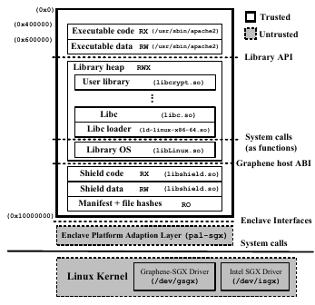
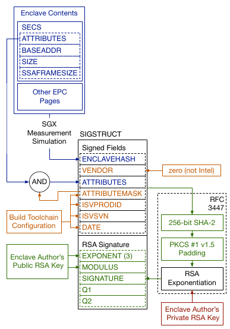

# Examples of TLS 1.3 client using  `pytls13` and `pylurk`

This section briefly exposes how to set the TLS 1.3 client using `pytls13` and `pylurk`.
As `pylurk` implements a a cryptographic service, we are mosly interested into establishing mutually authenticated TLS sessions.

The Web servers we are testing are those implemented by OpenSSL without an with client authentication respectively listening on port 8402 and 8403.

```
cd pytls13/tests/openssl
## Starting OpenSSL TLS server (no client authentication):
cd  openssl
openssl s_server -accept 8402  -tls1_3 -ciphersuites TLS_CHACHA20_POLY1305_SHA256 -key server.key -cert server.crt -debug -keylogfile key.txt -msg -state -tlsextdebug -www

## Starting OpenSSL TLS server (client authentication):
cd  pytls13/tests/openssl/openssl
openssl s_server -cert server.crt -key server.key -WWW -port 8403 -CAfile client.crt  -debug -keylogfile key.txt -msg -state -tlsextdebug -verify_return_error -Verify 1

## note 1: that -verify error validates the certificates 
## up to the CA which needs to be trusted and raises an error.
## For testing, it is recommended to remove this option, 
## unless we make sure the same CA is used by the client and 
## the server.
## note 2: that with Verify 1 the signature generated by the 
## client is checked. This is important to have such option
## to validate the client sends the appropriated messages.
## note 3: OpenSSL provides -WWW and -www but only the 
## latests sends ## an Web page upon receiving a HTTP GET. 
```


**`pytls13` and `pylurk` modules in brief**


The `pytls13` module implements the TLS Engine (E).
E interacts with the Cryptographic Service (CS) which is implemented by `pylurk` module.

TEE is handled by [Gramine](https://github.com/gramineproject/) a libOS framework that enable to run an application in a TEE.
In the case of a python application, Gramine runs the python interpreter and the specific application file (that is the python script) into a TEE.

As a result:
* We cannot have modules running in the TEE interacting with modules not running in the TEE (REE).
* starting a python script in SGX requires the interpreter (python) to be started in the enclave.

`pylurk` can be instantiated in various mode that involves parameters defined __at the system level__ (i.e. how the python interpreter is started) or __at the application layer__ (i.e. by the CS module itself).
To handle this the CLI command (`crypto_service`) is responsible to launch the python interpreter (in SGX or non SGX mode) together with the CS itself with appropriated service related parameters also available via `start_cs.py`.

## Starting the CS

### Generation of the keys for the CS

The main element required by the CS is a pair of private and public key.
Such key can be automatically generated by starting the CS in a non SGX mode.

Typing `crypto_service` starts a CS as a TCP server on localhost:9400 and when keys are not found it generates Ed25519 keys in /home/mglt/gitlab/pylurk.git/example/cli/sig_key_dir/_Ed25519PrivateKey-ed25519-pkcs8.der and /home/mglt/gitlab/pylurk.git/example/cli/sig_key_dir/_Ed25519PublicKey-ed25519-X509.der.

The command display all configurations parameters used by:
* the  `crypto_service` command
* the `start_cs` command
* the CS itself.

```
$ ./crypto_service
 --- Executing: /home/mglt/gitlab/pylurk.git/example/cli/./crypto_service with Namespace(connectivity="'tcp'", host="'127.0.0.1'", port=9400, sig_scheme="'ed25519'", key=None, cert=None, debug=False, test_vector_mode=None, test_vector_file=None, gramine_sgx=False, gramine_direct=False, gramine_build=False)
cmd: ./start_cs.py --connectivity tcp --host 127.0.0.1 --port 9400 --sig_scheme ed25519 --key /home/mglt/gitlab/pylurk.git/example/cli/sig_key_dir --cert /home/mglt/gitlab/pylurk.git/example/cli/sig_key_dir
mglt@nuc:~/gitlab/pylurk.git/example/cli$  --- Executing: /home/mglt/gitlab/pylurk.git/example/cli/./start_cs.py with Namespace(connectivity="'tcp'", host="'127.0.0.1'", port=9400, sig_scheme="'ed25519'", key=PosixPath('/home/mglt/gitlab/pylurk.git/example/cli/sig_key_dir'), cert=PosixPath('/home/mglt/gitlab/pylurk.git/example/cli/sig_key_dir'), debug=False, test_vector_mode=None, test_vector_file=None, gramine_sgx=False, gramine_direct=False, gramine_build=False)
--- 000 /home/mglt/gitlab/pylurk.git/example/cli/sig_key_dir
cs_template_conf: {'log': None, 'connectivity': {'type': 'tcp', 'ip': '127.0.0.1', 'port': 9400}, ('tls13', 'v1'): {'sig_scheme': ['ed25519'], 'public_key': [PosixPath('/home/mglt/gitlab/pylurk.git/example/cli/sig_key_dir')], 'private_key': PosixPath('/home/mglt/gitlab/pylurk.git/example/cli/sig_key_dir'), 'debug': {'trace': False}}}
/home/mglt/gitlab/pylurk.git/example/cli/sig_key_dir is not a file but a directory
WARNING: Generating new keys
  - private_file: /home/mglt/gitlab/pylurk.git/example/cli/sig_key_dir/_Ed25519PrivateKey-ed25519-pkcs8.der
  - public_file: /home/mglt/gitlab/pylurk.git/example/cli/sig_key_dir/_Ed25519PublicKey-ed25519-X509.der
Configuration Template (from end user arguments ):

{'log': None,
 'connectivity': {'type': 'tcp',
                  'ip': '127.0.0.1',
                  'port': 9400},
 ('tls13', 'v1'): {'sig_scheme': ['ed25519'],
                   'public_key': [PosixPath('/home/mglt/gitlab/pylurk.git/example/cli/sig_key_dir')],
                   'private_key': PosixPath('/home/mglt/gitlab/pylurk.git/example/cli/sig_key_dir'),
                   'debug': {'trace': False}}}
Full configuration:

{'profile': 'explicit configuration',
 'description': 'LURK Cryptographic Service configuration '
                'template',
 'connectivity': {'type': 'tcp',
                  'ip': '127.0.0.1',
                  'port': 9400},
 'enabled_extensions': [('lurk', 'v1'), ('tls13', 'v1')],
 ('lurk', 'v1'): {'type_authorized': ['ping', 'capabilities']},
 ('tls13', 'v1'): {'debug': {'trace': False},
                   'role': 'client',
                   'type_authorized': ['c_init_client_finished',
                                       'c_post_hand_auth',
                                       'c_init_client_hello',
                                       'c_server_hello',
                                       'c_client_finished',
                                       'c_register_tickets'],
                   'ephemeral_method_list': ['no_secret',
                                             'cs_generated',
                                             'e_generated'],
                   'authorized_ecdhe_group': ['secp256r1',
                                              'secp384r1',
                                              'secp521r1',
                                              'x25519',
                                              'x448'],
                   'sig_scheme': ['ed25519'],
                   'client_early_secret_authorized': True,
                   'early_exporter_secret_authorized': True,
                   'exporter_secret_authorized': True,
                   'app_secret_authorized': True,
                   'resumption_secret_authorized': True,
                   's_init_early_secret_session_id': True,
                   'last_exchange': {'s_init_cert_verify': False,
                                     's_hand_and_app_secret': False,
                                     'c_init_client_finished': False,
                                     'c_init_post_auth': False,
                                     'c_client_finished': False},
                   'max_tickets': 6,
                   'ticket_life_time': 172800,
                   'ticket_nonce_len': 20,
                   'ticket_generation_method': 'ticket',
                   'ticket_len': 4,
                   'post_handshake_authentication': True,
                   'max_post_handshake_authentication': 1,
                   'public_key': ['/home/mglt/gitlab/pylurk.git/example/cli/sig_key_dir/_Ed25519PublicKey-ed25519-X509.der'],
                   'private_key': '/home/mglt/gitlab/pylurk.git/example/cli/sig_key_dir/_Ed25519PrivateKey-ed25519-pkcs8.der',
                   '_private_key': <cryptography.hazmat.backends.openssl.ed25519._Ed25519PrivateKey object at 0x7f58da8236a0>,
                   '_public_key': <cryptography.hazmat.backends.openssl.ed25519._Ed25519PublicKey object at 0x7f58da8230d0>,
                   '_cert_type': 'X509',
                   '_cert_entry_list': [{'cert': b'0\x82\x01.'
                                                 [ ... ]
                                                 b"4Bc\x84'\x04",
                                         'extensions': []}],
                   '_finger_print_entry_list': [{'finger_print': b'V\xbf\xbd ',
                                                 'extensions': []}],
                   '_finger_print_dict': {b'V\xbf\xbd ': b'0\x82\x01.'
                                                         [ ... ]
                                                         b"'\x04"}},
 'log': None}

Listening on port 9400
```


### Building the SGX enclave for CS


Now that we have the keys, we can start the CS in an enclave.
In our case an enclave is the generation of the manifest that contains the necessary arguments for Gramine to handle the initialization of the enclave. 

Parameters includes some measurements as well as signatures generated by the building tool chain, but also the definition of the files that defines the application. 
When the enclave is initialized, Gramine will check the files that constitute the application have not been modified since the enclave has been built. 
In the beginning, we included configuration files such as the keys for example.
This enabled to initialize the CS ensuring the exact same private key used while the enclave was built is in the initialized enclave. 

The downsize is that the private keys needs to be made visible to the Software Vendor that builds the enclave, the Cloud Provider that runs the enclave and the Service Provider that owns the key.
In other words, this defies the purpose of running the private key in the enclave to be protected.
For that reason we removed these files from being considered. 

The files to be considered are mentioned in the manifest files, that is in our case the `python.template`.
The explanation above simply highlight that some files needs to be included other not.
Please refer to `python.template` for more explanations.  
 
The SGX enclave can be built with the `--gramine_build` argument.

Note that in this section we do not deal with attestation, so there is no need to provide further arguments here.


```
$ ./crypto_service --gramine_build --key ./sig_key_dir/_Ed25519PrivateKey-ed25519-pkcs8.der --cert ./sig_key_dir/_Ed25519PublicKey-ed25519-X509.der
 --- Executing: /home/mglt/gitlab/pylurk.git/example/cli/./crypto_service with Namespace(connectivity="'tcp'", host="'127.0.0.1'", port=9400, sig_scheme="'ed25519'", key=PosixPath('sig_key_dir/_Ed25519PrivateKey-ed25519-pkcs8.der'), cert=PosixPath('sig_key_dir/_Ed25519PublicKey-ed25519-X509.der'), debug=False, test_vector_mode=None, test_vector_file=None, gramine_sgx=False, gramine_direct=False, gramine_build=True)
mglt@nuc:~/gitlab/pylurk.git/example/cli$ rm -f *.manifest *.manifest.sgx *.token *.sig OUTPUT* *.PID TEST_STDOUT TEST_STDERR
rm -f -r scripts/__pycache__
gramine-manifest \
        -Dlog_level=error \
        -Darch_libdir=/lib/x86_64-linux-gnu \
        -Dentrypoint=/usr/bin/python3.10 \
        -Dra_type=none \
        -Dra_client_spid= \
        -Dra_client_linkable=0 \
        python.manifest.template >python.manifest
gramine-sgx-sign \
        --manifest python.manifest \
        --output python.manifest.sgx
Attributes:
    size:        0x20000000
    thread_num:  32
    isv_prod_id: 29539
    isv_svn:     0
    attr.flags:  0x4
    attr.xfrm:   0x3
    misc_select: 0x0
SGX remote attestation:
    None
Memory:
    000000001f9b9000-0000000020000000 [REG:R--] (manifest) measured
    000000001f8b9000-000000001f9b9000 [REG:RW-] (ssa) measured
    000000001f899000-000000001f8b9000 [TCS:---] (tcs) measured
    000000001f879000-000000001f899000 [REG:RW-] (tls) measured
    000000001f839000-000000001f879000 [REG:RW-] (stack) measured
    000000001f7f9000-000000001f839000 [REG:RW-] (stack) measured
    000000001f7b9000-000000001f7f9000 [REG:RW-] (stack) measured
    000000001f779000-000000001f7b9000 [REG:RW-] (stack) measured
    000000001f739000-000000001f779000 [REG:RW-] (stack) measured
    000000001f6f9000-000000001f739000 [REG:RW-] (stack) measured
    000000001f6b9000-000000001f6f9000 [REG:RW-] (stack) measured
    000000001f679000-000000001f6b9000 [REG:RW-] (stack) measured
    000000001f639000-000000001f679000 [REG:RW-] (stack) measured
    000000001f5f9000-000000001f639000 [REG:RW-] (stack) measured
    000000001f5b9000-000000001f5f9000 [REG:RW-] (stack) measured
    000000001f579000-000000001f5b9000 [REG:RW-] (stack) measured
    000000001f539000-000000001f579000 [REG:RW-] (stack) measured
    000000001f4f9000-000000001f539000 [REG:RW-] (stack) measured
    000000001f4b9000-000000001f4f9000 [REG:RW-] (stack) measured
    000000001f479000-000000001f4b9000 [REG:RW-] (stack) measured
    000000001f439000-000000001f479000 [REG:RW-] (stack) measured
    000000001f3f9000-000000001f439000 [REG:RW-] (stack) measured
    000000001f3b9000-000000001f3f9000 [REG:RW-] (stack) measured
    000000001f379000-000000001f3b9000 [REG:RW-] (stack) measured
    000000001f339000-000000001f379000 [REG:RW-] (stack) measured
    000000001f2f9000-000000001f339000 [REG:RW-] (stack) measured
    000000001f2b9000-000000001f2f9000 [REG:RW-] (stack) measured
    000000001f279000-000000001f2b9000 [REG:RW-] (stack) measured
    000000001f239000-000000001f279000 [REG:RW-] (stack) measured
    000000001f1f9000-000000001f239000 [REG:RW-] (stack) measured
    000000001f1b9000-000000001f1f9000 [REG:RW-] (stack) measured
    000000001f179000-000000001f1b9000 [REG:RW-] (stack) measured
    000000001f139000-000000001f179000 [REG:RW-] (stack) measured
    000000001f0f9000-000000001f139000 [REG:RW-] (stack) measured
    000000001f0b9000-000000001f0f9000 [REG:RW-] (stack) measured
    000000001f079000-000000001f0b9000 [REG:RW-] (stack) measured
    000000001f069000-000000001f079000 [REG:RW-] (sig_stack) measured
    000000001f059000-000000001f069000 [REG:RW-] (sig_stack) measured
    000000001f049000-000000001f059000 [REG:RW-] (sig_stack) measured
    000000001f039000-000000001f049000 [REG:RW-] (sig_stack) measured
    000000001f029000-000000001f039000 [REG:RW-] (sig_stack) measured
    000000001f019000-000000001f029000 [REG:RW-] (sig_stack) measured
    000000001f009000-000000001f019000 [REG:RW-] (sig_stack) measured
    000000001eff9000-000000001f009000 [REG:RW-] (sig_stack) measured
    000000001efe9000-000000001eff9000 [REG:RW-] (sig_stack) measured
    000000001efd9000-000000001efe9000 [REG:RW-] (sig_stack) measured
    000000001efc9000-000000001efd9000 [REG:RW-] (sig_stack) measured
    000000001efb9000-000000001efc9000 [REG:RW-] (sig_stack) measured
    000000001efa9000-000000001efb9000 [REG:RW-] (sig_stack) measured
    000000001ef99000-000000001efa9000 [REG:RW-] (sig_stack) measured
    000000001ef89000-000000001ef99000 [REG:RW-] (sig_stack) measured
    000000001ef79000-000000001ef89000 [REG:RW-] (sig_stack) measured
    000000001ef69000-000000001ef79000 [REG:RW-] (sig_stack) measured
    000000001ef59000-000000001ef69000 [REG:RW-] (sig_stack) measured
    000000001ef49000-000000001ef59000 [REG:RW-] (sig_stack) measured
    000000001ef39000-000000001ef49000 [REG:RW-] (sig_stack) measured
    000000001ef29000-000000001ef39000 [REG:RW-] (sig_stack) measured
    000000001ef19000-000000001ef29000 [REG:RW-] (sig_stack) measured
    000000001ef09000-000000001ef19000 [REG:RW-] (sig_stack) measured
    000000001eef9000-000000001ef09000 [REG:RW-] (sig_stack) measured
    000000001eee9000-000000001eef9000 [REG:RW-] (sig_stack) measured
    000000001eed9000-000000001eee9000 [REG:RW-] (sig_stack) measured
    000000001eec9000-000000001eed9000 [REG:RW-] (sig_stack) measured
    000000001eeb9000-000000001eec9000 [REG:RW-] (sig_stack) measured
    000000001eea9000-000000001eeb9000 [REG:RW-] (sig_stack) measured
    000000001ee99000-000000001eea9000 [REG:RW-] (sig_stack) measured
    000000001ee89000-000000001ee99000 [REG:RW-] (sig_stack) measured
    000000001ee79000-000000001ee89000 [REG:RW-] (sig_stack) measured
    000000001ea5c000-000000001eaa0000 [REG:R-X] (code) measured
    000000001eaa1000-000000001ee79000 [REG:RW-] (data) measured
    0000000000010000-000000001ea5c000 [REG:RWX] (free)
Measurement:
    75686222a1ae41bccac9f15e8a9eb021bbc2c144cb803c8b82d4403076f95b8b
gramine-sgx-get-token --output python.token --sig python.sig
Attributes:
    mr_enclave:  75686222a1ae41bccac9f15e8a9eb021bbc2c144cb803c8b82d4403076f95b8b
    mr_signer:   e725999b742f47419e5a074b32d8c869711d68d20d059dc987e5c87424cb37a9
    isv_prod_id: 29539
    isv_svn:     0
    attr.flags:  0000000000000004
    attr.xfrm:   0000000000000003
    mask.flags:  ffffffffffffffff
    mask.xfrm:   fffffffffff9ff1b
    misc_select: 00000000
    misc_mask:   ffffffff
    modulus:     f19f15a643fbadc6714cbe9e8d670a8a...
    exponent:    3
    signature:   9b66e16bc5d2fcfc44d24362409e533b...
    date:        2023-03-13
```

### Discussion: What happened ?

**Gramine Principles**

To attestat a given piece of code is running in a TEE, we need to be able to designate that piece of code.
In the case of SGX, we use certificat ebased identity which is based on identity and measurements.
These infomation are stored in the SIGSTRUCT (or EINITTOKEN) 

* The identity is the combination of product ID (`isv_prod_id`), Product version (`isv_svn`)  and a public key (`modulus`) - it is actually the hash of the modulus that is used also designated as the `mr_signer`.
* The characteristics of what is running, is measured as teh ``mr_enclave` which includes loaded code and states of the CPU: the `mr_enclave`.
* Signing `mr_enclave` with a key bound to the identity enables to associate the `mr_enclave` to the enclave identity.


When the CPU loads an enclave, it reads the SIGSTRUCTURE, checks the signature, measures the enclave `mr_enclave` and checks it matches the one provided in the SIGSTRUCTURE.

A remote user will be convinced the expected code is running when the TEE (SGX) provides a QUOTE that contains the measured `mr_enclave` signed by the SGX.
The user will infact rely on Intel Attestation Service (IAS) to validate the QUOTE is actually from a hardware that has been provisioned by Intel.     

**How does Gramine builds an enclave ?**


The creation of an enclave is performed via the Intel `ECREATE` an d`EINIT` commands, but Gramine is handling this transparently for us.
The figure below describes how Gramine initializes the enclave.



With Gramine, the application can be seen as a small VM with a libOS embeded in to the enclave.
The *shield library* (provided by Gramine) is __responsible__ for loading all the necessary components into the enclave. It includes.
* The Linux librairy OS (`libLinux.so`), the standard C librairues (`ld-linux-x86-64.so` and `libc.so`) __emulates__ the host. These are librarires provided by Gramine.
* Application specific files described in the `manifest`.
Before being loaded each file is checked against its hash contained in the `manifest`.

To build the enclave, Gramine proceeds as follows:
1. `gramine-manifest`: Generates a complete Manifest (which can be viewed as building a complete configuration)
2. `gramine-sgx-sign`: generate the SIGSTSTRUCT, the measurements and signs it. ( in a `.sig` file).
In addition, all included files are hashed in order to ensure they have not changed.
3. `gramine-get-token`: Generates a token that has the same format as the EINITOKEN.

**Application**

Initially the present files are:
* `start_cs.py`: the python scripts that implement the CS
* `sig_key_dir`: the directory that contains the private / public keys
* `python.manifest.template`: which provides the necessary information to build the enclave.

The principle of Gramine is to build a small VM or chroot like system inside an SGX enclave, with the minimum amount of neecessary files to make `start_cs.py`.
This includes mounting some file systems and indicating which files needs to be trusted. Which includes
* Files and modules to run the python interpreter
* specific files used by `start_cs.py` -- log files, key files, as well as any necessary .py files
* other (untrusted) files that are needed to enable OS level operation like networking, process management...


`python.manifest.template` mainly consists in defining these files - or resources.
It also contains other parameters associated to SGX among other the type of attestation of the debug level,... This is really intented to be configured by the user.

The `python.manifest.template` is taken as an input by `gramine-manifest` to generate the complete manifest: `python.manifest` which can be seen as a format conversion, as well as the definition of the entry point of the application which in our case is `/usr/bin/python3.10`.

Once all information to build the enclave have been defined, `gramine-sgx-sign` takes the `python.manifest` as input and generates:
* `python.manifest.sgx`: which is similar to python.manifest... but includes the hash associated to each files mentioned in the `python.manifest`.
* `python.sig`: which defines the structure of the token - that is alla the necessary information needed to check the signature.
* python.token: which is the structured information passed for verification. This can also be considered as the certificate.

**Analysis of the token**

This section is based on the [Secure Processors Part I: Intel SGX Security Analysis and MIT Sanctum Architecture](https://people.csail.mit.edu/devadas/pubs/part_1.pdf).


`python.token` follows the format described by `python.sig` also designated as SIGSTRUCT.

Thge complete SIGSTRUCT can be visualized with `gramine-sgx-quote-dump` and one can see it includes much more fields than the one displayed by `gramine-sgx-get-token`.

```
$ gramine-sgx-quote-dump  -m python.sig
quote_body        :
 version          : 0006
 sign_type        : 0000
 epid_group_id    : 000000e1
 qe_svn           : 0000
 pce_svn          : 0001
 xeid             : 00000000
 basename         : 000000000000000000000001000000600000006000000101160207e700000000
report_body       :
 cpu_svn          : 00000000000000000000000000000000
 misc_select      : 00000000
 reserved1        : 000000000000000000000000
 isv_ext_prod_id  : 00000000000000000000000000000000
 attributes.flags : 0000000000000000
 attributes.xfrm  : 0000000000000000
 mr_enclave       : 8a0a678d9ebe4c71c6adfb43a6159ff100000000000000000000000000000000
 reserved2        : 543d8404417c14a48c9ea8b633f1849c52d96e94dfbf1e395cad1ec2c37bc1e4
 mr_signer        : c9bb887c5b3b00868a36e2d24bf8d685e4409cdd905f4eb5d2f34f05cf2309f7
 reserved3        : c16fb756c67a9013bf3ea33c3688ae90f13c03f0250b3ab04f35edff26994171
 config_id        : 3a0f5ec14c0e1d4965167308a02c6e6725cc3568ccecae46f82785411643aef872e390e8485a7ad3708a1af221ad72f241f1a7079e5bf1125fae46bda2edd961
 isv_prod_id      : 617f
 isv_svn          : 32c5
 config_svn       : 8fb6
 reserved4        : 512723a150f6011b950892247ed7720de6aa0fdc8dce1659026c474a6ee690e573736babe0a9b7c1d650
 isv_family_id    : 5603e432b4e0bd98c66172f2c6498ca4
 report_data      : c2da980ded331e0f1835976ff2ec6c8867af5d76ae242bd6dea68090b8ee9066a4b746c01b37c62270424bd4309448abe68fc4695e55ad584b5144de0dce3a58
signature_size    : 1427494068 (0x5515d4b4)
```

```
$ gramine-sgx-get-token --output python.token --sig python.sig
Attributes:
    mr_enclave:  75686222a1ae41bccac9f15e8a9eb021bbc2c144cb803c8b82d4403076f95b8b
    mr_signer:   e725999b742f47419e5a074b32d8c869711d68d20d059dc987e5c87424cb37a9
    isv_prod_id: 29539
    isv_svn:     0
    attr.flags:  0000000000000004
    attr.xfrm:   0000000000000003
    mask.flags:  ffffffffffffffff
    mask.xfrm:   fffffffffff9ff1b
    misc_select: 00000000
    misc_mask:   ffffffff
    modulus:     f19f15a643fbadc6714cbe9e8d670a8a...
    exponent:    3
    signature:   9b66e16bc5d2fcfc44d24362409e533b...
    date:        2023-03-13

```

The folowing elements are provided by the SGX measurement simulation.
* mr_enclave designates the output of the SGX.
* attr.xfrm and attr.flags (8 bytes + 8 bytes ): the enclave attributes. DEBUG indicates the code runs in XCR0, MODE64BIT indicate the CPU is 64 bit, and XFRM is there to specify and architecture, that would require specific behavior by Intel's instruction.

The SGX Enclave Attributes are as follows:

```
------------------------------------------------------------
| Fields    | Bits | Description                           |
------------------------------------------------------------
| DEBUG     |  1   | Opts into enclave debugging features  |
| XFRM      |  64  | The value of XCR0 while this          |
|           |      | enclave’s code is executed.           |
| MODE64BIT |  1   | Set for 64-bit enclaves.              |
------------------------------------------------------------
```

`attr.flags` seems to have Bit 0 set to 0, Bit 1 representing the DEBUG mode (`sgx.debug`), Bit 2 set to 1 representing the MODE64BIT and other Bits set to zero.

```
Extended Control Registers XCR0
-------------------------------------------------------
| Feature | Registers                      | XCR0 bit |
-------------------------------------------------------
| FPU     | FP0 - FP7, FSW, FTW            | 0        |
| SSE     | MM0 - MM7, XMM0 - XMM15, XMCSR | 1        |
| AVX     | YMM0 - YMM15                   | 2        |
| MPX     | BND0 - BND 3                   | 3        |
| MPX     | BNDCFGU, BNDSTATUS             | 4        |
| AVX-512 | K0 - K7                        | 5        |
| AVX-512 | ZMM0_H - ZMM15_H               | 6        |
| AVX-512 | ZMM16 - ZMM31                  | 7        |
| PK      | PKRU                           | 9        |
-------------------------------------------------------
```
In our case attr.xfrm consists of SSE and FPU


The following ones are provided by the Enclave Author:

* isv_prod_id (2 bytes): Differentiates modules signed by the same public key.
In our case, isv_prod_id is `29539` and `int.to_bytes( 29539, length=2, byteorder='little' ) gives 'cs'`.
* isv_svn (2 bytes): Differentiates versions of the same module. It could have been the version of the module and can be found in the python.manisfest` as `isvsvn = 0`.
* date: the date when the SIGSTRUCT has been signed.
* mask.flags (8 bytes): indicates which attributes associated to the SGX enclave will be considered and signed.
In our case all flags are considers. This seems reasonable as on edoes not want the code to run in an enclave with the DEBUG flag set. Similarly, MODE64BIT set or unset will reasonably not have the same binaries.
* mask.xfrm (8 bytes): The last bytes are 'f9 ff 1b' = 1111 1001 1111 1111 0001 0110 so the features being checked will be SSE AVX MPX (BNDCSR). These mostly describes teh XSAVE supported needed.


The RSA Signature element are the following:
* exponent, modulus indicates the public key of the enclave author. This key has been generated by Gramine `gramine-sgx-gen-private-key` and can be found in `$HOME/.config/gramine/enclave-key.pem`.
* The signature is generated PKCS#1 v1.5 signature over the mr_measurement | vendor (set to zero as not Intel) | masked attributes ( flags and xfrm ) | attribute mask (flag and xfrm) | isv_prod_id | isv_svn | date.




The enclave identity is determined by modulus,  isv_prod_id and isv_svn.
The mr_signer correpsonds to the sha256 of the RSA modulus.


### Starting the CS (in the SGX enclave) as a TCP server (no attestation)

Once the SGX enclave has been built, the CS can be started in the enclave thanks to the `--gramine_sgx` argument.

```
$ ./crypto_service --gramine_sgx --key ./sig_key_dir/_Ed25519PrivateKey-ed25519-pkcs8.der --cert ./sig_key_dir/_Ed25519PublicKey-ed25519-X509.der
 --- Executing: /home/mglt/gitlab/pylurk.git/example/cli/./crypto_service with Namespace(connectivity="'tcp'", host="'127.0.0.1'", port=9400, sig_scheme="'ed25519'", key=PosixPath('sig_key_dir/_Ed25519PrivateKey-ed25519-pkcs8.der'), cert=PosixPath('sig_key_dir/_Ed25519PublicKey-ed25519-X509.der'), debug=False, test_vector_mode=None, test_vector_file=None, gramine_sgx=True, gramine_direct=False, gramine_build=False)
cmd: ./start_cs.py --connectivity tcp --host 127.0.0.1 --port 9400 --sig_scheme ed25519 --key ./sig_key_dir/_Ed25519PrivateKey-ed25519-pkcs8.der --cert ./sig_key_dir/_Ed25519PublicKey-ed25519-X509.der
Gramine is starting. Parsing TOML manifest file, this may take some time...
mglt@nuc:~/gitlab/pylurk.git/example/cli$ Detected a huge manifest, preallocating 64MB of internal memory.
-----------------------------------------------------------------------------------------------------------------------
Gramine detected the following insecure configurations:

  - loader.insecure__use_cmdline_argv = true   (forwarding command-line args from untrusted host to the app)
  - sgx.allowed_files = [ ... ]                (some files are passed through from untrusted host without verification)

Gramine will continue application execution, but this configuration must not be used in production!
-----------------------------------------------------------------------------------------------------------------------

 --- Executing: //./start_cs.py with Namespace(connectivity="'tcp'", host="'127.0.0.1'", port=9400, sig_scheme="'ed25519'", key=PosixPath('sig_key_dir/_Ed25519PrivateKey-ed25519-pkcs8.der'), cert=PosixPath('sig_key_dir/_Ed25519PublicKey-ed25519-X509.der'), debug=False, test_vector_mode=None, test_vector_file=None, gramine_sgx=False, gramine_direct=False, gramine_build=False)
cs_template_conf: {'log': None, 'connectivity': {'type': 'tcp', 'ip': '127.0.0.1', 'port': 9400}, ('tls13', 'v1'): {'sig_scheme': ['ed25519'], 'public_key': [PosixPath('sig_key_dir/_Ed25519PublicKey-ed25519-X509.der')], 'private_key': PosixPath('sig_key_dir/_Ed25519PrivateKey-ed25519-pkcs8.der'), 'debug': {'trace': False}}}
Configuration Template (from end user arguments ):

{'log': None,
 'connectivity': {'type': 'tcp',
                  'ip': '127.0.0.1',
                  'port': 9400},
 ('tls13', 'v1'): {'sig_scheme': ['ed25519'],
                   'public_key': [PosixPath('sig_key_dir/_Ed25519PublicKey-ed25519-X509.der')],
                   'private_key': PosixPath('sig_key_dir/_Ed25519PrivateKey-ed25519-pkcs8.der'),
                   'debug': {'trace': False}}}
Full configuration:

{'profile': 'explicit configuration',
 'description': 'LURK Cryptographic Service configuration '
                'template',
 'connectivity': {'type': 'tcp',
                  'ip': '127.0.0.1',
                  'port': 9400},
 'enabled_extensions': [('lurk', 'v1'), ('tls13', 'v1')],
 ('lurk', 'v1'): {'type_authorized': ['ping', 'capabilities']},
 ('tls13', 'v1'): {'debug': {'trace': False},
                   'role': 'client',
                   'type_authorized': ['c_init_client_finished',
                                       'c_post_hand_auth',
                                       'c_init_client_hello',
                                       'c_server_hello',
                                       'c_client_finished',
                                       'c_register_tickets'],
                   'ephemeral_method_list': ['no_secret',
                                             'cs_generated',
                                             'e_generated'],
                   'authorized_ecdhe_group': ['secp256r1',
                                              'secp384r1',
                                              'secp521r1',
                                              'x25519',
                                              'x448'],
                   'sig_scheme': ['ed25519'],
                   'client_early_secret_authorized': True,
                   'early_exporter_secret_authorized': True,
                   'exporter_secret_authorized': True,
                   'app_secret_authorized': True,
                   'resumption_secret_authorized': True,
                   's_init_early_secret_session_id': True,
                   'last_exchange': {'s_init_cert_verify': False,
                                     's_hand_and_app_secret': False,
                                     'c_init_client_finished': False,
                                     'c_init_post_auth': False,
                                     'c_client_finished': False},
                   'max_tickets': 6,
                   'ticket_life_time': 172800,
                   'ticket_nonce_len': 20,
                   'ticket_generation_method': 'ticket',
                   'ticket_len': 4,
                   'post_handshake_authentication': True,
                   'max_post_handshake_authentication': 1,
                   'public_key': [PosixPath('sig_key_dir/_Ed25519PublicKey-ed25519-X509.der')],
                   'private_key': PosixPath('sig_key_dir/_Ed25519PrivateKey-ed25519-pkcs8.der'),
                   '_private_key': <cryptography.hazmat.backends.openssl.ed25519._Ed25519PrivateKey object at 0xd8dfee0>,
                   '_public_key': <cryptography.hazmat.backends.openssl.ed25519._Ed25519PublicKey object at 0xd8de140>,

                   '_cert_type': 'X509',
                   '_cert_entry_list': [{'cert': b'0\x82\x01.'
                                                 [ ... ]
                                                 b'\xa2~\xf0\xd9'
```

### What Happened ?


The idea is to load a software and that __attestation__ provides some evidence that the software is what we expect.
In our case, there is no attestation (`ra_tye` is set to none) and `what we expect` is described by the token.

As a result, without attestation, the code is running in a SGX enclave, but we can hardly be certain of what code is running.

The `load_enclave` (in [host_main.c](https://github.com/gramineproject/gramine/blob/38aa937772c8f6d74d94f7d84dddf2cd3e2c2c54/pal/src/host/linux-sgx/host_main.c) ) proceeds to the initialization of the enclave.
`initialize_enclave` read the manifest, token SIGSTRUCT, load all pages into the SGX enclave.
Then, optionally attestation is performed before the enclave is started.


The configuration of no attestation is performed via the Makefile with the following lines:

```
RA_TYPE ?= none
RA_CLIENT_SPID ?=
RA_CLIENT_LINKABLE ?= 0
```
## Testing the CS reachability

As mentioned in the configuration file, the CS is running on port 9400.
This can be further checked by running:

```
$ lsof -i | grep 9400
loader    26261 mglt   30u  IPv4 208589      0t0  TCP localhost:9400 (LISTEN)
```

LURK also have a ping functionality (available for all extensions) which is implemented by `lurk_ping`.

```
$ ./lurk_ping --connectivity tcp --host 127.0.0.1 --port 9400
 --- Executing: /home/mglt/gitlab/pylurk.git/example/cli/./lurk_ping with Namespace(connectivity="'tcp'", host="'127.0.0.1'", port=9400)
--- E -> CS: Sending ping Request:
--- E <- CS: Receiving ping Response:
LURK PING (127.0.0.1:9400): time 0.0021736621856689453 ms.
```
## Starting the TLS Engine (E)

While the TLS Engine (E) follows similar pattern as the Crypto Service (CS) and `pytls13` provides the ability to also execute E in an SGX enclave in this section we will consider that E is not started in an SGX enclave.

E does not need to know the private key, but needs to know how to reach the CS that is in our case using TCP to 127.0.0.1:9400 as well as information related to the public key ( mainly to be able to send the Certificate as well as to fingerprint the certificate).

One particularity of `pytls13` is its extreme generosity in term of debugging outputs.

Note also that the server authentication can be done using certificate authentication also designated as the TLS (EC)DHE mode as well as using PSK-ECDHE for TLS session resumption.
The option `--reconnect` enables a first certificate authentication followed by the session resumption.
Note that resuming a session is up to the TLS server to accept it.

## Ex: Unauthenticated TLS 1.3 client

```
./tls_client https://127.0.0.1:8402 --cert ~/gitlab/pylurk.git/example/cli/sig_key_dir/_Ed25519PublicKey-ed25519-X509.der --connectivity tcp --host 127.0.0.1 --port 9400
 --- Executing: /home/mglt/gitlab/pytls13/example/cli/./tls_client with Namespace(connectivity="'tcp'", host="'127.0.0.1'", port=9400, sig_scheme="'ed25519'", key=None, cert=PosixPath('/home/mglt/gitlab/pylurk.git/example/cli/sig_key_dir/_Ed25519PublicKey-ed25519-X509.der'), debug=False, test_vector_mode=None, test_vector_file=None, gramine_sgx=False, gramine_direct=False, gramine_build=False, url="'https://127.0.0.1:8402'", no_session_resumption=False, freshness="'sha256'", ephemeral_method="'cs_generated'", supported_ecdhe_groups="'x25519'", reconnect=False, cs_auto_start=False, cs_gramine_sgx=False, cs_gramine_direct=False, cs_gramine_build=False)
args.key: None
args.cert: /home/mglt/gitlab/pylurk.git/example/cli/sig_key_dir/_Ed25519PublicKey-ed25519-X509.der
cmd: ./start_e.py --freshness 'sha256' --ephemeral_method cs_generated --supported_ecdhe_groups 'x25519'  --connectivity tcp --host 127.0.0.1 --port 9400 --sig_scheme ed25519 --key None --cert /home/mglt/gitlab/pylurk.git/example/cli/sig_key_dir/_Ed25519PublicKey-ed25519-X509.der  'https://127.0.0.1:8402'
mglt@nuc:~/gitlab/pytls13/example/cli$  --- Executing: /home/mglt/gitlab/pytls13/example/cli/./start_e.py with Namespace(connectivity="'tcp'", host="'127.0.0.1'", port=9400, sig_scheme="'ed25519'", key=PosixPath('None'), cert=PosixPath('/home/mglt/gitlab/pylurk.git/example/cli/sig_key_dir/_Ed25519PublicKey-ed25519-X509.der'), debug=False, test_vector_mode=None, test_vector_file=None, gramine_sgx=False, gramine_direct=False, gramine_build=False, url="'https://127.0.0.1:8402'", no_session_resumption=False, freshness="'sha256'", ephemeral_method="'cs_generated'", supported_ecdhe_groups="'x25519'", reconnect=False, cs_auto_start=False, cs_gramine_sgx=False, cs_gramine_direct=False, cs_gramine_build=False)

Configuration Template (from end user arguments ):

{'destination': {'ip': '127.0.0.1', 'port': 8402},
 'sent_data': b'GET / HTTP/1.1\r\nHost: 127.0.0.1\r\nuser-agent:'
              b' pytls13/0.1\r\naccept: */*\r\n\r\n',
 'debug': {'trace': False},
 'lurk_client': {'connectivity': {'type': 'tcp',
                                  'ip': '127.0.0.1',
                                  'port': 9400},
                 'freshness': 'sha256'},
 'tls13': {'ephemeral_method': 'cs_generated',
           'supported_ecdhe_groups': ['x25519'],
           'session_resumption': True},
 'cs': {'log': None,
        'connectivity': {'type': 'tcp',
                         'ip': '127.0.0.1',
                         'port': 9400},
        ('tls13', 'v1'): {'sig_scheme': ['ed25519'],
                          'public_key': [PosixPath('/home/mglt/gitlab/pylurk.git/example/cli/sig_key_dir/_Ed25519PublicKey-ed25519-X509.der')],
                          'debug': {'trace': False}}}}

Full configuration:

{'role': 'client',
 'description': 'TLS 1.3 Client configuration template',
 'debug': {'trace': False},
 'lurk_client': {'freshness': 'sha256',
                 'connectivity': {'type': 'tcp',
                                  'ip': '127.0.0.1',
                                  'port': 9400}},
 'tls13': {'ke_modes': ['psk_dhe_ke'],
           'session_resumption': True,
           'post_handshake_authentication': False,
           'signature_algorithms': ['rsa_pkcs1_sha256',
                                    'rsa_pkcs1_sha384',
                                    'rsa_pkcs1_sha512',
                                    'ecdsa_secp256r1_sha256',
                                    'ecdsa_secp384r1_sha384',
                                    'ecdsa_secp521r1_sha512',
                                    'rsa_pss_rsae_sha256',
                                    'rsa_pss_rsae_sha384',
                                    'rsa_pss_pss_sha256',
                                    'rsa_pss_pss_sha384',
                                    'rsa_pss_pss_sha256',
                                    'ed25519',
                                    'ed448',
                                    'rsa_pkcs1_sha1'],
           'ephemeral_method': 'cs_generated',
           'supported_ecdhe_groups': ['x25519']},
 'cs': {('tls13', 'v1'): {'public_key': [PosixPath('/home/mglt/gitlab/pylurk.git/example/cli/sig_key_dir/_Ed25519PublicKey-ed25519-X509.der')],
                          'sig_scheme': ['ed25519'],
                          '_public_key': <cryptography.hazmat.backends.openssl.ed25519._Ed25519PublicKey object at 0x7f9838c120b0>,
                          '_cert_type': 'X509',
                          '_cert_entry_list': [{'cert': b'0\x82\x01.'
                                                        [ ... ]
                                                        b"'\x04",
                                                'extensions': []}],
                          '_finger_print_entry_list': [{'finger_print': b'V\xbf\xbd ',
                                                        'extensions': []}],
                          '_finger_print_dict': {b'V\xbf\xbd ': b'0\x82\x01.'
                                                                [ ... ]
                                                                b"'\x04"}}},
 'destination': {'ip': '127.0.0.1', 'port': 8402},
 'sent_data': b'GET / HTTP/1.1\r\nHost: 127.0.0.1\r\nuser-agent:'
              b' pytls13/0.1\r\naccept: */*\r\n\r\n'}
======================================================
========= TLS with certificate authentication ========
======================================================

::Instantiating the Lurk client
--- E -> CS: Sending ping Request:
--- E <- CS: Receiving ping Response:
::TCP session with the TLS server
--- E -> CS: Sending c_init_client_hello Request:
--- E <- CS: Receiving c_init_client_hello Response:
--- E -> CS: Sending c_server_hello Request:
--- E <- CS: Receiving c_server_hello Response:
--- E -> CS: Sending c_client_finished Request:
--- E <- CS: Receiving c_client_finished Response:
--- E -> CS: Sending c_register_tickets Request:
--- E <- CS: Receiving c_register_tickets Response:
--- E -> CS: Sending c_register_tickets Request:
--- E <- CS: Receiving c_register_tickets Response:
APPLICATION DATA - [cert]: b'HTTP/1.0 200 ok\r\nContent-type: text/html\r\n\r\n<HTML><BODY BGCOLOR="#ffffff">\n<pre>\n\ns_server -accept 8402 -tls1_3 -ciphersuites TLS_CHACHA20_POLY1305_SHA256 -key server.key -cert server.crt -debug -keylogfile key.txt -msg -state -tlsextdebug -www \nSecure Renegotiation IS NOT supported\nCiphers supported in s_server binary\nTLSv1.3    :TLS_CHACHA20_POLY1305_SHA256 TLSv1.2    :ECDHE-ECDSA-AES256-GCM-SHA384 \nTLSv1.2    :ECDHE-RSA-AES256-GCM-SHA384 TLSv1.2    :DHE-RSA-AES256-GCM-SHA384 \nTLSv1.2    :ECDHE-ECDSA-CHACHA20-POLY1305 TLSv1.2    :ECDHE-RSA-CHACHA20-POLY1305 \nTLSv1.2    :DHE-RSA-CHACHA20-POLY1305 TLSv1.2    :ECDHE-ECDSA-AES128-GCM-SHA256 \nTLSv1.2    :ECDHE-RSA-AES128-GCM-SHA256 TLSv1.2    :DHE-RSA-AES128-GCM-SHA256 \nTLSv1.2    :ECDHE-ECDSA-AES256-SHA384 TLSv1.2    :ECDHE-RSA-AES256-SHA384   \nTLSv1.2    :DHE-RSA-AES256-SHA256     TLSv1.2    :ECDHE-ECDSA-AES128-SHA256 \nTLSv1.2    :ECDHE-RSA-AES128-SHA256   TLSv1.2    :DHE-RSA-AES128-SHA256     \nTLSv1.0    :ECDHE-ECDSA-AES256-SHA    TLSv1.0    :ECDHE-RSA-AES256-SHA      \nSSLv3      :DHE-RSA-AES256-SHA        TLSv1.0    :ECDHE-ECDSA-AES128-SHA    \nTLSv1.0    :ECDHE-RSA-AES128-SHA      SSLv3      :DHE-RSA-AES128-SHA        \nTLSv1.2    :RSA-PSK-AES256-GCM-SHA384 TLSv1.2    :DHE-PSK-AES256-GCM-SHA384 \nTLSv1.2    :RSA-PSK-CHACHA20-POLY1305 TLSv1.2    :DHE-PSK-CHACHA20-POLY1305 \nTLSv1.2    :ECDHE-PSK-CHACHA20-POLY1305 TLSv1.2    :AES256-GCM-SHA384         \nTLSv1.2    :PSK-AES256-GCM-SHA384     TLSv1.2    :PSK-CHACHA20-POLY1305     \nTLSv1.2    :RSA-PSK-AES128-GCM-SHA256 TLSv1.2    :DHE-PSK-AES128-GCM-SHA256 \nTLSv1.2    :AES128-GCM-SHA256         TLSv1.2    :PSK-AES128-GCM-SHA256     \nTLSv1.2    :AES256-SHA256             TLSv1.2    :AES128-SHA256             \nTLSv1.0    :ECDHE-PSK-AES256-CBC-SHA384 TLSv1.0    :ECDHE-PSK-AES256-CBC-SHA  \nSSLv3      :SRP-RSA-AES-256-CBC-SHA   SSLv3      :SRP-AES-256-CBC-SHA       \nTLSv1.0    :RSA-PSK-AES256-CBC-SHA384 TLSv1.0    :DHE-PSK-AES256-CBC-SHA384 \nSSLv3      :RSA-PSK-AES256-CBC-SHA    SSLv3      :DHE-PSK-AES256-CBC-SHA    \nSSLv3      :AES256-SHA                TLSv1.0    :PSK-AES256-CBC-SHA384     \nSSLv3      :PSK-AES256-CBC-SHA        TLSv1.0    :ECDHE-PSK-AES128-CBC-SHA256 \nTLSv1.0    :ECDHE-PSK-AES128-CBC-SHA  SSLv3      :SRP-RSA-AES-128-CBC-SHA   \nSSLv3      :SRP-AES-128-CBC-SHA       TLSv1.0    :RSA-PSK-AES128-CBC-SHA256 \nTLSv1.0    :DHE-PSK-AES128-CBC-SHA256 SSLv3      :RSA-PSK-AES128-CBC-SHA    \nSSLv3      :DHE-PSK-AES128-CBC-SHA    SSLv3      :AES128-SHA                \nTLSv1.0    :PSK-AES128-CBC-SHA256     SSLv3      :PSK-AES128-CBC-SHA        \n---\nCiphers common between both SSL end points:\nTLS_CHACHA20_POLY1305_SHA256\nSignature Algorithms: RSA+SHA256:RSA+SHA384:RSA+SHA512:ECDSA+SHA256:ECDSA+SHA384:ECDSA+SHA512:RSA-PSS+SHA256:RSA-PSS+SHA384:RSA-PSS+SHA256:RSA-PSS+SHA384:RSA-PSS+SHA256:Ed25519:Ed448:RSA+SHA1\nShared Signature Algorithms: RSA+SHA256:RSA+SHA384:RSA+SHA512:ECDSA+SHA256:ECDSA+SHA384:ECDSA+SHA512:RSA-PSS+SHA256:RSA-PSS+SHA384:RSA-PSS+SHA256:RSA-PSS+SHA384:RSA-PSS+SHA256:Ed25519:Ed448\nSupported groups: x25519\nShared groups: x25519\n---\nNew, TLSv1.3, Cipher is TLS_CHACHA20_POLY1305_SHA256\nSSL-Session:\n    Protocol  : TLSv1.3\n    Cipher    : TLS_CHACHA20_POLY1305_SHA256\n    Session-ID: C3DE515AFDC734B05753FF79401CB05AD185507E1599E514F35ED1477B264BBF\n    Session-ID-ctx: 01000000\n    Resumption PSK: B40B5318596C097440AD26325A549628710E18BC7A786808B35055316F5629B4\n    PSK identity: None\n    PSK identity hint: None\n    SRP username: None\n    Start Time: 1677114842\n    Timeout   : 7200 (sec)\n    Verify return code: 0 (ok)\n    Extended master secret: no\n    Max Early Data: 0\n---\n   0 items in the session cache\n   0 client connects (SSL_connect())\n   0 client renegotiates (SSL_connect())\n   0 client connects that finished\n   2 server accepts (SSL_accept())\n   0 server renegotiates (SSL_accept())\n   2 server accepts that finished\n   0 session cache hits\n   0 session cache misses\n   0 session cache timeouts\n   0 callback cache hits\n   0 cache full overflows (128 allowed)\n---\nno client certificate available\n</pre></BODY></HTML>\r\n\r\n'

```

## Ex: Unauthenticated TLS 1.3 client (with `--debug` and `--reconnect`)

With the `--debug` and `--reconnect` mode activated

```
./tls_client https://127.0.0.1:8402 --cert ~/gitlab/pylurk.git/example/cli/sig_key_dir/_Ed25519PublicKey-ed25519-X509.der --connectivity tcp --host 127.0.0.1 --port 9400 --debug --reconnect > log.log

 --- Executing: /home/mglt/gitlab/pytls13/example/cli/./tls_client with Namespace(connectivity="'tcp'", host="'127.0.0.1'", port=9400, sig_scheme="'ed25519'", key=None, cert=PosixPath('/home/mglt/gitlab/pylurk.git/example/cli/sig_key_dir/_Ed25519PublicKey-ed25519-X509.der'), debug=True, test_vector_mode=None, test_vector_file=None, gramine_sgx=False, gramine_direct=False, gramine_build=False, url="'https://127.0.0.1:8402'", no_session_resumption=False, freshness="'sha256'", ephemeral_method="'cs_generated'", supported_ecdhe_groups="'x25519'", reconnect=True, cs_auto_start=False, cs_gramine_sgx=False, cs_gramine_direct=False, cs_gramine_build=False)
args.key: None
args.cert: /home/mglt/gitlab/pylurk.git/example/cli/sig_key_dir/_Ed25519PublicKey-ed25519-X509.der
cmd: ./start_e.py --freshness 'sha256' --ephemeral_method cs_generated --supported_ecdhe_groups 'x25519'  --reconnect   --debug --connectivity tcp --host 127.0.0.1 --port 9400 --sig_scheme ed25519 --key None --cert /home/mglt/gitlab/pylurk.git/example/cli/sig_key_dir/_Ed25519PublicKey-ed25519-X509.der  'https://127.0.0.1:8402'
 --- Executing: /home/mglt/gitlab/pytls13/example/cli/./start_e.py with Namespace(connectivity="'tcp'", host="'127.0.0.1'", port=9400, sig_scheme="'ed25519'", key=PosixPath('None'), cert=PosixPath('/home/mglt/gitlab/pylurk.git/example/cli/sig_key_dir/_Ed25519PublicKey-ed25519-X509.der'), debug=True, test_vector_mode=None, test_vector_file=None, gramine_sgx=False, gramine_direct=False, gramine_build=False, url="'https://127.0.0.1:8402'", no_session_resumption=False, freshness="'sha256'", ephemeral_method="'cs_generated'", supported_ecdhe_groups="'x25519'", reconnect=True, cs_auto_start=False, cs_gramine_sgx=False, cs_gramine_direct=False, cs_gramine_build=False)

Configuration Template (from end user arguments ):

{'destination': {'ip': '127.0.0.1', 'port': 8402},
 'sent_data': b'GET / HTTP/1.1\r\nHost: 127.0.0.1\r\nuser-agent:'
              b' pytls13/0.1\r\naccept: */*\r\n\r\n',
 'debug': {'trace': True},
 'lurk_client': {'connectivity': {'type': 'tcp',
                                  'ip': '127.0.0.1',
                                  'port': 9400},
                 'freshness': 'sha256'},
 'tls13': {'ephemeral_method': 'cs_generated',
           'supported_ecdhe_groups': ['x25519'],
           'session_resumption': True},
 'cs': {'log': None,
        'connectivity': {'type': 'tcp',
                         'ip': '127.0.0.1',
                         'port': 9400},
        ('tls13', 'v1'): {'sig_scheme': ['ed25519'],
                          'public_key': [PosixPath('/home/mglt/gitlab/pylurk.git/example/cli/sig_key_dir/_Ed25519PublicKey-ed25519-X509.der')],
                          'debug': {'trace': True}}}}

Full configuration:

{'role': 'client',
 'description': 'TLS 1.3 Client configuration template',
 'debug': {'trace': True},
 'lurk_client': {'freshness': 'sha256',
                 'connectivity': {'type': 'tcp',
                                  'ip': '127.0.0.1',
                                  'port': 9400}},
 'tls13': {'ke_modes': ['psk_dhe_ke'],
           'session_resumption': True,
           'post_handshake_authentication': False,
           'signature_algorithms': ['rsa_pkcs1_sha256',
                                    'rsa_pkcs1_sha384',
                                    'rsa_pkcs1_sha512',
                                    'ecdsa_secp256r1_sha256',
                                    'ecdsa_secp384r1_sha384',
                                    'ecdsa_secp521r1_sha512',
                                    'rsa_pss_rsae_sha256',
                                    'rsa_pss_rsae_sha384',
                                    'rsa_pss_pss_sha256',
                                    'rsa_pss_pss_sha384',
                                    'rsa_pss_pss_sha256',
                                    'ed25519',
                                    'ed448',
                                    'rsa_pkcs1_sha1'],
           'ephemeral_method': 'cs_generated',
           'supported_ecdhe_groups': ['x25519']},
 'cs': {('tls13', 'v1'): {'public_key': [PosixPath('/home/mglt/gitlab/pylurk.git/example/cli/sig_key_dir/_Ed25519PublicKey-ed25519-X509.der')],
                          'sig_scheme': ['ed25519'],
                          '_public_key': <cryptography.hazmat.backends.openssl.ed25519._Ed25519PublicKey object at 0x7f02e43cda80>,
                          '_cert_type': 'X509',
                          '_cert_entry_list': [{'cert': b'0\x82\x01.'
                                                        b'0\x81\xe1\xa0'
                                                        b'\x03\x02\x01\x02'
                                                        b'\x02\x14I='
                                                        b'T1\xe5d'
                                                        b'\xf4\xc5\xbf\x19'
                                                        b'\xf5\xaerd'
                                                        b'\xe6\xe3E\xba'
                                                        b'N\xcf0\x05'
                                                        b'\x06\x03+e'
                                                        b'p0\x1a1'
                                                        b'\x180\x16\x06'
                                                        b'\x03U\x04\x03'
                                                        b'\x0c\x0fcr'
                                                        b'ypto'
                                                        b'grap'
                                                        b'hy.i'
                                                        b'o0\x1e\x17'
                                                        b'\r230'
                                                        b'2211'
                                                        b'4222'
                                                        b'3Z\x17\r'
                                                        b'2303'
                                                        b'2414'
                                                        b'2223'
                                                        b'Z0\x1a1'
                                                        b'\x180\x16\x06'
                                                        b'\x03U\x04\x03'
                                                        b'\x0c\x0fcr'
                                                        b'ypto'
                                                        b'grap'
                                                        b'hy.i'
                                                        b'o0*0'
                                                        b'\x05\x06\x03+'
                                                        b'ep\x03!'
                                                        b'\x00o~\xb8'
                                                        b'\xf5\xa3(\xa4'
                                                        b'\xb9\xc5V\xfc'
                                                        b'3\x88\x94\x96'
                                                        b'QK\xa3\x14'
                                                        b'\xa6\xcc\xaf\x86'
                                                        b'tX|$'
                                                        b'\x93\xad\\\xa6'
                                                        b'\xd8\xa390'
                                                        b'70\x1a\x06'
                                                        b'\x03U\x1d\x11'
                                                        b'\x04\x130\x11'
                                                        b'\x82\x0fcr'
                                                        b'ypto'
                                                        b'grap'
                                                        b'hy.i'
                                                        b'o0\x0b\x06'
                                                        b'\x03U\x1d\x0f'
                                                        b'\x04\x04\x03\x02'
                                                        b'\x02\xd40\x0c'
                                                        b'\x06\x03U\x1d'
                                                        b'\x13\x01\x01\xff'
                                                        b'\x04\x020\x00'
                                                        b'0\x05\x06\x03'
                                                        b'+ep\x03'
                                                        b'A\x00}\x1c'
                                                        b'%\xf1\x1cP'
                                                        b'_\xe4\x97_'
                                                        b'\xac\x8di\xac'
                                                        b'j\xa6I('
                                                        b'^\xa0\xdf\xfb'
                                                        b'\xe4\xed\xcak'
                                                        b'\xad1\xber'
                                                        b'\xb8\x89\xf2v'
                                                        b'\xda\xbd!\xcd'
                                                        b'\x92\x84\x92\x1c'
                                                        b'\xfd0r\xde'
                                                        b'\xd6^\xa7j'
                                                        b'\xfbd\xb4?'
                                                        b'\xa2~\xf0\xd9'
                                                        b'4Bc\x84'
                                                        b"'\x04",
                                                'extensions': []}],
                          '_finger_print_entry_list': [{'finger_print': b'V\xbf\xbd ',
                                                        'extensions': []}],
                          '_finger_print_dict': {b'V\xbf\xbd ': b'0\x82\x01.'
                                                                b'0\x81\xe1\xa0'
                                                                b'\x03\x02\x01\x02'
                                                                b'\x02\x14I='
                                                                b'T1\xe5d'
                                                                b'\xf4\xc5\xbf\x19'
                                                                b'\xf5\xaerd'
                                                                b'\xe6\xe3E\xba'
                                                                b'N\xcf0\x05'
                                                                b'\x06\x03+e'
                                                                b'p0\x1a1'
                                                                b'\x180\x16\x06'
                                                                b'\x03U\x04\x03'
                                                                b'\x0c\x0fcr'
                                                                b'ypto'
                                                                b'grap'
                                                                b'hy.i'
                                                                b'o0\x1e\x17'
                                                                b'\r230'
                                                                b'2211'
                                                                b'4222'
                                                                b'3Z\x17\r'
                                                                b'2303'
                                                                b'2414'
                                                                b'2223'
                                                                b'Z0\x1a1'
                                                                b'\x180\x16\x06'
                                                                b'\x03U\x04\x03'
                                                                b'\x0c\x0fcr'
                                                                b'ypto'
                                                                b'grap'
                                                                b'hy.i'
                                                                b'o0*0'
                                                                b'\x05\x06\x03+'
                                                                b'ep\x03!'
                                                                b'\x00o~\xb8'
                                                                b'\xf5\xa3(\xa4'
                                                                b'\xb9\xc5V\xfc'
                                                                b'3\x88\x94\x96'
                                                                b'QK\xa3\x14'
                                                                b'\xa6\xcc\xaf\x86'
                                                                b'tX|$'
                                                                b'\x93\xad\\\xa6'
                                                                b'\xd8\xa390'
                                                                b'70\x1a\x06'
                                                                b'\x03U\x1d\x11'
                                                                b'\x04\x130\x11'
                                                                b'\x82\x0fcr'
                                                                b'ypto'
                                                                b'grap'
                                                                b'hy.i'
                                                                b'o0\x0b\x06'
                                                                b'\x03U\x1d\x0f'
                                                                b'\x04\x04\x03\x02'
                                                                b'\x02\xd40\x0c'
                                                                b'\x06\x03U\x1d'
                                                                b'\x13\x01\x01\xff'
                                                                b'\x04\x020\x00'
                                                                b'0\x05\x06\x03'
                                                                b'+ep\x03'
                                                                b'A\x00}\x1c'
                                                                b'%\xf1\x1cP'
                                                                b'_\xe4\x97_'
                                                                b'\xac\x8di\xac'
                                                                b'j\xa6I('
                                                                b'^\xa0\xdf\xfb'
                                                                b'\xe4\xed\xcak'
                                                                b'\xad1\xber'
                                                                b'\xb8\x89\xf2v'
                                                                b'\xda\xbd!\xcd'
                                                                b'\x92\x84\x92\x1c'
                                                                b'\xfd0r\xde'
                                                                b'\xd6^\xa7j'
                                                                b'\xfbd\xb4?'
                                                                b'\xa2~\xf0\xd9'
                                                                b'4Bc\x84'
                                                                b"'\x04"}}},
 'destination': {'ip': '127.0.0.1', 'port': 8402},
 'sent_data': b'GET / HTTP/1.1\r\nHost: 127.0.0.1\r\nuser-agent:'
              b' pytls13/0.1\r\naccept: */*\r\n\r\n'}
======================================================
========= TLS with certificate authentication ========
======================================================

::Instantiating the Lurk client
--- E -> CS: Sending ping Request:
--- E <- CS: Receiving ping Response:
::TCP session with the TLS server
--- E -> CS: Sending c_init_client_hello Request:
--- E <- CS: Receiving c_init_client_hello Response:
::
Sending client_hello
  - TLS record 1 client_client_hello [177 bytes]:
16 03 03 00 ac 01 00 00 a8 03 03 86 22 27 66 23
10 4c a6 96 3f a9 4b 96 b8 05 5e b5 fe 66 78 71
3e a4 a1 3d b8 7a 2b f8 98 4b de 20 b6 dc 1e f0
d8 87 dc f9 e6 19 db ea 2e 0f 2a a0 07 bf 06 fb
47 89 ad ee a9 f4 15 b7 c1 94 2b 68 00 04 13 01
13 03 01 00 00 5b 00 2b 00 03 02 03 04 00 0d 00
1e 00 1c 04 01 05 01 06 01 04 03 05 03 06 03 08
04 08 05 08 09 08 0a 08 09 08 07 08 08 02 01 00
0a 00 04 00 02 00 1d 00 33 00 26 00 24 00 1d 00
20 3c b6 85 9a d2 39 62 d4 84 59 d6 ce e7 79 20
e1 e7 36 de 9b 04 34 1e 1d a3 7c d2 ac 4f 2b ae
14
  - TLS record 1 client_client_hello: Container:
    type = (enum) handshake 22
    legacy_record_version = b'\x03\x03' (total 2)
    fragment = Container:
        msg_type = (enum) client_hello 1
        data = Container:
            legacy_version = b'\x03\x03' (total 2)
            random = b'\x86"\'f#\x10L\xa6\x96?\xa9K\x96\xb8\x05^'... (truncated, total 32)
            legacy_session_id = b'\xb6\xdc\x1e\xf0\xd8\x87\xdc\xf9\xe6\x19\xdb\xea.\x0f*\xa0'... (truncated, total 32)
            cipher_suites = ListContainer:
                TLS_AES_128_GCM_SHA256
                TLS_CHACHA20_POLY1305_SHA256
            legacy_compression_methods = b'\x00' (total 1)
            extensions = ListContainer:
                Container:
                    extension_type = (enum) supported_versions 43
                    extension_data = Container:
                        versions = ListContainer:
                            b'\x03\x04'
                Container:
                    extension_type = (enum) signature_algorithms 13
                    extension_data = Container:
                        supported_signature_algorithms = ListContainer:
                            rsa_pkcs1_sha256
                            rsa_pkcs1_sha384
                            rsa_pkcs1_sha512
                            ecdsa_secp256r1_sha256
                            ecdsa_secp384r1_sha384
                            ecdsa_secp521r1_sha512
                            rsa_pss_rsae_sha256
                            rsa_pss_rsae_sha384
                            rsa_pss_pss_sha256
                            rsa_pss_pss_sha384
                            rsa_pss_pss_sha256
                            ed25519
                            ed448
                            rsa_pkcs1_sha1
                Container:
                    extension_type = (enum) supported_groups 10
                    extension_data = Container:
                        named_group_list = ListContainer:
                            x25519
                Container:
                    extension_type = (enum) key_share 51
                    extension_data = Container:
                        client_shares = ListContainer:
                            Container:
                                group = (enum) x25519 b'\x00\x1d'
                                key_exchange = b'<\xb6\x85\x9a\xd29b\xd4\x84Y\xd6\xce\xe7y \xe1'... (truncated, total 32)

:: Receiving new plain text fragment
  - TLS record 1 server_fragment_bytes [127 bytes]:
16 03 03 00 7a 02 00 00 76 03 03 be 17 7d e5 fd
b3 66 da ac 38 57 4a 8e a1 9a c1 d7 c3 a0 82 07
56 e3 fe 4e 42 03 17 ea b4 ed 94 20 b6 dc 1e f0
d8 87 dc f9 e6 19 db ea 2e 0f 2a a0 07 bf 06 fb
47 89 ad ee a9 f4 15 b7 c1 94 2b 68 13 03 00 00
2e 00 2b 00 02 03 04 00 33 00 24 00 1d 00 20 90
24 9c 04 f3 b5 b4 d9 26 4b 2a d6 23 1f 36 51 b8
29 d1 0d 71 a5 fd 50 67 c0 9e 4b 91 c8 c6 20
  - TLS record 1 server_fragment_bytes: Container:
    type = (enum) handshake 22
    legacy_record_version = b'\x03\x03' (total 2)
    fragment = b'\x02\x00\x00v\x03\x03\xbe\x17}\xe5\xfd\xb3f\xda\xac8'... (truncated, total 122)
  - handshake_message: [122 bytes]:
02 00 00 76 03 03 be 17 7d e5 fd b3 66 da ac 38
57 4a 8e a1 9a c1 d7 c3 a0 82 07 56 e3 fe 4e 42
03 17 ea b4 ed 94 20 b6 dc 1e f0 d8 87 dc f9 e6
19 db ea 2e 0f 2a a0 07 bf 06 fb 47 89 ad ee a9
f4 15 b7 c1 94 2b 68 13 03 00 00 2e 00 2b 00 02
03 04 00 33 00 24 00 1d 00 20 90 24 9c 04 f3 b5
b4 d9 26 4b 2a d6 23 1f 36 51 b8 29 d1 0d 71 a5
fd 50 67 c0 9e 4b 91 c8 c6 20
handshake_message: Container:
    msg_type = (enum) server_hello 2
    data = Container:
        legacy_version = b'\x03\x03' (total 2)
        random = b'\xbe\x17}\xe5\xfd\xb3f\xda\xac8WJ\x8e\xa1\x9a\xc1'... (truncated, total 32)
        legacy_session_id_echo = b'\xb6\xdc\x1e\xf0\xd8\x87\xdc\xf9\xe6\x19\xdb\xea.\x0f*\xa0'... (truncated, total 32)
        cipher_suite = (enum) TLS_CHACHA20_POLY1305_SHA256 b'\x13\x03'
        legacy_compression_method = b'\x00' (total 1)
        extensions = ListContainer:
            Container:
                extension_type = (enum) supported_versions 43
                extension_data = Container:
                    selected_version = b'\x03\x04' (total 2)
            Container:
                extension_type = (enum) key_share 51
                extension_data = Container:
                    server_share = Container:
                        group = (enum) x25519 b'\x00\x1d'
                        key_exchange = b'\x90$\x9c\x04\xf3\xb5\xb4\xd9&K*\xd6#\x1f6Q'... (truncated, total 32)
:: server_hello received

  - TLS message 1 server_server_hello [122 bytes]:
02 00 00 76 03 03 be 17 7d e5 fd b3 66 da ac 38
57 4a 8e a1 9a c1 d7 c3 a0 82 07 56 e3 fe 4e 42
03 17 ea b4 ed 94 20 b6 dc 1e f0 d8 87 dc f9 e6
19 db ea 2e 0f 2a a0 07 bf 06 fb 47 89 ad ee a9
f4 15 b7 c1 94 2b 68 13 03 00 00 2e 00 2b 00 02
03 04 00 33 00 24 00 1d 00 20 90 24 9c 04 f3 b5
b4 d9 26 4b 2a d6 23 1f 36 51 b8 29 d1 0d 71 a5
fd 50 67 c0 9e 4b 91 c8 c6 20
  - TLS message 1 server_server_hello: Container:
    msg_type = (enum) server_hello 2
    data = Container:
        legacy_version = b'\x03\x03' (total 2)
        random = b'\xbe\x17}\xe5\xfd\xb3f\xda\xac8WJ\x8e\xa1\x9a\xc1'... (truncated, total 32)
        legacy_session_id_echo = b'\xb6\xdc\x1e\xf0\xd8\x87\xdc\xf9\xe6\x19\xdb\xea.\x0f*\xa0'... (truncated, total 32)
        cipher_suite = (enum) TLS_CHACHA20_POLY1305_SHA256 b'\x13\x03'
        legacy_compression_method = b'\x00' (total 1)
        extensions = ListContainer:
            Container:
                extension_type = (enum) supported_versions 43
                extension_data = Container:
                    selected_version = b'\x03\x04' (total 2)
            Container:
                extension_type = (enum) key_share 51
                extension_data = Container:
                    server_share = Container:
                        group = (enum) x25519 b'\x00\x1d'
                        key_exchange = b'\x90$\x9c\x04\xf3\xb5\xb4\xd9&K*\xd6#\x1f6Q'... (truncated, total 32)
:: server_hello received

--- E -> CS: Sending c_server_hello Request:
--- E <- CS: Receiving c_server_hello Response:
  - Transcript Hash [mode h] [32 bytes]:
37 c5 7d 25 1e 59 96 91 fe 71 f0 0c 01 06 c6 ee
fb 6a 03 5f f5 bc 4d b8 58 90 38 b9 bc 71 0b c4
  - server_handshake_write_key [32 bytes]:
42 61 57 73 8b 86 d6 1e e5 83 ad 61 2e b1 4c e8
be ce 1a 38 34 94 3a 45 e6 53 a4 f8 cc ea f9 57
  - server_handshake_write_iv [12 bytes]:
dc 61 ed bb d6 cb 1e 7e b9 f1 4b 4c
  - client_handshake_write_key [32 bytes]:
21 34 9a f8 94 1d 5b b5 5f bf 5e e6 21 6e 4b 0a
05 8e 8e 18 41 65 6a 66 c5 bf 71 79 ba f8 c8 d0
  - client_handshake_write_iv [12 bytes]:
6d 83 3d d9 32 b6 63 3d 22 ba 37 99

:: Receiving new plain text fragment
  - TLS record 2 server_change_cipher_spec [6 bytes]:
14 03 03 00 01 01
  - TLS record 2 server_change_cipher_spec: Container:
    type = (enum) change_cipher_spec 20
    legacy_record_version = b'\x03\x03' (total 2)
    fragment = Container:
        type = (enum) change_cipher_spec 1
  - TLS message 2 server_change_cipher_spec [1 bytes]:
01
  - TLS message 2 server_change_cipher_spec: Container:
    type = (enum) change_cipher_spec 1
:: change_cipher_spec received


:: Receiving new plain text fragment
  - TLS record 3 server_application_data [28 bytes]:
17 03 03 00 17 07 df aa 94 0d 5a e9 8e 2a b7 d6
b0 72 02 a3 43 0a cf b1 1c ca 01 18
  - TLS record 3 server_application_data: Container:
    type = (enum) application_data 23
    legacy_record_version = b'\x03\x03' (total 2)
    fragment = b'\x07\xdf\xaa\x94\rZ\xe9\x8e*\xb7\xd6\xb0r\x02\xa3C'... (truncated, total 23)
  - fragment (encrypted) [23 bytes]:
07 df aa 94 0d 5a e9 8e 2a b7 d6 b0 72 02 a3 43
0a cf b1 1c ca 01 18
  - write_key [32 bytes]:
42 61 57 73 8b 86 d6 1e e5 83 ad 61 2e b1 4c e8
be ce 1a 38 34 94 3a 45 e6 53 a4 f8 cc ea f9 57
  - write_iv [12 bytes]:
dc 61 ed bb d6 cb 1e 7e b9 f1 4b 4c
  - nonce [12 bytes]:
dc 61 ed bb d6 cb 1e 7e b9 f1 4b 4c
  - additional_data [5 bytes]:
17 03 03 00 17
'  - sequence_number: 0'
  - Inner TLS message 3 server_fragment_bytes_(decrypted) [7 bytes]:
08 00 00 02 00 00 16
  - Inner TLS message 3 server_fragment_bytes_(decrypted): Container:
    content = b'\x08\x00\x00\x02\x00\x00' (total 6)
    type = (enum) handshake 22
    zeros = None
  - handshake_message: [6 bytes]:
08 00 00 02 00 00
handshake_message: Container:
    msg_type = (enum) encrypted_extensions 8
    data = Container:
        extensions = ListContainer:
:: encrypted_extensions received

  - TLS message 3 server_encrypted_extensions [6 bytes]:
08 00 00 02 00 00
  - TLS message 3 server_encrypted_extensions: Container:
    msg_type = (enum) encrypted_extensions 8
    data = Container:
        extensions = ListContainer:
:: encrypted_extensions received


:: Receiving new plain text fragment
  - TLS record 4 server_application_data [862 bytes]:
17 03 03 03 59 cf 3d 65 7d 79 6d fd d3 e5 45 3e
eb 95 29 6d 42 87 9e ba 00 1c ca 73 88 15 91 57
a4 df 4b fb 0c f1 59 b2 32 f1 46 46 70 2c 4a 42
e8 7b 92 52 e3 69 01 e8 23 5e 4d ca 38 bd aa fb
f0 d1 03 d2 94 10 02 68 db 0d 1d d6 97 64 3d 12
e9 45 1f d2 5e b4 85 cc d2 0d 82 3e f5 a1 c1 82
31 2d e0 48 64 af 20 cb fb d6 8b 90 e7 a0 93 47
ad 44 96 d5 49 9e 41 7e 53 35 e5 6e b2 e6 63 fe
24 6f 84 84 36 8c 27 d6 50 1b 98 56 d7 74 03 50
b5 35 30 c8 17 32 03 09 66 ca 6f 07 5c 67 5d ec
00 68 16 48 e2 36 35 d7 07 5c 78 57 7c 9a 55 dd
ea 7a 02 55 b0 25 1a 8a 43 3a 0d e9 2d 31 98 c7
26 f5 d9 04 63 54 3c 9f 8d db ab 41 d9 2b 42 05
87 70 13 e2 b1 0b 2f db 63 00 4e 24 03 8c e1 78
17 36 02 53 ed b9 d1 e4 f5 2a ad c4 0d b7 2f 18
06 35 9a e0 21 5e 14 4f a8 05 18 f1 ce 1b 33 f2
65 63 b8 62 4c 89 45 52 0a e7 79 62 c4 f5 06 50
08 69 9c 65 45 8c e7 d5 ca e3 2a 07 9d c7 dc d3
06 30 0d 6b 10 77 68 39 15 d4 70 3e 84 b8 2f c7
ac 24 7c fe d7 ed ea 13 bf a3 6a 15 be b7 59 c7
f4 87 43 6b ab 2a 23 ea a6 2f 6d 72 e2 88 c8 b4
a7 9c 80 7a dd 40 40 06 54 b1 a8 73 94 04 09 40
7e 69 44 c4 77 e7 4a 68 fd a9 1e 64 9d 42 e8 62
84 97 a6 4d 7e 9a 68 83 37 ee 57 2b 41 74 a3 77
6f e3 4c 8e b8 d5 24 56 38 ca a0 cc c4 bb 9f ea
e5 b5 41 86 fa bb 54 e8 29 aa ab 47 b7 34 26 29
f8 ad 07 58 7f a6 18 87 de b7 12 73 81 01 ec fd
0e bc 55 45 a6 21 dc ee 4c a9 a8 6b 69 cf 36 cf
88 7e 3a 45 0b 9a 29 57 c3 86 29 57 7c 5f 29 71
0f 2f 29 64 b6 e8 a2 36 aa 66 61 3b df e0 c6 2b
9e 82 45 2e 10 7a c3 43 ec c2 4e fa 18 2f 85 51
2a 28 3c 7b 05 dc 79 82 8c d6 94 27 b1 c8 00 05
4b ae 8b 79 c9 14 b0 ac ae ee 64 ec 9f 12 f5 71
c1 50 bb 92 ef 35 a9 3c 82 80 a4 5b b3 c0 b6 44
9b 66 9d 65 10 45 27 91 f1 a1 f7 e1 a0 cf 81 da
0e 13 19 0f f4 b5 b4 ef 65 f3 81 e0 fa 17 f0 f4
19 ce 79 df f7 45 08 0b 08 07 92 65 51 db 49 ab
88 35 a4 c4 04 f0 ce e8 38 00 a4 91 47 19 1c b9
b7 b6 34 e3 07 a9 90 08 07 26 4d 68 11 eb 23 fb
e3 4b f5 80 bb af e1 dd f5 9c 77 37 26 0b 8d d7
46 e9 64 75 b7 d1 e0 9b f2 46 bc f7 d4 c0 26 00
81 31 fe 18 9e 0b 3c 5a b7 64 0f fb f3 4e 4f 72
bd 61 82 79 32 7a 70 da d0 2c c8 3f 0e b2 a1 d4
80 dd f8 0a 02 f6 d7 6e 28 e4 77 d2 5d 93 f3 dd
0d 3f a6 9a d4 08 bf f5 3a 90 96 66 cd 56 74 4c
cb 63 60 15 00 5d 68 3f 5e 1f 2f 18 31 e6 26 17
4d e5 70 98 1b 02 51 6d 9e 34 13 11 67 95 76 3c
bc 5a 60 0c a5 d9 ce 9d a4 f9 8d fc c3 f4 2b 69
d0 2f e3 93 4f 01 7c e1 fe f4 24 0c 32 e7 c2 18
27 66 fe 61 ed c1 7d 24 5b 1f 87 d1 da c3 a2 b6
79 4a 76 3f b3 7e 39 20 11 97 db 8d b5 89 a9 31
c1 88 bf 4c 56 6e 44 80 98 d8 02 7c ad 1f ce 44
b5 96 16 96 fa ab e8 e4 bd 61 f6 7b ca fb 20 6a
ee be 08 9f ec 59 16 7f 70 91 23 d1 8c 1e
  - TLS record 4 server_application_data: Container:
    type = (enum) application_data 23
    legacy_record_version = b'\x03\x03' (total 2)
    fragment = b'\xcf=e}ym\xfd\xd3\xe5E>\xeb\x95)mB'... (truncated, total 857)
  - fragment (encrypted) [857 bytes]:
cf 3d 65 7d 79 6d fd d3 e5 45 3e eb 95 29 6d 42
87 9e ba 00 1c ca 73 88 15 91 57 a4 df 4b fb 0c
f1 59 b2 32 f1 46 46 70 2c 4a 42 e8 7b 92 52 e3
69 01 e8 23 5e 4d ca 38 bd aa fb f0 d1 03 d2 94
10 02 68 db 0d 1d d6 97 64 3d 12 e9 45 1f d2 5e
b4 85 cc d2 0d 82 3e f5 a1 c1 82 31 2d e0 48 64
af 20 cb fb d6 8b 90 e7 a0 93 47 ad 44 96 d5 49
9e 41 7e 53 35 e5 6e b2 e6 63 fe 24 6f 84 84 36
8c 27 d6 50 1b 98 56 d7 74 03 50 b5 35 30 c8 17
32 03 09 66 ca 6f 07 5c 67 5d ec 00 68 16 48 e2
36 35 d7 07 5c 78 57 7c 9a 55 dd ea 7a 02 55 b0
25 1a 8a 43 3a 0d e9 2d 31 98 c7 26 f5 d9 04 63
54 3c 9f 8d db ab 41 d9 2b 42 05 87 70 13 e2 b1
0b 2f db 63 00 4e 24 03 8c e1 78 17 36 02 53 ed
b9 d1 e4 f5 2a ad c4 0d b7 2f 18 06 35 9a e0 21
5e 14 4f a8 05 18 f1 ce 1b 33 f2 65 63 b8 62 4c
89 45 52 0a e7 79 62 c4 f5 06 50 08 69 9c 65 45
8c e7 d5 ca e3 2a 07 9d c7 dc d3 06 30 0d 6b 10
77 68 39 15 d4 70 3e 84 b8 2f c7 ac 24 7c fe d7
ed ea 13 bf a3 6a 15 be b7 59 c7 f4 87 43 6b ab
2a 23 ea a6 2f 6d 72 e2 88 c8 b4 a7 9c 80 7a dd
40 40 06 54 b1 a8 73 94 04 09 40 7e 69 44 c4 77
e7 4a 68 fd a9 1e 64 9d 42 e8 62 84 97 a6 4d 7e
9a 68 83 37 ee 57 2b 41 74 a3 77 6f e3 4c 8e b8
d5 24 56 38 ca a0 cc c4 bb 9f ea e5 b5 41 86 fa
bb 54 e8 29 aa ab 47 b7 34 26 29 f8 ad 07 58 7f
a6 18 87 de b7 12 73 81 01 ec fd 0e bc 55 45 a6
21 dc ee 4c a9 a8 6b 69 cf 36 cf 88 7e 3a 45 0b
9a 29 57 c3 86 29 57 7c 5f 29 71 0f 2f 29 64 b6
e8 a2 36 aa 66 61 3b df e0 c6 2b 9e 82 45 2e 10
7a c3 43 ec c2 4e fa 18 2f 85 51 2a 28 3c 7b 05
dc 79 82 8c d6 94 27 b1 c8 00 05 4b ae 8b 79 c9
14 b0 ac ae ee 64 ec 9f 12 f5 71 c1 50 bb 92 ef
35 a9 3c 82 80 a4 5b b3 c0 b6 44 9b 66 9d 65 10
45 27 91 f1 a1 f7 e1 a0 cf 81 da 0e 13 19 0f f4
b5 b4 ef 65 f3 81 e0 fa 17 f0 f4 19 ce 79 df f7
45 08 0b 08 07 92 65 51 db 49 ab 88 35 a4 c4 04
f0 ce e8 38 00 a4 91 47 19 1c b9 b7 b6 34 e3 07
a9 90 08 07 26 4d 68 11 eb 23 fb e3 4b f5 80 bb
af e1 dd f5 9c 77 37 26 0b 8d d7 46 e9 64 75 b7
d1 e0 9b f2 46 bc f7 d4 c0 26 00 81 31 fe 18 9e
0b 3c 5a b7 64 0f fb f3 4e 4f 72 bd 61 82 79 32
7a 70 da d0 2c c8 3f 0e b2 a1 d4 80 dd f8 0a 02
f6 d7 6e 28 e4 77 d2 5d 93 f3 dd 0d 3f a6 9a d4
08 bf f5 3a 90 96 66 cd 56 74 4c cb 63 60 15 00
5d 68 3f 5e 1f 2f 18 31 e6 26 17 4d e5 70 98 1b
02 51 6d 9e 34 13 11 67 95 76 3c bc 5a 60 0c a5
d9 ce 9d a4 f9 8d fc c3 f4 2b 69 d0 2f e3 93 4f
01 7c e1 fe f4 24 0c 32 e7 c2 18 27 66 fe 61 ed
c1 7d 24 5b 1f 87 d1 da c3 a2 b6 79 4a 76 3f b3
7e 39 20 11 97 db 8d b5 89 a9 31 c1 88 bf 4c 56
6e 44 80 98 d8 02 7c ad 1f ce 44 b5 96 16 96 fa
ab e8 e4 bd 61 f6 7b ca fb 20 6a ee be 08 9f ec
59 16 7f 70 91 23 d1 8c 1e
  - write_key [32 bytes]:
42 61 57 73 8b 86 d6 1e e5 83 ad 61 2e b1 4c e8
be ce 1a 38 34 94 3a 45 e6 53 a4 f8 cc ea f9 57
  - write_iv [12 bytes]:
dc 61 ed bb d6 cb 1e 7e b9 f1 4b 4c
  - nonce [12 bytes]:
dc 61 ed bb d6 cb 1e 7e b9 f1 4b 4d
  - additional_data [5 bytes]:
17 03 03 03 59
'  - sequence_number: 1'
  - Inner TLS message 4 server_fragment_bytes_(decrypted) [841 bytes]:
0b 00 03 44 00 00 03 40 00 03 3b 30 82 03 37 30
82 02 1f 02 14 07 c8 5c f3 c2 19 85 9a 8c 62 12
94 38 23 64 87 82 a3 4c aa 30 0d 06 09 2a 86 48
86 f7 0d 01 01 0b 05 00 30 57 31 0b 30 09 06 03
55 04 06 13 02 43 41 31 0f 30 0d 06 03 55 04 08
0c 06 51 75 65 62 65 63 31 11 30 0f 06 03 55 04
07 0c 08 4d 6f 6e 74 72 65 61 6c 31 0b 30 09 06
03 55 04 0a 0c 02 43 41 31 17 30 15 06 03 55 04
03 0c 0e 63 61 2e 65 78 61 6d 70 6c 65 2e 63 6f
6d 30 1e 17 0d 32 32 30 35 30 36 31 37 32 31 33
39 5a 17 0d 33 32 30 35 30 33 31 37 32 31 33 39
5a 30 59 31 0b 30 09 06 03 55 04 06 13 02 43 41
31 0f 30 0d 06 03 55 04 08 0c 06 51 75 65 62 65
63 31 11 30 0f 06 03 55 04 07 0c 08 4d 6f 6e 74
72 65 61 6c 31 10 30 0e 06 03 55 04 0a 0c 07 45
78 61 6d 70 6c 65 31 14 30 12 06 03 55 04 03 0c
0b 65 78 61 6d 70 6c 65 2e 63 6f 6d 30 82 01 22
30 0d 06 09 2a 86 48 86 f7 0d 01 01 01 05 00 03
82 01 0f 00 30 82 01 0a 02 82 01 01 00 c7 2b c8
3c f4 ba bf 78 47 a2 26 85 71 b3 fb 4a ea 4e 3d
d0 5a 48 a2 54 ec c5 b5 be 8f 08 01 d8 f3 10 50
80 57 62 44 55 57 f5 49 bd f7 2b 49 13 6f 9f f1
da 99 aa bc 12 bb 56 f7 c4 10 01 ca 35 50 ae a1
67 c5 3d 89 8d d6 32 19 55 0c 75 f1 45 ef 1a 38
8d 96 0c 5d 89 c4 28 dd d9 20 a7 6f ae fa ba 36
2d 52 16 a0 97 be 08 2d 7c b5 f4 4e 20 59 94 e3
6e ba 55 a9 01 ba 4d f8 6d 36 d2 71 61 90 6a ef
92 a3 06 67 81 91 d6 ba 02 fd b6 ae d9 a0 2e 38
31 fe 56 1a 6d ab 67 fb 7d da 86 83 aa 1a d5 26
f3 41 85 07 96 ac 86 d5 b4 89 d6 55 74 e4 0c f7
d1 d5 74 34 63 9e a2 3c f6 3a 54 f6 cb 5c df 2c
bc a0 81 81 28 0a bd f6 ec e6 aa 2d 2e ff 19 a0
3b 68 fc bd 48 58 59 d1 b2 8f 5d fd ec 82 3b cb
e8 40 f0 55 b8 4b 27 88 76 1c f4 d4 54 53 ae ba
ac e1 71 09 d3 7b 56 29 3e 0e 69 1e f1 02 03 01
00 01 30 0d 06 09 2a 86 48 86 f7 0d 01 01 0b 05
00 03 82 01 01 00 23 d2 a6 93 26 67 a4 63 11 42
93 c3 40 ef b8 98 0c dc 7b 4a 67 86 31 dd 3d 17
a5 b2 eb b7 a6 42 01 bf cf 01 d1 f1 d6 f0 e6 d9
df 59 aa e6 7d 96 8b 9b 5b 15 19 b7 64 8d 06 1d
e0 71 e5 b1 b4 6c bc 82 db 2e 08 79 a4 c8 15 41
dd 21 dd fa 31 f4 ba c4 d9 c0 2d 00 f8 48 37 2a
a7 3e 70 8b c5 8c 44 37 5c 03 ea 14 f5 ee 94 f8
82 27 0d d9 d6 39 5c f9 0d a8 ff 19 cc 64 d7 81
fa b7 2e 2f 01 a2 56 cc ce cc 66 68 e6 e5 c4 1a
e4 83 8d e5 a6 09 d8 b9 17 dc 3a 85 2e 2d c6 38
ce 73 da ee fa ad eb 8a 17 74 9e bc 48 ab 9c c0
0b 86 97 ed 6a b6 09 49 f2 0a 6f 63 a5 f9 22 8d
97 25 e1 6a c4 0b 0c e1 dd d5 a0 d1 aa a3 ef 63
8f 69 38 c6 60 d0 ec 01 1c 00 10 01 f8 7c 00 78
af 47 02 92 ab d8 3d 6c 18 df 3b ed 15 5c af 0b
3d 40 bf 76 92 57 3b 17 6d 7b 0a b8 83 fe 52 c6
50 56 e6 15 51 5c 00 00 16
  - Inner TLS message 4 server_fragment_bytes_(decrypted): Container:
    content = b'\x0b\x00\x03D\x00\x00\x03@\x00\x03;0\x82\x0370'... (truncated, total 840)
    type = (enum) handshake 22
    zeros = None
  - handshake_message: [840 bytes]:
0b 00 03 44 00 00 03 40 00 03 3b 30 82 03 37 30
82 02 1f 02 14 07 c8 5c f3 c2 19 85 9a 8c 62 12
94 38 23 64 87 82 a3 4c aa 30 0d 06 09 2a 86 48
86 f7 0d 01 01 0b 05 00 30 57 31 0b 30 09 06 03
55 04 06 13 02 43 41 31 0f 30 0d 06 03 55 04 08
0c 06 51 75 65 62 65 63 31 11 30 0f 06 03 55 04
07 0c 08 4d 6f 6e 74 72 65 61 6c 31 0b 30 09 06
03 55 04 0a 0c 02 43 41 31 17 30 15 06 03 55 04
03 0c 0e 63 61 2e 65 78 61 6d 70 6c 65 2e 63 6f
6d 30 1e 17 0d 32 32 30 35 30 36 31 37 32 31 33
39 5a 17 0d 33 32 30 35 30 33 31 37 32 31 33 39
5a 30 59 31 0b 30 09 06 03 55 04 06 13 02 43 41
31 0f 30 0d 06 03 55 04 08 0c 06 51 75 65 62 65
63 31 11 30 0f 06 03 55 04 07 0c 08 4d 6f 6e 74
72 65 61 6c 31 10 30 0e 06 03 55 04 0a 0c 07 45
78 61 6d 70 6c 65 31 14 30 12 06 03 55 04 03 0c
0b 65 78 61 6d 70 6c 65 2e 63 6f 6d 30 82 01 22
30 0d 06 09 2a 86 48 86 f7 0d 01 01 01 05 00 03
82 01 0f 00 30 82 01 0a 02 82 01 01 00 c7 2b c8
3c f4 ba bf 78 47 a2 26 85 71 b3 fb 4a ea 4e 3d
d0 5a 48 a2 54 ec c5 b5 be 8f 08 01 d8 f3 10 50
80 57 62 44 55 57 f5 49 bd f7 2b 49 13 6f 9f f1
da 99 aa bc 12 bb 56 f7 c4 10 01 ca 35 50 ae a1
67 c5 3d 89 8d d6 32 19 55 0c 75 f1 45 ef 1a 38
8d 96 0c 5d 89 c4 28 dd d9 20 a7 6f ae fa ba 36
2d 52 16 a0 97 be 08 2d 7c b5 f4 4e 20 59 94 e3
6e ba 55 a9 01 ba 4d f8 6d 36 d2 71 61 90 6a ef
92 a3 06 67 81 91 d6 ba 02 fd b6 ae d9 a0 2e 38
31 fe 56 1a 6d ab 67 fb 7d da 86 83 aa 1a d5 26
f3 41 85 07 96 ac 86 d5 b4 89 d6 55 74 e4 0c f7
d1 d5 74 34 63 9e a2 3c f6 3a 54 f6 cb 5c df 2c
bc a0 81 81 28 0a bd f6 ec e6 aa 2d 2e ff 19 a0
3b 68 fc bd 48 58 59 d1 b2 8f 5d fd ec 82 3b cb
e8 40 f0 55 b8 4b 27 88 76 1c f4 d4 54 53 ae ba
ac e1 71 09 d3 7b 56 29 3e 0e 69 1e f1 02 03 01
00 01 30 0d 06 09 2a 86 48 86 f7 0d 01 01 0b 05
00 03 82 01 01 00 23 d2 a6 93 26 67 a4 63 11 42
93 c3 40 ef b8 98 0c dc 7b 4a 67 86 31 dd 3d 17
a5 b2 eb b7 a6 42 01 bf cf 01 d1 f1 d6 f0 e6 d9
df 59 aa e6 7d 96 8b 9b 5b 15 19 b7 64 8d 06 1d
e0 71 e5 b1 b4 6c bc 82 db 2e 08 79 a4 c8 15 41
dd 21 dd fa 31 f4 ba c4 d9 c0 2d 00 f8 48 37 2a
a7 3e 70 8b c5 8c 44 37 5c 03 ea 14 f5 ee 94 f8
82 27 0d d9 d6 39 5c f9 0d a8 ff 19 cc 64 d7 81
fa b7 2e 2f 01 a2 56 cc ce cc 66 68 e6 e5 c4 1a
e4 83 8d e5 a6 09 d8 b9 17 dc 3a 85 2e 2d c6 38
ce 73 da ee fa ad eb 8a 17 74 9e bc 48 ab 9c c0
0b 86 97 ed 6a b6 09 49 f2 0a 6f 63 a5 f9 22 8d
97 25 e1 6a c4 0b 0c e1 dd d5 a0 d1 aa a3 ef 63
8f 69 38 c6 60 d0 ec 01 1c 00 10 01 f8 7c 00 78
af 47 02 92 ab d8 3d 6c 18 df 3b ed 15 5c af 0b
3d 40 bf 76 92 57 3b 17 6d 7b 0a b8 83 fe 52 c6
50 56 e6 15 51 5c 00 00
handshake_message: Container:
    msg_type = (enum) certificate 11
    data = Container:
        certificate_request_context = b'' (total 0)
        certificate_list = ListContainer:
            Container:
                cert = b'0\x82\x0370\x82\x02\x1f\x02\x14\x07\xc8\\\xf3\xc2\x19'... (truncated, total 827)
                extensions = ListContainer:
:: certificate received

  - TLS message 4 server_certificate [840 bytes]:
0b 00 03 44 00 00 03 40 00 03 3b 30 82 03 37 30
82 02 1f 02 14 07 c8 5c f3 c2 19 85 9a 8c 62 12
94 38 23 64 87 82 a3 4c aa 30 0d 06 09 2a 86 48
86 f7 0d 01 01 0b 05 00 30 57 31 0b 30 09 06 03
55 04 06 13 02 43 41 31 0f 30 0d 06 03 55 04 08
0c 06 51 75 65 62 65 63 31 11 30 0f 06 03 55 04
07 0c 08 4d 6f 6e 74 72 65 61 6c 31 0b 30 09 06
03 55 04 0a 0c 02 43 41 31 17 30 15 06 03 55 04
03 0c 0e 63 61 2e 65 78 61 6d 70 6c 65 2e 63 6f
6d 30 1e 17 0d 32 32 30 35 30 36 31 37 32 31 33
39 5a 17 0d 33 32 30 35 30 33 31 37 32 31 33 39
5a 30 59 31 0b 30 09 06 03 55 04 06 13 02 43 41
31 0f 30 0d 06 03 55 04 08 0c 06 51 75 65 62 65
63 31 11 30 0f 06 03 55 04 07 0c 08 4d 6f 6e 74
72 65 61 6c 31 10 30 0e 06 03 55 04 0a 0c 07 45
78 61 6d 70 6c 65 31 14 30 12 06 03 55 04 03 0c
0b 65 78 61 6d 70 6c 65 2e 63 6f 6d 30 82 01 22
30 0d 06 09 2a 86 48 86 f7 0d 01 01 01 05 00 03
82 01 0f 00 30 82 01 0a 02 82 01 01 00 c7 2b c8
3c f4 ba bf 78 47 a2 26 85 71 b3 fb 4a ea 4e 3d
d0 5a 48 a2 54 ec c5 b5 be 8f 08 01 d8 f3 10 50
80 57 62 44 55 57 f5 49 bd f7 2b 49 13 6f 9f f1
da 99 aa bc 12 bb 56 f7 c4 10 01 ca 35 50 ae a1
67 c5 3d 89 8d d6 32 19 55 0c 75 f1 45 ef 1a 38
8d 96 0c 5d 89 c4 28 dd d9 20 a7 6f ae fa ba 36
2d 52 16 a0 97 be 08 2d 7c b5 f4 4e 20 59 94 e3
6e ba 55 a9 01 ba 4d f8 6d 36 d2 71 61 90 6a ef
92 a3 06 67 81 91 d6 ba 02 fd b6 ae d9 a0 2e 38
31 fe 56 1a 6d ab 67 fb 7d da 86 83 aa 1a d5 26
f3 41 85 07 96 ac 86 d5 b4 89 d6 55 74 e4 0c f7
d1 d5 74 34 63 9e a2 3c f6 3a 54 f6 cb 5c df 2c
bc a0 81 81 28 0a bd f6 ec e6 aa 2d 2e ff 19 a0
3b 68 fc bd 48 58 59 d1 b2 8f 5d fd ec 82 3b cb
e8 40 f0 55 b8 4b 27 88 76 1c f4 d4 54 53 ae ba
ac e1 71 09 d3 7b 56 29 3e 0e 69 1e f1 02 03 01
00 01 30 0d 06 09 2a 86 48 86 f7 0d 01 01 0b 05
00 03 82 01 01 00 23 d2 a6 93 26 67 a4 63 11 42
93 c3 40 ef b8 98 0c dc 7b 4a 67 86 31 dd 3d 17
a5 b2 eb b7 a6 42 01 bf cf 01 d1 f1 d6 f0 e6 d9
df 59 aa e6 7d 96 8b 9b 5b 15 19 b7 64 8d 06 1d
e0 71 e5 b1 b4 6c bc 82 db 2e 08 79 a4 c8 15 41
dd 21 dd fa 31 f4 ba c4 d9 c0 2d 00 f8 48 37 2a
a7 3e 70 8b c5 8c 44 37 5c 03 ea 14 f5 ee 94 f8
82 27 0d d9 d6 39 5c f9 0d a8 ff 19 cc 64 d7 81
fa b7 2e 2f 01 a2 56 cc ce cc 66 68 e6 e5 c4 1a
e4 83 8d e5 a6 09 d8 b9 17 dc 3a 85 2e 2d c6 38
ce 73 da ee fa ad eb 8a 17 74 9e bc 48 ab 9c c0
0b 86 97 ed 6a b6 09 49 f2 0a 6f 63 a5 f9 22 8d
97 25 e1 6a c4 0b 0c e1 dd d5 a0 d1 aa a3 ef 63
8f 69 38 c6 60 d0 ec 01 1c 00 10 01 f8 7c 00 78
af 47 02 92 ab d8 3d 6c 18 df 3b ed 15 5c af 0b
3d 40 bf 76 92 57 3b 17 6d 7b 0a b8 83 fe 52 c6
50 56 e6 15 51 5c 00 00
  - TLS message 4 server_certificate: Container:
    msg_type = (enum) certificate 11
    data = Container:
        certificate_request_context = b'' (total 0)
        certificate_list = ListContainer:
            Container:
                cert = b'0\x82\x0370\x82\x02\x1f\x02\x14\x07\xc8\\\xf3\xc2\x19'... (truncated, total 827)
                extensions = ListContainer:
:: certificate received


:: Receiving new plain text fragment
  - TLS record 5 server_application_data [286 bytes]:
17 03 03 01 19 9d 02 bb ce b1 3b 08 9f ca f9 3c
ed 58 63 fd e4 70 67 3a e2 27 1d d2 34 69 2c d8
ac ca 79 7f 85 68 01 45 34 bf 7f 02 aa 59 55 68
a0 88 21 e5 6f 16 ba de 2b 40 9b ed 7b 0a d7 d9
91 61 e9 ad ff e2 aa b2 2f 80 2d 69 06 fe 41 6b
b0 de e2 0b a5 bc 4c c3 d5 aa 3f e6 dd 21 94 f4
61 f9 b7 d9 1e 96 89 1e 25 67 99 95 84 f2 5c 96
53 43 ce 74 24 42 cd ef 60 42 fa 82 1e 83 40 45
a8 64 31 fe 0e 43 3d 33 79 3a f8 da a4 77 de 71
c4 d5 b4 9b e8 9d ad 47 d4 e2 1d 69 2e 64 99 f5
48 a6 a8 da c4 6d ba 21 28 53 00 b4 92 e6 9b 45
b7 c4 e2 51 1b af d5 cf aa 72 4d 6d dd 15 80 9d
b5 dc ab 23 4f 9a a1 34 fb 9d 82 d7 b1 9c 1b fb
16 a7 0d af dc 13 08 6d 33 1b 93 59 18 8c bf bc
7a 86 4c b8 a3 cd 65 e9 53 a5 07 8e c0 0b 28 1e
27 81 83 d8 74 1e 52 78 f3 9c 55 26 68 f5 ad 0a
15 8d 7f 9a f4 63 11 54 60 88 0f b3 a2 c8 24 8e
0a e9 38 64 73 e7 43 66 27 1b 64 83 4a 84
  - TLS record 5 server_application_data: Container:
    type = (enum) application_data 23
    legacy_record_version = b'\x03\x03' (total 2)
    fragment = b'\x9d\x02\xbb\xce\xb1;\x08\x9f\xca\xf9<\xedXc\xfd\xe4'... (truncated, total 281)
  - fragment (encrypted) [281 bytes]:
9d 02 bb ce b1 3b 08 9f ca f9 3c ed 58 63 fd e4
70 67 3a e2 27 1d d2 34 69 2c d8 ac ca 79 7f 85
68 01 45 34 bf 7f 02 aa 59 55 68 a0 88 21 e5 6f
16 ba de 2b 40 9b ed 7b 0a d7 d9 91 61 e9 ad ff
e2 aa b2 2f 80 2d 69 06 fe 41 6b b0 de e2 0b a5
bc 4c c3 d5 aa 3f e6 dd 21 94 f4 61 f9 b7 d9 1e
96 89 1e 25 67 99 95 84 f2 5c 96 53 43 ce 74 24
42 cd ef 60 42 fa 82 1e 83 40 45 a8 64 31 fe 0e
43 3d 33 79 3a f8 da a4 77 de 71 c4 d5 b4 9b e8
9d ad 47 d4 e2 1d 69 2e 64 99 f5 48 a6 a8 da c4
6d ba 21 28 53 00 b4 92 e6 9b 45 b7 c4 e2 51 1b
af d5 cf aa 72 4d 6d dd 15 80 9d b5 dc ab 23 4f
9a a1 34 fb 9d 82 d7 b1 9c 1b fb 16 a7 0d af dc
13 08 6d 33 1b 93 59 18 8c bf bc 7a 86 4c b8 a3
cd 65 e9 53 a5 07 8e c0 0b 28 1e 27 81 83 d8 74
1e 52 78 f3 9c 55 26 68 f5 ad 0a 15 8d 7f 9a f4
63 11 54 60 88 0f b3 a2 c8 24 8e 0a e9 38 64 73
e7 43 66 27 1b 64 83 4a 84
  - write_key [32 bytes]:
42 61 57 73 8b 86 d6 1e e5 83 ad 61 2e b1 4c e8
be ce 1a 38 34 94 3a 45 e6 53 a4 f8 cc ea f9 57
  - write_iv [12 bytes]:
dc 61 ed bb d6 cb 1e 7e b9 f1 4b 4c
  - nonce [12 bytes]:
dc 61 ed bb d6 cb 1e 7e b9 f1 4b 4e
  - additional_data [5 bytes]:
17 03 03 01 19
'  - sequence_number: 2'
  - Inner TLS message 5 server_fragment_bytes_(decrypted) [265 bytes]:
0f 00 01 04 08 04 01 00 a5 e6 d5 ea 70 bc 6d f2
1d 2a fd b8 52 1d 22 35 d4 19 7e 29 66 33 b6 f6
2b 86 93 f7 c3 f3 37 aa 1b c1 71 1d 1c a5 07 7a
51 d2 54 e8 1c 77 ba 47 0b 60 67 55 4e 50 aa bb
c0 0a f8 b1 5d 94 b3 c9 c6 9c 6f bc 70 0e d9 e7
09 4c 7e 2e 90 c9 5c 05 70 44 56 fb 9c 34 17 af
61 4a 32 ae 22 8c ec 08 dc 28 8d 81 bd c8 f6 0d
d0 56 41 3e 0a 0f 37 fa 6c 45 ea 2f b1 c7 87 48
d0 ab 30 9e 50 31 f1 ef 37 68 29 4a fd 16 8e 64
51 c9 bc e8 f7 0c 64 8c 41 4d 9a 3a 46 85 ba 7f
f7 de 42 0d 40 42 a2 f6 ed 82 b0 ff f4 c1 ce c7
6c 4b 8f e2 e4 57 c0 6a cc 6a b9 16 da d3 b9 69
69 9b ae 61 e5 5f e1 4d e8 10 8d e6 08 ef ae 0a
53 40 f9 6f 64 b3 56 05 ce 11 a4 a4 8f 24 21 55
bb b4 0d 87 cb 7a db f3 29 23 46 0b b4 bb 60 19
3b 67 53 03 44 c3 29 18 12 69 25 4b 38 d2 61 22
87 55 af 7f 78 f4 87 93 16
  - Inner TLS message 5 server_fragment_bytes_(decrypted): Container:
    content = b'\x0f\x00\x01\x04\x08\x04\x01\x00\xa5\xe6\xd5\xeap\xbcm\xf2'... (truncated, total 264)
    type = (enum) handshake 22
    zeros = None
  - handshake_message: [264 bytes]:
0f 00 01 04 08 04 01 00 a5 e6 d5 ea 70 bc 6d f2
1d 2a fd b8 52 1d 22 35 d4 19 7e 29 66 33 b6 f6
2b 86 93 f7 c3 f3 37 aa 1b c1 71 1d 1c a5 07 7a
51 d2 54 e8 1c 77 ba 47 0b 60 67 55 4e 50 aa bb
c0 0a f8 b1 5d 94 b3 c9 c6 9c 6f bc 70 0e d9 e7
09 4c 7e 2e 90 c9 5c 05 70 44 56 fb 9c 34 17 af
61 4a 32 ae 22 8c ec 08 dc 28 8d 81 bd c8 f6 0d
d0 56 41 3e 0a 0f 37 fa 6c 45 ea 2f b1 c7 87 48
d0 ab 30 9e 50 31 f1 ef 37 68 29 4a fd 16 8e 64
51 c9 bc e8 f7 0c 64 8c 41 4d 9a 3a 46 85 ba 7f
f7 de 42 0d 40 42 a2 f6 ed 82 b0 ff f4 c1 ce c7
6c 4b 8f e2 e4 57 c0 6a cc 6a b9 16 da d3 b9 69
69 9b ae 61 e5 5f e1 4d e8 10 8d e6 08 ef ae 0a
53 40 f9 6f 64 b3 56 05 ce 11 a4 a4 8f 24 21 55
bb b4 0d 87 cb 7a db f3 29 23 46 0b b4 bb 60 19
3b 67 53 03 44 c3 29 18 12 69 25 4b 38 d2 61 22
87 55 af 7f 78 f4 87 93
handshake_message: Container:
    msg_type = (enum) certificate_verify 15
    data = Container:
        algorithm = (enum) rsa_pss_rsae_sha256 b'\x08\x04'
        signature = b'\xa5\xe6\xd5\xeap\xbcm\xf2\x1d*\xfd\xb8R\x1d"5'... (truncated, total 256)
:: certificate_verify received

  - TLS message 5 server_certificate_verify [264 bytes]:
0f 00 01 04 08 04 01 00 a5 e6 d5 ea 70 bc 6d f2
1d 2a fd b8 52 1d 22 35 d4 19 7e 29 66 33 b6 f6
2b 86 93 f7 c3 f3 37 aa 1b c1 71 1d 1c a5 07 7a
51 d2 54 e8 1c 77 ba 47 0b 60 67 55 4e 50 aa bb
c0 0a f8 b1 5d 94 b3 c9 c6 9c 6f bc 70 0e d9 e7
09 4c 7e 2e 90 c9 5c 05 70 44 56 fb 9c 34 17 af
61 4a 32 ae 22 8c ec 08 dc 28 8d 81 bd c8 f6 0d
d0 56 41 3e 0a 0f 37 fa 6c 45 ea 2f b1 c7 87 48
d0 ab 30 9e 50 31 f1 ef 37 68 29 4a fd 16 8e 64
51 c9 bc e8 f7 0c 64 8c 41 4d 9a 3a 46 85 ba 7f
f7 de 42 0d 40 42 a2 f6 ed 82 b0 ff f4 c1 ce c7
6c 4b 8f e2 e4 57 c0 6a cc 6a b9 16 da d3 b9 69
69 9b ae 61 e5 5f e1 4d e8 10 8d e6 08 ef ae 0a
53 40 f9 6f 64 b3 56 05 ce 11 a4 a4 8f 24 21 55
bb b4 0d 87 cb 7a db f3 29 23 46 0b b4 bb 60 19
3b 67 53 03 44 c3 29 18 12 69 25 4b 38 d2 61 22
87 55 af 7f 78 f4 87 93
  - TLS message 5 server_certificate_verify: Container:
    msg_type = (enum) certificate_verify 15
    data = Container:
        algorithm = (enum) rsa_pss_rsae_sha256 b'\x08\x04'
        signature = b'\xa5\xe6\xd5\xeap\xbcm\xf2\x1d*\xfd\xb8R\x1d"5'... (truncated, total 256)
:: certificate_verify received

  - Transcript Hash [mode sig] [32 bytes]:
b1 06 f0 4a 18 db 3f c6 11 7d ff a5 2e ae 3d 6d
54 14 66 15 32 bf e1 73 4c 21 da 2e ba bb 15 e2
  - ctx_string [33 bytes]: b'TLS 1.3, server CertificateVerify'
  - ctx_string [33 bytes]:
54 4c 53 20 31 2e 33 2c 20 73 65 72 76 65 72 20
43 65 72 74 69 66 69 63 61 74 65 56 65 72 69 66
79
  - content to be signed [130 bytes]:
20 20 20 20 20 20 20 20 20 20 20 20 20 20 20 20
20 20 20 20 20 20 20 20 20 20 20 20 20 20 20 20
20 20 20 20 20 20 20 20 20 20 20 20 20 20 20 20
20 20 20 20 20 20 20 20 20 20 20 20 20 20 20 20
54 4c 53 20 31 2e 33 2c 20 73 65 72 76 65 72 20
43 65 72 74 69 66 69 63 61 74 65 56 65 72 69 66
79 00 b1 06 f0 4a 18 db 3f c6 11 7d ff a5 2e ae
3d 6d 54 14 66 15 32 bf e1 73 4c 21 da 2e ba bb
15 e2

:: Receiving new plain text fragment
  - TLS record 6 server_application_data [58 bytes]:
17 03 03 00 35 83 19 6a 07 a6 51 6a 04 e4 28 c4
aa 2c 1b 8f e7 fe b8 1d 4d 5f 7b cb a1 2b f8 7d
d3 a2 16 5c 8c b8 9f 07 a2 24 f7 eb f0 f0 b3 4e
b5 68 ab 1e f3 a7 10 5b b4 d8
  - TLS record 6 server_application_data: Container:
    type = (enum) application_data 23
    legacy_record_version = b'\x03\x03' (total 2)
    fragment = b'\x83\x19j\x07\xa6Qj\x04\xe4(\xc4\xaa,\x1b\x8f\xe7'... (truncated, total 53)
  - fragment (encrypted) [53 bytes]:
83 19 6a 07 a6 51 6a 04 e4 28 c4 aa 2c 1b 8f e7
fe b8 1d 4d 5f 7b cb a1 2b f8 7d d3 a2 16 5c 8c
b8 9f 07 a2 24 f7 eb f0 f0 b3 4e b5 68 ab 1e f3
a7 10 5b b4 d8
  - write_key [32 bytes]:
42 61 57 73 8b 86 d6 1e e5 83 ad 61 2e b1 4c e8
be ce 1a 38 34 94 3a 45 e6 53 a4 f8 cc ea f9 57
  - write_iv [12 bytes]:
dc 61 ed bb d6 cb 1e 7e b9 f1 4b 4c
  - nonce [12 bytes]:
dc 61 ed bb d6 cb 1e 7e b9 f1 4b 4f
  - additional_data [5 bytes]:
17 03 03 00 35
'  - sequence_number: 3'
  - Inner TLS message 6 server_fragment_bytes_(decrypted) [37 bytes]:
14 00 00 20 2f 1e 7d 59 03 83 aa 1e 99 9d b0 1e
f4 4c cd 29 cc f3 fa 31 90 ce 50 1a 72 d7 9e 13
95 6b ff 4a 16
  - Inner TLS message 6 server_fragment_bytes_(decrypted): Container:
    content = b'\x14\x00\x00 /\x1e}Y\x03\x83\xaa\x1e\x99\x9d\xb0\x1e'... (truncated, total 36)
    type = (enum) handshake 22
    zeros = None
  - handshake_message: [36 bytes]:
14 00 00 20 2f 1e 7d 59 03 83 aa 1e 99 9d b0 1e
f4 4c cd 29 cc f3 fa 31 90 ce 50 1a 72 d7 9e 13
95 6b ff 4a
handshake_message: Container:
    msg_type = (enum) finished 20
    data = Container:
        verify_data = b'/\x1e}Y\x03\x83\xaa\x1e\x99\x9d\xb0\x1e\xf4L\xcd)'... (truncated, total 32)
:: finished received

  - TLS message 6 server_finished [36 bytes]:
14 00 00 20 2f 1e 7d 59 03 83 aa 1e 99 9d b0 1e
f4 4c cd 29 cc f3 fa 31 90 ce 50 1a 72 d7 9e 13
95 6b ff 4a
  - TLS message 6 server_finished: Container:
    msg_type = (enum) finished 20
    data = Container:
        verify_data = b'/\x1e}Y\x03\x83\xaa\x1e\x99\x9d\xb0\x1e\xf4L\xcd)'... (truncated, total 32)
:: finished received

  - Transcript Hash [mode server finished] [32 bytes]:
42 6c 23 71 67 48 0e 74 3e 28 a2 2d ea 7a 6f 79
71 ca 94 18 a3 a4 db a0 45 e2 8a 70 3f 3e fd 99
  - client computed verify_data [32 bytes]:
2f 1e 7d 59 03 83 aa 1e 99 9d b0 1e f4 4c cd 29
cc f3 fa 31 90 ce 50 1a 72 d7 9e 13 95 6b ff 4a
  - server provided verify_data [32 bytes]:
2f 1e 7d 59 03 83 aa 1e 99 9d b0 1e f4 4c cd 29
cc f3 fa 31 90 ce 50 1a 72 d7 9e 13 95 6b ff 4a
--- E -> CS: Sending c_client_finished Request:
--- E <- CS: Receiving c_client_finished Response:
  - Transcript Hash [mode client finished] [32 bytes]:
f5 2d 98 5c 5c e1 2a 5e 8f eb 89 85 e3 7a 64 8e
cf 58 5d 56 1f e8 23 d8 5d 40 51 fc 08 05 3e da
:: Sending finished

  - Inner TLS message 8 client_finished [37 bytes]:
14 00 00 20 7e 63 e7 63 33 d9 39 61 6e 15 e1 e5
d5 9c 47 51 80 11 e9 38 9d 53 c0 95 a7 2e 33 6e
ed a3 c2 f1 16
  - Inner TLS message 8 client_finished: Container:
    content = Container:
        msg_type = (enum) finished 20
        data = Container:
            verify_data = b'~c\xe7c3\xd99an\x15\xe1\xe5\xd5\x9cGQ'... (truncated, total 32)
    type = (enum) handshake 22
    zeros = None
  - TLS record 8 client_application_data [58 bytes]:
17 03 03 00 35 10 75 d7 10 a4 78 d5 2f 2e b0 7b
cc 77 29 73 e3 91 ea a4 6f 1c a9 04 c2 d0 af 74
98 c1 8f 96 33 7b c3 4c 67 09 14 f9 18 45 d0 f3
80 ad 03 17 e0 7f 61 2c 2f d4
  - TLS record 8 client_application_data: Container:
    type = (enum) application_data 23
    legacy_record_version = b'\x03\x03' (total 2)
    fragment = b'\x10u\xd7\x10\xa4x\xd5/.\xb0{\xccw)s\xe3'... (truncated, total 53)
  - server_application_write_key [32 bytes]:
f8 12 b7 2c b2 c4 d0 a7 b2 66 a0 da 29 62 47 a3
f7 48 12 4d 99 e8 b4 ec 43 c0 10 ee 23 12 8e 0d
  - server_application_write_iv [12 bytes]:
de 4b 3d 8a 96 8a 8f f3 24 ac ee ee
  - client_application_write_key [32 bytes]:
70 7b 32 eb 3f e6 29 5f 40 ae f9 52 34 14 7e dd
e0 eb 75 54 31 9a f0 30 8e 1d 20 c3 5d 26 87 5d
  - client_application_write_iv [12 bytes]:
56 66 48 e2 dc a0 5a ce ef cf 53 6a
:: Sending application_data

  - Inner TLS message 10 client_application_data [74 bytes]:
47 45 54 20 2f 20 48 54 54 50 2f 31 2e 31 0d 0a
48 6f 73 74 3a 20 31 32 37 2e 30 2e 30 2e 31 0d
0a 75 73 65 72 2d 61 67 65 6e 74 3a 20 70 79 74
6c 73 31 33 2f 30 2e 31 0d 0a 61 63 63 65 70 74
3a 20 2a 2f 2a 0d 0a 0d 0a 17
  - Inner TLS message 10 client_application_data: Container:
    content = b'GET / HTTP/1.1\r\n'... (truncated, total 73)
    type = (enum) application_data 23
    zeros = None
  - TLS record 10 client_application_data [95 bytes]:
17 03 03 00 5a 1f 09 ff c5 1f bb fd f6 01 b5 e9
39 fe 9e 86 7b 73 93 7b 34 1a 55 14 0b 04 fc 4d
70 b9 ca 2a 0d e0 92 56 41 69 58 bf 22 95 75 8e
2b 1e 56 83 38 8c 74 5a 18 51 97 c6 8f b8 17 3c
89 d0 46 b2 f7 fe c1 62 a2 c1 ee d5 d5 b0 42 82
be a4 bb e2 a7 ef 9a e1 d3 19 8f 59 53 4a 0f
  - TLS record 10 client_application_data: Container:
    type = (enum) application_data 23
    legacy_record_version = b'\x03\x03' (total 2)
    fragment = b'\x1f\t\xff\xc5\x1f\xbb\xfd\xf6\x01\xb5\xe99\xfe\x9e\x86{'... (truncated, total 90)

:: Receiving new plain text fragment
  - TLS record 7 server_application_data [239 bytes]:
17 03 03 00 ea a4 ba 36 1e a7 ac c9 ad f9 24 7b
14 4f 33 55 cd 86 e4 d2 67 d4 76 ab 79 6e d0 0f
55 ac bc 3f ba a3 d8 18 41 af a7 83 3b a0 27 8f
a6 fa 42 d3 cf c0 ab 96 28 61 96 46 1e 90 47 37
c7 e6 ba 7a 72 6a d1 1a f0 26 0e a0 0b 07 bb 8b
91 17 96 e5 52 85 10 90 3f 22 b1 60 36 36 36 db
18 00 b8 a0 c8 9f 3c 2b 0c d0 bb f9 56 21 23 64
6f 5b 98 44 30 03 96 ec 85 c3 d6 1e 23 32 50 85
d9 25 49 dd 6e bd a8 a1 5e a6 be 61 80 74 03 39
c6 f8 8b a4 7f e4 6e 9c 63 20 8f 75 77 8f e5 f8
e6 c4 39 aa 42 db ba 10 5f 82 97 f2 18 d7 76 05
32 b6 ed 70 ea a6 a7 73 d6 96 8a 09 ca 03 96 7f
00 9c 0e 22 7c e8 2f 6b 5a 45 bb 47 6b cd 44 85
6e 33 a1 3e 5a d7 8d fd ee 17 c3 f0 27 8a f5 0a
c8 fa 87 69 e1 a3 9b 49 95 3f 18 ed b7 18 d1
  - TLS record 7 server_application_data: Container:
    type = (enum) application_data 23
    legacy_record_version = b'\x03\x03' (total 2)
    fragment = b'\xa4\xba6\x1e\xa7\xac\xc9\xad\xf9${\x14O3U\xcd'... (truncated, total 234)
  - fragment (encrypted) [234 bytes]:
a4 ba 36 1e a7 ac c9 ad f9 24 7b 14 4f 33 55 cd
86 e4 d2 67 d4 76 ab 79 6e d0 0f 55 ac bc 3f ba
a3 d8 18 41 af a7 83 3b a0 27 8f a6 fa 42 d3 cf
c0 ab 96 28 61 96 46 1e 90 47 37 c7 e6 ba 7a 72
6a d1 1a f0 26 0e a0 0b 07 bb 8b 91 17 96 e5 52
85 10 90 3f 22 b1 60 36 36 36 db 18 00 b8 a0 c8
9f 3c 2b 0c d0 bb f9 56 21 23 64 6f 5b 98 44 30
03 96 ec 85 c3 d6 1e 23 32 50 85 d9 25 49 dd 6e
bd a8 a1 5e a6 be 61 80 74 03 39 c6 f8 8b a4 7f
e4 6e 9c 63 20 8f 75 77 8f e5 f8 e6 c4 39 aa 42
db ba 10 5f 82 97 f2 18 d7 76 05 32 b6 ed 70 ea
a6 a7 73 d6 96 8a 09 ca 03 96 7f 00 9c 0e 22 7c
e8 2f 6b 5a 45 bb 47 6b cd 44 85 6e 33 a1 3e 5a
d7 8d fd ee 17 c3 f0 27 8a f5 0a c8 fa 87 69 e1
a3 9b 49 95 3f 18 ed b7 18 d1
  - write_key [32 bytes]:
f8 12 b7 2c b2 c4 d0 a7 b2 66 a0 da 29 62 47 a3
f7 48 12 4d 99 e8 b4 ec 43 c0 10 ee 23 12 8e 0d
  - write_iv [12 bytes]:
de 4b 3d 8a 96 8a 8f f3 24 ac ee ee
  - nonce [12 bytes]:
de 4b 3d 8a 96 8a 8f f3 24 ac ee ee
  - additional_data [5 bytes]:
17 03 03 00 ea
'  - sequence_number: 0'
  - Inner TLS message 7 server_fragment_bytes_(decrypted) [218 bytes]:
04 00 00 d5 00 00 1c 20 b0 23 52 5c 08 00 00 00
00 00 00 00 00 00 c0 64 84 c8 60 69 fb f7 30 f0
06 a4 30 0c 3e e7 dd 84 be d5 ef 99 9f db d9 16
04 ce d1 2f 03 74 c7 13 4d 92 75 f5 89 45 e8 f0
0d e8 ad 7f 14 70 e4 f1 14 0e dc 55 a8 40 c9 c0
58 7b 17 8b 52 96 1c 49 63 9e 53 44 5e d2 66 b2
1e 49 7b 40 5b 84 cb d2 66 70 90 39 b6 06 58 46
c6 fc 3c a0 d6 79 09 6e 0e 8a 96 cc f8 7f 2c 9b
8f ef f4 15 76 4d 73 a4 3a 10 1e b4 1a 94 11 6b
70 09 54 23 9e 51 09 02 79 4a 8a 4c 72 55 c6 ea
58 0b 87 2f 07 25 66 a3 da eb ba 5f b8 42 e2 5c
ce 97 08 5a e0 bf a0 8e 18 b7 3d ac 02 6a 2e 75
3d cc 98 fb d4 9f 00 ee 3a 58 2f 3c e7 d7 31 dc
cb 08 cf df 57 71 6f 00 00 16
  - Inner TLS message 7 server_fragment_bytes_(decrypted): Container:
    content = b'\x04\x00\x00\xd5\x00\x00\x1c \xb0#R\\\x08\x00\x00\x00'... (truncated, total 217)
    type = (enum) handshake 22
    zeros = None
  - handshake_message: [217 bytes]:
04 00 00 d5 00 00 1c 20 b0 23 52 5c 08 00 00 00
00 00 00 00 00 00 c0 64 84 c8 60 69 fb f7 30 f0
06 a4 30 0c 3e e7 dd 84 be d5 ef 99 9f db d9 16
04 ce d1 2f 03 74 c7 13 4d 92 75 f5 89 45 e8 f0
0d e8 ad 7f 14 70 e4 f1 14 0e dc 55 a8 40 c9 c0
58 7b 17 8b 52 96 1c 49 63 9e 53 44 5e d2 66 b2
1e 49 7b 40 5b 84 cb d2 66 70 90 39 b6 06 58 46
c6 fc 3c a0 d6 79 09 6e 0e 8a 96 cc f8 7f 2c 9b
8f ef f4 15 76 4d 73 a4 3a 10 1e b4 1a 94 11 6b
70 09 54 23 9e 51 09 02 79 4a 8a 4c 72 55 c6 ea
58 0b 87 2f 07 25 66 a3 da eb ba 5f b8 42 e2 5c
ce 97 08 5a e0 bf a0 8e 18 b7 3d ac 02 6a 2e 75
3d cc 98 fb d4 9f 00 ee 3a 58 2f 3c e7 d7 31 dc
cb 08 cf df 57 71 6f 00 00
handshake_message: Container:
    msg_type = (enum) new_session_ticket 4
    data = Container:
        ticket_lifetime = 7200
        ticket_age_add = 2955104860
        ticket_nonce = b'\x00\x00\x00\x00\x00\x00\x00\x00' (total 8)
        ticket = b'd\x84\xc8`i\xfb\xf70\xf0\x06\xa40\x0c>\xe7\xdd'... (truncated, total 192)
        extensions = ListContainer:
:: new_session_ticket received

  - TLS message 7 server_new_session_ticket [217 bytes]:
04 00 00 d5 00 00 1c 20 b0 23 52 5c 08 00 00 00
00 00 00 00 00 00 c0 64 84 c8 60 69 fb f7 30 f0
06 a4 30 0c 3e e7 dd 84 be d5 ef 99 9f db d9 16
04 ce d1 2f 03 74 c7 13 4d 92 75 f5 89 45 e8 f0
0d e8 ad 7f 14 70 e4 f1 14 0e dc 55 a8 40 c9 c0
58 7b 17 8b 52 96 1c 49 63 9e 53 44 5e d2 66 b2
1e 49 7b 40 5b 84 cb d2 66 70 90 39 b6 06 58 46
c6 fc 3c a0 d6 79 09 6e 0e 8a 96 cc f8 7f 2c 9b
8f ef f4 15 76 4d 73 a4 3a 10 1e b4 1a 94 11 6b
70 09 54 23 9e 51 09 02 79 4a 8a 4c 72 55 c6 ea
58 0b 87 2f 07 25 66 a3 da eb ba 5f b8 42 e2 5c
ce 97 08 5a e0 bf a0 8e 18 b7 3d ac 02 6a 2e 75
3d cc 98 fb d4 9f 00 ee 3a 58 2f 3c e7 d7 31 dc
cb 08 cf df 57 71 6f 00 00
  - TLS message 7 server_new_session_ticket: Container:
    msg_type = (enum) new_session_ticket 4
    data = Container:
        ticket_lifetime = 7200
        ticket_age_add = 2955104860
        ticket_nonce = b'\x00\x00\x00\x00\x00\x00\x00\x00' (total 8)
        ticket = b'd\x84\xc8`i\xfb\xf70\xf0\x06\xa40\x0c>\xe7\xdd'... (truncated, total 192)
        extensions = ListContainer:
:: new_session_ticket received

--- E -> CS: Sending c_register_tickets Request:
--- E <- CS: Receiving c_register_tickets Response:

:: Receiving new plain text fragment
  - TLS record 8 server_application_data [239 bytes]:
17 03 03 00 ea 8e 1d 3c 65 af 40 1e c1 b3 7f 16
de 30 2e ec 6f dc 96 53 91 66 d7 e3 75 0b 20 b6
aa 66 42 57 bb 9e ce 17 0f e7 3f 2b 4d b6 07 4e
22 85 80 48 7c d8 7b a8 b7 7b 53 f9 89 45 03 98
90 b9 c2 3a 22 87 db 34 6e 50 27 61 9e 53 3c 76
b5 32 60 09 ac 40 87 ed 75 0e e5 e3 73 b3 ca 84
41 a4 c4 a3 8b 48 6e 84 b3 e8 51 44 cb 31 bb b8
10 1b f5 ec 20 ae 5b dd 36 8d 1f 59 62 dd fe d3
1d 2f a1 81 c3 6a 5a 40 43 11 ce 06 dc 86 89 55
a7 13 73 1e 2a df 41 f5 1e d2 ea ea 21 fb b8 d3
5e c8 9f 14 b9 0d 98 c7 18 41 01 81 6c 9a c2 8e
4d 6a 94 20 01 4f 89 db 2b 2b 72 e1 2a 3f 00 dd
40 57 3c 13 01 97 85 e7 c5 f5 19 dd ab 85 c1 f1
ef 6c 61 b3 f8 dc b0 3a e5 fc 19 32 3d 05 05 31
8e fe cc 1f 89 1b bf c3 c3 2e 21 b6 ce db 69
  - TLS record 8 server_application_data: Container:
    type = (enum) application_data 23
    legacy_record_version = b'\x03\x03' (total 2)
    fragment = b'\x8e\x1d<e\xaf@\x1e\xc1\xb3\x7f\x16\xde0.\xeco'... (truncated, total 234)
  - fragment (encrypted) [234 bytes]:
8e 1d 3c 65 af 40 1e c1 b3 7f 16 de 30 2e ec 6f
dc 96 53 91 66 d7 e3 75 0b 20 b6 aa 66 42 57 bb
9e ce 17 0f e7 3f 2b 4d b6 07 4e 22 85 80 48 7c
d8 7b a8 b7 7b 53 f9 89 45 03 98 90 b9 c2 3a 22
87 db 34 6e 50 27 61 9e 53 3c 76 b5 32 60 09 ac
40 87 ed 75 0e e5 e3 73 b3 ca 84 41 a4 c4 a3 8b
48 6e 84 b3 e8 51 44 cb 31 bb b8 10 1b f5 ec 20
ae 5b dd 36 8d 1f 59 62 dd fe d3 1d 2f a1 81 c3
6a 5a 40 43 11 ce 06 dc 86 89 55 a7 13 73 1e 2a
df 41 f5 1e d2 ea ea 21 fb b8 d3 5e c8 9f 14 b9
0d 98 c7 18 41 01 81 6c 9a c2 8e 4d 6a 94 20 01
4f 89 db 2b 2b 72 e1 2a 3f 00 dd 40 57 3c 13 01
97 85 e7 c5 f5 19 dd ab 85 c1 f1 ef 6c 61 b3 f8
dc b0 3a e5 fc 19 32 3d 05 05 31 8e fe cc 1f 89
1b bf c3 c3 2e 21 b6 ce db 69
  - write_key [32 bytes]:
f8 12 b7 2c b2 c4 d0 a7 b2 66 a0 da 29 62 47 a3
f7 48 12 4d 99 e8 b4 ec 43 c0 10 ee 23 12 8e 0d
  - write_iv [12 bytes]:
de 4b 3d 8a 96 8a 8f f3 24 ac ee ee
  - nonce [12 bytes]:
de 4b 3d 8a 96 8a 8f f3 24 ac ee ef
  - additional_data [5 bytes]:
17 03 03 00 ea
'  - sequence_number: 1'
  - Inner TLS message 8 server_fragment_bytes_(decrypted) [218 bytes]:
04 00 00 d5 00 00 1c 20 ec 2c 01 90 08 00 00 00
00 00 00 00 01 00 c0 64 84 c8 60 69 fb f7 30 f0
06 a4 30 0c 3e e7 dd bc e8 0a ac bb fb f2 12 a0
36 11 5c 48 0a 4c 7f c2 17 3d 3b 5a f4 67 2f ab
2b ef cb 85 21 77 f6 00 ec 67 c7 85 c0 7f a6 d6
05 31 c8 4a bc de 87 8e f5 e7 ad 4b c6 19 5c cb
f9 a3 07 ac a5 7d b6 54 67 91 85 c5 e3 37 27 63
41 aa fd 6e 03 c9 4b 1a e0 bd a3 f2 0c 17 62 be
04 4c d4 1c 5f 6a 02 e3 47 90 ac bb a3 be ad ed
6d c6 59 c2 4b 34 c9 a8 ad b1 99 bf 55 05 9a 6c
a4 d6 a0 18 5c 4b cb fd 9a 83 77 4f 3b 28 02 68
9e d1 7d be 25 e9 0d f9 b3 20 54 d5 ec 16 11 b8
b3 0e 6b fa b6 d5 84 a0 08 af e6 42 5f 5a 2f aa
e0 17 ca a1 2e 42 5a 00 00 16
  - Inner TLS message 8 server_fragment_bytes_(decrypted): Container:
    content = b'\x04\x00\x00\xd5\x00\x00\x1c \xec,\x01\x90\x08\x00\x00\x00'... (truncated, total 217)
    type = (enum) handshake 22
    zeros = None
  - handshake_message: [217 bytes]:
04 00 00 d5 00 00 1c 20 ec 2c 01 90 08 00 00 00
00 00 00 00 01 00 c0 64 84 c8 60 69 fb f7 30 f0
06 a4 30 0c 3e e7 dd bc e8 0a ac bb fb f2 12 a0
36 11 5c 48 0a 4c 7f c2 17 3d 3b 5a f4 67 2f ab
2b ef cb 85 21 77 f6 00 ec 67 c7 85 c0 7f a6 d6
05 31 c8 4a bc de 87 8e f5 e7 ad 4b c6 19 5c cb
f9 a3 07 ac a5 7d b6 54 67 91 85 c5 e3 37 27 63
41 aa fd 6e 03 c9 4b 1a e0 bd a3 f2 0c 17 62 be
04 4c d4 1c 5f 6a 02 e3 47 90 ac bb a3 be ad ed
6d c6 59 c2 4b 34 c9 a8 ad b1 99 bf 55 05 9a 6c
a4 d6 a0 18 5c 4b cb fd 9a 83 77 4f 3b 28 02 68
9e d1 7d be 25 e9 0d f9 b3 20 54 d5 ec 16 11 b8
b3 0e 6b fa b6 d5 84 a0 08 af e6 42 5f 5a 2f aa
e0 17 ca a1 2e 42 5a 00 00
handshake_message: Container:
    msg_type = (enum) new_session_ticket 4
    data = Container:
        ticket_lifetime = 7200
        ticket_age_add = 3962306960
        ticket_nonce = b'\x00\x00\x00\x00\x00\x00\x00\x01' (total 8)
        ticket = b'd\x84\xc8`i\xfb\xf70\xf0\x06\xa40\x0c>\xe7\xdd'... (truncated, total 192)
        extensions = ListContainer:
:: new_session_ticket received

  - TLS message 8 server_new_session_ticket [217 bytes]:
04 00 00 d5 00 00 1c 20 ec 2c 01 90 08 00 00 00
00 00 00 00 01 00 c0 64 84 c8 60 69 fb f7 30 f0
06 a4 30 0c 3e e7 dd bc e8 0a ac bb fb f2 12 a0
36 11 5c 48 0a 4c 7f c2 17 3d 3b 5a f4 67 2f ab
2b ef cb 85 21 77 f6 00 ec 67 c7 85 c0 7f a6 d6
05 31 c8 4a bc de 87 8e f5 e7 ad 4b c6 19 5c cb
f9 a3 07 ac a5 7d b6 54 67 91 85 c5 e3 37 27 63
41 aa fd 6e 03 c9 4b 1a e0 bd a3 f2 0c 17 62 be
04 4c d4 1c 5f 6a 02 e3 47 90 ac bb a3 be ad ed
6d c6 59 c2 4b 34 c9 a8 ad b1 99 bf 55 05 9a 6c
a4 d6 a0 18 5c 4b cb fd 9a 83 77 4f 3b 28 02 68
9e d1 7d be 25 e9 0d f9 b3 20 54 d5 ec 16 11 b8
b3 0e 6b fa b6 d5 84 a0 08 af e6 42 5f 5a 2f aa
e0 17 ca a1 2e 42 5a 00 00
  - TLS message 8 server_new_session_ticket: Container:
    msg_type = (enum) new_session_ticket 4
    data = Container:
        ticket_lifetime = 7200
        ticket_age_add = 3962306960
        ticket_nonce = b'\x00\x00\x00\x00\x00\x00\x00\x01' (total 8)
        ticket = b'd\x84\xc8`i\xfb\xf70\xf0\x06\xa40\x0c>\xe7\xdd'... (truncated, total 192)
        extensions = ListContainer:
:: new_session_ticket received

--- E -> CS: Sending c_register_tickets Request:
--- E <- CS: Receiving c_register_tickets Response:

:: Receiving new plain text fragment
  - TLS record 9 server_application_data [4116 bytes]:
17 03 03 10 0f 35 30 74 bf af 6c 62 f6 8c ba 75
b8 98 80 14 ef 09 9d 27 5f 05 96 2c d1 48 57 a5
2c 56 89 2f a5 37 2e 5c 2f 48 64 e6 b4 c3 b2 6e
22 d4 d7 ac 43 63 a4 10 4c 8c b5 db 64 2d 95 24
22 84 28 be c3 88 78 41 ca b7 dc f9 14 c1 20 7a
d2 c3 23 3e 26 0f 57 7a 65 dd cd b8 e7 29 a5 78
cf db f9 9e 11 81 12 36 cc 2e 2b 7b 82 4d ac ed
43 c8 19 8b 37 e6 1d 0e ee 99 5c c1 f4 36 1b f3
7e 9c 28 96 bf 21 54 e7 d1 60 c3 a6 41 42 77 b3
5d 2d 50 6a f0 68 87 16 85 66 32 41 c9 f9 58 93
4c 50 5c 0f be 04 89 d3 6b 41 56 44 01 c5 d4 b4
0e e4 7b f7 88 8c cb f1 bd 1d a6 ef 4d bf 37 cc
05 00 25 35 c6 59 00 7f 98 d1 2b 20 75 d9 f3 db
04 66 fd 88 a5 fe dd dd fa 8e 90 89 32 4b f1 dd
fa 69 c9 28 02 75 0d fa 3a 1c 63 a5 7c 35 bc 4c
b3 43 28 0f b9 4f e9 5e be 49 47 0a 83 18 15 37
91 44 cc 28 e2 18 f3 de 59 29 d9 1d 9f 91 7c 01
ec 9a a9 f3 0a 59 ec f5 bf c3 c8 5f 4d cf bd a6
d2 48 40 5c 3c 2f 9c 68 65 8e 24 b7 d5 00 68 1d
4e 29 ff 8e 76 c7 88 2a ef c7 3b 6f d9 73 50 26
81 6f 24 3d 8f c2 45 43 cb 18 d9 7b 47 75 c9 28
76 04 67 2a 79 32 d1 2c db e1 de 80 d9 2c 6d d9
69 55 e7 db a6 7e 5e cc 57 9f f7 e6 85 ed 74 9c
78 9d eb b1 5a 5b 45 67 d9 ba 72 98 6e 82 6a b1
b1 e3 7d 81 37 74 b8 49 79 37 98 5c 3e cc aa c7
1b ba 8a 41 36 06 db df 2d f4 62 bb b6 77 33 62
4b ac 79 36 8e 81 d7 e9 b3 ce 2f 92 06 0d cd c4
49 04 dc 01 82 ce db 41 55 b5 f9 0f 09 8a e2 54
1c 10 5f 57 1c 33 6e 78 55 ce db 18 2a 4d 58 f0
1a a9 ae 88 10 57 d3 99 df 9c 97 7e 67 0e ca ce
cb 9a 96 61 62 ae 1e ac 07 96 87 92 08 dc 87 f5
50 2c ca 32 c8 a3 0a e3 97 24 7a 5a 91 fc 9b a1
54 2e c9 10 3f 3d f1 d0 c3 09 d3 50 b8 e9 66 66
2e 0b 2d f3 01 ab 44 cb 4c a8 e8 bf 72 34 73 37
08 1d 81 0f 8d cb 02 72 2e f9 4e 9c ef 1e ba 19
5c b0 0b fc ad ed 10 4f d2 18 80 62 aa c2 98 53
22 f3 08 6b 95 48 d9 e1 3b 55 67 24 60 9e 64 48
b4 17 a2 00 82 54 b4 93 ab 68 29 90 65 10 7b 1d
cb 11 20 61 d5 77 f7 9c 1e f2 70 44 85 5f 81 2a
c2 9d ad 5a c0 68 71 70 7c 58 99 a8 98 ba e6 8b
52 57 2e 7d 59 7e 9a eb 7c 9c 43 f6 8b 19 3e c0
ed 65 24 99 a8 bd 10 02 4a 79 32 1d d6 50 87 99
b6 80 5c 85 da dd eb 75 18 7c 2b 0b f7 0e c6 fa
0c 67 4f 6b 24 9f 0b 4a cb 43 2a f9 35 55 1c 1c
e4 60 ba c8 46 80 cf 60 60 a3 72 dd b8 89 e0 85
57 05 23 f4 0a eb 85 f9 b2 d4 f8 57 52 55 f7 9c
e1 ef 3b 3e a6 e8 b0 cf 98 bc 02 80 48 80 0d b7
f3 77 49 17 8b b3 15 dd fa f3 a8 c2 13 a7 79 62
25 e9 d3 bb 83 d9 2c 3f 47 8a a7 1b b8 c7 e1 b5
6f 85 a0 5f c8 48 4a 33 7c d9 41 20 0a 3d ec 9c
2f 91 03 79 a0 38 3b 0f 29 d9 a0 48 3e 5c a1 60
c9 0c 99 a3 18 fd 4e 81 87 a6 e8 d1 d0 a3 fa e0
02 9f c3 42 a3 f0 25 5f 8c bc b5 e8 0f db e1 fb
ae 3a 13 84 10 71 05 53 29 31 fa 20 b3 67 fc cf
d7 d4 22 ba 78 32 67 a5 31 e8 00 e5 40 fc 94 28
81 31 34 b7 4e 5d 47 58 93 ac 46 56 8e b1 df da
e3 77 b2 16 1d 4d c6 d5 73 d9 9e 08 bc 6b d2 a7
42 2b 6c 52 bc 29 80 d9 23 bb 3d b2 ff 36 08 1a
0c b2 62 f4 a0 90 4f 7c ac f3 d6 c5 51 c6 5b 5f
d2 18 14 85 55 6f 24 0c 99 3f 85 27 37 b3 1a 3e
74 9f 6f 7e 2e 56 79 6c 53 c1 06 a5 24 bc 91 64
c6 20 c7 a9 8c 7f 9e 3c 06 06 22 fe a0 50 30 a6
15 0f 3e 18 54 65 a4 29 92 53 f0 dc ed e0 3e bc
bc a3 d2 46 e3 69 bc 5d ae 33 75 40 2b ea be 0f
5b 8e b4 fd 5c 20 c2 ce ce eb 42 39 05 14 52 e0
27 57 0d 51 69 f0 9d 50 af 6b 6c 43 45 b6 46 7c
86 9b 68 90 51 7d f7 ad 9c 14 e9 97 42 00 53 64
bb b3 98 c6 6e 37 f5 7c 7c 0f 82 0f 5b 90 ab ae
31 a3 e7 77 ba 13 4d 59 c0 ef f6 7f 4e 48 a1 22
bd 24 0e a3 15 9c c3 85 26 ca dd 38 b3 f6 fb 02
de 1c 94 4f f5 c3 c8 7a d8 b9 a3 7d 41 be e6 7a
f0 41 b3 f8 72 50 de 05 19 8f 98 5b a3 0d 1e 86
f4 0e 40 0f 45 29 ad a4 f1 82 14 15 b3 f3 2c 56
59 a3 47 99 9f cb a6 e8 f6 d3 01 98 b6 0a 9a 25
4e 82 51 3f 89 26 ba f7 5a 51 fb c7 c0 f8 3f 8e
56 17 7d 76 f9 f4 25 71 22 df f8 51 74 16 11 39
32 ff 4f 81 60 69 b3 22 f0 43 f4 0c a7 ad f8 c5
b7 7f 50 0f 1a d9 3a a9 10 25 bd cc 88 e6 07 c5
44 e5 cf 0a e7 4e 9e 11 f7 3d c6 80 94 4a 36 19
d8 75 08 66 46 d7 0e 71 2b fc 3a 59 af e0 5a bf
fa cc 21 96 e6 7f 08 1d a0 27 c4 2b b5 fb 91 f7
14 c6 c4 cd 05 3d 9c 11 f8 90 1a 66 9c 80 f0 21
5b 95 08 14 e0 35 68 81 58 77 42 06 6c c3 20 ae
51 71 30 75 63 d7 13 19 d5 0b 6b 19 1d 78 ea b8
f9 a0 34 44 68 d2 1c ef 91 70 28 99 c6 44 19 4e
82 2b cc 5a 13 05 38 96 aa 2b 7f 35 13 d5 0b 6b
3b fc 94 7c ce 24 5e f1 6c 21 87 87 fd 03 f4 16
f6 d7 a0 9b e9 a3 37 6e bc 55 16 ff 09 37 f0 b7
1b 1e a3 8d f5 0f c3 a1 65 8f 22 f3 b8 20 74 44
10 c1 9f da 86 ab 64 bb cb e4 07 f0 a4 f7 74 51
6b b1 83 9b f2 7b 86 23 b4 de 48 3c f8 fe 44 b2
d0 0c 83 71 05 a0 bb 96 90 12 6e 40 75 5f f5 df
94 23 a7 10 c8 bf 1e 75 d8 22 ae 2d 70 c9 71 0e
78 d6 40 46 24 b6 be ae cb e2 5d 62 2d 3f d7 f2
22 0b 62 bf c5 11 46 e2 69 59 11 c1 33 16 10 27
61 36 e4 93 1d a6 0b 5f 7f e4 a8 19 82 9f 95 d9
5d a4 94 bf e0 70 17 a4 c7 37 1b 82 2e d6 04 11
dd 5d e1 3c 3b 1e 0a 2f 71 21 7f 21 c9 d9 7b d5
f1 fb db fa d8 6a a8 ad fe 1d 2f 12 39 99 01 e1
2a 27 50 6d 7d 39 c4 e8 23 f5 23 46 44 fa ee f3
96 58 ce d0 79 c6 21 21 8a 2a 48 5e f6 0b cb 49
12 a7 57 96 7b ac a2 19 ef 15 62 fc 30 f2 15 8f
f0 96 ee c4 1e b2 23 27 36 d8 fa ef 55 51 99 2e
f4 80 01 19 c9 0b 42 8f 9e fc 62 a1 e3 16 1f da
bb 4f ba 3a b5 da d9 24 68 8b 02 94 91 f2 4a d0
e3 ec 06 c8 47 4e 14 ad 9e 15 8b 7b 33 fb 34 53
0a 95 e5 fd d9 16 71 72 87 83 2c 3c 96 27 34 4a
f9 9b ce 7d 85 04 61 87 fd 06 8f fa 1e 1b 72 a9
eb f5 b4 d8 55 ef 7f 84 64 7a e2 c9 40 cf 08 2d
f3 34 ac e5 18 bf c6 c4 d4 55 af 57 9d b1 e3 9e
c7 6b 88 31 16 74 de ec 26 d4 33 4c c6 0a 88 bd
c2 e5 1f 0b a2 37 98 7d 63 75 23 62 19 7e 7f c4
e7 9c 35 88 d5 45 ee 1b 3f 73 88 2c 7b d8 59 81
a2 0b 08 50 4f 9b 63 7e b5 3d 04 91 ed 22 84 4e
70 04 df 66 93 25 99 9c b3 c7 de 2a 3d 4e 85 31
5d d9 c5 26 03 e7 70 ba 41 46 52 af 8c b2 b1 f3
63 3a 53 a6 8c f0 4a 58 a1 ed 26 36 a0 82 39 cf
ba a3 dc 2d a4 a2 b0 1b 38 90 f4 65 f9 db 1a 3b
30 97 25 7e 35 9d ac 55 ef c7 8b 39 b6 aa 71 b2
69 4a b4 3a e2 bf da 31 35 05 64 cb 9b fe 19 b8
36 27 cb 52 5f 46 aa b4 90 c5 dd 75 e2 1b b7 3b
6e 11 f8 98 02 2d 8d ec a9 6b 45 41 6f 70 b7 1d
d2 1f f7 52 1d c7 0a 2a aa 41 5f cd 4d 3b d5 d7
70 95 02 e9 a8 cc 93 3b 90 94 cc ce f1 1d b2 7a
67 af e2 4f b3 e4 1f 44 7b 18 4a cb ee 05 18 13
55 f0 20 10 b2 5b a9 81 6a 6a 5a 90 4f 01 50 82
3e d3 16 c1 5e 27 bb dc 6f 3b 75 c6 c4 2a c2 9f
79 74 20 2d ef d0 6f 88 46 a7 ad fe 85 1a 48 3a
93 65 d5 83 b9 2f e8 c0 71 d4 94 ee 4c 00 e1 0e
5c 98 1c be 40 b7 9d 33 e6 6f d8 10 4c ce 5f 80
fd 4f bd 25 1b a7 e0 88 46 01 4c 00 d1 53 d8 ec
72 6f 94 fb 18 a5 a6 c8 24 af 2f 74 ab 69 f7 84
3d f6 67 4b 07 46 3e 63 39 c1 a2 3f db 93 5e 10
15 56 0d a8 c8 43 5d 3c 3f f9 cf 3a b9 3f a8 03
4b ac 55 5c 96 a3 9d aa b0 f6 1c 66 f4 17 62 b7
31 79 4f a5 ad 98 40 c5 ef 3d 8e 0e 3d 89 e0 bf
c4 47 cf 5d bf 52 8c 0b f2 58 ad 17 0e 50 63 1f
cd 6e 01 f7 8f 4d 29 cd 56 93 94 1a e9 0a 39 94
bd db f1 8e ba ce 71 60 dc 14 7a 02 d8 5a fd 76
b8 22 1c fa 7b e9 85 8a b4 00 9d 23 34 10 fd 7d
f7 57 23 7d d0 42 da 91 d0 57 9f c5 59 22 21 f7
f0 35 e9 0e db 7f db ba b1 ac 4e 68 75 9e 16 2b
2f 31 ee 28 a1 de c7 89 c1 c3 1e af 3a 76 ee 51
d1 3f 57 f1 2a 3b 9d 08 c1 34 15 1f b7 f8 02 a4
33 5e c9 f7 dd 94 b7 e6 fe 3e 23 ac 95 9c 3a b3
2d f5 c6 b7 34 a5 76 49 b7 96 51 a9 5e b8 1b 5e
7a e1 ed dc c4 54 93 67 a9 7c 34 02 57 fc d9 c6
9c ec f1 6a c3 b0 28 5c d0 a4 63 30 d0 cc 74 e6
6d b0 5a e4 49 cd 98 dd 12 ea 57 7e 9f 24 09 75
29 da fa 78 dd 86 72 11 f0 64 93 23 0d d2 65 6b
45 6e cc ee a8 97 4e 41 6c b1 ef b7 ad a4 69 79
1b bd 15 dc 47 42 80 7f ef 9e 6d 31 e3 f3 ee a8
25 37 74 e2 bd e0 f5 15 e8 76 e5 2e a2 2b 1a 10
ac 8f cc 54 70 10 d4 11 50 06 a7 29 d5 4e 4b d3
98 8c 29 53 4b dc 89 37 1a 20 a5 6c 47 9f d3 9e
2e 46 e7 a4 89 25 c0 41 d8 65 ff d2 03 da ff bc
c7 54 8e e8 27 12 84 47 fa 5e 25 3b 29 0f 79 06
60 f6 ee 99 0e 27 a5 ad f6 6d 60 69 dd 79 a3 18
2c fd aa b7 92 64 19 2e 7a 02 e5 e7 33 eb 4e 42
35 bc c1 ce 18 e3 8c c2 63 3a 6a c3 3b 82 91 b7
8c 86 19 77 a1 a5 d6 1c 4c 7a e8 1b 2e 26 cf b5
36 68 b7 82 39 73 4f 58 ce 47 81 bf fd 23 05 2d
51 01 ef 89 9b 04 3f 33 84 cc 8b 77 07 6f 1f f5
4c e0 0d b6 74 a8 51 33 89 91 f1 1a 8a 8f b2 fa
a9 00 b5 dd 55 7e 93 e8 f8 45 f8 8f 28 84 1d aa
ac f0 16 9b 7c e9 6b 2c 4d da 0d 0c 96 f8 ca 8d
ec fb 85 70 33 0d 35 47 97 6d bc 1d d3 da c9 24
3c 08 27 02 04 25 1f 79 7c 7b e7 dd 5f 62 7d 30
66 b8 53 a7 53 ba 22 c5 cb a3 92 fa 72 d0 c8 41
0f 67 0d 39 25 bf 67 7b 2e 56 42 63 a7 8f 0e ba
03 72 69 ef 2d c1 17 f0 90 0f b4 1f 4d 04 11 15
fc 6f ac 80 c1 29 d8 43 d2 47 0d a5 a4 fb e6 75
7b 85 32 9b 8d 25 5b 5b b7 20 1d 7b 64 57 20 32
62 22 7f f7 35 92 c5 ce fb 3e 40 f4 bc d7 5c 3a
b6 f8 5c e2 7b b4 00 7b 93 7e 4c 25 74 10 ce ea
39 94 06 4d 7e 61 89 69 3e 44 57 f2 9e b1 8f 70
00 61 86 00 c4 f7 70 b7 1c 48 e6 b9 75 34 46 0d
68 b7 e1 6c 19 46 32 77 fa 23 74 04 20 ab f6 66
c3 3b 42 a6 e2 37 cb 15 29 26 37 61 d7 56 39 53
d6 0e 84 5e c9 56 ef 6c 44 21 04 68 55 69 79 0f
da 77 2f b8 2a 58 50 d5 f6 77 c2 52 92 65 64 49
cf 5f 94 5b 25 2c 04 45 5b d4 15 e0 89 0d 4c 87
0a 9c 50 fc 3f 8f d0 9b cd 00 50 2b 7c 85 30 fb
b2 35 ea 77 ef e0 ef 45 1b 70 7f 93 a7 0c 13 ee
eb ec cf 9c ae a3 e6 9b b7 24 80 d6 67 3b d4 5c
21 d0 ab a4 95 87 80 13 84 f1 4a 63 3d 87 f2 e9
0c eb 74 d2 0b 2a a2 c7 8b 20 a5 ad bb 48 a7 e0
d0 0d c0 f7 d2 fd e9 51 4c ba 65 b7 95 09 52 29
e3 1c 35 7a bf 62 06 79 b0 79 44 20 77 ff f4 ca
17 9e 64 73 8a e8 e3 74 6c d1 22 96 de 72 33 52
30 15 17 56 c6 d6 e5 b9 52 a4 be 1e 2c 1a 0c b9
59 23 03 49 07 87 90 59 f7 f8 14 66 ad 05 60 c0
4b 1b c3 14 6f 3c 92 a6 a3 22 12 0b 75 67 de 1e
e7 e0 c0 8a a0 da c6 58 e3 a2 98 7b b2 85 d4 76
ee e7 d9 f8 02 fd 11 3a ca d9 c4 e0 1e 91 f5 3f
c3 3f 68 20 a4 1f 68 0e 67 b6 23 25 31 00 e5 fc
c9 94 c8 ec 49 69 55 54 3f fa 72 14 97 f0 90 88
87 42 14 d3 8c a4 1c bf 86 76 2b 0d fa 26 d0 57
8f 57 49 59 42 fa 8b ee b2 df a8 05 2a d5 6f ea
1c f9 33 83 f2 4e 8d 36 01 44 06 be f2 d5 fb ab
b7 72 b4 d2 43 45 7e 0e ac 73 30 db dc 74 37 6f
00 13 db 1c 72 c1 4c 98 62 e5 2b 17 f0 a4 e4 b7
ee 11 d9 9e 58 27 54 00 0d c9 8a d5 38 7c 98 4e
a6 b1 e8 22 18 81 63 1f f5 2d b7 79 dd 8e d0 28
0d 91 cd 34 bb d8 ad a3 bc ec ac 64 10 d7 41 9a
bf a7 08 e2 85 1c 87 e7 61 6b 77 a5 20 13 62 7e
9b 06 32 c5 6d 47 60 00 c8 8a df ff cd 3a 14 2f
5d 43 f4 f7 b6 c6 75 3d 84 db 7b 0d 9f 93 d6 6c
ec bc 37 67 9d c1 7c 4d b2 9b 61 c8 c7 df 45 d6
23 80 0c 5c 6c 41 b2 fc 81 78 1c 42 e1 5b 43 52
0f e0 44 0e cf a8 6f fd 1b 55 9e 2f 38 ed d5 6d
e3 f1 5c 66 20 d1 3b a7 b3 4a c0 b9 6b 53 28 f8
63 44 3f 4d 1e 89 74 ae 42 00 03 59 2f 2c 5b 79
33 fb 17 53 3b e3 91 11 a8 11 a4 5e a3 1a 7f f5
9f d1 d6 9a bb fd 8a bc f7 7b b9 b6 91 4c 64 1a
de 9d 93 c0 a8 65 7c fc 56 b2 6c 08 33 5b 81 cd
a9 29 3a 80 ff 06 58 ec bb 11 dd 9e 15 d0 33 a4
a2 ca bc a5 de 1a be 45 68 fc 9f 18 18 52 0a d4
1f 81 45 a4 5e 6a ad 1b 96 6a ec 25 fd 3a cb db
f2 4e de 0d 84 ac 35 c6 93 cf 7c a7 7b e1 0f 0d
bf 13 11 e9 cb 3f 88 65 f6 34 7e e4 92 58 a7 ef
b9 02 f4 dd 8a 45 18 ac 1a c9 8f bc 43 f4 e6 1f
75 d7 58 52 90 15 db e8 2f 48 de 85 ec e4 53 b3
70 ca 3c 60 ac bf a9 36 41 51 08 61 72 e5 28 57
ab 17 e2 18 18 7b 4b 4e 04 74 0b 05 50 94 c8 f2
9e 0b c0 9a f9 24 09 83 22 26 5b ee a0 64 2a d6
12 7e 1c 9d 7a 60 f0 30 67 25 25 46 c9 ef 7e 6e
3c ac ea 2a b5 40 d9 49 b2 eb 1b 5b cf a4 7d 2a
fe 15 e2 7e 2c e9 12 c4 ce e1 99 74 1f 5d 18 92
8c 3f 47 2b 3a 76 1f e8 ce 3a b1 82 5f c3 af 02
c8 08 b3 ba 8d 72 bd 1f 3d 0e fd 98 03 7a 14 eb
19 6f e2 ab d6 bb b6 2c 67 04 76 14 81 0a 3f 01
ab 54 81 57 c2 1e 59 2c 23 18 62 89 35 c5 29 af
77 00 a7 1d e7 bd 3a a8 ad 73 6e 39 dc 38 b7 64
41 42 84 ef a5 59 09 2f 05 a7 7c 3e d5 7a 5d a5
f7 f5 41 6a 60 e4 8c e8 bb 0d 98 f7 d9 ba 8a 71
57 df 6c cf 7b e0 f1 31 72 9d 8d 6a 2e 0a 93 b8
ea 2c b2 34 10 8f 65 3a a9 b2 58 30 5b dc d5 87
f6 d8 b3 0d 98 fc c4 f8 ab b7 66 d1 7f e8 e7 51
4e a3 6d 68 8c a2 bb f8 ec 59 b2 1b df 1d 75 7b
73 e7 71 58 cf 1a 9a d4 49 2b 2e 3e 3d cc 8e ea
2b 5c 74 46 14 39 9f 36 ef 8a e3 ca 31 64 1f f5
f8 86 84 35 7c 1e a8 cb 0b 9c 44 78 c6 7e 50 0b
0f 41 13 bf ec e9 7b a0 90 c0 f9 b9 ed b4 53 82
1a c2 0e 8f 66 78 31 47 67 dd d7 80 11 8c 88 03
8b fd 89 6d c5 6b 41 d5 8d b7 a4 fb 2c 20 ff 55
78 4e 9b d2 dd be 32 24 e9 9e c4 a5 e0 dd 14 dc
d9 c8 82 8b 7d d0 6b 14 40 1d 9b 6d ab d6 fc 72
77 ce 32 0f 97 33 8d 98 44 55 f1 72 40 94 93 01
4c 56 d5 b2 26 9a ca fe ce 2f 93 b6 cb 18 67 3d
73 76 3e cc 15 dd 7b 5f 9f 17 ea 13 e4 ce c9 c8
b8 15 b2 88 a8 25 84 3d 27 7a 31 6b 71 b0 f1 da
d4 30 c1 30 6f 86 47 c6 c6 e9 d7 17 74 e1 88 9b
9d d4 b2 eb b6 46 d6 7d 04 69 9a 99 92 2c d1 67
ae ae 82 fa 7c 1c a4 96 a8 9a 38 1c ec 55 70 de
6c b0 77 a2 7a d4 ce 30 4d f9 a1 0a 76 d2 34 41
17 9b 8e f4 63 12 80 c6 b6 e2 b3 dc 04 15 6b 3f
8b 50 18 69
  - TLS record 9 server_application_data: Container:
    type = (enum) application_data 23
    legacy_record_version = b'\x03\x03' (total 2)
    fragment = b'50t\xbf\xaflb\xf6\x8c\xbau\xb8\x98\x80\x14\xef'... (truncated, total 4111)
  - fragment (encrypted) [4111 bytes]:
35 30 74 bf af 6c 62 f6 8c ba 75 b8 98 80 14 ef
09 9d 27 5f 05 96 2c d1 48 57 a5 2c 56 89 2f a5
37 2e 5c 2f 48 64 e6 b4 c3 b2 6e 22 d4 d7 ac 43
63 a4 10 4c 8c b5 db 64 2d 95 24 22 84 28 be c3
88 78 41 ca b7 dc f9 14 c1 20 7a d2 c3 23 3e 26
0f 57 7a 65 dd cd b8 e7 29 a5 78 cf db f9 9e 11
81 12 36 cc 2e 2b 7b 82 4d ac ed 43 c8 19 8b 37
e6 1d 0e ee 99 5c c1 f4 36 1b f3 7e 9c 28 96 bf
21 54 e7 d1 60 c3 a6 41 42 77 b3 5d 2d 50 6a f0
68 87 16 85 66 32 41 c9 f9 58 93 4c 50 5c 0f be
04 89 d3 6b 41 56 44 01 c5 d4 b4 0e e4 7b f7 88
8c cb f1 bd 1d a6 ef 4d bf 37 cc 05 00 25 35 c6
59 00 7f 98 d1 2b 20 75 d9 f3 db 04 66 fd 88 a5
fe dd dd fa 8e 90 89 32 4b f1 dd fa 69 c9 28 02
75 0d fa 3a 1c 63 a5 7c 35 bc 4c b3 43 28 0f b9
4f e9 5e be 49 47 0a 83 18 15 37 91 44 cc 28 e2
18 f3 de 59 29 d9 1d 9f 91 7c 01 ec 9a a9 f3 0a
59 ec f5 bf c3 c8 5f 4d cf bd a6 d2 48 40 5c 3c
2f 9c 68 65 8e 24 b7 d5 00 68 1d 4e 29 ff 8e 76
c7 88 2a ef c7 3b 6f d9 73 50 26 81 6f 24 3d 8f
c2 45 43 cb 18 d9 7b 47 75 c9 28 76 04 67 2a 79
32 d1 2c db e1 de 80 d9 2c 6d d9 69 55 e7 db a6
7e 5e cc 57 9f f7 e6 85 ed 74 9c 78 9d eb b1 5a
5b 45 67 d9 ba 72 98 6e 82 6a b1 b1 e3 7d 81 37
74 b8 49 79 37 98 5c 3e cc aa c7 1b ba 8a 41 36
06 db df 2d f4 62 bb b6 77 33 62 4b ac 79 36 8e
81 d7 e9 b3 ce 2f 92 06 0d cd c4 49 04 dc 01 82
ce db 41 55 b5 f9 0f 09 8a e2 54 1c 10 5f 57 1c
33 6e 78 55 ce db 18 2a 4d 58 f0 1a a9 ae 88 10
57 d3 99 df 9c 97 7e 67 0e ca ce cb 9a 96 61 62
ae 1e ac 07 96 87 92 08 dc 87 f5 50 2c ca 32 c8
a3 0a e3 97 24 7a 5a 91 fc 9b a1 54 2e c9 10 3f
3d f1 d0 c3 09 d3 50 b8 e9 66 66 2e 0b 2d f3 01
ab 44 cb 4c a8 e8 bf 72 34 73 37 08 1d 81 0f 8d
cb 02 72 2e f9 4e 9c ef 1e ba 19 5c b0 0b fc ad
ed 10 4f d2 18 80 62 aa c2 98 53 22 f3 08 6b 95
48 d9 e1 3b 55 67 24 60 9e 64 48 b4 17 a2 00 82
54 b4 93 ab 68 29 90 65 10 7b 1d cb 11 20 61 d5
77 f7 9c 1e f2 70 44 85 5f 81 2a c2 9d ad 5a c0
68 71 70 7c 58 99 a8 98 ba e6 8b 52 57 2e 7d 59
7e 9a eb 7c 9c 43 f6 8b 19 3e c0 ed 65 24 99 a8
bd 10 02 4a 79 32 1d d6 50 87 99 b6 80 5c 85 da
dd eb 75 18 7c 2b 0b f7 0e c6 fa 0c 67 4f 6b 24
9f 0b 4a cb 43 2a f9 35 55 1c 1c e4 60 ba c8 46
80 cf 60 60 a3 72 dd b8 89 e0 85 57 05 23 f4 0a
eb 85 f9 b2 d4 f8 57 52 55 f7 9c e1 ef 3b 3e a6
e8 b0 cf 98 bc 02 80 48 80 0d b7 f3 77 49 17 8b
b3 15 dd fa f3 a8 c2 13 a7 79 62 25 e9 d3 bb 83
d9 2c 3f 47 8a a7 1b b8 c7 e1 b5 6f 85 a0 5f c8
48 4a 33 7c d9 41 20 0a 3d ec 9c 2f 91 03 79 a0
38 3b 0f 29 d9 a0 48 3e 5c a1 60 c9 0c 99 a3 18
fd 4e 81 87 a6 e8 d1 d0 a3 fa e0 02 9f c3 42 a3
f0 25 5f 8c bc b5 e8 0f db e1 fb ae 3a 13 84 10
71 05 53 29 31 fa 20 b3 67 fc cf d7 d4 22 ba 78
32 67 a5 31 e8 00 e5 40 fc 94 28 81 31 34 b7 4e
5d 47 58 93 ac 46 56 8e b1 df da e3 77 b2 16 1d
4d c6 d5 73 d9 9e 08 bc 6b d2 a7 42 2b 6c 52 bc
29 80 d9 23 bb 3d b2 ff 36 08 1a 0c b2 62 f4 a0
90 4f 7c ac f3 d6 c5 51 c6 5b 5f d2 18 14 85 55
6f 24 0c 99 3f 85 27 37 b3 1a 3e 74 9f 6f 7e 2e
56 79 6c 53 c1 06 a5 24 bc 91 64 c6 20 c7 a9 8c
7f 9e 3c 06 06 22 fe a0 50 30 a6 15 0f 3e 18 54
65 a4 29 92 53 f0 dc ed e0 3e bc bc a3 d2 46 e3
69 bc 5d ae 33 75 40 2b ea be 0f 5b 8e b4 fd 5c
20 c2 ce ce eb 42 39 05 14 52 e0 27 57 0d 51 69
f0 9d 50 af 6b 6c 43 45 b6 46 7c 86 9b 68 90 51
7d f7 ad 9c 14 e9 97 42 00 53 64 bb b3 98 c6 6e
37 f5 7c 7c 0f 82 0f 5b 90 ab ae 31 a3 e7 77 ba
13 4d 59 c0 ef f6 7f 4e 48 a1 22 bd 24 0e a3 15
9c c3 85 26 ca dd 38 b3 f6 fb 02 de 1c 94 4f f5
c3 c8 7a d8 b9 a3 7d 41 be e6 7a f0 41 b3 f8 72
50 de 05 19 8f 98 5b a3 0d 1e 86 f4 0e 40 0f 45
29 ad a4 f1 82 14 15 b3 f3 2c 56 59 a3 47 99 9f
cb a6 e8 f6 d3 01 98 b6 0a 9a 25 4e 82 51 3f 89
26 ba f7 5a 51 fb c7 c0 f8 3f 8e 56 17 7d 76 f9
f4 25 71 22 df f8 51 74 16 11 39 32 ff 4f 81 60
69 b3 22 f0 43 f4 0c a7 ad f8 c5 b7 7f 50 0f 1a
d9 3a a9 10 25 bd cc 88 e6 07 c5 44 e5 cf 0a e7
4e 9e 11 f7 3d c6 80 94 4a 36 19 d8 75 08 66 46
d7 0e 71 2b fc 3a 59 af e0 5a bf fa cc 21 96 e6
7f 08 1d a0 27 c4 2b b5 fb 91 f7 14 c6 c4 cd 05
3d 9c 11 f8 90 1a 66 9c 80 f0 21 5b 95 08 14 e0
35 68 81 58 77 42 06 6c c3 20 ae 51 71 30 75 63
d7 13 19 d5 0b 6b 19 1d 78 ea b8 f9 a0 34 44 68
d2 1c ef 91 70 28 99 c6 44 19 4e 82 2b cc 5a 13
05 38 96 aa 2b 7f 35 13 d5 0b 6b 3b fc 94 7c ce
24 5e f1 6c 21 87 87 fd 03 f4 16 f6 d7 a0 9b e9
a3 37 6e bc 55 16 ff 09 37 f0 b7 1b 1e a3 8d f5
0f c3 a1 65 8f 22 f3 b8 20 74 44 10 c1 9f da 86
ab 64 bb cb e4 07 f0 a4 f7 74 51 6b b1 83 9b f2
7b 86 23 b4 de 48 3c f8 fe 44 b2 d0 0c 83 71 05
a0 bb 96 90 12 6e 40 75 5f f5 df 94 23 a7 10 c8
bf 1e 75 d8 22 ae 2d 70 c9 71 0e 78 d6 40 46 24
b6 be ae cb e2 5d 62 2d 3f d7 f2 22 0b 62 bf c5
11 46 e2 69 59 11 c1 33 16 10 27 61 36 e4 93 1d
a6 0b 5f 7f e4 a8 19 82 9f 95 d9 5d a4 94 bf e0
70 17 a4 c7 37 1b 82 2e d6 04 11 dd 5d e1 3c 3b
1e 0a 2f 71 21 7f 21 c9 d9 7b d5 f1 fb db fa d8
6a a8 ad fe 1d 2f 12 39 99 01 e1 2a 27 50 6d 7d
39 c4 e8 23 f5 23 46 44 fa ee f3 96 58 ce d0 79
c6 21 21 8a 2a 48 5e f6 0b cb 49 12 a7 57 96 7b
ac a2 19 ef 15 62 fc 30 f2 15 8f f0 96 ee c4 1e
b2 23 27 36 d8 fa ef 55 51 99 2e f4 80 01 19 c9
0b 42 8f 9e fc 62 a1 e3 16 1f da bb 4f ba 3a b5
da d9 24 68 8b 02 94 91 f2 4a d0 e3 ec 06 c8 47
4e 14 ad 9e 15 8b 7b 33 fb 34 53 0a 95 e5 fd d9
16 71 72 87 83 2c 3c 96 27 34 4a f9 9b ce 7d 85
04 61 87 fd 06 8f fa 1e 1b 72 a9 eb f5 b4 d8 55
ef 7f 84 64 7a e2 c9 40 cf 08 2d f3 34 ac e5 18
bf c6 c4 d4 55 af 57 9d b1 e3 9e c7 6b 88 31 16
74 de ec 26 d4 33 4c c6 0a 88 bd c2 e5 1f 0b a2
37 98 7d 63 75 23 62 19 7e 7f c4 e7 9c 35 88 d5
45 ee 1b 3f 73 88 2c 7b d8 59 81 a2 0b 08 50 4f
9b 63 7e b5 3d 04 91 ed 22 84 4e 70 04 df 66 93
25 99 9c b3 c7 de 2a 3d 4e 85 31 5d d9 c5 26 03
e7 70 ba 41 46 52 af 8c b2 b1 f3 63 3a 53 a6 8c
f0 4a 58 a1 ed 26 36 a0 82 39 cf ba a3 dc 2d a4
a2 b0 1b 38 90 f4 65 f9 db 1a 3b 30 97 25 7e 35
9d ac 55 ef c7 8b 39 b6 aa 71 b2 69 4a b4 3a e2
bf da 31 35 05 64 cb 9b fe 19 b8 36 27 cb 52 5f
46 aa b4 90 c5 dd 75 e2 1b b7 3b 6e 11 f8 98 02
2d 8d ec a9 6b 45 41 6f 70 b7 1d d2 1f f7 52 1d
c7 0a 2a aa 41 5f cd 4d 3b d5 d7 70 95 02 e9 a8
cc 93 3b 90 94 cc ce f1 1d b2 7a 67 af e2 4f b3
e4 1f 44 7b 18 4a cb ee 05 18 13 55 f0 20 10 b2
5b a9 81 6a 6a 5a 90 4f 01 50 82 3e d3 16 c1 5e
27 bb dc 6f 3b 75 c6 c4 2a c2 9f 79 74 20 2d ef
d0 6f 88 46 a7 ad fe 85 1a 48 3a 93 65 d5 83 b9
2f e8 c0 71 d4 94 ee 4c 00 e1 0e 5c 98 1c be 40
b7 9d 33 e6 6f d8 10 4c ce 5f 80 fd 4f bd 25 1b
a7 e0 88 46 01 4c 00 d1 53 d8 ec 72 6f 94 fb 18
a5 a6 c8 24 af 2f 74 ab 69 f7 84 3d f6 67 4b 07
46 3e 63 39 c1 a2 3f db 93 5e 10 15 56 0d a8 c8
43 5d 3c 3f f9 cf 3a b9 3f a8 03 4b ac 55 5c 96
a3 9d aa b0 f6 1c 66 f4 17 62 b7 31 79 4f a5 ad
98 40 c5 ef 3d 8e 0e 3d 89 e0 bf c4 47 cf 5d bf
52 8c 0b f2 58 ad 17 0e 50 63 1f cd 6e 01 f7 8f
4d 29 cd 56 93 94 1a e9 0a 39 94 bd db f1 8e ba
ce 71 60 dc 14 7a 02 d8 5a fd 76 b8 22 1c fa 7b
e9 85 8a b4 00 9d 23 34 10 fd 7d f7 57 23 7d d0
42 da 91 d0 57 9f c5 59 22 21 f7 f0 35 e9 0e db
7f db ba b1 ac 4e 68 75 9e 16 2b 2f 31 ee 28 a1
de c7 89 c1 c3 1e af 3a 76 ee 51 d1 3f 57 f1 2a
3b 9d 08 c1 34 15 1f b7 f8 02 a4 33 5e c9 f7 dd
94 b7 e6 fe 3e 23 ac 95 9c 3a b3 2d f5 c6 b7 34
a5 76 49 b7 96 51 a9 5e b8 1b 5e 7a e1 ed dc c4
54 93 67 a9 7c 34 02 57 fc d9 c6 9c ec f1 6a c3
b0 28 5c d0 a4 63 30 d0 cc 74 e6 6d b0 5a e4 49
cd 98 dd 12 ea 57 7e 9f 24 09 75 29 da fa 78 dd
86 72 11 f0 64 93 23 0d d2 65 6b 45 6e cc ee a8
97 4e 41 6c b1 ef b7 ad a4 69 79 1b bd 15 dc 47
42 80 7f ef 9e 6d 31 e3 f3 ee a8 25 37 74 e2 bd
e0 f5 15 e8 76 e5 2e a2 2b 1a 10 ac 8f cc 54 70
10 d4 11 50 06 a7 29 d5 4e 4b d3 98 8c 29 53 4b
dc 89 37 1a 20 a5 6c 47 9f d3 9e 2e 46 e7 a4 89
25 c0 41 d8 65 ff d2 03 da ff bc c7 54 8e e8 27
12 84 47 fa 5e 25 3b 29 0f 79 06 60 f6 ee 99 0e
27 a5 ad f6 6d 60 69 dd 79 a3 18 2c fd aa b7 92
64 19 2e 7a 02 e5 e7 33 eb 4e 42 35 bc c1 ce 18
e3 8c c2 63 3a 6a c3 3b 82 91 b7 8c 86 19 77 a1
a5 d6 1c 4c 7a e8 1b 2e 26 cf b5 36 68 b7 82 39
73 4f 58 ce 47 81 bf fd 23 05 2d 51 01 ef 89 9b
04 3f 33 84 cc 8b 77 07 6f 1f f5 4c e0 0d b6 74
a8 51 33 89 91 f1 1a 8a 8f b2 fa a9 00 b5 dd 55
7e 93 e8 f8 45 f8 8f 28 84 1d aa ac f0 16 9b 7c
e9 6b 2c 4d da 0d 0c 96 f8 ca 8d ec fb 85 70 33
0d 35 47 97 6d bc 1d d3 da c9 24 3c 08 27 02 04
25 1f 79 7c 7b e7 dd 5f 62 7d 30 66 b8 53 a7 53
ba 22 c5 cb a3 92 fa 72 d0 c8 41 0f 67 0d 39 25
bf 67 7b 2e 56 42 63 a7 8f 0e ba 03 72 69 ef 2d
c1 17 f0 90 0f b4 1f 4d 04 11 15 fc 6f ac 80 c1
29 d8 43 d2 47 0d a5 a4 fb e6 75 7b 85 32 9b 8d
25 5b 5b b7 20 1d 7b 64 57 20 32 62 22 7f f7 35
92 c5 ce fb 3e 40 f4 bc d7 5c 3a b6 f8 5c e2 7b
b4 00 7b 93 7e 4c 25 74 10 ce ea 39 94 06 4d 7e
61 89 69 3e 44 57 f2 9e b1 8f 70 00 61 86 00 c4
f7 70 b7 1c 48 e6 b9 75 34 46 0d 68 b7 e1 6c 19
46 32 77 fa 23 74 04 20 ab f6 66 c3 3b 42 a6 e2
37 cb 15 29 26 37 61 d7 56 39 53 d6 0e 84 5e c9
56 ef 6c 44 21 04 68 55 69 79 0f da 77 2f b8 2a
58 50 d5 f6 77 c2 52 92 65 64 49 cf 5f 94 5b 25
2c 04 45 5b d4 15 e0 89 0d 4c 87 0a 9c 50 fc 3f
8f d0 9b cd 00 50 2b 7c 85 30 fb b2 35 ea 77 ef
e0 ef 45 1b 70 7f 93 a7 0c 13 ee eb ec cf 9c ae
a3 e6 9b b7 24 80 d6 67 3b d4 5c 21 d0 ab a4 95
87 80 13 84 f1 4a 63 3d 87 f2 e9 0c eb 74 d2 0b
2a a2 c7 8b 20 a5 ad bb 48 a7 e0 d0 0d c0 f7 d2
fd e9 51 4c ba 65 b7 95 09 52 29 e3 1c 35 7a bf
62 06 79 b0 79 44 20 77 ff f4 ca 17 9e 64 73 8a
e8 e3 74 6c d1 22 96 de 72 33 52 30 15 17 56 c6
d6 e5 b9 52 a4 be 1e 2c 1a 0c b9 59 23 03 49 07
87 90 59 f7 f8 14 66 ad 05 60 c0 4b 1b c3 14 6f
3c 92 a6 a3 22 12 0b 75 67 de 1e e7 e0 c0 8a a0
da c6 58 e3 a2 98 7b b2 85 d4 76 ee e7 d9 f8 02
fd 11 3a ca d9 c4 e0 1e 91 f5 3f c3 3f 68 20 a4
1f 68 0e 67 b6 23 25 31 00 e5 fc c9 94 c8 ec 49
69 55 54 3f fa 72 14 97 f0 90 88 87 42 14 d3 8c
a4 1c bf 86 76 2b 0d fa 26 d0 57 8f 57 49 59 42
fa 8b ee b2 df a8 05 2a d5 6f ea 1c f9 33 83 f2
4e 8d 36 01 44 06 be f2 d5 fb ab b7 72 b4 d2 43
45 7e 0e ac 73 30 db dc 74 37 6f 00 13 db 1c 72
c1 4c 98 62 e5 2b 17 f0 a4 e4 b7 ee 11 d9 9e 58
27 54 00 0d c9 8a d5 38 7c 98 4e a6 b1 e8 22 18
81 63 1f f5 2d b7 79 dd 8e d0 28 0d 91 cd 34 bb
d8 ad a3 bc ec ac 64 10 d7 41 9a bf a7 08 e2 85
1c 87 e7 61 6b 77 a5 20 13 62 7e 9b 06 32 c5 6d
47 60 00 c8 8a df ff cd 3a 14 2f 5d 43 f4 f7 b6
c6 75 3d 84 db 7b 0d 9f 93 d6 6c ec bc 37 67 9d
c1 7c 4d b2 9b 61 c8 c7 df 45 d6 23 80 0c 5c 6c
41 b2 fc 81 78 1c 42 e1 5b 43 52 0f e0 44 0e cf
a8 6f fd 1b 55 9e 2f 38 ed d5 6d e3 f1 5c 66 20
d1 3b a7 b3 4a c0 b9 6b 53 28 f8 63 44 3f 4d 1e
89 74 ae 42 00 03 59 2f 2c 5b 79 33 fb 17 53 3b
e3 91 11 a8 11 a4 5e a3 1a 7f f5 9f d1 d6 9a bb
fd 8a bc f7 7b b9 b6 91 4c 64 1a de 9d 93 c0 a8
65 7c fc 56 b2 6c 08 33 5b 81 cd a9 29 3a 80 ff
06 58 ec bb 11 dd 9e 15 d0 33 a4 a2 ca bc a5 de
1a be 45 68 fc 9f 18 18 52 0a d4 1f 81 45 a4 5e
6a ad 1b 96 6a ec 25 fd 3a cb db f2 4e de 0d 84
ac 35 c6 93 cf 7c a7 7b e1 0f 0d bf 13 11 e9 cb
3f 88 65 f6 34 7e e4 92 58 a7 ef b9 02 f4 dd 8a
45 18 ac 1a c9 8f bc 43 f4 e6 1f 75 d7 58 52 90
15 db e8 2f 48 de 85 ec e4 53 b3 70 ca 3c 60 ac
bf a9 36 41 51 08 61 72 e5 28 57 ab 17 e2 18 18
7b 4b 4e 04 74 0b 05 50 94 c8 f2 9e 0b c0 9a f9
24 09 83 22 26 5b ee a0 64 2a d6 12 7e 1c 9d 7a
60 f0 30 67 25 25 46 c9 ef 7e 6e 3c ac ea 2a b5
40 d9 49 b2 eb 1b 5b cf a4 7d 2a fe 15 e2 7e 2c
e9 12 c4 ce e1 99 74 1f 5d 18 92 8c 3f 47 2b 3a
76 1f e8 ce 3a b1 82 5f c3 af 02 c8 08 b3 ba 8d
72 bd 1f 3d 0e fd 98 03 7a 14 eb 19 6f e2 ab d6
bb b6 2c 67 04 76 14 81 0a 3f 01 ab 54 81 57 c2
1e 59 2c 23 18 62 89 35 c5 29 af 77 00 a7 1d e7
bd 3a a8 ad 73 6e 39 dc 38 b7 64 41 42 84 ef a5
59 09 2f 05 a7 7c 3e d5 7a 5d a5 f7 f5 41 6a 60
e4 8c e8 bb 0d 98 f7 d9 ba 8a 71 57 df 6c cf 7b
e0 f1 31 72 9d 8d 6a 2e 0a 93 b8 ea 2c b2 34 10
8f 65 3a a9 b2 58 30 5b dc d5 87 f6 d8 b3 0d 98
fc c4 f8 ab b7 66 d1 7f e8 e7 51 4e a3 6d 68 8c
a2 bb f8 ec 59 b2 1b df 1d 75 7b 73 e7 71 58 cf
1a 9a d4 49 2b 2e 3e 3d cc 8e ea 2b 5c 74 46 14
39 9f 36 ef 8a e3 ca 31 64 1f f5 f8 86 84 35 7c
1e a8 cb 0b 9c 44 78 c6 7e 50 0b 0f 41 13 bf ec
e9 7b a0 90 c0 f9 b9 ed b4 53 82 1a c2 0e 8f 66
78 31 47 67 dd d7 80 11 8c 88 03 8b fd 89 6d c5
6b 41 d5 8d b7 a4 fb 2c 20 ff 55 78 4e 9b d2 dd
be 32 24 e9 9e c4 a5 e0 dd 14 dc d9 c8 82 8b 7d
d0 6b 14 40 1d 9b 6d ab d6 fc 72 77 ce 32 0f 97
33 8d 98 44 55 f1 72 40 94 93 01 4c 56 d5 b2 26
9a ca fe ce 2f 93 b6 cb 18 67 3d 73 76 3e cc 15
dd 7b 5f 9f 17 ea 13 e4 ce c9 c8 b8 15 b2 88 a8
25 84 3d 27 7a 31 6b 71 b0 f1 da d4 30 c1 30 6f
86 47 c6 c6 e9 d7 17 74 e1 88 9b 9d d4 b2 eb b6
46 d6 7d 04 69 9a 99 92 2c d1 67 ae ae 82 fa 7c
1c a4 96 a8 9a 38 1c ec 55 70 de 6c b0 77 a2 7a
d4 ce 30 4d f9 a1 0a 76 d2 34 41 17 9b 8e f4 63
12 80 c6 b6 e2 b3 dc 04 15 6b 3f 8b 50 18 69
  - write_key [32 bytes]:
f8 12 b7 2c b2 c4 d0 a7 b2 66 a0 da 29 62 47 a3
f7 48 12 4d 99 e8 b4 ec 43 c0 10 ee 23 12 8e 0d
  - write_iv [12 bytes]:
de 4b 3d 8a 96 8a 8f f3 24 ac ee ee
  - nonce [12 bytes]:
de 4b 3d 8a 96 8a 8f f3 24 ac ee ec
  - additional_data [5 bytes]:
17 03 03 10 0f
'  - sequence_number: 2'
  - Inner TLS message 9 server_application_data_(decrypted) [4095 bytes]:
48 54 54 50 2f 31 2e 30 20 32 30 30 20 6f 6b 0d
0a 43 6f 6e 74 65 6e 74 2d 74 79 70 65 3a 20 74
65 78 74 2f 68 74 6d 6c 0d 0a 0d 0a 3c 48 54 4d
4c 3e 3c 42 4f 44 59 20 42 47 43 4f 4c 4f 52 3d
22 23 66 66 66 66 66 66 22 3e 0a 3c 70 72 65 3e
0a 0a 73 5f 73 65 72 76 65 72 20 2d 61 63 63 65
70 74 20 38 34 30 32 20 2d 74 6c 73 31 5f 33 20
2d 63 69 70 68 65 72 73 75 69 74 65 73 20 54 4c
53 5f 43 48 41 43 48 41 32 30 5f 50 4f 4c 59 31
33 30 35 5f 53 48 41 32 35 36 20 2d 6b 65 79 20
73 65 72 76 65 72 2e 6b 65 79 20 2d 63 65 72 74
20 73 65 72 76 65 72 2e 63 72 74 20 2d 64 65 62
75 67 20 2d 6b 65 79 6c 6f 67 66 69 6c 65 20 6b
65 79 2e 74 78 74 20 2d 6d 73 67 20 2d 73 74 61
74 65 20 2d 74 6c 73 65 78 74 64 65 62 75 67 20
2d 77 77 77 20 0a 53 65 63 75 72 65 20 52 65 6e
65 67 6f 74 69 61 74 69 6f 6e 20 49 53 20 4e 4f
54 20 73 75 70 70 6f 72 74 65 64 0a 43 69 70 68
65 72 73 20 73 75 70 70 6f 72 74 65 64 20 69 6e
20 73 5f 73 65 72 76 65 72 20 62 69 6e 61 72 79
0a 54 4c 53 76 31 2e 33 20 20 20 20 3a 54 4c 53
5f 43 48 41 43 48 41 32 30 5f 50 4f 4c 59 31 33
30 35 5f 53 48 41 32 35 36 20 54 4c 53 76 31 2e
32 20 20 20 20 3a 45 43 44 48 45 2d 45 43 44 53
41 2d 41 45 53 32 35 36 2d 47 43 4d 2d 53 48 41
33 38 34 20 0a 54 4c 53 76 31 2e 32 20 20 20 20
3a 45 43 44 48 45 2d 52 53 41 2d 41 45 53 32 35
36 2d 47 43 4d 2d 53 48 41 33 38 34 20 54 4c 53
76 31 2e 32 20 20 20 20 3a 44 48 45 2d 52 53 41
2d 41 45 53 32 35 36 2d 47 43 4d 2d 53 48 41 33
38 34 20 0a 54 4c 53 76 31 2e 32 20 20 20 20 3a
45 43 44 48 45 2d 45 43 44 53 41 2d 43 48 41 43
48 41 32 30 2d 50 4f 4c 59 31 33 30 35 20 54 4c
53 76 31 2e 32 20 20 20 20 3a 45 43 44 48 45 2d
52 53 41 2d 43 48 41 43 48 41 32 30 2d 50 4f 4c
59 31 33 30 35 20 0a 54 4c 53 76 31 2e 32 20 20
20 20 3a 44 48 45 2d 52 53 41 2d 43 48 41 43 48
41 32 30 2d 50 4f 4c 59 31 33 30 35 20 54 4c 53
76 31 2e 32 20 20 20 20 3a 45 43 44 48 45 2d 45
43 44 53 41 2d 41 45 53 31 32 38 2d 47 43 4d 2d
53 48 41 32 35 36 20 0a 54 4c 53 76 31 2e 32 20
20 20 20 3a 45 43 44 48 45 2d 52 53 41 2d 41 45
53 31 32 38 2d 47 43 4d 2d 53 48 41 32 35 36 20
54 4c 53 76 31 2e 32 20 20 20 20 3a 44 48 45 2d
52 53 41 2d 41 45 53 31 32 38 2d 47 43 4d 2d 53
48 41 32 35 36 20 0a 54 4c 53 76 31 2e 32 20 20
20 20 3a 45 43 44 48 45 2d 45 43 44 53 41 2d 41
45 53 32 35 36 2d 53 48 41 33 38 34 20 54 4c 53
76 31 2e 32 20 20 20 20 3a 45 43 44 48 45 2d 52
53 41 2d 41 45 53 32 35 36 2d 53 48 41 33 38 34
20 20 20 0a 54 4c 53 76 31 2e 32 20 20 20 20 3a
44 48 45 2d 52 53 41 2d 41 45 53 32 35 36 2d 53
48 41 32 35 36 20 20 20 20 20 54 4c 53 76 31 2e
32 20 20 20 20 3a 45 43 44 48 45 2d 45 43 44 53
41 2d 41 45 53 31 32 38 2d 53 48 41 32 35 36 20
0a 54 4c 53 76 31 2e 32 20 20 20 20 3a 45 43 44
48 45 2d 52 53 41 2d 41 45 53 31 32 38 2d 53 48
41 32 35 36 20 20 20 54 4c 53 76 31 2e 32 20 20
20 20 3a 44 48 45 2d 52 53 41 2d 41 45 53 31 32
38 2d 53 48 41 32 35 36 20 20 20 20 20 0a 54 4c
53 76 31 2e 30 20 20 20 20 3a 45 43 44 48 45 2d
45 43 44 53 41 2d 41 45 53 32 35 36 2d 53 48 41
20 20 20 20 54 4c 53 76 31 2e 30 20 20 20 20 3a
45 43 44 48 45 2d 52 53 41 2d 41 45 53 32 35 36
2d 53 48 41 20 20 20 20 20 20 0a 53 53 4c 76 33
20 20 20 20 20 20 3a 44 48 45 2d 52 53 41 2d 41
45 53 32 35 36 2d 53 48 41 20 20 20 20 20 20 20
20 54 4c 53 76 31 2e 30 20 20 20 20 3a 45 43 44
48 45 2d 45 43 44 53 41 2d 41 45 53 31 32 38 2d
53 48 41 20 20 20 20 0a 54 4c 53 76 31 2e 30 20
20 20 20 3a 45 43 44 48 45 2d 52 53 41 2d 41 45
53 31 32 38 2d 53 48 41 20 20 20 20 20 20 53 53
4c 76 33 20 20 20 20 20 20 3a 44 48 45 2d 52 53
41 2d 41 45 53 31 32 38 2d 53 48 41 20 20 20 20
20 20 20 20 0a 54 4c 53 76 31 2e 32 20 20 20 20
3a 52 53 41 2d 50 53 4b 2d 41 45 53 32 35 36 2d
47 43 4d 2d 53 48 41 33 38 34 20 54 4c 53 76 31
2e 32 20 20 20 20 3a 44 48 45 2d 50 53 4b 2d 41
45 53 32 35 36 2d 47 43 4d 2d 53 48 41 33 38 34
20 0a 54 4c 53 76 31 2e 32 20 20 20 20 3a 52 53
41 2d 50 53 4b 2d 43 48 41 43 48 41 32 30 2d 50
4f 4c 59 31 33 30 35 20 54 4c 53 76 31 2e 32 20
20 20 20 3a 44 48 45 2d 50 53 4b 2d 43 48 41 43
48 41 32 30 2d 50 4f 4c 59 31 33 30 35 20 0a 54
4c 53 76 31 2e 32 20 20 20 20 3a 45 43 44 48 45
2d 50 53 4b 2d 43 48 41 43 48 41 32 30 2d 50 4f
4c 59 31 33 30 35 20 54 4c 53 76 31 2e 32 20 20
20 20 3a 41 45 53 32 35 36 2d 47 43 4d 2d 53 48
41 33 38 34 20 20 20 20 20 20 20 20 20 0a 54 4c
53 76 31 2e 32 20 20 20 20 3a 50 53 4b 2d 41 45
53 32 35 36 2d 47 43 4d 2d 53 48 41 33 38 34 20
20 20 20 20 54 4c 53 76 31 2e 32 20 20 20 20 3a
50 53 4b 2d 43 48 41 43 48 41 32 30 2d 50 4f 4c
59 31 33 30 35 20 20 20 20 20 0a 54 4c 53 76 31
2e 32 20 20 20 20 3a 52 53 41 2d 50 53 4b 2d 41
45 53 31 32 38 2d 47 43 4d 2d 53 48 41 32 35 36
20 54 4c 53 76 31 2e 32 20 20 20 20 3a 44 48 45
2d 50 53 4b 2d 41 45 53 31 32 38 2d 47 43 4d 2d
53 48 41 32 35 36 20 0a 54 4c 53 76 31 2e 32 20
20 20 20 3a 41 45 53 31 32 38 2d 47 43 4d 2d 53
48 41 32 35 36 20 20 20 20 20 20 20 20 20 54 4c
53 76 31 2e 32 20 20 20 20 3a 50 53 4b 2d 41 45
53 31 32 38 2d 47 43 4d 2d 53 48 41 32 35 36 20
20 20 20 20 0a 54 4c 53 76 31 2e 32 20 20 20 20
3a 41 45 53 32 35 36 2d 53 48 41 32 35 36 20 20
20 20 20 20 20 20 20 20 20 20 20 54 4c 53 76 31
2e 32 20 20 20 20 3a 41 45 53 31 32 38 2d 53 48
41 32 35 36 20 20 20 20 20 20 20 20 20 20 20 20
20 0a 54 4c 53 76 31 2e 30 20 20 20 20 3a 45 43
44 48 45 2d 50 53 4b 2d 41 45 53 32 35 36 2d 43
42 43 2d 53 48 41 33 38 34 20 54 4c 53 76 31 2e
30 20 20 20 20 3a 45 43 44 48 45 2d 50 53 4b 2d
41 45 53 32 35 36 2d 43 42 43 2d 53 48 41 20 20
0a 53 53 4c 76 33 20 20 20 20 20 20 3a 53 52 50
2d 52 53 41 2d 41 45 53 2d 32 35 36 2d 43 42 43
2d 53 48 41 20 20 20 53 53 4c 76 33 20 20 20 20
20 20 3a 53 52 50 2d 41 45 53 2d 32 35 36 2d 43
42 43 2d 53 48 41 20 20 20 20 20 20 20 0a 54 4c
53 76 31 2e 30 20 20 20 20 3a 52 53 41 2d 50 53
4b 2d 41 45 53 32 35 36 2d 43 42 43 2d 53 48 41
33 38 34 20 54 4c 53 76 31 2e 30 20 20 20 20 3a
44 48 45 2d 50 53 4b 2d 41 45 53 32 35 36 2d 43
42 43 2d 53 48 41 33 38 34 20 0a 53 53 4c 76 33
20 20 20 20 20 20 3a 52 53 41 2d 50 53 4b 2d 41
45 53 32 35 36 2d 43 42 43 2d 53 48 41 20 20 20
20 53 53 4c 76 33 20 20 20 20 20 20 3a 44 48 45
2d 50 53 4b 2d 41 45 53 32 35 36 2d 43 42 43 2d
53 48 41 20 20 20 20 0a 53 53 4c 76 33 20 20 20
20 20 20 3a 41 45 53 32 35 36 2d 53 48 41 20 20
20 20 20 20 20 20 20 20 20 20 20 20 20 20 54 4c
53 76 31 2e 30 20 20 20 20 3a 50 53 4b 2d 41 45
53 32 35 36 2d 43 42 43 2d 53 48 41 33 38 34 20
20 20 20 20 0a 53 53 4c 76 33 20 20 20 20 20 20
3a 50 53 4b 2d 41 45 53 32 35 36 2d 43 42 43 2d
53 48 41 20 20 20 20 20 20 20 20 54 4c 53 76 31
2e 30 20 20 20 20 3a 45 43 44 48 45 2d 50 53 4b
2d 41 45 53 31 32 38 2d 43 42 43 2d 53 48 41 32
35 36 20 0a 54 4c 53 76 31 2e 30 20 20 20 20 3a
45 43 44 48 45 2d 50 53 4b 2d 41 45 53 31 32 38
2d 43 42 43 2d 53 48 41 20 20 53 53 4c 76 33 20
20 20 20 20 20 3a 53 52 50 2d 52 53 41 2d 41 45
53 2d 31 32 38 2d 43 42 43 2d 53 48 41 20 20 20
0a 53 53 4c 76 33 20 20 20 20 20 20 3a 53 52 50
2d 41 45 53 2d 31 32 38 2d 43 42 43 2d 53 48 41
20 20 20 20 20 20 20 54 4c 53 76 31 2e 30 20 20
20 20 3a 52 53 41 2d 50 53 4b 2d 41 45 53 31 32
38 2d 43 42 43 2d 53 48 41 32 35 36 20 0a 54 4c
53 76 31 2e 30 20 20 20 20 3a 44 48 45 2d 50 53
4b 2d 41 45 53 31 32 38 2d 43 42 43 2d 53 48 41
32 35 36 20 53 53 4c 76 33 20 20 20 20 20 20 3a
52 53 41 2d 50 53 4b 2d 41 45 53 31 32 38 2d 43
42 43 2d 53 48 41 20 20 20 20 0a 53 53 4c 76 33
20 20 20 20 20 20 3a 44 48 45 2d 50 53 4b 2d 41
45 53 31 32 38 2d 43 42 43 2d 53 48 41 20 20 20
20 53 53 4c 76 33 20 20 20 20 20 20 3a 41 45 53
31 32 38 2d 53 48 41 20 20 20 20 20 20 20 20 20
20 20 20 20 20 20 20 0a 54 4c 53 76 31 2e 30 20
20 20 20 3a 50 53 4b 2d 41 45 53 31 32 38 2d 43
42 43 2d 53 48 41 32 35 36 20 20 20 20 20 53 53
4c 76 33 20 20 20 20 20 20 3a 50 53 4b 2d 41 45
53 31 32 38 2d 43 42 43 2d 53 48 41 20 20 20 20
20 20 20 20 0a 2d 2d 2d 0a 43 69 70 68 65 72 73
20 63 6f 6d 6d 6f 6e 20 62 65 74 77 65 65 6e 20
62 6f 74 68 20 53 53 4c 20 65 6e 64 20 70 6f 69
6e 74 73 3a 0a 54 4c 53 5f 43 48 41 43 48 41 32
30 5f 50 4f 4c 59 31 33 30 35 5f 53 48 41 32 35
36 0a 53 69 67 6e 61 74 75 72 65 20 41 6c 67 6f
72 69 74 68 6d 73 3a 20 52 53 41 2b 53 48 41 32
35 36 3a 52 53 41 2b 53 48 41 33 38 34 3a 52 53
41 2b 53 48 41 35 31 32 3a 45 43 44 53 41 2b 53
48 41 32 35 36 3a 45 43 44 53 41 2b 53 48 41 33
38 34 3a 45 43 44 53 41 2b 53 48 41 35 31 32 3a
52 53 41 2d 50 53 53 2b 53 48 41 32 35 36 3a 52
53 41 2d 50 53 53 2b 53 48 41 33 38 34 3a 52 53
41 2d 50 53 53 2b 53 48 41 32 35 36 3a 52 53 41
2d 50 53 53 2b 53 48 41 33 38 34 3a 52 53 41 2d
50 53 53 2b 53 48 41 32 35 36 3a 45 64 32 35 35
31 39 3a 45 64 34 34 38 3a 52 53 41 2b 53 48 41
31 0a 53 68 61 72 65 64 20 53 69 67 6e 61 74 75
72 65 20 41 6c 67 6f 72 69 74 68 6d 73 3a 20 52
53 41 2b 53 48 41 32 35 36 3a 52 53 41 2b 53 48
41 33 38 34 3a 52 53 41 2b 53 48 41 35 31 32 3a
45 43 44 53 41 2b 53 48 41 32 35 36 3a 45 43 44
53 41 2b 53 48 41 33 38 34 3a 45 43 44 53 41 2b
53 48 41 35 31 32 3a 52 53 41 2d 50 53 53 2b 53
48 41 32 35 36 3a 52 53 41 2d 50 53 53 2b 53 48
41 33 38 34 3a 52 53 41 2d 50 53 53 2b 53 48 41
32 35 36 3a 52 53 41 2d 50 53 53 2b 53 48 41 33
38 34 3a 52 53 41 2d 50 53 53 2b 53 48 41 32 35
36 3a 45 64 32 35 35 31 39 3a 45 64 34 34 38 0a
53 75 70 70 6f 72 74 65 64 20 67 72 6f 75 70 73
3a 20 78 32 35 35 31 39 0a 53 68 61 72 65 64 20
67 72 6f 75 70 73 3a 20 78 32 35 35 31 39 0a 2d
2d 2d 0a 4e 65 77 2c 20 54 4c 53 76 31 2e 33 2c
20 43 69 70 68 65 72 20 69 73 20 54 4c 53 5f 43
48 41 43 48 41 32 30 5f 50 4f 4c 59 31 33 30 35
5f 53 48 41 32 35 36 0a 53 53 4c 2d 53 65 73 73
69 6f 6e 3a 0a 20 20 20 20 50 72 6f 74 6f 63 6f
6c 20 20 3a 20 54 4c 53 76 31 2e 33 0a 20 20 20
20 43 69 70 68 65 72 20 20 20 20 3a 20 54 4c 53
5f 43 48 41 43 48 41 32 30 5f 50 4f 4c 59 31 33
30 35 5f 53 48 41 32 35 36 0a 20 20 20 20 53 65
73 73 69 6f 6e 2d 49 44 3a 20 42 32 37 44 36 43
33 34 36 34 32 41 37 44 42 44 35 45 46 33 32 31
38 46 46 44 39 30 33 37 38 32 46 35 35 43 37 36
34 33 42 45 32 41 42 33 35 34 42 39 32 42 30 36
38 38 44 34 31 39 43 30 46 41 0a 20 20 20 20 53
65 73 73 69 6f 6e 2d 49 44 2d 63 74 78 3a 20 30
31 30 30 30 30 30 30 0a 20 20 20 20 52 65 73 75
6d 70 74 69 6f 6e 20 50 53 4b 3a 20 35 31 35 32
45 35 46 37 35 31 31 45 38 45 38 39 37 36 32 37
42 45 38 31 43 45 35 33 34 42 42 30 46 45 31 30
38 33 32 45 31 32 44 45 36 30 45 31 30 41 42 43
39 31 31 35 43 45 39 31 46 31 30 46 0a 20 20 20
20 50 53 4b 20 69 64 65 6e 74 69 74 79 3a 20 4e
6f 6e 65 0a 20 20 20 20 50 53 4b 20 69 64 65 6e
74 69 74 79 20 68 69 6e 74 3a 20 4e 6f 6e 65 0a
20 20 20 20 53 52 50 20 75 73 65 72 6e 61 6d 65
3a 20 4e 6f 6e 65 0a 20 20 20 20 53 74 61 72 74
20 54 69 6d 65 3a 20 31 36 37 37 31 31 36 36 38
38 0a 20 20 20 20 54 69 6d 65 6f 75 74 20 20 20
3a 20 37 32 30 30 20 28 73 65 63 29 0a 20 20 20
20 56 65 72 69 66 79 20 72 65 74 75 72 6e 20 63
6f 64 65 3a 20 30 20 28 6f 6b 29 0a 20 20 20 20
45 78 74 65 6e 64 65 64 20 6d 61 73 74 65 72 20
73 65 63 72 65 74 3a 20 6e 6f 0a 20 20 20 20 4d
61 78 20 45 61 72 6c 79 20 44 61 74 61 3a 20 30
0a 2d 2d 2d 0a 20 20 20 30 20 69 74 65 6d 73 20
69 6e 20 74 68 65 20 73 65 73 73 69 6f 6e 20 63
61 63 68 65 0a 20 20 20 30 20 63 6c 69 65 6e 74
20 63 6f 6e 6e 65 63 74 73 20 28 53 53 4c 5f 63
6f 6e 6e 65 63 74 28 29 29 0a 20 20 20 30 20 63
6c 69 65 6e 74 20 72 65 6e 65 67 6f 74 69 61 74
65 73 20 28 53 53 4c 5f 63 6f 6e 6e 65 63 74 28
29 29 0a 20 20 20 30 20 63 6c 69 65 6e 74 20 63
6f 6e 6e 65 63 74 73 20 74 68 61 74 20 66 69 6e
69 73 68 65 64 0a 20 20 20 31 20 73 65 72 76 65
72 20 61 63 63 65 70 74 73 20 28 53 53 4c 5f 61
63 63 65 70 74 28 29 29 0a 20 20 20 30 20 73 65
72 76 65 72 20 72 65 6e 65 67 6f 74 69 61 74 65
73 20 28 53 53 4c 5f 61 63 63 65 70 74 28 29 29
0a 20 20 20 31 20 73 65 72 76 65 72 20 61 63 63
65 70 74 73 20 74 68 61 74 20 66 69 6e 69 73 68
65 64 0a 20 20 20 30 20 73 65 73 73 69 6f 6e 20
63 61 63 68 65 20 68 69 74 73 0a 20 20 20 30 20
73 65 73 73 69 6f 6e 20 63 61 63 68 65 20 6d 69
73 73 65 73 0a 20 20 20 30 20 73 65 73 73 69 6f
6e 20 63 61 63 68 65 20 74 69 6d 65 6f 75 74 73
0a 20 20 20 30 20 63 61 6c 6c 62 61 63 6b 20 63
61 63 68 65 20 68 69 74 73 0a 20 20 20 30 20 63
61 63 68 65 20 66 75 6c 6c 20 6f 76 65 72 66 6c
6f 77 73 20 28 31 32 38 20 61 6c 6c 6f 77 65 64
29 0a 2d 2d 2d 0a 6e 6f 20 63 6c 69 65 6e 74 20
63 65 72 74 69 66 69 63 61 74 65 20 61 76 61 69
6c 61 62 6c 65 0a 3c 2f 70 72 65 3e 3c 2f 42 4f
44 59 3e 3c 2f 48 54 4d 4c 3e 0d 0a 0d 0a 17
  - Inner TLS message 9 server_application_data_(decrypted): Container:
    content = b'HTTP/1.0 200 ok\r'... (truncated, total 4094)
    type = (enum) application_data 23
    zeros = None
  - TLS message 9 server_application_data [4094 bytes]:
48 54 54 50 2f 31 2e 30 20 32 30 30 20 6f 6b 0d
0a 43 6f 6e 74 65 6e 74 2d 74 79 70 65 3a 20 74
65 78 74 2f 68 74 6d 6c 0d 0a 0d 0a 3c 48 54 4d
4c 3e 3c 42 4f 44 59 20 42 47 43 4f 4c 4f 52 3d
22 23 66 66 66 66 66 66 22 3e 0a 3c 70 72 65 3e
0a 0a 73 5f 73 65 72 76 65 72 20 2d 61 63 63 65
70 74 20 38 34 30 32 20 2d 74 6c 73 31 5f 33 20
2d 63 69 70 68 65 72 73 75 69 74 65 73 20 54 4c
53 5f 43 48 41 43 48 41 32 30 5f 50 4f 4c 59 31
33 30 35 5f 53 48 41 32 35 36 20 2d 6b 65 79 20
73 65 72 76 65 72 2e 6b 65 79 20 2d 63 65 72 74
20 73 65 72 76 65 72 2e 63 72 74 20 2d 64 65 62
75 67 20 2d 6b 65 79 6c 6f 67 66 69 6c 65 20 6b
65 79 2e 74 78 74 20 2d 6d 73 67 20 2d 73 74 61
74 65 20 2d 74 6c 73 65 78 74 64 65 62 75 67 20
2d 77 77 77 20 0a 53 65 63 75 72 65 20 52 65 6e
65 67 6f 74 69 61 74 69 6f 6e 20 49 53 20 4e 4f
54 20 73 75 70 70 6f 72 74 65 64 0a 43 69 70 68
65 72 73 20 73 75 70 70 6f 72 74 65 64 20 69 6e
20 73 5f 73 65 72 76 65 72 20 62 69 6e 61 72 79
0a 54 4c 53 76 31 2e 33 20 20 20 20 3a 54 4c 53
5f 43 48 41 43 48 41 32 30 5f 50 4f 4c 59 31 33
30 35 5f 53 48 41 32 35 36 20 54 4c 53 76 31 2e
32 20 20 20 20 3a 45 43 44 48 45 2d 45 43 44 53
41 2d 41 45 53 32 35 36 2d 47 43 4d 2d 53 48 41
33 38 34 20 0a 54 4c 53 76 31 2e 32 20 20 20 20
3a 45 43 44 48 45 2d 52 53 41 2d 41 45 53 32 35
36 2d 47 43 4d 2d 53 48 41 33 38 34 20 54 4c 53
76 31 2e 32 20 20 20 20 3a 44 48 45 2d 52 53 41
2d 41 45 53 32 35 36 2d 47 43 4d 2d 53 48 41 33
38 34 20 0a 54 4c 53 76 31 2e 32 20 20 20 20 3a
45 43 44 48 45 2d 45 43 44 53 41 2d 43 48 41 43
48 41 32 30 2d 50 4f 4c 59 31 33 30 35 20 54 4c
53 76 31 2e 32 20 20 20 20 3a 45 43 44 48 45 2d
52 53 41 2d 43 48 41 43 48 41 32 30 2d 50 4f 4c
59 31 33 30 35 20 0a 54 4c 53 76 31 2e 32 20 20
20 20 3a 44 48 45 2d 52 53 41 2d 43 48 41 43 48
41 32 30 2d 50 4f 4c 59 31 33 30 35 20 54 4c 53
76 31 2e 32 20 20 20 20 3a 45 43 44 48 45 2d 45
43 44 53 41 2d 41 45 53 31 32 38 2d 47 43 4d 2d
53 48 41 32 35 36 20 0a 54 4c 53 76 31 2e 32 20
20 20 20 3a 45 43 44 48 45 2d 52 53 41 2d 41 45
53 31 32 38 2d 47 43 4d 2d 53 48 41 32 35 36 20
54 4c 53 76 31 2e 32 20 20 20 20 3a 44 48 45 2d
52 53 41 2d 41 45 53 31 32 38 2d 47 43 4d 2d 53
48 41 32 35 36 20 0a 54 4c 53 76 31 2e 32 20 20
20 20 3a 45 43 44 48 45 2d 45 43 44 53 41 2d 41
45 53 32 35 36 2d 53 48 41 33 38 34 20 54 4c 53
76 31 2e 32 20 20 20 20 3a 45 43 44 48 45 2d 52
53 41 2d 41 45 53 32 35 36 2d 53 48 41 33 38 34
20 20 20 0a 54 4c 53 76 31 2e 32 20 20 20 20 3a
44 48 45 2d 52 53 41 2d 41 45 53 32 35 36 2d 53
48 41 32 35 36 20 20 20 20 20 54 4c 53 76 31 2e
32 20 20 20 20 3a 45 43 44 48 45 2d 45 43 44 53
41 2d 41 45 53 31 32 38 2d 53 48 41 32 35 36 20
0a 54 4c 53 76 31 2e 32 20 20 20 20 3a 45 43 44
48 45 2d 52 53 41 2d 41 45 53 31 32 38 2d 53 48
41 32 35 36 20 20 20 54 4c 53 76 31 2e 32 20 20
20 20 3a 44 48 45 2d 52 53 41 2d 41 45 53 31 32
38 2d 53 48 41 32 35 36 20 20 20 20 20 0a 54 4c
53 76 31 2e 30 20 20 20 20 3a 45 43 44 48 45 2d
45 43 44 53 41 2d 41 45 53 32 35 36 2d 53 48 41
20 20 20 20 54 4c 53 76 31 2e 30 20 20 20 20 3a
45 43 44 48 45 2d 52 53 41 2d 41 45 53 32 35 36
2d 53 48 41 20 20 20 20 20 20 0a 53 53 4c 76 33
20 20 20 20 20 20 3a 44 48 45 2d 52 53 41 2d 41
45 53 32 35 36 2d 53 48 41 20 20 20 20 20 20 20
20 54 4c 53 76 31 2e 30 20 20 20 20 3a 45 43 44
48 45 2d 45 43 44 53 41 2d 41 45 53 31 32 38 2d
53 48 41 20 20 20 20 0a 54 4c 53 76 31 2e 30 20
20 20 20 3a 45 43 44 48 45 2d 52 53 41 2d 41 45
53 31 32 38 2d 53 48 41 20 20 20 20 20 20 53 53
4c 76 33 20 20 20 20 20 20 3a 44 48 45 2d 52 53
41 2d 41 45 53 31 32 38 2d 53 48 41 20 20 20 20
20 20 20 20 0a 54 4c 53 76 31 2e 32 20 20 20 20
3a 52 53 41 2d 50 53 4b 2d 41 45 53 32 35 36 2d
47 43 4d 2d 53 48 41 33 38 34 20 54 4c 53 76 31
2e 32 20 20 20 20 3a 44 48 45 2d 50 53 4b 2d 41
45 53 32 35 36 2d 47 43 4d 2d 53 48 41 33 38 34
20 0a 54 4c 53 76 31 2e 32 20 20 20 20 3a 52 53
41 2d 50 53 4b 2d 43 48 41 43 48 41 32 30 2d 50
4f 4c 59 31 33 30 35 20 54 4c 53 76 31 2e 32 20
20 20 20 3a 44 48 45 2d 50 53 4b 2d 43 48 41 43
48 41 32 30 2d 50 4f 4c 59 31 33 30 35 20 0a 54
4c 53 76 31 2e 32 20 20 20 20 3a 45 43 44 48 45
2d 50 53 4b 2d 43 48 41 43 48 41 32 30 2d 50 4f
4c 59 31 33 30 35 20 54 4c 53 76 31 2e 32 20 20
20 20 3a 41 45 53 32 35 36 2d 47 43 4d 2d 53 48
41 33 38 34 20 20 20 20 20 20 20 20 20 0a 54 4c
53 76 31 2e 32 20 20 20 20 3a 50 53 4b 2d 41 45
53 32 35 36 2d 47 43 4d 2d 53 48 41 33 38 34 20
20 20 20 20 54 4c 53 76 31 2e 32 20 20 20 20 3a
50 53 4b 2d 43 48 41 43 48 41 32 30 2d 50 4f 4c
59 31 33 30 35 20 20 20 20 20 0a 54 4c 53 76 31
2e 32 20 20 20 20 3a 52 53 41 2d 50 53 4b 2d 41
45 53 31 32 38 2d 47 43 4d 2d 53 48 41 32 35 36
20 54 4c 53 76 31 2e 32 20 20 20 20 3a 44 48 45
2d 50 53 4b 2d 41 45 53 31 32 38 2d 47 43 4d 2d
53 48 41 32 35 36 20 0a 54 4c 53 76 31 2e 32 20
20 20 20 3a 41 45 53 31 32 38 2d 47 43 4d 2d 53
48 41 32 35 36 20 20 20 20 20 20 20 20 20 54 4c
53 76 31 2e 32 20 20 20 20 3a 50 53 4b 2d 41 45
53 31 32 38 2d 47 43 4d 2d 53 48 41 32 35 36 20
20 20 20 20 0a 54 4c 53 76 31 2e 32 20 20 20 20
3a 41 45 53 32 35 36 2d 53 48 41 32 35 36 20 20
20 20 20 20 20 20 20 20 20 20 20 54 4c 53 76 31
2e 32 20 20 20 20 3a 41 45 53 31 32 38 2d 53 48
41 32 35 36 20 20 20 20 20 20 20 20 20 20 20 20
20 0a 54 4c 53 76 31 2e 30 20 20 20 20 3a 45 43
44 48 45 2d 50 53 4b 2d 41 45 53 32 35 36 2d 43
42 43 2d 53 48 41 33 38 34 20 54 4c 53 76 31 2e
30 20 20 20 20 3a 45 43 44 48 45 2d 50 53 4b 2d
41 45 53 32 35 36 2d 43 42 43 2d 53 48 41 20 20
0a 53 53 4c 76 33 20 20 20 20 20 20 3a 53 52 50
2d 52 53 41 2d 41 45 53 2d 32 35 36 2d 43 42 43
2d 53 48 41 20 20 20 53 53 4c 76 33 20 20 20 20
20 20 3a 53 52 50 2d 41 45 53 2d 32 35 36 2d 43
42 43 2d 53 48 41 20 20 20 20 20 20 20 0a 54 4c
53 76 31 2e 30 20 20 20 20 3a 52 53 41 2d 50 53
4b 2d 41 45 53 32 35 36 2d 43 42 43 2d 53 48 41
33 38 34 20 54 4c 53 76 31 2e 30 20 20 20 20 3a
44 48 45 2d 50 53 4b 2d 41 45 53 32 35 36 2d 43
42 43 2d 53 48 41 33 38 34 20 0a 53 53 4c 76 33
20 20 20 20 20 20 3a 52 53 41 2d 50 53 4b 2d 41
45 53 32 35 36 2d 43 42 43 2d 53 48 41 20 20 20
20 53 53 4c 76 33 20 20 20 20 20 20 3a 44 48 45
2d 50 53 4b 2d 41 45 53 32 35 36 2d 43 42 43 2d
53 48 41 20 20 20 20 0a 53 53 4c 76 33 20 20 20
20 20 20 3a 41 45 53 32 35 36 2d 53 48 41 20 20
20 20 20 20 20 20 20 20 20 20 20 20 20 20 54 4c
53 76 31 2e 30 20 20 20 20 3a 50 53 4b 2d 41 45
53 32 35 36 2d 43 42 43 2d 53 48 41 33 38 34 20
20 20 20 20 0a 53 53 4c 76 33 20 20 20 20 20 20
3a 50 53 4b 2d 41 45 53 32 35 36 2d 43 42 43 2d
53 48 41 20 20 20 20 20 20 20 20 54 4c 53 76 31
2e 30 20 20 20 20 3a 45 43 44 48 45 2d 50 53 4b
2d 41 45 53 31 32 38 2d 43 42 43 2d 53 48 41 32
35 36 20 0a 54 4c 53 76 31 2e 30 20 20 20 20 3a
45 43 44 48 45 2d 50 53 4b 2d 41 45 53 31 32 38
2d 43 42 43 2d 53 48 41 20 20 53 53 4c 76 33 20
20 20 20 20 20 3a 53 52 50 2d 52 53 41 2d 41 45
53 2d 31 32 38 2d 43 42 43 2d 53 48 41 20 20 20
0a 53 53 4c 76 33 20 20 20 20 20 20 3a 53 52 50
2d 41 45 53 2d 31 32 38 2d 43 42 43 2d 53 48 41
20 20 20 20 20 20 20 54 4c 53 76 31 2e 30 20 20
20 20 3a 52 53 41 2d 50 53 4b 2d 41 45 53 31 32
38 2d 43 42 43 2d 53 48 41 32 35 36 20 0a 54 4c
53 76 31 2e 30 20 20 20 20 3a 44 48 45 2d 50 53
4b 2d 41 45 53 31 32 38 2d 43 42 43 2d 53 48 41
32 35 36 20 53 53 4c 76 33 20 20 20 20 20 20 3a
52 53 41 2d 50 53 4b 2d 41 45 53 31 32 38 2d 43
42 43 2d 53 48 41 20 20 20 20 0a 53 53 4c 76 33
20 20 20 20 20 20 3a 44 48 45 2d 50 53 4b 2d 41
45 53 31 32 38 2d 43 42 43 2d 53 48 41 20 20 20
20 53 53 4c 76 33 20 20 20 20 20 20 3a 41 45 53
31 32 38 2d 53 48 41 20 20 20 20 20 20 20 20 20
20 20 20 20 20 20 20 0a 54 4c 53 76 31 2e 30 20
20 20 20 3a 50 53 4b 2d 41 45 53 31 32 38 2d 43
42 43 2d 53 48 41 32 35 36 20 20 20 20 20 53 53
4c 76 33 20 20 20 20 20 20 3a 50 53 4b 2d 41 45
53 31 32 38 2d 43 42 43 2d 53 48 41 20 20 20 20
20 20 20 20 0a 2d 2d 2d 0a 43 69 70 68 65 72 73
20 63 6f 6d 6d 6f 6e 20 62 65 74 77 65 65 6e 20
62 6f 74 68 20 53 53 4c 20 65 6e 64 20 70 6f 69
6e 74 73 3a 0a 54 4c 53 5f 43 48 41 43 48 41 32
30 5f 50 4f 4c 59 31 33 30 35 5f 53 48 41 32 35
36 0a 53 69 67 6e 61 74 75 72 65 20 41 6c 67 6f
72 69 74 68 6d 73 3a 20 52 53 41 2b 53 48 41 32
35 36 3a 52 53 41 2b 53 48 41 33 38 34 3a 52 53
41 2b 53 48 41 35 31 32 3a 45 43 44 53 41 2b 53
48 41 32 35 36 3a 45 43 44 53 41 2b 53 48 41 33
38 34 3a 45 43 44 53 41 2b 53 48 41 35 31 32 3a
52 53 41 2d 50 53 53 2b 53 48 41 32 35 36 3a 52
53 41 2d 50 53 53 2b 53 48 41 33 38 34 3a 52 53
41 2d 50 53 53 2b 53 48 41 32 35 36 3a 52 53 41
2d 50 53 53 2b 53 48 41 33 38 34 3a 52 53 41 2d
50 53 53 2b 53 48 41 32 35 36 3a 45 64 32 35 35
31 39 3a 45 64 34 34 38 3a 52 53 41 2b 53 48 41
31 0a 53 68 61 72 65 64 20 53 69 67 6e 61 74 75
72 65 20 41 6c 67 6f 72 69 74 68 6d 73 3a 20 52
53 41 2b 53 48 41 32 35 36 3a 52 53 41 2b 53 48
41 33 38 34 3a 52 53 41 2b 53 48 41 35 31 32 3a
45 43 44 53 41 2b 53 48 41 32 35 36 3a 45 43 44
53 41 2b 53 48 41 33 38 34 3a 45 43 44 53 41 2b
53 48 41 35 31 32 3a 52 53 41 2d 50 53 53 2b 53
48 41 32 35 36 3a 52 53 41 2d 50 53 53 2b 53 48
41 33 38 34 3a 52 53 41 2d 50 53 53 2b 53 48 41
32 35 36 3a 52 53 41 2d 50 53 53 2b 53 48 41 33
38 34 3a 52 53 41 2d 50 53 53 2b 53 48 41 32 35
36 3a 45 64 32 35 35 31 39 3a 45 64 34 34 38 0a
53 75 70 70 6f 72 74 65 64 20 67 72 6f 75 70 73
3a 20 78 32 35 35 31 39 0a 53 68 61 72 65 64 20
67 72 6f 75 70 73 3a 20 78 32 35 35 31 39 0a 2d
2d 2d 0a 4e 65 77 2c 20 54 4c 53 76 31 2e 33 2c
20 43 69 70 68 65 72 20 69 73 20 54 4c 53 5f 43
48 41 43 48 41 32 30 5f 50 4f 4c 59 31 33 30 35
5f 53 48 41 32 35 36 0a 53 53 4c 2d 53 65 73 73
69 6f 6e 3a 0a 20 20 20 20 50 72 6f 74 6f 63 6f
6c 20 20 3a 20 54 4c 53 76 31 2e 33 0a 20 20 20
20 43 69 70 68 65 72 20 20 20 20 3a 20 54 4c 53
5f 43 48 41 43 48 41 32 30 5f 50 4f 4c 59 31 33
30 35 5f 53 48 41 32 35 36 0a 20 20 20 20 53 65
73 73 69 6f 6e 2d 49 44 3a 20 42 32 37 44 36 43
33 34 36 34 32 41 37 44 42 44 35 45 46 33 32 31
38 46 46 44 39 30 33 37 38 32 46 35 35 43 37 36
34 33 42 45 32 41 42 33 35 34 42 39 32 42 30 36
38 38 44 34 31 39 43 30 46 41 0a 20 20 20 20 53
65 73 73 69 6f 6e 2d 49 44 2d 63 74 78 3a 20 30
31 30 30 30 30 30 30 0a 20 20 20 20 52 65 73 75
6d 70 74 69 6f 6e 20 50 53 4b 3a 20 35 31 35 32
45 35 46 37 35 31 31 45 38 45 38 39 37 36 32 37
42 45 38 31 43 45 35 33 34 42 42 30 46 45 31 30
38 33 32 45 31 32 44 45 36 30 45 31 30 41 42 43
39 31 31 35 43 45 39 31 46 31 30 46 0a 20 20 20
20 50 53 4b 20 69 64 65 6e 74 69 74 79 3a 20 4e
6f 6e 65 0a 20 20 20 20 50 53 4b 20 69 64 65 6e
74 69 74 79 20 68 69 6e 74 3a 20 4e 6f 6e 65 0a
20 20 20 20 53 52 50 20 75 73 65 72 6e 61 6d 65
3a 20 4e 6f 6e 65 0a 20 20 20 20 53 74 61 72 74
20 54 69 6d 65 3a 20 31 36 37 37 31 31 36 36 38
38 0a 20 20 20 20 54 69 6d 65 6f 75 74 20 20 20
3a 20 37 32 30 30 20 28 73 65 63 29 0a 20 20 20
20 56 65 72 69 66 79 20 72 65 74 75 72 6e 20 63
6f 64 65 3a 20 30 20 28 6f 6b 29 0a 20 20 20 20
45 78 74 65 6e 64 65 64 20 6d 61 73 74 65 72 20
73 65 63 72 65 74 3a 20 6e 6f 0a 20 20 20 20 4d
61 78 20 45 61 72 6c 79 20 44 61 74 61 3a 20 30
0a 2d 2d 2d 0a 20 20 20 30 20 69 74 65 6d 73 20
69 6e 20 74 68 65 20 73 65 73 73 69 6f 6e 20 63
61 63 68 65 0a 20 20 20 30 20 63 6c 69 65 6e 74
20 63 6f 6e 6e 65 63 74 73 20 28 53 53 4c 5f 63
6f 6e 6e 65 63 74 28 29 29 0a 20 20 20 30 20 63
6c 69 65 6e 74 20 72 65 6e 65 67 6f 74 69 61 74
65 73 20 28 53 53 4c 5f 63 6f 6e 6e 65 63 74 28
29 29 0a 20 20 20 30 20 63 6c 69 65 6e 74 20 63
6f 6e 6e 65 63 74 73 20 74 68 61 74 20 66 69 6e
69 73 68 65 64 0a 20 20 20 31 20 73 65 72 76 65
72 20 61 63 63 65 70 74 73 20 28 53 53 4c 5f 61
63 63 65 70 74 28 29 29 0a 20 20 20 30 20 73 65
72 76 65 72 20 72 65 6e 65 67 6f 74 69 61 74 65
73 20 28 53 53 4c 5f 61 63 63 65 70 74 28 29 29
0a 20 20 20 31 20 73 65 72 76 65 72 20 61 63 63
65 70 74 73 20 74 68 61 74 20 66 69 6e 69 73 68
65 64 0a 20 20 20 30 20 73 65 73 73 69 6f 6e 20
63 61 63 68 65 20 68 69 74 73 0a 20 20 20 30 20
73 65 73 73 69 6f 6e 20 63 61 63 68 65 20 6d 69
73 73 65 73 0a 20 20 20 30 20 73 65 73 73 69 6f
6e 20 63 61 63 68 65 20 74 69 6d 65 6f 75 74 73
0a 20 20 20 30 20 63 61 6c 6c 62 61 63 6b 20 63
61 63 68 65 20 68 69 74 73 0a 20 20 20 30 20 63
61 63 68 65 20 66 75 6c 6c 20 6f 76 65 72 66 6c
6f 77 73 20 28 31 32 38 20 61 6c 6c 6f 77 65 64
29 0a 2d 2d 2d 0a 6e 6f 20 63 6c 69 65 6e 74 20
63 65 72 74 69 66 69 63 61 74 65 20 61 76 61 69
6c 61 62 6c 65 0a 3c 2f 70 72 65 3e 3c 2f 42 4f
44 59 3e 3c 2f 48 54 4d 4c 3e 0d 0a 0d 0a
  - TLS message 9 server_application_data [4094 bytes]: b'HTTP/1.0 200 ok\r\nContent-type: text/html\r\n\r\n<HTML><BODY BGCOLOR="#ffffff">\n<pre>\n\ns_server -accept 8402 -tls1_3 -ciphersuites TLS_CHACHA20_POLY1305_SHA256 -key server.key -cert server.crt -debug -keylogfile key.txt -msg -state -tlsextdebug -www \nSecure Renegotiation IS NOT supported\nCiphers supported in s_server binary\nTLSv1.3    :TLS_CHACHA20_POLY1305_SHA256 TLSv1.2    :ECDHE-ECDSA-AES256-GCM-SHA384 \nTLSv1.2    :ECDHE-RSA-AES256-GCM-SHA384 TLSv1.2    :DHE-RSA-AES256-GCM-SHA384 \nTLSv1.2    :ECDHE-ECDSA-CHACHA20-POLY1305 TLSv1.2    :ECDHE-RSA-CHACHA20-POLY1305 \nTLSv1.2    :DHE-RSA-CHACHA20-POLY1305 TLSv1.2    :ECDHE-ECDSA-AES128-GCM-SHA256 \nTLSv1.2    :ECDHE-RSA-AES128-GCM-SHA256 TLSv1.2    :DHE-RSA-AES128-GCM-SHA256 \nTLSv1.2    :ECDHE-ECDSA-AES256-SHA384 TLSv1.2    :ECDHE-RSA-AES256-SHA384   \nTLSv1.2    :DHE-RSA-AES256-SHA256     TLSv1.2    :ECDHE-ECDSA-AES128-SHA256 \nTLSv1.2    :ECDHE-RSA-AES128-SHA256   TLSv1.2    :DHE-RSA-AES128-SHA256     \nTLSv1.0    :ECDHE-ECDSA-AES256-SHA    TLSv1.0    :ECDHE-RSA-AES256-SHA      \nSSLv3      :DHE-RSA-AES256-SHA        TLSv1.0    :ECDHE-ECDSA-AES128-SHA    \nTLSv1.0    :ECDHE-RSA-AES128-SHA      SSLv3      :DHE-RSA-AES128-SHA        \nTLSv1.2    :RSA-PSK-AES256-GCM-SHA384 TLSv1.2    :DHE-PSK-AES256-GCM-SHA384 \nTLSv1.2    :RSA-PSK-CHACHA20-POLY1305 TLSv1.2    :DHE-PSK-CHACHA20-POLY1305 \nTLSv1.2    :ECDHE-PSK-CHACHA20-POLY1305 TLSv1.2    :AES256-GCM-SHA384         \nTLSv1.2    :PSK-AES256-GCM-SHA384     TLSv1.2    :PSK-CHACHA20-POLY1305     \nTLSv1.2    :RSA-PSK-AES128-GCM-SHA256 TLSv1.2    :DHE-PSK-AES128-GCM-SHA256 \nTLSv1.2    :AES128-GCM-SHA256         TLSv1.2    :PSK-AES128-GCM-SHA256     \nTLSv1.2    :AES256-SHA256             TLSv1.2    :AES128-SHA256             \nTLSv1.0    :ECDHE-PSK-AES256-CBC-SHA384 TLSv1.0    :ECDHE-PSK-AES256-CBC-SHA  \nSSLv3      :SRP-RSA-AES-256-CBC-SHA   SSLv3      :SRP-AES-256-CBC-SHA       \nTLSv1.0    :RSA-PSK-AES256-CBC-SHA384 TLSv1.0    :DHE-PSK-AES256-CBC-SHA384 \nSSLv3      :RSA-PSK-AES256-CBC-SHA    SSLv3      :DHE-PSK-AES256-CBC-SHA    \nSSLv3      :AES256-SHA                TLSv1.0    :PSK-AES256-CBC-SHA384     \nSSLv3      :PSK-AES256-CBC-SHA        TLSv1.0    :ECDHE-PSK-AES128-CBC-SHA256 \nTLSv1.0    :ECDHE-PSK-AES128-CBC-SHA  SSLv3      :SRP-RSA-AES-128-CBC-SHA   \nSSLv3      :SRP-AES-128-CBC-SHA       TLSv1.0    :RSA-PSK-AES128-CBC-SHA256 \nTLSv1.0    :DHE-PSK-AES128-CBC-SHA256 SSLv3      :RSA-PSK-AES128-CBC-SHA    \nSSLv3      :DHE-PSK-AES128-CBC-SHA    SSLv3      :AES128-SHA                \nTLSv1.0    :PSK-AES128-CBC-SHA256     SSLv3      :PSK-AES128-CBC-SHA        \n---\nCiphers common between both SSL end points:\nTLS_CHACHA20_POLY1305_SHA256\nSignature Algorithms: RSA+SHA256:RSA+SHA384:RSA+SHA512:ECDSA+SHA256:ECDSA+SHA384:ECDSA+SHA512:RSA-PSS+SHA256:RSA-PSS+SHA384:RSA-PSS+SHA256:RSA-PSS+SHA384:RSA-PSS+SHA256:Ed25519:Ed448:RSA+SHA1\nShared Signature Algorithms: RSA+SHA256:RSA+SHA384:RSA+SHA512:ECDSA+SHA256:ECDSA+SHA384:ECDSA+SHA512:RSA-PSS+SHA256:RSA-PSS+SHA384:RSA-PSS+SHA256:RSA-PSS+SHA384:RSA-PSS+SHA256:Ed25519:Ed448\nSupported groups: x25519\nShared groups: x25519\n---\nNew, TLSv1.3, Cipher is TLS_CHACHA20_POLY1305_SHA256\nSSL-Session:\n    Protocol  : TLSv1.3\n    Cipher    : TLS_CHACHA20_POLY1305_SHA256\n    Session-ID: B27D6C34642A7DBD5EF3218FFD903782F55C7643BE2AB354B92B0688D419C0FA\n    Session-ID-ctx: 01000000\n    Resumption PSK: 5152E5F7511E8E897627BE81CE534BB0FE10832E12DE60E10ABC9115CE91F10F\n    PSK identity: None\n    PSK identity hint: None\n    SRP username: None\n    Start Time: 1677116688\n    Timeout   : 7200 (sec)\n    Verify return code: 0 (ok)\n    Extended master secret: no\n    Max Early Data: 0\n---\n   0 items in the session cache\n   0 client connects (SSL_connect())\n   0 client renegotiates (SSL_connect())\n   0 client connects that finished\n   1 server accepts (SSL_accept())\n   0 server renegotiates (SSL_accept())\n   1 server accepts that finished\n   0 session cache hits\n   0 session cache misses\n   0 session cache timeouts\n   0 callback cache hits\n   0 cache full overflows (128 allowed)\n---\nno client certificate available\n</pre></BODY></HTML>\r\n\r\n'
:: application_data received


:: Receiving new plain text fragment
  - TLS record 10 server_application_data [24 bytes]:
17 03 03 00 13 16 f0 ca 6f 4d 8b 12 1b a0 63 ba
a8 3f 7a 00 fd bf 58 37
  - TLS record 10 server_application_data: Container:
    type = (enum) application_data 23
    legacy_record_version = b'\x03\x03' (total 2)
    fragment = b'\x16\xf0\xcaoM\x8b\x12\x1b\xa0c\xba\xa8?z\x00\xfd'... (truncated, total 19)
  - fragment (encrypted) [19 bytes]:
16 f0 ca 6f 4d 8b 12 1b a0 63 ba a8 3f 7a 00 fd
bf 58 37
  - write_key [32 bytes]:
f8 12 b7 2c b2 c4 d0 a7 b2 66 a0 da 29 62 47 a3
f7 48 12 4d 99 e8 b4 ec 43 c0 10 ee 23 12 8e 0d
  - write_iv [12 bytes]:
de 4b 3d 8a 96 8a 8f f3 24 ac ee ee
  - nonce [12 bytes]:
de 4b 3d 8a 96 8a 8f f3 24 ac ee ed
  - additional_data [5 bytes]:
17 03 03 00 13
'  - sequence_number: 3'
  - Inner TLS message 10 server_alert_(decrypted) [3 bytes]:
01 00 15
  - Inner TLS message 10 server_alert_(decrypted): Container:
    content = Container:
        level = (enum) warning 1
        description = (enum) close_notify 0
    type = (enum) alert 21
    zeros = None
  - TLS message 10 server_alert [2 bytes]:
01 00
  - TLS message 10 server_alert: Container:
    level = (enum) warning 1
    description = (enum) close_notify 0
:: alert received

APPLICATION DATA - [cert]: b'HTTP/1.0 200 ok\r\nContent-type: text/html\r\n\r\n<HTML><BODY BGCOLOR="#ffffff">\n<pre>\n\ns_server -accept 8402 -tls1_3 -ciphersuites TLS_CHACHA20_POLY1305_SHA256 -key server.key -cert server.crt -debug -keylogfile key.txt -msg -state -tlsextdebug -www \nSecure Renegotiation IS NOT supported\nCiphers supported in s_server binary\nTLSv1.3    :TLS_CHACHA20_POLY1305_SHA256 TLSv1.2    :ECDHE-ECDSA-AES256-GCM-SHA384 \nTLSv1.2    :ECDHE-RSA-AES256-GCM-SHA384 TLSv1.2    :DHE-RSA-AES256-GCM-SHA384 \nTLSv1.2    :ECDHE-ECDSA-CHACHA20-POLY1305 TLSv1.2    :ECDHE-RSA-CHACHA20-POLY1305 \nTLSv1.2    :DHE-RSA-CHACHA20-POLY1305 TLSv1.2    :ECDHE-ECDSA-AES128-GCM-SHA256 \nTLSv1.2    :ECDHE-RSA-AES128-GCM-SHA256 TLSv1.2    :DHE-RSA-AES128-GCM-SHA256 \nTLSv1.2    :ECDHE-ECDSA-AES256-SHA384 TLSv1.2    :ECDHE-RSA-AES256-SHA384   \nTLSv1.2    :DHE-RSA-AES256-SHA256     TLSv1.2    :ECDHE-ECDSA-AES128-SHA256 \nTLSv1.2    :ECDHE-RSA-AES128-SHA256   TLSv1.2    :DHE-RSA-AES128-SHA256     \nTLSv1.0    :ECDHE-ECDSA-AES256-SHA    TLSv1.0    :ECDHE-RSA-AES256-SHA      \nSSLv3      :DHE-RSA-AES256-SHA        TLSv1.0    :ECDHE-ECDSA-AES128-SHA    \nTLSv1.0    :ECDHE-RSA-AES128-SHA      SSLv3      :DHE-RSA-AES128-SHA        \nTLSv1.2    :RSA-PSK-AES256-GCM-SHA384 TLSv1.2    :DHE-PSK-AES256-GCM-SHA384 \nTLSv1.2    :RSA-PSK-CHACHA20-POLY1305 TLSv1.2    :DHE-PSK-CHACHA20-POLY1305 \nTLSv1.2    :ECDHE-PSK-CHACHA20-POLY1305 TLSv1.2    :AES256-GCM-SHA384         \nTLSv1.2    :PSK-AES256-GCM-SHA384     TLSv1.2    :PSK-CHACHA20-POLY1305     \nTLSv1.2    :RSA-PSK-AES128-GCM-SHA256 TLSv1.2    :DHE-PSK-AES128-GCM-SHA256 \nTLSv1.2    :AES128-GCM-SHA256         TLSv1.2    :PSK-AES128-GCM-SHA256     \nTLSv1.2    :AES256-SHA256             TLSv1.2    :AES128-SHA256             \nTLSv1.0    :ECDHE-PSK-AES256-CBC-SHA384 TLSv1.0    :ECDHE-PSK-AES256-CBC-SHA  \nSSLv3      :SRP-RSA-AES-256-CBC-SHA   SSLv3      :SRP-AES-256-CBC-SHA       \nTLSv1.0    :RSA-PSK-AES256-CBC-SHA384 TLSv1.0    :DHE-PSK-AES256-CBC-SHA384 \nSSLv3      :RSA-PSK-AES256-CBC-SHA    SSLv3      :DHE-PSK-AES256-CBC-SHA    \nSSLv3      :AES256-SHA                TLSv1.0    :PSK-AES256-CBC-SHA384     \nSSLv3      :PSK-AES256-CBC-SHA        TLSv1.0    :ECDHE-PSK-AES128-CBC-SHA256 \nTLSv1.0    :ECDHE-PSK-AES128-CBC-SHA  SSLv3      :SRP-RSA-AES-128-CBC-SHA   \nSSLv3      :SRP-AES-128-CBC-SHA       TLSv1.0    :RSA-PSK-AES128-CBC-SHA256 \nTLSv1.0    :DHE-PSK-AES128-CBC-SHA256 SSLv3      :RSA-PSK-AES128-CBC-SHA    \nSSLv3      :DHE-PSK-AES128-CBC-SHA    SSLv3      :AES128-SHA                \nTLSv1.0    :PSK-AES128-CBC-SHA256     SSLv3      :PSK-AES128-CBC-SHA        \n---\nCiphers common between both SSL end points:\nTLS_CHACHA20_POLY1305_SHA256\nSignature Algorithms: RSA+SHA256:RSA+SHA384:RSA+SHA512:ECDSA+SHA256:ECDSA+SHA384:ECDSA+SHA512:RSA-PSS+SHA256:RSA-PSS+SHA384:RSA-PSS+SHA256:RSA-PSS+SHA384:RSA-PSS+SHA256:Ed25519:Ed448:RSA+SHA1\nShared Signature Algorithms: RSA+SHA256:RSA+SHA384:RSA+SHA512:ECDSA+SHA256:ECDSA+SHA384:ECDSA+SHA512:RSA-PSS+SHA256:RSA-PSS+SHA384:RSA-PSS+SHA256:RSA-PSS+SHA384:RSA-PSS+SHA256:Ed25519:Ed448\nSupported groups: x25519\nShared groups: x25519\n---\nNew, TLSv1.3, Cipher is TLS_CHACHA20_POLY1305_SHA256\nSSL-Session:\n    Protocol  : TLSv1.3\n    Cipher    : TLS_CHACHA20_POLY1305_SHA256\n    Session-ID: B27D6C34642A7DBD5EF3218FFD903782F55C7643BE2AB354B92B0688D419C0FA\n    Session-ID-ctx: 01000000\n    Resumption PSK: 5152E5F7511E8E897627BE81CE534BB0FE10832E12DE60E10ABC9115CE91F10F\n    PSK identity: None\n    PSK identity hint: None\n    SRP username: None\n    Start Time: 1677116688\n    Timeout   : 7200 (sec)\n    Verify return code: 0 (ok)\n    Extended master secret: no\n    Max Early Data: 0\n---\n   0 items in the session cache\n   0 client connects (SSL_connect())\n   0 client renegotiates (SSL_connect())\n   0 client connects that finished\n   1 server accepts (SSL_accept())\n   0 server renegotiates (SSL_accept())\n   1 server accepts that finished\n   0 session cache hits\n   0 session cache misses\n   0 session cache timeouts\n   0 callback cache hits\n   0 cache full overflows (128 allowed)\n---\nno client certificate available\n</pre></BODY></HTML>\r\n\r\n'
======================================================
============= TLS with PSK authentication ============
======================================================

::Instantiating the Lurk client
--- E -> CS: Sending ping Request:
--- E <- CS: Receiving ping Response:
::TCP session with the TLS server
--- E -> CS: Sending c_init_client_hello Request:
--- E <- CS: Receiving c_init_client_hello Response:
  - binder_key (0) [32 bytes]:
10 fe 13 f4 f4 aa 0f 2c ab a2 3a ce d4 b2 2a e9
72 05 ad f5 c3 31 e7 c7 a9 60 08 94 22 e8 f5 86
  - binder_finished_key (0) [32 bytes]:
be 96 b3 15 b5 13 7a 2d a7 38 c1 9c 93 26 64 ca
fb 95 47 61 50 ca 0f b9 d9 85 f5 60 3c e4 47 c2
  - binder_key (1) [32 bytes]:
2d 5f 80 8e a6 c3 74 d2 02 93 5b d0 1b 3c 23 67
f2 13 f5 a8 4f ad b4 45 67 e7 e6 53 15 67 9f e5
  - binder_finished_key (1) [32 bytes]:
14 08 dc 37 9b 9b 5b 7a 0e 95 87 02 33 c6 d4 f8
2c 4a 34 13 d7 5c 3f 53 d5 18 8c 0b fd f8 1f 90
  - truncated_client_hello [580 bytes]:
01 00 02 84 03 03 52 77 cb 69 5e 82 c5 3f 33 46
82 58 4f 12 53 e8 03 f4 54 55 18 60 2c d9 3d 47
35 58 03 19 49 09 20 05 98 9d c6 fb 0a bb f1 2d
74 28 07 10 86 b9 c8 55 0b 24 eb 12 53 cd eb f1
83 eb 8e 6f a9 fa 3a 00 04 13 01 13 03 01 00 02
37 00 2b 00 03 02 03 04 00 0d 00 1e 00 1c 04 01
05 01 06 01 04 03 05 03 06 03 08 04 08 05 08 09
08 0a 08 09 08 07 08 08 02 01 00 0a 00 04 00 02
00 1d 00 33 00 26 00 24 00 1d 00 20 ce 18 07 9a
6d c3 76 c1 43 5c 46 82 bc 63 14 c3 e1 c4 d2 f5
a0 3e 26 79 37 2a 4e 03 b7 c9 fb 73 00 2d 00 02
01 01 00 29 01 d2 01 8c 00 c0 64 84 c8 60 69 fb
f7 30 f0 06 a4 30 0c 3e e7 dd 84 be d5 ef 99 9f
db d9 16 04 ce d1 2f 03 74 c7 13 4d 92 75 f5 89
45 e8 f0 0d e8 ad 7f 14 70 e4 f1 14 0e dc 55 a8
40 c9 c0 58 7b 17 8b 52 96 1c 49 63 9e 53 44 5e
d2 66 b2 1e 49 7b 40 5b 84 cb d2 66 70 90 39 b6
06 58 46 c6 fc 3c a0 d6 79 09 6e 0e 8a 96 cc f8
7f 2c 9b 8f ef f4 15 76 4d 73 a4 3a 10 1e b4 1a
94 11 6b 70 09 54 23 9e 51 09 02 79 4a 8a 4c 72
55 c6 ea 58 0b 87 2f 07 25 66 a3 da eb ba 5f b8
42 e2 5c ce 97 08 5a e0 bf a0 8e 18 b7 3d ac 02
6a 2e 75 3d cc 98 fb d4 9f 00 ee 3a 58 2f 3c e7
d7 31 dc cb 08 cf df 57 71 6f b0 23 52 6e 00 c0
64 84 c8 60 69 fb f7 30 f0 06 a4 30 0c 3e e7 dd
bc e8 0a ac bb fb f2 12 a0 36 11 5c 48 0a 4c 7f
c2 17 3d 3b 5a f4 67 2f ab 2b ef cb 85 21 77 f6
00 ec 67 c7 85 c0 7f a6 d6 05 31 c8 4a bc de 87
8e f5 e7 ad 4b c6 19 5c cb f9 a3 07 ac a5 7d b6
54 67 91 85 c5 e3 37 27 63 41 aa fd 6e 03 c9 4b
1a e0 bd a3 f2 0c 17 62 be 04 4c d4 1c 5f 6a 02
e3 47 90 ac bb a3 be ad ed 6d c6 59 c2 4b 34 c9
a8 ad b1 99 bf 55 05 9a 6c a4 d6 a0 18 5c 4b cb
fd 9a 83 77 4f 3b 28 02 68 9e d1 7d be 25 e9 0d
f9 b3 20 54 d5 ec 16 11 b8 b3 0e 6b fa b6 d5 84
a0 08 af e6 42 5f 5a 2f aa e0 17 ca a1 2e 42 5a
ec 2c 01 9d
  - compute_binder: (0) binder_finished_key [32 bytes]:
be 96 b3 15 b5 13 7a 2d a7 38 c1 9c 93 26 64 ca
fb 95 47 61 50 ca 0f b9 d9 85 f5 60 3c e4 47 c2
  - Transcript( truncated_client_hello ) (0) [32 bytes]:
1f e0 28 64 ea c4 da 88 23 9c 02 7e 26 a6 dc 3d
60 2a c4 26 52 c6 97 01 b8 2b 1c 86 2e b9 12 80
  - binder (0) [32 bytes]:
d5 74 b2 a0 5b 1d a7 92 7a d9 03 7c 76 92 08 6b
5d 6a d1 5c e0 7a 6a dd 91 c8 92 85 16 2e fe 3a
  - compute_binder: (1) binder_finished_key [32 bytes]:
14 08 dc 37 9b 9b 5b 7a 0e 95 87 02 33 c6 d4 f8
2c 4a 34 13 d7 5c 3f 53 d5 18 8c 0b fd f8 1f 90
  - Transcript( truncated_client_hello ) (1) [32 bytes]:
1f e0 28 64 ea c4 da 88 23 9c 02 7e 26 a6 dc 3d
60 2a c4 26 52 c6 97 01 b8 2b 1c 86 2e b9 12 80
  - binder (1) [32 bytes]:
1d 68 9b 9f 44 0b 8f 6a bc 62 53 3d 39 88 3d f3
33 09 92 f6 5f dd 4a df 86 b3 71 91 b7 c8 52 d0
::
Sending client_hello
  - TLS record 1 client_client_hello [653 bytes]:
16 03 03 02 88 01 00 02 84 03 03 52 77 cb 69 5e
82 c5 3f 33 46 82 58 4f 12 53 e8 03 f4 54 55 18
60 2c d9 3d 47 35 58 03 19 49 09 20 05 98 9d c6
fb 0a bb f1 2d 74 28 07 10 86 b9 c8 55 0b 24 eb
12 53 cd eb f1 83 eb 8e 6f a9 fa 3a 00 04 13 01
13 03 01 00 02 37 00 2b 00 03 02 03 04 00 0d 00
1e 00 1c 04 01 05 01 06 01 04 03 05 03 06 03 08
04 08 05 08 09 08 0a 08 09 08 07 08 08 02 01 00
0a 00 04 00 02 00 1d 00 33 00 26 00 24 00 1d 00
20 ce 18 07 9a 6d c3 76 c1 43 5c 46 82 bc 63 14
c3 e1 c4 d2 f5 a0 3e 26 79 37 2a 4e 03 b7 c9 fb
73 00 2d 00 02 01 01 00 29 01 d2 01 8c 00 c0 64
84 c8 60 69 fb f7 30 f0 06 a4 30 0c 3e e7 dd 84
be d5 ef 99 9f db d9 16 04 ce d1 2f 03 74 c7 13
4d 92 75 f5 89 45 e8 f0 0d e8 ad 7f 14 70 e4 f1
14 0e dc 55 a8 40 c9 c0 58 7b 17 8b 52 96 1c 49
63 9e 53 44 5e d2 66 b2 1e 49 7b 40 5b 84 cb d2
66 70 90 39 b6 06 58 46 c6 fc 3c a0 d6 79 09 6e
0e 8a 96 cc f8 7f 2c 9b 8f ef f4 15 76 4d 73 a4
3a 10 1e b4 1a 94 11 6b 70 09 54 23 9e 51 09 02
79 4a 8a 4c 72 55 c6 ea 58 0b 87 2f 07 25 66 a3
da eb ba 5f b8 42 e2 5c ce 97 08 5a e0 bf a0 8e
18 b7 3d ac 02 6a 2e 75 3d cc 98 fb d4 9f 00 ee
3a 58 2f 3c e7 d7 31 dc cb 08 cf df 57 71 6f b0
23 52 6e 00 c0 64 84 c8 60 69 fb f7 30 f0 06 a4
30 0c 3e e7 dd bc e8 0a ac bb fb f2 12 a0 36 11
5c 48 0a 4c 7f c2 17 3d 3b 5a f4 67 2f ab 2b ef
cb 85 21 77 f6 00 ec 67 c7 85 c0 7f a6 d6 05 31
c8 4a bc de 87 8e f5 e7 ad 4b c6 19 5c cb f9 a3
07 ac a5 7d b6 54 67 91 85 c5 e3 37 27 63 41 aa
fd 6e 03 c9 4b 1a e0 bd a3 f2 0c 17 62 be 04 4c
d4 1c 5f 6a 02 e3 47 90 ac bb a3 be ad ed 6d c6
59 c2 4b 34 c9 a8 ad b1 99 bf 55 05 9a 6c a4 d6
a0 18 5c 4b cb fd 9a 83 77 4f 3b 28 02 68 9e d1
7d be 25 e9 0d f9 b3 20 54 d5 ec 16 11 b8 b3 0e
6b fa b6 d5 84 a0 08 af e6 42 5f 5a 2f aa e0 17
ca a1 2e 42 5a ec 2c 01 9d 00 42 20 d5 74 b2 a0
5b 1d a7 92 7a d9 03 7c 76 92 08 6b 5d 6a d1 5c
e0 7a 6a dd 91 c8 92 85 16 2e fe 3a 20 1d 68 9b
9f 44 0b 8f 6a bc 62 53 3d 39 88 3d f3 33 09 92
f6 5f dd 4a df 86 b3 71 91 b7 c8 52 d0
  - TLS record 1 client_client_hello: Container:
    type = (enum) handshake 22
    legacy_record_version = b'\x03\x03' (total 2)
    fragment = Container:
        msg_type = (enum) client_hello 1
        data = Container:
            legacy_version = b'\x03\x03' (total 2)
            random = b'Rw\xcbi^\x82\xc5?3F\x82XO\x12S\xe8'... (truncated, total 32)
            legacy_session_id = b'\x05\x98\x9d\xc6\xfb\n\xbb\xf1-t(\x07\x10\x86\xb9\xc8'... (truncated, total 32)
            cipher_suites = ListContainer:
                TLS_AES_128_GCM_SHA256
                TLS_CHACHA20_POLY1305_SHA256
            legacy_compression_methods = b'\x00' (total 1)
            extensions = ListContainer:
                Container:
                    extension_type = (enum) supported_versions 43
                    extension_data = Container:
                        versions = ListContainer:
                            b'\x03\x04'
                Container:
                    extension_type = (enum) signature_algorithms 13
                    extension_data = Container:
                        supported_signature_algorithms = ListContainer:
                            rsa_pkcs1_sha256
                            rsa_pkcs1_sha384
                            rsa_pkcs1_sha512
                            ecdsa_secp256r1_sha256
                            ecdsa_secp384r1_sha384
                            ecdsa_secp521r1_sha512
                            rsa_pss_rsae_sha256
                            rsa_pss_rsae_sha384
                            rsa_pss_pss_sha256
                            rsa_pss_pss_sha384
                            rsa_pss_pss_sha256
                            ed25519
                            ed448
                            rsa_pkcs1_sha1
                Container:
                    extension_type = (enum) supported_groups 10
                    extension_data = Container:
                        named_group_list = ListContainer:
                            x25519
                Container:
                    extension_type = (enum) key_share 51
                    extension_data = Container:
                        client_shares = ListContainer:
                            Container:
                                group = (enum) x25519 b'\x00\x1d'
                                key_exchange = b'\xce\x18\x07\x9am\xc3v\xc1C\\F\x82\xbcc\x14\xc3'... (truncated, total 32)
                Container:
                    extension_type = (enum) psk_key_exchange_modes 45
                    extension_data = Container:
                        ke_modes = ListContainer:
                            psk_dhe_ke
                Container:
                    extension_type = (enum) pre_shared_key 41
                    extension_data = Container:
                        identities = ListContainer:
                            Container:
                                identity = b'd\x84\xc8`i\xfb\xf70\xf0\x06\xa40\x0c>\xe7\xdd'... (truncated, total 192)
                                obfuscated_ticket_age = b'\xb0#Rn' (total 4)
                            Container:
                                identity = b'd\x84\xc8`i\xfb\xf70\xf0\x06\xa40\x0c>\xe7\xdd'... (truncated, total 192)
                                obfuscated_ticket_age = b'\xec,\x01\x9d' (total 4)
                        binders = ListContainer:
                            Container:
                                binder = b'\xd5t\xb2\xa0[\x1d\xa7\x92z\xd9\x03|v\x92\x08k'... (truncated, total 32)
                            Container:
                                binder = b'\x1dh\x9b\x9fD\x0b\x8fj\xbcbS=9\x88=\xf3'... (truncated, total 32)

:: Receiving new plain text fragment
  - TLS record 1 server_fragment_bytes [133 bytes]:
16 03 03 00 80 02 00 00 7c 03 03 88 0b d5 19 07
a9 08 5e f0 76 a7 b4 79 51 e8 b8 ca 1a 4a 2d f1
d0 ec 00 e9 e5 a9 ee ea 45 b5 d2 20 05 98 9d c6
fb 0a bb f1 2d 74 28 07 10 86 b9 c8 55 0b 24 eb
12 53 cd eb f1 83 eb 8e 6f a9 fa 3a 13 03 00 00
34 00 2b 00 02 03 04 00 33 00 24 00 1d 00 20 0f
39 53 de 10 99 c7 79 fc e7 a3 ae 73 0a a8 24 05
0b 7e 41 3d 52 1f 8e 24 80 e5 18 ed 07 b4 15 00
29 00 02 00 00
  - TLS record 1 server_fragment_bytes: Container:
    type = (enum) handshake 22
    legacy_record_version = b'\x03\x03' (total 2)
    fragment = b'\x02\x00\x00|\x03\x03\x88\x0b\xd5\x19\x07\xa9\x08^\xf0v'... (truncated, total 128)
  - handshake_message: [128 bytes]:
02 00 00 7c 03 03 88 0b d5 19 07 a9 08 5e f0 76
a7 b4 79 51 e8 b8 ca 1a 4a 2d f1 d0 ec 00 e9 e5
a9 ee ea 45 b5 d2 20 05 98 9d c6 fb 0a bb f1 2d
74 28 07 10 86 b9 c8 55 0b 24 eb 12 53 cd eb f1
83 eb 8e 6f a9 fa 3a 13 03 00 00 34 00 2b 00 02
03 04 00 33 00 24 00 1d 00 20 0f 39 53 de 10 99
c7 79 fc e7 a3 ae 73 0a a8 24 05 0b 7e 41 3d 52
1f 8e 24 80 e5 18 ed 07 b4 15 00 29 00 02 00 00
handshake_message: Container:
    msg_type = (enum) server_hello 2
    data = Container:
        legacy_version = b'\x03\x03' (total 2)
        random = b'\x88\x0b\xd5\x19\x07\xa9\x08^\xf0v\xa7\xb4yQ\xe8\xb8'... (truncated, total 32)
        legacy_session_id_echo = b'\x05\x98\x9d\xc6\xfb\n\xbb\xf1-t(\x07\x10\x86\xb9\xc8'... (truncated, total 32)
        cipher_suite = (enum) TLS_CHACHA20_POLY1305_SHA256 b'\x13\x03'
        legacy_compression_method = b'\x00' (total 1)
        extensions = ListContainer:
            Container:
                extension_type = (enum) supported_versions 43
                extension_data = Container:
                    selected_version = b'\x03\x04' (total 2)
            Container:
                extension_type = (enum) key_share 51
                extension_data = Container:
                    server_share = Container:
                        group = (enum) x25519 b'\x00\x1d'
                        key_exchange = b'\x0f9S\xde\x10\x99\xc7y\xfc\xe7\xa3\xaes\n\xa8$'... (truncated, total 32)
            Container:
                extension_type = (enum) pre_shared_key 41
                extension_data = 0
:: server_hello received

  - TLS message 1 server_server_hello [128 bytes]:
02 00 00 7c 03 03 88 0b d5 19 07 a9 08 5e f0 76
a7 b4 79 51 e8 b8 ca 1a 4a 2d f1 d0 ec 00 e9 e5
a9 ee ea 45 b5 d2 20 05 98 9d c6 fb 0a bb f1 2d
74 28 07 10 86 b9 c8 55 0b 24 eb 12 53 cd eb f1
83 eb 8e 6f a9 fa 3a 13 03 00 00 34 00 2b 00 02
03 04 00 33 00 24 00 1d 00 20 0f 39 53 de 10 99
c7 79 fc e7 a3 ae 73 0a a8 24 05 0b 7e 41 3d 52
1f 8e 24 80 e5 18 ed 07 b4 15 00 29 00 02 00 00
  - TLS message 1 server_server_hello: Container:
    msg_type = (enum) server_hello 2
    data = Container:
        legacy_version = b'\x03\x03' (total 2)
        random = b'\x88\x0b\xd5\x19\x07\xa9\x08^\xf0v\xa7\xb4yQ\xe8\xb8'... (truncated, total 32)
        legacy_session_id_echo = b'\x05\x98\x9d\xc6\xfb\n\xbb\xf1-t(\x07\x10\x86\xb9\xc8'... (truncated, total 32)
        cipher_suite = (enum) TLS_CHACHA20_POLY1305_SHA256 b'\x13\x03'
        legacy_compression_method = b'\x00' (total 1)
        extensions = ListContainer:
            Container:
                extension_type = (enum) supported_versions 43
                extension_data = Container:
                    selected_version = b'\x03\x04' (total 2)
            Container:
                extension_type = (enum) key_share 51
                extension_data = Container:
                    server_share = Container:
                        group = (enum) x25519 b'\x00\x1d'
                        key_exchange = b'\x0f9S\xde\x10\x99\xc7y\xfc\xe7\xa3\xaes\n\xa8$'... (truncated, total 32)
            Container:
                extension_type = (enum) pre_shared_key 41
                extension_data = 0
:: server_hello received

--- E -> CS: Sending c_server_hello Request:
--- E <- CS: Receiving c_server_hello Response:
  - Transcript Hash [mode h] [32 bytes]:
50 33 cb b4 de 5b cb b9 51 03 56 0e a8 0a bb 3d
86 12 34 13 cf 78 12 7b 6b 4a 5f a3 65 b1 fd 82
  - server_handshake_write_key [32 bytes]:
e6 fb 8f 9d 86 1e d7 51 2f 74 9e fe 98 a1 ac dc
87 32 f0 ca 75 a4 c7 39 19 d3 ae 6d 4f cd f3 a6
  - server_handshake_write_iv [12 bytes]:
fa 60 d8 21 98 af b8 89 6c 6c b7 f3
  - client_handshake_write_key [32 bytes]:
e3 70 68 98 d4 49 9a 2d 0d 0d 90 e2 a5 1c 85 69
2c ec 98 16 89 e0 58 1f 59 33 74 d4 ef ac 12 1b
  - client_handshake_write_iv [12 bytes]:
97 11 aa 33 9d 75 6d 89 b0 4f bd 3a

:: Receiving new plain text fragment
  - TLS record 2 server_change_cipher_spec [6 bytes]:
14 03 03 00 01 01
  - TLS record 2 server_change_cipher_spec: Container:
    type = (enum) change_cipher_spec 20
    legacy_record_version = b'\x03\x03' (total 2)
    fragment = Container:
        type = (enum) change_cipher_spec 1
  - TLS message 2 server_change_cipher_spec [1 bytes]:
01
  - TLS message 2 server_change_cipher_spec: Container:
    type = (enum) change_cipher_spec 1
:: change_cipher_spec received


:: Receiving new plain text fragment
  - TLS record 3 server_application_data [28 bytes]:
17 03 03 00 17 6b 20 29 8e 68 7d cf 8f 6e b0 21
bd 40 b6 00 e0 65 b4 c7 07 8e a1 f9
  - TLS record 3 server_application_data: Container:
    type = (enum) application_data 23
    legacy_record_version = b'\x03\x03' (total 2)
    fragment = b'k )\x8eh}\xcf\x8fn\xb0!\xbd@\xb6\x00\xe0'... (truncated, total 23)
  - fragment (encrypted) [23 bytes]:
6b 20 29 8e 68 7d cf 8f 6e b0 21 bd 40 b6 00 e0
65 b4 c7 07 8e a1 f9
  - write_key [32 bytes]:
e6 fb 8f 9d 86 1e d7 51 2f 74 9e fe 98 a1 ac dc
87 32 f0 ca 75 a4 c7 39 19 d3 ae 6d 4f cd f3 a6
  - write_iv [12 bytes]:
fa 60 d8 21 98 af b8 89 6c 6c b7 f3
  - nonce [12 bytes]:
fa 60 d8 21 98 af b8 89 6c 6c b7 f3
  - additional_data [5 bytes]:
17 03 03 00 17
'  - sequence_number: 0'
  - Inner TLS message 3 server_fragment_bytes_(decrypted) [7 bytes]:
08 00 00 02 00 00 16
  - Inner TLS message 3 server_fragment_bytes_(decrypted): Container:
    content = b'\x08\x00\x00\x02\x00\x00' (total 6)
    type = (enum) handshake 22
    zeros = None
  - handshake_message: [6 bytes]:
08 00 00 02 00 00
handshake_message: Container:
    msg_type = (enum) encrypted_extensions 8
    data = Container:
        extensions = ListContainer:
:: encrypted_extensions received

  - TLS message 3 server_encrypted_extensions [6 bytes]:
08 00 00 02 00 00
  - TLS message 3 server_encrypted_extensions: Container:
    msg_type = (enum) encrypted_extensions 8
    data = Container:
        extensions = ListContainer:
:: encrypted_extensions received


:: Receiving new plain text fragment
  - TLS record 4 server_application_data [58 bytes]:
17 03 03 00 35 c2 98 35 33 2f da 43 62 be dd 47
c5 9f c7 6f 30 75 c6 e7 5c 79 97 da d0 da 32 bc
1b c6 d9 cc ab 82 f0 7e 5b 18 c0 cd e9 a6 0b 89
57 5a f8 25 98 8f 02 fa b6 36
  - TLS record 4 server_application_data: Container:
    type = (enum) application_data 23
    legacy_record_version = b'\x03\x03' (total 2)
    fragment = b'\xc2\x9853/\xdaCb\xbe\xddG\xc5\x9f\xc7o0'... (truncated, total 53)
  - fragment (encrypted) [53 bytes]:
c2 98 35 33 2f da 43 62 be dd 47 c5 9f c7 6f 30
75 c6 e7 5c 79 97 da d0 da 32 bc 1b c6 d9 cc ab
82 f0 7e 5b 18 c0 cd e9 a6 0b 89 57 5a f8 25 98
8f 02 fa b6 36
  - write_key [32 bytes]:
e6 fb 8f 9d 86 1e d7 51 2f 74 9e fe 98 a1 ac dc
87 32 f0 ca 75 a4 c7 39 19 d3 ae 6d 4f cd f3 a6
  - write_iv [12 bytes]:
fa 60 d8 21 98 af b8 89 6c 6c b7 f3
  - nonce [12 bytes]:
fa 60 d8 21 98 af b8 89 6c 6c b7 f2
  - additional_data [5 bytes]:
17 03 03 00 35
'  - sequence_number: 1'
  - Inner TLS message 4 server_fragment_bytes_(decrypted) [37 bytes]:
14 00 00 20 29 50 f7 67 6e 7e c5 a1 bd c0 44 6e
6b a1 a8 31 b9 7b 21 01 f8 ce 67 d7 d0 b0 a2 47
dd 2c f9 39 16
  - Inner TLS message 4 server_fragment_bytes_(decrypted): Container:
    content = b'\x14\x00\x00 )P\xf7gn~\xc5\xa1\xbd\xc0Dn'... (truncated, total 36)
    type = (enum) handshake 22
    zeros = None
  - handshake_message: [36 bytes]:
14 00 00 20 29 50 f7 67 6e 7e c5 a1 bd c0 44 6e
6b a1 a8 31 b9 7b 21 01 f8 ce 67 d7 d0 b0 a2 47
dd 2c f9 39
handshake_message: Container:
    msg_type = (enum) finished 20
    data = Container:
        verify_data = b')P\xf7gn~\xc5\xa1\xbd\xc0Dnk\xa1\xa81'... (truncated, total 32)
:: finished received

  - TLS message 4 server_finished [36 bytes]:
14 00 00 20 29 50 f7 67 6e 7e c5 a1 bd c0 44 6e
6b a1 a8 31 b9 7b 21 01 f8 ce 67 d7 d0 b0 a2 47
dd 2c f9 39
  - TLS message 4 server_finished: Container:
    msg_type = (enum) finished 20
    data = Container:
        verify_data = b')P\xf7gn~\xc5\xa1\xbd\xc0Dnk\xa1\xa81'... (truncated, total 32)
:: finished received

  - Transcript Hash [mode server finished] [32 bytes]:
d5 76 c6 e6 03 03 5c cb 92 f4 d6 c0 54 f6 a9 11
61 df 7f 7a 9a ce 2c d4 dc 97 e2 c1 f1 e6 03 35
  - client computed verify_data [32 bytes]:
29 50 f7 67 6e 7e c5 a1 bd c0 44 6e 6b a1 a8 31
b9 7b 21 01 f8 ce 67 d7 d0 b0 a2 47 dd 2c f9 39
  - server provided verify_data [32 bytes]:
29 50 f7 67 6e 7e c5 a1 bd c0 44 6e 6b a1 a8 31
b9 7b 21 01 f8 ce 67 d7 d0 b0 a2 47 dd 2c f9 39
--- E -> CS: Sending c_client_finished Request:
--- E <- CS: Receiving c_client_finished Response:
  - Transcript Hash [mode client finished] [32 bytes]:
c1 c1 d9 32 5c b6 8e 28 9f 32 f3 e5 73 a1 dd 6d
dc d0 71 32 7c 05 c1 6c 46 82 66 6d 7d 4e eb ef
:: Sending finished

  - Inner TLS message 6 client_finished [37 bytes]:
14 00 00 20 9f ca f7 73 94 44 a0 46 10 96 4d fa
b4 25 ee 2c 0d 79 c6 2c 04 2d c8 7b 2d 8f 26 0b
e9 7a b9 de 16
  - Inner TLS message 6 client_finished: Container:
    content = Container:
        msg_type = (enum) finished 20
        data = Container:
            verify_data = b'\x9f\xca\xf7s\x94D\xa0F\x10\x96M\xfa\xb4%\xee,'... (truncated, total 32)
    type = (enum) handshake 22
    zeros = None
  - TLS record 6 client_application_data [58 bytes]:
17 03 03 00 35 52 68 e2 05 29 f4 80 84 1c 4b eb
16 16 6b b6 04 be d6 8a fe c5 24 cf 49 5a 9c b9
24 0e 78 35 1d 97 33 d0 1a 47 f4 fe eb 82 72 8b
05 13 b2 19 2f 3e 8f db 53 b5
  - TLS record 6 client_application_data: Container:
    type = (enum) application_data 23
    legacy_record_version = b'\x03\x03' (total 2)
    fragment = b'Rh\xe2\x05)\xf4\x80\x84\x1cK\xeb\x16\x16k\xb6\x04'... (truncated, total 53)
  - server_application_write_key [32 bytes]:
f5 7f 03 f2 51 37 cf 82 9f f6 a4 6e 5d ab 55 bc
2d 0a 9a dd 42 4f b0 2d db fa f2 e1 dc dc b2 9f
  - server_application_write_iv [12 bytes]:
5c 47 8a 0c 23 f1 72 9e d5 a2 04 56
  - client_application_write_key [32 bytes]:
e8 18 c6 48 29 01 0f f4 59 82 7d 0e 80 b5 50 10
af 54 a4 16 06 7f 29 c0 ef 45 96 cd 96 6b e0 c6
  - client_application_write_iv [12 bytes]:
ee cf b2 a0 c1 61 ca 5b f5 b4 67 45
:: Sending application_data

  - Inner TLS message 8 client_application_data [74 bytes]:
47 45 54 20 2f 20 48 54 54 50 2f 31 2e 31 0d 0a
48 6f 73 74 3a 20 31 32 37 2e 30 2e 30 2e 31 0d
0a 75 73 65 72 2d 61 67 65 6e 74 3a 20 70 79 74
6c 73 31 33 2f 30 2e 31 0d 0a 61 63 63 65 70 74
3a 20 2a 2f 2a 0d 0a 0d 0a 17
  - Inner TLS message 8 client_application_data: Container:
    content = b'GET / HTTP/1.1\r\n'... (truncated, total 73)
    type = (enum) application_data 23
    zeros = None
  - TLS record 8 client_application_data [95 bytes]:
17 03 03 00 5a 7f 73 8c 0d c2 1d 2e 10 fc b4 20
c9 3a 5e 82 a1 4e 8e 68 08 76 b3 42 e9 62 b7 8e
20 74 33 24 76 8b fa cf 31 99 85 bc c2 1d c2 6d
78 2c 98 a7 31 88 92 8d e1 6c 5d 44 b4 83 ed 5f
26 c4 29 ad 97 bb 4f 38 be a4 bb fb a3 5e d7 f2
47 af 42 20 51 e1 19 9d 71 d2 50 5c 50 86 3e
  - TLS record 8 client_application_data: Container:
    type = (enum) application_data 23
    legacy_record_version = b'\x03\x03' (total 2)
    fragment = b'\x7fs\x8c\r\xc2\x1d.\x10\xfc\xb4 \xc9:^\x82\xa1'... (truncated, total 90)

:: Receiving new plain text fragment
  - TLS record 5 server_application_data [239 bytes]:
17 03 03 00 ea 90 f2 b6 56 37 e2 4a ab 6b df 7b
79 26 32 4c 8a 5b 9f 13 f4 b3 8c 72 2f f2 97 9f
5a 48 bd f4 95 75 b0 db 72 07 e8 b1 32 ec fd c5
f0 fa 78 69 99 63 9c ef 00 11 64 80 ba 46 61 b0
49 a9 db 23 c9 d8 3d cc a3 bd 1d c0 b6 2e 74 22
8e e1 de 91 45 00 5f 66 e5 c0 de fa 6c a6 b5 9f
59 0b a5 8f 64 14 4b 91 e3 51 57 6b 45 a8 ca cd
28 02 53 46 c9 5e e2 f0 05 fc 2a 31 80 9d 7e 11
3f 5e 59 58 fc af 5c 6f d7 96 e9 da 4d b7 03 15
a7 d5 18 f3 bd cc ee f5 f1 f7 f8 52 c3 ed b1 1b
af 0e 8c 05 4d bc 40 14 af 3d d7 88 20 71 d0 fa
68 d5 85 4f 6a 0e a0 ea 64 5f 34 eb 12 31 4c 15
15 24 3a a5 05 0d 59 e3 99 11 32 c0 b7 b9 ec cb
bd e3 19 89 b2 69 cc e8 70 49 37 ff e5 bc ae e3
a4 85 e0 7e de 74 ad c6 8c e8 fa 96 f6 6d db
  - TLS record 5 server_application_data: Container:
    type = (enum) application_data 23
    legacy_record_version = b'\x03\x03' (total 2)
    fragment = b'\x90\xf2\xb6V7\xe2J\xabk\xdf{y&2L\x8a'... (truncated, total 234)
  - fragment (encrypted) [234 bytes]:
90 f2 b6 56 37 e2 4a ab 6b df 7b 79 26 32 4c 8a
5b 9f 13 f4 b3 8c 72 2f f2 97 9f 5a 48 bd f4 95
75 b0 db 72 07 e8 b1 32 ec fd c5 f0 fa 78 69 99
63 9c ef 00 11 64 80 ba 46 61 b0 49 a9 db 23 c9
d8 3d cc a3 bd 1d c0 b6 2e 74 22 8e e1 de 91 45
00 5f 66 e5 c0 de fa 6c a6 b5 9f 59 0b a5 8f 64
14 4b 91 e3 51 57 6b 45 a8 ca cd 28 02 53 46 c9
5e e2 f0 05 fc 2a 31 80 9d 7e 11 3f 5e 59 58 fc
af 5c 6f d7 96 e9 da 4d b7 03 15 a7 d5 18 f3 bd
cc ee f5 f1 f7 f8 52 c3 ed b1 1b af 0e 8c 05 4d
bc 40 14 af 3d d7 88 20 71 d0 fa 68 d5 85 4f 6a
0e a0 ea 64 5f 34 eb 12 31 4c 15 15 24 3a a5 05
0d 59 e3 99 11 32 c0 b7 b9 ec cb bd e3 19 89 b2
69 cc e8 70 49 37 ff e5 bc ae e3 a4 85 e0 7e de
74 ad c6 8c e8 fa 96 f6 6d db
  - write_key [32 bytes]:
f5 7f 03 f2 51 37 cf 82 9f f6 a4 6e 5d ab 55 bc
2d 0a 9a dd 42 4f b0 2d db fa f2 e1 dc dc b2 9f
  - write_iv [12 bytes]:
5c 47 8a 0c 23 f1 72 9e d5 a2 04 56
  - nonce [12 bytes]:
5c 47 8a 0c 23 f1 72 9e d5 a2 04 56
  - additional_data [5 bytes]:
17 03 03 00 ea
'  - sequence_number: 0'
  - Inner TLS message 5 server_fragment_bytes_(decrypted) [218 bytes]:
04 00 00 d5 00 00 1c 20 f5 a7 c0 4a 08 00 00 00
00 00 00 00 00 00 c0 64 84 c8 60 69 fb f7 30 f0
06 a4 30 0c 3e e7 dd 63 eb a2 8d 07 77 80 12 56
28 a1 c6 7e 34 27 20 30 6b 28 07 2c 5e ee 7e ae
26 9f fe 56 b8 82 53 33 2c 93 05 bf e2 ec d8 6b
11 8b e2 7f b1 b4 d9 7b bd 6a 65 41 3e bb 22 e5
8d f6 44 58 79 ed 04 cb 9d 51 23 ed af bf 27 60
b0 e7 8b ec 9b 7e 12 02 ef b4 29 4e 20 ef 45 24
0c fd c5 0e 36 72 55 ab 4c 79 1f 0b 0e 05 a2 95
0c 0b 3e de a7 41 a8 7a f9 0c 82 88 25 e0 02 f0
65 ca a6 2c 75 80 7b c3 08 f7 39 36 a3 6a 0a 03
7e d6 e0 8b 63 20 53 3a 61 ba 9f e8 eb bc 7e e0
53 2d 03 32 3b ce 9f 86 33 57 ca 7c aa ba b7 53
b3 a3 b1 a5 2f 86 08 00 00 16
  - Inner TLS message 5 server_fragment_bytes_(decrypted): Container:
    content = b'\x04\x00\x00\xd5\x00\x00\x1c \xf5\xa7\xc0J\x08\x00\x00\x00'... (truncated, total 217)
    type = (enum) handshake 22
    zeros = None
  - handshake_message: [217 bytes]:
04 00 00 d5 00 00 1c 20 f5 a7 c0 4a 08 00 00 00
00 00 00 00 00 00 c0 64 84 c8 60 69 fb f7 30 f0
06 a4 30 0c 3e e7 dd 63 eb a2 8d 07 77 80 12 56
28 a1 c6 7e 34 27 20 30 6b 28 07 2c 5e ee 7e ae
26 9f fe 56 b8 82 53 33 2c 93 05 bf e2 ec d8 6b
11 8b e2 7f b1 b4 d9 7b bd 6a 65 41 3e bb 22 e5
8d f6 44 58 79 ed 04 cb 9d 51 23 ed af bf 27 60
b0 e7 8b ec 9b 7e 12 02 ef b4 29 4e 20 ef 45 24
0c fd c5 0e 36 72 55 ab 4c 79 1f 0b 0e 05 a2 95
0c 0b 3e de a7 41 a8 7a f9 0c 82 88 25 e0 02 f0
65 ca a6 2c 75 80 7b c3 08 f7 39 36 a3 6a 0a 03
7e d6 e0 8b 63 20 53 3a 61 ba 9f e8 eb bc 7e e0
53 2d 03 32 3b ce 9f 86 33 57 ca 7c aa ba b7 53
b3 a3 b1 a5 2f 86 08 00 00
handshake_message: Container:
    msg_type = (enum) new_session_ticket 4
    data = Container:
        ticket_lifetime = 7200
        ticket_age_add = 4121411658
        ticket_nonce = b'\x00\x00\x00\x00\x00\x00\x00\x00' (total 8)
        ticket = b'd\x84\xc8`i\xfb\xf70\xf0\x06\xa40\x0c>\xe7\xdd'... (truncated, total 192)
        extensions = ListContainer:
:: new_session_ticket received

  - TLS message 5 server_new_session_ticket [217 bytes]:
04 00 00 d5 00 00 1c 20 f5 a7 c0 4a 08 00 00 00
00 00 00 00 00 00 c0 64 84 c8 60 69 fb f7 30 f0
06 a4 30 0c 3e e7 dd 63 eb a2 8d 07 77 80 12 56
28 a1 c6 7e 34 27 20 30 6b 28 07 2c 5e ee 7e ae
26 9f fe 56 b8 82 53 33 2c 93 05 bf e2 ec d8 6b
11 8b e2 7f b1 b4 d9 7b bd 6a 65 41 3e bb 22 e5
8d f6 44 58 79 ed 04 cb 9d 51 23 ed af bf 27 60
b0 e7 8b ec 9b 7e 12 02 ef b4 29 4e 20 ef 45 24
0c fd c5 0e 36 72 55 ab 4c 79 1f 0b 0e 05 a2 95
0c 0b 3e de a7 41 a8 7a f9 0c 82 88 25 e0 02 f0
65 ca a6 2c 75 80 7b c3 08 f7 39 36 a3 6a 0a 03
7e d6 e0 8b 63 20 53 3a 61 ba 9f e8 eb bc 7e e0
53 2d 03 32 3b ce 9f 86 33 57 ca 7c aa ba b7 53
b3 a3 b1 a5 2f 86 08 00 00
  - TLS message 5 server_new_session_ticket: Container:
    msg_type = (enum) new_session_ticket 4
    data = Container:
        ticket_lifetime = 7200
        ticket_age_add = 4121411658
        ticket_nonce = b'\x00\x00\x00\x00\x00\x00\x00\x00' (total 8)
        ticket = b'd\x84\xc8`i\xfb\xf70\xf0\x06\xa40\x0c>\xe7\xdd'... (truncated, total 192)
        extensions = ListContainer:
:: new_session_ticket received

--- E -> CS: Sending c_register_tickets Request:
--- E <- CS: Receiving c_register_tickets Response:

:: Receiving new plain text fragment
  - TLS record 6 server_application_data [3737 bytes]:
17 03 03 0e 94 fe a9 1e b1 01 46 87 ad 0f d8 5e
d5 4c 12 01 fd e1 37 18 c0 b2 55 4c 66 4f bf 9c
8e 2f 33 b3 5e 7a db 95 4e 36 c5 46 49 44 22 6b
cb b8 fb 56 09 a4 74 24 05 b7 a1 f0 a4 eb 27 7f
93 be 59 c2 1f ea ad 6e 32 02 37 c7 1c 8e 47 0e
1c 67 2f 7d 4d c6 3d 25 ba 50 1a 9d b4 d8 6a 56
1f 8c 11 50 ea 78 75 bd 18 a9 e2 c3 52 2e ce 1f
72 3d 1e 45 5d df 7d 55 a4 3e d1 95 ab 07 2e 72
24 f7 35 ae 2b a1 34 91 0b a6 92 96 96 a5 1f bb
f2 86 56 97 79 fd 4a 78 6c b9 86 36 a2 93 1b 79
db 4d 58 45 42 73 d7 08 d5 1c 16 08 80 ad 85 52
f6 95 20 03 21 ee 1b 3e aa fe 32 7e 77 89 64 62
34 9a 0c 6c 6f 0d d4 93 37 21 32 e3 27 dc 1a 77
33 14 ea f2 5e b9 65 02 93 64 03 5f ac 39 8d d7
26 da 3e f0 fb c7 3b 81 0a 6c e4 c1 1f 38 04 af
9b 7e 2f 70 7c 2e d7 16 03 a1 6c ba c6 a9 83 24
35 f8 61 f4 3d 79 10 bf 5e ed 91 3e cf 58 0e ff
0f 62 3d 7a 01 f3 cb 31 98 37 66 35 ae 5d f7 d0
e7 4a d4 af 5c 23 db eb cd 30 de d0 50 09 96 ee
82 74 13 70 e8 99 be d5 19 37 fe 66 b4 41 1f 6a
65 36 0e 99 bc 51 c4 d7 80 ca 80 78 19 35 f1 f9
47 b3 08 7f 42 d1 62 3a 85 81 7b 56 f1 bc 75 5b
bd ae 59 e3 71 2a 4e 76 d1 18 e2 0f 33 89 91 dd
8c 16 a0 dd 75 5e 52 27 3e ed 35 bb 20 3c ad dc
7a 7b fd 3f de e2 ec 2c 9a 46 fc 81 6d 37 d4 01
bc 38 c5 fc 6a 6b ea d5 20 88 2f f7 f8 93 52 dd
0c 55 db 45 7b 6a cb 27 07 17 a3 60 0a ab 2c 29
af 87 e0 96 4a 7f 59 f8 c4 69 b6 d3 51 cd b2 95
7d 14 87 9f 9c 41 41 08 7a ee 97 0c 03 50 aa 2e
3c 62 31 7c 71 93 a9 8c d9 d8 4e 6c 4b 4c 47 99
b8 e7 8c d7 26 df 69 e9 52 40 28 b4 94 c0 17 1e
f6 64 db 0a dd 46 fa b1 64 f7 8d c2 72 47 af 00
22 15 0a 2f 47 54 97 db 62 d8 4a 79 40 fa c6 82
8e 0d 82 fb ba 31 71 2f ef b9 27 b1 de 34 be e6
f3 37 9f a5 44 6e 84 9a 76 51 90 aa 93 1d 80 a9
45 b9 78 f0 e3 93 0b 5f cc 47 1e 7e eb 0b 4b 42
c6 a0 ac 7a 0f 3f 6b 01 0f a2 71 c6 a2 65 fa b9
9f 09 fa 74 fa 0f a4 16 c0 31 aa c5 86 50 2b de
e8 cb 84 51 67 cb 8c 12 86 d8 e2 5c d4 0e 03 50
77 f9 58 c1 bc 4d fb 59 f0 2d f8 ae 98 ab b3 fa
20 ec 3a 85 d7 98 fb b3 2f 23 eb 6f 9a ee 0f 96
47 cd a3 7e c4 41 3e f8 11 e9 d9 0a 93 69 90 6a
7d 13 8d a4 86 e3 e9 47 ac 4b 58 a3 b8 19 18 cd
e3 db e8 0b 3f 93 15 61 ec 16 e0 03 c9 cc 88 15
a7 b6 b1 b3 cd 89 21 03 9a 16 79 c8 81 5b 9e 42
04 7b fd 91 c7 74 8e 5a 0b 1c f5 fd bf 5d f1 07
fe 7d 0a 20 94 aa 04 20 66 27 97 e2 e4 b1 e7 09
23 79 ec 41 1c 7d ea e0 e4 cd e5 c6 70 38 a4 b1
b8 ed 0c dc 0a 47 fe b9 22 e4 aa 80 02 3a 15 1f
a6 e9 b7 04 db 1f cd 80 8f 8a 3b 73 25 4b c7 2b
82 ea b1 ed 3a 16 a7 58 48 31 f0 e8 48 e9 82 c0
c0 7e 38 39 d5 5d 5d 13 97 21 68 4c da 9c f6 bf
db c0 9b 72 f9 0b bc cc 70 75 10 57 79 6e 9f 26
54 97 d2 f7 8c 69 e5 1d 16 a4 db c3 ee 70 4d 47
ff 7a c7 a1 20 bd b4 ba 1a 46 1b 51 ae b1 3d b3
7d 42 c2 1a 0c af 89 ed 23 bc 9b 4c 71 c5 c8 6d
bd ec c5 86 a3 f2 4c 73 bb 2a 83 56 da bf b3 e4
58 78 65 ed 84 38 e9 57 60 b2 09 24 af e7 3b 32
7b 28 55 65 42 66 fd 54 10 99 25 6e 7c b6 4d e4
24 2e 80 1e 9c 69 13 2f 50 b3 cb 56 48 2e 17 f9
5d 5a 1d 92 58 9e f7 72 a8 4f 33 8e e2 52 0d b9
47 20 da 51 a7 64 5c 6d b0 8c 7e 85 ac 4a 1e 53
bb 14 12 66 e9 bd 42 23 5a c9 49 b3 01 f5 5b 3a
2d fd e7 96 d0 84 86 5f 65 dc 77 f2 59 cb 99 fe
c9 86 4d d7 57 cc 77 33 66 fa 9e 9d 74 da 02 09
67 77 c2 2d 71 df f2 63 4c 36 d4 22 68 c1 11 e8
64 d5 b1 55 3a ce 62 42 b6 bf bc 92 fd 7c 79 22
64 65 a4 63 e9 21 44 00 f8 e5 9d f5 22 22 a6 7e
2d fe 51 38 67 36 96 d4 17 52 c6 fc 6e 1f 77 f6
5a a7 ab 7c 8a 98 d1 98 bd 42 fa b1 fa 14 8b 57
47 b5 ec f4 c5 d8 d0 0c f4 9d 8b 77 8f 39 5e 1c
0a 4e 3e f3 42 17 62 44 c5 ab 74 95 9a 19 d1 df
3e 43 35 9e 43 78 9b 5f 71 5c 05 48 22 05 64 d5
c5 11 a6 d6 bb 02 32 28 39 c9 48 b1 72 77 b5 56
97 fa 2e 67 d6 39 8e 28 d2 6a 8b f5 bb 8a 07 46
f5 09 07 c9 b6 b4 e5 5e e6 b9 6a 59 35 3c 50 fe
00 58 46 88 ce d5 21 91 6a de da ed 72 ed e9 60
e8 06 ab 78 c9 ba 62 60 3d 15 84 88 d4 86 22 0d
a4 1d 4a 7e f9 28 7a e7 af 23 bb 5f 92 1e 8a 24
d8 4a 70 d7 7d ea 85 be 4c 75 1a 65 75 7b c9 c0
0d 79 b8 ca 45 df 6c 83 1f 4e 53 18 ff 75 65 3c
d2 ae c7 e8 22 06 38 de 80 e8 59 7b e4 ad 24 13
d8 0e dd 63 24 7e f3 35 c7 f8 59 87 d6 d1 80 52
5e 57 44 e7 7e be 6f 6e 66 b4 0f 33 82 ec 1f c0
82 6d 92 50 5c db f9 33 78 55 8c 0e 93 9b 54 f6
ef 6f 41 29 b5 d8 af bf 40 90 be a9 29 84 bb bb
8b 3b 4d b6 db 8f e7 33 4f 57 cc 59 f5 d7 79 ca
e6 ac 11 f4 ff 2c a1 5a 58 50 e7 26 35 b7 a9 49
86 32 0b f8 2c 4e 03 73 28 6d 22 d7 04 91 ea 16
53 73 1e 0a e6 5b 3b d9 ec a8 e6 9a 40 ce 55 41
51 8b 03 30 f1 09 7b fc 0a 7d 0f db a8 8f fc c7
ff 83 bf 9d 9d cc eb 51 f2 d8 69 52 8c db 90 6d
56 bb d5 bf 1a 47 03 73 95 2f 47 02 1a d6 3a 7b
54 e6 89 77 b4 5a bd 2e 39 2d e1 90 8b 13 7e eb
e3 5d 3f 5f f8 f5 91 0d 2a 47 76 22 22 a4 46 07
51 b0 64 51 bb af 2c 4b 2a 06 50 3e 7e 1d e4 5b
e5 2a a0 2e 5f 50 e6 e9 bc a5 bc 78 39 aa a2 20
07 6f 66 27 de 1a 7a bf aa 7d 9b 0e ef 86 54 c5
aa ae 1c b2 29 16 d4 89 a8 87 3f db 02 d0 83 1b
50 a0 0f a1 28 5c be 28 17 fe 76 a1 36 1d 1d bc
29 ce 0d c6 aa 32 34 58 ed ec 73 3c c3 01 dc 3e
8f af 25 8e 48 76 70 7d 49 0e 21 df 42 bc 2b ab
93 ed 06 ba a7 1f bb 22 02 ed b7 b3 c5 e0 f9 9b
50 bd 2d ee 74 e7 f3 48 29 e2 c5 e7 92 ae bb 3b
2a 00 50 ef 7c 4d 9f 56 86 59 30 72 53 01 4e 27
19 a9 3f d1 bd aa 8c b5 95 94 c8 72 43 3c 70 82
cb 10 f3 68 00 90 35 c1 b5 8a 67 0c 47 6b 09 d2
27 e6 ca b6 30 99 d5 b4 9f 03 67 fd 8c 61 1f f5
fb 9b 2a fe 0f 29 67 10 1c 56 b6 6f e3 de 1b f9
a2 aa 2f b0 c4 4c e7 76 c6 62 b3 1d 0b 60 f6 e5
a6 5c af 30 8a 95 63 35 7f 29 8a 51 53 e5 54 c6
87 2e af 96 e0 bf 43 a1 27 c0 10 e4 64 84 37 7f
15 a4 9d b9 7c 3e 2c 70 2e 79 59 63 29 03 f0 68
5e d7 fc dc 23 22 25 b3 38 22 49 c7 d6 1c 28 64
cf f5 59 52 2e 47 a1 1f 91 e4 69 5e 53 6f c8 7d
cc 63 e1 f1 24 c1 e2 26 d5 89 25 46 06 c3 a2 c7
89 ec 69 b0 01 3c 35 4b ce b2 6c 50 86 87 f6 9b
5d 43 83 13 ee c0 e2 31 1b 6c 6e 34 eb c3 e1 d9
71 59 70 4c 50 c2 81 4d 4a ef fc 1c ba 59 b0 b9
b6 00 bd e5 e3 30 32 ca 57 fe cb 2e aa 40 26 c9
d5 a6 0e 6a 12 ca 2c 58 71 2a 14 68 b5 00 cb c7
a4 ab 63 1e 99 ab b1 86 83 2f 5f df da 87 39 34
84 b9 41 b9 e3 c7 77 b7 18 0a b7 c7 25 02 1c 7c
dd 9b 81 6c e0 92 2c b1 8c 8a 60 e6 26 2a 23 06
79 60 88 3b b7 5d a7 e7 fd 42 97 53 83 26 9e ee
af 8f ce dd a6 c4 24 2e af 80 4c d2 da 92 f6 bd
d7 44 f2 33 3a 74 e3 44 a8 be 9b 2a b4 26 6b c0
b6 3d 02 c5 90 5d 40 76 51 8d 76 a0 5c 42 d1 b8
35 be 9e e0 3b 4a 0d ef 26 5a d2 70 e9 f5 6b 07
73 24 ac b6 92 cf ab db 69 75 9b ee e1 f5 f3 e9
e6 e5 c8 37 de be 7e 17 8e 59 7e 2f ac b8 de 99
d7 63 2b a5 22 11 12 f1 5c 79 b0 dc 04 06 49 e4
b2 14 9e 15 20 0b 28 3e 92 a7 e0 ce ab 0b f5 7c
cb 4e 7a 47 27 ef 8d ff 7e 81 31 c6 6e 62 df 41
1f bb 33 38 bb 97 05 07 f0 3c 64 cc 3a bf 06 d0
7b 2b 17 ec ca 14 47 4b 8a b7 a7 e4 1c fe af 1f
d9 4b 06 c3 19 79 c3 6a 65 51 9a 29 78 4a 4c 81
20 69 50 f5 a6 49 97 03 91 3e ca cc f5 d2 22 47
76 b7 da 4b af 41 ec 09 52 0b 28 b5 3e 48 57 f8
09 46 ce 44 9d 47 e2 df c7 89 20 e6 40 e4 68 3d
f3 9d 79 b2 5f e9 54 86 98 b5 6d 41 3a 40 54 b7
eb d4 e2 38 75 99 c0 fb 29 ae 29 31 a9 46 a5 58
2b 6c 5d 15 85 14 6d c3 90 c1 60 df 6b 78 55 3b
6c 17 cd 7f d8 f3 3e 88 d8 08 a0 0c 38 0d b7 56
a6 5c 93 4b 48 06 5a 47 53 51 4f fa f6 01 d7 0f
be 30 16 0a 7b 63 e7 36 50 0c fd 0d d6 10 a0 79
2d f0 73 d9 38 ea 46 14 71 62 57 61 bf cb 9d 9f
31 a1 2d 65 66 fa db 02 ee 18 6f 0c f6 21 b5 7e
44 cc f7 9a 4e c2 23 d2 d3 a8 e3 e1 2e be eb 31
b3 d5 ea c3 ee 6f 25 94 a1 36 5d b6 d3 10 9c e1
df 0b 45 8e 36 06 15 e0 3d a7 ad c6 ee 7e 2e ce
2c 2a a7 1e c4 1f aa 6d 7d ad 59 5f 8c 0b 18 38
4a 83 4c 2b 60 6a 55 5a 93 88 88 74 1b 64 8c 1b
c6 0b 4a b5 4b ac ed b9 28 91 99 d9 3f 93 f7 91
d6 8d 7b cd 85 ab 9c 62 76 8f e7 a3 0b 72 4c 71
ab 31 a9 39 96 b0 3f 60 76 df c6 1e 31 85 4c 3e
82 4e f5 ec ee 7f 16 57 55 7d 8c 6a 01 f0 38 42
bf 7e 5e dd 6d d6 2a 02 af a4 e3 13 eb e9 16 2a
07 69 05 fc d8 cc 84 7a e0 6b cd 38 df cf 69 34
51 3c 7f 6f 57 47 34 90 56 6e 68 0f ba 96 ca 4a
8a e0 d4 e8 dd e9 46 b7 f9 b9 e9 bf 35 9d 7a 37
c1 da a4 51 a7 87 7b b3 08 53 40 b8 a7 8a 7b 9a
30 e7 83 df 15 88 31 af d9 02 e0 ea 30 8f 86 23
f6 53 10 f2 89 f6 7d d8 37 45 c2 d5 69 5c 55 31
5b a5 51 a3 e7 ba 50 12 dc 2f 44 1b d5 42 e4 d2
62 56 fe 2c b5 56 80 46 66 75 10 f4 fd c4 2e f5
f2 ce 68 78 9e fd d3 19 4b 4f cb 87 36 50 8b 06
9f a9 1b af 6c f6 bf b1 26 3a d1 b8 94 50 a5 47
a4 f3 b7 81 91 67 2b c1 14 12 5c f4 b8 5c b6 27
03 eb ad 4b bd 97 6d ec d5 c2 62 be 83 86 71 31
65 58 6b 23 db 45 4f d7 22 e0 f9 26 72 35 2f 13
da a6 d4 fc 80 30 10 eb de 5f 2b f1 f2 eb e8 e6
d2 18 97 ff c8 1a 0a 77 14 5c 8a 94 75 07 5b 1f
10 c4 4e ef dd d9 fd af 91 57 fb d7 c5 e5 93 94
ef ee 15 ac b9 35 53 5f ca 71 e4 e1 33 45 ff f5
e8 dd 16 f7 79 6a 4a fd eb 21 57 be 00 21 0b fe
87 00 d3 0f ba dd 59 74 17 c8 6a 50 fb 91 ba a5
43 3e 86 76 c9 4d e5 a8 b5 21 2e 60 ce a1 1d 99
19 b6 d7 19 25 7c db 45 2b e5 fa 7e 9e 2f a4 f0
08 08 61 64 49 6b 57 a6 03 59 f3 53 c8 3a 84 a2
23 5f 1b 19 ee da 3c 1e e1 54 fe a8 04 99 7f 29
4d 10 cf 7d 39 cc ab 57 49 e7 2a 29 60 b1 78 bc
09 a2 fd 63 e1 b3 fb 3b 6e f2 37 ee 0c a8 bf c7
45 93 ab d0 9d f5 3a cb f0 35 1e 44 09 d9 13 f9
5d 00 19 f3 fc 86 77 c5 44 98 c0 2a c5 f1 73 2d
a0 2c b7 b4 92 62 6c 4b 6f 0a a0 3a 07 5c 58 6f
3b 34 5f 8d 13 e3 e4 77 69 c3 6d 0e 9a 9b 61 1f
c0 a3 32 5e 64 ba 9c 15 97 91 37 8b a5 57 46 97
47 37 1f 97 0f f8 0f 91 5e 6c de ef 6c a4 8f 65
8a f7 3a ca 9a a1 14 97 63 15 ae 67 e2 54 ba 50
e9 f5 9a e9 e1 41 4a b4 e4 be 37 4a 22 f2 bb d7
ec 90 99 b1 e2 28 51 fe a3 28 c9 1b dc d8 9f 67
0f 58 21 79 d5 60 b4 20 8c c1 7a c7 90 d5 9c d2
d1 06 0d 24 df af 21 f4 32 fc 3c 43 37 de 8a 82
4c e3 78 84 22 79 b4 95 dd 19 2a 16 0a 96 93 ed
f7 c8 9e 90 30 a5 89 5e d4 46 4b e2 71 7e 47 ec
40 1d 4f 76 b1 e6 43 43 d5 ba fa dd 0d b3 88 54
4f 75 75 ea 38 29 37 d2 87 88 b7 5b 9d 04 cf 10
de d0 06 4f b9 c9 03 4f c5 a3 41 01 99 12 f2 80
a5 23 dc c4 15 9a 1d b9 07 dc 1e 13 aa 98 72 63
04 47 7b 8d f3 74 18 da de 7b 7d 0a 3f e9 7d 4f
5a 2d d4 94 12 f3 3d 77 25 69 7f 2d 21 10 2b d8
5f b4 86 f4 d8 73 77 6b d1 c7 a6 19 d0 ba 96 62
3f 5d 6b 85 47 4b a5 15 b7 01 ae ba 1e 70 05 dc
31 bb 62 6d 87 8e ac 11 43 f2 f7 a3 23 1b 6f f1
81 29 80 2c 6a 69 62 df 99 8a f2 68 51 d6 e9 1f
50 01 4d 55 02 0b 56 92 3d 73 8b 07 98 ea 40 f5
6f 48 f0 aa 26 56 bc 4f 40 7e df 94 a3 0c 5a 2a
ac 89 8e f1 44 b7 28 12 d5 af f5 ab 56 e9 4a 8a
20 34 b6 4d a6 36 bf 9c 02 85 d5 30 2f c7 b1 5f
f3 8a f2 79 a8 be c2 ff 88 af a3 e8 e6 21 b2 8d
6d 87 12 73 fb 54 ce 76 68 71 24 3b fb df 3a f6
24 e0 6e 7a 48 56 65 83 42 6a 0a 34 6a d3 ff 02
47 a1 8b 81 84 56 5f 69 01 b7 81 c3 4e bb 48 35
19 79 2d 08 c7 2f fc 59 ef bd 1f 56 a7 e4 9d 4c
d2 34 d4 83 15 3a 7c 2c 0d b4 7d 3e bc c5 70 62
2a 89 c5 ca fb b2 48 80 ab 73 48 86 f4 c6 87 3a
3a 1a 6c 84 9e 50 20 48 d1 5f de 74 36 5a 76 78
b9 9d dc da 62 ae 0e b4 ae 6d 18 ba c9 33 eb 69
ce 3e 8e aa d7 01 b7 40 4a a6 9e 79 b5 5b 62 b0
70 0b 6b f5 73 cc f7 00 6f d2 65 c0 0c 0c f7 07
45 37 d1 65 62 13 fb 01 19 b1 0a 7e 7e cc a5 f1
5c 86 97 93 1c 7a 14 1d 98 f5 f1 86 59 6b 23 2e
34 02 46 52 df b3 26 49 3a c6 fe 7d 85 4b 5c 65
f1 66 a8 13 3b 3c 73 e8 68 f2 4c cf b0 ab 15 51
90 42 0a c4 3b bc bd 91 7b 13 8a e9 90 6a 8c 4a
40 b0 7b 82 97 67 a0 58 7d 42 8e 5e 89 83 38 76
36 20 de 71 53 ff 82 94 7d c0 12 8a 26 46 b1 b4
8f 3e 30 5a 5e 62 18 97 6f d0 d7 cf 06 13 31 12
e4 0c a2 ae 36 d9 05 4e 2e 06 f6 d5 c7 ac 87 00
ef 37 e8 7f dc 95 28 1e 3e a0 0f c8 5a 4d 58 c4
2b e6 32 bc c4 03 c0 0d e9 c1 87 87 18 94 86 49
3e 58 60 6a da 15 ef 8a ea e6 57 86 3d 6b 08 3d
13 12 8c b8 7e eb 34 4f 9f
  - TLS record 6 server_application_data: Container:
    type = (enum) application_data 23
    legacy_record_version = b'\x03\x03' (total 2)
    fragment = b'\xfe\xa9\x1e\xb1\x01F\x87\xad\x0f\xd8^\xd5L\x12\x01\xfd'... (truncated, total 3732)
  - fragment (encrypted) [3732 bytes]:
fe a9 1e b1 01 46 87 ad 0f d8 5e d5 4c 12 01 fd
e1 37 18 c0 b2 55 4c 66 4f bf 9c 8e 2f 33 b3 5e
7a db 95 4e 36 c5 46 49 44 22 6b cb b8 fb 56 09
a4 74 24 05 b7 a1 f0 a4 eb 27 7f 93 be 59 c2 1f
ea ad 6e 32 02 37 c7 1c 8e 47 0e 1c 67 2f 7d 4d
c6 3d 25 ba 50 1a 9d b4 d8 6a 56 1f 8c 11 50 ea
78 75 bd 18 a9 e2 c3 52 2e ce 1f 72 3d 1e 45 5d
df 7d 55 a4 3e d1 95 ab 07 2e 72 24 f7 35 ae 2b
a1 34 91 0b a6 92 96 96 a5 1f bb f2 86 56 97 79
fd 4a 78 6c b9 86 36 a2 93 1b 79 db 4d 58 45 42
73 d7 08 d5 1c 16 08 80 ad 85 52 f6 95 20 03 21
ee 1b 3e aa fe 32 7e 77 89 64 62 34 9a 0c 6c 6f
0d d4 93 37 21 32 e3 27 dc 1a 77 33 14 ea f2 5e
b9 65 02 93 64 03 5f ac 39 8d d7 26 da 3e f0 fb
c7 3b 81 0a 6c e4 c1 1f 38 04 af 9b 7e 2f 70 7c
2e d7 16 03 a1 6c ba c6 a9 83 24 35 f8 61 f4 3d
79 10 bf 5e ed 91 3e cf 58 0e ff 0f 62 3d 7a 01
f3 cb 31 98 37 66 35 ae 5d f7 d0 e7 4a d4 af 5c
23 db eb cd 30 de d0 50 09 96 ee 82 74 13 70 e8
99 be d5 19 37 fe 66 b4 41 1f 6a 65 36 0e 99 bc
51 c4 d7 80 ca 80 78 19 35 f1 f9 47 b3 08 7f 42
d1 62 3a 85 81 7b 56 f1 bc 75 5b bd ae 59 e3 71
2a 4e 76 d1 18 e2 0f 33 89 91 dd 8c 16 a0 dd 75
5e 52 27 3e ed 35 bb 20 3c ad dc 7a 7b fd 3f de
e2 ec 2c 9a 46 fc 81 6d 37 d4 01 bc 38 c5 fc 6a
6b ea d5 20 88 2f f7 f8 93 52 dd 0c 55 db 45 7b
6a cb 27 07 17 a3 60 0a ab 2c 29 af 87 e0 96 4a
7f 59 f8 c4 69 b6 d3 51 cd b2 95 7d 14 87 9f 9c
41 41 08 7a ee 97 0c 03 50 aa 2e 3c 62 31 7c 71
93 a9 8c d9 d8 4e 6c 4b 4c 47 99 b8 e7 8c d7 26
df 69 e9 52 40 28 b4 94 c0 17 1e f6 64 db 0a dd
46 fa b1 64 f7 8d c2 72 47 af 00 22 15 0a 2f 47
54 97 db 62 d8 4a 79 40 fa c6 82 8e 0d 82 fb ba
31 71 2f ef b9 27 b1 de 34 be e6 f3 37 9f a5 44
6e 84 9a 76 51 90 aa 93 1d 80 a9 45 b9 78 f0 e3
93 0b 5f cc 47 1e 7e eb 0b 4b 42 c6 a0 ac 7a 0f
3f 6b 01 0f a2 71 c6 a2 65 fa b9 9f 09 fa 74 fa
0f a4 16 c0 31 aa c5 86 50 2b de e8 cb 84 51 67
cb 8c 12 86 d8 e2 5c d4 0e 03 50 77 f9 58 c1 bc
4d fb 59 f0 2d f8 ae 98 ab b3 fa 20 ec 3a 85 d7
98 fb b3 2f 23 eb 6f 9a ee 0f 96 47 cd a3 7e c4
41 3e f8 11 e9 d9 0a 93 69 90 6a 7d 13 8d a4 86
e3 e9 47 ac 4b 58 a3 b8 19 18 cd e3 db e8 0b 3f
93 15 61 ec 16 e0 03 c9 cc 88 15 a7 b6 b1 b3 cd
89 21 03 9a 16 79 c8 81 5b 9e 42 04 7b fd 91 c7
74 8e 5a 0b 1c f5 fd bf 5d f1 07 fe 7d 0a 20 94
aa 04 20 66 27 97 e2 e4 b1 e7 09 23 79 ec 41 1c
7d ea e0 e4 cd e5 c6 70 38 a4 b1 b8 ed 0c dc 0a
47 fe b9 22 e4 aa 80 02 3a 15 1f a6 e9 b7 04 db
1f cd 80 8f 8a 3b 73 25 4b c7 2b 82 ea b1 ed 3a
16 a7 58 48 31 f0 e8 48 e9 82 c0 c0 7e 38 39 d5
5d 5d 13 97 21 68 4c da 9c f6 bf db c0 9b 72 f9
0b bc cc 70 75 10 57 79 6e 9f 26 54 97 d2 f7 8c
69 e5 1d 16 a4 db c3 ee 70 4d 47 ff 7a c7 a1 20
bd b4 ba 1a 46 1b 51 ae b1 3d b3 7d 42 c2 1a 0c
af 89 ed 23 bc 9b 4c 71 c5 c8 6d bd ec c5 86 a3
f2 4c 73 bb 2a 83 56 da bf b3 e4 58 78 65 ed 84
38 e9 57 60 b2 09 24 af e7 3b 32 7b 28 55 65 42
66 fd 54 10 99 25 6e 7c b6 4d e4 24 2e 80 1e 9c
69 13 2f 50 b3 cb 56 48 2e 17 f9 5d 5a 1d 92 58
9e f7 72 a8 4f 33 8e e2 52 0d b9 47 20 da 51 a7
64 5c 6d b0 8c 7e 85 ac 4a 1e 53 bb 14 12 66 e9
bd 42 23 5a c9 49 b3 01 f5 5b 3a 2d fd e7 96 d0
84 86 5f 65 dc 77 f2 59 cb 99 fe c9 86 4d d7 57
cc 77 33 66 fa 9e 9d 74 da 02 09 67 77 c2 2d 71
df f2 63 4c 36 d4 22 68 c1 11 e8 64 d5 b1 55 3a
ce 62 42 b6 bf bc 92 fd 7c 79 22 64 65 a4 63 e9
21 44 00 f8 e5 9d f5 22 22 a6 7e 2d fe 51 38 67
36 96 d4 17 52 c6 fc 6e 1f 77 f6 5a a7 ab 7c 8a
98 d1 98 bd 42 fa b1 fa 14 8b 57 47 b5 ec f4 c5
d8 d0 0c f4 9d 8b 77 8f 39 5e 1c 0a 4e 3e f3 42
17 62 44 c5 ab 74 95 9a 19 d1 df 3e 43 35 9e 43
78 9b 5f 71 5c 05 48 22 05 64 d5 c5 11 a6 d6 bb
02 32 28 39 c9 48 b1 72 77 b5 56 97 fa 2e 67 d6
39 8e 28 d2 6a 8b f5 bb 8a 07 46 f5 09 07 c9 b6
b4 e5 5e e6 b9 6a 59 35 3c 50 fe 00 58 46 88 ce
d5 21 91 6a de da ed 72 ed e9 60 e8 06 ab 78 c9
ba 62 60 3d 15 84 88 d4 86 22 0d a4 1d 4a 7e f9
28 7a e7 af 23 bb 5f 92 1e 8a 24 d8 4a 70 d7 7d
ea 85 be 4c 75 1a 65 75 7b c9 c0 0d 79 b8 ca 45
df 6c 83 1f 4e 53 18 ff 75 65 3c d2 ae c7 e8 22
06 38 de 80 e8 59 7b e4 ad 24 13 d8 0e dd 63 24
7e f3 35 c7 f8 59 87 d6 d1 80 52 5e 57 44 e7 7e
be 6f 6e 66 b4 0f 33 82 ec 1f c0 82 6d 92 50 5c
db f9 33 78 55 8c 0e 93 9b 54 f6 ef 6f 41 29 b5
d8 af bf 40 90 be a9 29 84 bb bb 8b 3b 4d b6 db
8f e7 33 4f 57 cc 59 f5 d7 79 ca e6 ac 11 f4 ff
2c a1 5a 58 50 e7 26 35 b7 a9 49 86 32 0b f8 2c
4e 03 73 28 6d 22 d7 04 91 ea 16 53 73 1e 0a e6
5b 3b d9 ec a8 e6 9a 40 ce 55 41 51 8b 03 30 f1
09 7b fc 0a 7d 0f db a8 8f fc c7 ff 83 bf 9d 9d
cc eb 51 f2 d8 69 52 8c db 90 6d 56 bb d5 bf 1a
47 03 73 95 2f 47 02 1a d6 3a 7b 54 e6 89 77 b4
5a bd 2e 39 2d e1 90 8b 13 7e eb e3 5d 3f 5f f8
f5 91 0d 2a 47 76 22 22 a4 46 07 51 b0 64 51 bb
af 2c 4b 2a 06 50 3e 7e 1d e4 5b e5 2a a0 2e 5f
50 e6 e9 bc a5 bc 78 39 aa a2 20 07 6f 66 27 de
1a 7a bf aa 7d 9b 0e ef 86 54 c5 aa ae 1c b2 29
16 d4 89 a8 87 3f db 02 d0 83 1b 50 a0 0f a1 28
5c be 28 17 fe 76 a1 36 1d 1d bc 29 ce 0d c6 aa
32 34 58 ed ec 73 3c c3 01 dc 3e 8f af 25 8e 48
76 70 7d 49 0e 21 df 42 bc 2b ab 93 ed 06 ba a7
1f bb 22 02 ed b7 b3 c5 e0 f9 9b 50 bd 2d ee 74
e7 f3 48 29 e2 c5 e7 92 ae bb 3b 2a 00 50 ef 7c
4d 9f 56 86 59 30 72 53 01 4e 27 19 a9 3f d1 bd
aa 8c b5 95 94 c8 72 43 3c 70 82 cb 10 f3 68 00
90 35 c1 b5 8a 67 0c 47 6b 09 d2 27 e6 ca b6 30
99 d5 b4 9f 03 67 fd 8c 61 1f f5 fb 9b 2a fe 0f
29 67 10 1c 56 b6 6f e3 de 1b f9 a2 aa 2f b0 c4
4c e7 76 c6 62 b3 1d 0b 60 f6 e5 a6 5c af 30 8a
95 63 35 7f 29 8a 51 53 e5 54 c6 87 2e af 96 e0
bf 43 a1 27 c0 10 e4 64 84 37 7f 15 a4 9d b9 7c
3e 2c 70 2e 79 59 63 29 03 f0 68 5e d7 fc dc 23
22 25 b3 38 22 49 c7 d6 1c 28 64 cf f5 59 52 2e
47 a1 1f 91 e4 69 5e 53 6f c8 7d cc 63 e1 f1 24
c1 e2 26 d5 89 25 46 06 c3 a2 c7 89 ec 69 b0 01
3c 35 4b ce b2 6c 50 86 87 f6 9b 5d 43 83 13 ee
c0 e2 31 1b 6c 6e 34 eb c3 e1 d9 71 59 70 4c 50
c2 81 4d 4a ef fc 1c ba 59 b0 b9 b6 00 bd e5 e3
30 32 ca 57 fe cb 2e aa 40 26 c9 d5 a6 0e 6a 12
ca 2c 58 71 2a 14 68 b5 00 cb c7 a4 ab 63 1e 99
ab b1 86 83 2f 5f df da 87 39 34 84 b9 41 b9 e3
c7 77 b7 18 0a b7 c7 25 02 1c 7c dd 9b 81 6c e0
92 2c b1 8c 8a 60 e6 26 2a 23 06 79 60 88 3b b7
5d a7 e7 fd 42 97 53 83 26 9e ee af 8f ce dd a6
c4 24 2e af 80 4c d2 da 92 f6 bd d7 44 f2 33 3a
74 e3 44 a8 be 9b 2a b4 26 6b c0 b6 3d 02 c5 90
5d 40 76 51 8d 76 a0 5c 42 d1 b8 35 be 9e e0 3b
4a 0d ef 26 5a d2 70 e9 f5 6b 07 73 24 ac b6 92
cf ab db 69 75 9b ee e1 f5 f3 e9 e6 e5 c8 37 de
be 7e 17 8e 59 7e 2f ac b8 de 99 d7 63 2b a5 22
11 12 f1 5c 79 b0 dc 04 06 49 e4 b2 14 9e 15 20
0b 28 3e 92 a7 e0 ce ab 0b f5 7c cb 4e 7a 47 27
ef 8d ff 7e 81 31 c6 6e 62 df 41 1f bb 33 38 bb
97 05 07 f0 3c 64 cc 3a bf 06 d0 7b 2b 17 ec ca
14 47 4b 8a b7 a7 e4 1c fe af 1f d9 4b 06 c3 19
79 c3 6a 65 51 9a 29 78 4a 4c 81 20 69 50 f5 a6
49 97 03 91 3e ca cc f5 d2 22 47 76 b7 da 4b af
41 ec 09 52 0b 28 b5 3e 48 57 f8 09 46 ce 44 9d
47 e2 df c7 89 20 e6 40 e4 68 3d f3 9d 79 b2 5f
e9 54 86 98 b5 6d 41 3a 40 54 b7 eb d4 e2 38 75
99 c0 fb 29 ae 29 31 a9 46 a5 58 2b 6c 5d 15 85
14 6d c3 90 c1 60 df 6b 78 55 3b 6c 17 cd 7f d8
f3 3e 88 d8 08 a0 0c 38 0d b7 56 a6 5c 93 4b 48
06 5a 47 53 51 4f fa f6 01 d7 0f be 30 16 0a 7b
63 e7 36 50 0c fd 0d d6 10 a0 79 2d f0 73 d9 38
ea 46 14 71 62 57 61 bf cb 9d 9f 31 a1 2d 65 66
fa db 02 ee 18 6f 0c f6 21 b5 7e 44 cc f7 9a 4e
c2 23 d2 d3 a8 e3 e1 2e be eb 31 b3 d5 ea c3 ee
6f 25 94 a1 36 5d b6 d3 10 9c e1 df 0b 45 8e 36
06 15 e0 3d a7 ad c6 ee 7e 2e ce 2c 2a a7 1e c4
1f aa 6d 7d ad 59 5f 8c 0b 18 38 4a 83 4c 2b 60
6a 55 5a 93 88 88 74 1b 64 8c 1b c6 0b 4a b5 4b
ac ed b9 28 91 99 d9 3f 93 f7 91 d6 8d 7b cd 85
ab 9c 62 76 8f e7 a3 0b 72 4c 71 ab 31 a9 39 96
b0 3f 60 76 df c6 1e 31 85 4c 3e 82 4e f5 ec ee
7f 16 57 55 7d 8c 6a 01 f0 38 42 bf 7e 5e dd 6d
d6 2a 02 af a4 e3 13 eb e9 16 2a 07 69 05 fc d8
cc 84 7a e0 6b cd 38 df cf 69 34 51 3c 7f 6f 57
47 34 90 56 6e 68 0f ba 96 ca 4a 8a e0 d4 e8 dd
e9 46 b7 f9 b9 e9 bf 35 9d 7a 37 c1 da a4 51 a7
87 7b b3 08 53 40 b8 a7 8a 7b 9a 30 e7 83 df 15
88 31 af d9 02 e0 ea 30 8f 86 23 f6 53 10 f2 89
f6 7d d8 37 45 c2 d5 69 5c 55 31 5b a5 51 a3 e7
ba 50 12 dc 2f 44 1b d5 42 e4 d2 62 56 fe 2c b5
56 80 46 66 75 10 f4 fd c4 2e f5 f2 ce 68 78 9e
fd d3 19 4b 4f cb 87 36 50 8b 06 9f a9 1b af 6c
f6 bf b1 26 3a d1 b8 94 50 a5 47 a4 f3 b7 81 91
67 2b c1 14 12 5c f4 b8 5c b6 27 03 eb ad 4b bd
97 6d ec d5 c2 62 be 83 86 71 31 65 58 6b 23 db
45 4f d7 22 e0 f9 26 72 35 2f 13 da a6 d4 fc 80
30 10 eb de 5f 2b f1 f2 eb e8 e6 d2 18 97 ff c8
1a 0a 77 14 5c 8a 94 75 07 5b 1f 10 c4 4e ef dd
d9 fd af 91 57 fb d7 c5 e5 93 94 ef ee 15 ac b9
35 53 5f ca 71 e4 e1 33 45 ff f5 e8 dd 16 f7 79
6a 4a fd eb 21 57 be 00 21 0b fe 87 00 d3 0f ba
dd 59 74 17 c8 6a 50 fb 91 ba a5 43 3e 86 76 c9
4d e5 a8 b5 21 2e 60 ce a1 1d 99 19 b6 d7 19 25
7c db 45 2b e5 fa 7e 9e 2f a4 f0 08 08 61 64 49
6b 57 a6 03 59 f3 53 c8 3a 84 a2 23 5f 1b 19 ee
da 3c 1e e1 54 fe a8 04 99 7f 29 4d 10 cf 7d 39
cc ab 57 49 e7 2a 29 60 b1 78 bc 09 a2 fd 63 e1
b3 fb 3b 6e f2 37 ee 0c a8 bf c7 45 93 ab d0 9d
f5 3a cb f0 35 1e 44 09 d9 13 f9 5d 00 19 f3 fc
86 77 c5 44 98 c0 2a c5 f1 73 2d a0 2c b7 b4 92
62 6c 4b 6f 0a a0 3a 07 5c 58 6f 3b 34 5f 8d 13
e3 e4 77 69 c3 6d 0e 9a 9b 61 1f c0 a3 32 5e 64
ba 9c 15 97 91 37 8b a5 57 46 97 47 37 1f 97 0f
f8 0f 91 5e 6c de ef 6c a4 8f 65 8a f7 3a ca 9a
a1 14 97 63 15 ae 67 e2 54 ba 50 e9 f5 9a e9 e1
41 4a b4 e4 be 37 4a 22 f2 bb d7 ec 90 99 b1 e2
28 51 fe a3 28 c9 1b dc d8 9f 67 0f 58 21 79 d5
60 b4 20 8c c1 7a c7 90 d5 9c d2 d1 06 0d 24 df
af 21 f4 32 fc 3c 43 37 de 8a 82 4c e3 78 84 22
79 b4 95 dd 19 2a 16 0a 96 93 ed f7 c8 9e 90 30
a5 89 5e d4 46 4b e2 71 7e 47 ec 40 1d 4f 76 b1
e6 43 43 d5 ba fa dd 0d b3 88 54 4f 75 75 ea 38
29 37 d2 87 88 b7 5b 9d 04 cf 10 de d0 06 4f b9
c9 03 4f c5 a3 41 01 99 12 f2 80 a5 23 dc c4 15
9a 1d b9 07 dc 1e 13 aa 98 72 63 04 47 7b 8d f3
74 18 da de 7b 7d 0a 3f e9 7d 4f 5a 2d d4 94 12
f3 3d 77 25 69 7f 2d 21 10 2b d8 5f b4 86 f4 d8
73 77 6b d1 c7 a6 19 d0 ba 96 62 3f 5d 6b 85 47
4b a5 15 b7 01 ae ba 1e 70 05 dc 31 bb 62 6d 87
8e ac 11 43 f2 f7 a3 23 1b 6f f1 81 29 80 2c 6a
69 62 df 99 8a f2 68 51 d6 e9 1f 50 01 4d 55 02
0b 56 92 3d 73 8b 07 98 ea 40 f5 6f 48 f0 aa 26
56 bc 4f 40 7e df 94 a3 0c 5a 2a ac 89 8e f1 44
b7 28 12 d5 af f5 ab 56 e9 4a 8a 20 34 b6 4d a6
36 bf 9c 02 85 d5 30 2f c7 b1 5f f3 8a f2 79 a8
be c2 ff 88 af a3 e8 e6 21 b2 8d 6d 87 12 73 fb
54 ce 76 68 71 24 3b fb df 3a f6 24 e0 6e 7a 48
56 65 83 42 6a 0a 34 6a d3 ff 02 47 a1 8b 81 84
56 5f 69 01 b7 81 c3 4e bb 48 35 19 79 2d 08 c7
2f fc 59 ef bd 1f 56 a7 e4 9d 4c d2 34 d4 83 15
3a 7c 2c 0d b4 7d 3e bc c5 70 62 2a 89 c5 ca fb
b2 48 80 ab 73 48 86 f4 c6 87 3a 3a 1a 6c 84 9e
50 20 48 d1 5f de 74 36 5a 76 78 b9 9d dc da 62
ae 0e b4 ae 6d 18 ba c9 33 eb 69 ce 3e 8e aa d7
01 b7 40 4a a6 9e 79 b5 5b 62 b0 70 0b 6b f5 73
cc f7 00 6f d2 65 c0 0c 0c f7 07 45 37 d1 65 62
13 fb 01 19 b1 0a 7e 7e cc a5 f1 5c 86 97 93 1c
7a 14 1d 98 f5 f1 86 59 6b 23 2e 34 02 46 52 df
b3 26 49 3a c6 fe 7d 85 4b 5c 65 f1 66 a8 13 3b
3c 73 e8 68 f2 4c cf b0 ab 15 51 90 42 0a c4 3b
bc bd 91 7b 13 8a e9 90 6a 8c 4a 40 b0 7b 82 97
67 a0 58 7d 42 8e 5e 89 83 38 76 36 20 de 71 53
ff 82 94 7d c0 12 8a 26 46 b1 b4 8f 3e 30 5a 5e
62 18 97 6f d0 d7 cf 06 13 31 12 e4 0c a2 ae 36
d9 05 4e 2e 06 f6 d5 c7 ac 87 00 ef 37 e8 7f dc
95 28 1e 3e a0 0f c8 5a 4d 58 c4 2b e6 32 bc c4
03 c0 0d e9 c1 87 87 18 94 86 49 3e 58 60 6a da
15 ef 8a ea e6 57 86 3d 6b 08 3d 13 12 8c b8 7e
eb 34 4f 9f
  - write_key [32 bytes]:
f5 7f 03 f2 51 37 cf 82 9f f6 a4 6e 5d ab 55 bc
2d 0a 9a dd 42 4f b0 2d db fa f2 e1 dc dc b2 9f
  - write_iv [12 bytes]:
5c 47 8a 0c 23 f1 72 9e d5 a2 04 56
  - nonce [12 bytes]:
5c 47 8a 0c 23 f1 72 9e d5 a2 04 57
  - additional_data [5 bytes]:
17 03 03 0e 94
'  - sequence_number: 1'
  - Inner TLS message 6 server_application_data_(decrypted) [3716 bytes]:
48 54 54 50 2f 31 2e 30 20 32 30 30 20 6f 6b 0d
0a 43 6f 6e 74 65 6e 74 2d 74 79 70 65 3a 20 74
65 78 74 2f 68 74 6d 6c 0d 0a 0d 0a 3c 48 54 4d
4c 3e 3c 42 4f 44 59 20 42 47 43 4f 4c 4f 52 3d
22 23 66 66 66 66 66 66 22 3e 0a 3c 70 72 65 3e
0a 0a 73 5f 73 65 72 76 65 72 20 2d 61 63 63 65
70 74 20 38 34 30 32 20 2d 74 6c 73 31 5f 33 20
2d 63 69 70 68 65 72 73 75 69 74 65 73 20 54 4c
53 5f 43 48 41 43 48 41 32 30 5f 50 4f 4c 59 31
33 30 35 5f 53 48 41 32 35 36 20 2d 6b 65 79 20
73 65 72 76 65 72 2e 6b 65 79 20 2d 63 65 72 74
20 73 65 72 76 65 72 2e 63 72 74 20 2d 64 65 62
75 67 20 2d 6b 65 79 6c 6f 67 66 69 6c 65 20 6b
65 79 2e 74 78 74 20 2d 6d 73 67 20 2d 73 74 61
74 65 20 2d 74 6c 73 65 78 74 64 65 62 75 67 20
2d 77 77 77 20 0a 53 65 63 75 72 65 20 52 65 6e
65 67 6f 74 69 61 74 69 6f 6e 20 49 53 20 4e 4f
54 20 73 75 70 70 6f 72 74 65 64 0a 43 69 70 68
65 72 73 20 73 75 70 70 6f 72 74 65 64 20 69 6e
20 73 5f 73 65 72 76 65 72 20 62 69 6e 61 72 79
0a 54 4c 53 76 31 2e 33 20 20 20 20 3a 54 4c 53
5f 43 48 41 43 48 41 32 30 5f 50 4f 4c 59 31 33
30 35 5f 53 48 41 32 35 36 20 54 4c 53 76 31 2e
32 20 20 20 20 3a 45 43 44 48 45 2d 45 43 44 53
41 2d 41 45 53 32 35 36 2d 47 43 4d 2d 53 48 41
33 38 34 20 0a 54 4c 53 76 31 2e 32 20 20 20 20
3a 45 43 44 48 45 2d 52 53 41 2d 41 45 53 32 35
36 2d 47 43 4d 2d 53 48 41 33 38 34 20 54 4c 53
76 31 2e 32 20 20 20 20 3a 44 48 45 2d 52 53 41
2d 41 45 53 32 35 36 2d 47 43 4d 2d 53 48 41 33
38 34 20 0a 54 4c 53 76 31 2e 32 20 20 20 20 3a
45 43 44 48 45 2d 45 43 44 53 41 2d 43 48 41 43
48 41 32 30 2d 50 4f 4c 59 31 33 30 35 20 54 4c
53 76 31 2e 32 20 20 20 20 3a 45 43 44 48 45 2d
52 53 41 2d 43 48 41 43 48 41 32 30 2d 50 4f 4c
59 31 33 30 35 20 0a 54 4c 53 76 31 2e 32 20 20
20 20 3a 44 48 45 2d 52 53 41 2d 43 48 41 43 48
41 32 30 2d 50 4f 4c 59 31 33 30 35 20 54 4c 53
76 31 2e 32 20 20 20 20 3a 45 43 44 48 45 2d 45
43 44 53 41 2d 41 45 53 31 32 38 2d 47 43 4d 2d
53 48 41 32 35 36 20 0a 54 4c 53 76 31 2e 32 20
20 20 20 3a 45 43 44 48 45 2d 52 53 41 2d 41 45
53 31 32 38 2d 47 43 4d 2d 53 48 41 32 35 36 20
54 4c 53 76 31 2e 32 20 20 20 20 3a 44 48 45 2d
52 53 41 2d 41 45 53 31 32 38 2d 47 43 4d 2d 53
48 41 32 35 36 20 0a 54 4c 53 76 31 2e 32 20 20
20 20 3a 45 43 44 48 45 2d 45 43 44 53 41 2d 41
45 53 32 35 36 2d 53 48 41 33 38 34 20 54 4c 53
76 31 2e 32 20 20 20 20 3a 45 43 44 48 45 2d 52
53 41 2d 41 45 53 32 35 36 2d 53 48 41 33 38 34
20 20 20 0a 54 4c 53 76 31 2e 32 20 20 20 20 3a
44 48 45 2d 52 53 41 2d 41 45 53 32 35 36 2d 53
48 41 32 35 36 20 20 20 20 20 54 4c 53 76 31 2e
32 20 20 20 20 3a 45 43 44 48 45 2d 45 43 44 53
41 2d 41 45 53 31 32 38 2d 53 48 41 32 35 36 20
0a 54 4c 53 76 31 2e 32 20 20 20 20 3a 45 43 44
48 45 2d 52 53 41 2d 41 45 53 31 32 38 2d 53 48
41 32 35 36 20 20 20 54 4c 53 76 31 2e 32 20 20
20 20 3a 44 48 45 2d 52 53 41 2d 41 45 53 31 32
38 2d 53 48 41 32 35 36 20 20 20 20 20 0a 54 4c
53 76 31 2e 30 20 20 20 20 3a 45 43 44 48 45 2d
45 43 44 53 41 2d 41 45 53 32 35 36 2d 53 48 41
20 20 20 20 54 4c 53 76 31 2e 30 20 20 20 20 3a
45 43 44 48 45 2d 52 53 41 2d 41 45 53 32 35 36
2d 53 48 41 20 20 20 20 20 20 0a 53 53 4c 76 33
20 20 20 20 20 20 3a 44 48 45 2d 52 53 41 2d 41
45 53 32 35 36 2d 53 48 41 20 20 20 20 20 20 20
20 54 4c 53 76 31 2e 30 20 20 20 20 3a 45 43 44
48 45 2d 45 43 44 53 41 2d 41 45 53 31 32 38 2d
53 48 41 20 20 20 20 0a 54 4c 53 76 31 2e 30 20
20 20 20 3a 45 43 44 48 45 2d 52 53 41 2d 41 45
53 31 32 38 2d 53 48 41 20 20 20 20 20 20 53 53
4c 76 33 20 20 20 20 20 20 3a 44 48 45 2d 52 53
41 2d 41 45 53 31 32 38 2d 53 48 41 20 20 20 20
20 20 20 20 0a 54 4c 53 76 31 2e 32 20 20 20 20
3a 52 53 41 2d 50 53 4b 2d 41 45 53 32 35 36 2d
47 43 4d 2d 53 48 41 33 38 34 20 54 4c 53 76 31
2e 32 20 20 20 20 3a 44 48 45 2d 50 53 4b 2d 41
45 53 32 35 36 2d 47 43 4d 2d 53 48 41 33 38 34
20 0a 54 4c 53 76 31 2e 32 20 20 20 20 3a 52 53
41 2d 50 53 4b 2d 43 48 41 43 48 41 32 30 2d 50
4f 4c 59 31 33 30 35 20 54 4c 53 76 31 2e 32 20
20 20 20 3a 44 48 45 2d 50 53 4b 2d 43 48 41 43
48 41 32 30 2d 50 4f 4c 59 31 33 30 35 20 0a 54
4c 53 76 31 2e 32 20 20 20 20 3a 45 43 44 48 45
2d 50 53 4b 2d 43 48 41 43 48 41 32 30 2d 50 4f
4c 59 31 33 30 35 20 54 4c 53 76 31 2e 32 20 20
20 20 3a 41 45 53 32 35 36 2d 47 43 4d 2d 53 48
41 33 38 34 20 20 20 20 20 20 20 20 20 0a 54 4c
53 76 31 2e 32 20 20 20 20 3a 50 53 4b 2d 41 45
53 32 35 36 2d 47 43 4d 2d 53 48 41 33 38 34 20
20 20 20 20 54 4c 53 76 31 2e 32 20 20 20 20 3a
50 53 4b 2d 43 48 41 43 48 41 32 30 2d 50 4f 4c
59 31 33 30 35 20 20 20 20 20 0a 54 4c 53 76 31
2e 32 20 20 20 20 3a 52 53 41 2d 50 53 4b 2d 41
45 53 31 32 38 2d 47 43 4d 2d 53 48 41 32 35 36
20 54 4c 53 76 31 2e 32 20 20 20 20 3a 44 48 45
2d 50 53 4b 2d 41 45 53 31 32 38 2d 47 43 4d 2d
53 48 41 32 35 36 20 0a 54 4c 53 76 31 2e 32 20
20 20 20 3a 41 45 53 31 32 38 2d 47 43 4d 2d 53
48 41 32 35 36 20 20 20 20 20 20 20 20 20 54 4c
53 76 31 2e 32 20 20 20 20 3a 50 53 4b 2d 41 45
53 31 32 38 2d 47 43 4d 2d 53 48 41 32 35 36 20
20 20 20 20 0a 54 4c 53 76 31 2e 32 20 20 20 20
3a 41 45 53 32 35 36 2d 53 48 41 32 35 36 20 20
20 20 20 20 20 20 20 20 20 20 20 54 4c 53 76 31
2e 32 20 20 20 20 3a 41 45 53 31 32 38 2d 53 48
41 32 35 36 20 20 20 20 20 20 20 20 20 20 20 20
20 0a 54 4c 53 76 31 2e 30 20 20 20 20 3a 45 43
44 48 45 2d 50 53 4b 2d 41 45 53 32 35 36 2d 43
42 43 2d 53 48 41 33 38 34 20 54 4c 53 76 31 2e
30 20 20 20 20 3a 45 43 44 48 45 2d 50 53 4b 2d
41 45 53 32 35 36 2d 43 42 43 2d 53 48 41 20 20
0a 53 53 4c 76 33 20 20 20 20 20 20 3a 53 52 50
2d 52 53 41 2d 41 45 53 2d 32 35 36 2d 43 42 43
2d 53 48 41 20 20 20 53 53 4c 76 33 20 20 20 20
20 20 3a 53 52 50 2d 41 45 53 2d 32 35 36 2d 43
42 43 2d 53 48 41 20 20 20 20 20 20 20 0a 54 4c
53 76 31 2e 30 20 20 20 20 3a 52 53 41 2d 50 53
4b 2d 41 45 53 32 35 36 2d 43 42 43 2d 53 48 41
33 38 34 20 54 4c 53 76 31 2e 30 20 20 20 20 3a
44 48 45 2d 50 53 4b 2d 41 45 53 32 35 36 2d 43
42 43 2d 53 48 41 33 38 34 20 0a 53 53 4c 76 33
20 20 20 20 20 20 3a 52 53 41 2d 50 53 4b 2d 41
45 53 32 35 36 2d 43 42 43 2d 53 48 41 20 20 20
20 53 53 4c 76 33 20 20 20 20 20 20 3a 44 48 45
2d 50 53 4b 2d 41 45 53 32 35 36 2d 43 42 43 2d
53 48 41 20 20 20 20 0a 53 53 4c 76 33 20 20 20
20 20 20 3a 41 45 53 32 35 36 2d 53 48 41 20 20
20 20 20 20 20 20 20 20 20 20 20 20 20 20 54 4c
53 76 31 2e 30 20 20 20 20 3a 50 53 4b 2d 41 45
53 32 35 36 2d 43 42 43 2d 53 48 41 33 38 34 20
20 20 20 20 0a 53 53 4c 76 33 20 20 20 20 20 20
3a 50 53 4b 2d 41 45 53 32 35 36 2d 43 42 43 2d
53 48 41 20 20 20 20 20 20 20 20 54 4c 53 76 31
2e 30 20 20 20 20 3a 45 43 44 48 45 2d 50 53 4b
2d 41 45 53 31 32 38 2d 43 42 43 2d 53 48 41 32
35 36 20 0a 54 4c 53 76 31 2e 30 20 20 20 20 3a
45 43 44 48 45 2d 50 53 4b 2d 41 45 53 31 32 38
2d 43 42 43 2d 53 48 41 20 20 53 53 4c 76 33 20
20 20 20 20 20 3a 53 52 50 2d 52 53 41 2d 41 45
53 2d 31 32 38 2d 43 42 43 2d 53 48 41 20 20 20
0a 53 53 4c 76 33 20 20 20 20 20 20 3a 53 52 50
2d 41 45 53 2d 31 32 38 2d 43 42 43 2d 53 48 41
20 20 20 20 20 20 20 54 4c 53 76 31 2e 30 20 20
20 20 3a 52 53 41 2d 50 53 4b 2d 41 45 53 31 32
38 2d 43 42 43 2d 53 48 41 32 35 36 20 0a 54 4c
53 76 31 2e 30 20 20 20 20 3a 44 48 45 2d 50 53
4b 2d 41 45 53 31 32 38 2d 43 42 43 2d 53 48 41
32 35 36 20 53 53 4c 76 33 20 20 20 20 20 20 3a
52 53 41 2d 50 53 4b 2d 41 45 53 31 32 38 2d 43
42 43 2d 53 48 41 20 20 20 20 0a 53 53 4c 76 33
20 20 20 20 20 20 3a 44 48 45 2d 50 53 4b 2d 41
45 53 31 32 38 2d 43 42 43 2d 53 48 41 20 20 20
20 53 53 4c 76 33 20 20 20 20 20 20 3a 41 45 53
31 32 38 2d 53 48 41 20 20 20 20 20 20 20 20 20
20 20 20 20 20 20 20 0a 54 4c 53 76 31 2e 30 20
20 20 20 3a 50 53 4b 2d 41 45 53 31 32 38 2d 43
42 43 2d 53 48 41 32 35 36 20 20 20 20 20 53 53
4c 76 33 20 20 20 20 20 20 3a 50 53 4b 2d 41 45
53 31 32 38 2d 43 42 43 2d 53 48 41 20 20 20 20
20 20 20 20 0a 2d 2d 2d 0a 43 69 70 68 65 72 73
20 63 6f 6d 6d 6f 6e 20 62 65 74 77 65 65 6e 20
62 6f 74 68 20 53 53 4c 20 65 6e 64 20 70 6f 69
6e 74 73 3a 0a 54 4c 53 5f 43 48 41 43 48 41 32
30 5f 50 4f 4c 59 31 33 30 35 5f 53 48 41 32 35
36 0a 53 75 70 70 6f 72 74 65 64 20 67 72 6f 75
70 73 3a 20 78 32 35 35 31 39 0a 53 68 61 72 65
64 20 67 72 6f 75 70 73 3a 20 78 32 35 35 31 39
0a 2d 2d 2d 0a 52 65 75 73 65 64 2c 20 54 4c 53
76 31 2e 33 2c 20 43 69 70 68 65 72 20 69 73 20
54 4c 53 5f 43 48 41 43 48 41 32 30 5f 50 4f 4c
59 31 33 30 35 5f 53 48 41 32 35 36 0a 53 53 4c
2d 53 65 73 73 69 6f 6e 3a 0a 20 20 20 20 50 72
6f 74 6f 63 6f 6c 20 20 3a 20 54 4c 53 76 31 2e
33 0a 20 20 20 20 43 69 70 68 65 72 20 20 20 20
3a 20 54 4c 53 5f 43 48 41 43 48 41 32 30 5f 50
4f 4c 59 31 33 30 35 5f 53 48 41 32 35 36 0a 20
20 20 20 53 65 73 73 69 6f 6e 2d 49 44 3a 20 30
35 46 31 34 31 32 31 46 35 43 30 31 43 43 33 30
35 41 45 33 31 32 41 31 45 37 35 33 31 33 30 39
33 34 32 36 36 42 33 43 42 32 31 37 33 41 43 37
31 46 30 43 33 41 30 34 42 44 41 32 43 45 42 0a
20 20 20 20 53 65 73 73 69 6f 6e 2d 49 44 2d 63
74 78 3a 20 30 31 30 30 30 30 30 30 0a 20 20 20
20 52 65 73 75 6d 70 74 69 6f 6e 20 50 53 4b 3a
20 34 30 31 34 36 46 38 30 35 43 45 43 31 35 42
45 31 36 39 33 43 32 35 46 35 34 43 41 38 31 39
42 44 44 39 35 36 43 31 39 34 31 32 36 37 42 43
46 32 35 34 34 42 45 41 41 42 34 30 38 32 32 46
33 0a 20 20 20 20 50 53 4b 20 69 64 65 6e 74 69
74 79 3a 20 4e 6f 6e 65 0a 20 20 20 20 50 53 4b
20 69 64 65 6e 74 69 74 79 20 68 69 6e 74 3a 20
4e 6f 6e 65 0a 20 20 20 20 53 52 50 20 75 73 65
72 6e 61 6d 65 3a 20 4e 6f 6e 65 0a 20 20 20 20
53 74 61 72 74 20 54 69 6d 65 3a 20 31 36 37 37
31 31 36 36 38 39 0a 20 20 20 20 54 69 6d 65 6f
75 74 20 20 20 3a 20 37 32 30 30 20 28 73 65 63
29 0a 20 20 20 20 56 65 72 69 66 79 20 72 65 74
75 72 6e 20 63 6f 64 65 3a 20 30 20 28 6f 6b 29
0a 20 20 20 20 45 78 74 65 6e 64 65 64 20 6d 61
73 74 65 72 20 73 65 63 72 65 74 3a 20 6e 6f 0a
20 20 20 20 4d 61 78 20 45 61 72 6c 79 20 44 61
74 61 3a 20 30 0a 2d 2d 2d 0a 20 20 20 30 20 69
74 65 6d 73 20 69 6e 20 74 68 65 20 73 65 73 73
69 6f 6e 20 63 61 63 68 65 0a 20 20 20 30 20 63
6c 69 65 6e 74 20 63 6f 6e 6e 65 63 74 73 20 28
53 53 4c 5f 63 6f 6e 6e 65 63 74 28 29 29 0a 20
20 20 30 20 63 6c 69 65 6e 74 20 72 65 6e 65 67
6f 74 69 61 74 65 73 20 28 53 53 4c 5f 63 6f 6e
6e 65 63 74 28 29 29 0a 20 20 20 30 20 63 6c 69
65 6e 74 20 63 6f 6e 6e 65 63 74 73 20 74 68 61
74 20 66 69 6e 69 73 68 65 64 0a 20 20 20 32 20
73 65 72 76 65 72 20 61 63 63 65 70 74 73 20 28
53 53 4c 5f 61 63 63 65 70 74 28 29 29 0a 20 20
20 30 20 73 65 72 76 65 72 20 72 65 6e 65 67 6f
74 69 61 74 65 73 20 28 53 53 4c 5f 61 63 63 65
70 74 28 29 29 0a 20 20 20 32 20 73 65 72 76 65
72 20 61 63 63 65 70 74 73 20 74 68 61 74 20 66
69 6e 69 73 68 65 64 0a 20 20 20 31 20 73 65 73
73 69 6f 6e 20 63 61 63 68 65 20 68 69 74 73 0a
20 20 20 30 20 73 65 73 73 69 6f 6e 20 63 61 63
68 65 20 6d 69 73 73 65 73 0a 20 20 20 30 20 73
65 73 73 69 6f 6e 20 63 61 63 68 65 20 74 69 6d
65 6f 75 74 73 0a 20 20 20 30 20 63 61 6c 6c 62
61 63 6b 20 63 61 63 68 65 20 68 69 74 73 0a 20
20 20 30 20 63 61 63 68 65 20 66 75 6c 6c 20 6f
76 65 72 66 6c 6f 77 73 20 28 31 32 38 20 61 6c
6c 6f 77 65 64 29 0a 2d 2d 2d 0a 6e 6f 20 63 6c
69 65 6e 74 20 63 65 72 74 69 66 69 63 61 74 65
20 61 76 61 69 6c 61 62 6c 65 0a 3c 2f 70 72 65
3e 3c 2f 42 4f 44 59 3e 3c 2f 48 54 4d 4c 3e 0d
0a 0d 0a 17
  - Inner TLS message 6 server_application_data_(decrypted): Container:
    content = b'HTTP/1.0 200 ok\r'... (truncated, total 3715)
    type = (enum) application_data 23
    zeros = None
  - TLS message 6 server_application_data [3715 bytes]:
48 54 54 50 2f 31 2e 30 20 32 30 30 20 6f 6b 0d
0a 43 6f 6e 74 65 6e 74 2d 74 79 70 65 3a 20 74
65 78 74 2f 68 74 6d 6c 0d 0a 0d 0a 3c 48 54 4d
4c 3e 3c 42 4f 44 59 20 42 47 43 4f 4c 4f 52 3d
22 23 66 66 66 66 66 66 22 3e 0a 3c 70 72 65 3e
0a 0a 73 5f 73 65 72 76 65 72 20 2d 61 63 63 65
70 74 20 38 34 30 32 20 2d 74 6c 73 31 5f 33 20
2d 63 69 70 68 65 72 73 75 69 74 65 73 20 54 4c
53 5f 43 48 41 43 48 41 32 30 5f 50 4f 4c 59 31
33 30 35 5f 53 48 41 32 35 36 20 2d 6b 65 79 20
73 65 72 76 65 72 2e 6b 65 79 20 2d 63 65 72 74
20 73 65 72 76 65 72 2e 63 72 74 20 2d 64 65 62
75 67 20 2d 6b 65 79 6c 6f 67 66 69 6c 65 20 6b
65 79 2e 74 78 74 20 2d 6d 73 67 20 2d 73 74 61
74 65 20 2d 74 6c 73 65 78 74 64 65 62 75 67 20
2d 77 77 77 20 0a 53 65 63 75 72 65 20 52 65 6e
65 67 6f 74 69 61 74 69 6f 6e 20 49 53 20 4e 4f
54 20 73 75 70 70 6f 72 74 65 64 0a 43 69 70 68
65 72 73 20 73 75 70 70 6f 72 74 65 64 20 69 6e
20 73 5f 73 65 72 76 65 72 20 62 69 6e 61 72 79
0a 54 4c 53 76 31 2e 33 20 20 20 20 3a 54 4c 53
5f 43 48 41 43 48 41 32 30 5f 50 4f 4c 59 31 33
30 35 5f 53 48 41 32 35 36 20 54 4c 53 76 31 2e
32 20 20 20 20 3a 45 43 44 48 45 2d 45 43 44 53
41 2d 41 45 53 32 35 36 2d 47 43 4d 2d 53 48 41
33 38 34 20 0a 54 4c 53 76 31 2e 32 20 20 20 20
3a 45 43 44 48 45 2d 52 53 41 2d 41 45 53 32 35
36 2d 47 43 4d 2d 53 48 41 33 38 34 20 54 4c 53
76 31 2e 32 20 20 20 20 3a 44 48 45 2d 52 53 41
2d 41 45 53 32 35 36 2d 47 43 4d 2d 53 48 41 33
38 34 20 0a 54 4c 53 76 31 2e 32 20 20 20 20 3a
45 43 44 48 45 2d 45 43 44 53 41 2d 43 48 41 43
48 41 32 30 2d 50 4f 4c 59 31 33 30 35 20 54 4c
53 76 31 2e 32 20 20 20 20 3a 45 43 44 48 45 2d
52 53 41 2d 43 48 41 43 48 41 32 30 2d 50 4f 4c
59 31 33 30 35 20 0a 54 4c 53 76 31 2e 32 20 20
20 20 3a 44 48 45 2d 52 53 41 2d 43 48 41 43 48
41 32 30 2d 50 4f 4c 59 31 33 30 35 20 54 4c 53
76 31 2e 32 20 20 20 20 3a 45 43 44 48 45 2d 45
43 44 53 41 2d 41 45 53 31 32 38 2d 47 43 4d 2d
53 48 41 32 35 36 20 0a 54 4c 53 76 31 2e 32 20
20 20 20 3a 45 43 44 48 45 2d 52 53 41 2d 41 45
53 31 32 38 2d 47 43 4d 2d 53 48 41 32 35 36 20
54 4c 53 76 31 2e 32 20 20 20 20 3a 44 48 45 2d
52 53 41 2d 41 45 53 31 32 38 2d 47 43 4d 2d 53
48 41 32 35 36 20 0a 54 4c 53 76 31 2e 32 20 20
20 20 3a 45 43 44 48 45 2d 45 43 44 53 41 2d 41
45 53 32 35 36 2d 53 48 41 33 38 34 20 54 4c 53
76 31 2e 32 20 20 20 20 3a 45 43 44 48 45 2d 52
53 41 2d 41 45 53 32 35 36 2d 53 48 41 33 38 34
20 20 20 0a 54 4c 53 76 31 2e 32 20 20 20 20 3a
44 48 45 2d 52 53 41 2d 41 45 53 32 35 36 2d 53
48 41 32 35 36 20 20 20 20 20 54 4c 53 76 31 2e
32 20 20 20 20 3a 45 43 44 48 45 2d 45 43 44 53
41 2d 41 45 53 31 32 38 2d 53 48 41 32 35 36 20
0a 54 4c 53 76 31 2e 32 20 20 20 20 3a 45 43 44
48 45 2d 52 53 41 2d 41 45 53 31 32 38 2d 53 48
41 32 35 36 20 20 20 54 4c 53 76 31 2e 32 20 20
20 20 3a 44 48 45 2d 52 53 41 2d 41 45 53 31 32
38 2d 53 48 41 32 35 36 20 20 20 20 20 0a 54 4c
53 76 31 2e 30 20 20 20 20 3a 45 43 44 48 45 2d
45 43 44 53 41 2d 41 45 53 32 35 36 2d 53 48 41
20 20 20 20 54 4c 53 76 31 2e 30 20 20 20 20 3a
45 43 44 48 45 2d 52 53 41 2d 41 45 53 32 35 36
2d 53 48 41 20 20 20 20 20 20 0a 53 53 4c 76 33
20 20 20 20 20 20 3a 44 48 45 2d 52 53 41 2d 41
45 53 32 35 36 2d 53 48 41 20 20 20 20 20 20 20
20 54 4c 53 76 31 2e 30 20 20 20 20 3a 45 43 44
48 45 2d 45 43 44 53 41 2d 41 45 53 31 32 38 2d
53 48 41 20 20 20 20 0a 54 4c 53 76 31 2e 30 20
20 20 20 3a 45 43 44 48 45 2d 52 53 41 2d 41 45
53 31 32 38 2d 53 48 41 20 20 20 20 20 20 53 53
4c 76 33 20 20 20 20 20 20 3a 44 48 45 2d 52 53
41 2d 41 45 53 31 32 38 2d 53 48 41 20 20 20 20
20 20 20 20 0a 54 4c 53 76 31 2e 32 20 20 20 20
3a 52 53 41 2d 50 53 4b 2d 41 45 53 32 35 36 2d
47 43 4d 2d 53 48 41 33 38 34 20 54 4c 53 76 31
2e 32 20 20 20 20 3a 44 48 45 2d 50 53 4b 2d 41
45 53 32 35 36 2d 47 43 4d 2d 53 48 41 33 38 34
20 0a 54 4c 53 76 31 2e 32 20 20 20 20 3a 52 53
41 2d 50 53 4b 2d 43 48 41 43 48 41 32 30 2d 50
4f 4c 59 31 33 30 35 20 54 4c 53 76 31 2e 32 20
20 20 20 3a 44 48 45 2d 50 53 4b 2d 43 48 41 43
48 41 32 30 2d 50 4f 4c 59 31 33 30 35 20 0a 54
4c 53 76 31 2e 32 20 20 20 20 3a 45 43 44 48 45
2d 50 53 4b 2d 43 48 41 43 48 41 32 30 2d 50 4f
4c 59 31 33 30 35 20 54 4c 53 76 31 2e 32 20 20
20 20 3a 41 45 53 32 35 36 2d 47 43 4d 2d 53 48
41 33 38 34 20 20 20 20 20 20 20 20 20 0a 54 4c
53 76 31 2e 32 20 20 20 20 3a 50 53 4b 2d 41 45
53 32 35 36 2d 47 43 4d 2d 53 48 41 33 38 34 20
20 20 20 20 54 4c 53 76 31 2e 32 20 20 20 20 3a
50 53 4b 2d 43 48 41 43 48 41 32 30 2d 50 4f 4c
59 31 33 30 35 20 20 20 20 20 0a 54 4c 53 76 31
2e 32 20 20 20 20 3a 52 53 41 2d 50 53 4b 2d 41
45 53 31 32 38 2d 47 43 4d 2d 53 48 41 32 35 36
20 54 4c 53 76 31 2e 32 20 20 20 20 3a 44 48 45
2d 50 53 4b 2d 41 45 53 31 32 38 2d 47 43 4d 2d
53 48 41 32 35 36 20 0a 54 4c 53 76 31 2e 32 20
20 20 20 3a 41 45 53 31 32 38 2d 47 43 4d 2d 53
48 41 32 35 36 20 20 20 20 20 20 20 20 20 54 4c
53 76 31 2e 32 20 20 20 20 3a 50 53 4b 2d 41 45
53 31 32 38 2d 47 43 4d 2d 53 48 41 32 35 36 20
20 20 20 20 0a 54 4c 53 76 31 2e 32 20 20 20 20
3a 41 45 53 32 35 36 2d 53 48 41 32 35 36 20 20
20 20 20 20 20 20 20 20 20 20 20 54 4c 53 76 31
2e 32 20 20 20 20 3a 41 45 53 31 32 38 2d 53 48
41 32 35 36 20 20 20 20 20 20 20 20 20 20 20 20
20 0a 54 4c 53 76 31 2e 30 20 20 20 20 3a 45 43
44 48 45 2d 50 53 4b 2d 41 45 53 32 35 36 2d 43
42 43 2d 53 48 41 33 38 34 20 54 4c 53 76 31 2e
30 20 20 20 20 3a 45 43 44 48 45 2d 50 53 4b 2d
41 45 53 32 35 36 2d 43 42 43 2d 53 48 41 20 20
0a 53 53 4c 76 33 20 20 20 20 20 20 3a 53 52 50
2d 52 53 41 2d 41 45 53 2d 32 35 36 2d 43 42 43
2d 53 48 41 20 20 20 53 53 4c 76 33 20 20 20 20
20 20 3a 53 52 50 2d 41 45 53 2d 32 35 36 2d 43
42 43 2d 53 48 41 20 20 20 20 20 20 20 0a 54 4c
53 76 31 2e 30 20 20 20 20 3a 52 53 41 2d 50 53
4b 2d 41 45 53 32 35 36 2d 43 42 43 2d 53 48 41
33 38 34 20 54 4c 53 76 31 2e 30 20 20 20 20 3a
44 48 45 2d 50 53 4b 2d 41 45 53 32 35 36 2d 43
42 43 2d 53 48 41 33 38 34 20 0a 53 53 4c 76 33
20 20 20 20 20 20 3a 52 53 41 2d 50 53 4b 2d 41
45 53 32 35 36 2d 43 42 43 2d 53 48 41 20 20 20
20 53 53 4c 76 33 20 20 20 20 20 20 3a 44 48 45
2d 50 53 4b 2d 41 45 53 32 35 36 2d 43 42 43 2d
53 48 41 20 20 20 20 0a 53 53 4c 76 33 20 20 20
20 20 20 3a 41 45 53 32 35 36 2d 53 48 41 20 20
20 20 20 20 20 20 20 20 20 20 20 20 20 20 54 4c
53 76 31 2e 30 20 20 20 20 3a 50 53 4b 2d 41 45
53 32 35 36 2d 43 42 43 2d 53 48 41 33 38 34 20
20 20 20 20 0a 53 53 4c 76 33 20 20 20 20 20 20
3a 50 53 4b 2d 41 45 53 32 35 36 2d 43 42 43 2d
53 48 41 20 20 20 20 20 20 20 20 54 4c 53 76 31
2e 30 20 20 20 20 3a 45 43 44 48 45 2d 50 53 4b
2d 41 45 53 31 32 38 2d 43 42 43 2d 53 48 41 32
35 36 20 0a 54 4c 53 76 31 2e 30 20 20 20 20 3a
45 43 44 48 45 2d 50 53 4b 2d 41 45 53 31 32 38
2d 43 42 43 2d 53 48 41 20 20 53 53 4c 76 33 20
20 20 20 20 20 3a 53 52 50 2d 52 53 41 2d 41 45
53 2d 31 32 38 2d 43 42 43 2d 53 48 41 20 20 20
0a 53 53 4c 76 33 20 20 20 20 20 20 3a 53 52 50
2d 41 45 53 2d 31 32 38 2d 43 42 43 2d 53 48 41
20 20 20 20 20 20 20 54 4c 53 76 31 2e 30 20 20
20 20 3a 52 53 41 2d 50 53 4b 2d 41 45 53 31 32
38 2d 43 42 43 2d 53 48 41 32 35 36 20 0a 54 4c
53 76 31 2e 30 20 20 20 20 3a 44 48 45 2d 50 53
4b 2d 41 45 53 31 32 38 2d 43 42 43 2d 53 48 41
32 35 36 20 53 53 4c 76 33 20 20 20 20 20 20 3a
52 53 41 2d 50 53 4b 2d 41 45 53 31 32 38 2d 43
42 43 2d 53 48 41 20 20 20 20 0a 53 53 4c 76 33
20 20 20 20 20 20 3a 44 48 45 2d 50 53 4b 2d 41
45 53 31 32 38 2d 43 42 43 2d 53 48 41 20 20 20
20 53 53 4c 76 33 20 20 20 20 20 20 3a 41 45 53
31 32 38 2d 53 48 41 20 20 20 20 20 20 20 20 20
20 20 20 20 20 20 20 0a 54 4c 53 76 31 2e 30 20
20 20 20 3a 50 53 4b 2d 41 45 53 31 32 38 2d 43
42 43 2d 53 48 41 32 35 36 20 20 20 20 20 53 53
4c 76 33 20 20 20 20 20 20 3a 50 53 4b 2d 41 45
53 31 32 38 2d 43 42 43 2d 53 48 41 20 20 20 20
20 20 20 20 0a 2d 2d 2d 0a 43 69 70 68 65 72 73
20 63 6f 6d 6d 6f 6e 20 62 65 74 77 65 65 6e 20
62 6f 74 68 20 53 53 4c 20 65 6e 64 20 70 6f 69
6e 74 73 3a 0a 54 4c 53 5f 43 48 41 43 48 41 32
30 5f 50 4f 4c 59 31 33 30 35 5f 53 48 41 32 35
36 0a 53 75 70 70 6f 72 74 65 64 20 67 72 6f 75
70 73 3a 20 78 32 35 35 31 39 0a 53 68 61 72 65
64 20 67 72 6f 75 70 73 3a 20 78 32 35 35 31 39
0a 2d 2d 2d 0a 52 65 75 73 65 64 2c 20 54 4c 53
76 31 2e 33 2c 20 43 69 70 68 65 72 20 69 73 20
54 4c 53 5f 43 48 41 43 48 41 32 30 5f 50 4f 4c
59 31 33 30 35 5f 53 48 41 32 35 36 0a 53 53 4c
2d 53 65 73 73 69 6f 6e 3a 0a 20 20 20 20 50 72
6f 74 6f 63 6f 6c 20 20 3a 20 54 4c 53 76 31 2e
33 0a 20 20 20 20 43 69 70 68 65 72 20 20 20 20
3a 20 54 4c 53 5f 43 48 41 43 48 41 32 30 5f 50
4f 4c 59 31 33 30 35 5f 53 48 41 32 35 36 0a 20
20 20 20 53 65 73 73 69 6f 6e 2d 49 44 3a 20 30
35 46 31 34 31 32 31 46 35 43 30 31 43 43 33 30
35 41 45 33 31 32 41 31 45 37 35 33 31 33 30 39
33 34 32 36 36 42 33 43 42 32 31 37 33 41 43 37
31 46 30 43 33 41 30 34 42 44 41 32 43 45 42 0a
20 20 20 20 53 65 73 73 69 6f 6e 2d 49 44 2d 63
74 78 3a 20 30 31 30 30 30 30 30 30 0a 20 20 20
20 52 65 73 75 6d 70 74 69 6f 6e 20 50 53 4b 3a
20 34 30 31 34 36 46 38 30 35 43 45 43 31 35 42
45 31 36 39 33 43 32 35 46 35 34 43 41 38 31 39
42 44 44 39 35 36 43 31 39 34 31 32 36 37 42 43
46 32 35 34 34 42 45 41 41 42 34 30 38 32 32 46
33 0a 20 20 20 20 50 53 4b 20 69 64 65 6e 74 69
74 79 3a 20 4e 6f 6e 65 0a 20 20 20 20 50 53 4b
20 69 64 65 6e 74 69 74 79 20 68 69 6e 74 3a 20
4e 6f 6e 65 0a 20 20 20 20 53 52 50 20 75 73 65
72 6e 61 6d 65 3a 20 4e 6f 6e 65 0a 20 20 20 20
53 74 61 72 74 20 54 69 6d 65 3a 20 31 36 37 37
31 31 36 36 38 39 0a 20 20 20 20 54 69 6d 65 6f
75 74 20 20 20 3a 20 37 32 30 30 20 28 73 65 63
29 0a 20 20 20 20 56 65 72 69 66 79 20 72 65 74
75 72 6e 20 63 6f 64 65 3a 20 30 20 28 6f 6b 29
0a 20 20 20 20 45 78 74 65 6e 64 65 64 20 6d 61
73 74 65 72 20 73 65 63 72 65 74 3a 20 6e 6f 0a
20 20 20 20 4d 61 78 20 45 61 72 6c 79 20 44 61
74 61 3a 20 30 0a 2d 2d 2d 0a 20 20 20 30 20 69
74 65 6d 73 20 69 6e 20 74 68 65 20 73 65 73 73
69 6f 6e 20 63 61 63 68 65 0a 20 20 20 30 20 63
6c 69 65 6e 74 20 63 6f 6e 6e 65 63 74 73 20 28
53 53 4c 5f 63 6f 6e 6e 65 63 74 28 29 29 0a 20
20 20 30 20 63 6c 69 65 6e 74 20 72 65 6e 65 67
6f 74 69 61 74 65 73 20 28 53 53 4c 5f 63 6f 6e
6e 65 63 74 28 29 29 0a 20 20 20 30 20 63 6c 69
65 6e 74 20 63 6f 6e 6e 65 63 74 73 20 74 68 61
74 20 66 69 6e 69 73 68 65 64 0a 20 20 20 32 20
73 65 72 76 65 72 20 61 63 63 65 70 74 73 20 28
53 53 4c 5f 61 63 63 65 70 74 28 29 29 0a 20 20
20 30 20 73 65 72 76 65 72 20 72 65 6e 65 67 6f
74 69 61 74 65 73 20 28 53 53 4c 5f 61 63 63 65
70 74 28 29 29 0a 20 20 20 32 20 73 65 72 76 65
72 20 61 63 63 65 70 74 73 20 74 68 61 74 20 66
69 6e 69 73 68 65 64 0a 20 20 20 31 20 73 65 73
73 69 6f 6e 20 63 61 63 68 65 20 68 69 74 73 0a
20 20 20 30 20 73 65 73 73 69 6f 6e 20 63 61 63
68 65 20 6d 69 73 73 65 73 0a 20 20 20 30 20 73
65 73 73 69 6f 6e 20 63 61 63 68 65 20 74 69 6d
65 6f 75 74 73 0a 20 20 20 30 20 63 61 6c 6c 62
61 63 6b 20 63 61 63 68 65 20 68 69 74 73 0a 20
20 20 30 20 63 61 63 68 65 20 66 75 6c 6c 20 6f
76 65 72 66 6c 6f 77 73 20 28 31 32 38 20 61 6c
6c 6f 77 65 64 29 0a 2d 2d 2d 0a 6e 6f 20 63 6c
69 65 6e 74 20 63 65 72 74 69 66 69 63 61 74 65
20 61 76 61 69 6c 61 62 6c 65 0a 3c 2f 70 72 65
3e 3c 2f 42 4f 44 59 3e 3c 2f 48 54 4d 4c 3e 0d
0a 0d 0a
  - TLS message 6 server_application_data [3715 bytes]: b'HTTP/1.0 200 ok\r\nContent-type: text/html\r\n\r\n<HTML><BODY BGCOLOR="#ffffff">\n<pre>\n\ns_server -accept 8402 -tls1_3 -ciphersuites TLS_CHACHA20_POLY1305_SHA256 -key server.key -cert server.crt -debug -keylogfile key.txt -msg -state -tlsextdebug -www \nSecure Renegotiation IS NOT supported\nCiphers supported in s_server binary\nTLSv1.3    :TLS_CHACHA20_POLY1305_SHA256 TLSv1.2    :ECDHE-ECDSA-AES256-GCM-SHA384 \nTLSv1.2    :ECDHE-RSA-AES256-GCM-SHA384 TLSv1.2    :DHE-RSA-AES256-GCM-SHA384 \nTLSv1.2    :ECDHE-ECDSA-CHACHA20-POLY1305 TLSv1.2    :ECDHE-RSA-CHACHA20-POLY1305 \nTLSv1.2    :DHE-RSA-CHACHA20-POLY1305 TLSv1.2    :ECDHE-ECDSA-AES128-GCM-SHA256 \nTLSv1.2    :ECDHE-RSA-AES128-GCM-SHA256 TLSv1.2    :DHE-RSA-AES128-GCM-SHA256 \nTLSv1.2    :ECDHE-ECDSA-AES256-SHA384 TLSv1.2    :ECDHE-RSA-AES256-SHA384   \nTLSv1.2    :DHE-RSA-AES256-SHA256     TLSv1.2    :ECDHE-ECDSA-AES128-SHA256 \nTLSv1.2    :ECDHE-RSA-AES128-SHA256   TLSv1.2    :DHE-RSA-AES128-SHA256     \nTLSv1.0    :ECDHE-ECDSA-AES256-SHA    TLSv1.0    :ECDHE-RSA-AES256-SHA      \nSSLv3      :DHE-RSA-AES256-SHA        TLSv1.0    :ECDHE-ECDSA-AES128-SHA    \nTLSv1.0    :ECDHE-RSA-AES128-SHA      SSLv3      :DHE-RSA-AES128-SHA        \nTLSv1.2    :RSA-PSK-AES256-GCM-SHA384 TLSv1.2    :DHE-PSK-AES256-GCM-SHA384 \nTLSv1.2    :RSA-PSK-CHACHA20-POLY1305 TLSv1.2    :DHE-PSK-CHACHA20-POLY1305 \nTLSv1.2    :ECDHE-PSK-CHACHA20-POLY1305 TLSv1.2    :AES256-GCM-SHA384         \nTLSv1.2    :PSK-AES256-GCM-SHA384     TLSv1.2    :PSK-CHACHA20-POLY1305     \nTLSv1.2    :RSA-PSK-AES128-GCM-SHA256 TLSv1.2    :DHE-PSK-AES128-GCM-SHA256 \nTLSv1.2    :AES128-GCM-SHA256         TLSv1.2    :PSK-AES128-GCM-SHA256     \nTLSv1.2    :AES256-SHA256             TLSv1.2    :AES128-SHA256             \nTLSv1.0    :ECDHE-PSK-AES256-CBC-SHA384 TLSv1.0    :ECDHE-PSK-AES256-CBC-SHA  \nSSLv3      :SRP-RSA-AES-256-CBC-SHA   SSLv3      :SRP-AES-256-CBC-SHA       \nTLSv1.0    :RSA-PSK-AES256-CBC-SHA384 TLSv1.0    :DHE-PSK-AES256-CBC-SHA384 \nSSLv3      :RSA-PSK-AES256-CBC-SHA    SSLv3      :DHE-PSK-AES256-CBC-SHA    \nSSLv3      :AES256-SHA                TLSv1.0    :PSK-AES256-CBC-SHA384     \nSSLv3      :PSK-AES256-CBC-SHA        TLSv1.0    :ECDHE-PSK-AES128-CBC-SHA256 \nTLSv1.0    :ECDHE-PSK-AES128-CBC-SHA  SSLv3      :SRP-RSA-AES-128-CBC-SHA   \nSSLv3      :SRP-AES-128-CBC-SHA       TLSv1.0    :RSA-PSK-AES128-CBC-SHA256 \nTLSv1.0    :DHE-PSK-AES128-CBC-SHA256 SSLv3      :RSA-PSK-AES128-CBC-SHA    \nSSLv3      :DHE-PSK-AES128-CBC-SHA    SSLv3      :AES128-SHA                \nTLSv1.0    :PSK-AES128-CBC-SHA256     SSLv3      :PSK-AES128-CBC-SHA        \n---\nCiphers common between both SSL end points:\nTLS_CHACHA20_POLY1305_SHA256\nSupported groups: x25519\nShared groups: x25519\n---\nReused, TLSv1.3, Cipher is TLS_CHACHA20_POLY1305_SHA256\nSSL-Session:\n    Protocol  : TLSv1.3\n    Cipher    : TLS_CHACHA20_POLY1305_SHA256\n    Session-ID: 05F14121F5C01CC305AE312A1E753130934266B3CB2173AC71F0C3A04BDA2CEB\n    Session-ID-ctx: 01000000\n    Resumption PSK: 40146F805CEC15BE1693C25F54CA819BDD956C1941267BCF2544BEAAB40822F3\n    PSK identity: None\n    PSK identity hint: None\n    SRP username: None\n    Start Time: 1677116689\n    Timeout   : 7200 (sec)\n    Verify return code: 0 (ok)\n    Extended master secret: no\n    Max Early Data: 0\n---\n   0 items in the session cache\n   0 client connects (SSL_connect())\n   0 client renegotiates (SSL_connect())\n   0 client connects that finished\n   2 server accepts (SSL_accept())\n   0 server renegotiates (SSL_accept())\n   2 server accepts that finished\n   1 session cache hits\n   0 session cache misses\n   0 session cache timeouts\n   0 callback cache hits\n   0 cache full overflows (128 allowed)\n---\nno client certificate available\n</pre></BODY></HTML>\r\n\r\n'
:: application_data received


:: Receiving new plain text fragment
  - TLS record 7 server_application_data [24 bytes]:
17 03 03 00 13 aa 04 b9 80 a2 a7 84 e7 a1 74 aa
c1 71 41 c8 2a 3c 59 dc
  - TLS record 7 server_application_data: Container:
    type = (enum) application_data 23
    legacy_record_version = b'\x03\x03' (total 2)
    fragment = b'\xaa\x04\xb9\x80\xa2\xa7\x84\xe7\xa1t\xaa\xc1qA\xc8*'... (truncated, total 19)
  - fragment (encrypted) [19 bytes]:
aa 04 b9 80 a2 a7 84 e7 a1 74 aa c1 71 41 c8 2a
3c 59 dc
  - write_key [32 bytes]:
f5 7f 03 f2 51 37 cf 82 9f f6 a4 6e 5d ab 55 bc
2d 0a 9a dd 42 4f b0 2d db fa f2 e1 dc dc b2 9f
  - write_iv [12 bytes]:
5c 47 8a 0c 23 f1 72 9e d5 a2 04 56
  - nonce [12 bytes]:
5c 47 8a 0c 23 f1 72 9e d5 a2 04 54
  - additional_data [5 bytes]:
17 03 03 00 13
'  - sequence_number: 2'
  - Inner TLS message 7 server_alert_(decrypted) [3 bytes]:
01 00 15
  - Inner TLS message 7 server_alert_(decrypted): Container:
    content = Container:
        level = (enum) warning 1
        description = (enum) close_notify 0
    type = (enum) alert 21
    zeros = None
  - TLS message 7 server_alert [2 bytes]:
01 00
  - TLS message 7 server_alert: Container:
    level = (enum) warning 1
    description = (enum) close_notify 0
:: alert received

APPLICATION DATA - [psk]: b'HTTP/1.0 200 ok\r\nContent-type: text/html\r\n\r\n<HTML><BODY BGCOLOR="#ffffff">\n<pre>\n\ns_server -accept 8402 -tls1_3 -ciphersuites TLS_CHACHA20_POLY1305_SHA256 -key server.key -cert server.crt -debug -keylogfile key.txt -msg -state -tlsextdebug -www \nSecure Renegotiation IS NOT supported\nCiphers supported in s_server binary\nTLSv1.3    :TLS_CHACHA20_POLY1305_SHA256 TLSv1.2    :ECDHE-ECDSA-AES256-GCM-SHA384 \nTLSv1.2    :ECDHE-RSA-AES256-GCM-SHA384 TLSv1.2    :DHE-RSA-AES256-GCM-SHA384 \nTLSv1.2    :ECDHE-ECDSA-CHACHA20-POLY1305 TLSv1.2    :ECDHE-RSA-CHACHA20-POLY1305 \nTLSv1.2    :DHE-RSA-CHACHA20-POLY1305 TLSv1.2    :ECDHE-ECDSA-AES128-GCM-SHA256 \nTLSv1.2    :ECDHE-RSA-AES128-GCM-SHA256 TLSv1.2    :DHE-RSA-AES128-GCM-SHA256 \nTLSv1.2    :ECDHE-ECDSA-AES256-SHA384 TLSv1.2    :ECDHE-RSA-AES256-SHA384   \nTLSv1.2    :DHE-RSA-AES256-SHA256     TLSv1.2    :ECDHE-ECDSA-AES128-SHA256 \nTLSv1.2    :ECDHE-RSA-AES128-SHA256   TLSv1.2    :DHE-RSA-AES128-SHA256     \nTLSv1.0    :ECDHE-ECDSA-AES256-SHA    TLSv1.0    :ECDHE-RSA-AES256-SHA      \nSSLv3      :DHE-RSA-AES256-SHA        TLSv1.0    :ECDHE-ECDSA-AES128-SHA    \nTLSv1.0    :ECDHE-RSA-AES128-SHA      SSLv3      :DHE-RSA-AES128-SHA        \nTLSv1.2    :RSA-PSK-AES256-GCM-SHA384 TLSv1.2    :DHE-PSK-AES256-GCM-SHA384 \nTLSv1.2    :RSA-PSK-CHACHA20-POLY1305 TLSv1.2    :DHE-PSK-CHACHA20-POLY1305 \nTLSv1.2    :ECDHE-PSK-CHACHA20-POLY1305 TLSv1.2    :AES256-GCM-SHA384         \nTLSv1.2    :PSK-AES256-GCM-SHA384     TLSv1.2    :PSK-CHACHA20-POLY1305     \nTLSv1.2    :RSA-PSK-AES128-GCM-SHA256 TLSv1.2    :DHE-PSK-AES128-GCM-SHA256 \nTLSv1.2    :AES128-GCM-SHA256         TLSv1.2    :PSK-AES128-GCM-SHA256     \nTLSv1.2    :AES256-SHA256             TLSv1.2    :AES128-SHA256             \nTLSv1.0    :ECDHE-PSK-AES256-CBC-SHA384 TLSv1.0    :ECDHE-PSK-AES256-CBC-SHA  \nSSLv3      :SRP-RSA-AES-256-CBC-SHA   SSLv3      :SRP-AES-256-CBC-SHA       \nTLSv1.0    :RSA-PSK-AES256-CBC-SHA384 TLSv1.0    :DHE-PSK-AES256-CBC-SHA384 \nSSLv3      :RSA-PSK-AES256-CBC-SHA    SSLv3      :DHE-PSK-AES256-CBC-SHA    \nSSLv3      :AES256-SHA                TLSv1.0    :PSK-AES256-CBC-SHA384     \nSSLv3      :PSK-AES256-CBC-SHA        TLSv1.0    :ECDHE-PSK-AES128-CBC-SHA256 \nTLSv1.0    :ECDHE-PSK-AES128-CBC-SHA  SSLv3      :SRP-RSA-AES-128-CBC-SHA   \nSSLv3      :SRP-AES-128-CBC-SHA       TLSv1.0    :RSA-PSK-AES128-CBC-SHA256 \nTLSv1.0    :DHE-PSK-AES128-CBC-SHA256 SSLv3      :RSA-PSK-AES128-CBC-SHA    \nSSLv3      :DHE-PSK-AES128-CBC-SHA    SSLv3      :AES128-SHA                \nTLSv1.0    :PSK-AES128-CBC-SHA256     SSLv3      :PSK-AES128-CBC-SHA        \n---\nCiphers common between both SSL end points:\nTLS_CHACHA20_POLY1305_SHA256\nSupported groups: x25519\nShared groups: x25519\n---\nReused, TLSv1.3, Cipher is TLS_CHACHA20_POLY1305_SHA256\nSSL-Session:\n    Protocol  : TLSv1.3\n    Cipher    : TLS_CHACHA20_POLY1305_SHA256\n    Session-ID: 05F14121F5C01CC305AE312A1E753130934266B3CB2173AC71F0C3A04BDA2CEB\n    Session-ID-ctx: 01000000\n    Resumption PSK: 40146F805CEC15BE1693C25F54CA819BDD956C1941267BCF2544BEAAB40822F3\n    PSK identity: None\n    PSK identity hint: None\n    SRP username: None\n    Start Time: 1677116689\n    Timeout   : 7200 (sec)\n    Verify return code: 0 (ok)\n    Extended master secret: no\n    Max Early Data: 0\n---\n   0 items in the session cache\n   0 client connects (SSL_connect())\n   0 client renegotiates (SSL_connect())\n   0 client connects that finished\n   2 server accepts (SSL_accept())\n   0 server renegotiates (SSL_accept())\n   2 server accepts that finished\n   1 session cache hits\n   0 session cache misses\n   0 session cache timeouts\n   0 callback cache hits\n   0 cache full overflows (128 allowed)\n---\nno client certificate available\n</pre></BODY></HTML>\r\n\r\n'

```

## Ex: Authenticated TLS 1.3 client


```
$ ./tls_client https://127.0.0.1:8403 --cert ~/gitlab/pylurk.git/example/cli/sig_key_dir/_Ed25519PublicKey-ed25519-X509.der --connectivity tcp --host 127.0.0.1 --port 9400 --reconnect
 --- Executing: /home/mglt/gitlab/pytls13/example/cli/./tls_client with Namespace(connectivity="'tcp'", host="'127.0.0.1'", port=9400, sig_scheme="'ed25519'", key=None, cert=PosixPath('/home/mglt/gitlab/pylurk.git/example/cli/sig_key_dir/_Ed25519PublicKey-ed25519-X509.der'), debug=False, test_vector_mode=None, test_vector_file=None, gramine_sgx=False, gramine_direct=False, gramine_build=False, url="'https://127.0.0.1:8403'", no_session_resumption=False, freshness="'sha256'", ephemeral_method="'cs_generated'", supported_ecdhe_groups="'x25519'", reconnect=True, cs_auto_start=False, cs_gramine_sgx=False, cs_gramine_direct=False, cs_gramine_build=False)
args.key: None
args.cert: /home/mglt/gitlab/pylurk.git/example/cli/sig_key_dir/_Ed25519PublicKey-ed25519-X509.der
cmd: ./start_e.py --freshness 'sha256' --ephemeral_method cs_generated --supported_ecdhe_groups 'x25519'  --reconnect  --connectivity tcp --host 127.0.0.1 --port 9400 --sig_scheme ed25519 --key None --cert /home/mglt/gitlab/pylurk.git/example/cli/sig_key_dir/_Ed25519PublicKey-ed25519-X509.der  'https://127.0.0.1:8403'
mglt@nuc:~/gitlab/pytls13/example/cli$  --- Executing: /home/mglt/gitlab/pytls13/example/cli/./start_e.py with Namespace(connectivity="'tcp'", host="'127.0.0.1'", port=9400, sig_scheme="'ed25519'", key=PosixPath('None'), cert=PosixPath('/home/mglt/gitlab/pylurk.git/example/cli/sig_key_dir/_Ed25519PublicKey-ed25519-X509.der'), debug=False, test_vector_mode=None, test_vector_file=None, gramine_sgx=False, gramine_direct=False, gramine_build=False, url="'https://127.0.0.1:8403'", no_session_resumption=False, freshness="'sha256'", ephemeral_method="'cs_generated'", supported_ecdhe_groups="'x25519'", reconnect=True, cs_auto_start=False, cs_gramine_sgx=False, cs_gramine_direct=False, cs_gramine_build=False)

Configuration Template (from end user arguments ):

{'destination': {'ip': '127.0.0.1', 'port': 8403},
 'sent_data': b'GET / HTTP/1.1\r\nHost: 127.0.0.1\r\nuser-agent:'
              b' pytls13/0.1\r\naccept: */*\r\n\r\n',
 'debug': {'trace': False},
 'lurk_client': {'connectivity': {'type': 'tcp',
                                  'ip': '127.0.0.1',
                                  'port': 9400},
                 'freshness': 'sha256'},
 'tls13': {'ephemeral_method': 'cs_generated',
           'supported_ecdhe_groups': ['x25519'],
           'session_resumption': True},
 'cs': {'log': None,
        'connectivity': {'type': 'tcp',
                         'ip': '127.0.0.1',
                         'port': 9400},
        ('tls13', 'v1'): {'sig_scheme': ['ed25519'],
                          'public_key': [PosixPath('/home/mglt/gitlab/pylurk.git/example/cli/sig_key_dir/_Ed25519PublicKey-ed25519-X509.der')],
                          'debug': {'trace': False}}}}

Full configuration:

{'role': 'client',
 'description': 'TLS 1.3 Client configuration template',
 'debug': {'trace': False},
 'lurk_client': {'freshness': 'sha256',
                 'connectivity': {'type': 'tcp',
                                  'ip': '127.0.0.1',
                                  'port': 9400}},
 'tls13': {'ke_modes': ['psk_dhe_ke'],
           'session_resumption': True,
           'post_handshake_authentication': False,
           'signature_algorithms': ['rsa_pkcs1_sha256',
                                    'rsa_pkcs1_sha384',
                                    'rsa_pkcs1_sha512',
                                    'ecdsa_secp256r1_sha256',
                                    'ecdsa_secp384r1_sha384',
                                    'ecdsa_secp521r1_sha512',
                                    'rsa_pss_rsae_sha256',
                                    'rsa_pss_rsae_sha384',
                                    'rsa_pss_pss_sha256',
                                    'rsa_pss_pss_sha384',
                                    'rsa_pss_pss_sha256',
                                    'ed25519',
                                    'ed448',
                                    'rsa_pkcs1_sha1'],
           'ephemeral_method': 'cs_generated',
           'supported_ecdhe_groups': ['x25519']},
 'cs': {('tls13', 'v1'): {'public_key': [PosixPath('/home/mglt/gitlab/pylurk.git/example/cli/sig_key_dir/_Ed25519PublicKey-ed25519-X509.der')],
                          'sig_scheme': ['ed25519'],
                          '_public_key': <cryptography.hazmat.backends.openssl.ed25519._Ed25519PublicKey object at 0x7f067a7f5a80>,
                          '_cert_type': 'X509',
                          '_cert_entry_list': [{'cert': b'0\x82\x01.'
                                                        b'0\x81\xe1\xa0'
                                                        b'\x03\x02\x01\x02'
                                                        b'\x02\x14I='
                                                        b'T1\xe5d'
                                                        b'\xf4\xc5\xbf\x19'
                                                        b'\xf5\xaerd'
                                                        b'\xe6\xe3E\xba'
                                                        b'N\xcf0\x05'
                                                        b'\x06\x03+e'
                                                        b'p0\x1a1'
                                                        b'\x180\x16\x06'
                                                        b'\x03U\x04\x03'
                                                        b'\x0c\x0fcr'
                                                        b'ypto'
                                                        b'grap'
                                                        b'hy.i'
                                                        b'o0\x1e\x17'
                                                        b'\r230'
                                                        b'2211'
                                                        b'4222'
                                                        b'3Z\x17\r'
                                                        b'2303'
                                                        b'2414'
                                                        b'2223'
                                                        b'Z0\x1a1'
                                                        b'\x180\x16\x06'
                                                        b'\x03U\x04\x03'
                                                        b'\x0c\x0fcr'
                                                        b'ypto'
                                                        b'grap'
                                                        b'hy.i'
                                                        b'o0*0'
                                                        b'\x05\x06\x03+'
                                                        b'ep\x03!'
                                                        b'\x00o~\xb8'
                                                        b'\xf5\xa3(\xa4'
                                                        b'\xb9\xc5V\xfc'
                                                        b'3\x88\x94\x96'
                                                        b'QK\xa3\x14'
                                                        b'\xa6\xcc\xaf\x86'
                                                        b'tX|$'
                                                        b'\x93\xad\\\xa6'
                                                        b'\xd8\xa390'
                                                        b'70\x1a\x06'
                                                        b'\x03U\x1d\x11'
                                                        b'\x04\x130\x11'
                                                        b'\x82\x0fcr'
                                                        b'ypto'
                                                        b'grap'
                                                        b'hy.i'
                                                        b'o0\x0b\x06'
                                                        b'\x03U\x1d\x0f'
                                                        b'\x04\x04\x03\x02'
                                                        b'\x02\xd40\x0c'
                                                        b'\x06\x03U\x1d'
                                                        b'\x13\x01\x01\xff'
                                                        b'\x04\x020\x00'
                                                        b'0\x05\x06\x03'
                                                        b'+ep\x03'
                                                        b'A\x00}\x1c'
                                                        b'%\xf1\x1cP'
                                                        b'_\xe4\x97_'
                                                        b'\xac\x8di\xac'
                                                        b'j\xa6I('
                                                        b'^\xa0\xdf\xfb'
                                                        b'\xe4\xed\xcak'
                                                        b'\xad1\xber'
                                                        b'\xb8\x89\xf2v'
                                                        b'\xda\xbd!\xcd'
                                                        b'\x92\x84\x92\x1c'
                                                        b'\xfd0r\xde'
                                                        b'\xd6^\xa7j'
                                                        b'\xfbd\xb4?'
                                                        b'\xa2~\xf0\xd9'
                                                        b'4Bc\x84'
                                                        b"'\x04",
                                                'extensions': []}],
                          '_finger_print_entry_list': [{'finger_print': b'V\xbf\xbd ',
                                                        'extensions': []}],
                          '_finger_print_dict': {b'V\xbf\xbd ': b'0\x82\x01.'
                                                                b'0\x81\xe1\xa0'
                                                                b'\x03\x02\x01\x02'
                                                                b'\x02\x14I='
                                                                b'T1\xe5d'
                                                                b'\xf4\xc5\xbf\x19'
                                                                b'\xf5\xaerd'
                                                                b'\xe6\xe3E\xba'
                                                                b'N\xcf0\x05'
                                                                b'\x06\x03+e'
                                                                b'p0\x1a1'
                                                                b'\x180\x16\x06'
                                                                b'\x03U\x04\x03'
                                                                b'\x0c\x0fcr'
                                                                b'ypto'
                                                                b'grap'
                                                                b'hy.i'
                                                                b'o0\x1e\x17'
                                                                b'\r230'
                                                                b'2211'
                                                                b'4222'
                                                                b'3Z\x17\r'
                                                                b'2303'
                                                                b'2414'
                                                                b'2223'
                                                                b'Z0\x1a1'
                                                                b'\x180\x16\x06'
                                                                b'\x03U\x04\x03'
                                                                b'\x0c\x0fcr'
                                                                b'ypto'
                                                                b'grap'
                                                                b'hy.i'
                                                                b'o0*0'
                                                                b'\x05\x06\x03+'
                                                                b'ep\x03!'
                                                                b'\x00o~\xb8'
                                                                b'\xf5\xa3(\xa4'
                                                                b'\xb9\xc5V\xfc'
                                                                b'3\x88\x94\x96'
                                                                b'QK\xa3\x14'
                                                                b'\xa6\xcc\xaf\x86'
                                                                b'tX|$'
                                                                b'\x93\xad\\\xa6'
                                                                b'\xd8\xa390'
                                                                b'70\x1a\x06'
                                                                b'\x03U\x1d\x11'
                                                                b'\x04\x130\x11'
                                                                b'\x82\x0fcr'
                                                                b'ypto'
                                                                b'grap'
                                                                b'hy.i'
                                                                b'o0\x0b\x06'
                                                                b'\x03U\x1d\x0f'
                                                                b'\x04\x04\x03\x02'
                                                                b'\x02\xd40\x0c'
                                                                b'\x06\x03U\x1d'
                                                                b'\x13\x01\x01\xff'
                                                                b'\x04\x020\x00'
                                                                b'0\x05\x06\x03'
                                                                b'+ep\x03'
                                                                b'A\x00}\x1c'
                                                                b'%\xf1\x1cP'
                                                                b'_\xe4\x97_'
                                                                b'\xac\x8di\xac'
                                                                b'j\xa6I('
                                                                b'^\xa0\xdf\xfb'
                                                                b'\xe4\xed\xcak'
                                                                b'\xad1\xber'
                                                                b'\xb8\x89\xf2v'
                                                                b'\xda\xbd!\xcd'
                                                                b'\x92\x84\x92\x1c'
                                                                b'\xfd0r\xde'
                                                                b'\xd6^\xa7j'
                                                                b'\xfbd\xb4?'
                                                                b'\xa2~\xf0\xd9'
                                                                b'4Bc\x84'
                                                                b"'\x04"}}},
 'destination': {'ip': '127.0.0.1', 'port': 8403},
 'sent_data': b'GET / HTTP/1.1\r\nHost: 127.0.0.1\r\nuser-agent:'
              b' pytls13/0.1\r\naccept: */*\r\n\r\n'}
======================================================
========= TLS with certificate authentication ========
======================================================

::Instantiating the Lurk client
--- E -> CS: Sending ping Request:
--- E <- CS: Receiving ping Response:
::TCP session with the TLS server
--- E -> CS: Sending c_init_client_hello Request:
--- E <- CS: Receiving c_init_client_hello Response:
--- E -> CS: Sending c_server_hello Request:
--- E <- CS: Receiving c_server_hello Response:
  - built certificate_request [150 bytes]:
0d 00 00 92 00 00 8f 00 0d 00 22 00 20 04 03 05
03 06 03 08 07 08 08 08 09 08 0a 08 0b 08 04 08
05 08 06 04 01 05 01 06 01 03 03 03 01 00 2f 00
65 00 63 00 61 30 5f 31 0b 30 09 06 03 55 04 06
13 02 43 41 31 0f 30 0d 06 03 55 04 08 0c 06 51
75 65 62 65 63 31 11 30 0f 06 03 55 04 07 0c 08
4d 6f 6e 74 72 65 61 6c 31 0f 30 0d 06 03 55 04
0a 0c 06 43 6c 69 65 6e 74 31 1b 30 19 06 03 55
04 03 0c 12 63 6c 69 65 6e 74 2e 65 78 61 6d 70
6c 65 2e 63 6f 6d
--- E -> CS: Sending c_client_finished Request:
--- E <- CS: Receiving c_client_finished Response:
--- E -> CS: Sending c_register_tickets Request:
--- E <- CS: Receiving c_register_tickets Response:
--- E -> CS: Sending c_register_tickets Request:
--- E <- CS: Receiving c_register_tickets Response:
APPLICATION DATA - [cert]: b'HTTP/1.0 200 ok\r\nContent-type: text/html\r\n\r\n<HTML><BODY BGCOLOR="#ffffff">\n<pre>\n\ns_server -cert server.crt -key server.key -www -port 8403 -CAfile client.crt -debug -keylogfile key.txt -msg -state -tlsextdebug -Verify 1 \nSecure Renegotiation IS NOT supported\nCiphers supported in s_server binary\nTLSv1.3    :TLS_AES_256_GCM_SHA384    TLSv1.3    :TLS_CHACHA20_POLY1305_SHA256 \nTLSv1.3    :TLS_AES_128_GCM_SHA256    TLSv1.2    :ECDHE-ECDSA-AES256-GCM-SHA384 \nTLSv1.2    :ECDHE-RSA-AES256-GCM-SHA384 TLSv1.2    :DHE-RSA-AES256-GCM-SHA384 \nTLSv1.2    :ECDHE-ECDSA-CHACHA20-POLY1305 TLSv1.2    :ECDHE-RSA-CHACHA20-POLY1305 \nTLSv1.2    :DHE-RSA-CHACHA20-POLY1305 TLSv1.2    :ECDHE-ECDSA-AES128-GCM-SHA256 \nTLSv1.2    :ECDHE-RSA-AES128-GCM-SHA256 TLSv1.2    :DHE-RSA-AES128-GCM-SHA256 \nTLSv1.2    :ECDHE-ECDSA-AES256-SHA384 TLSv1.2    :ECDHE-RSA-AES256-SHA384   \nTLSv1.2    :DHE-RSA-AES256-SHA256     TLSv1.2    :ECDHE-ECDSA-AES128-SHA256 \nTLSv1.2    :ECDHE-RSA-AES128-SHA256   TLSv1.2    :DHE-RSA-AES128-SHA256     \nTLSv1.0    :ECDHE-ECDSA-AES256-SHA    TLSv1.0    :ECDHE-RSA-AES256-SHA      \nSSLv3      :DHE-RSA-AES256-SHA        TLSv1.0    :ECDHE-ECDSA-AES128-SHA    \nTLSv1.0    :ECDHE-RSA-AES128-SHA      SSLv3      :DHE-RSA-AES128-SHA        \nTLSv1.2    :RSA-PSK-AES256-GCM-SHA384 TLSv1.2    :DHE-PSK-AES256-GCM-SHA384 \nTLSv1.2    :RSA-PSK-CHACHA20-POLY1305 TLSv1.2    :DHE-PSK-CHACHA20-POLY1305 \nTLSv1.2    :ECDHE-PSK-CHACHA20-POLY1305 TLSv1.2    :AES256-GCM-SHA384         \nTLSv1.2    :PSK-AES256-GCM-SHA384     TLSv1.2    :PSK-CHACHA20-POLY1305     \nTLSv1.2    :RSA-PSK-AES128-GCM-SHA256 TLSv1.2    :DHE-PSK-AES128-GCM-SHA256 \nTLSv1.2    :AES128-GCM-SHA256         TLSv1.2    :PSK-AES128-GCM-SHA256     \nTLSv1.2    :AES256-SHA256             TLSv1.2    :AES128-SHA256             \nTLSv1.0    :ECDHE-PSK-AES256-CBC-SHA384 TLSv1.0    :ECDHE-PSK-AES256-CBC-SHA  \nSSLv3      :SRP-RSA-AES-256-CBC-SHA   SSLv3      :SRP-AES-256-CBC-SHA       \nTLSv1.0    :RSA-PSK-AES256-CBC-SHA384 TLSv1.0    :DHE-PSK-AES256-CBC-SHA384 \nSSLv3      :RSA-PSK-AES256-CBC-SHA    SSLv3      :DHE-PSK-AES256-CBC-SHA    \nSSLv3      :AES256-SHA                TLSv1.0    :PSK-AES256-CBC-SHA384     \nSSLv3      :PSK-AES256-CBC-SHA        TLSv1.0    :ECDHE-PSK-AES128-CBC-SHA256 \nTLSv1.0    :ECDHE-PSK-AES128-CBC-SHA  SSLv3      :SRP-RSA-AES-128-CBC-SHA   \nSSLv3      :SRP-AES-128-CBC-SHA       TLSv1.0    :RSA-PSK-AES128-CBC-SHA256 \nTLSv1.0    :DHE-PSK-AES128-CBC-SHA256 SSLv3      :RSA-PSK-AES128-CBC-SHA    \nSSLv3      :DHE-PSK-AES128-CBC-SHA    SSLv3      :AES128-SHA                \nTLSv1.0    :PSK-AES128-CBC-SHA256     SSLv3      :PSK-AES128-CBC-SHA        \n---\nCiphers common between both SSL end points:\nTLS_AES_128_GCM_SHA256     TLS_CHACHA20_POLY1305_SHA256\nSignature Algorithms: RSA+SHA256:RSA+SHA384:RSA+SHA512:ECDSA+SHA256:ECDSA+SHA384:ECDSA+SHA512:RSA-PSS+SHA256:RSA-PSS+SHA384:RSA-PSS+SHA256:RSA-PSS+SHA384:RSA-PSS+SHA256:Ed25519:Ed448:RSA+SHA1\nShared Signature Algorithms: RSA+SHA256:RSA+SHA384:RSA+SHA512:ECDSA+SHA256:ECDSA+SHA384:ECDSA+SHA512:RSA-PSS+SHA256:RSA-PSS+SHA384:RSA-PSS+SHA256:RSA-PSS+SHA384:RSA-PSS+SHA256:Ed25519:Ed448\nPeer signature type: Ed25519\nSupported groups: x25519\nShared groups: x25519\n---\nNew, TLSv1.3, Cipher is TLS_AES_128_GCM_SHA256\nSSL-Session:\n    Protocol  : TLSv1.3\n    Cipher    : TLS_AES_128_GCM_SHA256\n    Session-ID: D41D3B75A6644CEEA906E9663B6C4E40C25B40CCEEF4ED196D5D2A6659EBFC61\n    Session-ID-ctx: 01000000\n    Resumption PSK: 3D5B7BFFE42AF88ACF1B7DA6C1A93B8D255692712AAA54D4297D9487D2B7C08E\n    PSK identity: None\n    PSK identity hint: None\n    SRP username: None\n    Start Time: 1677116808\n    Timeout   : 7200 (sec)\n    Verify return code: 18 (self-signed certificate)\n    Extended master secret: no\n    Max Early Data: 0\n---\n   0 items in the session cache\n   0 client connects (SSL_connect())\n   0 client renegotiates (SSL_connect())\n   0 client connects that finished\n   7 server accepts (SSL_accept())\n   0 server renegotiates (SSL_accept())\n   7 server accepts that finished\n   3 session cache hits\n   0 session cache misses\n   0 session cache timeouts\n   0 callback cache hits\n   0 cache full overflows (128 allowed)\n---\nClient certificate\nCertificate:\n    Data:\n        Version: 3 (0x2)\n        Serial Number:\n            49:3d:54:31:e5:64:f4:c5:bf:19:f5:ae:72:64:e6:e3:45:ba:4e:cf\n        Signature Algorithm: ED25519\n        Issuer: CN=cryptography.io\n        Validity\n            Not Before: Feb 21 14:22:23 2023 GMT\n            Not After : Mar 24 14:22:23 2023 GMT\n        Subject: CN=cryptography.io\n        Subject Public Key Info:\n            Public Key Algorithm: ED25519\n                ED25519 Public-Key:\n                pub:\n                    6f:7e:b8:f5:a3:28:a4:b9:c5:56:fc:33:88:94:96:\n                    51:4b:a3:14:a6:cc:af:86:74:58:7c:24:93:ad:5c:\n                    a6:d8\n        X509v3 extensions:\n            X509v3 Subject Alternative Name: \n                DNS:cryptography.io\n            X509v3 Key Usage: \n                Digital Signature, Non Repudiation, Data Encipherment, Certificate Sign\n            X509v3 Basic Constraints: critical\n                CA:FALSE\n    Signature Algorithm: ED25519\n    Signature Value:\n        7d:1c:25:f1:1c:50:5f:e4:97:5f:ac:8d:69:ac:6a:a6:49:28:\n        5e:a0:df:fb:e4:ed:ca:6b:ad:31:be:72:b8:89:f2:76:da:bd:\n        21:cd:92:84:92:1c:fd:30:72:de:d6:5e:a7:6a:fb:64:b4:3f:\n        a2:7e:f0:d9:34:42:63:84:27:04\n-----BEGIN CERTIFICATE-----\nMIIBLjCB4aADAgECAhRJPVQx5WT0xb8Z9a5yZObjRbpOzzAFBgMrZXAwGjEYMBYG\nA1UEAwwPY3J5cHRvZ3JhcGh5LmlvMB4XDTIzMDIyMTE0MjIyM1oXDTIzMDMyNDE0\nMjIyM1owGjEYMBYGA1UEAwwPY3J5cHRvZ3JhcGh5LmlvMCowBQYDK2VwAyEAb364\n9aMopLnFVvwziJSWUUujFKbMr4Z0WHwkk61cptijOTA3MBoGA1UdEQQTMBGCD2Ny\neXB0b2dyYXBoeS5pbzALBgNVHQ8EBAMCAtQwDAYDVR0TAQH/BAIwADAFBgMrZXAD\nQQB9HCXxHFBf5JdfrI1prGqmSSheoN/75O3Ka60xvnK4ifJ22r0hzZKEkhz9MHLe\n1l6navtktD+ifvDZNEJjhCcE\n-----END CERTIFICATE-----\n</pre></BODY></HTML>\r\n\r\n'
======================================================
============= TLS with PSK authentication ============
======================================================

::Instantiating the Lurk client
--- E -> CS: Sending ping Request:
--- E <- CS: Receiving ping Response:
::TCP session with the TLS server
--- E -> CS: Sending c_init_client_hello Request:
--- E <- CS: Receiving c_init_client_hello Response:
--- E -> CS: Sending c_server_hello Request:
--- E <- CS: Receiving c_server_hello Response:
--- E -> CS: Sending c_client_finished Request:
--- E <- CS: Receiving c_client_finished Response:
--- E -> CS: Sending c_register_tickets Request:
--- E <- CS: Receiving c_register_tickets Response:
APPLICATION DATA - [psk]: b'HTTP/1.0 200 ok\r\nContent-type: text/html\r\n\r\n<HTML><BODY BGCOLOR="#ffffff">\n<pre>\n\ns_server -cert server.crt -key server.key -www -port 8403 -CAfile client.crt -debug -keylogfile key.txt -msg -state -tlsextdebug -Verify 1 \nSecure Renegotiation IS NOT supported\nCiphers supported in s_server binary\nTLSv1.3    :TLS_AES_256_GCM_SHA384    TLSv1.3    :TLS_CHACHA20_POLY1305_SHA256 \nTLSv1.3    :TLS_AES_128_GCM_SHA256    TLSv1.2    :ECDHE-ECDSA-AES256-GCM-SHA384 \nTLSv1.2    :ECDHE-RSA-AES256-GCM-SHA384 TLSv1.2    :DHE-RSA-AES256-GCM-SHA384 \nTLSv1.2    :ECDHE-ECDSA-CHACHA20-POLY1305 TLSv1.2    :ECDHE-RSA-CHACHA20-POLY1305 \nTLSv1.2    :DHE-RSA-CHACHA20-POLY1305 TLSv1.2    :ECDHE-ECDSA-AES128-GCM-SHA256 \nTLSv1.2    :ECDHE-RSA-AES128-GCM-SHA256 TLSv1.2    :DHE-RSA-AES128-GCM-SHA256 \nTLSv1.2    :ECDHE-ECDSA-AES256-SHA384 TLSv1.2    :ECDHE-RSA-AES256-SHA384   \nTLSv1.2    :DHE-RSA-AES256-SHA256     TLSv1.2    :ECDHE-ECDSA-AES128-SHA256 \nTLSv1.2    :ECDHE-RSA-AES128-SHA256   TLSv1.2    :DHE-RSA-AES128-SHA256     \nTLSv1.0    :ECDHE-ECDSA-AES256-SHA    TLSv1.0    :ECDHE-RSA-AES256-SHA      \nSSLv3      :DHE-RSA-AES256-SHA        TLSv1.0    :ECDHE-ECDSA-AES128-SHA    \nTLSv1.0    :ECDHE-RSA-AES128-SHA      SSLv3      :DHE-RSA-AES128-SHA        \nTLSv1.2    :RSA-PSK-AES256-GCM-SHA384 TLSv1.2    :DHE-PSK-AES256-GCM-SHA384 \nTLSv1.2    :RSA-PSK-CHACHA20-POLY1305 TLSv1.2    :DHE-PSK-CHACHA20-POLY1305 \nTLSv1.2    :ECDHE-PSK-CHACHA20-POLY1305 TLSv1.2    :AES256-GCM-SHA384         \nTLSv1.2    :PSK-AES256-GCM-SHA384     TLSv1.2    :PSK-CHACHA20-POLY1305     \nTLSv1.2    :RSA-PSK-AES128-GCM-SHA256 TLSv1.2    :DHE-PSK-AES128-GCM-SHA256 \nTLSv1.2    :AES128-GCM-SHA256         TLSv1.2    :PSK-AES128-GCM-SHA256     \nTLSv1.2    :AES256-SHA256             TLSv1.2    :AES128-SHA256             \nTLSv1.0    :ECDHE-PSK-AES256-CBC-SHA384 TLSv1.0    :ECDHE-PSK-AES256-CBC-SHA  \nSSLv3      :SRP-RSA-AES-256-CBC-SHA   SSLv3      :SRP-AES-256-CBC-SHA       \nTLSv1.0    :RSA-PSK-AES256-CBC-SHA384 TLSv1.0    :DHE-PSK-AES256-CBC-SHA384 \nSSLv3      :RSA-PSK-AES256-CBC-SHA    SSLv3      :DHE-PSK-AES256-CBC-SHA    \nSSLv3      :AES256-SHA                TLSv1.0    :PSK-AES256-CBC-SHA384     \nSSLv3      :PSK-AES256-CBC-SHA        TLSv1.0    :ECDHE-PSK-AES128-CBC-SHA256 \nTLSv1.0    :ECDHE-PSK-AES128-CBC-SHA  SSLv3      :SRP-RSA-AES-128-CBC-SHA   \nSSLv3      :SRP-AES-128-CBC-SHA       TLSv1.0    :RSA-PSK-AES128-CBC-SHA256 \nTLSv1.0    :DHE-PSK-AES128-CBC-SHA256 SSLv3      :RSA-PSK-AES128-CBC-SHA    \nSSLv3      :DHE-PSK-AES128-CBC-SHA    SSLv3      :AES128-SHA                \nTLSv1.0    :PSK-AES128-CBC-SHA256     SSLv3      :PSK-AES128-CBC-SHA        \n---\nCiphers common between both SSL end points:\nTLS_AES_128_GCM_SHA256     TLS_CHACHA20_POLY1305_SHA256\nSupported groups: x25519\nShared groups: x25519\n---\nReused, TLSv1.3, Cipher is TLS_AES_128_GCM_SHA256\nSSL-Session:\n    Protocol  : TLSv1.3\n    Cipher    : TLS_AES_128_GCM_SHA256\n    Session-ID: 61644DDE8E39A8C73BD839068C2086BA0856A4D91B3275B3C1D102E431E8A17C\n    Session-ID-ctx: 01000000\n    Resumption PSK: AAA03196FFC9EC34AE6F28E34C18EBA95B3F98482CDE0D026E08D40A750A8413\n    PSK identity: None\n    PSK identity hint: None\n    SRP username: None\n    Start Time: 1677116809\n    Timeout   : 7200 (sec)\n    Verify return code: 18 (self-signed certificate)\n    Extended master secret: no\n    Max Early Data: 0\n---\n   0 items in the session cache\n   0 client connects (SSL_connect())\n   0 client renegotiates (SSL_connect())\n   0 client connects that finished\n   8 server accepts (SSL_accept())\n   0 server renegotiates (SSL_accept())\n   8 server accepts that finished\n   4 session cache hits\n   0 session cache misses\n   0 session cache timeouts\n   0 callback cache hits\n   0 cache full overflows (128 allowed)\n---\nClient certificate\nCertificate:\n    Data:\n        Version: 3 (0x2)\n        Serial Number:\n            49:3d:54:31:e5:64:f4:c5:bf:19:f5:ae:72:64:e6:e3:45:ba:4e:cf\n        Signature Algorithm: ED25519\n        Issuer: CN=cryptography.io\n        Validity\n            Not Before: Feb 21 14:22:23 2023 GMT\n            Not After : Mar 24 14:22:23 2023 GMT\n        Subject: CN=cryptography.io\n        Subject Public Key Info:\n            Public Key Algorithm: ED25519\n                ED25519 Public-Key:\n                pub:\n                    6f:7e:b8:f5:a3:28:a4:b9:c5:56:fc:33:88:94:96:\n                    51:4b:a3:14:a6:cc:af:86:74:58:7c:24:93:ad:5c:\n                    a6:d8\n        X509v3 extensions:\n            X509v3 Subject Alternative Name: \n                DNS:cryptography.io\n            X509v3 Key Usage: \n                Digital Signature, Non Repudiation, Data Encipherment, Certificate Sign\n            X509v3 Basic Constraints: critical\n                CA:FALSE\n    Signature Algorithm: ED25519\n    Signature Value:\n        7d:1c:25:f1:1c:50:5f:e4:97:5f:ac:8d:69:ac:6a:a6:49:28:\n        5e:a0:df:fb:e4:ed:ca:6b:ad:31:be:72:b8:89:f2:76:da:bd:\n        21:cd:92:84:92:1c:fd:30:72:de:d6:5e:a7:6a:fb:64:b4:3f:\n        a2:7e:f0:d9:34:42:63:84:27:04\n-----BEGIN CERTIFICATE-----\nMIIBLjCB4aADAgECAhRJPVQx5WT0xb8Z9a5yZObjRbpOzzAFBgMrZXAwGjEYMBYG\nA1UEAwwPY3J5cHRvZ3JhcGh5LmlvMB4XDTIzMDIyMTE0MjIyM1oXDTIzMDMyNDE0\nMjIyM1owGjEYMBYGA1UEAwwPY3J5cHRvZ3JhcGh5LmlvMCowBQYDK2VwAyEAb364\n9aMopLnFVvwziJSWUUujFKbMr4Z0WHwkk61cptijOTA3MBoGA1UdEQQTMBGCD2Ny\neXB0b2dyYXBoeS5pbzALBgNVHQ8EBAMCAtQwDAYDVR0TAQH/BAIwADAFBgMrZXAD\nQQB9HCXxHFBf5JdfrI1prGqmSSheoN/75O3Ka60xvnK4ifJ22r0hzZKEkhz9MHLe\n1l6navtktD+ifvDZNEJjhCcE\n-----END CERTIFICATE-----\n</pre></BODY></HTML>\r\n\r\n'


```

## Ex: Authenticated TLS 1.3 client (with `--debug` and `--reconnect`)

```
$ ./tls_client https://127.0.0.1:8403 --cert ~/gitlab/pylurk.git/example/cli/sig_key_dir/_Ed25519PublicKey-ed25519-X509.der --connectivity tcp --host 127.0.0.1 --port 9400 --reconnect --debug > log.log
 --- Executing: /home/mglt/gitlab/pytls13/example/cli/./tls_client with Namespace(connectivity="'tcp'", host="'127.0.0.1'", port=9400, sig_scheme="'ed25519'", key=None, cert=PosixPath('/home/mglt/gitlab/pylurk.git/example/cli/sig_key_dir/_Ed25519PublicKey-ed25519-X509.der'), debug=True, test_vector_mode=None, test_vector_file=None, gramine_sgx=False, gramine_direct=False, gramine_build=False, url="'https://127.0.0.1:8403'", no_session_resumption=False, freshness="'sha256'", ephemeral_method="'cs_generated'", supported_ecdhe_groups="'x25519'", reconnect=True, cs_auto_start=False, cs_gramine_sgx=False, cs_gramine_direct=False, cs_gramine_build=False)
args.key: None
args.cert: /home/mglt/gitlab/pylurk.git/example/cli/sig_key_dir/_Ed25519PublicKey-ed25519-X509.der
cmd: ./start_e.py --freshness 'sha256' --ephemeral_method cs_generated --supported_ecdhe_groups 'x25519'  --reconnect   --debug --connectivity tcp --host 127.0.0.1 --port 9400 --sig_scheme ed25519 --key None --cert /home/mglt/gitlab/pylurk.git/example/cli/sig_key_dir/_Ed25519PublicKey-ed25519-X509.der  'https://127.0.0.1:8403'
 --- Executing: /home/mglt/gitlab/pytls13/example/cli/./start_e.py with Namespace(connectivity="'tcp'", host="'127.0.0.1'", port=9400, sig_scheme="'ed25519'", key=PosixPath('None'), cert=PosixPath('/home/mglt/gitlab/pylurk.git/example/cli/sig_key_dir/_Ed25519PublicKey-ed25519-X509.der'), debug=True, test_vector_mode=None, test_vector_file=None, gramine_sgx=False, gramine_direct=False, gramine_build=False, url="'https://127.0.0.1:8403'", no_session_resumption=False, freshness="'sha256'", ephemeral_method="'cs_generated'", supported_ecdhe_groups="'x25519'", reconnect=True, cs_auto_start=False, cs_gramine_sgx=False, cs_gramine_direct=False, cs_gramine_build=False)

Configuration Template (from end user arguments ):

{'destination': {'ip': '127.0.0.1', 'port': 8403},
 'sent_data': b'GET / HTTP/1.1\r\nHost: 127.0.0.1\r\nuser-agent:'
              b' pytls13/0.1\r\naccept: */*\r\n\r\n',
 'debug': {'trace': True},
 'lurk_client': {'connectivity': {'type': 'tcp',
                                  'ip': '127.0.0.1',
                                  'port': 9400},
                 'freshness': 'sha256'},
 'tls13': {'ephemeral_method': 'cs_generated',
           'supported_ecdhe_groups': ['x25519'],
           'session_resumption': True},
 'cs': {'log': None,
        'connectivity': {'type': 'tcp',
                         'ip': '127.0.0.1',
                         'port': 9400},
        ('tls13', 'v1'): {'sig_scheme': ['ed25519'],
                          'public_key': [PosixPath('/home/mglt/gitlab/pylurk.git/example/cli/sig_key_dir/_Ed25519PublicKey-ed25519-X509.der')],
                          'debug': {'trace': True}}}}

Full configuration:

{'role': 'client',
 'description': 'TLS 1.3 Client configuration template',
 'debug': {'trace': True},
 'lurk_client': {'freshness': 'sha256',
                 'connectivity': {'type': 'tcp',
                                  'ip': '127.0.0.1',
                                  'port': 9400}},
 'tls13': {'ke_modes': ['psk_dhe_ke'],
           'session_resumption': True,
           'post_handshake_authentication': False,
           'signature_algorithms': ['rsa_pkcs1_sha256',
                                    'rsa_pkcs1_sha384',
                                    'rsa_pkcs1_sha512',
                                    'ecdsa_secp256r1_sha256',
                                    'ecdsa_secp384r1_sha384',
                                    'ecdsa_secp521r1_sha512',
                                    'rsa_pss_rsae_sha256',
                                    'rsa_pss_rsae_sha384',
                                    'rsa_pss_pss_sha256',
                                    'rsa_pss_pss_sha384',
                                    'rsa_pss_pss_sha256',
                                    'ed25519',
                                    'ed448',
                                    'rsa_pkcs1_sha1'],
           'ephemeral_method': 'cs_generated',
           'supported_ecdhe_groups': ['x25519']},
 'cs': {('tls13', 'v1'): {'public_key': [PosixPath('/home/mglt/gitlab/pylurk.git/example/cli/sig_key_dir/_Ed25519PublicKey-ed25519-X509.der')],
                          'sig_scheme': ['ed25519'],
                          '_public_key': <cryptography.hazmat.backends.openssl.ed25519._Ed25519PublicKey object at 0x7f9c9f051a80>,
                          '_cert_type': 'X509',
                          '_cert_entry_list': [{'cert': b'0\x82\x01.'
                                                        b'0\x81\xe1\xa0'
                                                        b'\x03\x02\x01\x02'
                                                        b'\x02\x14I='
                                                        b'T1\xe5d'
                                                        b'\xf4\xc5\xbf\x19'
                                                        b'\xf5\xaerd'
                                                        b'\xe6\xe3E\xba'
                                                        b'N\xcf0\x05'
                                                        b'\x06\x03+e'
                                                        b'p0\x1a1'
                                                        b'\x180\x16\x06'
                                                        b'\x03U\x04\x03'
                                                        b'\x0c\x0fcr'
                                                        b'ypto'
                                                        b'grap'
                                                        b'hy.i'
                                                        b'o0\x1e\x17'
                                                        b'\r230'
                                                        b'2211'
                                                        b'4222'
                                                        b'3Z\x17\r'
                                                        b'2303'
                                                        b'2414'
                                                        b'2223'
                                                        b'Z0\x1a1'
                                                        b'\x180\x16\x06'
                                                        b'\x03U\x04\x03'
                                                        b'\x0c\x0fcr'
                                                        b'ypto'
                                                        b'grap'
                                                        b'hy.i'
                                                        b'o0*0'
                                                        b'\x05\x06\x03+'
                                                        b'ep\x03!'
                                                        b'\x00o~\xb8'
                                                        b'\xf5\xa3(\xa4'
                                                        b'\xb9\xc5V\xfc'
                                                        b'3\x88\x94\x96'
                                                        b'QK\xa3\x14'
                                                        b'\xa6\xcc\xaf\x86'
                                                        b'tX|$'
                                                        b'\x93\xad\\\xa6'
                                                        b'\xd8\xa390'
                                                        b'70\x1a\x06'
                                                        b'\x03U\x1d\x11'
                                                        b'\x04\x130\x11'
                                                        b'\x82\x0fcr'
                                                        b'ypto'
                                                        b'grap'
                                                        b'hy.i'
                                                        b'o0\x0b\x06'
                                                        b'\x03U\x1d\x0f'
                                                        b'\x04\x04\x03\x02'
                                                        b'\x02\xd40\x0c'
                                                        b'\x06\x03U\x1d'
                                                        b'\x13\x01\x01\xff'
                                                        b'\x04\x020\x00'
                                                        b'0\x05\x06\x03'
                                                        b'+ep\x03'
                                                        b'A\x00}\x1c'
                                                        b'%\xf1\x1cP'
                                                        b'_\xe4\x97_'
                                                        b'\xac\x8di\xac'
                                                        b'j\xa6I('
                                                        b'^\xa0\xdf\xfb'
                                                        b'\xe4\xed\xcak'
                                                        b'\xad1\xber'
                                                        b'\xb8\x89\xf2v'
                                                        b'\xda\xbd!\xcd'
                                                        b'\x92\x84\x92\x1c'
                                                        b'\xfd0r\xde'
                                                        b'\xd6^\xa7j'
                                                        b'\xfbd\xb4?'
                                                        b'\xa2~\xf0\xd9'
                                                        b'4Bc\x84'
                                                        b"'\x04",
                                                'extensions': []}],
                          '_finger_print_entry_list': [{'finger_print': b'V\xbf\xbd ',
                                                        'extensions': []}],
                          '_finger_print_dict': {b'V\xbf\xbd ': b'0\x82\x01.'
                                                                b'0\x81\xe1\xa0'
                                                                b'\x03\x02\x01\x02'
                                                                b'\x02\x14I='
                                                                b'T1\xe5d'
                                                                b'\xf4\xc5\xbf\x19'
                                                                b'\xf5\xaerd'
                                                                b'\xe6\xe3E\xba'
                                                                b'N\xcf0\x05'
                                                                b'\x06\x03+e'
                                                                b'p0\x1a1'
                                                                b'\x180\x16\x06'
                                                                b'\x03U\x04\x03'
                                                                b'\x0c\x0fcr'
                                                                b'ypto'
                                                                b'grap'
                                                                b'hy.i'
                                                                b'o0\x1e\x17'
                                                                b'\r230'
                                                                b'2211'
                                                                b'4222'
                                                                b'3Z\x17\r'
                                                                b'2303'
                                                                b'2414'
                                                                b'2223'
                                                                b'Z0\x1a1'
                                                                b'\x180\x16\x06'
                                                                b'\x03U\x04\x03'
                                                                b'\x0c\x0fcr'
                                                                b'ypto'
                                                                b'grap'
                                                                b'hy.i'
                                                                b'o0*0'
                                                                b'\x05\x06\x03+'
                                                                b'ep\x03!'
                                                                b'\x00o~\xb8'
                                                                b'\xf5\xa3(\xa4'
                                                                b'\xb9\xc5V\xfc'
                                                                b'3\x88\x94\x96'
                                                                b'QK\xa3\x14'
                                                                b'\xa6\xcc\xaf\x86'
                                                                b'tX|$'
                                                                b'\x93\xad\\\xa6'
                                                                b'\xd8\xa390'
                                                                b'70\x1a\x06'
                                                                b'\x03U\x1d\x11'
                                                                b'\x04\x130\x11'
                                                                b'\x82\x0fcr'
                                                                b'ypto'
                                                                b'grap'
                                                                b'hy.i'
                                                                b'o0\x0b\x06'
                                                                b'\x03U\x1d\x0f'
                                                                b'\x04\x04\x03\x02'
                                                                b'\x02\xd40\x0c'
                                                                b'\x06\x03U\x1d'
                                                                b'\x13\x01\x01\xff'
                                                                b'\x04\x020\x00'
                                                                b'0\x05\x06\x03'
                                                                b'+ep\x03'
                                                                b'A\x00}\x1c'
                                                                b'%\xf1\x1cP'
                                                                b'_\xe4\x97_'
                                                                b'\xac\x8di\xac'
                                                                b'j\xa6I('
                                                                b'^\xa0\xdf\xfb'
                                                                b'\xe4\xed\xcak'
                                                                b'\xad1\xber'
                                                                b'\xb8\x89\xf2v'
                                                                b'\xda\xbd!\xcd'
                                                                b'\x92\x84\x92\x1c'
                                                                b'\xfd0r\xde'
                                                                b'\xd6^\xa7j'
                                                                b'\xfbd\xb4?'
                                                                b'\xa2~\xf0\xd9'
                                                                b'4Bc\x84'
                                                                b"'\x04"}}},
 'destination': {'ip': '127.0.0.1', 'port': 8403},
 'sent_data': b'GET / HTTP/1.1\r\nHost: 127.0.0.1\r\nuser-agent:'
              b' pytls13/0.1\r\naccept: */*\r\n\r\n'}
======================================================
========= TLS with certificate authentication ========
======================================================

::Instantiating the Lurk client
--- E -> CS: Sending ping Request:
--- E <- CS: Receiving ping Response:
::TCP session with the TLS server
--- E -> CS: Sending c_init_client_hello Request:
--- E <- CS: Receiving c_init_client_hello Response:
::
Sending client_hello
  - TLS record 1 client_client_hello [177 bytes]:
16 03 03 00 ac 01 00 00 a8 03 03 d2 e2 06 8f 70
c8 c0 0c f2 5f d6 ad 8f 4c 93 ea 87 63 53 92 24
87 c5 f0 0e 60 3c f3 3e c9 ff b9 20 3d ff 04 ae
a5 d2 ca 6e 6b 39 a1 fc d2 25 b3 9f 5d 64 cc e1
2a 68 8b f6 35 1b 87 6d 38 3b 09 92 00 04 13 01
13 03 01 00 00 5b 00 2b 00 03 02 03 04 00 0d 00
1e 00 1c 04 01 05 01 06 01 04 03 05 03 06 03 08
04 08 05 08 09 08 0a 08 09 08 07 08 08 02 01 00
0a 00 04 00 02 00 1d 00 33 00 26 00 24 00 1d 00
20 d4 fc 60 c0 ef 2a d9 8d e4 ec 39 54 6b 12 b3
10 db b9 48 1f 99 80 fc d5 e2 90 82 aa eb 52 b5
19
  - TLS record 1 client_client_hello: Container:
    type = (enum) handshake 22
    legacy_record_version = b'\x03\x03' (total 2)
    fragment = Container:
        msg_type = (enum) client_hello 1
        data = Container:
            legacy_version = b'\x03\x03' (total 2)
            random = b'\xd2\xe2\x06\x8fp\xc8\xc0\x0c\xf2_\xd6\xad\x8fL\x93\xea'... (truncated, total 32)
            legacy_session_id = b'=\xff\x04\xae\xa5\xd2\xcank9\xa1\xfc\xd2%\xb3\x9f'... (truncated, total 32)
            cipher_suites = ListContainer:
                TLS_AES_128_GCM_SHA256
                TLS_CHACHA20_POLY1305_SHA256
            legacy_compression_methods = b'\x00' (total 1)
            extensions = ListContainer:
                Container:
                    extension_type = (enum) supported_versions 43
                    extension_data = Container:
                        versions = ListContainer:
                            b'\x03\x04'
                Container:
                    extension_type = (enum) signature_algorithms 13
                    extension_data = Container:
                        supported_signature_algorithms = ListContainer:
                            rsa_pkcs1_sha256
                            rsa_pkcs1_sha384
                            rsa_pkcs1_sha512
                            ecdsa_secp256r1_sha256
                            ecdsa_secp384r1_sha384
                            ecdsa_secp521r1_sha512
                            rsa_pss_rsae_sha256
                            rsa_pss_rsae_sha384
                            rsa_pss_pss_sha256
                            rsa_pss_pss_sha384
                            rsa_pss_pss_sha256
                            ed25519
                            ed448
                            rsa_pkcs1_sha1
                Container:
                    extension_type = (enum) supported_groups 10
                    extension_data = Container:
                        named_group_list = ListContainer:
                            x25519
                Container:
                    extension_type = (enum) key_share 51
                    extension_data = Container:
                        client_shares = ListContainer:
                            Container:
                                group = (enum) x25519 b'\x00\x1d'
                                key_exchange = b'\xd4\xfc`\xc0\xef*\xd9\x8d\xe4\xec9Tk\x12\xb3\x10'... (truncated, total 32)

:: Receiving new plain text fragment
  - TLS record 1 server_fragment_bytes [127 bytes]:
16 03 03 00 7a 02 00 00 76 03 03 4e c5 4c 7b bc
a9 46 f6 f6 63 2f e7 34 d5 16 ce 0c c0 28 6b 4a
b3 13 ac 19 97 3e ad f0 9e cc 5d 20 3d ff 04 ae
a5 d2 ca 6e 6b 39 a1 fc d2 25 b3 9f 5d 64 cc e1
2a 68 8b f6 35 1b 87 6d 38 3b 09 92 13 01 00 00
2e 00 2b 00 02 03 04 00 33 00 24 00 1d 00 20 8c
76 22 3e 02 88 b1 53 a0 00 73 44 74 ea 37 82 17
d6 9f 38 a7 d5 aa 47 95 f6 d8 34 dc 06 65 3c
  - TLS record 1 server_fragment_bytes: Container:
    type = (enum) handshake 22
    legacy_record_version = b'\x03\x03' (total 2)
    fragment = b'\x02\x00\x00v\x03\x03N\xc5L{\xbc\xa9F\xf6\xf6c'... (truncated, total 122)
  - handshake_message: [122 bytes]:
02 00 00 76 03 03 4e c5 4c 7b bc a9 46 f6 f6 63
2f e7 34 d5 16 ce 0c c0 28 6b 4a b3 13 ac 19 97
3e ad f0 9e cc 5d 20 3d ff 04 ae a5 d2 ca 6e 6b
39 a1 fc d2 25 b3 9f 5d 64 cc e1 2a 68 8b f6 35
1b 87 6d 38 3b 09 92 13 01 00 00 2e 00 2b 00 02
03 04 00 33 00 24 00 1d 00 20 8c 76 22 3e 02 88
b1 53 a0 00 73 44 74 ea 37 82 17 d6 9f 38 a7 d5
aa 47 95 f6 d8 34 dc 06 65 3c
handshake_message: Container:
    msg_type = (enum) server_hello 2
    data = Container:
        legacy_version = b'\x03\x03' (total 2)
        random = b'N\xc5L{\xbc\xa9F\xf6\xf6c/\xe74\xd5\x16\xce'... (truncated, total 32)
        legacy_session_id_echo = b'=\xff\x04\xae\xa5\xd2\xcank9\xa1\xfc\xd2%\xb3\x9f'... (truncated, total 32)
        cipher_suite = (enum) TLS_AES_128_GCM_SHA256 b'\x13\x01'
        legacy_compression_method = b'\x00' (total 1)
        extensions = ListContainer:
            Container:
                extension_type = (enum) supported_versions 43
                extension_data = Container:
                    selected_version = b'\x03\x04' (total 2)
            Container:
                extension_type = (enum) key_share 51
                extension_data = Container:
                    server_share = Container:
                        group = (enum) x25519 b'\x00\x1d'
                        key_exchange = b'\x8cv">\x02\x88\xb1S\xa0\x00sDt\xea7\x82'... (truncated, total 32)
:: server_hello received

  - TLS message 1 server_server_hello [122 bytes]:
02 00 00 76 03 03 4e c5 4c 7b bc a9 46 f6 f6 63
2f e7 34 d5 16 ce 0c c0 28 6b 4a b3 13 ac 19 97
3e ad f0 9e cc 5d 20 3d ff 04 ae a5 d2 ca 6e 6b
39 a1 fc d2 25 b3 9f 5d 64 cc e1 2a 68 8b f6 35
1b 87 6d 38 3b 09 92 13 01 00 00 2e 00 2b 00 02
03 04 00 33 00 24 00 1d 00 20 8c 76 22 3e 02 88
b1 53 a0 00 73 44 74 ea 37 82 17 d6 9f 38 a7 d5
aa 47 95 f6 d8 34 dc 06 65 3c
  - TLS message 1 server_server_hello: Container:
    msg_type = (enum) server_hello 2
    data = Container:
        legacy_version = b'\x03\x03' (total 2)
        random = b'N\xc5L{\xbc\xa9F\xf6\xf6c/\xe74\xd5\x16\xce'... (truncated, total 32)
        legacy_session_id_echo = b'=\xff\x04\xae\xa5\xd2\xcank9\xa1\xfc\xd2%\xb3\x9f'... (truncated, total 32)
        cipher_suite = (enum) TLS_AES_128_GCM_SHA256 b'\x13\x01'
        legacy_compression_method = b'\x00' (total 1)
        extensions = ListContainer:
            Container:
                extension_type = (enum) supported_versions 43
                extension_data = Container:
                    selected_version = b'\x03\x04' (total 2)
            Container:
                extension_type = (enum) key_share 51
                extension_data = Container:
                    server_share = Container:
                        group = (enum) x25519 b'\x00\x1d'
                        key_exchange = b'\x8cv">\x02\x88\xb1S\xa0\x00sDt\xea7\x82'... (truncated, total 32)
:: server_hello received

--- E -> CS: Sending c_server_hello Request:
--- E <- CS: Receiving c_server_hello Response:
  - Transcript Hash [mode h] [32 bytes]:
6e 43 29 ab b9 28 00 09 05 88 bd 53 44 16 7b fa
4e 1e ab ed ef d6 89 f5 c5 25 09 58 01 c4 8c 42
  - server_handshake_write_key [16 bytes]:
c8 ba a5 8f 45 89 e3 bd 4b a4 54 e5 0b f0 0a e0
  - server_handshake_write_iv [12 bytes]:
aa 36 17 96 a2 65 3c 37 6d 20 81 1a
  - client_handshake_write_key [16 bytes]:
1a 8c 30 a3 a2 7c 6d 0f 04 c8 0b 44 19 cf 6f dc
  - client_handshake_write_iv [12 bytes]:
0c 3c 66 de d1 f6 ce 9a 3e c3 66 ea

:: Receiving new plain text fragment
  - TLS record 2 server_change_cipher_spec [6 bytes]:
14 03 03 00 01 01
  - TLS record 2 server_change_cipher_spec: Container:
    type = (enum) change_cipher_spec 20
    legacy_record_version = b'\x03\x03' (total 2)
    fragment = Container:
        type = (enum) change_cipher_spec 1
  - TLS message 2 server_change_cipher_spec [1 bytes]:
01
  - TLS message 2 server_change_cipher_spec: Container:
    type = (enum) change_cipher_spec 1
:: change_cipher_spec received


:: Receiving new plain text fragment
  - TLS record 3 server_application_data [28 bytes]:
17 03 03 00 17 83 cf ea db 23 ef 99 0f 2a 35 e7
d8 c3 ee f9 22 4b 5b 7c c9 d1 9b 77
  - TLS record 3 server_application_data: Container:
    type = (enum) application_data 23
    legacy_record_version = b'\x03\x03' (total 2)
    fragment = b'\x83\xcf\xea\xdb#\xef\x99\x0f*5\xe7\xd8\xc3\xee\xf9"'... (truncated, total 23)
  - fragment (encrypted) [23 bytes]:
83 cf ea db 23 ef 99 0f 2a 35 e7 d8 c3 ee f9 22
4b 5b 7c c9 d1 9b 77
  - write_key [16 bytes]:
c8 ba a5 8f 45 89 e3 bd 4b a4 54 e5 0b f0 0a e0
  - write_iv [12 bytes]:
aa 36 17 96 a2 65 3c 37 6d 20 81 1a
  - nonce [12 bytes]:
aa 36 17 96 a2 65 3c 37 6d 20 81 1a
  - additional_data [5 bytes]:
17 03 03 00 17
'  - sequence_number: 0'
  - Inner TLS message 3 server_fragment_bytes_(decrypted) [7 bytes]:
08 00 00 02 00 00 16
  - Inner TLS message 3 server_fragment_bytes_(decrypted): Container:
    content = b'\x08\x00\x00\x02\x00\x00' (total 6)
    type = (enum) handshake 22
    zeros = None
  - handshake_message: [6 bytes]:
08 00 00 02 00 00
handshake_message: Container:
    msg_type = (enum) encrypted_extensions 8
    data = Container:
        extensions = ListContainer:
:: encrypted_extensions received

  - TLS message 3 server_encrypted_extensions [6 bytes]:
08 00 00 02 00 00
  - TLS message 3 server_encrypted_extensions: Container:
    msg_type = (enum) encrypted_extensions 8
    data = Container:
        extensions = ListContainer:
:: encrypted_extensions received


:: Receiving new plain text fragment
  - TLS record 4 server_application_data [172 bytes]:
17 03 03 00 a7 a2 42 c6 50 99 1d 6d 9a 42 8a e8
68 4f 9b 77 17 21 cc 87 40 4a e5 26 a2 8b c1 72
68 e6 3d f3 28 57 aa 87 a9 93 c9 d2 c8 fc 0e 26
15 5f cf 56 a9 51 e0 87 2d 5e db d8 0d 4f 42 e1
cd 3e 76 a2 30 68 20 84 3b 75 4e 04 ad 52 c1 e6
c4 fa 66 cf e1 e0 88 22 ed 63 04 c2 2e be 37 44
4f 54 fd b0 3b 5c 80 33 44 28 4a 4f a6 ea b6 99
9c b8 7b 45 cf e1 a2 11 77 ba c5 ff 57 b7 46 32
97 1b 3b 19 90 7b 31 6c 86 9c e1 5e d3 99 54 93
09 fa 38 4c 8b 82 6f 8a d1 f3 8d c5 1c 70 4b 3b
38 89 1d f9 95 55 75 a8 48 69 44 c0
  - TLS record 4 server_application_data: Container:
    type = (enum) application_data 23
    legacy_record_version = b'\x03\x03' (total 2)
    fragment = b'\xa2B\xc6P\x99\x1dm\x9aB\x8a\xe8hO\x9bw\x17'... (truncated, total 167)
  - fragment (encrypted) [167 bytes]:
a2 42 c6 50 99 1d 6d 9a 42 8a e8 68 4f 9b 77 17
21 cc 87 40 4a e5 26 a2 8b c1 72 68 e6 3d f3 28
57 aa 87 a9 93 c9 d2 c8 fc 0e 26 15 5f cf 56 a9
51 e0 87 2d 5e db d8 0d 4f 42 e1 cd 3e 76 a2 30
68 20 84 3b 75 4e 04 ad 52 c1 e6 c4 fa 66 cf e1
e0 88 22 ed 63 04 c2 2e be 37 44 4f 54 fd b0 3b
5c 80 33 44 28 4a 4f a6 ea b6 99 9c b8 7b 45 cf
e1 a2 11 77 ba c5 ff 57 b7 46 32 97 1b 3b 19 90
7b 31 6c 86 9c e1 5e d3 99 54 93 09 fa 38 4c 8b
82 6f 8a d1 f3 8d c5 1c 70 4b 3b 38 89 1d f9 95
55 75 a8 48 69 44 c0
  - write_key [16 bytes]:
c8 ba a5 8f 45 89 e3 bd 4b a4 54 e5 0b f0 0a e0
  - write_iv [12 bytes]:
aa 36 17 96 a2 65 3c 37 6d 20 81 1a
  - nonce [12 bytes]:
aa 36 17 96 a2 65 3c 37 6d 20 81 1b
  - additional_data [5 bytes]:
17 03 03 00 a7
'  - sequence_number: 1'
  - Inner TLS message 4 server_fragment_bytes_(decrypted) [151 bytes]:
0d 00 00 92 00 00 8f 00 0d 00 22 00 20 04 03 05
03 06 03 08 07 08 08 08 09 08 0a 08 0b 08 04 08
05 08 06 04 01 05 01 06 01 03 03 03 01 00 2f 00
65 00 63 00 61 30 5f 31 0b 30 09 06 03 55 04 06
13 02 43 41 31 0f 30 0d 06 03 55 04 08 0c 06 51
75 65 62 65 63 31 11 30 0f 06 03 55 04 07 0c 08
4d 6f 6e 74 72 65 61 6c 31 0f 30 0d 06 03 55 04
0a 0c 06 43 6c 69 65 6e 74 31 1b 30 19 06 03 55
04 03 0c 12 63 6c 69 65 6e 74 2e 65 78 61 6d 70
6c 65 2e 63 6f 6d 16
  - Inner TLS message 4 server_fragment_bytes_(decrypted): Container:
    content = b'\r\x00\x00\x92\x00\x00\x8f\x00\r\x00"\x00 \x04\x03\x05'... (truncated, total 150)
    type = (enum) handshake 22
    zeros = None
  - handshake_message: [150 bytes]:
0d 00 00 92 00 00 8f 00 0d 00 22 00 20 04 03 05
03 06 03 08 07 08 08 08 09 08 0a 08 0b 08 04 08
05 08 06 04 01 05 01 06 01 03 03 03 01 00 2f 00
65 00 63 00 61 30 5f 31 0b 30 09 06 03 55 04 06
13 02 43 41 31 0f 30 0d 06 03 55 04 08 0c 06 51
75 65 62 65 63 31 11 30 0f 06 03 55 04 07 0c 08
4d 6f 6e 74 72 65 61 6c 31 0f 30 0d 06 03 55 04
0a 0c 06 43 6c 69 65 6e 74 31 1b 30 19 06 03 55
04 03 0c 12 63 6c 69 65 6e 74 2e 65 78 61 6d 70
6c 65 2e 63 6f 6d
handshake_message: Container:
    msg_type = (enum) certificate_request 13
    data = Container:
        certificate_request_context = b'' (total 0)
        extensions = ListContainer:
            Container:
                extension_type = (enum) signature_algorithms 13
                extension_data = Container:
                    supported_signature_algorithms = ListContainer:
                        ecdsa_secp256r1_sha256
                        ecdsa_secp384r1_sha384
                        ecdsa_secp521r1_sha512
                        ed25519
                        ed448
                        rsa_pss_pss_sha256
                        rsa_pss_pss_sha384
                        rsa_pss_pss_sha512
                        rsa_pss_rsae_sha256
                        rsa_pss_rsae_sha384
                        rsa_pss_rsae_sha512
                        rsa_pkcs1_sha256
                        rsa_pkcs1_sha384
                        rsa_pkcs1_sha512
                        backward_compatibility_sha224_ecdsa
                        backward_compatibility_sha224_rsa
            Container:
                extension_type = (enum) certificate_authorities 47
                extension_data = b'\x00a0_1\x0b0\t\x06\x03U\x04\x06\x13\x02C'... (truncated, total 99)
:: certificate_request received

  - TLS message 4 server_certificate_request [150 bytes]:
0d 00 00 92 00 00 8f 00 0d 00 22 00 20 04 03 05
03 06 03 08 07 08 08 08 09 08 0a 08 0b 08 04 08
05 08 06 04 01 05 01 06 01 03 03 03 01 00 2f 00
65 00 63 00 61 30 5f 31 0b 30 09 06 03 55 04 06
13 02 43 41 31 0f 30 0d 06 03 55 04 08 0c 06 51
75 65 62 65 63 31 11 30 0f 06 03 55 04 07 0c 08
4d 6f 6e 74 72 65 61 6c 31 0f 30 0d 06 03 55 04
0a 0c 06 43 6c 69 65 6e 74 31 1b 30 19 06 03 55
04 03 0c 12 63 6c 69 65 6e 74 2e 65 78 61 6d 70
6c 65 2e 63 6f 6d
  - TLS message 4 server_certificate_request: Container:
    msg_type = (enum) certificate_request 13
    data = Container:
        certificate_request_context = b'' (total 0)
        extensions = ListContainer:
            Container:
                extension_type = (enum) signature_algorithms 13
                extension_data = Container:
                    supported_signature_algorithms = ListContainer:
                        ecdsa_secp256r1_sha256
                        ecdsa_secp384r1_sha384
                        ecdsa_secp521r1_sha512
                        ed25519
                        ed448
                        rsa_pss_pss_sha256
                        rsa_pss_pss_sha384
                        rsa_pss_pss_sha512
                        rsa_pss_rsae_sha256
                        rsa_pss_rsae_sha384
                        rsa_pss_rsae_sha512
                        rsa_pkcs1_sha256
                        rsa_pkcs1_sha384
                        rsa_pkcs1_sha512
                        backward_compatibility_sha224_ecdsa
                        backward_compatibility_sha224_rsa
            Container:
                extension_type = (enum) certificate_authorities 47
                extension_data = b'\x00a0_1\x0b0\t\x06\x03U\x04\x06\x13\x02C'... (truncated, total 99)
:: certificate_request received

  - built certificate_request [150 bytes]:
0d 00 00 92 00 00 8f 00 0d 00 22 00 20 04 03 05
03 06 03 08 07 08 08 08 09 08 0a 08 0b 08 04 08
05 08 06 04 01 05 01 06 01 03 03 03 01 00 2f 00
65 00 63 00 61 30 5f 31 0b 30 09 06 03 55 04 06
13 02 43 41 31 0f 30 0d 06 03 55 04 08 0c 06 51
75 65 62 65 63 31 11 30 0f 06 03 55 04 07 0c 08
4d 6f 6e 74 72 65 61 6c 31 0f 30 0d 06 03 55 04
0a 0c 06 43 6c 69 65 6e 74 31 1b 30 19 06 03 55
04 03 0c 12 63 6c 69 65 6e 74 2e 65 78 61 6d 70
6c 65 2e 63 6f 6d

:: Receiving new plain text fragment
  - TLS record 5 server_application_data [862 bytes]:
17 03 03 03 59 35 31 44 1f 13 2a e3 40 af d8 9e
7b 86 20 a2 2d 50 55 28 2e 10 2f 89 d1 c3 8b f8
b9 9f b5 10 c2 c0 fa d5 bc c4 03 a2 02 31 d2 cd
76 eb e2 45 00 27 a7 1d b1 61 6c 8e 0e 93 53 68
2b 43 2b 3d 01 4c 00 fe db dd bb b8 a3 d2 24 46
2f 98 6f 0a 65 04 5a d1 0e 3e 74 1a 65 84 e9 64
bf a8 34 b6 e4 ba 5b f0 2e f5 e2 da 93 7e 8d d6
1a 1a 40 41 db 24 bf 46 80 90 c5 07 67 79 23 16
3f b3 49 d3 9a 0f 95 01 0e a1 63 67 55 d3 a0 e1
d3 86 f0 2e 32 df 59 0f 60 6c 6f cc 02 bb a7 f9
0b 90 03 c8 a1 0d 28 d5 11 25 ca c6 4b 2a 58 da
e3 5e e0 4c ba 79 9b ab 18 ee a7 b9 5e f8 f7 9e
c1 05 29 b8 c4 29 d9 e0 0b c6 24 cd cd 7d 22 71
27 a2 53 c8 46 9e f6 c6 01 c9 02 ad 37 76 9d 54
81 17 62 1b 20 3e f1 f5 94 f5 61 1a 30 16 55 13
a6 0c 18 20 25 d7 09 73 68 03 2f 2c 86 53 f9 56
68 fe aa 7a 7d 73 8a d6 67 73 ac e1 da 74 d4 8e
58 3c 19 59 59 f5 f7 5d 28 d2 5b 0a af 24 dd c5
26 a9 e2 9c 76 b2 9b ca 4c c5 bf d5 e4 93 20 f0
ed ee b4 ed cc 01 64 50 7f 04 9b 46 c1 1d 65 de
57 7e 73 e4 8a 44 8e 49 37 83 c0 9e 42 9b 19 3f
7e c7 d1 38 5b 79 07 9a a2 2d eb f8 56 40 ce c6
6a 67 59 6f e3 1b a3 cb fa 68 a4 d8 ae b2 b8 bc
dc 50 20 5b 88 c8 c5 16 20 81 48 63 7d df 7b 4f
00 ad 16 9f 67 f4 d2 76 2c 76 a3 c0 16 3f fe 24
3e 30 11 fe 09 01 22 86 6a 78 a8 76 18 2d 7a d7
0c aa a8 7b 10 ff 5e 46 6f d2 81 f0 be 91 63 0d
f4 a8 d1 e7 00 85 6f d5 07 67 ba 3e d4 fa 51 94
e1 4e e9 84 eb d7 02 ef 5e a2 6b 22 ad c6 72 86
32 45 86 c4 73 ad 75 c6 e8 b5 d4 2c 15 3d 32 b4
34 0d f3 e0 fd d6 cf 7a 60 a9 10 08 dd a0 08 5f
8f 5a 80 bd b9 c4 a0 da 91 64 9c 6d ce dc 17 bc
23 cf d0 52 06 76 27 23 2d b0 32 b3 a6 28 8f cf
9b 5c 54 3e 1e c1 7c 80 26 e2 b3 c4 1f 7c 56 1d
37 a4 4d da 87 0b 76 06 c0 16 bd bc f7 f9 62 76
ca ad ce 84 f2 b8 6a aa b8 bb e6 82 75 1e 6a c8
f6 7f 42 a2 e3 29 20 30 1b 29 89 60 63 05 d2 8e
b9 b8 21 a8 a6 53 65 fb 8d f4 ec 9d 37 aa 6c 5b
0a 2c 54 69 ef 16 8e 92 b9 93 ea 2a 95 8c 15 f2
8e 7b 42 01 16 f4 d8 d7 3e e9 74 c3 96 4a 3e 2e
40 36 ef 47 2a 0c 1e 83 81 5a 5b b7 3f 56 86 ad
00 6b 81 a2 3f 97 d0 a4 e2 4b 79 7c 6c a9 d8 8f
2e c8 13 c2 ba f8 9e 50 a0 a5 51 71 16 d8 f0 13
da 14 1b 38 77 2e f7 bd 3a 14 1c 18 cd 99 9b 8a
9b d4 12 38 38 80 fd 47 1f ba 4e 60 36 07 34 d0
6b 0b cf 55 27 93 2e 09 dd 16 b1 49 04 d6 e6 b4
d1 e2 c6 f6 3c 04 5a d0 8b a2 b0 51 0b bb 4f 99
a1 06 6b 3f 13 f0 86 02 e5 65 0e 96 8e 40 09 7f
1b 98 8b 92 b1 8d b9 af 16 81 e8 ee 28 cf 7b 35
23 13 54 03 4b a9 8d c0 22 d7 50 01 b8 e5 39 e5
95 9d cd b6 42 5e 26 fe 98 b0 5f 78 d3 5c a9 ce
1d 83 29 99 6d 34 1f d3 9a dd 39 4d 3b e0 0b b6
88 d8 b7 5f 95 18 d5 72 2c 58 1b c5 9b 52 08 7f
da f6 64 83 3e f4 33 bd fd f4 f9 99 8d e7
  - TLS record 5 server_application_data: Container:
    type = (enum) application_data 23
    legacy_record_version = b'\x03\x03' (total 2)
    fragment = b'51D\x1f\x13*\xe3@\xaf\xd8\x9e{\x86 \xa2-'... (truncated, total 857)
  - fragment (encrypted) [857 bytes]:
35 31 44 1f 13 2a e3 40 af d8 9e 7b 86 20 a2 2d
50 55 28 2e 10 2f 89 d1 c3 8b f8 b9 9f b5 10 c2
c0 fa d5 bc c4 03 a2 02 31 d2 cd 76 eb e2 45 00
27 a7 1d b1 61 6c 8e 0e 93 53 68 2b 43 2b 3d 01
4c 00 fe db dd bb b8 a3 d2 24 46 2f 98 6f 0a 65
04 5a d1 0e 3e 74 1a 65 84 e9 64 bf a8 34 b6 e4
ba 5b f0 2e f5 e2 da 93 7e 8d d6 1a 1a 40 41 db
24 bf 46 80 90 c5 07 67 79 23 16 3f b3 49 d3 9a
0f 95 01 0e a1 63 67 55 d3 a0 e1 d3 86 f0 2e 32
df 59 0f 60 6c 6f cc 02 bb a7 f9 0b 90 03 c8 a1
0d 28 d5 11 25 ca c6 4b 2a 58 da e3 5e e0 4c ba
79 9b ab 18 ee a7 b9 5e f8 f7 9e c1 05 29 b8 c4
29 d9 e0 0b c6 24 cd cd 7d 22 71 27 a2 53 c8 46
9e f6 c6 01 c9 02 ad 37 76 9d 54 81 17 62 1b 20
3e f1 f5 94 f5 61 1a 30 16 55 13 a6 0c 18 20 25
d7 09 73 68 03 2f 2c 86 53 f9 56 68 fe aa 7a 7d
73 8a d6 67 73 ac e1 da 74 d4 8e 58 3c 19 59 59
f5 f7 5d 28 d2 5b 0a af 24 dd c5 26 a9 e2 9c 76
b2 9b ca 4c c5 bf d5 e4 93 20 f0 ed ee b4 ed cc
01 64 50 7f 04 9b 46 c1 1d 65 de 57 7e 73 e4 8a
44 8e 49 37 83 c0 9e 42 9b 19 3f 7e c7 d1 38 5b
79 07 9a a2 2d eb f8 56 40 ce c6 6a 67 59 6f e3
1b a3 cb fa 68 a4 d8 ae b2 b8 bc dc 50 20 5b 88
c8 c5 16 20 81 48 63 7d df 7b 4f 00 ad 16 9f 67
f4 d2 76 2c 76 a3 c0 16 3f fe 24 3e 30 11 fe 09
01 22 86 6a 78 a8 76 18 2d 7a d7 0c aa a8 7b 10
ff 5e 46 6f d2 81 f0 be 91 63 0d f4 a8 d1 e7 00
85 6f d5 07 67 ba 3e d4 fa 51 94 e1 4e e9 84 eb
d7 02 ef 5e a2 6b 22 ad c6 72 86 32 45 86 c4 73
ad 75 c6 e8 b5 d4 2c 15 3d 32 b4 34 0d f3 e0 fd
d6 cf 7a 60 a9 10 08 dd a0 08 5f 8f 5a 80 bd b9
c4 a0 da 91 64 9c 6d ce dc 17 bc 23 cf d0 52 06
76 27 23 2d b0 32 b3 a6 28 8f cf 9b 5c 54 3e 1e
c1 7c 80 26 e2 b3 c4 1f 7c 56 1d 37 a4 4d da 87
0b 76 06 c0 16 bd bc f7 f9 62 76 ca ad ce 84 f2
b8 6a aa b8 bb e6 82 75 1e 6a c8 f6 7f 42 a2 e3
29 20 30 1b 29 89 60 63 05 d2 8e b9 b8 21 a8 a6
53 65 fb 8d f4 ec 9d 37 aa 6c 5b 0a 2c 54 69 ef
16 8e 92 b9 93 ea 2a 95 8c 15 f2 8e 7b 42 01 16
f4 d8 d7 3e e9 74 c3 96 4a 3e 2e 40 36 ef 47 2a
0c 1e 83 81 5a 5b b7 3f 56 86 ad 00 6b 81 a2 3f
97 d0 a4 e2 4b 79 7c 6c a9 d8 8f 2e c8 13 c2 ba
f8 9e 50 a0 a5 51 71 16 d8 f0 13 da 14 1b 38 77
2e f7 bd 3a 14 1c 18 cd 99 9b 8a 9b d4 12 38 38
80 fd 47 1f ba 4e 60 36 07 34 d0 6b 0b cf 55 27
93 2e 09 dd 16 b1 49 04 d6 e6 b4 d1 e2 c6 f6 3c
04 5a d0 8b a2 b0 51 0b bb 4f 99 a1 06 6b 3f 13
f0 86 02 e5 65 0e 96 8e 40 09 7f 1b 98 8b 92 b1
8d b9 af 16 81 e8 ee 28 cf 7b 35 23 13 54 03 4b
a9 8d c0 22 d7 50 01 b8 e5 39 e5 95 9d cd b6 42
5e 26 fe 98 b0 5f 78 d3 5c a9 ce 1d 83 29 99 6d
34 1f d3 9a dd 39 4d 3b e0 0b b6 88 d8 b7 5f 95
18 d5 72 2c 58 1b c5 9b 52 08 7f da f6 64 83 3e
f4 33 bd fd f4 f9 99 8d e7
  - write_key [16 bytes]:
c8 ba a5 8f 45 89 e3 bd 4b a4 54 e5 0b f0 0a e0
  - write_iv [12 bytes]:
aa 36 17 96 a2 65 3c 37 6d 20 81 1a
  - nonce [12 bytes]:
aa 36 17 96 a2 65 3c 37 6d 20 81 18
  - additional_data [5 bytes]:
17 03 03 03 59
'  - sequence_number: 2'
  - Inner TLS message 5 server_fragment_bytes_(decrypted) [841 bytes]:
0b 00 03 44 00 00 03 40 00 03 3b 30 82 03 37 30
82 02 1f 02 14 07 c8 5c f3 c2 19 85 9a 8c 62 12
94 38 23 64 87 82 a3 4c aa 30 0d 06 09 2a 86 48
86 f7 0d 01 01 0b 05 00 30 57 31 0b 30 09 06 03
55 04 06 13 02 43 41 31 0f 30 0d 06 03 55 04 08
0c 06 51 75 65 62 65 63 31 11 30 0f 06 03 55 04
07 0c 08 4d 6f 6e 74 72 65 61 6c 31 0b 30 09 06
03 55 04 0a 0c 02 43 41 31 17 30 15 06 03 55 04
03 0c 0e 63 61 2e 65 78 61 6d 70 6c 65 2e 63 6f
6d 30 1e 17 0d 32 32 30 35 30 36 31 37 32 31 33
39 5a 17 0d 33 32 30 35 30 33 31 37 32 31 33 39
5a 30 59 31 0b 30 09 06 03 55 04 06 13 02 43 41
31 0f 30 0d 06 03 55 04 08 0c 06 51 75 65 62 65
63 31 11 30 0f 06 03 55 04 07 0c 08 4d 6f 6e 74
72 65 61 6c 31 10 30 0e 06 03 55 04 0a 0c 07 45
78 61 6d 70 6c 65 31 14 30 12 06 03 55 04 03 0c
0b 65 78 61 6d 70 6c 65 2e 63 6f 6d 30 82 01 22
30 0d 06 09 2a 86 48 86 f7 0d 01 01 01 05 00 03
82 01 0f 00 30 82 01 0a 02 82 01 01 00 c7 2b c8
3c f4 ba bf 78 47 a2 26 85 71 b3 fb 4a ea 4e 3d
d0 5a 48 a2 54 ec c5 b5 be 8f 08 01 d8 f3 10 50
80 57 62 44 55 57 f5 49 bd f7 2b 49 13 6f 9f f1
da 99 aa bc 12 bb 56 f7 c4 10 01 ca 35 50 ae a1
67 c5 3d 89 8d d6 32 19 55 0c 75 f1 45 ef 1a 38
8d 96 0c 5d 89 c4 28 dd d9 20 a7 6f ae fa ba 36
2d 52 16 a0 97 be 08 2d 7c b5 f4 4e 20 59 94 e3
6e ba 55 a9 01 ba 4d f8 6d 36 d2 71 61 90 6a ef
92 a3 06 67 81 91 d6 ba 02 fd b6 ae d9 a0 2e 38
31 fe 56 1a 6d ab 67 fb 7d da 86 83 aa 1a d5 26
f3 41 85 07 96 ac 86 d5 b4 89 d6 55 74 e4 0c f7
d1 d5 74 34 63 9e a2 3c f6 3a 54 f6 cb 5c df 2c
bc a0 81 81 28 0a bd f6 ec e6 aa 2d 2e ff 19 a0
3b 68 fc bd 48 58 59 d1 b2 8f 5d fd ec 82 3b cb
e8 40 f0 55 b8 4b 27 88 76 1c f4 d4 54 53 ae ba
ac e1 71 09 d3 7b 56 29 3e 0e 69 1e f1 02 03 01
00 01 30 0d 06 09 2a 86 48 86 f7 0d 01 01 0b 05
00 03 82 01 01 00 23 d2 a6 93 26 67 a4 63 11 42
93 c3 40 ef b8 98 0c dc 7b 4a 67 86 31 dd 3d 17
a5 b2 eb b7 a6 42 01 bf cf 01 d1 f1 d6 f0 e6 d9
df 59 aa e6 7d 96 8b 9b 5b 15 19 b7 64 8d 06 1d
e0 71 e5 b1 b4 6c bc 82 db 2e 08 79 a4 c8 15 41
dd 21 dd fa 31 f4 ba c4 d9 c0 2d 00 f8 48 37 2a
a7 3e 70 8b c5 8c 44 37 5c 03 ea 14 f5 ee 94 f8
82 27 0d d9 d6 39 5c f9 0d a8 ff 19 cc 64 d7 81
fa b7 2e 2f 01 a2 56 cc ce cc 66 68 e6 e5 c4 1a
e4 83 8d e5 a6 09 d8 b9 17 dc 3a 85 2e 2d c6 38
ce 73 da ee fa ad eb 8a 17 74 9e bc 48 ab 9c c0
0b 86 97 ed 6a b6 09 49 f2 0a 6f 63 a5 f9 22 8d
97 25 e1 6a c4 0b 0c e1 dd d5 a0 d1 aa a3 ef 63
8f 69 38 c6 60 d0 ec 01 1c 00 10 01 f8 7c 00 78
af 47 02 92 ab d8 3d 6c 18 df 3b ed 15 5c af 0b
3d 40 bf 76 92 57 3b 17 6d 7b 0a b8 83 fe 52 c6
50 56 e6 15 51 5c 00 00 16
  - Inner TLS message 5 server_fragment_bytes_(decrypted): Container:
    content = b'\x0b\x00\x03D\x00\x00\x03@\x00\x03;0\x82\x0370'... (truncated, total 840)
    type = (enum) handshake 22
    zeros = None
  - handshake_message: [840 bytes]:
0b 00 03 44 00 00 03 40 00 03 3b 30 82 03 37 30
82 02 1f 02 14 07 c8 5c f3 c2 19 85 9a 8c 62 12
94 38 23 64 87 82 a3 4c aa 30 0d 06 09 2a 86 48
86 f7 0d 01 01 0b 05 00 30 57 31 0b 30 09 06 03
55 04 06 13 02 43 41 31 0f 30 0d 06 03 55 04 08
0c 06 51 75 65 62 65 63 31 11 30 0f 06 03 55 04
07 0c 08 4d 6f 6e 74 72 65 61 6c 31 0b 30 09 06
03 55 04 0a 0c 02 43 41 31 17 30 15 06 03 55 04
03 0c 0e 63 61 2e 65 78 61 6d 70 6c 65 2e 63 6f
6d 30 1e 17 0d 32 32 30 35 30 36 31 37 32 31 33
39 5a 17 0d 33 32 30 35 30 33 31 37 32 31 33 39
5a 30 59 31 0b 30 09 06 03 55 04 06 13 02 43 41
31 0f 30 0d 06 03 55 04 08 0c 06 51 75 65 62 65
63 31 11 30 0f 06 03 55 04 07 0c 08 4d 6f 6e 74
72 65 61 6c 31 10 30 0e 06 03 55 04 0a 0c 07 45
78 61 6d 70 6c 65 31 14 30 12 06 03 55 04 03 0c
0b 65 78 61 6d 70 6c 65 2e 63 6f 6d 30 82 01 22
30 0d 06 09 2a 86 48 86 f7 0d 01 01 01 05 00 03
82 01 0f 00 30 82 01 0a 02 82 01 01 00 c7 2b c8
3c f4 ba bf 78 47 a2 26 85 71 b3 fb 4a ea 4e 3d
d0 5a 48 a2 54 ec c5 b5 be 8f 08 01 d8 f3 10 50
80 57 62 44 55 57 f5 49 bd f7 2b 49 13 6f 9f f1
da 99 aa bc 12 bb 56 f7 c4 10 01 ca 35 50 ae a1
67 c5 3d 89 8d d6 32 19 55 0c 75 f1 45 ef 1a 38
8d 96 0c 5d 89 c4 28 dd d9 20 a7 6f ae fa ba 36
2d 52 16 a0 97 be 08 2d 7c b5 f4 4e 20 59 94 e3
6e ba 55 a9 01 ba 4d f8 6d 36 d2 71 61 90 6a ef
92 a3 06 67 81 91 d6 ba 02 fd b6 ae d9 a0 2e 38
31 fe 56 1a 6d ab 67 fb 7d da 86 83 aa 1a d5 26
f3 41 85 07 96 ac 86 d5 b4 89 d6 55 74 e4 0c f7
d1 d5 74 34 63 9e a2 3c f6 3a 54 f6 cb 5c df 2c
bc a0 81 81 28 0a bd f6 ec e6 aa 2d 2e ff 19 a0
3b 68 fc bd 48 58 59 d1 b2 8f 5d fd ec 82 3b cb
e8 40 f0 55 b8 4b 27 88 76 1c f4 d4 54 53 ae ba
ac e1 71 09 d3 7b 56 29 3e 0e 69 1e f1 02 03 01
00 01 30 0d 06 09 2a 86 48 86 f7 0d 01 01 0b 05
00 03 82 01 01 00 23 d2 a6 93 26 67 a4 63 11 42
93 c3 40 ef b8 98 0c dc 7b 4a 67 86 31 dd 3d 17
a5 b2 eb b7 a6 42 01 bf cf 01 d1 f1 d6 f0 e6 d9
df 59 aa e6 7d 96 8b 9b 5b 15 19 b7 64 8d 06 1d
e0 71 e5 b1 b4 6c bc 82 db 2e 08 79 a4 c8 15 41
dd 21 dd fa 31 f4 ba c4 d9 c0 2d 00 f8 48 37 2a
a7 3e 70 8b c5 8c 44 37 5c 03 ea 14 f5 ee 94 f8
82 27 0d d9 d6 39 5c f9 0d a8 ff 19 cc 64 d7 81
fa b7 2e 2f 01 a2 56 cc ce cc 66 68 e6 e5 c4 1a
e4 83 8d e5 a6 09 d8 b9 17 dc 3a 85 2e 2d c6 38
ce 73 da ee fa ad eb 8a 17 74 9e bc 48 ab 9c c0
0b 86 97 ed 6a b6 09 49 f2 0a 6f 63 a5 f9 22 8d
97 25 e1 6a c4 0b 0c e1 dd d5 a0 d1 aa a3 ef 63
8f 69 38 c6 60 d0 ec 01 1c 00 10 01 f8 7c 00 78
af 47 02 92 ab d8 3d 6c 18 df 3b ed 15 5c af 0b
3d 40 bf 76 92 57 3b 17 6d 7b 0a b8 83 fe 52 c6
50 56 e6 15 51 5c 00 00
handshake_message: Container:
    msg_type = (enum) certificate 11
    data = Container:
        certificate_request_context = b'' (total 0)
        certificate_list = ListContainer:
            Container:
                cert = b'0\x82\x0370\x82\x02\x1f\x02\x14\x07\xc8\\\xf3\xc2\x19'... (truncated, total 827)
                extensions = ListContainer:
:: certificate received

  - TLS message 5 server_certificate [840 bytes]:
0b 00 03 44 00 00 03 40 00 03 3b 30 82 03 37 30
82 02 1f 02 14 07 c8 5c f3 c2 19 85 9a 8c 62 12
94 38 23 64 87 82 a3 4c aa 30 0d 06 09 2a 86 48
86 f7 0d 01 01 0b 05 00 30 57 31 0b 30 09 06 03
55 04 06 13 02 43 41 31 0f 30 0d 06 03 55 04 08
0c 06 51 75 65 62 65 63 31 11 30 0f 06 03 55 04
07 0c 08 4d 6f 6e 74 72 65 61 6c 31 0b 30 09 06
03 55 04 0a 0c 02 43 41 31 17 30 15 06 03 55 04
03 0c 0e 63 61 2e 65 78 61 6d 70 6c 65 2e 63 6f
6d 30 1e 17 0d 32 32 30 35 30 36 31 37 32 31 33
39 5a 17 0d 33 32 30 35 30 33 31 37 32 31 33 39
5a 30 59 31 0b 30 09 06 03 55 04 06 13 02 43 41
31 0f 30 0d 06 03 55 04 08 0c 06 51 75 65 62 65
63 31 11 30 0f 06 03 55 04 07 0c 08 4d 6f 6e 74
72 65 61 6c 31 10 30 0e 06 03 55 04 0a 0c 07 45
78 61 6d 70 6c 65 31 14 30 12 06 03 55 04 03 0c
0b 65 78 61 6d 70 6c 65 2e 63 6f 6d 30 82 01 22
30 0d 06 09 2a 86 48 86 f7 0d 01 01 01 05 00 03
82 01 0f 00 30 82 01 0a 02 82 01 01 00 c7 2b c8
3c f4 ba bf 78 47 a2 26 85 71 b3 fb 4a ea 4e 3d
d0 5a 48 a2 54 ec c5 b5 be 8f 08 01 d8 f3 10 50
80 57 62 44 55 57 f5 49 bd f7 2b 49 13 6f 9f f1
da 99 aa bc 12 bb 56 f7 c4 10 01 ca 35 50 ae a1
67 c5 3d 89 8d d6 32 19 55 0c 75 f1 45 ef 1a 38
8d 96 0c 5d 89 c4 28 dd d9 20 a7 6f ae fa ba 36
2d 52 16 a0 97 be 08 2d 7c b5 f4 4e 20 59 94 e3
6e ba 55 a9 01 ba 4d f8 6d 36 d2 71 61 90 6a ef
92 a3 06 67 81 91 d6 ba 02 fd b6 ae d9 a0 2e 38
31 fe 56 1a 6d ab 67 fb 7d da 86 83 aa 1a d5 26
f3 41 85 07 96 ac 86 d5 b4 89 d6 55 74 e4 0c f7
d1 d5 74 34 63 9e a2 3c f6 3a 54 f6 cb 5c df 2c
bc a0 81 81 28 0a bd f6 ec e6 aa 2d 2e ff 19 a0
3b 68 fc bd 48 58 59 d1 b2 8f 5d fd ec 82 3b cb
e8 40 f0 55 b8 4b 27 88 76 1c f4 d4 54 53 ae ba
ac e1 71 09 d3 7b 56 29 3e 0e 69 1e f1 02 03 01
00 01 30 0d 06 09 2a 86 48 86 f7 0d 01 01 0b 05
00 03 82 01 01 00 23 d2 a6 93 26 67 a4 63 11 42
93 c3 40 ef b8 98 0c dc 7b 4a 67 86 31 dd 3d 17
a5 b2 eb b7 a6 42 01 bf cf 01 d1 f1 d6 f0 e6 d9
df 59 aa e6 7d 96 8b 9b 5b 15 19 b7 64 8d 06 1d
e0 71 e5 b1 b4 6c bc 82 db 2e 08 79 a4 c8 15 41
dd 21 dd fa 31 f4 ba c4 d9 c0 2d 00 f8 48 37 2a
a7 3e 70 8b c5 8c 44 37 5c 03 ea 14 f5 ee 94 f8
82 27 0d d9 d6 39 5c f9 0d a8 ff 19 cc 64 d7 81
fa b7 2e 2f 01 a2 56 cc ce cc 66 68 e6 e5 c4 1a
e4 83 8d e5 a6 09 d8 b9 17 dc 3a 85 2e 2d c6 38
ce 73 da ee fa ad eb 8a 17 74 9e bc 48 ab 9c c0
0b 86 97 ed 6a b6 09 49 f2 0a 6f 63 a5 f9 22 8d
97 25 e1 6a c4 0b 0c e1 dd d5 a0 d1 aa a3 ef 63
8f 69 38 c6 60 d0 ec 01 1c 00 10 01 f8 7c 00 78
af 47 02 92 ab d8 3d 6c 18 df 3b ed 15 5c af 0b
3d 40 bf 76 92 57 3b 17 6d 7b 0a b8 83 fe 52 c6
50 56 e6 15 51 5c 00 00
  - TLS message 5 server_certificate: Container:
    msg_type = (enum) certificate 11
    data = Container:
        certificate_request_context = b'' (total 0)
        certificate_list = ListContainer:
            Container:
                cert = b'0\x82\x0370\x82\x02\x1f\x02\x14\x07\xc8\\\xf3\xc2\x19'... (truncated, total 827)
                extensions = ListContainer:
:: certificate received


:: Receiving new plain text fragment
  - TLS record 6 server_application_data [286 bytes]:
17 03 03 01 19 8e 1e 62 98 7c 02 18 ba 38 16 be
56 79 52 a2 06 59 13 9d 26 0f bf 4a 44 20 80 db
e0 4a ba 21 c5 b8 02 ca d1 a8 4d 00 a4 46 a2 fe
1c b3 79 3b 1c b5 fc c3 b9 f6 26 bb d4 f6 62 29
92 1d 46 73 b8 fc 7b 35 11 76 59 86 12 2e ec 67
87 0f e5 ca 93 f7 d6 55 96 21 03 c7 46 c8 d2 65
21 d2 b3 ca 0c 5a c3 4c a1 79 53 39 6e b9 24 84
41 64 a6 de 37 c7 9d a2 ab 95 d7 4c 42 2a 57 39
61 79 84 e9 9a e5 06 c9 74 6a 79 f6 23 da 55 f3
5b 99 12 64 67 0c 1f 29 0c ad a9 7b f0 98 d9 60
c5 e5 b9 38 ac 2a c8 bb a7 9a 73 3f 43 1e fe 8f
4e 4c 9c 84 12 80 be 45 30 d3 a6 09 fe 4a 3d ee
99 b6 bf cb 23 1a cc 24 85 0e 4e 35 e2 c1 3a 15
a0 b0 25 d7 da 70 1b 88 79 c7 72 8d 0a 5d 72 c9
a4 75 55 0f cc 2c 33 3a 6d 76 03 4c 16 90 cb b4
c9 67 41 a2 c2 ef 86 81 54 87 c4 6f 57 c5 09 4b
1a f9 15 0f bd db 99 17 88 af d1 d4 56 db a6 bd
9f f4 47 76 a4 6c 31 38 6f c2 66 87 79 9e
  - TLS record 6 server_application_data: Container:
    type = (enum) application_data 23
    legacy_record_version = b'\x03\x03' (total 2)
    fragment = b'\x8e\x1eb\x98|\x02\x18\xba8\x16\xbeVyR\xa2\x06'... (truncated, total 281)
  - fragment (encrypted) [281 bytes]:
8e 1e 62 98 7c 02 18 ba 38 16 be 56 79 52 a2 06
59 13 9d 26 0f bf 4a 44 20 80 db e0 4a ba 21 c5
b8 02 ca d1 a8 4d 00 a4 46 a2 fe 1c b3 79 3b 1c
b5 fc c3 b9 f6 26 bb d4 f6 62 29 92 1d 46 73 b8
fc 7b 35 11 76 59 86 12 2e ec 67 87 0f e5 ca 93
f7 d6 55 96 21 03 c7 46 c8 d2 65 21 d2 b3 ca 0c
5a c3 4c a1 79 53 39 6e b9 24 84 41 64 a6 de 37
c7 9d a2 ab 95 d7 4c 42 2a 57 39 61 79 84 e9 9a
e5 06 c9 74 6a 79 f6 23 da 55 f3 5b 99 12 64 67
0c 1f 29 0c ad a9 7b f0 98 d9 60 c5 e5 b9 38 ac
2a c8 bb a7 9a 73 3f 43 1e fe 8f 4e 4c 9c 84 12
80 be 45 30 d3 a6 09 fe 4a 3d ee 99 b6 bf cb 23
1a cc 24 85 0e 4e 35 e2 c1 3a 15 a0 b0 25 d7 da
70 1b 88 79 c7 72 8d 0a 5d 72 c9 a4 75 55 0f cc
2c 33 3a 6d 76 03 4c 16 90 cb b4 c9 67 41 a2 c2
ef 86 81 54 87 c4 6f 57 c5 09 4b 1a f9 15 0f bd
db 99 17 88 af d1 d4 56 db a6 bd 9f f4 47 76 a4
6c 31 38 6f c2 66 87 79 9e
  - write_key [16 bytes]:
c8 ba a5 8f 45 89 e3 bd 4b a4 54 e5 0b f0 0a e0
  - write_iv [12 bytes]:
aa 36 17 96 a2 65 3c 37 6d 20 81 1a
  - nonce [12 bytes]:
aa 36 17 96 a2 65 3c 37 6d 20 81 19
  - additional_data [5 bytes]:
17 03 03 01 19
'  - sequence_number: 3'
  - Inner TLS message 6 server_fragment_bytes_(decrypted) [265 bytes]:
0f 00 01 04 08 04 01 00 8c 2f 6e 2e e7 e3 be 09
e1 32 32 9a 96 59 f8 fd ba 1b 0d 6f b6 5e 92 77
bf b2 bf 06 b3 ee ce c5 bb a4 58 75 52 e3 fd 35
ef 4d 4e 8b 3c 73 b6 6b 7c 08 2b 78 77 37 01 20
b4 ab ca d4 86 f6 b7 a1 d7 b7 97 9f 4d b5 b6 74
49 0d 6f ef 98 c6 4d 97 92 13 04 46 5f 2c b0 ca
9a 5b b9 82 b3 16 3f 66 b5 c8 75 83 73 04 f8 7c
fe 99 f7 34 15 47 49 00 e3 3b 48 e6 13 6c d5 7b
51 38 09 e0 bb fd 91 92 f7 f7 f7 b4 ab 40 14 c3
b2 2a 7d 04 39 5f d7 c2 a3 e0 f7 9f 74 1c 65 05
85 9d e3 6f ba 58 48 dd fa 1d f5 7f 0d 80 7d 57
b9 b8 70 c0 f6 09 77 45 ef e7 84 66 0a 81 c2 71
29 a4 ba 38 c7 4c bd 72 00 f2 60 7f dc fe 85 c1
3b d6 b6 4f f6 99 18 fb 21 db 80 4f df a8 17 a1
e2 0c fd ec 99 03 ed 98 99 0a e6 40 52 48 8a bb
a5 92 46 4b d8 24 ee a8 f6 8f 32 0f bc 79 03 43
be 69 96 63 2a 7e e4 b7 16
  - Inner TLS message 6 server_fragment_bytes_(decrypted): Container:
    content = b'\x0f\x00\x01\x04\x08\x04\x01\x00\x8c/n.\xe7\xe3\xbe\t'... (truncated, total 264)
    type = (enum) handshake 22
    zeros = None
  - handshake_message: [264 bytes]:
0f 00 01 04 08 04 01 00 8c 2f 6e 2e e7 e3 be 09
e1 32 32 9a 96 59 f8 fd ba 1b 0d 6f b6 5e 92 77
bf b2 bf 06 b3 ee ce c5 bb a4 58 75 52 e3 fd 35
ef 4d 4e 8b 3c 73 b6 6b 7c 08 2b 78 77 37 01 20
b4 ab ca d4 86 f6 b7 a1 d7 b7 97 9f 4d b5 b6 74
49 0d 6f ef 98 c6 4d 97 92 13 04 46 5f 2c b0 ca
9a 5b b9 82 b3 16 3f 66 b5 c8 75 83 73 04 f8 7c
fe 99 f7 34 15 47 49 00 e3 3b 48 e6 13 6c d5 7b
51 38 09 e0 bb fd 91 92 f7 f7 f7 b4 ab 40 14 c3
b2 2a 7d 04 39 5f d7 c2 a3 e0 f7 9f 74 1c 65 05
85 9d e3 6f ba 58 48 dd fa 1d f5 7f 0d 80 7d 57
b9 b8 70 c0 f6 09 77 45 ef e7 84 66 0a 81 c2 71
29 a4 ba 38 c7 4c bd 72 00 f2 60 7f dc fe 85 c1
3b d6 b6 4f f6 99 18 fb 21 db 80 4f df a8 17 a1
e2 0c fd ec 99 03 ed 98 99 0a e6 40 52 48 8a bb
a5 92 46 4b d8 24 ee a8 f6 8f 32 0f bc 79 03 43
be 69 96 63 2a 7e e4 b7
handshake_message: Container:
    msg_type = (enum) certificate_verify 15
    data = Container:
        algorithm = (enum) rsa_pss_rsae_sha256 b'\x08\x04'
        signature = b'\x8c/n.\xe7\xe3\xbe\t\xe122\x9a\x96Y\xf8\xfd'... (truncated, total 256)
:: certificate_verify received

  - TLS message 6 server_certificate_verify [264 bytes]:
0f 00 01 04 08 04 01 00 8c 2f 6e 2e e7 e3 be 09
e1 32 32 9a 96 59 f8 fd ba 1b 0d 6f b6 5e 92 77
bf b2 bf 06 b3 ee ce c5 bb a4 58 75 52 e3 fd 35
ef 4d 4e 8b 3c 73 b6 6b 7c 08 2b 78 77 37 01 20
b4 ab ca d4 86 f6 b7 a1 d7 b7 97 9f 4d b5 b6 74
49 0d 6f ef 98 c6 4d 97 92 13 04 46 5f 2c b0 ca
9a 5b b9 82 b3 16 3f 66 b5 c8 75 83 73 04 f8 7c
fe 99 f7 34 15 47 49 00 e3 3b 48 e6 13 6c d5 7b
51 38 09 e0 bb fd 91 92 f7 f7 f7 b4 ab 40 14 c3
b2 2a 7d 04 39 5f d7 c2 a3 e0 f7 9f 74 1c 65 05
85 9d e3 6f ba 58 48 dd fa 1d f5 7f 0d 80 7d 57
b9 b8 70 c0 f6 09 77 45 ef e7 84 66 0a 81 c2 71
29 a4 ba 38 c7 4c bd 72 00 f2 60 7f dc fe 85 c1
3b d6 b6 4f f6 99 18 fb 21 db 80 4f df a8 17 a1
e2 0c fd ec 99 03 ed 98 99 0a e6 40 52 48 8a bb
a5 92 46 4b d8 24 ee a8 f6 8f 32 0f bc 79 03 43
be 69 96 63 2a 7e e4 b7
  - TLS message 6 server_certificate_verify: Container:
    msg_type = (enum) certificate_verify 15
    data = Container:
        algorithm = (enum) rsa_pss_rsae_sha256 b'\x08\x04'
        signature = b'\x8c/n.\xe7\xe3\xbe\t\xe122\x9a\x96Y\xf8\xfd'... (truncated, total 256)
:: certificate_verify received

  - Transcript Hash [mode sig] [32 bytes]:
b5 2a be de 8a ca 34 6e fa 7b 00 5b d9 30 66 f2
87 5d 89 31 0a dc 4f 44 17 13 c4 61 74 f6 a2 60
  - ctx_string [33 bytes]: b'TLS 1.3, server CertificateVerify'
  - ctx_string [33 bytes]:
54 4c 53 20 31 2e 33 2c 20 73 65 72 76 65 72 20
43 65 72 74 69 66 69 63 61 74 65 56 65 72 69 66
79
  - content to be signed [130 bytes]:
20 20 20 20 20 20 20 20 20 20 20 20 20 20 20 20
20 20 20 20 20 20 20 20 20 20 20 20 20 20 20 20
20 20 20 20 20 20 20 20 20 20 20 20 20 20 20 20
20 20 20 20 20 20 20 20 20 20 20 20 20 20 20 20
54 4c 53 20 31 2e 33 2c 20 73 65 72 76 65 72 20
43 65 72 74 69 66 69 63 61 74 65 56 65 72 69 66
79 00 b5 2a be de 8a ca 34 6e fa 7b 00 5b d9 30
66 f2 87 5d 89 31 0a dc 4f 44 17 13 c4 61 74 f6
a2 60

:: Receiving new plain text fragment
  - TLS record 7 server_application_data [58 bytes]:
17 03 03 00 35 11 cd a3 50 8b 09 2e 73 77 bb 39
7d e6 c8 78 05 a7 f4 ed 0f a4 aa 5b d4 8c d0 2d
b9 f5 f7 69 7a f9 1c 1b 88 28 26 78 52 50 4f 8c
00 eb 9c a7 9e 98 57 c7 a8 4f
  - TLS record 7 server_application_data: Container:
    type = (enum) application_data 23
    legacy_record_version = b'\x03\x03' (total 2)
    fragment = b'\x11\xcd\xa3P\x8b\t.sw\xbb9}\xe6\xc8x\x05'... (truncated, total 53)
  - fragment (encrypted) [53 bytes]:
11 cd a3 50 8b 09 2e 73 77 bb 39 7d e6 c8 78 05
a7 f4 ed 0f a4 aa 5b d4 8c d0 2d b9 f5 f7 69 7a
f9 1c 1b 88 28 26 78 52 50 4f 8c 00 eb 9c a7 9e
98 57 c7 a8 4f
  - write_key [16 bytes]:
c8 ba a5 8f 45 89 e3 bd 4b a4 54 e5 0b f0 0a e0
  - write_iv [12 bytes]:
aa 36 17 96 a2 65 3c 37 6d 20 81 1a
  - nonce [12 bytes]:
aa 36 17 96 a2 65 3c 37 6d 20 81 1e
  - additional_data [5 bytes]:
17 03 03 00 35
'  - sequence_number: 4'
  - Inner TLS message 7 server_fragment_bytes_(decrypted) [37 bytes]:
14 00 00 20 05 5f 74 ef 10 e4 41 4a f8 9c ee 65
50 29 47 0a ea c6 07 56 9b a7 15 44 08 58 e4 3d
36 ab 60 6b 16
  - Inner TLS message 7 server_fragment_bytes_(decrypted): Container:
    content = b'\x14\x00\x00 \x05_t\xef\x10\xe4AJ\xf8\x9c\xeee'... (truncated, total 36)
    type = (enum) handshake 22
    zeros = None
  - handshake_message: [36 bytes]:
14 00 00 20 05 5f 74 ef 10 e4 41 4a f8 9c ee 65
50 29 47 0a ea c6 07 56 9b a7 15 44 08 58 e4 3d
36 ab 60 6b
handshake_message: Container:
    msg_type = (enum) finished 20
    data = Container:
        verify_data = b'\x05_t\xef\x10\xe4AJ\xf8\x9c\xeeeP)G\n'... (truncated, total 32)
:: finished received

  - TLS message 7 server_finished [36 bytes]:
14 00 00 20 05 5f 74 ef 10 e4 41 4a f8 9c ee 65
50 29 47 0a ea c6 07 56 9b a7 15 44 08 58 e4 3d
36 ab 60 6b
  - TLS message 7 server_finished: Container:
    msg_type = (enum) finished 20
    data = Container:
        verify_data = b'\x05_t\xef\x10\xe4AJ\xf8\x9c\xeeeP)G\n'... (truncated, total 32)
:: finished received

  - Transcript Hash [mode server finished] [32 bytes]:
ed d6 49 79 3f a8 9a ac 07 d8 20 c8 a0 f0 80 09
9a 76 6d 8e 49 3c 11 4c 08 9e 6c f8 86 f1 74 31
  - client computed verify_data [32 bytes]:
05 5f 74 ef 10 e4 41 4a f8 9c ee 65 50 29 47 0a
ea c6 07 56 9b a7 15 44 08 58 e4 3d 36 ab 60 6b
  - server provided verify_data [32 bytes]:
05 5f 74 ef 10 e4 41 4a f8 9c ee 65 50 29 47 0a
ea c6 07 56 9b a7 15 44 08 58 e4 3d 36 ab 60 6b
:: Sending certificate

  - Inner TLS message 9 client_certificate [320 bytes]:
0b 00 01 3b 00 00 01 37 00 01 32 30 82 01 2e 30
81 e1 a0 03 02 01 02 02 14 49 3d 54 31 e5 64 f4
c5 bf 19 f5 ae 72 64 e6 e3 45 ba 4e cf 30 05 06
03 2b 65 70 30 1a 31 18 30 16 06 03 55 04 03 0c
0f 63 72 79 70 74 6f 67 72 61 70 68 79 2e 69 6f
30 1e 17 0d 32 33 30 32 32 31 31 34 32 32 32 33
5a 17 0d 32 33 30 33 32 34 31 34 32 32 32 33 5a
30 1a 31 18 30 16 06 03 55 04 03 0c 0f 63 72 79
70 74 6f 67 72 61 70 68 79 2e 69 6f 30 2a 30 05
06 03 2b 65 70 03 21 00 6f 7e b8 f5 a3 28 a4 b9
c5 56 fc 33 88 94 96 51 4b a3 14 a6 cc af 86 74
58 7c 24 93 ad 5c a6 d8 a3 39 30 37 30 1a 06 03
55 1d 11 04 13 30 11 82 0f 63 72 79 70 74 6f 67
72 61 70 68 79 2e 69 6f 30 0b 06 03 55 1d 0f 04
04 03 02 02 d4 30 0c 06 03 55 1d 13 01 01 ff 04
02 30 00 30 05 06 03 2b 65 70 03 41 00 7d 1c 25
f1 1c 50 5f e4 97 5f ac 8d 69 ac 6a a6 49 28 5e
a0 df fb e4 ed ca 6b ad 31 be 72 b8 89 f2 76 da
bd 21 cd 92 84 92 1c fd 30 72 de d6 5e a7 6a fb
64 b4 3f a2 7e f0 d9 34 42 63 84 27 04 00 00 16
  - Inner TLS message 9 client_certificate: Container:
    content = Container:
        msg_type = (enum) certificate 11
        data = Container:
            certificate_request_context = b'' (total 0)
            certificate_list = ListContainer:
                Container:
                    cert = b'0\x82\x01.0\x81\xe1\xa0\x03\x02\x01\x02\x02\x14I='... (truncated, total 306)
                    extensions = ListContainer:
    type = (enum) handshake 22
    zeros = None
  - TLS record 9 client_application_data [341 bytes]:
17 03 03 01 50 30 80 6d fa f1 e2 95 7f 48 77 15
0f 88 a6 d5 a9 20 9c 4d be 91 ec 39 3c de ea 38
d1 94 0b a6 ec d1 ef b8 bf 6e ec 66 1d b3 c7 5a
79 0c 6b 43 e5 09 ad 7c 96 b3 dc 8f 3f be b6 2d
5e 8b 47 d1 93 3c 4b 08 d0 c1 cd 62 a7 e3 48 02
4e 37 e2 e9 64 7d 0d 5f 5d a8 07 0b 5c 3e 1a 98
3f 30 21 3b bc ef b6 a4 61 d7 4d 93 b1 62 56 37
ba b0 1c e2 26 8c c4 a4 f0 ee 87 8b 76 64 07 f5
3c d9 a0 85 e6 a9 2a 81 2f 98 8b 4a 38 4a ac eb
0f 12 63 ca a9 e8 d2 34 e6 43 2f 47 3d 33 9c 17
50 8f a5 55 02 c7 43 b4 2a 7f 2f 21 a3 20 f1 81
b8 56 f2 60 11 68 3d a4 65 1a 67 6f 34 76 34 77
49 ab ee e6 b0 d1 93 54 43 58 9f b3 3f 90 ed d1
0c 93 63 4a a2 eb 06 a1 0c c6 d7 ba 2d 62 1a f6
80 4d 7c 66 34 0e 14 db ff e1 89 33 31 13 42 c3
59 fc 96 e0 8f 9a fa 4f a1 66 e9 50 5e 59 54 ee
54 82 e9 26 f4 e4 29 47 ff 65 82 10 3e 63 49 26
95 28 56 e9 0f e1 49 51 72 82 eb 62 bc 39 5b 6e
9a 35 b1 47 14 24 8f 4c c2 05 4a a3 b6 59 7b 05
6a e3 e8 10 c4 5a 43 db 1d 85 b8 e7 27 5e 78 25
75 1c 63 61 b1 d4 83 2e 98 c1 19 79 d3 30 fa 80
6a e6 e7 e9 bf
  - TLS record 9 client_application_data: Container:
    type = (enum) application_data 23
    legacy_record_version = b'\x03\x03' (total 2)
    fragment = b'0\x80m\xfa\xf1\xe2\x95\x7fHw\x15\x0f\x88\xa6\xd5\xa9'... (truncated, total 336)
--- E -> CS: Sending c_client_finished Request:
--- E <- CS: Receiving c_client_finished Response:
:: Sending certificate_verify

  - Inner TLS message 11 client_certificate_verify [73 bytes]:
0f 00 00 44 08 07 00 40 d5 d5 56 ab 88 55 29 80
6b 4d 55 3e f4 f5 22 3d 48 b9 26 ce a3 54 d9 ec
4d ae bb 9b 0c 9f a3 ec ee da c9 f3 c1 78 0b d4
c1 f0 d6 ae 39 ae bf 9e a4 66 b1 c7 7b 3d 0f 56
eb 71 2d 9d 95 68 df 06 16
  - Inner TLS message 11 client_certificate_verify: Container:
    content = Container:
        msg_type = (enum) certificate_verify 15
        data = Container:
            algorithm = (enum) ed25519 b'\x08\x07'
            signature = b'\xd5\xd5V\xab\x88U)\x80kMU>\xf4\xf5"='... (truncated, total 64)
    type = (enum) handshake 22
    zeros = None
  - TLS record 11 client_application_data [94 bytes]:
17 03 03 00 59 03 cb 5e fb 36 f2 26 b5 2a 38 42
09 69 12 1c b0 ce 06 ca 2d 36 c2 a7 be 63 57 5c
bb 40 14 7e 33 a9 90 35 f7 f0 5a 01 8a bd fe 49
92 1b 2d 6b 1d 55 06 88 a7 5f 3c eb a8 ac 26 bb
54 bd 98 4a 89 bb 8d 2a 5b 24 df 99 61 5f 41 12
0c 90 2f 8b 2b 70 85 52 3f 68 52 72 87 e8
  - TLS record 11 client_application_data: Container:
    type = (enum) application_data 23
    legacy_record_version = b'\x03\x03' (total 2)
    fragment = b'\x03\xcb^\xfb6\xf2&\xb5*8B\ti\x12\x1c\xb0'... (truncated, total 89)
  - Transcript Hash [mode client finished] [32 bytes]:
f8 50 60 a2 f5 05 77 17 41 84 f5 2b 17 eb 91 8c
94 46 a5 8e 12 2f 7d dc c3 4b 2f d7 f8 70 b7 51
:: Sending finished

  - Inner TLS message 13 client_finished [37 bytes]:
14 00 00 20 1e ea 71 1c fd 00 52 11 7b 48 12 b0
01 08 f5 d9 1f ff 19 78 c0 1f d1 ee 95 b8 76 5b
74 47 b4 59 16
  - Inner TLS message 13 client_finished: Container:
    content = Container:
        msg_type = (enum) finished 20
        data = Container:
            verify_data = b'\x1e\xeaq\x1c\xfd\x00R\x11{H\x12\xb0\x01\x08\xf5\xd9'... (truncated, total 32)
    type = (enum) handshake 22
    zeros = None
  - TLS record 13 client_application_data [58 bytes]:
17 03 03 00 35 24 f1 fa 02 0d 11 85 63 9d 91 e0
f7 24 9a f6 54 9f 41 f0 7f ec 5e f6 2c eb 68 24
4d 71 53 0a ed f8 40 3c 2c 8a 93 45 62 ca ed 30
b1 8d 85 0b cf 5d a2 9a f9 50
  - TLS record 13 client_application_data: Container:
    type = (enum) application_data 23
    legacy_record_version = b'\x03\x03' (total 2)
    fragment = b'$\xf1\xfa\x02\r\x11\x85c\x9d\x91\xe0\xf7$\x9a\xf6T'... (truncated, total 53)
  - server_application_write_key [16 bytes]:
32 b1 14 74 93 da f9 49 5a f3 c1 13 ff 83 9b 67
  - server_application_write_iv [12 bytes]:
7c 74 ad 85 14 d3 a7 6b 9f f1 eb 2e
  - client_application_write_key [16 bytes]:
2d c6 43 73 e8 a3 fb fe 92 66 b7 bd d5 9d 38 01
  - client_application_write_iv [12 bytes]:
71 07 6e 92 54 b7 18 54 20 c1 e1 0e
:: Sending application_data

  - Inner TLS message 15 client_application_data [74 bytes]:
47 45 54 20 2f 20 48 54 54 50 2f 31 2e 31 0d 0a
48 6f 73 74 3a 20 31 32 37 2e 30 2e 30 2e 31 0d
0a 75 73 65 72 2d 61 67 65 6e 74 3a 20 70 79 74
6c 73 31 33 2f 30 2e 31 0d 0a 61 63 63 65 70 74
3a 20 2a 2f 2a 0d 0a 0d 0a 17
  - Inner TLS message 15 client_application_data: Container:
    content = b'GET / HTTP/1.1\r\n'... (truncated, total 73)
    type = (enum) application_data 23
    zeros = None
  - TLS record 15 client_application_data [95 bytes]:
17 03 03 00 5a 02 99 93 2e fa c2 7f 19 39 a2 11
21 f7 32 8b 22 9a a3 29 d1 76 1f b2 47 2c 2c 09
5c 25 91 14 0e 6f fd 11 40 7e e4 22 ab 85 86 93
40 ef 73 2e d3 d4 82 63 20 6c ea 9f 2f 8e c3 1e
a4 30 dd 08 0c a5 a6 89 74 40 e0 4c 4b 1d f7 35
29 2c 3a b1 53 f5 4a f3 19 5d 68 6c 62 d4 c0
  - TLS record 15 client_application_data: Container:
    type = (enum) application_data 23
    legacy_record_version = b'\x03\x03' (total 2)
    fragment = b'\x02\x99\x93.\xfa\xc2\x7f\x199\xa2\x11!\xf72\x8b"'... (truncated, total 90)

:: Receiving new plain text fragment
  - TLS record 8 server_application_data [559 bytes]:
17 03 03 02 2a 0e dc 6d ed b5 22 5b 42 d5 16 9a
05 67 0c d9 bb 56 60 7d 51 12 68 5e de 87 2b 46
fa 62 17 4a 48 43 a1 29 9b e8 47 b2 df bd 4d e0
32 77 0b f6 86 18 c8 d6 b1 54 d8 e1 40 d2 04 1a
97 a9 e4 48 92 14 26 e4 c2 5c dd 0c 2a 38 d9 39
c5 a0 3f 51 be 1d 7f a2 a1 25 1f 32 38 bf f0 d1
6e b3 51 a9 9e 0f 96 ca 81 43 49 b2 df 84 7d 00
70 80 9e 97 29 99 49 82 9b 47 ac 6f ed ba 72 be
8f f0 b0 d3 c9 a1 42 ef f1 91 13 c4 9c bf fe 45
a2 b0 1d 5f 4a 84 15 e2 78 83 04 10 2a b9 12 4c
b8 9d 2e 2a 69 69 d0 54 02 a4 74 70 6a 7d 78 57
e6 2a 68 06 bf 55 8b d9 9f 66 80 ed f3 a7 99 b9
5c 61 c2 28 a0 ae 3f 44 5f 4d 74 ad 06 ab fb 22
c0 10 88 13 ac 4b 7d 3d c3 76 00 7e a2 35 f1 9b
95 77 ad d5 ca 55 dd d9 db 6a 25 6c 91 83 14 92
a5 b3 5b c7 3d b9 a8 72 3e 92 12 a6 70 91 a4 51
d1 bf 06 d2 a0 ec 3e 5c ba 31 d6 ce bc 4d 53 f7
59 bb f8 68 d5 05 89 46 09 a8 c6 32 e1 f8 3c 28
59 93 9b a5 9c 19 1a 42 29 d8 75 08 39 20 e7 3d
71 6a 58 1d 72 a1 06 5b 23 83 84 e4 d3 da b6 de
84 dc 41 3b ab 74 71 4a 00 87 14 2c c6 0f 0e a0
24 88 55 b4 43 55 ed c4 ce 34 47 be 71 1b 5f 35
08 4c 33 55 8b 99 39 17 7f 24 e6 c4 30 4e fc ec
ab 09 24 2e 1b fa 34 79 61 87 35 c6 a4 2a 91 8e
40 5a d1 e3 62 33 de 51 fe df 07 35 59 39 6b 1b
1a 7c 6d 13 d8 90 d2 9d 3e 99 57 0e 59 42 fb 23
cf c4 5b 3d ab 14 1e 17 0a 25 7d 0a 48 42 c1 fc
eb e2 fa 3d 62 80 0a db bc 77 2a ab c7 4d 00 d5
66 7c ac 7f 21 28 15 29 6b da 30 3f 9a 2f 4e a3
04 ff 91 f5 b9 ba b0 f0 cd a0 98 e7 fd 5f a1 7f
34 17 68 c5 3b a0 3e 64 bd e0 92 01 66 8f 11 c1
2c 9f 12 5b 38 53 e1 1b a6 bd a0 ff 45 f6 a6 f9
42 1e 93 fe 49 bb 05 ce db 2b ff cc 69 b6 ce aa
2d 28 d5 4e de 23 90 b6 c4 aa 28 01 a6 f7 a2 42
4b 44 19 8b 5b bb a9 f5 2b 15 38 5d 28 6b 09
  - TLS record 8 server_application_data: Container:
    type = (enum) application_data 23
    legacy_record_version = b'\x03\x03' (total 2)
    fragment = b'\x0e\xdcm\xed\xb5"[B\xd5\x16\x9a\x05g\x0c\xd9\xbb'... (truncated, total 554)
  - fragment (encrypted) [554 bytes]:
0e dc 6d ed b5 22 5b 42 d5 16 9a 05 67 0c d9 bb
56 60 7d 51 12 68 5e de 87 2b 46 fa 62 17 4a 48
43 a1 29 9b e8 47 b2 df bd 4d e0 32 77 0b f6 86
18 c8 d6 b1 54 d8 e1 40 d2 04 1a 97 a9 e4 48 92
14 26 e4 c2 5c dd 0c 2a 38 d9 39 c5 a0 3f 51 be
1d 7f a2 a1 25 1f 32 38 bf f0 d1 6e b3 51 a9 9e
0f 96 ca 81 43 49 b2 df 84 7d 00 70 80 9e 97 29
99 49 82 9b 47 ac 6f ed ba 72 be 8f f0 b0 d3 c9
a1 42 ef f1 91 13 c4 9c bf fe 45 a2 b0 1d 5f 4a
84 15 e2 78 83 04 10 2a b9 12 4c b8 9d 2e 2a 69
69 d0 54 02 a4 74 70 6a 7d 78 57 e6 2a 68 06 bf
55 8b d9 9f 66 80 ed f3 a7 99 b9 5c 61 c2 28 a0
ae 3f 44 5f 4d 74 ad 06 ab fb 22 c0 10 88 13 ac
4b 7d 3d c3 76 00 7e a2 35 f1 9b 95 77 ad d5 ca
55 dd d9 db 6a 25 6c 91 83 14 92 a5 b3 5b c7 3d
b9 a8 72 3e 92 12 a6 70 91 a4 51 d1 bf 06 d2 a0
ec 3e 5c ba 31 d6 ce bc 4d 53 f7 59 bb f8 68 d5
05 89 46 09 a8 c6 32 e1 f8 3c 28 59 93 9b a5 9c
19 1a 42 29 d8 75 08 39 20 e7 3d 71 6a 58 1d 72
a1 06 5b 23 83 84 e4 d3 da b6 de 84 dc 41 3b ab
74 71 4a 00 87 14 2c c6 0f 0e a0 24 88 55 b4 43
55 ed c4 ce 34 47 be 71 1b 5f 35 08 4c 33 55 8b
99 39 17 7f 24 e6 c4 30 4e fc ec ab 09 24 2e 1b
fa 34 79 61 87 35 c6 a4 2a 91 8e 40 5a d1 e3 62
33 de 51 fe df 07 35 59 39 6b 1b 1a 7c 6d 13 d8
90 d2 9d 3e 99 57 0e 59 42 fb 23 cf c4 5b 3d ab
14 1e 17 0a 25 7d 0a 48 42 c1 fc eb e2 fa 3d 62
80 0a db bc 77 2a ab c7 4d 00 d5 66 7c ac 7f 21
28 15 29 6b da 30 3f 9a 2f 4e a3 04 ff 91 f5 b9
ba b0 f0 cd a0 98 e7 fd 5f a1 7f 34 17 68 c5 3b
a0 3e 64 bd e0 92 01 66 8f 11 c1 2c 9f 12 5b 38
53 e1 1b a6 bd a0 ff 45 f6 a6 f9 42 1e 93 fe 49
bb 05 ce db 2b ff cc 69 b6 ce aa 2d 28 d5 4e de
23 90 b6 c4 aa 28 01 a6 f7 a2 42 4b 44 19 8b 5b
bb a9 f5 2b 15 38 5d 28 6b 09
  - write_key [16 bytes]:
32 b1 14 74 93 da f9 49 5a f3 c1 13 ff 83 9b 67
  - write_iv [12 bytes]:
7c 74 ad 85 14 d3 a7 6b 9f f1 eb 2e
  - nonce [12 bytes]:
7c 74 ad 85 14 d3 a7 6b 9f f1 eb 2e
  - additional_data [5 bytes]:
17 03 03 02 2a
'  - sequence_number: 0'
  - Inner TLS message 8 server_fragment_bytes_(decrypted) [538 bytes]:
04 00 02 15 00 00 1c 20 4c b4 34 58 08 00 00 00
00 00 00 00 00 02 00 ca 22 54 70 b8 c2 80 fb 3b
8a ce 3c 74 4f 3e 5c cb 29 eb a5 a5 45 da cd 88
b3 9b 59 00 7f cc 69 84 0c bf 1c 0a 90 e7 79 9b
18 de d9 a3 7c 91 ec ce c4 4f 7e 42 b2 ab 70 ea
93 c9 07 df 85 c1 67 c1 14 4a fb 02 e0 8f 09 b3
59 2f ba 1a d0 75 20 8d 1c 13 6d bf ef 3b bb 46
8e e8 c6 eb bc 90 60 27 2a 29 80 de 3c d2 80 3b
31 e7 79 74 cf 50 45 88 ea 7f 40 ce be 9f 50 3f
7a 7e d9 38 2b 6d 68 33 55 a3 3a c5 ea 21 0f 39
8b 69 9e 94 5b a1 42 79 85 b4 92 46 7f 81 1d 3e
4d 52 78 6d 0a 5a 04 60 57 7a 18 bd fd 38 70 e2
a2 ce 06 e0 53 dc d8 65 91 a2 5a fa d9 ef 39 d9
5b 71 46 f0 fb 37 bb 9a 2a f0 1c d2 fc 09 8f 0c
76 9e 20 83 40 64 7e 4b cf fa a0 d0 36 a0 b2 33
c4 71 bf 39 ef 41 5c ed 0a 12 81 4f b3 f0 ab 45
f6 f6 2f 9d 5d fc d3 79 93 39 d2 eb 8f 6d 2a fe
20 59 a8 e8 71 b3 0c 78 11 07 a0 83 41 55 05 40
1e c1 57 5a 12 3e 1d 9f e4 e8 ba 6a e7 52 66 79
70 11 9c bb 6b b7 f7 0c 30 ad 20 8c 1e 85 e3 4f
35 f5 f1 c4 34 31 2b 88 e3 9c 8a f3 4b 16 32 59
82 66 38 0f bf 07 40 05 69 e6 dd 01 60 04 a9 43
0c 51 29 18 df a4 c1 a0 b0 b1 60 5d 81 0f 14 23
e9 03 71 ba f8 6d c1 a4 a2 e1 20 d6 37 df 07 5d
94 53 35 e0 ac c0 dd e0 04 b4 37 2e 71 5e 0f 30
43 f7 9c e3 a1 75 c9 1f 23 02 0a 95 48 a1 46 35
b6 79 15 4b 8e b3 2e a4 f6 7c 49 c2 9f d8 98 5d
21 04 34 ab 68 40 d4 81 59 d9 08 15 64 18 67 19
25 25 df ab 8a cd b5 e9 ff 93 18 09 3f 34 b5 72
e2 47 92 b2 d5 4b ba aa 90 63 3e b8 bb 00 5a 6a
13 2b 9e 25 61 38 aa 6e bc b1 72 68 78 fe 1e af
2d b4 c3 cd c4 62 59 43 86 fe 28 9d e6 0a e9 33
1e b3 93 3a e5 28 a3 2e d9 e4 ea c5 f3 7d 5c f7
cc 7a 4e f1 99 2c 90 00 00 16
  - Inner TLS message 8 server_fragment_bytes_(decrypted): Container:
    content = b'\x04\x00\x02\x15\x00\x00\x1c L\xb44X\x08\x00\x00\x00'... (truncated, total 537)
    type = (enum) handshake 22
    zeros = None
  - handshake_message: [537 bytes]:
04 00 02 15 00 00 1c 20 4c b4 34 58 08 00 00 00
00 00 00 00 00 02 00 ca 22 54 70 b8 c2 80 fb 3b
8a ce 3c 74 4f 3e 5c cb 29 eb a5 a5 45 da cd 88
b3 9b 59 00 7f cc 69 84 0c bf 1c 0a 90 e7 79 9b
18 de d9 a3 7c 91 ec ce c4 4f 7e 42 b2 ab 70 ea
93 c9 07 df 85 c1 67 c1 14 4a fb 02 e0 8f 09 b3
59 2f ba 1a d0 75 20 8d 1c 13 6d bf ef 3b bb 46
8e e8 c6 eb bc 90 60 27 2a 29 80 de 3c d2 80 3b
31 e7 79 74 cf 50 45 88 ea 7f 40 ce be 9f 50 3f
7a 7e d9 38 2b 6d 68 33 55 a3 3a c5 ea 21 0f 39
8b 69 9e 94 5b a1 42 79 85 b4 92 46 7f 81 1d 3e
4d 52 78 6d 0a 5a 04 60 57 7a 18 bd fd 38 70 e2
a2 ce 06 e0 53 dc d8 65 91 a2 5a fa d9 ef 39 d9
5b 71 46 f0 fb 37 bb 9a 2a f0 1c d2 fc 09 8f 0c
76 9e 20 83 40 64 7e 4b cf fa a0 d0 36 a0 b2 33
c4 71 bf 39 ef 41 5c ed 0a 12 81 4f b3 f0 ab 45
f6 f6 2f 9d 5d fc d3 79 93 39 d2 eb 8f 6d 2a fe
20 59 a8 e8 71 b3 0c 78 11 07 a0 83 41 55 05 40
1e c1 57 5a 12 3e 1d 9f e4 e8 ba 6a e7 52 66 79
70 11 9c bb 6b b7 f7 0c 30 ad 20 8c 1e 85 e3 4f
35 f5 f1 c4 34 31 2b 88 e3 9c 8a f3 4b 16 32 59
82 66 38 0f bf 07 40 05 69 e6 dd 01 60 04 a9 43
0c 51 29 18 df a4 c1 a0 b0 b1 60 5d 81 0f 14 23
e9 03 71 ba f8 6d c1 a4 a2 e1 20 d6 37 df 07 5d
94 53 35 e0 ac c0 dd e0 04 b4 37 2e 71 5e 0f 30
43 f7 9c e3 a1 75 c9 1f 23 02 0a 95 48 a1 46 35
b6 79 15 4b 8e b3 2e a4 f6 7c 49 c2 9f d8 98 5d
21 04 34 ab 68 40 d4 81 59 d9 08 15 64 18 67 19
25 25 df ab 8a cd b5 e9 ff 93 18 09 3f 34 b5 72
e2 47 92 b2 d5 4b ba aa 90 63 3e b8 bb 00 5a 6a
13 2b 9e 25 61 38 aa 6e bc b1 72 68 78 fe 1e af
2d b4 c3 cd c4 62 59 43 86 fe 28 9d e6 0a e9 33
1e b3 93 3a e5 28 a3 2e d9 e4 ea c5 f3 7d 5c f7
cc 7a 4e f1 99 2c 90 00 00
handshake_message: Container:
    msg_type = (enum) new_session_ticket 4
    data = Container:
        ticket_lifetime = 7200
        ticket_age_add = 1286878296
        ticket_nonce = b'\x00\x00\x00\x00\x00\x00\x00\x00' (total 8)
        ticket = b'\xca"Tp\xb8\xc2\x80\xfb;\x8a\xce<tO>\\'... (truncated, total 512)
        extensions = ListContainer:
:: new_session_ticket received

  - TLS message 8 server_new_session_ticket [537 bytes]:
04 00 02 15 00 00 1c 20 4c b4 34 58 08 00 00 00
00 00 00 00 00 02 00 ca 22 54 70 b8 c2 80 fb 3b
8a ce 3c 74 4f 3e 5c cb 29 eb a5 a5 45 da cd 88
b3 9b 59 00 7f cc 69 84 0c bf 1c 0a 90 e7 79 9b
18 de d9 a3 7c 91 ec ce c4 4f 7e 42 b2 ab 70 ea
93 c9 07 df 85 c1 67 c1 14 4a fb 02 e0 8f 09 b3
59 2f ba 1a d0 75 20 8d 1c 13 6d bf ef 3b bb 46
8e e8 c6 eb bc 90 60 27 2a 29 80 de 3c d2 80 3b
31 e7 79 74 cf 50 45 88 ea 7f 40 ce be 9f 50 3f
7a 7e d9 38 2b 6d 68 33 55 a3 3a c5 ea 21 0f 39
8b 69 9e 94 5b a1 42 79 85 b4 92 46 7f 81 1d 3e
4d 52 78 6d 0a 5a 04 60 57 7a 18 bd fd 38 70 e2
a2 ce 06 e0 53 dc d8 65 91 a2 5a fa d9 ef 39 d9
5b 71 46 f0 fb 37 bb 9a 2a f0 1c d2 fc 09 8f 0c
76 9e 20 83 40 64 7e 4b cf fa a0 d0 36 a0 b2 33
c4 71 bf 39 ef 41 5c ed 0a 12 81 4f b3 f0 ab 45
f6 f6 2f 9d 5d fc d3 79 93 39 d2 eb 8f 6d 2a fe
20 59 a8 e8 71 b3 0c 78 11 07 a0 83 41 55 05 40
1e c1 57 5a 12 3e 1d 9f e4 e8 ba 6a e7 52 66 79
70 11 9c bb 6b b7 f7 0c 30 ad 20 8c 1e 85 e3 4f
35 f5 f1 c4 34 31 2b 88 e3 9c 8a f3 4b 16 32 59
82 66 38 0f bf 07 40 05 69 e6 dd 01 60 04 a9 43
0c 51 29 18 df a4 c1 a0 b0 b1 60 5d 81 0f 14 23
e9 03 71 ba f8 6d c1 a4 a2 e1 20 d6 37 df 07 5d
94 53 35 e0 ac c0 dd e0 04 b4 37 2e 71 5e 0f 30
43 f7 9c e3 a1 75 c9 1f 23 02 0a 95 48 a1 46 35
b6 79 15 4b 8e b3 2e a4 f6 7c 49 c2 9f d8 98 5d
21 04 34 ab 68 40 d4 81 59 d9 08 15 64 18 67 19
25 25 df ab 8a cd b5 e9 ff 93 18 09 3f 34 b5 72
e2 47 92 b2 d5 4b ba aa 90 63 3e b8 bb 00 5a 6a
13 2b 9e 25 61 38 aa 6e bc b1 72 68 78 fe 1e af
2d b4 c3 cd c4 62 59 43 86 fe 28 9d e6 0a e9 33
1e b3 93 3a e5 28 a3 2e d9 e4 ea c5 f3 7d 5c f7
cc 7a 4e f1 99 2c 90 00 00
  - TLS message 8 server_new_session_ticket: Container:
    msg_type = (enum) new_session_ticket 4
    data = Container:
        ticket_lifetime = 7200
        ticket_age_add = 1286878296
        ticket_nonce = b'\x00\x00\x00\x00\x00\x00\x00\x00' (total 8)
        ticket = b'\xca"Tp\xb8\xc2\x80\xfb;\x8a\xce<tO>\\'... (truncated, total 512)
        extensions = ListContainer:
:: new_session_ticket received

--- E -> CS: Sending c_register_tickets Request:
--- E <- CS: Receiving c_register_tickets Response:

:: Receiving new plain text fragment
  - TLS record 9 server_application_data [559 bytes]:
17 03 03 02 2a 06 6d 2d 0e e7 f7 cf dd fe b8 8f
63 7e 16 6c 9e 1b 03 02 9f 8f a8 5d 35 db cb 79
2d b2 f7 de c6 b3 c2 47 03 8f a5 6e 39 51 93 a6
73 5d 27 e1 39 b0 4e be 9c 81 5c e0 46 4a 73 6e
d8 7c 8a ca 52 9e 81 17 41 78 74 66 32 3d 91 da
5a f0 f5 bf b0 ff 80 08 fb b8 83 be 81 d0 71 f7
0e fb 47 3c b8 be fe 75 4b ca cf 63 79 a0 e1 6f
e2 44 6f f3 4b 77 fe 6e 8f bb 7b 1a 3f 70 dd 25
9b dc bf ab 87 87 3b dd 86 d6 45 34 f8 31 65 b7
fb 7f c6 19 ad cb 4b fd 73 ed fa 8e f7 07 52 82
16 2a b9 fd 46 92 73 18 94 9b cd d7 14 a4 93 1d
be 61 26 6e ed 88 9c 16 21 c9 56 04 cb 7a 2e 2e
ba 0c d2 32 8e 90 36 bb 0c 91 5f 65 6a f8 49 65
c3 68 f6 36 89 33 48 9f 5a 21 d1 92 c3 cd 67 5d
38 fe c7 24 d6 be a7 0c 2c 3b 52 3d 72 7d 2c a6
b9 ed 02 91 e7 a6 9c a5 3b ef 0a 45 e5 44 58 a5
b8 14 49 29 aa 4a 62 88 13 7e 20 07 5a bf 18 9a
90 f2 79 e9 e9 ab c8 12 30 85 0a f9 e4 fc 89 b7
b9 9c 0e 50 a6 cb a2 a7 6d 45 33 9c fc 91 e0 db
84 7c 5c 68 6c cc b0 ec 71 8a c8 c5 47 34 a6 b9
aa 33 5d ae 53 c2 f8 04 16 e7 de 0b 84 7c b8 f4
6c 92 83 19 37 09 fd 09 34 88 d9 b7 42 e5 08 3d
31 9c fe c6 ed 81 21 09 8d 3e 62 63 b6 b1 f4 b9
3b bd b3 e9 1b 87 ab f9 37 a4 f8 95 ce 71 1c 44
cf b3 bf 94 5b 97 01 b5 be 66 bd c6 47 d4 a9 4e
49 6c 24 52 a3 72 75 dc fe 4a ac 16 90 58 8a 04
52 60 4b 1d d0 61 b2 f3 05 b1 24 fc 35 7b 22 8e
4f 50 79 bd ea 72 d5 f6 9b 8d 1c f4 65 92 28 25
b7 5e 96 b9 4e 5a f4 69 18 6e f6 4c d7 59 6f 7f
ce 3c 91 24 50 82 f4 f2 65 b0 9a 9f de aa 8c f9
04 27 95 bf ad b6 39 8a c8 46 97 02 87 6f 7a 1a
a2 5e f3 66 4b 51 7d 67 50 bc b6 67 ef 30 7a 04
4a d1 b7 69 50 d6 9f 0a 78 0b a9 d0 18 ad f2 22
48 f5 c8 8b 80 fe 69 52 09 56 65 19 2f 43 8b 15
4d 73 ab 2d d9 00 43 de 91 08 f3 34 5f d9 a0
  - TLS record 9 server_application_data: Container:
    type = (enum) application_data 23
    legacy_record_version = b'\x03\x03' (total 2)
    fragment = b'\x06m-\x0e\xe7\xf7\xcf\xdd\xfe\xb8\x8fc~\x16l\x9e'... (truncated, total 554)
  - fragment (encrypted) [554 bytes]:
06 6d 2d 0e e7 f7 cf dd fe b8 8f 63 7e 16 6c 9e
1b 03 02 9f 8f a8 5d 35 db cb 79 2d b2 f7 de c6
b3 c2 47 03 8f a5 6e 39 51 93 a6 73 5d 27 e1 39
b0 4e be 9c 81 5c e0 46 4a 73 6e d8 7c 8a ca 52
9e 81 17 41 78 74 66 32 3d 91 da 5a f0 f5 bf b0
ff 80 08 fb b8 83 be 81 d0 71 f7 0e fb 47 3c b8
be fe 75 4b ca cf 63 79 a0 e1 6f e2 44 6f f3 4b
77 fe 6e 8f bb 7b 1a 3f 70 dd 25 9b dc bf ab 87
87 3b dd 86 d6 45 34 f8 31 65 b7 fb 7f c6 19 ad
cb 4b fd 73 ed fa 8e f7 07 52 82 16 2a b9 fd 46
92 73 18 94 9b cd d7 14 a4 93 1d be 61 26 6e ed
88 9c 16 21 c9 56 04 cb 7a 2e 2e ba 0c d2 32 8e
90 36 bb 0c 91 5f 65 6a f8 49 65 c3 68 f6 36 89
33 48 9f 5a 21 d1 92 c3 cd 67 5d 38 fe c7 24 d6
be a7 0c 2c 3b 52 3d 72 7d 2c a6 b9 ed 02 91 e7
a6 9c a5 3b ef 0a 45 e5 44 58 a5 b8 14 49 29 aa
4a 62 88 13 7e 20 07 5a bf 18 9a 90 f2 79 e9 e9
ab c8 12 30 85 0a f9 e4 fc 89 b7 b9 9c 0e 50 a6
cb a2 a7 6d 45 33 9c fc 91 e0 db 84 7c 5c 68 6c
cc b0 ec 71 8a c8 c5 47 34 a6 b9 aa 33 5d ae 53
c2 f8 04 16 e7 de 0b 84 7c b8 f4 6c 92 83 19 37
09 fd 09 34 88 d9 b7 42 e5 08 3d 31 9c fe c6 ed
81 21 09 8d 3e 62 63 b6 b1 f4 b9 3b bd b3 e9 1b
87 ab f9 37 a4 f8 95 ce 71 1c 44 cf b3 bf 94 5b
97 01 b5 be 66 bd c6 47 d4 a9 4e 49 6c 24 52 a3
72 75 dc fe 4a ac 16 90 58 8a 04 52 60 4b 1d d0
61 b2 f3 05 b1 24 fc 35 7b 22 8e 4f 50 79 bd ea
72 d5 f6 9b 8d 1c f4 65 92 28 25 b7 5e 96 b9 4e
5a f4 69 18 6e f6 4c d7 59 6f 7f ce 3c 91 24 50
82 f4 f2 65 b0 9a 9f de aa 8c f9 04 27 95 bf ad
b6 39 8a c8 46 97 02 87 6f 7a 1a a2 5e f3 66 4b
51 7d 67 50 bc b6 67 ef 30 7a 04 4a d1 b7 69 50
d6 9f 0a 78 0b a9 d0 18 ad f2 22 48 f5 c8 8b 80
fe 69 52 09 56 65 19 2f 43 8b 15 4d 73 ab 2d d9
00 43 de 91 08 f3 34 5f d9 a0
  - write_key [16 bytes]:
32 b1 14 74 93 da f9 49 5a f3 c1 13 ff 83 9b 67
  - write_iv [12 bytes]:
7c 74 ad 85 14 d3 a7 6b 9f f1 eb 2e
  - nonce [12 bytes]:
7c 74 ad 85 14 d3 a7 6b 9f f1 eb 2f
  - additional_data [5 bytes]:
17 03 03 02 2a
'  - sequence_number: 1'
  - Inner TLS message 9 server_fragment_bytes_(decrypted) [538 bytes]:
04 00 02 15 00 00 1c 20 90 d6 41 6c 08 00 00 00
00 00 00 00 01 02 00 ca 22 54 70 b8 c2 80 fb 3b
8a ce 3c 74 4f 3e 5c 69 3d 6b 18 4d 84 75 30 02
4f 0d 92 df 47 68 f4 02 9e f9 b6 47 eb 0c cc 3a
03 0e 47 9a 53 12 41 f3 3e 44 c7 89 fb dc 9d 81
ad ff b9 01 b3 a2 02 c8 d6 0f af ea d8 70 c8 5d
10 70 cc 2e e2 8f 57 86 af 83 bb e2 c9 41 96 4a
b6 94 d5 6d dd 61 54 91 42 a0 8e 6f 10 b7 38 35
5f 3c 43 43 96 ea d9 7c a6 ea 68 f5 43 8d de f3
0c 1d 28 cb 9b 73 90 41 dd 38 5e cc a1 38 7e fc
02 04 02 48 ac ba 3c e7 b9 87 18 a5 c0 8d a9 f6
18 b3 10 bd 63 53 14 3b 4a fa bc fb 56 87 3e 13
62 91 82 ca 74 b0 e8 b4 42 cd 64 8a 6f 77 e8 b3
36 12 5d 82 79 2f 08 8a 6b f2 15 a3 56 2f f0 b7
b8 be 0a bd 5a 69 1b a7 8a 69 c1 dd bb 19 f7 51
6f 84 aa 64 c0 c0 d8 a9 21 4b 62 23 d5 aa 67 da
a5 7b 23 0c 30 30 39 4b 55 08 74 a0 a9 65 35 d6
15 4d e1 d0 5f eb d3 48 90 19 be fe 48 58 9a 0b
d9 a6 ff 61 02 3e 98 4a 28 57 a4 b4 7f 72 4b 06
58 3b 6e a7 78 8a 6d c2 76 0f fa 3b d2 35 67 e5
87 23 af 58 fa 95 b6 6e 59 42 d9 eb bb dd 57 f5
fd d5 b7 7d 65 41 db 62 58 ab 66 ac ea 02 a2 49
54 e2 d9 5c 9a 07 14 ad 8d 4e a4 56 ed 83 04 90
b4 6a fa f1 64 fd 34 ec 19 45 16 c2 3f de c5 c0
f7 b3 bf 4a d9 5c ca d1 c1 84 83 44 11 b3 d2 b4
6c ef 74 ad e1 eb f4 2f f8 8e c5 18 03 fc e9 e8
70 db 82 55 80 21 4d b9 04 2e 53 7d 0a d7 05 99
ec d1 e0 4d 40 2c 33 8d 38 33 58 fc 33 7e 06 a0
22 b7 ae 4c 87 8e 1a ce 43 08 11 48 38 5b 01 a0
41 6c 1e dc 1a 46 61 0c e9 0f 65 0b 84 01 8a 4d
71 e6 5a 58 90 94 32 2f c6 f4 6c e5 4e 7f bb 55
e6 38 41 d2 41 cc 01 e6 9b 7f 7d 6f 18 16 99 72
ef a0 f5 6e f9 17 d5 23 5d 71 4c 62 8f 64 7a 33
99 03 3c 6f aa d7 a8 00 00 16
  - Inner TLS message 9 server_fragment_bytes_(decrypted): Container:
    content = b'\x04\x00\x02\x15\x00\x00\x1c \x90\xd6Al\x08\x00\x00\x00'... (truncated, total 537)
    type = (enum) handshake 22
    zeros = None
  - handshake_message: [537 bytes]:
04 00 02 15 00 00 1c 20 90 d6 41 6c 08 00 00 00
00 00 00 00 01 02 00 ca 22 54 70 b8 c2 80 fb 3b
8a ce 3c 74 4f 3e 5c 69 3d 6b 18 4d 84 75 30 02
4f 0d 92 df 47 68 f4 02 9e f9 b6 47 eb 0c cc 3a
03 0e 47 9a 53 12 41 f3 3e 44 c7 89 fb dc 9d 81
ad ff b9 01 b3 a2 02 c8 d6 0f af ea d8 70 c8 5d
10 70 cc 2e e2 8f 57 86 af 83 bb e2 c9 41 96 4a
b6 94 d5 6d dd 61 54 91 42 a0 8e 6f 10 b7 38 35
5f 3c 43 43 96 ea d9 7c a6 ea 68 f5 43 8d de f3
0c 1d 28 cb 9b 73 90 41 dd 38 5e cc a1 38 7e fc
02 04 02 48 ac ba 3c e7 b9 87 18 a5 c0 8d a9 f6
18 b3 10 bd 63 53 14 3b 4a fa bc fb 56 87 3e 13
62 91 82 ca 74 b0 e8 b4 42 cd 64 8a 6f 77 e8 b3
36 12 5d 82 79 2f 08 8a 6b f2 15 a3 56 2f f0 b7
b8 be 0a bd 5a 69 1b a7 8a 69 c1 dd bb 19 f7 51
6f 84 aa 64 c0 c0 d8 a9 21 4b 62 23 d5 aa 67 da
a5 7b 23 0c 30 30 39 4b 55 08 74 a0 a9 65 35 d6
15 4d e1 d0 5f eb d3 48 90 19 be fe 48 58 9a 0b
d9 a6 ff 61 02 3e 98 4a 28 57 a4 b4 7f 72 4b 06
58 3b 6e a7 78 8a 6d c2 76 0f fa 3b d2 35 67 e5
87 23 af 58 fa 95 b6 6e 59 42 d9 eb bb dd 57 f5
fd d5 b7 7d 65 41 db 62 58 ab 66 ac ea 02 a2 49
54 e2 d9 5c 9a 07 14 ad 8d 4e a4 56 ed 83 04 90
b4 6a fa f1 64 fd 34 ec 19 45 16 c2 3f de c5 c0
f7 b3 bf 4a d9 5c ca d1 c1 84 83 44 11 b3 d2 b4
6c ef 74 ad e1 eb f4 2f f8 8e c5 18 03 fc e9 e8
70 db 82 55 80 21 4d b9 04 2e 53 7d 0a d7 05 99
ec d1 e0 4d 40 2c 33 8d 38 33 58 fc 33 7e 06 a0
22 b7 ae 4c 87 8e 1a ce 43 08 11 48 38 5b 01 a0
41 6c 1e dc 1a 46 61 0c e9 0f 65 0b 84 01 8a 4d
71 e6 5a 58 90 94 32 2f c6 f4 6c e5 4e 7f bb 55
e6 38 41 d2 41 cc 01 e6 9b 7f 7d 6f 18 16 99 72
ef a0 f5 6e f9 17 d5 23 5d 71 4c 62 8f 64 7a 33
99 03 3c 6f aa d7 a8 00 00
handshake_message: Container:
    msg_type = (enum) new_session_ticket 4
    data = Container:
        ticket_lifetime = 7200
        ticket_age_add = 2429960556
        ticket_nonce = b'\x00\x00\x00\x00\x00\x00\x00\x01' (total 8)
        ticket = b'\xca"Tp\xb8\xc2\x80\xfb;\x8a\xce<tO>\\'... (truncated, total 512)
        extensions = ListContainer:
:: new_session_ticket received

  - TLS message 9 server_new_session_ticket [537 bytes]:
04 00 02 15 00 00 1c 20 90 d6 41 6c 08 00 00 00
00 00 00 00 01 02 00 ca 22 54 70 b8 c2 80 fb 3b
8a ce 3c 74 4f 3e 5c 69 3d 6b 18 4d 84 75 30 02
4f 0d 92 df 47 68 f4 02 9e f9 b6 47 eb 0c cc 3a
03 0e 47 9a 53 12 41 f3 3e 44 c7 89 fb dc 9d 81
ad ff b9 01 b3 a2 02 c8 d6 0f af ea d8 70 c8 5d
10 70 cc 2e e2 8f 57 86 af 83 bb e2 c9 41 96 4a
b6 94 d5 6d dd 61 54 91 42 a0 8e 6f 10 b7 38 35
5f 3c 43 43 96 ea d9 7c a6 ea 68 f5 43 8d de f3
0c 1d 28 cb 9b 73 90 41 dd 38 5e cc a1 38 7e fc
02 04 02 48 ac ba 3c e7 b9 87 18 a5 c0 8d a9 f6
18 b3 10 bd 63 53 14 3b 4a fa bc fb 56 87 3e 13
62 91 82 ca 74 b0 e8 b4 42 cd 64 8a 6f 77 e8 b3
36 12 5d 82 79 2f 08 8a 6b f2 15 a3 56 2f f0 b7
b8 be 0a bd 5a 69 1b a7 8a 69 c1 dd bb 19 f7 51
6f 84 aa 64 c0 c0 d8 a9 21 4b 62 23 d5 aa 67 da
a5 7b 23 0c 30 30 39 4b 55 08 74 a0 a9 65 35 d6
15 4d e1 d0 5f eb d3 48 90 19 be fe 48 58 9a 0b
d9 a6 ff 61 02 3e 98 4a 28 57 a4 b4 7f 72 4b 06
58 3b 6e a7 78 8a 6d c2 76 0f fa 3b d2 35 67 e5
87 23 af 58 fa 95 b6 6e 59 42 d9 eb bb dd 57 f5
fd d5 b7 7d 65 41 db 62 58 ab 66 ac ea 02 a2 49
54 e2 d9 5c 9a 07 14 ad 8d 4e a4 56 ed 83 04 90
b4 6a fa f1 64 fd 34 ec 19 45 16 c2 3f de c5 c0
f7 b3 bf 4a d9 5c ca d1 c1 84 83 44 11 b3 d2 b4
6c ef 74 ad e1 eb f4 2f f8 8e c5 18 03 fc e9 e8
70 db 82 55 80 21 4d b9 04 2e 53 7d 0a d7 05 99
ec d1 e0 4d 40 2c 33 8d 38 33 58 fc 33 7e 06 a0
22 b7 ae 4c 87 8e 1a ce 43 08 11 48 38 5b 01 a0
41 6c 1e dc 1a 46 61 0c e9 0f 65 0b 84 01 8a 4d
71 e6 5a 58 90 94 32 2f c6 f4 6c e5 4e 7f bb 55
e6 38 41 d2 41 cc 01 e6 9b 7f 7d 6f 18 16 99 72
ef a0 f5 6e f9 17 d5 23 5d 71 4c 62 8f 64 7a 33
99 03 3c 6f aa d7 a8 00 00
  - TLS message 9 server_new_session_ticket: Container:
    msg_type = (enum) new_session_ticket 4
    data = Container:
        ticket_lifetime = 7200
        ticket_age_add = 2429960556
        ticket_nonce = b'\x00\x00\x00\x00\x00\x00\x00\x01' (total 8)
        ticket = b'\xca"Tp\xb8\xc2\x80\xfb;\x8a\xce<tO>\\'... (truncated, total 512)
        extensions = ListContainer:
:: new_session_ticket received

--- E -> CS: Sending c_register_tickets Request:
--- E <- CS: Receiving c_register_tickets Response:

:: Receiving new plain text fragment
  - TLS record 10 server_application_data [5928 bytes]:
17 03 03 17 23 0d 7c 6d 52 0b 14 66 3b ae 87 b9
c2 a7 31 e6 fb 3e df 7e e4 0b ff ce ce bf 60 d4
4c 0f c1 fe 78 c8 dd c7 bc 9b ba c7 4d 1f c8 5d
8e 8c fe ae 15 aa fd 0b 94 1d 33 11 fc e1 e5 36
3c a5 b3 45 54 84 f3 c0 be 9c fc 3e df 56 57 8d
25 45 26 c2 0a a0 56 d0 1f 27 ea 55 14 f6 80 93
41 51 b0 d7 2f 19 bc 57 ff 3f 70 66 0c f4 f6 d8
e6 da 96 04 7f 58 f9 41 4f 53 d8 f3 aa 89 39 6d
7c f7 e1 37 27 34 99 e9 a0 5f 61 7e e5 5b cf cd
f2 80 68 42 eb eb af 50 43 05 12 23 b7 a6 53 a3
c1 de 34 7c b7 59 c6 6b 7c 05 91 8e b1 7d 33 99
0c a0 7c 11 48 f4 ac 67 55 90 4d 93 a8 b5 19 d7
72 1d d6 0e 80 1f 34 92 99 1f 22 c6 74 f5 fa 42
6e ca 26 25 78 70 22 b2 43 73 66 8d d4 e0 b6 8d
9a 40 f8 cf 46 0f 12 e2 c9 92 ef f1 b8 05 fc 5b
16 13 78 6a 65 c0 10 48 5b 38 77 e5 03 a7 5c 46
08 db 74 cf 79 4e 0e 9f c3 e3 3f 20 b7 10 50 3c
a6 5d 73 fa a0 39 f0 0f b6 de 55 fb 20 ff b6 76
84 da e0 7b ed 9c 43 2b 8b fb f5 99 63 2f 61 68
e5 14 39 ea c5 7e 73 ae a7 00 51 cd 28 ea 38 5a
b6 f1 3a bb 1e f1 5b ad b4 86 42 29 2a f7 b2 6f
dc 85 22 76 37 7b ea 70 26 ad bc 99 b0 e3 99 5d
06 b7 ab 23 12 7d a3 42 b6 52 17 47 42 b8 67 a3
81 82 ba 0d bc 81 40 ca 2d 44 bc 6f 2b 38 96 30
6c 9b 83 15 0c 1a 72 f0 7d 59 6d 0c ba b0 d5 5b
73 41 b5 19 78 29 89 9c 5c 19 52 1d 66 78 01 9a
7e f9 65 89 c1 87 64 7a a1 66 7c 86 ef a1 c0 43
bd f3 b7 e3 85 ba 28 ca cc 6f 0d d5 ee 91 a5 cd
8a 85 b6 d3 6e 3b e5 b7 34 78 71 c4 9d eb 58 a7
7b a8 12 e3 02 37 b4 de c4 74 b0 2f eb 1c db a3
a1 2f a7 37 55 0b 44 63 d1 20 fc a1 7a 92 8a 16
ee 9a d7 8c f1 06 0b 9b a6 d7 76 5b d3 6d f4 28
a8 6f a2 bb 8d 50 a5 7e d6 e4 ef 8d cc d6 32 97
33 45 e4 ca 36 19 3b e3 de 0d 97 ab ff 6b 74 77
da 41 03 38 d6 e7 c1 ac 94 97 39 7e 08 01 51 26
6f 1a df af 1e e2 04 d8 63 da 01 14 e1 d1 b5 24
af fa 51 a8 dc 98 8e 15 1b cb 53 ba 9f f4 97 d7
51 a1 84 f6 76 2c 13 6e 8f 81 ee bf c2 b0 cd 68
bb 5e e9 98 94 1c f8 e6 6b 5a fd d2 9f df 4d 81
d0 a8 f4 b2 fa 2e d4 82 14 3b 0e f2 b5 a8 72 c7
76 6a fc 99 a6 69 bb 96 09 3f e2 4e 06 51 48 66
43 62 d6 cc 0b 8c f2 c2 2c 8c 68 2a 3d 11 1e aa
99 8b 37 ab 6a 8f 46 e8 65 47 c0 2b 89 4a 25 ab
4b 12 68 ee 31 01 cb 3b fd 7e 3f f7 b9 7d aa 0e
f6 67 80 8d bd 4c ab ec 54 d8 b5 5d b7 de 6f 78
e3 6e 1a 57 89 04 af 18 6c 0c 66 b0 7b 60 92 a5
14 65 16 4f 72 e5 57 1a ba cd 60 e8 84 ea bd 76
d2 47 da b1 3c 16 4d f4 d7 dd 89 a0 46 57 d6 7e
60 39 51 59 43 b5 6d b0 7d 52 ff 26 16 dc 03 a4
d8 9d 97 4a 88 78 25 e8 d9 79 69 38 a3 9e 2b 0f
e2 63 9d 96 b8 df df 77 5b a9 8e 0c 29 2c d0 ac
72 1b 04 f8 4e 1c 91 13 5f 72 d0 27 98 b7 2f a1
3c a6 f1 ec dc 4f fc 73 ec 3d 09 36 27 11 d7 70
9c d1 ae 7f ac 78 bd 6f 47 15 8a b6 8d 6d 84 24
fc 0b d8 c5 ce 04 8f 27 b6 1f 91 49 b5 3b 15 67
4a 78 f6 86 fb 10 89 43 e0 89 49 28 af 01 c5 1e
99 6f 68 95 de a8 b5 b9 80 7c d7 99 7f 79 40 0a
a6 59 0f 8c 51 d1 17 1b 19 94 ad 0e 06 87 e5 9c
d7 47 0e f7 6a 24 71 86 f7 90 57 8c b1 3c ea 43
42 ec 69 82 50 88 cc df 9a 00 1b a7 77 58 d6 8d
16 90 40 b5 0b ab 66 b3 b4 4b a0 d8 5d 11 44 d7
5e 43 c8 8c cf 91 a5 f0 c0 e1 d2 cc a8 7b d9 8c
d4 ee e9 6e d7 df bc e3 87 6d 60 56 ea ea 69 a3
f7 a3 ba 64 7d 70 c2 57 fc 72 e1 64 aa b8 a2 09
45 c1 54 85 53 5b 8d a0 be 41 75 55 c6 f3 61 e7
e2 55 a4 ab 9c f5 c4 81 61 b3 0c fd 5d e2 d6 34
ab 91 49 7d 6f 4e 5b fd 40 63 ff 25 0c 5e 12 eb
b6 3e 2d 47 cb e1 ee 78 fb 6e e3 47 6e 99 85 35
17 85 9e a2 d0 e6 59 cd 99 f1 76 f0 7f 7a 67 3d
22 e0 18 59 6e 03 c3 78 4e f0 f5 6e 9e c8 4c d4
87 1d a4 e1 ca 42 f2 fb 8b 92 bd 4a 17 53 34 df
6a e5 e2 05 c7 e3 7a e1 9c 83 2d 6e bb ea 84 b0
00 1d 8b d2 52 03 39 9b 1c 80 43 d8 22 9e 06 00
52 fc b1 d6 5a 77 79 22 08 ea 4b 2f ce 3f 02 a2
c1 15 74 bb 7b 02 86 e5 13 7c 49 f6 b7 24 83 03
1a 50 3a 38 a8 eb ae c3 16 10 39 c6 5b 6b 52 97
f8 1f bb d4 b5 05 bd 92 e0 54 82 dd eb c4 d7 2c
5f d5 5a 68 0b a2 09 4b e5 fb f6 9a 9d 16 19 0c
62 d2 c4 c7 dc c9 f2 78 f6 db 46 bb 92 4e 5f c9
80 6e 5c 73 f2 36 20 cd 34 c9 9b 5f 8c 12 17 b0
1b de 49 d4 d1 5d 17 57 47 2f 16 4b 10 00 a7 ad
63 22 54 99 88 63 d0 53 e0 ca 5b eb c5 17 b5 3d
9a 4c 65 90 f1 5b a3 16 15 b1 f0 31 ca e4 fb ad
2b cc 95 64 9c e3 48 7e 7f 0e 1b ef cc 0f 66 66
40 cf 46 6f 29 1d d0 e4 28 f7 9a 93 8f ff c3 67
f6 8c de a9 8c 99 f7 a4 9c e4 50 6a 45 e8 9f 7f
92 b0 17 84 8d 7f 9f 72 91 a4 9d 93 20 a9 ba 86
0b 99 82 93 f9 fe 76 a4 0f c7 38 29 d9 1c 8b 90
00 9b cf 38 31 0d b7 d4 4e 6c db d9 d9 80 d5 7a
af 46 69 20 33 9c ef 5b f4 45 09 0c 41 e2 b1 b2
1c 16 a1 ed dd 63 bf 97 09 cd 67 aa b9 d1 a9 42
7e 2b 85 f5 48 90 3d 01 fa db 21 ec 5a 17 49 d0
31 a2 ce df cf 97 c5 93 5c 64 c8 b1 51 d3 75 55
e1 45 fe b0 88 e0 67 ac 1f e8 c9 c1 9f 61 1b 24
93 f9 4d d0 39 a1 8e fa 88 67 db 78 4a 49 06 7d
a2 16 39 89 3f 96 57 ed 47 80 0c c4 6b 20 ed d1
29 33 6c 22 1c 4b 94 58 f8 16 6d 8e a9 af 46 de
71 b8 85 4b 92 bc a1 1b cd 5c 87 6b 6e af 61 8c
2a e2 ca 84 39 77 09 dd 23 98 3e da 57 3e 96 21
2a 44 b2 f0 48 7a de 10 1d c2 62 9d d4 c5 87 60
aa 13 00 bb 86 e1 6d cc 74 6a 2b 69 84 06 7a a0
e0 81 9c e2 b9 aa 03 d7 ed 38 7e eb d0 c7 9a 22
57 c5 55 9f f1 43 8b 5b 5c 69 9d a3 0d 6c 39 1a
f4 00 75 68 3e be 17 52 24 c9 31 94 0d 49 32 53
54 72 85 c9 11 9e 03 67 10 14 a8 2c 48 2d 12 3d
99 bc 4b cf 47 d1 33 d3 91 fe 69 55 ed 56 4c f9
a8 f5 f5 68 d7 c7 a3 9e 44 aa 9d 0b 45 9f e1 60
13 4d 44 c9 89 1b 9b b2 59 ac b6 09 16 60 85 67
c8 ca 88 f4 62 4f ff 5c dd 7c dc f1 8f 20 3d a1
10 12 eb 27 fc b9 0a 08 0b 10 69 56 3d 19 4d 74
78 bc 92 34 b9 48 db 41 07 57 0f 51 e9 c1 1c 2d
f3 b3 f4 6a a4 45 70 23 5f c3 4c 3b 66 1a e8 07
18 db bf 90 1b 55 8b 03 e5 53 ed 3d 7c cc 51 bd
83 e4 61 5d 72 85 a3 35 8f d1 6e 6c 01 b0 6b 1b
2b 9f 49 0d d0 2a f6 80 02 d1 9b 69 4c ad 0d be
95 f6 8f 31 ee cd 5e 73 24 69 b1 f0 43 55 4c a4
cd 71 ee 37 11 d3 e4 be 83 5e f4 7c a5 b8 41 98
e4 e6 10 82 01 a4 ee b7 7f 0d f0 09 08 97 75 65
ef 94 a5 0f f7 47 75 2a 08 20 01 1b 52 16 f7 9a
11 43 de cb 4e 85 d4 63 df 1f c8 bd f6 d8 37 ad
fd d6 8e a0 65 b0 90 32 0e 44 42 b9 c4 ef f2 25
02 8b 30 fa af 96 0d 17 14 bc 70 ae ce 8f 9c c3
fe bb c8 01 11 c4 c7 29 68 36 08 d4 9a fa 57 76
4b 77 2c 0e c3 c9 98 70 14 af 2b 0b d3 97 7f f3
d5 cd da 41 ed a7 f0 9a 23 34 ce 58 da b3 a3 d7
cc a0 cc 9a 5d cd 77 a5 aa d3 f6 d6 f1 16 f1 f0
e7 72 74 29 bb 9a 64 56 83 95 12 db d1 3c 03 d3
13 c5 bd 75 22 2c 0a b3 b2 8d 96 3b 0e 61 9c 24
d5 66 a4 9a 89 16 0d 28 d5 9c 94 f1 14 e2 49 eb
ac 36 24 c7 60 04 9b 90 ab 01 3b 4b 0f 18 07 15
41 be 85 7d a7 08 5a b8 e3 08 8d ce c6 88 93 f5
cf 83 14 4b 93 53 06 4c dc 58 05 d9 4c d6 69 ff
a7 fb eb 45 60 5b 02 6a f7 27 c0 b2 1f 79 68 2e
92 ee cf 73 65 0a 72 07 19 03 37 59 07 8a 6f 23
d8 e2 a6 aa 3d f3 0a 25 e1 4d a7 ee e8 37 34 ab
ed 72 a5 dd f4 98 bb 86 45 7b 5e 73 6b e0 fa 2f
4a 48 18 39 4e 9b b3 e4 97 2f 94 a5 34 e5 30 87
55 9d ae ac ef 6f e8 b7 e6 b1 54 e7 d3 48 5e 83
91 80 a9 da 73 71 e3 1e 27 92 4a 67 25 36 9c 0b
c0 03 70 a6 6d f1 81 ef 95 62 09 44 72 c1 8a 20
8c 91 64 03 a7 85 9b ae 85 2d 95 3a ed eb d7 f8
1d 19 ec 16 70 c0 6b 74 81 20 70 53 0f b7 70 5b
95 a5 28 af 54 af 40 19 bb 5b 02 86 36 c1 c1 d6
d0 ec cb 9d 36 c7 65 3f 1e cf 9b f8 4b 29 af 73
a4 ae cc b5 25 37 bc b9 5b a1 d9 ab af d5 58 a4
eb b1 05 d7 1f 28 ad 56 e2 da 67 c1 f5 2b a2 21
c8 71 82 00 7d 0b 37 82 b2 74 47 da b5 93 b0 73
6f 40 a1 5a a2 b6 54 84 c6 1a bd a1 a6 af 4c 50
98 13 a3 14 b4 4e 31 17 80 7a 28 e3 38 67 c1 ed
2a 4f 64 c1 c9 4b 55 d4 6f 57 d5 6b 49 9d 02 c0
ea 30 8b f4 17 d4 be 5b 76 ad 30 18 96 84 15 00
51 15 21 df 88 5b 49 c7 cb 7b 62 19 0a 75 58 ab
76 5d fa 25 8b c2 56 0b 61 83 df 5d 61 86 9d 40
c6 12 be d9 21 99 67 f4 96 2d 70 2b 81 c1 6f 9f
dd 91 55 92 3f 81 d0 7c 02 f1 c0 90 bf 32 d0 f9
d5 a1 1b cc fe 9b ab 11 25 3a 62 a9 bf 82 8a cb
d6 a9 44 f6 80 ac 46 62 8f 36 94 75 00 25 3b 4f
8a b1 3a bd a1 09 87 6d 54 a6 fd 0c d9 81 1a 3c
9f 80 79 09 c3 05 2d e3 c8 fd 55 be 08 f3 a6 f1
96 d4 05 2f a8 b0 35 5d 87 2a 11 d5 9b df 83 f4
5a 27 e4 3a 5a 14 c2 5d 3a ff d8 ac fe f2 4f 43
be 18 b6 08 d2 e4 fc 6f 5e b6 39 93 37 e3 9d a5
84 df 69 0a 46 e5 62 2f 71 8e 5a 18 29 ba ba 03
7d 5b c3 49 2e 8d ab a2 53 12 50 67 49 71 a1 03
2e 79 39 db f3 4c 08 8e 2e b2 25 0c 87 89 6f ea
1a 28 24 12 3f f1 b5 8b 3c a4 6b 4c d1 de b2 b4
ba 9a e2 e2 3d 0b 9a 19 f4 f6 d8 74 ab 33 23 28
11 7d 0b 84 05 d0 9c 29 70 b2 2a ed 5d bc 01 16
c2 a8 20 4a b8 a9 cc 9f 58 86 0a 93 55 a5 9d 71
07 a9 45 2b d8 1b f9 e9 9d 88 ee a7 34 76 0d 66
a8 da d5 ea 02 e9 a3 55 45 e2 4c ca 2a 1e 7e ae
54 aa b4 cd fd 4b b2 80 a5 17 0d a1 d3 06 66 fb
ab 1c 14 2f f8 10 a3 85 ff 0b 15 da b3 c5 64 8a
55 27 4c 07 33 9e c6 e1 80 c6 ae 94 38 68 e4 b6
ee f3 fe 90 3f 33 9a ad 59 ca 66 1b 78 6d 5d 91
cd 37 d7 03 92 d5 56 c8 d8 70 66 3c c0 81 22 14
02 f4 26 c4 61 e5 e9 90 a0 36 93 74 28 a4 05 e7
15 a9 27 d7 2f 57 ad d8 46 7c fd 68 cc 06 40 df
db c2 79 51 e7 8f be 93 9b 4b 60 79 8d 24 0a d6
74 6f 57 58 ff 3b 7f 26 e7 ab 11 26 7e ac 13 42
88 12 0f 6e 56 f0 8f 72 6a a6 55 2b ad 28 ed c5
78 93 c8 c8 da 30 c5 d5 d1 b8 9d 5f 34 a4 cc 75
97 91 c0 5a 6e 06 e8 60 73 f2 1a 4b 16 12 e8 5c
75 59 b5 5b 5d c2 1b 39 a6 f4 29 3c 66 0d 72 78
92 1f 89 70 67 81 a9 c6 52 03 89 f9 0c d9 a8 a7
8f c9 54 0c d6 db 70 d3 2f f5 4d 48 16 75 59 3a
ac 1e 48 95 d0 ec 86 a2 3d 07 9f 88 f1 96 aa 49
09 b7 5b 89 46 6e 2d b5 db d9 21 38 dc 66 77 5b
95 21 4f 55 d2 a4 e9 a3 01 4e 06 95 ac bb 65 96
c0 18 6d c8 ad 95 d9 b8 8c 77 3a 30 12 05 50 a9
00 78 ca 82 40 c3 b8 da 91 9c e9 71 cf e1 68 1e
5c 98 ea 77 1e 14 3b 0e 23 8b d3 df 62 a9 b6 38
c2 f5 bb c7 08 3d a4 26 f2 ba fb 16 52 75 fa 11
bd 04 19 c0 71 52 d9 ac 6d 6c d1 7f 6e b5 d5 07
9d f5 fa f0 da 4a 6c f5 1d 98 e5 8e 2a d3 37 c6
d2 40 bd 3f 9c d6 a6 43 79 fe d0 63 23 24 8c 20
c8 70 88 27 c3 88 30 d2 2e a8 56 9d a4 bf 78 2b
3b 0c 7c db 9a a3 bc aa 1b b0 c7 82 09 6e 5b da
d3 3a 42 12 07 36 a6 ea 47 d4 45 8f 48 2b a5 6d
6d e5 70 e0 65 d1 ce 24 84 fc d6 b6 03 ed 98 50
d1 e5 51 6d 12 83 66 21 56 28 dd 8b 01 4e 86 c6
ad 2d 22 17 df 18 5b cb 39 30 55 34 f2 15 06 f7
f0 1e 2e 95 fe fb ff 73 91 e9 65 83 a5 fb c8 61
60 06 13 33 40 b3 c3 5d 6a b3 ed 65 cf bc dc 78
9b b4 9d 16 e6 b4 62 bc 21 0b c5 0a 31 cd 92 bc
e6 d2 6e ae 30 b2 95 83 a0 90 4d 4c df df 3e 06
e8 92 9c 00 ec 36 7d 7b ad 7a 8a ab 96 df fe aa
c8 48 ac 19 1a 00 b4 7a 7c 6a c5 08 9f 4f 49 32
2e 89 ba 12 18 69 54 a0 00 84 68 e2 d7 3b 00 f5
76 9d 8e ce a2 74 07 f8 e3 d4 e4 38 67 d6 38 b2
6b af 29 a9 da 27 97 24 89 13 d1 aa 1b 63 78 f4
cc 93 16 81 b3 ec 99 9a ff 24 1a d9 43 f2 c3 32
bd 20 e0 ff 1f 91 c9 6c f3 9b f7 bd 4b 84 5f e6
08 3b cc 58 7e 80 cd f5 92 c3 ed 6e 50 14 87 22
9d 38 31 c3 3e fe ae a3 da b1 94 6a b9 eb ee f0
7e a7 ff bc 69 cc 8b e9 96 a9 aa 10 aa 08 17 4b
58 e0 25 3f 16 86 5c 43 e5 0a ac 33 48 c4 58 1f
3d 38 3e 94 1c dc 68 d8 77 8c 0b 10 a8 8a 0a 2e
15 6a 08 37 ab 00 9e d4 13 aa 75 4d 85 8e a9 a1
56 fd c0 64 18 92 79 22 2c f7 0b 52 97 54 f5 cf
4b 7b 59 3a 7f 54 54 cd 51 df b2 0c ef 82 aa 27
8c dd 17 6c fb 7e b6 7b 40 5b 29 39 c9 20 df 00
11 86 0f 89 c1 51 a0 29 6f e9 f9 cf 08 c4 9d 2a
34 73 e3 4f 31 05 99 b7 7f bb 83 2b a4 3d 70 11
1c 01 81 e2 d8 7f d7 23 d6 20 7f 83 ec 6a 4f 4b
e8 3c d1 6e 98 64 75 1f e6 be 54 0a ea 92 ba ce
cb b8 9c 4d c5 53 94 85 50 90 38 8c dd af c0 81
40 b8 c5 7d 44 12 e9 1e 0e 6d da fc d7 de 81 2e
89 c2 54 17 c4 50 bd 4d 0f f7 67 5d 84 90 14 e6
a1 5d 71 20 7c 56 cf 75 42 87 55 b4 26 10 21 dc
aa c5 36 32 ac fb 7c 17 35 4e 7b ca 6d 8c 55 78
eb f4 f1 ed 99 8a 34 e8 2c f7 61 19 6e 07 22 c4
3c a2 b4 db 0b fb 83 72 17 8a 18 2a 29 c8 fe ec
80 95 25 36 79 b2 6d f8 49 b0 70 21 1b c7 da f1
4f 4c 47 00 c7 96 d0 74 fa 39 aa 1c 57 8d 9b 69
20 e7 65 df 7c e3 dd 41 b6 3b e6 e6 a0 ed f7 96
c0 8c 26 87 e4 a8 dd 43 4d 9a ee 5b fd 7f db 7c
21 76 19 5a 4d 18 7e dc c9 0d 0e 20 72 3f 42 e5
d7 f9 5c 17 07 61 ee a5 85 ea d5 f7 ab fe 1b 5b
7e 41 ad c7 b4 78 22 d7 4a 47 06 85 e7 9d ed 5c
98 1a 98 07 36 31 1b 7d 05 c6 ce 48 df 6b 04 27
46 db 91 d8 e1 67 2b 32 66 9e f7 53 a9 d6 41 a5
9a 18 05 82 66 97 68 c3 91 8e 61 f8 ae 74 69 13
6d d7 e2 13 78 c8 99 f4 05 23 41 e3 82 2f 3a 47
26 19 03 63 18 9f 94 8b bf b5 0f c3 6c d0 9a 61
14 f2 09 32 92 49 56 09 cc 2d ad 9e 42 f8 42 09
14 c7 ef 7f 90 2b 48 d5 e0 15 d2 ee eb cd 7a d0
83 02 0c d7 48 13 66 a7 a7 73 60 9f 4c 2f c5 6a
87 b2 5e dd ad 03 4d 06 f3 dc bb 01 79 22 15 47
04 d0 13 eb 4d aa 9f cd de 27 60 78 81 fc 25 cd
e2 cd 91 ec 6a 14 e8 99 17 89 d9 ea 90 93 54 a9
41 59 01 e3 5a 72 80 89 8b b2 80 47 4a 98 64 e4
8a 96 11 95 97 e8 64 39 20 3d a4 2b 2d e1 b2 cc
d7 94 00 d3 9b 5c cb 93 79 bb 2a 7b 50 91 88 41
08 22 a5 4f a0 b1 fe 63 13 63 75 88 e3 ae 62 59
97 a9 9f a9 5d 74 2f ca 68 05 80 9b 2a e3 a6 4d
e1 9d d5 e1 43 d0 67 91 7f d5 2e b0 56 10 47 a8
72 d6 b9 bf 49 2c 82 a8 50 dd 7b ab 1d 3b a8 69
74 e1 5e 8e 8c 59 7a 68 49 c7 c3 80 7c 09 38 a6
73 63 02 3a 56 c5 fb d0 08 25 4d a8 d3 e7 c9 dd
8e 55 8d 3e e5 67 31 ce c1 4c f8 43 d1 c4 40 bb
7d e4 19 87 3f 01 e6 bb bf 86 c3 b9 8d fe e4 e0
59 7a 50 11 04 0b 78 62 2d e5 36 a8 4a b6 c3 9d
51 62 22 ec 65 ee 07 7a 27 c0 97 99 b9 e3 ea 84
fe 1b 7a 10 b3 10 67 d1 17 6a 5f 61 b9 6a d5 9b
08 a7 4a 2b f3 72 74 60 8c 13 2b ef b1 ae 03 4f
9a 52 57 2d e6 b0 a7 27 19 70 f0 48 ca b5 0c 5f
a0 56 62 d7 15 5c 81 35 f7 42 08 48 ed 9b 6c d5
69 9d d1 aa ff 65 93 17 82 9c ed 32 d0 91 07 44
bd c5 7e d8 7c e6 55 ad 63 8d d2 83 e2 06 7f b3
71 a5 dd 4b b2 bc 29 cb d4 f7 bd 4e a7 87 1a 3c
72 7f 46 67 69 99 67 82 c0 8f 5c 83 c8 69 72 5a
14 74 c6 7d ae 11 7a a7 3a f5 ea c6 2d f4 cd b6
12 84 91 25 a3 d3 2c 53 24 3f ee cb b6 39 94 1d
9e a8 7e 54 35 27 d8 c1 e6 c6 1d dd 43 3b 0f da
73 5a 6f 18 b2 7c 02 8b e4 fd 8a ca f5 46 1a 92
df 31 9c 7b b0 1b 93 4b 9b 92 6d 0c 4b 51 29 57
72 3b eb 6c 2c 61 08 fb 61 7c 0b 6e 9b cf ab 1e
f9 96 1b 77 d5 97 f7 9d 11 df 25 ba 9e fe 54 c8
af 2c cb e0 dc 10 87 53 7b cd 0b 56 6c 6b 19 c2
b4 83 e9 ea ec a2 45 91 71 83 d1 46 79 c0 f7 3d
1e 09 3e 9a db be b2 e1 f5 7e 0c ae a3 a1 17 3f
a7 fa 36 e3 3d d4 8d ce 33 e9 2a fc c5 77 f5 9d
de 7e 29 92 0e bb 33 05 f1 ef 7b 79 53 d2 18 22
f4 55 90 4a 0e ea 80 8e 1e f2 a6 80 54 76 34 c5
e0 ae 8b b6 a6 9f c2 4b fa 39 c2 b0 96 b9 4e 8e
34 0e ea 0d 7a a1 0a be 2c e6 72 39 17 69 00 4c
36 74 99 ac cd 14 4e b1 46 62 d3 88 87 68 63 f7
37 88 a5 99 6b f7 4a f8 cf 8e ad e4 ec d6 b8 c1
78 65 0b a4 aa 5d 9d 66 40 7d 83 5f 5d e4 f2 f6
a7 0d c6 77 79 66 47 4f cc a7 15 07 fb 17 b7 70
24 20 55 19 0c 3e 40 20 45 46 ad 12 49 78 97 89
46 c4 4c 2d 21 5c 83 67 03 7c 8a f6 68 08 f8 4e
43 bf de 89 3b f2 ef b8 ab 42 9c 6e c8 0c 58 b9
73 5e 48 fd cc 4e 42 20 5e 36 d8 d4 93 a5 a0 fd
2e 47 ec 77 19 22 eb 10 8b bb bd d8 3f d5 53 31
6d 04 31 33 5a 1f 68 90 0b 62 ee 76 4b d5 c9 c7
e8 eb ee 7b c1 f4 52 28 25 34 dc ce fd 13 c9 c3
0a d6 94 12 8e b0 bf 72 d0 76 b5 70 58 9f 5f 5d
62 c9 df 64 1a 6b 9e 7c 52 f1 6c 0a 0a d8 64 15
c4 92 32 fb a2 86 d0 aa 0d c8 24 d9 54 2f 78 1b
0c 86 80 a1 29 4c 68 38 46 9d e2 5f 1e 8b ca 94
50 63 85 21 51 e2 ae 18 e2 75 09 21 69 e8 da b9
e9 bd 65 fd a9 45 bc 35 12 27 96 9c 04 8b 24 c3
21 52 bc f2 da c1 ce 54 f7 8a 75 57 94 6b 1d 25
58 37 01 ac 7b c3 3c b2 66 86 e8 b0 61 00 7f a8
fa 9f fe 89 50 d2 5e 17 b3 c5 8d c7 ec f9 c0 c7
f0 ac 31 1a 5f e7 29 2e ef d1 98 a3 19 64 04 d5
61 0b c0 7a 0a a8 33 25 b5 53 33 eb 76 ee 8c 7a
c6 f1 1c 9c c8 2c 85 db 09 76 7a a5 45 f0 cd af
0c 87 2a 4d 8b 42 46 05 e5 9e 83 b1 d3 60 bb b2
a1 5f 63 ce 6f c5 d7 2e 20 01 1b 31 94 a2 8d cd
d4 ea f2 cd fb e7 2c 44 be 2a 07 11 2c d2 6e aa
f6 0f d0 d0 cd 12 f8 6d 88 0b ad 5a d6 95 8c dc
ce 32 af 08 d1 a7 27 2b b4 0f b3 d7 bd 72 be 2c
f6 f9 dc d7 12 0a e6 f9 17 2d 7f 54 84 11 7e 46
ce ba 06 ee 22 de c9 65 d2 10 51 41 67 e7 e9 5f
4a 41 3c bc 65 3b 25 5c 5f e4 c7 71 af 56 c2 e1
c6 c6 a0 21 aa 30 55 7b 2a 3a 03 1f f6 36 9b 62
aa 95 df f4 ed cb b2 36 62 69 6c e4 66 64 d9 f5
55 09 1d 84 c8 95 d0 a7 fb d0 78 80 93 b1 ad 27
7d ad be f2 19 c4 72 41 01 9c 60 87 48 0a a0 b6
93 65 a5 53 56 a0 c6 c4 5b 06 d4 8b 3c 8f 9e 52
4e d7 7f 3b 78 ee 25 a5 69 94 42 58 25 a4 7e 24
f2 ca 2e 79 20 96 80 8b 9a 58 e2 1b c1 b9 8b 97
06 f2 80 7f fc cc 32 0c d9 be 6f d5 8d f1 5e ca
67 f1 14 04 e5 0e 07 bc 4d 1f 9a ce 9f 78 9c 10
5d d7 3f f0 a9 ab cc 9d 87 ed 47 ea 41 cd 94 e2
d2 dc d3 9a c8 20 ec ce ea b4 ce 46 93 29 ea 19
e3 4c 3f 39 a3 99 13 8d 27 88 ee b2 bc 19 e8 57
c5 c0 5c 39 af d4 ba e3 da 97 e3 d1 75 5e 29 2c
e6 87 60 49 79 33 ba 7a 02 57 26 6e d7 5d 6d 59
b7 4f f1 61 05 16 05 86 3e d9 28 62 38 8b bf 7d
3c 9a 72 21 d1 45 4c 39 6b da 64 fb ed 59 62 b3
c6 15 1b d4 15 5d 6a b0 47 ad db 93 f8 f0 8d 0f
95 df a8 ae 7f 33 21 9c 68 1e 37 6c 62 b6 20 98
aa ec 7f b2 f6 c1 58 a2 39 31 95 5d ae 24 d0 12
56 ad 29 30 df 45 05 7b ab 61 53 dd fb 5f 33 de
0d 8b a0 e6 69 75 d0 7c 29 c8 3a b9 22 a5 bc 8e
1b 4f 87 a4 0a 96 51 a4 a6 7c b7 00 06 d0 eb 5e
f7 55 16 6d c0 42 8a ce fd 84 94 79 c7 cf b8 6a
36 73 38 87 8d ed 49 fd 01 1e 19 64 7a 37 c1 8d
e7 2a 8e 51 82 72 a8 54 69 d2 d6 e0 6c b4 32 b5
1e 96 68 7d c7 9c 10 85 1d 22 4e 33 16 a0 8b 56
b4 aa 5a 2d 68 a3 43 d2 de 57 a3 eb 83 16 4e b8
1a c2 a5 a4 67 e9 74 3c 61 05 06 23 ef ba af 34
63 09 b0 34 02 7f d1 a9 26 46 de 85 2e 21 b6 f5
a3 9c 8e f9 c7 a0 bb 6e d4 33 94 d0 d9 07 89 c5
fa 5a f5 ba 4c 3f 56 a7 2f e7 f1 97 6c 27 88 37
db ca 55 6c f0 21 b0 af 64 7a 3e 17 a7 c2 ee 92
69 11 90 1f d7 ff 31 bd 0e 0f 2f 9a d3 66 5c e9
d5 76 36 5d 85 1c ca 67 d1 9b 46 e5 7f e0 c6 21
4d 43 39 5b 8f 08 5d 47 60 d7 30 b0 e7 86 72 98
de 97 9d 50 f1 1c 46 f0 2d 1b 61 a7 92 db 64 d6
40 a8 58 cf b5 a9 c3 fd bc d5 0d 14 88 6a db a0
91 95 0e 57 da 8f 5c 96 07 c2 39 30 0a c1 01 5b
9d 83 1f 3c ff 8b db 58 14 1b 80 ad 0c 76 23 c8
09 c9 b9 87 89 ec 62 0f e8 5b e0 e4 de c1 af 37
d2 6f 9d 7a c4 83 7d ab 00 9f 9c 05 62 81 de 7a
df 72 34 1b 5c 04 7e 8e 90 e8 e2 30 2b e7 d0 9c
35 da 1c 83 c4 4c c6 6c ed 18 24 79 bd 55 18 32
af 2d 02 44 b6 70 01 e9 28 e7 62 6d ca e6 c7 e0
81 5a 72 ba a7 f6 20 8b cc b4 9a 24 2d 16 29 f1
b3 da bb 72 00 20 40 5b 05 ec 3a 46 e0 bf d4 24
de 10 e1 d0 3d 15 4a e6 3d be c9 43 14 7c f4 1a
e8 2e ad 28 07 20 6f cd bd 2b d7 e7 1c ec dd 6f
67 37 3c 20 b7 5f 34 52 a5 b5 d5 67 c0 b3 d6 a2
17 21 0a 9d b4 97 08 f4 5a d4 7f 7a 81 03 b8 f5
f0 77 1e 56 9e 88 82 34 d2 ce ff 95 27 a3 2d 30
fa 3d cc ef 36 89 e0 e7 e0 33 e9 5f 8f c1 83 51
bf 7f 0d 91 81 b0 96 73
  - TLS record 10 server_application_data: Container:
    type = (enum) application_data 23
    legacy_record_version = b'\x03\x03' (total 2)
    fragment = b'\r|mR\x0b\x14f;\xae\x87\xb9\xc2\xa71\xe6\xfb'... (truncated, total 5923)
  - fragment (encrypted) [5923 bytes]:
0d 7c 6d 52 0b 14 66 3b ae 87 b9 c2 a7 31 e6 fb
3e df 7e e4 0b ff ce ce bf 60 d4 4c 0f c1 fe 78
c8 dd c7 bc 9b ba c7 4d 1f c8 5d 8e 8c fe ae 15
aa fd 0b 94 1d 33 11 fc e1 e5 36 3c a5 b3 45 54
84 f3 c0 be 9c fc 3e df 56 57 8d 25 45 26 c2 0a
a0 56 d0 1f 27 ea 55 14 f6 80 93 41 51 b0 d7 2f
19 bc 57 ff 3f 70 66 0c f4 f6 d8 e6 da 96 04 7f
58 f9 41 4f 53 d8 f3 aa 89 39 6d 7c f7 e1 37 27
34 99 e9 a0 5f 61 7e e5 5b cf cd f2 80 68 42 eb
eb af 50 43 05 12 23 b7 a6 53 a3 c1 de 34 7c b7
59 c6 6b 7c 05 91 8e b1 7d 33 99 0c a0 7c 11 48
f4 ac 67 55 90 4d 93 a8 b5 19 d7 72 1d d6 0e 80
1f 34 92 99 1f 22 c6 74 f5 fa 42 6e ca 26 25 78
70 22 b2 43 73 66 8d d4 e0 b6 8d 9a 40 f8 cf 46
0f 12 e2 c9 92 ef f1 b8 05 fc 5b 16 13 78 6a 65
c0 10 48 5b 38 77 e5 03 a7 5c 46 08 db 74 cf 79
4e 0e 9f c3 e3 3f 20 b7 10 50 3c a6 5d 73 fa a0
39 f0 0f b6 de 55 fb 20 ff b6 76 84 da e0 7b ed
9c 43 2b 8b fb f5 99 63 2f 61 68 e5 14 39 ea c5
7e 73 ae a7 00 51 cd 28 ea 38 5a b6 f1 3a bb 1e
f1 5b ad b4 86 42 29 2a f7 b2 6f dc 85 22 76 37
7b ea 70 26 ad bc 99 b0 e3 99 5d 06 b7 ab 23 12
7d a3 42 b6 52 17 47 42 b8 67 a3 81 82 ba 0d bc
81 40 ca 2d 44 bc 6f 2b 38 96 30 6c 9b 83 15 0c
1a 72 f0 7d 59 6d 0c ba b0 d5 5b 73 41 b5 19 78
29 89 9c 5c 19 52 1d 66 78 01 9a 7e f9 65 89 c1
87 64 7a a1 66 7c 86 ef a1 c0 43 bd f3 b7 e3 85
ba 28 ca cc 6f 0d d5 ee 91 a5 cd 8a 85 b6 d3 6e
3b e5 b7 34 78 71 c4 9d eb 58 a7 7b a8 12 e3 02
37 b4 de c4 74 b0 2f eb 1c db a3 a1 2f a7 37 55
0b 44 63 d1 20 fc a1 7a 92 8a 16 ee 9a d7 8c f1
06 0b 9b a6 d7 76 5b d3 6d f4 28 a8 6f a2 bb 8d
50 a5 7e d6 e4 ef 8d cc d6 32 97 33 45 e4 ca 36
19 3b e3 de 0d 97 ab ff 6b 74 77 da 41 03 38 d6
e7 c1 ac 94 97 39 7e 08 01 51 26 6f 1a df af 1e
e2 04 d8 63 da 01 14 e1 d1 b5 24 af fa 51 a8 dc
98 8e 15 1b cb 53 ba 9f f4 97 d7 51 a1 84 f6 76
2c 13 6e 8f 81 ee bf c2 b0 cd 68 bb 5e e9 98 94
1c f8 e6 6b 5a fd d2 9f df 4d 81 d0 a8 f4 b2 fa
2e d4 82 14 3b 0e f2 b5 a8 72 c7 76 6a fc 99 a6
69 bb 96 09 3f e2 4e 06 51 48 66 43 62 d6 cc 0b
8c f2 c2 2c 8c 68 2a 3d 11 1e aa 99 8b 37 ab 6a
8f 46 e8 65 47 c0 2b 89 4a 25 ab 4b 12 68 ee 31
01 cb 3b fd 7e 3f f7 b9 7d aa 0e f6 67 80 8d bd
4c ab ec 54 d8 b5 5d b7 de 6f 78 e3 6e 1a 57 89
04 af 18 6c 0c 66 b0 7b 60 92 a5 14 65 16 4f 72
e5 57 1a ba cd 60 e8 84 ea bd 76 d2 47 da b1 3c
16 4d f4 d7 dd 89 a0 46 57 d6 7e 60 39 51 59 43
b5 6d b0 7d 52 ff 26 16 dc 03 a4 d8 9d 97 4a 88
78 25 e8 d9 79 69 38 a3 9e 2b 0f e2 63 9d 96 b8
df df 77 5b a9 8e 0c 29 2c d0 ac 72 1b 04 f8 4e
1c 91 13 5f 72 d0 27 98 b7 2f a1 3c a6 f1 ec dc
4f fc 73 ec 3d 09 36 27 11 d7 70 9c d1 ae 7f ac
78 bd 6f 47 15 8a b6 8d 6d 84 24 fc 0b d8 c5 ce
04 8f 27 b6 1f 91 49 b5 3b 15 67 4a 78 f6 86 fb
10 89 43 e0 89 49 28 af 01 c5 1e 99 6f 68 95 de
a8 b5 b9 80 7c d7 99 7f 79 40 0a a6 59 0f 8c 51
d1 17 1b 19 94 ad 0e 06 87 e5 9c d7 47 0e f7 6a
24 71 86 f7 90 57 8c b1 3c ea 43 42 ec 69 82 50
88 cc df 9a 00 1b a7 77 58 d6 8d 16 90 40 b5 0b
ab 66 b3 b4 4b a0 d8 5d 11 44 d7 5e 43 c8 8c cf
91 a5 f0 c0 e1 d2 cc a8 7b d9 8c d4 ee e9 6e d7
df bc e3 87 6d 60 56 ea ea 69 a3 f7 a3 ba 64 7d
70 c2 57 fc 72 e1 64 aa b8 a2 09 45 c1 54 85 53
5b 8d a0 be 41 75 55 c6 f3 61 e7 e2 55 a4 ab 9c
f5 c4 81 61 b3 0c fd 5d e2 d6 34 ab 91 49 7d 6f
4e 5b fd 40 63 ff 25 0c 5e 12 eb b6 3e 2d 47 cb
e1 ee 78 fb 6e e3 47 6e 99 85 35 17 85 9e a2 d0
e6 59 cd 99 f1 76 f0 7f 7a 67 3d 22 e0 18 59 6e
03 c3 78 4e f0 f5 6e 9e c8 4c d4 87 1d a4 e1 ca
42 f2 fb 8b 92 bd 4a 17 53 34 df 6a e5 e2 05 c7
e3 7a e1 9c 83 2d 6e bb ea 84 b0 00 1d 8b d2 52
03 39 9b 1c 80 43 d8 22 9e 06 00 52 fc b1 d6 5a
77 79 22 08 ea 4b 2f ce 3f 02 a2 c1 15 74 bb 7b
02 86 e5 13 7c 49 f6 b7 24 83 03 1a 50 3a 38 a8
eb ae c3 16 10 39 c6 5b 6b 52 97 f8 1f bb d4 b5
05 bd 92 e0 54 82 dd eb c4 d7 2c 5f d5 5a 68 0b
a2 09 4b e5 fb f6 9a 9d 16 19 0c 62 d2 c4 c7 dc
c9 f2 78 f6 db 46 bb 92 4e 5f c9 80 6e 5c 73 f2
36 20 cd 34 c9 9b 5f 8c 12 17 b0 1b de 49 d4 d1
5d 17 57 47 2f 16 4b 10 00 a7 ad 63 22 54 99 88
63 d0 53 e0 ca 5b eb c5 17 b5 3d 9a 4c 65 90 f1
5b a3 16 15 b1 f0 31 ca e4 fb ad 2b cc 95 64 9c
e3 48 7e 7f 0e 1b ef cc 0f 66 66 40 cf 46 6f 29
1d d0 e4 28 f7 9a 93 8f ff c3 67 f6 8c de a9 8c
99 f7 a4 9c e4 50 6a 45 e8 9f 7f 92 b0 17 84 8d
7f 9f 72 91 a4 9d 93 20 a9 ba 86 0b 99 82 93 f9
fe 76 a4 0f c7 38 29 d9 1c 8b 90 00 9b cf 38 31
0d b7 d4 4e 6c db d9 d9 80 d5 7a af 46 69 20 33
9c ef 5b f4 45 09 0c 41 e2 b1 b2 1c 16 a1 ed dd
63 bf 97 09 cd 67 aa b9 d1 a9 42 7e 2b 85 f5 48
90 3d 01 fa db 21 ec 5a 17 49 d0 31 a2 ce df cf
97 c5 93 5c 64 c8 b1 51 d3 75 55 e1 45 fe b0 88
e0 67 ac 1f e8 c9 c1 9f 61 1b 24 93 f9 4d d0 39
a1 8e fa 88 67 db 78 4a 49 06 7d a2 16 39 89 3f
96 57 ed 47 80 0c c4 6b 20 ed d1 29 33 6c 22 1c
4b 94 58 f8 16 6d 8e a9 af 46 de 71 b8 85 4b 92
bc a1 1b cd 5c 87 6b 6e af 61 8c 2a e2 ca 84 39
77 09 dd 23 98 3e da 57 3e 96 21 2a 44 b2 f0 48
7a de 10 1d c2 62 9d d4 c5 87 60 aa 13 00 bb 86
e1 6d cc 74 6a 2b 69 84 06 7a a0 e0 81 9c e2 b9
aa 03 d7 ed 38 7e eb d0 c7 9a 22 57 c5 55 9f f1
43 8b 5b 5c 69 9d a3 0d 6c 39 1a f4 00 75 68 3e
be 17 52 24 c9 31 94 0d 49 32 53 54 72 85 c9 11
9e 03 67 10 14 a8 2c 48 2d 12 3d 99 bc 4b cf 47
d1 33 d3 91 fe 69 55 ed 56 4c f9 a8 f5 f5 68 d7
c7 a3 9e 44 aa 9d 0b 45 9f e1 60 13 4d 44 c9 89
1b 9b b2 59 ac b6 09 16 60 85 67 c8 ca 88 f4 62
4f ff 5c dd 7c dc f1 8f 20 3d a1 10 12 eb 27 fc
b9 0a 08 0b 10 69 56 3d 19 4d 74 78 bc 92 34 b9
48 db 41 07 57 0f 51 e9 c1 1c 2d f3 b3 f4 6a a4
45 70 23 5f c3 4c 3b 66 1a e8 07 18 db bf 90 1b
55 8b 03 e5 53 ed 3d 7c cc 51 bd 83 e4 61 5d 72
85 a3 35 8f d1 6e 6c 01 b0 6b 1b 2b 9f 49 0d d0
2a f6 80 02 d1 9b 69 4c ad 0d be 95 f6 8f 31 ee
cd 5e 73 24 69 b1 f0 43 55 4c a4 cd 71 ee 37 11
d3 e4 be 83 5e f4 7c a5 b8 41 98 e4 e6 10 82 01
a4 ee b7 7f 0d f0 09 08 97 75 65 ef 94 a5 0f f7
47 75 2a 08 20 01 1b 52 16 f7 9a 11 43 de cb 4e
85 d4 63 df 1f c8 bd f6 d8 37 ad fd d6 8e a0 65
b0 90 32 0e 44 42 b9 c4 ef f2 25 02 8b 30 fa af
96 0d 17 14 bc 70 ae ce 8f 9c c3 fe bb c8 01 11
c4 c7 29 68 36 08 d4 9a fa 57 76 4b 77 2c 0e c3
c9 98 70 14 af 2b 0b d3 97 7f f3 d5 cd da 41 ed
a7 f0 9a 23 34 ce 58 da b3 a3 d7 cc a0 cc 9a 5d
cd 77 a5 aa d3 f6 d6 f1 16 f1 f0 e7 72 74 29 bb
9a 64 56 83 95 12 db d1 3c 03 d3 13 c5 bd 75 22
2c 0a b3 b2 8d 96 3b 0e 61 9c 24 d5 66 a4 9a 89
16 0d 28 d5 9c 94 f1 14 e2 49 eb ac 36 24 c7 60
04 9b 90 ab 01 3b 4b 0f 18 07 15 41 be 85 7d a7
08 5a b8 e3 08 8d ce c6 88 93 f5 cf 83 14 4b 93
53 06 4c dc 58 05 d9 4c d6 69 ff a7 fb eb 45 60
5b 02 6a f7 27 c0 b2 1f 79 68 2e 92 ee cf 73 65
0a 72 07 19 03 37 59 07 8a 6f 23 d8 e2 a6 aa 3d
f3 0a 25 e1 4d a7 ee e8 37 34 ab ed 72 a5 dd f4
98 bb 86 45 7b 5e 73 6b e0 fa 2f 4a 48 18 39 4e
9b b3 e4 97 2f 94 a5 34 e5 30 87 55 9d ae ac ef
6f e8 b7 e6 b1 54 e7 d3 48 5e 83 91 80 a9 da 73
71 e3 1e 27 92 4a 67 25 36 9c 0b c0 03 70 a6 6d
f1 81 ef 95 62 09 44 72 c1 8a 20 8c 91 64 03 a7
85 9b ae 85 2d 95 3a ed eb d7 f8 1d 19 ec 16 70
c0 6b 74 81 20 70 53 0f b7 70 5b 95 a5 28 af 54
af 40 19 bb 5b 02 86 36 c1 c1 d6 d0 ec cb 9d 36
c7 65 3f 1e cf 9b f8 4b 29 af 73 a4 ae cc b5 25
37 bc b9 5b a1 d9 ab af d5 58 a4 eb b1 05 d7 1f
28 ad 56 e2 da 67 c1 f5 2b a2 21 c8 71 82 00 7d
0b 37 82 b2 74 47 da b5 93 b0 73 6f 40 a1 5a a2
b6 54 84 c6 1a bd a1 a6 af 4c 50 98 13 a3 14 b4
4e 31 17 80 7a 28 e3 38 67 c1 ed 2a 4f 64 c1 c9
4b 55 d4 6f 57 d5 6b 49 9d 02 c0 ea 30 8b f4 17
d4 be 5b 76 ad 30 18 96 84 15 00 51 15 21 df 88
5b 49 c7 cb 7b 62 19 0a 75 58 ab 76 5d fa 25 8b
c2 56 0b 61 83 df 5d 61 86 9d 40 c6 12 be d9 21
99 67 f4 96 2d 70 2b 81 c1 6f 9f dd 91 55 92 3f
81 d0 7c 02 f1 c0 90 bf 32 d0 f9 d5 a1 1b cc fe
9b ab 11 25 3a 62 a9 bf 82 8a cb d6 a9 44 f6 80
ac 46 62 8f 36 94 75 00 25 3b 4f 8a b1 3a bd a1
09 87 6d 54 a6 fd 0c d9 81 1a 3c 9f 80 79 09 c3
05 2d e3 c8 fd 55 be 08 f3 a6 f1 96 d4 05 2f a8
b0 35 5d 87 2a 11 d5 9b df 83 f4 5a 27 e4 3a 5a
14 c2 5d 3a ff d8 ac fe f2 4f 43 be 18 b6 08 d2
e4 fc 6f 5e b6 39 93 37 e3 9d a5 84 df 69 0a 46
e5 62 2f 71 8e 5a 18 29 ba ba 03 7d 5b c3 49 2e
8d ab a2 53 12 50 67 49 71 a1 03 2e 79 39 db f3
4c 08 8e 2e b2 25 0c 87 89 6f ea 1a 28 24 12 3f
f1 b5 8b 3c a4 6b 4c d1 de b2 b4 ba 9a e2 e2 3d
0b 9a 19 f4 f6 d8 74 ab 33 23 28 11 7d 0b 84 05
d0 9c 29 70 b2 2a ed 5d bc 01 16 c2 a8 20 4a b8
a9 cc 9f 58 86 0a 93 55 a5 9d 71 07 a9 45 2b d8
1b f9 e9 9d 88 ee a7 34 76 0d 66 a8 da d5 ea 02
e9 a3 55 45 e2 4c ca 2a 1e 7e ae 54 aa b4 cd fd
4b b2 80 a5 17 0d a1 d3 06 66 fb ab 1c 14 2f f8
10 a3 85 ff 0b 15 da b3 c5 64 8a 55 27 4c 07 33
9e c6 e1 80 c6 ae 94 38 68 e4 b6 ee f3 fe 90 3f
33 9a ad 59 ca 66 1b 78 6d 5d 91 cd 37 d7 03 92
d5 56 c8 d8 70 66 3c c0 81 22 14 02 f4 26 c4 61
e5 e9 90 a0 36 93 74 28 a4 05 e7 15 a9 27 d7 2f
57 ad d8 46 7c fd 68 cc 06 40 df db c2 79 51 e7
8f be 93 9b 4b 60 79 8d 24 0a d6 74 6f 57 58 ff
3b 7f 26 e7 ab 11 26 7e ac 13 42 88 12 0f 6e 56
f0 8f 72 6a a6 55 2b ad 28 ed c5 78 93 c8 c8 da
30 c5 d5 d1 b8 9d 5f 34 a4 cc 75 97 91 c0 5a 6e
06 e8 60 73 f2 1a 4b 16 12 e8 5c 75 59 b5 5b 5d
c2 1b 39 a6 f4 29 3c 66 0d 72 78 92 1f 89 70 67
81 a9 c6 52 03 89 f9 0c d9 a8 a7 8f c9 54 0c d6
db 70 d3 2f f5 4d 48 16 75 59 3a ac 1e 48 95 d0
ec 86 a2 3d 07 9f 88 f1 96 aa 49 09 b7 5b 89 46
6e 2d b5 db d9 21 38 dc 66 77 5b 95 21 4f 55 d2
a4 e9 a3 01 4e 06 95 ac bb 65 96 c0 18 6d c8 ad
95 d9 b8 8c 77 3a 30 12 05 50 a9 00 78 ca 82 40
c3 b8 da 91 9c e9 71 cf e1 68 1e 5c 98 ea 77 1e
14 3b 0e 23 8b d3 df 62 a9 b6 38 c2 f5 bb c7 08
3d a4 26 f2 ba fb 16 52 75 fa 11 bd 04 19 c0 71
52 d9 ac 6d 6c d1 7f 6e b5 d5 07 9d f5 fa f0 da
4a 6c f5 1d 98 e5 8e 2a d3 37 c6 d2 40 bd 3f 9c
d6 a6 43 79 fe d0 63 23 24 8c 20 c8 70 88 27 c3
88 30 d2 2e a8 56 9d a4 bf 78 2b 3b 0c 7c db 9a
a3 bc aa 1b b0 c7 82 09 6e 5b da d3 3a 42 12 07
36 a6 ea 47 d4 45 8f 48 2b a5 6d 6d e5 70 e0 65
d1 ce 24 84 fc d6 b6 03 ed 98 50 d1 e5 51 6d 12
83 66 21 56 28 dd 8b 01 4e 86 c6 ad 2d 22 17 df
18 5b cb 39 30 55 34 f2 15 06 f7 f0 1e 2e 95 fe
fb ff 73 91 e9 65 83 a5 fb c8 61 60 06 13 33 40
b3 c3 5d 6a b3 ed 65 cf bc dc 78 9b b4 9d 16 e6
b4 62 bc 21 0b c5 0a 31 cd 92 bc e6 d2 6e ae 30
b2 95 83 a0 90 4d 4c df df 3e 06 e8 92 9c 00 ec
36 7d 7b ad 7a 8a ab 96 df fe aa c8 48 ac 19 1a
00 b4 7a 7c 6a c5 08 9f 4f 49 32 2e 89 ba 12 18
69 54 a0 00 84 68 e2 d7 3b 00 f5 76 9d 8e ce a2
74 07 f8 e3 d4 e4 38 67 d6 38 b2 6b af 29 a9 da
27 97 24 89 13 d1 aa 1b 63 78 f4 cc 93 16 81 b3
ec 99 9a ff 24 1a d9 43 f2 c3 32 bd 20 e0 ff 1f
91 c9 6c f3 9b f7 bd 4b 84 5f e6 08 3b cc 58 7e
80 cd f5 92 c3 ed 6e 50 14 87 22 9d 38 31 c3 3e
fe ae a3 da b1 94 6a b9 eb ee f0 7e a7 ff bc 69
cc 8b e9 96 a9 aa 10 aa 08 17 4b 58 e0 25 3f 16
86 5c 43 e5 0a ac 33 48 c4 58 1f 3d 38 3e 94 1c
dc 68 d8 77 8c 0b 10 a8 8a 0a 2e 15 6a 08 37 ab
00 9e d4 13 aa 75 4d 85 8e a9 a1 56 fd c0 64 18
92 79 22 2c f7 0b 52 97 54 f5 cf 4b 7b 59 3a 7f
54 54 cd 51 df b2 0c ef 82 aa 27 8c dd 17 6c fb
7e b6 7b 40 5b 29 39 c9 20 df 00 11 86 0f 89 c1
51 a0 29 6f e9 f9 cf 08 c4 9d 2a 34 73 e3 4f 31
05 99 b7 7f bb 83 2b a4 3d 70 11 1c 01 81 e2 d8
7f d7 23 d6 20 7f 83 ec 6a 4f 4b e8 3c d1 6e 98
64 75 1f e6 be 54 0a ea 92 ba ce cb b8 9c 4d c5
53 94 85 50 90 38 8c dd af c0 81 40 b8 c5 7d 44
12 e9 1e 0e 6d da fc d7 de 81 2e 89 c2 54 17 c4
50 bd 4d 0f f7 67 5d 84 90 14 e6 a1 5d 71 20 7c
56 cf 75 42 87 55 b4 26 10 21 dc aa c5 36 32 ac
fb 7c 17 35 4e 7b ca 6d 8c 55 78 eb f4 f1 ed 99
8a 34 e8 2c f7 61 19 6e 07 22 c4 3c a2 b4 db 0b
fb 83 72 17 8a 18 2a 29 c8 fe ec 80 95 25 36 79
b2 6d f8 49 b0 70 21 1b c7 da f1 4f 4c 47 00 c7
96 d0 74 fa 39 aa 1c 57 8d 9b 69 20 e7 65 df 7c
e3 dd 41 b6 3b e6 e6 a0 ed f7 96 c0 8c 26 87 e4
a8 dd 43 4d 9a ee 5b fd 7f db 7c 21 76 19 5a 4d
18 7e dc c9 0d 0e 20 72 3f 42 e5 d7 f9 5c 17 07
61 ee a5 85 ea d5 f7 ab fe 1b 5b 7e 41 ad c7 b4
78 22 d7 4a 47 06 85 e7 9d ed 5c 98 1a 98 07 36
31 1b 7d 05 c6 ce 48 df 6b 04 27 46 db 91 d8 e1
67 2b 32 66 9e f7 53 a9 d6 41 a5 9a 18 05 82 66
97 68 c3 91 8e 61 f8 ae 74 69 13 6d d7 e2 13 78
c8 99 f4 05 23 41 e3 82 2f 3a 47 26 19 03 63 18
9f 94 8b bf b5 0f c3 6c d0 9a 61 14 f2 09 32 92
49 56 09 cc 2d ad 9e 42 f8 42 09 14 c7 ef 7f 90
2b 48 d5 e0 15 d2 ee eb cd 7a d0 83 02 0c d7 48
13 66 a7 a7 73 60 9f 4c 2f c5 6a 87 b2 5e dd ad
03 4d 06 f3 dc bb 01 79 22 15 47 04 d0 13 eb 4d
aa 9f cd de 27 60 78 81 fc 25 cd e2 cd 91 ec 6a
14 e8 99 17 89 d9 ea 90 93 54 a9 41 59 01 e3 5a
72 80 89 8b b2 80 47 4a 98 64 e4 8a 96 11 95 97
e8 64 39 20 3d a4 2b 2d e1 b2 cc d7 94 00 d3 9b
5c cb 93 79 bb 2a 7b 50 91 88 41 08 22 a5 4f a0
b1 fe 63 13 63 75 88 e3 ae 62 59 97 a9 9f a9 5d
74 2f ca 68 05 80 9b 2a e3 a6 4d e1 9d d5 e1 43
d0 67 91 7f d5 2e b0 56 10 47 a8 72 d6 b9 bf 49
2c 82 a8 50 dd 7b ab 1d 3b a8 69 74 e1 5e 8e 8c
59 7a 68 49 c7 c3 80 7c 09 38 a6 73 63 02 3a 56
c5 fb d0 08 25 4d a8 d3 e7 c9 dd 8e 55 8d 3e e5
67 31 ce c1 4c f8 43 d1 c4 40 bb 7d e4 19 87 3f
01 e6 bb bf 86 c3 b9 8d fe e4 e0 59 7a 50 11 04
0b 78 62 2d e5 36 a8 4a b6 c3 9d 51 62 22 ec 65
ee 07 7a 27 c0 97 99 b9 e3 ea 84 fe 1b 7a 10 b3
10 67 d1 17 6a 5f 61 b9 6a d5 9b 08 a7 4a 2b f3
72 74 60 8c 13 2b ef b1 ae 03 4f 9a 52 57 2d e6
b0 a7 27 19 70 f0 48 ca b5 0c 5f a0 56 62 d7 15
5c 81 35 f7 42 08 48 ed 9b 6c d5 69 9d d1 aa ff
65 93 17 82 9c ed 32 d0 91 07 44 bd c5 7e d8 7c
e6 55 ad 63 8d d2 83 e2 06 7f b3 71 a5 dd 4b b2
bc 29 cb d4 f7 bd 4e a7 87 1a 3c 72 7f 46 67 69
99 67 82 c0 8f 5c 83 c8 69 72 5a 14 74 c6 7d ae
11 7a a7 3a f5 ea c6 2d f4 cd b6 12 84 91 25 a3
d3 2c 53 24 3f ee cb b6 39 94 1d 9e a8 7e 54 35
27 d8 c1 e6 c6 1d dd 43 3b 0f da 73 5a 6f 18 b2
7c 02 8b e4 fd 8a ca f5 46 1a 92 df 31 9c 7b b0
1b 93 4b 9b 92 6d 0c 4b 51 29 57 72 3b eb 6c 2c
61 08 fb 61 7c 0b 6e 9b cf ab 1e f9 96 1b 77 d5
97 f7 9d 11 df 25 ba 9e fe 54 c8 af 2c cb e0 dc
10 87 53 7b cd 0b 56 6c 6b 19 c2 b4 83 e9 ea ec
a2 45 91 71 83 d1 46 79 c0 f7 3d 1e 09 3e 9a db
be b2 e1 f5 7e 0c ae a3 a1 17 3f a7 fa 36 e3 3d
d4 8d ce 33 e9 2a fc c5 77 f5 9d de 7e 29 92 0e
bb 33 05 f1 ef 7b 79 53 d2 18 22 f4 55 90 4a 0e
ea 80 8e 1e f2 a6 80 54 76 34 c5 e0 ae 8b b6 a6
9f c2 4b fa 39 c2 b0 96 b9 4e 8e 34 0e ea 0d 7a
a1 0a be 2c e6 72 39 17 69 00 4c 36 74 99 ac cd
14 4e b1 46 62 d3 88 87 68 63 f7 37 88 a5 99 6b
f7 4a f8 cf 8e ad e4 ec d6 b8 c1 78 65 0b a4 aa
5d 9d 66 40 7d 83 5f 5d e4 f2 f6 a7 0d c6 77 79
66 47 4f cc a7 15 07 fb 17 b7 70 24 20 55 19 0c
3e 40 20 45 46 ad 12 49 78 97 89 46 c4 4c 2d 21
5c 83 67 03 7c 8a f6 68 08 f8 4e 43 bf de 89 3b
f2 ef b8 ab 42 9c 6e c8 0c 58 b9 73 5e 48 fd cc
4e 42 20 5e 36 d8 d4 93 a5 a0 fd 2e 47 ec 77 19
22 eb 10 8b bb bd d8 3f d5 53 31 6d 04 31 33 5a
1f 68 90 0b 62 ee 76 4b d5 c9 c7 e8 eb ee 7b c1
f4 52 28 25 34 dc ce fd 13 c9 c3 0a d6 94 12 8e
b0 bf 72 d0 76 b5 70 58 9f 5f 5d 62 c9 df 64 1a
6b 9e 7c 52 f1 6c 0a 0a d8 64 15 c4 92 32 fb a2
86 d0 aa 0d c8 24 d9 54 2f 78 1b 0c 86 80 a1 29
4c 68 38 46 9d e2 5f 1e 8b ca 94 50 63 85 21 51
e2 ae 18 e2 75 09 21 69 e8 da b9 e9 bd 65 fd a9
45 bc 35 12 27 96 9c 04 8b 24 c3 21 52 bc f2 da
c1 ce 54 f7 8a 75 57 94 6b 1d 25 58 37 01 ac 7b
c3 3c b2 66 86 e8 b0 61 00 7f a8 fa 9f fe 89 50
d2 5e 17 b3 c5 8d c7 ec f9 c0 c7 f0 ac 31 1a 5f
e7 29 2e ef d1 98 a3 19 64 04 d5 61 0b c0 7a 0a
a8 33 25 b5 53 33 eb 76 ee 8c 7a c6 f1 1c 9c c8
2c 85 db 09 76 7a a5 45 f0 cd af 0c 87 2a 4d 8b
42 46 05 e5 9e 83 b1 d3 60 bb b2 a1 5f 63 ce 6f
c5 d7 2e 20 01 1b 31 94 a2 8d cd d4 ea f2 cd fb
e7 2c 44 be 2a 07 11 2c d2 6e aa f6 0f d0 d0 cd
12 f8 6d 88 0b ad 5a d6 95 8c dc ce 32 af 08 d1
a7 27 2b b4 0f b3 d7 bd 72 be 2c f6 f9 dc d7 12
0a e6 f9 17 2d 7f 54 84 11 7e 46 ce ba 06 ee 22
de c9 65 d2 10 51 41 67 e7 e9 5f 4a 41 3c bc 65
3b 25 5c 5f e4 c7 71 af 56 c2 e1 c6 c6 a0 21 aa
30 55 7b 2a 3a 03 1f f6 36 9b 62 aa 95 df f4 ed
cb b2 36 62 69 6c e4 66 64 d9 f5 55 09 1d 84 c8
95 d0 a7 fb d0 78 80 93 b1 ad 27 7d ad be f2 19
c4 72 41 01 9c 60 87 48 0a a0 b6 93 65 a5 53 56
a0 c6 c4 5b 06 d4 8b 3c 8f 9e 52 4e d7 7f 3b 78
ee 25 a5 69 94 42 58 25 a4 7e 24 f2 ca 2e 79 20
96 80 8b 9a 58 e2 1b c1 b9 8b 97 06 f2 80 7f fc
cc 32 0c d9 be 6f d5 8d f1 5e ca 67 f1 14 04 e5
0e 07 bc 4d 1f 9a ce 9f 78 9c 10 5d d7 3f f0 a9
ab cc 9d 87 ed 47 ea 41 cd 94 e2 d2 dc d3 9a c8
20 ec ce ea b4 ce 46 93 29 ea 19 e3 4c 3f 39 a3
99 13 8d 27 88 ee b2 bc 19 e8 57 c5 c0 5c 39 af
d4 ba e3 da 97 e3 d1 75 5e 29 2c e6 87 60 49 79
33 ba 7a 02 57 26 6e d7 5d 6d 59 b7 4f f1 61 05
16 05 86 3e d9 28 62 38 8b bf 7d 3c 9a 72 21 d1
45 4c 39 6b da 64 fb ed 59 62 b3 c6 15 1b d4 15
5d 6a b0 47 ad db 93 f8 f0 8d 0f 95 df a8 ae 7f
33 21 9c 68 1e 37 6c 62 b6 20 98 aa ec 7f b2 f6
c1 58 a2 39 31 95 5d ae 24 d0 12 56 ad 29 30 df
45 05 7b ab 61 53 dd fb 5f 33 de 0d 8b a0 e6 69
75 d0 7c 29 c8 3a b9 22 a5 bc 8e 1b 4f 87 a4 0a
96 51 a4 a6 7c b7 00 06 d0 eb 5e f7 55 16 6d c0
42 8a ce fd 84 94 79 c7 cf b8 6a 36 73 38 87 8d
ed 49 fd 01 1e 19 64 7a 37 c1 8d e7 2a 8e 51 82
72 a8 54 69 d2 d6 e0 6c b4 32 b5 1e 96 68 7d c7
9c 10 85 1d 22 4e 33 16 a0 8b 56 b4 aa 5a 2d 68
a3 43 d2 de 57 a3 eb 83 16 4e b8 1a c2 a5 a4 67
e9 74 3c 61 05 06 23 ef ba af 34 63 09 b0 34 02
7f d1 a9 26 46 de 85 2e 21 b6 f5 a3 9c 8e f9 c7
a0 bb 6e d4 33 94 d0 d9 07 89 c5 fa 5a f5 ba 4c
3f 56 a7 2f e7 f1 97 6c 27 88 37 db ca 55 6c f0
21 b0 af 64 7a 3e 17 a7 c2 ee 92 69 11 90 1f d7
ff 31 bd 0e 0f 2f 9a d3 66 5c e9 d5 76 36 5d 85
1c ca 67 d1 9b 46 e5 7f e0 c6 21 4d 43 39 5b 8f
08 5d 47 60 d7 30 b0 e7 86 72 98 de 97 9d 50 f1
1c 46 f0 2d 1b 61 a7 92 db 64 d6 40 a8 58 cf b5
a9 c3 fd bc d5 0d 14 88 6a db a0 91 95 0e 57 da
8f 5c 96 07 c2 39 30 0a c1 01 5b 9d 83 1f 3c ff
8b db 58 14 1b 80 ad 0c 76 23 c8 09 c9 b9 87 89
ec 62 0f e8 5b e0 e4 de c1 af 37 d2 6f 9d 7a c4
83 7d ab 00 9f 9c 05 62 81 de 7a df 72 34 1b 5c
04 7e 8e 90 e8 e2 30 2b e7 d0 9c 35 da 1c 83 c4
4c c6 6c ed 18 24 79 bd 55 18 32 af 2d 02 44 b6
70 01 e9 28 e7 62 6d ca e6 c7 e0 81 5a 72 ba a7
f6 20 8b cc b4 9a 24 2d 16 29 f1 b3 da bb 72 00
20 40 5b 05 ec 3a 46 e0 bf d4 24 de 10 e1 d0 3d
15 4a e6 3d be c9 43 14 7c f4 1a e8 2e ad 28 07
20 6f cd bd 2b d7 e7 1c ec dd 6f 67 37 3c 20 b7
5f 34 52 a5 b5 d5 67 c0 b3 d6 a2 17 21 0a 9d b4
97 08 f4 5a d4 7f 7a 81 03 b8 f5 f0 77 1e 56 9e
88 82 34 d2 ce ff 95 27 a3 2d 30 fa 3d cc ef 36
89 e0 e7 e0 33 e9 5f 8f c1 83 51 bf 7f 0d 91 81
b0 96 73
  - write_key [16 bytes]:
32 b1 14 74 93 da f9 49 5a f3 c1 13 ff 83 9b 67
  - write_iv [12 bytes]:
7c 74 ad 85 14 d3 a7 6b 9f f1 eb 2e
  - nonce [12 bytes]:
7c 74 ad 85 14 d3 a7 6b 9f f1 eb 2c
  - additional_data [5 bytes]:
17 03 03 17 23
'  - sequence_number: 2'
  - Inner TLS message 10 server_application_data_(decrypted) [5907 bytes]:
48 54 54 50 2f 31 2e 30 20 32 30 30 20 6f 6b 0d
0a 43 6f 6e 74 65 6e 74 2d 74 79 70 65 3a 20 74
65 78 74 2f 68 74 6d 6c 0d 0a 0d 0a 3c 48 54 4d
4c 3e 3c 42 4f 44 59 20 42 47 43 4f 4c 4f 52 3d
22 23 66 66 66 66 66 66 22 3e 0a 3c 70 72 65 3e
0a 0a 73 5f 73 65 72 76 65 72 20 2d 63 65 72 74
20 73 65 72 76 65 72 2e 63 72 74 20 2d 6b 65 79
20 73 65 72 76 65 72 2e 6b 65 79 20 2d 77 77 77
20 2d 70 6f 72 74 20 38 34 30 33 20 2d 43 41 66
69 6c 65 20 63 6c 69 65 6e 74 2e 63 72 74 20 2d
64 65 62 75 67 20 2d 6b 65 79 6c 6f 67 66 69 6c
65 20 6b 65 79 2e 74 78 74 20 2d 6d 73 67 20 2d
73 74 61 74 65 20 2d 74 6c 73 65 78 74 64 65 62
75 67 20 2d 56 65 72 69 66 79 20 31 20 0a 53 65
63 75 72 65 20 52 65 6e 65 67 6f 74 69 61 74 69
6f 6e 20 49 53 20 4e 4f 54 20 73 75 70 70 6f 72
74 65 64 0a 43 69 70 68 65 72 73 20 73 75 70 70
6f 72 74 65 64 20 69 6e 20 73 5f 73 65 72 76 65
72 20 62 69 6e 61 72 79 0a 54 4c 53 76 31 2e 33
20 20 20 20 3a 54 4c 53 5f 41 45 53 5f 32 35 36
5f 47 43 4d 5f 53 48 41 33 38 34 20 20 20 20 54
4c 53 76 31 2e 33 20 20 20 20 3a 54 4c 53 5f 43
48 41 43 48 41 32 30 5f 50 4f 4c 59 31 33 30 35
5f 53 48 41 32 35 36 20 0a 54 4c 53 76 31 2e 33
20 20 20 20 3a 54 4c 53 5f 41 45 53 5f 31 32 38
5f 47 43 4d 5f 53 48 41 32 35 36 20 20 20 20 54
4c 53 76 31 2e 32 20 20 20 20 3a 45 43 44 48 45
2d 45 43 44 53 41 2d 41 45 53 32 35 36 2d 47 43
4d 2d 53 48 41 33 38 34 20 0a 54 4c 53 76 31 2e
32 20 20 20 20 3a 45 43 44 48 45 2d 52 53 41 2d
41 45 53 32 35 36 2d 47 43 4d 2d 53 48 41 33 38
34 20 54 4c 53 76 31 2e 32 20 20 20 20 3a 44 48
45 2d 52 53 41 2d 41 45 53 32 35 36 2d 47 43 4d
2d 53 48 41 33 38 34 20 0a 54 4c 53 76 31 2e 32
20 20 20 20 3a 45 43 44 48 45 2d 45 43 44 53 41
2d 43 48 41 43 48 41 32 30 2d 50 4f 4c 59 31 33
30 35 20 54 4c 53 76 31 2e 32 20 20 20 20 3a 45
43 44 48 45 2d 52 53 41 2d 43 48 41 43 48 41 32
30 2d 50 4f 4c 59 31 33 30 35 20 0a 54 4c 53 76
31 2e 32 20 20 20 20 3a 44 48 45 2d 52 53 41 2d
43 48 41 43 48 41 32 30 2d 50 4f 4c 59 31 33 30
35 20 54 4c 53 76 31 2e 32 20 20 20 20 3a 45 43
44 48 45 2d 45 43 44 53 41 2d 41 45 53 31 32 38
2d 47 43 4d 2d 53 48 41 32 35 36 20 0a 54 4c 53
76 31 2e 32 20 20 20 20 3a 45 43 44 48 45 2d 52
53 41 2d 41 45 53 31 32 38 2d 47 43 4d 2d 53 48
41 32 35 36 20 54 4c 53 76 31 2e 32 20 20 20 20
3a 44 48 45 2d 52 53 41 2d 41 45 53 31 32 38 2d
47 43 4d 2d 53 48 41 32 35 36 20 0a 54 4c 53 76
31 2e 32 20 20 20 20 3a 45 43 44 48 45 2d 45 43
44 53 41 2d 41 45 53 32 35 36 2d 53 48 41 33 38
34 20 54 4c 53 76 31 2e 32 20 20 20 20 3a 45 43
44 48 45 2d 52 53 41 2d 41 45 53 32 35 36 2d 53
48 41 33 38 34 20 20 20 0a 54 4c 53 76 31 2e 32
20 20 20 20 3a 44 48 45 2d 52 53 41 2d 41 45 53
32 35 36 2d 53 48 41 32 35 36 20 20 20 20 20 54
4c 53 76 31 2e 32 20 20 20 20 3a 45 43 44 48 45
2d 45 43 44 53 41 2d 41 45 53 31 32 38 2d 53 48
41 32 35 36 20 0a 54 4c 53 76 31 2e 32 20 20 20
20 3a 45 43 44 48 45 2d 52 53 41 2d 41 45 53 31
32 38 2d 53 48 41 32 35 36 20 20 20 54 4c 53 76
31 2e 32 20 20 20 20 3a 44 48 45 2d 52 53 41 2d
41 45 53 31 32 38 2d 53 48 41 32 35 36 20 20 20
20 20 0a 54 4c 53 76 31 2e 30 20 20 20 20 3a 45
43 44 48 45 2d 45 43 44 53 41 2d 41 45 53 32 35
36 2d 53 48 41 20 20 20 20 54 4c 53 76 31 2e 30
20 20 20 20 3a 45 43 44 48 45 2d 52 53 41 2d 41
45 53 32 35 36 2d 53 48 41 20 20 20 20 20 20 0a
53 53 4c 76 33 20 20 20 20 20 20 3a 44 48 45 2d
52 53 41 2d 41 45 53 32 35 36 2d 53 48 41 20 20
20 20 20 20 20 20 54 4c 53 76 31 2e 30 20 20 20
20 3a 45 43 44 48 45 2d 45 43 44 53 41 2d 41 45
53 31 32 38 2d 53 48 41 20 20 20 20 0a 54 4c 53
76 31 2e 30 20 20 20 20 3a 45 43 44 48 45 2d 52
53 41 2d 41 45 53 31 32 38 2d 53 48 41 20 20 20
20 20 20 53 53 4c 76 33 20 20 20 20 20 20 3a 44
48 45 2d 52 53 41 2d 41 45 53 31 32 38 2d 53 48
41 20 20 20 20 20 20 20 20 0a 54 4c 53 76 31 2e
32 20 20 20 20 3a 52 53 41 2d 50 53 4b 2d 41 45
53 32 35 36 2d 47 43 4d 2d 53 48 41 33 38 34 20
54 4c 53 76 31 2e 32 20 20 20 20 3a 44 48 45 2d
50 53 4b 2d 41 45 53 32 35 36 2d 47 43 4d 2d 53
48 41 33 38 34 20 0a 54 4c 53 76 31 2e 32 20 20
20 20 3a 52 53 41 2d 50 53 4b 2d 43 48 41 43 48
41 32 30 2d 50 4f 4c 59 31 33 30 35 20 54 4c 53
76 31 2e 32 20 20 20 20 3a 44 48 45 2d 50 53 4b
2d 43 48 41 43 48 41 32 30 2d 50 4f 4c 59 31 33
30 35 20 0a 54 4c 53 76 31 2e 32 20 20 20 20 3a
45 43 44 48 45 2d 50 53 4b 2d 43 48 41 43 48 41
32 30 2d 50 4f 4c 59 31 33 30 35 20 54 4c 53 76
31 2e 32 20 20 20 20 3a 41 45 53 32 35 36 2d 47
43 4d 2d 53 48 41 33 38 34 20 20 20 20 20 20 20
20 20 0a 54 4c 53 76 31 2e 32 20 20 20 20 3a 50
53 4b 2d 41 45 53 32 35 36 2d 47 43 4d 2d 53 48
41 33 38 34 20 20 20 20 20 54 4c 53 76 31 2e 32
20 20 20 20 3a 50 53 4b 2d 43 48 41 43 48 41 32
30 2d 50 4f 4c 59 31 33 30 35 20 20 20 20 20 0a
54 4c 53 76 31 2e 32 20 20 20 20 3a 52 53 41 2d
50 53 4b 2d 41 45 53 31 32 38 2d 47 43 4d 2d 53
48 41 32 35 36 20 54 4c 53 76 31 2e 32 20 20 20
20 3a 44 48 45 2d 50 53 4b 2d 41 45 53 31 32 38
2d 47 43 4d 2d 53 48 41 32 35 36 20 0a 54 4c 53
76 31 2e 32 20 20 20 20 3a 41 45 53 31 32 38 2d
47 43 4d 2d 53 48 41 32 35 36 20 20 20 20 20 20
20 20 20 54 4c 53 76 31 2e 32 20 20 20 20 3a 50
53 4b 2d 41 45 53 31 32 38 2d 47 43 4d 2d 53 48
41 32 35 36 20 20 20 20 20 0a 54 4c 53 76 31 2e
32 20 20 20 20 3a 41 45 53 32 35 36 2d 53 48 41
32 35 36 20 20 20 20 20 20 20 20 20 20 20 20 20
54 4c 53 76 31 2e 32 20 20 20 20 3a 41 45 53 31
32 38 2d 53 48 41 32 35 36 20 20 20 20 20 20 20
20 20 20 20 20 20 0a 54 4c 53 76 31 2e 30 20 20
20 20 3a 45 43 44 48 45 2d 50 53 4b 2d 41 45 53
32 35 36 2d 43 42 43 2d 53 48 41 33 38 34 20 54
4c 53 76 31 2e 30 20 20 20 20 3a 45 43 44 48 45
2d 50 53 4b 2d 41 45 53 32 35 36 2d 43 42 43 2d
53 48 41 20 20 0a 53 53 4c 76 33 20 20 20 20 20
20 3a 53 52 50 2d 52 53 41 2d 41 45 53 2d 32 35
36 2d 43 42 43 2d 53 48 41 20 20 20 53 53 4c 76
33 20 20 20 20 20 20 3a 53 52 50 2d 41 45 53 2d
32 35 36 2d 43 42 43 2d 53 48 41 20 20 20 20 20
20 20 0a 54 4c 53 76 31 2e 30 20 20 20 20 3a 52
53 41 2d 50 53 4b 2d 41 45 53 32 35 36 2d 43 42
43 2d 53 48 41 33 38 34 20 54 4c 53 76 31 2e 30
20 20 20 20 3a 44 48 45 2d 50 53 4b 2d 41 45 53
32 35 36 2d 43 42 43 2d 53 48 41 33 38 34 20 0a
53 53 4c 76 33 20 20 20 20 20 20 3a 52 53 41 2d
50 53 4b 2d 41 45 53 32 35 36 2d 43 42 43 2d 53
48 41 20 20 20 20 53 53 4c 76 33 20 20 20 20 20
20 3a 44 48 45 2d 50 53 4b 2d 41 45 53 32 35 36
2d 43 42 43 2d 53 48 41 20 20 20 20 0a 53 53 4c
76 33 20 20 20 20 20 20 3a 41 45 53 32 35 36 2d
53 48 41 20 20 20 20 20 20 20 20 20 20 20 20 20
20 20 20 54 4c 53 76 31 2e 30 20 20 20 20 3a 50
53 4b 2d 41 45 53 32 35 36 2d 43 42 43 2d 53 48
41 33 38 34 20 20 20 20 20 0a 53 53 4c 76 33 20
20 20 20 20 20 3a 50 53 4b 2d 41 45 53 32 35 36
2d 43 42 43 2d 53 48 41 20 20 20 20 20 20 20 20
54 4c 53 76 31 2e 30 20 20 20 20 3a 45 43 44 48
45 2d 50 53 4b 2d 41 45 53 31 32 38 2d 43 42 43
2d 53 48 41 32 35 36 20 0a 54 4c 53 76 31 2e 30
20 20 20 20 3a 45 43 44 48 45 2d 50 53 4b 2d 41
45 53 31 32 38 2d 43 42 43 2d 53 48 41 20 20 53
53 4c 76 33 20 20 20 20 20 20 3a 53 52 50 2d 52
53 41 2d 41 45 53 2d 31 32 38 2d 43 42 43 2d 53
48 41 20 20 20 0a 53 53 4c 76 33 20 20 20 20 20
20 3a 53 52 50 2d 41 45 53 2d 31 32 38 2d 43 42
43 2d 53 48 41 20 20 20 20 20 20 20 54 4c 53 76
31 2e 30 20 20 20 20 3a 52 53 41 2d 50 53 4b 2d
41 45 53 31 32 38 2d 43 42 43 2d 53 48 41 32 35
36 20 0a 54 4c 53 76 31 2e 30 20 20 20 20 3a 44
48 45 2d 50 53 4b 2d 41 45 53 31 32 38 2d 43 42
43 2d 53 48 41 32 35 36 20 53 53 4c 76 33 20 20
20 20 20 20 3a 52 53 41 2d 50 53 4b 2d 41 45 53
31 32 38 2d 43 42 43 2d 53 48 41 20 20 20 20 0a
53 53 4c 76 33 20 20 20 20 20 20 3a 44 48 45 2d
50 53 4b 2d 41 45 53 31 32 38 2d 43 42 43 2d 53
48 41 20 20 20 20 53 53 4c 76 33 20 20 20 20 20
20 3a 41 45 53 31 32 38 2d 53 48 41 20 20 20 20
20 20 20 20 20 20 20 20 20 20 20 20 0a 54 4c 53
76 31 2e 30 20 20 20 20 3a 50 53 4b 2d 41 45 53
31 32 38 2d 43 42 43 2d 53 48 41 32 35 36 20 20
20 20 20 53 53 4c 76 33 20 20 20 20 20 20 3a 50
53 4b 2d 41 45 53 31 32 38 2d 43 42 43 2d 53 48
41 20 20 20 20 20 20 20 20 0a 2d 2d 2d 0a 43 69
70 68 65 72 73 20 63 6f 6d 6d 6f 6e 20 62 65 74
77 65 65 6e 20 62 6f 74 68 20 53 53 4c 20 65 6e
64 20 70 6f 69 6e 74 73 3a 0a 54 4c 53 5f 41 45
53 5f 31 32 38 5f 47 43 4d 5f 53 48 41 32 35 36
20 20 20 20 20 54 4c 53 5f 43 48 41 43 48 41 32
30 5f 50 4f 4c 59 31 33 30 35 5f 53 48 41 32 35
36 0a 53 69 67 6e 61 74 75 72 65 20 41 6c 67 6f
72 69 74 68 6d 73 3a 20 52 53 41 2b 53 48 41 32
35 36 3a 52 53 41 2b 53 48 41 33 38 34 3a 52 53
41 2b 53 48 41 35 31 32 3a 45 43 44 53 41 2b 53
48 41 32 35 36 3a 45 43 44 53 41 2b 53 48 41 33
38 34 3a 45 43 44 53 41 2b 53 48 41 35 31 32 3a
52 53 41 2d 50 53 53 2b 53 48 41 32 35 36 3a 52
53 41 2d 50 53 53 2b 53 48 41 33 38 34 3a 52 53
41 2d 50 53 53 2b 53 48 41 32 35 36 3a 52 53 41
2d 50 53 53 2b 53 48 41 33 38 34 3a 52 53 41 2d
50 53 53 2b 53 48 41 32 35 36 3a 45 64 32 35 35
31 39 3a 45 64 34 34 38 3a 52 53 41 2b 53 48 41
31 0a 53 68 61 72 65 64 20 53 69 67 6e 61 74 75
72 65 20 41 6c 67 6f 72 69 74 68 6d 73 3a 20 52
53 41 2b 53 48 41 32 35 36 3a 52 53 41 2b 53 48
41 33 38 34 3a 52 53 41 2b 53 48 41 35 31 32 3a
45 43 44 53 41 2b 53 48 41 32 35 36 3a 45 43 44
53 41 2b 53 48 41 33 38 34 3a 45 43 44 53 41 2b
53 48 41 35 31 32 3a 52 53 41 2d 50 53 53 2b 53
48 41 32 35 36 3a 52 53 41 2d 50 53 53 2b 53 48
41 33 38 34 3a 52 53 41 2d 50 53 53 2b 53 48 41
32 35 36 3a 52 53 41 2d 50 53 53 2b 53 48 41 33
38 34 3a 52 53 41 2d 50 53 53 2b 53 48 41 32 35
36 3a 45 64 32 35 35 31 39 3a 45 64 34 34 38 0a
50 65 65 72 20 73 69 67 6e 61 74 75 72 65 20 74
79 70 65 3a 20 45 64 32 35 35 31 39 0a 53 75 70
70 6f 72 74 65 64 20 67 72 6f 75 70 73 3a 20 78
32 35 35 31 39 0a 53 68 61 72 65 64 20 67 72 6f
75 70 73 3a 20 78 32 35 35 31 39 0a 2d 2d 2d 0a
4e 65 77 2c 20 54 4c 53 76 31 2e 33 2c 20 43 69
70 68 65 72 20 69 73 20 54 4c 53 5f 41 45 53 5f
31 32 38 5f 47 43 4d 5f 53 48 41 32 35 36 0a 53
53 4c 2d 53 65 73 73 69 6f 6e 3a 0a 20 20 20 20
50 72 6f 74 6f 63 6f 6c 20 20 3a 20 54 4c 53 76
31 2e 33 0a 20 20 20 20 43 69 70 68 65 72 20 20
20 20 3a 20 54 4c 53 5f 41 45 53 5f 31 32 38 5f
47 43 4d 5f 53 48 41 32 35 36 0a 20 20 20 20 53
65 73 73 69 6f 6e 2d 49 44 3a 20 46 46 33 39 36
33 41 32 33 37 38 42 44 45 44 37 35 45 42 35 34
44 30 44 44 41 36 44 34 44 44 30 44 41 33 43 31
45 39 44 43 38 30 34 45 36 32 34 31 30 38 34 38
36 43 39 35 43 44 45 34 31 31 44 0a 20 20 20 20
53 65 73 73 69 6f 6e 2d 49 44 2d 63 74 78 3a 20
30 31 30 30 30 30 30 30 0a 20 20 20 20 52 65 73
75 6d 70 74 69 6f 6e 20 50 53 4b 3a 20 33 33 36
37 46 39 39 39 30 45 43 46 33 43 39 44 41 45 38
34 41 34 44 36 44 34 46 36 31 35 31 31 46 44 33
30 43 36 34 31 34 43 37 45 41 43 37 46 32 41 42
43 39 35 42 37 46 37 45 36 37 41 30 34 0a 20 20
20 20 50 53 4b 20 69 64 65 6e 74 69 74 79 3a 20
4e 6f 6e 65 0a 20 20 20 20 50 53 4b 20 69 64 65
6e 74 69 74 79 20 68 69 6e 74 3a 20 4e 6f 6e 65
0a 20 20 20 20 53 52 50 20 75 73 65 72 6e 61 6d
65 3a 20 4e 6f 6e 65 0a 20 20 20 20 53 74 61 72
74 20 54 69 6d 65 3a 20 31 36 37 37 31 31 36 38
36 38 0a 20 20 20 20 54 69 6d 65 6f 75 74 20 20
20 3a 20 37 32 30 30 20 28 73 65 63 29 0a 20 20
20 20 56 65 72 69 66 79 20 72 65 74 75 72 6e 20
63 6f 64 65 3a 20 31 38 20 28 73 65 6c 66 2d 73
69 67 6e 65 64 20 63 65 72 74 69 66 69 63 61 74
65 29 0a 20 20 20 20 45 78 74 65 6e 64 65 64 20
6d 61 73 74 65 72 20 73 65 63 72 65 74 3a 20 6e
6f 0a 20 20 20 20 4d 61 78 20 45 61 72 6c 79 20
44 61 74 61 3a 20 30 0a 2d 2d 2d 0a 20 20 20 30
20 69 74 65 6d 73 20 69 6e 20 74 68 65 20 73 65
73 73 69 6f 6e 20 63 61 63 68 65 0a 20 20 20 30
20 63 6c 69 65 6e 74 20 63 6f 6e 6e 65 63 74 73
20 28 53 53 4c 5f 63 6f 6e 6e 65 63 74 28 29 29
0a 20 20 20 30 20 63 6c 69 65 6e 74 20 72 65 6e
65 67 6f 74 69 61 74 65 73 20 28 53 53 4c 5f 63
6f 6e 6e 65 63 74 28 29 29 0a 20 20 20 30 20 63
6c 69 65 6e 74 20 63 6f 6e 6e 65 63 74 73 20 74
68 61 74 20 66 69 6e 69 73 68 65 64 0a 20 20 20
39 20 73 65 72 76 65 72 20 61 63 63 65 70 74 73
20 28 53 53 4c 5f 61 63 63 65 70 74 28 29 29 0a
20 20 20 30 20 73 65 72 76 65 72 20 72 65 6e 65
67 6f 74 69 61 74 65 73 20 28 53 53 4c 5f 61 63
63 65 70 74 28 29 29 0a 20 20 20 39 20 73 65 72
76 65 72 20 61 63 63 65 70 74 73 20 74 68 61 74
20 66 69 6e 69 73 68 65 64 0a 20 20 20 34 20 73
65 73 73 69 6f 6e 20 63 61 63 68 65 20 68 69 74
73 0a 20 20 20 30 20 73 65 73 73 69 6f 6e 20 63
61 63 68 65 20 6d 69 73 73 65 73 0a 20 20 20 30
20 73 65 73 73 69 6f 6e 20 63 61 63 68 65 20 74
69 6d 65 6f 75 74 73 0a 20 20 20 30 20 63 61 6c
6c 62 61 63 6b 20 63 61 63 68 65 20 68 69 74 73
0a 20 20 20 30 20 63 61 63 68 65 20 66 75 6c 6c
20 6f 76 65 72 66 6c 6f 77 73 20 28 31 32 38 20
61 6c 6c 6f 77 65 64 29 0a 2d 2d 2d 0a 43 6c 69
65 6e 74 20 63 65 72 74 69 66 69 63 61 74 65 0a
43 65 72 74 69 66 69 63 61 74 65 3a 0a 20 20 20
20 44 61 74 61 3a 0a 20 20 20 20 20 20 20 20 56
65 72 73 69 6f 6e 3a 20 33 20 28 30 78 32 29 0a
20 20 20 20 20 20 20 20 53 65 72 69 61 6c 20 4e
75 6d 62 65 72 3a 0a 20 20 20 20 20 20 20 20 20
20 20 20 34 39 3a 33 64 3a 35 34 3a 33 31 3a 65
35 3a 36 34 3a 66 34 3a 63 35 3a 62 66 3a 31 39
3a 66 35 3a 61 65 3a 37 32 3a 36 34 3a 65 36 3a
65 33 3a 34 35 3a 62 61 3a 34 65 3a 63 66 0a 20
20 20 20 20 20 20 20 53 69 67 6e 61 74 75 72 65
20 41 6c 67 6f 72 69 74 68 6d 3a 20 45 44 32 35
35 31 39 0a 20 20 20 20 20 20 20 20 49 73 73 75
65 72 3a 20 43 4e 3d 63 72 79 70 74 6f 67 72 61
70 68 79 2e 69 6f 0a 20 20 20 20 20 20 20 20 56
61 6c 69 64 69 74 79 0a 20 20 20 20 20 20 20 20
20 20 20 20 4e 6f 74 20 42 65 66 6f 72 65 3a 20
46 65 62 20 32 31 20 31 34 3a 32 32 3a 32 33 20
32 30 32 33 20 47 4d 54 0a 20 20 20 20 20 20 20
20 20 20 20 20 4e 6f 74 20 41 66 74 65 72 20 3a
20 4d 61 72 20 32 34 20 31 34 3a 32 32 3a 32 33
20 32 30 32 33 20 47 4d 54 0a 20 20 20 20 20 20
20 20 53 75 62 6a 65 63 74 3a 20 43 4e 3d 63 72
79 70 74 6f 67 72 61 70 68 79 2e 69 6f 0a 20 20
20 20 20 20 20 20 53 75 62 6a 65 63 74 20 50 75
62 6c 69 63 20 4b 65 79 20 49 6e 66 6f 3a 0a 20
20 20 20 20 20 20 20 20 20 20 20 50 75 62 6c 69
63 20 4b 65 79 20 41 6c 67 6f 72 69 74 68 6d 3a
20 45 44 32 35 35 31 39 0a 20 20 20 20 20 20 20
20 20 20 20 20 20 20 20 20 45 44 32 35 35 31 39
20 50 75 62 6c 69 63 2d 4b 65 79 3a 0a 20 20 20
20 20 20 20 20 20 20 20 20 20 20 20 20 70 75 62
3a 0a 20 20 20 20 20 20 20 20 20 20 20 20 20 20
20 20 20 20 20 20 36 66 3a 37 65 3a 62 38 3a 66
35 3a 61 33 3a 32 38 3a 61 34 3a 62 39 3a 63 35
3a 35 36 3a 66 63 3a 33 33 3a 38 38 3a 39 34 3a
39 36 3a 0a 20 20 20 20 20 20 20 20 20 20 20 20
20 20 20 20 20 20 20 20 35 31 3a 34 62 3a 61 33
3a 31 34 3a 61 36 3a 63 63 3a 61 66 3a 38 36 3a
37 34 3a 35 38 3a 37 63 3a 32 34 3a 39 33 3a 61
64 3a 35 63 3a 0a 20 20 20 20 20 20 20 20 20 20
20 20 20 20 20 20 20 20 20 20 61 36 3a 64 38 0a
20 20 20 20 20 20 20 20 58 35 30 39 76 33 20 65
78 74 65 6e 73 69 6f 6e 73 3a 0a 20 20 20 20 20
20 20 20 20 20 20 20 58 35 30 39 76 33 20 53 75
62 6a 65 63 74 20 41 6c 74 65 72 6e 61 74 69 76
65 20 4e 61 6d 65 3a 20 0a 20 20 20 20 20 20 20
20 20 20 20 20 20 20 20 20 44 4e 53 3a 63 72 79
70 74 6f 67 72 61 70 68 79 2e 69 6f 0a 20 20 20
20 20 20 20 20 20 20 20 20 58 35 30 39 76 33 20
4b 65 79 20 55 73 61 67 65 3a 20 0a 20 20 20 20
20 20 20 20 20 20 20 20 20 20 20 20 44 69 67 69
74 61 6c 20 53 69 67 6e 61 74 75 72 65 2c 20 4e
6f 6e 20 52 65 70 75 64 69 61 74 69 6f 6e 2c 20
44 61 74 61 20 45 6e 63 69 70 68 65 72 6d 65 6e
74 2c 20 43 65 72 74 69 66 69 63 61 74 65 20 53
69 67 6e 0a 20 20 20 20 20 20 20 20 20 20 20 20
58 35 30 39 76 33 20 42 61 73 69 63 20 43 6f 6e
73 74 72 61 69 6e 74 73 3a 20 63 72 69 74 69 63
61 6c 0a 20 20 20 20 20 20 20 20 20 20 20 20 20
20 20 20 43 41 3a 46 41 4c 53 45 0a 20 20 20 20
53 69 67 6e 61 74 75 72 65 20 41 6c 67 6f 72 69
74 68 6d 3a 20 45 44 32 35 35 31 39 0a 20 20 20
20 53 69 67 6e 61 74 75 72 65 20 56 61 6c 75 65
3a 0a 20 20 20 20 20 20 20 20 37 64 3a 31 63 3a
32 35 3a 66 31 3a 31 63 3a 35 30 3a 35 66 3a 65
34 3a 39 37 3a 35 66 3a 61 63 3a 38 64 3a 36 39
3a 61 63 3a 36 61 3a 61 36 3a 34 39 3a 32 38 3a
0a 20 20 20 20 20 20 20 20 35 65 3a 61 30 3a 64
66 3a 66 62 3a 65 34 3a 65 64 3a 63 61 3a 36 62
3a 61 64 3a 33 31 3a 62 65 3a 37 32 3a 62 38 3a
38 39 3a 66 32 3a 37 36 3a 64 61 3a 62 64 3a 0a
20 20 20 20 20 20 20 20 32 31 3a 63 64 3a 39 32
3a 38 34 3a 39 32 3a 31 63 3a 66 64 3a 33 30 3a
37 32 3a 64 65 3a 64 36 3a 35 65 3a 61 37 3a 36
61 3a 66 62 3a 36 34 3a 62 34 3a 33 66 3a 0a 20
20 20 20 20 20 20 20 61 32 3a 37 65 3a 66 30 3a
64 39 3a 33 34 3a 34 32 3a 36 33 3a 38 34 3a 32
37 3a 30 34 0a 2d 2d 2d 2d 2d 42 45 47 49 4e 20
43 45 52 54 49 46 49 43 41 54 45 2d 2d 2d 2d 2d
0a 4d 49 49 42 4c 6a 43 42 34 61 41 44 41 67 45
43 41 68 52 4a 50 56 51 78 35 57 54 30 78 62 38
5a 39 61 35 79 5a 4f 62 6a 52 62 70 4f 7a 7a 41
46 42 67 4d 72 5a 58 41 77 47 6a 45 59 4d 42 59
47 0a 41 31 55 45 41 77 77 50 59 33 4a 35 63 48
52 76 5a 33 4a 68 63 47 68 35 4c 6d 6c 76 4d 42
34 58 44 54 49 7a 4d 44 49 79 4d 54 45 30 4d 6a
49 79 4d 31 6f 58 44 54 49 7a 4d 44 4d 79 4e 44
45 30 0a 4d 6a 49 79 4d 31 6f 77 47 6a 45 59 4d
42 59 47 41 31 55 45 41 77 77 50 59 33 4a 35 63
48 52 76 5a 33 4a 68 63 47 68 35 4c 6d 6c 76 4d
43 6f 77 42 51 59 44 4b 32 56 77 41 79 45 41 62
33 36 34 0a 39 61 4d 6f 70 4c 6e 46 56 76 77 7a
69 4a 53 57 55 55 75 6a 46 4b 62 4d 72 34 5a 30
57 48 77 6b 6b 36 31 63 70 74 69 6a 4f 54 41 33
4d 42 6f 47 41 31 55 64 45 51 51 54 4d 42 47 43
44 32 4e 79 0a 65 58 42 30 62 32 64 79 59 58 42
6f 65 53 35 70 62 7a 41 4c 42 67 4e 56 48 51 38
45 42 41 4d 43 41 74 51 77 44 41 59 44 56 52 30
54 41 51 48 2f 42 41 49 77 41 44 41 46 42 67 4d
72 5a 58 41 44 0a 51 51 42 39 48 43 58 78 48 46
42 66 35 4a 64 66 72 49 31 70 72 47 71 6d 53 53
68 65 6f 4e 2f 37 35 4f 33 4b 61 36 30 78 76 6e
4b 34 69 66 4a 32 32 72 30 68 7a 5a 4b 45 6b 68
7a 39 4d 48 4c 65 0a 31 6c 36 6e 61 76 74 6b 74
44 2b 69 66 76 44 5a 4e 45 4a 6a 68 43 63 45 0a
2d 2d 2d 2d 2d 45 4e 44 20 43 45 52 54 49 46 49
43 41 54 45 2d 2d 2d 2d 2d 0a 3c 2f 70 72 65 3e
3c 2f 42 4f 44 59 3e 3c 2f 48 54 4d 4c 3e 0d 0a
0d 0a 17
  - Inner TLS message 10 server_application_data_(decrypted): Container:
    content = b'HTTP/1.0 200 ok\r'... (truncated, total 5906)
    type = (enum) application_data 23
    zeros = None
  - TLS message 10 server_application_data [5906 bytes]:
48 54 54 50 2f 31 2e 30 20 32 30 30 20 6f 6b 0d
0a 43 6f 6e 74 65 6e 74 2d 74 79 70 65 3a 20 74
65 78 74 2f 68 74 6d 6c 0d 0a 0d 0a 3c 48 54 4d
4c 3e 3c 42 4f 44 59 20 42 47 43 4f 4c 4f 52 3d
22 23 66 66 66 66 66 66 22 3e 0a 3c 70 72 65 3e
0a 0a 73 5f 73 65 72 76 65 72 20 2d 63 65 72 74
20 73 65 72 76 65 72 2e 63 72 74 20 2d 6b 65 79
20 73 65 72 76 65 72 2e 6b 65 79 20 2d 77 77 77
20 2d 70 6f 72 74 20 38 34 30 33 20 2d 43 41 66
69 6c 65 20 63 6c 69 65 6e 74 2e 63 72 74 20 2d
64 65 62 75 67 20 2d 6b 65 79 6c 6f 67 66 69 6c
65 20 6b 65 79 2e 74 78 74 20 2d 6d 73 67 20 2d
73 74 61 74 65 20 2d 74 6c 73 65 78 74 64 65 62
75 67 20 2d 56 65 72 69 66 79 20 31 20 0a 53 65
63 75 72 65 20 52 65 6e 65 67 6f 74 69 61 74 69
6f 6e 20 49 53 20 4e 4f 54 20 73 75 70 70 6f 72
74 65 64 0a 43 69 70 68 65 72 73 20 73 75 70 70
6f 72 74 65 64 20 69 6e 20 73 5f 73 65 72 76 65
72 20 62 69 6e 61 72 79 0a 54 4c 53 76 31 2e 33
20 20 20 20 3a 54 4c 53 5f 41 45 53 5f 32 35 36
5f 47 43 4d 5f 53 48 41 33 38 34 20 20 20 20 54
4c 53 76 31 2e 33 20 20 20 20 3a 54 4c 53 5f 43
48 41 43 48 41 32 30 5f 50 4f 4c 59 31 33 30 35
5f 53 48 41 32 35 36 20 0a 54 4c 53 76 31 2e 33
20 20 20 20 3a 54 4c 53 5f 41 45 53 5f 31 32 38
5f 47 43 4d 5f 53 48 41 32 35 36 20 20 20 20 54
4c 53 76 31 2e 32 20 20 20 20 3a 45 43 44 48 45
2d 45 43 44 53 41 2d 41 45 53 32 35 36 2d 47 43
4d 2d 53 48 41 33 38 34 20 0a 54 4c 53 76 31 2e
32 20 20 20 20 3a 45 43 44 48 45 2d 52 53 41 2d
41 45 53 32 35 36 2d 47 43 4d 2d 53 48 41 33 38
34 20 54 4c 53 76 31 2e 32 20 20 20 20 3a 44 48
45 2d 52 53 41 2d 41 45 53 32 35 36 2d 47 43 4d
2d 53 48 41 33 38 34 20 0a 54 4c 53 76 31 2e 32
20 20 20 20 3a 45 43 44 48 45 2d 45 43 44 53 41
2d 43 48 41 43 48 41 32 30 2d 50 4f 4c 59 31 33
30 35 20 54 4c 53 76 31 2e 32 20 20 20 20 3a 45
43 44 48 45 2d 52 53 41 2d 43 48 41 43 48 41 32
30 2d 50 4f 4c 59 31 33 30 35 20 0a 54 4c 53 76
31 2e 32 20 20 20 20 3a 44 48 45 2d 52 53 41 2d
43 48 41 43 48 41 32 30 2d 50 4f 4c 59 31 33 30
35 20 54 4c 53 76 31 2e 32 20 20 20 20 3a 45 43
44 48 45 2d 45 43 44 53 41 2d 41 45 53 31 32 38
2d 47 43 4d 2d 53 48 41 32 35 36 20 0a 54 4c 53
76 31 2e 32 20 20 20 20 3a 45 43 44 48 45 2d 52
53 41 2d 41 45 53 31 32 38 2d 47 43 4d 2d 53 48
41 32 35 36 20 54 4c 53 76 31 2e 32 20 20 20 20
3a 44 48 45 2d 52 53 41 2d 41 45 53 31 32 38 2d
47 43 4d 2d 53 48 41 32 35 36 20 0a 54 4c 53 76
31 2e 32 20 20 20 20 3a 45 43 44 48 45 2d 45 43
44 53 41 2d 41 45 53 32 35 36 2d 53 48 41 33 38
34 20 54 4c 53 76 31 2e 32 20 20 20 20 3a 45 43
44 48 45 2d 52 53 41 2d 41 45 53 32 35 36 2d 53
48 41 33 38 34 20 20 20 0a 54 4c 53 76 31 2e 32
20 20 20 20 3a 44 48 45 2d 52 53 41 2d 41 45 53
32 35 36 2d 53 48 41 32 35 36 20 20 20 20 20 54
4c 53 76 31 2e 32 20 20 20 20 3a 45 43 44 48 45
2d 45 43 44 53 41 2d 41 45 53 31 32 38 2d 53 48
41 32 35 36 20 0a 54 4c 53 76 31 2e 32 20 20 20
20 3a 45 43 44 48 45 2d 52 53 41 2d 41 45 53 31
32 38 2d 53 48 41 32 35 36 20 20 20 54 4c 53 76
31 2e 32 20 20 20 20 3a 44 48 45 2d 52 53 41 2d
41 45 53 31 32 38 2d 53 48 41 32 35 36 20 20 20
20 20 0a 54 4c 53 76 31 2e 30 20 20 20 20 3a 45
43 44 48 45 2d 45 43 44 53 41 2d 41 45 53 32 35
36 2d 53 48 41 20 20 20 20 54 4c 53 76 31 2e 30
20 20 20 20 3a 45 43 44 48 45 2d 52 53 41 2d 41
45 53 32 35 36 2d 53 48 41 20 20 20 20 20 20 0a
53 53 4c 76 33 20 20 20 20 20 20 3a 44 48 45 2d
52 53 41 2d 41 45 53 32 35 36 2d 53 48 41 20 20
20 20 20 20 20 20 54 4c 53 76 31 2e 30 20 20 20
20 3a 45 43 44 48 45 2d 45 43 44 53 41 2d 41 45
53 31 32 38 2d 53 48 41 20 20 20 20 0a 54 4c 53
76 31 2e 30 20 20 20 20 3a 45 43 44 48 45 2d 52
53 41 2d 41 45 53 31 32 38 2d 53 48 41 20 20 20
20 20 20 53 53 4c 76 33 20 20 20 20 20 20 3a 44
48 45 2d 52 53 41 2d 41 45 53 31 32 38 2d 53 48
41 20 20 20 20 20 20 20 20 0a 54 4c 53 76 31 2e
32 20 20 20 20 3a 52 53 41 2d 50 53 4b 2d 41 45
53 32 35 36 2d 47 43 4d 2d 53 48 41 33 38 34 20
54 4c 53 76 31 2e 32 20 20 20 20 3a 44 48 45 2d
50 53 4b 2d 41 45 53 32 35 36 2d 47 43 4d 2d 53
48 41 33 38 34 20 0a 54 4c 53 76 31 2e 32 20 20
20 20 3a 52 53 41 2d 50 53 4b 2d 43 48 41 43 48
41 32 30 2d 50 4f 4c 59 31 33 30 35 20 54 4c 53
76 31 2e 32 20 20 20 20 3a 44 48 45 2d 50 53 4b
2d 43 48 41 43 48 41 32 30 2d 50 4f 4c 59 31 33
30 35 20 0a 54 4c 53 76 31 2e 32 20 20 20 20 3a
45 43 44 48 45 2d 50 53 4b 2d 43 48 41 43 48 41
32 30 2d 50 4f 4c 59 31 33 30 35 20 54 4c 53 76
31 2e 32 20 20 20 20 3a 41 45 53 32 35 36 2d 47
43 4d 2d 53 48 41 33 38 34 20 20 20 20 20 20 20
20 20 0a 54 4c 53 76 31 2e 32 20 20 20 20 3a 50
53 4b 2d 41 45 53 32 35 36 2d 47 43 4d 2d 53 48
41 33 38 34 20 20 20 20 20 54 4c 53 76 31 2e 32
20 20 20 20 3a 50 53 4b 2d 43 48 41 43 48 41 32
30 2d 50 4f 4c 59 31 33 30 35 20 20 20 20 20 0a
54 4c 53 76 31 2e 32 20 20 20 20 3a 52 53 41 2d
50 53 4b 2d 41 45 53 31 32 38 2d 47 43 4d 2d 53
48 41 32 35 36 20 54 4c 53 76 31 2e 32 20 20 20
20 3a 44 48 45 2d 50 53 4b 2d 41 45 53 31 32 38
2d 47 43 4d 2d 53 48 41 32 35 36 20 0a 54 4c 53
76 31 2e 32 20 20 20 20 3a 41 45 53 31 32 38 2d
47 43 4d 2d 53 48 41 32 35 36 20 20 20 20 20 20
20 20 20 54 4c 53 76 31 2e 32 20 20 20 20 3a 50
53 4b 2d 41 45 53 31 32 38 2d 47 43 4d 2d 53 48
41 32 35 36 20 20 20 20 20 0a 54 4c 53 76 31 2e
32 20 20 20 20 3a 41 45 53 32 35 36 2d 53 48 41
32 35 36 20 20 20 20 20 20 20 20 20 20 20 20 20
54 4c 53 76 31 2e 32 20 20 20 20 3a 41 45 53 31
32 38 2d 53 48 41 32 35 36 20 20 20 20 20 20 20
20 20 20 20 20 20 0a 54 4c 53 76 31 2e 30 20 20
20 20 3a 45 43 44 48 45 2d 50 53 4b 2d 41 45 53
32 35 36 2d 43 42 43 2d 53 48 41 33 38 34 20 54
4c 53 76 31 2e 30 20 20 20 20 3a 45 43 44 48 45
2d 50 53 4b 2d 41 45 53 32 35 36 2d 43 42 43 2d
53 48 41 20 20 0a 53 53 4c 76 33 20 20 20 20 20
20 3a 53 52 50 2d 52 53 41 2d 41 45 53 2d 32 35
36 2d 43 42 43 2d 53 48 41 20 20 20 53 53 4c 76
33 20 20 20 20 20 20 3a 53 52 50 2d 41 45 53 2d
32 35 36 2d 43 42 43 2d 53 48 41 20 20 20 20 20
20 20 0a 54 4c 53 76 31 2e 30 20 20 20 20 3a 52
53 41 2d 50 53 4b 2d 41 45 53 32 35 36 2d 43 42
43 2d 53 48 41 33 38 34 20 54 4c 53 76 31 2e 30
20 20 20 20 3a 44 48 45 2d 50 53 4b 2d 41 45 53
32 35 36 2d 43 42 43 2d 53 48 41 33 38 34 20 0a
53 53 4c 76 33 20 20 20 20 20 20 3a 52 53 41 2d
50 53 4b 2d 41 45 53 32 35 36 2d 43 42 43 2d 53
48 41 20 20 20 20 53 53 4c 76 33 20 20 20 20 20
20 3a 44 48 45 2d 50 53 4b 2d 41 45 53 32 35 36
2d 43 42 43 2d 53 48 41 20 20 20 20 0a 53 53 4c
76 33 20 20 20 20 20 20 3a 41 45 53 32 35 36 2d
53 48 41 20 20 20 20 20 20 20 20 20 20 20 20 20
20 20 20 54 4c 53 76 31 2e 30 20 20 20 20 3a 50
53 4b 2d 41 45 53 32 35 36 2d 43 42 43 2d 53 48
41 33 38 34 20 20 20 20 20 0a 53 53 4c 76 33 20
20 20 20 20 20 3a 50 53 4b 2d 41 45 53 32 35 36
2d 43 42 43 2d 53 48 41 20 20 20 20 20 20 20 20
54 4c 53 76 31 2e 30 20 20 20 20 3a 45 43 44 48
45 2d 50 53 4b 2d 41 45 53 31 32 38 2d 43 42 43
2d 53 48 41 32 35 36 20 0a 54 4c 53 76 31 2e 30
20 20 20 20 3a 45 43 44 48 45 2d 50 53 4b 2d 41
45 53 31 32 38 2d 43 42 43 2d 53 48 41 20 20 53
53 4c 76 33 20 20 20 20 20 20 3a 53 52 50 2d 52
53 41 2d 41 45 53 2d 31 32 38 2d 43 42 43 2d 53
48 41 20 20 20 0a 53 53 4c 76 33 20 20 20 20 20
20 3a 53 52 50 2d 41 45 53 2d 31 32 38 2d 43 42
43 2d 53 48 41 20 20 20 20 20 20 20 54 4c 53 76
31 2e 30 20 20 20 20 3a 52 53 41 2d 50 53 4b 2d
41 45 53 31 32 38 2d 43 42 43 2d 53 48 41 32 35
36 20 0a 54 4c 53 76 31 2e 30 20 20 20 20 3a 44
48 45 2d 50 53 4b 2d 41 45 53 31 32 38 2d 43 42
43 2d 53 48 41 32 35 36 20 53 53 4c 76 33 20 20
20 20 20 20 3a 52 53 41 2d 50 53 4b 2d 41 45 53
31 32 38 2d 43 42 43 2d 53 48 41 20 20 20 20 0a
53 53 4c 76 33 20 20 20 20 20 20 3a 44 48 45 2d
50 53 4b 2d 41 45 53 31 32 38 2d 43 42 43 2d 53
48 41 20 20 20 20 53 53 4c 76 33 20 20 20 20 20
20 3a 41 45 53 31 32 38 2d 53 48 41 20 20 20 20
20 20 20 20 20 20 20 20 20 20 20 20 0a 54 4c 53
76 31 2e 30 20 20 20 20 3a 50 53 4b 2d 41 45 53
31 32 38 2d 43 42 43 2d 53 48 41 32 35 36 20 20
20 20 20 53 53 4c 76 33 20 20 20 20 20 20 3a 50
53 4b 2d 41 45 53 31 32 38 2d 43 42 43 2d 53 48
41 20 20 20 20 20 20 20 20 0a 2d 2d 2d 0a 43 69
70 68 65 72 73 20 63 6f 6d 6d 6f 6e 20 62 65 74
77 65 65 6e 20 62 6f 74 68 20 53 53 4c 20 65 6e
64 20 70 6f 69 6e 74 73 3a 0a 54 4c 53 5f 41 45
53 5f 31 32 38 5f 47 43 4d 5f 53 48 41 32 35 36
20 20 20 20 20 54 4c 53 5f 43 48 41 43 48 41 32
30 5f 50 4f 4c 59 31 33 30 35 5f 53 48 41 32 35
36 0a 53 69 67 6e 61 74 75 72 65 20 41 6c 67 6f
72 69 74 68 6d 73 3a 20 52 53 41 2b 53 48 41 32
35 36 3a 52 53 41 2b 53 48 41 33 38 34 3a 52 53
41 2b 53 48 41 35 31 32 3a 45 43 44 53 41 2b 53
48 41 32 35 36 3a 45 43 44 53 41 2b 53 48 41 33
38 34 3a 45 43 44 53 41 2b 53 48 41 35 31 32 3a
52 53 41 2d 50 53 53 2b 53 48 41 32 35 36 3a 52
53 41 2d 50 53 53 2b 53 48 41 33 38 34 3a 52 53
41 2d 50 53 53 2b 53 48 41 32 35 36 3a 52 53 41
2d 50 53 53 2b 53 48 41 33 38 34 3a 52 53 41 2d
50 53 53 2b 53 48 41 32 35 36 3a 45 64 32 35 35
31 39 3a 45 64 34 34 38 3a 52 53 41 2b 53 48 41
31 0a 53 68 61 72 65 64 20 53 69 67 6e 61 74 75
72 65 20 41 6c 67 6f 72 69 74 68 6d 73 3a 20 52
53 41 2b 53 48 41 32 35 36 3a 52 53 41 2b 53 48
41 33 38 34 3a 52 53 41 2b 53 48 41 35 31 32 3a
45 43 44 53 41 2b 53 48 41 32 35 36 3a 45 43 44
53 41 2b 53 48 41 33 38 34 3a 45 43 44 53 41 2b
53 48 41 35 31 32 3a 52 53 41 2d 50 53 53 2b 53
48 41 32 35 36 3a 52 53 41 2d 50 53 53 2b 53 48
41 33 38 34 3a 52 53 41 2d 50 53 53 2b 53 48 41
32 35 36 3a 52 53 41 2d 50 53 53 2b 53 48 41 33
38 34 3a 52 53 41 2d 50 53 53 2b 53 48 41 32 35
36 3a 45 64 32 35 35 31 39 3a 45 64 34 34 38 0a
50 65 65 72 20 73 69 67 6e 61 74 75 72 65 20 74
79 70 65 3a 20 45 64 32 35 35 31 39 0a 53 75 70
70 6f 72 74 65 64 20 67 72 6f 75 70 73 3a 20 78
32 35 35 31 39 0a 53 68 61 72 65 64 20 67 72 6f
75 70 73 3a 20 78 32 35 35 31 39 0a 2d 2d 2d 0a
4e 65 77 2c 20 54 4c 53 76 31 2e 33 2c 20 43 69
70 68 65 72 20 69 73 20 54 4c 53 5f 41 45 53 5f
31 32 38 5f 47 43 4d 5f 53 48 41 32 35 36 0a 53
53 4c 2d 53 65 73 73 69 6f 6e 3a 0a 20 20 20 20
50 72 6f 74 6f 63 6f 6c 20 20 3a 20 54 4c 53 76
31 2e 33 0a 20 20 20 20 43 69 70 68 65 72 20 20
20 20 3a 20 54 4c 53 5f 41 45 53 5f 31 32 38 5f
47 43 4d 5f 53 48 41 32 35 36 0a 20 20 20 20 53
65 73 73 69 6f 6e 2d 49 44 3a 20 46 46 33 39 36
33 41 32 33 37 38 42 44 45 44 37 35 45 42 35 34
44 30 44 44 41 36 44 34 44 44 30 44 41 33 43 31
45 39 44 43 38 30 34 45 36 32 34 31 30 38 34 38
36 43 39 35 43 44 45 34 31 31 44 0a 20 20 20 20
53 65 73 73 69 6f 6e 2d 49 44 2d 63 74 78 3a 20
30 31 30 30 30 30 30 30 0a 20 20 20 20 52 65 73
75 6d 70 74 69 6f 6e 20 50 53 4b 3a 20 33 33 36
37 46 39 39 39 30 45 43 46 33 43 39 44 41 45 38
34 41 34 44 36 44 34 46 36 31 35 31 31 46 44 33
30 43 36 34 31 34 43 37 45 41 43 37 46 32 41 42
43 39 35 42 37 46 37 45 36 37 41 30 34 0a 20 20
20 20 50 53 4b 20 69 64 65 6e 74 69 74 79 3a 20
4e 6f 6e 65 0a 20 20 20 20 50 53 4b 20 69 64 65
6e 74 69 74 79 20 68 69 6e 74 3a 20 4e 6f 6e 65
0a 20 20 20 20 53 52 50 20 75 73 65 72 6e 61 6d
65 3a 20 4e 6f 6e 65 0a 20 20 20 20 53 74 61 72
74 20 54 69 6d 65 3a 20 31 36 37 37 31 31 36 38
36 38 0a 20 20 20 20 54 69 6d 65 6f 75 74 20 20
20 3a 20 37 32 30 30 20 28 73 65 63 29 0a 20 20
20 20 56 65 72 69 66 79 20 72 65 74 75 72 6e 20
63 6f 64 65 3a 20 31 38 20 28 73 65 6c 66 2d 73
69 67 6e 65 64 20 63 65 72 74 69 66 69 63 61 74
65 29 0a 20 20 20 20 45 78 74 65 6e 64 65 64 20
6d 61 73 74 65 72 20 73 65 63 72 65 74 3a 20 6e
6f 0a 20 20 20 20 4d 61 78 20 45 61 72 6c 79 20
44 61 74 61 3a 20 30 0a 2d 2d 2d 0a 20 20 20 30
20 69 74 65 6d 73 20 69 6e 20 74 68 65 20 73 65
73 73 69 6f 6e 20 63 61 63 68 65 0a 20 20 20 30
20 63 6c 69 65 6e 74 20 63 6f 6e 6e 65 63 74 73
20 28 53 53 4c 5f 63 6f 6e 6e 65 63 74 28 29 29
0a 20 20 20 30 20 63 6c 69 65 6e 74 20 72 65 6e
65 67 6f 74 69 61 74 65 73 20 28 53 53 4c 5f 63
6f 6e 6e 65 63 74 28 29 29 0a 20 20 20 30 20 63
6c 69 65 6e 74 20 63 6f 6e 6e 65 63 74 73 20 74
68 61 74 20 66 69 6e 69 73 68 65 64 0a 20 20 20
39 20 73 65 72 76 65 72 20 61 63 63 65 70 74 73
20 28 53 53 4c 5f 61 63 63 65 70 74 28 29 29 0a
20 20 20 30 20 73 65 72 76 65 72 20 72 65 6e 65
67 6f 74 69 61 74 65 73 20 28 53 53 4c 5f 61 63
63 65 70 74 28 29 29 0a 20 20 20 39 20 73 65 72
76 65 72 20 61 63 63 65 70 74 73 20 74 68 61 74
20 66 69 6e 69 73 68 65 64 0a 20 20 20 34 20 73
65 73 73 69 6f 6e 20 63 61 63 68 65 20 68 69 74
73 0a 20 20 20 30 20 73 65 73 73 69 6f 6e 20 63
61 63 68 65 20 6d 69 73 73 65 73 0a 20 20 20 30
20 73 65 73 73 69 6f 6e 20 63 61 63 68 65 20 74
69 6d 65 6f 75 74 73 0a 20 20 20 30 20 63 61 6c
6c 62 61 63 6b 20 63 61 63 68 65 20 68 69 74 73
0a 20 20 20 30 20 63 61 63 68 65 20 66 75 6c 6c
20 6f 76 65 72 66 6c 6f 77 73 20 28 31 32 38 20
61 6c 6c 6f 77 65 64 29 0a 2d 2d 2d 0a 43 6c 69
65 6e 74 20 63 65 72 74 69 66 69 63 61 74 65 0a
43 65 72 74 69 66 69 63 61 74 65 3a 0a 20 20 20
20 44 61 74 61 3a 0a 20 20 20 20 20 20 20 20 56
65 72 73 69 6f 6e 3a 20 33 20 28 30 78 32 29 0a
20 20 20 20 20 20 20 20 53 65 72 69 61 6c 20 4e
75 6d 62 65 72 3a 0a 20 20 20 20 20 20 20 20 20
20 20 20 34 39 3a 33 64 3a 35 34 3a 33 31 3a 65
35 3a 36 34 3a 66 34 3a 63 35 3a 62 66 3a 31 39
3a 66 35 3a 61 65 3a 37 32 3a 36 34 3a 65 36 3a
65 33 3a 34 35 3a 62 61 3a 34 65 3a 63 66 0a 20
20 20 20 20 20 20 20 53 69 67 6e 61 74 75 72 65
20 41 6c 67 6f 72 69 74 68 6d 3a 20 45 44 32 35
35 31 39 0a 20 20 20 20 20 20 20 20 49 73 73 75
65 72 3a 20 43 4e 3d 63 72 79 70 74 6f 67 72 61
70 68 79 2e 69 6f 0a 20 20 20 20 20 20 20 20 56
61 6c 69 64 69 74 79 0a 20 20 20 20 20 20 20 20
20 20 20 20 4e 6f 74 20 42 65 66 6f 72 65 3a 20
46 65 62 20 32 31 20 31 34 3a 32 32 3a 32 33 20
32 30 32 33 20 47 4d 54 0a 20 20 20 20 20 20 20
20 20 20 20 20 4e 6f 74 20 41 66 74 65 72 20 3a
20 4d 61 72 20 32 34 20 31 34 3a 32 32 3a 32 33
20 32 30 32 33 20 47 4d 54 0a 20 20 20 20 20 20
20 20 53 75 62 6a 65 63 74 3a 20 43 4e 3d 63 72
79 70 74 6f 67 72 61 70 68 79 2e 69 6f 0a 20 20
20 20 20 20 20 20 53 75 62 6a 65 63 74 20 50 75
62 6c 69 63 20 4b 65 79 20 49 6e 66 6f 3a 0a 20
20 20 20 20 20 20 20 20 20 20 20 50 75 62 6c 69
63 20 4b 65 79 20 41 6c 67 6f 72 69 74 68 6d 3a
20 45 44 32 35 35 31 39 0a 20 20 20 20 20 20 20
20 20 20 20 20 20 20 20 20 45 44 32 35 35 31 39
20 50 75 62 6c 69 63 2d 4b 65 79 3a 0a 20 20 20
20 20 20 20 20 20 20 20 20 20 20 20 20 70 75 62
3a 0a 20 20 20 20 20 20 20 20 20 20 20 20 20 20
20 20 20 20 20 20 36 66 3a 37 65 3a 62 38 3a 66
35 3a 61 33 3a 32 38 3a 61 34 3a 62 39 3a 63 35
3a 35 36 3a 66 63 3a 33 33 3a 38 38 3a 39 34 3a
39 36 3a 0a 20 20 20 20 20 20 20 20 20 20 20 20
20 20 20 20 20 20 20 20 35 31 3a 34 62 3a 61 33
3a 31 34 3a 61 36 3a 63 63 3a 61 66 3a 38 36 3a
37 34 3a 35 38 3a 37 63 3a 32 34 3a 39 33 3a 61
64 3a 35 63 3a 0a 20 20 20 20 20 20 20 20 20 20
20 20 20 20 20 20 20 20 20 20 61 36 3a 64 38 0a
20 20 20 20 20 20 20 20 58 35 30 39 76 33 20 65
78 74 65 6e 73 69 6f 6e 73 3a 0a 20 20 20 20 20
20 20 20 20 20 20 20 58 35 30 39 76 33 20 53 75
62 6a 65 63 74 20 41 6c 74 65 72 6e 61 74 69 76
65 20 4e 61 6d 65 3a 20 0a 20 20 20 20 20 20 20
20 20 20 20 20 20 20 20 20 44 4e 53 3a 63 72 79
70 74 6f 67 72 61 70 68 79 2e 69 6f 0a 20 20 20
20 20 20 20 20 20 20 20 20 58 35 30 39 76 33 20
4b 65 79 20 55 73 61 67 65 3a 20 0a 20 20 20 20
20 20 20 20 20 20 20 20 20 20 20 20 44 69 67 69
74 61 6c 20 53 69 67 6e 61 74 75 72 65 2c 20 4e
6f 6e 20 52 65 70 75 64 69 61 74 69 6f 6e 2c 20
44 61 74 61 20 45 6e 63 69 70 68 65 72 6d 65 6e
74 2c 20 43 65 72 74 69 66 69 63 61 74 65 20 53
69 67 6e 0a 20 20 20 20 20 20 20 20 20 20 20 20
58 35 30 39 76 33 20 42 61 73 69 63 20 43 6f 6e
73 74 72 61 69 6e 74 73 3a 20 63 72 69 74 69 63
61 6c 0a 20 20 20 20 20 20 20 20 20 20 20 20 20
20 20 20 43 41 3a 46 41 4c 53 45 0a 20 20 20 20
53 69 67 6e 61 74 75 72 65 20 41 6c 67 6f 72 69
74 68 6d 3a 20 45 44 32 35 35 31 39 0a 20 20 20
20 53 69 67 6e 61 74 75 72 65 20 56 61 6c 75 65
3a 0a 20 20 20 20 20 20 20 20 37 64 3a 31 63 3a
32 35 3a 66 31 3a 31 63 3a 35 30 3a 35 66 3a 65
34 3a 39 37 3a 35 66 3a 61 63 3a 38 64 3a 36 39
3a 61 63 3a 36 61 3a 61 36 3a 34 39 3a 32 38 3a
0a 20 20 20 20 20 20 20 20 35 65 3a 61 30 3a 64
66 3a 66 62 3a 65 34 3a 65 64 3a 63 61 3a 36 62
3a 61 64 3a 33 31 3a 62 65 3a 37 32 3a 62 38 3a
38 39 3a 66 32 3a 37 36 3a 64 61 3a 62 64 3a 0a
20 20 20 20 20 20 20 20 32 31 3a 63 64 3a 39 32
3a 38 34 3a 39 32 3a 31 63 3a 66 64 3a 33 30 3a
37 32 3a 64 65 3a 64 36 3a 35 65 3a 61 37 3a 36
61 3a 66 62 3a 36 34 3a 62 34 3a 33 66 3a 0a 20
20 20 20 20 20 20 20 61 32 3a 37 65 3a 66 30 3a
64 39 3a 33 34 3a 34 32 3a 36 33 3a 38 34 3a 32
37 3a 30 34 0a 2d 2d 2d 2d 2d 42 45 47 49 4e 20
43 45 52 54 49 46 49 43 41 54 45 2d 2d 2d 2d 2d
0a 4d 49 49 42 4c 6a 43 42 34 61 41 44 41 67 45
43 41 68 52 4a 50 56 51 78 35 57 54 30 78 62 38
5a 39 61 35 79 5a 4f 62 6a 52 62 70 4f 7a 7a 41
46 42 67 4d 72 5a 58 41 77 47 6a 45 59 4d 42 59
47 0a 41 31 55 45 41 77 77 50 59 33 4a 35 63 48
52 76 5a 33 4a 68 63 47 68 35 4c 6d 6c 76 4d 42
34 58 44 54 49 7a 4d 44 49 79 4d 54 45 30 4d 6a
49 79 4d 31 6f 58 44 54 49 7a 4d 44 4d 79 4e 44
45 30 0a 4d 6a 49 79 4d 31 6f 77 47 6a 45 59 4d
42 59 47 41 31 55 45 41 77 77 50 59 33 4a 35 63
48 52 76 5a 33 4a 68 63 47 68 35 4c 6d 6c 76 4d
43 6f 77 42 51 59 44 4b 32 56 77 41 79 45 41 62
33 36 34 0a 39 61 4d 6f 70 4c 6e 46 56 76 77 7a
69 4a 53 57 55 55 75 6a 46 4b 62 4d 72 34 5a 30
57 48 77 6b 6b 36 31 63 70 74 69 6a 4f 54 41 33
4d 42 6f 47 41 31 55 64 45 51 51 54 4d 42 47 43
44 32 4e 79 0a 65 58 42 30 62 32 64 79 59 58 42
6f 65 53 35 70 62 7a 41 4c 42 67 4e 56 48 51 38
45 42 41 4d 43 41 74 51 77 44 41 59 44 56 52 30
54 41 51 48 2f 42 41 49 77 41 44 41 46 42 67 4d
72 5a 58 41 44 0a 51 51 42 39 48 43 58 78 48 46
42 66 35 4a 64 66 72 49 31 70 72 47 71 6d 53 53
68 65 6f 4e 2f 37 35 4f 33 4b 61 36 30 78 76 6e
4b 34 69 66 4a 32 32 72 30 68 7a 5a 4b 45 6b 68
7a 39 4d 48 4c 65 0a 31 6c 36 6e 61 76 74 6b 74
44 2b 69 66 76 44 5a 4e 45 4a 6a 68 43 63 45 0a
2d 2d 2d 2d 2d 45 4e 44 20 43 45 52 54 49 46 49
43 41 54 45 2d 2d 2d 2d 2d 0a 3c 2f 70 72 65 3e
3c 2f 42 4f 44 59 3e 3c 2f 48 54 4d 4c 3e 0d 0a
0d 0a
  - TLS message 10 server_application_data [5906 bytes]: b'HTTP/1.0 200 ok\r\nContent-type: text/html\r\n\r\n<HTML><BODY BGCOLOR="#ffffff">\n<pre>\n\ns_server -cert server.crt -key server.key -www -port 8403 -CAfile client.crt -debug -keylogfile key.txt -msg -state -tlsextdebug -Verify 1 \nSecure Renegotiation IS NOT supported\nCiphers supported in s_server binary\nTLSv1.3    :TLS_AES_256_GCM_SHA384    TLSv1.3    :TLS_CHACHA20_POLY1305_SHA256 \nTLSv1.3    :TLS_AES_128_GCM_SHA256    TLSv1.2    :ECDHE-ECDSA-AES256-GCM-SHA384 \nTLSv1.2    :ECDHE-RSA-AES256-GCM-SHA384 TLSv1.2    :DHE-RSA-AES256-GCM-SHA384 \nTLSv1.2    :ECDHE-ECDSA-CHACHA20-POLY1305 TLSv1.2    :ECDHE-RSA-CHACHA20-POLY1305 \nTLSv1.2    :DHE-RSA-CHACHA20-POLY1305 TLSv1.2    :ECDHE-ECDSA-AES128-GCM-SHA256 \nTLSv1.2    :ECDHE-RSA-AES128-GCM-SHA256 TLSv1.2    :DHE-RSA-AES128-GCM-SHA256 \nTLSv1.2    :ECDHE-ECDSA-AES256-SHA384 TLSv1.2    :ECDHE-RSA-AES256-SHA384   \nTLSv1.2    :DHE-RSA-AES256-SHA256     TLSv1.2    :ECDHE-ECDSA-AES128-SHA256 \nTLSv1.2    :ECDHE-RSA-AES128-SHA256   TLSv1.2    :DHE-RSA-AES128-SHA256     \nTLSv1.0    :ECDHE-ECDSA-AES256-SHA    TLSv1.0    :ECDHE-RSA-AES256-SHA      \nSSLv3      :DHE-RSA-AES256-SHA        TLSv1.0    :ECDHE-ECDSA-AES128-SHA    \nTLSv1.0    :ECDHE-RSA-AES128-SHA      SSLv3      :DHE-RSA-AES128-SHA        \nTLSv1.2    :RSA-PSK-AES256-GCM-SHA384 TLSv1.2    :DHE-PSK-AES256-GCM-SHA384 \nTLSv1.2    :RSA-PSK-CHACHA20-POLY1305 TLSv1.2    :DHE-PSK-CHACHA20-POLY1305 \nTLSv1.2    :ECDHE-PSK-CHACHA20-POLY1305 TLSv1.2    :AES256-GCM-SHA384         \nTLSv1.2    :PSK-AES256-GCM-SHA384     TLSv1.2    :PSK-CHACHA20-POLY1305     \nTLSv1.2    :RSA-PSK-AES128-GCM-SHA256 TLSv1.2    :DHE-PSK-AES128-GCM-SHA256 \nTLSv1.2    :AES128-GCM-SHA256         TLSv1.2    :PSK-AES128-GCM-SHA256     \nTLSv1.2    :AES256-SHA256             TLSv1.2    :AES128-SHA256             \nTLSv1.0    :ECDHE-PSK-AES256-CBC-SHA384 TLSv1.0    :ECDHE-PSK-AES256-CBC-SHA  \nSSLv3      :SRP-RSA-AES-256-CBC-SHA   SSLv3      :SRP-AES-256-CBC-SHA       \nTLSv1.0    :RSA-PSK-AES256-CBC-SHA384 TLSv1.0    :DHE-PSK-AES256-CBC-SHA384 \nSSLv3      :RSA-PSK-AES256-CBC-SHA    SSLv3      :DHE-PSK-AES256-CBC-SHA    \nSSLv3      :AES256-SHA                TLSv1.0    :PSK-AES256-CBC-SHA384     \nSSLv3      :PSK-AES256-CBC-SHA        TLSv1.0    :ECDHE-PSK-AES128-CBC-SHA256 \nTLSv1.0    :ECDHE-PSK-AES128-CBC-SHA  SSLv3      :SRP-RSA-AES-128-CBC-SHA   \nSSLv3      :SRP-AES-128-CBC-SHA       TLSv1.0    :RSA-PSK-AES128-CBC-SHA256 \nTLSv1.0    :DHE-PSK-AES128-CBC-SHA256 SSLv3      :RSA-PSK-AES128-CBC-SHA    \nSSLv3      :DHE-PSK-AES128-CBC-SHA    SSLv3      :AES128-SHA                \nTLSv1.0    :PSK-AES128-CBC-SHA256     SSLv3      :PSK-AES128-CBC-SHA        \n---\nCiphers common between both SSL end points:\nTLS_AES_128_GCM_SHA256     TLS_CHACHA20_POLY1305_SHA256\nSignature Algorithms: RSA+SHA256:RSA+SHA384:RSA+SHA512:ECDSA+SHA256:ECDSA+SHA384:ECDSA+SHA512:RSA-PSS+SHA256:RSA-PSS+SHA384:RSA-PSS+SHA256:RSA-PSS+SHA384:RSA-PSS+SHA256:Ed25519:Ed448:RSA+SHA1\nShared Signature Algorithms: RSA+SHA256:RSA+SHA384:RSA+SHA512:ECDSA+SHA256:ECDSA+SHA384:ECDSA+SHA512:RSA-PSS+SHA256:RSA-PSS+SHA384:RSA-PSS+SHA256:RSA-PSS+SHA384:RSA-PSS+SHA256:Ed25519:Ed448\nPeer signature type: Ed25519\nSupported groups: x25519\nShared groups: x25519\n---\nNew, TLSv1.3, Cipher is TLS_AES_128_GCM_SHA256\nSSL-Session:\n    Protocol  : TLSv1.3\n    Cipher    : TLS_AES_128_GCM_SHA256\n    Session-ID: FF3963A2378BDED75EB54D0DDA6D4DD0DA3C1E9DC804E624108486C95CDE411D\n    Session-ID-ctx: 01000000\n    Resumption PSK: 3367F9990ECF3C9DAE84A4D6D4F61511FD30C6414C7EAC7F2ABC95B7F7E67A04\n    PSK identity: None\n    PSK identity hint: None\n    SRP username: None\n    Start Time: 1677116868\n    Timeout   : 7200 (sec)\n    Verify return code: 18 (self-signed certificate)\n    Extended master secret: no\n    Max Early Data: 0\n---\n   0 items in the session cache\n   0 client connects (SSL_connect())\n   0 client renegotiates (SSL_connect())\n   0 client connects that finished\n   9 server accepts (SSL_accept())\n   0 server renegotiates (SSL_accept())\n   9 server accepts that finished\n   4 session cache hits\n   0 session cache misses\n   0 session cache timeouts\n   0 callback cache hits\n   0 cache full overflows (128 allowed)\n---\nClient certificate\nCertificate:\n    Data:\n        Version: 3 (0x2)\n        Serial Number:\n            49:3d:54:31:e5:64:f4:c5:bf:19:f5:ae:72:64:e6:e3:45:ba:4e:cf\n        Signature Algorithm: ED25519\n        Issuer: CN=cryptography.io\n        Validity\n            Not Before: Feb 21 14:22:23 2023 GMT\n            Not After : Mar 24 14:22:23 2023 GMT\n        Subject: CN=cryptography.io\n        Subject Public Key Info:\n            Public Key Algorithm: ED25519\n                ED25519 Public-Key:\n                pub:\n                    6f:7e:b8:f5:a3:28:a4:b9:c5:56:fc:33:88:94:96:\n                    51:4b:a3:14:a6:cc:af:86:74:58:7c:24:93:ad:5c:\n                    a6:d8\n        X509v3 extensions:\n            X509v3 Subject Alternative Name: \n                DNS:cryptography.io\n            X509v3 Key Usage: \n                Digital Signature, Non Repudiation, Data Encipherment, Certificate Sign\n            X509v3 Basic Constraints: critical\n                CA:FALSE\n    Signature Algorithm: ED25519\n    Signature Value:\n        7d:1c:25:f1:1c:50:5f:e4:97:5f:ac:8d:69:ac:6a:a6:49:28:\n        5e:a0:df:fb:e4:ed:ca:6b:ad:31:be:72:b8:89:f2:76:da:bd:\n        21:cd:92:84:92:1c:fd:30:72:de:d6:5e:a7:6a:fb:64:b4:3f:\n        a2:7e:f0:d9:34:42:63:84:27:04\n-----BEGIN CERTIFICATE-----\nMIIBLjCB4aADAgECAhRJPVQx5WT0xb8Z9a5yZObjRbpOzzAFBgMrZXAwGjEYMBYG\nA1UEAwwPY3J5cHRvZ3JhcGh5LmlvMB4XDTIzMDIyMTE0MjIyM1oXDTIzMDMyNDE0\nMjIyM1owGjEYMBYGA1UEAwwPY3J5cHRvZ3JhcGh5LmlvMCowBQYDK2VwAyEAb364\n9aMopLnFVvwziJSWUUujFKbMr4Z0WHwkk61cptijOTA3MBoGA1UdEQQTMBGCD2Ny\neXB0b2dyYXBoeS5pbzALBgNVHQ8EBAMCAtQwDAYDVR0TAQH/BAIwADAFBgMrZXAD\nQQB9HCXxHFBf5JdfrI1prGqmSSheoN/75O3Ka60xvnK4ifJ22r0hzZKEkhz9MHLe\n1l6navtktD+ifvDZNEJjhCcE\n-----END CERTIFICATE-----\n</pre></BODY></HTML>\r\n\r\n'
:: application_data received


:: Receiving new plain text fragment
  - TLS record 11 server_application_data [24 bytes]:
17 03 03 00 13 52 48 98 08 eb a6 b0 46 39 37 a6
01 16 9d f1 48 e7 67 49
  - TLS record 11 server_application_data: Container:
    type = (enum) application_data 23
    legacy_record_version = b'\x03\x03' (total 2)
    fragment = b'RH\x98\x08\xeb\xa6\xb0F97\xa6\x01\x16\x9d\xf1H'... (truncated, total 19)
  - fragment (encrypted) [19 bytes]:
52 48 98 08 eb a6 b0 46 39 37 a6 01 16 9d f1 48
e7 67 49
  - write_key [16 bytes]:
32 b1 14 74 93 da f9 49 5a f3 c1 13 ff 83 9b 67
  - write_iv [12 bytes]:
7c 74 ad 85 14 d3 a7 6b 9f f1 eb 2e
  - nonce [12 bytes]:
7c 74 ad 85 14 d3 a7 6b 9f f1 eb 2d
  - additional_data [5 bytes]:
17 03 03 00 13
'  - sequence_number: 3'
  - Inner TLS message 11 server_alert_(decrypted) [3 bytes]:
01 00 15
  - Inner TLS message 11 server_alert_(decrypted): Container:
    content = Container:
        level = (enum) warning 1
        description = (enum) close_notify 0
    type = (enum) alert 21
    zeros = None
  - TLS message 11 server_alert [2 bytes]:
01 00
  - TLS message 11 server_alert: Container:
    level = (enum) warning 1
    description = (enum) close_notify 0
:: alert received

APPLICATION DATA - [cert]: b'HTTP/1.0 200 ok\r\nContent-type: text/html\r\n\r\n<HTML><BODY BGCOLOR="#ffffff">\n<pre>\n\ns_server -cert server.crt -key server.key -www -port 8403 -CAfile client.crt -debug -keylogfile key.txt -msg -state -tlsextdebug -Verify 1 \nSecure Renegotiation IS NOT supported\nCiphers supported in s_server binary\nTLSv1.3    :TLS_AES_256_GCM_SHA384    TLSv1.3    :TLS_CHACHA20_POLY1305_SHA256 \nTLSv1.3    :TLS_AES_128_GCM_SHA256    TLSv1.2    :ECDHE-ECDSA-AES256-GCM-SHA384 \nTLSv1.2    :ECDHE-RSA-AES256-GCM-SHA384 TLSv1.2    :DHE-RSA-AES256-GCM-SHA384 \nTLSv1.2    :ECDHE-ECDSA-CHACHA20-POLY1305 TLSv1.2    :ECDHE-RSA-CHACHA20-POLY1305 \nTLSv1.2    :DHE-RSA-CHACHA20-POLY1305 TLSv1.2    :ECDHE-ECDSA-AES128-GCM-SHA256 \nTLSv1.2    :ECDHE-RSA-AES128-GCM-SHA256 TLSv1.2    :DHE-RSA-AES128-GCM-SHA256 \nTLSv1.2    :ECDHE-ECDSA-AES256-SHA384 TLSv1.2    :ECDHE-RSA-AES256-SHA384   \nTLSv1.2    :DHE-RSA-AES256-SHA256     TLSv1.2    :ECDHE-ECDSA-AES128-SHA256 \nTLSv1.2    :ECDHE-RSA-AES128-SHA256   TLSv1.2    :DHE-RSA-AES128-SHA256     \nTLSv1.0    :ECDHE-ECDSA-AES256-SHA    TLSv1.0    :ECDHE-RSA-AES256-SHA      \nSSLv3      :DHE-RSA-AES256-SHA        TLSv1.0    :ECDHE-ECDSA-AES128-SHA    \nTLSv1.0    :ECDHE-RSA-AES128-SHA      SSLv3      :DHE-RSA-AES128-SHA        \nTLSv1.2    :RSA-PSK-AES256-GCM-SHA384 TLSv1.2    :DHE-PSK-AES256-GCM-SHA384 \nTLSv1.2    :RSA-PSK-CHACHA20-POLY1305 TLSv1.2    :DHE-PSK-CHACHA20-POLY1305 \nTLSv1.2    :ECDHE-PSK-CHACHA20-POLY1305 TLSv1.2    :AES256-GCM-SHA384         \nTLSv1.2    :PSK-AES256-GCM-SHA384     TLSv1.2    :PSK-CHACHA20-POLY1305     \nTLSv1.2    :RSA-PSK-AES128-GCM-SHA256 TLSv1.2    :DHE-PSK-AES128-GCM-SHA256 \nTLSv1.2    :AES128-GCM-SHA256         TLSv1.2    :PSK-AES128-GCM-SHA256     \nTLSv1.2    :AES256-SHA256             TLSv1.2    :AES128-SHA256             \nTLSv1.0    :ECDHE-PSK-AES256-CBC-SHA384 TLSv1.0    :ECDHE-PSK-AES256-CBC-SHA  \nSSLv3      :SRP-RSA-AES-256-CBC-SHA   SSLv3      :SRP-AES-256-CBC-SHA       \nTLSv1.0    :RSA-PSK-AES256-CBC-SHA384 TLSv1.0    :DHE-PSK-AES256-CBC-SHA384 \nSSLv3      :RSA-PSK-AES256-CBC-SHA    SSLv3      :DHE-PSK-AES256-CBC-SHA    \nSSLv3      :AES256-SHA                TLSv1.0    :PSK-AES256-CBC-SHA384     \nSSLv3      :PSK-AES256-CBC-SHA        TLSv1.0    :ECDHE-PSK-AES128-CBC-SHA256 \nTLSv1.0    :ECDHE-PSK-AES128-CBC-SHA  SSLv3      :SRP-RSA-AES-128-CBC-SHA   \nSSLv3      :SRP-AES-128-CBC-SHA       TLSv1.0    :RSA-PSK-AES128-CBC-SHA256 \nTLSv1.0    :DHE-PSK-AES128-CBC-SHA256 SSLv3      :RSA-PSK-AES128-CBC-SHA    \nSSLv3      :DHE-PSK-AES128-CBC-SHA    SSLv3      :AES128-SHA                \nTLSv1.0    :PSK-AES128-CBC-SHA256     SSLv3      :PSK-AES128-CBC-SHA        \n---\nCiphers common between both SSL end points:\nTLS_AES_128_GCM_SHA256     TLS_CHACHA20_POLY1305_SHA256\nSignature Algorithms: RSA+SHA256:RSA+SHA384:RSA+SHA512:ECDSA+SHA256:ECDSA+SHA384:ECDSA+SHA512:RSA-PSS+SHA256:RSA-PSS+SHA384:RSA-PSS+SHA256:RSA-PSS+SHA384:RSA-PSS+SHA256:Ed25519:Ed448:RSA+SHA1\nShared Signature Algorithms: RSA+SHA256:RSA+SHA384:RSA+SHA512:ECDSA+SHA256:ECDSA+SHA384:ECDSA+SHA512:RSA-PSS+SHA256:RSA-PSS+SHA384:RSA-PSS+SHA256:RSA-PSS+SHA384:RSA-PSS+SHA256:Ed25519:Ed448\nPeer signature type: Ed25519\nSupported groups: x25519\nShared groups: x25519\n---\nNew, TLSv1.3, Cipher is TLS_AES_128_GCM_SHA256\nSSL-Session:\n    Protocol  : TLSv1.3\n    Cipher    : TLS_AES_128_GCM_SHA256\n    Session-ID: FF3963A2378BDED75EB54D0DDA6D4DD0DA3C1E9DC804E624108486C95CDE411D\n    Session-ID-ctx: 01000000\n    Resumption PSK: 3367F9990ECF3C9DAE84A4D6D4F61511FD30C6414C7EAC7F2ABC95B7F7E67A04\n    PSK identity: None\n    PSK identity hint: None\n    SRP username: None\n    Start Time: 1677116868\n    Timeout   : 7200 (sec)\n    Verify return code: 18 (self-signed certificate)\n    Extended master secret: no\n    Max Early Data: 0\n---\n   0 items in the session cache\n   0 client connects (SSL_connect())\n   0 client renegotiates (SSL_connect())\n   0 client connects that finished\n   9 server accepts (SSL_accept())\n   0 server renegotiates (SSL_accept())\n   9 server accepts that finished\n   4 session cache hits\n   0 session cache misses\n   0 session cache timeouts\n   0 callback cache hits\n   0 cache full overflows (128 allowed)\n---\nClient certificate\nCertificate:\n    Data:\n        Version: 3 (0x2)\n        Serial Number:\n            49:3d:54:31:e5:64:f4:c5:bf:19:f5:ae:72:64:e6:e3:45:ba:4e:cf\n        Signature Algorithm: ED25519\n        Issuer: CN=cryptography.io\n        Validity\n            Not Before: Feb 21 14:22:23 2023 GMT\n            Not After : Mar 24 14:22:23 2023 GMT\n        Subject: CN=cryptography.io\n        Subject Public Key Info:\n            Public Key Algorithm: ED25519\n                ED25519 Public-Key:\n                pub:\n                    6f:7e:b8:f5:a3:28:a4:b9:c5:56:fc:33:88:94:96:\n                    51:4b:a3:14:a6:cc:af:86:74:58:7c:24:93:ad:5c:\n                    a6:d8\n        X509v3 extensions:\n            X509v3 Subject Alternative Name: \n                DNS:cryptography.io\n            X509v3 Key Usage: \n                Digital Signature, Non Repudiation, Data Encipherment, Certificate Sign\n            X509v3 Basic Constraints: critical\n                CA:FALSE\n    Signature Algorithm: ED25519\n    Signature Value:\n        7d:1c:25:f1:1c:50:5f:e4:97:5f:ac:8d:69:ac:6a:a6:49:28:\n        5e:a0:df:fb:e4:ed:ca:6b:ad:31:be:72:b8:89:f2:76:da:bd:\n        21:cd:92:84:92:1c:fd:30:72:de:d6:5e:a7:6a:fb:64:b4:3f:\n        a2:7e:f0:d9:34:42:63:84:27:04\n-----BEGIN CERTIFICATE-----\nMIIBLjCB4aADAgECAhRJPVQx5WT0xb8Z9a5yZObjRbpOzzAFBgMrZXAwGjEYMBYG\nA1UEAwwPY3J5cHRvZ3JhcGh5LmlvMB4XDTIzMDIyMTE0MjIyM1oXDTIzMDMyNDE0\nMjIyM1owGjEYMBYGA1UEAwwPY3J5cHRvZ3JhcGh5LmlvMCowBQYDK2VwAyEAb364\n9aMopLnFVvwziJSWUUujFKbMr4Z0WHwkk61cptijOTA3MBoGA1UdEQQTMBGCD2Ny\neXB0b2dyYXBoeS5pbzALBgNVHQ8EBAMCAtQwDAYDVR0TAQH/BAIwADAFBgMrZXAD\nQQB9HCXxHFBf5JdfrI1prGqmSSheoN/75O3Ka60xvnK4ifJ22r0hzZKEkhz9MHLe\n1l6navtktD+ifvDZNEJjhCcE\n-----END CERTIFICATE-----\n</pre></BODY></HTML>\r\n\r\n'
======================================================
============= TLS with PSK authentication ============
======================================================

::Instantiating the Lurk client
--- E -> CS: Sending ping Request:
--- E <- CS: Receiving ping Response:
::TCP session with the TLS server
--- E -> CS: Sending c_init_client_hello Request:
--- E <- CS: Receiving c_init_client_hello Response:
  - binder_key (0) [32 bytes]:
0b 25 73 f1 34 bc 62 97 cf 2c d4 e0 ca 9c 9f b5
b5 22 e8 b7 e5 8e 77 b1 12 db 75 ef 60 71 0b 44
  - binder_finished_key (0) [32 bytes]:
31 8c 44 03 03 83 6d 1c 49 fd 29 54 2c 49 69 77
4d 91 5f 58 35 37 b4 8f bd 1f aa 54 9c 01 13 7e
  - binder_key (1) [32 bytes]:
09 5f 80 9d f8 e2 5a be b3 d2 1c 01 73 43 75 97
74 ac 44 fc 10 b1 25 e5 88 7e 38 40 8b e3 3e fd
  - binder_finished_key (1) [32 bytes]:
4f 52 2f 9e 17 a8 ad 55 9c 6b aa 89 da 0d 9e e2
8a 80 47 54 05 1e 80 c9 4e 67 49 ae ce 1e 5a c0
  - truncated_client_hello [1220 bytes]:
01 00 05 04 03 03 d2 66 aa e3 10 66 f9 03 b3 de
cc 79 bc c4 70 6c 40 16 54 0b b7 9b d7 1d ec 96
15 5a 0c 20 0c 9f 20 a0 93 f7 37 82 90 2c 16 94
2e 7f b1 50 dd 5a 37 c8 50 70 60 8e 38 1f af ea
55 25 d0 bd d8 e0 f3 00 04 13 01 13 03 01 00 04
b7 00 2b 00 03 02 03 04 00 0d 00 1e 00 1c 04 01
05 01 06 01 04 03 05 03 06 03 08 04 08 05 08 09
08 0a 08 09 08 07 08 08 02 01 00 0a 00 04 00 02
00 1d 00 33 00 26 00 24 00 1d 00 20 00 cd 44 7e
2e ee 16 21 ee f2 f4 d1 f5 f5 f3 da 93 54 44 20
11 a2 7d d3 23 8f 7c 91 9d 6a 59 3a 00 2d 00 02
01 01 00 29 04 52 04 0c 02 00 ca 22 54 70 b8 c2
80 fb 3b 8a ce 3c 74 4f 3e 5c cb 29 eb a5 a5 45
da cd 88 b3 9b 59 00 7f cc 69 84 0c bf 1c 0a 90
e7 79 9b 18 de d9 a3 7c 91 ec ce c4 4f 7e 42 b2
ab 70 ea 93 c9 07 df 85 c1 67 c1 14 4a fb 02 e0
8f 09 b3 59 2f ba 1a d0 75 20 8d 1c 13 6d bf ef
3b bb 46 8e e8 c6 eb bc 90 60 27 2a 29 80 de 3c
d2 80 3b 31 e7 79 74 cf 50 45 88 ea 7f 40 ce be
9f 50 3f 7a 7e d9 38 2b 6d 68 33 55 a3 3a c5 ea
21 0f 39 8b 69 9e 94 5b a1 42 79 85 b4 92 46 7f
81 1d 3e 4d 52 78 6d 0a 5a 04 60 57 7a 18 bd fd
38 70 e2 a2 ce 06 e0 53 dc d8 65 91 a2 5a fa d9
ef 39 d9 5b 71 46 f0 fb 37 bb 9a 2a f0 1c d2 fc
09 8f 0c 76 9e 20 83 40 64 7e 4b cf fa a0 d0 36
a0 b2 33 c4 71 bf 39 ef 41 5c ed 0a 12 81 4f b3
f0 ab 45 f6 f6 2f 9d 5d fc d3 79 93 39 d2 eb 8f
6d 2a fe 20 59 a8 e8 71 b3 0c 78 11 07 a0 83 41
55 05 40 1e c1 57 5a 12 3e 1d 9f e4 e8 ba 6a e7
52 66 79 70 11 9c bb 6b b7 f7 0c 30 ad 20 8c 1e
85 e3 4f 35 f5 f1 c4 34 31 2b 88 e3 9c 8a f3 4b
16 32 59 82 66 38 0f bf 07 40 05 69 e6 dd 01 60
04 a9 43 0c 51 29 18 df a4 c1 a0 b0 b1 60 5d 81
0f 14 23 e9 03 71 ba f8 6d c1 a4 a2 e1 20 d6 37
df 07 5d 94 53 35 e0 ac c0 dd e0 04 b4 37 2e 71
5e 0f 30 43 f7 9c e3 a1 75 c9 1f 23 02 0a 95 48
a1 46 35 b6 79 15 4b 8e b3 2e a4 f6 7c 49 c2 9f
d8 98 5d 21 04 34 ab 68 40 d4 81 59 d9 08 15 64
18 67 19 25 25 df ab 8a cd b5 e9 ff 93 18 09 3f
34 b5 72 e2 47 92 b2 d5 4b ba aa 90 63 3e b8 bb
00 5a 6a 13 2b 9e 25 61 38 aa 6e bc b1 72 68 78
fe 1e af 2d b4 c3 cd c4 62 59 43 86 fe 28 9d e6
0a e9 33 1e b3 93 3a e5 28 a3 2e d9 e4 ea c5 f3
7d 5c f7 cc 7a 4e f1 99 2c 90 4c b4 34 70 02 00
ca 22 54 70 b8 c2 80 fb 3b 8a ce 3c 74 4f 3e 5c
69 3d 6b 18 4d 84 75 30 02 4f 0d 92 df 47 68 f4
02 9e f9 b6 47 eb 0c cc 3a 03 0e 47 9a 53 12 41
f3 3e 44 c7 89 fb dc 9d 81 ad ff b9 01 b3 a2 02
c8 d6 0f af ea d8 70 c8 5d 10 70 cc 2e e2 8f 57
86 af 83 bb e2 c9 41 96 4a b6 94 d5 6d dd 61 54
91 42 a0 8e 6f 10 b7 38 35 5f 3c 43 43 96 ea d9
7c a6 ea 68 f5 43 8d de f3 0c 1d 28 cb 9b 73 90
41 dd 38 5e cc a1 38 7e fc 02 04 02 48 ac ba 3c
e7 b9 87 18 a5 c0 8d a9 f6 18 b3 10 bd 63 53 14
3b 4a fa bc fb 56 87 3e 13 62 91 82 ca 74 b0 e8
b4 42 cd 64 8a 6f 77 e8 b3 36 12 5d 82 79 2f 08
8a 6b f2 15 a3 56 2f f0 b7 b8 be 0a bd 5a 69 1b
a7 8a 69 c1 dd bb 19 f7 51 6f 84 aa 64 c0 c0 d8
a9 21 4b 62 23 d5 aa 67 da a5 7b 23 0c 30 30 39
4b 55 08 74 a0 a9 65 35 d6 15 4d e1 d0 5f eb d3
48 90 19 be fe 48 58 9a 0b d9 a6 ff 61 02 3e 98
4a 28 57 a4 b4 7f 72 4b 06 58 3b 6e a7 78 8a 6d
c2 76 0f fa 3b d2 35 67 e5 87 23 af 58 fa 95 b6
6e 59 42 d9 eb bb dd 57 f5 fd d5 b7 7d 65 41 db
62 58 ab 66 ac ea 02 a2 49 54 e2 d9 5c 9a 07 14
ad 8d 4e a4 56 ed 83 04 90 b4 6a fa f1 64 fd 34
ec 19 45 16 c2 3f de c5 c0 f7 b3 bf 4a d9 5c ca
d1 c1 84 83 44 11 b3 d2 b4 6c ef 74 ad e1 eb f4
2f f8 8e c5 18 03 fc e9 e8 70 db 82 55 80 21 4d
b9 04 2e 53 7d 0a d7 05 99 ec d1 e0 4d 40 2c 33
8d 38 33 58 fc 33 7e 06 a0 22 b7 ae 4c 87 8e 1a
ce 43 08 11 48 38 5b 01 a0 41 6c 1e dc 1a 46 61
0c e9 0f 65 0b 84 01 8a 4d 71 e6 5a 58 90 94 32
2f c6 f4 6c e5 4e 7f bb 55 e6 38 41 d2 41 cc 01
e6 9b 7f 7d 6f 18 16 99 72 ef a0 f5 6e f9 17 d5
23 5d 71 4c 62 8f 64 7a 33 99 03 3c 6f aa d7 a8
90 d6 41 7d
  - compute_binder: (0) binder_finished_key [32 bytes]:
31 8c 44 03 03 83 6d 1c 49 fd 29 54 2c 49 69 77
4d 91 5f 58 35 37 b4 8f bd 1f aa 54 9c 01 13 7e
  - Transcript( truncated_client_hello ) (0) [32 bytes]:
ce 6f 11 d0 f4 cc bc 02 92 37 8d e8 27 64 b4 a4
3b e5 7e c8 98 45 b7 3e 63 d4 d0 d2 b8 b4 6c 48
  - binder (0) [32 bytes]:
db ee 9b 9e b8 93 94 1d 22 60 61 a3 82 04 6a cd
50 7d 2c ed 9f 30 aa 0f c3 8d c8 6c 12 07 f7 17
  - compute_binder: (1) binder_finished_key [32 bytes]:
4f 52 2f 9e 17 a8 ad 55 9c 6b aa 89 da 0d 9e e2
8a 80 47 54 05 1e 80 c9 4e 67 49 ae ce 1e 5a c0
  - Transcript( truncated_client_hello ) (1) [32 bytes]:
ce 6f 11 d0 f4 cc bc 02 92 37 8d e8 27 64 b4 a4
3b e5 7e c8 98 45 b7 3e 63 d4 d0 d2 b8 b4 6c 48
  - binder (1) [32 bytes]:
38 c7 23 90 2d b3 0f 81 c2 a0 5d fe 54 1d 36 72
52 88 b2 a3 75 a4 4f ed 7d 1e 1b 28 aa fd 80 79
::
Sending client_hello
  - TLS record 1 client_client_hello [1293 bytes]:
16 03 03 05 08 01 00 05 04 03 03 d2 66 aa e3 10
66 f9 03 b3 de cc 79 bc c4 70 6c 40 16 54 0b b7
9b d7 1d ec 96 15 5a 0c 20 0c 9f 20 a0 93 f7 37
82 90 2c 16 94 2e 7f b1 50 dd 5a 37 c8 50 70 60
8e 38 1f af ea 55 25 d0 bd d8 e0 f3 00 04 13 01
13 03 01 00 04 b7 00 2b 00 03 02 03 04 00 0d 00
1e 00 1c 04 01 05 01 06 01 04 03 05 03 06 03 08
04 08 05 08 09 08 0a 08 09 08 07 08 08 02 01 00
0a 00 04 00 02 00 1d 00 33 00 26 00 24 00 1d 00
20 00 cd 44 7e 2e ee 16 21 ee f2 f4 d1 f5 f5 f3
da 93 54 44 20 11 a2 7d d3 23 8f 7c 91 9d 6a 59
3a 00 2d 00 02 01 01 00 29 04 52 04 0c 02 00 ca
22 54 70 b8 c2 80 fb 3b 8a ce 3c 74 4f 3e 5c cb
29 eb a5 a5 45 da cd 88 b3 9b 59 00 7f cc 69 84
0c bf 1c 0a 90 e7 79 9b 18 de d9 a3 7c 91 ec ce
c4 4f 7e 42 b2 ab 70 ea 93 c9 07 df 85 c1 67 c1
14 4a fb 02 e0 8f 09 b3 59 2f ba 1a d0 75 20 8d
1c 13 6d bf ef 3b bb 46 8e e8 c6 eb bc 90 60 27
2a 29 80 de 3c d2 80 3b 31 e7 79 74 cf 50 45 88
ea 7f 40 ce be 9f 50 3f 7a 7e d9 38 2b 6d 68 33
55 a3 3a c5 ea 21 0f 39 8b 69 9e 94 5b a1 42 79
85 b4 92 46 7f 81 1d 3e 4d 52 78 6d 0a 5a 04 60
57 7a 18 bd fd 38 70 e2 a2 ce 06 e0 53 dc d8 65
91 a2 5a fa d9 ef 39 d9 5b 71 46 f0 fb 37 bb 9a
2a f0 1c d2 fc 09 8f 0c 76 9e 20 83 40 64 7e 4b
cf fa a0 d0 36 a0 b2 33 c4 71 bf 39 ef 41 5c ed
0a 12 81 4f b3 f0 ab 45 f6 f6 2f 9d 5d fc d3 79
93 39 d2 eb 8f 6d 2a fe 20 59 a8 e8 71 b3 0c 78
11 07 a0 83 41 55 05 40 1e c1 57 5a 12 3e 1d 9f
e4 e8 ba 6a e7 52 66 79 70 11 9c bb 6b b7 f7 0c
30 ad 20 8c 1e 85 e3 4f 35 f5 f1 c4 34 31 2b 88
e3 9c 8a f3 4b 16 32 59 82 66 38 0f bf 07 40 05
69 e6 dd 01 60 04 a9 43 0c 51 29 18 df a4 c1 a0
b0 b1 60 5d 81 0f 14 23 e9 03 71 ba f8 6d c1 a4
a2 e1 20 d6 37 df 07 5d 94 53 35 e0 ac c0 dd e0
04 b4 37 2e 71 5e 0f 30 43 f7 9c e3 a1 75 c9 1f
23 02 0a 95 48 a1 46 35 b6 79 15 4b 8e b3 2e a4
f6 7c 49 c2 9f d8 98 5d 21 04 34 ab 68 40 d4 81
59 d9 08 15 64 18 67 19 25 25 df ab 8a cd b5 e9
ff 93 18 09 3f 34 b5 72 e2 47 92 b2 d5 4b ba aa
90 63 3e b8 bb 00 5a 6a 13 2b 9e 25 61 38 aa 6e
bc b1 72 68 78 fe 1e af 2d b4 c3 cd c4 62 59 43
86 fe 28 9d e6 0a e9 33 1e b3 93 3a e5 28 a3 2e
d9 e4 ea c5 f3 7d 5c f7 cc 7a 4e f1 99 2c 90 4c
b4 34 70 02 00 ca 22 54 70 b8 c2 80 fb 3b 8a ce
3c 74 4f 3e 5c 69 3d 6b 18 4d 84 75 30 02 4f 0d
92 df 47 68 f4 02 9e f9 b6 47 eb 0c cc 3a 03 0e
47 9a 53 12 41 f3 3e 44 c7 89 fb dc 9d 81 ad ff
b9 01 b3 a2 02 c8 d6 0f af ea d8 70 c8 5d 10 70
cc 2e e2 8f 57 86 af 83 bb e2 c9 41 96 4a b6 94
d5 6d dd 61 54 91 42 a0 8e 6f 10 b7 38 35 5f 3c
43 43 96 ea d9 7c a6 ea 68 f5 43 8d de f3 0c 1d
28 cb 9b 73 90 41 dd 38 5e cc a1 38 7e fc 02 04
02 48 ac ba 3c e7 b9 87 18 a5 c0 8d a9 f6 18 b3
10 bd 63 53 14 3b 4a fa bc fb 56 87 3e 13 62 91
82 ca 74 b0 e8 b4 42 cd 64 8a 6f 77 e8 b3 36 12
5d 82 79 2f 08 8a 6b f2 15 a3 56 2f f0 b7 b8 be
0a bd 5a 69 1b a7 8a 69 c1 dd bb 19 f7 51 6f 84
aa 64 c0 c0 d8 a9 21 4b 62 23 d5 aa 67 da a5 7b
23 0c 30 30 39 4b 55 08 74 a0 a9 65 35 d6 15 4d
e1 d0 5f eb d3 48 90 19 be fe 48 58 9a 0b d9 a6
ff 61 02 3e 98 4a 28 57 a4 b4 7f 72 4b 06 58 3b
6e a7 78 8a 6d c2 76 0f fa 3b d2 35 67 e5 87 23
af 58 fa 95 b6 6e 59 42 d9 eb bb dd 57 f5 fd d5
b7 7d 65 41 db 62 58 ab 66 ac ea 02 a2 49 54 e2
d9 5c 9a 07 14 ad 8d 4e a4 56 ed 83 04 90 b4 6a
fa f1 64 fd 34 ec 19 45 16 c2 3f de c5 c0 f7 b3
bf 4a d9 5c ca d1 c1 84 83 44 11 b3 d2 b4 6c ef
74 ad e1 eb f4 2f f8 8e c5 18 03 fc e9 e8 70 db
82 55 80 21 4d b9 04 2e 53 7d 0a d7 05 99 ec d1
e0 4d 40 2c 33 8d 38 33 58 fc 33 7e 06 a0 22 b7
ae 4c 87 8e 1a ce 43 08 11 48 38 5b 01 a0 41 6c
1e dc 1a 46 61 0c e9 0f 65 0b 84 01 8a 4d 71 e6
5a 58 90 94 32 2f c6 f4 6c e5 4e 7f bb 55 e6 38
41 d2 41 cc 01 e6 9b 7f 7d 6f 18 16 99 72 ef a0
f5 6e f9 17 d5 23 5d 71 4c 62 8f 64 7a 33 99 03
3c 6f aa d7 a8 90 d6 41 7d 00 42 20 db ee 9b 9e
b8 93 94 1d 22 60 61 a3 82 04 6a cd 50 7d 2c ed
9f 30 aa 0f c3 8d c8 6c 12 07 f7 17 20 38 c7 23
90 2d b3 0f 81 c2 a0 5d fe 54 1d 36 72 52 88 b2
a3 75 a4 4f ed 7d 1e 1b 28 aa fd 80 79
  - TLS record 1 client_client_hello: Container:
    type = (enum) handshake 22
    legacy_record_version = b'\x03\x03' (total 2)
    fragment = Container:
        msg_type = (enum) client_hello 1
        data = Container:
            legacy_version = b'\x03\x03' (total 2)
            random = b'\xd2f\xaa\xe3\x10f\xf9\x03\xb3\xde\xccy\xbc\xc4pl'... (truncated, total 32)
            legacy_session_id = b'\xa0\x93\xf77\x82\x90,\x16\x94.\x7f\xb1P\xddZ7'... (truncated, total 32)
            cipher_suites = ListContainer:
                TLS_AES_128_GCM_SHA256
                TLS_CHACHA20_POLY1305_SHA256
            legacy_compression_methods = b'\x00' (total 1)
            extensions = ListContainer:
                Container:
                    extension_type = (enum) supported_versions 43
                    extension_data = Container:
                        versions = ListContainer:
                            b'\x03\x04'
                Container:
                    extension_type = (enum) signature_algorithms 13
                    extension_data = Container:
                        supported_signature_algorithms = ListContainer:
                            rsa_pkcs1_sha256
                            rsa_pkcs1_sha384
                            rsa_pkcs1_sha512
                            ecdsa_secp256r1_sha256
                            ecdsa_secp384r1_sha384
                            ecdsa_secp521r1_sha512
                            rsa_pss_rsae_sha256
                            rsa_pss_rsae_sha384
                            rsa_pss_pss_sha256
                            rsa_pss_pss_sha384
                            rsa_pss_pss_sha256
                            ed25519
                            ed448
                            rsa_pkcs1_sha1
                Container:
                    extension_type = (enum) supported_groups 10
                    extension_data = Container:
                        named_group_list = ListContainer:
                            x25519
                Container:
                    extension_type = (enum) key_share 51
                    extension_data = Container:
                        client_shares = ListContainer:
                            Container:
                                group = (enum) x25519 b'\x00\x1d'
                                key_exchange = b'\x00\xcdD~.\xee\x16!\xee\xf2\xf4\xd1\xf5\xf5\xf3\xda'... (truncated, total 32)
                Container:
                    extension_type = (enum) psk_key_exchange_modes 45
                    extension_data = Container:
                        ke_modes = ListContainer:
                            psk_dhe_ke
                Container:
                    extension_type = (enum) pre_shared_key 41
                    extension_data = Container:
                        identities = ListContainer:
                            Container:
                                identity = b'\xca"Tp\xb8\xc2\x80\xfb;\x8a\xce<tO>\\'... (truncated, total 512)
                                obfuscated_ticket_age = b'L\xb44p' (total 4)
                            Container:
                                identity = b'\xca"Tp\xb8\xc2\x80\xfb;\x8a\xce<tO>\\'... (truncated, total 512)
                                obfuscated_ticket_age = b'\x90\xd6A}' (total 4)
                        binders = ListContainer:
                            Container:
                                binder = b'\xdb\xee\x9b\x9e\xb8\x93\x94\x1d"`a\xa3\x82\x04j\xcd'... (truncated, total 32)
                            Container:
                                binder = b'8\xc7#\x90-\xb3\x0f\x81\xc2\xa0]\xfeT\x1d6r'... (truncated, total 32)

:: Receiving new plain text fragment
  - TLS record 1 server_fragment_bytes [133 bytes]:
16 03 03 00 80 02 00 00 7c 03 03 db 95 d7 b7 a6
b9 9f 69 c5 c5 a1 14 7d 4f 93 f8 aa d7 eb da 31
ef 56 10 ac bb bf f0 5b a7 a6 39 20 a0 93 f7 37
82 90 2c 16 94 2e 7f b1 50 dd 5a 37 c8 50 70 60
8e 38 1f af ea 55 25 d0 bd d8 e0 f3 13 01 00 00
34 00 2b 00 02 03 04 00 33 00 24 00 1d 00 20 9d
15 2b ed 6a 2c 2d 21 ba c3 59 1e c7 98 b7 fb a5
f3 9d 2a 83 9c 84 78 a7 0b 0c 35 55 44 5f 37 00
29 00 02 00 00
  - TLS record 1 server_fragment_bytes: Container:
    type = (enum) handshake 22
    legacy_record_version = b'\x03\x03' (total 2)
    fragment = b'\x02\x00\x00|\x03\x03\xdb\x95\xd7\xb7\xa6\xb9\x9fi\xc5\xc5'... (truncated, total 128)
  - handshake_message: [128 bytes]:
02 00 00 7c 03 03 db 95 d7 b7 a6 b9 9f 69 c5 c5
a1 14 7d 4f 93 f8 aa d7 eb da 31 ef 56 10 ac bb
bf f0 5b a7 a6 39 20 a0 93 f7 37 82 90 2c 16 94
2e 7f b1 50 dd 5a 37 c8 50 70 60 8e 38 1f af ea
55 25 d0 bd d8 e0 f3 13 01 00 00 34 00 2b 00 02
03 04 00 33 00 24 00 1d 00 20 9d 15 2b ed 6a 2c
2d 21 ba c3 59 1e c7 98 b7 fb a5 f3 9d 2a 83 9c
84 78 a7 0b 0c 35 55 44 5f 37 00 29 00 02 00 00
handshake_message: Container:
    msg_type = (enum) server_hello 2
    data = Container:
        legacy_version = b'\x03\x03' (total 2)
        random = b'\xdb\x95\xd7\xb7\xa6\xb9\x9fi\xc5\xc5\xa1\x14}O\x93\xf8'... (truncated, total 32)
        legacy_session_id_echo = b'\xa0\x93\xf77\x82\x90,\x16\x94.\x7f\xb1P\xddZ7'... (truncated, total 32)
        cipher_suite = (enum) TLS_AES_128_GCM_SHA256 b'\x13\x01'
        legacy_compression_method = b'\x00' (total 1)
        extensions = ListContainer:
            Container:
                extension_type = (enum) supported_versions 43
                extension_data = Container:
                    selected_version = b'\x03\x04' (total 2)
            Container:
                extension_type = (enum) key_share 51
                extension_data = Container:
                    server_share = Container:
                        group = (enum) x25519 b'\x00\x1d'
                        key_exchange = b'\x9d\x15+\xedj,-!\xba\xc3Y\x1e\xc7\x98\xb7\xfb'... (truncated, total 32)
            Container:
                extension_type = (enum) pre_shared_key 41
                extension_data = 0
:: server_hello received

  - TLS message 1 server_server_hello [128 bytes]:
02 00 00 7c 03 03 db 95 d7 b7 a6 b9 9f 69 c5 c5
a1 14 7d 4f 93 f8 aa d7 eb da 31 ef 56 10 ac bb
bf f0 5b a7 a6 39 20 a0 93 f7 37 82 90 2c 16 94
2e 7f b1 50 dd 5a 37 c8 50 70 60 8e 38 1f af ea
55 25 d0 bd d8 e0 f3 13 01 00 00 34 00 2b 00 02
03 04 00 33 00 24 00 1d 00 20 9d 15 2b ed 6a 2c
2d 21 ba c3 59 1e c7 98 b7 fb a5 f3 9d 2a 83 9c
84 78 a7 0b 0c 35 55 44 5f 37 00 29 00 02 00 00
  - TLS message 1 server_server_hello: Container:
    msg_type = (enum) server_hello 2
    data = Container:
        legacy_version = b'\x03\x03' (total 2)
        random = b'\xdb\x95\xd7\xb7\xa6\xb9\x9fi\xc5\xc5\xa1\x14}O\x93\xf8'... (truncated, total 32)
        legacy_session_id_echo = b'\xa0\x93\xf77\x82\x90,\x16\x94.\x7f\xb1P\xddZ7'... (truncated, total 32)
        cipher_suite = (enum) TLS_AES_128_GCM_SHA256 b'\x13\x01'
        legacy_compression_method = b'\x00' (total 1)
        extensions = ListContainer:
            Container:
                extension_type = (enum) supported_versions 43
                extension_data = Container:
                    selected_version = b'\x03\x04' (total 2)
            Container:
                extension_type = (enum) key_share 51
                extension_data = Container:
                    server_share = Container:
                        group = (enum) x25519 b'\x00\x1d'
                        key_exchange = b'\x9d\x15+\xedj,-!\xba\xc3Y\x1e\xc7\x98\xb7\xfb'... (truncated, total 32)
            Container:
                extension_type = (enum) pre_shared_key 41
                extension_data = 0
:: server_hello received

--- E -> CS: Sending c_server_hello Request:
--- E <- CS: Receiving c_server_hello Response:
  - Transcript Hash [mode h] [32 bytes]:
5e 3b 4e 87 1d df f3 a5 1d 29 49 63 9a 68 32 6b
4b 97 02 63 a9 f4 64 00 7a 7b 40 b9 c9 8e 18 9e
  - server_handshake_write_key [16 bytes]:
34 04 3c 81 0a 24 6b b5 d3 2c cf 61 2c c4 01 60
  - server_handshake_write_iv [12 bytes]:
1f e3 d7 75 05 8d 07 27 34 c9 06 c1
  - client_handshake_write_key [16 bytes]:
2d 75 7e 66 2e cd fc a2 92 83 c7 a6 3b 16 67 46
  - client_handshake_write_iv [12 bytes]:
9e 1c 57 24 d7 d3 17 3e 74 39 98 a6

:: Receiving new plain text fragment
  - TLS record 2 server_change_cipher_spec [6 bytes]:
14 03 03 00 01 01
  - TLS record 2 server_change_cipher_spec: Container:
    type = (enum) change_cipher_spec 20
    legacy_record_version = b'\x03\x03' (total 2)
    fragment = Container:
        type = (enum) change_cipher_spec 1
  - TLS message 2 server_change_cipher_spec [1 bytes]:
01
  - TLS message 2 server_change_cipher_spec: Container:
    type = (enum) change_cipher_spec 1
:: change_cipher_spec received


:: Receiving new plain text fragment
  - TLS record 3 server_application_data [28 bytes]:
17 03 03 00 17 22 01 67 db a3 f6 ad 35 33 77 c1
5f 03 83 e0 b0 61 0c 09 bb c8 2e 0b
  - TLS record 3 server_application_data: Container:
    type = (enum) application_data 23
    legacy_record_version = b'\x03\x03' (total 2)
    fragment = b'"\x01g\xdb\xa3\xf6\xad53w\xc1_\x03\x83\xe0\xb0'... (truncated, total 23)
  - fragment (encrypted) [23 bytes]:
22 01 67 db a3 f6 ad 35 33 77 c1 5f 03 83 e0 b0
61 0c 09 bb c8 2e 0b
  - write_key [16 bytes]:
34 04 3c 81 0a 24 6b b5 d3 2c cf 61 2c c4 01 60
  - write_iv [12 bytes]:
1f e3 d7 75 05 8d 07 27 34 c9 06 c1
  - nonce [12 bytes]:
1f e3 d7 75 05 8d 07 27 34 c9 06 c1
  - additional_data [5 bytes]:
17 03 03 00 17
'  - sequence_number: 0'
  - Inner TLS message 3 server_fragment_bytes_(decrypted) [7 bytes]:
08 00 00 02 00 00 16
  - Inner TLS message 3 server_fragment_bytes_(decrypted): Container:
    content = b'\x08\x00\x00\x02\x00\x00' (total 6)
    type = (enum) handshake 22
    zeros = None
  - handshake_message: [6 bytes]:
08 00 00 02 00 00
handshake_message: Container:
    msg_type = (enum) encrypted_extensions 8
    data = Container:
        extensions = ListContainer:
:: encrypted_extensions received

  - TLS message 3 server_encrypted_extensions [6 bytes]:
08 00 00 02 00 00
  - TLS message 3 server_encrypted_extensions: Container:
    msg_type = (enum) encrypted_extensions 8
    data = Container:
        extensions = ListContainer:
:: encrypted_extensions received


:: Receiving new plain text fragment
  - TLS record 4 server_application_data [58 bytes]:
17 03 03 00 35 e0 b0 d4 51 42 29 d3 88 8e 18 0f
12 82 b3 d7 0c fc 8d ed 6e f0 10 c2 77 ff 58 80
57 fa f7 ac 38 e4 03 c1 e0 91 14 38 74 6c e6 a6
f9 18 a2 d1 09 e3 2a 39 01 38
  - TLS record 4 server_application_data: Container:
    type = (enum) application_data 23
    legacy_record_version = b'\x03\x03' (total 2)
    fragment = b'\xe0\xb0\xd4QB)\xd3\x88\x8e\x18\x0f\x12\x82\xb3\xd7\x0c'... (truncated, total 53)
  - fragment (encrypted) [53 bytes]:
e0 b0 d4 51 42 29 d3 88 8e 18 0f 12 82 b3 d7 0c
fc 8d ed 6e f0 10 c2 77 ff 58 80 57 fa f7 ac 38
e4 03 c1 e0 91 14 38 74 6c e6 a6 f9 18 a2 d1 09
e3 2a 39 01 38
  - write_key [16 bytes]:
34 04 3c 81 0a 24 6b b5 d3 2c cf 61 2c c4 01 60
  - write_iv [12 bytes]:
1f e3 d7 75 05 8d 07 27 34 c9 06 c1
  - nonce [12 bytes]:
1f e3 d7 75 05 8d 07 27 34 c9 06 c0
  - additional_data [5 bytes]:
17 03 03 00 35
'  - sequence_number: 1'
  - Inner TLS message 4 server_fragment_bytes_(decrypted) [37 bytes]:
14 00 00 20 7e ef 66 43 89 db d0 ab f5 2b 62 a9
ef 4e 97 ff 0e 41 b4 6b 1d 49 8e 2f 0d 86 68 eb
43 c6 ff 3b 16
  - Inner TLS message 4 server_fragment_bytes_(decrypted): Container:
    content = b'\x14\x00\x00 ~\xeffC\x89\xdb\xd0\xab\xf5+b\xa9'... (truncated, total 36)
    type = (enum) handshake 22
    zeros = None
  - handshake_message: [36 bytes]:
14 00 00 20 7e ef 66 43 89 db d0 ab f5 2b 62 a9
ef 4e 97 ff 0e 41 b4 6b 1d 49 8e 2f 0d 86 68 eb
43 c6 ff 3b
handshake_message: Container:
    msg_type = (enum) finished 20
    data = Container:
        verify_data = b'~\xeffC\x89\xdb\xd0\xab\xf5+b\xa9\xefN\x97\xff'... (truncated, total 32)
:: finished received

  - TLS message 4 server_finished [36 bytes]:
14 00 00 20 7e ef 66 43 89 db d0 ab f5 2b 62 a9
ef 4e 97 ff 0e 41 b4 6b 1d 49 8e 2f 0d 86 68 eb
43 c6 ff 3b
  - TLS message 4 server_finished: Container:
    msg_type = (enum) finished 20
    data = Container:
        verify_data = b'~\xeffC\x89\xdb\xd0\xab\xf5+b\xa9\xefN\x97\xff'... (truncated, total 32)
:: finished received

  - Transcript Hash [mode server finished] [32 bytes]:
3d b9 f1 a7 d4 fd da 22 65 ff 56 ef 43 09 b1 a6
4d 15 5b f8 80 e7 84 a8 d8 da ad 55 83 93 b5 84
  - client computed verify_data [32 bytes]:
7e ef 66 43 89 db d0 ab f5 2b 62 a9 ef 4e 97 ff
0e 41 b4 6b 1d 49 8e 2f 0d 86 68 eb 43 c6 ff 3b
  - server provided verify_data [32 bytes]:
7e ef 66 43 89 db d0 ab f5 2b 62 a9 ef 4e 97 ff
0e 41 b4 6b 1d 49 8e 2f 0d 86 68 eb 43 c6 ff 3b
--- E -> CS: Sending c_client_finished Request:
--- E <- CS: Receiving c_client_finished Response:
  - Transcript Hash [mode client finished] [32 bytes]:
84 62 11 37 c9 c1 29 a2 c7 be d8 85 60 b7 44 ae
99 13 94 68 23 a4 97 d6 05 d4 2a a4 ef ab 86 33
:: Sending finished

  - Inner TLS message 6 client_finished [37 bytes]:
14 00 00 20 5a d6 a8 d8 69 87 3b 79 36 77 cb be
1e 2e 82 e4 80 2a 81 08 61 5e ef ad b9 0b 92 27
fe 97 dc fe 16
  - Inner TLS message 6 client_finished: Container:
    content = Container:
        msg_type = (enum) finished 20
        data = Container:
            verify_data = b'Z\xd6\xa8\xd8i\x87;y6w\xcb\xbe\x1e.\x82\xe4'... (truncated, total 32)
    type = (enum) handshake 22
    zeros = None
  - TLS record 6 client_application_data [58 bytes]:
17 03 03 00 35 ed ea dc 6f ec 66 0d ea be f6 20
c6 43 2b 07 18 c6 87 9e 36 59 56 67 a7 38 13 65
22 d7 e2 6b fb 7c 29 d6 26 fd 98 ed 0e 85 88 9a
65 be 24 d6 d2 9c 85 4e c9 86
  - TLS record 6 client_application_data: Container:
    type = (enum) application_data 23
    legacy_record_version = b'\x03\x03' (total 2)
    fragment = b'\xed\xea\xdco\xecf\r\xea\xbe\xf6 \xc6C+\x07\x18'... (truncated, total 53)
  - server_application_write_key [16 bytes]:
23 03 61 3c 23 a6 44 2f df 8a f7 27 a2 e3 96 d9
  - server_application_write_iv [12 bytes]:
32 e5 10 1f a9 47 3d 5d e3 a6 aa 0d
  - client_application_write_key [16 bytes]:
24 dd e0 cd 5a 14 85 e0 8d c3 c6 dd fd 2a 05 34
  - client_application_write_iv [12 bytes]:
2e 88 63 0f 71 7e 05 1c ea 5d 22 02
:: Sending application_data

  - Inner TLS message 8 client_application_data [74 bytes]:
47 45 54 20 2f 20 48 54 54 50 2f 31 2e 31 0d 0a
48 6f 73 74 3a 20 31 32 37 2e 30 2e 30 2e 31 0d
0a 75 73 65 72 2d 61 67 65 6e 74 3a 20 70 79 74
6c 73 31 33 2f 30 2e 31 0d 0a 61 63 63 65 70 74
3a 20 2a 2f 2a 0d 0a 0d 0a 17
  - Inner TLS message 8 client_application_data: Container:
    content = b'GET / HTTP/1.1\r\n'... (truncated, total 73)
    type = (enum) application_data 23
    zeros = None
  - TLS record 8 client_application_data [95 bytes]:
17 03 03 00 5a 82 75 a8 3a 15 bf 25 81 03 dc de
b8 31 8e 09 45 95 a1 f4 8e cd e9 31 5c bb aa 5b
bc 36 42 1c 6b fb 96 91 81 36 46 a7 d2 32 ed b1
11 12 ab 53 02 27 bd bc 9c ca 59 af 59 e0 89 54
2d 9b a2 1b 1f 01 43 0f bf 7c b2 1a 9a 0f d4 55
eb c0 2c b3 1f e6 80 fc 5f 8b b8 c1 7c 5d 80
  - TLS record 8 client_application_data: Container:
    type = (enum) application_data 23
    legacy_record_version = b'\x03\x03' (total 2)
    fragment = b'\x82u\xa8:\x15\xbf%\x81\x03\xdc\xde\xb81\x8e\tE'... (truncated, total 90)

:: Receiving new plain text fragment
  - TLS record 5 server_application_data [559 bytes]:
17 03 03 02 2a 76 31 19 b6 9b 86 d2 c4 06 14 d1
1f eb 65 31 e6 91 32 17 16 f8 64 8c 7c 62 53 40
91 20 b5 16 ab 2f df c7 f4 f0 62 2d 16 fa dc 69
0f e2 ec 75 22 2e cd 70 09 e1 8f 0d b6 de da dd
24 ab b1 e8 10 24 1c ac cd 4e 87 c6 90 59 cd e4
ad 4e c9 9f f2 0f aa fa ef f8 f5 b0 09 a8 42 a9
ac 9b 55 7f 19 ab 77 6d 02 de 39 a0 9f a0 44 24
fa 5d 9b 57 b3 7c 47 1d 00 02 6d b3 4e b4 6e 24
a1 2b 3c bd 28 ab bb da de 3b 84 84 4d 61 71 93
46 02 ca 28 44 92 60 33 6a b2 74 1b 86 a4 16 2e
f3 01 a4 79 af b6 86 3c 50 53 f9 85 83 77 9a fa
51 e8 56 73 b3 26 1e 18 6c 22 1a cc 14 56 99 37
3b 82 a3 a3 11 18 52 c2 63 18 59 56 e2 29 7f 0c
1b d0 10 7d 95 d5 1c 37 8d c4 1d a0 0c 1c 33 f1
00 55 25 cf a2 88 fa 1a 67 85 f9 07 4e 59 03 3b
6a 44 3d e9 59 6e 9b 44 93 4c 1a 6e 8a 80 47 99
ed 6b 14 6b 78 91 19 db 3a d5 8e ca e7 f8 1d 53
f5 6c 53 e0 ae a4 90 68 a2 0f fd da ae b8 4c fe
87 fb fd 7b 87 1d 1a 99 6f 1a 83 16 f7 77 24 7b
df 1f 0c 2b 83 da 27 cb 83 12 19 4d 99 b1 8f f7
f2 9d 5f a1 11 54 18 e8 d7 56 e4 eb 46 63 41 dc
4f c6 3d 69 90 08 d9 71 59 6b f8 e1 e8 eb 52 03
9b 7f c7 6f 11 f9 8c 73 a3 ba 5b dd dd 7f 27 31
60 1f 60 39 7c 56 da 5f a9 bf bd 81 a2 13 df 75
7a 14 0a f0 ac 52 52 22 64 d9 c3 9b 8e 7c 07 50
7b 58 2d 4b 7d 7a 94 3d 58 d1 24 dd 95 2b b9 14
b3 75 64 19 2b ef 6a 06 c1 07 55 b2 6e 73 b4 99
3e 31 aa d4 f7 b4 18 68 62 a8 99 97 10 a7 a8 3e
97 13 a2 b2 5a 63 65 49 13 34 95 bc 30 18 f6 8e
06 ae 0e d8 1f 0f 87 87 95 1e bd 9a 5c 76 d8 dd
a3 51 0b fa c1 f3 2f 65 5c cd 7d 1d f1 28 87 b1
91 bc 78 2a 1a 46 0d 4f c5 6d 1d de 02 03 1e 1c
5d 45 4e 62 60 d6 09 83 02 ea cd 6e cc 8d 6c bf
45 6f 4b f6 72 b1 6b ad 56 4b 43 9f e9 62 d7 a4
a3 00 78 6e e1 05 21 e9 fb da ff e7 7e e3 38
  - TLS record 5 server_application_data: Container:
    type = (enum) application_data 23
    legacy_record_version = b'\x03\x03' (total 2)
    fragment = b'v1\x19\xb6\x9b\x86\xd2\xc4\x06\x14\xd1\x1f\xebe1\xe6'... (truncated, total 554)
  - fragment (encrypted) [554 bytes]:
76 31 19 b6 9b 86 d2 c4 06 14 d1 1f eb 65 31 e6
91 32 17 16 f8 64 8c 7c 62 53 40 91 20 b5 16 ab
2f df c7 f4 f0 62 2d 16 fa dc 69 0f e2 ec 75 22
2e cd 70 09 e1 8f 0d b6 de da dd 24 ab b1 e8 10
24 1c ac cd 4e 87 c6 90 59 cd e4 ad 4e c9 9f f2
0f aa fa ef f8 f5 b0 09 a8 42 a9 ac 9b 55 7f 19
ab 77 6d 02 de 39 a0 9f a0 44 24 fa 5d 9b 57 b3
7c 47 1d 00 02 6d b3 4e b4 6e 24 a1 2b 3c bd 28
ab bb da de 3b 84 84 4d 61 71 93 46 02 ca 28 44
92 60 33 6a b2 74 1b 86 a4 16 2e f3 01 a4 79 af
b6 86 3c 50 53 f9 85 83 77 9a fa 51 e8 56 73 b3
26 1e 18 6c 22 1a cc 14 56 99 37 3b 82 a3 a3 11
18 52 c2 63 18 59 56 e2 29 7f 0c 1b d0 10 7d 95
d5 1c 37 8d c4 1d a0 0c 1c 33 f1 00 55 25 cf a2
88 fa 1a 67 85 f9 07 4e 59 03 3b 6a 44 3d e9 59
6e 9b 44 93 4c 1a 6e 8a 80 47 99 ed 6b 14 6b 78
91 19 db 3a d5 8e ca e7 f8 1d 53 f5 6c 53 e0 ae
a4 90 68 a2 0f fd da ae b8 4c fe 87 fb fd 7b 87
1d 1a 99 6f 1a 83 16 f7 77 24 7b df 1f 0c 2b 83
da 27 cb 83 12 19 4d 99 b1 8f f7 f2 9d 5f a1 11
54 18 e8 d7 56 e4 eb 46 63 41 dc 4f c6 3d 69 90
08 d9 71 59 6b f8 e1 e8 eb 52 03 9b 7f c7 6f 11
f9 8c 73 a3 ba 5b dd dd 7f 27 31 60 1f 60 39 7c
56 da 5f a9 bf bd 81 a2 13 df 75 7a 14 0a f0 ac
52 52 22 64 d9 c3 9b 8e 7c 07 50 7b 58 2d 4b 7d
7a 94 3d 58 d1 24 dd 95 2b b9 14 b3 75 64 19 2b
ef 6a 06 c1 07 55 b2 6e 73 b4 99 3e 31 aa d4 f7
b4 18 68 62 a8 99 97 10 a7 a8 3e 97 13 a2 b2 5a
63 65 49 13 34 95 bc 30 18 f6 8e 06 ae 0e d8 1f
0f 87 87 95 1e bd 9a 5c 76 d8 dd a3 51 0b fa c1
f3 2f 65 5c cd 7d 1d f1 28 87 b1 91 bc 78 2a 1a
46 0d 4f c5 6d 1d de 02 03 1e 1c 5d 45 4e 62 60
d6 09 83 02 ea cd 6e cc 8d 6c bf 45 6f 4b f6 72
b1 6b ad 56 4b 43 9f e9 62 d7 a4 a3 00 78 6e e1
05 21 e9 fb da ff e7 7e e3 38
  - write_key [16 bytes]:
23 03 61 3c 23 a6 44 2f df 8a f7 27 a2 e3 96 d9
  - write_iv [12 bytes]:
32 e5 10 1f a9 47 3d 5d e3 a6 aa 0d
  - nonce [12 bytes]:
32 e5 10 1f a9 47 3d 5d e3 a6 aa 0d
  - additional_data [5 bytes]:
17 03 03 02 2a
'  - sequence_number: 0'
  - Inner TLS message 5 server_fragment_bytes_(decrypted) [538 bytes]:
04 00 02 15 00 00 1c 20 bb 41 57 c3 08 00 00 00
00 00 00 00 00 02 00 ca 22 54 70 b8 c2 80 fb 3b
8a ce 3c 74 4f 3e 5c a9 eb 28 42 44 35 c6 6d fa
b3 01 37 10 4b f0 10 48 62 fa f8 be 2c c7 0a 2f
1c ed 3d 40 a7 71 45 22 60 ef a1 d5 6a bf 6e 02
81 32 ce 8b 97 3e 65 46 c8 ac ca e1 2f f4 26 a5
cb 66 e9 8a 48 de 39 88 e2 d9 7c 2e f5 d6 38 86
e0 5a 83 84 a1 eb 46 b9 e6 c7 77 61 5a 84 15 99
4d 86 b0 04 6f fa 51 ba 35 42 13 6d a1 c7 4e d0
22 1c e5 68 3c 56 ec 86 81 60 78 29 a5 bd cb b9
3e 6e 80 ac 54 5f a1 bd cc 26 aa 21 65 85 71 a7
55 c6 7c 4a 91 a4 7b 2b 4e bd 6b 05 e5 14 57 e0
53 d3 c2 a0 ff 97 8c 36 8c 9e 3f 31 2b 91 9f 9a
d6 ea 68 0a 67 21 60 80 03 24 94 66 e7 fa 5a a9
69 43 7d 75 e4 a8 21 ee 71 e6 78 58 26 ec 94 3b
e2 5d ed ba 76 62 06 9d f6 8b 37 5c cf 2d 33 95
d2 7c e2 58 7e 6d d7 37 ce 67 bb 99 cb c8 0e 2c
dd 00 7f 5a 52 2b 07 5c 12 38 c5 cf 70 f1 d1 65
0e e3 2f b6 b2 ea 91 e5 85 07 c4 4b 97 bd eb e2
c3 59 69 e6 b9 d6 df 98 a8 c7 27 7b db 82 e3 a2
d4 57 2f 9d bf e8 32 6a b4 4a e3 5b c8 fa 08 58
26 32 a3 3b 85 15 82 d7 f8 26 20 22 ee e2 3b c0
ea dd e4 37 3f dc 8e 97 22 da 8c 7b df b2 fb bf
f8 84 73 33 73 39 e5 9d 5b 66 39 ff 98 be 23 97
31 46 b7 a5 be 20 5a d1 d8 3e d0 e3 f5 71 03 b3
7a 61 24 7e 9b 0e 08 07 f8 92 42 8b e3 02 20 97
03 b5 27 aa 52 56 83 74 d1 3c fe 6c 64 1e 73 53
46 f6 0e cb 01 c6 1f ad bb b4 a3 df 60 ad 9b 3f
c3 f8 7a 32 3a c1 b2 98 f2 9e 47 b8 fa 4e 8a a4
cf 02 91 15 72 6c a9 a0 dd a2 db c5 29 c0 44 e8
e4 60 c2 68 41 e5 88 57 74 16 6a fd e5 99 e7 c5
cb cd 44 f5 95 0c 3a 5c 49 ec 72 5d 57 d3 e7 fd
df 24 9b 30 52 a4 3c 77 2d 2d 93 8a 53 03 5a c2
40 db bd f5 5f ed 79 00 00 16
  - Inner TLS message 5 server_fragment_bytes_(decrypted): Container:
    content = b'\x04\x00\x02\x15\x00\x00\x1c \xbbAW\xc3\x08\x00\x00\x00'... (truncated, total 537)
    type = (enum) handshake 22
    zeros = None
  - handshake_message: [537 bytes]:
04 00 02 15 00 00 1c 20 bb 41 57 c3 08 00 00 00
00 00 00 00 00 02 00 ca 22 54 70 b8 c2 80 fb 3b
8a ce 3c 74 4f 3e 5c a9 eb 28 42 44 35 c6 6d fa
b3 01 37 10 4b f0 10 48 62 fa f8 be 2c c7 0a 2f
1c ed 3d 40 a7 71 45 22 60 ef a1 d5 6a bf 6e 02
81 32 ce 8b 97 3e 65 46 c8 ac ca e1 2f f4 26 a5
cb 66 e9 8a 48 de 39 88 e2 d9 7c 2e f5 d6 38 86
e0 5a 83 84 a1 eb 46 b9 e6 c7 77 61 5a 84 15 99
4d 86 b0 04 6f fa 51 ba 35 42 13 6d a1 c7 4e d0
22 1c e5 68 3c 56 ec 86 81 60 78 29 a5 bd cb b9
3e 6e 80 ac 54 5f a1 bd cc 26 aa 21 65 85 71 a7
55 c6 7c 4a 91 a4 7b 2b 4e bd 6b 05 e5 14 57 e0
53 d3 c2 a0 ff 97 8c 36 8c 9e 3f 31 2b 91 9f 9a
d6 ea 68 0a 67 21 60 80 03 24 94 66 e7 fa 5a a9
69 43 7d 75 e4 a8 21 ee 71 e6 78 58 26 ec 94 3b
e2 5d ed ba 76 62 06 9d f6 8b 37 5c cf 2d 33 95
d2 7c e2 58 7e 6d d7 37 ce 67 bb 99 cb c8 0e 2c
dd 00 7f 5a 52 2b 07 5c 12 38 c5 cf 70 f1 d1 65
0e e3 2f b6 b2 ea 91 e5 85 07 c4 4b 97 bd eb e2
c3 59 69 e6 b9 d6 df 98 a8 c7 27 7b db 82 e3 a2
d4 57 2f 9d bf e8 32 6a b4 4a e3 5b c8 fa 08 58
26 32 a3 3b 85 15 82 d7 f8 26 20 22 ee e2 3b c0
ea dd e4 37 3f dc 8e 97 22 da 8c 7b df b2 fb bf
f8 84 73 33 73 39 e5 9d 5b 66 39 ff 98 be 23 97
31 46 b7 a5 be 20 5a d1 d8 3e d0 e3 f5 71 03 b3
7a 61 24 7e 9b 0e 08 07 f8 92 42 8b e3 02 20 97
03 b5 27 aa 52 56 83 74 d1 3c fe 6c 64 1e 73 53
46 f6 0e cb 01 c6 1f ad bb b4 a3 df 60 ad 9b 3f
c3 f8 7a 32 3a c1 b2 98 f2 9e 47 b8 fa 4e 8a a4
cf 02 91 15 72 6c a9 a0 dd a2 db c5 29 c0 44 e8
e4 60 c2 68 41 e5 88 57 74 16 6a fd e5 99 e7 c5
cb cd 44 f5 95 0c 3a 5c 49 ec 72 5d 57 d3 e7 fd
df 24 9b 30 52 a4 3c 77 2d 2d 93 8a 53 03 5a c2
40 db bd f5 5f ed 79 00 00
handshake_message: Container:
    msg_type = (enum) new_session_ticket 4
    data = Container:
        ticket_lifetime = 7200
        ticket_age_add = 3141621699
        ticket_nonce = b'\x00\x00\x00\x00\x00\x00\x00\x00' (total 8)
        ticket = b'\xca"Tp\xb8\xc2\x80\xfb;\x8a\xce<tO>\\'... (truncated, total 512)
        extensions = ListContainer:
:: new_session_ticket received

  - TLS message 5 server_new_session_ticket [537 bytes]:
04 00 02 15 00 00 1c 20 bb 41 57 c3 08 00 00 00
00 00 00 00 00 02 00 ca 22 54 70 b8 c2 80 fb 3b
8a ce 3c 74 4f 3e 5c a9 eb 28 42 44 35 c6 6d fa
b3 01 37 10 4b f0 10 48 62 fa f8 be 2c c7 0a 2f
1c ed 3d 40 a7 71 45 22 60 ef a1 d5 6a bf 6e 02
81 32 ce 8b 97 3e 65 46 c8 ac ca e1 2f f4 26 a5
cb 66 e9 8a 48 de 39 88 e2 d9 7c 2e f5 d6 38 86
e0 5a 83 84 a1 eb 46 b9 e6 c7 77 61 5a 84 15 99
4d 86 b0 04 6f fa 51 ba 35 42 13 6d a1 c7 4e d0
22 1c e5 68 3c 56 ec 86 81 60 78 29 a5 bd cb b9
3e 6e 80 ac 54 5f a1 bd cc 26 aa 21 65 85 71 a7
55 c6 7c 4a 91 a4 7b 2b 4e bd 6b 05 e5 14 57 e0
53 d3 c2 a0 ff 97 8c 36 8c 9e 3f 31 2b 91 9f 9a
d6 ea 68 0a 67 21 60 80 03 24 94 66 e7 fa 5a a9
69 43 7d 75 e4 a8 21 ee 71 e6 78 58 26 ec 94 3b
e2 5d ed ba 76 62 06 9d f6 8b 37 5c cf 2d 33 95
d2 7c e2 58 7e 6d d7 37 ce 67 bb 99 cb c8 0e 2c
dd 00 7f 5a 52 2b 07 5c 12 38 c5 cf 70 f1 d1 65
0e e3 2f b6 b2 ea 91 e5 85 07 c4 4b 97 bd eb e2
c3 59 69 e6 b9 d6 df 98 a8 c7 27 7b db 82 e3 a2
d4 57 2f 9d bf e8 32 6a b4 4a e3 5b c8 fa 08 58
26 32 a3 3b 85 15 82 d7 f8 26 20 22 ee e2 3b c0
ea dd e4 37 3f dc 8e 97 22 da 8c 7b df b2 fb bf
f8 84 73 33 73 39 e5 9d 5b 66 39 ff 98 be 23 97
31 46 b7 a5 be 20 5a d1 d8 3e d0 e3 f5 71 03 b3
7a 61 24 7e 9b 0e 08 07 f8 92 42 8b e3 02 20 97
03 b5 27 aa 52 56 83 74 d1 3c fe 6c 64 1e 73 53
46 f6 0e cb 01 c6 1f ad bb b4 a3 df 60 ad 9b 3f
c3 f8 7a 32 3a c1 b2 98 f2 9e 47 b8 fa 4e 8a a4
cf 02 91 15 72 6c a9 a0 dd a2 db c5 29 c0 44 e8
e4 60 c2 68 41 e5 88 57 74 16 6a fd e5 99 e7 c5
cb cd 44 f5 95 0c 3a 5c 49 ec 72 5d 57 d3 e7 fd
df 24 9b 30 52 a4 3c 77 2d 2d 93 8a 53 03 5a c2
40 db bd f5 5f ed 79 00 00
  - TLS message 5 server_new_session_ticket: Container:
    msg_type = (enum) new_session_ticket 4
    data = Container:
        ticket_lifetime = 7200
        ticket_age_add = 3141621699
        ticket_nonce = b'\x00\x00\x00\x00\x00\x00\x00\x00' (total 8)
        ticket = b'\xca"Tp\xb8\xc2\x80\xfb;\x8a\xce<tO>\\'... (truncated, total 512)
        extensions = ListContainer:
:: new_session_ticket received

--- E -> CS: Sending c_register_tickets Request:
--- E <- CS: Receiving c_register_tickets Response:

:: Receiving new plain text fragment
  - TLS record 6 server_application_data [5520 bytes]:
17 03 03 15 8b aa 58 85 34 a2 6c f5 6c ef 62 7b
31 be c7 59 af 12 5d 43 0e 2c 35 2c c4 e2 62 d8
ba 6e 54 f0 34 e4 70 bd f5 0e 01 52 99 d0 9e 59
9d a0 12 b9 ea 96 d4 52 b9 bb 33 4e 50 a6 2c fe
b1 1d 40 90 d1 f0 2b c7 9f be 49 de c4 a6 dc 1b
7d a1 fd df 12 d5 cb 84 64 03 42 78 df 9f df bb
79 a9 99 c4 3a 0e 02 c0 4e d4 b9 52 b7 d3 4a 06
36 bf 27 75 4e 5b 87 0c f0 0b c0 f3 53 36 c2 b4
61 95 11 4c 0e b9 9a b2 d0 13 e3 d8 2f 76 08 8f
b3 09 58 85 34 ab 6e 86 89 f5 0f 92 13 d3 64 ca
12 a3 e2 35 f4 c7 9b ec 01 f0 8a 74 c7 29 1d 75
af 9e a8 cd 09 bc 82 ba 58 42 f6 ec 7b 08 24 dd
cb d4 b0 f5 98 76 0d 18 43 57 d1 2c 11 60 90 99
26 0b 46 01 17 d5 bb d9 dc 7b 48 13 b9 d8 6e 7a
a4 5c 22 60 bb c8 ff ce 2a dc d9 7c 02 04 38 45
e6 cd 26 65 13 fb 78 b3 32 4c aa 8c c8 ae 18 a4
be e9 24 ca ee b0 b0 55 29 6a 6e 74 7a 71 20 96
86 a2 ce a4 3d 45 d6 ef 7b 25 53 e8 21 4f f2 e3
74 80 72 0e 21 6e 41 89 41 6e 0f ad 14 d5 f3 6b
dc b3 14 cf 46 d0 a9 f1 9d cc 64 3d 0a 6a 44 67
2f bf 3a 62 1a 93 c4 13 8b 1e 30 bb d4 f9 1f e1
55 65 5c 0f d1 25 92 ad f0 90 97 c1 5b 73 c4 5c
26 2f 63 32 e5 79 26 d9 45 6a a7 54 3b 09 da 11
20 2e 86 6f 3e 93 d9 8e a1 3a dc 0a 3f 96 8e 48
a6 ff e3 95 55 f1 96 76 d0 2c b9 45 31 db fe 66
6b 9e b9 cd 52 0f 7e f1 b0 35 9b cb 43 35 f6 fb
40 7a 37 e1 8e 67 aa 10 59 04 9d ba 84 42 c1 fb
ea 70 02 85 75 2b e8 4f 56 9e b8 d7 72 cd 1e 10
3d 8e 3c 1e c9 22 27 68 e2 0c 1d cc 15 23 1e b3
30 72 2e 5e 0b db 66 bf 0c 61 e9 a8 ec dd 5f a9
3a fd d8 40 05 df 4e cf 69 50 36 b2 41 59 fe 61
a2 dc ec 0f 78 ff 74 f6 23 15 c3 8b 25 cf df 15
5b 64 e5 13 d3 84 9d 14 58 3a e2 16 e7 64 1b 6a
d9 62 15 14 38 79 8a b0 97 a1 18 98 73 4f f4 be
31 30 49 dc 59 68 a6 07 c3 bf 0f 82 dc ee 42 1f
f7 df d1 48 67 d5 7a 22 67 fe 5c 33 cf 91 d5 10
73 f5 35 31 42 ce 9c 66 8b 1f eb 59 b4 72 12 87
72 62 cc 76 cf 30 24 68 1f 86 73 9b 46 05 e6 62
71 f5 5f 75 8f 38 9c 57 f2 70 3f f3 36 60 d3 16
cb 10 ee 9c ca 16 f2 92 f9 d5 0a e9 5b 26 9b 2c
dc ba 97 04 d4 bf 1a 17 1a 7d 7c 73 2f e5 a7 d2
2d 15 88 8e 4e db 93 65 aa dd aa 36 dd 5e 7d 5d
cf 8f 4a 43 75 e5 0c 5e 14 b8 e5 8f 64 a9 67 47
72 f6 43 17 ae 60 dd a7 c3 4f a0 8d 4b cc d5 d6
a1 4f d9 f7 d7 e5 5d 40 30 f2 b8 65 89 db a8 de
30 f1 6a 26 3b 69 13 e4 47 b2 a3 2e cc af 4e 35
f5 7c 40 b4 21 bb 73 b7 2a 46 c5 6c 62 9a d9 bf
84 43 4c 5f 70 01 55 86 bc 45 09 2d fc 50 e7 ab
c2 6d ef 09 46 bb d9 b7 7f 12 20 d9 84 74 b9 01
9f 16 86 11 04 03 65 56 5e 09 48 a9 f7 7b 12 d0
0f 38 7d 20 4f b7 58 f6 b2 03 4e db a1 1a 6c 81
23 02 87 aa 70 f2 49 e8 93 56 1e c1 f5 42 8f 5c
59 75 ad 96 a0 35 74 d5 68 02 f0 eb 5a a5 ff 64
90 83 54 30 36 aa ea bf 8c d0 fa 50 b0 2a 02 29
a7 d7 8d cf 08 37 af 48 13 ee b5 fd 52 57 79 53
d6 43 5e 96 b7 05 25 93 74 1c 43 7b 45 c3 41 cf
c7 2c 36 b6 c5 92 b5 84 d1 5e f0 8d 02 e8 4a 97
04 81 11 02 59 d2 f6 8d c5 18 d9 d7 e1 34 54 11
4a da 41 f6 30 eb 56 9f 38 fe 04 56 87 55 2a a6
96 85 8e 1a fc 99 1e 30 50 ff cd 68 59 a3 51 11
44 22 a5 cd 35 e1 26 af 39 06 08 3e 67 23 77 c5
48 a6 bf 26 8c e7 8e a4 b9 8f 3e f5 b2 48 b4 2b
fa 7a 8d 2e 98 fd 9a 4f 36 4a 89 f8 f4 91 24 73
e3 69 7d f4 65 71 10 1e 8c fd e9 9c c1 62 d8 cd
dc 73 cf 6d 67 16 a5 23 58 28 8a 0d 2b 87 88 f6
49 15 38 41 a0 85 3b 9e a5 1f 2e 92 5a 69 9f 6c
90 30 f1 48 37 c3 03 cf ec d3 60 ed 3b 61 f6 05
54 56 91 90 6d ed 9a 26 4b 94 75 97 ea 03 67 53
00 0c f3 02 0a 1a a9 3b c5 0a 5b f0 10 43 07 c5
4b 61 7d 3f e0 ec 51 9b 00 4b 7b aa 76 82 73 46
7c e5 c6 da 03 a2 ed 12 bf 1f c7 5a d1 9b 2b b6
1e dc 0d 0b 9d ac f0 2a 40 04 2b 42 8b ad 7d ca
82 bb 32 7f bb 46 86 5f d6 1d 35 37 ae 27 41 7d
ab a8 02 12 5c cf 2d 85 a1 d6 3f 53 87 17 e1 28
a3 b5 6d a2 3d 7e 13 62 00 37 97 ec 00 20 d9 37
2b ca 21 d0 43 2a ae 72 55 17 ba 2e 61 d7 f1 23
b3 92 9d c9 07 86 31 39 59 8b 6c e1 ff f1 5e bf
37 a6 e0 e4 a3 6d 94 5c 62 59 69 9f e1 c7 c6 79
a6 2f 7a 51 77 cb 1c 7e dd a6 e9 0a 5f 6f 22 9d
70 97 ab 18 6a e2 51 65 6f 56 08 10 47 9e d0 bd
f2 ad 31 c9 60 50 a1 fb 4f e2 c4 f1 e0 0f 9a 54
ba 85 dd 80 fc 8a 81 a6 76 94 74 99 d4 76 3f 6f
80 21 19 05 16 a4 cc e6 51 ea b6 19 9a 55 96 19
0c a1 a5 fb fd e8 c8 57 fc e8 d0 66 a0 fa df 75
e3 a2 72 3f 79 b8 48 e4 eb f0 a8 4a fd 12 16 39
a2 0d 93 a9 fe c7 77 9d 11 e4 59 e4 61 f9 e5 27
8c 70 cb 65 27 0d 5e 71 70 88 31 33 a5 ab 0e 6d
0e 9c 74 cc 07 0d 2c 1d f1 20 65 5d cf 9e a4 68
f7 e8 52 4d 9e f4 8d 70 78 26 57 25 68 53 f6 af
90 1a bf 57 54 a3 d5 23 f6 68 01 c1 35 ce b2 64
ff 9f 60 9c 73 60 72 a1 23 52 d4 1b 30 84 1e f0
63 5f 41 ae df ba 2f 04 3f 47 07 1e be 67 b5 35
bf ce 5f 80 93 56 59 49 28 db 9b a1 db db 33 81
fd f5 7e b3 2d 5c 50 69 2e b0 e7 35 b6 31 60 5d
ad e2 24 a2 e8 a9 b8 e9 f7 9e 40 74 91 42 d3 ad
49 6b e8 70 36 26 54 4c 50 a8 3e b3 3c 28 14 6b
47 8a 7e 29 3a 3a 1a 61 83 23 0d 12 6e 95 9a 37
06 66 af bd c0 72 e2 7d ad 26 c1 48 23 14 97 32
64 11 75 f5 0b 48 22 12 28 ab d6 5f 20 44 0c 9b
a6 cf 9d 19 83 76 a4 03 0f 19 fd ab d0 10 9a 25
e4 2a 9a ea 9a 9e c2 9e 02 70 b5 ea b1 66 c8 b3
aa be 7f 42 af 49 5a 0e 44 32 69 82 85 e3 2f 69
b5 76 80 1f fa dd 4c d2 53 06 8d 3f 6c 75 b4 37
b1 bc 4f 28 d4 17 44 26 0c 06 e4 49 e3 64 30 3d
f2 4d fd a7 78 55 1e 5b 2a 26 5c 07 bb 43 4d b5
c1 fd 95 d0 0f 88 87 8d a3 da 06 e7 93 25 c5 ca
76 df ea 3e 18 5e ac 03 10 de e5 74 65 4b bb 3b
70 cf 35 61 7f cd 79 d4 f5 75 27 00 ea 1e d6 b8
e1 cf 20 70 34 15 7d 45 db b6 73 55 51 c4 2c 89
49 52 f3 bf e4 49 c1 12 c5 09 82 2a 1d 52 a5 5b
2f 15 60 ec 0c b0 98 72 21 6e 4a fd 4b e6 43 fb
10 13 eb ce ce 32 80 cc ed dd 85 02 47 bf 82 96
f3 cd 05 b6 1f ae 98 f5 46 6e da 0b 08 97 30 05
95 c4 b3 e5 a3 b9 c4 49 74 46 20 d7 56 9a ba 01
c3 dd dd 11 cf 93 fb 43 46 86 a7 46 2b 0f 5e 9c
1a 98 65 88 3a 0b af ca a8 5b 94 3a 6b 01 26 29
62 49 e3 b0 10 92 80 e4 ee 47 be d5 35 b5 33 71
96 96 62 5b 7a 8c 79 fd ab d7 19 a5 5e fd 89 f5
8a 4a 2f af 1d ec bd 5b 7b 12 f2 32 7b ee 7d 27
83 13 01 01 99 76 24 94 66 a8 71 a8 f1 7f 01 05
f4 58 16 7f d6 60 df 42 4f 0f d0 58 c4 c1 0c e8
b9 d5 13 99 19 25 6d 8c e1 41 27 c0 6b 94 d8 85
5d ae 98 f8 56 9b bf 35 21 5b 32 fb b0 02 c2 fa
3e e4 64 93 e7 50 1a 84 09 83 61 67 cb fa ce f7
33 f3 ac ac 13 f5 69 b6 79 c0 01 a0 90 7d fc d5
ca bb 76 66 a6 1e b6 88 56 f5 d0 1f 16 7f 6b c5
9d e3 fd 46 30 ae 9c fd f2 a9 f1 d1 68 c7 63 3e
d1 71 60 69 9f 5a 78 1a d7 bc 5b 67 97 ff 6e 44
64 d7 48 09 17 30 89 1f b0 93 5f c0 77 98 45 b5
cb eb ae 08 c9 27 d7 de fe 18 83 a0 19 05 18 4b
4d 10 59 30 95 2c 04 cc 3e df f5 b8 d5 6c ef 71
49 5d 52 08 38 81 04 c5 06 96 37 6c 92 66 b2 ce
4c 17 d5 c1 ae 4f cc 3a db f0 08 22 b8 ee 23 70
6f 73 45 f4 b9 28 f3 df f5 de 77 ff 1a 0e 22 0f
76 78 73 eb 94 14 93 24 9e e8 6e 87 4a 05 bc 56
a4 18 49 92 79 80 ec ec a7 41 12 92 97 45 c2 fa
bf d1 e0 3f cb 9a 11 97 67 9c 0e c1 fd 82 83 07
c6 45 dd 57 e7 08 ea f8 7f 4d 83 cb 78 ab b5 1a
0d a7 23 3f 24 09 69 e3 9d 03 26 7b 0d 3b 37 da
16 c0 56 4a 7d 4f 86 ed a9 37 a6 e7 9f e7 b5 b0
5f ce 36 98 d0 a9 da ca 77 75 e9 df 54 fe e8 74
80 1a 6f 1e e7 c7 3a 23 96 f7 78 72 48 37 6a c0
f5 ce 37 87 d0 f8 e2 7e b4 c9 f7 8d 64 5e 1f 64
d3 22 33 76 d5 f7 3b 35 0f 05 6d a3 ec 1c ba c5
ab a2 48 7a fd 90 05 65 c7 32 bf a9 44 2f d3 53
ad f4 4b a8 d4 d7 88 a2 f1 82 34 06 f5 01 75 3e
fd 65 5e 54 5f 82 02 a1 1d 3c 0e 9d 6b 37 e4 3e
6e 52 47 53 c3 e1 41 d4 de 87 da a9 98 48 14 5d
ce 79 b3 bb a7 89 05 06 8a 1d 56 0e 81 e0 19 28
6b 2a e5 52 c8 f4 1b 95 c0 12 e9 e8 61 b7 3e 5f
c8 4a d9 a9 ba ab bd f2 6b 26 4a 20 af 9a de 60
64 be 4e 0e d1 dc 5d f3 4c c5 30 b9 b8 a0 7d 5e
4c 3a 38 47 18 c7 cc 19 37 b3 83 7b 8a a6 d4 27
77 1e 3d d5 c7 7b 0c 4b 64 4a 79 44 af 53 26 4f
d9 f3 67 1d 5f 52 a1 be 57 a6 f2 2f a9 ca 58 dd
ab d4 6d 23 1b 0a 3f 1c 6b 17 bf 16 30 2e c7 52
88 60 bd 70 ca c3 c6 07 39 9c 6b f0 5a 89 2b a6
f6 7c a6 c7 0c a7 60 60 98 23 2a 86 41 e1 e0 2f
18 89 75 cf 84 58 ff ec 70 da b4 7b e4 30 91 c2
42 a3 53 1d 26 57 cd 8c d9 36 95 37 66 ef 06 0b
99 9f 57 c8 2a f4 7e c7 21 90 52 1b 67 c0 59 04
54 15 13 83 c7 84 d0 8c 7a 05 b9 81 1e 1c 48 d0
14 59 06 96 e0 8c 8b db d4 ce bd 6b 05 e7 60 45
18 bd 59 05 f9 21 e3 00 84 8b 95 95 e0 56 44 09
e1 31 f9 ec 01 a2 a0 ef 8d 00 5c 8c 85 d3 7c f8
0e 66 f4 c7 d8 cc 05 ae 40 da be 75 55 71 4e 5e
9e 3c 3a 20 af 70 1f 99 c8 aa 3a e1 f0 39 1b e2
30 1a b7 a7 fe 95 c3 26 81 b2 33 a2 83 48 a3 7d
cf 9e 6b 71 57 61 22 22 66 51 91 fc de 79 f9 d1
49 32 d3 d9 e8 1b 93 39 35 87 df 5a ab 66 f2 60
a2 50 09 99 78 e1 7e 2c 22 f8 b5 d9 df af f3 01
29 2c 6c 1b 71 47 af 74 8e 8e fd 09 fc b1 45 13
09 66 31 98 60 2a 2e 58 31 1e 21 b4 46 15 90 fd
5b e9 0f 18 f2 4a e0 f4 69 34 e8 96 98 60 9d 5e
e5 62 dc 80 aa 74 e4 00 bc 4a e8 0d b9 d1 7f 63
a7 86 65 45 ed 6c 26 06 25 9d 93 42 0f 51 86 ba
0b 17 ca 29 5b f7 a3 40 00 7a f1 59 f9 50 b7 49
01 7a 2a 72 e8 41 19 5f 6f e7 51 2e a4 00 ac 1e
94 41 c1 9f d6 1f 77 37 de d8 36 06 40 4f 51 20
5a 33 44 cd 0a 80 37 87 9c 16 4b 34 f9 84 86 aa
71 ea 76 72 1a 8f c6 a5 99 92 6c 9d 77 58 a8 93
72 73 47 f3 ca 56 da a9 e8 75 29 4a 70 cd 4e aa
95 01 b6 1e 34 aa 83 59 aa 70 02 91 66 5b 7a 00
ab 85 25 4c 36 ba 86 c4 a2 bd bb 41 76 68 f7 1c
ca 92 0c 1c f8 7d f1 db 33 b0 19 64 cb 98 64 76
e8 30 a7 4d 98 b3 cf 40 d6 5e 96 20 2f db 83 14
4d 46 cd f1 af 07 81 a2 87 3d c9 57 08 97 5b 2e
5e bf 4d a4 fe be e5 e9 4c 9e 0b fd 53 8e 68 52
d3 78 0a 87 e6 92 54 ae f5 37 26 ee 64 32 33 cf
dd 8b 90 0e 6f 87 cd d2 e3 f3 58 44 ee 71 12 78
7d 11 b7 68 e9 fa 69 4e b9 e5 53 df ce 41 6f be
a6 26 0c 12 26 66 9b 13 15 c2 7b 65 d5 91 05 1a
a4 20 ee b8 0b 97 8e d5 a7 66 0e f2 68 17 f5 36
81 b4 45 31 31 79 36 3d 5b e7 3d a6 2a 58 59 d1
69 26 06 ed 6f 91 23 31 50 f8 09 c0 9a ce 63 06
c2 55 df 11 65 b0 c6 29 a2 ba b9 d6 58 bf 6c 3f
08 94 65 8d 7e ae 6e 93 5d 82 30 0e dd b1 84 5a
02 2b 41 2f 0e d9 dd 57 20 00 c7 aa 61 7b b9 27
22 f0 79 36 d6 f8 48 85 a5 32 1a f6 6f 42 59 2b
8d 7b ff e6 eb 0e 70 c2 ae de f1 d8 ae f3 95 db
8d 2e 26 88 1f 6d 19 10 fd fb 89 65 ac 96 b3 57
c4 50 45 04 79 02 94 a5 63 97 98 7c a9 70 a8 54
89 c3 8e 10 36 93 c9 1a 2d e7 61 65 7f e9 da 8f
aa 4c b0 c0 a5 39 6e 6d 67 cc c5 93 35 f2 3b 1a
f0 e4 1b b1 50 b0 de 7d da 66 cd d8 4c 64 51 42
c5 d3 d6 c6 0c d8 00 ef a2 71 87 a5 45 c0 3f a7
d0 a7 2d 96 42 aa 57 e5 81 b8 a6 16 d5 32 d0 34
a5 58 ab 61 04 79 12 15 8f 9a 20 76 09 bf 98 7b
04 3d b1 46 4b 90 c9 b8 bb d2 d2 e4 07 2d 0d 4a
25 9e d2 a7 4f 09 fd c6 92 af 1e a0 3a e1 87 eb
4d 69 91 66 11 ec e6 69 08 20 8c 32 23 90 93 62
e2 26 a3 38 e3 dd 7c 5b 06 5c 71 87 ef 7f de 41
bf 73 4d d8 c6 2a 49 89 34 5e bf c8 74 99 4f a7
37 bb b7 5b 12 4a 76 73 35 4f 3e 54 97 d9 da 76
20 c3 b9 96 ed 1f a4 63 8c 58 1f a7 3d da 14 c9
ea dd 5e 80 ed 2a 22 cf 28 dd 06 d4 fe 8a 7f f4
ea 75 ea b7 c9 05 c8 44 33 e6 e7 30 af cf 99 de
5a 58 77 50 74 fe 8e 81 be 6a ae fb ee d4 4d 19
14 b6 33 79 d3 a5 b6 b1 31 5e 7d 90 75 31 8e d0
89 15 fe 5a d0 86 cc 6a df 61 8a 1a 22 e7 d1 af
e2 34 d6 1f 00 c7 ce c7 50 87 34 d6 85 bd f1 4c
7d b4 00 86 ae 19 04 77 df 36 81 fc 41 ab bf 1f
af 25 f4 43 ce b5 81 d0 87 13 cb ce 31 03 19 b0
20 9e 66 bf 13 62 d8 79 ab a9 2c bd 19 89 92 1c
7e b9 91 58 98 7a d9 2d e4 aa ca 41 1e e5 ae 37
8d 72 4d 99 92 86 c8 1f 12 2b 5b 79 5f d3 83 7c
95 b4 0a 89 e3 48 21 09 bd 6f 45 0d c4 b0 11 2d
13 6c 4f e6 04 15 a0 48 47 25 13 71 99 8c b4 4a
43 fb 18 d2 f6 c6 59 83 55 b8 b5 78 e6 c2 b9 ec
e7 a0 2a da 41 a1 bb 81 4c 84 c9 67 ad 81 60 5a
26 8d 5c f3 43 ec 2b 12 b1 02 6d a3 49 f4 e2 3a
07 19 4c 44 58 b7 3e 1b 2d a4 26 75 b0 6f bb a5
8f c3 ab b4 91 93 23 4a 91 96 95 35 d9 b8 7e c8
06 0e 87 8a fc 33 77 99 3a bf 0e f4 50 cb 39 04
32 1c bb 5f 06 e8 23 14 4e cc 51 f9 27 c8 8b d8
bf b7 36 08 0d 4c 71 11 c2 9d a3 06 10 bc 04 93
e5 78 38 16 7a 5c ab 7b 45 f0 5c 54 28 c2 95 d8
58 8b d5 ab 10 e2 94 fc f2 4b 8e ad 1d da 7b 10
fa 3c c9 d5 05 89 bd f6 42 14 80 f5 ce e8 03 37
d7 e5 0d 9b 16 be ac 04 4b a6 5d 86 af 16 6c bb
c9 f0 02 fd 6f da 88 54 07 1a 2e fb 4e 9d 0f 66
f8 00 dd 04 b1 a5 87 6d ec 7b 00 61 c7 fd 3b c6
81 7c 82 19 e2 1b 1c 1a 90 ad 18 fe ba 67 fa cb
ca cc 20 87 f0 91 fb e8 13 7e b8 74 42 04 8f 20
f9 cf 2e 89 d3 fb 5b 4c 84 ef 0d 12 19 25 dd 22
2e e0 47 69 29 f4 b2 29 05 8c 71 9a 4b a4 d5 6b
27 44 64 da 49 e1 35 b0 f6 ab ed aa 5b e2 a3 2a
44 43 c2 a5 b5 53 18 44 c4 08 f0 c6 6c 50 5c da
0a 03 f8 bb af 52 61 d8 1e 80 de 47 b6 1e 99 77
f3 31 92 6f c6 78 ba eb b7 b3 be a1 50 f8 17 7a
9a bd 0e 52 e8 77 fc 03 2d 6c f4 06 36 9a 9c 02
b1 97 c7 97 a0 e7 d4 b2 cf 17 8d 1b 7b 13 bf 10
84 06 76 ec cb 63 e3 5d 18 cf 94 d3 13 fa 25 9d
40 8f 05 68 03 d6 2f b8 3f 57 09 8a 3d 5e bc 2d
86 e3 d1 a3 cf 45 e6 42 15 df 54 88 7a 83 2e 79
63 39 e6 fe 82 d1 a6 59 13 54 bd 9a 62 69 a6 18
e3 06 3b a9 1f 17 f2 e1 e2 db ec 78 7c 5f 8e f5
bd dc 96 62 38 9a 3f 56 d8 6f 81 68 1e 3d 6b 76
bf 8e 8b 92 1c e3 2e d1 f8 4f 91 e1 26 de bc fb
3c b8 40 61 2b c1 91 bb 4a 73 85 8d 22 0a ed 2b
6d 82 05 55 a9 16 76 7f a3 09 41 22 ad 1a 1a 55
cf bd 4e bb fc 05 1c 6b 9e 5d 78 e2 56 fb 26 5d
22 01 cf 94 cd c3 c0 eb 0b a4 60 fd 6d 6d 17 8e
ea 35 a4 b8 9c da 09 39 8b 72 ad 84 52 1b c1 59
43 54 0d 63 83 f4 98 a4 d7 07 0d bc 69 5c 08 77
fe 25 3d a9 97 19 d0 fc dd b6 2d fc 68 78 62 e5
68 b6 7b e2 98 39 31 76 3d 4a 86 66 e4 be 90 5d
ec 12 86 8c 14 95 09 39 d7 c8 a1 a1 c8 cb e7 00
95 65 31 fe 66 c5 b4 1b 08 3d d8 7f a0 fe be 15
bb aa bd 81 73 96 66 11 28 85 1c a1 8b c2 19 e3
9a a1 37 62 80 18 f9 cc 23 8e 23 3f 9c a9 22 6a
2a b5 a3 25 bd 29 c8 69 79 34 6b 9e d6 8a c5 a7
41 85 36 3d 68 33 4f bc 27 61 bc c4 8c f0 cd ff
7a b6 6f 43 e0 00 d7 8a d4 be 43 1e 26 46 61 c3
49 4c e8 5f 4e be f8 20 d5 f5 6d be b0 cc f9 fb
6d 6c 48 2f 4d df a1 e6 9d 4e 87 67 e0 71 62 5c
b8 28 da fe a8 cc ee cd ad b4 73 4b d5 93 1c 44
e9 d5 8c 31 75 46 56 c9 f3 f9 55 91 d7 ae 3e 4b
e7 16 5c f7 18 39 e2 85 8f 05 eb f1 0d c6 27 d0
31 51 26 79 a2 20 ca e1 81 f5 70 f3 1c dc f2 9a
35 a6 38 b6 e4 d8 15 09 5b e8 5a 67 8f 1c 54 03
54 c2 26 a6 4c 85 5b 71 a5 58 f5 28 fa 3d cc 1b
84 62 20 f0 b1 c9 66 7f d6 a3 bb f6 34 99 e4 b1
36 df 9f e8 46 02 eb fd 22 cf f7 39 89 3c f8 a4
ae 42 6f 61 c9 f7 9f fc 54 23 c8 17 e1 a7 31 31
84 68 e3 b0 3a 12 02 c0 1c 92 b6 e5 1f 5c 62 6f
28 3a 97 f8 0a a1 eb 85 38 99 3e fa 5a e2 b9 60
56 40 75 db ac 8e 4f be 08 3c b6 07 db f7 5e 25
2b 77 fb 60 f1 6f 8e 8a 48 ef 46 df cd f8 2f 05
ea 70 45 0d f1 22 95 7a d0 35 73 91 aa 55 06 78
78 d3 e5 0a a4 97 9a f9 f0 85 11 e2 2f bc 02 cd
b4 89 09 a3 89 05 9a ad 4b a4 43 03 d5 a7 76 f7
f4 64 06 61 24 35 29 e0 ac 4c ac 6a eb f7 26 c8
b2 8b 5b 57 ee f5 38 0d bc c2 21 75 61 34 69 38
e7 c2 23 82 59 31 2c a1 40 94 0a 7a 0a 5c 36 25
5a de a8 4f 15 21 d2 7b d9 0a dc 0c 63 9a ed 6f
02 2b 79 d6 f9 7b f1 85 4d 15 cc 14 33 fd 92 aa
44 00 9a 83 59 a7 5b f5 85 41 08 7e ab 45 0a a8
29 e1 91 7a 72 d8 f2 40 f9 c5 df 4c 26 ea 10 6a
c4 64 7d 92 36 b4 26 b4 e4 26 b8 2d c6 12 91 eb
23 66 e1 76 b0 9a 38 66 3f fe da 3e 76 43 42 34
b4 e1 a3 96 90 af 38 ef 2f f7 99 f6 2b be 3c d2
16 16 5a 13 81 47 4f 58 a0 5c 6c 3f c0 37 ce 8e
a2 bb 7d ef a4 e1 7f 47 36 f3 85 5a 4a 3e e0 5c
8d 2d d0 06 cf ef b2 75 32 b4 b4 6e 91 45 f3 77
df b6 50 37 07 f6 01 2e 17 c5 91 d0 4b 2e 57 36
51 55 26 10 b0 f7 49 f5 41 f5 6a 86 5b 80 f9 4b
a6 b0 49 19 62 ae 69 88 3d 9a 44 1a 1e 26 04 0c
84 2f f2 a4 28 31 3d fd fa e9 1a 10 42 a5 87 86
3b 73 f6 a6 09 23 9e 2a d9 ba 5b f3 ab 4c 97 92
2f 86 ce 01 f2 ee 05 0c 4b f9 1c b9 ac 07 49 55
f4 23 dc 1e 03 39 62 59 b5 a1 6a e3 63 04 4e 1c
b9 3f 93 c9 62 39 25 76 fb b9 5e 0c 93 6d 25 03
9b 89 44 1b c7 df 79 6a 79 85 c3 52 cd 30 42 e8
93 a5 74 cb 13 7b 22 22 8e f8 23 6d de 9f 90 15
b3 07 a4 31 70 6b a5 75 a4 71 a0 9f d3 c7 22 e1
4d db cf 88 44 94 0d 46 d8 cd 16 33 67 d9 9e 3c
d4 90 c7 9d 09 b0 50 1d e4 75 b5 60 c0 79 7a 75
a7 43 74 fc 9b 84 93 19 c0 7f 43 dc f5 d3 bc 08
47 95 43 96 6b 08 6e f7 24 85 7e cf cc 91 7c 52
bb 66 da cc 84 55 84 84 5c d5 c9 98 cd 45 e5 18
43 5e 6b 41 24 b2 51 17 2b f0 fd 73 a5 6d b1 21
e1 6e e1 23 ab 98 b6 56 39 a2 29 16 96 fd d1 9d
03 36 c0 04 05 cc b3 66 e3 1c a3 d1 4c 93 a7 a8
31 bb 4f 05 23 50 b0 48 5d 1c b9 5e 34 69 ba 11
73 52 b5 e2 3a ac 32 e7 45 d3 66 21 1c 61 a9 cd
61 6c 83 9c 29 82 a9 d7 bd cb e3 d8 4d 90 2e c5
fc 98 e8 fd e1 e2 41 7f b0 83 64 e9 db 43 f2 1f
89 b7 20 9a c6 da f5 74 85 63 f6 0e f7 50 b9 5f
dc de 65 b5 cc 26 4e e3 6d 27 29 a0 1b 12 36 c5
88 ba 15 66 6f 1d 54 cb e4 5c 2c 34 d3 d2 20 16
9d 47 af 51 fc 03 2b 60 88 83 4c 28 cf 84 ba 23
79 ef a2 df 44 e4 b0 c5 cb 12 7f e5 d1 67 58 e6
26 54 f0 fe 87 59 27 c6 ee ce 63 dc 1c df f8 39
c3 d8 9c 44 a0 07 2e b5 9b d1 6d d3 9e 5a 2e 72
35 14 25 8d 16 47 b3 28 fc b9 bc 4d 2f 93 7a ec
6d f1 f8 11 6e 6c c3 71 d0 6a 28 96 dd 75 63 cb
53 44 7c 2e 7d a8 18 99 5c 1d 80 2c 4a 04 49 6e
49 a5 7a 64 0e 9c ec cd ff f4 1c bc 22 7a 0d ca
fc 35 b1 97 85 67 b4 41 fb 93 fc 42 7b f4 35 72
54 e4 49 72 ad 71 2f a6 32 ad e9 b7 c4 d8 eb 83
48 35 69 f1 97 89 28 b2 dd ec 81 1b cc 5f 2c 15
61 b2 f5 49 dc d9 30 b2 95 a0 ab 42 18 70 28 62
b0 b2 97 ea e1 40 1d 2e d6 ab 8e aa 04 d0 cf 3e
39 2d bf 40 db 80 2d dd 77 84 f4 88 6e 11 aa cf
  - TLS record 6 server_application_data: Container:
    type = (enum) application_data 23
    legacy_record_version = b'\x03\x03' (total 2)
    fragment = b'\xaaX\x854\xa2l\xf5l\xefb{1\xbe\xc7Y\xaf'... (truncated, total 5515)
  - fragment (encrypted) [5515 bytes]:
aa 58 85 34 a2 6c f5 6c ef 62 7b 31 be c7 59 af
12 5d 43 0e 2c 35 2c c4 e2 62 d8 ba 6e 54 f0 34
e4 70 bd f5 0e 01 52 99 d0 9e 59 9d a0 12 b9 ea
96 d4 52 b9 bb 33 4e 50 a6 2c fe b1 1d 40 90 d1
f0 2b c7 9f be 49 de c4 a6 dc 1b 7d a1 fd df 12
d5 cb 84 64 03 42 78 df 9f df bb 79 a9 99 c4 3a
0e 02 c0 4e d4 b9 52 b7 d3 4a 06 36 bf 27 75 4e
5b 87 0c f0 0b c0 f3 53 36 c2 b4 61 95 11 4c 0e
b9 9a b2 d0 13 e3 d8 2f 76 08 8f b3 09 58 85 34
ab 6e 86 89 f5 0f 92 13 d3 64 ca 12 a3 e2 35 f4
c7 9b ec 01 f0 8a 74 c7 29 1d 75 af 9e a8 cd 09
bc 82 ba 58 42 f6 ec 7b 08 24 dd cb d4 b0 f5 98
76 0d 18 43 57 d1 2c 11 60 90 99 26 0b 46 01 17
d5 bb d9 dc 7b 48 13 b9 d8 6e 7a a4 5c 22 60 bb
c8 ff ce 2a dc d9 7c 02 04 38 45 e6 cd 26 65 13
fb 78 b3 32 4c aa 8c c8 ae 18 a4 be e9 24 ca ee
b0 b0 55 29 6a 6e 74 7a 71 20 96 86 a2 ce a4 3d
45 d6 ef 7b 25 53 e8 21 4f f2 e3 74 80 72 0e 21
6e 41 89 41 6e 0f ad 14 d5 f3 6b dc b3 14 cf 46
d0 a9 f1 9d cc 64 3d 0a 6a 44 67 2f bf 3a 62 1a
93 c4 13 8b 1e 30 bb d4 f9 1f e1 55 65 5c 0f d1
25 92 ad f0 90 97 c1 5b 73 c4 5c 26 2f 63 32 e5
79 26 d9 45 6a a7 54 3b 09 da 11 20 2e 86 6f 3e
93 d9 8e a1 3a dc 0a 3f 96 8e 48 a6 ff e3 95 55
f1 96 76 d0 2c b9 45 31 db fe 66 6b 9e b9 cd 52
0f 7e f1 b0 35 9b cb 43 35 f6 fb 40 7a 37 e1 8e
67 aa 10 59 04 9d ba 84 42 c1 fb ea 70 02 85 75
2b e8 4f 56 9e b8 d7 72 cd 1e 10 3d 8e 3c 1e c9
22 27 68 e2 0c 1d cc 15 23 1e b3 30 72 2e 5e 0b
db 66 bf 0c 61 e9 a8 ec dd 5f a9 3a fd d8 40 05
df 4e cf 69 50 36 b2 41 59 fe 61 a2 dc ec 0f 78
ff 74 f6 23 15 c3 8b 25 cf df 15 5b 64 e5 13 d3
84 9d 14 58 3a e2 16 e7 64 1b 6a d9 62 15 14 38
79 8a b0 97 a1 18 98 73 4f f4 be 31 30 49 dc 59
68 a6 07 c3 bf 0f 82 dc ee 42 1f f7 df d1 48 67
d5 7a 22 67 fe 5c 33 cf 91 d5 10 73 f5 35 31 42
ce 9c 66 8b 1f eb 59 b4 72 12 87 72 62 cc 76 cf
30 24 68 1f 86 73 9b 46 05 e6 62 71 f5 5f 75 8f
38 9c 57 f2 70 3f f3 36 60 d3 16 cb 10 ee 9c ca
16 f2 92 f9 d5 0a e9 5b 26 9b 2c dc ba 97 04 d4
bf 1a 17 1a 7d 7c 73 2f e5 a7 d2 2d 15 88 8e 4e
db 93 65 aa dd aa 36 dd 5e 7d 5d cf 8f 4a 43 75
e5 0c 5e 14 b8 e5 8f 64 a9 67 47 72 f6 43 17 ae
60 dd a7 c3 4f a0 8d 4b cc d5 d6 a1 4f d9 f7 d7
e5 5d 40 30 f2 b8 65 89 db a8 de 30 f1 6a 26 3b
69 13 e4 47 b2 a3 2e cc af 4e 35 f5 7c 40 b4 21
bb 73 b7 2a 46 c5 6c 62 9a d9 bf 84 43 4c 5f 70
01 55 86 bc 45 09 2d fc 50 e7 ab c2 6d ef 09 46
bb d9 b7 7f 12 20 d9 84 74 b9 01 9f 16 86 11 04
03 65 56 5e 09 48 a9 f7 7b 12 d0 0f 38 7d 20 4f
b7 58 f6 b2 03 4e db a1 1a 6c 81 23 02 87 aa 70
f2 49 e8 93 56 1e c1 f5 42 8f 5c 59 75 ad 96 a0
35 74 d5 68 02 f0 eb 5a a5 ff 64 90 83 54 30 36
aa ea bf 8c d0 fa 50 b0 2a 02 29 a7 d7 8d cf 08
37 af 48 13 ee b5 fd 52 57 79 53 d6 43 5e 96 b7
05 25 93 74 1c 43 7b 45 c3 41 cf c7 2c 36 b6 c5
92 b5 84 d1 5e f0 8d 02 e8 4a 97 04 81 11 02 59
d2 f6 8d c5 18 d9 d7 e1 34 54 11 4a da 41 f6 30
eb 56 9f 38 fe 04 56 87 55 2a a6 96 85 8e 1a fc
99 1e 30 50 ff cd 68 59 a3 51 11 44 22 a5 cd 35
e1 26 af 39 06 08 3e 67 23 77 c5 48 a6 bf 26 8c
e7 8e a4 b9 8f 3e f5 b2 48 b4 2b fa 7a 8d 2e 98
fd 9a 4f 36 4a 89 f8 f4 91 24 73 e3 69 7d f4 65
71 10 1e 8c fd e9 9c c1 62 d8 cd dc 73 cf 6d 67
16 a5 23 58 28 8a 0d 2b 87 88 f6 49 15 38 41 a0
85 3b 9e a5 1f 2e 92 5a 69 9f 6c 90 30 f1 48 37
c3 03 cf ec d3 60 ed 3b 61 f6 05 54 56 91 90 6d
ed 9a 26 4b 94 75 97 ea 03 67 53 00 0c f3 02 0a
1a a9 3b c5 0a 5b f0 10 43 07 c5 4b 61 7d 3f e0
ec 51 9b 00 4b 7b aa 76 82 73 46 7c e5 c6 da 03
a2 ed 12 bf 1f c7 5a d1 9b 2b b6 1e dc 0d 0b 9d
ac f0 2a 40 04 2b 42 8b ad 7d ca 82 bb 32 7f bb
46 86 5f d6 1d 35 37 ae 27 41 7d ab a8 02 12 5c
cf 2d 85 a1 d6 3f 53 87 17 e1 28 a3 b5 6d a2 3d
7e 13 62 00 37 97 ec 00 20 d9 37 2b ca 21 d0 43
2a ae 72 55 17 ba 2e 61 d7 f1 23 b3 92 9d c9 07
86 31 39 59 8b 6c e1 ff f1 5e bf 37 a6 e0 e4 a3
6d 94 5c 62 59 69 9f e1 c7 c6 79 a6 2f 7a 51 77
cb 1c 7e dd a6 e9 0a 5f 6f 22 9d 70 97 ab 18 6a
e2 51 65 6f 56 08 10 47 9e d0 bd f2 ad 31 c9 60
50 a1 fb 4f e2 c4 f1 e0 0f 9a 54 ba 85 dd 80 fc
8a 81 a6 76 94 74 99 d4 76 3f 6f 80 21 19 05 16
a4 cc e6 51 ea b6 19 9a 55 96 19 0c a1 a5 fb fd
e8 c8 57 fc e8 d0 66 a0 fa df 75 e3 a2 72 3f 79
b8 48 e4 eb f0 a8 4a fd 12 16 39 a2 0d 93 a9 fe
c7 77 9d 11 e4 59 e4 61 f9 e5 27 8c 70 cb 65 27
0d 5e 71 70 88 31 33 a5 ab 0e 6d 0e 9c 74 cc 07
0d 2c 1d f1 20 65 5d cf 9e a4 68 f7 e8 52 4d 9e
f4 8d 70 78 26 57 25 68 53 f6 af 90 1a bf 57 54
a3 d5 23 f6 68 01 c1 35 ce b2 64 ff 9f 60 9c 73
60 72 a1 23 52 d4 1b 30 84 1e f0 63 5f 41 ae df
ba 2f 04 3f 47 07 1e be 67 b5 35 bf ce 5f 80 93
56 59 49 28 db 9b a1 db db 33 81 fd f5 7e b3 2d
5c 50 69 2e b0 e7 35 b6 31 60 5d ad e2 24 a2 e8
a9 b8 e9 f7 9e 40 74 91 42 d3 ad 49 6b e8 70 36
26 54 4c 50 a8 3e b3 3c 28 14 6b 47 8a 7e 29 3a
3a 1a 61 83 23 0d 12 6e 95 9a 37 06 66 af bd c0
72 e2 7d ad 26 c1 48 23 14 97 32 64 11 75 f5 0b
48 22 12 28 ab d6 5f 20 44 0c 9b a6 cf 9d 19 83
76 a4 03 0f 19 fd ab d0 10 9a 25 e4 2a 9a ea 9a
9e c2 9e 02 70 b5 ea b1 66 c8 b3 aa be 7f 42 af
49 5a 0e 44 32 69 82 85 e3 2f 69 b5 76 80 1f fa
dd 4c d2 53 06 8d 3f 6c 75 b4 37 b1 bc 4f 28 d4
17 44 26 0c 06 e4 49 e3 64 30 3d f2 4d fd a7 78
55 1e 5b 2a 26 5c 07 bb 43 4d b5 c1 fd 95 d0 0f
88 87 8d a3 da 06 e7 93 25 c5 ca 76 df ea 3e 18
5e ac 03 10 de e5 74 65 4b bb 3b 70 cf 35 61 7f
cd 79 d4 f5 75 27 00 ea 1e d6 b8 e1 cf 20 70 34
15 7d 45 db b6 73 55 51 c4 2c 89 49 52 f3 bf e4
49 c1 12 c5 09 82 2a 1d 52 a5 5b 2f 15 60 ec 0c
b0 98 72 21 6e 4a fd 4b e6 43 fb 10 13 eb ce ce
32 80 cc ed dd 85 02 47 bf 82 96 f3 cd 05 b6 1f
ae 98 f5 46 6e da 0b 08 97 30 05 95 c4 b3 e5 a3
b9 c4 49 74 46 20 d7 56 9a ba 01 c3 dd dd 11 cf
93 fb 43 46 86 a7 46 2b 0f 5e 9c 1a 98 65 88 3a
0b af ca a8 5b 94 3a 6b 01 26 29 62 49 e3 b0 10
92 80 e4 ee 47 be d5 35 b5 33 71 96 96 62 5b 7a
8c 79 fd ab d7 19 a5 5e fd 89 f5 8a 4a 2f af 1d
ec bd 5b 7b 12 f2 32 7b ee 7d 27 83 13 01 01 99
76 24 94 66 a8 71 a8 f1 7f 01 05 f4 58 16 7f d6
60 df 42 4f 0f d0 58 c4 c1 0c e8 b9 d5 13 99 19
25 6d 8c e1 41 27 c0 6b 94 d8 85 5d ae 98 f8 56
9b bf 35 21 5b 32 fb b0 02 c2 fa 3e e4 64 93 e7
50 1a 84 09 83 61 67 cb fa ce f7 33 f3 ac ac 13
f5 69 b6 79 c0 01 a0 90 7d fc d5 ca bb 76 66 a6
1e b6 88 56 f5 d0 1f 16 7f 6b c5 9d e3 fd 46 30
ae 9c fd f2 a9 f1 d1 68 c7 63 3e d1 71 60 69 9f
5a 78 1a d7 bc 5b 67 97 ff 6e 44 64 d7 48 09 17
30 89 1f b0 93 5f c0 77 98 45 b5 cb eb ae 08 c9
27 d7 de fe 18 83 a0 19 05 18 4b 4d 10 59 30 95
2c 04 cc 3e df f5 b8 d5 6c ef 71 49 5d 52 08 38
81 04 c5 06 96 37 6c 92 66 b2 ce 4c 17 d5 c1 ae
4f cc 3a db f0 08 22 b8 ee 23 70 6f 73 45 f4 b9
28 f3 df f5 de 77 ff 1a 0e 22 0f 76 78 73 eb 94
14 93 24 9e e8 6e 87 4a 05 bc 56 a4 18 49 92 79
80 ec ec a7 41 12 92 97 45 c2 fa bf d1 e0 3f cb
9a 11 97 67 9c 0e c1 fd 82 83 07 c6 45 dd 57 e7
08 ea f8 7f 4d 83 cb 78 ab b5 1a 0d a7 23 3f 24
09 69 e3 9d 03 26 7b 0d 3b 37 da 16 c0 56 4a 7d
4f 86 ed a9 37 a6 e7 9f e7 b5 b0 5f ce 36 98 d0
a9 da ca 77 75 e9 df 54 fe e8 74 80 1a 6f 1e e7
c7 3a 23 96 f7 78 72 48 37 6a c0 f5 ce 37 87 d0
f8 e2 7e b4 c9 f7 8d 64 5e 1f 64 d3 22 33 76 d5
f7 3b 35 0f 05 6d a3 ec 1c ba c5 ab a2 48 7a fd
90 05 65 c7 32 bf a9 44 2f d3 53 ad f4 4b a8 d4
d7 88 a2 f1 82 34 06 f5 01 75 3e fd 65 5e 54 5f
82 02 a1 1d 3c 0e 9d 6b 37 e4 3e 6e 52 47 53 c3
e1 41 d4 de 87 da a9 98 48 14 5d ce 79 b3 bb a7
89 05 06 8a 1d 56 0e 81 e0 19 28 6b 2a e5 52 c8
f4 1b 95 c0 12 e9 e8 61 b7 3e 5f c8 4a d9 a9 ba
ab bd f2 6b 26 4a 20 af 9a de 60 64 be 4e 0e d1
dc 5d f3 4c c5 30 b9 b8 a0 7d 5e 4c 3a 38 47 18
c7 cc 19 37 b3 83 7b 8a a6 d4 27 77 1e 3d d5 c7
7b 0c 4b 64 4a 79 44 af 53 26 4f d9 f3 67 1d 5f
52 a1 be 57 a6 f2 2f a9 ca 58 dd ab d4 6d 23 1b
0a 3f 1c 6b 17 bf 16 30 2e c7 52 88 60 bd 70 ca
c3 c6 07 39 9c 6b f0 5a 89 2b a6 f6 7c a6 c7 0c
a7 60 60 98 23 2a 86 41 e1 e0 2f 18 89 75 cf 84
58 ff ec 70 da b4 7b e4 30 91 c2 42 a3 53 1d 26
57 cd 8c d9 36 95 37 66 ef 06 0b 99 9f 57 c8 2a
f4 7e c7 21 90 52 1b 67 c0 59 04 54 15 13 83 c7
84 d0 8c 7a 05 b9 81 1e 1c 48 d0 14 59 06 96 e0
8c 8b db d4 ce bd 6b 05 e7 60 45 18 bd 59 05 f9
21 e3 00 84 8b 95 95 e0 56 44 09 e1 31 f9 ec 01
a2 a0 ef 8d 00 5c 8c 85 d3 7c f8 0e 66 f4 c7 d8
cc 05 ae 40 da be 75 55 71 4e 5e 9e 3c 3a 20 af
70 1f 99 c8 aa 3a e1 f0 39 1b e2 30 1a b7 a7 fe
95 c3 26 81 b2 33 a2 83 48 a3 7d cf 9e 6b 71 57
61 22 22 66 51 91 fc de 79 f9 d1 49 32 d3 d9 e8
1b 93 39 35 87 df 5a ab 66 f2 60 a2 50 09 99 78
e1 7e 2c 22 f8 b5 d9 df af f3 01 29 2c 6c 1b 71
47 af 74 8e 8e fd 09 fc b1 45 13 09 66 31 98 60
2a 2e 58 31 1e 21 b4 46 15 90 fd 5b e9 0f 18 f2
4a e0 f4 69 34 e8 96 98 60 9d 5e e5 62 dc 80 aa
74 e4 00 bc 4a e8 0d b9 d1 7f 63 a7 86 65 45 ed
6c 26 06 25 9d 93 42 0f 51 86 ba 0b 17 ca 29 5b
f7 a3 40 00 7a f1 59 f9 50 b7 49 01 7a 2a 72 e8
41 19 5f 6f e7 51 2e a4 00 ac 1e 94 41 c1 9f d6
1f 77 37 de d8 36 06 40 4f 51 20 5a 33 44 cd 0a
80 37 87 9c 16 4b 34 f9 84 86 aa 71 ea 76 72 1a
8f c6 a5 99 92 6c 9d 77 58 a8 93 72 73 47 f3 ca
56 da a9 e8 75 29 4a 70 cd 4e aa 95 01 b6 1e 34
aa 83 59 aa 70 02 91 66 5b 7a 00 ab 85 25 4c 36
ba 86 c4 a2 bd bb 41 76 68 f7 1c ca 92 0c 1c f8
7d f1 db 33 b0 19 64 cb 98 64 76 e8 30 a7 4d 98
b3 cf 40 d6 5e 96 20 2f db 83 14 4d 46 cd f1 af
07 81 a2 87 3d c9 57 08 97 5b 2e 5e bf 4d a4 fe
be e5 e9 4c 9e 0b fd 53 8e 68 52 d3 78 0a 87 e6
92 54 ae f5 37 26 ee 64 32 33 cf dd 8b 90 0e 6f
87 cd d2 e3 f3 58 44 ee 71 12 78 7d 11 b7 68 e9
fa 69 4e b9 e5 53 df ce 41 6f be a6 26 0c 12 26
66 9b 13 15 c2 7b 65 d5 91 05 1a a4 20 ee b8 0b
97 8e d5 a7 66 0e f2 68 17 f5 36 81 b4 45 31 31
79 36 3d 5b e7 3d a6 2a 58 59 d1 69 26 06 ed 6f
91 23 31 50 f8 09 c0 9a ce 63 06 c2 55 df 11 65
b0 c6 29 a2 ba b9 d6 58 bf 6c 3f 08 94 65 8d 7e
ae 6e 93 5d 82 30 0e dd b1 84 5a 02 2b 41 2f 0e
d9 dd 57 20 00 c7 aa 61 7b b9 27 22 f0 79 36 d6
f8 48 85 a5 32 1a f6 6f 42 59 2b 8d 7b ff e6 eb
0e 70 c2 ae de f1 d8 ae f3 95 db 8d 2e 26 88 1f
6d 19 10 fd fb 89 65 ac 96 b3 57 c4 50 45 04 79
02 94 a5 63 97 98 7c a9 70 a8 54 89 c3 8e 10 36
93 c9 1a 2d e7 61 65 7f e9 da 8f aa 4c b0 c0 a5
39 6e 6d 67 cc c5 93 35 f2 3b 1a f0 e4 1b b1 50
b0 de 7d da 66 cd d8 4c 64 51 42 c5 d3 d6 c6 0c
d8 00 ef a2 71 87 a5 45 c0 3f a7 d0 a7 2d 96 42
aa 57 e5 81 b8 a6 16 d5 32 d0 34 a5 58 ab 61 04
79 12 15 8f 9a 20 76 09 bf 98 7b 04 3d b1 46 4b
90 c9 b8 bb d2 d2 e4 07 2d 0d 4a 25 9e d2 a7 4f
09 fd c6 92 af 1e a0 3a e1 87 eb 4d 69 91 66 11
ec e6 69 08 20 8c 32 23 90 93 62 e2 26 a3 38 e3
dd 7c 5b 06 5c 71 87 ef 7f de 41 bf 73 4d d8 c6
2a 49 89 34 5e bf c8 74 99 4f a7 37 bb b7 5b 12
4a 76 73 35 4f 3e 54 97 d9 da 76 20 c3 b9 96 ed
1f a4 63 8c 58 1f a7 3d da 14 c9 ea dd 5e 80 ed
2a 22 cf 28 dd 06 d4 fe 8a 7f f4 ea 75 ea b7 c9
05 c8 44 33 e6 e7 30 af cf 99 de 5a 58 77 50 74
fe 8e 81 be 6a ae fb ee d4 4d 19 14 b6 33 79 d3
a5 b6 b1 31 5e 7d 90 75 31 8e d0 89 15 fe 5a d0
86 cc 6a df 61 8a 1a 22 e7 d1 af e2 34 d6 1f 00
c7 ce c7 50 87 34 d6 85 bd f1 4c 7d b4 00 86 ae
19 04 77 df 36 81 fc 41 ab bf 1f af 25 f4 43 ce
b5 81 d0 87 13 cb ce 31 03 19 b0 20 9e 66 bf 13
62 d8 79 ab a9 2c bd 19 89 92 1c 7e b9 91 58 98
7a d9 2d e4 aa ca 41 1e e5 ae 37 8d 72 4d 99 92
86 c8 1f 12 2b 5b 79 5f d3 83 7c 95 b4 0a 89 e3
48 21 09 bd 6f 45 0d c4 b0 11 2d 13 6c 4f e6 04
15 a0 48 47 25 13 71 99 8c b4 4a 43 fb 18 d2 f6
c6 59 83 55 b8 b5 78 e6 c2 b9 ec e7 a0 2a da 41
a1 bb 81 4c 84 c9 67 ad 81 60 5a 26 8d 5c f3 43
ec 2b 12 b1 02 6d a3 49 f4 e2 3a 07 19 4c 44 58
b7 3e 1b 2d a4 26 75 b0 6f bb a5 8f c3 ab b4 91
93 23 4a 91 96 95 35 d9 b8 7e c8 06 0e 87 8a fc
33 77 99 3a bf 0e f4 50 cb 39 04 32 1c bb 5f 06
e8 23 14 4e cc 51 f9 27 c8 8b d8 bf b7 36 08 0d
4c 71 11 c2 9d a3 06 10 bc 04 93 e5 78 38 16 7a
5c ab 7b 45 f0 5c 54 28 c2 95 d8 58 8b d5 ab 10
e2 94 fc f2 4b 8e ad 1d da 7b 10 fa 3c c9 d5 05
89 bd f6 42 14 80 f5 ce e8 03 37 d7 e5 0d 9b 16
be ac 04 4b a6 5d 86 af 16 6c bb c9 f0 02 fd 6f
da 88 54 07 1a 2e fb 4e 9d 0f 66 f8 00 dd 04 b1
a5 87 6d ec 7b 00 61 c7 fd 3b c6 81 7c 82 19 e2
1b 1c 1a 90 ad 18 fe ba 67 fa cb ca cc 20 87 f0
91 fb e8 13 7e b8 74 42 04 8f 20 f9 cf 2e 89 d3
fb 5b 4c 84 ef 0d 12 19 25 dd 22 2e e0 47 69 29
f4 b2 29 05 8c 71 9a 4b a4 d5 6b 27 44 64 da 49
e1 35 b0 f6 ab ed aa 5b e2 a3 2a 44 43 c2 a5 b5
53 18 44 c4 08 f0 c6 6c 50 5c da 0a 03 f8 bb af
52 61 d8 1e 80 de 47 b6 1e 99 77 f3 31 92 6f c6
78 ba eb b7 b3 be a1 50 f8 17 7a 9a bd 0e 52 e8
77 fc 03 2d 6c f4 06 36 9a 9c 02 b1 97 c7 97 a0
e7 d4 b2 cf 17 8d 1b 7b 13 bf 10 84 06 76 ec cb
63 e3 5d 18 cf 94 d3 13 fa 25 9d 40 8f 05 68 03
d6 2f b8 3f 57 09 8a 3d 5e bc 2d 86 e3 d1 a3 cf
45 e6 42 15 df 54 88 7a 83 2e 79 63 39 e6 fe 82
d1 a6 59 13 54 bd 9a 62 69 a6 18 e3 06 3b a9 1f
17 f2 e1 e2 db ec 78 7c 5f 8e f5 bd dc 96 62 38
9a 3f 56 d8 6f 81 68 1e 3d 6b 76 bf 8e 8b 92 1c
e3 2e d1 f8 4f 91 e1 26 de bc fb 3c b8 40 61 2b
c1 91 bb 4a 73 85 8d 22 0a ed 2b 6d 82 05 55 a9
16 76 7f a3 09 41 22 ad 1a 1a 55 cf bd 4e bb fc
05 1c 6b 9e 5d 78 e2 56 fb 26 5d 22 01 cf 94 cd
c3 c0 eb 0b a4 60 fd 6d 6d 17 8e ea 35 a4 b8 9c
da 09 39 8b 72 ad 84 52 1b c1 59 43 54 0d 63 83
f4 98 a4 d7 07 0d bc 69 5c 08 77 fe 25 3d a9 97
19 d0 fc dd b6 2d fc 68 78 62 e5 68 b6 7b e2 98
39 31 76 3d 4a 86 66 e4 be 90 5d ec 12 86 8c 14
95 09 39 d7 c8 a1 a1 c8 cb e7 00 95 65 31 fe 66
c5 b4 1b 08 3d d8 7f a0 fe be 15 bb aa bd 81 73
96 66 11 28 85 1c a1 8b c2 19 e3 9a a1 37 62 80
18 f9 cc 23 8e 23 3f 9c a9 22 6a 2a b5 a3 25 bd
29 c8 69 79 34 6b 9e d6 8a c5 a7 41 85 36 3d 68
33 4f bc 27 61 bc c4 8c f0 cd ff 7a b6 6f 43 e0
00 d7 8a d4 be 43 1e 26 46 61 c3 49 4c e8 5f 4e
be f8 20 d5 f5 6d be b0 cc f9 fb 6d 6c 48 2f 4d
df a1 e6 9d 4e 87 67 e0 71 62 5c b8 28 da fe a8
cc ee cd ad b4 73 4b d5 93 1c 44 e9 d5 8c 31 75
46 56 c9 f3 f9 55 91 d7 ae 3e 4b e7 16 5c f7 18
39 e2 85 8f 05 eb f1 0d c6 27 d0 31 51 26 79 a2
20 ca e1 81 f5 70 f3 1c dc f2 9a 35 a6 38 b6 e4
d8 15 09 5b e8 5a 67 8f 1c 54 03 54 c2 26 a6 4c
85 5b 71 a5 58 f5 28 fa 3d cc 1b 84 62 20 f0 b1
c9 66 7f d6 a3 bb f6 34 99 e4 b1 36 df 9f e8 46
02 eb fd 22 cf f7 39 89 3c f8 a4 ae 42 6f 61 c9
f7 9f fc 54 23 c8 17 e1 a7 31 31 84 68 e3 b0 3a
12 02 c0 1c 92 b6 e5 1f 5c 62 6f 28 3a 97 f8 0a
a1 eb 85 38 99 3e fa 5a e2 b9 60 56 40 75 db ac
8e 4f be 08 3c b6 07 db f7 5e 25 2b 77 fb 60 f1
6f 8e 8a 48 ef 46 df cd f8 2f 05 ea 70 45 0d f1
22 95 7a d0 35 73 91 aa 55 06 78 78 d3 e5 0a a4
97 9a f9 f0 85 11 e2 2f bc 02 cd b4 89 09 a3 89
05 9a ad 4b a4 43 03 d5 a7 76 f7 f4 64 06 61 24
35 29 e0 ac 4c ac 6a eb f7 26 c8 b2 8b 5b 57 ee
f5 38 0d bc c2 21 75 61 34 69 38 e7 c2 23 82 59
31 2c a1 40 94 0a 7a 0a 5c 36 25 5a de a8 4f 15
21 d2 7b d9 0a dc 0c 63 9a ed 6f 02 2b 79 d6 f9
7b f1 85 4d 15 cc 14 33 fd 92 aa 44 00 9a 83 59
a7 5b f5 85 41 08 7e ab 45 0a a8 29 e1 91 7a 72
d8 f2 40 f9 c5 df 4c 26 ea 10 6a c4 64 7d 92 36
b4 26 b4 e4 26 b8 2d c6 12 91 eb 23 66 e1 76 b0
9a 38 66 3f fe da 3e 76 43 42 34 b4 e1 a3 96 90
af 38 ef 2f f7 99 f6 2b be 3c d2 16 16 5a 13 81
47 4f 58 a0 5c 6c 3f c0 37 ce 8e a2 bb 7d ef a4
e1 7f 47 36 f3 85 5a 4a 3e e0 5c 8d 2d d0 06 cf
ef b2 75 32 b4 b4 6e 91 45 f3 77 df b6 50 37 07
f6 01 2e 17 c5 91 d0 4b 2e 57 36 51 55 26 10 b0
f7 49 f5 41 f5 6a 86 5b 80 f9 4b a6 b0 49 19 62
ae 69 88 3d 9a 44 1a 1e 26 04 0c 84 2f f2 a4 28
31 3d fd fa e9 1a 10 42 a5 87 86 3b 73 f6 a6 09
23 9e 2a d9 ba 5b f3 ab 4c 97 92 2f 86 ce 01 f2
ee 05 0c 4b f9 1c b9 ac 07 49 55 f4 23 dc 1e 03
39 62 59 b5 a1 6a e3 63 04 4e 1c b9 3f 93 c9 62
39 25 76 fb b9 5e 0c 93 6d 25 03 9b 89 44 1b c7
df 79 6a 79 85 c3 52 cd 30 42 e8 93 a5 74 cb 13
7b 22 22 8e f8 23 6d de 9f 90 15 b3 07 a4 31 70
6b a5 75 a4 71 a0 9f d3 c7 22 e1 4d db cf 88 44
94 0d 46 d8 cd 16 33 67 d9 9e 3c d4 90 c7 9d 09
b0 50 1d e4 75 b5 60 c0 79 7a 75 a7 43 74 fc 9b
84 93 19 c0 7f 43 dc f5 d3 bc 08 47 95 43 96 6b
08 6e f7 24 85 7e cf cc 91 7c 52 bb 66 da cc 84
55 84 84 5c d5 c9 98 cd 45 e5 18 43 5e 6b 41 24
b2 51 17 2b f0 fd 73 a5 6d b1 21 e1 6e e1 23 ab
98 b6 56 39 a2 29 16 96 fd d1 9d 03 36 c0 04 05
cc b3 66 e3 1c a3 d1 4c 93 a7 a8 31 bb 4f 05 23
50 b0 48 5d 1c b9 5e 34 69 ba 11 73 52 b5 e2 3a
ac 32 e7 45 d3 66 21 1c 61 a9 cd 61 6c 83 9c 29
82 a9 d7 bd cb e3 d8 4d 90 2e c5 fc 98 e8 fd e1
e2 41 7f b0 83 64 e9 db 43 f2 1f 89 b7 20 9a c6
da f5 74 85 63 f6 0e f7 50 b9 5f dc de 65 b5 cc
26 4e e3 6d 27 29 a0 1b 12 36 c5 88 ba 15 66 6f
1d 54 cb e4 5c 2c 34 d3 d2 20 16 9d 47 af 51 fc
03 2b 60 88 83 4c 28 cf 84 ba 23 79 ef a2 df 44
e4 b0 c5 cb 12 7f e5 d1 67 58 e6 26 54 f0 fe 87
59 27 c6 ee ce 63 dc 1c df f8 39 c3 d8 9c 44 a0
07 2e b5 9b d1 6d d3 9e 5a 2e 72 35 14 25 8d 16
47 b3 28 fc b9 bc 4d 2f 93 7a ec 6d f1 f8 11 6e
6c c3 71 d0 6a 28 96 dd 75 63 cb 53 44 7c 2e 7d
a8 18 99 5c 1d 80 2c 4a 04 49 6e 49 a5 7a 64 0e
9c ec cd ff f4 1c bc 22 7a 0d ca fc 35 b1 97 85
67 b4 41 fb 93 fc 42 7b f4 35 72 54 e4 49 72 ad
71 2f a6 32 ad e9 b7 c4 d8 eb 83 48 35 69 f1 97
89 28 b2 dd ec 81 1b cc 5f 2c 15 61 b2 f5 49 dc
d9 30 b2 95 a0 ab 42 18 70 28 62 b0 b2 97 ea e1
40 1d 2e d6 ab 8e aa 04 d0 cf 3e 39 2d bf 40 db
80 2d dd 77 84 f4 88 6e 11 aa cf
  - write_key [16 bytes]:
23 03 61 3c 23 a6 44 2f df 8a f7 27 a2 e3 96 d9
  - write_iv [12 bytes]:
32 e5 10 1f a9 47 3d 5d e3 a6 aa 0d
  - nonce [12 bytes]:
32 e5 10 1f a9 47 3d 5d e3 a6 aa 0c
  - additional_data [5 bytes]:
17 03 03 15 8b
'  - sequence_number: 1'
  - Inner TLS message 6 server_application_data_(decrypted) [5499 bytes]:
48 54 54 50 2f 31 2e 30 20 32 30 30 20 6f 6b 0d
0a 43 6f 6e 74 65 6e 74 2d 74 79 70 65 3a 20 74
65 78 74 2f 68 74 6d 6c 0d 0a 0d 0a 3c 48 54 4d
4c 3e 3c 42 4f 44 59 20 42 47 43 4f 4c 4f 52 3d
22 23 66 66 66 66 66 66 22 3e 0a 3c 70 72 65 3e
0a 0a 73 5f 73 65 72 76 65 72 20 2d 63 65 72 74
20 73 65 72 76 65 72 2e 63 72 74 20 2d 6b 65 79
20 73 65 72 76 65 72 2e 6b 65 79 20 2d 77 77 77
20 2d 70 6f 72 74 20 38 34 30 33 20 2d 43 41 66
69 6c 65 20 63 6c 69 65 6e 74 2e 63 72 74 20 2d
64 65 62 75 67 20 2d 6b 65 79 6c 6f 67 66 69 6c
65 20 6b 65 79 2e 74 78 74 20 2d 6d 73 67 20 2d
73 74 61 74 65 20 2d 74 6c 73 65 78 74 64 65 62
75 67 20 2d 56 65 72 69 66 79 20 31 20 0a 53 65
63 75 72 65 20 52 65 6e 65 67 6f 74 69 61 74 69
6f 6e 20 49 53 20 4e 4f 54 20 73 75 70 70 6f 72
74 65 64 0a 43 69 70 68 65 72 73 20 73 75 70 70
6f 72 74 65 64 20 69 6e 20 73 5f 73 65 72 76 65
72 20 62 69 6e 61 72 79 0a 54 4c 53 76 31 2e 33
20 20 20 20 3a 54 4c 53 5f 41 45 53 5f 32 35 36
5f 47 43 4d 5f 53 48 41 33 38 34 20 20 20 20 54
4c 53 76 31 2e 33 20 20 20 20 3a 54 4c 53 5f 43
48 41 43 48 41 32 30 5f 50 4f 4c 59 31 33 30 35
5f 53 48 41 32 35 36 20 0a 54 4c 53 76 31 2e 33
20 20 20 20 3a 54 4c 53 5f 41 45 53 5f 31 32 38
5f 47 43 4d 5f 53 48 41 32 35 36 20 20 20 20 54
4c 53 76 31 2e 32 20 20 20 20 3a 45 43 44 48 45
2d 45 43 44 53 41 2d 41 45 53 32 35 36 2d 47 43
4d 2d 53 48 41 33 38 34 20 0a 54 4c 53 76 31 2e
32 20 20 20 20 3a 45 43 44 48 45 2d 52 53 41 2d
41 45 53 32 35 36 2d 47 43 4d 2d 53 48 41 33 38
34 20 54 4c 53 76 31 2e 32 20 20 20 20 3a 44 48
45 2d 52 53 41 2d 41 45 53 32 35 36 2d 47 43 4d
2d 53 48 41 33 38 34 20 0a 54 4c 53 76 31 2e 32
20 20 20 20 3a 45 43 44 48 45 2d 45 43 44 53 41
2d 43 48 41 43 48 41 32 30 2d 50 4f 4c 59 31 33
30 35 20 54 4c 53 76 31 2e 32 20 20 20 20 3a 45
43 44 48 45 2d 52 53 41 2d 43 48 41 43 48 41 32
30 2d 50 4f 4c 59 31 33 30 35 20 0a 54 4c 53 76
31 2e 32 20 20 20 20 3a 44 48 45 2d 52 53 41 2d
43 48 41 43 48 41 32 30 2d 50 4f 4c 59 31 33 30
35 20 54 4c 53 76 31 2e 32 20 20 20 20 3a 45 43
44 48 45 2d 45 43 44 53 41 2d 41 45 53 31 32 38
2d 47 43 4d 2d 53 48 41 32 35 36 20 0a 54 4c 53
76 31 2e 32 20 20 20 20 3a 45 43 44 48 45 2d 52
53 41 2d 41 45 53 31 32 38 2d 47 43 4d 2d 53 48
41 32 35 36 20 54 4c 53 76 31 2e 32 20 20 20 20
3a 44 48 45 2d 52 53 41 2d 41 45 53 31 32 38 2d
47 43 4d 2d 53 48 41 32 35 36 20 0a 54 4c 53 76
31 2e 32 20 20 20 20 3a 45 43 44 48 45 2d 45 43
44 53 41 2d 41 45 53 32 35 36 2d 53 48 41 33 38
34 20 54 4c 53 76 31 2e 32 20 20 20 20 3a 45 43
44 48 45 2d 52 53 41 2d 41 45 53 32 35 36 2d 53
48 41 33 38 34 20 20 20 0a 54 4c 53 76 31 2e 32
20 20 20 20 3a 44 48 45 2d 52 53 41 2d 41 45 53
32 35 36 2d 53 48 41 32 35 36 20 20 20 20 20 54
4c 53 76 31 2e 32 20 20 20 20 3a 45 43 44 48 45
2d 45 43 44 53 41 2d 41 45 53 31 32 38 2d 53 48
41 32 35 36 20 0a 54 4c 53 76 31 2e 32 20 20 20
20 3a 45 43 44 48 45 2d 52 53 41 2d 41 45 53 31
32 38 2d 53 48 41 32 35 36 20 20 20 54 4c 53 76
31 2e 32 20 20 20 20 3a 44 48 45 2d 52 53 41 2d
41 45 53 31 32 38 2d 53 48 41 32 35 36 20 20 20
20 20 0a 54 4c 53 76 31 2e 30 20 20 20 20 3a 45
43 44 48 45 2d 45 43 44 53 41 2d 41 45 53 32 35
36 2d 53 48 41 20 20 20 20 54 4c 53 76 31 2e 30
20 20 20 20 3a 45 43 44 48 45 2d 52 53 41 2d 41
45 53 32 35 36 2d 53 48 41 20 20 20 20 20 20 0a
53 53 4c 76 33 20 20 20 20 20 20 3a 44 48 45 2d
52 53 41 2d 41 45 53 32 35 36 2d 53 48 41 20 20
20 20 20 20 20 20 54 4c 53 76 31 2e 30 20 20 20
20 3a 45 43 44 48 45 2d 45 43 44 53 41 2d 41 45
53 31 32 38 2d 53 48 41 20 20 20 20 0a 54 4c 53
76 31 2e 30 20 20 20 20 3a 45 43 44 48 45 2d 52
53 41 2d 41 45 53 31 32 38 2d 53 48 41 20 20 20
20 20 20 53 53 4c 76 33 20 20 20 20 20 20 3a 44
48 45 2d 52 53 41 2d 41 45 53 31 32 38 2d 53 48
41 20 20 20 20 20 20 20 20 0a 54 4c 53 76 31 2e
32 20 20 20 20 3a 52 53 41 2d 50 53 4b 2d 41 45
53 32 35 36 2d 47 43 4d 2d 53 48 41 33 38 34 20
54 4c 53 76 31 2e 32 20 20 20 20 3a 44 48 45 2d
50 53 4b 2d 41 45 53 32 35 36 2d 47 43 4d 2d 53
48 41 33 38 34 20 0a 54 4c 53 76 31 2e 32 20 20
20 20 3a 52 53 41 2d 50 53 4b 2d 43 48 41 43 48
41 32 30 2d 50 4f 4c 59 31 33 30 35 20 54 4c 53
76 31 2e 32 20 20 20 20 3a 44 48 45 2d 50 53 4b
2d 43 48 41 43 48 41 32 30 2d 50 4f 4c 59 31 33
30 35 20 0a 54 4c 53 76 31 2e 32 20 20 20 20 3a
45 43 44 48 45 2d 50 53 4b 2d 43 48 41 43 48 41
32 30 2d 50 4f 4c 59 31 33 30 35 20 54 4c 53 76
31 2e 32 20 20 20 20 3a 41 45 53 32 35 36 2d 47
43 4d 2d 53 48 41 33 38 34 20 20 20 20 20 20 20
20 20 0a 54 4c 53 76 31 2e 32 20 20 20 20 3a 50
53 4b 2d 41 45 53 32 35 36 2d 47 43 4d 2d 53 48
41 33 38 34 20 20 20 20 20 54 4c 53 76 31 2e 32
20 20 20 20 3a 50 53 4b 2d 43 48 41 43 48 41 32
30 2d 50 4f 4c 59 31 33 30 35 20 20 20 20 20 0a
54 4c 53 76 31 2e 32 20 20 20 20 3a 52 53 41 2d
50 53 4b 2d 41 45 53 31 32 38 2d 47 43 4d 2d 53
48 41 32 35 36 20 54 4c 53 76 31 2e 32 20 20 20
20 3a 44 48 45 2d 50 53 4b 2d 41 45 53 31 32 38
2d 47 43 4d 2d 53 48 41 32 35 36 20 0a 54 4c 53
76 31 2e 32 20 20 20 20 3a 41 45 53 31 32 38 2d
47 43 4d 2d 53 48 41 32 35 36 20 20 20 20 20 20
20 20 20 54 4c 53 76 31 2e 32 20 20 20 20 3a 50
53 4b 2d 41 45 53 31 32 38 2d 47 43 4d 2d 53 48
41 32 35 36 20 20 20 20 20 0a 54 4c 53 76 31 2e
32 20 20 20 20 3a 41 45 53 32 35 36 2d 53 48 41
32 35 36 20 20 20 20 20 20 20 20 20 20 20 20 20
54 4c 53 76 31 2e 32 20 20 20 20 3a 41 45 53 31
32 38 2d 53 48 41 32 35 36 20 20 20 20 20 20 20
20 20 20 20 20 20 0a 54 4c 53 76 31 2e 30 20 20
20 20 3a 45 43 44 48 45 2d 50 53 4b 2d 41 45 53
32 35 36 2d 43 42 43 2d 53 48 41 33 38 34 20 54
4c 53 76 31 2e 30 20 20 20 20 3a 45 43 44 48 45
2d 50 53 4b 2d 41 45 53 32 35 36 2d 43 42 43 2d
53 48 41 20 20 0a 53 53 4c 76 33 20 20 20 20 20
20 3a 53 52 50 2d 52 53 41 2d 41 45 53 2d 32 35
36 2d 43 42 43 2d 53 48 41 20 20 20 53 53 4c 76
33 20 20 20 20 20 20 3a 53 52 50 2d 41 45 53 2d
32 35 36 2d 43 42 43 2d 53 48 41 20 20 20 20 20
20 20 0a 54 4c 53 76 31 2e 30 20 20 20 20 3a 52
53 41 2d 50 53 4b 2d 41 45 53 32 35 36 2d 43 42
43 2d 53 48 41 33 38 34 20 54 4c 53 76 31 2e 30
20 20 20 20 3a 44 48 45 2d 50 53 4b 2d 41 45 53
32 35 36 2d 43 42 43 2d 53 48 41 33 38 34 20 0a
53 53 4c 76 33 20 20 20 20 20 20 3a 52 53 41 2d
50 53 4b 2d 41 45 53 32 35 36 2d 43 42 43 2d 53
48 41 20 20 20 20 53 53 4c 76 33 20 20 20 20 20
20 3a 44 48 45 2d 50 53 4b 2d 41 45 53 32 35 36
2d 43 42 43 2d 53 48 41 20 20 20 20 0a 53 53 4c
76 33 20 20 20 20 20 20 3a 41 45 53 32 35 36 2d
53 48 41 20 20 20 20 20 20 20 20 20 20 20 20 20
20 20 20 54 4c 53 76 31 2e 30 20 20 20 20 3a 50
53 4b 2d 41 45 53 32 35 36 2d 43 42 43 2d 53 48
41 33 38 34 20 20 20 20 20 0a 53 53 4c 76 33 20
20 20 20 20 20 3a 50 53 4b 2d 41 45 53 32 35 36
2d 43 42 43 2d 53 48 41 20 20 20 20 20 20 20 20
54 4c 53 76 31 2e 30 20 20 20 20 3a 45 43 44 48
45 2d 50 53 4b 2d 41 45 53 31 32 38 2d 43 42 43
2d 53 48 41 32 35 36 20 0a 54 4c 53 76 31 2e 30
20 20 20 20 3a 45 43 44 48 45 2d 50 53 4b 2d 41
45 53 31 32 38 2d 43 42 43 2d 53 48 41 20 20 53
53 4c 76 33 20 20 20 20 20 20 3a 53 52 50 2d 52
53 41 2d 41 45 53 2d 31 32 38 2d 43 42 43 2d 53
48 41 20 20 20 0a 53 53 4c 76 33 20 20 20 20 20
20 3a 53 52 50 2d 41 45 53 2d 31 32 38 2d 43 42
43 2d 53 48 41 20 20 20 20 20 20 20 54 4c 53 76
31 2e 30 20 20 20 20 3a 52 53 41 2d 50 53 4b 2d
41 45 53 31 32 38 2d 43 42 43 2d 53 48 41 32 35
36 20 0a 54 4c 53 76 31 2e 30 20 20 20 20 3a 44
48 45 2d 50 53 4b 2d 41 45 53 31 32 38 2d 43 42
43 2d 53 48 41 32 35 36 20 53 53 4c 76 33 20 20
20 20 20 20 3a 52 53 41 2d 50 53 4b 2d 41 45 53
31 32 38 2d 43 42 43 2d 53 48 41 20 20 20 20 0a
53 53 4c 76 33 20 20 20 20 20 20 3a 44 48 45 2d
50 53 4b 2d 41 45 53 31 32 38 2d 43 42 43 2d 53
48 41 20 20 20 20 53 53 4c 76 33 20 20 20 20 20
20 3a 41 45 53 31 32 38 2d 53 48 41 20 20 20 20
20 20 20 20 20 20 20 20 20 20 20 20 0a 54 4c 53
76 31 2e 30 20 20 20 20 3a 50 53 4b 2d 41 45 53
31 32 38 2d 43 42 43 2d 53 48 41 32 35 36 20 20
20 20 20 53 53 4c 76 33 20 20 20 20 20 20 3a 50
53 4b 2d 41 45 53 31 32 38 2d 43 42 43 2d 53 48
41 20 20 20 20 20 20 20 20 0a 2d 2d 2d 0a 43 69
70 68 65 72 73 20 63 6f 6d 6d 6f 6e 20 62 65 74
77 65 65 6e 20 62 6f 74 68 20 53 53 4c 20 65 6e
64 20 70 6f 69 6e 74 73 3a 0a 54 4c 53 5f 41 45
53 5f 31 32 38 5f 47 43 4d 5f 53 48 41 32 35 36
20 20 20 20 20 54 4c 53 5f 43 48 41 43 48 41 32
30 5f 50 4f 4c 59 31 33 30 35 5f 53 48 41 32 35
36 0a 53 75 70 70 6f 72 74 65 64 20 67 72 6f 75
70 73 3a 20 78 32 35 35 31 39 0a 53 68 61 72 65
64 20 67 72 6f 75 70 73 3a 20 78 32 35 35 31 39
0a 2d 2d 2d 0a 52 65 75 73 65 64 2c 20 54 4c 53
76 31 2e 33 2c 20 43 69 70 68 65 72 20 69 73 20
54 4c 53 5f 41 45 53 5f 31 32 38 5f 47 43 4d 5f
53 48 41 32 35 36 0a 53 53 4c 2d 53 65 73 73 69
6f 6e 3a 0a 20 20 20 20 50 72 6f 74 6f 63 6f 6c
20 20 3a 20 54 4c 53 76 31 2e 33 0a 20 20 20 20
43 69 70 68 65 72 20 20 20 20 3a 20 54 4c 53 5f
41 45 53 5f 31 32 38 5f 47 43 4d 5f 53 48 41 32
35 36 0a 20 20 20 20 53 65 73 73 69 6f 6e 2d 49
44 3a 20 33 36 39 31 46 31 37 44 41 37 34 43 30
41 36 32 36 46 33 44 35 44 33 38 44 41 33 30 34
30 33 46 44 37 44 43 45 37 43 31 38 43 41 30 35
46 44 30 33 32 46 30 37 41 33 42 46 32 33 33 36
33 44 44 0a 20 20 20 20 53 65 73 73 69 6f 6e 2d
49 44 2d 63 74 78 3a 20 30 31 30 30 30 30 30 30
0a 20 20 20 20 52 65 73 75 6d 70 74 69 6f 6e 20
50 53 4b 3a 20 34 39 42 46 32 32 31 39 32 41 41
36 32 31 30 33 33 32 36 31 46 33 36 36 45 46 34
36 37 35 38 45 42 44 45 30 45 30 43 39 39 37 43
34 45 39 38 42 30 46 33 32 33 31 42 30 31 42 37
37 35 38 42 45 0a 20 20 20 20 50 53 4b 20 69 64
65 6e 74 69 74 79 3a 20 4e 6f 6e 65 0a 20 20 20
20 50 53 4b 20 69 64 65 6e 74 69 74 79 20 68 69
6e 74 3a 20 4e 6f 6e 65 0a 20 20 20 20 53 52 50
20 75 73 65 72 6e 61 6d 65 3a 20 4e 6f 6e 65 0a
20 20 20 20 53 74 61 72 74 20 54 69 6d 65 3a 20
31 36 37 37 31 31 36 38 36 39 0a 20 20 20 20 54
69 6d 65 6f 75 74 20 20 20 3a 20 37 32 30 30 20
28 73 65 63 29 0a 20 20 20 20 56 65 72 69 66 79
20 72 65 74 75 72 6e 20 63 6f 64 65 3a 20 31 38
20 28 73 65 6c 66 2d 73 69 67 6e 65 64 20 63 65
72 74 69 66 69 63 61 74 65 29 0a 20 20 20 20 45
78 74 65 6e 64 65 64 20 6d 61 73 74 65 72 20 73
65 63 72 65 74 3a 20 6e 6f 0a 20 20 20 20 4d 61
78 20 45 61 72 6c 79 20 44 61 74 61 3a 20 30 0a
2d 2d 2d 0a 20 20 20 30 20 69 74 65 6d 73 20 69
6e 20 74 68 65 20 73 65 73 73 69 6f 6e 20 63 61
63 68 65 0a 20 20 20 30 20 63 6c 69 65 6e 74 20
63 6f 6e 6e 65 63 74 73 20 28 53 53 4c 5f 63 6f
6e 6e 65 63 74 28 29 29 0a 20 20 20 30 20 63 6c
69 65 6e 74 20 72 65 6e 65 67 6f 74 69 61 74 65
73 20 28 53 53 4c 5f 63 6f 6e 6e 65 63 74 28 29
29 0a 20 20 20 30 20 63 6c 69 65 6e 74 20 63 6f
6e 6e 65 63 74 73 20 74 68 61 74 20 66 69 6e 69
73 68 65 64 0a 20 20 31 30 20 73 65 72 76 65 72
20 61 63 63 65 70 74 73 20 28 53 53 4c 5f 61 63
63 65 70 74 28 29 29 0a 20 20 20 30 20 73 65 72
76 65 72 20 72 65 6e 65 67 6f 74 69 61 74 65 73
20 28 53 53 4c 5f 61 63 63 65 70 74 28 29 29 0a
20 20 31 30 20 73 65 72 76 65 72 20 61 63 63 65
70 74 73 20 74 68 61 74 20 66 69 6e 69 73 68 65
64 0a 20 20 20 35 20 73 65 73 73 69 6f 6e 20 63
61 63 68 65 20 68 69 74 73 0a 20 20 20 30 20 73
65 73 73 69 6f 6e 20 63 61 63 68 65 20 6d 69 73
73 65 73 0a 20 20 20 30 20 73 65 73 73 69 6f 6e
20 63 61 63 68 65 20 74 69 6d 65 6f 75 74 73 0a
20 20 20 30 20 63 61 6c 6c 62 61 63 6b 20 63 61
63 68 65 20 68 69 74 73 0a 20 20 20 30 20 63 61
63 68 65 20 66 75 6c 6c 20 6f 76 65 72 66 6c 6f
77 73 20 28 31 32 38 20 61 6c 6c 6f 77 65 64 29
0a 2d 2d 2d 0a 43 6c 69 65 6e 74 20 63 65 72 74
69 66 69 63 61 74 65 0a 43 65 72 74 69 66 69 63
61 74 65 3a 0a 20 20 20 20 44 61 74 61 3a 0a 20
20 20 20 20 20 20 20 56 65 72 73 69 6f 6e 3a 20
33 20 28 30 78 32 29 0a 20 20 20 20 20 20 20 20
53 65 72 69 61 6c 20 4e 75 6d 62 65 72 3a 0a 20
20 20 20 20 20 20 20 20 20 20 20 34 39 3a 33 64
3a 35 34 3a 33 31 3a 65 35 3a 36 34 3a 66 34 3a
63 35 3a 62 66 3a 31 39 3a 66 35 3a 61 65 3a 37
32 3a 36 34 3a 65 36 3a 65 33 3a 34 35 3a 62 61
3a 34 65 3a 63 66 0a 20 20 20 20 20 20 20 20 53
69 67 6e 61 74 75 72 65 20 41 6c 67 6f 72 69 74
68 6d 3a 20 45 44 32 35 35 31 39 0a 20 20 20 20
20 20 20 20 49 73 73 75 65 72 3a 20 43 4e 3d 63
72 79 70 74 6f 67 72 61 70 68 79 2e 69 6f 0a 20
20 20 20 20 20 20 20 56 61 6c 69 64 69 74 79 0a
20 20 20 20 20 20 20 20 20 20 20 20 4e 6f 74 20
42 65 66 6f 72 65 3a 20 46 65 62 20 32 31 20 31
34 3a 32 32 3a 32 33 20 32 30 32 33 20 47 4d 54
0a 20 20 20 20 20 20 20 20 20 20 20 20 4e 6f 74
20 41 66 74 65 72 20 3a 20 4d 61 72 20 32 34 20
31 34 3a 32 32 3a 32 33 20 32 30 32 33 20 47 4d
54 0a 20 20 20 20 20 20 20 20 53 75 62 6a 65 63
74 3a 20 43 4e 3d 63 72 79 70 74 6f 67 72 61 70
68 79 2e 69 6f 0a 20 20 20 20 20 20 20 20 53 75
62 6a 65 63 74 20 50 75 62 6c 69 63 20 4b 65 79
20 49 6e 66 6f 3a 0a 20 20 20 20 20 20 20 20 20
20 20 20 50 75 62 6c 69 63 20 4b 65 79 20 41 6c
67 6f 72 69 74 68 6d 3a 20 45 44 32 35 35 31 39
0a 20 20 20 20 20 20 20 20 20 20 20 20 20 20 20
20 45 44 32 35 35 31 39 20 50 75 62 6c 69 63 2d
4b 65 79 3a 0a 20 20 20 20 20 20 20 20 20 20 20
20 20 20 20 20 70 75 62 3a 0a 20 20 20 20 20 20
20 20 20 20 20 20 20 20 20 20 20 20 20 20 36 66
3a 37 65 3a 62 38 3a 66 35 3a 61 33 3a 32 38 3a
61 34 3a 62 39 3a 63 35 3a 35 36 3a 66 63 3a 33
33 3a 38 38 3a 39 34 3a 39 36 3a 0a 20 20 20 20
20 20 20 20 20 20 20 20 20 20 20 20 20 20 20 20
35 31 3a 34 62 3a 61 33 3a 31 34 3a 61 36 3a 63
63 3a 61 66 3a 38 36 3a 37 34 3a 35 38 3a 37 63
3a 32 34 3a 39 33 3a 61 64 3a 35 63 3a 0a 20 20
20 20 20 20 20 20 20 20 20 20 20 20 20 20 20 20
20 20 61 36 3a 64 38 0a 20 20 20 20 20 20 20 20
58 35 30 39 76 33 20 65 78 74 65 6e 73 69 6f 6e
73 3a 0a 20 20 20 20 20 20 20 20 20 20 20 20 58
35 30 39 76 33 20 53 75 62 6a 65 63 74 20 41 6c
74 65 72 6e 61 74 69 76 65 20 4e 61 6d 65 3a 20
0a 20 20 20 20 20 20 20 20 20 20 20 20 20 20 20
20 44 4e 53 3a 63 72 79 70 74 6f 67 72 61 70 68
79 2e 69 6f 0a 20 20 20 20 20 20 20 20 20 20 20
20 58 35 30 39 76 33 20 4b 65 79 20 55 73 61 67
65 3a 20 0a 20 20 20 20 20 20 20 20 20 20 20 20
20 20 20 20 44 69 67 69 74 61 6c 20 53 69 67 6e
61 74 75 72 65 2c 20 4e 6f 6e 20 52 65 70 75 64
69 61 74 69 6f 6e 2c 20 44 61 74 61 20 45 6e 63
69 70 68 65 72 6d 65 6e 74 2c 20 43 65 72 74 69
66 69 63 61 74 65 20 53 69 67 6e 0a 20 20 20 20
20 20 20 20 20 20 20 20 58 35 30 39 76 33 20 42
61 73 69 63 20 43 6f 6e 73 74 72 61 69 6e 74 73
3a 20 63 72 69 74 69 63 61 6c 0a 20 20 20 20 20
20 20 20 20 20 20 20 20 20 20 20 43 41 3a 46 41
4c 53 45 0a 20 20 20 20 53 69 67 6e 61 74 75 72
65 20 41 6c 67 6f 72 69 74 68 6d 3a 20 45 44 32
35 35 31 39 0a 20 20 20 20 53 69 67 6e 61 74 75
72 65 20 56 61 6c 75 65 3a 0a 20 20 20 20 20 20
20 20 37 64 3a 31 63 3a 32 35 3a 66 31 3a 31 63
3a 35 30 3a 35 66 3a 65 34 3a 39 37 3a 35 66 3a
61 63 3a 38 64 3a 36 39 3a 61 63 3a 36 61 3a 61
36 3a 34 39 3a 32 38 3a 0a 20 20 20 20 20 20 20
20 35 65 3a 61 30 3a 64 66 3a 66 62 3a 65 34 3a
65 64 3a 63 61 3a 36 62 3a 61 64 3a 33 31 3a 62
65 3a 37 32 3a 62 38 3a 38 39 3a 66 32 3a 37 36
3a 64 61 3a 62 64 3a 0a 20 20 20 20 20 20 20 20
32 31 3a 63 64 3a 39 32 3a 38 34 3a 39 32 3a 31
63 3a 66 64 3a 33 30 3a 37 32 3a 64 65 3a 64 36
3a 35 65 3a 61 37 3a 36 61 3a 66 62 3a 36 34 3a
62 34 3a 33 66 3a 0a 20 20 20 20 20 20 20 20 61
32 3a 37 65 3a 66 30 3a 64 39 3a 33 34 3a 34 32
3a 36 33 3a 38 34 3a 32 37 3a 30 34 0a 2d 2d 2d
2d 2d 42 45 47 49 4e 20 43 45 52 54 49 46 49 43
41 54 45 2d 2d 2d 2d 2d 0a 4d 49 49 42 4c 6a 43
42 34 61 41 44 41 67 45 43 41 68 52 4a 50 56 51
78 35 57 54 30 78 62 38 5a 39 61 35 79 5a 4f 62
6a 52 62 70 4f 7a 7a 41 46 42 67 4d 72 5a 58 41
77 47 6a 45 59 4d 42 59 47 0a 41 31 55 45 41 77
77 50 59 33 4a 35 63 48 52 76 5a 33 4a 68 63 47
68 35 4c 6d 6c 76 4d 42 34 58 44 54 49 7a 4d 44
49 79 4d 54 45 30 4d 6a 49 79 4d 31 6f 58 44 54
49 7a 4d 44 4d 79 4e 44 45 30 0a 4d 6a 49 79 4d
31 6f 77 47 6a 45 59 4d 42 59 47 41 31 55 45 41
77 77 50 59 33 4a 35 63 48 52 76 5a 33 4a 68 63
47 68 35 4c 6d 6c 76 4d 43 6f 77 42 51 59 44 4b
32 56 77 41 79 45 41 62 33 36 34 0a 39 61 4d 6f
70 4c 6e 46 56 76 77 7a 69 4a 53 57 55 55 75 6a
46 4b 62 4d 72 34 5a 30 57 48 77 6b 6b 36 31 63
70 74 69 6a 4f 54 41 33 4d 42 6f 47 41 31 55 64
45 51 51 54 4d 42 47 43 44 32 4e 79 0a 65 58 42
30 62 32 64 79 59 58 42 6f 65 53 35 70 62 7a 41
4c 42 67 4e 56 48 51 38 45 42 41 4d 43 41 74 51
77 44 41 59 44 56 52 30 54 41 51 48 2f 42 41 49
77 41 44 41 46 42 67 4d 72 5a 58 41 44 0a 51 51
42 39 48 43 58 78 48 46 42 66 35 4a 64 66 72 49
31 70 72 47 71 6d 53 53 68 65 6f 4e 2f 37 35 4f
33 4b 61 36 30 78 76 6e 4b 34 69 66 4a 32 32 72
30 68 7a 5a 4b 45 6b 68 7a 39 4d 48 4c 65 0a 31
6c 36 6e 61 76 74 6b 74 44 2b 69 66 76 44 5a 4e
45 4a 6a 68 43 63 45 0a 2d 2d 2d 2d 2d 45 4e 44
20 43 45 52 54 49 46 49 43 41 54 45 2d 2d 2d 2d
2d 0a 3c 2f 70 72 65 3e 3c 2f 42 4f 44 59 3e 3c
2f 48 54 4d 4c 3e 0d 0a 0d 0a 17
  - Inner TLS message 6 server_application_data_(decrypted): Container:
    content = b'HTTP/1.0 200 ok\r'... (truncated, total 5498)
    type = (enum) application_data 23
    zeros = None
  - TLS message 6 server_application_data [5498 bytes]:
48 54 54 50 2f 31 2e 30 20 32 30 30 20 6f 6b 0d
0a 43 6f 6e 74 65 6e 74 2d 74 79 70 65 3a 20 74
65 78 74 2f 68 74 6d 6c 0d 0a 0d 0a 3c 48 54 4d
4c 3e 3c 42 4f 44 59 20 42 47 43 4f 4c 4f 52 3d
22 23 66 66 66 66 66 66 22 3e 0a 3c 70 72 65 3e
0a 0a 73 5f 73 65 72 76 65 72 20 2d 63 65 72 74
20 73 65 72 76 65 72 2e 63 72 74 20 2d 6b 65 79
20 73 65 72 76 65 72 2e 6b 65 79 20 2d 77 77 77
20 2d 70 6f 72 74 20 38 34 30 33 20 2d 43 41 66
69 6c 65 20 63 6c 69 65 6e 74 2e 63 72 74 20 2d
64 65 62 75 67 20 2d 6b 65 79 6c 6f 67 66 69 6c
65 20 6b 65 79 2e 74 78 74 20 2d 6d 73 67 20 2d
73 74 61 74 65 20 2d 74 6c 73 65 78 74 64 65 62
75 67 20 2d 56 65 72 69 66 79 20 31 20 0a 53 65
63 75 72 65 20 52 65 6e 65 67 6f 74 69 61 74 69
6f 6e 20 49 53 20 4e 4f 54 20 73 75 70 70 6f 72
74 65 64 0a 43 69 70 68 65 72 73 20 73 75 70 70
6f 72 74 65 64 20 69 6e 20 73 5f 73 65 72 76 65
72 20 62 69 6e 61 72 79 0a 54 4c 53 76 31 2e 33
20 20 20 20 3a 54 4c 53 5f 41 45 53 5f 32 35 36
5f 47 43 4d 5f 53 48 41 33 38 34 20 20 20 20 54
4c 53 76 31 2e 33 20 20 20 20 3a 54 4c 53 5f 43
48 41 43 48 41 32 30 5f 50 4f 4c 59 31 33 30 35
5f 53 48 41 32 35 36 20 0a 54 4c 53 76 31 2e 33
20 20 20 20 3a 54 4c 53 5f 41 45 53 5f 31 32 38
5f 47 43 4d 5f 53 48 41 32 35 36 20 20 20 20 54
4c 53 76 31 2e 32 20 20 20 20 3a 45 43 44 48 45
2d 45 43 44 53 41 2d 41 45 53 32 35 36 2d 47 43
4d 2d 53 48 41 33 38 34 20 0a 54 4c 53 76 31 2e
32 20 20 20 20 3a 45 43 44 48 45 2d 52 53 41 2d
41 45 53 32 35 36 2d 47 43 4d 2d 53 48 41 33 38
34 20 54 4c 53 76 31 2e 32 20 20 20 20 3a 44 48
45 2d 52 53 41 2d 41 45 53 32 35 36 2d 47 43 4d
2d 53 48 41 33 38 34 20 0a 54 4c 53 76 31 2e 32
20 20 20 20 3a 45 43 44 48 45 2d 45 43 44 53 41
2d 43 48 41 43 48 41 32 30 2d 50 4f 4c 59 31 33
30 35 20 54 4c 53 76 31 2e 32 20 20 20 20 3a 45
43 44 48 45 2d 52 53 41 2d 43 48 41 43 48 41 32
30 2d 50 4f 4c 59 31 33 30 35 20 0a 54 4c 53 76
31 2e 32 20 20 20 20 3a 44 48 45 2d 52 53 41 2d
43 48 41 43 48 41 32 30 2d 50 4f 4c 59 31 33 30
35 20 54 4c 53 76 31 2e 32 20 20 20 20 3a 45 43
44 48 45 2d 45 43 44 53 41 2d 41 45 53 31 32 38
2d 47 43 4d 2d 53 48 41 32 35 36 20 0a 54 4c 53
76 31 2e 32 20 20 20 20 3a 45 43 44 48 45 2d 52
53 41 2d 41 45 53 31 32 38 2d 47 43 4d 2d 53 48
41 32 35 36 20 54 4c 53 76 31 2e 32 20 20 20 20
3a 44 48 45 2d 52 53 41 2d 41 45 53 31 32 38 2d
47 43 4d 2d 53 48 41 32 35 36 20 0a 54 4c 53 76
31 2e 32 20 20 20 20 3a 45 43 44 48 45 2d 45 43
44 53 41 2d 41 45 53 32 35 36 2d 53 48 41 33 38
34 20 54 4c 53 76 31 2e 32 20 20 20 20 3a 45 43
44 48 45 2d 52 53 41 2d 41 45 53 32 35 36 2d 53
48 41 33 38 34 20 20 20 0a 54 4c 53 76 31 2e 32
20 20 20 20 3a 44 48 45 2d 52 53 41 2d 41 45 53
32 35 36 2d 53 48 41 32 35 36 20 20 20 20 20 54
4c 53 76 31 2e 32 20 20 20 20 3a 45 43 44 48 45
2d 45 43 44 53 41 2d 41 45 53 31 32 38 2d 53 48
41 32 35 36 20 0a 54 4c 53 76 31 2e 32 20 20 20
20 3a 45 43 44 48 45 2d 52 53 41 2d 41 45 53 31
32 38 2d 53 48 41 32 35 36 20 20 20 54 4c 53 76
31 2e 32 20 20 20 20 3a 44 48 45 2d 52 53 41 2d
41 45 53 31 32 38 2d 53 48 41 32 35 36 20 20 20
20 20 0a 54 4c 53 76 31 2e 30 20 20 20 20 3a 45
43 44 48 45 2d 45 43 44 53 41 2d 41 45 53 32 35
36 2d 53 48 41 20 20 20 20 54 4c 53 76 31 2e 30
20 20 20 20 3a 45 43 44 48 45 2d 52 53 41 2d 41
45 53 32 35 36 2d 53 48 41 20 20 20 20 20 20 0a
53 53 4c 76 33 20 20 20 20 20 20 3a 44 48 45 2d
52 53 41 2d 41 45 53 32 35 36 2d 53 48 41 20 20
20 20 20 20 20 20 54 4c 53 76 31 2e 30 20 20 20
20 3a 45 43 44 48 45 2d 45 43 44 53 41 2d 41 45
53 31 32 38 2d 53 48 41 20 20 20 20 0a 54 4c 53
76 31 2e 30 20 20 20 20 3a 45 43 44 48 45 2d 52
53 41 2d 41 45 53 31 32 38 2d 53 48 41 20 20 20
20 20 20 53 53 4c 76 33 20 20 20 20 20 20 3a 44
48 45 2d 52 53 41 2d 41 45 53 31 32 38 2d 53 48
41 20 20 20 20 20 20 20 20 0a 54 4c 53 76 31 2e
32 20 20 20 20 3a 52 53 41 2d 50 53 4b 2d 41 45
53 32 35 36 2d 47 43 4d 2d 53 48 41 33 38 34 20
54 4c 53 76 31 2e 32 20 20 20 20 3a 44 48 45 2d
50 53 4b 2d 41 45 53 32 35 36 2d 47 43 4d 2d 53
48 41 33 38 34 20 0a 54 4c 53 76 31 2e 32 20 20
20 20 3a 52 53 41 2d 50 53 4b 2d 43 48 41 43 48
41 32 30 2d 50 4f 4c 59 31 33 30 35 20 54 4c 53
76 31 2e 32 20 20 20 20 3a 44 48 45 2d 50 53 4b
2d 43 48 41 43 48 41 32 30 2d 50 4f 4c 59 31 33
30 35 20 0a 54 4c 53 76 31 2e 32 20 20 20 20 3a
45 43 44 48 45 2d 50 53 4b 2d 43 48 41 43 48 41
32 30 2d 50 4f 4c 59 31 33 30 35 20 54 4c 53 76
31 2e 32 20 20 20 20 3a 41 45 53 32 35 36 2d 47
43 4d 2d 53 48 41 33 38 34 20 20 20 20 20 20 20
20 20 0a 54 4c 53 76 31 2e 32 20 20 20 20 3a 50
53 4b 2d 41 45 53 32 35 36 2d 47 43 4d 2d 53 48
41 33 38 34 20 20 20 20 20 54 4c 53 76 31 2e 32
20 20 20 20 3a 50 53 4b 2d 43 48 41 43 48 41 32
30 2d 50 4f 4c 59 31 33 30 35 20 20 20 20 20 0a
54 4c 53 76 31 2e 32 20 20 20 20 3a 52 53 41 2d
50 53 4b 2d 41 45 53 31 32 38 2d 47 43 4d 2d 53
48 41 32 35 36 20 54 4c 53 76 31 2e 32 20 20 20
20 3a 44 48 45 2d 50 53 4b 2d 41 45 53 31 32 38
2d 47 43 4d 2d 53 48 41 32 35 36 20 0a 54 4c 53
76 31 2e 32 20 20 20 20 3a 41 45 53 31 32 38 2d
47 43 4d 2d 53 48 41 32 35 36 20 20 20 20 20 20
20 20 20 54 4c 53 76 31 2e 32 20 20 20 20 3a 50
53 4b 2d 41 45 53 31 32 38 2d 47 43 4d 2d 53 48
41 32 35 36 20 20 20 20 20 0a 54 4c 53 76 31 2e
32 20 20 20 20 3a 41 45 53 32 35 36 2d 53 48 41
32 35 36 20 20 20 20 20 20 20 20 20 20 20 20 20
54 4c 53 76 31 2e 32 20 20 20 20 3a 41 45 53 31
32 38 2d 53 48 41 32 35 36 20 20 20 20 20 20 20
20 20 20 20 20 20 0a 54 4c 53 76 31 2e 30 20 20
20 20 3a 45 43 44 48 45 2d 50 53 4b 2d 41 45 53
32 35 36 2d 43 42 43 2d 53 48 41 33 38 34 20 54
4c 53 76 31 2e 30 20 20 20 20 3a 45 43 44 48 45
2d 50 53 4b 2d 41 45 53 32 35 36 2d 43 42 43 2d
53 48 41 20 20 0a 53 53 4c 76 33 20 20 20 20 20
20 3a 53 52 50 2d 52 53 41 2d 41 45 53 2d 32 35
36 2d 43 42 43 2d 53 48 41 20 20 20 53 53 4c 76
33 20 20 20 20 20 20 3a 53 52 50 2d 41 45 53 2d
32 35 36 2d 43 42 43 2d 53 48 41 20 20 20 20 20
20 20 0a 54 4c 53 76 31 2e 30 20 20 20 20 3a 52
53 41 2d 50 53 4b 2d 41 45 53 32 35 36 2d 43 42
43 2d 53 48 41 33 38 34 20 54 4c 53 76 31 2e 30
20 20 20 20 3a 44 48 45 2d 50 53 4b 2d 41 45 53
32 35 36 2d 43 42 43 2d 53 48 41 33 38 34 20 0a
53 53 4c 76 33 20 20 20 20 20 20 3a 52 53 41 2d
50 53 4b 2d 41 45 53 32 35 36 2d 43 42 43 2d 53
48 41 20 20 20 20 53 53 4c 76 33 20 20 20 20 20
20 3a 44 48 45 2d 50 53 4b 2d 41 45 53 32 35 36
2d 43 42 43 2d 53 48 41 20 20 20 20 0a 53 53 4c
76 33 20 20 20 20 20 20 3a 41 45 53 32 35 36 2d
53 48 41 20 20 20 20 20 20 20 20 20 20 20 20 20
20 20 20 54 4c 53 76 31 2e 30 20 20 20 20 3a 50
53 4b 2d 41 45 53 32 35 36 2d 43 42 43 2d 53 48
41 33 38 34 20 20 20 20 20 0a 53 53 4c 76 33 20
20 20 20 20 20 3a 50 53 4b 2d 41 45 53 32 35 36
2d 43 42 43 2d 53 48 41 20 20 20 20 20 20 20 20
54 4c 53 76 31 2e 30 20 20 20 20 3a 45 43 44 48
45 2d 50 53 4b 2d 41 45 53 31 32 38 2d 43 42 43
2d 53 48 41 32 35 36 20 0a 54 4c 53 76 31 2e 30
20 20 20 20 3a 45 43 44 48 45 2d 50 53 4b 2d 41
45 53 31 32 38 2d 43 42 43 2d 53 48 41 20 20 53
53 4c 76 33 20 20 20 20 20 20 3a 53 52 50 2d 52
53 41 2d 41 45 53 2d 31 32 38 2d 43 42 43 2d 53
48 41 20 20 20 0a 53 53 4c 76 33 20 20 20 20 20
20 3a 53 52 50 2d 41 45 53 2d 31 32 38 2d 43 42
43 2d 53 48 41 20 20 20 20 20 20 20 54 4c 53 76
31 2e 30 20 20 20 20 3a 52 53 41 2d 50 53 4b 2d
41 45 53 31 32 38 2d 43 42 43 2d 53 48 41 32 35
36 20 0a 54 4c 53 76 31 2e 30 20 20 20 20 3a 44
48 45 2d 50 53 4b 2d 41 45 53 31 32 38 2d 43 42
43 2d 53 48 41 32 35 36 20 53 53 4c 76 33 20 20
20 20 20 20 3a 52 53 41 2d 50 53 4b 2d 41 45 53
31 32 38 2d 43 42 43 2d 53 48 41 20 20 20 20 0a
53 53 4c 76 33 20 20 20 20 20 20 3a 44 48 45 2d
50 53 4b 2d 41 45 53 31 32 38 2d 43 42 43 2d 53
48 41 20 20 20 20 53 53 4c 76 33 20 20 20 20 20
20 3a 41 45 53 31 32 38 2d 53 48 41 20 20 20 20
20 20 20 20 20 20 20 20 20 20 20 20 0a 54 4c 53
76 31 2e 30 20 20 20 20 3a 50 53 4b 2d 41 45 53
31 32 38 2d 43 42 43 2d 53 48 41 32 35 36 20 20
20 20 20 53 53 4c 76 33 20 20 20 20 20 20 3a 50
53 4b 2d 41 45 53 31 32 38 2d 43 42 43 2d 53 48
41 20 20 20 20 20 20 20 20 0a 2d 2d 2d 0a 43 69
70 68 65 72 73 20 63 6f 6d 6d 6f 6e 20 62 65 74
77 65 65 6e 20 62 6f 74 68 20 53 53 4c 20 65 6e
64 20 70 6f 69 6e 74 73 3a 0a 54 4c 53 5f 41 45
53 5f 31 32 38 5f 47 43 4d 5f 53 48 41 32 35 36
20 20 20 20 20 54 4c 53 5f 43 48 41 43 48 41 32
30 5f 50 4f 4c 59 31 33 30 35 5f 53 48 41 32 35
36 0a 53 75 70 70 6f 72 74 65 64 20 67 72 6f 75
70 73 3a 20 78 32 35 35 31 39 0a 53 68 61 72 65
64 20 67 72 6f 75 70 73 3a 20 78 32 35 35 31 39
0a 2d 2d 2d 0a 52 65 75 73 65 64 2c 20 54 4c 53
76 31 2e 33 2c 20 43 69 70 68 65 72 20 69 73 20
54 4c 53 5f 41 45 53 5f 31 32 38 5f 47 43 4d 5f
53 48 41 32 35 36 0a 53 53 4c 2d 53 65 73 73 69
6f 6e 3a 0a 20 20 20 20 50 72 6f 74 6f 63 6f 6c
20 20 3a 20 54 4c 53 76 31 2e 33 0a 20 20 20 20
43 69 70 68 65 72 20 20 20 20 3a 20 54 4c 53 5f
41 45 53 5f 31 32 38 5f 47 43 4d 5f 53 48 41 32
35 36 0a 20 20 20 20 53 65 73 73 69 6f 6e 2d 49
44 3a 20 33 36 39 31 46 31 37 44 41 37 34 43 30
41 36 32 36 46 33 44 35 44 33 38 44 41 33 30 34
30 33 46 44 37 44 43 45 37 43 31 38 43 41 30 35
46 44 30 33 32 46 30 37 41 33 42 46 32 33 33 36
33 44 44 0a 20 20 20 20 53 65 73 73 69 6f 6e 2d
49 44 2d 63 74 78 3a 20 30 31 30 30 30 30 30 30
0a 20 20 20 20 52 65 73 75 6d 70 74 69 6f 6e 20
50 53 4b 3a 20 34 39 42 46 32 32 31 39 32 41 41
36 32 31 30 33 33 32 36 31 46 33 36 36 45 46 34
36 37 35 38 45 42 44 45 30 45 30 43 39 39 37 43
34 45 39 38 42 30 46 33 32 33 31 42 30 31 42 37
37 35 38 42 45 0a 20 20 20 20 50 53 4b 20 69 64
65 6e 74 69 74 79 3a 20 4e 6f 6e 65 0a 20 20 20
20 50 53 4b 20 69 64 65 6e 74 69 74 79 20 68 69
6e 74 3a 20 4e 6f 6e 65 0a 20 20 20 20 53 52 50
20 75 73 65 72 6e 61 6d 65 3a 20 4e 6f 6e 65 0a
20 20 20 20 53 74 61 72 74 20 54 69 6d 65 3a 20
31 36 37 37 31 31 36 38 36 39 0a 20 20 20 20 54
69 6d 65 6f 75 74 20 20 20 3a 20 37 32 30 30 20
28 73 65 63 29 0a 20 20 20 20 56 65 72 69 66 79
20 72 65 74 75 72 6e 20 63 6f 64 65 3a 20 31 38
20 28 73 65 6c 66 2d 73 69 67 6e 65 64 20 63 65
72 74 69 66 69 63 61 74 65 29 0a 20 20 20 20 45
78 74 65 6e 64 65 64 20 6d 61 73 74 65 72 20 73
65 63 72 65 74 3a 20 6e 6f 0a 20 20 20 20 4d 61
78 20 45 61 72 6c 79 20 44 61 74 61 3a 20 30 0a
2d 2d 2d 0a 20 20 20 30 20 69 74 65 6d 73 20 69
6e 20 74 68 65 20 73 65 73 73 69 6f 6e 20 63 61
63 68 65 0a 20 20 20 30 20 63 6c 69 65 6e 74 20
63 6f 6e 6e 65 63 74 73 20 28 53 53 4c 5f 63 6f
6e 6e 65 63 74 28 29 29 0a 20 20 20 30 20 63 6c
69 65 6e 74 20 72 65 6e 65 67 6f 74 69 61 74 65
73 20 28 53 53 4c 5f 63 6f 6e 6e 65 63 74 28 29
29 0a 20 20 20 30 20 63 6c 69 65 6e 74 20 63 6f
6e 6e 65 63 74 73 20 74 68 61 74 20 66 69 6e 69
73 68 65 64 0a 20 20 31 30 20 73 65 72 76 65 72
20 61 63 63 65 70 74 73 20 28 53 53 4c 5f 61 63
63 65 70 74 28 29 29 0a 20 20 20 30 20 73 65 72
76 65 72 20 72 65 6e 65 67 6f 74 69 61 74 65 73
20 28 53 53 4c 5f 61 63 63 65 70 74 28 29 29 0a
20 20 31 30 20 73 65 72 76 65 72 20 61 63 63 65
70 74 73 20 74 68 61 74 20 66 69 6e 69 73 68 65
64 0a 20 20 20 35 20 73 65 73 73 69 6f 6e 20 63
61 63 68 65 20 68 69 74 73 0a 20 20 20 30 20 73
65 73 73 69 6f 6e 20 63 61 63 68 65 20 6d 69 73
73 65 73 0a 20 20 20 30 20 73 65 73 73 69 6f 6e
20 63 61 63 68 65 20 74 69 6d 65 6f 75 74 73 0a
20 20 20 30 20 63 61 6c 6c 62 61 63 6b 20 63 61
63 68 65 20 68 69 74 73 0a 20 20 20 30 20 63 61
63 68 65 20 66 75 6c 6c 20 6f 76 65 72 66 6c 6f
77 73 20 28 31 32 38 20 61 6c 6c 6f 77 65 64 29
0a 2d 2d 2d 0a 43 6c 69 65 6e 74 20 63 65 72 74
69 66 69 63 61 74 65 0a 43 65 72 74 69 66 69 63
61 74 65 3a 0a 20 20 20 20 44 61 74 61 3a 0a 20
20 20 20 20 20 20 20 56 65 72 73 69 6f 6e 3a 20
33 20 28 30 78 32 29 0a 20 20 20 20 20 20 20 20
53 65 72 69 61 6c 20 4e 75 6d 62 65 72 3a 0a 20
20 20 20 20 20 20 20 20 20 20 20 34 39 3a 33 64
3a 35 34 3a 33 31 3a 65 35 3a 36 34 3a 66 34 3a
63 35 3a 62 66 3a 31 39 3a 66 35 3a 61 65 3a 37
32 3a 36 34 3a 65 36 3a 65 33 3a 34 35 3a 62 61
3a 34 65 3a 63 66 0a 20 20 20 20 20 20 20 20 53
69 67 6e 61 74 75 72 65 20 41 6c 67 6f 72 69 74
68 6d 3a 20 45 44 32 35 35 31 39 0a 20 20 20 20
20 20 20 20 49 73 73 75 65 72 3a 20 43 4e 3d 63
72 79 70 74 6f 67 72 61 70 68 79 2e 69 6f 0a 20
20 20 20 20 20 20 20 56 61 6c 69 64 69 74 79 0a
20 20 20 20 20 20 20 20 20 20 20 20 4e 6f 74 20
42 65 66 6f 72 65 3a 20 46 65 62 20 32 31 20 31
34 3a 32 32 3a 32 33 20 32 30 32 33 20 47 4d 54
0a 20 20 20 20 20 20 20 20 20 20 20 20 4e 6f 74
20 41 66 74 65 72 20 3a 20 4d 61 72 20 32 34 20
31 34 3a 32 32 3a 32 33 20 32 30 32 33 20 47 4d
54 0a 20 20 20 20 20 20 20 20 53 75 62 6a 65 63
74 3a 20 43 4e 3d 63 72 79 70 74 6f 67 72 61 70
68 79 2e 69 6f 0a 20 20 20 20 20 20 20 20 53 75
62 6a 65 63 74 20 50 75 62 6c 69 63 20 4b 65 79
20 49 6e 66 6f 3a 0a 20 20 20 20 20 20 20 20 20
20 20 20 50 75 62 6c 69 63 20 4b 65 79 20 41 6c
67 6f 72 69 74 68 6d 3a 20 45 44 32 35 35 31 39
0a 20 20 20 20 20 20 20 20 20 20 20 20 20 20 20
20 45 44 32 35 35 31 39 20 50 75 62 6c 69 63 2d
4b 65 79 3a 0a 20 20 20 20 20 20 20 20 20 20 20
20 20 20 20 20 70 75 62 3a 0a 20 20 20 20 20 20
20 20 20 20 20 20 20 20 20 20 20 20 20 20 36 66
3a 37 65 3a 62 38 3a 66 35 3a 61 33 3a 32 38 3a
61 34 3a 62 39 3a 63 35 3a 35 36 3a 66 63 3a 33
33 3a 38 38 3a 39 34 3a 39 36 3a 0a 20 20 20 20
20 20 20 20 20 20 20 20 20 20 20 20 20 20 20 20
35 31 3a 34 62 3a 61 33 3a 31 34 3a 61 36 3a 63
63 3a 61 66 3a 38 36 3a 37 34 3a 35 38 3a 37 63
3a 32 34 3a 39 33 3a 61 64 3a 35 63 3a 0a 20 20
20 20 20 20 20 20 20 20 20 20 20 20 20 20 20 20
20 20 61 36 3a 64 38 0a 20 20 20 20 20 20 20 20
58 35 30 39 76 33 20 65 78 74 65 6e 73 69 6f 6e
73 3a 0a 20 20 20 20 20 20 20 20 20 20 20 20 58
35 30 39 76 33 20 53 75 62 6a 65 63 74 20 41 6c
74 65 72 6e 61 74 69 76 65 20 4e 61 6d 65 3a 20
0a 20 20 20 20 20 20 20 20 20 20 20 20 20 20 20
20 44 4e 53 3a 63 72 79 70 74 6f 67 72 61 70 68
79 2e 69 6f 0a 20 20 20 20 20 20 20 20 20 20 20
20 58 35 30 39 76 33 20 4b 65 79 20 55 73 61 67
65 3a 20 0a 20 20 20 20 20 20 20 20 20 20 20 20
20 20 20 20 44 69 67 69 74 61 6c 20 53 69 67 6e
61 74 75 72 65 2c 20 4e 6f 6e 20 52 65 70 75 64
69 61 74 69 6f 6e 2c 20 44 61 74 61 20 45 6e 63
69 70 68 65 72 6d 65 6e 74 2c 20 43 65 72 74 69
66 69 63 61 74 65 20 53 69 67 6e 0a 20 20 20 20
20 20 20 20 20 20 20 20 58 35 30 39 76 33 20 42
61 73 69 63 20 43 6f 6e 73 74 72 61 69 6e 74 73
3a 20 63 72 69 74 69 63 61 6c 0a 20 20 20 20 20
20 20 20 20 20 20 20 20 20 20 20 43 41 3a 46 41
4c 53 45 0a 20 20 20 20 53 69 67 6e 61 74 75 72
65 20 41 6c 67 6f 72 69 74 68 6d 3a 20 45 44 32
35 35 31 39 0a 20 20 20 20 53 69 67 6e 61 74 75
72 65 20 56 61 6c 75 65 3a 0a 20 20 20 20 20 20
20 20 37 64 3a 31 63 3a 32 35 3a 66 31 3a 31 63
3a 35 30 3a 35 66 3a 65 34 3a 39 37 3a 35 66 3a
61 63 3a 38 64 3a 36 39 3a 61 63 3a 36 61 3a 61
36 3a 34 39 3a 32 38 3a 0a 20 20 20 20 20 20 20
20 35 65 3a 61 30 3a 64 66 3a 66 62 3a 65 34 3a
65 64 3a 63 61 3a 36 62 3a 61 64 3a 33 31 3a 62
65 3a 37 32 3a 62 38 3a 38 39 3a 66 32 3a 37 36
3a 64 61 3a 62 64 3a 0a 20 20 20 20 20 20 20 20
32 31 3a 63 64 3a 39 32 3a 38 34 3a 39 32 3a 31
63 3a 66 64 3a 33 30 3a 37 32 3a 64 65 3a 64 36
3a 35 65 3a 61 37 3a 36 61 3a 66 62 3a 36 34 3a
62 34 3a 33 66 3a 0a 20 20 20 20 20 20 20 20 61
32 3a 37 65 3a 66 30 3a 64 39 3a 33 34 3a 34 32
3a 36 33 3a 38 34 3a 32 37 3a 30 34 0a 2d 2d 2d
2d 2d 42 45 47 49 4e 20 43 45 52 54 49 46 49 43
41 54 45 2d 2d 2d 2d 2d 0a 4d 49 49 42 4c 6a 43
42 34 61 41 44 41 67 45 43 41 68 52 4a 50 56 51
78 35 57 54 30 78 62 38 5a 39 61 35 79 5a 4f 62
6a 52 62 70 4f 7a 7a 41 46 42 67 4d 72 5a 58 41
77 47 6a 45 59 4d 42 59 47 0a 41 31 55 45 41 77
77 50 59 33 4a 35 63 48 52 76 5a 33 4a 68 63 47
68 35 4c 6d 6c 76 4d 42 34 58 44 54 49 7a 4d 44
49 79 4d 54 45 30 4d 6a 49 79 4d 31 6f 58 44 54
49 7a 4d 44 4d 79 4e 44 45 30 0a 4d 6a 49 79 4d
31 6f 77 47 6a 45 59 4d 42 59 47 41 31 55 45 41
77 77 50 59 33 4a 35 63 48 52 76 5a 33 4a 68 63
47 68 35 4c 6d 6c 76 4d 43 6f 77 42 51 59 44 4b
32 56 77 41 79 45 41 62 33 36 34 0a 39 61 4d 6f
70 4c 6e 46 56 76 77 7a 69 4a 53 57 55 55 75 6a
46 4b 62 4d 72 34 5a 30 57 48 77 6b 6b 36 31 63
70 74 69 6a 4f 54 41 33 4d 42 6f 47 41 31 55 64
45 51 51 54 4d 42 47 43 44 32 4e 79 0a 65 58 42
30 62 32 64 79 59 58 42 6f 65 53 35 70 62 7a 41
4c 42 67 4e 56 48 51 38 45 42 41 4d 43 41 74 51
77 44 41 59 44 56 52 30 54 41 51 48 2f 42 41 49
77 41 44 41 46 42 67 4d 72 5a 58 41 44 0a 51 51
42 39 48 43 58 78 48 46 42 66 35 4a 64 66 72 49
31 70 72 47 71 6d 53 53 68 65 6f 4e 2f 37 35 4f
33 4b 61 36 30 78 76 6e 4b 34 69 66 4a 32 32 72
30 68 7a 5a 4b 45 6b 68 7a 39 4d 48 4c 65 0a 31
6c 36 6e 61 76 74 6b 74 44 2b 69 66 76 44 5a 4e
45 4a 6a 68 43 63 45 0a 2d 2d 2d 2d 2d 45 4e 44
20 43 45 52 54 49 46 49 43 41 54 45 2d 2d 2d 2d
2d 0a 3c 2f 70 72 65 3e 3c 2f 42 4f 44 59 3e 3c
2f 48 54 4d 4c 3e 0d 0a 0d 0a
  - TLS message 6 server_application_data [5498 bytes]: b'HTTP/1.0 200 ok\r\nContent-type: text/html\r\n\r\n<HTML><BODY BGCOLOR="#ffffff">\n<pre>\n\ns_server -cert server.crt -key server.key -www -port 8403 -CAfile client.crt -debug -keylogfile key.txt -msg -state -tlsextdebug -Verify 1 \nSecure Renegotiation IS NOT supported\nCiphers supported in s_server binary\nTLSv1.3    :TLS_AES_256_GCM_SHA384    TLSv1.3    :TLS_CHACHA20_POLY1305_SHA256 \nTLSv1.3    :TLS_AES_128_GCM_SHA256    TLSv1.2    :ECDHE-ECDSA-AES256-GCM-SHA384 \nTLSv1.2    :ECDHE-RSA-AES256-GCM-SHA384 TLSv1.2    :DHE-RSA-AES256-GCM-SHA384 \nTLSv1.2    :ECDHE-ECDSA-CHACHA20-POLY1305 TLSv1.2    :ECDHE-RSA-CHACHA20-POLY1305 \nTLSv1.2    :DHE-RSA-CHACHA20-POLY1305 TLSv1.2    :ECDHE-ECDSA-AES128-GCM-SHA256 \nTLSv1.2    :ECDHE-RSA-AES128-GCM-SHA256 TLSv1.2    :DHE-RSA-AES128-GCM-SHA256 \nTLSv1.2    :ECDHE-ECDSA-AES256-SHA384 TLSv1.2    :ECDHE-RSA-AES256-SHA384   \nTLSv1.2    :DHE-RSA-AES256-SHA256     TLSv1.2    :ECDHE-ECDSA-AES128-SHA256 \nTLSv1.2    :ECDHE-RSA-AES128-SHA256   TLSv1.2    :DHE-RSA-AES128-SHA256     \nTLSv1.0    :ECDHE-ECDSA-AES256-SHA    TLSv1.0    :ECDHE-RSA-AES256-SHA      \nSSLv3      :DHE-RSA-AES256-SHA        TLSv1.0    :ECDHE-ECDSA-AES128-SHA    \nTLSv1.0    :ECDHE-RSA-AES128-SHA      SSLv3      :DHE-RSA-AES128-SHA        \nTLSv1.2    :RSA-PSK-AES256-GCM-SHA384 TLSv1.2    :DHE-PSK-AES256-GCM-SHA384 \nTLSv1.2    :RSA-PSK-CHACHA20-POLY1305 TLSv1.2    :DHE-PSK-CHACHA20-POLY1305 \nTLSv1.2    :ECDHE-PSK-CHACHA20-POLY1305 TLSv1.2    :AES256-GCM-SHA384         \nTLSv1.2    :PSK-AES256-GCM-SHA384     TLSv1.2    :PSK-CHACHA20-POLY1305     \nTLSv1.2    :RSA-PSK-AES128-GCM-SHA256 TLSv1.2    :DHE-PSK-AES128-GCM-SHA256 \nTLSv1.2    :AES128-GCM-SHA256         TLSv1.2    :PSK-AES128-GCM-SHA256     \nTLSv1.2    :AES256-SHA256             TLSv1.2    :AES128-SHA256             \nTLSv1.0    :ECDHE-PSK-AES256-CBC-SHA384 TLSv1.0    :ECDHE-PSK-AES256-CBC-SHA  \nSSLv3      :SRP-RSA-AES-256-CBC-SHA   SSLv3      :SRP-AES-256-CBC-SHA       \nTLSv1.0    :RSA-PSK-AES256-CBC-SHA384 TLSv1.0    :DHE-PSK-AES256-CBC-SHA384 \nSSLv3      :RSA-PSK-AES256-CBC-SHA    SSLv3      :DHE-PSK-AES256-CBC-SHA    \nSSLv3      :AES256-SHA                TLSv1.0    :PSK-AES256-CBC-SHA384     \nSSLv3      :PSK-AES256-CBC-SHA        TLSv1.0    :ECDHE-PSK-AES128-CBC-SHA256 \nTLSv1.0    :ECDHE-PSK-AES128-CBC-SHA  SSLv3      :SRP-RSA-AES-128-CBC-SHA   \nSSLv3      :SRP-AES-128-CBC-SHA       TLSv1.0    :RSA-PSK-AES128-CBC-SHA256 \nTLSv1.0    :DHE-PSK-AES128-CBC-SHA256 SSLv3      :RSA-PSK-AES128-CBC-SHA    \nSSLv3      :DHE-PSK-AES128-CBC-SHA    SSLv3      :AES128-SHA                \nTLSv1.0    :PSK-AES128-CBC-SHA256     SSLv3      :PSK-AES128-CBC-SHA        \n---\nCiphers common between both SSL end points:\nTLS_AES_128_GCM_SHA256     TLS_CHACHA20_POLY1305_SHA256\nSupported groups: x25519\nShared groups: x25519\n---\nReused, TLSv1.3, Cipher is TLS_AES_128_GCM_SHA256\nSSL-Session:\n    Protocol  : TLSv1.3\n    Cipher    : TLS_AES_128_GCM_SHA256\n    Session-ID: 3691F17DA74C0A626F3D5D38DA30403FD7DCE7C18CA05FD032F07A3BF23363DD\n    Session-ID-ctx: 01000000\n    Resumption PSK: 49BF22192AA621033261F366EF46758EBDE0E0C997C4E98B0F3231B01B7758BE\n    PSK identity: None\n    PSK identity hint: None\n    SRP username: None\n    Start Time: 1677116869\n    Timeout   : 7200 (sec)\n    Verify return code: 18 (self-signed certificate)\n    Extended master secret: no\n    Max Early Data: 0\n---\n   0 items in the session cache\n   0 client connects (SSL_connect())\n   0 client renegotiates (SSL_connect())\n   0 client connects that finished\n  10 server accepts (SSL_accept())\n   0 server renegotiates (SSL_accept())\n  10 server accepts that finished\n   5 session cache hits\n   0 session cache misses\n   0 session cache timeouts\n   0 callback cache hits\n   0 cache full overflows (128 allowed)\n---\nClient certificate\nCertificate:\n    Data:\n        Version: 3 (0x2)\n        Serial Number:\n            49:3d:54:31:e5:64:f4:c5:bf:19:f5:ae:72:64:e6:e3:45:ba:4e:cf\n        Signature Algorithm: ED25519\n        Issuer: CN=cryptography.io\n        Validity\n            Not Before: Feb 21 14:22:23 2023 GMT\n            Not After : Mar 24 14:22:23 2023 GMT\n        Subject: CN=cryptography.io\n        Subject Public Key Info:\n            Public Key Algorithm: ED25519\n                ED25519 Public-Key:\n                pub:\n                    6f:7e:b8:f5:a3:28:a4:b9:c5:56:fc:33:88:94:96:\n                    51:4b:a3:14:a6:cc:af:86:74:58:7c:24:93:ad:5c:\n                    a6:d8\n        X509v3 extensions:\n            X509v3 Subject Alternative Name: \n                DNS:cryptography.io\n            X509v3 Key Usage: \n                Digital Signature, Non Repudiation, Data Encipherment, Certificate Sign\n            X509v3 Basic Constraints: critical\n                CA:FALSE\n    Signature Algorithm: ED25519\n    Signature Value:\n        7d:1c:25:f1:1c:50:5f:e4:97:5f:ac:8d:69:ac:6a:a6:49:28:\n        5e:a0:df:fb:e4:ed:ca:6b:ad:31:be:72:b8:89:f2:76:da:bd:\n        21:cd:92:84:92:1c:fd:30:72:de:d6:5e:a7:6a:fb:64:b4:3f:\n        a2:7e:f0:d9:34:42:63:84:27:04\n-----BEGIN CERTIFICATE-----\nMIIBLjCB4aADAgECAhRJPVQx5WT0xb8Z9a5yZObjRbpOzzAFBgMrZXAwGjEYMBYG\nA1UEAwwPY3J5cHRvZ3JhcGh5LmlvMB4XDTIzMDIyMTE0MjIyM1oXDTIzMDMyNDE0\nMjIyM1owGjEYMBYGA1UEAwwPY3J5cHRvZ3JhcGh5LmlvMCowBQYDK2VwAyEAb364\n9aMopLnFVvwziJSWUUujFKbMr4Z0WHwkk61cptijOTA3MBoGA1UdEQQTMBGCD2Ny\neXB0b2dyYXBoeS5pbzALBgNVHQ8EBAMCAtQwDAYDVR0TAQH/BAIwADAFBgMrZXAD\nQQB9HCXxHFBf5JdfrI1prGqmSSheoN/75O3Ka60xvnK4ifJ22r0hzZKEkhz9MHLe\n1l6navtktD+ifvDZNEJjhCcE\n-----END CERTIFICATE-----\n</pre></BODY></HTML>\r\n\r\n'
:: application_data received


:: Receiving new plain text fragment
  - TLS record 7 server_application_data [24 bytes]:
17 03 03 00 13 a4 2b ed 15 1c 64 45 8c 79 48 7a
4d 9f f1 84 da 97 39 3c
  - TLS record 7 server_application_data: Container:
    type = (enum) application_data 23
    legacy_record_version = b'\x03\x03' (total 2)
    fragment = b'\xa4+\xed\x15\x1cdE\x8cyHzM\x9f\xf1\x84\xda'... (truncated, total 19)
  - fragment (encrypted) [19 bytes]:
a4 2b ed 15 1c 64 45 8c 79 48 7a 4d 9f f1 84 da
97 39 3c
  - write_key [16 bytes]:
23 03 61 3c 23 a6 44 2f df 8a f7 27 a2 e3 96 d9
  - write_iv [12 bytes]:
32 e5 10 1f a9 47 3d 5d e3 a6 aa 0d
  - nonce [12 bytes]:
32 e5 10 1f a9 47 3d 5d e3 a6 aa 0f
  - additional_data [5 bytes]:
17 03 03 00 13
'  - sequence_number: 2'
  - Inner TLS message 7 server_alert_(decrypted) [3 bytes]:
01 00 15
  - Inner TLS message 7 server_alert_(decrypted): Container:
    content = Container:
        level = (enum) warning 1
        description = (enum) close_notify 0
    type = (enum) alert 21
    zeros = None
  - TLS message 7 server_alert [2 bytes]:
01 00
  - TLS message 7 server_alert: Container:
    level = (enum) warning 1
    description = (enum) close_notify 0
:: alert received

APPLICATION DATA - [psk]: b'HTTP/1.0 200 ok\r\nContent-type: text/html\r\n\r\n<HTML><BODY BGCOLOR="#ffffff">\n<pre>\n\ns_server -cert server.crt -key server.key -www -port 8403 -CAfile client.crt -debug -keylogfile key.txt -msg -state -tlsextdebug -Verify 1 \nSecure Renegotiation IS NOT supported\nCiphers supported in s_server binary\nTLSv1.3    :TLS_AES_256_GCM_SHA384    TLSv1.3    :TLS_CHACHA20_POLY1305_SHA256 \nTLSv1.3    :TLS_AES_128_GCM_SHA256    TLSv1.2    :ECDHE-ECDSA-AES256-GCM-SHA384 \nTLSv1.2    :ECDHE-RSA-AES256-GCM-SHA384 TLSv1.2    :DHE-RSA-AES256-GCM-SHA384 \nTLSv1.2    :ECDHE-ECDSA-CHACHA20-POLY1305 TLSv1.2    :ECDHE-RSA-CHACHA20-POLY1305 \nTLSv1.2    :DHE-RSA-CHACHA20-POLY1305 TLSv1.2    :ECDHE-ECDSA-AES128-GCM-SHA256 \nTLSv1.2    :ECDHE-RSA-AES128-GCM-SHA256 TLSv1.2    :DHE-RSA-AES128-GCM-SHA256 \nTLSv1.2    :ECDHE-ECDSA-AES256-SHA384 TLSv1.2    :ECDHE-RSA-AES256-SHA384   \nTLSv1.2    :DHE-RSA-AES256-SHA256     TLSv1.2    :ECDHE-ECDSA-AES128-SHA256 \nTLSv1.2    :ECDHE-RSA-AES128-SHA256   TLSv1.2    :DHE-RSA-AES128-SHA256     \nTLSv1.0    :ECDHE-ECDSA-AES256-SHA    TLSv1.0    :ECDHE-RSA-AES256-SHA      \nSSLv3      :DHE-RSA-AES256-SHA        TLSv1.0    :ECDHE-ECDSA-AES128-SHA    \nTLSv1.0    :ECDHE-RSA-AES128-SHA      SSLv3      :DHE-RSA-AES128-SHA        \nTLSv1.2    :RSA-PSK-AES256-GCM-SHA384 TLSv1.2    :DHE-PSK-AES256-GCM-SHA384 \nTLSv1.2    :RSA-PSK-CHACHA20-POLY1305 TLSv1.2    :DHE-PSK-CHACHA20-POLY1305 \nTLSv1.2    :ECDHE-PSK-CHACHA20-POLY1305 TLSv1.2    :AES256-GCM-SHA384         \nTLSv1.2    :PSK-AES256-GCM-SHA384     TLSv1.2    :PSK-CHACHA20-POLY1305     \nTLSv1.2    :RSA-PSK-AES128-GCM-SHA256 TLSv1.2    :DHE-PSK-AES128-GCM-SHA256 \nTLSv1.2    :AES128-GCM-SHA256         TLSv1.2    :PSK-AES128-GCM-SHA256     \nTLSv1.2    :AES256-SHA256             TLSv1.2    :AES128-SHA256             \nTLSv1.0    :ECDHE-PSK-AES256-CBC-SHA384 TLSv1.0    :ECDHE-PSK-AES256-CBC-SHA  \nSSLv3      :SRP-RSA-AES-256-CBC-SHA   SSLv3      :SRP-AES-256-CBC-SHA       \nTLSv1.0    :RSA-PSK-AES256-CBC-SHA384 TLSv1.0    :DHE-PSK-AES256-CBC-SHA384 \nSSLv3      :RSA-PSK-AES256-CBC-SHA    SSLv3      :DHE-PSK-AES256-CBC-SHA    \nSSLv3      :AES256-SHA                TLSv1.0    :PSK-AES256-CBC-SHA384     \nSSLv3      :PSK-AES256-CBC-SHA        TLSv1.0    :ECDHE-PSK-AES128-CBC-SHA256 \nTLSv1.0    :ECDHE-PSK-AES128-CBC-SHA  SSLv3      :SRP-RSA-AES-128-CBC-SHA   \nSSLv3      :SRP-AES-128-CBC-SHA       TLSv1.0    :RSA-PSK-AES128-CBC-SHA256 \nTLSv1.0    :DHE-PSK-AES128-CBC-SHA256 SSLv3      :RSA-PSK-AES128-CBC-SHA    \nSSLv3      :DHE-PSK-AES128-CBC-SHA    SSLv3      :AES128-SHA                \nTLSv1.0    :PSK-AES128-CBC-SHA256     SSLv3      :PSK-AES128-CBC-SHA        \n---\nCiphers common between both SSL end points:\nTLS_AES_128_GCM_SHA256     TLS_CHACHA20_POLY1305_SHA256\nSupported groups: x25519\nShared groups: x25519\n---\nReused, TLSv1.3, Cipher is TLS_AES_128_GCM_SHA256\nSSL-Session:\n    Protocol  : TLSv1.3\n    Cipher    : TLS_AES_128_GCM_SHA256\n    Session-ID: 3691F17DA74C0A626F3D5D38DA30403FD7DCE7C18CA05FD032F07A3BF23363DD\n    Session-ID-ctx: 01000000\n    Resumption PSK: 49BF22192AA621033261F366EF46758EBDE0E0C997C4E98B0F3231B01B7758BE\n    PSK identity: None\n    PSK identity hint: None\n    SRP username: None\n    Start Time: 1677116869\n    Timeout   : 7200 (sec)\n    Verify return code: 18 (self-signed certificate)\n    Extended master secret: no\n    Max Early Data: 0\n---\n   0 items in the session cache\n   0 client connects (SSL_connect())\n   0 client renegotiates (SSL_connect())\n   0 client connects that finished\n  10 server accepts (SSL_accept())\n   0 server renegotiates (SSL_accept())\n  10 server accepts that finished\n   5 session cache hits\n   0 session cache misses\n   0 session cache timeouts\n   0 callback cache hits\n   0 cache full overflows (128 allowed)\n---\nClient certificate\nCertificate:\n    Data:\n        Version: 3 (0x2)\n        Serial Number:\n            49:3d:54:31:e5:64:f4:c5:bf:19:f5:ae:72:64:e6:e3:45:ba:4e:cf\n        Signature Algorithm: ED25519\n        Issuer: CN=cryptography.io\n        Validity\n            Not Before: Feb 21 14:22:23 2023 GMT\n            Not After : Mar 24 14:22:23 2023 GMT\n        Subject: CN=cryptography.io\n        Subject Public Key Info:\n            Public Key Algorithm: ED25519\n                ED25519 Public-Key:\n                pub:\n                    6f:7e:b8:f5:a3:28:a4:b9:c5:56:fc:33:88:94:96:\n                    51:4b:a3:14:a6:cc:af:86:74:58:7c:24:93:ad:5c:\n                    a6:d8\n        X509v3 extensions:\n            X509v3 Subject Alternative Name: \n                DNS:cryptography.io\n            X509v3 Key Usage: \n                Digital Signature, Non Repudiation, Data Encipherment, Certificate Sign\n            X509v3 Basic Constraints: critical\n                CA:FALSE\n    Signature Algorithm: ED25519\n    Signature Value:\n        7d:1c:25:f1:1c:50:5f:e4:97:5f:ac:8d:69:ac:6a:a6:49:28:\n        5e:a0:df:fb:e4:ed:ca:6b:ad:31:be:72:b8:89:f2:76:da:bd:\n        21:cd:92:84:92:1c:fd:30:72:de:d6:5e:a7:6a:fb:64:b4:3f:\n        a2:7e:f0:d9:34:42:63:84:27:04\n-----BEGIN CERTIFICATE-----\nMIIBLjCB4aADAgECAhRJPVQx5WT0xb8Z9a5yZObjRbpOzzAFBgMrZXAwGjEYMBYG\nA1UEAwwPY3J5cHRvZ3JhcGh5LmlvMB4XDTIzMDIyMTE0MjIyM1oXDTIzMDMyNDE0\nMjIyM1owGjEYMBYGA1UEAwwPY3J5cHRvZ3JhcGh5LmlvMCowBQYDK2VwAyEAb364\n9aMopLnFVvwziJSWUUujFKbMr4Z0WHwkk61cptijOTA3MBoGA1UdEQQTMBGCD2Ny\neXB0b2dyYXBoeS5pbzALBgNVHQ8EBAMCAtQwDAYDVR0TAQH/BAIwADAFBgMrZXAD\nQQB9HCXxHFBf5JdfrI1prGqmSSheoN/75O3Ka60xvnK4ifJ22r0hzZKEkhz9MHLe\n1l6navtktD+ifvDZNEJjhCcE\n-----END CERTIFICATE-----\n</pre></BODY></HTML>\r\n\r\n'

```

## Ex: Unauthenticated TLS 1.3 client to www.google.com


```
$ ./tls_client https://www.google.com --cert ~/gitlab/pylurk.git/example/cli/sig_key_dir/_Ed25519PublicKey-ed25519-X509.der --connectivity tcp --host 127.0.0.1 --port 9400 --reconnect
 --- Executing: /home/mglt/gitlab/pytls13/example/cli/./tls_client with Namespace(connectivity="'tcp'", host="'127.0.0.1'", port=9400, sig_scheme="'ed25519'", key=None, cert=PosixPath('/home/mglt/gitlab/pylurk.git/example/cli/sig_key_dir/_Ed25519PublicKey-ed25519-X509.der'), debug=False, test_vector_mode=None, test_vector_file=None, gramine_sgx=False, gramine_direct=False, gramine_build=False, url="'https://www.google.com'", no_session_resumption=False, freshness="'sha256'", ephemeral_method="'cs_generated'", supported_ecdhe_groups="'x25519'", reconnect=True, cs_auto_start=False, cs_gramine_sgx=False, cs_gramine_direct=False, cs_gramine_build=False)
args.key: None
args.cert: /home/mglt/gitlab/pylurk.git/example/cli/sig_key_dir/_Ed25519PublicKey-ed25519-X509.der
cmd: ./start_e.py --freshness 'sha256' --ephemeral_method cs_generated --supported_ecdhe_groups 'x25519'  --reconnect  --connectivity tcp --host 127.0.0.1 --port 9400 --sig_scheme ed25519 --key None --cert /home/mglt/gitlab/pylurk.git/example/cli/sig_key_dir/_Ed25519PublicKey-ed25519-X509.der  'https://www.google.com'
mglt@nuc:~/gitlab/pytls13/example/cli$  --- Executing: /home/mglt/gitlab/pytls13/example/cli/./start_e.py with Namespace(connectivity="'tcp'", host="'127.0.0.1'", port=9400, sig_scheme="'ed25519'", key=PosixPath('None'), cert=PosixPath('/home/mglt/gitlab/pylurk.git/example/cli/sig_key_dir/_Ed25519PublicKey-ed25519-X509.der'), debug=False, test_vector_mode=None, test_vector_file=None, gramine_sgx=False, gramine_direct=False, gramine_build=False, url="'https://www.google.com'", no_session_resumption=False, freshness="'sha256'", ephemeral_method="'cs_generated'", supported_ecdhe_groups="'x25519'", reconnect=True, cs_auto_start=False, cs_gramine_sgx=False, cs_gramine_direct=False, cs_gramine_build=False)

Configuration Template (from end user arguments ):

{'destination': {'ip': '172.217.13.196', 'port': 443},
 'sent_data': b'GET / HTTP/1.1\r\nHost: www.google.com\r\nuser-a'
              b'gent: pytls13/0.1\r\naccept: */*\r\n\r\n',
 'debug': {'trace': False},
 'lurk_client': {'connectivity': {'type': 'tcp',
                                  'ip': '127.0.0.1',
                                  'port': 9400},
                 'freshness': 'sha256'},
 'tls13': {'ephemeral_method': 'cs_generated',
           'supported_ecdhe_groups': ['x25519'],
           'session_resumption': True},
 'cs': {'log': None,
        'connectivity': {'type': 'tcp',
                         'ip': '127.0.0.1',
                         'port': 9400},
        ('tls13', 'v1'): {'sig_scheme': ['ed25519'],
                          'public_key': [PosixPath('/home/mglt/gitlab/pylurk.git/example/cli/sig_key_dir/_Ed25519PublicKey-ed25519-X509.der')],
                          'debug': {'trace': False}}}}

Full configuration:

{'role': 'client',
 'description': 'TLS 1.3 Client configuration template',
 'debug': {'trace': False},
 'lurk_client': {'freshness': 'sha256',
                 'connectivity': {'type': 'tcp',
                                  'ip': '127.0.0.1',
                                  'port': 9400}},
 'tls13': {'ke_modes': ['psk_dhe_ke'],
           'session_resumption': True,
           'post_handshake_authentication': False,
           'signature_algorithms': ['rsa_pkcs1_sha256',
                                    'rsa_pkcs1_sha384',
                                    'rsa_pkcs1_sha512',
                                    'ecdsa_secp256r1_sha256',
                                    'ecdsa_secp384r1_sha384',
                                    'ecdsa_secp521r1_sha512',
                                    'rsa_pss_rsae_sha256',
                                    'rsa_pss_rsae_sha384',
                                    'rsa_pss_pss_sha256',
                                    'rsa_pss_pss_sha384',
                                    'rsa_pss_pss_sha256',
                                    'ed25519',
                                    'ed448',
                                    'rsa_pkcs1_sha1'],
           'ephemeral_method': 'cs_generated',
           'supported_ecdhe_groups': ['x25519']},
 'cs': {('tls13', 'v1'): {'public_key': [PosixPath('/home/mglt/gitlab/pylurk.git/example/cli/sig_key_dir/_Ed25519PublicKey-ed25519-X509.der')],
                          'sig_scheme': ['ed25519'],
                          '_public_key': <cryptography.hazmat.backends.openssl.ed25519._Ed25519PublicKey object at 0x7fe0272f5390>,
                          '_cert_type': 'X509',
                          '_cert_entry_list': [{'cert': b'0\x82\x01.'
                                                        b'0\x81\xe1\xa0'
                                                        b'\x03\x02\x01\x02'
                                                        b'\x02\x14I='
                                                        b'T1\xe5d'
                                                        b'\xf4\xc5\xbf\x19'
                                                        b'\xf5\xaerd'
                                                        b'\xe6\xe3E\xba'
                                                        b'N\xcf0\x05'
                                                        b'\x06\x03+e'
                                                        b'p0\x1a1'
                                                        b'\x180\x16\x06'
                                                        b'\x03U\x04\x03'
                                                        b'\x0c\x0fcr'
                                                        b'ypto'
                                                        b'grap'
                                                        b'hy.i'
                                                        b'o0\x1e\x17'
                                                        b'\r230'
                                                        b'2211'
                                                        b'4222'
                                                        b'3Z\x17\r'
                                                        b'2303'
                                                        b'2414'
                                                        b'2223'
                                                        b'Z0\x1a1'
                                                        b'\x180\x16\x06'
                                                        b'\x03U\x04\x03'
                                                        b'\x0c\x0fcr'
                                                        b'ypto'
                                                        b'grap'
                                                        b'hy.i'
                                                        b'o0*0'
                                                        b'\x05\x06\x03+'
                                                        b'ep\x03!'
                                                        b'\x00o~\xb8'
                                                        b'\xf5\xa3(\xa4'
                                                        b'\xb9\xc5V\xfc'
                                                        b'3\x88\x94\x96'
                                                        b'QK\xa3\x14'
                                                        b'\xa6\xcc\xaf\x86'
                                                        b'tX|$'
                                                        b'\x93\xad\\\xa6'
                                                        b'\xd8\xa390'
                                                        b'70\x1a\x06'
                                                        b'\x03U\x1d\x11'
                                                        b'\x04\x130\x11'
                                                        b'\x82\x0fcr'
                                                        b'ypto'
                                                        b'grap'
                                                        b'hy.i'
                                                        b'o0\x0b\x06'
                                                        b'\x03U\x1d\x0f'
                                                        b'\x04\x04\x03\x02'
                                                        b'\x02\xd40\x0c'
                                                        b'\x06\x03U\x1d'
                                                        b'\x13\x01\x01\xff'
                                                        b'\x04\x020\x00'
                                                        b'0\x05\x06\x03'
                                                        b'+ep\x03'
                                                        b'A\x00}\x1c'
                                                        b'%\xf1\x1cP'
                                                        b'_\xe4\x97_'
                                                        b'\xac\x8di\xac'
                                                        b'j\xa6I('
                                                        b'^\xa0\xdf\xfb'
                                                        b'\xe4\xed\xcak'
                                                        b'\xad1\xber'
                                                        b'\xb8\x89\xf2v'
                                                        b'\xda\xbd!\xcd'
                                                        b'\x92\x84\x92\x1c'
                                                        b'\xfd0r\xde'
                                                        b'\xd6^\xa7j'
                                                        b'\xfbd\xb4?'
                                                        b'\xa2~\xf0\xd9'
                                                        b'4Bc\x84'
                                                        b"'\x04",
                                                'extensions': []}],
                          '_finger_print_entry_list': [{'finger_print': b'V\xbf\xbd ',
                                                        'extensions': []}],
                          '_finger_print_dict': {b'V\xbf\xbd ': b'0\x82\x01.'
                                                                b'0\x81\xe1\xa0'
                                                                b'\x03\x02\x01\x02'
                                                                b'\x02\x14I='
                                                                b'T1\xe5d'
                                                                b'\xf4\xc5\xbf\x19'
                                                                b'\xf5\xaerd'
                                                                b'\xe6\xe3E\xba'
                                                                b'N\xcf0\x05'
                                                                b'\x06\x03+e'
                                                                b'p0\x1a1'
                                                                b'\x180\x16\x06'
                                                                b'\x03U\x04\x03'
                                                                b'\x0c\x0fcr'
                                                                b'ypto'
                                                                b'grap'
                                                                b'hy.i'
                                                                b'o0\x1e\x17'
                                                                b'\r230'
                                                                b'2211'
                                                                b'4222'
                                                                b'3Z\x17\r'
                                                                b'2303'
                                                                b'2414'
                                                                b'2223'
                                                                b'Z0\x1a1'
                                                                b'\x180\x16\x06'
                                                                b'\x03U\x04\x03'
                                                                b'\x0c\x0fcr'
                                                                b'ypto'
                                                                b'grap'
                                                                b'hy.i'
                                                                b'o0*0'
                                                                b'\x05\x06\x03+'
                                                                b'ep\x03!'
                                                                b'\x00o~\xb8'
                                                                b'\xf5\xa3(\xa4'
                                                                b'\xb9\xc5V\xfc'
                                                                b'3\x88\x94\x96'
                                                                b'QK\xa3\x14'
                                                                b'\xa6\xcc\xaf\x86'
                                                                b'tX|$'
                                                                b'\x93\xad\\\xa6'
                                                                b'\xd8\xa390'
                                                                b'70\x1a\x06'
                                                                b'\x03U\x1d\x11'
                                                                b'\x04\x130\x11'
                                                                b'\x82\x0fcr'
                                                                b'ypto'
                                                                b'grap'
                                                                b'hy.i'
                                                                b'o0\x0b\x06'
                                                                b'\x03U\x1d\x0f'
                                                                b'\x04\x04\x03\x02'
                                                                b'\x02\xd40\x0c'
                                                                b'\x06\x03U\x1d'
                                                                b'\x13\x01\x01\xff'
                                                                b'\x04\x020\x00'
                                                                b'0\x05\x06\x03'
                                                                b'+ep\x03'
                                                                b'A\x00}\x1c'
                                                                b'%\xf1\x1cP'
                                                                b'_\xe4\x97_'
                                                                b'\xac\x8di\xac'
                                                                b'j\xa6I('
                                                                b'^\xa0\xdf\xfb'
                                                                b'\xe4\xed\xcak'
                                                                b'\xad1\xber'
                                                                b'\xb8\x89\xf2v'
                                                                b'\xda\xbd!\xcd'
                                                                b'\x92\x84\x92\x1c'
                                                                b'\xfd0r\xde'
                                                                b'\xd6^\xa7j'
                                                                b'\xfbd\xb4?'
                                                                b'\xa2~\xf0\xd9'
                                                                b'4Bc\x84'
                                                                b"'\x04"}}},
 'destination': {'ip': '172.217.13.196', 'port': 443},
 'sent_data': b'GET / HTTP/1.1\r\nHost: www.google.com\r\nuser-a'
              b'gent: pytls13/0.1\r\naccept: */*\r\n\r\n'}
======================================================
========= TLS with certificate authentication ========
======================================================

::Instantiating the Lurk client
--- E -> CS: Sending ping Request:
--- E <- CS: Receiving ping Response:
::TCP session with the TLS server
--- E -> CS: Sending c_init_client_hello Request:
--- E <- CS: Receiving c_init_client_hello Response:
--- E -> CS: Sending c_server_hello Request:
--- E <- CS: Receiving c_server_hello Response:
--- E -> CS: Sending c_client_finished Request:
--- E <- CS: Receiving c_client_finished Response:
APPLICATION DATA - [cert]: b'HTTP/1.1 200 OK\r\nDate: Thu, 23 Feb 2023 01:49:49 GMT\r\nExpires: -1\r\nCache-Control: private, max-age=0\r\nContent-Type: text/html; charset=ISO-8859-1\r\nP3P: CP="This is not a P3P policy! See g.co/p3phelp for more info."\r\nServer: gws\r\nX-XSS-Protection: 0\r\nX-Frame-Options: SAMEORIGIN\r\nSet-Cookie: 1P_JAR=2023-02-23-01; expires=Sat, 25-Mar-2023 01:49:49 GMT; path=/; domain=.google.com; Secure\r\nSet-Cookie: AEC=ARSKqsK0CY1olIutPvziEyPu9oREofFnssYwDE8JD5Xmbi6eL14ycEGb0tA; expires=Tue, 22-Aug-2023 01:49:49 GMT; path=/; domain=.google.com; Secure; HttpOnly; SameSite=lax\r\nSet-Cookie: NID=511=emepQQ-ktmcGfrwGDJg4R5p8mWvpn1EuYJGx9RBokpxx7ozbQNWU_RK-DlHhZGdoR_0yGkmq5xISfn-uGhTwvg6MuQuW5-lPD3w1DautKkDEZ8n-vPBA_1LA0Zj7WTA-5CDQ3f5MQb_EyBz6MGF8SSAW5Vb8vdodNdl1-2tYyTQ; expires=Fri, 25-Aug-2023 01:49:49 GMT; path=/; domain=.google.com; HttpOnly\r\nAlt-Svc: h3=":443"; ma=2592000,h3-29=":443"; ma=2592000\r\nAccept-Ranges: none\r\nVary: Accept-Encoding\r\nTransfer-Encoding: chunked\r\n\r\n3867\r\n<!doctype html><html itemscope="" itemtype="http://schema.org/WebPage" lang="en-CA"><head><meta content="text/html; charset=UTF-8" http-equiv="Content-Type"><meta content="/images/branding/googleg/1x/googleg_standard_color_128dp.png" itemprop="image"><title>Google</title><script nonce="Pjl4H0mUxGBE33e-Wjr4LQ">(function(){window.google={kEI:\'Pcb2Y6f4BbqMhbIP8e2kyA8\',kEXPI:\'0,791103,568306,6058,207,4804,2316,383,246,5,1129120,1197772,794,379925,16114,19398,9286,22430,1362,12312,17587,4998,13228,3847,38444,1595,1277,2891,1103,2823,7828,606,57185,3505,2614,3784,9358,3,346,230,1014,1,5445,148,11323,2652,4,1528,2304,42125,11444,2216,4437,9358,7428,5830,2527,4097,7593,1,42154,2,14022,2715,23024,5679,1021,31121,4569,6258,23418,1252,5835,14968,4332,7484,445,2,2,1,6960,19672,8155,7381,2,15967,873,19634,7,1922,5784,3995,19130,2260,14764,6305,2007,18192,15604,4532,14,82,4641,15565,1622,1779,2224,1655,1097,1746,10720,2425,4097,3819,2,32,531,991,1388,1642,426,5204,481,1410,890,136,96,2453,901,3819,1804,5221,2320,9,184,495,1150,1088,5,442,51,1155,109,681,447,856,147,5,1080,3,2925,4464,1525,949,2,3,17,2,3,1141,355,776,157,3261,1318,37,125,212,2,375,3695,897,1854,1,690,1368,277,512,758,148,484,274,599,234,461,1,1070,300,362,113,1138,57,325,1836,280,365,34,1220,426,803,693,246,1988,35,2,10,3,1,8,218,6,1128,415,1955,153,596,300,94,51,109,650,236,705,4,4,18,15,1373,1,1250,1251,94,406,111,206,542,783,441,1066,190,9,48,2359,5240800,51,43,166,41,8794253,4590,3311,141,795,19735,1,1,346,4356,18,2,7,4,23946098,397,4041745,1964,1007,15666,2893,512,5738,11100,2858\',kBL:\'WEGz\'};google.sn=\'webhp\';google.kHL=\'en-CA\';})();(function(){\nvar f=this||self;var h,k=[];function l(a){for(var b;a&&(!a.getAttribute||!(b=a.getAttribute("eid")));)a=a.parentNode;return b||h}function m(a){for(var b=null;a&&(!a.getAttribute||!(b=a.getAttribute("leid")));)a=a.parentNode;return b}\nfunction n(a,b,c,d,g){var e="";c||-1!==b.search("&ei=")||(e="&ei="+l(d),-1===b.search("&lei=")&&(d=m(d))&&(e+="&lei="+d));d="";!c&&f._cshid&&-1===b.search("&cshid=")&&"slh"!==a&&(d="&cshid="+f._cshid);c=c||"/"+(g||"gen_204")+"?atyp=i&ct="+a+"&cad="+b+e+"&zx="+Date.now()+d;/^http:/i.test(c)&&"https:"===window.location.protocol&&(google.ml&&google.ml(Error("a"),!1,{src:c,glmm:1}),c="");return c};h=google.kEI;google.getEI=l;google.getLEI=m;google.ml=function(){return null};google.log=function(a,b,c,d,g){if(c=n(a,b,c,d,g)){a=new Image;var e=k.length;k[e]=a;a.onerror=a.onload=a.onabort=function(){delete k[e]};a.src=c}};google.logUrl=n;}).call(this);(function(){google.y={};google.sy=[];google.x=function(a,b){if(a)var c=a.id;else{do c=Math.random();while(google.y[c])}google.y[c]=[a,b];return!1};google.sx=function(a){google.sy.push(a)};google.lm=[];google.plm=function(a){google.lm.push.apply(google.lm,a)};google.lq=[];google.load=function(a,b,c){google.lq.push([[a],b,c])};google.loadAll=function(a,b){google.lq.push([a,b])};google.bx=!1;google.lx=function(){};}).call(this);google.f={};(function(){\ndocument.documentElement.addEventListener("submit",function(b){var a;if(a=b.target){var c=a.getAttribute("data-submitfalse");a="1"===c||"q"===c&&!a.elements.q.value?!0:!1}else a=!1;a&&(b.preventDefault(),b.stopPropagation())},!0);document.documentElement.addEventListener("click",function(b){var a;a:{for(a=b.target;a&&a!==document.documentElement;a=a.parentElement)if("A"===a.tagName){a="1"===a.getAttribute("data-nohref");break a}a=!1}a&&b.preventDefault()},!0);}).call(this);</script><style>#gbar,#guser{font-size:13px;padding-top:1px !important;}#gbar{height:22px}#guser{padding-bottom:7px !important;text-align:right}.gbh,.gbd{border-top:1px solid #c9d7f1;font-size:1px}.gbh{height:0;position:absolute;top:24px;width:100%}@media all{.gb1{height:22px;margin-right:.5em;vertical-align:top}#gbar{float:left}}a.gb1,a.gb4{text-decoration:underline !important}a.gb1,a.gb4{color:#00c !important}.gbi .gb4{color:#dd8e27 !important}.gbf .gb4{color:#900 !important}\n</style><style>body,td,a,p,.h{font-family:arial,sans-serif}body{margin:0;overflow-y:scroll}#gog{padding:3px 8px 0}td{line-height:.8em}.gac_m td{line-height:17px}form{margin-bottom:20px}.h{color:#1558d6}em{font-weight:bold;font-style:normal}.lst{height:25px;width:496px}.gsfi,.lst{font:18px arial,sans-serif}.gsfs{font:17px arial,sans-serif}.ds{display:inline-box;display:inline-block;margin:3px 0 4px;margin-left:4px}input{font-family:inherit}body{background:#fff;color:#000}a{color:#4b11a8;text-decoration:none}a:hover,a:active{text-decoration:underline}.fl a{color:#1558d6}a:visited{color:#4b11a8}.sblc{padding-top:5px}.sblc a{display:block;margin:2px 0;margin-left:13px;font-size:11px}.lsbb{background:#f8f9fa;border:solid 1px;border-color:#dadce0 #70757a #70757a #dadce0;height:30px}.lsbb{display:block}#WqQANb a{display:inline-block;margin:0 12px}.lsb{background:url(/images/nav_logo229.png) 0 -261px repeat-x;border:none;color:#000;cursor:pointer;height:30px;margin:0;outline:0;font:15px arial,sans-serif;vertical-align:top}.lsb:active{background:#dadce0}.lst:focus{outline:none}</style><script nonce="Pjl4H0mUxGBE33e-Wjr4LQ">(function(){window.google.erd={jsr:1,bv:1747,de:true};\nvar h=this||self;var k,l=null!=(k=h.mei)?k:1,n,p=null!=(n=h.sdo)?n:!0,q=0,r,t=google.erd,v=t.jsr;google.ml=function(a,b,d,m,e){e=void 0===e?2:e;b&&(r=a&&a.message);if(google.dl)return google.dl(a,e,d),null;if(0>v){window.console&&console.error(a,d);if(-2===v)throw a;b=!1}else b=!a||!a.message||"Error loading script"===a.message||q>=l&&!m?!1:!0;if(!b)return null;q++;d=d||{};b=encodeURIComponent;var c="/gen_204?atyp=i&ei="+b(google.kEI);google.kEXPI&&(c+="&jexpid="+b(google.kEXPI));c+="&srcpg="+b(google.sn)+"&jsr="+b(t.jsr)+"&bver="+b(t.bv);var f=a.lineNumber;void 0!==f&&(c+="&line="+f);var g=\na.fileName;g&&(0<g.indexOf("-extension:/")&&(e=3),c+="&script="+b(g),f&&g===window.location.href&&(f=document.documentElement.outerHTML.split("\\n")[f],c+="&cad="+b(f?f.substring(0,300):"No script found.")));c+="&jsel="+e;for(var u in d)c+="&",c+=b(u),c+="=",c+=b(d[u]);c=c+"&emsg="+b(a.name+": "+a.message);c=c+"&jsst="+b(a.stack||"N/A");12288<=c.length&&(c=c.substr(0,12288));a=c;m||google.log(0,"",a);return a};window.onerror=function(a,b,d,m,e){r!==a&&(a=e instanceof Error?e:Error(a),void 0===d||"lineNumber"in a||(a.lineNumber=d),void 0===b||"fileName"in a||(a.fileName=b),google.ml(a,!1,void 0,!1,"SyntaxError"===a.name||"SyntaxError"===a.message.substring(0,11)||-1!==a.message.indexOf("Script error")?3:0));r=null;p&&q>=l&&(window.onerror=null)};})();</script></head><body bgcolor="#fff"><script nonce="Pjl4H0mUxGBE33e-Wjr4LQ">(function(){var src=\'/images/nav_logo229.png\';var iesg=false;document.body.onload = function(){window.n && window.n();if (document.images){new Image().src=src;}\nif (!iesg){document.f&&document.f.q.focus();document.gbqf&&document.gbqf.q.focus();}\n}\n})();</script><div id="mngb"><div id=gbar><nobr><b class=gb1>Search</b> <a class=gb1 href="https://www.google.ca/imghp?hl=en&tab=wi">Images</a> <a class=gb1 href="https://maps.google.ca/maps?hl=en&tab=wl">Maps</a> <a class=gb1 href="https://play.google.com/?hl=en&tab=w8">Play</a> <a class=gb1 href="https://www.youtube.com/?tab=w1">YouTube</a> <a class=gb1 href="https://news.google.com/?tab=wn">News</a> <a class=gb1 href="https://mail.google.com/mail/?tab=wm">Gmail</a> <a class=gb1 href="https://drive.google.com/?tab=wo">Drive</a> <a class=gb1 style="text-decoration:none" href="https://www.google.ca/intl/en/about/products?tab=wh"><u>More</u> &raquo;</a></nobr></div><div id=guser width=100%><nobr><span id=gbn class=gbi></span><span id=gbf class=gbf></span><span id=gbe></span><a href="http://www.google.ca/history/optout?hl=en" class=gb4>Web History</a> | <a  href="/preferences?hl=en" class=gb4>Settings</a> | <a target=_top id=gb_70 href="https://accounts.google.com/ServiceLogin?hl=en&passive=true&continue=https://www.google.com/&ec=GAZAAQ" class=gb4>Sign in</a></nobr></div><div class=gbh style=left:0></div><div class=gbh style=right:0></div></div><center><br clear="all" id="lgpd"><div id="lga"><br><br></div><form action="/search" name="f"><table cellpadding="0" cellspacing="0"><tr valign="top"><td width="25%">&nbsp;</td><td align="center" nowrap=""><input name="ie" value="ISO-8859-1" type="hidden"><input value="en-CA" name="hl" type="hidden"><input name="source" type="hidden" value="hp"><input name="biw" type="hidden"><input name="bih" type="hidden"><div class="ds" style="height:32px;margin:4px 0"><input class="lst" style="margin:0;padding:5px 8px 0 6px;vertical-align:top;color:#000" autocomplete="off" value="" title="Google Search" maxlength="2048" name="q" size="57"></div><br style="line-height:0"><span class="ds"><span class="lsbb"><input class="lsb" value="Google Search" name="btnG" type="submit"></span></span><span class="ds"><span class="lsbb"><input class="lsb" id="tsuid_1" value="I\'m Feeling Lucky" name="btnI" type="submit"><script nonce="Pjl4H0mUxGBE33e-Wjr4LQ">(function(){var id=\'tsuid_1\';document.getElementById(id).onclick = function(){if (this.form.q.value){this.checked = 1;if (this.form.iflsig)this.form.iflsig.disabled = false;}\nelse top.location=\'/doodles/\';};})();</script><input value="AK50M_UAAAAAY_bUTUYkkZ54KLyRrDZEugW_-83wNGT_" name="iflsig" type="hidden"></span></span></td><td class="fl sblc" align="left" nowrap="" width="25%"><a href="/advanced_search?hl=en-CA&amp;authuser=0">Advanced search</a></td></tr></table><input id="gbv" name="gbv" type="hidden" value="1"><script nonce="Pjl4H0mUxGBE33e-Wjr4LQ">(function(){var a,b="1";if(document&&document.getElementById)if("undefined"!=typeof XMLHttpRequest)b="2";else if("undefined"!=typeof ActiveXObject){var c,d,e=["MSXML2.XMLHTTP.6.0","MSXML2.XMLHTTP.3.0","MSXML2.XMLHTTP","Microsoft.XMLHTTP"];for(c=0;d=e[c++];)try{new ActiveXObject(d),b="2"}catch(h){}}a=b;if("2"==a&&-1==location.search.indexOf("&gbv=2")){var f=google.gbvu,g=document.getElementById("gbv");g&&(g.value=a);f&&window.setTimeout(function(){location.href=f},0)};}).call(this);</script></form><div id="gac_scont"></div><div style="font-size:83%;min-height:3.5em"><br><div id="gws-output-pages-elements-homepage_additional_languages__als"><style>#gws-output-pages-elements-homepage_additional_languages__als{font-size:small;margin-bottom:24px}#SIvCob{color:#3c4043;display:inline-block;line-height:28px;}#SIvCob a{padding:0 3px;}.H6sW5{display:inline-block;margin:0 2px;white-space:nowrap}.z4hgWe{display:inline-block;margin:0 2px}</style><div id="SIvCob">Google offered in:  <a href="https://www.google.com/setprefs?sig=0_tiSMbJiZn6nCPzoniqivS1gKRh4%3D&amp;hl=fr&amp;source=homepage&amp;sa=X&amp;ved=0ahUKEwjniofTw6r9AhU6RkEAHfE2CfkQ2ZgBCAU">Fran\xe7ais</a>  </div></div></div><span id="footer"><div style="font-size:10pt"><div style="margin:19px auto;text-align:center" id="WqQANb"><a href="/intl/en/ads/">Advertising</a><a href="/services/">Business Solutions</a><a href="/intl/en/about.html">About Google</a><a href="https://www.google.com/setprefdomain?prefdom=CA&amp;prev=https://www.google.ca/&amp;sig=K_W99i_5d7ltrJpKICStZqmVlZgWU%3D">Google.ca</a></div></div><p style="font-size:8pt;color:#70757a">&copy; 2023 - <a href="/intl/en/policies/privacy/">Privacy</a> - <a href="/intl/en/policies/terms/">Terms</a></p></span></center><script nonce="Pjl4H0mUxGBE33e-Wjr4LQ">(function(){window.google.cdo={height:757,width:1440};(function(){var a=window.innerWidth,b=window.innerHeight;if(!a||!b){var c=window.document,d="CSS1Compat"==c.compatMode?c.documentElement:c.body;a=d.clientWidth;b=d.clientHeight}a&&b&&(a!=google.cdo.width||b!=google.cdo.height)&&google.log("","","/client_204?&atyp=i&biw="+a+"&bih="+b+"&ei="+google.kEI);}).call(this);})();</script> <script nonce="Pjl4H0mUxGBE33e-Wjr4LQ">(function(){google.xjs={ck:\'xjs.hp.FiypOaOGiwM.L.X.O\',cs:\'ACT90oFYE-O6gEQXAtN8l_So_I93TwsKLA\',excm:[]};})();</script>  <script nonce="Pjl4H0mUxGBE33e-Wjr4LQ">(function(){var u=\'/xjs/_/js/k\\x3dxjs.hp.en.yut2bwl2L-g.O/am\\x3dAACgEwBAAYAF/d\\x3d1/ed\\x3d1/rs\\x3dACT90oFhfCU2ydC5laxvAfW1Fkr5tMCWJg/m\\x3dsb_he,d\';var amd=0;\nvar d=this||self,e=function(a){return a};var g;var l=function(a,b){this.g=b===h?a:""};l.prototype.toString=function(){return this.g+""};var h={};\nfunction m(){var a=u;google.lx=function(){p(a);google.lx=function(){}};google.bx||google.lx()}\nfunction p(a){google.timers&&google.timers.load&&google.tick&&google.tick("load","xjsls");var b=document;var c="SCRIPT";"application/xhtml+xml"===b.contentType&&(c=c.toLowerCase());c=b.createElement(c);a=null===a?"null":void 0===a?"undefined":a;if(void 0===g){b=null;var k=d.trustedTypes;if(k&&k.createPolicy){try{b=k.createPolicy("goog#html",{createHTML:e,createScript:e,createScriptURL:e})}catch(q){d.console&&d.console.error(q.message)}g=b}else g=b}a=(b=g)?b.createScriptURL(a):a;a=new l(a,h);c.src=\na instanceof l&&a.constructor===l?a.g:"type_error:TrustedResourceUrl";var f,n;(f=(a=null==(n=(f=(c.ownerDocument&&c.ownerDocument.defaultView||window).document).querySelector)?void 0:n.call(f,"script[nonce]"))?a.nonce||a.getAttribute("nonce")||"":"")&&c.setAttribute("nonce",f);document.body.appendChild(c);google.psa=!0};google.xjsu=u;setTimeout(function(){0<amd?google.caft(function(){return m()},amd):m()},0);})();function _DumpException(e){throw e;}\nfunction _F_installCss(c){}\n(function(){google.jl={blt:\'none\',chnk:0,dw:false,dwu:true,emtn:0,end:0,ico:false,ikb:0,ine:false,injs:\'none\',injt:0,injth:0,injv2:false,lls:\'default\',pdt:0,rep:0,snet:true,strt:0,ubm:false,uwp:true};})();(function(){var pmc=\'{\\x22d\\x22:{},\\x22sb_he\\x22:{\\x22agen\\x22:true,\\x22cgen\\x22:true,\\x22client\\x22:\\x22heirloom-hp\\x22,\\x22dh\\x22:true,\\x22ds\\x22:\\x22\\x22,\\x22fl\\x22:true,\\x22host\\x22:\\x22google.com\\x22,\\x22jsonp\\x22:true,\\x22msgs\\x22:{\\x22cibl\\x22:\\x22Clear Search\\x22,\\x22dym\\x22:\\x22Did you mean:\\x22,\\x22lcky\\x22:\\x22I\\\\u0026#39;m Feeling Lucky\\x22,\\x22lml\\x22:\\x22Learn more\\x22,\\x22psrc\\x22:\\x22This search was removed from your \\\\u003Ca href\\x3d\\\\\\x22/history\\\\\\x22\\\\u003EWeb History\\\\u003C/a\\\\u003E\\x22,\\x22psrl\\x22:\\x22Remove\\x22,\\x22sbit\\x22:\\x22Search by image\\x22,\\x22srch\\x22:\\x22Google Search\\x22},\\x22ovr\\x22:{},\\x22pq\\x22:\\x22\\x22,\\x22rfs\\x22:[],\\x22sbas\\x22:\\x220 3px 8px 0 rgba(0,0,0,0.2),0 0 0 1px rgba(0,0,0,0.08)\\x22,\\x22stok\\x22:\\x22_mgqWVxgTh0_8awdR_XGjk0N6XQ\\x22}}\';google.pmc=JSON.parse(pmc);})();</script>        </body></html>\r\n0\r\n\r\n'
======================================================
============= TLS with PSK authentication ============
======================================================

::Instantiating the Lurk client
--- E -> CS: Sending ping Request:
--- E <- CS: Receiving ping Response:
::TCP session with the TLS server
--- E -> CS: Sending c_init_client_hello Request:
--- E <- CS: Receiving c_init_client_hello Response:
--- E -> CS: Sending c_server_hello Request:
--- E <- CS: Receiving c_server_hello Response:
--- E -> CS: Sending c_client_finished Request:
--- E <- CS: Receiving c_client_finished Response:
APPLICATION DATA - [psk]: b'HTTP/1.1 200 OK\r\nDate: Thu, 23 Feb 2023 01:49:50 GMT\r\nExpires: -1\r\nCache-Control: private, max-age=0\r\nContent-Type: text/html; charset=ISO-8859-1\r\nP3P: CP="This is not a P3P policy! See g.co/p3phelp for more info."\r\nServer: gws\r\nX-XSS-Protection: 0\r\nX-Frame-Options: SAMEORIGIN\r\nSet-Cookie: 1P_JAR=2023-02-23-01; expires=Sat, 25-Mar-2023 01:49:50 GMT; path=/; domain=.google.com; Secure\r\nSet-Cookie: AEC=ARSKqsK8OyAEN8zl8u720HoqCaAZQ22DI6SSTVUFN2EFBNmQvHXxzEZj-Jo; expires=Tue, 22-Aug-2023 01:49:50 GMT; path=/; domain=.google.com; Secure; HttpOnly; SameSite=lax\r\nSet-Cookie: NID=511=CaU8ZFlKVQTWSdGHxq0LNvjQdlNaXhqgqaJrrMA4aTzjFLkw-_hoX_Xey26Qd8awcQ7QFbAvgU8Mew4pWp2eCqkY4N67BlMjfVC367dVLXqtPDyaFYBVwGTEs_EAizMD2mf4sxQ7NaIciwrpfwS6Ly8D_gwWDR2DF1vsNDtHNVU; expires=Fri, 25-Aug-2023 01:49:50 GMT; path=/; domain=.google.com; HttpOnly\r\nAlt-Svc: h3=":443"; ma=2592000,h3-29=":443"; ma=2592000\r\nAccept-Ranges: none\r\nVary: Accept-Encoding\r\nTransfer-Encoding: chunked\r\n\r\n386e\r\n<!doctype html><html itemscope="" itemtype="http://schema.org/WebPage" lang="en-CA"><head><meta content="text/html; charset=UTF-8" http-equiv="Content-Type"><meta content="/images/branding/googleg/1x/googleg_standard_color_128dp.png" itemprop="image"><title>Google</title><script nonce="FiI0LUu_2W11QapjkaAb9w">(function(){window.google={kEI:\'Psb2Y62NC9adhbIPjeCl2Ag\',kEXPI:\'0,1359409,6059,206,2414,2390,2316,383,246,5,1129120,1197767,799,379925,16114,19397,9287,22431,1361,12316,2819,14764,4998,13226,3849,38444,1593,1279,2891,3926,213,7615,606,19595,37589,3505,2615,13142,3,346,230,1014,1,5445,148,11325,2650,4,1528,2304,27348,14779,13658,4437,9358,7428,5824,2533,4094,7596,1,42157,2,14019,2715,23024,5679,1021,31122,4568,6258,23418,1249,5838,14967,4333,7484,445,2,2,1,10956,12869,801,10161,7381,2,15967,874,6577,13056,7,1922,5784,3995,21391,388,14375,6305,2006,14738,3454,928,10885,8324,14,82,4641,14922,643,1622,1778,2225,2752,10239,2226,2426,753,7163,2,563,991,1388,1642,427,4704,499,480,1411,20,3,867,136,24,72,2453,3952,768,1804,4799,2748,187,495,2238,5,1648,109,96,585,446,853,1635,9,2520,2639,1825,1525,949,2,3,17,2,3,1143,353,259,3935,1318,162,212,2,375,2882,735,2832,1,2054,1303,92,785,274,1295,35,1336,361,114,1194,324,1003,1479,34,1221,425,804,692,246,1988,17,2,10,3,1,26,1353,414,1955,153,163,293,5,131,258,140,51,758,65,40,7,324,547,377,1594,1902,96,405,105,2,5,340,411,713,330,77,912,4,4,407,40,46,1102,3,140,5241864,103,209,40,8798843,3311,141,795,19735,1,1,346,4356,18,3,6,4,23646909,299189,2772894,1269248,1964,1008,15665,2893,512,5738,11100,2858,831\',kBL:\'WEGz\'};google.sn=\'webhp\';google.kHL=\'en-CA\';})();(function(){\nvar f=this||self;var h,k=[];function l(a){for(var b;a&&(!a.getAttribute||!(b=a.getAttribute("eid")));)a=a.parentNode;return b||h}function m(a){for(var b=null;a&&(!a.getAttribute||!(b=a.getAttribute("leid")));)a=a.parentNode;return b}\nfunction n(a,b,c,d,g){var e="";c||-1!==b.search("&ei=")||(e="&ei="+l(d),-1===b.search("&lei=")&&(d=m(d))&&(e+="&lei="+d));d="";!c&&f._cshid&&-1===b.search("&cshid=")&&"slh"!==a&&(d="&cshid="+f._cshid);c=c||"/"+(g||"gen_204")+"?atyp=i&ct="+a+"&cad="+b+e+"&zx="+Date.now()+d;/^http:/i.test(c)&&"https:"===window.location.protocol&&(google.ml&&google.ml(Error("a"),!1,{src:c,glmm:1}),c="");return c};h=google.kEI;google.getEI=l;google.getLEI=m;google.ml=function(){return null};google.log=function(a,b,c,d,g){if(c=n(a,b,c,d,g)){a=new Image;var e=k.length;k[e]=a;a.onerror=a.onload=a.onabort=function(){delete k[e]};a.src=c}};google.logUrl=n;}).call(this);(function(){google.y={};google.sy=[];google.x=function(a,b){if(a)var c=a.id;else{do c=Math.random();while(google.y[c])}google.y[c]=[a,b];return!1};google.sx=function(a){google.sy.push(a)};google.lm=[];google.plm=function(a){google.lm.push.apply(google.lm,a)};google.lq=[];google.load=function(a,b,c){google.lq.push([[a],b,c])};google.loadAll=function(a,b){google.lq.push([a,b])};google.bx=!1;google.lx=function(){};}).call(this);google.f={};(function(){\ndocument.documentElement.addEventListener("submit",function(b){var a;if(a=b.target){var c=a.getAttribute("data-submitfalse");a="1"===c||"q"===c&&!a.elements.q.value?!0:!1}else a=!1;a&&(b.preventDefault(),b.stopPropagation())},!0);document.documentElement.addEventListener("click",function(b){var a;a:{for(a=b.target;a&&a!==document.documentElement;a=a.parentElement)if("A"===a.tagName){a="1"===a.getAttribute("data-nohref");break a}a=!1}a&&b.preventDefault()},!0);}).call(this);</script><style>#gbar,#guser{font-size:13px;padding-top:1px !important;}#gbar{height:22px}#guser{padding-bottom:7px !important;text-align:right}.gbh,.gbd{border-top:1px solid #c9d7f1;font-size:1px}.gbh{height:0;position:absolute;top:24px;width:100%}@media all{.gb1{height:22px;margin-right:.5em;vertical-align:top}#gbar{float:left}}a.gb1,a.gb4{text-decoration:underline !important}a.gb1,a.gb4{color:#00c !important}.gbi .gb4{color:#dd8e27 !important}.gbf .gb4{color:#900 !important}\n</style><style>body,td,a,p,.h{font-family:arial,sans-serif}body{margin:0;overflow-y:scroll}#gog{padding:3px 8px 0}td{line-height:.8em}.gac_m td{line-height:17px}form{margin-bottom:20px}.h{color:#1558d6}em{font-weight:bold;font-style:normal}.lst{height:25px;width:496px}.gsfi,.lst{font:18px arial,sans-serif}.gsfs{font:17px arial,sans-serif}.ds{display:inline-box;display:inline-block;margin:3px 0 4px;margin-left:4px}input{font-family:inherit}body{background:#fff;color:#000}a{color:#4b11a8;text-decoration:none}a:hover,a:active{text-decoration:underline}.fl a{color:#1558d6}a:visited{color:#4b11a8}.sblc{padding-top:5px}.sblc a{display:block;margin:2px 0;margin-left:13px;font-size:11px}.lsbb{background:#f8f9fa;border:solid 1px;border-color:#dadce0 #70757a #70757a #dadce0;height:30px}.lsbb{display:block}#WqQANb a{display:inline-block;margin:0 12px}.lsb{background:url(/images/nav_logo229.png) 0 -261px repeat-x;border:none;color:#000;cursor:pointer;height:30px;margin:0;outline:0;font:15px arial,sans-serif;vertical-align:top}.lsb:active{background:#dadce0}.lst:focus{outline:none}</style><script nonce="FiI0LUu_2W11QapjkaAb9w">(function(){window.google.erd={jsr:1,bv:1747,de:true};\nvar h=this||self;var k,l=null!=(k=h.mei)?k:1,n,p=null!=(n=h.sdo)?n:!0,q=0,r,t=google.erd,v=t.jsr;google.ml=function(a,b,d,m,e){e=void 0===e?2:e;b&&(r=a&&a.message);if(google.dl)return google.dl(a,e,d),null;if(0>v){window.console&&console.error(a,d);if(-2===v)throw a;b=!1}else b=!a||!a.message||"Error loading script"===a.message||q>=l&&!m?!1:!0;if(!b)return null;q++;d=d||{};b=encodeURIComponent;var c="/gen_204?atyp=i&ei="+b(google.kEI);google.kEXPI&&(c+="&jexpid="+b(google.kEXPI));c+="&srcpg="+b(google.sn)+"&jsr="+b(t.jsr)+"&bver="+b(t.bv);var f=a.lineNumber;void 0!==f&&(c+="&line="+f);var g=\na.fileName;g&&(0<g.indexOf("-extension:/")&&(e=3),c+="&script="+b(g),f&&g===window.location.href&&(f=document.documentElement.outerHTML.split("\\n")[f],c+="&cad="+b(f?f.substring(0,300):"No script found.")));c+="&jsel="+e;for(var u in d)c+="&",c+=b(u),c+="=",c+=b(d[u]);c=c+"&emsg="+b(a.name+": "+a.message);c=c+"&jsst="+b(a.stack||"N/A");12288<=c.length&&(c=c.substr(0,12288));a=c;m||google.log(0,"",a);return a};window.onerror=function(a,b,d,m,e){r!==a&&(a=e instanceof Error?e:Error(a),void 0===d||"lineNumber"in a||(a.lineNumber=d),void 0===b||"fileName"in a||(a.fileName=b),google.ml(a,!1,void 0,!1,"SyntaxError"===a.name||"SyntaxError"===a.message.substring(0,11)||-1!==a.message.indexOf("Script error")?3:0));r=null;p&&q>=l&&(window.onerror=null)};})();</script></head><body bgcolor="#fff"><script nonce="FiI0LUu_2W11QapjkaAb9w">(function(){var src=\'/images/nav_logo229.png\';var iesg=false;document.body.onload = function(){window.n && window.n();if (document.images){new Image().src=src;}\nif (!iesg){document.f&&document.f.q.focus();document.gbqf&&document.gbqf.q.focus();}\n}\n})();</script><div id="mngb"><div id=gbar><nobr><b class=gb1>Search</b> <a class=gb1 href="https://www.google.ca/imghp?hl=en&tab=wi">Images</a> <a class=gb1 href="https://maps.google.ca/maps?hl=en&tab=wl">Maps</a> <a class=gb1 href="https://play.google.com/?hl=en&tab=w8">Play</a> <a class=gb1 href="https://www.youtube.com/?tab=w1">YouTube</a> <a class=gb1 href="https://news.google.com/?tab=wn">News</a> <a class=gb1 href="https://mail.google.com/mail/?tab=wm">Gmail</a> <a class=gb1 href="https://drive.google.com/?tab=wo">Drive</a> <a class=gb1 style="text-decoration:none" href="https://www.google.ca/intl/en/about/products?tab=wh"><u>More</u> &raquo;</a></nobr></div><div id=guser width=100%><nobr><span id=gbn class=gbi></span><span id=gbf class=gbf></span><span id=gbe></span><a href="http://www.google.ca/history/optout?hl=en" class=gb4>Web History</a> | <a  href="/preferences?hl=en" class=gb4>Settings</a> | <a target=_top id=gb_70 href="https://accounts.google.com/ServiceLogin?hl=en&passive=true&continue=https://www.google.com/&ec=GAZAAQ" class=gb4>Sign in</a></nobr></div><div class=gbh style=left:0></div><div class=gbh style=right:0></div></div><center><br clear="all" id="lgpd"><div id="lga"><br><br></div><form action="/search" name="f"><table cellpadding="0" cellspacing="0"><tr valign="top"><td width="25%">&nbsp;</td><td align="center" nowrap=""><input name="ie" value="ISO-8859-1" type="hidden"><input value="en-CA" name="hl" type="hidden"><input name="source" type="hidden" value="hp"><input name="biw" type="hidden"><input name="bih" type="hidden"><div class="ds" style="height:32px;margin:4px 0"><input class="lst" style="margin:0;padding:5px 8px 0 6px;vertical-align:top;color:#000" autocomplete="off" value="" title="Google Search" maxlength="2048" name="q" size="57"></div><br style="line-height:0"><span class="ds"><span class="lsbb"><input class="lsb" value="Google Search" name="btnG" type="submit"></span></span><span class="ds"><span class="lsbb"><input class="lsb" id="tsuid_1" value="I\'m Feeling Lucky" name="btnI" type="submit"><script nonce="FiI0LUu_2W11QapjkaAb9w">(function(){var id=\'tsuid_1\';document.getElementById(id).onclick = function(){if (this.form.q.value){this.checked = 1;if (this.form.iflsig)this.form.iflsig.disabled = false;}\nelse top.location=\'/doodles/\';};})();</script><input value="AK50M_UAAAAAY_bUTt-jhDcCeenHgzO1rplLYXZqEQJq" name="iflsig" type="hidden"></span></span></td><td class="fl sblc" align="left" nowrap="" width="25%"><a href="/advanced_search?hl=en-CA&amp;authuser=0">Advanced search</a></td></tr></table><input id="gbv" name="gbv" type="hidden" value="1"><script nonce="FiI0LUu_2W11QapjkaAb9w">(function(){var a,b="1";if(document&&document.getElementById)if("undefined"!=typeof XMLHttpRequest)b="2";else if("undefined"!=typeof ActiveXObject){var c,d,e=["MSXML2.XMLHTTP.6.0","MSXML2.XMLHTTP.3.0","MSXML2.XMLHTTP","Microsoft.XMLHTTP"];for(c=0;d=e[c++];)try{new ActiveXObject(d),b="2"}catch(h){}}a=b;if("2"==a&&-1==location.search.indexOf("&gbv=2")){var f=google.gbvu,g=document.getElementById("gbv");g&&(g.value=a);f&&window.setTimeout(function(){location.href=f},0)};}).call(this);</script></form><div id="gac_scont"></div><div style="font-size:83%;min-height:3.5em"><br><div id="gws-output-pages-elements-homepage_additional_languages__als"><style>#gws-output-pages-elements-homepage_additional_languages__als{font-size:small;margin-bottom:24px}#SIvCob{color:#3c4043;display:inline-block;line-height:28px;}#SIvCob a{padding:0 3px;}.H6sW5{display:inline-block;margin:0 2px;white-space:nowrap}.z4hgWe{display:inline-block;margin:0 2px}</style><div id="SIvCob">Google offered in:  <a href="https://www.google.com/setprefs?sig=0_sSk0jYhGID98bEN1OzQEOdpw8fM%3D&amp;hl=fr&amp;source=homepage&amp;sa=X&amp;ved=0ahUKEwitpMnTw6r9AhXWTkEAHQ1wCYsQ2ZgBCAU">Fran\xe7ais</a>  </div></div></div><span id="footer"><div style="font-size:10pt"><div style="margin:19px auto;text-align:center" id="WqQANb"><a href="/intl/en/ads/">Advertising</a><a href="/services/">Business Solutions</a><a href="/intl/en/about.html">About Google</a><a href="https://www.google.com/setprefdomain?prefdom=CA&amp;prev=https://www.google.ca/&amp;sig=K_KnkdDJssGSaLd6YD-5f6RTb1KDo%3D">Google.ca</a></div></div><p style="font-size:8pt;color:#70757a">&copy; 2023 - <a href="/intl/en/policies/privacy/">Privacy</a> - <a href="/intl/en/policies/terms/">Terms</a></p></span></center><script nonce="FiI0LUu_2W11QapjkaAb9w">(function(){window.google.cdo={height:757,width:1440};(function(){var a=window.innerWidth,b=window.innerHeight;if(!a||!b){var c=window.document,d="CSS1Compat"==c.compatMode?c.documentElement:c.body;a=d.clientWidth;b=d.clientHeight}a&&b&&(a!=google.cdo.width||b!=google.cdo.height)&&google.log("","","/client_204?&atyp=i&biw="+a+"&bih="+b+"&ei="+google.kEI);}).call(this);})();</script> <script nonce="FiI0LUu_2W11QapjkaAb9w">(function(){google.xjs={ck:\'xjs.hp.FiypOaOGiwM.L.X.O\',cs:\'ACT90oFYE-O6gEQXAtN8l_So_I93TwsKLA\',excm:[]};})();</script>  <script nonce="FiI0LUu_2W11QapjkaAb9w">(function(){var u=\'/xjs/_/js/k\\x3dxjs.hp.en.yut2bwl2L-g.O/am\\x3dAACgEwBAAYAF/d\\x3d1/ed\\x3d1/rs\\x3dACT90oFhfCU2ydC5laxvAfW1Fkr5tMCWJg/m\\x3dsb_he,d\';var amd=0;\nvar d=this||self,e=function(a){return a};var g;var l=function(a,b){this.g=b===h?a:""};l.prototype.toString=function(){return this.g+""};var h={};\nfunction m(){var a=u;google.lx=function(){p(a);google.lx=function(){}};google.bx||google.lx()}\nfunction p(a){google.timers&&google.timers.load&&google.tick&&google.tick("load","xjsls");var b=document;var c="SCRIPT";"application/xhtml+xml"===b.contentType&&(c=c.toLowerCase());c=b.createElement(c);a=null===a?"null":void 0===a?"undefined":a;if(void 0===g){b=null;var k=d.trustedTypes;if(k&&k.createPolicy){try{b=k.createPolicy("goog#html",{createHTML:e,createScript:e,createScriptURL:e})}catch(q){d.console&&d.console.error(q.message)}g=b}else g=b}a=(b=g)?b.createScriptURL(a):a;a=new l(a,h);c.src=\na instanceof l&&a.constructor===l?a.g:"type_error:TrustedResourceUrl";var f,n;(f=(a=null==(n=(f=(c.ownerDocument&&c.ownerDocument.defaultView||window).document).querySelector)?void 0:n.call(f,"script[nonce]"))?a.nonce||a.getAttribute("nonce")||"":"")&&c.setAttribute("nonce",f);document.body.appendChild(c);google.psa=!0};google.xjsu=u;setTimeout(function(){0<amd?google.caft(function(){return m()},amd):m()},0);})();function _DumpException(e){throw e;}\nfunction _F_installCss(c){}\n(function(){google.jl={blt:\'none\',chnk:0,dw:false,dwu:true,emtn:0,end:0,ico:false,ikb:0,ine:false,injs:\'none\',injt:0,injth:0,injv2:false,lls:\'default\',pdt:0,rep:0,snet:true,strt:0,ubm:false,uwp:true};})();(function(){var pmc=\'{\\x22d\\x22:{},\\x22sb_he\\x22:{\\x22agen\\x22:true,\\x22cgen\\x22:true,\\x22client\\x22:\\x22heirloom-hp\\x22,\\x22dh\\x22:true,\\x22ds\\x22:\\x22\\x22,\\x22fl\\x22:true,\\x22host\\x22:\\x22google.com\\x22,\\x22jsonp\\x22:true,\\x22msgs\\x22:{\\x22cibl\\x22:\\x22Clear Search\\x22,\\x22dym\\x22:\\x22Did you mean:\\x22,\\x22lcky\\x22:\\x22I\\\\u0026#39;m Feeling Lucky\\x22,\\x22lml\\x22:\\x22Learn more\\x22,\\x22psrc\\x22:\\x22This search was removed from your \\\\u003Ca href\\x3d\\\\\\x22/history\\\\\\x22\\\\u003EWeb History\\\\u003C/a\\\\u003E\\x22,\\x22psrl\\x22:\\x22Remove\\x22,\\x22sbit\\x22:\\x22Search by image\\x22,\\x22srch\\x22:\\x22Google Search\\x22},\\x22ovr\\x22:{},\\x22pq\\x22:\\x22\\x22,\\x22rfs\\x22:[],\\x22sbas\\x22:\\x220 3px 8px 0 rgba(0,0,0,0.2),0 0 0 1px rgba(0,0,0,0.08)\\x22,\\x22stok\\x22:\\x22zmsQiJQNr50MC_sYs1tVe3TLQh4\\x22}}\';google.pmc=JSON.parse(pmc);})();</script>        </body></html>\r\n0\r\n\r\n'


```
